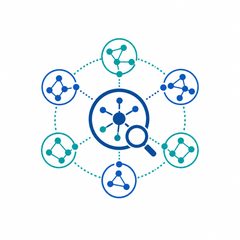
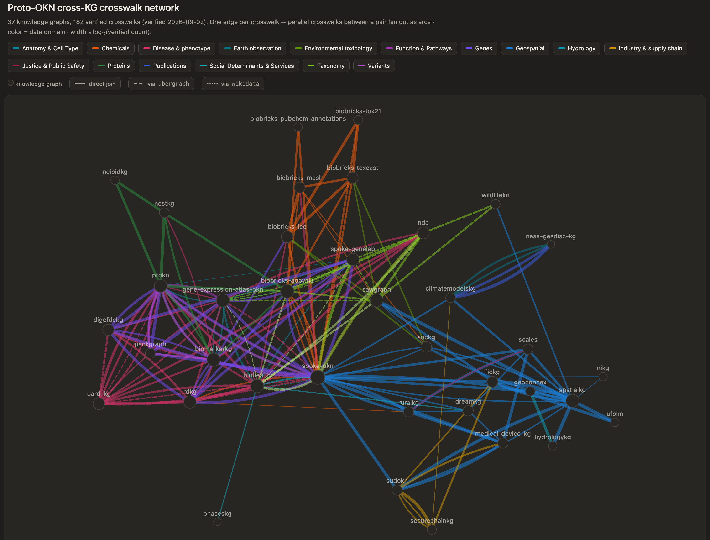

# mcp-okn

An MCP server for querying the **federated SPARQL endpoint**
(`https://apps.okn.us/federation/sparql`) over the
[Proto-OKN](https://www.proto-okn.net/) knowledge graphs.

It lets an LLM discover which knowledge graphs are relevant (from the
[okn-registry](https://registry.okn.us/registry/) descriptions), then run
SPARQL queries scoped to one or more named graphs of the form
`https://purl.org/okn/frink/kg/{shortname}`.

---

## About Proto-OKN

[Proto-OKN](https://www.proto-okn.net/) — the **Prototype Open Knowledge
Network** — is a National Science Foundation initiative (with NASA, NIH, the
National Institute of Justice, NOAA, and the U.S. Geological Survey) that funds
research teams to build a publicly accessible, interconnected set of data
repositories and knowledge graphs. The graphs span domains such as health, the
environment, criminal justice, space exploration, and supply-chain security, and
are served together over the **OKN** federated SPARQL endpoint that this server
queries. The [okn-registry](https://registry.okn.us/registry/) catalogs
the participating knowledge graphs.

---

## How the pieces fit together

This repository ships one MCP server, two Agent Skills, and relies on two external
literature MCPs — each with a distinct role:

| Component | Role |
|---|---|
| <br>**[mcp-okn](#connecting-your-client)** | Federated OKN query service: discovers the relevant Proto-OKN graphs, writes SPARQL scoped to named graphs, aligns across KGs via crosswalks, and returns grounded rows with provenance and transcripts. |
| <br>**[okn-report-style](#skills)** | Report & reproducibility skill: turns an OKN analysis into a polished, reproducible deliverable (Markdown / HTML / Excel / figures / maps), tracking sources, versions, queries, and caveats. |
| <br>**[okn-bioanalysis](#skills)** | Biomedical workflow skill: cross-KG analysis of genes, diseases, chemicals, and drugs — enrichment, ortholog projection, mechanistic maps — ranking hypotheses by evidence and calling the literature MCPs to validate. |
| <br>**[PubMed & Paperclip](#literature-comparison-connectors-pubmed--paperclip)** | Literature evidence validation: search PubMed and full-text collections, corroborate OKN-derived claims against sources, add citations, and flag conflicts and uncertainty. |

**Complementary by design:** the skills augment `mcp-okn`, which queries the OKN;
`okn-bioanalysis` can call PubMed & Paperclip for literature evidence validation, and
`okn-report-style` turns the results into reproducible deliverables.

---

## Examples

### Example prompts

Once the server is configured in your MCP client (see
[Connecting your client](#connecting-your-client)), just ask in natural language — the assistant
picks the graphs, writes the SPARQL, and combines the results for you. Some
prompts to try:

- *"List all Proto-OKN knowledge graphs as a table of shortname and description."* — [Result](docs/crosswalks/proto-okn-knowledge-graphs.md)
- *"List all verified crosswalks, grouped by domain, with an example of what each answers."* — [Result](docs/crosswalks/proto-okn-crosswalk-inventory.md)
- *"For each crosswalk, list the join key and the SPARQL skeleton."* — [Result](docs/crosswalks/crosswalks_sparql_skeletons.md)
- *"Give a high-level overview of the spoke-genelab knowledge graph — its main classes and relationships — and draw the schema diagram."* — [Result](docs/spoke-genelab-schema.png)
- *"Which genes does rdkg associate with autism spectrum disorder?"* — [Result](docs/crosswalks/crosswalks_examples/disease06_q1_spoke-rdkg_autism-genes.md)
- *"What is the maximum PFAS measurement in each county?"* — [Result](docs/crosswalks/crosswalks_examples/geospatial04_q1_sawgraph_spatialkg_pfas_max_by_county.md)
- *"How do I join spoke-okn and prokn? Show the verified recipe and shared identifier."* — [Result](docs/crosswalks/spoke-prokn-join.md)
- *"Which knowledge graphs supply GO, pathway, or trait annotations for a gene I can join on Entrez?"* — uses `find_context_sources` to list every supplier with its join key and size
- *"What version of prokn is loaded, and when was it last updated?"* — reads the `okn-void` provenance via `get_kg_version`
- *"Create a chat transcript of this analysis."* — create a transcript in a downloadable Markdown file
- *"Create a chat transcript of this analysis in PDF format."* — the server returns Markdown and the client converts the `.md` to a `.pdf` file (Claude Desktop / claude.ai)

### Crosswalk queries & transcripts

A **crosswalk** is a verified way to join two (or three) Proto-OKN knowledge
graphs on a shared identifier — for example linking a disease in one graph to the
genes another graph associates with it via a common MONDO or DOID id. Because the
graphs are built by different teams on different ontologies, the value of the
federation is in these connections: a crosswalk is an *integration opportunity*
where a question one graph can't answer alone becomes answerable by combining two.
This section catalogs the verified crosswalks and shows the queries that exercise
them.

A visual map of the whole network — all 162 crosswalks across 35 graphs, drawn as
direct KG-to-KG edges (edge width ∝ log of the verified join count). Each crosswalk is
its own edge, so multiple crosswalks between the same pair of graphs fan out as parallel
arcs. Identifier-bridged joins (e.g. `DOID↔MONDO` via `ubergraph`, `HGNC→Entrez` via
`wikidata`) are shown as direct edges with the bridge noted in the label and the line
styled (dashed for an `ubergraph` bridge, dotted for `wikidata`, solid for a direct join).

> **▶ Click the image to open the interactive, zoomable network.**

[](https://sbl-sdsc.github.io/mcp-okn/docs/crosswalks/crosswalk-network.html)

Three resources, each backed by live federated SPARQL joins verified to actually
answer the question (biomedical claims checked against PubMed / Paperclip;
geospatial and industrial joins against their authoritative shared standard):

- **[Proto-OKN Crosswalk Inventory](docs/crosswalks/proto-okn-crosswalk-inventory.md)**
  — a single-page map of the **verified crosswalks**: the joined KGs, shared
  key, row count, and a one-line note on what each answers. Start here to see which
  graphs connect and on what identifier.
- **[Cross-KG crosswalk catalog](docs/crosswalks/crosswalks_example.md)** —
  **328 example questions** worked end-to-end, each with a full transcript (the live
  SPARQL and its results), across 15 domains (Anatomy & Cell Type, Chemicals, Disease &
  Phenotype, Earth Observation, Environmental Toxicology, Function & Pathways, Genes,
  Geospatial, Hydrology, Industry & Supply Chain, Justice & Public Safety, Proteins,
  Publications, Social Determinants & Services, Taxonomy). Every crosswalk is now worked
  twice — the inventory carries
  **324 questions — two for every one of the 162 crosswalks** — and the catalog has a
  transcript behind each, plus four questions on two extra stems (a second example on the
  spoke-genelab×spoke-okn Entrez axis, and the three-way gene dossier whose clique row was
  retired).
- **[Multi-domain integration catalog](docs/crosswalks/multi-domain-examples.md)**
  — 24 use cases that fuse *different* domains (e.g. toxicology × transcriptomics
  × clinical disease, or PFAS sampling × hydrology × public health).

Every catalog row links to a standalone, replayable transcript — the prompt, the
answer, and every verbatim SPARQL query with its result. Here are a few examples
from the crosswalk catalog:

| Question | Knowledge graphs | Transcript |
|---|---|---|
| Which genes does rdkg associate with autism spectrum disorder (bridged DOID↔MONDO via ubergraph)? | spoke-okn × rdkg × ubergraph | [md](docs/crosswalks/crosswalks_examples/disease06_q1_spoke-rdkg_autism-genes.md) |
| AOP target genes differentially expressed in gene-expression-atlas-okn disease studies | biobricks-aopwiki × gene-expression-atlas-okn | [md](docs/crosswalks/crosswalks_examples/genes01_q1_aopwiki-gxa_aop-targets-de-disease.md) |
| Maximum PFAS measurement by county | sawgraph × spatialkg | [md](docs/crosswalks/crosswalks_examples/geospatial04_q1_sawgraph_spatialkg_pfas_max_by_county.md) |
| Diabetes gene dossier — pankgraph genes × gene-expression-atlas-okn expression × spoke-okn disease | gene-expression-atlas-okn × pankgraph × spoke-okn | [md](docs/crosswalks/multidomain_examples/multi-domain01_diabetes_gene_dossier.md) |

These transcripts are produced by `create_chat_transcript` and can be re-run
against the endpoint with `scripts/replay_transcript.py`.
The catalogs were generated by driving the model with the
[crosswalk generation prompt](docs/crosswalks/crosswalks_prompt.md) — list every
`list_crosswalks` recipe, write two research questions per crosswalk, run and
verify each as live SPARQL, and validate the findings against the literature.

### Case studies

Six end-to-end analyses that federate many Proto-OKN graphs into a single
evidence-backed map — five of a disease's biology (genes, variants,
pathways/gene sets, drugs, altered-activity signatures, and clinical/biomarker
features), and one of environmental PFAS source attribution (detections
co-located with regulated facilities, resolved to chemical identity, functional
use, and toxicological coverage) — each finding tagged with its source(s) and
evidence kind, then ranked by cross-source agreement. Every case study ships an
interactive HTML report, a reproducibility record preserving every verbatim
SPARQL query, and an Excel workbook.

> [!NOTE]
> **Prerequisites for reproducing a case study:**
> - The two [Skills](#skills) — `okn-bioanalysis` (analysis) + `okn-report-style` (report format).
> - The **PubMed** and **Paperclip** MCP connectors — [URLs and setup](#literature-comparison-connectors-pubmed--paperclip) (literature-comparison step only).

| Case study | Report | Literature Comparison | Data | Reproducibility |
|---|---|---|---|---|
| **Type 2 diabetes** — 16 KGs, 2,117 genes (381 multi-source) | [HTML](https://sbl-sdsc.github.io/mcp-okn/docs/examples/Diabetes/Diabetes_report.html) | [md](docs/examples/Diabetes/Diabetes_literature_comparison.md) | [xlsx](docs/examples/Diabetes/Diabetes_results.xlsx) | [md](docs/examples/Diabetes/Diabetes_reproducibility.md) |
| **Alzheimer's disease** — 8 KGs, 2,662 genes (318 multi-source) | [HTML](https://sbl-sdsc.github.io/mcp-okn/docs/examples/Alzheimers/Alzheimers_report.html) | [md](docs/examples/Alzheimers/Alzheimers_literature_comparison.md) | [xlsx](docs/examples/Alzheimers/Alzheimers_results.xlsx) | [md](docs/examples/Alzheimers/Alzheimers_reproducibility.md) |
| **Multiple sclerosis** — 14 KGs, 2,397 genes (52 Tier A) | [HTML](https://sbl-sdsc.github.io/mcp-okn/docs/examples/MS/MS_report.html) | [md](docs/examples/MS/MS_literature_comparison.md) | [xlsx](docs/examples/MS/MS_results.xlsx) | [md](docs/examples/MS/MS_reproducibility.md) |
| **Spaceflight-induced bone loss** — 8 KGs, 2,686-gene flight signature (777 core) | [HTML](https://sbl-sdsc.github.io/mcp-okn/docs/examples/Bone-Health/Bone-Health_report.html) | [md](docs/examples/Bone-Health/Bone-Health_literature_comparison.md) | [xlsx](docs/examples/Bone-Health/Bone-Health_results.xlsx) | [md](docs/examples/Bone-Health/Bone-Health_reproducibility.md) |
| **Spaceflight-associated neuro-ocular syndrome (SANS)** — 6 KGs, 169-gene cross-species core | [HTML](https://sbl-sdsc.github.io/mcp-okn/docs/examples/SANS/SANS_report.html) | [md](docs/examples/SANS/SANS_literature_comparison.md) | [xlsx](docs/examples/SANS/SANS_results.xlsx) | [md](docs/examples/SANS/SANS_reproducibility.md) |
| **PFAS source prioritization** — 5 KGs, 2,949 S2 cells, 12,714 co-located facilities | [HTML](https://sbl-sdsc.github.io/mcp-okn/docs/examples/PFAS/PFAS_report.html) | [md](docs/examples/PFAS/PFAS_literature_comparison.md) | [xlsx](docs/examples/PFAS/PFAS_results.xlsx) | [md](docs/examples/PFAS/PFAS_reproducibility.md) |
| **Bisphenol chemical exposome** — 7 KGs, 13 bisphenol analogues, 183 target genes (186 consensus pairs) | [HTML](https://sbl-sdsc.github.io/mcp-okn/docs/examples/Bisphenol-Exposome/Bisphenol-Exposome_report.html) | [md](docs/examples/Bisphenol-Exposome/Bisphenol-Exposome_literature_comparison.md) | [xlsx](docs/examples/Bisphenol-Exposome/Bisphenol-Exposome_results.xlsx) | [md](docs/examples/Bisphenol-Exposome/Bisphenol-Exposome_reproducibility.md) |

Each report's Markdown source sits beside it in `docs/examples/`.

---

## Connecting your client

The server is hosted at **`https://apps.okn.us/okn-mcp-dev/mcp`** — point any MCP
client at that URL, no local install required. (For a local install instead, see
[Local installation](#local-installation).)

### Claude Desktop

1. Open **Settings → Connectors → Add custom connector**.
2. Name it `mcp-okn-dev` and enter the URL `https://apps.okn.us/okn-mcp-dev/mcp`.
3. Click **Configure** and set the tool permissions to **Always allow**.
4. In a new chat, click the `+` icon and enable the `mcp-okn-dev` toggle.

> A Claude Pro or Max subscription is required for MCP connectors in Claude Desktop.

### Claude Code

Register it from the CLI:

```bash
claude mcp add --transport http mcp-okn-dev https://apps.okn.us/okn-mcp-dev/mcp
```

Or add it to `.mcp.json` in your project root (or `~/.claude/settings.json` for
universal access):

```json
{
  "mcpServers": {
    "mcp-okn-dev": {
      "type": "url",
      "url": "https://apps.okn.us/okn-mcp-dev/mcp"
    }
  }
}
```

Verify with `/mcp` — you should see `mcp-okn-dev` listed as connected.

### ChatGPT

Supported in the ChatGPT web app at <https://chatgpt.com>.

1. Sign in to <https://chatgpt.com>.
2. Click your profile name/avatar.
3. Open **Settings**.
4. Go to **Apps**.
5. Open **Advanced settings**.
6. Turn on **Developer mode** (required for custom MCP apps in ChatGPT).
7. Return to **Apps**.
8. Click **Create app**.
9. Enter the MCP app details:
   - **Name:** `mcp-okn-dev`
   - **URL:** `https://apps.okn.us/okn-mcp-dev/mcp`
10. Save or create the app.
11. Start a new chat.
12. Click the **+** button in the message box.
13. Select **mcp-okn-dev** from the list of available apps/tools.
14. Turn **Web search** off before testing, so ChatGPT uses the MCP app rather than web search.
15. Run the verification prompt. If ChatGPT returns a graph list, the MCP app is working.

> A subscription is required for MCP connectors in ChatGPT.

### VS Code + GitHub Copilot

Use MCP in Agent mode with the GitHub Copilot extension, with the same URL:
`https://apps.okn.us/okn-mcp-dev/mcp`.

### Literature-comparison connectors (PubMed + Paperclip)

The case studies' **Comparison with prior work** step checks each finding against
the primary literature, which needs two additional MCP connectors beyond the
mcp-okn server:

- **PubMed** — `https://pubmed.mcp.claude.com/mcp`
- **Paperclip** — `https://paperclip.gxl.ai/mcp`

Add them the same way as the mcp-okn server — in Claude Desktop / claude.ai via
**Settings → Connectors → Add custom connector**, or from Claude Code:

```bash
claude mcp add --transport http pubmed https://pubmed.mcp.claude.com/mcp
claude mcp add --transport http paperclip https://paperclip.gxl.ai/mcp
```

These are needed only to reproduce that one step; the rest of each case study runs
on the mcp-okn server alone.

---

## Skills

Two optional [Agent Skills](https://docs.claude.com/en/docs/claude-code/skills) ship
in the [`skills/`](skills/) directory. They teach a client the repeatable
methodology for working with the `mcp-okn` tools, so you get consistent analyses and
report deliverables without re-explaining conventions each time:

- **[`okn-report-style`](skills/okn-report-style/)** — layout, figure, and style
  conventions for turning any OKN case study into a polished, reproducible report
  deliverable (interactive HTML + Markdown + multi-sheet Excel + figures + maps).
- **[`okn-bioanalysis`](skills/okn-bioanalysis/)** — methodology for biomedical
  knowledge-graph analysis and cross-KG hypothesis generation over the OKN
  federation's bio graphs (genes, proteins, diseases, phenotypes, pathways,
  chemicals, drugs, enrichment, ortholog projection, and linking bio entities to
  place-based data via geography).

Each skill is a self-contained folder: a `SKILL.md` plus `references/` and
`scripts/`. A ready-to-upload zip of each is also committed for convenience:

- [`skills/okn-report-style.zip`](skills/okn-report-style.zip)
- [`skills/okn-bioanalysis.zip`](skills/okn-bioanalysis.zip)

### Supported clients

Agent Skills work in these Claude clients:

| Client | Install method | Notes |
| --- | --- | --- |
| **Claude Desktop** (macOS / Windows) | Upload the zip under Settings → Capabilities → Skills | Pro, Max, Team, or Enterprise |
| **claude.ai** (web) | Upload the zip under Settings → Capabilities → Skills | Pro, Max, Team, or Enterprise |
| **Claude Code** (CLI + IDE extensions) | Copy the folder into `.claude/skills/` or `~/.claude/skills/` ([see below](#claude-code-1)) | Free tier and up |
| **Claude Agent SDK** | Point the SDK at the skill folder | For building custom agents |
| **Claude Developer Platform** (API) | Load via the code-execution / Skills API | For programmatic use |

### Claude Code

Download the skills straight from this repo into your personal skills directory
(available in every project on this machine) — no clone required. Run the block
for whichever skills you want:

```bash
mkdir -p ~/.claude/skills && cd ~/.claude/skills

# okn-report-style
curl -sL "https://raw.githubusercontent.com/sbl-sdsc/mcp-okn/main/skills/okn-report-style.zip" -o okn-report-style.zip
unzip -oq okn-report-style.zip && rm okn-report-style.zip

# okn-bioanalysis
curl -sL "https://raw.githubusercontent.com/sbl-sdsc/mcp-okn/main/skills/okn-bioanalysis.zip" -o okn-bioanalysis.zip
unzip -oq okn-bioanalysis.zip && rm okn-bioanalysis.zip
```

For a project-scoped install (shared with a repo), swap `~/.claude/skills` for
`.claude/skills` in your project root.

Verify with `/skills` — you should see `okn-report-style` and `okn-bioanalysis`
listed. Claude invokes a skill automatically when a task matches its description.

---

## Local installation

To run the server yourself instead of using the hosted service:

### Requirements

Install **[uv](https://docs.astral.sh/uv/)** (see the
[installation guide](https://docs.astral.sh/uv/getting-started/installation/)),
then clone this repo:

```bash
git clone https://github.com/sbl-sdsc/mcp-okn.git
```

### Register the server

**Working inside this repo?** It ships a project-scoped [`.mcp.json`](.mcp.json), so
Claude Code offers the **local** server automatically — no registration needed. Use it
when developing: it serves the crosswalk catalog from your working tree, whereas the
hosted `mcp-okn-dev` endpoint serves whatever was last deployed and will not reflect
local edits to `crosswalks.json` until it is redeployed.

For Claude Code, register it from the CLI:

```bash
claude mcp add mcp-okn -- uv --directory /path/to/mcp-okn run mcp-okn
```

Or add it to any MCP client's config (e.g. Claude Desktop `claude_desktop_config.json`):

```json
{
  "mcpServers": {
    "mcp-okn": {
      "command": "uv",
      "args": ["--directory", "/path/to/mcp-okn", "run", "mcp-okn"]
    }
  }
}
```

Replace `/path/to/mcp-okn` with the absolute path to your checkout.

---

## Tools and resources

### Tools

The tools follow a typical analysis arc — **discover → inspect → plan a join →
query → record**. The single table below is grouped in that order.

| Tool | Purpose |
| --- | --- |
| **1. Discover graphs** | |
| `list_kgs` | List all KGs with `shortname`, `title`, `description`, `homepage`, `named_graph`, and a `payload` list — the curated context types each graph **supplies** (e.g. `digcfdekg` → `gene, gene_set, trait, disease`), so you judge a graph by what it carries, not its name. Served from a bundled snapshot for instant cold start. |
| `describe_kg(shortname, long_description=False)` | Full registry doc (frontmatter + prose) for one KG, for deeper context. Set `long_description=True` for the registry's ~150-word prose body — useful for picking among near-overlapping KGs. For `spoke-genelab`, also appends its [spaceflight assay-comparison rules](#spoke-genelab-spaceflight-assay-comparisons). |
| `get_kg_version(shortname=None)` | A KG's release `version` and `last_updated` (ISO-8601 timestamp) — read live from the `okn-void` meta-graph's VoID provenance (`pav:version`, `pav:lastUpdatedOn`). Omit `shortname` for every KG that records provenance (39 of 42), sorted by shortname. Use it to check how current a graph is or cite the exact version behind an analysis. |
| **2. Inspect a graph's schema and identifiers** | |
| `get_schema(shortname, compact=True)` | Schema for one KG — classes, predicates, edge properties (with reification query templates), and node properties. Uses curated metadata when available, else probes the endpoint for distinct classes/predicates. Call **before** writing a query. Returns `usage_notes` (guidance + a reusable SPARQL snippet) for KGs with query-time domain rules, e.g. [`spoke-genelab`](#spoke-genelab-spaceflight-assay-comparisons). |
| `visualize_schema(shortname)` | Deterministic Mermaid `classDiagram` of a KG's schema, built server-side from `get_schema` — class boxes, labeled edges, and edge-property predicates as intermediary classes with typed fields (node classes light blue, edge classes orange, with a legend). When the curated metadata names predicates but not their endpoints, edges are recovered from the graph's `rdfs:domain`/`rdfs:range` scoped to the curated classes. Returns `mermaid_block` (already wrapped in a ` ```mermaid ` fence) — output it **verbatim**; don't redraw it as SVG/an image. Rendered examples: [spoke-genelab](docs/spoke-genelab-schema.png), [dreamkg](docs/dreamkg-schema.png), [rdkg](docs/rdkg-schema.png) ([details](docs/verification-visualize-schema.md)). |
| `probe_namespaces(shortname, predicate, sample=0)` | Report which identifier/ontology namespaces populate a predicate's objects. `get_schema` lists a KG's predicates but not which controlled vocabularies fill their values — call this before the main query whenever a predicate's objects are ontology terms (diseases, chemicals, genes, anatomy) to see the actual namespace distribution and pick the best identifier to join on. Exploratory — not logged. |
| `find_crosswalks(shortname, sample=0)` | Find ontology/database ids in a KG however they are encoded, profiling all three places at once: mapping predicates (`rdfs:seeAlso`, `owl:sameAs`, SKOS `*Match`, `oboInOwl:hasDbXref`), node IRIs that *are* the ontology term (`role="subject"`), and domain-specific predicates carrying an id (`role="object"`). The latter two are invisible to a mapping-predicate-only scan. Use whenever a KG seems to lack the identifier you need on its obvious predicates. |
| **3. Plan a cross-graph join** | |
| `list_crosswalks(include_examples=True)` | List **every** verified cross-KG integration point in one call — a global map of which graphs connect and on what shared key. Rows are grouped by `domain` (Genes, Geospatial, Disease & phenotype, …) and sorted by ontology, ready to render as a table. Each row is a compact summary (`domain`, connected `kgs` in join order by official shortname, `shared_key`, `bridge_kg`, `verified_count`, and an `example_question` by default; set `include_examples=False` for a terser list). Use `get_join_strategy(kg_a, kg_b)` for a single pair's full recipe. |
| `get_join_strategy(kg_a, kg_b=None)` | Look up a precomputed, hand-verified recipe for joining two KGs — predicates, roles, shared identifier, bridge graph, verified count, and a runnable `skeleton_query` (the example SPARQL to copy and build on; it already encodes the IRI rewrites). Call **before** writing a federated join. Returns `verified` / `known_non_join` / `unknown`; with `kg_b` omitted, lists every join touching `kg_a`. |
| `find_context_sources(want=None, join_key=None)` | Reverse capability index — the inverse of `get_join_strategy`. Answers "which KGs **supply** pathway / GO / trait / disease … for an entity I can join on `join_key`?" by combining the per-KG `payload` tags with the verified crosswalk table. Returns, per requested context type, the supplier KGs with predicate + shared key + verified join `size`, **sorted biggest-join-first**, plus a `payload_only` bucket (KGs that carry the type but key it differently, e.g. Ensembl vs Entrez). A requested type that yields an empty list is positive evidence nothing supplies it on that key — so you never conclude a context is "unavailable" without checking. |
| `taxon_overlap(kg_a, kg_b)` | Compose the NCBITaxon overlap between two hub KGs *through* `ubergraph`. Returns two runnable skeletons — `exact_id` (same taxon id) and `clade_membership` (kg_b taxa under kg_a's clades via `subClassOf*`, which can be far larger when one side is coarser-grained) — plus, for a pair with a precomputed non-zero overlap, the materialized counts under `materialized_overlap` (the same per-pair counts `list_crosswalks` surfaces in the NCBITaxon hub row). Run a skeleton with `sparql_query`. |
| `point_to_s2(lat, lng, level=13)` | Convert a lat/long point to its spatialkg/KWG S2 cell IRI (Level-13 default) — the deterministic primitive behind the spatial bridge. Use when a KG carries POINT coordinates but no S2 key and you need the cell IRI spatialkg stores. |
| `spatial_bridge(point_query, target_pattern, select_vars="*", extra_prefixes="", limit=500)` | Generic point→S2 bridge for **any** point-bearing graph that lacks a stored S2 key (sudokn is the first such graph). `point_query` must `SELECT ?site ?lat ?lng`; the server computes each cell in Python and injects `(?site ?cell)` as a `VALUES` block into a federated query whose `target_pattern` joins `?cell` to spatialkg/fiokg/sawgraph (e.g. county/FIPS). Nothing is persisted — the computed key lives only inside the request. |
| **4. Run queries** | |
| `sparql_query(query, format="json", exploratory=False, compact=False)` | Run a SPARQL query on the federation endpoint. Substantive results are logged for the transcript unless `exploratory=True`. Pass `compact=True` for a token-efficient json shape — `{"columns", "data", "count"}` with positional rows — instead of the default repeated-key `{"vars", "rows", "row_count"}` (affects only the returned payload, not the transcript). A bracketed `<https://schema.org/…>` IRI is canonicalized to the `http://` form most KGs store (string literals and `IRI(CONCAT(…))` are left as written). A few KGs store the `https://` form (nikg, ruralkg, ufokn); reach those predicates by binding the predicate as a variable and matching scheme-free, e.g. `FILTER(STRENDS(STR(?p),'schema.org/location'))`. |
| `expand_ontology_term(term, relation="subClassOf", direction="descendants", include_self=True, limit=1000)` | Expand an ontology term to its full subtree/closure via the `ubergraph` graph. |
| **5. Record a reproducible transcript** | |
| `reset_query_log()` | Clear the session query log. Call at the **start** of an analysis to scope a transcript. |
| `get_query_log()` | Return the queries logged so far this session (only those that returned rows and weren't exploratory). |
| `create_chat_transcript(model, exchanges, ...)` | Emit a reproducible markdown (or JSON) record of a session — prompts, answers, the verbatim queries + results that produced findings, and any `visualize_schema` diagrams. Call at the **end** of an analysis. |
| `create_reproducibility_record(model, supporting, ...)` | Emit a **lean** reproducibility record — header + the verbatim supporting queries + row counts + per-query diagrams (gated by size), no conversation prose or result tables. Small enough to return **inline** so it saves directly; use it for the reproducibility deliverable. `supporting` optionally curates the log to the queries that underpin the findings. |

### Resources

| Resource | Purpose |
| --- | --- |
| `transcript://session/latest` (`text/markdown`) | The most recent record rendered by `create_chat_transcript` **or** `create_reproducibility_record`, so a client can fetch/save the document directly (transport-agnostic; works for remote servers). Cleared by `reset_query_log`. |

---

## Development

### Design

- **[mcp-okn redesign](docs/mcp-okn-redesign.md)** (also as a [slide deck, PDF](docs/mcp-okn-redesign.pdf))
  — a side-by-side comparison of the previous **`mcp-proto-okn`** server and this
  **`mcp-okn`** redesign across query model, KG coverage, schema/registry handling,
  cross-graph joins, and reproducibility.

### Module layout

The package is organized by concern. `server.py` is a thin assembly point: it
imports the tool modules to trigger their `@mcp.tool()` registration and
re-exports their public symbols (so `from mcp_okn.server import ...` keeps
working). The shared `mcp` application instance lives in `app.py`, separate from
`server.py`, so the tool modules can import it without a circular dependency.

```
src/mcp_okn/
├── app.py            # the shared FastMCP `mcp` instance + INSTRUCTIONS
├── server.py         # assembly point: registers tools, re-exports, main()
├── registry.py       # KG discovery from the okn-registry (+ bundled snapshot)
├── schema.py         # get_schema / visualize_schema logic
├── sparql.py         # federation endpoint client + schema.org normalization
├── crosswalks.py     # curated cross-KG join table (data/crosswalks.json)
├── payloads.py       # curated per-KG payload tags (data/kg_payloads.json)
├── void.py           # per-KG version / last-updated from the okn-void graph
├── taxon.py          # NCBITaxon hub: taxon-overlap skeleton composition
├── session.py        # in-memory query/diagram log for transcripts
├── data/             # bundled snapshots: kgs.json, crosswalks.json, kg_payloads.json
└── tools/            # one module per concern; each registers via @mcp.tool()
    ├── _shared.py        # helpers used by >1 tool module (_to_uri, …)
    ├── discovery.py      # list_kgs, describe_kg, get_kg_version
    ├── schema_tools.py   # get_schema, visualize_schema
    ├── probe.py          # probe_namespaces, find_crosswalks
    ├── joins.py          # get_join_strategy, taxon_overlap, list_crosswalks, find_context_sources
    ├── query.py          # sparql_query, expand_ontology_term
    └── transcript.py     # reset/get_query_log, create_chat_transcript, create_reproducibility_record, resource
```

```bash
uv run python -m pytest       # unit tests (offline)
uv run ruff check .           # lint
uv run ruff format .          # auto-format (use --check in CI)
uv run mypy                   # type-check src/mcp_okn
# live smoke test:
uv run python -c "import asyncio; from mcp_okn.sparql import run_sparql; \
print(asyncio.run(run_sparql('SELECT ?s WHERE { ?s ?p ?o } LIMIT 3')))"
```

CI (`.github/workflows/ci.yml`) runs ruff lint, ruff format-check, and mypy on
every push/PR, plus the offline test suite on Python 3.10 and 3.12.

### Lint & formatting conventions

`ruff` is pinned in `uv.lock`, and CI lints/format-checks the **whole tree**, so a
ruff version bump can surface new findings across the repo — reconcile them in one
pass when bumping. Scope (see `[tool.ruff]` in `pyproject.toml`):

- **Excluded** (`extend-exclude`): `docs/reproduction/` and `docs/examples/` — one-off,
  throwaway figure/PDF/reproduction scripts, not maintained tooling.
- **Docstrings not required** (`D` ignored via `per-file-ignores`): `tests/`, `scripts/`,
  `benchmark/`, and the bundled `skills/*/scripts/` helpers. Everything else — chiefly
  `src/mcp_okn/` — is held to the full rule set.

When committing, **stage explicit paths** (`git add <path> …`), not `git add -A`: the
working tree often carries untracked worked-example artifacts under `docs/reproduction/`
that should not be swept into an unrelated commit.

Deferred improvements are tracked as
[GitHub issues](https://github.com/sbl-sdsc/mcp-okn/issues).

### Verification notes

Reproducible checks of behaviors that aren't covered by the offline unit tests:

- [schema.org http/https normalization](docs/verification-schema-org-normalization.md)
  — a bracketed `<https://schema.org/…>` IRI is canonicalized to `http`, so a query
  written with the `https` form still hits `http`-stored data (dreamkg `schema:Rating`
  → 3762), while string literals / `IRI(CONCAT(…))` are left intact (see below).
- [visualize_schema rendering](docs/verification-visualize-schema.md) — the
  generated Mermaid renders cleanly as a class diagram via `mermaid-cli` across
  all three schema paths (curated, class-only, probe fallback), and survives the
  `create_chat_transcript` round-trip.
- [transcript MCP resource](docs/verification-transcript-resource.md) — the
  `transcript://session/latest` resource serves the full document via the
  resource API, with its embedded diagram still rendering.

#### schema.org predicates stored under the non-canonical `https` form

A few graphs store schema.org terms under the `https://` form. The canonicalization
hits **only bracketed IRIs**, so those predicates are unreachable by IRI (the bracketed
`https` form is rewritten to `http`, which the data isn't), but match when the predicate
is bound as a variable or the IRI is rebuilt from a string literal (now preserved).
Verified live against the federation:

| Graph (predicate) | `<https://schema.org/X>` (bracketed) | `IRI(CONCAT('https://schema.org/','X'))` | `STRENDS(STR(?p),'schema.org/X')` |
| --- | --- | --- | --- |
| `nikg` (`location`) | 0 | 296,189 | 296,189 |
| `ruralkg` (`postalCode`) | 0 | 9,037 | 9,037 |
| `ufokn` (`value`, level-13 sample) | 0 | 5/5 (`LIMIT 5`) | 5/5 |

In each case the `IRI(CONCAT)` and `STRENDS` forms agree (same rows / same decimal S2
ids for ufokn) while the bracketed IRI returns 0 — confirming the literal-preservation
fix and the variable-predicate workaround documented in the `ruralkg`/`ufokn` crosswalk
notes.

#### spoke-genelab spaceflight assay comparisons

`spoke-genelab` (NASA GeneLab) models each differential measurement as an `Assay`
with two arms — `factor_space_1`/`factor_space_2` (the condition labels) and
`factors_1`/`factors_2` (lists bundling the condition label *plus* extra factors
like dose, time, sex, strain). Reading any assay as a "spaceflight effect" is
wrong; two domain rules apply:

1. **Direction** — keep only `factor_space_1 = "Space Flight"` **and**
   `factor_space_2 = "Ground Control"`. Drop the reverse and every other pairing.
   Verified live: **680** assays are SF→GC vs **664** the reverse (plus SF/SF
   1244, GC/GC 424, and Basal/Vivarium pairings). With this orientation group 1 =
   Space Flight, so `log2fc`/`methylation_diff`/`lnfc` > 0 means up in spaceflight.
2. **Comparability** — two separate `Assay` records are comparable only if they
   share the same materials (prefer `material_id_1`/`material_id_2`) **and** the
   same `factors_1`/`factors_2` *after* the experimental-condition labels are
   stripped, then test the remaining factors for equality (a shared extra factor
   is allowed if present on both sides).

Stripping removes exactly **15** distinct values, verified live: the spelled-out
labels (`Space Flight`, `Ground Control`, `Basal Control`, `Vivarium Control`,
`Cell Culture Control`; case-insensitive, so `Ground control`/`Vivarium control`
match too) and the short group codes via the **anchored** regex
`^(GC|FLT|VIV|BSL|CC)(_C[0-9]+)?$` (`GC`, `FLT`, `VIV_C2`, `BSL_C1`, `CC_C1`, …).
The anchoring is deliberate: real factors that merely contain a control word —
`Hardware 1G Ground Control`, `Ground Control Rerun`, `HLU_IR`
(hindlimb-unloading) — stay in the list as legitimate distinguishing factors.

The rules live once in `src/mcp_okn/contrasts.py` (guidance prose + a reusable
comparability-signature SPARQL snippet) and are surfaced in the server
`INSTRUCTIONS`, as `usage_notes` on `get_schema("spoke-genelab")`, and appended to
`describe_kg("spoke-genelab")`.

### KG snapshot

`list_kgs` serves a static snapshot bundled at `src/mcp_okn/data/kgs.json` (~42
KGs), so the first call returns instantly without fetching the individual
registry files. The live registry is only contacted when the snapshot is missing
(or when an internal `refresh=True` is passed). To refresh the snapshot after the
registry changes:

```bash
uv run python scripts/refresh_snapshot.py
```

KGs that are in the registry but not actually loaded under their expected
federation named graph (currently `semopenalex`) are filtered
out, so `list_kgs` only returns graphs that are queryable.

The curated crosswalk table is edited at `metadata/crosswalks.json` and bundled to
`src/mcp_okn/data/crosswalks.json` by the same `refresh_snapshot.py` run. Two helpers
recompute its live-verified counts against the federation and write them back:
`scripts/verify_skeletons.py` (per-crosswalk `skeleton_query` counts) and
`scripts/refresh_taxon_overlaps.py` (the NCBITaxon hub's pairwise `exact_id` + clade
counts — `--inject` to write, `--pair A B` for one pair). Run `refresh_snapshot.py`
afterwards to sync the bundled copy.

### Payload tags

Each KG carries curated `payload` tags — the context types it **supplies** —
edited at `metadata/kg_payloads.json` and bundled to
`src/mcp_okn/data/kg_payloads.json` by `refresh_snapshot.py` (which validates that
every tag is a defined vocabulary term and every servable KG is tagged). These tags
are partly derived from each KG's entity schema, which `get_schema` fetches live
from the upstream `*_entities.csv` files — so a KG's schema can change under the
tags. `scripts/check_payload_drift.py` guards against that: it fingerprints each
KG's live class + predicate labels and diffs them against a committed baseline
(`metadata/schema_fingerprints.json`), flagging KGs whose schema moved so their
tags can be re-reviewed. Run it after an upstream schema update; re-ground any
affected tags, then `--update` to accept the new baseline.

```bash
uv run python scripts/check_payload_drift.py            # report drift; exit 1 if any
uv run python scripts/check_payload_drift.py --update   # accept current schemas as baseline
```

---

## Citation

`mcp-okn` is the next-generation successor to
[`mcp-proto-okn`](https://github.com/sbl-sdsc/mcp-proto-okn). If you use this
software, please cite the paper describing that predecessor:

> Rose, P. W., Good, B. M., Saravia-Butler, A. M., Nelson, C. A., Balhoff, J. P.,
> Kebede, Y., Whetzel, P. L., Bizon, C., Su, A. I., & Baranzini, S. E. (2026).
> *mcp-proto-okn: Natural-language access to open scientific knowledge graphs
> through the Model Context Protocol*. arXiv:2605.30283.
> <https://arxiv.org/abs/2605.30283>

```bibtex
@misc{rose2026mcpprotookn,
  title         = {mcp-proto-okn: Natural-language access to open scientific knowledge graphs through the Model Context Protocol},
  author        = {Rose, Peter W. and Good, Benjamin M. and Saravia-Butler, Amanda M. and Nelson, Charlotte A. and Balhoff, James P. and Kebede, Yaphet and Whetzel, Patricia L. and Bizon, Christopher and Su, Andrew I. and Baranzini, Sergio E.},
  year          = {2026},
  eprint        = {2605.30283},
  archivePrefix = {arXiv},
  primaryClass  = {cs.AI},
  url           = {https://arxiv.org/abs/2605.30283}
}
```

---

## Funding

- **National Science Foundation** Award [#2333819](https://www.nsf.gov/awardsearch/show-award?AWD_ID=2333819): "Proto-OKN Theme 1: Connecting Biomedical information on Earth and in Space via the SPOKE knowledge graph"
- **National Science Foundation** Award [#2535091](https://www.nsf.gov/awardsearch/show-award?AWD_ID=2535091): "Proto-OKN Theme 2: OKN-Fabric"

---

## License

This project is licensed under the [BSD 3-Clause License](LICENSE).
