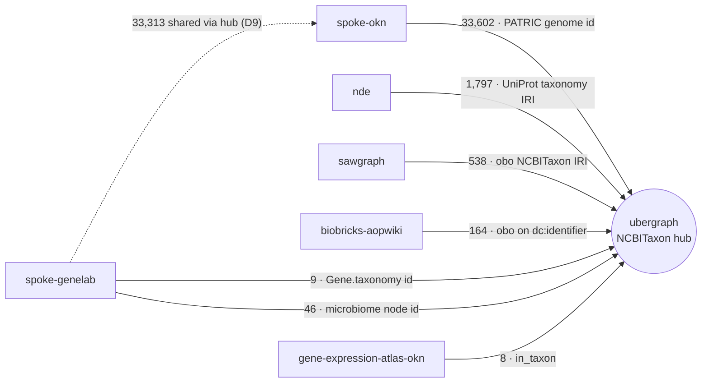

# mcp-okn

An MCP server for querying the **FRINK federated SPARQL endpoint**
(`https://frink.apps.renci.org/federation/sparql`) over the
[Proto-OKN](https://www.proto-okn.net/) knowledge graphs.

It lets an LLM discover which knowledge graphs are relevant (from the
[okn-registry](https://github.com/frink-okn/okn-registry) descriptions), then run
SPARQL queries scoped to one or more named graphs of the form
`https://purl.org/okn/frink/kg/{shortname}`.

> **Only the federation endpoint is used.** The per-KG SPARQL/TPF endpoints in
> the registry (Apache Jena instances) are intentionally not exposed — they time
> out or run out of memory on complex queries.

## Tools

| Tool | Purpose |
| --- | --- |
| `list_kgs` | List all KGs with `shortname`, `title`, `description`, `homepage`, and `named_graph`. Served from a bundled snapshot for instant cold start. |
| `describe_kg(shortname, long_description=False)` | Full registry doc (frontmatter + prose) for one KG, for deeper context. Set `long_description=True` for the registry's ~150-word prose body — useful for picking among near-overlapping KGs. |
| `get_schema(shortname, compact=True)` | Schema for one KG — classes, predicates, edge properties (with reification query templates), and node properties. Uses curated metadata when available, else probes the endpoint for distinct classes/predicates. Call **before** writing a query. |
| `visualize_schema(shortname)` | Deterministic Mermaid `classDiagram` of a KG's schema, built server-side from `get_schema` — class boxes, labeled edges, and edge-property predicates as intermediary classes with typed fields (node classes light blue, edge classes orange, with a legend). When the curated metadata names predicates but not their endpoints, edges are recovered from the graph's `rdfs:domain`/`rdfs:range` scoped to the curated classes. Returns `mermaid_block` (already wrapped in a ` ```mermaid ` fence) — output it **verbatim**; don't redraw it as SVG/an image. Rendered examples: [spoke-genelab](docs/spoke-genelab-schema.png), [dreamkg](docs/dreamkg-schema.png), [rdkg](docs/rdkg-schema.png) ([details](docs/verification-visualize-schema.md)). |
| `probe_namespaces(shortname, predicate, sample=0)` | Report which identifier/ontology namespaces populate a predicate's objects. `get_schema` lists a KG's predicates but not which controlled vocabularies fill their values — call this before the main query whenever a predicate's objects are ontology terms (diseases, chemicals, genes, anatomy) to see the actual namespace distribution and pick the best identifier to join on. Exploratory — not logged. |
| `find_crosswalks(shortname, sample=0)` | Find ontology/database ids in a KG however they are encoded, profiling all three places at once: mapping predicates (`rdfs:seeAlso`, `owl:sameAs`, SKOS `*Match`, `oboInOwl:hasDbXref`), node IRIs that *are* the ontology term (`role="subject"`), and domain-specific predicates carrying an id (`role="object"`). The latter two are invisible to a mapping-predicate-only scan. Use whenever a KG seems to lack the identifier you need on its obvious predicates. |
| `sparql_query(query, format="json", exploratory=False)` | Run a SPARQL query on the federation endpoint. Substantive results are logged for the transcript unless `exploratory=True`. A bracketed `<https://schema.org/…>` IRI is canonicalized to the `http://` form most KGs store (string literals and `IRI(CONCAT(…))` are left as written). A few KGs store the `https://` form (nikg, ruralkg, ufokn); reach those predicates by binding the predicate as a variable and matching scheme-free, e.g. `FILTER(STRENDS(STR(?p),'schema.org/location'))`. |
| `expand_ontology_term(term, relation="subClassOf", direction="descendants", include_self=True, limit=1000)` | Expand an ontology term to its full subtree/closure via the `ubergraph` graph. |
| `get_join_strategy(kg_a, kg_b=None)` | Look up a precomputed, hand-verified recipe for joining two KGs — predicates, roles, shared identifier, bridge graph, verified count, and a runnable `skeleton_query` (the example SPARQL to copy and build on; it already encodes the IRI rewrites). Call **before** writing a federated join. Returns `verified` / `known_non_join` / `unknown`; with `kg_b` omitted, lists every join touching `kg_a`. |
| `list_crosswalks(include_examples=True)` | List **every** verified cross-KG integration point in one call — a global map of which graphs connect and on what shared key. Rows are grouped by `domain` (Genes, Geospatial, Disease & phenotype, …) and sorted by ontology, ready to render as a table. Each row is a compact summary (`domain`, connected `kgs` in join order by official shortname, `shared_key`, `bridge_kg`, `verified_count`, and an `example_question` by default; set `include_examples=False` for a terser list). Use `get_join_strategy(kg_a, kg_b)` for a single pair's full recipe. |
| `taxon_overlap(kg_a, kg_b)` | Compose the NCBITaxon overlap between two hub KGs *through* `ubergraph`. Returns two runnable skeletons — `exact_id` (same taxon id) and `clade_membership` (kg_b taxa under kg_a's clades via `subClassOf*`, which can be far larger when one side is coarser-grained) — plus, for a pair with a precomputed non-zero overlap, the materialized counts under `materialized_overlap` (the same per-pair counts `list_crosswalks` surfaces in the NCBITaxon hub row). Run a skeleton with `sparql_query`. |
| `reset_query_log()` | Clear the session query log. Call at the **start** of an analysis to scope a transcript. |
| `get_query_log()` | Return the queries logged so far this session (only those that returned rows and weren't exploratory). |
| `create_chat_transcript(model, exchanges, ...)` | Emit a reproducible markdown (or JSON) record of a session — prompts, answers, the verbatim queries + results that produced findings, and any `visualize_schema` diagrams. Call at the **end** of an analysis. |

## Resources

| Resource | Purpose |
| --- | --- |
| `transcript://session/latest` (`text/markdown`) | The most recent transcript rendered by `create_chat_transcript`, so a client can fetch/save the document directly (transport-agnostic; works for remote servers). Cleared by `reset_query_log`. |

## Setup

```bash
uv sync
uv run mcp-okn   # starts the server on stdio
```

## Register with Claude Code

```bash
claude mcp add mcp-okn -- uv --directory /path/to/mcp-okn run mcp-okn
```

Or add to your MCP client config (e.g. Claude Desktop `claude_desktop_config.json`):

```json
{
  "mcpServers": {
    "mcp-okn": {
      "command": "uv",
      "args": ["--directory", "/path/to/mcp-okn", "run", "mcp-okn"]
    }
  }
}
```

Replace `/path/to/mcp-okn` with the absolute path to your checkout.

## Usage

A typical session walks the tools in order — **discover → inspect → query**.
Once the server is registered, just ask in natural language; the model drives
the tools. For example:

> *"Which UniProt diseases in ProKN have a MONDO cross-reference?"*

The model would:

1. **`list_kgs()`** → find `prokn` (the Protein Knowledge Network).
2. **`get_schema("prokn")`** → confirm it has a `up:Disease` class and that
   diseases carry `rdfs:seeAlso` cross-references (34 classes, 232 predicates).
3. **`sparql_query(...)`** → run the query scoped to the `prokn` named graph:

   ```sparql
   PREFIX up:   <http://purl.uniprot.org/core/>
   PREFIX rdfs: <http://www.w3.org/2000/01/rdf-schema#>
   SELECT DISTINCT ?disease ?mondo WHERE {
     GRAPH <https://purl.org/okn/frink/kg/prokn> {
       ?d a up:Disease ; rdfs:label ?disease ; rdfs:seeAlso ?mondo .
     }
   } LIMIT 3
   ```

   ```json
   {
     "vars": ["disease", "mondo"],
     "row_count": 3,
     "rows": [
       {"disease": "16p13.2 microdeletion syndrome",
        "mondo": "http://purl.obolibrary.org/obo/MONDO_0014805"},
       {"disease": "16p13.2 microdeletion syndrome",
        "mondo": "http://www.orpha.net/ORDO/Orphanet_643538"},
       {"disease": "16p13.2 microdeletion syndrome",
        "mondo": "https://www.omim.org/entry/616863"}
     ]
   }
   ```

To call the tools directly (e.g. from a script) without an MCP client:

```python
import asyncio
from mcp_okn import schema
from mcp_okn.sparql import run_sparql

async def main():
    print(await schema.get_schema("prokn"))          # inspect the schema
    result = await run_sparql("""
        PREFIX up:   <http://purl.uniprot.org/core/>
        PREFIX rdfs: <http://www.w3.org/2000/01/rdf-schema#>
        SELECT DISTINCT ?disease ?mondo WHERE {
          GRAPH <https://purl.org/okn/frink/kg/prokn> {
            ?d a up:Disease ; rdfs:label ?disease ; rdfs:seeAlso ?mondo .
          }
        } LIMIT 3""")
    print(result["row_count"], "rows")

asyncio.run(main())
```

## Example query

Scope each KG with its named graph (a single query may span several):

```sparql
PREFIX up:   <http://purl.uniprot.org/core/>
PREFIX rdfs: <http://www.w3.org/2000/01/rdf-schema#>
SELECT DISTINCT ?mondo ?label WHERE {
  GRAPH <https://purl.org/okn/frink/kg/prokn> {
    ?d a up:Disease ; rdfs:seeAlso ?mondo .
  }
}
```

Use the `ubergraph` graph to expand ontology terms, e.g. all subclasses of a
MONDO disease:

```sparql
GRAPH <https://purl.org/okn/frink/kg/ubergraph> {
  ?mondo rdfs:subClassOf+ <http://purl.obolibrary.org/obo/MONDO_0003847> .
}
```

### Cross-graph join through a bridge

Some graphs share no identifier directly but meet through a **bridge** graph.
For example, **OARD-KG** keys diseases on MONDO while **ProKN** annotates them
with OMIM; they join through `ubergraph`'s MONDO→OMIM cross-references. Ask
`get_join_strategy("oard-kg", "prokn")` for the verified skeleton — it returns
this runnable query (444 diseases on ProKN's curated `up:Disease`, verified):

```sparql
SELECT DISTINCT ?mondo ?omim WHERE {
  GRAPH <https://purl.org/okn/frink/kg/oard-kg> {            # MONDO diseases (either assoc side)
    { ?a <https://w3id.org/biolink/vocab/object> ?mondo }
    UNION { ?a <https://w3id.org/biolink/vocab/subject> ?mondo }
    FILTER(STRSTARTS(STR(?mondo), "http://purl.obolibrary.org/obo/MONDO_"))
  }
  GRAPH <https://purl.org/okn/frink/kg/ubergraph> {          # bridge: MONDO → OMIM
    ?mondo <http://www.geneontology.org/formats/oboInOwl#hasDbXref> ?curie .
    FILTER(STRSTARTS(STR(?curie), "OMIM:"))
  }
  # ubergraph stores OMIM:{id} CURIEs; ProKN stores https://www.omim.org/entry/{id} IRIs
  BIND(IRI(CONCAT("https://www.omim.org/entry/", REPLACE(STR(?curie), "^OMIM:", ""))) AS ?omim)
  GRAPH <https://purl.org/okn/frink/kg/prokn> {              # OMIM on rdfs:seeAlso, curated up:Disease only
    ?d a <http://purl.uniprot.org/core/Disease> ;
       <http://www.w3.org/2000/01/rdf-schema#seeAlso> ?omim .
  }
}
```

The `BIND` rebuild is the crux: a naive `OMIM:…` ↔ `omim.org/entry/…` join
silently returns nothing. Every verified crosswalk ships such a runnable
skeleton — see `get_join_strategy` / `list_crosswalks` above.

### The NCBITaxon taxonomy hub

`ubergraph` doubles as a shared **taxonomy hub**: six biological KGs identify
organisms by NCBI Taxonomy, so each joins ubergraph's precomputed taxonomy. That
lets you expand a clade *once* in ubergraph and pull the matching organisms — or
their genes, AOPs, datasets, strains — from any of them.



Solid edges are hub spokes (each KG ↔ ubergraph); the dashed edge is a cross-KG
join *composed through* the hub (D9). spoke-genelab has two spokes — model
organisms by id (9) and microbiome by node-IRI taxid (46).

| KG (spoke) | how it keys taxa | shared taxa |
|----|------------------|-------------|
| `spoke-okn` | PATRIC genome IRI `…/organism/{taxid}.{n}` (extract id) | 33,602 |
| `nde` | `schema:species` → `uniprot.org/taxonomy/{id}` (extract id) | 1,797 |
| `sawgraph` | `obo/NCBITaxon_` as `subClassOf` subject | 538 |
| `biobricks-aopwiki` | `obo/NCBITaxon_` on `dc:identifier` | 164 |
| `spoke-genelab` (microbiome) | NCBITaxon id in `Organism` node IRI `…/node/{taxid}` | 46 |
| `spoke-genelab` (model organisms) | `obo/NCBITaxon_` string literal on `Gene.taxonomy` (coerce to IRI) | 9 |
| `gene-expression-atlas-okn` | `obo/NCBITaxon_` on `biolink:in_taxon` | 8 |

The key form differs per KG — a direct IRI, an integer embedded in a genome id or
node IRI, a UniProt taxonomy IRI, or a string literal — so each crosswalk ships the
exact normalization. Ask `get_join_strategy("<kg>", "ubergraph")` for the runnable
skeleton.

Each KG's representation was audited to be the *complete* structured taxon set it
carries: sawgraph's count is its full `subClassOf` hierarchy (538 = 538), nde and
spoke-okn carry no `obo/NCBITaxon_` form at all (only UniProt / PATRIC ids), and
aopwiki's only structured key is `dc:identifier` (stray NCBI Taxonomy URLs in its
free-text HTML are not a join key). spoke-genelab is the **one** KG with two
representations — model-organism ids on `Gene.taxonomy` *and* microbiome taxids in
the `Organism` node IRI — both captured. Prefer id extraction over name resolution:
the node-IRI route is robust to ontology renames (e.g. Actinobacteria →
Actinomycetota) that an `rdfs:label` match silently drops.

Two KGs can also be joined **through** the hub by composing their spokes — and when
the two sides sit at different granularities (genus vs strain) that is the *only*
way, since they share no id until a clade is expanded. **`taxon_overlap(kg_a, kg_b)`**
composes two spokes on demand and returns two runnable skeletons: `exact_id` (same
NCBITaxon id on both sides) and `clade_membership` (one KG's taxa nested under the
other's via `subClassOf*`). The two can differ enormously — for `spoke-genelab` ×
`spoke-okn`, exact-id is **2** but clade-membership is **33,313** (spoke-genelab's
microbiome genera expanding down to spoke-okn's strains, also stored as crosswalk
D9) — a join impossible without the hub.

These pairwise counts are **materialized**, not just composable on demand:
`list_crosswalks` renders the NCBITaxon hub as **one row per non-zero pair** (in the
Taxonomy domain), each bridged through ubergraph (`kgs: [kg_a, ubergraph, kg_b]`) and
carrying both numbers as columns — `exact_id` (symmetric) and `clade_a_in_b` /
`clade_b_in_a` (directional) — so an agent identifying integration points sees the
verified per-pair overlap without a second call. The result also carries a
`taxon_clade_note` to render after the table explaining the two columns.
`taxon_overlap` echoes the same counts under `materialized_overlap`. Regenerate them
when a member KG is updated with `scripts/refresh_taxon_overlaps.py` (then
`refresh_snapshot.py` to bundle) — see [KG snapshot](#kg-snapshot).

Example — AOPs applicable to any rodent, clade expanded in ubergraph:

```sparql
SELECT DISTINCT ?aop ?taxon WHERE {
  GRAPH <https://purl.org/okn/frink/kg/ubergraph> {              # expand the clade
    ?taxon rdfs:subClassOf* <http://purl.obolibrary.org/obo/NCBITaxon_9989> .  # Rodentia
  }
  GRAPH <https://purl.org/okn/frink/kg/biobricks-aopwiki> {      # AOP taxonomic applicability
    ?aop <http://purl.org/dc/elements/1.1/identifier> ?taxon .
  }
}
```

## Reproducible transcripts

Every `sparql_query` / `expand_ontology_term` call that returns rows is logged
in-memory for the lifetime of the server process, so a session can be replayed
and audited without the model re-supplying queries from memory.

- Queries that **error** or return **no rows** are never logged.
- Pass `exploratory=True` to `sparql_query` to keep schema-probing or
  trial-and-error queries out of the log.
- Call `reset_query_log` at the **start** of an analysis to scope the log.
- Call `create_chat_transcript` at the **end** to render a markdown (or JSON)
  document: session provenance (date, model, endpoint), the knowledge graphs
  used, the conversation (prompts + your answers), and every logged query
  verbatim. Each turn is rendered in the mcp-proto-okn style — a 👤 **User**
  block and a 🧠 **Assistant** block separated by a rule. Up to `MAX_LOGGED_ROWS`
  (1000) rows are stored per query; the true row count is always preserved.
- By default only the **final** logged query's result rows are rendered;
  intermediate queries show their SPARQL and row count but omit the table, to
  keep the transcript focused on the queries that produced the findings. Pass
  `include_intermediate_rows=True` to render full results for every query.
  (Queries attached inline to an exchange via `queries` always render in full.)
- `visualize_schema` diagrams are logged too, and rendered in a **Schema
  visualizations** section (each in a ` ```mermaid ` block) — so a "visualize
  schema" turn shows up in the transcript without re-supplying the diagram. Pass
  `include_visualizations=False` to omit them, or attach a `mermaid` field to an
  exchange to place a diagram inline with that turn.
- The transcript is a standalone **document**. The model must **output the full
  markdown** — preferably as a Markdown **artifact** (Claude Desktop / claude.ai
  show artifacts in a side panel the user can save as `.md` or export to PDF),
  otherwise in a fenced ` ```markdown ` block. It must not claim a preview is
  "ready" without actually emitting the content. (An MCP server can't open a
  preview panel or create an artifact itself — it only returns the markdown;
  rendering it is the client/model's job.)
- The rendered markdown is **also published as an MCP resource**,
  `transcript://session/latest` (`text/markdown`), so a client can fetch and
  save the document directly — independent of how the model presents it, and
  transport-agnostic (works the same for a remote server). `reset_query_log`
  clears it along with the query/diagram log.
- Because every query is stored verbatim, a saved transcript is **replayable**.
  `scripts/replay_transcript.py` re-runs every query (from a `.md` or JSON
  transcript) against the endpoint and checks each row count against the
  recorded one:

  ```bash
  uv run python scripts/replay_transcript.py path/to/transcript.md
  ```

## Development

```bash
uv run python -m pytest       # unit tests (offline)
# live smoke test:
uv run python -c "import asyncio; from mcp_okn.sparql import run_sparql; \
print(asyncio.run(run_sparql('SELECT ?s WHERE { ?s ?p ?o } LIMIT 3')))"
```

### Verification notes

Reproducible checks of behaviors that aren't covered by the offline unit tests:

- [schema.org http/https normalization](docs/verification-schema-org-normalization.md)
  — a bracketed `<https://schema.org/…>` IRI is canonicalized to `http`, so a query
  written with the `https` form still hits `http`-stored data (dreamkg `schema:Rating`
  → 3762), while string literals / `IRI(CONCAT(…))` are left intact (see below).
- [visualize_schema rendering](docs/verification-visualize-schema.md) — the
  generated Mermaid renders cleanly as a class diagram via `mermaid-cli` across
  all three schema paths (curated, class-only, probe fallback), and survives the
  `create_chat_transcript` round-trip.
- [transcript MCP resource](docs/verification-transcript-resource.md) — the
  `transcript://session/latest` resource serves the full document via the
  resource API, with its embedded diagram still rendering.

#### schema.org predicates stored under the non-canonical `https` form

A few graphs store schema.org terms under the `https://` form. The canonicalization
hits **only bracketed IRIs**, so those predicates are unreachable by IRI (the bracketed
`https` form is rewritten to `http`, which the data isn't), but match when the predicate
is bound as a variable or the IRI is rebuilt from a string literal (now preserved).
Verified live against the federation:

| Graph (predicate) | `<https://schema.org/X>` (bracketed) | `IRI(CONCAT('https://schema.org/','X'))` | `STRENDS(STR(?p),'schema.org/X')` |
| --- | --- | --- | --- |
| `nikg` (`location`) | 0 | 296,189 | 296,189 |
| `ruralkg` (`postalCode`) | 0 | 9,037 | 9,037 |
| `ufokn` (`value`, level-13 sample) | 0 | 5/5 (`LIMIT 5`) | 5/5 |

In each case the `IRI(CONCAT)` and `STRENDS` forms agree (same rows / same decimal S2
ids for ufokn) while the bracketed IRI returns 0 — confirming the literal-preservation
fix and the variable-predicate workaround documented in the `ruralkg`/`ufokn` crosswalk
notes.

## KG snapshot

`list_kgs` serves a static snapshot bundled at `src/mcp_okn/data/kgs.json` (~41
KGs), so the first call returns instantly without fetching the individual
registry files. The live registry is only contacted when the snapshot is missing
(or when an internal `refresh=True` is passed). To refresh the snapshot after the
registry changes:

```bash
uv run python scripts/refresh_snapshot.py
```

KGs that are in the registry but not actually loaded under their expected
federation named graph (currently `semopenalex` and `biohealth`) are filtered
out, so `list_kgs` only returns graphs that are queryable.

The curated crosswalk table is edited at `metadata/crosswalks.json` and bundled to
`src/mcp_okn/data/crosswalks.json` by the same `refresh_snapshot.py` run. Two helpers
recompute its live-verified counts against the federation and write them back:
`scripts/verify_skeletons.py` (per-crosswalk `skeleton_query` counts) and
`scripts/refresh_taxon_overlaps.py` (the NCBITaxon hub's pairwise `exact_id` + clade
counts — `--inject` to write, `--pair A B` for one pair). Run `refresh_snapshot.py`
afterwards to sync the bundled copy.

## Notes

- The federation endpoint is QLever-backed and runs on a read-only filesystem.
  Queries needing a large external sort over a full-graph scan (unbounded
  `ORDER BY`/`GROUP BY`/`DISTINCT`) may fail; add a `LIMIT` or scope the pattern.
