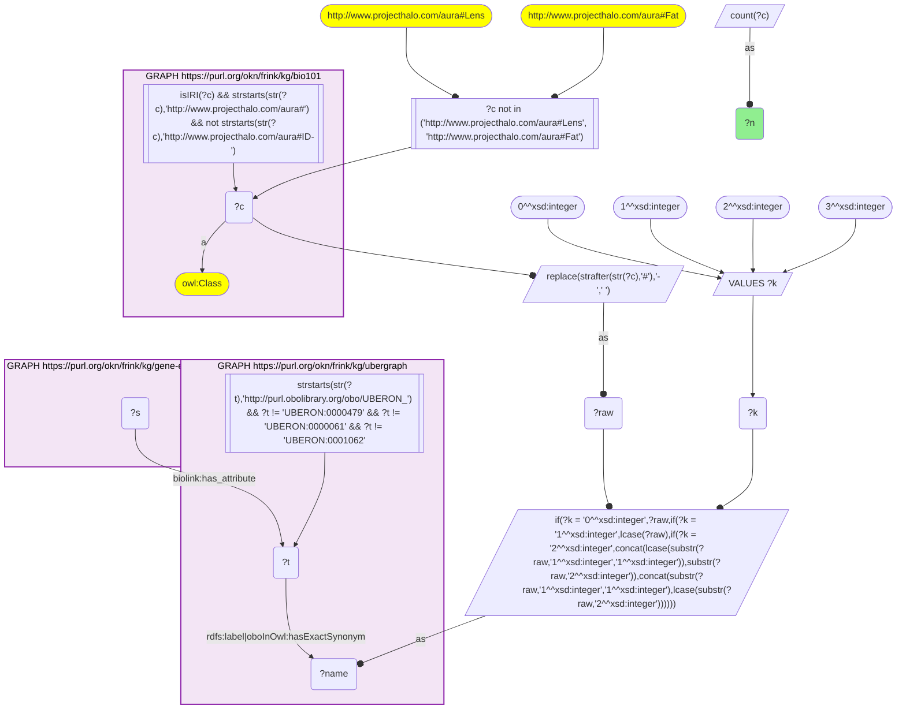
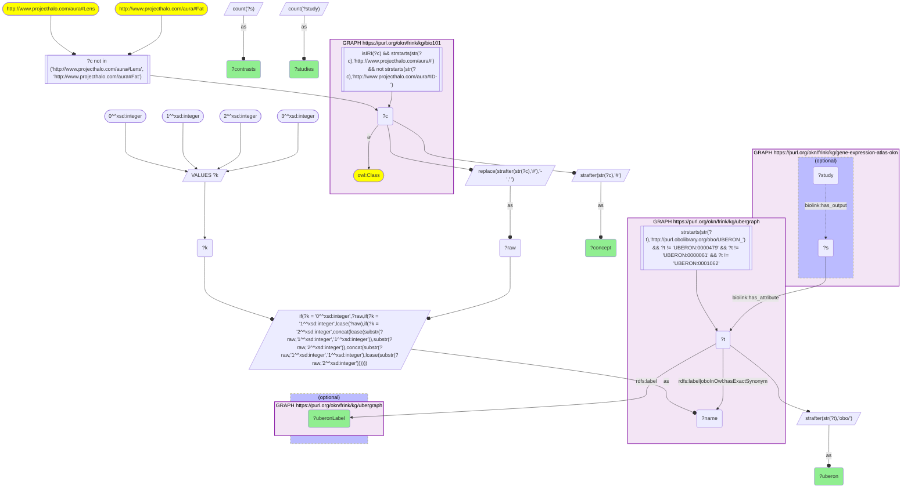
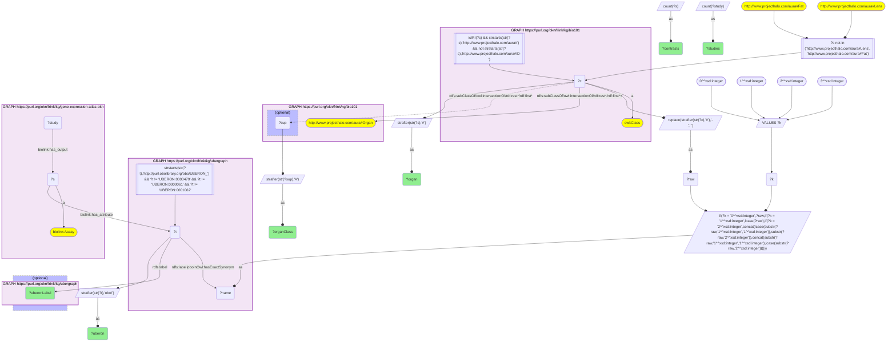
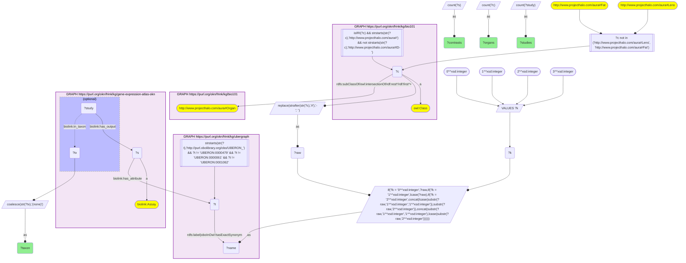

# AN10-Q1: KB Bio 101's textbook organs ranked by Expression Atlas differential-expression coverage

- **Date:** 2026-10-05
- **Model:** claude-opus-5-5
- **SPARQL endpoint:** https://apps.okn.us/federation/sparql
- **Generated by:** mcp-okn v0.1.0 (build 8efca43)
- **Contents:** 4 queries · 4 query diagrams

## Knowledge graphs used

- `bio101` — <https://purl.org/okn/frink/kg/bio101>
- `ubergraph` — <https://purl.org/okn/frink/kg/ubergraph>
- `gene-expression-atlas-okn` — <https://purl.org/okn/frink/kg/gene-expression-atlas-okn>

## Conversation

👤 **User**

Crosswalk: `bio101` × `gene-expression-atlas-okn` on **UBERON (bio101 label), bridged through `ubergraph`** (crosswalk `KB3-uberon-label-bio101-gxa`, verified_count 105). KB Bio 101 is an OWL ontology of an introductory biology textbook: every concept is an `owl:Class` IRI `http://www.projecthalo.com/aura#{Name}` with no `rdfs:label` and no external id, so the concept NAME (local name, hyphens → spaces, four case forms: as-is, all lower-case, first letter lowered, sentence case) is matched as a bound literal against ubergraph `rdfs:label | oboInOwl:hasExactSynonym` on `obo/UBERON_` terms. Expression Atlas (GXA) carries the tissue as a raw `obo/UBERON_` IRI on `biolink:has_attribute` of each differential-expression contrast (`biolink:Assay`), which its `biolink:Study` points to via `biolink:has_output`.

Research question: for the organs KB Bio 101 describes (heart, liver, kidney, pancreas, ...), how many Expression Atlas differential-expression contrasts and studies are anchored on the matching UBERON tissue? Rank the bridged organs.

Why the join is required: bio101 knows which concepts a biology textbook treats as organs (and what kind of organ each is) but holds no data and no identifiers; GXA holds the expression experiments keyed on UBERON but has no notion of which tissues a curriculum teaches. Only the name → UBERON bridge through ubergraph can put the textbook's organ list beside the experimental coverage.

---

🧠 **Assistant**

**Bridge established (Query 1).** The crosswalk skeleton, run verbatim (four case forms of the bio101 name, including the sentence-case form), returns **105** bio101 concepts whose name is an exact UBERON label or exact synonym in ubergraph *and* whose UBERON term is carried by at least one GXA `has_attribute` — matching the catalogued `verified_count`. Each of the 105 concepts maps to exactly one UBERON term (Query 2 returns 105 rows, one per concept).

**Restricting to organs (Query 3).** bio101's class hierarchy lives inside OWL `intersectionOf` lists, so "is an organ" is tested with `(rdfs:subClassOf/(owl:intersectionOf/rdf:rest*/rdf:first)*)+ aura:Organ`. **45 of the 105 bridged concepts are bio101 organs.** Counting only GXA `biolink:Assay` contrasts (the unit that carries a tissue) and the `biolink:Study` records that output them:

| Rank | bio101 organ | bio101 parent class | UBERON (ubergraph label) | GXA contrasts | GXA studies |
|---|---|---|---|---|---|
| 1 | Liver | Secretory-Organ | UBERON_0002107 (liver) | 597 | 205 |
| 2 | Lung | Respiratory-Organ | UBERON_0002048 (lung) | 483 | 132 |
| 3 | Skin | Specialised-Organ | UBERON_0000014 (zone of skin) | 238 | 88 |
| 4 | Brain | Nervous-Organ | UBERON_0000955 (brain) | 234 | 77 |
| 5 | Kidney | Excretory-Organ | UBERON_0002113 (kidney) | 201 | 74 |
| 6 | Colon | Digestive-Organ | UBERON_0001155 (colon) | 183 | 70 |
| 7 | Heart | Circulatory-Organ | UBERON_0000948 (heart) | 147 | 53 |
| 8 | Pancreas | Secretory-Organ | UBERON_0001264 (pancreas) | 102 | 48 |
| 9 | Ovary | — | UBERON_0000992 (ovary) | 48 | 24 |
| 10 | Thymus | Immune-Organ | UBERON_0002370 (thymus) | 47 | 17 |
| 11 | Prostate-Gland | — | UBERON_0002367 (prostate gland) | 45 | 22 |
| 12 | Lymph-Node | Immune-Organ | UBERON_0000029 (lymph node) | 37 | 19 |
| 13 | Spinal-Cord | — | UBERON_0002240 (spinal cord) | 34 | 13 |
| 14 | Small-Intestine | Digestive-Organ | UBERON_0002108 (small intestine) | 32 | 16 |
| 15 | Rectum | Animal-Organ | UBERON_0001052 (rectum) | 26 | 5 |
| 16 | Thyroid-Gland | — | UBERON_0002046 (thyroid gland) | 23 | 8 |
| 17 | Tongue | Animal-Organ | UBERON_0001723 (tongue) | 23 | 7 |
| 18 | Esophagus | Digestive-Organ | UBERON_0001043 (esophagus) | 21 | 10 |
| 19 | Uterus | Reproductive-Organ | UBERON_0000995 (uterus) | 20 | 13 |
| 20 | Epididymis | Reproductive-Organ | UBERON_0001301 (epididymis) | 19 | 2 |

The remaining 25 bridged organs each have 16 or fewer contrasts: Intestine 16/10, Stomach 15/9, Trachea 14/5, Urinary-Bladder 14/8, Cochlea 12/6, Pharynx 12/1, Placenta 12/7, Adrenal-Gland 10/8, Inner-Ear 10/2, Cecum 9/5, Eye 7/6, Vagina 6/1, Antenna 5/2, Oviduct 5/3, Salivary-Gland 5/3, Gill 4/1, Pineal-Gland 4/2, Ureter 4/2, Ear 2/1, Large-Intestine 2/1, Pituitary-Gland 2/2, Blood-Vessel 1/1, Penis 1/1, Pulmonary-Artery 1/1, Vulva 1/1 (contrasts/studies). "—" in the parent column means the organ's direct parent class name does not end in "Organ" (e.g. a gland class); it still descends from `aura:Organ`, which the query requires.

**Species split (Query 4)**, distinct counts per `biolink:in_taxon` of the owning study, across the 45 organs:

| Taxon | Organs reached | Contrasts | Studies |
|---|---|---|---|
| mouse (NCBITaxon_10090) | 34 | 1,260 | 416 |
| human (NCBITaxon_9606) | 33 | 1,040 | 404 |
| rat (NCBITaxon_10116) | 23 | 263 | 72 |
| no `in_taxon` on the study | 13 | 109 | 27 |
| fruit fly (NCBITaxon_7227) | 6 | 32 | 13 |
| zebrafish (NCBITaxon_7955) | 5 | 24 | 9 |

**Findings.**
- The textbook's four headline organs are all well covered: liver 597 contrasts / 205 studies, kidney 201/74, heart 147/53, pancreas 102/48. Liver is the most-profiled bio101 organ in GXA by a wide margin (24% more contrasts than lung, 55% more studies).
- Coverage is very skewed: the top 8 organs (liver → pancreas) hold 2,185 of the 2,734 organ–contrast pairs (80%); 13 of the 45 organs have 5 contrasts or fewer.
- Mouse (34 organs) and human (33) each contribute over 1,000 contrasts; rat reaches 23 organs. The textbook also names organs outside mammals — `Antenna` (insects) and `Gill` (fish) bridge to UBERON terms with GXA contrasts, and fruit fly (6 organs) and zebrafish (5 organs) studies appear in the taxon split.
- Several high-coverage GXA tissues are bridged but are **not under `aura:Organ` in bio101** and so drop out of the ranking above (their counts come from Query 2): Blood (674 contrasts / 217 studies), Multicellular-Organism (640 / 208; whole-organism samples), Bone-Marrow (301 / 130) and Embryo (218 contrast-or-study records / 20 studies).
- In GXA the life-stage UBERON terms (Juvenile-Stage, Larval-Stage, Pupa, and part of Embryo) are attached to `biolink:Study` nodes rather than to contrasts — which is why they show 0 studies under the `has_output` path in Query 2 (subject types checked with an exploratory probe: Juvenile-Stage 20, Larval-Stage 9 and Pupa 2 are all `biolink:Study`; Embryo is on 144 `biolink:Assay` and 74 `biolink:Study` nodes). The organ ranking counts only `biolink:Assay` contrasts, so it is unaffected.

**Caveats.**
- **Label-bridged, lower bound.** The join is exact-name only: a bio101 organ whose name is neither a UBERON label nor an exact synonym (spelling variants, broad/narrow synonyms) is missed, so 45 organs is a floor. The bridge tries four case forms of each name; the sentence-case form (added to the recipe for names like 'Golgi apparatus') does not change this crosswalk — still 105 concepts. The two known homonyms (`Lens` = optical device, `Fat` = lipid) are excluded by the skeleton; three bridges land on a broader or differently-scoped UBERON term worth bearing in mind — Skin → "zone of skin", Salivary-Gland → "saliva-secreting gland", Vulva → "mammalian vulva".
- **Exact UBERON term, no subClassOf expansion.** Counts are for contrasts annotated with exactly that UBERON term; a contrast on "left lobe of liver" or "renal cortex" is not rolled up into Liver or Kidney.
- A "contrast" is one GXA differential-expression comparison (`biolink:Assay`, e.g. `'female liver' vs 'male liver'`); a study usually contains several. The per-organ contrast column sums to 2,734 organ–contrast pairs, while the per-taxon table counts distinct contrasts per taxon (2,728 summed), so a handful of contrasts carry more than one bridged organ term.

## SPARQL queries executed

#### Query 1

_2026-10-06T00:03:37+00:00 · `bio101`, `ubergraph`, `gene-expression-atlas-okn`_

```sparql
SELECT (COUNT(DISTINCT ?c) AS ?n) WHERE {
  { SELECT DISTINCT ?c ?t WHERE {
  { SELECT DISTINCT ?c ?name WHERE {
      GRAPH <https://purl.org/okn/frink/kg/bio101> { ?c a <http://www.w3.org/2002/07/owl#Class> .
        FILTER(isIRI(?c) && STRSTARTS(STR(?c),'http://www.projecthalo.com/aura#') && !STRSTARTS(STR(?c),'http://www.projecthalo.com/aura#ID-')) }
      FILTER(?c NOT IN (<http://www.projecthalo.com/aura#Lens>, <http://www.projecthalo.com/aura#Fat>))  # homonyms (spot-checked 2026-10-05)
      BIND(REPLACE(STRAFTER(STR(?c),'#'),'-',' ') AS ?raw)
      VALUES ?k { 0 1 2 3 }  # as-is, all lower, first letter lowered, sentence case
      BIND(IF(?k = 0, ?raw, IF(?k = 1, LCASE(?raw), IF(?k = 2, CONCAT(LCASE(SUBSTR(?raw,1,1)),SUBSTR(?raw,2)),
                CONCAT(SUBSTR(?raw,1,1),LCASE(SUBSTR(?raw,2)))))) AS ?name)
  } }
    GRAPH <https://purl.org/okn/frink/kg/ubergraph> { ?t <http://www.w3.org/2000/01/rdf-schema#label>|<http://www.geneontology.org/formats/oboInOwl#hasExactSynonym> ?name .
      FILTER(STRSTARTS(STR(?t),'http://purl.obolibrary.org/obo/UBERON_') && ?t != <http://purl.obolibrary.org/obo/UBERON_0000479> && ?t != <http://purl.obolibrary.org/obo/UBERON_0000061> && ?t != <http://purl.obolibrary.org/obo/UBERON_0001062>) }
  } }
  GRAPH <https://purl.org/okn/frink/kg/gene-expression-atlas-okn> { ?s <https://w3id.org/biolink/vocab/has_attribute> ?t . }
}
```



_1 row(s)_

| n |
| --- |
| 105 |

#### Query 2

_2026-10-06T00:03:47+00:00 · `bio101`, `ubergraph`, `gene-expression-atlas-okn`_

```sparql
SELECT ?concept ?uberon ?uberonLabel (COUNT(DISTINCT ?s) AS ?contrasts) (COUNT(DISTINCT ?study) AS ?studies) WHERE {
  { SELECT DISTINCT ?c ?t WHERE {
  { SELECT DISTINCT ?c ?name WHERE {
      GRAPH <https://purl.org/okn/frink/kg/bio101> { ?c a <http://www.w3.org/2002/07/owl#Class> .
        FILTER(isIRI(?c) && STRSTARTS(STR(?c),'http://www.projecthalo.com/aura#') && !STRSTARTS(STR(?c),'http://www.projecthalo.com/aura#ID-')) }
      FILTER(?c NOT IN (<http://www.projecthalo.com/aura#Lens>, <http://www.projecthalo.com/aura#Fat>))  # homonyms (spot-checked 2026-10-05)
      BIND(REPLACE(STRAFTER(STR(?c),'#'),'-',' ') AS ?raw)
      VALUES ?k { 0 1 2 3 }  # as-is, all lower, first letter lowered, sentence case
      BIND(IF(?k = 0, ?raw, IF(?k = 1, LCASE(?raw), IF(?k = 2, CONCAT(LCASE(SUBSTR(?raw,1,1)),SUBSTR(?raw,2)),
                CONCAT(SUBSTR(?raw,1,1),LCASE(SUBSTR(?raw,2)))))) AS ?name)
  } }
    GRAPH <https://purl.org/okn/frink/kg/ubergraph> { ?t <http://www.w3.org/2000/01/rdf-schema#label>|<http://www.geneontology.org/formats/oboInOwl#hasExactSynonym> ?name .
      FILTER(STRSTARTS(STR(?t),'http://purl.obolibrary.org/obo/UBERON_') && ?t != <http://purl.obolibrary.org/obo/UBERON_0000479> && ?t != <http://purl.obolibrary.org/obo/UBERON_0000061> && ?t != <http://purl.obolibrary.org/obo/UBERON_0001062>) }
  } }
  GRAPH <https://purl.org/okn/frink/kg/gene-expression-atlas-okn> {
    ?s <https://w3id.org/biolink/vocab/has_attribute> ?t .
    OPTIONAL { ?study <https://w3id.org/biolink/vocab/has_output> ?s }
  }
  OPTIONAL { GRAPH <https://purl.org/okn/frink/kg/ubergraph> { ?t <http://www.w3.org/2000/01/rdf-schema#label> ?uberonLabel } }
  BIND(STRAFTER(STR(?c),'#') AS ?concept)
  BIND(STRAFTER(STR(?t),'obo/') AS ?uberon)
} GROUP BY ?concept ?uberon ?uberonLabel ORDER BY DESC(?contrasts) ?concept
```



_105 row(s) — showing first 3_

| concept | uberon | uberonLabel | contrasts | studies |
| --- | --- | --- | --- | --- |
| Blood | UBERON_0000178 | blood | 674 | 217 |
| Multicellular-Organism | UBERON_0000468 | multicellular organism | 640 | 208 |
| Liver | UBERON_0002107 | liver | 597 | 205 |

#### Query 3

_2026-10-06T00:04:03+00:00 · `bio101`, `ubergraph`, `gene-expression-atlas-okn`_

```sparql
SELECT ?organ ?organClass ?uberon ?uberonLabel (COUNT(DISTINCT ?s) AS ?contrasts) (COUNT(DISTINCT ?study) AS ?studies) WHERE {
  { SELECT DISTINCT ?c ?t WHERE {
  { SELECT DISTINCT ?c ?name WHERE {
      GRAPH <https://purl.org/okn/frink/kg/bio101> { ?c a <http://www.w3.org/2002/07/owl#Class> .
        FILTER(isIRI(?c) && STRSTARTS(STR(?c),'http://www.projecthalo.com/aura#') && !STRSTARTS(STR(?c),'http://www.projecthalo.com/aura#ID-')) }
      FILTER(?c NOT IN (<http://www.projecthalo.com/aura#Lens>, <http://www.projecthalo.com/aura#Fat>))  # homonyms (spot-checked 2026-10-05)
      BIND(REPLACE(STRAFTER(STR(?c),'#'),'-',' ') AS ?raw)
      VALUES ?k { 0 1 2 3 }  # as-is, all lower, first letter lowered, sentence case
      BIND(IF(?k = 0, ?raw, IF(?k = 1, LCASE(?raw), IF(?k = 2, CONCAT(LCASE(SUBSTR(?raw,1,1)),SUBSTR(?raw,2)),
                CONCAT(SUBSTR(?raw,1,1),LCASE(SUBSTR(?raw,2)))))) AS ?name)
  } }
    GRAPH <https://purl.org/okn/frink/kg/ubergraph> { ?t <http://www.w3.org/2000/01/rdf-schema#label>|<http://www.geneontology.org/formats/oboInOwl#hasExactSynonym> ?name .
      FILTER(STRSTARTS(STR(?t),'http://purl.obolibrary.org/obo/UBERON_') && ?t != <http://purl.obolibrary.org/obo/UBERON_0000479> && ?t != <http://purl.obolibrary.org/obo/UBERON_0000061> && ?t != <http://purl.obolibrary.org/obo/UBERON_0001062>) }
  } }
  # bio101 side: keep only concepts the textbook classifies under aura:Organ (OWL subClassOf, through intersectionOf lists)
  GRAPH <https://purl.org/okn/frink/kg/bio101> {
    ?c (<http://www.w3.org/2000/01/rdf-schema#subClassOf>/(<http://www.w3.org/2002/07/owl#intersectionOf>/<http://www.w3.org/1999/02/22-rdf-syntax-ns#rest>*/<http://www.w3.org/1999/02/22-rdf-syntax-ns#first>)*)+ <http://www.projecthalo.com/aura#Organ> .
    OPTIONAL { ?c <http://www.w3.org/2000/01/rdf-schema#subClassOf>/(<http://www.w3.org/2002/07/owl#intersectionOf>/<http://www.w3.org/1999/02/22-rdf-syntax-ns#rest>*/<http://www.w3.org/1999/02/22-rdf-syntax-ns#first>)* ?sup .
      FILTER(isIRI(?sup) && STRENDS(STR(?sup),'Organ')) }
  }
  # GXA side: differential-expression contrasts (biolink:Assay) carrying the UBERON tissue, and the studies that output them
  GRAPH <https://purl.org/okn/frink/kg/gene-expression-atlas-okn> {
    ?s <https://w3id.org/biolink/vocab/has_attribute> ?t ; a <https://w3id.org/biolink/vocab/Assay> .
    ?study <https://w3id.org/biolink/vocab/has_output> ?s .
  }
  OPTIONAL { GRAPH <https://purl.org/okn/frink/kg/ubergraph> { ?t <http://www.w3.org/2000/01/rdf-schema#label> ?uberonLabel } }
  BIND(STRAFTER(STR(?c),'#') AS ?organ)
  BIND(STRAFTER(STR(?sup),'#') AS ?organClass)
  BIND(STRAFTER(STR(?t),'obo/') AS ?uberon)
} GROUP BY ?organ ?organClass ?uberon ?uberonLabel ORDER BY DESC(?contrasts) ?organ
```



_45 row(s) — showing first 3_

| organ | organClass | uberon | uberonLabel | contrasts | studies |
| --- | --- | --- | --- | --- | --- |
| Liver | Secretory-Organ | UBERON_0002107 | liver | 597 | 205 |
| Lung | Respiratory-Organ | UBERON_0002048 | lung | 483 | 132 |
| Skin | Specialised-Organ | UBERON_0000014 | zone of skin | 238 | 88 |

#### Query 4

_2026-10-06T00:04:19+00:00 · `bio101`, `ubergraph`, `gene-expression-atlas-okn`_

```sparql
SELECT ?taxon (COUNT(DISTINCT ?c) AS ?organs) (COUNT(DISTINCT ?s) AS ?contrasts) (COUNT(DISTINCT ?study) AS ?studies) WHERE {
  { SELECT DISTINCT ?c ?t WHERE {
  { SELECT DISTINCT ?c ?name WHERE {
      GRAPH <https://purl.org/okn/frink/kg/bio101> { ?c a <http://www.w3.org/2002/07/owl#Class> .
        FILTER(isIRI(?c) && STRSTARTS(STR(?c),'http://www.projecthalo.com/aura#') && !STRSTARTS(STR(?c),'http://www.projecthalo.com/aura#ID-')) }
      FILTER(?c NOT IN (<http://www.projecthalo.com/aura#Lens>, <http://www.projecthalo.com/aura#Fat>))  # homonyms (spot-checked 2026-10-05)
      BIND(REPLACE(STRAFTER(STR(?c),'#'),'-',' ') AS ?raw)
      VALUES ?k { 0 1 2 3 }  # as-is, all lower, first letter lowered, sentence case
      BIND(IF(?k = 0, ?raw, IF(?k = 1, LCASE(?raw), IF(?k = 2, CONCAT(LCASE(SUBSTR(?raw,1,1)),SUBSTR(?raw,2)),
                CONCAT(SUBSTR(?raw,1,1),LCASE(SUBSTR(?raw,2)))))) AS ?name)
  } }
    GRAPH <https://purl.org/okn/frink/kg/ubergraph> { ?t <http://www.w3.org/2000/01/rdf-schema#label>|<http://www.geneontology.org/formats/oboInOwl#hasExactSynonym> ?name .
      FILTER(STRSTARTS(STR(?t),'http://purl.obolibrary.org/obo/UBERON_') && ?t != <http://purl.obolibrary.org/obo/UBERON_0000479> && ?t != <http://purl.obolibrary.org/obo/UBERON_0000061> && ?t != <http://purl.obolibrary.org/obo/UBERON_0001062>) }
  } }
  GRAPH <https://purl.org/okn/frink/kg/bio101> {
    ?c (<http://www.w3.org/2000/01/rdf-schema#subClassOf>/(<http://www.w3.org/2002/07/owl#intersectionOf>/<http://www.w3.org/1999/02/22-rdf-syntax-ns#rest>*/<http://www.w3.org/1999/02/22-rdf-syntax-ns#first>)*)+ <http://www.projecthalo.com/aura#Organ> .
  }
  GRAPH <https://purl.org/okn/frink/kg/gene-expression-atlas-okn> {
    ?s <https://w3id.org/biolink/vocab/has_attribute> ?t ; a <https://w3id.org/biolink/vocab/Assay> .
    ?study <https://w3id.org/biolink/vocab/has_output> ?s .
    OPTIONAL { ?study <https://w3id.org/biolink/vocab/in_taxon> ?tx }
  }
  BIND(COALESCE(STR(?tx), "(none)") AS ?taxon)
} GROUP BY ?taxon ORDER BY DESC(?contrasts)
```



_6 row(s) — showing first 5_

| taxon | organs | contrasts | studies |
| --- | --- | --- | --- |
| http://purl.obolibrary.org/obo/NCBITaxon_10090 | 34 | 1260 | 416 |
| http://purl.obolibrary.org/obo/NCBITaxon_9606 | 33 | 1040 | 404 |
| http://purl.obolibrary.org/obo/NCBITaxon_10116 | 23 | 263 | 72 |
| (none) | 13 | 109 | 27 |
| http://purl.obolibrary.org/obo/NCBITaxon_7227 | 6 | 32 | 13 |
