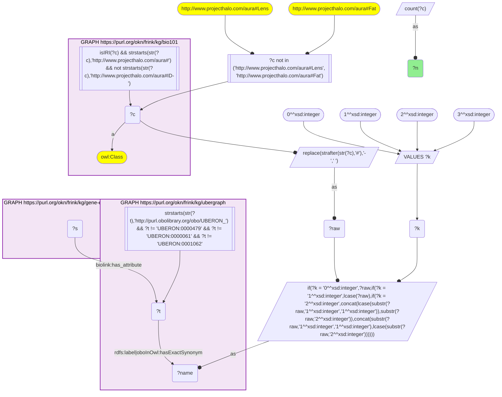
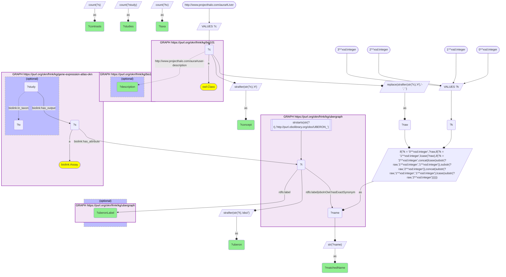
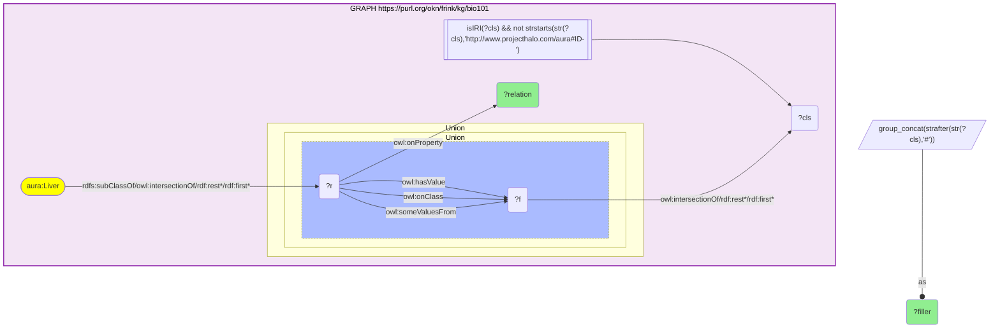
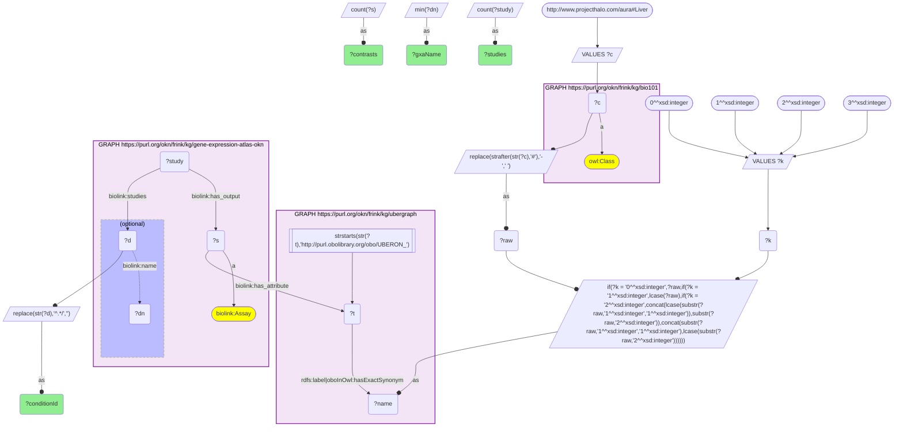
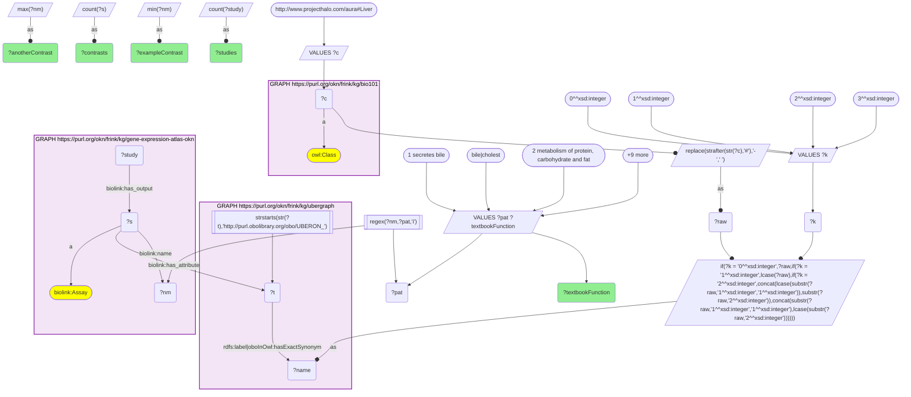
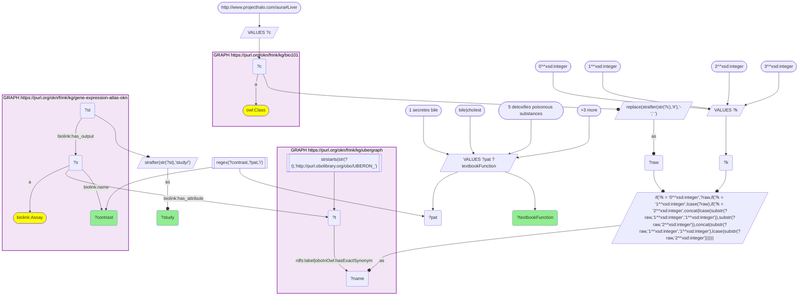

# AN10-Q2: The liver in KB Bio 101 (parts, functions) beside the Expression Atlas contrasts that profile liver tissue

- **Date:** 2026-10-05
- **Model:** claude-opus-5-5
- **SPARQL endpoint:** https://apps.okn.us/federation/sparql
- **Generated by:** mcp-okn v0.1.0 (build 8efca43)
- **Contents:** 6 queries · 6 query diagrams

## Knowledge graphs used

- `bio101` — <https://purl.org/okn/frink/kg/bio101>
- `ubergraph` — <https://purl.org/okn/frink/kg/ubergraph>
- `gene-expression-atlas-okn` — <https://purl.org/okn/frink/kg/gene-expression-atlas-okn>

## Conversation

👤 **User**

Crosswalk: `bio101` × `gene-expression-atlas-okn` on **UBERON (bio101 label), bridged through `ubergraph`** (crosswalk `KB3-uberon-label-bio101-gxa`, verified_count 105). KB Bio 101 is an OWL ontology of an introductory biology textbook: `aura:Liver` is an `owl:Class` with no `rdfs:label` and no external id; what the textbook says about it lives in an `aura:user-description` literal and in OWL restrictions (`owl:onProperty` + `someValuesFrom`/`onClass`/`hasValue`) under its `rdfs:subClassOf` / `owl:intersectionOf` lists. Its NAME ("Liver", tried in four case forms: as-is, all lower-case, first letter lowered, sentence case) is matched as a bound literal against ubergraph `rdfs:label | oboInOwl:hasExactSynonym` on `obo/UBERON_` terms. Expression Atlas (GXA) carries the tissue as a raw `obo/UBERON_` IRI on `biolink:has_attribute` of each differential-expression contrast (`biolink:Assay`, named like `'high fat diet' vs 'control'`), grouped into `biolink:Study` records via `biolink:has_output`; a study may name the condition it studies on `biolink:studies`.

Research question: what does KB Bio 101 say the liver is made of and does, side by side with the Expression Atlas studies that profile liver tissue — and which of the textbook's liver functions does GXA actually have perturbation experiments for?

Why the join is required: bio101 holds the textbook's account of the liver (parts, roles, functions) but no data and no identifier; GXA holds hundreds of liver expression experiments keyed on UBERON but no notion of what the organ is *for*. Only the name → UBERON bridge through ubergraph lets the textbook's functional description be laid against the experimental record.

---

🧠 **Assistant**

**Bridge (Queries 1–2).** The crosswalk skeleton, run verbatim (four case forms of the bio101 name, including the sentence-case form), returns the catalogued **105** bridged bio101 concepts. Restricted to `aura:Liver`, the name form "liver" matches ubergraph's `rdfs:label` of **UBERON_0002107 (liver)**, which GXA carries on **597 differential-expression contrasts in 205 studies across 4 taxa**.

**What KB Bio 101 says about the liver (Queries 2–3)**

| bio101 statement | Content |
|---|---|
| `aura:user-description` | "Large and complicated reddish-brown glandular organ located in the upper right portion of the abdominal cavity; secretes bile and functions in metabolism of protein and carbohydrate and fat; synthesizes substances involved in the clotting of the blood; synthesizes vitamin A; detoxifies poisonous substances and breaks down worn-out erythrocytes" |
| made of — `has-part` | Liver-Cell |
| contains — `encloses` | Bile |
| roles — `plays` | Secretor; Container |
| function — `has-function` | Store |
| event participation | `base-of` Store and Release; `origin-of` Release |

So the textbook's formal axioms model the liver as a secretory container of bile, built of liver cells, that stores and releases; the richer list of metabolic, synthetic and detoxifying functions exists only in the free-text description.

**Side by side: each textbook function vs GXA liver contrasts that perturb it (Queries 5–6)** — each function phrase of the description probed with a pattern on the GXA contrast name, over the 597 liver contrasts reached through the bridge:

| Textbook function (bio101) | GXA liver contrasts | Studies | What the experiments are |
|---|---|---|---|
| secretes bile | 2 | 2 | `'bile duct ligation' vs 'sham'` (E-MEXP-2583); `'intrahepatic cholestasis' vs 'normal'` (E-GEOD-46960) |
| metabolism of protein, carbohydrate and fat | 60 | 22 | high-fat / Western / cafeteria diets, fasting and re-feeding, intermittent fasting, glycogen-synthase knockout, streptozotocin and db/db diabetes, NAFLD/steatosis contrasts |
| synthesizes clotting substances | 0 | 0 | no contrast name mentions coagulation, thrombosis, clotting or fibrin |
| synthesizes vitamin A | 0 | 0 | no contrast name mentions vitamin A or retinoids |
| detoxifies poisonous substances | 29 | 6 | paracetamol 151 and 529 mg/kg at 1/4/24 h (E-MEXP-82, 6 contrasts); CCl4 1.6 g/kg time course 2–384 h (E-MTAB-2445, 8); ethanol ± ellagic acid / resveratrol in wild-type vs CAR-deficient mice (E-GEOD-52644, 9); CCl4 + diethylnitrosamine (E-GEOD-30485, 3); acetaminophen in HepaRG/HepG2 (E-GEOD-74000, 2); chemotherapy-associated hepatotoxicity (E-MTAB-503, 1) |
| breaks down worn-out erythrocytes | 3 | 2 | `'iron' vs 'water'`, `'arsenic and iron' vs 'water'` (E-MEXP-3763); `'heme' vs 'none'` (E-MTAB-10935) |

**Conditions GXA's liver studies name (Query 4)**, by `biolink:studies` on the study, top 13:

| Condition (GXA name) | Id | Studies | Contrasts |
|---|---|---|---|
| healthy | PATO_0000461 | 31 | 73 |
| hepatocellular carcinoma | EFO_0000182 | 18 | 37 |
| non-alcoholic fatty liver disease | EFO_0003095 | 4 | 11 |
| chronic hepatitis B virus infection | EFO_0004239 | 4 | 9 |
| type 2 diabetes | MONDO_0005148 | 3 | 5 |
| adenocarcinoma of colon | EFO_0000365 | 2 | 5 |
| control | EFO_0001461 | 2 | 5 |
| hepatitis C infection | EFO_0003047 | 2 | 4 |
| hepatitis B virus induced hepatocellular carcinoma | EFO_0008503 | 2 | 4 |
| steatosis | EFO_0008527 | 2 | 3 |
| non-alcoholic steatohepatitis | EFO_1001249 | 2 | 2 |
| acute liver failure | HP_0006554 | 2 | 3 |
| pancreatic ductal adenocarcinoma | MONDO_0005184 | 2 | 2 |

**Findings.**
- The textbook's liver and GXA's liver are the same organ (exact label match to UBERON_0002107), and it is the most heavily profiled bio101 organ in GXA: 597 contrasts / 205 studies.
- GXA's liver experiments concentrate on two of the six textbook functions. **Metabolism** (60 contrasts / 22 studies: diets, fasting, diabetes, fatty liver) and **detoxification** (29 / 6: paracetamol, CCl4, ethanol, chemotherapy) are well covered — the CAR-deficient ethanol study is a direct genetic test of the liver's xenobiotic-sensing machinery. **Bile secretion** (2) and **erythrocyte/iron handling** (3) are thin, and **clotting-factor synthesis and vitamin A synthesis have no contrast named for them at all**: textbook functions with no matching perturbation experiments in this GXA slice.
- Disease-wise the liver studies are dominated by liver cancer (hepatocellular carcinoma 18 studies, plus 2 HBV-induced HCC) and metabolic/viral liver disease (NAFLD, NASH, steatosis, hepatitis B and C) — pathology of exactly the metabolic and detoxifying functions the textbook lists. Colon adenocarcinoma and pancreatic ductal adenocarcinoma also appear: some studies of non-liver conditions include liver contrasts, so the studied condition is not always a liver disease.
- bio101's formal parts list is minimal (`has-part Liver-Cell`, `encloses Bile`): the textbook does not decompose the liver into lobules, sinusoids or bile ducts, so there is nothing to bridge for liver sub-structures from the bio101 side.

**Caveats.**
- **Label-bridged, lower bound.** The Liver → UBERON_0002107 link is an exact-name match (crosswalk lower bound; homonyms Lens and Fat are excluded in the skeleton); it is correct here, but the method would miss GXA contrasts annotated on narrower liver terms (e.g. a liver lobe) since no `subClassOf` expansion is applied. Of the four case forms tried, only the all-lower-case "liver" matches; the sentence-case form adds nothing for this concept, and the crosswalk total stays at 105.
- **Function mapping is a keyword probe, not curation.** Each textbook function is matched by a regular expression on GXA's free-text contrast name (patterns are in Query 5). It finds contrasts that *name* a relevant perturbation; it will miss experiments whose name does not mention it (e.g. a knockout of a clotting-factor gene listed only by gene symbol), so the 0s for clotting and vitamin A mean "none named", not "none possible". The iron/heme contrasts relate to heme/iron handling rather than literally to red-cell breakdown.
- **Condition table covers only annotated studies.** `biolink:studies` is optional on GXA studies — an exploratory count found 66 of the 205 liver studies carry one — and GXA attaches several names to some condition nodes, so the GXA name shown is the alphabetically first. "healthy" (PATO_0000461) and "control" are reference-group annotations, not diseases.
- Counts are distinct contrasts (`biolink:Assay`) and the studies that output them; one study usually contributes several contrasts (e.g. a time course).

## SPARQL queries executed

#### Query 1

_2026-10-06T00:06:58+00:00 · `bio101`, `ubergraph`, `gene-expression-atlas-okn`_

```sparql
SELECT (COUNT(DISTINCT ?c) AS ?n) WHERE {
  { SELECT DISTINCT ?c ?t WHERE {
  { SELECT DISTINCT ?c ?name WHERE {
      GRAPH <https://purl.org/okn/frink/kg/bio101> { ?c a <http://www.w3.org/2002/07/owl#Class> .
        FILTER(isIRI(?c) && STRSTARTS(STR(?c),'http://www.projecthalo.com/aura#') && !STRSTARTS(STR(?c),'http://www.projecthalo.com/aura#ID-')) }
      FILTER(?c NOT IN (<http://www.projecthalo.com/aura#Lens>, <http://www.projecthalo.com/aura#Fat>))  # homonyms (spot-checked 2026-10-05)
      BIND(REPLACE(STRAFTER(STR(?c),'#'),'-',' ') AS ?raw)
      VALUES ?k { 0 1 2 3 }  # as-is, all lower, first letter lowered, sentence case
      BIND(IF(?k = 0, ?raw, IF(?k = 1, LCASE(?raw), IF(?k = 2, CONCAT(LCASE(SUBSTR(?raw,1,1)),SUBSTR(?raw,2)),
                CONCAT(SUBSTR(?raw,1,1),LCASE(SUBSTR(?raw,2)))))) AS ?name)
  } }
    GRAPH <https://purl.org/okn/frink/kg/ubergraph> { ?t <http://www.w3.org/2000/01/rdf-schema#label>|<http://www.geneontology.org/formats/oboInOwl#hasExactSynonym> ?name .
      FILTER(STRSTARTS(STR(?t),'http://purl.obolibrary.org/obo/UBERON_') && ?t != <http://purl.obolibrary.org/obo/UBERON_0000479> && ?t != <http://purl.obolibrary.org/obo/UBERON_0000061> && ?t != <http://purl.obolibrary.org/obo/UBERON_0001062>) }
  } }
  GRAPH <https://purl.org/okn/frink/kg/gene-expression-atlas-okn> { ?s <https://w3id.org/biolink/vocab/has_attribute> ?t . }
}
```



_1 row(s)_

| n |
| --- |
| 105 |

#### Query 2

_2026-10-06T00:07:07+00:00 · `bio101`, `ubergraph`, `gene-expression-atlas-okn`_

```sparql
SELECT ?concept ?matchedName ?uberon ?uberonLabel ?description (COUNT(DISTINCT ?s) AS ?contrasts) (COUNT(DISTINCT ?study) AS ?studies) (COUNT(DISTINCT ?tx) AS ?taxa) WHERE {
  { SELECT DISTINCT ?c ?name ?t WHERE {
    { SELECT DISTINCT ?c ?name WHERE {
        VALUES ?c { <http://www.projecthalo.com/aura#Liver> }
        GRAPH <https://purl.org/okn/frink/kg/bio101> { ?c a <http://www.w3.org/2002/07/owl#Class> }
        BIND(REPLACE(STRAFTER(STR(?c),'#'),'-',' ') AS ?raw)
        VALUES ?k { 0 1 2 3 }  # as-is, all lower, first letter lowered, sentence case
        BIND(IF(?k = 0, ?raw, IF(?k = 1, LCASE(?raw), IF(?k = 2, CONCAT(LCASE(SUBSTR(?raw,1,1)),SUBSTR(?raw,2)),
                  CONCAT(SUBSTR(?raw,1,1),LCASE(SUBSTR(?raw,2)))))) AS ?name)
    } }
    GRAPH <https://purl.org/okn/frink/kg/ubergraph> { ?t <http://www.w3.org/2000/01/rdf-schema#label>|<http://www.geneontology.org/formats/oboInOwl#hasExactSynonym> ?name .
      FILTER(STRSTARTS(STR(?t),'http://purl.obolibrary.org/obo/UBERON_')) }
  } }
  GRAPH <https://purl.org/okn/frink/kg/bio101> { OPTIONAL { ?c <http://www.projecthalo.com/aura#user-description> ?description } }
  OPTIONAL { GRAPH <https://purl.org/okn/frink/kg/ubergraph> { ?t <http://www.w3.org/2000/01/rdf-schema#label> ?uberonLabel } }
  GRAPH <https://purl.org/okn/frink/kg/gene-expression-atlas-okn> {
    ?s <https://w3id.org/biolink/vocab/has_attribute> ?t ; a <https://w3id.org/biolink/vocab/Assay> .
    ?study <https://w3id.org/biolink/vocab/has_output> ?s .
    OPTIONAL { ?study <https://w3id.org/biolink/vocab/in_taxon> ?tx }
  }
  BIND(STRAFTER(STR(?c),'#') AS ?concept)
  BIND(STR(?name) AS ?matchedName)
  BIND(STRAFTER(STR(?t),'obo/') AS ?uberon)
} GROUP BY ?concept ?matchedName ?uberon ?uberonLabel ?description
```



_1 row(s)_

| concept | matchedName | uberon | uberonLabel | description | contrasts | studies | taxa |
| --- | --- | --- | --- | --- | --- | --- | --- |
| Liver | liver | UBERON_0002107 | liver | Large and complicated reddish-brown glandular organ located in the upper right portion of the abdominal cavity; secretes bile and functions in metabolism of protein and carbohydrate and fat; synthesizes substances involved in the clotting of the blood; synthesizes vitamin A; detoxifies poisonous substances and breaks down worn-out erythrocytes | 597 | 205 | 4 |

#### Query 3

_2026-10-06T00:07:15+00:00 · `bio101`_

```sparql
PREFIX aura: <http://www.projecthalo.com/aura#>
PREFIX owl:  <http://www.w3.org/2002/07/owl#>
PREFIX rdf:  <http://www.w3.org/1999/02/22-rdf-syntax-ns#>
PREFIX rdfs: <http://www.w3.org/2000/01/rdf-schema#>
SELECT ?relation (GROUP_CONCAT(DISTINCT STRAFTER(STR(?cls), "#"); separator=" & ") AS ?filler)
WHERE { GRAPH <https://purl.org/okn/frink/kg/bio101> {
  aura:Liver rdfs:subClassOf/(owl:intersectionOf/rdf:rest*/rdf:first)* ?r .
  ?r owl:onProperty ?relation .
  { ?r owl:someValuesFrom ?f } UNION { ?r owl:onClass ?f } UNION { ?r owl:hasValue ?f }
  ?f (owl:intersectionOf/rdf:rest*/rdf:first)* ?cls .
  FILTER(isIRI(?cls) && !STRSTARTS(STR(?cls), "http://www.projecthalo.com/aura#ID-"))
} } GROUP BY ?r ?relation ORDER BY ?relation ?filler
```



_8 row(s) — showing first 3_

| relation | filler |
| --- | --- |
| http://www.projecthalo.com/aura#base-of | Release |
| http://www.projecthalo.com/aura#base-of | Store |
| http://www.projecthalo.com/aura#encloses | Bile & Tangible-Entity & Entity |

#### Query 4

_2026-10-06T00:07:23+00:00 · `bio101`, `ubergraph`, `gene-expression-atlas-okn`_

```sparql
SELECT ?conditionId (MIN(?dn) AS ?gxaName) (COUNT(DISTINCT ?study) AS ?studies) (COUNT(DISTINCT ?s) AS ?contrasts) WHERE {
  { SELECT DISTINCT ?t WHERE {
    { SELECT DISTINCT ?name WHERE {
        VALUES ?c { <http://www.projecthalo.com/aura#Liver> }
        GRAPH <https://purl.org/okn/frink/kg/bio101> { ?c a <http://www.w3.org/2002/07/owl#Class> }
        BIND(REPLACE(STRAFTER(STR(?c),'#'),'-',' ') AS ?raw)
        VALUES ?k { 0 1 2 3 }  # as-is, all lower, first letter lowered, sentence case
        BIND(IF(?k = 0, ?raw, IF(?k = 1, LCASE(?raw), IF(?k = 2, CONCAT(LCASE(SUBSTR(?raw,1,1)),SUBSTR(?raw,2)),
                  CONCAT(SUBSTR(?raw,1,1),LCASE(SUBSTR(?raw,2)))))) AS ?name)
    } }
    GRAPH <https://purl.org/okn/frink/kg/ubergraph> { ?t <http://www.w3.org/2000/01/rdf-schema#label>|<http://www.geneontology.org/formats/oboInOwl#hasExactSynonym> ?name .
      FILTER(STRSTARTS(STR(?t),'http://purl.obolibrary.org/obo/UBERON_')) }
  } }
  GRAPH <https://purl.org/okn/frink/kg/gene-expression-atlas-okn> {
    ?s <https://w3id.org/biolink/vocab/has_attribute> ?t ; a <https://w3id.org/biolink/vocab/Assay> .
    ?study <https://w3id.org/biolink/vocab/has_output> ?s ; <https://w3id.org/biolink/vocab/studies> ?d .
    OPTIONAL { ?d <https://w3id.org/biolink/vocab/name> ?dn }
  }
  BIND(REPLACE(STR(?d), '^.*/', '') AS ?conditionId)
} GROUP BY ?conditionId ORDER BY DESC(?studies) ?conditionId LIMIT 13
```



_13 row(s) — showing first 3_

| conditionId | gxaName | studies | contrasts |
| --- | --- | --- | --- |
| PATO_0000461 | healthy | 31 | 73 |
| EFO_0000182 | hepatocellular carcinoma | 18 | 37 |
| EFO_0003095 | non-alcoholic fatty liver disease | 4 | 11 |

#### Query 5

_2026-10-06T00:07:34+00:00 · `bio101`, `ubergraph`, `gene-expression-atlas-okn`_

```sparql
SELECT ?textbookFunction (COUNT(DISTINCT ?s) AS ?contrasts) (COUNT(DISTINCT ?study) AS ?studies) (MIN(?nm) AS ?exampleContrast) (MAX(?nm) AS ?anotherContrast) WHERE {
  { SELECT DISTINCT ?t WHERE {
    { SELECT DISTINCT ?name WHERE {
        VALUES ?c { <http://www.projecthalo.com/aura#Liver> }
        GRAPH <https://purl.org/okn/frink/kg/bio101> { ?c a <http://www.w3.org/2002/07/owl#Class> }
        BIND(REPLACE(STRAFTER(STR(?c),'#'),'-',' ') AS ?raw)
        VALUES ?k { 0 1 2 3 }  # as-is, all lower, first letter lowered, sentence case
        BIND(IF(?k = 0, ?raw, IF(?k = 1, LCASE(?raw), IF(?k = 2, CONCAT(LCASE(SUBSTR(?raw,1,1)),SUBSTR(?raw,2)),
                  CONCAT(SUBSTR(?raw,1,1),LCASE(SUBSTR(?raw,2)))))) AS ?name)
    } }
    GRAPH <https://purl.org/okn/frink/kg/ubergraph> { ?t <http://www.w3.org/2000/01/rdf-schema#label>|<http://www.geneontology.org/formats/oboInOwl#hasExactSynonym> ?name .
      FILTER(STRSTARTS(STR(?t),'http://purl.obolibrary.org/obo/UBERON_')) }
  } }
  GRAPH <https://purl.org/okn/frink/kg/gene-expression-atlas-okn> {
    ?s <https://w3id.org/biolink/vocab/has_attribute> ?t ; a <https://w3id.org/biolink/vocab/Assay> ; <https://w3id.org/biolink/vocab/name> ?nm .
    ?study <https://w3id.org/biolink/vocab/has_output> ?s .
  }
  # each function phrase of bio101's aura:user-description for Liver, probed by a pattern on the GXA contrast name
  VALUES (?textbookFunction ?pat) {
    ("1 secretes bile"                               "bile|cholest")
    ("2 metabolism of protein, carbohydrate and fat" "\\bdiets?\\b|fasted|fasting|glycogen|glucose|diabet|insulin|steatosis|fatty liver|lipid")
    ("3 synthesizes clotting substances"             "coagul|thromb|clot|fibrin")
    ("4 synthesizes vitamin A"                       "vitamin a|retino")
    ("5 detoxifies poisonous substances"             "acetaminophen|paracetamol|toxic|ethanol|aflatoxin|xenobiotic|CCl4|carbon tetrachloride|diethylnitrosamine")
    ("6 breaks down worn-out erythrocytes"           "\\bheme\\b|\\biron\\b|hemoly|haemoly|erythrocyte")
  }
  FILTER(REGEX(?nm, ?pat, "i"))
} GROUP BY ?textbookFunction ORDER BY ?textbookFunction
```



_4 row(s) — showing first 3_

| textbookFunction | contrasts | studies | exampleContrast | anotherContrast |
| --- | --- | --- | --- | --- |
| 1 secretes bile | 2 | 2 | 'bile duct ligation' vs 'sham' | 'intrahepatic cholestasis' vs 'normal' |
| 2 metabolism of protein, carbohydrate and fat | 60 | 22 | '0.1% phloridzin' vs 'control' in 'streptozotocin-induced diabetes' | 'Western diet' vs 'control diet' |
| 5 detoxifies poisonous substances | 29 | 6 | 'acetaminophen; 13 millimolar' vs 'none' in 'HepaRG; hepatitis C virus infection; liver' | 'wild type; ethanol' vs 'wild type; control' |

#### Query 6

_2026-10-06T00:07:44+00:00 · `bio101`, `ubergraph`, `gene-expression-atlas-okn`_

```sparql
SELECT ?textbookFunction ?contrast ?study WHERE {
  { SELECT DISTINCT ?t WHERE {
    { SELECT DISTINCT ?name WHERE {
        VALUES ?c { <http://www.projecthalo.com/aura#Liver> }
        GRAPH <https://purl.org/okn/frink/kg/bio101> { ?c a <http://www.w3.org/2002/07/owl#Class> }
        BIND(REPLACE(STRAFTER(STR(?c),'#'),'-',' ') AS ?raw)
        VALUES ?k { 0 1 2 3 }  # as-is, all lower, first letter lowered, sentence case
        BIND(IF(?k = 0, ?raw, IF(?k = 1, LCASE(?raw), IF(?k = 2, CONCAT(LCASE(SUBSTR(?raw,1,1)),SUBSTR(?raw,2)),
                  CONCAT(SUBSTR(?raw,1,1),LCASE(SUBSTR(?raw,2)))))) AS ?name)
    } }
    GRAPH <https://purl.org/okn/frink/kg/ubergraph> { ?t <http://www.w3.org/2000/01/rdf-schema#label>|<http://www.geneontology.org/formats/oboInOwl#hasExactSynonym> ?name .
      FILTER(STRSTARTS(STR(?t),'http://purl.obolibrary.org/obo/UBERON_')) }
  } }
  GRAPH <https://purl.org/okn/frink/kg/gene-expression-atlas-okn> {
    ?s <https://w3id.org/biolink/vocab/has_attribute> ?t ; a <https://w3id.org/biolink/vocab/Assay> ; <https://w3id.org/biolink/vocab/name> ?contrast .
    ?st <https://w3id.org/biolink/vocab/has_output> ?s .
  }
  VALUES (?textbookFunction ?pat) {
    ("1 secretes bile"                     "bile|cholest")
    ("5 detoxifies poisonous substances"   "acetaminophen|paracetamol|toxic|ethanol|aflatoxin|xenobiotic|CCl4|carbon tetrachloride|diethylnitrosamine")
    ("6 breaks down worn-out erythrocytes" "\\bheme\\b|\\biron\\b|hemoly|haemoly|erythrocyte")
  }
  FILTER(REGEX(?contrast, ?pat, "i"))
  BIND(STRAFTER(STR(?st), 'study/') AS ?study)
} ORDER BY ?textbookFunction ?study ?contrast
```



_34 row(s) — showing first 5_

| textbookFunction | contrast | study |
| --- | --- | --- |
| 1 secretes bile | 'intrahepatic cholestasis' vs 'normal' | E-GEOD-46960 |
| 1 secretes bile | 'bile duct ligation' vs 'sham' | E-MEXP-2583 |
| 5 detoxifies poisonous substances | 'antibiotics, CCl4 and diethylnitrosamine' vs 'none' in 'wild type genotype' | E-GEOD-30485 |
| 5 detoxifies poisonous substances | 'CCl4 and diethylnitrosamine' vs 'none' in 'wild type genotype' | E-GEOD-30485 |
| 5 detoxifies poisonous substances | 'TLR4 mutant' vs 'wild type genotype' in 'CCl4 and diethylnitrosamine' | E-GEOD-30485 |
