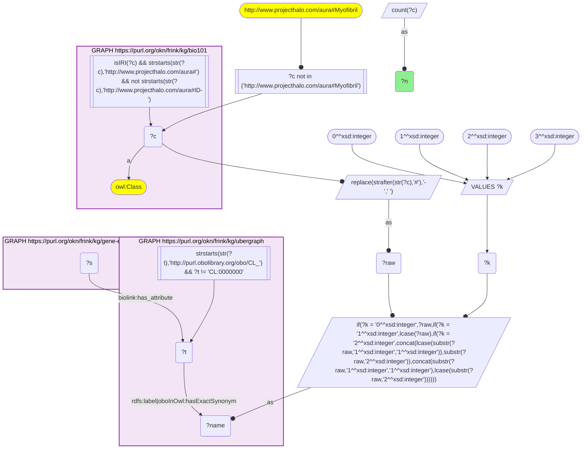
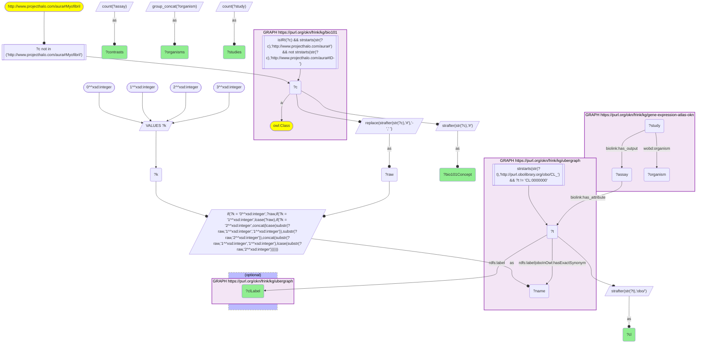

# AN11-Q1: Textbook cell types in KB Bio 101 profiled by Expression Atlas, with study and contrast counts (bio101 × gene-expression-atlas-okn, CL label-bridged via ubergraph)

- **Date:** 2026-10-05
- **Model:** claude-opus-5-5
- **SPARQL endpoint:** https://apps.okn.us/federation/sparql
- **Generated by:** mcp-okn v0.1.0 (build 8efca43)
- **Contents:** 3 queries · 3 query diagrams

## Knowledge graphs used

- `bio101` — <https://purl.org/okn/frink/kg/bio101>
- `ubergraph` — <https://purl.org/okn/frink/kg/ubergraph>
- `gene-expression-atlas-okn` — <https://purl.org/okn/frink/kg/gene-expression-atlas-okn>

## Conversation

👤 **User**

Crosswalk: `bio101` × `gene-expression-atlas-okn` on **CL (bio101 label), bridged through `ubergraph`** (crosswalk `KB4-cl-label-bio101-gxa`, verified_count 35). `bio101` (KB Bio 101, an OWL ontology of an introductory biology textbook) names each concept by its `owl:Class` IRI `http://www.projecthalo.com/aura#{Name}` and carries no `rdfs:label` and no external id, so the concept NAME is the only key: hyphens become spaces, and the name is matched in four case forms (as-is, all lower-case, first letter lowered, and sentence case) against `ubergraph` CL `rdfs:label | oboInOwl:hasExactSynonym`. `gene-expression-atlas-okn` tags each differential-expression contrast (`biolink:Assay`) with its CL cell type on `biolink:has_attribute`; a `biolink:Study` links to its contrasts by `biolink:has_output`.

Research question: Which textbook cell types in KB Bio 101 (macrophage, neutrophil, fibroblast, oocyte, ...) are profiled by Expression Atlas, and in how many studies and contrasts each?

Why the join is required: KB Bio 101 knows which cell types an introductory biology course teaches, but holds no data and no identifiers. Expression Atlas holds the measured contrasts, keyed by Cell Ontology ids, but has no notion of which cell types are textbook material. Only the name-to-CL bridge through ubergraph connects the two.

---

🧠 **Assistant**

**35 KB Bio 101 cell concepts reach 34 Cell Ontology terms that Expression Atlas contrasts carry.** The skeleton join returns exactly the catalogued 35. Two textbook concepts, `Stem-Cell` and `Animal-Stem-Cell`, both land on CL_0000034 *stem cell*, which is why 35 concepts give 34 CL terms.

### Coverage per textbook cell type

Contrasts are GXA `biolink:Assay` nodes tagged `has_attribute` with the CL term and reachable from a `biolink:Study` through `has_output`. Studies are distinct parent studies. Organisms come from the study's `wobd:organism`.

| bio101 concept | CL term (ubergraph label) | GXA contrasts | GXA studies | Organisms |
|---|---|---|---|---|
| Epithelial-Cell | CL_0000066 epithelial cell | 452 | 152 | human, mouse, rat, pig, cow, chicken, fruit fly |
| Embryonic-Stem-Cell | CL_0002322 embryonic stem cell | 213 | 56 | human, mouse |
| Fibroblast | CL_0000057 fibroblast | 205 | 52 | human, mouse, rat, cow, chicken |
| Macrophage | CL_0000235 macrophage | 136 | 59 | human, mouse, rat |
| Dendritic-Cell | CL_0000451 dendritic cell | 77 | 24 | human, mouse |
| B-Cell | CL_0000236 B cell | 49 | 22 | human, mouse |
| Nerve-Cell | CL_0000540 neuron | 35 | 13 | human, mouse, fruit fly |
| Chondrocyte | CL_0000138 chondrocyte | 34 | 2 | human, mouse |
| Adipose-Cell | CL_0000136 adipocyte | 31 | 6 | human, mouse, rat |
| Multipotent-Stem-Cell | CL_0000048 multi fate stem cell | 26 | 3 | human, mouse |
| Protoplast | CL_0000371 protoplast | 25 | 7 | *Arabidopsis thaliana*, *Populus trichocarpa* |
| Myoblast | CL_0000056 myoblast | 24 | 5 | mouse, rat |
| Neutrophil | CL_0000775 neutrophil | 22 | 10 | human, mouse, cow |
| Erythrocyte | CL_0000232 erythrocyte | 20 | 2 | human |
| Astrocyte | CL_0000127 astrocyte | 18 | 7 | human, mouse |
| Natural-Killer-Cell | CL_0000623 natural killer cell | 17 | 8 | human, mouse |
| Leukocyte | CL_0000738 leukocyte | 15 | 5 | human |
| Eosinophil | CL_0000771 eosinophil | 10 | 4 | human, mouse |
| Glial-Cell | CL_0000125 glial cell | 8 | 4 | human, mouse |
| Lymphocyte | CL_0000542 lymphocyte | 7 | 4 | human |
| Mast-Cell | CL_0000097 mast cell | 6 | 2 | mouse |
| Motor-Neuron | CL_0000100 motor neuron | 6 | 3 | human, mouse, rat |
| Plasma-Cell | CL_0000786 plasma cell | 6 | 5 | human, mouse |
| Platelet | CL_0000233 platelet | 6 | 1 | human |
| Muscle-Cell | CL_0000187 muscle cell | 5 | 3 | mouse, rat |
| Leydig-Cell | CL_0000178 Leydig cell | 3 | 1 | human |
| Smooth-Muscle-Cell | CL_0000192 smooth muscle cell | 3 | 2 | human, mouse |
| Animal-Stem-Cell | CL_0000034 stem cell | 2 | 1 | human |
| Oocyte | CL_0000023 oocyte | 2 | 2 | mouse |
| Stem-Cell | CL_0000034 stem cell | 2 | 1 | human |
| Blood-Cell | CL_0000081 blood cell | 1 | 1 | human |
| Conidium | CL_0000599 conidium | 1 | 1 | *Aspergillus fumigatus* |
| Mesenchyme-Cell | CL_0008019 mesenchymal cell | 1 | 1 | human |
| Sensory-Neuron | CL_0000101 sensory neuron | 1 | 1 | *Caenorhabditis elegans* |
| Sperm-Cell | CL_0000019 sperm | 1 | 1 | human |

### Findings

- **Coverage is very uneven.** Four textbook cell types account for most of the data: epithelial cell (452 contrasts in 152 studies), embryonic stem cell (213 / 56), fibroblast (205 / 52) and macrophage (136 / 59). Macrophage is spread over the most studies relative to its contrasts. Chondrocyte (34 contrasts) and erythrocyte (20) each come from only 2 studies.
- **The sentence-case form adds two cell types, one of them large.** `B-Cell` and `Leydig-Cell` match only because CL capitalises a proper noun or an initialism after the first word (*B cell*, *Leydig cell*): the name as-is keeps "Cell" capitalised, and the lower-case forms drop the capital B or L. Sentence case keeps the first letter and lowers the rest, which is exactly CL's spelling. B cell is the sixth best-covered textbook cell type, with 49 contrasts in 22 studies; Leydig cell adds 3 human contrasts from 1 study.
- **The textbook's immune cells are well covered.** Macrophage, dendritic cell, B cell, neutrophil, NK cell, eosinophil, mast cell, plasma cell, lymphocyte and leukocyte all have contrasts. Oocyte, the other example in the question, is thin: 2 study-linked contrasts in 2 mouse studies.
- **The bridge reaches beyond animal cells.** KB Bio 101 covers plants and fungi, and so does the bridge: `Protoplast` reaches 25 contrasts in Arabidopsis and poplar, and `Conidium` reaches 1 *Aspergillus fumigatus* contrast. Sensory neuron is covered only by *C. elegans*.
- **Several names match through an exact synonym, not the CL label.** `Nerve-Cell` resolves to CL *neuron*, `Adipose-Cell` to *adipocyte*, `Multipotent-Stem-Cell` to *multi fate stem cell*, `Mesenchyme-Cell` to *mesenchymal cell*, and `Sperm-Cell` to *sperm*. In each case the textbook name is a CL exact synonym of that term.

### Identity check against KB Bio 101's own hierarchy

The join is label-bridged, so I checked every match against bio101's class hierarchy. Superclasses sit inside `owl:intersectionOf` lists under `rdfs:subClassOf`, so the check walks `(rdfs:subClassOf/(owl:intersectionOf/rdf:rest*/rdf:first)*)+` up to `aura:Cell`.

- **33 of 35 concepts are subclasses of `aura:Cell`**, with sensible direct parents. Macrophage, neutrophil, eosinophil and mast cell sit under Immune-Cell. Astrocyte sits under Glial-Cell, and motor and sensory neuron under Nerve-Cell. The two new matches check out: B-Cell sits under Lymphocyte, and Leydig-Cell under Vertebrate-Cell. Plasma cell sits under B-Cell and Effector-Cell, so both ends of that textbook lineage now bridge. Oocyte sits under Animal-Cell and Reproductive-Cell, and conidium under Spore.
- **2 concepts are not cells in bio101:**
  - `Platelet` sits under Animal-Cell-Structure. The textbook treats platelets as cell fragments, while CL files *platelet* as a cell type, so the name match is right but the two ontologies classify it differently.
  - `Protoplast` sits under Cellular-Region. The textbook models it as the part of a plant cell inside the wall, while CL's *protoplast* is a cell that has lost its wall. The two are close but not identical, so treat the 25 Protoplast contrasts as an approximate match.
- **Stem-cell double count.** `Stem-Cell` and `Animal-Stem-Cell` are distinct in bio101, with Animal-Stem-Cell a subclass of Stem-Cell. Both resolve to the same CL term and so report the same 2 contrasts. Count CL_0000034 once.

### Data-quality note

3 GXA contrasts carry a bridged CL tag but have no parent study through `has_output`: 2 oocyte contrasts and 1 embryonic-stem-cell contrast. Counting every tagged contrast gives oocyte 4 and embryonic stem cell 214. The table counts only study-linked contrasts, so that the contrast and study columns describe the same records. No other bridged cell type, including the new B cell and Leydig cell, has an unlinked contrast.

### Caveats

- **Label-bridged lower bound.** bio101 has no identifiers, so the join matches exact names only, after replacing hyphens with spaces and trying four case forms. It misses spelling variants and textbook names that are neither a CL label nor an exact synonym of one. Treat 35 as a floor.
- **Exclusions.** The skeleton excludes the CL root CL_0000000 *cell*, which every cell concept would match. It also excludes one homonym: `Myofibril`, a fibre that matched *myotube* through a synonym.
- **Exact term only.** Counts are for the exact CL term each name lands on, with no `subClassOf*` expansion. Contrasts tagged with a CL child, for example *alveolar macrophage*, are not counted under Macrophage unless the contrast also carries CL_0000235 itself.

## SPARQL queries executed

#### Query 1

_2026-10-06T00:03:22+00:00 · `bio101`, `ubergraph`, `gene-expression-atlas-okn`_

```sparql
SELECT (COUNT(DISTINCT ?c) AS ?n) WHERE {
  { SELECT DISTINCT ?c ?t WHERE {
  { SELECT DISTINCT ?c ?name WHERE {
      GRAPH <https://purl.org/okn/frink/kg/bio101> { ?c a <http://www.w3.org/2002/07/owl#Class> .
        FILTER(isIRI(?c) && STRSTARTS(STR(?c),'http://www.projecthalo.com/aura#') && !STRSTARTS(STR(?c),'http://www.projecthalo.com/aura#ID-')) }
      FILTER(?c NOT IN (<http://www.projecthalo.com/aura#Myofibril>))  # homonyms (spot-checked 2026-10-05)
      BIND(REPLACE(STRAFTER(STR(?c),'#'),'-',' ') AS ?raw)
      VALUES ?k { 0 1 2 3 }  # as-is, all lower, first letter lowered, sentence case
      BIND(IF(?k = 0, ?raw, IF(?k = 1, LCASE(?raw), IF(?k = 2, CONCAT(LCASE(SUBSTR(?raw,1,1)),SUBSTR(?raw,2)),
                CONCAT(SUBSTR(?raw,1,1),LCASE(SUBSTR(?raw,2)))))) AS ?name)
  } }
    GRAPH <https://purl.org/okn/frink/kg/ubergraph> { ?t <http://www.w3.org/2000/01/rdf-schema#label>|<http://www.geneontology.org/formats/oboInOwl#hasExactSynonym> ?name .
      FILTER(STRSTARTS(STR(?t),'http://purl.obolibrary.org/obo/CL_') && ?t != <http://purl.obolibrary.org/obo/CL_0000000>) }
  } }
  GRAPH <https://purl.org/okn/frink/kg/gene-expression-atlas-okn> { ?s <https://w3id.org/biolink/vocab/has_attribute> ?t . }
}
```



_1 row(s)_

| n |
| --- |
| 35 |

#### Query 2

_2026-10-06T00:03:32+00:00 · `bio101`, `ubergraph`, `gene-expression-atlas-okn`_

```sparql
PREFIX biolink: <https://w3id.org/biolink/vocab/>
PREFIX rdfs: <http://www.w3.org/2000/01/rdf-schema#>
PREFIX wobd: <http://purl.org/okn/wobd/>
SELECT ?bio101Concept ?cl ?clLabel (COUNT(DISTINCT ?assay) AS ?contrasts) (COUNT(DISTINCT ?study) AS ?studies)
       (GROUP_CONCAT(DISTINCT ?organism; separator="; ") AS ?organisms) WHERE {
  { SELECT DISTINCT ?c ?t WHERE {
  { SELECT DISTINCT ?c ?name WHERE {
      GRAPH <https://purl.org/okn/frink/kg/bio101> { ?c a <http://www.w3.org/2002/07/owl#Class> .
        FILTER(isIRI(?c) && STRSTARTS(STR(?c),'http://www.projecthalo.com/aura#') && !STRSTARTS(STR(?c),'http://www.projecthalo.com/aura#ID-')) }
      FILTER(?c NOT IN (<http://www.projecthalo.com/aura#Myofibril>))
      BIND(REPLACE(STRAFTER(STR(?c),'#'),'-',' ') AS ?raw)
      VALUES ?k { 0 1 2 3 }  # as-is, all lower, first letter lowered, sentence case
      BIND(IF(?k = 0, ?raw, IF(?k = 1, LCASE(?raw), IF(?k = 2, CONCAT(LCASE(SUBSTR(?raw,1,1)),SUBSTR(?raw,2)),
                CONCAT(SUBSTR(?raw,1,1),LCASE(SUBSTR(?raw,2)))))) AS ?name)
  } }
    GRAPH <https://purl.org/okn/frink/kg/ubergraph> { ?t <http://www.w3.org/2000/01/rdf-schema#label>|<http://www.geneontology.org/formats/oboInOwl#hasExactSynonym> ?name .
      FILTER(STRSTARTS(STR(?t),'http://purl.obolibrary.org/obo/CL_') && ?t != <http://purl.obolibrary.org/obo/CL_0000000>) }
  } }
  GRAPH <https://purl.org/okn/frink/kg/gene-expression-atlas-okn> {
    ?assay biolink:has_attribute ?t .
    ?study biolink:has_output ?assay ; wobd:organism ?organism .
  }
  OPTIONAL { GRAPH <https://purl.org/okn/frink/kg/ubergraph> { ?t rdfs:label ?clLabel } }
  BIND(STRAFTER(STR(?c),'#') AS ?bio101Concept)
  BIND(STRAFTER(STR(?t),'obo/') AS ?cl)
} GROUP BY ?bio101Concept ?cl ?clLabel ORDER BY DESC(?contrasts) ?bio101Concept
```



_35 row(s) — showing first 3_

| bio101Concept | cl | clLabel | contrasts | studies | organisms |
| --- | --- | --- | --- | --- | --- |
| Epithelial-Cell | CL_0000066 | epithelial cell | 452 | 152 | Homo sapiens; Sus scrofa; Mus musculus; Rattus norvegicus; Gallus gallus; Drosophila melanogaster; Bos taurus |
| Embryonic-Stem-Cell | CL_0002322 | embryonic stem cell | 213 | 56 | Homo sapiens; Mus musculus |
| Fibroblast | CL_0000057 | fibroblast | 205 | 52 | Gallus gallus; Mus musculus; Homo sapiens; Bos taurus; Rattus norvegicus |

#### Query 3

_2026-10-06T00:03:45+00:00 · `bio101`, `ubergraph`, `gene-expression-atlas-okn`_

```sparql
PREFIX owl: <http://www.w3.org/2002/07/owl#>
PREFIX rdf: <http://www.w3.org/1999/02/22-rdf-syntax-ns#>
PREFIX rdfs: <http://www.w3.org/2000/01/rdf-schema#>
PREFIX aura: <http://www.projecthalo.com/aura#>
PREFIX biolink: <https://w3id.org/biolink/vocab/>
SELECT ?bio101Concept ?cl ?underAuraCell ?bio101Parents ?taggedContrasts ?contrastsWithoutStudy WHERE {
  { SELECT ?c ?t (COUNT(DISTINCT ?assay) AS ?taggedContrasts) (COUNT(DISTINCT ?orphan) AS ?contrastsWithoutStudy) WHERE {
    { SELECT DISTINCT ?c ?t WHERE {
    { SELECT DISTINCT ?c ?name WHERE {
        GRAPH <https://purl.org/okn/frink/kg/bio101> { ?c a <http://www.w3.org/2002/07/owl#Class> .
          FILTER(isIRI(?c) && STRSTARTS(STR(?c),'http://www.projecthalo.com/aura#') && !STRSTARTS(STR(?c),'http://www.projecthalo.com/aura#ID-')) }
        FILTER(?c NOT IN (<http://www.projecthalo.com/aura#Myofibril>))
        BIND(REPLACE(STRAFTER(STR(?c),'#'),'-',' ') AS ?raw)
        VALUES ?k { 0 1 2 3 }  # as-is, all lower, first letter lowered, sentence case
        BIND(IF(?k = 0, ?raw, IF(?k = 1, LCASE(?raw), IF(?k = 2, CONCAT(LCASE(SUBSTR(?raw,1,1)),SUBSTR(?raw,2)),
                  CONCAT(SUBSTR(?raw,1,1),LCASE(SUBSTR(?raw,2)))))) AS ?name)
    } }
      GRAPH <https://purl.org/okn/frink/kg/ubergraph> { ?t <http://www.w3.org/2000/01/rdf-schema#label>|<http://www.geneontology.org/formats/oboInOwl#hasExactSynonym> ?name .
        FILTER(STRSTARTS(STR(?t),'http://purl.obolibrary.org/obo/CL_') && ?t != <http://purl.obolibrary.org/obo/CL_0000000>) }
    } }
    GRAPH <https://purl.org/okn/frink/kg/gene-expression-atlas-okn> {
      ?assay biolink:has_attribute ?t .
      OPTIONAL { ?st biolink:has_output ?assay }
    }
    BIND(IF(BOUND(?st), ?unbound, ?assay) AS ?orphan)
  } GROUP BY ?c ?t }
  OPTIONAL { SELECT ?c (GROUP_CONCAT(DISTINCT STRAFTER(STR(?p),'#'); separator=" & ") AS ?bio101Parents) WHERE {
     GRAPH <https://purl.org/okn/frink/kg/bio101> { ?c rdfs:subClassOf/(owl:intersectionOf/rdf:rest*/rdf:first)* ?p . FILTER(isIRI(?p)) } } GROUP BY ?c }
  OPTIONAL { GRAPH <https://purl.org/okn/frink/kg/bio101> { ?c (rdfs:subClassOf/(owl:intersectionOf/rdf:rest*/rdf:first)*)+ aura:Cell . BIND(true AS ?u) } }
  BIND(COALESCE(?u, false) AS ?underAuraCell)
  BIND(STRAFTER(STR(?c),'#') AS ?bio101Concept)
  BIND(STRAFTER(STR(?t),'obo/') AS ?cl)
} ORDER BY ?underAuraCell DESC(?contrastsWithoutStudy) ?bio101Concept
```



```mermaid
graph TD
classDef projected fill:lightgreen;
classDef literal fill:orange;
classDef iri fill:yellow;
  q3v16("?assay")
  q3v3("?bio101Concept"):::projected 
  q3v20("?bio101Parents"):::projected 
  q3v4("?c")
  q3v1("?cl"):::projected 
  q3v7("?contrastsWithoutStudy"):::projected 
  q3v18("?k")
  q3v17("?name")
  q3v13("?orphan")
  q3v21("?p")
  q3v19("?raw")
  q3v14("?st")
  q3v2("?t")
  q3v8("?taggedContrasts"):::projected 
  q3v6("?u")
  q3v15("?unbound")
  q3v5("?underAuraCell"):::projected 
  q3c1(["aura:Myofibril"]):::iri 
  q3f0[["?c not in ('aura:Myofibril')"]]
  q3c1 --o q3f0
  q3f0 --> q3v4
  subgraph q3graph0["GRAPH https://purl.org/okn/frink/kg/bio101"]
    style q3graph0 fill:#f3e5f5,stroke:#8e24aa,stroke-width:2px,color:#000;
    q3graph0c2(["owl:Class"]):::iri 
    q3graph0f1[["isIRI(?c) && strstarts(str(?c),'http://www.projecthalo.com/aura#') && not strstarts(str(?c),'http://www.projecthalo.com/aura#ID-')"]]
    q3graph0f1 --> q3v4
    q3v4 --"a"--> q3graph0c2
  end
  q3bind0[/"replace(strafter(str(?c),'#'),'-',' ')"/]
  q3v4 --o q3bind0
  q3bind0 --as--o q3v19
  q3bind1[/"VALUES ?k"/]
  q3bind1-->q3v18
  q3bind10(["0^^xsd:integer"])
  q3bind10 --> q3bind1
  q3bind11(["1^^xsd:integer"])
  q3bind11 --> q3bind1
  q3bind12(["2^^xsd:integer"])
  q3bind12 --> q3bind1
  q3bind13(["3^^xsd:integer"])
  q3bind13 --> q3bind1
  q3bind2[/"if(?k = '0^^xsd:integer',?raw,if(?k = '1^^xsd:integer',lcase(?raw),if(?k = '2^^xsd:integer',concat(lcase(substr(?raw,'1^^xsd:integer','1^^xsd:integer')),substr(?raw,'2^^xsd:integer')),concat(substr(?raw,'1^^xsd:integer','1^^xsd:integer'),lcase(substr(?raw,'2^^xsd:integer'))))))"/]
  q3v18 --o q3bind2
  q3v19 --o q3bind2
  q3bind2 --as--o q3v17
  subgraph q3graph1["GRAPH https://purl.org/okn/frink/kg/ubergraph"]
    style q3graph1 fill:#f3e5f5,stroke:#8e24aa,stroke-width:2px,color:#000;
    q3graph1f2[["strstarts(str(?t),'http://purl.obolibrary.org/obo/CL_') && ?t != 'CL:0000000'"]]
    q3graph1f2 --> q3v2
    q3v2 --"rdfs:label|oboInOwl:hasExactSynonym"--> q3v17
  end
  subgraph q3graph2["GRAPH https://purl.org/okn/frink/kg/gene-expression-atlas-okn"]
    style q3graph2 fill:#f3e5f5,stroke:#8e24aa,stroke-width:2px,color:#000;
    q3v16 --"biolink:has_attribute"--> q3v2
    subgraph q3optionalgraph20["(optional)"]
    style q3optionalgraph20 fill:#bbf,stroke-dasharray: 5 5,color:#000;
      q3v14 -."biolink:has_output".-> q3v16
    end
  end
  q3bind3[/"if(bound(?st),?unbound,?assay)"/]
  q3v14 --o q3bind3
  q3v15 --o q3bind3
  q3v16 --o q3bind3
  q3bind3 --as--o q3v13
  q3bind4[/"group_concat(strafter(str(?p),'#'))"/]
  q3bind4 --as--o q3v8
  subgraph q3optional1["(optional)"]
  style q3optional1 fill:#bbf,stroke-dasharray: 5 5,color:#000;
    subgraph q3graph3["GRAPH https://purl.org/okn/frink/kg/bio101"]
      style q3graph3 fill:#f3e5f5,stroke:#8e24aa,stroke-width:2px,color:#000;
      q3graph3f3[["isIRI(?p)"]]
      q3graph3f3 --> q3v21
      q3v4 --"rdfs:subClassOf/owl:intersectionOf/rdf:rest*/rdf:first*"--> q3v21
    end
    q3bind5[/"group_concat(strafter(str(?p),'#'))"/]
    q3bind5 --as--o q3v20
  end
  subgraph q3optional2["(optional)"]
  style q3optional2 fill:#bbf,stroke-dasharray: 5 5,color:#000;
    subgraph q3graph4["GRAPH https://purl.org/okn/frink/kg/bio101"]
      style q3graph4 fill:#f3e5f5,stroke:#8e24aa,stroke-width:2px,color:#000;
      q3graph4c1(["aura:Cell"]):::iri 
      q3v4 --"rdfs:subClassOf/owl:intersectionOf/rdf:rest*/rdf:first*+"--> q3graph4c1
      q3graph4bind6[/"'true^^xsd:boolean'"/]
      q3graph4bind6 --as--o q3v6
    end
  end
  q3bind7[/"coalesce(?u,'false^^xsd:boolean')"/]
  q3v6 --o q3bind7
  q3bind7 --as--o q3v5
  q3bind8[/"strafter(str(?c),'#')"/]
  q3v4 --o q3bind8
  q3bind8 --as--o q3v3
  q3bind9[/"strafter(str(?t),'obo/')"/]
  q3v2 --o q3bind9
  q3bind9 --as--o q3v1
```

_35 row(s) — showing first 5_

| bio101Concept | cl | underAuraCell | bio101Parents | taggedContrasts | contrastsWithoutStudy |
| --- | --- | --- | --- | --- | --- |
| Platelet | CL_0000233 | False | Animal-Cell-Structure | 6 | 0 |
| Protoplast | CL_0000371 | False | Cellular-Region | 25 | 0 |
| Oocyte | CL_0000023 | True | Animal-Cell & Reproductive-Cell | 4 | 2 |
| Embryonic-Stem-Cell | CL_0002322 | True | Animal-Stem-Cell & Embryonic-Cell | 214 | 1 |
| Adipose-Cell | CL_0000136 | True | Animal-Cell | 31 | 0 |
