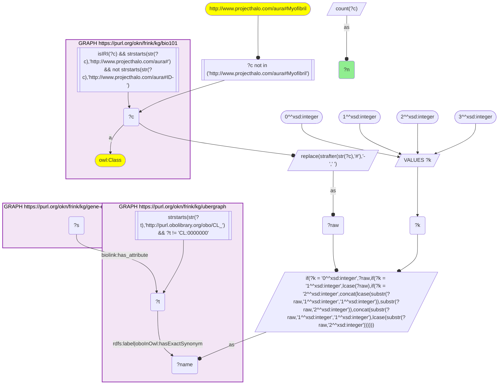
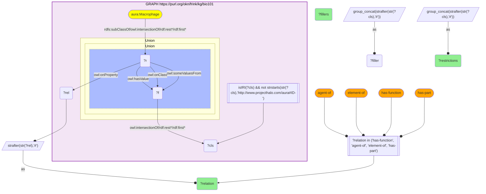
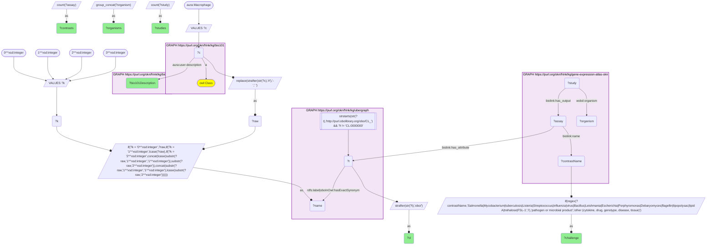
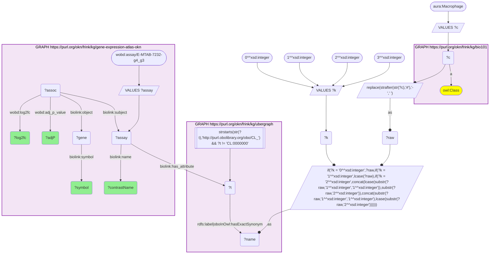

# AN11-Q2: The macrophage, from textbook functions in KB Bio 101 to Expression Atlas contrasts and a Salmonella response (bio101 × gene-expression-atlas-okn, CL label-bridged via ubergraph)

- **Date:** 2026-10-05
- **Model:** claude-opus-5-5
- **External MCP servers:** PubMed
- **SPARQL endpoint:** https://apps.okn.us/federation/sparql
- **Generated by:** mcp-okn v0.1.0 (build 8efca43)
- **Contents:** 4 queries · 4 query diagrams

## Knowledge graphs used

- `bio101` — <https://purl.org/okn/frink/kg/bio101>
- `ubergraph` — <https://purl.org/okn/frink/kg/ubergraph>
- `gene-expression-atlas-okn` — <https://purl.org/okn/frink/kg/gene-expression-atlas-okn>

## Conversation

👤 **User**

Crosswalk: `bio101` × `gene-expression-atlas-okn` on **CL (bio101 label), bridged through `ubergraph`** (crosswalk `KB4-cl-label-bio101-gxa`, verified_count 35). `bio101` (KB Bio 101, an OWL ontology of an introductory biology textbook) names each concept by its `owl:Class` IRI `http://www.projecthalo.com/aura#{Name}` and carries no `rdfs:label` and no external id, so the concept NAME is the only key: hyphens become spaces, and the name is matched in four case forms (as-is, all lower-case, first letter lowered, and sentence case) against `ubergraph` CL `rdfs:label | oboInOwl:hasExactSynonym`. bio101 states what a concept does only inside OWL restrictions (`owl:onProperty` + `owl:someValuesFrom`) under `rdfs:subClassOf`, plus an `aura:user-description` text. `gene-expression-atlas-okn` tags each differential-expression contrast (`biolink:Assay`) with its CL cell type on `biolink:has_attribute`, and holds per-gene `wobd:log2fc` and `wobd:adj_p_value` on associations whose `biolink:subject` is the contrast.

Research question: For the macrophage, what does KB Bio 101 say its functions are, and which Expression Atlas contrasts profile macrophages? In one contrast that tests the textbook role directly, which genes are most strongly induced?

Why the join is required: KB Bio 101 states the macrophage's role in textbook terms (it recognizes, engulfs and destroys invaders) but holds no measurements. Expression Atlas holds the measured macrophage responses but no account of what a macrophage is for. Only the name-to-CL bridge through ubergraph puts the textbook claim beside the data that tests it.

---

🧠 **Assistant**

**KB Bio 101 casts the macrophage as a defender: it recognizes, engulfs and destroys invaders. Expression Atlas has 136 macrophage contrasts in 59 studies, and 64 of those contrasts involve a pathogen or a microbial product.** In human macrophages infected with *Salmonella* Typhimurium, the most strongly induced gene is ACOD1, the enzyme that makes the antibacterial metabolite itaconate.

The skeleton join returns the catalogued 35 bio101 cell concepts. Restricted to `aura:Macrophage`, the name *Macrophage* lands on CL_0000235 *macrophage*. It is a one-word name, so the new sentence-case form is the same string as the name as-is, and the macrophage numbers below do not depend on it.

### What KB Bio 101 says a macrophage is and does

**Definition** (`aura:user-description`): "Macrophages are white blood cells within tissues, produced by the division of monocytes. They help to defend the body by destroying bacteria and other invaders."

**Restrictions on `aura:Macrophage`.** Each row is one or more `owl:someValuesFrom` restrictions; `&` joins the classes of one intersection filler.

| bio101 relation | Restrictions | What it says |
|---|---|---|
| `has-function` | 7 | Recognize (2 restrictions), Phagocytosis, Destroy & Impair, Immune-Response. Two more are generic cell functions it shares with every eukaryotic cell: cellular respiration (Metabolic-Pathway & Eukaryotic-Cellular-Respiration & Catabolic-Pathway) and active transport (Active-Movement-Of-Ions & Active-Transport & Cellular-Work & Generation-Of-Hydrogen-Ion-Gradient-Across-Biomembrane). |
| `agent-of` | 7 | Recognize (2), Phagocytosis, Destroy, Impair & Destroy, Immune-Response, Locomotion |
| `element-of` | 1 | Immune-System |
| `has-part` | 13 | Lysosome and Pseudopodium (the parts that matter for engulfing and digesting), plus the standard eukaryotic set: Nucleus, Mitochondrion, Ribosome, Rough and Smooth ER, Golgi-Apparatus, Peroxisome, Centrosome, Chromosome, Cytoplasm, Plasma-membrane |

The textbook model is therefore: **recognize, then phagocytose, then destroy**, as an element of the immune system and an agent of the immune response. It also gives the cell the parts that do this work, pseudopodia to engulf and lysosomes to digest, and it can move (Locomotion).

### What Expression Atlas measures in macrophages

The contrasts are split by whether their name mentions a pathogen or microbial product. The keyword list was Salmonella, Mycobacterium, tuberculosis, Listeria, Streptococcus, influenza, virus, Bacillus, Leishmania, Escherichia, Porphyromonas, Debaryomyces, flagellin, lipopolysaccharide, lipid A, trehalose dimycolate and FSL-1.

| Contrast type | Contrasts | Studies | Organisms |
|---|---|---|---|
| Pathogen or microbial product | 64 | 28 | human, mouse |
| Other (cytokine, drug, genotype, disease, tissue) | 72 | 42 | human, mouse, rat |
| **All macrophage contrasts** | **136** | **59** | human, mouse, rat |

The study counts overlap: 28 + 42 > 59, because some studies contain both kinds of contrast. The pathogen side covers *Salmonella*, *M. tuberculosis*, *Listeria*, *S. pneumoniae*, *Leishmania*, influenza viruses and a gammaherpesvirus, *Bacillus anthracis* spores, *E. coli*, *Porphyromonas gingivalis* and the yeast *Debaryomyces hansenii*. It also covers bacterial products such as LPS, lipid A, flagellin and trehalose dimycolate. So almost half of what the atlas measures in macrophages is their response to an invader, which is the role the textbook assigns them.

### The textbook role, measured: human macrophages + *Salmonella* Typhimurium

This is contrast E-MTAB-7232 g4_g3: *Salmonella enterica* serovar Typhimurium vs none, with no drug. It is one of the 136 bridged contrasts. Below are the top 12 genes by log2 fold change.

| Gene | log2FC | adj. p |
|---|---|---|
| ACOD1 | 14.1 | 5.6e-141 |
| IL6 | 13.4 | 2.1e-92 |
| IDO1 | 12.9 | 3.0e-159 |
| IL12B | 12.4 | 3.5e-41 |
| IL27 | 12.1 | 5.3e-97 |
| INHBA | 12.1 | 2.1e-155 |
| CRLF2 | 11.9 | 9.5e-46 |
| CSF2 | 11.8 | 2.5e-38 |
| CSF3 | 11.2 | 1.0e-53 |
| RSAD2 | 11.0 | 0 (stored as 0.0, below float precision) |
| TNIP3 | 10.9 | 6.7e-121 |
| VEGFC | 10.7 | 4.0e-24 |

**How the two sources line up:**

- **"Destroy" (bio101) and ACOD1 (GXA).** ACOD1, also called IRG1, is the top induced gene at about 17,000-fold. According to PubMed, it is a direct molecular handle on the textbook's *Destroy* function and its *Lysosome* part:
  - It makes itaconic acid, which inhibits isocitrate lyase and stops the growth of *Salmonella enterica* and *M. tuberculosis*. Silencing Irg1 in macrophages reduced their antimicrobial activity (Michelucci et al. 2013, PNAS, [DOI](https://doi.org/10.1073/pnas.1218599110)).
  - Itaconate induces lysosomal biogenesis through TFEB, the lysosome being the macrophage's main bacteria-killing organelle. Mice with an alkylation-deficient TFEB were more susceptible to *S.* Typhimurium (Zhang et al. 2022, Mol Cell, [DOI](https://doi.org/10.1016/j.molcel.2022.05.009)).
  - TFEB drives Irg1 and itaconate, and the itaconate is delivered into the *Salmonella*-containing vacuole to restrain the bacteria (Schuster et al. 2022, Nat Metab, [DOI](https://doi.org/10.1038/s42255-022-00605-w)).
- **"Immune-Response" and "element-of Immune-System" (bio101) against the cytokine genes (GXA).** IL6, IL12B, IL27, CSF2 (GM-CSF) and CSF3 (G-CSF) are secreted signals that recruit and activate other immune cells. They show the macrophage acting as an organizer of the immune response, not only as a phagocyte. IDO1 and RSAD2 (viperin) are further interferon-inducible defence genes.
- **What the textbook leaves out.** KB Bio 101 gives the macrophage no secretory or signalling function, and the strongest measured response is largely secretory: cytokines, growth factors such as VEGFC and INHBA, and immunometabolism through ACOD1. The two sources agree on the core role but differ in emphasis. The textbook encodes phagocytosis and destruction; the transcriptome is dominated by signalling.

Literature for ACOD1 is from PubMed abstracts (PMIDs 23610393, 35662396, 35864246); I read the abstracts, not the full text.

### Caveats

- **Label-bridged.** bio101 has no identifiers. *Macrophage* reaches CL_0000235 by exact name only, a confident match for this concept but still a name match.
- **Exact CL term only.** The 136 contrasts are those tagged with CL_0000235 itself. Contrasts tagged only with a CL child, such as alveolar macrophage or Kupffer cell, are not counted, so this is a lower bound on macrophage coverage in GXA.
- **The pathogen split is a keyword heuristic on contrast names.** It counts a contrast if a microbe or microbial product appears anywhere in its name, including as the background condition. For example, it counts 'ATF3 -/- vs wild type' in 'lipopolysaccharide', and 'chlorpromazine vs none' in 'Salmonella'. It may also miss pathogens named in a way the list doesn't cover.
- **bio101 restrictions are partly inherited.** The two generic functions, cellular respiration and active transport, and most of the organelle parts, are restated on every eukaryotic cell in KB Bio 101. The macrophage-specific content is Recognize, Phagocytosis, Destroy/Impair, Immune-Response, Locomotion, Immune-System, Pseudopodium and Lysosome.
- **One contrast, ranked by fold change.** The gene table is the top 12 by log2FC in a single human contrast, not a consensus across the 64 pathogen contrasts.

## SPARQL queries executed

#### Query 1

_2026-10-06T00:06:43+00:00 · `bio101`, `ubergraph`, `gene-expression-atlas-okn`_

```sparql
SELECT (COUNT(DISTINCT ?c) AS ?n) WHERE {
  { SELECT DISTINCT ?c ?t WHERE {
  { SELECT DISTINCT ?c ?name WHERE {
      GRAPH <https://purl.org/okn/frink/kg/bio101> { ?c a <http://www.w3.org/2002/07/owl#Class> .
        FILTER(isIRI(?c) && STRSTARTS(STR(?c),'http://www.projecthalo.com/aura#') && !STRSTARTS(STR(?c),'http://www.projecthalo.com/aura#ID-')) }
      FILTER(?c NOT IN (<http://www.projecthalo.com/aura#Myofibril>))  # homonyms (spot-checked 2026-10-05)
      BIND(REPLACE(STRAFTER(STR(?c),'#'),'-',' ') AS ?raw)
      VALUES ?k { 0 1 2 3 }  # as-is, all lower, first letter lowered, sentence case
      BIND(IF(?k = 0, ?raw, IF(?k = 1, LCASE(?raw), IF(?k = 2, CONCAT(LCASE(SUBSTR(?raw,1,1)),SUBSTR(?raw,2)),
                CONCAT(SUBSTR(?raw,1,1),LCASE(SUBSTR(?raw,2)))))) AS ?name)
  } }
    GRAPH <https://purl.org/okn/frink/kg/ubergraph> { ?t <http://www.w3.org/2000/01/rdf-schema#label>|<http://www.geneontology.org/formats/oboInOwl#hasExactSynonym> ?name .
      FILTER(STRSTARTS(STR(?t),'http://purl.obolibrary.org/obo/CL_') && ?t != <http://purl.obolibrary.org/obo/CL_0000000>) }
  } }
  GRAPH <https://purl.org/okn/frink/kg/gene-expression-atlas-okn> { ?s <https://w3id.org/biolink/vocab/has_attribute> ?t . }
}
```



_1 row(s)_

| n |
| --- |
| 35 |

#### Query 2

_2026-10-06T00:06:53+00:00 · `bio101`_

```sparql
PREFIX aura: <http://www.projecthalo.com/aura#>
PREFIX owl:  <http://www.w3.org/2002/07/owl#>
PREFIX rdf:  <http://www.w3.org/1999/02/22-rdf-syntax-ns#>
PREFIX rdfs: <http://www.w3.org/2000/01/rdf-schema#>
SELECT ?relation (COUNT(?r) AS ?restrictions) (GROUP_CONCAT(DISTINCT ?filler; separator=" | ") AS ?fillers)
WHERE {
  { SELECT ?r ?relation (GROUP_CONCAT(DISTINCT STRAFTER(STR(?cls), "#"); separator=" & ") AS ?filler) WHERE {
    GRAPH <https://purl.org/okn/frink/kg/bio101> {
      aura:Macrophage rdfs:subClassOf/(owl:intersectionOf/rdf:rest*/rdf:first)* ?r .
      ?r owl:onProperty ?rel .
      { ?r owl:someValuesFrom ?f } UNION { ?r owl:onClass ?f } UNION { ?r owl:hasValue ?f }
      ?f (owl:intersectionOf/rdf:rest*/rdf:first)* ?cls .
      FILTER(isIRI(?cls) && !STRSTARTS(STR(?cls), "http://www.projecthalo.com/aura#ID-"))
    }
    BIND(STRAFTER(STR(?rel), "#") AS ?relation)
  } GROUP BY ?r ?relation }
  FILTER(?relation IN ("has-function", "agent-of", "element-of", "has-part"))
}
GROUP BY ?relation ORDER BY ?relation
```



_4 row(s) — showing first 3_

| relation | restrictions | fillers |
| --- | --- | --- |
| agent-of | 7 | Immune-Response \| Destroy \| Locomotion \| Phagocytosis \| Recognize \| Impair & Destroy |
| element-of | 1 | Immune-System |
| has-function | 7 | Metabolic-Pathway & Eukaryotic-Cellular-Respiration & Catabolic-Pathway \| Recognize \| Phagocytosis \| Active-Movement-Of-Ions & Active-Transport & Cellular-Work & Generation-Of-Hydrogen-Ion-Gradient-Across-Biomembrane \| Destroy & Impair \| Immune-Response |

#### Query 3

_2026-10-06T00:07:02+00:00 · `bio101`, `ubergraph`, `gene-expression-atlas-okn`_

```sparql
PREFIX biolink: <https://w3id.org/biolink/vocab/>
PREFIX wobd: <http://purl.org/okn/wobd/>
PREFIX aura: <http://www.projecthalo.com/aura#>
SELECT ?bio101Description ?cl ?challenge (COUNT(DISTINCT ?assay) AS ?contrasts) (COUNT(DISTINCT ?study) AS ?studies)
       (GROUP_CONCAT(DISTINCT ?organism; separator="; ") AS ?organisms) WHERE {
  { SELECT DISTINCT ?c ?t WHERE {
  { SELECT DISTINCT ?c ?name WHERE {
      VALUES ?c { aura:Macrophage }
      GRAPH <https://purl.org/okn/frink/kg/bio101> { ?c a <http://www.w3.org/2002/07/owl#Class> }
      BIND(REPLACE(STRAFTER(STR(?c),'#'),'-',' ') AS ?raw)
      VALUES ?k { 0 1 2 3 }  # as-is, all lower, first letter lowered, sentence case
      BIND(IF(?k = 0, ?raw, IF(?k = 1, LCASE(?raw), IF(?k = 2, CONCAT(LCASE(SUBSTR(?raw,1,1)),SUBSTR(?raw,2)),
                CONCAT(SUBSTR(?raw,1,1),LCASE(SUBSTR(?raw,2)))))) AS ?name)
  } }
    GRAPH <https://purl.org/okn/frink/kg/ubergraph> { ?t <http://www.w3.org/2000/01/rdf-schema#label>|<http://www.geneontology.org/formats/oboInOwl#hasExactSynonym> ?name .
      FILTER(STRSTARTS(STR(?t),'http://purl.obolibrary.org/obo/CL_') && ?t != <http://purl.obolibrary.org/obo/CL_0000000>) }
  } }
  GRAPH <https://purl.org/okn/frink/kg/bio101> { ?c aura:user-description ?bio101Description }
  GRAPH <https://purl.org/okn/frink/kg/gene-expression-atlas-okn> {
    ?assay biolink:has_attribute ?t ; biolink:name ?contrastName .
    ?study biolink:has_output ?assay ; wobd:organism ?organism .
  }
  BIND(IF(REGEX(?contrastName, "Salmonella|Mycobacterium|tuberculosis|Listeria|Streptococcus|influenza|virus|Bacillus|Leishmania|Escherichia|Porphyromonas|Debaryomyces|flagellin|lipopolysac|lipid A|trehalose|FSL-1", "i"),
          "pathogen or microbial product", "other (cytokine, drug, genotype, disease, tissue)") AS ?challenge)
  BIND(STRAFTER(STR(?t),'obo/') AS ?cl)
} GROUP BY ?bio101Description ?cl ?challenge ORDER BY DESC(?contrasts)
```



_2 row(s)_

| bio101Description | cl | challenge | contrasts | studies | organisms |
| --- | --- | --- | --- | --- | --- |
| Macrophages are white blood cells within tissues, produced by the division of monocytes. They help to defend the body by destroying bacteria and other invaders. | CL_0000235 | other (cytokine, drug, genotype, disease, tissue) | 72 | 42 | Mus musculus; Homo sapiens; Rattus norvegicus |
| Macrophages are white blood cells within tissues, produced by the division of monocytes. They help to defend the body by destroying bacteria and other invaders. | CL_0000235 | pathogen or microbial product | 64 | 28 | Homo sapiens; Mus musculus |

#### Query 4

_2026-10-06T00:07:11+00:00 · `bio101`, `ubergraph`, `gene-expression-atlas-okn`_

```sparql
PREFIX biolink: <https://w3id.org/biolink/vocab/>
PREFIX wobd: <http://purl.org/okn/wobd/>
PREFIX aura: <http://www.projecthalo.com/aura#>
SELECT ?contrastName ?symbol ?log2fc ?adjP WHERE {
  { SELECT DISTINCT ?c ?t WHERE {
  { SELECT DISTINCT ?c ?name WHERE {
      VALUES ?c { aura:Macrophage }
      GRAPH <https://purl.org/okn/frink/kg/bio101> { ?c a <http://www.w3.org/2002/07/owl#Class> }
      BIND(REPLACE(STRAFTER(STR(?c),'#'),'-',' ') AS ?raw)
      VALUES ?k { 0 1 2 3 }  # as-is, all lower, first letter lowered, sentence case
      BIND(IF(?k = 0, ?raw, IF(?k = 1, LCASE(?raw), IF(?k = 2, CONCAT(LCASE(SUBSTR(?raw,1,1)),SUBSTR(?raw,2)),
                CONCAT(SUBSTR(?raw,1,1),LCASE(SUBSTR(?raw,2)))))) AS ?name)
  } }
    GRAPH <https://purl.org/okn/frink/kg/ubergraph> { ?t <http://www.w3.org/2000/01/rdf-schema#label>|<http://www.geneontology.org/formats/oboInOwl#hasExactSynonym> ?name .
      FILTER(STRSTARTS(STR(?t),'http://purl.obolibrary.org/obo/CL_') && ?t != <http://purl.obolibrary.org/obo/CL_0000000>) }
  } }
  GRAPH <https://purl.org/okn/frink/kg/gene-expression-atlas-okn> {
    VALUES ?assay { <http://purl.org/okn/wobd/assay/E-MTAB-7232-g4_g3> }
    ?assay biolink:has_attribute ?t ; biolink:name ?contrastName .
    ?assoc biolink:subject ?assay ; biolink:object ?gene ; wobd:log2fc ?log2fc ; wobd:adj_p_value ?adjP .
    ?gene biolink:symbol ?symbol .
  }
} ORDER BY DESC(?log2fc) LIMIT 12
```



_12 row(s) — showing first 5_

| contrastName | symbol | log2fc | adjP |
| --- | --- | --- | --- |
| 'Salmonella enterica subsp. enterica serovar Typhimurium' vs 'none' in 'none' | ACOD1 | 14.1 | 5.58132e-141 |
| 'Salmonella enterica subsp. enterica serovar Typhimurium' vs 'none' in 'none' | IL6 | 13.4 | 2.06641e-92 |
| 'Salmonella enterica subsp. enterica serovar Typhimurium' vs 'none' in 'none' | IDO1 | 12.9 | 3.01049e-159 |
| 'Salmonella enterica subsp. enterica serovar Typhimurium' vs 'none' in 'none' | IL12B | 12.4 | 3.46599e-41 |
| 'Salmonella enterica subsp. enterica serovar Typhimurium' vs 'none' in 'none' | IL27 | 12.1 | 5.26306e-97 |
