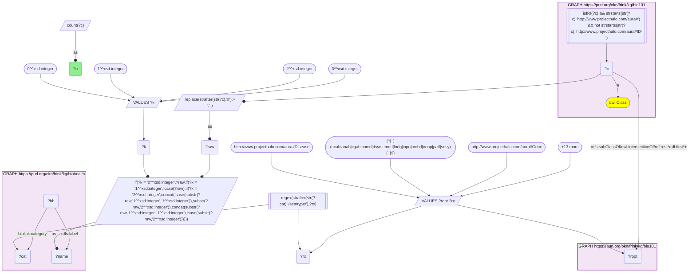
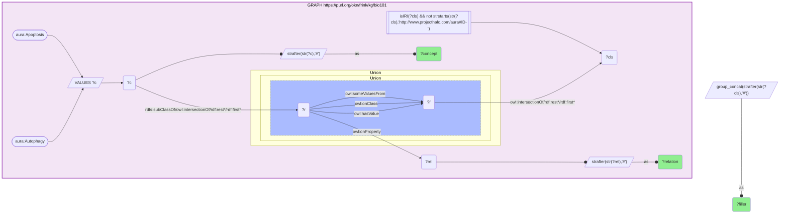
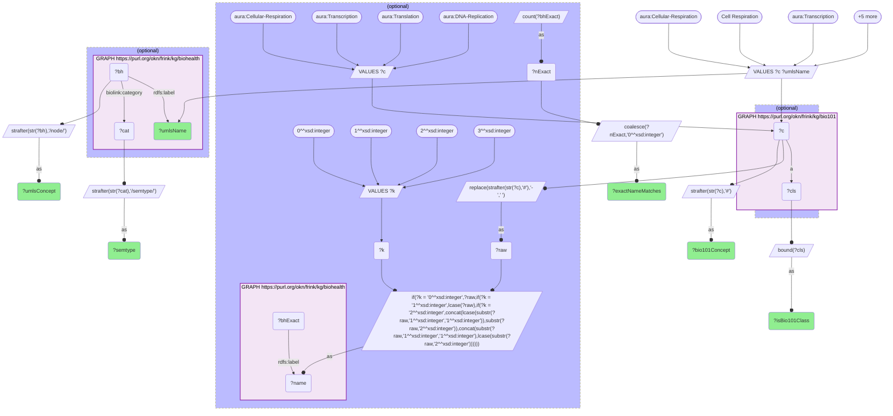

# BIO01-Q1: Textbook cellular processes (apoptosis, autophagy, glycolysis …) and the diseases BioHealthKG's literature graph links them to (bio101 × biohealth, concept label, type-scoped)

- **Date:** 2026-10-05
- **Model:** claude-opus-5-5
- **SPARQL endpoint:** https://apps.okn.us/federation/sparql
- **Generated by:** mcp-okn v0.1.0 (build 8efca43)
- **Contents:** 6 queries · 6 query diagrams

## Knowledge graphs used

- `bio101` — <https://purl.org/okn/frink/kg/bio101>
- `biohealth` — <https://purl.org/okn/frink/kg/biohealth>

## Conversation

👤 **User**

Crosswalk: `bio101` × `biohealth` on **concept label (bio101 concept name ↔ UMLS concept name), type-scoped** (crosswalk `KB7-label-bio101-biohealth`, verified_count 1213). bio101 carries the key only as the local name of its `owl:Class` IRI (`aura:Apoptosis` → "Apoptosis", hyphens → spaces; no `rdfs:label`, no external id), matched in four case forms (as-is, all lower-case, first letter lowered, sentence case). biohealth carries it as the `rdfs:label` (UMLS concept name) of node `https://biohealthkg.proto-okn.net/kg/node/C{cui}`, whose `biolink:category` (UMLS semantic type) must agree with the bio101 upper class (here Event ↔ UMLS Physiology / Phenomena / Procedures / Activities / Disorders).

Research question: for cellular processes that KB Bio 101 teaches (apoptosis, autophagy, glycolysis, oxidative phosphorylation, phagocytosis, DNA repair, protein folding, DNA methylation), which diseases does BioHealthKG's literature graph link the matching UMLS concept to, and which diseases are linked to all of them?

Why the join is required: KB Bio 101 describes these processes as textbook events (definition, subevents, site, agent) and carries no identifiers; BioHealthKG holds literature-mined predications linking UMLS concepts to diseases but no textbook model of the process. Only the name bridge puts a textbook concept next to its disease neighbourhood in the literature.

---

🧠 **Assistant**

**All eight processes are on the type-scoped bridge. BioHealthKG links each one to between 45 (protein folding) and 2,066 (apoptosis) disease concepts. Eight disease concepts are linked to all eight processes. Five of them are specific diseases, and the neurodegenerative trio leads: Alzheimer's disease, Parkinson disease and amyotrophic lateral sclerosis.**

**How the join runs.** Query 1 is the crosswalk's stored skeleton and returns the verified 1,213 bridged bio101 concepts. Queries 2–4 reuse the same join, restricted to the eight processes: the same four case forms of the name (as-is, all lower-case, first letter lowered, sentence case), the same bound-literal match on biohealth `rdfs:label`, and the same type-agreement row for the bio101 `Event` root. They then follow biohealth's reified `rdf:Statement` nodes (`rdf:subject` / `rdf:predicate` / `rdf:object`) in both directions to a partner whose UMLS semantic type is a disorder type. The disorder types are the DISO group without findings (`fndg`) and signs/symptoms (`sosy`): `dsyn`, `neop`, `mobd`, `patf`, `cgab`, `acab`, `anab`, `comd`, `emod`, `inpo`. Negated predications (`NEG_*`) are excluded in Queries 2–3. An exploratory pass over the twelve candidate processes, trying all four case forms, showed that each of the eight is on the bridge with a single UMLS concept. Seven match on the as-is form (which for single-word names is also the sentence-case form); Protein-Folding matches only on the all-lower-case form, "protein folding". The sentence-case form added to the recipe changes nothing for this panel.

### 1. Each process and its disease neighbourhood (Query 2)

| bio101 concept | Textbook definition (bio101 `user-description`, abridged) | biohealth UMLS concept | Disease concepts linked | Predications |
|---|---|---|---|---|
| Apoptosis | a program of controlled cell suicide | C0162638 Apoptosis | 2,066 | 3,636 |
| Autophagy | degradation of a cell's own components through the lysosomal machinery | C0004391 Autophagy | 1,105 | 1,836 |
| DNA-Methylation | attachment of methyl groups to DNA bases, usually regulating gene expression | C0376452 DNA Methylation | 562 | 917 |
| DNA-Repair | processes by which a cell identifies and corrects DNA damage | C0012899 DNA Repair | 387 | 587 |
| Phagocytosis | engulfing solid particles to form an internal phagosome | C0031308 Phagocytosis | 383 | 483 |
| Glycolysis | breaks a glucose into two pyruvate, yielding two ATP | C0017952 Glycolysis | 258 | 309 |
| Oxidative-Phosphorylation | uses energy from nutrient oxidation to produce ATP | C0030013 Oxidative Phosphorylation | 151 | 180 |
| Protein-Folding | altering a polypeptide's shape to create a functional protein | C0162847 protein folding | 45 | 56 |

The ranking follows how much literature discusses each process in a disease context. Apoptosis and autophagy dominate, and the two energy-metabolism pathways and protein folding trail.

### 2. Diseases linked to (nearly) every process (Query 3)

Linked to **all eight** processes:

| Disease concept (biohealth) | UMLS type | Predications across the eight |
|---|---|---|
| Disease *(generic)* | dsyn | 32 |
| Alzheimer's Disease | dsyn | 25 |
| Neurodegenerative Disorders | dsyn | 25 |
| Hyperglycemia | dsyn | 22 |
| Parkinson Disease | dsyn | 22 |
| Diabetes | dsyn | 20 |
| Hereditary Diseases *(generic)* | dsyn | 18 |
| Amyotrophic Lateral Sclerosis | dsyn | 16 |

Linked to **seven** of the eight. These are the first 17 of that tier, ordered by predication count; the tier continues past the query's `LIMIT 25`:

| Disease concept | Missing process | Predications |
|---|---|---|
| Malignant Neoplasms | Oxidative-Phosphorylation | 26 |
| HIV Infections | Protein-Folding | 20 |
| Obesity | Protein-Folding | 20 |
| Lupus Erythematosus, Systemic | Protein-Folding | 20 |
| Rheumatoid Arthritis | Protein-Folding | 20 |
| Ischemia (patf) | Phagocytosis | 19 |
| Syndrome *(generic)* | Protein-Folding | 19 |
| Atherosclerosis | Protein-Folding | 17 |
| Chronic Obstructive Airway Disease | Protein-Folding | 17 |
| Little's Disease | Oxidative-Phosphorylation | 17 |
| Cerebrovascular accident | Protein-Folding | 16 |
| Age related macular degeneration | Protein-Folding | 15 |
| Multiple Sclerosis | Protein-Folding | 15 |
| Arteriosclerosis | Protein-Folding | 14 |
| Bacterial Infections | Oxidative-Phosphorylation | 14 |
| inflammatory response (patf) | Protein-Folding | 13 |
| Liver diseases | DNA-Repair | 13 |

Protein folding is the process most often missing. It has the smallest disease neighbourhood (45), so only the most heavily studied diseases reach it. Malignant neoplasms reach every process except oxidative phosphorylation, while glycolysis is present for them.

### 3. How the literature connects the neurodegenerative trio to each process (Query 4)

D→P = disease is the subject and the process the object; P→D = the reverse. `NEG_*` predications are deliberately left in here, to show the negated assertions that Queries 2–3 drop.

| Process | Alzheimer's Disease | Parkinson Disease | Amyotrophic Lateral Sclerosis |
|---|---|---|---|
| Apoptosis | D→P affects, disrupts, manifestation_of · P→D affects | D→P affects, disrupts, manifestation_of · P→D affects, associated_with | D→P affects · P→D affects, associated_with, NEG_AFFECTS |
| Autophagy | D→P affects, disrupts · P→D affects, NEG_AFFECTS | D→P affects, disrupts, manifestation_of · P→D affects, NEG_AFFECTS | D→P affects, disrupts · P→D affects |
| DNA-Methylation | D→P affects, associated_with, NEG_ASSOCIATED_WITH · P→D affects, causes, coexists_with | D→P associated_with · P→D affects, causes, coexists_with | D→P affects, associated_with · P→D affects, coexists_with |
| DNA-Repair | D→P associated_with, manifestation_of · P→D affects, causes | D→P associated_with · P→D causes | D→P associated_with · P→D affects |
| Phagocytosis | D→P affects, disrupts · P→D affects | P→D affects | D→P affects |
| Glycolysis | D→P associated_with · P→D coexists_with | D→P associated_with · P→D coexists_with | P→D coexists_with |
| Oxidative-Phosphorylation | D→P associated_with · P→D coexists_with | D→P associated_with · P→D coexists_with | P→D coexists_with |
| Protein-Folding | D→P associated_with · P→D coexists_with | D→P associated_with · P→D coexists_with | P→D coexists_with |

The directional predicates cluster on apoptosis, autophagy, phagocytosis, and DNA methylation/repair: the disease *disrupts* the process, a process change is a *manifestation_of* the disease, and a process *causes* the disease. Glycolysis, oxidative phosphorylation and protein folding reach the trio only through the weakest predicates, `associated_with` and `coexists_with`. That is a striking gap for protein folding, given how central misfolding is to these diseases. One possible reason is that papers name it as *misfolding* or *aggregation*, which would normalise to other UMLS concepts. This was not checked here.

### 4. What the textbook itself says (Query 5)

bio101 holds its relations only inside OWL restrictions. For the two best-connected processes:

- **Apoptosis:** object Eukaryotic-Cell; subevents Blebbing, Contract, Destroy, Intracellular-Digestion, Produce, and hydrolysis (decomposition / exergonic) reactions; first subevent a hydrolysis reaction; *prevents* Damage.
- **Autophagy:** agent Lysosomal-Enzyme; site and is-function-of Lysosome; object Debris; base Eukaryotic-Cell; first subevent Take-In; subevents Take-In, Fusion, Create, Destroy & Impair.

No restriction filler for either process is a disease. The textbook gives the mechanism, BioHealthKG gives the clinical context, and only the join pairs them.

### 5. The bridge is a lower bound (Query 6)

Four core textbook processes are bio101 classes but still do not bridge, even with the added sentence-case form. None of the four case forms of their bio101 name (for example "Cellular Respiration", "cellular respiration", "cellular Respiration", "Cellular respiration") is a biohealth label, because UMLS names them differently:

| bio101 concept | biohealth labels matching any of the four case forms | UMLS name tried | In biohealth? |
|---|---|---|---|
| Cellular-Respiration | 0 | Cell Respiration | yes, C0282636 (celf) |
| Transcription | 0 | Transcription, Genetic | yes, C0040649 (genf) |
| Translation | 0 | Protein Biosynthesis | yes, C0597295 (moft) |
| DNA-Replication | 0 | DNA Replication | no node under that exact name |

The exact-name crosswalk cannot reach synonyms. DNA-Replication is a further case-form gap: its as-is form "DNA Replication" is not a biohealth label either, and sentence case yields "Dna replication", which no UMLS name uses. Query 6 lies outside the crosswalk: it is a recall check on hand-picked UMLS names, not part of the join.

### Caveats

- **Label match, type-scoped.** The bridge pairs names, not identifiers. Type agreement removes homonyms, and the crosswalk record's 30-pair spot check found 29 correct. All eight processes here land on a process-type UMLS concept (`celf`, `moft` or `genf`), so they are not homonym risks.
- **Literature-mined, not curated.** BioHealthKG predications are extracted from PubMed text (`dc:source` "PubMed"). A link means some sentence was parsed that way, not that the relation is established. Negations and hedges can be mis-parsed, and the NEG_AFFECTS edges alongside affects edges in Table 3 show that the literature asserts both.
- **Counts are distinct predications, not citations.** Each reified statement stands for one distinct (subject, predicate, object) triple. So "Predications" measures how many *different* relation types and directions connect two concepts, not how many papers support them.
- **"Disease" is broad.** The disorder filter keeps generic nodes (`Disease`, `Syndrome`, `Hereditary Diseases`) and pathologic functions (`Ischemia`, `inflammatory response`). They are flagged in the tables rather than silently removed.
- **Little's Disease** (spastic diplegic cerebral palsy) linking to seven of these processes is unexpected. It may reflect concept-normalisation noise in the literature mining, but that was not verified here.
- **Panel choice.** The eight processes were chosen after confirming that each one is on the bridge. Other bridged processes (mitosis, endocytosis, photosynthesis, signal transduction and more) can be swapped into the same `VALUES` list.

## SPARQL queries executed

#### Query 1

_2026-10-06T00:07:17+00:00 · `bio101`, `biohealth`_

```sparql
SELECT (COUNT(DISTINCT ?c) AS ?n) WHERE {
  { SELECT DISTINCT ?c ?bh ?cat WHERE {
  { SELECT DISTINCT ?c ?name WHERE {
      GRAPH <https://purl.org/okn/frink/kg/bio101> { ?c a <http://www.w3.org/2002/07/owl#Class> .
        FILTER(isIRI(?c) && STRSTARTS(STR(?c),'http://www.projecthalo.com/aura#') && !STRSTARTS(STR(?c),'http://www.projecthalo.com/aura#ID-')) }
      BIND(REPLACE(STRAFTER(STR(?c),'#'),'-',' ') AS ?raw)
      VALUES ?k { 0 1 2 3 }  # as-is, all lower, first letter lowered, sentence case
      BIND(IF(?k = 0, ?raw, IF(?k = 1, LCASE(?raw), IF(?k = 2, CONCAT(LCASE(SUBSTR(?raw,1,1)),SUBSTR(?raw,2)),
                CONCAT(SUBSTR(?raw,1,1),LCASE(SUBSTR(?raw,2)))))) AS ?name)
  } }
    GRAPH <https://purl.org/okn/frink/kg/biohealth> { ?bh <http://www.w3.org/2000/01/rdf-schema#label> ?name ;
        <https://w3id.org/biolink/vocab/category> ?cat . }
  } }
  # type agreement: the bio101 upper class and the UMLS semantic group of ?cat must agree
  VALUES (?root ?rx) {
    (<http://www.projecthalo.com/aura#Disease> "(^|_)(acab|anab|cgab|comd|dsyn|emod|fndg|inpo|mobd|neop|patf|sosy)(_|$)")  # Disease <-> UMLS group DISO
    (<http://www.projecthalo.com/aura#Gene> "(^|_)(amas|crbs|gngm|mosq|nusq)(_|$)")  # Gene <-> UMLS group GENE
    (<http://www.projecthalo.com/aura#Organism> "(^|_)(alga|amph|anim|arch|bact|bird|euka|fish|fngs|humn|invt|mamm|orgm|plnt|rept|virs|vtbt)(_|$)")  # Organism <-> UMLS group LIVB
    (<http://www.projecthalo.com/aura#Cell> "(^|_)(anst|bdsu|bdsy|blor|bpoc|bsoj|celc|cell|emst|ffas|tisu)(_|$)")  # Cell <-> UMLS group ANAT
    (<http://www.projecthalo.com/aura#Chemical-Entity> "(^|_)(aapp|amas|antb|bacs|bodm|carb|chem|chvf|chvs|clnd|crbs|eico|elii|enzy|gngm|hops|horm|imft|inch|irda|lipd|mosq|nnon|nsba|nusq|opco|orch|phsu|rcpt|strd|vita)(_|$)")  # Chemical-Entity <-> UMLS group CHEM/GENE
    (<http://www.projecthalo.com/aura#Living-Entity> "(^|_)(alga|amph|anim|anst|arch|bact|bdsu|bdsy|bird|blor|bpoc|bsoj|celc|cell|emst|euka|ffas|fish|fngs|humn|invt|mamm|orgm|plnt|rept|tisu|virs|vtbt)(_|$)")  # Living-Entity <-> UMLS group ANAT/LIVB
    (<http://www.projecthalo.com/aura#Event> "(^|_)(acab|acty|anab|bhvr|biof|bmod|celf|cgab|clna|comd|diap|dora|dsyn|edac|eehu|emod|evnt|fndg|genf|gora|hcpp|hlca|inbe|inpo|lbpr|lbtr|mbrt|mcha|menp|mobd|moft|neop|npop|ocac|ocdi|orga|orgf|ortf|patf|phpr|phsf|resa|socb|sosy|topp)(_|$)")  # Event <-> UMLS group PHYS/PHEN/PROC/ACTI/OCCU/DISO
    (<http://www.projecthalo.com/aura#Tangible-Entity> "(^|_)(aapp|anst|antb|bacs|bdsu|bdsy|blor|bodm|bpoc|bsoj|carb|celc|cell|chem|chvf|chvs|clnd|eico|elii|emst|enzy|ffas|hops|horm|imft|inch|irda|lipd|nnon|nsba|opco|orch|phsu|rcpt|strd|tisu|vita)(_|$)")  # Tangible-Entity <-> UMLS group ANAT/CHEM
  }
  FILTER(REGEX(STRAFTER(STR(?cat), '/semtype/'), ?rx))
  GRAPH <https://purl.org/okn/frink/kg/bio101> { ?c (<http://www.w3.org/2000/01/rdf-schema#subClassOf>/(<http://www.w3.org/2002/07/owl#intersectionOf>/<http://www.w3.org/1999/02/22-rdf-syntax-ns#rest>*/<http://www.w3.org/1999/02/22-rdf-syntax-ns#first>)*)+ ?root . }
}
```



_1 row(s)_

| n |
| --- |
| 1213 |

#### Query 2

_2026-10-06T00:07:39+00:00 · `bio101`, `biohealth`_

```sparql
PREFIX aura: <http://www.projecthalo.com/aura#>
PREFIX owl: <http://www.w3.org/2002/07/owl#>
PREFIX rdf: <http://www.w3.org/1999/02/22-rdf-syntax-ns#>
PREFIX rdfs: <http://www.w3.org/2000/01/rdf-schema#>
PREFIX biolink: <https://w3id.org/biolink/vocab/>
SELECT ?concept ?umlsConcept ?umlsName (COUNT(DISTINCT ?d) AS ?diseases) (COUNT(DISTINCT ?st) AS ?statements) (SAMPLE(?def) AS ?bio101Definition) WHERE {
  {
    { SELECT DISTINCT ?c ?bh WHERE {
      { SELECT DISTINCT ?c ?bh ?cat WHERE {
        { SELECT DISTINCT ?c ?name WHERE {
            VALUES ?c { aura:Apoptosis aura:Autophagy aura:Glycolysis aura:Oxidative-Phosphorylation aura:Phagocytosis aura:DNA-Repair aura:Protein-Folding aura:DNA-Methylation }
            GRAPH <https://purl.org/okn/frink/kg/bio101> { ?c a owl:Class }
            BIND(REPLACE(STRAFTER(STR(?c),'#'),'-',' ') AS ?raw)
            VALUES ?k { 0 1 2 3 }  # as-is, all lower, first letter lowered, sentence case
            BIND(IF(?k = 0, ?raw, IF(?k = 1, LCASE(?raw), IF(?k = 2, CONCAT(LCASE(SUBSTR(?raw,1,1)),SUBSTR(?raw,2)),
                      CONCAT(SUBSTR(?raw,1,1),LCASE(SUBSTR(?raw,2)))))) AS ?name)
        } }
        GRAPH <https://purl.org/okn/frink/kg/biohealth> { ?bh rdfs:label ?name ; biolink:category ?cat . }
      } }
      # type agreement, as in the skeleton: bio101 Event <-> UMLS PHYS/PHEN/PROC/ACTI/OCCU/DISO
      VALUES (?root ?rx) { (aura:Event "(^|_)(acab|acty|anab|bhvr|biof|bmod|celf|cgab|clna|comd|diap|dora|dsyn|edac|eehu|emod|evnt|fndg|genf|gora|hcpp|hlca|inbe|inpo|lbpr|lbtr|mbrt|mcha|menp|mobd|moft|neop|npop|ocac|ocdi|orga|orgf|ortf|patf|phpr|phsf|resa|socb|sosy|topp)(_|$)") }
      FILTER(REGEX(STRAFTER(STR(?cat), '/semtype/'), ?rx))
      GRAPH <https://purl.org/okn/frink/kg/bio101> { ?c (rdfs:subClassOf/(owl:intersectionOf/rdf:rest*/rdf:first)*)+ ?root . }
    } }
    GRAPH <https://purl.org/okn/frink/kg/biohealth> { ?st rdf:subject ?bh ; rdf:object ?d ; rdf:predicate ?p . ?d biolink:category ?dcat . }
  }
  UNION
  {
    { SELECT DISTINCT ?c ?bh WHERE {
      { SELECT DISTINCT ?c ?bh ?cat WHERE {
        { SELECT DISTINCT ?c ?name WHERE {
            VALUES ?c { aura:Apoptosis aura:Autophagy aura:Glycolysis aura:Oxidative-Phosphorylation aura:Phagocytosis aura:DNA-Repair aura:Protein-Folding aura:DNA-Methylation }
            GRAPH <https://purl.org/okn/frink/kg/bio101> { ?c a owl:Class }
            BIND(REPLACE(STRAFTER(STR(?c),'#'),'-',' ') AS ?raw)
            VALUES ?k { 0 1 2 3 }  # as-is, all lower, first letter lowered, sentence case
            BIND(IF(?k = 0, ?raw, IF(?k = 1, LCASE(?raw), IF(?k = 2, CONCAT(LCASE(SUBSTR(?raw,1,1)),SUBSTR(?raw,2)),
                      CONCAT(SUBSTR(?raw,1,1),LCASE(SUBSTR(?raw,2)))))) AS ?name)
        } }
        GRAPH <https://purl.org/okn/frink/kg/biohealth> { ?bh rdfs:label ?name ; biolink:category ?cat . }
      } }
      # type agreement, as in the skeleton: bio101 Event <-> UMLS PHYS/PHEN/PROC/ACTI/OCCU/DISO
      VALUES (?root ?rx) { (aura:Event "(^|_)(acab|acty|anab|bhvr|biof|bmod|celf|cgab|clna|comd|diap|dora|dsyn|edac|eehu|emod|evnt|fndg|genf|gora|hcpp|hlca|inbe|inpo|lbpr|lbtr|mbrt|mcha|menp|mobd|moft|neop|npop|ocac|ocdi|orga|orgf|ortf|patf|phpr|phsf|resa|socb|sosy|topp)(_|$)") }
      FILTER(REGEX(STRAFTER(STR(?cat), '/semtype/'), ?rx))
      GRAPH <https://purl.org/okn/frink/kg/bio101> { ?c (rdfs:subClassOf/(owl:intersectionOf/rdf:rest*/rdf:first)*)+ ?root . }
    } }
    GRAPH <https://purl.org/okn/frink/kg/biohealth> { ?st rdf:object ?bh ; rdf:subject ?d ; rdf:predicate ?p . ?d biolink:category ?dcat . }
  }
  FILTER(!CONTAINS(STR(?p), "/NEG_"))
  FILTER(REGEX(STRAFTER(STR(?dcat), '/semtype/'), "(^|_)(acab|anab|cgab|comd|dsyn|emod|inpo|mobd|neop|patf)(_|$)"))
  GRAPH <https://purl.org/okn/frink/kg/biohealth> { ?bh rdfs:label ?umlsName }
  OPTIONAL { GRAPH <https://purl.org/okn/frink/kg/bio101> { ?c aura:user-description ?def } }
  BIND(STRAFTER(STR(?c), "#") AS ?concept)
  BIND(STRAFTER(STR(?bh), "/node/") AS ?umlsConcept)
} GROUP BY ?concept ?umlsConcept ?umlsName ORDER BY DESC(?diseases)
```



```mermaid
graph TD
classDef projected fill:lightgreen;
classDef literal fill:orange;
classDef iri fill:yellow;
  q2v15("?bh")
  q2v1("?bio101Definition"):::projected 
  q2v16("?c")
  q2v17("?cat")
  q2v6("?concept"):::projected 
  q2v24("?d")
  q2v14("?dcat")
  q2v25("?def")
  q2v3("?diseases"):::projected 
  q2v20("?k")
  q2v19("?name")
  q2v13("?p")
  q2v21("?raw")
  q2v22("?root")
  q2v18("?rx")
  q2v23("?st")
  q2v2("?statements"):::projected 
  q2v5("?umlsConcept"):::projected 
  q2v4("?umlsName"):::projected 
  q2f0[["not contains(str(?p),'/NEG_') && regex(strafter(str(?dcat),'/semtype/'),'(^|_)(acab|anab|cgab|comd|dsyn|emod|inpo|mobd|neop|patf)(_|$)')"]]
  q2f0 --> q2v13
  q2f0 --> q2v14
  subgraph q2union0[" Union "]
  style q2union0 color:#000;
  subgraph q2union0l[" "]
    style q2union0l fill:#abf,stroke-dasharray: 3 3;
    q2f1[["regex(strafter(str(?cat),'/semtype/'),?rx)"]]
    q2f1 --> q2v17
    q2f1 --> q2v18
    q2bind0[/"VALUES ?c"/]
    q2bind0-->q2v16
    q2bind00(["aura:Apoptosis"])
    q2bind00 --> q2bind0
    q2bind01(["aura:Autophagy"])
    q2bind01 --> q2bind0
    q2bind02(["aura:Glycolysis"])
    q2bind02 --> q2bind0
    q2bind0more([+5 more])
    q2bind0more --> q2bind0
    subgraph q2graph0["GRAPH https://purl.org/okn/frink/kg/bio101"]
      style q2graph0 fill:#f3e5f5,stroke:#8e24aa,stroke-width:2px,color:#000;
      q2graph0c2(["owl:Class"]):::iri 
      q2v16 --"a"--> q2graph0c2
    end
    q2bind1[/"replace(strafter(str(?c),'#'),'-',' ')"/]
    q2v16 --o q2bind1
    q2bind1 --as--o q2v21
    q2bind2[/"VALUES ?k"/]
    q2bind2-->q2v20
    q2bind20(["0^^xsd:integer"])
    q2bind20 --> q2bind2
    q2bind21(["1^^xsd:integer"])
    q2bind21 --> q2bind2
    q2bind22(["2^^xsd:integer"])
    q2bind22 --> q2bind2
    q2bind23(["3^^xsd:integer"])
    q2bind23 --> q2bind2
    q2bind3[/"if(?k = '0^^xsd:integer',?raw,if(?k = '1^^xsd:integer',lcase(?raw),if(?k = '2^^xsd:integer',concat(lcase(substr(?raw,'1^^xsd:integer','1^^xsd:integer')),substr(?raw,'2^^xsd:integer')),concat(substr(?raw,'1^^xsd:integer','1^^xsd:integer'),lcase(substr(?raw,'2^^xsd:integer'))))))"/]
    q2v20 --o q2bind3
    q2v21 --o q2bind3
    q2bind3 --as--o q2v19
    subgraph q2graph1["GRAPH https://purl.org/okn/frink/kg/biohealth"]
      style q2graph1 fill:#f3e5f5,stroke:#8e24aa,stroke-width:2px,color:#000;
      q2v15 --"rdfs:label"--> q2v19
      q2v15 --"biolink:category"--> q2v17
    end
    q2bind4[/"VALUES ?root ?rx"/]
    q2bind4-->q2v22
    q2bind4-->q2v18
    q2bind40(["aura:Event"])
    q2bind40 --> q2bind4
    q2bind41(["(^|_)(acab|acty|anab|bhvr|biof|bmod|celf|cgab|clna|comd|diap|dora|dsyn|edac|eehu|emod|evnt|fndg|genf|gora|hcpp|hlca|inbe|inpo|lbpr|lbtr|mbrt|mcha|menp|mobd|moft|neop|npop|ocac|ocdi|orga|orgf|ortf|patf|phpr|phsf|resa|socb|sosy|topp)(_|$)"])
    q2bind41 --> q2bind4
    subgraph q2graph2["GRAPH https://purl.org/okn/frink/kg/bio101"]
      style q2graph2 fill:#f3e5f5,stroke:#8e24aa,stroke-width:2px,color:#000;
      q2v16 --"rdfs:subClassOf/owl:intersectionOf/rdf:rest*/rdf:first*+"--> q2v22
    end
    subgraph q2graph3["GRAPH https://purl.org/okn/frink/kg/biohealth"]
      style q2graph3 fill:#f3e5f5,stroke:#8e24aa,stroke-width:2px,color:#000;
      q2v23 --"rdf:subject"--> q2v24
      q2v23 --"rdf:object"--> q2v15
      q2v23 --"rdf:predicate"--> q2v13
      q2v24 --"biolink:category"--> q2v14
    end
  end
  subgraph q2union0r[" "]
    style q2union0r fill:#abf,stroke-dasharray: 3 3;
    q2f2[["regex(strafter(str(?cat),'/semtype/'),?rx)"]]
    q2f2 --> q2v17
    q2f2 --> q2v18
    q2bind5[/"VALUES ?c"/]
    q2bind5-->q2v16
    q2bind50(["aura:Apoptosis"])
    q2bind50 --> q2bind5
    q2bind51(["aura:Autophagy"])
    q2bind51 --> q2bind5
    q2bind52(["aura:Glycolysis"])
    q2bind52 --> q2bind5
    q2bind5more([+5 more])
    q2bind5more --> q2bind5
    subgraph q2graph4["GRAPH https://purl.org/okn/frink/kg/bio101"]
      style q2graph4 fill:#f3e5f5,stroke:#8e24aa,stroke-width:2px,color:#000;
      q2graph4c2(["owl:Class"]):::iri 
      q2v16 --"a"--> q2graph4c2
    end
    q2bind6[/"replace(strafter(str(?c),'#'),'-',' ')"/]
    q2v16 --o q2bind6
    q2bind6 --as--o q2v21
    q2bind7[/"VALUES ?k"/]
    q2bind7-->q2v20
    q2bind70(["0^^xsd:integer"])
    q2bind70 --> q2bind7
    q2bind71(["1^^xsd:integer"])
    q2bind71 --> q2bind7
    q2bind72(["2^^xsd:integer"])
    q2bind72 --> q2bind7
    q2bind73(["3^^xsd:integer"])
    q2bind73 --> q2bind7
    q2bind8[/"if(?k = '0^^xsd:integer',?raw,if(?k = '1^^xsd:integer',lcase(?raw),if(?k = '2^^xsd:integer',concat(lcase(substr(?raw,'1^^xsd:integer','1^^xsd:integer')),substr(?raw,'2^^xsd:integer')),concat(substr(?raw,'1^^xsd:integer','1^^xsd:integer'),lcase(substr(?raw,'2^^xsd:integer'))))))"/]
    q2v20 --o q2bind8
    q2v21 --o q2bind8
    q2bind8 --as--o q2v19
    subgraph q2graph5["GRAPH https://purl.org/okn/frink/kg/biohealth"]
      style q2graph5 fill:#f3e5f5,stroke:#8e24aa,stroke-width:2px,color:#000;
      q2v15 --"rdfs:label"--> q2v19
      q2v15 --"biolink:category"--> q2v17
    end
    q2bind9[/"VALUES ?root ?rx"/]
    q2bind9-->q2v22
    q2bind9-->q2v18
    q2bind90(["aura:Event"])
    q2bind90 --> q2bind9
    q2bind91(["(^|_)(acab|acty|anab|bhvr|biof|bmod|celf|cgab|clna|comd|diap|dora|dsyn|edac|eehu|emod|evnt|fndg|genf|gora|hcpp|hlca|inbe|inpo|lbpr|lbtr|mbrt|mcha|menp|mobd|moft|neop|npop|ocac|ocdi|orga|orgf|ortf|patf|phpr|phsf|resa|socb|sosy|topp)(_|$)"])
    q2bind91 --> q2bind9
    subgraph q2graph6["GRAPH https://purl.org/okn/frink/kg/bio101"]
      style q2graph6 fill:#f3e5f5,stroke:#8e24aa,stroke-width:2px,color:#000;
      q2v16 --"rdfs:subClassOf/owl:intersectionOf/rdf:rest*/rdf:first*+"--> q2v22
    end
    subgraph q2graph7["GRAPH https://purl.org/okn/frink/kg/biohealth"]
      style q2graph7 fill:#f3e5f5,stroke:#8e24aa,stroke-width:2px,color:#000;
      q2v23 --"rdf:object"--> q2v24
      q2v23 --"rdf:predicate"--> q2v13
      q2v23 --"rdf:subject"--> q2v15
      q2v24 --"biolink:category"--> q2v14
    end
  end
  q2union0r <== or ==> q2union0l
  end
  subgraph q2graph8["GRAPH https://purl.org/okn/frink/kg/biohealth"]
    style q2graph8 fill:#f3e5f5,stroke:#8e24aa,stroke-width:2px,color:#000;
    q2v15 --"rdfs:label"--> q2v4
  end
  subgraph q2optional0["(optional)"]
  style q2optional0 fill:#bbf,stroke-dasharray: 5 5,color:#000;
    subgraph q2graph9["GRAPH https://purl.org/okn/frink/kg/bio101"]
      style q2graph9 fill:#f3e5f5,stroke:#8e24aa,stroke-width:2px,color:#000;
      q2v16 --"aura:user-description"--> q2v25
    end
  end
  q2bind10[/"strafter(str(?c),'#')"/]
  q2v16 --o q2bind10
  q2bind10 --as--o q2v6
  q2bind11[/"strafter(str(?bh),'/node/')"/]
  q2v15 --o q2bind11
  q2bind11 --as--o q2v5
  q2bind12[/"count(?d)"/]
  q2bind12 --as--o q2v3
  q2bind13[/"count(?st)"/]
  q2bind13 --as--o q2v2
```

_8 row(s) — showing first 3_

| concept | umlsConcept | umlsName | diseases | statements | bio101Definition |
| --- | --- | --- | --- | --- | --- |
| Apoptosis | C0162638 | Apoptosis | 2066 | 3636 | A program of controlled cell suicide, which is brought about by signals that trigger the activation of a cascade of suicide proteins in the cell destined to die. |
| Autophagy | C0004391 | Autophagy | 1105 | 1836 | Autophagy is a catabolic process involving the degradation of a cell's own components through the lysosomal machinery. Lysosomal enzymes recycle the cell's organic material by this process. |
| DNA-Methylation | C0376452 | DNA Methylation | 562 | 917 | The attachment of methyl groups (--CH3) to DNA bases after DNA is synthesized, usually regulating the expression of genes. |

#### Query 3

_2026-10-06T00:07:58+00:00 · `bio101`, `biohealth`_

```sparql
PREFIX aura: <http://www.projecthalo.com/aura#>
PREFIX owl: <http://www.w3.org/2002/07/owl#>
PREFIX rdf: <http://www.w3.org/1999/02/22-rdf-syntax-ns#>
PREFIX rdfs: <http://www.w3.org/2000/01/rdf-schema#>
PREFIX biolink: <https://w3id.org/biolink/vocab/>
SELECT ?disease ?diseaseType (COUNT(DISTINCT ?c) AS ?processes) (GROUP_CONCAT(DISTINCT ?concept; separator=", ") AS ?linkedProcesses) (COUNT(DISTINCT ?st) AS ?statements) WHERE {
  {
    { SELECT DISTINCT ?c ?bh WHERE {
      { SELECT DISTINCT ?c ?bh ?cat WHERE {
        { SELECT DISTINCT ?c ?name WHERE {
            VALUES ?c { aura:Apoptosis aura:Autophagy aura:Glycolysis aura:Oxidative-Phosphorylation aura:Phagocytosis aura:DNA-Repair aura:Protein-Folding aura:DNA-Methylation }
            GRAPH <https://purl.org/okn/frink/kg/bio101> { ?c a owl:Class }
            BIND(REPLACE(STRAFTER(STR(?c),'#'),'-',' ') AS ?raw)
            VALUES ?k { 0 1 2 3 }  # as-is, all lower, first letter lowered, sentence case
            BIND(IF(?k = 0, ?raw, IF(?k = 1, LCASE(?raw), IF(?k = 2, CONCAT(LCASE(SUBSTR(?raw,1,1)),SUBSTR(?raw,2)),
                      CONCAT(SUBSTR(?raw,1,1),LCASE(SUBSTR(?raw,2)))))) AS ?name)
        } }
        GRAPH <https://purl.org/okn/frink/kg/biohealth> { ?bh rdfs:label ?name ; biolink:category ?cat . }
      } }
      # type agreement, as in the skeleton: bio101 Event <-> UMLS PHYS/PHEN/PROC/ACTI/OCCU/DISO
      VALUES (?root ?rx) { (aura:Event "(^|_)(acab|acty|anab|bhvr|biof|bmod|celf|cgab|clna|comd|diap|dora|dsyn|edac|eehu|emod|evnt|fndg|genf|gora|hcpp|hlca|inbe|inpo|lbpr|lbtr|mbrt|mcha|menp|mobd|moft|neop|npop|ocac|ocdi|orga|orgf|ortf|patf|phpr|phsf|resa|socb|sosy|topp)(_|$)") }
      FILTER(REGEX(STRAFTER(STR(?cat), '/semtype/'), ?rx))
      GRAPH <https://purl.org/okn/frink/kg/bio101> { ?c (rdfs:subClassOf/(owl:intersectionOf/rdf:rest*/rdf:first)*)+ ?root . }
    } }
    GRAPH <https://purl.org/okn/frink/kg/biohealth> { ?st rdf:subject ?bh ; rdf:object ?d ; rdf:predicate ?p . ?d biolink:category ?dcat . }
  }
  UNION
  {
    { SELECT DISTINCT ?c ?bh WHERE {
      { SELECT DISTINCT ?c ?bh ?cat WHERE {
        { SELECT DISTINCT ?c ?name WHERE {
            VALUES ?c { aura:Apoptosis aura:Autophagy aura:Glycolysis aura:Oxidative-Phosphorylation aura:Phagocytosis aura:DNA-Repair aura:Protein-Folding aura:DNA-Methylation }
            GRAPH <https://purl.org/okn/frink/kg/bio101> { ?c a owl:Class }
            BIND(REPLACE(STRAFTER(STR(?c),'#'),'-',' ') AS ?raw)
            VALUES ?k { 0 1 2 3 }  # as-is, all lower, first letter lowered, sentence case
            BIND(IF(?k = 0, ?raw, IF(?k = 1, LCASE(?raw), IF(?k = 2, CONCAT(LCASE(SUBSTR(?raw,1,1)),SUBSTR(?raw,2)),
                      CONCAT(SUBSTR(?raw,1,1),LCASE(SUBSTR(?raw,2)))))) AS ?name)
        } }
        GRAPH <https://purl.org/okn/frink/kg/biohealth> { ?bh rdfs:label ?name ; biolink:category ?cat . }
      } }
      # type agreement, as in the skeleton: bio101 Event <-> UMLS PHYS/PHEN/PROC/ACTI/OCCU/DISO
      VALUES (?root ?rx) { (aura:Event "(^|_)(acab|acty|anab|bhvr|biof|bmod|celf|cgab|clna|comd|diap|dora|dsyn|edac|eehu|emod|evnt|fndg|genf|gora|hcpp|hlca|inbe|inpo|lbpr|lbtr|mbrt|mcha|menp|mobd|moft|neop|npop|ocac|ocdi|orga|orgf|ortf|patf|phpr|phsf|resa|socb|sosy|topp)(_|$)") }
      FILTER(REGEX(STRAFTER(STR(?cat), '/semtype/'), ?rx))
      GRAPH <https://purl.org/okn/frink/kg/bio101> { ?c (rdfs:subClassOf/(owl:intersectionOf/rdf:rest*/rdf:first)*)+ ?root . }
    } }
    GRAPH <https://purl.org/okn/frink/kg/biohealth> { ?st rdf:object ?bh ; rdf:subject ?d ; rdf:predicate ?p . ?d biolink:category ?dcat . }
  }
  FILTER(!CONTAINS(STR(?p), "/NEG_"))
  FILTER(REGEX(STRAFTER(STR(?dcat), '/semtype/'), "(^|_)(acab|anab|cgab|comd|dsyn|emod|inpo|mobd|neop|patf)(_|$)"))
  GRAPH <https://purl.org/okn/frink/kg/biohealth> { ?d rdfs:label ?disease }
  BIND(STRAFTER(STR(?dcat), "/semtype/") AS ?diseaseType)
  BIND(STRAFTER(STR(?c), "#") AS ?concept)
} GROUP BY ?disease ?diseaseType ORDER BY DESC(?processes) DESC(?statements) LIMIT 25
```



```mermaid
graph TD
classDef projected fill:lightgreen;
classDef literal fill:orange;
classDef iri fill:yellow;
  q3v20("?bh")
  q3v14("?c")
  q3v15("?cat")
  q3v13("?concept")
  q3v23("?d")
  q3v12("?dcat")
  q3v5("?disease"):::projected 
  q3v4("?diseaseType"):::projected 
  q3v18("?k")
  q3v2("?linkedProcesses"):::projected 
  q3v17("?name")
  q3v11("?p")
  q3v3("?processes"):::projected 
  q3v19("?raw")
  q3v21("?root")
  q3v16("?rx")
  q3v22("?st")
  q3v1("?statements"):::projected 
  q3f0[["not contains(str(?p),'/NEG_') && regex(strafter(str(?dcat),'/semtype/'),'(^|_)(acab|anab|cgab|comd|dsyn|emod|inpo|mobd|neop|patf)(_|$)')"]]
  q3f0 --> q3v11
  q3f0 --> q3v12
  subgraph q3union0[" Union "]
  style q3union0 color:#000;
  subgraph q3union0l[" "]
    style q3union0l fill:#abf,stroke-dasharray: 3 3;
    q3f1[["regex(strafter(str(?cat),'/semtype/'),?rx)"]]
    q3f1 --> q3v15
    q3f1 --> q3v16
    q3bind0[/"VALUES ?c"/]
    q3bind0-->q3v14
    q3bind00(["aura:Apoptosis"])
    q3bind00 --> q3bind0
    q3bind01(["aura:Autophagy"])
    q3bind01 --> q3bind0
    q3bind02(["aura:Glycolysis"])
    q3bind02 --> q3bind0
    q3bind0more([+5 more])
    q3bind0more --> q3bind0
    subgraph q3graph0["GRAPH https://purl.org/okn/frink/kg/bio101"]
      style q3graph0 fill:#f3e5f5,stroke:#8e24aa,stroke-width:2px,color:#000;
      q3graph0c2(["owl:Class"]):::iri 
      q3v14 --"a"--> q3graph0c2
    end
    q3bind1[/"replace(strafter(str(?c),'#'),'-',' ')"/]
    q3v14 --o q3bind1
    q3bind1 --as--o q3v19
    q3bind2[/"VALUES ?k"/]
    q3bind2-->q3v18
    q3bind20(["0^^xsd:integer"])
    q3bind20 --> q3bind2
    q3bind21(["1^^xsd:integer"])
    q3bind21 --> q3bind2
    q3bind22(["2^^xsd:integer"])
    q3bind22 --> q3bind2
    q3bind23(["3^^xsd:integer"])
    q3bind23 --> q3bind2
    q3bind3[/"if(?k = '0^^xsd:integer',?raw,if(?k = '1^^xsd:integer',lcase(?raw),if(?k = '2^^xsd:integer',concat(lcase(substr(?raw,'1^^xsd:integer','1^^xsd:integer')),substr(?raw,'2^^xsd:integer')),concat(substr(?raw,'1^^xsd:integer','1^^xsd:integer'),lcase(substr(?raw,'2^^xsd:integer'))))))"/]
    q3v18 --o q3bind3
    q3v19 --o q3bind3
    q3bind3 --as--o q3v17
    subgraph q3graph1["GRAPH https://purl.org/okn/frink/kg/biohealth"]
      style q3graph1 fill:#f3e5f5,stroke:#8e24aa,stroke-width:2px,color:#000;
      q3v20 --"rdfs:label"--> q3v17
      q3v20 --"biolink:category"--> q3v15
    end
    q3bind4[/"VALUES ?root ?rx"/]
    q3bind4-->q3v21
    q3bind4-->q3v16
    q3bind40(["aura:Event"])
    q3bind40 --> q3bind4
    q3bind41(["(^|_)(acab|acty|anab|bhvr|biof|bmod|celf|cgab|clna|comd|diap|dora|dsyn|edac|eehu|emod|evnt|fndg|genf|gora|hcpp|hlca|inbe|inpo|lbpr|lbtr|mbrt|mcha|menp|mobd|moft|neop|npop|ocac|ocdi|orga|orgf|ortf|patf|phpr|phsf|resa|socb|sosy|topp)(_|$)"])
    q3bind41 --> q3bind4
    subgraph q3graph2["GRAPH https://purl.org/okn/frink/kg/bio101"]
      style q3graph2 fill:#f3e5f5,stroke:#8e24aa,stroke-width:2px,color:#000;
      q3v14 --"rdfs:subClassOf/owl:intersectionOf/rdf:rest*/rdf:first*+"--> q3v21
    end
    subgraph q3graph3["GRAPH https://purl.org/okn/frink/kg/biohealth"]
      style q3graph3 fill:#f3e5f5,stroke:#8e24aa,stroke-width:2px,color:#000;
      q3v22 --"rdf:subject"--> q3v23
      q3v22 --"rdf:object"--> q3v20
      q3v22 --"rdf:predicate"--> q3v11
      q3v23 --"biolink:category"--> q3v12
    end
  end
  subgraph q3union0r[" "]
    style q3union0r fill:#abf,stroke-dasharray: 3 3;
    q3f2[["regex(strafter(str(?cat),'/semtype/'),?rx)"]]
    q3f2 --> q3v15
    q3f2 --> q3v16
    q3bind5[/"VALUES ?c"/]
    q3bind5-->q3v14
    q3bind50(["aura:Apoptosis"])
    q3bind50 --> q3bind5
    q3bind51(["aura:Autophagy"])
    q3bind51 --> q3bind5
    q3bind52(["aura:Glycolysis"])
    q3bind52 --> q3bind5
    q3bind5more([+5 more])
    q3bind5more --> q3bind5
    subgraph q3graph4["GRAPH https://purl.org/okn/frink/kg/bio101"]
      style q3graph4 fill:#f3e5f5,stroke:#8e24aa,stroke-width:2px,color:#000;
      q3graph4c2(["owl:Class"]):::iri 
      q3v14 --"a"--> q3graph4c2
    end
    q3bind6[/"replace(strafter(str(?c),'#'),'-',' ')"/]
    q3v14 --o q3bind6
    q3bind6 --as--o q3v19
    q3bind7[/"VALUES ?k"/]
    q3bind7-->q3v18
    q3bind70(["0^^xsd:integer"])
    q3bind70 --> q3bind7
    q3bind71(["1^^xsd:integer"])
    q3bind71 --> q3bind7
    q3bind72(["2^^xsd:integer"])
    q3bind72 --> q3bind7
    q3bind73(["3^^xsd:integer"])
    q3bind73 --> q3bind7
    q3bind8[/"if(?k = '0^^xsd:integer',?raw,if(?k = '1^^xsd:integer',lcase(?raw),if(?k = '2^^xsd:integer',concat(lcase(substr(?raw,'1^^xsd:integer','1^^xsd:integer')),substr(?raw,'2^^xsd:integer')),concat(substr(?raw,'1^^xsd:integer','1^^xsd:integer'),lcase(substr(?raw,'2^^xsd:integer'))))))"/]
    q3v18 --o q3bind8
    q3v19 --o q3bind8
    q3bind8 --as--o q3v17
    subgraph q3graph5["GRAPH https://purl.org/okn/frink/kg/biohealth"]
      style q3graph5 fill:#f3e5f5,stroke:#8e24aa,stroke-width:2px,color:#000;
      q3v20 --"rdfs:label"--> q3v17
      q3v20 --"biolink:category"--> q3v15
    end
    q3bind9[/"VALUES ?root ?rx"/]
    q3bind9-->q3v21
    q3bind9-->q3v16
    q3bind90(["aura:Event"])
    q3bind90 --> q3bind9
    q3bind91(["(^|_)(acab|acty|anab|bhvr|biof|bmod|celf|cgab|clna|comd|diap|dora|dsyn|edac|eehu|emod|evnt|fndg|genf|gora|hcpp|hlca|inbe|inpo|lbpr|lbtr|mbrt|mcha|menp|mobd|moft|neop|npop|ocac|ocdi|orga|orgf|ortf|patf|phpr|phsf|resa|socb|sosy|topp)(_|$)"])
    q3bind91 --> q3bind9
    subgraph q3graph6["GRAPH https://purl.org/okn/frink/kg/bio101"]
      style q3graph6 fill:#f3e5f5,stroke:#8e24aa,stroke-width:2px,color:#000;
      q3v14 --"rdfs:subClassOf/owl:intersectionOf/rdf:rest*/rdf:first*+"--> q3v21
    end
    subgraph q3graph7["GRAPH https://purl.org/okn/frink/kg/biohealth"]
      style q3graph7 fill:#f3e5f5,stroke:#8e24aa,stroke-width:2px,color:#000;
      q3v22 --"rdf:object"--> q3v23
      q3v22 --"rdf:predicate"--> q3v11
      q3v22 --"rdf:subject"--> q3v20
      q3v23 --"biolink:category"--> q3v12
    end
  end
  q3union0r <== or ==> q3union0l
  end
  subgraph q3graph8["GRAPH https://purl.org/okn/frink/kg/biohealth"]
    style q3graph8 fill:#f3e5f5,stroke:#8e24aa,stroke-width:2px,color:#000;
    q3v23 --"rdfs:label"--> q3v5
  end
  q3bind10[/"strafter(str(?dcat),'/semtype/')"/]
  q3v12 --o q3bind10
  q3bind10 --as--o q3v4
  q3bind11[/"strafter(str(?c),'#')"/]
  q3v14 --o q3bind11
  q3bind11 --as--o q3v13
  q3bind12[/"count(?c)"/]
  q3bind12 --as--o q3v3
  q3bind13[/"group_concat(?concept)"/]
  q3bind13 --as--o q3v2
  q3bind14[/"count(?st)"/]
  q3bind14 --as--o q3v1
```

_25 row(s) — showing first 3_

| disease | diseaseType | processes | linkedProcesses | statements |
| --- | --- | --- | --- | --- |
| Disease | dsyn_dsyn | 8 | Protein-Folding, DNA-Methylation, Apoptosis, Phagocytosis, DNA-Repair, Glycolysis, Autophagy, Oxidative-Phosphorylation | 32 |
| Alzheimer's Disease | dsyn_dsyn | 8 | Autophagy, Glycolysis, Oxidative-Phosphorylation, DNA-Methylation, Protein-Folding, Apoptosis, Phagocytosis, DNA-Repair | 25 |
| Neurodegenerative Disorders | dsyn_dsyn | 8 | Autophagy, Oxidative-Phosphorylation, DNA-Repair, Apoptosis, Phagocytosis, Protein-Folding, DNA-Methylation, Glycolysis | 25 |

#### Query 4

_2026-10-06T00:08:17+00:00 · `bio101`, `biohealth`_

```sparql
PREFIX aura: <http://www.projecthalo.com/aura#>
PREFIX owl: <http://www.w3.org/2002/07/owl#>
PREFIX rdf: <http://www.w3.org/1999/02/22-rdf-syntax-ns#>
PREFIX rdfs: <http://www.w3.org/2000/01/rdf-schema#>
PREFIX biolink: <https://w3id.org/biolink/vocab/>
SELECT ?disease ?concept (GROUP_CONCAT(DISTINCT ?link; separator="; ") AS ?predications) WHERE {
  {
    { SELECT DISTINCT ?c ?bh WHERE {
      { SELECT DISTINCT ?c ?bh ?cat WHERE {
        { SELECT DISTINCT ?c ?name WHERE {
            VALUES ?c { aura:Apoptosis aura:Autophagy aura:Glycolysis aura:Oxidative-Phosphorylation aura:Phagocytosis aura:DNA-Repair aura:Protein-Folding aura:DNA-Methylation }
            GRAPH <https://purl.org/okn/frink/kg/bio101> { ?c a owl:Class }
            BIND(REPLACE(STRAFTER(STR(?c),'#'),'-',' ') AS ?raw)
            VALUES ?k { 0 1 2 3 }  # as-is, all lower, first letter lowered, sentence case
            BIND(IF(?k = 0, ?raw, IF(?k = 1, LCASE(?raw), IF(?k = 2, CONCAT(LCASE(SUBSTR(?raw,1,1)),SUBSTR(?raw,2)),
                      CONCAT(SUBSTR(?raw,1,1),LCASE(SUBSTR(?raw,2)))))) AS ?name)
        } }
        GRAPH <https://purl.org/okn/frink/kg/biohealth> { ?bh rdfs:label ?name ; biolink:category ?cat . }
      } }
      # type agreement, as in the skeleton: bio101 Event <-> UMLS PHYS/PHEN/PROC/ACTI/OCCU/DISO
      VALUES (?root ?rx) { (aura:Event "(^|_)(acab|acty|anab|bhvr|biof|bmod|celf|cgab|clna|comd|diap|dora|dsyn|edac|eehu|emod|evnt|fndg|genf|gora|hcpp|hlca|inbe|inpo|lbpr|lbtr|mbrt|mcha|menp|mobd|moft|neop|npop|ocac|ocdi|orga|orgf|ortf|patf|phpr|phsf|resa|socb|sosy|topp)(_|$)") }
      FILTER(REGEX(STRAFTER(STR(?cat), '/semtype/'), ?rx))
      GRAPH <https://purl.org/okn/frink/kg/bio101> { ?c (rdfs:subClassOf/(owl:intersectionOf/rdf:rest*/rdf:first)*)+ ?root . }
    } }
    GRAPH <https://purl.org/okn/frink/kg/biohealth> { ?st rdf:subject ?bh ; rdf:object ?d ; rdf:predicate ?p . }
    BIND("process→disease" AS ?direction)
  }
  UNION
  {
    { SELECT DISTINCT ?c ?bh WHERE {
      { SELECT DISTINCT ?c ?bh ?cat WHERE {
        { SELECT DISTINCT ?c ?name WHERE {
            VALUES ?c { aura:Apoptosis aura:Autophagy aura:Glycolysis aura:Oxidative-Phosphorylation aura:Phagocytosis aura:DNA-Repair aura:Protein-Folding aura:DNA-Methylation }
            GRAPH <https://purl.org/okn/frink/kg/bio101> { ?c a owl:Class }
            BIND(REPLACE(STRAFTER(STR(?c),'#'),'-',' ') AS ?raw)
            VALUES ?k { 0 1 2 3 }  # as-is, all lower, first letter lowered, sentence case
            BIND(IF(?k = 0, ?raw, IF(?k = 1, LCASE(?raw), IF(?k = 2, CONCAT(LCASE(SUBSTR(?raw,1,1)),SUBSTR(?raw,2)),
                      CONCAT(SUBSTR(?raw,1,1),LCASE(SUBSTR(?raw,2)))))) AS ?name)
        } }
        GRAPH <https://purl.org/okn/frink/kg/biohealth> { ?bh rdfs:label ?name ; biolink:category ?cat . }
      } }
      # type agreement, as in the skeleton: bio101 Event <-> UMLS PHYS/PHEN/PROC/ACTI/OCCU/DISO
      VALUES (?root ?rx) { (aura:Event "(^|_)(acab|acty|anab|bhvr|biof|bmod|celf|cgab|clna|comd|diap|dora|dsyn|edac|eehu|emod|evnt|fndg|genf|gora|hcpp|hlca|inbe|inpo|lbpr|lbtr|mbrt|mcha|menp|mobd|moft|neop|npop|ocac|ocdi|orga|orgf|ortf|patf|phpr|phsf|resa|socb|sosy|topp)(_|$)") }
      FILTER(REGEX(STRAFTER(STR(?cat), '/semtype/'), ?rx))
      GRAPH <https://purl.org/okn/frink/kg/bio101> { ?c (rdfs:subClassOf/(owl:intersectionOf/rdf:rest*/rdf:first)*)+ ?root . }
    } }
    GRAPH <https://purl.org/okn/frink/kg/biohealth> { ?st rdf:object ?bh ; rdf:subject ?d ; rdf:predicate ?p . }
    BIND("disease→process" AS ?direction)
  }
  GRAPH <https://purl.org/okn/frink/kg/biohealth> { ?d rdfs:label ?disease }
  VALUES ?disease { "Alzheimer's Disease" "Parkinson Disease" "Amyotrophic Lateral Sclerosis" }
  BIND(REPLACE(STR(?p), "^.*/", "") AS ?predicate)
  BIND(CONCAT(?direction, " ", ?predicate) AS ?link)
  BIND(STRAFTER(STR(?c), "#") AS ?concept)
} GROUP BY ?disease ?concept ORDER BY ?disease ?concept
```



```mermaid
graph TD
classDef projected fill:lightgreen;
classDef literal fill:orange;
classDef iri fill:yellow;
  q4v17("?bh")
  q4v7("?c")
  q4v12("?cat")
  q4v2("?concept"):::projected 
  q4v20("?d")
  q4v9("?direction")
  q4v3("?disease"):::projected 
  q4v15("?k")
  q4v8("?link")
  q4v14("?name")
  q4v11("?p")
  q4v10("?predicate")
  q4v1("?predications"):::projected 
  q4v16("?raw")
  q4v18("?root")
  q4v13("?rx")
  q4v19("?st")
  subgraph q4union0[" Union "]
  style q4union0 color:#000;
  subgraph q4union0l[" "]
    style q4union0l fill:#abf,stroke-dasharray: 3 3;
    q4f0[["regex(strafter(str(?cat),'/semtype/'),?rx)"]]
    q4f0 --> q4v12
    q4f0 --> q4v13
    q4bind0[/"VALUES ?c"/]
    q4bind0-->q4v7
    q4bind00(["aura:Apoptosis"])
    q4bind00 --> q4bind0
    q4bind01(["aura:Autophagy"])
    q4bind01 --> q4bind0
    q4bind02(["aura:Glycolysis"])
    q4bind02 --> q4bind0
    q4bind0more([+5 more])
    q4bind0more --> q4bind0
    subgraph q4graph0["GRAPH https://purl.org/okn/frink/kg/bio101"]
      style q4graph0 fill:#f3e5f5,stroke:#8e24aa,stroke-width:2px,color:#000;
      q4graph0c2(["owl:Class"]):::iri 
      q4v7 --"a"--> q4graph0c2
    end
    q4bind1[/"replace(strafter(str(?c),'#'),'-',' ')"/]
    q4v7 --o q4bind1
    q4bind1 --as--o q4v16
    q4bind2[/"VALUES ?k"/]
    q4bind2-->q4v15
    q4bind20(["0^^xsd:integer"])
    q4bind20 --> q4bind2
    q4bind21(["1^^xsd:integer"])
    q4bind21 --> q4bind2
    q4bind22(["2^^xsd:integer"])
    q4bind22 --> q4bind2
    q4bind23(["3^^xsd:integer"])
    q4bind23 --> q4bind2
    q4bind3[/"if(?k = '0^^xsd:integer',?raw,if(?k = '1^^xsd:integer',lcase(?raw),if(?k = '2^^xsd:integer',concat(lcase(substr(?raw,'1^^xsd:integer','1^^xsd:integer')),substr(?raw,'2^^xsd:integer')),concat(substr(?raw,'1^^xsd:integer','1^^xsd:integer'),lcase(substr(?raw,'2^^xsd:integer'))))))"/]
    q4v15 --o q4bind3
    q4v16 --o q4bind3
    q4bind3 --as--o q4v14
    subgraph q4graph1["GRAPH https://purl.org/okn/frink/kg/biohealth"]
      style q4graph1 fill:#f3e5f5,stroke:#8e24aa,stroke-width:2px,color:#000;
      q4v17 --"rdfs:label"--> q4v14
      q4v17 --"biolink:category"--> q4v12
    end
    q4bind4[/"VALUES ?root ?rx"/]
    q4bind4-->q4v18
    q4bind4-->q4v13
    q4bind40(["aura:Event"])
    q4bind40 --> q4bind4
    q4bind41(["(^|_)(acab|acty|anab|bhvr|biof|bmod|celf|cgab|clna|comd|diap|dora|dsyn|edac|eehu|emod|evnt|fndg|genf|gora|hcpp|hlca|inbe|inpo|lbpr|lbtr|mbrt|mcha|menp|mobd|moft|neop|npop|ocac|ocdi|orga|orgf|ortf|patf|phpr|phsf|resa|socb|sosy|topp)(_|$)"])
    q4bind41 --> q4bind4
    subgraph q4graph2["GRAPH https://purl.org/okn/frink/kg/bio101"]
      style q4graph2 fill:#f3e5f5,stroke:#8e24aa,stroke-width:2px,color:#000;
      q4v7 --"rdfs:subClassOf/owl:intersectionOf/rdf:rest*/rdf:first*+"--> q4v18
    end
    subgraph q4graph3["GRAPH https://purl.org/okn/frink/kg/biohealth"]
      style q4graph3 fill:#f3e5f5,stroke:#8e24aa,stroke-width:2px,color:#000;
      q4v19 --"rdf:object"--> q4v17
      q4v19 --"rdf:predicate"--> q4v11
      q4v19 --"rdf:subject"--> q4v20
    end
    q4bind5[/"'disease→process'"/]
    q4bind5 --as--o q4v9
  end
  subgraph q4union0r[" "]
    style q4union0r fill:#abf,stroke-dasharray: 3 3;
    q4f1[["regex(strafter(str(?cat),'/semtype/'),?rx)"]]
    q4f1 --> q4v12
    q4f1 --> q4v13
    q4bind6[/"VALUES ?c"/]
    q4bind6-->q4v7
    q4bind60(["aura:Apoptosis"])
    q4bind60 --> q4bind6
    q4bind61(["aura:Autophagy"])
    q4bind61 --> q4bind6
    q4bind62(["aura:Glycolysis"])
    q4bind62 --> q4bind6
    q4bind6more([+5 more])
    q4bind6more --> q4bind6
    subgraph q4graph4["GRAPH https://purl.org/okn/frink/kg/bio101"]
      style q4graph4 fill:#f3e5f5,stroke:#8e24aa,stroke-width:2px,color:#000;
      q4graph4c2(["owl:Class"]):::iri 
      q4v7 --"a"--> q4graph4c2
    end
    q4bind7[/"replace(strafter(str(?c),'#'),'-',' ')"/]
    q4v7 --o q4bind7
    q4bind7 --as--o q4v16
    q4bind8[/"VALUES ?k"/]
    q4bind8-->q4v15
    q4bind80(["0^^xsd:integer"])
    q4bind80 --> q4bind8
    q4bind81(["1^^xsd:integer"])
    q4bind81 --> q4bind8
    q4bind82(["2^^xsd:integer"])
    q4bind82 --> q4bind8
    q4bind83(["3^^xsd:integer"])
    q4bind83 --> q4bind8
    q4bind9[/"if(?k = '0^^xsd:integer',?raw,if(?k = '1^^xsd:integer',lcase(?raw),if(?k = '2^^xsd:integer',concat(lcase(substr(?raw,'1^^xsd:integer','1^^xsd:integer')),substr(?raw,'2^^xsd:integer')),concat(substr(?raw,'1^^xsd:integer','1^^xsd:integer'),lcase(substr(?raw,'2^^xsd:integer'))))))"/]
    q4v15 --o q4bind9
    q4v16 --o q4bind9
    q4bind9 --as--o q4v14
    subgraph q4graph5["GRAPH https://purl.org/okn/frink/kg/biohealth"]
      style q4graph5 fill:#f3e5f5,stroke:#8e24aa,stroke-width:2px,color:#000;
      q4v17 --"rdfs:label"--> q4v14
      q4v17 --"biolink:category"--> q4v12
    end
    q4bind10[/"VALUES ?root ?rx"/]
    q4bind10-->q4v18
    q4bind10-->q4v13
    q4bind100(["aura:Event"])
    q4bind100 --> q4bind10
    q4bind101(["(^|_)(acab|acty|anab|bhvr|biof|bmod|celf|cgab|clna|comd|diap|dora|dsyn|edac|eehu|emod|evnt|fndg|genf|gora|hcpp|hlca|inbe|inpo|lbpr|lbtr|mbrt|mcha|menp|mobd|moft|neop|npop|ocac|ocdi|orga|orgf|ortf|patf|phpr|phsf|resa|socb|sosy|topp)(_|$)"])
    q4bind101 --> q4bind10
    subgraph q4graph6["GRAPH https://purl.org/okn/frink/kg/bio101"]
      style q4graph6 fill:#f3e5f5,stroke:#8e24aa,stroke-width:2px,color:#000;
      q4v7 --"rdfs:subClassOf/owl:intersectionOf/rdf:rest*/rdf:first*+"--> q4v18
    end
    subgraph q4graph7["GRAPH https://purl.org/okn/frink/kg/biohealth"]
      style q4graph7 fill:#f3e5f5,stroke:#8e24aa,stroke-width:2px,color:#000;
      q4v19 --"rdf:object"--> q4v20
      q4v19 --"rdf:predicate"--> q4v11
      q4v19 --"rdf:subject"--> q4v17
    end
    q4bind11[/"'process→disease'"/]
    q4bind11 --as--o q4v9
  end
  q4union0r <== or ==> q4union0l
  end
  subgraph q4graph8["GRAPH https://purl.org/okn/frink/kg/biohealth"]
    style q4graph8 fill:#f3e5f5,stroke:#8e24aa,stroke-width:2px,color:#000;
    q4v20 --"rdfs:label"--> q4v3
  end
  q4bind12[/"VALUES ?disease"/]
  q4bind12-->q4v3
  q4bind120(["Alzheimer's Disease"])
  q4bind120 --> q4bind12
  q4bind121(["Parkinson Disease"])
  q4bind121 --> q4bind12
  q4bind122(["Amyotrophic Lateral Sclerosis"])
  q4bind122 --> q4bind12
  q4bind13[/"replace(str(?p),'^.*/','')"/]
  q4v11 --o q4bind13
  q4bind13 --as--o q4v10
  q4bind14[/"concat(?direction,' ',?predicate)"/]
  q4v9 --o q4bind14
  q4v10 --o q4bind14
  q4bind14 --as--o q4v8
  q4bind15[/"strafter(str(?c),'#')"/]
  q4v7 --o q4bind15
  q4bind15 --as--o q4v2
  q4bind16[/"group_concat(?link)"/]
  q4bind16 --as--o q4v1
```

_24 row(s) — showing first 3_

| disease | concept | predications |
| --- | --- | --- |
| Alzheimer's Disease | Apoptosis | disease→process manifestation_of; disease→process affects; process→disease affects; disease→process disrupts |
| Alzheimer's Disease | Autophagy | disease→process affects; process→disease NEG_AFFECTS; process→disease affects; disease→process disrupts |
| Alzheimer's Disease | DNA-Methylation | disease→process affects; process→disease coexists_with; process→disease affects; process→disease causes; disease→process associated_with; disease→process NEG_ASSOCIATED_WITH |

#### Query 5

_2026-10-06T00:08:35+00:00 · `bio101`_

```sparql
PREFIX aura: <http://www.projecthalo.com/aura#>
PREFIX owl:  <http://www.w3.org/2002/07/owl#>
PREFIX rdf:  <http://www.w3.org/1999/02/22-rdf-syntax-ns#>
PREFIX rdfs: <http://www.w3.org/2000/01/rdf-schema#>
# What the textbook itself says about the two best-connected processes (relations live only in OWL restrictions)
SELECT ?concept ?relation (GROUP_CONCAT(DISTINCT STRAFTER(STR(?cls), "#"); separator=" & ") AS ?filler)
WHERE { GRAPH <https://purl.org/okn/frink/kg/bio101> {
  VALUES ?c { aura:Apoptosis aura:Autophagy }
  ?c rdfs:subClassOf/(owl:intersectionOf/rdf:rest*/rdf:first)* ?r .
  ?r owl:onProperty ?rel .
  { ?r owl:someValuesFrom ?f } UNION { ?r owl:onClass ?f } UNION { ?r owl:hasValue ?f }
  ?f (owl:intersectionOf/rdf:rest*/rdf:first)* ?cls .
  FILTER(isIRI(?cls) && !STRSTARTS(STR(?cls), "http://www.projecthalo.com/aura#ID-"))
  BIND(STRAFTER(STR(?c), "#") AS ?concept)
  BIND(STRAFTER(STR(?rel), "#") AS ?relation)
} } GROUP BY ?concept ?r ?relation ORDER BY ?concept ?relation ?filler
```



_23 row(s) — showing first 3_

| concept | relation | filler |
| --- | --- | --- |
| Apoptosis | first-subevent | Decomposition-Reaction & Exergonic-Reaction & Hydrolysis & Chemical-Reaction |
| Apoptosis | object | Eukaryotic-Cell |
| Apoptosis | prevents | Damage |

#### Query 6

_2026-10-06T00:08:35+00:00 · `bio101`, `biohealth`_

```sparql
PREFIX aura: <http://www.projecthalo.com/aura#>
PREFIX owl: <http://www.w3.org/2002/07/owl#>
PREFIX rdfs: <http://www.w3.org/2000/01/rdf-schema#>
PREFIX biolink: <https://w3id.org/biolink/vocab/>
# Recall check OUTSIDE the crosswalk: four core textbook processes that are bio101 classes.
# ?exactNameMatches = biohealth nodes whose rdfs:label equals ANY of the crosswalk's four case forms of the bio101 name;
# ?umlsName = the UMLS preferred name, looked up by hand (a synonym the exact-label crosswalk cannot reach)
SELECT ?bio101Concept ?isBio101Class ?exactNameMatches ?umlsName ?umlsConcept ?semtype WHERE {
  VALUES (?c ?umlsName) {
    (aura:Cellular-Respiration "Cell Respiration")
    (aura:Transcription "Transcription, Genetic")
    (aura:Translation "Protein Biosynthesis")
    (aura:DNA-Replication "DNA Replication")
  }
  OPTIONAL { GRAPH <https://purl.org/okn/frink/kg/bio101> { ?c a ?cls } }
  BIND(BOUND(?cls) AS ?isBio101Class)
  OPTIONAL { SELECT ?c (COUNT(DISTINCT ?bhExact) AS ?nExact) WHERE {
      VALUES ?c { aura:Cellular-Respiration aura:Transcription aura:Translation aura:DNA-Replication }
      BIND(REPLACE(STRAFTER(STR(?c),'#'),'-',' ') AS ?raw)
      VALUES ?k { 0 1 2 3 }  # as-is, all lower, first letter lowered, sentence case
      BIND(IF(?k = 0, ?raw, IF(?k = 1, LCASE(?raw), IF(?k = 2, CONCAT(LCASE(SUBSTR(?raw,1,1)),SUBSTR(?raw,2)),
                CONCAT(SUBSTR(?raw,1,1),LCASE(SUBSTR(?raw,2)))))) AS ?name)
      GRAPH <https://purl.org/okn/frink/kg/biohealth> { ?bhExact rdfs:label ?name }
  } GROUP BY ?c }
  BIND(COALESCE(?nExact, 0) AS ?exactNameMatches)
  OPTIONAL { GRAPH <https://purl.org/okn/frink/kg/biohealth> { ?bh rdfs:label ?umlsName ; biolink:category ?cat } }
  BIND(STRAFTER(STR(?c), "#") AS ?bio101Concept)
  BIND(STRAFTER(STR(?bh), "/node/") AS ?umlsConcept)
  BIND(STRAFTER(STR(?cat), "/semtype/") AS ?semtype)
}
```



_4 row(s)_

| bio101Concept | isBio101Class | exactNameMatches | umlsName | umlsConcept | semtype |
| --- | --- | --- | --- | --- | --- |
| Transcription | True | 0 | Transcription, Genetic | C0040649 | genf_genf |
| Cellular-Respiration | True | 0 | Cell Respiration | C0282636 | celf |
| Translation | True | 0 | Protein Biosynthesis | C0597295 | moft_moft |
| DNA-Replication | True | 0 | DNA Replication |  |  |
