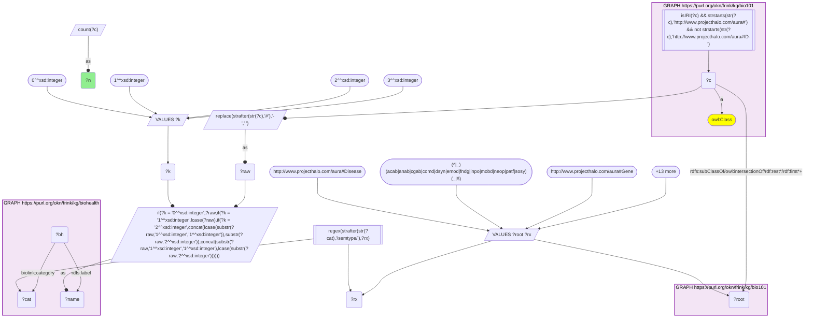

# BIO01-Q2: Which KB Bio 101 textbook categories land on a type-consistent BioHealthKG concept, and which bridged concepts are the best connected (bio101 × biohealth, concept label, type-scoped)

- **Date:** 2026-10-05
- **Model:** claude-opus-5-5
- **SPARQL endpoint:** https://apps.okn.us/federation/sparql
- **Generated by:** mcp-okn v0.1.0 (build 8efca43)
- **Contents:** 4 queries · 4 query diagrams

## Knowledge graphs used

- `bio101` — <https://purl.org/okn/frink/kg/bio101>
- `biohealth` — <https://purl.org/okn/frink/kg/biohealth>

## Conversation

👤 **User**

Crosswalk: `bio101` × `biohealth` on **concept label (bio101 concept name ↔ UMLS concept name), type-scoped** (crosswalk `KB7-label-bio101-biohealth`, verified_count 1213). bio101 carries the key only as the local name of its `owl:Class` IRI (`aura:Nitric-Oxide` → "Nitric Oxide", hyphens → spaces; no `rdfs:label`, no external id), matched in four case forms (as-is, all lower-case, first letter lowered, sentence case). biohealth carries it as the `rdfs:label` (UMLS concept name) of node `https://biohealthkg.proto-okn.net/kg/node/C{cui}`, whose `biolink:category` (UMLS semantic type) must agree with the bio101 upper class (Disease, Gene, Organism, Cell, Chemical-Entity, Living-Entity, Event, Tangible-Entity).

Research question: across KB Bio 101's textbook concepts, which categories (chemicals, anatomy, physiological processes, organisms, …) land most often on a type-consistent BioHealthKG concept, and which bridged concepts are the best connected in BioHealthKG's literature graph?

Why the join is required: KB Bio 101 knows which textbook category each concept belongs to but has no literature footprint; BioHealthKG knows how heavily each UMLS concept figures in literature-mined predications but nothing about the textbook. Coverage by textbook category, and the literature weight of textbook concepts, exist only on the join.

---

🧠 **Assistant**

**Chemicals land most often. Of the 1,213 bridged bio101 concepts, 402 land on a UMLS *Chemicals & Drugs* concept, ahead of Anatomy (262), Physiology (195) and Living Beings (121). Measured as a rate within bio101's own upper classes, Disease (38.7%) and Chemical-Entity (34.2%) bridge best and Cell (9.8%) and Gene (7.2%) worst. The best-connected bridged concepts are broad, heavily studied terms: Growth (44,628 predications), Adult (38,331), DNA (37,312), Apoptosis (35,822), Water (35,264) and Glucose (34,784).**

**How the join runs.** Query 1 is the crosswalk's stored skeleton and returns the verified 1,213 bridged bio101 concepts. Queries 2–4 reuse the same join verbatim (name in four case forms — as-is, all lower-case, first letter lowered, sentence case — bound-literal match on biohealth `rdfs:label`, the type-agreement `VALUES` table, the bio101 root path) as a subquery, then aggregate it three ways.

### 1. Coverage by bio101 upper class (Query 2)

| bio101 root | Named concepts under it | Bridged | % bridged | biohealth UMLS concepts reached |
|---|---|---|---|---|
| Disease | 93 | 36 | **38.7%** | 36 |
| Chemical-Entity | 1,130 | 386 | **34.2%** | 386 |
| Living-Entity | 1,219 | 294 | 24.1% | 294 |
| Tangible-Entity | 3,112 | 667 | 21.4% | 668 |
| Organism | 494 | 92 | 18.6% | 92 |
| Event | 2,021 | 369 | 18.3% | 370 |
| Cell | 286 | 28 | 9.8% | 28 |
| Gene | 83 | 6 | 7.2% | 6 |

The roots overlap. Tangible-Entity is an umbrella over the chemical and anatomical classes, and Living-Entity over cells and organisms, so the per-root counts sum to more than 1,213. Disease and chemical names are the ones most often written exactly as UMLS writes them. Cell and gene concepts rarely are, and only 6 of bio101's 83 Gene concepts reach a type-consistent node.

### 2. Coverage by UMLS Semantic Group of the landed node (Query 3)

Each landed node is assigned to the UMLS Semantic Group of its **primary** (first-listed) semantic type.

| UMLS Semantic Group | bio101 concepts | UMLS concepts | Semantic types seen | Examples |
|---|---|---|---|---|
| CHEM Chemicals & Drugs | 402 | 402 | aapp orch inch phsu irda bacs elii chvs hops horm nnon lipd carb chem chvf antb bodm enzy strd | Alcohol-Dehydrogenase, Abscisic-Acid, Zirconium |
| ANAT Anatomy | 262 | 263 | celc bpoc emst cell blor bdsu tisu bdsy bsoj anst | Photosystem, Abdomen, Yolk-Sac |
| PHYS Physiology | 195 | 196 | orgf ortf menp moft phsf celf genf clna orga | Primary-Growth, Acclimatization, Vasodilation |
| LIVB Living Beings | 121 | 121 | plnt orgm mamm invt alga euka bact fngs fish rept arch humn prog aggp grup | Pulvinus, Acoela, Zebrafish |
| PHEN Phenomena | 62 | 62 | npop eehu biof phpr | Nucleic-Acid-Hybridization, Adaptation, Water-Cycle |
| DISO Disorders | 59 | 59 | dsyn patf anab neop mobd sosy comd cgab fndg | Hyperthyroidism, Achondroplasia, Tumor-Growth |
| PROC Procedures | 41 | 41 | lbpr topp hlca diap mbrt resa edac | Incubation, Amniocentesis, Vasectomy |
| ACTI Activities & Behaviors | 25 | 25 | socb acty ocac dora inbe gora bhvr | Agonistic-Behavior, Action, Work |
| OCCU Occupations | 23 | 23 | bmod ocdi | Epidemiology, Animal-Husbandry, Thermodynamics |
| GENE Genes & Molecular Sequences | 21 | 21 | gngm | Hydrolase, Acetylcholinesterase, Thyroid-Hormone-Receptor |
| OBJC Objects | 2 | 2 | food | Cod-Liver-Oil, Corn-Oil |

The group counts sum to exactly 1,213, so every bridged concept lands in one group, and the UMLS-concept column sums to 1,215 distinct landed nodes. Some placements look odd but follow from the primary-type rule:

- **Pulvinus** (a plant motor organ) lands in LIVB, because its UMLS node's primary type is `plnt`.
- **Acetylcholinesterase** and **Hydrolase** land in GENE, because their primary type is `gngm`.
- **DISO (59) exceeds the Disease root (36).** At least 23 disorder-type landings arrive through the Event root, whose type-agreement row also accepts DISO types, as with Tumor-Growth. The crosswalk's spot check flagged one false positive on this path: Recruitment matched to a UMLS finding.

### 3. The best-connected bridged concepts (Query 4)

Degree is the number of reified predication statements in which the bridged UMLS concept is subject or object. It was counted for **all 1,215 bridged UMLS concepts**; no sampling or restriction was needed, because the join is driven from the bounded bridge. The top 15:

| bio101 concept | UMLS concept | Semantic type | Predications | as subject | as object |
|---|---|---|---|---|---|
| Growth | C0018270 Growth | orgf | 44,628 | 8,308 | 36,320 |
| Adult | C0001675 Adult | aggp, humn | 38,331 | 3,692 | 34,639 |
| DNA | C0012854 DNA | bacs, nnon | 37,312 | 21,040 | 16,272 |
| Apoptosis | C0162638 Apoptosis | celf | 35,822 | 6,728 | 29,094 |
| Water | C0043047 Water | inch, phsu | 35,264 | 16,171 | 19,093 |
| Glucose | C0017725 Glucose | bacs, orch, phsu | 34,784 | 20,263 | 14,521 |
| Receptor | C0597357 receptor | aapp, gngm, rcpt | 31,143 | 17,550 | 13,593 |
| Cytokine | C0079189 cytokine | aapp, gngm, imft | 30,908 | 17,501 | 13,407 |
| Liver | C0023884 Liver | bpoc | 29,983 | 19,396 | 10,587 |
| Brain | C0006104 Brain | bpoc | 28,815 | 18,906 | 9,909 |
| Obesity | C0028754 Obesity | dsyn | 27,653 | 8,786 | 18,867 |
| Infant | C0021270 Infant | aggp, humn | 27,472 | 2,501 | 24,971 |
| Nitric-Oxide | C0028128 Nitric Oxide | bacs, inch, phsu | 27,100 | 14,420 | 12,680 |
| Calcium | C0006675 Calcium | bacs, elii, phsu | 26,569 | 14,458 | 12,111 |
| Diagnosis | C0011900 Diagnosis | diap | 25,456 | 17,173 | 8,283 |

What stands out:

- **Generality wins.** Growth, Water, Diagnosis and the age groups are hubs because the literature uses them everywhere, not because they are central to biology. Degree measures literature volume.
- **Adult and Infant are textbook life stages that land on UMLS age groups.** They pass type agreement through the `humn` semantic type on their UMLS nodes. In BioHealthKG they appear almost entirely as objects: 34,639 of 38,331 for Adult and 24,971 of 27,472 for Infant. That pattern is consistent with study-population descriptors rather than developmental biology. The match is type-consistent, but the sense is narrower than the textbook's.
- **Among substantive biology, the hubs are classic textbook topics:** DNA, apoptosis, glucose, receptors, cytokines, nitric oxide and calcium, plus two organs (liver, brain) and one disease (obesity). Four of the six semantic-group leaders are represented in the top 15: CHEM, ANAT, PHYS and DISO.
- **The sentence-case form widens coverage, not the hubs.** The top 15 are the same concepts, with the same degrees, that the three-form recipe found: each of them matches on its as-is or all-lower-case name.

### Caveats

- **Label match, type-scoped, lower bound.** The bridge pairs exact names in four case forms. It misses synonyms, such as bio101 Cellular-Respiration against UMLS "Cell Respiration", and it misses concepts that sit only outside the eight roots, such as Cytoplasm, which sits only under Spatial-Entity. So every coverage rate here is a lower bound. Type agreement removes homonyms, and the record's 30-pair spot check found 29 correct.
- **Primary-type rollup.** Table 2 groups by the first-listed semantic type of each UMLS node. A node typed `aapp_gngm_…` counts as CHEM, not GENE, so GENE is understated relative to a rollup over all of a node's types.
- **Literature-mined, not curated.** BioHealthKG predications are extracted from PubMed text. Each reified statement is one distinct (subject, predicate, object) triple, so degree counts distinct predications, not supporting papers. Both directions are counted, and negated (`NEG_*`) predications are included.
- **Ties and cut-offs.** Table 3 is the top 15 by total predications. The full per-concept degree for all 1,215 bridged UMLS concepts is computed in Query 4 before the `LIMIT`.

## SPARQL queries executed

#### Query 1

_2026-10-06T00:13:31+00:00 · `bio101`, `biohealth`_

```sparql
SELECT (COUNT(DISTINCT ?c) AS ?n) WHERE {
  { SELECT DISTINCT ?c ?bh ?cat WHERE {
  { SELECT DISTINCT ?c ?name WHERE {
      GRAPH <https://purl.org/okn/frink/kg/bio101> { ?c a <http://www.w3.org/2002/07/owl#Class> .
        FILTER(isIRI(?c) && STRSTARTS(STR(?c),'http://www.projecthalo.com/aura#') && !STRSTARTS(STR(?c),'http://www.projecthalo.com/aura#ID-')) }
      BIND(REPLACE(STRAFTER(STR(?c),'#'),'-',' ') AS ?raw)
      VALUES ?k { 0 1 2 3 }  # as-is, all lower, first letter lowered, sentence case
      BIND(IF(?k = 0, ?raw, IF(?k = 1, LCASE(?raw), IF(?k = 2, CONCAT(LCASE(SUBSTR(?raw,1,1)),SUBSTR(?raw,2)),
                CONCAT(SUBSTR(?raw,1,1),LCASE(SUBSTR(?raw,2)))))) AS ?name)
  } }
    GRAPH <https://purl.org/okn/frink/kg/biohealth> { ?bh <http://www.w3.org/2000/01/rdf-schema#label> ?name ;
        <https://w3id.org/biolink/vocab/category> ?cat . }
  } }
  # type agreement: the bio101 upper class and the UMLS semantic group of ?cat must agree
  VALUES (?root ?rx) {
    (<http://www.projecthalo.com/aura#Disease> "(^|_)(acab|anab|cgab|comd|dsyn|emod|fndg|inpo|mobd|neop|patf|sosy)(_|$)")  # Disease <-> UMLS group DISO
    (<http://www.projecthalo.com/aura#Gene> "(^|_)(amas|crbs|gngm|mosq|nusq)(_|$)")  # Gene <-> UMLS group GENE
    (<http://www.projecthalo.com/aura#Organism> "(^|_)(alga|amph|anim|arch|bact|bird|euka|fish|fngs|humn|invt|mamm|orgm|plnt|rept|virs|vtbt)(_|$)")  # Organism <-> UMLS group LIVB
    (<http://www.projecthalo.com/aura#Cell> "(^|_)(anst|bdsu|bdsy|blor|bpoc|bsoj|celc|cell|emst|ffas|tisu)(_|$)")  # Cell <-> UMLS group ANAT
    (<http://www.projecthalo.com/aura#Chemical-Entity> "(^|_)(aapp|amas|antb|bacs|bodm|carb|chem|chvf|chvs|clnd|crbs|eico|elii|enzy|gngm|hops|horm|imft|inch|irda|lipd|mosq|nnon|nsba|nusq|opco|orch|phsu|rcpt|strd|vita)(_|$)")  # Chemical-Entity <-> UMLS group CHEM/GENE
    (<http://www.projecthalo.com/aura#Living-Entity> "(^|_)(alga|amph|anim|anst|arch|bact|bdsu|bdsy|bird|blor|bpoc|bsoj|celc|cell|emst|euka|ffas|fish|fngs|humn|invt|mamm|orgm|plnt|rept|tisu|virs|vtbt)(_|$)")  # Living-Entity <-> UMLS group ANAT/LIVB
    (<http://www.projecthalo.com/aura#Event> "(^|_)(acab|acty|anab|bhvr|biof|bmod|celf|cgab|clna|comd|diap|dora|dsyn|edac|eehu|emod|evnt|fndg|genf|gora|hcpp|hlca|inbe|inpo|lbpr|lbtr|mbrt|mcha|menp|mobd|moft|neop|npop|ocac|ocdi|orga|orgf|ortf|patf|phpr|phsf|resa|socb|sosy|topp)(_|$)")  # Event <-> UMLS group PHYS/PHEN/PROC/ACTI/OCCU/DISO
    (<http://www.projecthalo.com/aura#Tangible-Entity> "(^|_)(aapp|anst|antb|bacs|bdsu|bdsy|blor|bodm|bpoc|bsoj|carb|celc|cell|chem|chvf|chvs|clnd|eico|elii|emst|enzy|ffas|hops|horm|imft|inch|irda|lipd|nnon|nsba|opco|orch|phsu|rcpt|strd|tisu|vita)(_|$)")  # Tangible-Entity <-> UMLS group ANAT/CHEM
  }
  FILTER(REGEX(STRAFTER(STR(?cat), '/semtype/'), ?rx))
  GRAPH <https://purl.org/okn/frink/kg/bio101> { ?c (<http://www.w3.org/2000/01/rdf-schema#subClassOf>/(<http://www.w3.org/2002/07/owl#intersectionOf>/<http://www.w3.org/1999/02/22-rdf-syntax-ns#rest>*/<http://www.w3.org/1999/02/22-rdf-syntax-ns#first>)*)+ ?root . }
}
```



_1 row(s)_

| n |
| --- |
| 1213 |

#### Query 2

_2026-10-06T00:13:51+00:00 · `bio101`, `biohealth`_

```sparql
SELECT ?bio101Root ?bridged ?umlsConcepts ?named (ROUND(1000 * ?bridged / ?named) / 10 AS ?pctBridged) WHERE {
  { SELECT ?root (COUNT(DISTINCT ?c) AS ?bridged) (COUNT(DISTINCT ?bh) AS ?umlsConcepts) WHERE {
  { SELECT DISTINCT ?c ?bh ?cat WHERE {
  { SELECT DISTINCT ?c ?name WHERE {
      GRAPH <https://purl.org/okn/frink/kg/bio101> { ?c a <http://www.w3.org/2002/07/owl#Class> .
        FILTER(isIRI(?c) && STRSTARTS(STR(?c),'http://www.projecthalo.com/aura#') && !STRSTARTS(STR(?c),'http://www.projecthalo.com/aura#ID-')) }
      BIND(REPLACE(STRAFTER(STR(?c),'#'),'-',' ') AS ?raw)
      VALUES ?k { 0 1 2 3 }  # as-is, all lower, first letter lowered, sentence case
      BIND(IF(?k = 0, ?raw, IF(?k = 1, LCASE(?raw), IF(?k = 2, CONCAT(LCASE(SUBSTR(?raw,1,1)),SUBSTR(?raw,2)),
                CONCAT(SUBSTR(?raw,1,1),LCASE(SUBSTR(?raw,2)))))) AS ?name)
  } }
    GRAPH <https://purl.org/okn/frink/kg/biohealth> { ?bh <http://www.w3.org/2000/01/rdf-schema#label> ?name ;
        <https://w3id.org/biolink/vocab/category> ?cat . }
  } }
  # type agreement: the bio101 upper class and the UMLS semantic group of ?cat must agree
  VALUES (?root ?rx) {
    (<http://www.projecthalo.com/aura#Disease> "(^|_)(acab|anab|cgab|comd|dsyn|emod|fndg|inpo|mobd|neop|patf|sosy)(_|$)")  # Disease <-> UMLS group DISO
    (<http://www.projecthalo.com/aura#Gene> "(^|_)(amas|crbs|gngm|mosq|nusq)(_|$)")  # Gene <-> UMLS group GENE
    (<http://www.projecthalo.com/aura#Organism> "(^|_)(alga|amph|anim|arch|bact|bird|euka|fish|fngs|humn|invt|mamm|orgm|plnt|rept|virs|vtbt)(_|$)")  # Organism <-> UMLS group LIVB
    (<http://www.projecthalo.com/aura#Cell> "(^|_)(anst|bdsu|bdsy|blor|bpoc|bsoj|celc|cell|emst|ffas|tisu)(_|$)")  # Cell <-> UMLS group ANAT
    (<http://www.projecthalo.com/aura#Chemical-Entity> "(^|_)(aapp|amas|antb|bacs|bodm|carb|chem|chvf|chvs|clnd|crbs|eico|elii|enzy|gngm|hops|horm|imft|inch|irda|lipd|mosq|nnon|nsba|nusq|opco|orch|phsu|rcpt|strd|vita)(_|$)")  # Chemical-Entity <-> UMLS group CHEM/GENE
    (<http://www.projecthalo.com/aura#Living-Entity> "(^|_)(alga|amph|anim|anst|arch|bact|bdsu|bdsy|bird|blor|bpoc|bsoj|celc|cell|emst|euka|ffas|fish|fngs|humn|invt|mamm|orgm|plnt|rept|tisu|virs|vtbt)(_|$)")  # Living-Entity <-> UMLS group ANAT/LIVB
    (<http://www.projecthalo.com/aura#Event> "(^|_)(acab|acty|anab|bhvr|biof|bmod|celf|cgab|clna|comd|diap|dora|dsyn|edac|eehu|emod|evnt|fndg|genf|gora|hcpp|hlca|inbe|inpo|lbpr|lbtr|mbrt|mcha|menp|mobd|moft|neop|npop|ocac|ocdi|orga|orgf|ortf|patf|phpr|phsf|resa|socb|sosy|topp)(_|$)")  # Event <-> UMLS group PHYS/PHEN/PROC/ACTI/OCCU/DISO
    (<http://www.projecthalo.com/aura#Tangible-Entity> "(^|_)(aapp|anst|antb|bacs|bdsu|bdsy|blor|bodm|bpoc|bsoj|carb|celc|cell|chem|chvf|chvs|clnd|eico|elii|emst|enzy|ffas|hops|horm|imft|inch|irda|lipd|nnon|nsba|opco|orch|phsu|rcpt|strd|tisu|vita)(_|$)")  # Tangible-Entity <-> UMLS group ANAT/CHEM
  }
  FILTER(REGEX(STRAFTER(STR(?cat), '/semtype/'), ?rx))
  GRAPH <https://purl.org/okn/frink/kg/bio101> { ?c (<http://www.w3.org/2000/01/rdf-schema#subClassOf>/(<http://www.w3.org/2002/07/owl#intersectionOf>/<http://www.w3.org/1999/02/22-rdf-syntax-ns#rest>*/<http://www.w3.org/1999/02/22-rdf-syntax-ns#first>)*)+ ?root . }
  } GROUP BY ?root }
  { SELECT ?root (COUNT(DISTINCT ?c2) AS ?named) WHERE {
    VALUES ?root { <http://www.projecthalo.com/aura#Disease> <http://www.projecthalo.com/aura#Gene> <http://www.projecthalo.com/aura#Organism> <http://www.projecthalo.com/aura#Cell> <http://www.projecthalo.com/aura#Chemical-Entity> <http://www.projecthalo.com/aura#Living-Entity> <http://www.projecthalo.com/aura#Event> <http://www.projecthalo.com/aura#Tangible-Entity> }
    GRAPH <https://purl.org/okn/frink/kg/bio101> { ?c2 a <http://www.w3.org/2002/07/owl#Class> .
      FILTER(STRSTARTS(STR(?c2),'http://www.projecthalo.com/aura#') && !STRSTARTS(STR(?c2),'http://www.projecthalo.com/aura#ID-'))
      ?c2 (<http://www.w3.org/2000/01/rdf-schema#subClassOf>/(<http://www.w3.org/2002/07/owl#intersectionOf>/<http://www.w3.org/1999/02/22-rdf-syntax-ns#rest>*/<http://www.w3.org/1999/02/22-rdf-syntax-ns#first>)*)+ ?root . }
  } GROUP BY ?root }
  BIND(STRAFTER(STR(?root), "#") AS ?bio101Root)
} ORDER BY DESC(?bridged)
```



```mermaid
graph TD
classDef projected fill:lightgreen;
classDef literal fill:orange;
classDef iri fill:yellow;
  q2v16("?bh")
  q2v4("?bio101Root"):::projected 
  q2v2("?bridged"):::projected 
  q2v15("?c")
  q2v17("?c2")
  q2v10("?cat")
  q2v13("?k")
  q2v12("?name")
  q2v3("?named"):::projected 
  q2v1("?pctBridged"):::projected 
  q2v14("?raw")
  q2v5("?root")
  q2v11("?rx")
  q2v6("?umlsConcepts"):::projected 
  q2f0[["regex(strafter(str(?cat),'/semtype/'),?rx)"]]
  q2f0 --> q2v10
  q2f0 --> q2v11
  subgraph q2graph0["GRAPH https://purl.org/okn/frink/kg/bio101"]
    style q2graph0 fill:#f3e5f5,stroke:#8e24aa,stroke-width:2px,color:#000;
    q2graph0c2(["owl:Class"]):::iri 
    q2graph0f1[["isIRI(?c) && strstarts(str(?c),'http://www.projecthalo.com/aura#') && not strstarts(str(?c),'http://www.projecthalo.com/aura#ID-')"]]
    q2graph0f1 --> q2v15
    q2v15 --"a"--> q2graph0c2
  end
  q2bind0[/"replace(strafter(str(?c),'#'),'-',' ')"/]
  q2v15 --o q2bind0
  q2bind0 --as--o q2v14
  q2bind1[/"VALUES ?k"/]
  q2bind1-->q2v13
  q2bind10(["0^^xsd:integer"])
  q2bind10 --> q2bind1
  q2bind11(["1^^xsd:integer"])
  q2bind11 --> q2bind1
  q2bind12(["2^^xsd:integer"])
  q2bind12 --> q2bind1
  q2bind13(["3^^xsd:integer"])
  q2bind13 --> q2bind1
  q2bind2[/"if(?k = '0^^xsd:integer',?raw,if(?k = '1^^xsd:integer',lcase(?raw),if(?k = '2^^xsd:integer',concat(lcase(substr(?raw,'1^^xsd:integer','1^^xsd:integer')),substr(?raw,'2^^xsd:integer')),concat(substr(?raw,'1^^xsd:integer','1^^xsd:integer'),lcase(substr(?raw,'2^^xsd:integer'))))))"/]
  q2v13 --o q2bind2
  q2v14 --o q2bind2
  q2bind2 --as--o q2v12
  subgraph q2graph1["GRAPH https://purl.org/okn/frink/kg/biohealth"]
    style q2graph1 fill:#f3e5f5,stroke:#8e24aa,stroke-width:2px,color:#000;
    q2v16 --"rdfs:label"--> q2v12
    q2v16 --"biolink:category"--> q2v10
  end
  q2bind3[/"VALUES ?root ?rx"/]
  q2bind3-->q2v5
  q2bind3-->q2v11
  q2bind30(["http://www.projecthalo.com/aura#Disease"])
  q2bind30 --> q2bind3
  q2bind31(["(^|_)(acab|anab|cgab|comd|dsyn|emod|fndg|inpo|mobd|neop|patf|sosy)(_|$)"])
  q2bind31 --> q2bind3
  q2bind32(["http://www.projecthalo.com/aura#Gene"])
  q2bind32 --> q2bind3
  q2bind3more([+13 more])
  q2bind3more --> q2bind3
  subgraph q2graph2["GRAPH https://purl.org/okn/frink/kg/bio101"]
    style q2graph2 fill:#f3e5f5,stroke:#8e24aa,stroke-width:2px,color:#000;
    q2v15 --"rdfs:subClassOf/owl:intersectionOf/rdf:rest*/rdf:first*+"--> q2v5
  end
  q2bind4[/"count(?c2)"/]
  q2bind4 --as--o q2v2
  q2bind5[/"VALUES ?root"/]
  q2bind5-->q2v5
  q2bind50(["http://www.projecthalo.com/aura#Disease"])
  q2bind50 --> q2bind5
  q2bind51(["http://www.projecthalo.com/aura#Gene"])
  q2bind51 --> q2bind5
  q2bind52(["http://www.projecthalo.com/aura#Organism"])
  q2bind52 --> q2bind5
  q2bind5more([+5 more])
  q2bind5more --> q2bind5
  subgraph q2graph3["GRAPH https://purl.org/okn/frink/kg/bio101"]
    style q2graph3 fill:#f3e5f5,stroke:#8e24aa,stroke-width:2px,color:#000;
    q2graph3c2(["owl:Class"]):::iri 
    q2graph3f2[["strstarts(str(?c2),'http://www.projecthalo.com/aura#') && not strstarts(str(?c2),'http://www.projecthalo.com/aura#ID-')"]]
    q2graph3f2 --> q2v17
    q2v17 --"a"--> q2graph3c2
    q2v17 --"rdfs:subClassOf/owl:intersectionOf/rdf:rest*/rdf:first*+"--> q2v5
  end
  q2bind6[/"count(?c2)"/]
  q2bind6 --as--o q2v3
  q2bind7[/"strafter(str(?root),'#')"/]
  q2v5 --o q2bind7
  q2bind7 --as--o q2v4
  q2bind8[/"round('1000^^xsd:integer' * ?bridged / ?named) / '10^^xsd:integer'"/]
  q2v2 --o q2bind8
  q2v3 --o q2bind8
  q2bind8 --as--o q2v1
```

_8 row(s) — showing first 3_

| bio101Root | bridged | umlsConcepts | named | pctBridged |
| --- | --- | --- | --- | --- |
| Tangible-Entity | 667 | 668 | 3112 | 21.4 |
| Chemical-Entity | 386 | 386 | 1130 | 34.2 |
| Event | 369 | 370 | 2021 | 18.3 |

#### Query 3

_2026-10-06T00:14:15+00:00 · `bio101`, `biohealth`_

```sparql
SELECT ?umlsSemanticGroup (COUNT(DISTINCT ?c) AS ?bio101Concepts) (COUNT(DISTINCT ?bh) AS ?umlsConcepts) (GROUP_CONCAT(DISTINCT ?semtype; separator=" ") AS ?semtypes) (SAMPLE(?ex) AS ?example1) (MIN(?ex) AS ?example2) (MAX(?ex) AS ?example3) WHERE {
  { SELECT DISTINCT ?c ?bh ?cat WHERE {
  { SELECT DISTINCT ?c ?bh ?cat WHERE {
  { SELECT DISTINCT ?c ?name WHERE {
      GRAPH <https://purl.org/okn/frink/kg/bio101> { ?c a <http://www.w3.org/2002/07/owl#Class> .
        FILTER(isIRI(?c) && STRSTARTS(STR(?c),'http://www.projecthalo.com/aura#') && !STRSTARTS(STR(?c),'http://www.projecthalo.com/aura#ID-')) }
      BIND(REPLACE(STRAFTER(STR(?c),'#'),'-',' ') AS ?raw)
      VALUES ?k { 0 1 2 3 }  # as-is, all lower, first letter lowered, sentence case
      BIND(IF(?k = 0, ?raw, IF(?k = 1, LCASE(?raw), IF(?k = 2, CONCAT(LCASE(SUBSTR(?raw,1,1)),SUBSTR(?raw,2)),
                CONCAT(SUBSTR(?raw,1,1),LCASE(SUBSTR(?raw,2)))))) AS ?name)
  } }
    GRAPH <https://purl.org/okn/frink/kg/biohealth> { ?bh <http://www.w3.org/2000/01/rdf-schema#label> ?name ;
        <https://w3id.org/biolink/vocab/category> ?cat . }
  } }
  # type agreement: the bio101 upper class and the UMLS semantic group of ?cat must agree
  VALUES (?root ?rx) {
    (<http://www.projecthalo.com/aura#Disease> "(^|_)(acab|anab|cgab|comd|dsyn|emod|fndg|inpo|mobd|neop|patf|sosy)(_|$)")  # Disease <-> UMLS group DISO
    (<http://www.projecthalo.com/aura#Gene> "(^|_)(amas|crbs|gngm|mosq|nusq)(_|$)")  # Gene <-> UMLS group GENE
    (<http://www.projecthalo.com/aura#Organism> "(^|_)(alga|amph|anim|arch|bact|bird|euka|fish|fngs|humn|invt|mamm|orgm|plnt|rept|virs|vtbt)(_|$)")  # Organism <-> UMLS group LIVB
    (<http://www.projecthalo.com/aura#Cell> "(^|_)(anst|bdsu|bdsy|blor|bpoc|bsoj|celc|cell|emst|ffas|tisu)(_|$)")  # Cell <-> UMLS group ANAT
    (<http://www.projecthalo.com/aura#Chemical-Entity> "(^|_)(aapp|amas|antb|bacs|bodm|carb|chem|chvf|chvs|clnd|crbs|eico|elii|enzy|gngm|hops|horm|imft|inch|irda|lipd|mosq|nnon|nsba|nusq|opco|orch|phsu|rcpt|strd|vita)(_|$)")  # Chemical-Entity <-> UMLS group CHEM/GENE
    (<http://www.projecthalo.com/aura#Living-Entity> "(^|_)(alga|amph|anim|anst|arch|bact|bdsu|bdsy|bird|blor|bpoc|bsoj|celc|cell|emst|euka|ffas|fish|fngs|humn|invt|mamm|orgm|plnt|rept|tisu|virs|vtbt)(_|$)")  # Living-Entity <-> UMLS group ANAT/LIVB
    (<http://www.projecthalo.com/aura#Event> "(^|_)(acab|acty|anab|bhvr|biof|bmod|celf|cgab|clna|comd|diap|dora|dsyn|edac|eehu|emod|evnt|fndg|genf|gora|hcpp|hlca|inbe|inpo|lbpr|lbtr|mbrt|mcha|menp|mobd|moft|neop|npop|ocac|ocdi|orga|orgf|ortf|patf|phpr|phsf|resa|socb|sosy|topp)(_|$)")  # Event <-> UMLS group PHYS/PHEN/PROC/ACTI/OCCU/DISO
    (<http://www.projecthalo.com/aura#Tangible-Entity> "(^|_)(aapp|anst|antb|bacs|bdsu|bdsy|blor|bodm|bpoc|bsoj|carb|celc|cell|chem|chvf|chvs|clnd|eico|elii|emst|enzy|ffas|hops|horm|imft|inch|irda|lipd|nnon|nsba|opco|orch|phsu|rcpt|strd|tisu|vita)(_|$)")  # Tangible-Entity <-> UMLS group ANAT/CHEM
  }
  FILTER(REGEX(STRAFTER(STR(?cat), '/semtype/'), ?rx))
  GRAPH <https://purl.org/okn/frink/kg/bio101> { ?c (<http://www.w3.org/2000/01/rdf-schema#subClassOf>/(<http://www.w3.org/2002/07/owl#intersectionOf>/<http://www.w3.org/1999/02/22-rdf-syntax-ns#rest>*/<http://www.w3.org/1999/02/22-rdf-syntax-ns#first>)*)+ ?root . }
  } }
  # roll each landed node's PRIMARY (first-listed) UMLS semantic type up to its UMLS Semantic Group
  BIND(STRBEFORE(CONCAT(STRAFTER(STR(?cat), "/semtype/"), "_"), "_") AS ?semtype)
  VALUES (?umlsSemanticGroup ?grx) {
    ("ACTI Activities & Behaviors" "^(acty|bhvr|dora|evnt|gora|inbe|mcha|ocac|socb)$")
    ("ANAT Anatomy" "^(anst|bdsu|bdsy|blor|bpoc|bsoj|celc|cell|emst|ffas|tisu)$")
    ("CHEM Chemicals & Drugs" "^(aapp|antb|bacs|bodm|carb|chem|chvf|chvs|clnd|eico|elii|enzy|hops|horm|imft|inch|irda|lipd|nnon|nsba|opco|orch|phsu|rcpt|strd|vita)$")
    ("CONC Concepts & Ideas" "^(clas|cnce|ftcn|grpa|idcn|inpr|lang|qlco|qnco|rnlw|spco|tmco)$")
    ("DEVI Devices" "^(drdd|medd|resd)$")
    ("DISO Disorders" "^(acab|anab|cgab|comd|dsyn|emod|fndg|inpo|mobd|neop|patf|sosy)$")
    ("GENE Genes & Molecular Sequences" "^(amas|chro|crbs|gngm|mosq|nusq)$")
    ("GEOG Geographic Areas" "^(geoa)$")
    ("LIVB Living Beings" "^(aggp|alga|amph|anim|arch|bact|bird|euka|famg|fish|fngs|grup|humn|invt|mamm|orgm|plnt|podg|popg|prog|rept|virs|vtbt)$")
    ("OBJC Objects" "^(enty|food|mnob|phob|sbst)$")
    ("OCCU Occupations" "^(bmod|ocdi)$")
    ("ORGA Organizations" "^(hcro|orgt|pros|shro)$")
    ("PHEN Phenomena" "^(biof|eehu|hcpp|lbtr|npop|phpr)$")
    ("PHYS Physiology" "^(celf|clna|genf|menp|moft|orga|orgf|ortf|phsf)$")
    ("PROC Procedures" "^(diap|edac|hlca|lbpr|mbrt|resa|topp)$")
  }
  FILTER(REGEX(?semtype, ?grx))
  BIND(STRAFTER(STR(?c), "#") AS ?ex)
} GROUP BY ?umlsSemanticGroup ORDER BY DESC(?bio101Concepts)
```



```mermaid
graph TD
classDef projected fill:lightgreen;
classDef literal fill:orange;
classDef iri fill:yellow;
  q3v24("?bh")
  q3v6("?bio101Concepts"):::projected 
  q3v18("?c")
  q3v19("?cat")
  q3v17("?ex")
  q3v3("?example1"):::projected 
  q3v2("?example2"):::projected 
  q3v1("?example3"):::projected 
  q3v16("?grx")
  q3v22("?k")
  q3v21("?name")
  q3v23("?raw")
  q3v25("?root")
  q3v20("?rx")
  q3v15("?semtype")
  q3v4("?semtypes"):::projected 
  q3v5("?umlsConcepts"):::projected 
  q3v7("?umlsSemanticGroup"):::projected 
  q3f0[["regex(?semtype,?grx)"]]
  q3f0 --> q3v15
  q3f0 --> q3v16
  q3f1[["regex(strafter(str(?cat),'/semtype/'),?rx)"]]
  q3f1 --> q3v19
  q3f1 --> q3v20
  subgraph q3graph0["GRAPH https://purl.org/okn/frink/kg/bio101"]
    style q3graph0 fill:#f3e5f5,stroke:#8e24aa,stroke-width:2px,color:#000;
    q3graph0c2(["owl:Class"]):::iri 
    q3graph0f2[["isIRI(?c) && strstarts(str(?c),'http://www.projecthalo.com/aura#') && not strstarts(str(?c),'http://www.projecthalo.com/aura#ID-')"]]
    q3graph0f2 --> q3v18
    q3v18 --"a"--> q3graph0c2
  end
  q3bind0[/"replace(strafter(str(?c),'#'),'-',' ')"/]
  q3v18 --o q3bind0
  q3bind0 --as--o q3v23
  q3bind1[/"VALUES ?k"/]
  q3bind1-->q3v22
  q3bind10(["0^^xsd:integer"])
  q3bind10 --> q3bind1
  q3bind11(["1^^xsd:integer"])
  q3bind11 --> q3bind1
  q3bind12(["2^^xsd:integer"])
  q3bind12 --> q3bind1
  q3bind13(["3^^xsd:integer"])
  q3bind13 --> q3bind1
  q3bind2[/"if(?k = '0^^xsd:integer',?raw,if(?k = '1^^xsd:integer',lcase(?raw),if(?k = '2^^xsd:integer',concat(lcase(substr(?raw,'1^^xsd:integer','1^^xsd:integer')),substr(?raw,'2^^xsd:integer')),concat(substr(?raw,'1^^xsd:integer','1^^xsd:integer'),lcase(substr(?raw,'2^^xsd:integer'))))))"/]
  q3v22 --o q3bind2
  q3v23 --o q3bind2
  q3bind2 --as--o q3v21
  subgraph q3graph1["GRAPH https://purl.org/okn/frink/kg/biohealth"]
    style q3graph1 fill:#f3e5f5,stroke:#8e24aa,stroke-width:2px,color:#000;
    q3v24 --"rdfs:label"--> q3v21
    q3v24 --"biolink:category"--> q3v19
  end
  q3bind3[/"VALUES ?root ?rx"/]
  q3bind3-->q3v25
  q3bind3-->q3v20
  q3bind30(["http://www.projecthalo.com/aura#Disease"])
  q3bind30 --> q3bind3
  q3bind31(["(^|_)(acab|anab|cgab|comd|dsyn|emod|fndg|inpo|mobd|neop|patf|sosy)(_|$)"])
  q3bind31 --> q3bind3
  q3bind32(["http://www.projecthalo.com/aura#Gene"])
  q3bind32 --> q3bind3
  q3bind3more([+13 more])
  q3bind3more --> q3bind3
  subgraph q3graph2["GRAPH https://purl.org/okn/frink/kg/bio101"]
    style q3graph2 fill:#f3e5f5,stroke:#8e24aa,stroke-width:2px,color:#000;
    q3v18 --"rdfs:subClassOf/owl:intersectionOf/rdf:rest*/rdf:first*+"--> q3v25
  end
  q3bind4[/"strbefore(concat(strafter(str(?cat),'/semtype/'),'_'),'_')"/]
  q3v19 --o q3bind4
  q3bind4 --as--o q3v15
  q3bind5[/"VALUES ?grx ?umlsSemanticGroup"/]
  q3bind5-->q3v16
  q3bind5-->q3v7
  q3bind50(["ACTI Activities & Behaviors"])
  q3bind50 --> q3bind5
  q3bind51(["^(acty|bhvr|dora|evnt|gora|inbe|mcha|ocac|socb)$"])
  q3bind51 --> q3bind5
  q3bind52(["ANAT Anatomy"])
  q3bind52 --> q3bind5
  q3bind5more([+27 more])
  q3bind5more --> q3bind5
  q3bind6[/"strafter(str(?c),'#')"/]
  q3v18 --o q3bind6
  q3bind6 --as--o q3v17
  q3bind7[/"count(?c)"/]
  q3bind7 --as--o q3v6
  q3bind8[/"count(?bh)"/]
  q3bind8 --as--o q3v5
  q3bind9[/"group_concat(?semtype)"/]
  q3bind9 --as--o q3v4
  q3bind10[/"min(?ex)"/]
  q3bind10 --as--o q3v2
  q3bind11[/"max(?ex)"/]
  q3bind11 --as--o q3v1
```

_11 row(s) — showing first 3_

| umlsSemanticGroup | bio101Concepts | umlsConcepts | semtypes | example1 | example2 | example3 |
| --- | --- | --- | --- | --- | --- | --- |
| CHEM Chemicals & Drugs | 402 | 402 | aapp orch inch phsu irda bacs elii chvs hops horm nnon lipd carb chem chvf antb bodm enzy strd | Alcohol-Dehydrogenase | Abscisic-Acid | Zirconium |
| ANAT Anatomy | 262 | 263 | celc bpoc emst cell blor bdsu tisu bdsy bsoj anst | Photosystem | Abdomen | Yolk-Sac |
| PHYS Physiology | 195 | 196 | orgf ortf menp moft phsf celf genf clna orga | Primary-Growth | Acclimatization | Vasodilation |

#### Query 4

_2026-10-06T00:14:38+00:00 · `bio101`, `biohealth`_

```sparql
SELECT ?concept ?umlsConcept ?umlsName ?semtype (SUM(?n) AS ?statements) (SUM(IF(?role = "subject", ?n, 0)) AS ?asSubject) (SUM(IF(?role = "object", ?n, 0)) AS ?asObject) WHERE {
  { SELECT ?c ?bh ?cat ?role (COUNT(?st) AS ?n) WHERE {
    { SELECT DISTINCT ?c ?bh ?cat WHERE {
  { SELECT DISTINCT ?c ?bh ?cat WHERE {
  { SELECT DISTINCT ?c ?name WHERE {
      GRAPH <https://purl.org/okn/frink/kg/bio101> { ?c a <http://www.w3.org/2002/07/owl#Class> .
        FILTER(isIRI(?c) && STRSTARTS(STR(?c),'http://www.projecthalo.com/aura#') && !STRSTARTS(STR(?c),'http://www.projecthalo.com/aura#ID-')) }
      BIND(REPLACE(STRAFTER(STR(?c),'#'),'-',' ') AS ?raw)
      VALUES ?k { 0 1 2 3 }  # as-is, all lower, first letter lowered, sentence case
      BIND(IF(?k = 0, ?raw, IF(?k = 1, LCASE(?raw), IF(?k = 2, CONCAT(LCASE(SUBSTR(?raw,1,1)),SUBSTR(?raw,2)),
                CONCAT(SUBSTR(?raw,1,1),LCASE(SUBSTR(?raw,2)))))) AS ?name)
  } }
    GRAPH <https://purl.org/okn/frink/kg/biohealth> { ?bh <http://www.w3.org/2000/01/rdf-schema#label> ?name ;
        <https://w3id.org/biolink/vocab/category> ?cat . }
  } }
  # type agreement: the bio101 upper class and the UMLS semantic group of ?cat must agree
  VALUES (?root ?rx) {
    (<http://www.projecthalo.com/aura#Disease> "(^|_)(acab|anab|cgab|comd|dsyn|emod|fndg|inpo|mobd|neop|patf|sosy)(_|$)")  # Disease <-> UMLS group DISO
    (<http://www.projecthalo.com/aura#Gene> "(^|_)(amas|crbs|gngm|mosq|nusq)(_|$)")  # Gene <-> UMLS group GENE
    (<http://www.projecthalo.com/aura#Organism> "(^|_)(alga|amph|anim|arch|bact|bird|euka|fish|fngs|humn|invt|mamm|orgm|plnt|rept|virs|vtbt)(_|$)")  # Organism <-> UMLS group LIVB
    (<http://www.projecthalo.com/aura#Cell> "(^|_)(anst|bdsu|bdsy|blor|bpoc|bsoj|celc|cell|emst|ffas|tisu)(_|$)")  # Cell <-> UMLS group ANAT
    (<http://www.projecthalo.com/aura#Chemical-Entity> "(^|_)(aapp|amas|antb|bacs|bodm|carb|chem|chvf|chvs|clnd|crbs|eico|elii|enzy|gngm|hops|horm|imft|inch|irda|lipd|mosq|nnon|nsba|nusq|opco|orch|phsu|rcpt|strd|vita)(_|$)")  # Chemical-Entity <-> UMLS group CHEM/GENE
    (<http://www.projecthalo.com/aura#Living-Entity> "(^|_)(alga|amph|anim|anst|arch|bact|bdsu|bdsy|bird|blor|bpoc|bsoj|celc|cell|emst|euka|ffas|fish|fngs|humn|invt|mamm|orgm|plnt|rept|tisu|virs|vtbt)(_|$)")  # Living-Entity <-> UMLS group ANAT/LIVB
    (<http://www.projecthalo.com/aura#Event> "(^|_)(acab|acty|anab|bhvr|biof|bmod|celf|cgab|clna|comd|diap|dora|dsyn|edac|eehu|emod|evnt|fndg|genf|gora|hcpp|hlca|inbe|inpo|lbpr|lbtr|mbrt|mcha|menp|mobd|moft|neop|npop|ocac|ocdi|orga|orgf|ortf|patf|phpr|phsf|resa|socb|sosy|topp)(_|$)")  # Event <-> UMLS group PHYS/PHEN/PROC/ACTI/OCCU/DISO
    (<http://www.projecthalo.com/aura#Tangible-Entity> "(^|_)(aapp|anst|antb|bacs|bdsu|bdsy|blor|bodm|bpoc|bsoj|carb|celc|cell|chem|chvf|chvs|clnd|eico|elii|emst|enzy|ffas|hops|horm|imft|inch|irda|lipd|nnon|nsba|opco|orch|phsu|rcpt|strd|tisu|vita)(_|$)")  # Tangible-Entity <-> UMLS group ANAT/CHEM
  }
  FILTER(REGEX(STRAFTER(STR(?cat), '/semtype/'), ?rx))
  GRAPH <https://purl.org/okn/frink/kg/bio101> { ?c (<http://www.w3.org/2000/01/rdf-schema#subClassOf>/(<http://www.w3.org/2002/07/owl#intersectionOf>/<http://www.w3.org/1999/02/22-rdf-syntax-ns#rest>*/<http://www.w3.org/1999/02/22-rdf-syntax-ns#first>)*)+ ?root . }
    } }
    # degree = reified predication statements in which the bridged UMLS concept is subject or object
    VALUES (?rp ?role) { (<http://www.w3.org/1999/02/22-rdf-syntax-ns#subject> "subject") (<http://www.w3.org/1999/02/22-rdf-syntax-ns#object> "object") }
    GRAPH <https://purl.org/okn/frink/kg/biohealth> { ?st ?rp ?bh . }
  } GROUP BY ?c ?bh ?cat ?role }
  GRAPH <https://purl.org/okn/frink/kg/biohealth> { ?bh <http://www.w3.org/2000/01/rdf-schema#label> ?umlsName }
  BIND(STRAFTER(STR(?c), "#") AS ?concept)
  BIND(STRAFTER(STR(?bh), "/node/") AS ?umlsConcept)
  BIND(STRAFTER(STR(?cat), "/semtype/") AS ?semtype)
} GROUP BY ?concept ?umlsConcept ?umlsName ?semtype ORDER BY DESC(?statements) LIMIT 15
```



```mermaid
graph TD
classDef projected fill:lightgreen;
classDef literal fill:orange;
classDef iri fill:yellow;
  q4v1("?asObject"):::projected 
  q4v2("?asSubject"):::projected 
  q4v16("?bh")
  q4v17("?c")
  q4v15("?cat")
  q4v7("?concept"):::projected 
  q4v22("?k")
  q4v18("?n")
  q4v21("?name")
  q4v23("?raw")
  q4v19("?role")
  q4v24("?root")
  q4v25("?rp")
  q4v20("?rx")
  q4v4("?semtype"):::projected 
  q4v26("?st")
  q4v3("?statements"):::projected 
  q4v6("?umlsConcept"):::projected 
  q4v5("?umlsName"):::projected 
  q4f0[["regex(strafter(str(?cat),'/semtype/'),?rx)"]]
  q4f0 --> q4v15
  q4f0 --> q4v20
  subgraph q4graph0["GRAPH https://purl.org/okn/frink/kg/bio101"]
    style q4graph0 fill:#f3e5f5,stroke:#8e24aa,stroke-width:2px,color:#000;
    q4graph0c2(["owl:Class"]):::iri 
    q4graph0f1[["isIRI(?c) && strstarts(str(?c),'http://www.projecthalo.com/aura#') && not strstarts(str(?c),'http://www.projecthalo.com/aura#ID-')"]]
    q4graph0f1 --> q4v17
    q4v17 --"a"--> q4graph0c2
  end
  q4bind0[/"replace(strafter(str(?c),'#'),'-',' ')"/]
  q4v17 --o q4bind0
  q4bind0 --as--o q4v23
  q4bind1[/"VALUES ?k"/]
  q4bind1-->q4v22
  q4bind10(["0^^xsd:integer"])
  q4bind10 --> q4bind1
  q4bind11(["1^^xsd:integer"])
  q4bind11 --> q4bind1
  q4bind12(["2^^xsd:integer"])
  q4bind12 --> q4bind1
  q4bind13(["3^^xsd:integer"])
  q4bind13 --> q4bind1
  q4bind2[/"if(?k = '0^^xsd:integer',?raw,if(?k = '1^^xsd:integer',lcase(?raw),if(?k = '2^^xsd:integer',concat(lcase(substr(?raw,'1^^xsd:integer','1^^xsd:integer')),substr(?raw,'2^^xsd:integer')),concat(substr(?raw,'1^^xsd:integer','1^^xsd:integer'),lcase(substr(?raw,'2^^xsd:integer'))))))"/]
  q4v22 --o q4bind2
  q4v23 --o q4bind2
  q4bind2 --as--o q4v21
  subgraph q4graph1["GRAPH https://purl.org/okn/frink/kg/biohealth"]
    style q4graph1 fill:#f3e5f5,stroke:#8e24aa,stroke-width:2px,color:#000;
    q4v16 --"rdfs:label"--> q4v21
    q4v16 --"biolink:category"--> q4v15
  end
  q4bind3[/"VALUES ?root ?rx"/]
  q4bind3-->q4v24
  q4bind3-->q4v20
  q4bind30(["http://www.projecthalo.com/aura#Disease"])
  q4bind30 --> q4bind3
  q4bind31(["(^|_)(acab|anab|cgab|comd|dsyn|emod|fndg|inpo|mobd|neop|patf|sosy)(_|$)"])
  q4bind31 --> q4bind3
  q4bind32(["http://www.projecthalo.com/aura#Gene"])
  q4bind32 --> q4bind3
  q4bind3more([+13 more])
  q4bind3more --> q4bind3
  subgraph q4graph2["GRAPH https://purl.org/okn/frink/kg/bio101"]
    style q4graph2 fill:#f3e5f5,stroke:#8e24aa,stroke-width:2px,color:#000;
    q4v17 --"rdfs:subClassOf/owl:intersectionOf/rdf:rest*/rdf:first*+"--> q4v24
  end
  q4bind4[/"VALUES ?role ?rp"/]
  q4bind4-->q4v19
  q4bind4-->q4v25
  q4bind40(["rdf:subject"])
  q4bind40 --> q4bind4
  q4bind41(["subject"])
  q4bind41 --> q4bind4
  q4bind42(["rdf:object"])
  q4bind42 --> q4bind4
  q4bind43(["object"])
  q4bind43 --> q4bind4
  subgraph q4graph3["GRAPH https://purl.org/okn/frink/kg/biohealth"]
    style q4graph3 fill:#f3e5f5,stroke:#8e24aa,stroke-width:2px,color:#000;
    q4v26 -->q4v25--> q4v16
  end
  q4bind5[/"count(?st)"/]
  q4bind5 --as--o q4v18
  subgraph q4graph4["GRAPH https://purl.org/okn/frink/kg/biohealth"]
    style q4graph4 fill:#f3e5f5,stroke:#8e24aa,stroke-width:2px,color:#000;
    q4v16 --"rdfs:label"--> q4v5
  end
  q4bind6[/"strafter(str(?c),'#')"/]
  q4v17 --o q4bind6
  q4bind6 --as--o q4v7
  q4bind7[/"strafter(str(?bh),'/node/')"/]
  q4v16 --o q4bind7
  q4bind7 --as--o q4v6
  q4bind8[/"strafter(str(?cat),'/semtype/')"/]
  q4v15 --o q4bind8
  q4bind8 --as--o q4v4
  q4bind9[/"count(?st)"/]
  q4bind9 --as--o q4v3
```

_15 row(s) — showing first 5_

| concept | umlsConcept | umlsName | semtype | statements | asSubject | asObject |
| --- | --- | --- | --- | --- | --- | --- |
| Growth | C0018270 | Growth | orgf_orgf | 44628 | 8308 | 36320 |
| Adult | C0001675 | Adult | aggp_humn_aggp | 38331 | 3692 | 34639 |
| DNA | C0012854 | DNA | bacs_nnon_bacs | 37312 | 21040 | 16272 |
| Apoptosis | C0162638 | Apoptosis | celf_celf | 35822 | 6728 | 29094 |
| Water | C0043047 | Water | inch_phsu_inch | 35264 | 16171 | 19093 |
