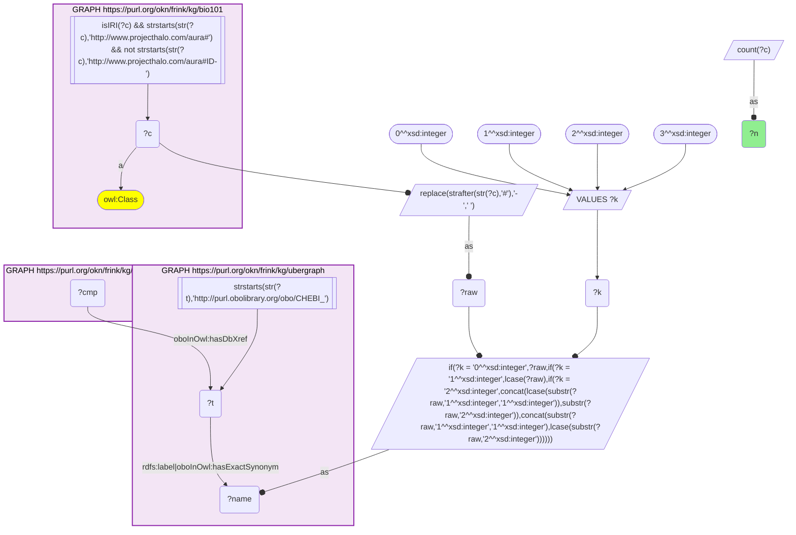
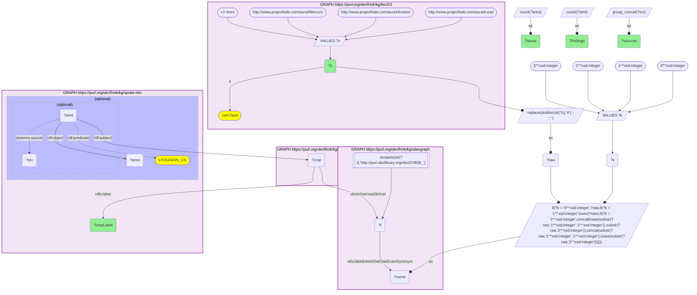
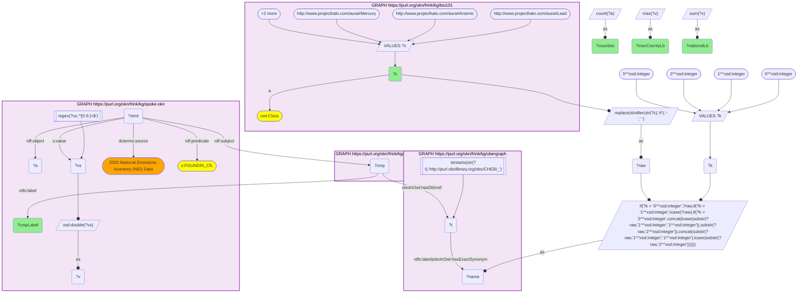
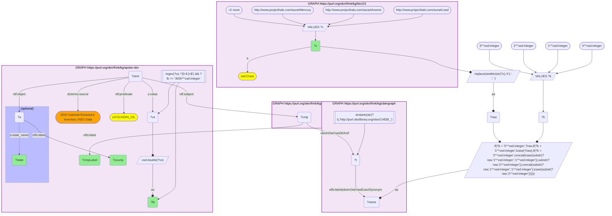
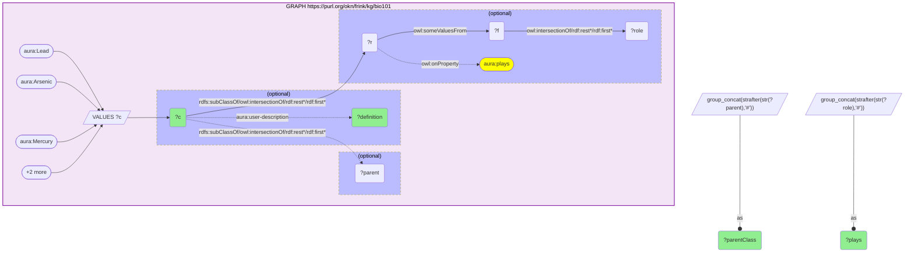

```mermaid
graph TD
classDef projected fill:lightgreen;
classDef literal fill:orange;
classDef iri fill:yellow;
  q3v8("?air"):::projected 
  q3v9("?c"):::projected 
  q3v26("?cmp")
  q3v1("?findings"):::projected 
  q3v6("?groundwater"):::projected 
  q3v23("?k")
  q3v20("?m")
  q3v27("?media")
  q3v22("?name")
  q3v2("?nei"):::projected 
  q3v24("?raw")
  q3v5("?soilSedimentLand"):::projected 
  q3v28("?src")
  q3v19("?srcs")
  q3v21("?stmt")
  q3v4("?superfund"):::projected 
  q3v7("?surfaceWater"):::projected 
  q3v25("?t")
  q3v3("?tri"):::projected 
  subgraph q3graph0["GRAPH https://purl.org/okn/frink/kg/bio101"]
    style q3graph0 fill:#f3e5f5,stroke:#8e24aa,stroke-width:2px,color:#000;
    q3graph0c2(["owl:Class"]):::iri 
    q3v9 --"a"--> q3graph0c2
    q3graph0bind0[/"VALUES ?c"/]
    q3graph0bind0-->q3v9
    q3graph0bind00(["http://www.projecthalo.com/aura#Lead"])
    q3graph0bind00 --> q3graph0bind0
    q3graph0bind01(["http://www.projecthalo.com/aura#Arsenic"])
    q3graph0bind01 --> q3graph0bind0
    q3graph0bind02(["http://www.projecthalo.com/aura#Mercury"])
    q3graph0bind02 --> q3graph0bind0
    q3graph0bind0more([+2 more])
    q3graph0bind0more --> q3graph0bind0
  end
  q3bind1[/"replace(strafter(str(?c),'#'),'-',' ')"/]
  q3v9 --o q3bind1
  q3bind1 --as--o q3v24
  q3bind2[/"VALUES ?k"/]
  q3bind2-->q3v23
  q3bind20(["0^^xsd:integer"])
  q3bind20 --> q3bind2
  q3bind21(["1^^xsd:integer"])
  q3bind21 --> q3bind2
  q3bind22(["2^^xsd:integer"])
  q3bind22 --> q3bind2
  q3bind23(["3^^xsd:integer"])
  q3bind23 --> q3bind2
  q3bind3[/"if(?k = '0^^xsd:integer',?raw,if(?k = '1^^xsd:integer',lcase(?raw),if(?k = '2^^xsd:integer',concat(lcase(substr(?raw,'1^^xsd:integer','1^^xsd:integer')),substr(?raw,'2^^xsd:integer')),concat(substr(?raw,'1^^xsd:integer','1^^xsd:integer'),lcase(substr(?raw,'2^^xsd:integer'))))))"/]
  q3v23 --o q3bind3
  q3v24 --o q3bind3
  q3bind3 --as--o q3v22
  subgraph q3graph1["GRAPH https://purl.org/okn/frink/kg/ubergraph"]
    style q3graph1 fill:#f3e5f5,stroke:#8e24aa,stroke-width:2px,color:#000;
    q3graph1f0[["strstarts(str(?t),'http://purl.obolibrary.org/obo/CHEBI_')"]]
    q3graph1f0 --> q3v25
    q3v25 --"rdfs:label|oboInOwl:hasExactSynonym"--> q3v22
  end
  subgraph q3graph2["GRAPH https://purl.org/okn/frink/kg/spoke-okn"]
    style q3graph2 fill:#f3e5f5,stroke:#8e24aa,stroke-width:2px,color:#000;
    q3v26 --"oboInOwl:hasDbXref"--> q3v25
  end
  subgraph q3graph3["GRAPH https://purl.org/okn/frink/kg/spoke-okn"]
    style q3graph3 fill:#f3e5f5,stroke:#8e24aa,stroke-width:2px,color:#000;
    q3graph3c2(["s:FOUNDIN_CfL"]):::iri 
    q3v21 --"rdf:predicate"--> q3graph3c2
    q3v21 --"rdf:subject"--> q3v26
    subgraph q3optionalgraph30["(optional)"]
    style q3optionalgraph30 fill:#bbf,stroke-dasharray: 5 5,color:#000;
      q3v21 -."s:media".-> q3v27
    end
    subgraph q3optionalgraph31["(optional)"]
    style q3optionalgraph31 fill:#bbf,stroke-dasharray: 5 5,color:#000;
      q3v21 -."dcterms:source".-> q3v28
    end
  end
  q3bind4[/"group_concat(?media)"/]
  q3bind4 --as--o q3v20
  q3bind5[/"group_concat(?src)"/]
  q3bind5 --as--o q3v19
  q3bind6[/"group_concat(?media)"/]
  q3bind6 --as--o q3v8
  q3bind7[/"group_concat(?src)"/]
  q3bind7 --as--o q3v7
  q3bind8[/"sum(if(contains(?srcs,'Superfund'),'1^^xsd:integer','0^^xsd:integer'))"/]
  q3bind8 --as--o q3v4
  q3bind9[/"sum(if(contains(?srcs,'TRI'),'1^^xsd:integer','0^^xsd:integer'))"/]
  q3bind9 --as--o q3v3
  q3bind10[/"sum(if(contains(?srcs,'NEI'),'1^^xsd:integer','0^^xsd:integer'))"/]
  q3bind10 --as--o q3v2
  q3bind11[/"count(?stmt)"/]
  q3bind11 --as--o q3v1
```

```mermaid
graph TD
classDef projected fill:lightgreen;
classDef literal fill:orange;
classDef iri fill:yellow;
  q6v4("?bio101Role"):::projected 
  q6v5("?c"):::projected 
  q6v15("?cmp")
  q6v3("?cmpLabel"):::projected 
  q6v18("?f")
  q6v2("?findings"):::projected 
  q6v12("?k")
  q6v11("?name")
  q6v17("?r")
  q6v13("?raw")
  q6v16("?role")
  q6v1("?sources"):::projected 
  q6v20("?src")
  q6v19("?stmt")
  q6v14("?t")
  subgraph q6graph0["GRAPH https://purl.org/okn/frink/kg/bio101"]
    style q6graph0 fill:#f3e5f5,stroke:#8e24aa,stroke-width:2px,color:#000;
    q6graph0c2(["owl:Class"]):::iri 
    q6graph0f0[["isIRI(?c) && strstarts(str(?c),'http://www.projecthalo.com/aura#') && not strstarts(str(?c),'http://www.projecthalo.com/aura#ID-')"]]
    q6graph0f0 --> q6v5
    q6v5 --"a"--> q6graph0c2
  end
  q6bind0[/"replace(strafter(str(?c),'#'),'-',' ')"/]
  q6v5 --o q6bind0
  q6bind0 --as--o q6v13
  q6bind1[/"VALUES ?k"/]
  q6bind1-->q6v12
  q6bind10(["0^^xsd:integer"])
  q6bind10 --> q6bind1
  q6bind11(["1^^xsd:integer"])
  q6bind11 --> q6bind1
  q6bind12(["2^^xsd:integer"])
  q6bind12 --> q6bind1
  q6bind13(["3^^xsd:integer"])
  q6bind13 --> q6bind1
  q6bind2[/"if(?k = '0^^xsd:integer',?raw,if(?k = '1^^xsd:integer',lcase(?raw),if(?k = '2^^xsd:integer',concat(lcase(substr(?raw,'1^^xsd:integer','1^^xsd:integer')),substr(?raw,'2^^xsd:integer')),concat(substr(?raw,'1^^xsd:integer','1^^xsd:integer'),lcase(substr(?raw,'2^^xsd:integer'))))))"/]
  q6v12 --o q6bind2
  q6v13 --o q6bind2
  q6bind2 --as--o q6v11
  subgraph q6graph1["GRAPH https://purl.org/okn/frink/kg/ubergraph"]
    style q6graph1 fill:#f3e5f5,stroke:#8e24aa,stroke-width:2px,color:#000;
    q6graph1f1[["strstarts(str(?t),'http://purl.obolibrary.org/obo/CHEBI_')"]]
    q6graph1f1 --> q6v14
    q6v14 --"rdfs:label|oboInOwl:hasExactSynonym"--> q6v11
  end
  subgraph q6graph2["GRAPH https://purl.org/okn/frink/kg/spoke-okn"]
    style q6graph2 fill:#f3e5f5,stroke:#8e24aa,stroke-width:2px,color:#000;
    q6v15 --"oboInOwl:hasDbXref"--> q6v14
  end
  subgraph q6graph3["GRAPH https://purl.org/okn/frink/kg/bio101"]
    style q6graph3 fill:#f3e5f5,stroke:#8e24aa,stroke-width:2px,color:#000;
    q6graph3c4(["aura:plays"]):::iri 
    q6graph3bind3[/"VALUES ?role"/]
    q6graph3bind3-->q6v16
    q6graph3bind30(["aura:Toxin"])
    q6graph3bind30 --> q6graph3bind3
    q6graph3bind31(["aura:Insecticide"])
    q6graph3bind31 --> q6graph3bind3
    q6v17 --"owl:onProperty"--> q6graph3c4
    q6v17 --"owl:someValuesFrom"--> q6v18
    q6v5 --"rdfs:subClassOf/owl:intersectionOf/rdf:rest*/rdf:first*"--> q6v17
    q6v18 --"owl:intersectionOf/rdf:rest*/rdf:first*"--> q6v16
    q6graph3bind4[/"strafter(str(?role),'#')"/]
    q6v16 --o q6graph3bind4
    q6graph3bind4 --as--o q6v4
  end
  subgraph q6graph4["GRAPH https://purl.org/okn/frink/kg/spoke-okn"]
    style q6graph4 fill:#f3e5f5,stroke:#8e24aa,stroke-width:2px,color:#000;
    q6graph4c3(["s:FOUNDIN_CfL"]):::iri 
    q6v15 --"rdfs:label"--> q6v3
    subgraph q6optionalgraph40["(optional)"]
    style q6optionalgraph40 fill:#bbf,stroke-dasharray: 5 5,color:#000;
      q6v19 -."rdf:predicate".-> q6graph4c3
      q6v19 --"rdf:subject"--> q6v15
      subgraph q6optionalgraph41["(optional)"]
      style q6optionalgraph41 fill:#bbf,stroke-dasharray: 5 5,color:#000;
        q6v19 -."dcterms:source".-> q6v20
      end
    end
  end
  q6bind5[/"count(?stmt)"/]
  q6bind5 --as--o q6v2
  q6bind6[/"group_concat(?src)"/]
  q6bind6 --as--o q6v1
```

# Textbook toxic elements and DDT in SPOKE-OKN's environmental findings, joined by name through ubergraph CHEBI (bio101 × spoke-okn)

- **Date:** 2026-10-05
- **Model:** claude-opus-5-5
- **SPARQL endpoint:** https://apps.okn.us/federation/sparql
- **Generated by:** mcp-okn v0.1.0 (build 8efca43)
- **Contents:** 7 queries · 7 query diagrams

## Knowledge graphs used

- `bio101` — <https://purl.org/okn/frink/kg/bio101>
- `ubergraph` — <https://purl.org/okn/frink/kg/ubergraph>
- `spoke-okn` — <https://purl.org/okn/frink/kg/spoke-okn>

## Conversation

👤 **User**

Crosswalk: `bio101` × `spoke-okn` on **CHEBI (bio101 label), bridged through `ubergraph`** (crosswalk `KB6-chebi-label-bio101-spoke-okn`, verified_count 86). bio101 (KB Bio 101) is an OWL ontology of an introductory biology textbook: every concept is an `owl:Class` named only by its IRI local name (`http://www.projecthalo.com/aura#Lead`), with no `rdfs:label`, xref or external identifier. The concept name (hyphens to spaces, in four case forms: as-is, all lower-case, first letter lowered, and sentence case) is matched as a bound literal against ubergraph's CHEBI `rdfs:label` / `oboInOwl:hasExactSynonym` (elements reach CHEBI's '{element} atom' through its exact synonym). spoke-okn's Compound nodes carry that CHEBI IRI on `oboInOwl:hasDbXref`, and its reified `FOUNDIN_CfL` statements record a compound found in an administrative area (county or ZIP), with a medium, a value and a source.

Research question: KB Bio 101 teaches lead, arsenic, mercury, cadmium and DDT. Where does SPOKE-OKN record the matching compounds in the environment: by data source, by medium (air, water, soil), and which counties are the largest air emitters?

Why the join is required: bio101 knows what these chemicals are and what role it says they play (toxin, insecticide) but holds no measurements; SPOKE-OKN holds the environmental measurements but none of the textbook context. The concept name, resolved to CHEBI in ubergraph, is the only link between them.

---

🧠 **Assistant**

The name bridge reaches **86 bio101 chemicals** in SPOKE-OKN (the skeleton, now with the four-form name block, reproduces the crosswalk's verified count). All five chemicals asked about resolve, and together they carry **17,873 SPOKE-OKN environmental findings** (`FOUNDIN_CfL` statements, each at a distinct county or ZIP).

**Findings per chemical**

| bio101 concept | SPOKE-OKN compound | Findings | Sources |
| --- | --- | --- | --- |
| Lead | Lead | 5,969 | NEI 2020, TRI, Superfund, Air Quality Statistics Report |
| Arsenic | Arsenic | 4,037 | NEI 2020, TRI, Superfund |
| Mercury | Mercury | 3,872 | NEI 2020, TRI, Superfund |
| Cadmium | Cadmium | 3,775 | NEI 2020, TRI, Superfund |
| DDT | Clofenotane | 220 | Superfund only |

**By medium and source** (a finding can list more than one medium)

| Chemical | Air | Surface water | Groundwater | Soil / sediment / land | NEI | TRI | Superfund |
| --- | --- | --- | --- | --- | --- | --- | --- |
| Lead | 5,166 | 633 | 478 | 1,037 | 3,192 | 2,146 | 800 |
| Arsenic | 3,220 | 146 | 587 | 619 | 3,192 | 33 | 814 |
| Mercury | 3,446 | 133 | 199 | 394 | 3,192 | 269 | 427 |
| Cadmium | 3,207 | 105 | 347 | 406 | 3,192 | 11 | 572 |
| DDT | 1 | 19 | 57 | 181 | 0 | 0 | 220 |

The 2020 National Emissions Inventory (NEI) is county-level, and each of the four metals has an NEI record in **all 3,192 counties**. TRI and Superfund records are ZIP-level.

**NEI 2020 county air emissions (lb)**

| Chemical | National total | Largest county |
| --- | --- | --- |
| Lead | 735,979 | Gila County, Arizona: 30,237 |
| Arsenic | 139,650 | Eureka County, Nevada: 9,947.1 |
| Mercury | 64,351.1 | Tompkins County, New York: 3,166.7 |
| Cadmium | 47,223.8 | Caribou County, Idaho: 3,847.62 |

31 county–chemical records reach 3,000 lb or more: 23 for lead, 6 for arsenic and 1 each for cadmium and mercury. Four counties appear for both lead and arsenic: Gila (Arizona), Sweetwater (Wyoming), Salt Lake (Utah) and Mercer (North Dakota). After Gila County, the largest lead emitters are Maricopa County, Arizona (10,100.2 lb), Stark County, Ohio (9,042.25) and Salt Lake County, Utah (7,536.16). St. Louis County, Minnesota is second for arsenic (9,522.71).

**DDT is legacy contamination only.** SPOKE-OKN stores it under its INN name, Clofenotane, and records it only at Superfund sites: soil, sediment or land 181, groundwater 57, surface water 19. Nothing appears in NEI or TRI, consistent with its US ban.

**What bio101 itself says.** It gives a `plays Toxin` role only to Lead and Arsenic. Mercury and Cadmium are plain Metal-Atom classes with no role, and DDT `plays` Insecticide and Enzyme-Inhibitor (its definition: "an insecticide that is also toxic to animals and humans"). Across all 86 bridged chemicals, only four carry a Toxin or Insecticide role: Lead, Arsenic, DDT and Parathion (3,065 SPOKE-OKN findings).

**Caveats**
- The join is a name match, so it is a lower bound and identity should be checked: bio101's DDT lands on SPOKE-OKN's "Clofenotane", which is the same substance.
- The sentence-case name form added to the bridge changes nothing for this question: the five chemicals resolve to the same compounds and every count above is unchanged.
- Tompkins County's mercury figure is about 5% of the national total from a single county and looks like an outlier worth checking against the NEI source.
- Some lead county records also carry Air Quality Statistics values written like "0.01(0.15)". They are not plain numbers, so the emission sums use NEI values only.

## SPARQL queries executed

#### Query 1

_2026-10-06T00:03:27+00:00 · `bio101`, `ubergraph`, `spoke-okn`_

```sparql
SELECT (COUNT(DISTINCT ?c) AS ?n) WHERE {
  { SELECT DISTINCT ?c ?t WHERE {
  { SELECT DISTINCT ?c ?name WHERE {
      GRAPH <https://purl.org/okn/frink/kg/bio101> { ?c a <http://www.w3.org/2002/07/owl#Class> .
        FILTER(isIRI(?c) && STRSTARTS(STR(?c),'http://www.projecthalo.com/aura#') && !STRSTARTS(STR(?c),'http://www.projecthalo.com/aura#ID-')) }
      BIND(REPLACE(STRAFTER(STR(?c),'#'),'-',' ') AS ?raw)
      VALUES ?k { 0 1 2 3 }  # as-is, all lower, first letter lowered, sentence case
      BIND(IF(?k = 0, ?raw, IF(?k = 1, LCASE(?raw), IF(?k = 2, CONCAT(LCASE(SUBSTR(?raw,1,1)),SUBSTR(?raw,2)),
                CONCAT(SUBSTR(?raw,1,1),LCASE(SUBSTR(?raw,2)))))) AS ?name)
  } }
    GRAPH <https://purl.org/okn/frink/kg/ubergraph> { ?t <http://www.w3.org/2000/01/rdf-schema#label>|<http://www.geneontology.org/formats/oboInOwl#hasExactSynonym> ?name .
      FILTER(STRSTARTS(STR(?t),'http://purl.obolibrary.org/obo/CHEBI_')) }
  } }
  GRAPH <https://purl.org/okn/frink/kg/spoke-okn> { ?cmp <http://www.geneontology.org/formats/oboInOwl#hasDbXref> ?t . }
}
```



_1 row(s)_

| n |
| --- |
| 86 |

#### Query 2

_2026-10-06T00:03:40+00:00 · `bio101`, `ubergraph`, `spoke-okn`_

```sparql
PREFIX rdf: <http://www.w3.org/1999/02/22-rdf-syntax-ns#>
PREFIX s: <https://purl.org/okn/frink/kg/spoke-okn/schema/>
SELECT ?c ?cmpLabel (COUNT(DISTINCT ?stmt) AS ?findings) (COUNT(DISTINCT ?area) AS ?areas) (GROUP_CONCAT(DISTINCT ?src; separator=", ") AS ?sources) WHERE {
  { SELECT DISTINCT ?c ?cmp WHERE {
    { SELECT DISTINCT ?c ?t WHERE {
    { SELECT DISTINCT ?c ?name WHERE {
        GRAPH <https://purl.org/okn/frink/kg/bio101> { ?c a <http://www.w3.org/2002/07/owl#Class> .
          VALUES ?c { <http://www.projecthalo.com/aura#Lead> <http://www.projecthalo.com/aura#Arsenic> <http://www.projecthalo.com/aura#Mercury> <http://www.projecthalo.com/aura#Cadmium> <http://www.projecthalo.com/aura#DDT> } }
        BIND(REPLACE(STRAFTER(STR(?c),'#'),'-',' ') AS ?raw)
        VALUES ?k { 0 1 2 3 }  # as-is, all lower, first letter lowered, sentence case
        BIND(IF(?k = 0, ?raw, IF(?k = 1, LCASE(?raw), IF(?k = 2, CONCAT(LCASE(SUBSTR(?raw,1,1)),SUBSTR(?raw,2)),
                  CONCAT(SUBSTR(?raw,1,1),LCASE(SUBSTR(?raw,2)))))) AS ?name)
    } }
      GRAPH <https://purl.org/okn/frink/kg/ubergraph> { ?t <http://www.w3.org/2000/01/rdf-schema#label>|<http://www.geneontology.org/formats/oboInOwl#hasExactSynonym> ?name .
        FILTER(STRSTARTS(STR(?t),'http://purl.obolibrary.org/obo/CHEBI_')) }
    } }
    GRAPH <https://purl.org/okn/frink/kg/spoke-okn> { ?cmp <http://www.geneontology.org/formats/oboInOwl#hasDbXref> ?t . }
  } }
  GRAPH <https://purl.org/okn/frink/kg/spoke-okn> {
    ?cmp <http://www.w3.org/2000/01/rdf-schema#label> ?cmpLabel .
    OPTIONAL { ?stmt rdf:subject ?cmp ; rdf:predicate s:FOUNDIN_CfL ; rdf:object ?area .
               OPTIONAL { ?stmt <http://purl.org/dc/terms/source> ?src } }
  }
} GROUP BY ?c ?cmpLabel ORDER BY DESC(?findings)
```



_5 row(s) — showing first 3_

| c | cmpLabel | findings | areas | sources |
| --- | --- | --- | --- | --- |
| http://www.projecthalo.com/aura#Lead | Lead | 5969 | 5969 | TRI, 2020 National Emissions Inventory (NEI) Data, Superfund, Air Quality Statistics Report |
| http://www.projecthalo.com/aura#Arsenic | Arsenic | 4037 | 4037 | 2020 National Emissions Inventory (NEI) Data, Superfund, TRI |
| http://www.projecthalo.com/aura#Mercury | Mercury | 3872 | 3872 | Superfund, 2020 National Emissions Inventory (NEI) Data, TRI |

#### Query 3

_2026-10-06T00:03:52+00:00 · `bio101`, `ubergraph`, `spoke-okn`_

```sparql
PREFIX rdf: <http://www.w3.org/1999/02/22-rdf-syntax-ns#>
PREFIX s: <https://purl.org/okn/frink/kg/spoke-okn/schema/>
SELECT ?c
  (SUM(IF(CONTAINS(?m,'Air'),1,0)) AS ?air)
  (SUM(IF(CONTAINS(?m,'Surface Water'),1,0)) AS ?surfaceWater)
  (SUM(IF(CONTAINS(?m,'Groundwater'),1,0)) AS ?groundwater)
  (SUM(IF(CONTAINS(?m,'Soil') || CONTAINS(?m,'Sediment') || CONTAINS(?m,'Land'),1,0)) AS ?soilSedimentLand)
  (SUM(IF(CONTAINS(?srcs,'Superfund'),1,0)) AS ?superfund)
  (SUM(IF(CONTAINS(?srcs,'TRI'),1,0)) AS ?tri)
  (SUM(IF(CONTAINS(?srcs,'NEI'),1,0)) AS ?nei)
  (COUNT(?stmt) AS ?findings)
WHERE {
  { SELECT ?c ?stmt (GROUP_CONCAT(DISTINCT ?media; separator=";") AS ?m) (GROUP_CONCAT(DISTINCT ?src; separator=";") AS ?srcs) WHERE {
    { SELECT DISTINCT ?c ?cmp WHERE {
      { SELECT DISTINCT ?c ?t WHERE {
      { SELECT DISTINCT ?c ?name WHERE {
          GRAPH <https://purl.org/okn/frink/kg/bio101> { ?c a <http://www.w3.org/2002/07/owl#Class> .
            VALUES ?c { <http://www.projecthalo.com/aura#Lead> <http://www.projecthalo.com/aura#Arsenic> <http://www.projecthalo.com/aura#Mercury> <http://www.projecthalo.com/aura#Cadmium> <http://www.projecthalo.com/aura#DDT> } }
          BIND(REPLACE(STRAFTER(STR(?c),'#'),'-',' ') AS ?raw)
          VALUES ?k { 0 1 2 3 }  # as-is, all lower, first letter lowered, sentence case
          BIND(IF(?k = 0, ?raw, IF(?k = 1, LCASE(?raw), IF(?k = 2, CONCAT(LCASE(SUBSTR(?raw,1,1)),SUBSTR(?raw,2)),
                    CONCAT(SUBSTR(?raw,1,1),LCASE(SUBSTR(?raw,2)))))) AS ?name)
      } }
        GRAPH <https://purl.org/okn/frink/kg/ubergraph> { ?t <http://www.w3.org/2000/01/rdf-schema#label>|<http://www.geneontology.org/formats/oboInOwl#hasExactSynonym> ?name .
          FILTER(STRSTARTS(STR(?t),'http://purl.obolibrary.org/obo/CHEBI_')) }
      } }
      GRAPH <https://purl.org/okn/frink/kg/spoke-okn> { ?cmp <http://www.geneontology.org/formats/oboInOwl#hasDbXref> ?t . }
    } }
    GRAPH <https://purl.org/okn/frink/kg/spoke-okn> {
      ?stmt rdf:subject ?cmp ; rdf:predicate s:FOUNDIN_CfL .
      OPTIONAL { ?stmt s:media ?media } OPTIONAL { ?stmt <http://purl.org/dc/terms/source> ?src }
    }
  } GROUP BY ?c ?stmt }
} GROUP BY ?c ORDER BY DESC(?findings)
```



_5 row(s) — showing first 3_

| c | air | surfaceWater | groundwater | soilSedimentLand | superfund | tri | nei | findings |
| --- | --- | --- | --- | --- | --- | --- | --- | --- |
| http://www.projecthalo.com/aura#Lead | 5166 | 633 | 478 | 1037 | 800 | 2146 | 3192 | 5969 |
| http://www.projecthalo.com/aura#Arsenic | 3220 | 146 | 587 | 619 | 814 | 33 | 3192 | 4037 |
| http://www.projecthalo.com/aura#Mercury | 3446 | 133 | 199 | 394 | 427 | 269 | 3192 | 3872 |

#### Query 4

_2026-10-06T00:04:08+00:00 · `bio101`, `ubergraph`, `spoke-okn`_

```sparql
PREFIX rdf: <http://www.w3.org/1999/02/22-rdf-syntax-ns#>
PREFIX rdfs: <http://www.w3.org/2000/01/rdf-schema#>
PREFIX xsd: <http://www.w3.org/2001/XMLSchema#>
PREFIX s: <https://purl.org/okn/frink/kg/spoke-okn/schema/>
# NEI 2020 county air emissions (lb) per bio101 chemical: national total, largest county value, counties with a numeric value
SELECT ?c ?cmpLabel (SUM(?v) AS ?nationalLb) (MAX(?v) AS ?maxCountyLb) (COUNT(DISTINCT ?a) AS ?counties) WHERE {
    { SELECT DISTINCT ?c ?cmp WHERE {
      { SELECT DISTINCT ?c ?t WHERE {
      { SELECT DISTINCT ?c ?name WHERE {
          GRAPH <https://purl.org/okn/frink/kg/bio101> { ?c a <http://www.w3.org/2002/07/owl#Class> .
            VALUES ?c { <http://www.projecthalo.com/aura#Lead> <http://www.projecthalo.com/aura#Arsenic> <http://www.projecthalo.com/aura#Mercury> <http://www.projecthalo.com/aura#Cadmium> <http://www.projecthalo.com/aura#DDT> } }
          BIND(REPLACE(STRAFTER(STR(?c),'#'),'-',' ') AS ?raw)
          VALUES ?k { 0 1 2 3 }  # as-is, all lower, first letter lowered, sentence case
          BIND(IF(?k = 0, ?raw, IF(?k = 1, LCASE(?raw), IF(?k = 2, CONCAT(LCASE(SUBSTR(?raw,1,1)),SUBSTR(?raw,2)),
                    CONCAT(SUBSTR(?raw,1,1),LCASE(SUBSTR(?raw,2)))))) AS ?name)
      } }
        GRAPH <https://purl.org/okn/frink/kg/ubergraph> { ?t <http://www.w3.org/2000/01/rdf-schema#label>|<http://www.geneontology.org/formats/oboInOwl#hasExactSynonym> ?name .
          FILTER(STRSTARTS(STR(?t),'http://purl.obolibrary.org/obo/CHEBI_')) }
      } }
      GRAPH <https://purl.org/okn/frink/kg/spoke-okn> { ?cmp <http://www.geneontology.org/formats/oboInOwl#hasDbXref> ?t . }
    } }
    GRAPH <https://purl.org/okn/frink/kg/spoke-okn> {
      ?cmp rdfs:label ?cmpLabel .
      ?stmt rdf:subject ?cmp ; rdf:predicate s:FOUNDIN_CfL ; rdf:object ?a ;
            <http://purl.org/dc/terms/source> "2020 National Emissions Inventory (NEI) Data" ; s:value ?vs .
      FILTER(REGEX(?vs, '^[0-9.]+$')) BIND(xsd:double(?vs) AS ?v)
    }
} GROUP BY ?c ?cmpLabel ORDER BY DESC(?nationalLb)
```



_4 row(s) — showing first 3_

| c | cmpLabel | nationalLb | maxCountyLb | counties |
| --- | --- | --- | --- | --- |
| http://www.projecthalo.com/aura#Lead | Lead | 735979 | 30237 | 3192 |
| http://www.projecthalo.com/aura#Arsenic | Arsenic | 139650 | 9947.1 | 3192 |
| http://www.projecthalo.com/aura#Mercury | Mercury | 64351.1 | 3166.7 | 3192 |

#### Query 5

_2026-10-06T00:04:20+00:00 · `bio101`, `ubergraph`, `spoke-okn`_

```sparql
PREFIX rdf: <http://www.w3.org/1999/02/22-rdf-syntax-ns#>
PREFIX rdfs: <http://www.w3.org/2000/01/rdf-schema#>
PREFIX xsd: <http://www.w3.org/2001/XMLSchema#>
PREFIX s: <https://purl.org/okn/frink/kg/spoke-okn/schema/>
# Largest NEI 2020 county air emitters (>= 3,000 lb) of the bio101 toxic chemicals
SELECT ?c ?cmpLabel ?county ?state ?lb WHERE {
    { SELECT DISTINCT ?c ?cmp WHERE {
      { SELECT DISTINCT ?c ?t WHERE {
      { SELECT DISTINCT ?c ?name WHERE {
          GRAPH <https://purl.org/okn/frink/kg/bio101> { ?c a <http://www.w3.org/2002/07/owl#Class> .
            VALUES ?c { <http://www.projecthalo.com/aura#Lead> <http://www.projecthalo.com/aura#Arsenic> <http://www.projecthalo.com/aura#Mercury> <http://www.projecthalo.com/aura#Cadmium> <http://www.projecthalo.com/aura#DDT> } }
          BIND(REPLACE(STRAFTER(STR(?c),'#'),'-',' ') AS ?raw)
          VALUES ?k { 0 1 2 3 }  # as-is, all lower, first letter lowered, sentence case
          BIND(IF(?k = 0, ?raw, IF(?k = 1, LCASE(?raw), IF(?k = 2, CONCAT(LCASE(SUBSTR(?raw,1,1)),SUBSTR(?raw,2)),
                    CONCAT(SUBSTR(?raw,1,1),LCASE(SUBSTR(?raw,2)))))) AS ?name)
      } }
        GRAPH <https://purl.org/okn/frink/kg/ubergraph> { ?t <http://www.w3.org/2000/01/rdf-schema#label>|<http://www.geneontology.org/formats/oboInOwl#hasExactSynonym> ?name .
          FILTER(STRSTARTS(STR(?t),'http://purl.obolibrary.org/obo/CHEBI_')) }
      } }
      GRAPH <https://purl.org/okn/frink/kg/spoke-okn> { ?cmp <http://www.geneontology.org/formats/oboInOwl#hasDbXref> ?t . }
    } }
    GRAPH <https://purl.org/okn/frink/kg/spoke-okn> {
      ?cmp rdfs:label ?cmpLabel .
      ?stmt rdf:subject ?cmp ; rdf:predicate s:FOUNDIN_CfL ; rdf:object ?a ;
            <http://purl.org/dc/terms/source> "2020 National Emissions Inventory (NEI) Data" ; s:value ?vs .
      FILTER(REGEX(?vs, '^[0-9.]+$')) BIND(xsd:double(?vs) AS ?lb)
      FILTER(?lb >= 3000)
      ?a rdfs:label ?county . OPTIONAL { ?a s:state_name ?state }
    }
} ORDER BY DESC(?lb)
```



_31 row(s) — showing first 3_

| c | cmpLabel | county | state | lb |
| --- | --- | --- | --- | --- |
| http://www.projecthalo.com/aura#Lead | Lead | Gila County | Arizona | 30237 |
| http://www.projecthalo.com/aura#Lead | Lead | Maricopa County | Arizona | 10100.2 |
| http://www.projecthalo.com/aura#Arsenic | Arsenic | Eureka County | Nevada | 9947.1 |

#### Query 6

_2026-10-06T00:04:48+00:00 · `bio101`, `ubergraph`, `spoke-okn`_

```sparql
PREFIX aura: <http://www.projecthalo.com/aura#>
PREFIX owl:  <http://www.w3.org/2002/07/owl#>
PREFIX rdf:  <http://www.w3.org/1999/02/22-rdf-syntax-ns#>
PREFIX rdfs: <http://www.w3.org/2000/01/rdf-schema#>
PREFIX s: <https://purl.org/okn/frink/kg/spoke-okn/schema/>
# Which joined bio101 chemicals does the textbook say "plays" a Toxin / Insecticide role, and how many SPOKE-OKN environmental findings does each have?
SELECT ?c ?bio101Role ?cmpLabel (COUNT(DISTINCT ?stmt) AS ?findings) (GROUP_CONCAT(DISTINCT ?src; separator=", ") AS ?sources) WHERE {
  { SELECT DISTINCT ?c ?cmp WHERE {
    { SELECT DISTINCT ?c ?t WHERE {
    { SELECT DISTINCT ?c ?name WHERE {
        GRAPH <https://purl.org/okn/frink/kg/bio101> { ?c a owl:Class .
          FILTER(isIRI(?c) && STRSTARTS(STR(?c),'http://www.projecthalo.com/aura#') && !STRSTARTS(STR(?c),'http://www.projecthalo.com/aura#ID-')) }
        BIND(REPLACE(STRAFTER(STR(?c),'#'),'-',' ') AS ?raw)
        VALUES ?k { 0 1 2 3 }  # as-is, all lower, first letter lowered, sentence case
        BIND(IF(?k = 0, ?raw, IF(?k = 1, LCASE(?raw), IF(?k = 2, CONCAT(LCASE(SUBSTR(?raw,1,1)),SUBSTR(?raw,2)),
                  CONCAT(SUBSTR(?raw,1,1),LCASE(SUBSTR(?raw,2)))))) AS ?name)
    } }
      GRAPH <https://purl.org/okn/frink/kg/ubergraph> { ?t rdfs:label|<http://www.geneontology.org/formats/oboInOwl#hasExactSynonym> ?name .
        FILTER(STRSTARTS(STR(?t),'http://purl.obolibrary.org/obo/CHEBI_')) }
    } }
    GRAPH <https://purl.org/okn/frink/kg/spoke-okn> { ?cmp <http://www.geneontology.org/formats/oboInOwl#hasDbXref> ?t . }
  } }
  GRAPH <https://purl.org/okn/frink/kg/bio101> {
    VALUES ?role { aura:Toxin aura:Insecticide }
    ?c rdfs:subClassOf/(owl:intersectionOf/rdf:rest*/rdf:first)* ?r .
    ?r owl:onProperty aura:plays ; owl:someValuesFrom ?f .
    ?f (owl:intersectionOf/rdf:rest*/rdf:first)* ?role .
    BIND(STRAFTER(STR(?role),'#') AS ?bio101Role)
  }
  GRAPH <https://purl.org/okn/frink/kg/spoke-okn> {
    ?cmp rdfs:label ?cmpLabel .
    OPTIONAL { ?stmt rdf:subject ?cmp ; rdf:predicate s:FOUNDIN_CfL . OPTIONAL { ?stmt <http://purl.org/dc/terms/source> ?src } }
  }
} GROUP BY ?c ?bio101Role ?cmpLabel ORDER BY DESC(?findings)
```



_4 row(s) — showing first 3_

| c | bio101Role | cmpLabel | findings | sources |
| --- | --- | --- | --- | --- |
| http://www.projecthalo.com/aura#Lead | Toxin | Lead | 5969 | TRI, 2020 National Emissions Inventory (NEI) Data, Superfund, Air Quality Statistics Report |
| http://www.projecthalo.com/aura#Arsenic | Toxin | Arsenic | 4037 | Superfund, TRI, 2020 National Emissions Inventory (NEI) Data |
| http://www.projecthalo.com/aura#Parathion | Insecticide | Parathion | 3065 | 2020 National Emissions Inventory (NEI) Data, TRI, Superfund |

#### Query 7

_2026-10-06T00:04:58+00:00 · `bio101`_

```sparql
PREFIX aura: <http://www.projecthalo.com/aura#>
PREFIX owl:  <http://www.w3.org/2002/07/owl#>
PREFIX rdf:  <http://www.w3.org/1999/02/22-rdf-syntax-ns#>
PREFIX rdfs: <http://www.w3.org/2000/01/rdf-schema#>
# What KB Bio 101 itself says about the five chemicals: definition, named parent, and every 'plays' role
SELECT ?c ?definition (GROUP_CONCAT(DISTINCT STRAFTER(STR(?parent),'#'); separator=", ") AS ?parentClass) (GROUP_CONCAT(DISTINCT STRAFTER(STR(?role),'#'); separator=", ") AS ?plays) WHERE { GRAPH <https://purl.org/okn/frink/kg/bio101> {
  VALUES ?c { aura:Lead aura:Arsenic aura:Mercury aura:Cadmium aura:DDT }
  OPTIONAL { ?c aura:user-description ?definition }
  OPTIONAL { ?c rdfs:subClassOf/(owl:intersectionOf/rdf:rest*/rdf:first)* ?parent . FILTER(isIRI(?parent)) }
  OPTIONAL { ?c rdfs:subClassOf/(owl:intersectionOf/rdf:rest*/rdf:first)* ?r .
             ?r owl:onProperty aura:plays ; owl:someValuesFrom ?f .
             ?f (owl:intersectionOf/rdf:rest*/rdf:first)* ?role . FILTER(isIRI(?role)) }
} } GROUP BY ?c ?definition ORDER BY ?c
```



_5 row(s)_

| c | definition | parentClass | plays |
| --- | --- | --- | --- |
| http://www.projecthalo.com/aura#Arsenic | Arsenic is a metalloid atom with atomic number 33. It is represented by the symbol As. | Metalloid-Atom | Toxin |
| http://www.projecthalo.com/aura#Cadmium | Cadmium is a metal atom with atomic number 48. It is represented by the symbol Cd. | Metal-Atom |  |
| http://www.projecthalo.com/aura#DDT | DDT is an insecticide that is also toxic to animals and humans | Organic-Molecule | Insecticide, Enzyme-Inhibitor |
| http://www.projecthalo.com/aura#Lead | Lead is a metal atom with atomic number 82. It is represented by the symbol Pb. | Metal-Atom | Toxin |
| http://www.projecthalo.com/aura#Mercury | Mercury is a metal atom with atomic number 80. It is represented by the symbol Hg. | Metal-Atom |  |
