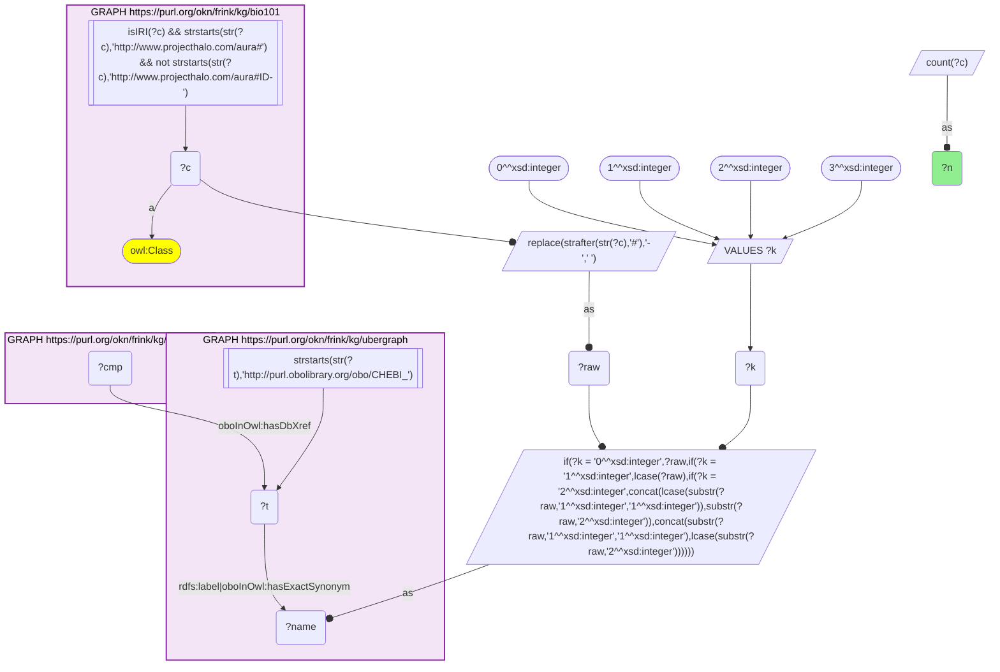
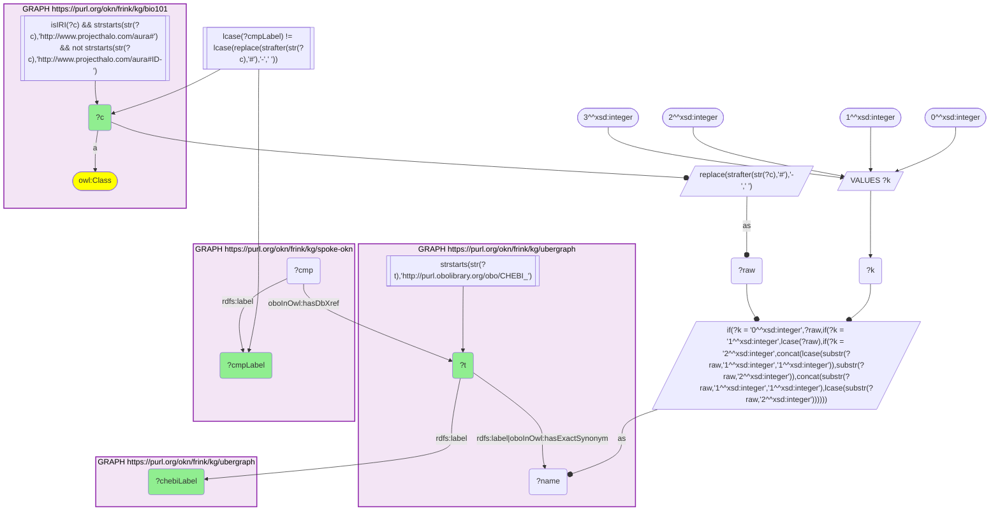
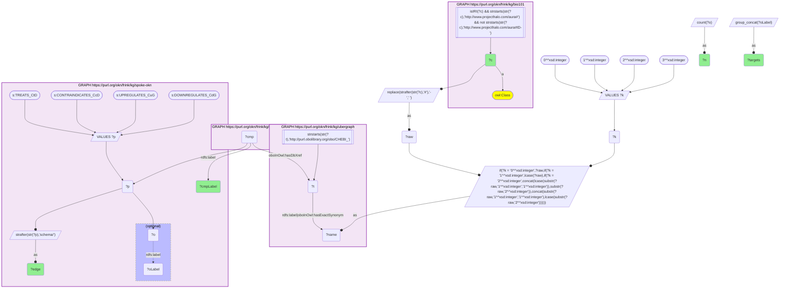
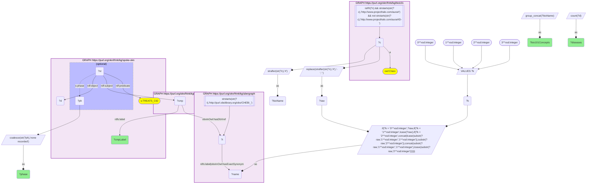

# Which KB Bio 101 chemicals reach SPOKE-OKN compounds, and what SPOKE-OKN links them to (bio101 × spoke-okn, CHEBI by name)

- **Date:** 2026-10-05
- **Model:** claude-opus-5-5
- **SPARQL endpoint:** https://apps.okn.us/federation/sparql
- **Generated by:** mcp-okn v0.1.0 (build 8efca43)
- **Contents:** 5 queries · 4 query diagrams

## Knowledge graphs used

- `bio101` — <https://purl.org/okn/frink/kg/bio101>
- `ubergraph` — <https://purl.org/okn/frink/kg/ubergraph>
- `spoke-okn` — <https://purl.org/okn/frink/kg/spoke-okn>

## Conversation

👤 **User**

Crosswalk: `bio101` × `spoke-okn` on **CHEBI (bio101 label), bridged through `ubergraph`** (crosswalk `KB6-chebi-label-bio101-spoke-okn`, verified_count 86). bio101 (KB Bio 101) is an OWL ontology of an introductory biology textbook: every concept is an `owl:Class` named only by its IRI local name (`http://www.projecthalo.com/aura#Copper`), with no `rdfs:label`, xref or external identifier. The concept name (hyphens to spaces, in four case forms: as-is, all lower-case, first letter lowered, and sentence case) is matched as a bound literal against ubergraph's CHEBI `rdfs:label` / `oboInOwl:hasExactSynonym`. spoke-okn's Compound nodes carry that CHEBI IRI on `oboInOwl:hasDbXref` and have edges such as `TREATS_CtD` and `CONTRAINDICATES_CcD` (to diseases), `UPREGULATES_CuG` / `DOWNREGULATES_CdG` (to genes), `FOUNDIN_CfL` (environmental findings in an area) and incoming `RESPONDS_TO_OrC` (organisms).

Research question: Which KB Bio 101 chemicals resolve to SPOKE-OKN compounds, and which of those does SPOKE-OKN link to the most diseases or genes — and what does it mostly record instead?

Why the join is required: bio101 defines the textbook chemicals but records no clinical, genomic or environmental data about them; SPOKE-OKN has that data but no textbook context. Only the concept name, resolved to a CHEBI id in ubergraph, connects the two.

---

🧠 **Assistant**

The name bridge reaches **86 bio101 chemicals** (the skeleton, now with the four-form name block, reproduces the crosswalk's verified count). They land on **81 distinct SPOKE-OKN compounds**, because several textbook concepts share a compound: Acetate and Acetic-Acid both land on Acetic Acid, Carbon and Methane on Methane, Calcium-Carbonate and Carbonic-Acid on Carbonic Acid, and Sulfur, Thiol and Hydrogen-Sulfide on Hydrogen Sulfide.

**What SPOKE-OKN records for the 81 compounds**

| Edge type | Compounds with ≥1 edge | Notes |
| --- | --- | --- |
| Environmental findings (`FOUNDIN_CfL`) | 81 (all) | the dominant layer |
| Treats a disease (`TREATS_CtD`) | 18 | 84 compound–disease pairs |
| Contraindicated for a disease | 6 | |
| Up- or down-regulates a gene | 3 | |
| Organism responds to it | 1 | Tetracycline, 5,138 organisms |

**Most disease links**

| SPOKE-OKN compound (bio101 concept) | Treats | Contraindicated |
| --- | --- | --- |
| Carbonic Acid (Carbonic-Acid, Calcium-Carbonate) | 22 | 1 (psoriasis) |
| Calcium | 15 | – |
| Copper | 7 | – |
| Iodine | 7 | – |
| Methane (Methane, Carbon) | 6 | – |
| Tetracycline | 4 | 4 |
| Benzoic Acid (Benzoate) | – | 8 |

Carbonic Acid's 22 treated diseases run from colon and breast cancer to Parkinson's and Alzheimer's disease; Calcium's 15 include Parkinson's disease, colorectal cancer and polycystic ovary syndrome. Benzoic Acid is contraindicated for 8 conditions, among them glaucoma, liver disease and hypertension.

**Clinical phase.** Of the 84 treats pairs, 74 come from phase 1–3 trials, 5 are phase 4 and 5 have no phase recorded. These edges are trial associations, not approved uses.

**Gene edges are almost absent.** Only three compounds have any: Benzoic Acid up-regulates SELL and MCOLN1 and down-regulates PEG10 and RGCC; Acetaldehyde up-regulates CSRP1; Chloroform up-regulates MCOLN1.

**What SPOKE-OKN mostly records instead: the environment.** Every one of the 81 compounds has environmental findings. The most are for Manganese (17,096), Lead (5,969), Nickel (4,858), Ammonia (4,763) and Arsenic (4,037).

**Identity check — the main caveat.** For 13 of the 86 bio101 concepts, the SPOKE-OKN compound label differs from the textbook name. The bio101 → CHEBI step is right in every case; the shift comes from SPOKE-OKN's own CHEBI cross-references.
- **7 are real identity shifts** and must not be read as the textbook substance: Carbon → Methane, Chlorine → Hydrochloric Acid, Fluorine → Hydrofluoric Acid, Phosphorus → Phosphine, Sulfur → Hydrogen Sulfide, Thiol → Hydrogen Sulfide, and Calcium-Carbonate → Carbonic Acid. So Carbonic Acid's 22 treats edges may well come from calcium-carbonate trials (unverified), and none of them should be attributed to the element carbon via Methane.
- **6 are harmless naming differences**: Acetate → Acetic Acid, Benzoate → Benzoic Acid, Sulfate → Sulfate Ion, Tin → Tin powder, Ether → Diethyl Ether and DDT → Clofenotane.

**Caveats.** The join is a name match and therefore a lower bound. Disease and gene counts are distinct targets per compound, so a concept that shares a compound with another (e.g. Carbon and Methane) shows the same numbers. The sentence-case name form added to the bridge does not change this crosswalk: it still reaches the same 86 concepts, 81 compounds and 13 relabelled matches, and every count above is unchanged.

## SPARQL queries executed

#### Query 1

_2026-10-06T00:08:40+00:00 · `bio101`, `ubergraph`, `spoke-okn`_

```sparql
SELECT (COUNT(DISTINCT ?c) AS ?n) WHERE {
  { SELECT DISTINCT ?c ?t WHERE {
  { SELECT DISTINCT ?c ?name WHERE {
      GRAPH <https://purl.org/okn/frink/kg/bio101> { ?c a <http://www.w3.org/2002/07/owl#Class> .
        FILTER(isIRI(?c) && STRSTARTS(STR(?c),'http://www.projecthalo.com/aura#') && !STRSTARTS(STR(?c),'http://www.projecthalo.com/aura#ID-')) }
      BIND(REPLACE(STRAFTER(STR(?c),'#'),'-',' ') AS ?raw)
      VALUES ?k { 0 1 2 3 }  # as-is, all lower, first letter lowered, sentence case
      BIND(IF(?k = 0, ?raw, IF(?k = 1, LCASE(?raw), IF(?k = 2, CONCAT(LCASE(SUBSTR(?raw,1,1)),SUBSTR(?raw,2)),
                CONCAT(SUBSTR(?raw,1,1),LCASE(SUBSTR(?raw,2)))))) AS ?name)
  } }
    GRAPH <https://purl.org/okn/frink/kg/ubergraph> { ?t <http://www.w3.org/2000/01/rdf-schema#label>|<http://www.geneontology.org/formats/oboInOwl#hasExactSynonym> ?name .
      FILTER(STRSTARTS(STR(?t),'http://purl.obolibrary.org/obo/CHEBI_')) }
  } }
  GRAPH <https://purl.org/okn/frink/kg/spoke-okn> { ?cmp <http://www.geneontology.org/formats/oboInOwl#hasDbXref> ?t . }
}
```



_1 row(s)_

| n |
| --- |
| 86 |

#### Query 2

_2026-10-06T00:08:53+00:00 · `bio101`, `ubergraph`, `spoke-okn`_

```sparql
PREFIX rdfs: <http://www.w3.org/2000/01/rdf-schema#>
PREFIX s: <https://purl.org/okn/frink/kg/spoke-okn/schema/>
# Edge profile of every SPOKE-OKN compound reached from a bio101 chemical
SELECT ?c ?cmpLabel ?treats ?contraindicates ?genesUp ?genesDown ?envFindings ?organismResponses WHERE {
  { SELECT DISTINCT ?c ?cmp WHERE {
    { SELECT DISTINCT ?c ?t WHERE {
    { SELECT DISTINCT ?c ?name WHERE {
        GRAPH <https://purl.org/okn/frink/kg/bio101> { ?c a <http://www.w3.org/2002/07/owl#Class> .
          FILTER(isIRI(?c) && STRSTARTS(STR(?c),'http://www.projecthalo.com/aura#') && !STRSTARTS(STR(?c),'http://www.projecthalo.com/aura#ID-')) }
        BIND(REPLACE(STRAFTER(STR(?c),'#'),'-',' ') AS ?raw)
        VALUES ?k { 0 1 2 3 }  # as-is, all lower, first letter lowered, sentence case
        BIND(IF(?k = 0, ?raw, IF(?k = 1, LCASE(?raw), IF(?k = 2, CONCAT(LCASE(SUBSTR(?raw,1,1)),SUBSTR(?raw,2)),
                  CONCAT(SUBSTR(?raw,1,1),LCASE(SUBSTR(?raw,2)))))) AS ?name)
    } }
      GRAPH <https://purl.org/okn/frink/kg/ubergraph> { ?t rdfs:label|<http://www.geneontology.org/formats/oboInOwl#hasExactSynonym> ?name .
        FILTER(STRSTARTS(STR(?t),'http://purl.obolibrary.org/obo/CHEBI_')) }
    } }
    GRAPH <https://purl.org/okn/frink/kg/spoke-okn> { ?cmp <http://www.geneontology.org/formats/oboInOwl#hasDbXref> ?t . }
  } }
  GRAPH <https://purl.org/okn/frink/kg/spoke-okn> { ?cmp rdfs:label ?cmpLabel . }
  OPTIONAL { SELECT ?cmp (COUNT(DISTINCT ?d1) AS ?treats) WHERE { GRAPH <https://purl.org/okn/frink/kg/spoke-okn> { ?cmp s:TREATS_CtD ?d1 } } GROUP BY ?cmp }
  OPTIONAL { SELECT ?cmp (COUNT(DISTINCT ?d2) AS ?contraindicates) WHERE { GRAPH <https://purl.org/okn/frink/kg/spoke-okn> { ?cmp s:CONTRAINDICATES_CcD ?d2 } } GROUP BY ?cmp }
  OPTIONAL { SELECT ?cmp (COUNT(DISTINCT ?g1) AS ?genesUp) WHERE { GRAPH <https://purl.org/okn/frink/kg/spoke-okn> { ?cmp s:UPREGULATES_CuG ?g1 } } GROUP BY ?cmp }
  OPTIONAL { SELECT ?cmp (COUNT(DISTINCT ?g2) AS ?genesDown) WHERE { GRAPH <https://purl.org/okn/frink/kg/spoke-okn> { ?cmp s:DOWNREGULATES_CdG ?g2 } } GROUP BY ?cmp }
  OPTIONAL { SELECT ?cmp (COUNT(DISTINCT ?a) AS ?envFindings) WHERE { GRAPH <https://purl.org/okn/frink/kg/spoke-okn> { ?cmp s:FOUNDIN_CfL ?a } } GROUP BY ?cmp }
  OPTIONAL { SELECT ?cmp (COUNT(DISTINCT ?o) AS ?organismResponses) WHERE { GRAPH <https://purl.org/okn/frink/kg/spoke-okn> { ?o s:RESPONDS_TO_OrC ?cmp } } GROUP BY ?cmp }
} ORDER BY DESC(?treats) DESC(?contraindicates) DESC(?genesUp) ?c
```

_86 row(s) — showing first 3_

| c | cmpLabel | treats | contraindicates | genesUp | genesDown | envFindings | organismResponses |
| --- | --- | --- | --- | --- | --- | --- | --- |
| http://www.projecthalo.com/aura#Calcium-Carbonate | Carbonic Acid | 22 | 1 |  |  | 30 |  |
| http://www.projecthalo.com/aura#Carbonic-Acid | Carbonic Acid | 22 | 1 |  |  | 30 |  |
| http://www.projecthalo.com/aura#Calcium | Calcium | 15 |  |  |  | 67 |  |

#### Query 3

_2026-10-06T00:09:02+00:00 · `bio101`, `ubergraph`, `spoke-okn`_

```sparql
PREFIX rdfs: <http://www.w3.org/2000/01/rdf-schema#>
PREFIX s: <https://purl.org/okn/frink/kg/spoke-okn/schema/>
# Identity audit: bio101 name -> CHEBI term -> SPOKE-OKN compound label, where the compound label is not the bio101 name
SELECT ?c ?t ?chebiLabel ?cmpLabel WHERE {
  { SELECT DISTINCT ?c ?t WHERE {
  { SELECT DISTINCT ?c ?name WHERE {
      GRAPH <https://purl.org/okn/frink/kg/bio101> { ?c a <http://www.w3.org/2002/07/owl#Class> .
        FILTER(isIRI(?c) && STRSTARTS(STR(?c),'http://www.projecthalo.com/aura#') && !STRSTARTS(STR(?c),'http://www.projecthalo.com/aura#ID-')) }
      BIND(REPLACE(STRAFTER(STR(?c),'#'),'-',' ') AS ?raw)
      VALUES ?k { 0 1 2 3 }  # as-is, all lower, first letter lowered, sentence case
      BIND(IF(?k = 0, ?raw, IF(?k = 1, LCASE(?raw), IF(?k = 2, CONCAT(LCASE(SUBSTR(?raw,1,1)),SUBSTR(?raw,2)),
                CONCAT(SUBSTR(?raw,1,1),LCASE(SUBSTR(?raw,2)))))) AS ?name)
  } }
    GRAPH <https://purl.org/okn/frink/kg/ubergraph> { ?t rdfs:label|<http://www.geneontology.org/formats/oboInOwl#hasExactSynonym> ?name .
      FILTER(STRSTARTS(STR(?t),'http://purl.obolibrary.org/obo/CHEBI_')) }
  } }
  GRAPH <https://purl.org/okn/frink/kg/ubergraph> { ?t rdfs:label ?chebiLabel }
  GRAPH <https://purl.org/okn/frink/kg/spoke-okn> { ?cmp <http://www.geneontology.org/formats/oboInOwl#hasDbXref> ?t ; rdfs:label ?cmpLabel . }
  FILTER(LCASE(?cmpLabel) != LCASE(REPLACE(STRAFTER(STR(?c),'#'),'-',' ')))
} ORDER BY ?c
```



_13 row(s) — showing first 3_

| c | t | chebiLabel | cmpLabel |
| --- | --- | --- | --- |
| http://www.projecthalo.com/aura#Acetate | http://purl.obolibrary.org/obo/CHEBI_30089 | acetate | Acetic Acid |
| http://www.projecthalo.com/aura#Benzoate | http://purl.obolibrary.org/obo/CHEBI_16150 | benzoate | Benzoic Acid |
| http://www.projecthalo.com/aura#Calcium-Carbonate | http://purl.obolibrary.org/obo/CHEBI_3311 | calcium carbonate | Carbonic Acid |

#### Query 4

_2026-10-06T00:09:12+00:00 · `bio101`, `ubergraph`, `spoke-okn`_

```sparql
PREFIX rdfs: <http://www.w3.org/2000/01/rdf-schema#>
PREFIX s: <https://purl.org/okn/frink/kg/spoke-okn/schema/>
# What the disease and gene edges of the bridged compounds actually point to
SELECT ?c ?cmpLabel ?edge (COUNT(DISTINCT ?o) AS ?n) (GROUP_CONCAT(DISTINCT ?oLabel; separator="; ") AS ?targets) WHERE {
  { SELECT DISTINCT ?c ?cmp WHERE {
    { SELECT DISTINCT ?c ?t WHERE {
    { SELECT DISTINCT ?c ?name WHERE {
        GRAPH <https://purl.org/okn/frink/kg/bio101> { ?c a <http://www.w3.org/2002/07/owl#Class> .
          FILTER(isIRI(?c) && STRSTARTS(STR(?c),'http://www.projecthalo.com/aura#') && !STRSTARTS(STR(?c),'http://www.projecthalo.com/aura#ID-')) }
        BIND(REPLACE(STRAFTER(STR(?c),'#'),'-',' ') AS ?raw)
        VALUES ?k { 0 1 2 3 }  # as-is, all lower, first letter lowered, sentence case
        BIND(IF(?k = 0, ?raw, IF(?k = 1, LCASE(?raw), IF(?k = 2, CONCAT(LCASE(SUBSTR(?raw,1,1)),SUBSTR(?raw,2)),
                  CONCAT(SUBSTR(?raw,1,1),LCASE(SUBSTR(?raw,2)))))) AS ?name)
    } }
      GRAPH <https://purl.org/okn/frink/kg/ubergraph> { ?t rdfs:label|<http://www.geneontology.org/formats/oboInOwl#hasExactSynonym> ?name .
        FILTER(STRSTARTS(STR(?t),'http://purl.obolibrary.org/obo/CHEBI_')) }
    } }
    GRAPH <https://purl.org/okn/frink/kg/spoke-okn> { ?cmp <http://www.geneontology.org/formats/oboInOwl#hasDbXref> ?t . }
  } }
  GRAPH <https://purl.org/okn/frink/kg/spoke-okn> {
    ?cmp rdfs:label ?cmpLabel .
    VALUES ?p { s:TREATS_CtD s:CONTRAINDICATES_CcD s:UPREGULATES_CuG s:DOWNREGULATES_CdG }
    ?cmp ?p ?o .
    OPTIONAL { ?o rdfs:label ?oLabel }
    BIND(STRAFTER(STR(?p), 'schema/') AS ?edge)
  }
} GROUP BY ?c ?cmpLabel ?edge ORDER BY ?edge DESC(?n) ?c
```



_37 row(s) — showing first 3_

| c | cmpLabel | edge | n | targets |
| --- | --- | --- | --- | --- |
| http://www.projecthalo.com/aura#Benzoate | Benzoic Acid | CONTRAINDICATES_CcD | 8 | gastroesophageal reflux disease; glaucoma; liver disease; anorexia nervosa; coronary artery disease; peptic ulcer disease; diabetes mellitus; hypertension |
| http://www.projecthalo.com/aura#Tetracycline | Tetracycline | CONTRAINDICATES_CcD | 4 | glomerulonephritis; gout; liver disease; diabetes mellitus |
| http://www.projecthalo.com/aura#Acetate | Acetic Acid | CONTRAINDICATES_CcD | 1 | chronic kidney disease |

#### Query 5

_2026-10-06T00:09:21+00:00 · `bio101`, `ubergraph`, `spoke-okn`_

```sparql
PREFIX rdf: <http://www.w3.org/1999/02/22-rdf-syntax-ns#>
PREFIX rdfs: <http://www.w3.org/2000/01/rdf-schema#>
PREFIX s: <https://purl.org/okn/frink/kg/spoke-okn/schema/>
# Clinical phase behind the TREATS_CtD edges of the bridged compounds (distinct diseases per phase)
SELECT ?cmpLabel (GROUP_CONCAT(DISTINCT ?bioName; separator=", ") AS ?bio101Concepts) ?phase (COUNT(DISTINCT ?d) AS ?diseases) WHERE {
  { SELECT DISTINCT ?c ?cmp WHERE {
    { SELECT DISTINCT ?c ?t WHERE {
    { SELECT DISTINCT ?c ?name WHERE {
        GRAPH <https://purl.org/okn/frink/kg/bio101> { ?c a <http://www.w3.org/2002/07/owl#Class> .
          FILTER(isIRI(?c) && STRSTARTS(STR(?c),'http://www.projecthalo.com/aura#') && !STRSTARTS(STR(?c),'http://www.projecthalo.com/aura#ID-')) }
        BIND(REPLACE(STRAFTER(STR(?c),'#'),'-',' ') AS ?raw)
        VALUES ?k { 0 1 2 3 }  # as-is, all lower, first letter lowered, sentence case
        BIND(IF(?k = 0, ?raw, IF(?k = 1, LCASE(?raw), IF(?k = 2, CONCAT(LCASE(SUBSTR(?raw,1,1)),SUBSTR(?raw,2)),
                  CONCAT(SUBSTR(?raw,1,1),LCASE(SUBSTR(?raw,2)))))) AS ?name)
    } }
      GRAPH <https://purl.org/okn/frink/kg/ubergraph> { ?t rdfs:label|<http://www.geneontology.org/formats/oboInOwl#hasExactSynonym> ?name .
        FILTER(STRSTARTS(STR(?t),'http://purl.obolibrary.org/obo/CHEBI_')) }
    } }
    GRAPH <https://purl.org/okn/frink/kg/spoke-okn> { ?cmp <http://www.geneontology.org/formats/oboInOwl#hasDbXref> ?t . }
  } }
  BIND(STRAFTER(STR(?c),'#') AS ?bioName)
  GRAPH <https://purl.org/okn/frink/kg/spoke-okn> {
    ?cmp rdfs:label ?cmpLabel .
    ?st rdf:subject ?cmp ; rdf:predicate s:TREATS_CtD ; rdf:object ?d .
    OPTIONAL { ?st s:phase ?ph }
  }
  BIND(COALESCE(STR(?ph), "none recorded") AS ?phase)
} GROUP BY ?cmpLabel ?phase ORDER BY ?cmpLabel ?phase
```



_36 row(s) — showing first 5_

| cmpLabel | bio101Concepts | phase | diseases |
| --- | --- | --- | --- |
| Acetic Acid | Acetic-Acid, Acetate | 2 | 1 |
| Acetic Acid | Acetic-Acid, Acetate | 4 | 1 |
| Calcium | Calcium | 2 | 3 |
| Calcium | Calcium | 3 | 12 |
| Carbon Dioxide | Carbon-Dioxide | 2 | 1 |
