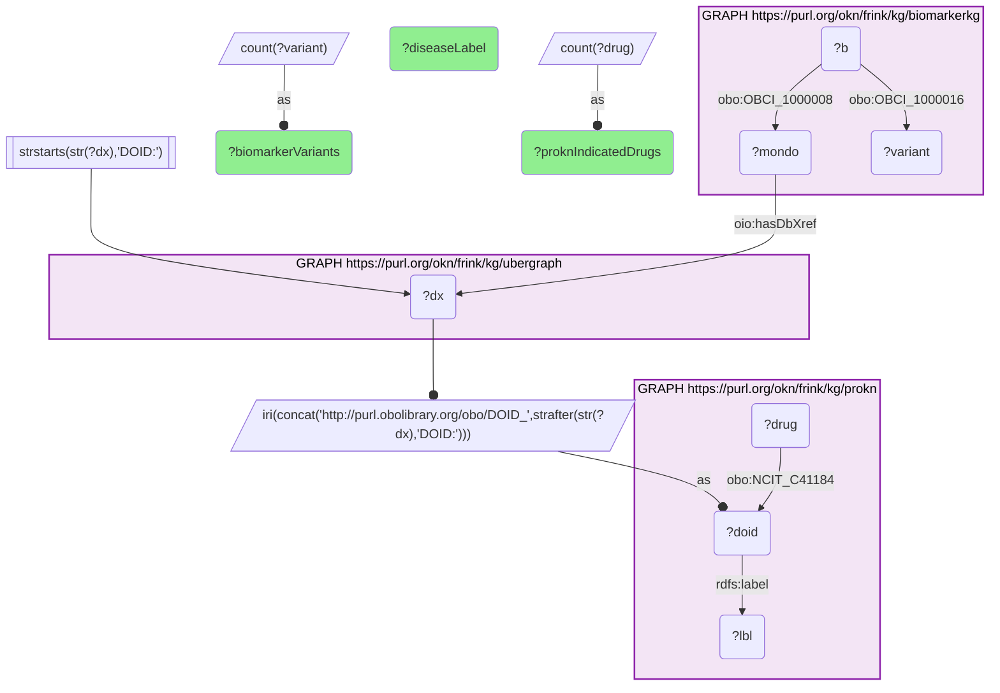
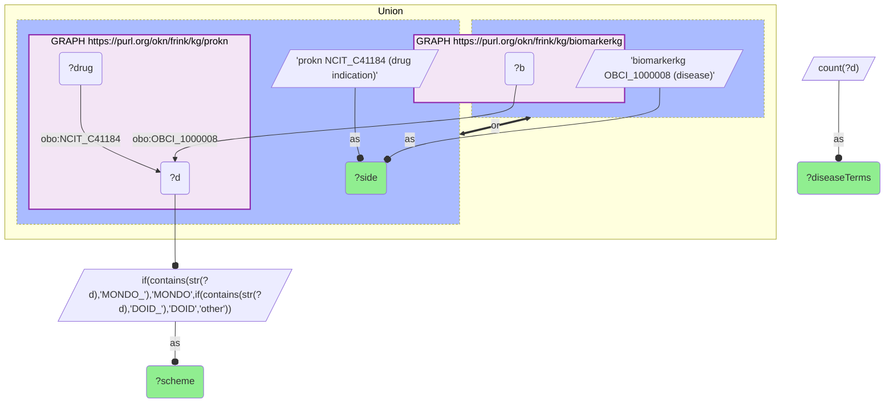
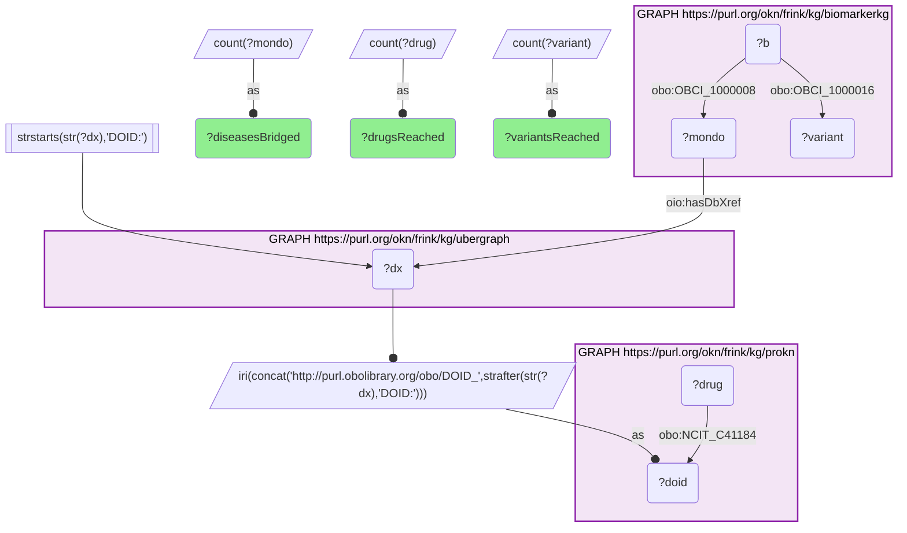

# CW1-Q1 biomarkerkg×prokn (MONDO↔DOID) — biomarker variants vs ProKN indicated drugs

- **Date:** 2026-09-02
- **Model:** claude-opus-5[1m]
- **SPARQL endpoint:** https://apps.okn.us/federation/sparql
- **Generated by:** mcp-okn v0.1.0 (build 3638bbc)
- **Contents:** 3 queries · 3 query diagrams

## Knowledge graphs used

- `biomarkerkg` — <https://purl.org/okn/frink/kg/biomarkerkg>
- `prokn` — <https://purl.org/okn/frink/kg/prokn>
- `ubergraph` — <https://purl.org/okn/frink/kg/ubergraph>

## Conversation

👤 **User**

CW1 (biomarkerkg × prokn), Q1: Across diseases with literature-curated biomarker variants in BiomarkerKG, how do the count of curated genomic biomarker variants (BiomarkerKG) and the count of ProKN-indicated drugs compare per disease? State why this needs the join.

---

🧠 **Assistant**

**Crosswalk:** biomarkerkg × prokn · **Shared identifier:** MONDO on the BiomarkerKG side, DOID on the ProKN side, bridged through ubergraph's `oboInOwl:hasDbXref`.

**Why this transcript was rebuilt (2026-09-02).** The original (2026-06-17) joined the two graphs on a single shared `?doid` variable, because BiomarkerKG then keyed its disease axis on DOID. BiomarkerKG has since migrated that axis to MONDO, so the direct join silently collapsed from 15 rows to 5 — it did not error and it did not return zero, which is why it went unnoticed. A census of both predicates shows the mismatch:

| Side | MONDO | DOID | other |
|---|---|---|---|
| biomarkerkg `OBCI_1000008` | 629 | 16 | — |
| prokn `NCIT_C41184` | 54 | 605 | 2,234 |

The 5 rows the stale query still returned were an artifact: they are the residue where the two graphs happen to coincide (the small MONDO∩MONDO overlap plus BiomarkerKG's 16 leftover DOID terms), not a correct answer to the question. The repair is the same ubergraph bridge used elsewhere in this catalog — take BiomarkerKG's MONDO term, read its `DOID:` cross-reference from ubergraph, rebuild the DOID IRI, and join that to ProKN's drug-indication object. That bridge reaches **171 diseases, 39,322 biomarker variants and 908 indicated drugs**.

**Why the join is required:** BiomarkerKG is a literature-curated catalog of genomic biomarker *variants* per disease but carries no drug-indication data; ProKN carries curated drug indications per disease but no biomarker-variant catalog. Only by joining the two graphs on the same disease can a researcher line up, for one disease, how deep the literature biomarker evidence is against how many drugs are actually indicated. Because the two graphs no longer share an identifier scheme on these predicates, the join additionally requires the MONDO→DOID bridge — this is now a three-graph question.

**Result (verified):** 15 rows, non-empty, biologically coherent.

| Disease | BiomarkerKG variants | ProKN indicated drugs |
|---|---|---|
| Hypertensive disease | 131 | 107 |
| Allergic rhinitis (disorder) | 64 | 82 |
| Dermatitis, Atopic | 164 | 54 |
| Seborrheic dermatitis | 7 | 44 |
| Schizophrenia | 1,069 | 42 |
| Asthma | 627 | 41 |
| Diabetes Mellitus, Non-Insulin-Dependent | 2,318 | 41 |
| Arthritis | 20 | 39 |
| Lymphoma, T-Cell, Cutaneous | 5 | 37 |
| Osteoporosis, Postmenopausal | 12 | 32 |
| Acne Vulgaris | 18 | 32 |
| Peptic Ulcer | 57 | 31 |
| Bronchitis, Chronic | 8 | 30 |
| Glaucoma, Open-Angle | 1 | 29 |
| Acute Lymphoblastic Leukemia | 189 | 22 |

**Why these rows answer the question:** each row pairs a disease's literature-variant count (BiomarkerKG) with its indicated-drug count (ProKN) for the *same disease*, which is exactly the two-sided comparison asked for.

**What changed substantively, and it is not cosmetic.** The original transcript concluded that "the leaders are precision-oncology diseases" and its top rows were CTCL, ALL, NSCLC, AML and RCC. Ranked over the full bridged set, the leaders are instead common chronic diseases with large approved formularies — hypertension (107 drugs), allergic rhinitis (82), atopic dermatitis (54). That earlier conclusion was a property of the DOID-only slice the old join could see, not of the underlying data. Cutaneous T-cell lymphoma survives at exactly 5 variants / 37 drugs, unchanged from the original, which is a useful consistency check that the bridge lands on the same entities.

**Reading the two columns.** They are ranked by drug count, and the two measures are driven by different things, so the ordering should not be read as a single "importance" axis. The drug column tracks how large a disease's approved formulary is, which favours common chronic disease. The variant column tracks GWAS and literature depth, which favours heavily-studied polygenic traits — type 2 diabetes (2,318), schizophrenia (1,069) and asthma (627) dominate it. The genuinely interesting rows are the mismatches in either direction: Glaucoma (1 variant, 29 drugs) and Seborrheic dermatitis (7 variants, 44 drugs) are well-treated but have almost no curated biomarker evidence, whereas type 2 diabetes has 2,318 curated variants against 41 indicated drugs.

**Caveats.** (1) The bridge is only as complete as ubergraph's MONDO→DOID cross-references; a BiomarkerKG disease whose MONDO term carries no `DOID:` xref is invisible here, so 171 is a lower bound on the true overlap. (2) ProKN's `NCIT_C41184` objects are 2,234 terms in neither scheme, which this join cannot reach at all — the DOID subset is 605 of 2,893. (3) Requiring `rdfs:label` on the ProKN side was checked and is *not* acting as a hidden filter: the bridged disease count is 171 with and without it. (4) Counts are per-disease `COUNT(DISTINCT)`; a variant curated for two diseases is counted under each.

## SPARQL queries executed

#### Query 1

_2026-09-02T21:19:08+00:00 · `biomarkerkg`, `ubergraph`, `prokn`_

```sparql
PREFIX rdfs: <http://www.w3.org/2000/01/rdf-schema#>
PREFIX oio:  <http://www.geneontology.org/formats/oboInOwl#>
PREFIX obo:  <http://purl.obolibrary.org/obo/>
SELECT (SAMPLE(?lbl) AS ?diseaseLabel)
       (COUNT(DISTINCT ?variant) AS ?biomarkerVariants)
       (COUNT(DISTINCT ?drug) AS ?proknIndicatedDrugs)
WHERE {
  GRAPH <https://purl.org/okn/frink/kg/biomarkerkg> {
    ?b obo:OBCI_1000008 ?mondo ;
       obo:OBCI_1000016 ?variant .
  }
  GRAPH <https://purl.org/okn/frink/kg/ubergraph> {
    ?mondo oio:hasDbXref ?dx .
  }
  FILTER(STRSTARTS(STR(?dx), "DOID:"))
  BIND(IRI(CONCAT("http://purl.obolibrary.org/obo/DOID_", STRAFTER(STR(?dx), "DOID:"))) AS ?doid)
  GRAPH <https://purl.org/okn/frink/kg/prokn> {
    ?drug obo:NCIT_C41184 ?doid .
    ?doid rdfs:label ?lbl .
  }
}
GROUP BY ?mondo
ORDER BY DESC(?proknIndicatedDrugs)
LIMIT 15
```



_15 row(s) — showing first 3_

| diseaseLabel | biomarkerVariants | proknIndicatedDrugs |
| --- | --- | --- |
| Hypertensive disease | 131 | 107 |
| Allergic rhinitis (disorder) | 64 | 82 |
| Dermatitis, Atopic | 164 | 54 |

#### Query 2

_2026-09-02T21:19:31+00:00 · `biomarkerkg`, `prokn`_

```sparql
PREFIX obo: <http://purl.obolibrary.org/obo/>
SELECT ?side ?scheme (COUNT(DISTINCT ?d) AS ?diseaseTerms) WHERE {
  {
    GRAPH <https://purl.org/okn/frink/kg/biomarkerkg> {
      ?b obo:OBCI_1000008 ?d .
    }
    BIND("biomarkerkg OBCI_1000008 (disease)" AS ?side)
  } UNION {
    GRAPH <https://purl.org/okn/frink/kg/prokn> {
      ?drug obo:NCIT_C41184 ?d .
    }
    BIND("prokn NCIT_C41184 (drug indication)" AS ?side)
  }
  BIND(IF(CONTAINS(STR(?d), "MONDO_"), "MONDO",
       IF(CONTAINS(STR(?d), "DOID_"), "DOID", "other")) AS ?scheme)
}
GROUP BY ?side ?scheme
ORDER BY ?side DESC(?diseaseTerms)
```



_5 row(s) — showing first 3_

| side | scheme | diseaseTerms |
| --- | --- | --- |
| biomarkerkg OBCI_1000008 (disease) | MONDO | 629 |
| biomarkerkg OBCI_1000008 (disease) | DOID | 16 |
| prokn NCIT_C41184 (drug indication) | other | 2234 |

#### Query 3

_2026-09-02T21:19:40+00:00 · `biomarkerkg`, `ubergraph`, `prokn`_

```sparql
PREFIX oio: <http://www.geneontology.org/formats/oboInOwl#>
PREFIX obo: <http://purl.obolibrary.org/obo/>
SELECT (COUNT(DISTINCT ?mondo) AS ?diseasesBridged)
       (COUNT(DISTINCT ?variant) AS ?variantsReached)
       (COUNT(DISTINCT ?drug) AS ?drugsReached)
WHERE {
  GRAPH <https://purl.org/okn/frink/kg/biomarkerkg> {
    ?b obo:OBCI_1000008 ?mondo ;
       obo:OBCI_1000016 ?variant .
  }
  GRAPH <https://purl.org/okn/frink/kg/ubergraph> {
    ?mondo oio:hasDbXref ?dx .
  }
  FILTER(STRSTARTS(STR(?dx), "DOID:"))
  BIND(IRI(CONCAT("http://purl.obolibrary.org/obo/DOID_", STRAFTER(STR(?dx), "DOID:"))) AS ?doid)
  GRAPH <https://purl.org/okn/frink/kg/prokn> {
    ?drug obo:NCIT_C41184 ?doid .
  }
}
```



_1 row(s)_

| diseasesBridged | variantsReached | drugsReached |
| --- | --- | --- |
| 171 | 39322 | 908 |
