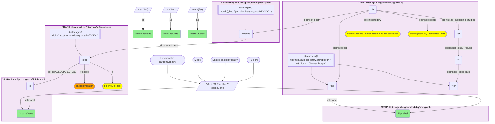

# CW5-Q2 spoke-okn×oard-kg (DOID↔MONDO) — cardiomyopathy subtype genes meet OARD EHR phenotypes

- **Date:** 2026-09-02
- **Model:** claude-opus-5[1m]
- **SPARQL endpoint:** https://apps.okn.us/federation/sparql
- **Generated by:** mcp-okn v0.1.0 (build 3638bbc)
- **Contents:** 1 query · 1 query diagram

## Knowledge graphs used

- `spoke-okn` — <https://purl.org/okn/frink/kg/spoke-okn>
- `ubergraph` — <https://purl.org/okn/frink/kg/ubergraph>
- `oard-kg` — <https://purl.org/okn/frink/kg/oard-kg>

## Conversation

👤 **User**

CW5 (spoke-okn × oard-kg, bridged DOID↔MONDO via ubergraph), Q2: For cardiomyopathy, pair each OARD EHR cardiomyopathy-subtype phenotype (by log-odds) with the SPOKE-associated gene that causes that subtype. Why the bridge join?

---

🧠 **Assistant**

**Crosswalk:** spoke-okn × oard-kg, bridged through **ubergraph** · **Shared key:** DOID↔MONDO. spoke-okn's "cardiomyopathy" (DOID) carries curated gene associations (`ASSOCIATES_DaG`) and bridges via `skos:exactMatch` to the MONDO term OARD keys its EHR `log_odds_ratio` phenotype enrichment on.

**Why this transcript was rebuilt (2026-09-02).** The original reported "5 distinct subtype rows", but the query returned one row per *supporting study*, not per subtype. OARD has since added a second study for two of the subtypes, so it began returning 7 rows for 5 subtypes — Hypertrophic cardiomyopathy twice (log-odds 8.32 and 1.58) and Left ventricular noncompaction twice (6.32 and 5.64). Both duplicates trace to a single MONDO term and a single association node with two `has_supporting_studies`; nothing about the join changed. The query is now aggregated with `GROUP BY ?hpLabel ?spokeGene`, reporting the study count and the log-odds range, which answers the question as asked (one row per subtype) and is stable against OARD adding further studies — the exact thing that broke it.

**Why the join is required:** spoke-okn names the disease and its causal genes but holds no EHR statistics; OARD holds the real-world cardiomyopathy-subtype enrichment but no genes, and keys on MONDO rather than DOID. Only the ubergraph DOID→MONDO bridge lets each OARD EHR subtype phenotype sit on the same row as the SPOKE-associated gene that causes it.

**Result (verified):** 5 subtype rows.

| OARD EHR cardiomyopathy phenotype | OARD studies | max log-odds | min log-odds | SPOKE-associated causal gene |
|---|---|---|---|---|
| Hypertrophic cardiomyopathy | 2 | 8.32315 | 1.58085 | MYH7 |
| Atrial cardiomyopathy | 1 | 8.08616 | 8.08616 | LMNA |
| Restrictive cardiomyopathy | 1 | 7.26634 | 7.26634 | TNNI3 |
| Dilated cardiomyopathy | 1 | 6.86452 | 6.86452 | TTN |
| Left ventricular noncompaction cardiomyopathy | 2 | 6.32166 | 5.63641 | MYBPC3 |

**Why these rows answer the question:** each cardiomyopathy subtype that OARD's EHR data flag as enriched is paired with the gene SPOKE associates with cardiomyopathy and that is its textbook molecular cause — MYH7/MYBPC3 sarcomere genes for the hypertrophic and noncompaction forms, TTN truncations for dilated, TNNI3 for restrictive, LMNA for the conduction-disease/atrial phenotype. That genotype↔EHR-phenotype map exists in neither graph alone.

**The study spread matters, and the original hid it.** Hypertrophic cardiomyopathy's two studies disagree substantially: log-odds 8.32 versus 1.58. The earlier transcript quoted only 8.32, because the second study did not yet exist — but reporting a single figure per subtype now would present the most favourable of two measurements as if it were the measurement. The spread is why this version reports both bounds. Ranking by max log-odds is a choice, not a fact about the data; ranked by the minimum, hypertrophic cardiomyopathy would fall to last rather than first.

**The sixth VALUES entry is an OARD gap, not a SPOKE gap.** The curated table includes Arrhythmogenic right ventricular cardiomyopathy → DSP, which returns no row. I checked which side is missing rather than leaving it ambiguous: spoke-okn *does* associate DSP with cardiomyopathy, but OARD carries no arrhythmogenic phenotype at all for MONDO_0004994. So the absent row reflects OARD's EHR phenotype coverage, not a failure of the bridge or a missing gene association.

**Caveats.** (1) The `?lor < 100` filter is retained from the original to exclude degenerate effect sizes; it is a data-quality guard, not a biological threshold. (2) The subtype→gene mapping is a curated `VALUES` table supplied by the analyst, not derived from either graph — the graphs supply the EHR enrichment and the gene *association*, but the claim that MYH7 causes the hypertrophic form specifically is domain knowledge asserted here. (3) `ASSOCIATES_DaG` links each gene to "cardiomyopathy" as a whole, not to the individual subtype, so the pairing is only as good as that curated table. (4) Study counts are `COUNT(DISTINCT ?st)` and will grow as OARD adds cohorts; the aggregation is designed so that growth changes the counts and ranges rather than the row count.

## SPARQL queries executed

#### Query 1

_2026-09-02T22:59:26+00:00 · `spoke-okn`, `ubergraph`, `oard-kg`_

```sparql
PREFIX biolink: <https://w3id.org/biolink/vocab/>
PREFIX skos: <http://www.w3.org/2004/02/skos/core#>
PREFIX rdfs: <http://www.w3.org/2000/01/rdf-schema#>
PREFIX spoke: <https://purl.org/okn/frink/kg/spoke-okn/schema/>
# CW5 Q2: cardiomyopathy. One row per OARD EHR cardiomyopathy-subtype phenotype,
# aggregated over its supporting studies, paired with the SPOKE-associated gene
# that causes that subtype. Bridged DOID<->MONDO via ubergraph.
SELECT ?hpLabel
       (COUNT(DISTINCT ?st) AS ?oardStudies)
       (MAX(?lor) AS ?maxLogOdds)
       (MIN(?lor) AS ?minLogOdds)
       ?spokeGene
WHERE {
  GRAPH <https://purl.org/okn/frink/kg/spoke-okn> {
    ?doid a biolink:Disease ; rdfs:label "cardiomyopathy" . FILTER(STRSTARTS(STR(?doid),'http://purl.obolibrary.org/obo/DOID_'))
  }
  GRAPH <https://purl.org/okn/frink/kg/ubergraph> {
    ?mondo skos:exactMatch ?doid . FILTER(STRSTARTS(STR(?mondo),'http://purl.obolibrary.org/obo/MONDO_'))
  }
  GRAPH <https://purl.org/okn/frink/kg/oard-kg> {
    ?a biolink:category biolink:DiseaseToPhenotypicFeatureAssociation ; biolink:subject ?mondo ;
       biolink:predicate biolink:positively_correlated_with ; biolink:object ?hp ; biolink:has_supporting_studies ?st .
    FILTER(STRSTARTS(STR(?hp),'http://purl.obolibrary.org/obo/HP_'))
    ?st biolink:has_study_results ?r . ?r biolink:log_odds_ratio ?lor . FILTER(?lor < 100)
  }
  GRAPH <https://purl.org/okn/frink/kg/ubergraph> { ?hp rdfs:label ?hpLabel . }
  VALUES (?hpLabel ?spokeGene) {
    ("Hypertrophic cardiomyopathy" "MYH7")
    ("Dilated cardiomyopathy" "TTN")
    ("Restrictive cardiomyopathy" "TNNI3")
    ("Left ventricular noncompaction cardiomyopathy" "MYBPC3")
    ("Atrial cardiomyopathy" "LMNA")
    ("Arrhythmogenic right ventricular cardiomyopathy" "DSP")
  }
  GRAPH <https://purl.org/okn/frink/kg/spoke-okn> {
    ?doid spoke:ASSOCIATES_DaG ?g . ?g rdfs:label ?spokeGene .
  }
}
GROUP BY ?hpLabel ?spokeGene
ORDER BY DESC(?maxLogOdds)
```



_5 row(s)_

| hpLabel | oardStudies | maxLogOdds | minLogOdds | spokeGene |
| --- | --- | --- | --- | --- |
| Hypertrophic cardiomyopathy | 2 | 8.32315 | 1.58085 | MYH7 |
| Atrial cardiomyopathy | 1 | 8.08616 | 8.08616 | LMNA |
| Restrictive cardiomyopathy | 1 | 7.26634 | 7.26634 | TNNI3 |
| Dilated cardiomyopathy | 1 | 6.86452 | 6.86452 | TTN |
| Left ventricular noncompaction cardiomyopathy | 2 | 6.32166 | 5.63641 | MYBPC3 |
