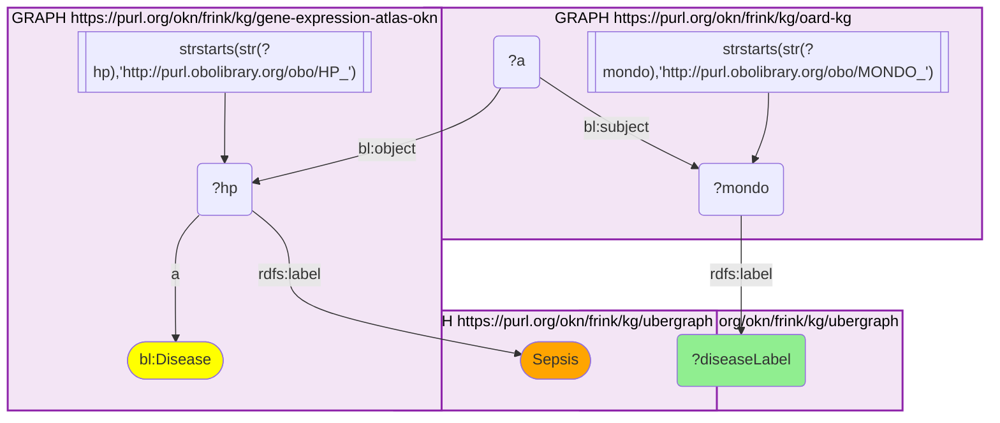
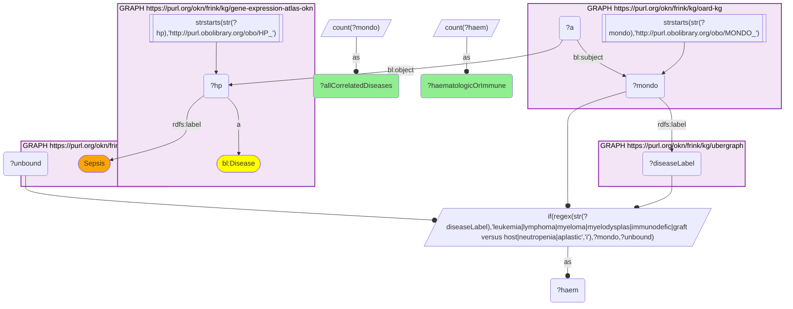

# disease19_q2 gxa×oard-kg (HP) — diseases co-occurring with sepsis in EHR data

- **Date:** 2026-09-02
- **Model:** claude-opus-5[1m]
- **SPARQL endpoint:** https://apps.okn.us/federation/sparql
- **Generated by:** mcp-okn v0.1.0 (build 3638bbc)
- **Contents:** 2 queries · 2 query diagrams

## Knowledge graphs used

- `gene-expression-atlas-okn` — <https://purl.org/okn/frink/kg/gene-expression-atlas-okn>
- `oard-kg` — <https://purl.org/okn/frink/kg/oard-kg>
- `ubergraph` — <https://purl.org/okn/frink/kg/ubergraph>

## Conversation

👤 **User**

Sepsis is one of the phenotypes GXA profiles by expression and the most clinically connected in OARD (q1). **Crosswalk on HP:** which diseases is sepsis positively correlated with in OARD's EHR data? Join gene-expression-atlas-okn and oard-kg on HP = Sepsis.

---

🧠 **Assistant**

**Why this transcript was rebuilt (2026-09-02), and one conclusion withdrawn.**

First, the query could not run. It failed with `HTTP 500: Tried to allocate 9.7 GB, but only 5.7 GB were available`, repeatably and with nothing else running. The cause was clause order: `?mondo rdfs:label ?diseaseLabel` sat in the ubergraph block *before* anything bound `?mondo`, so the engine enumerated every labelled node in ubergraph and cross-produced it against the rest of the query. Moving that lookup after the oard-kg block that binds `?mondo` takes it to **5.5 s**. The rows are unchanged — all five diseases the original displayed are still present.

Second, and more importantly, the original's headline reading does not survive checking. It said sepsis "co-occurs predominantly with immunocompromising and hematologic-malignancy diseases (leukemias, acquired immunodeficiency, graft-versus-host disease)". That conclusion was drawn from a `LIMIT 15` with **no `ORDER BY`** — an arbitrary slice, which the engine returns alphabetically. Diseases beginning "acute … leukemia" crowd the front of the alphabet, so the list *looked* haematologic. Counting the full set instead: OARD correlates sepsis with **579** distinct MONDO diseases, of which **68 (12%)** are haematologic or immune. The first two rows of the visible slice — 3-methylglutaconic aciduria and abetalipoproteinemia — are neither, which is the tell.

So the corrected statement is: a clinically coherent haematologic/immunocompromised signal is present and is 12% of the correlated set, not the dominant pattern. Establishing genuine enrichment would need a baseline rate for those categories across all OARD correlations, which this query does not compute.

**Why the join is required.** GXA marks sepsis as a studied phenotype; only OARD knows which diseases it co-occurs with in real-world records. Listing them requires resolving GXA's Sepsis HP term and pulling OARD's disease subjects correlated with it.

**Join mechanics.** Resolve `?hp` in GXA whose ubergraph label is "Sepsis", then take OARD `?assoc biolink:object ?hp ; biolink:subject ?mondo`, and only then read disease labels from ubergraph.

**Result (verified):** 15 rows shown of 579. Because the slice is unordered, read it as a sample of the correlated set, not as a ranking:

| Disease (alphabetical slice of 579) |
|---|
| 3-methylglutaconic aciduria |
| abetalipoproteinemia |
| acquired immunodeficiency |
| acquired polycythemia vera |
| acute erythroid leukemia |
| acute graft versus host disease |
| acute interstitial pneumonia |
| acute leukemia of ambiguous lineage |
| acute lymphoblastic leukemia |
| acute megakaryoblastic leukemia |
| acute monocytic leukemia |
| acute myeloblastic leukemia with maturation |
| acute myeloid leukemia |
| acute myeloid leukemia with 11q23 abnormalities |
| acute myeloid leukemia with abnormal bone marrow eosinophils inv(16)(p13q22) or t(16;16)(p13;q22) |

**What the join does support.** That sepsis is EHR-correlated with acute leukaemias, acquired immunodeficiency and graft-versus-host disease is real and clinically expected — these are the highest infection-risk populations. According to PubMed, sepsis and invasive bacterial infection are a documented major risk in acute leukemia and haematopoietic stem-cell transplant recipients (Lehrnbecher et al., *Clin Infect Dis* 2020, [DOI](https://doi.org/10.1093/cid/ciz1082)), with infection/sepsis and GvHD interlinked in transplant patients (Renaghan et al., *CJASN* 2020, [DOI](https://doi.org/10.2215/CJN.08580719)). What the data do **not** support is that this group dominates the correlated set.

**Caveats.** (1) The 68/579 split uses a label regex over disease names, so it is an approximation — a haematologic disease named without any of those stems is missed. (2) OARD correlation is EHR co-occurrence, which reflects who gets admitted and coded together as much as biology; 579 correlated diseases is a broad net. (3) The query does not filter on effect size, so weak and strong correlations are counted alike.

## SPARQL queries executed

#### Query 1

_2026-09-03T00:23:01+00:00 · `gene-expression-atlas-okn`, `ubergraph`, `oard-kg`_

```sparql
PREFIX bl: <https://w3id.org/biolink/vocab/>
PREFIX rdfs: <http://www.w3.org/2000/01/rdf-schema#>
# Diseases positively co-occurring with Sepsis in OARD's EHR data.
# NOTE ON SHAPE: the disease-label lookup must come AFTER ?mondo is bound by the
# oard-kg block. Written before it, `?mondo rdfs:label ?diseaseLabel` enumerates
# every labelled node in ubergraph and cross-products it against the rest of the
# query, which is why the original form demanded ~9.7 GB and could not run.
SELECT DISTINCT ?diseaseLabel WHERE {
  GRAPH <https://purl.org/okn/frink/kg/gene-expression-atlas-okn> {
    ?hp a bl:Disease . FILTER(STRSTARTS(STR(?hp),'http://purl.obolibrary.org/obo/HP_'))
  }
  GRAPH <https://purl.org/okn/frink/kg/ubergraph> { ?hp rdfs:label "Sepsis" }
  GRAPH <https://purl.org/okn/frink/kg/oard-kg> {
    ?a bl:object ?hp ; bl:subject ?mondo .
    FILTER(STRSTARTS(STR(?mondo),'http://purl.obolibrary.org/obo/MONDO_'))
  }
  GRAPH <https://purl.org/okn/frink/kg/ubergraph> { ?mondo rdfs:label ?diseaseLabel }
} LIMIT 15
```



_15 row(s) — showing first 3_

| diseaseLabel |
| --- |
| 3-methylglutaconic aciduria |
| abetalipoproteinemia |
| acquired immunodeficiency |

#### Query 2

_2026-09-03T00:23:20+00:00 · `gene-expression-atlas-okn`, `ubergraph`, `oard-kg`_

```sparql
PREFIX bl: <https://w3id.org/biolink/vocab/>
PREFIX rdfs: <http://www.w3.org/2000/01/rdf-schema#>
# Is the "predominantly haematologic / immunocompromising" reading real, or an
# artifact of taking an unordered LIMIT 15 (which returns an alphabetical slice)?
# Count the FULL correlated set and how much of it is haematologic/immune.
SELECT (COUNT(DISTINCT ?mondo) AS ?allCorrelatedDiseases)
       (COUNT(DISTINCT ?haem) AS ?haematologicOrImmune) WHERE {
  GRAPH <https://purl.org/okn/frink/kg/gene-expression-atlas-okn> {
    ?hp a bl:Disease . FILTER(STRSTARTS(STR(?hp),'http://purl.obolibrary.org/obo/HP_'))
  }
  GRAPH <https://purl.org/okn/frink/kg/ubergraph> { ?hp rdfs:label "Sepsis" }
  GRAPH <https://purl.org/okn/frink/kg/oard-kg> {
    ?a bl:object ?hp ; bl:subject ?mondo .
    FILTER(STRSTARTS(STR(?mondo),'http://purl.obolibrary.org/obo/MONDO_'))
  }
  GRAPH <https://purl.org/okn/frink/kg/ubergraph> { ?mondo rdfs:label ?diseaseLabel }
  BIND(IF(REGEX(STR(?diseaseLabel),'leukemia|lymphoma|myeloma|myelodysplas|immunodefic|graft versus host|neutropenia|aplastic','i'), ?mondo, ?unbound) AS ?haem)
}
```



_1 row(s)_

| allCorrelatedDiseases | haematologicOrImmune |
| --- | --- |
| 579 | 68 |
