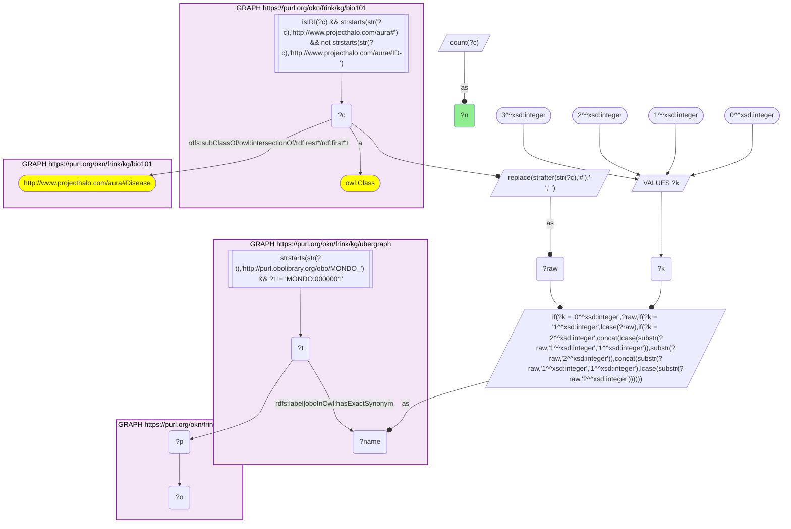

```mermaid
graph TD
classDef projected fill:lightgreen;
classDef literal fill:orange;
classDef iri fill:yellow;
  q2v6("?bio101"):::projected 
  q2v14("?c")
  q2v18("?g")
  q2v16("?k")
  q2v5("?mondo"):::projected 
  q2v3("?nGenes"):::projected 
  q2v2("?nVariantGenes"):::projected 
  q2v15("?name")
  q2v17("?raw")
  q2v4("?rdkgLabel"):::projected 
  q2v13("?t")
  q2v19("?v")
  q2v20("?v2")
  q2v1("?variantGenes"):::projected 
  q2v21("?vg")
  q2v22("?vsym")
  subgraph q2graph0["GRAPH https://purl.org/okn/frink/kg/bio101"]
    style q2graph0 fill:#f3e5f5,stroke:#8e24aa,stroke-width:2px,color:#000;
    q2graph0c2(["owl:Class"]):::iri 
    q2graph0f0[["isIRI(?c) && strstarts(str(?c),'http://www.projecthalo.com/aura#') && not strstarts(str(?c),'http://www.projecthalo.com/aura#ID-')"]]
    q2graph0f0 --> q2v14
    q2v14 --"a"--> q2graph0c2
  end
  subgraph q2graph1["GRAPH https://purl.org/okn/frink/kg/bio101"]
    style q2graph1 fill:#f3e5f5,stroke:#8e24aa,stroke-width:2px,color:#000;
    q2graph1c1(["http://www.projecthalo.com/aura#Disease"]):::iri 
    q2v14 --"rdfs:subClassOf/owl:intersectionOf/rdf:rest*/rdf:first*+"--> q2graph1c1
  end
  subgraph q2graph2["GRAPH https://purl.org/okn/frink/kg/bio101"]
    style q2graph2 fill:#f3e5f5,stroke:#8e24aa,stroke-width:2px,color:#000;
    q2graph2c1(["http://www.projecthalo.com/aura#Genetic-Disorder"]):::iri 
    q2v14 --"rdfs:subClassOf/owl:intersectionOf/rdf:rest*/rdf:first*+"--> q2graph2c1
  end
  q2bind0[/"replace(strafter(str(?c),'#'),'-',' ')"/]
  q2v14 --o q2bind0
  q2bind0 --as--o q2v17
  q2bind1[/"VALUES ?k"/]
  q2bind1-->q2v16
  q2bind10(["0^^xsd:integer"])
  q2bind10 --> q2bind1
  q2bind11(["1^^xsd:integer"])
  q2bind11 --> q2bind1
  q2bind12(["2^^xsd:integer"])
  q2bind12 --> q2bind1
  q2bind13(["3^^xsd:integer"])
  q2bind13 --> q2bind1
  q2bind2[/"if(?k = '0^^xsd:integer',?raw,if(?k = '1^^xsd:integer',lcase(?raw),if(?k = '2^^xsd:integer',concat(lcase(substr(?raw,'1^^xsd:integer','1^^xsd:integer')),substr(?raw,'2^^xsd:integer')),concat(substr(?raw,'1^^xsd:integer','1^^xsd:integer'),lcase(substr(?raw,'2^^xsd:integer'))))))"/]
  q2v16 --o q2bind2
  q2v17 --o q2bind2
  q2bind2 --as--o q2v15
  subgraph q2graph3["GRAPH https://purl.org/okn/frink/kg/ubergraph"]
    style q2graph3 fill:#f3e5f5,stroke:#8e24aa,stroke-width:2px,color:#000;
    q2graph3f1[["strstarts(str(?t),'http://purl.obolibrary.org/obo/MONDO_') && ?t != 'MONDO:0000001'"]]
    q2graph3f1 --> q2v13
    q2v13 --"rdfs:label|oboInOwl:hasExactSynonym"--> q2v15
  end
  subgraph q2graph4["GRAPH https://purl.org/okn/frink/kg/rdkg"]
    style q2graph4 fill:#f3e5f5,stroke:#8e24aa,stroke-width:2px,color:#000;
    q2graph4c2(["biolink:Disease"]):::iri 
    q2graph4c4(["biolink:Gene"]):::iri 
    q2v13 --"a"--> q2graph4c2
    q2v13 --"rdfs:label"--> q2v4
    subgraph q2optionalgraph40["(optional)"]
    style q2optionalgraph40 fill:#bbf,stroke-dasharray: 5 5,color:#000;
      subgraph q2uniongraph40[" Union "]
      style q2uniongraph40 color:#000;
        q2v18 -."a".-> q2graph4c4
        q2v18 --"biolink:contributes_to"--> q2v13
        subgraph q2uniongraph41[" Union "]
        style q2uniongraph41 color:#000;
          q2v18 --"biolink:gene_associated_with_condition"--> q2v13
          subgraph q2uniongraph42[" Union "]
          style q2uniongraph42 color:#000;
            q2v13 --"biolink:genetic_association"--> q2v18
            subgraph q2uniongraph43[" Union "]
            style q2uniongraph43 color:#000;
            subgraph q2uniongraph43l[" "]
              style q2uniongraph43l fill:#abf,stroke-dasharray: 3 3;
              q2v19 --"biolink:causes_condition"--> q2v13
              q2v19 --"biolink:has_gene"--> q2v18
            end
              subgraph q2uniongraph44[" Union "]
              style q2uniongraph44 color:#000;
                q2v18 --"a"--> q2graph4c4
                q2v13 --"biolink:related_to"--> q2v18
              subgraph q2uniongraph44r[" "]
                style q2uniongraph44r fill:#abf,stroke-dasharray: 3 3;
                q2v18 --"a"--> q2graph4c4
                q2v18 --"biolink:related_to"--> q2v13
              end
              end
            end
          end
        end
      end
    end
    subgraph q2optionalgraph41["(optional)"]
    style q2optionalgraph41 fill:#bbf,stroke-dasharray: 5 5,color:#000;
      q2v20 -."biolink:has_gene".-> q2v21
      q2v20 --"biolink:causes_condition"--> q2v13
      q2v21 --"rdfs:label"--> q2v22
    end
  end
  q2bind3[/"strafter(str(?c),'#')"/]
  q2v14 --o q2bind3
  q2bind3 --as--o q2v6
  q2bind4[/"strafter(str(?t),'obo/')"/]
  q2v13 --o q2bind4
  q2bind4 --as--o q2v5
  q2bind5[/"count(?g)"/]
  q2bind5 --as--o q2v3
  q2bind6[/"count(?vg)"/]
  q2bind6 --as--o q2v2
  q2bind7[/"group_concat(?vsym)"/]
  q2bind7 --as--o q2v1
```

```mermaid
graph TD
classDef projected fill:lightgreen;
classDef literal fill:orange;
classDef iri fill:yellow;
  q4v5("?bio101"):::projected 
  q4v1("?bio101Description"):::projected 
  q4v3("?bio101ResultOf"):::projected 
  q4v19("?bioResultOf")
  q4v12("?c")
  q4v18("?cls")
  q4v22("?desc")
  q4v21("?f")
  q4v14("?k")
  q4v16("?moi")
  q4v17("?moiLabel")
  q4v4("?mondo"):::projected 
  q4v13("?name")
  q4v20("?r")
  q4v15("?raw")
  q4v2("?rdkgModeOfInheritance"):::projected 
  q4v11("?t")
  subgraph q4graph0["GRAPH https://purl.org/okn/frink/kg/bio101"]
    style q4graph0 fill:#f3e5f5,stroke:#8e24aa,stroke-width:2px,color:#000;
    q4graph0c2(["owl:Class"]):::iri 
    q4graph0f0[["isIRI(?c) && strstarts(str(?c),'http://www.projecthalo.com/aura#') && not strstarts(str(?c),'http://www.projecthalo.com/aura#ID-')"]]
    q4graph0f0 --> q4v12
    q4v12 --"a"--> q4graph0c2
  end
  subgraph q4graph1["GRAPH https://purl.org/okn/frink/kg/bio101"]
    style q4graph1 fill:#f3e5f5,stroke:#8e24aa,stroke-width:2px,color:#000;
    q4graph1c1(["aura:Disease"]):::iri 
    q4v12 --"rdfs:subClassOf/owl:intersectionOf/rdf:rest*/rdf:first*+"--> q4graph1c1
  end
  subgraph q4graph2["GRAPH https://purl.org/okn/frink/kg/bio101"]
    style q4graph2 fill:#f3e5f5,stroke:#8e24aa,stroke-width:2px,color:#000;
    q4graph2c1(["aura:Genetic-Disorder"]):::iri 
    q4v12 --"rdfs:subClassOf/owl:intersectionOf/rdf:rest*/rdf:first*+"--> q4graph2c1
  end
  q4bind0[/"replace(strafter(str(?c),'#'),'-',' ')"/]
  q4v12 --o q4bind0
  q4bind0 --as--o q4v15
  q4bind1[/"VALUES ?k"/]
  q4bind1-->q4v14
  q4bind10(["0^^xsd:integer"])
  q4bind10 --> q4bind1
  q4bind11(["1^^xsd:integer"])
  q4bind11 --> q4bind1
  q4bind12(["2^^xsd:integer"])
  q4bind12 --> q4bind1
  q4bind13(["3^^xsd:integer"])
  q4bind13 --> q4bind1
  q4bind2[/"if(?k = '0^^xsd:integer',?raw,if(?k = '1^^xsd:integer',lcase(?raw),if(?k = '2^^xsd:integer',concat(lcase(substr(?raw,'1^^xsd:integer','1^^xsd:integer')),substr(?raw,'2^^xsd:integer')),concat(substr(?raw,'1^^xsd:integer','1^^xsd:integer'),lcase(substr(?raw,'2^^xsd:integer'))))))"/]
  q4v14 --o q4bind2
  q4v15 --o q4bind2
  q4bind2 --as--o q4v13
  subgraph q4graph3["GRAPH https://purl.org/okn/frink/kg/ubergraph"]
    style q4graph3 fill:#f3e5f5,stroke:#8e24aa,stroke-width:2px,color:#000;
    q4graph3f1[["strstarts(str(?t),'http://purl.obolibrary.org/obo/MONDO_') && ?t != 'MONDO:0000001'"]]
    q4graph3f1 --> q4v11
    q4v11 --"rdfs:label|oboInOwl:hasExactSynonym"--> q4v13
  end
  subgraph q4graph4["GRAPH https://purl.org/okn/frink/kg/rdkg"]
    style q4graph4 fill:#f3e5f5,stroke:#8e24aa,stroke-width:2px,color:#000;
    q4graph4c2(["biolink:Disease"]):::iri 
    q4v11 --"a"--> q4graph4c2
    subgraph q4optionalgraph40["(optional)"]
    style q4optionalgraph40 fill:#bbf,stroke-dasharray: 5 5,color:#000;
      q4v16 -."rdfs:label".-> q4v17
      q4v11 --"biolink:has_mode_of_inheritance"--> q4v16
    end
  end
  subgraph q4optional1["(optional)"]
  style q4optional1 fill:#bbf,stroke-dasharray: 5 5,color:#000;
    subgraph q4graph5["GRAPH https://purl.org/okn/frink/kg/bio101"]
      style q4graph5 fill:#f3e5f5,stroke:#8e24aa,stroke-width:2px,color:#000;
      q4graph5c2(["aura:result-of"]):::iri 
      q4graph5f2[["isIRI(?cls) && not strstarts(str(?cls),'http://www.projecthalo.com/aura#ID-')"]]
      q4graph5f2 --> q4v18
      q4v20 --"owl:onProperty"--> q4graph5c2
      q4v12 --"rdfs:subClassOf/owl:intersectionOf/rdf:rest*/rdf:first*"--> q4v20
      subgraph q4uniongraph50[" Union "]
      style q4uniongraph50 color:#000;
        q4v20 --"owl:hasValue"--> q4v21
        subgraph q4uniongraph51[" Union "]
        style q4uniongraph51 color:#000;
          q4v20 --"owl:onClass"--> q4v21
        subgraph q4uniongraph51r[" "]
          style q4uniongraph51r fill:#abf,stroke-dasharray: 3 3;
          q4v20 --"owl:someValuesFrom"--> q4v21
        end
        end
      end
      q4v21 --"owl:intersectionOf/rdf:rest*/rdf:first*"--> q4v18
      q4graph5bind3[/"strafter(str(?cls),'#')"/]
      q4v18 --o q4graph5bind3
      q4graph5bind3 --as--o q4v19
    end
  end
  subgraph q4optional2["(optional)"]
  style q4optional2 fill:#bbf,stroke-dasharray: 5 5,color:#000;
    subgraph q4graph6["GRAPH https://purl.org/okn/frink/kg/bio101"]
      style q4graph6 fill:#f3e5f5,stroke:#8e24aa,stroke-width:2px,color:#000;
      q4v12 --"aura:user-description"--> q4v22
    end
  end
  q4bind4[/"strafter(str(?c),'#')"/]
  q4v12 --o q4bind4
  q4bind4 --as--o q4v5
  q4bind5[/"strafter(str(?t),'obo/')"/]
  q4v11 --o q4bind5
  q4bind5 --as--o q4v4
  q4bind6[/"group_concat(?bioResultOf)"/]
  q4bind6 --as--o q4v3
  q4bind7[/"group_concat(?moiLabel)"/]
  q4bind7 --as--o q4v2
```

# bio101 × rdkg: textbook genetic disorders and their RDKG genes

- **Date:** 2026-10-05
- **Model:** claude-opus-5-5
- **SPARQL endpoint:** https://apps.okn.us/federation/sparql
- **Generated by:** mcp-okn v0.1.0 (build 8efca43)
- **Contents:** 5 queries · 5 query diagrams

## Knowledge graphs used

- `bio101` — <https://purl.org/okn/frink/kg/bio101>
- `ubergraph` — <https://purl.org/okn/frink/kg/ubergraph>
- `rdkg` — <https://purl.org/okn/frink/kg/rdkg>

## Conversation

👤 **User**

Crosswalk: `bio101` × `rdkg` on **MONDO (bio101 label), bridged through `ubergraph`** (crosswalk `KB5-mondo-label-bio101-rdkg`, verified_count 57). bio101 (KB Bio 101, an OWL ontology of an introductory biology textbook) carries no labels or external ids: each concept is an `owl:Class` IRI `http://www.projecthalo.com/aura#{Name}`, so the only key is the concept name (local name, hyphens to spaces, four case forms: as-is, all lower-case, first letter lowered, and sentence case), matched as an exact literal against ubergraph MONDO `rdfs:label` / `oboInOwl:hasExactSynonym` and restricted to bio101's `aura:Disease` subtree. rdkg stores diseases as MONDO node IRIs `http://purl.obolibrary.org/obo/MONDO_{n}`.

Research question: For the genetic disorders KB Bio 101 teaches (cystic fibrosis, sickle-cell anemia, achondroplasia, ...), which genes does RDKG associate with the matching MONDO disease, and does it recover the textbook causal genes (CFTR, HBB, FGFR3)?

Why the join is required: bio101 knows which diseases a biology student learns about, and how the textbook classifies them (genetic disorder, sex-linked, chromosomal), but it has no genes, ids or mappings. rdkg has gene, variant and inheritance edges on MONDO diseases but no notion of textbook curriculum. Only the name bridge through ubergraph's MONDO labels connects a textbook concept to its rare-disease record.

---

🧠 **Assistant**

## Answer

**Yes: RDKG recovers all three textbook genes. CFTR, HBB and FGFR3 each sit on the MONDO disease that bio101's concept bridges to.** Only CFTR has causal-variant support (226 `causes_condition` variants). HBB and FGFR3 come only through RDKG's broader `related_to` gene-disease edge. Across the textbook's single-gene disorders, RDKG has the canonical gene in 6 of 7 checks: CFTR, HBB, FGFR3, HGD, DMD and UBE3A. The miss is color blindness. bio101 teaches it as sex-linked, but the MONDO term it bridges to ("color vision disorder") carries the autosomal achromatopsia and tritan genes in RDKG, and not the X-linked red-green opsins OPN1LW and OPN1MW.

### How the bridge was established

1. **Catalog skeleton (verbatim): 57** bio101 concepts under `aura:Disease` reach a MONDO disease that RDKG materializes. This reproduces `verified_count` 57.
2. Scoping the same join to bio101's own `aura:Genetic-Disorder` subtree (28 concepts, including grouping classes) bridges **15 concepts**. Twelve are specific disorders: Achondroplasia, Alkaptonuria, Angelman-Syndrome, Color-Blindness, Cri-Du-Chat-Syndrome, Cystic-Fibrosis, Down-Syndrome, Duchenne-Muscular-Dystrophy, Klinefelter-Syndrome, Polydactyly, Sickle-Cell-Anemia and Turner-Syndrome. Three are umbrella classes (Chromosomal-Disorder, Inborn-Error-Of-Metabolism, Lysosomal-Disorder), and each has 0 genes in RDKG.
3. The eponym and chromosomal syndromes (Down, Turner, Angelman, Cri-du-chat, Duchenne, Klinefelter) bridge through the recipe's sentence-case form: `Down-Syndrome` becomes "Down syndrome", which is how MONDO writes them.

### Genes RDKG associates with each bridged genetic disorder

The gene sources are RDKG `Gene related_to Disease`, `SequenceVariant causes_condition Disease` + `has_gene`, `genetic_association` and `gene_associated_with_condition`. On these diseases only the first two edges return rows.

| bio101 concept | MONDO (RDKG label) | # genes | causal-variant genes | RDKG genes |
|---|---|---|---|---|
| Polydactyly | MONDO_0021003 polydactyly (disease) | 121 | none | ciliopathy, Bardet-Biedl and limb-patterning genes (BBS1/2/4/5/7/9/10/12, MKS1, CEP290, SHH, GLI1/2/3, TBX5, EVC/EVC2, FGFR1-3, HOXD13, ...) |
| Down-Syndrome | MONDO_0008608 Down syndrome | 27 | none | MIR99A, MIRLET7C, KANSL1, MIR155, MTHFR, CXCL8, MIR125B2, EZH2, RCAN1, CTCF, VIP, DCAF7, DCR, STAG2, GSTM2, PRDX2, CALCA, PRDX6, MIR802, TP53, SLC19A1, NRAS, RAD21, SOD1, S100B, NTF3, GATA1 |
| Achondroplasia | MONDO_0007037 achondroplasia | 26 | none | **FGFR3**, DNMT3A, KDM3B, PUS7, ORC1, LARP7, SLC2A2, WNT4, FBXL3, IGFALS, POC1A, SIN3A, RSPH4A, DONSON, ERCC4, TRAIP, WDR4, PLK4, HAPLN1, GMNN, TG, AMMECR1, SLC10A7, XRCC4, EIF4A3, IQSEC1 |
| Duchenne-Muscular-Dystrophy | MONDO_0010679 Duchenne muscular dystrophy | 13 | none | **DMD**, TGFB1, CD4, LTBP4, BCHE, CCL2, SELENON, ACHE, POSTN, FKTN, PRIMA1, COL6A1, LAMA2 |
| Cystic-Fibrosis | MONDO_0009061 cystic fibrosis | 11 | **CFTR** | **CFTR**, DCTN4, SCNN1G, SCNN1B, SCNN1A, TNFRSF1A, STX1A, TGFB1, ENG, CLCA4, FCGR2A |
| Sickle-Cell-Anemia | MONDO_0011382 sickle cell disease | 10 | none | **HBB**, DHODH, HP, NFE2L2, NPPB, TNF, CACNA1C, VCAM1, CAD, UMPS |
| Color-Blindness | MONDO_0001703 color vision disorder | 8 | none | ATF6, CNGA3, RPGR, GNAT2, OPN1SW, PDE6C, PDE6H, CNGB3 |
| Turner-Syndrome | MONDO_0019499 Turner syndrome | 7 | none | FMR1, GH1, SOD1, SOD2, NUP107, NOS2, CAT |
| Angelman-Syndrome | MONDO_0007113 Angelman syndrome | 4 | **UBE3A** | **UBE3A**, CDKL5, GABRB3, MECP2 |
| Cri-Du-Chat-Syndrome | MONDO_0007404 Cri-du-chat syndrome | 3 | none | CTNND2, SEMA5A, TERT |
| Alkaptonuria | MONDO_0008753 alkaptonuria | 1 | none | **HGD** |
| Klinefelter-Syndrome | MONDO_0006823 Klinefelter syndrome | 0 | none | none |
| Chromosomal-Disorder / Inborn-Error-Of-Metabolism / Lysosomal-Disorder | umbrella MONDO terms | 0 | none | none (RDKG does not roll genes up to grouping terms) |

### Textbook causal gene: is it in RDKG?

| bio101 disease | textbook gene | in RDKG? | evidence edge | causal variants |
|---|---|---|---|---|
| Cystic-Fibrosis | CFTR | yes | `causes_condition` variant + `related_to` | 226 |
| Sickle-Cell-Anemia | HBB | yes | `related_to` only | 0 |
| Achondroplasia | FGFR3 | yes | `related_to` only | 0 |
| Alkaptonuria | HGD | yes | `related_to` only | 0 |
| Duchenne-Muscular-Dystrophy | DMD | yes | `related_to` only | 0 |
| Angelman-Syndrome | UBE3A | yes | `related_to` + `causes_condition` variant | 9 |
| Color-Blindness | OPN1LW | **no** | none | 0 |
| Color-Blindness | OPN1MW | **no** | none | 0 |
| Color-Blindness | OPN1SW | yes | `related_to` | 0 |

### Inheritance: textbook vs RDKG

| bio101 disease | bio101 says | RDKG `has_mode_of_inheritance` |
|---|---|---|
| Cystic-Fibrosis | "caused by a recessive allele for a chloride channel protein"; OWL restriction `result-of Complete-Dominance` | Autosomal recessive inheritance |
| Sickle-Cell-Anemia | "an autosomal recessive genetic blood disorder" | Autosomal recessive inheritance |
| Achondroplasia | "genetically determined dwarfism"; `result-of Complete-Dominance` | Autosomal dominant inheritance |
| Alkaptonuria | "A hereditary disease in which urine turns black..." | Autosomal recessive inheritance |
| Duchenne-Muscular-Dystrophy | "caused by a sex-linked recessive allele" | X-linked inheritance |
| Angelman-Syndrome | "loss of the normal maternal expression of a gene on chromosome 15" | Autosomal dominant inheritance |
| Polydactyly | `result-of Complete-Dominance` | none recorded |
| Color-Blindness | "A sex-linked genetic disorder" | none recorded |
| Down / Turner / Klinefelter / Cri-du-chat | chromosome number or structure changes | none recorded |

The two KGs agree wherever both record inheritance. bio101's `result-of Complete-Dominance` restriction on Cystic-Fibrosis is the textbook's dominance-relationship concept: the normal allele is completely dominant over the CF allele. It is not a claim of autosomal-dominant inheritance, and it is consistent with bio101's own "recessive allele" definition and RDKG's autosomal-recessive call.

### Findings

1. **The three named genes are all present.** CFTR, HBB and FGFR3 each attach to the MONDO term reached from the textbook concept.
2. **Only CFTR has variant-level causal support among the textbook's three examples.** It has 226 `causes_condition` variants. Its other 10 RDKG genes are CF modifier genes (SCNN1A/B/G, TGFB1, DCTN4, FCGR2A, TNFRSF1A, ENG, STX1A, CLCA4). HBB and FGFR3 reach their diseases only through the weaker `related_to` association. Among all 12 specific genetic disorders, only CFTR and UBE3A (9 variants) have causal-variant genes.
3. **`related_to` is broad, so the gene list for a disease is not its causal-gene list.** FGFR3 is 1 of 26 achondroplasia genes. Most of the others (PLK4, POC1A, ORC1, GMNN, DONSON, TRAIP, WDR4, LARP7, ...) are genes of other short-stature and primordial-dwarfism disorders. For sickle cell disease, HBB sits beside inflammation and hemolysis genes (TNF, VCAM1, HP, NFE2L2) and three pyrimidine-synthesis enzymes (CAD, DHODH, UMPS).
4. **Color blindness is a granularity mismatch.** bio101 teaches the X-linked (red-green) form. Its name bridges to the MONDO umbrella "color vision disorder", which in RDKG carries achromatopsia and blue-cone genes (CNGA3, CNGB3, GNAT2, PDE6C, PDE6H, ATF6, OPN1SW) and not OPN1LW or OPN1MW.
5. **Chromosomal disorders have association genes, not causal genes.** Down (27), Turner (7) and Cri-du-chat (3) have literature-style gene lists with no causal variants, and Klinefelter has none. That is expected: an aneuploidy or a deletion has no single causal gene.

### Caveats

- **The bridge is by name and gives a lower bound.** bio101 has no ids, so every match is an exact name-to-MONDO-label or exact-synonym match in one of four case forms. It is not an asserted mapping.
- **Scoping.** The join is limited to bio101's `aura:Disease` subtree, as the catalog requires, because bare MONDO name matches pick up homonyms. The question further limits it to `aura:Genetic-Disorder`.
- **Genetic disorders still unbridged.** Of the 28 `aura:Genetic-Disorder` concepts, 13 do not bridge. Exploratory probes (not part of the logged record) re-checked them on 2026-10-05:
  - Name-form misses, whose MONDO terms RDKG does hold: Huntingtons-Disease (MONDO_0007739 "Huntington disease"), Tay-Sachs-disease (MONDO_0010100 "Tay-Sachs disease"; the hyphen is lost when the name is built), Prader-Willi-Syndrome (MONDO_0008300, same hyphen loss), Pompes-Disease (MONDO_0009290 "Pompe disease") and Triple-X (MONDO_0018066 "trisomy X" / "triple X syndrome"). The sentence-case form does not reach any of these.
  - Name matches whose MONDO term RDKG does not materialize: Phenylketonuria (MONDO_0009861), Hemophilia (MONDO_0018660), Cystinuria (MONDO_0009067) and Familial-Hypercholesterolemia (MONDO_0005439).
  - Four grouping classes with no bridge: Human-Genetic-Disorder, Multifactorial-Genetic-Disorder, Sex-Linked-Human-Genetic-Disorder and Gap-In-Segmentation.
- **Counts are RDKG edges as served on 2026-10-05.** RDKG does not roll genes up to grouping terms, so umbrella concepts show 0 genes.

## SPARQL queries executed

#### Query 1

_2026-10-06T00:07:16+00:00 · `bio101`, `ubergraph`, `rdkg`_

```sparql
SELECT (COUNT(DISTINCT ?c) AS ?n) WHERE {
  { SELECT DISTINCT ?c ?t WHERE {
  { SELECT DISTINCT ?c ?name WHERE {
      GRAPH <https://purl.org/okn/frink/kg/bio101> { ?c a <http://www.w3.org/2002/07/owl#Class> .
        FILTER(isIRI(?c) && STRSTARTS(STR(?c),'http://www.projecthalo.com/aura#') && !STRSTARTS(STR(?c),'http://www.projecthalo.com/aura#ID-')) }
      GRAPH <https://purl.org/okn/frink/kg/bio101> { ?c (<http://www.w3.org/2000/01/rdf-schema#subClassOf>/(<http://www.w3.org/2002/07/owl#intersectionOf>/<http://www.w3.org/1999/02/22-rdf-syntax-ns#rest>*/<http://www.w3.org/1999/02/22-rdf-syntax-ns#first>)*)+ <http://www.projecthalo.com/aura#Disease> . }
      BIND(REPLACE(STRAFTER(STR(?c),'#'),'-',' ') AS ?raw)
      VALUES ?k { 0 1 2 3 }  # as-is, all lower, first letter lowered, sentence case
      BIND(IF(?k = 0, ?raw, IF(?k = 1, LCASE(?raw), IF(?k = 2, CONCAT(LCASE(SUBSTR(?raw,1,1)),SUBSTR(?raw,2)),
                CONCAT(SUBSTR(?raw,1,1),LCASE(SUBSTR(?raw,2)))))) AS ?name)
  } }
    GRAPH <https://purl.org/okn/frink/kg/ubergraph> { ?t <http://www.w3.org/2000/01/rdf-schema#label>|<http://www.geneontology.org/formats/oboInOwl#hasExactSynonym> ?name .
      FILTER(STRSTARTS(STR(?t),'http://purl.obolibrary.org/obo/MONDO_') && ?t != <http://purl.obolibrary.org/obo/MONDO_0000001>) }
  } }
  GRAPH <https://purl.org/okn/frink/kg/rdkg> { ?t ?p ?o . }
}
```



_1 row(s)_

| n |
| --- |
| 57 |

#### Query 2

_2026-10-06T00:07:32+00:00 · `bio101`, `ubergraph`, `rdkg`_

```sparql
PREFIX biolink: <https://w3id.org/biolink/vocab/>
PREFIX rdfs: <http://www.w3.org/2000/01/rdf-schema#>
SELECT ?bio101 ?mondo ?rdkgLabel (COUNT(DISTINCT ?g) AS ?nGenes) (COUNT(DISTINCT ?vg) AS ?nVariantGenes) (GROUP_CONCAT(DISTINCT ?vsym; separator=", ") AS ?variantGenes) WHERE {
  { SELECT DISTINCT ?c ?t WHERE {
  { SELECT DISTINCT ?c ?name WHERE {
      GRAPH <https://purl.org/okn/frink/kg/bio101> { ?c a <http://www.w3.org/2002/07/owl#Class> .
        FILTER(isIRI(?c) && STRSTARTS(STR(?c),'http://www.projecthalo.com/aura#') && !STRSTARTS(STR(?c),'http://www.projecthalo.com/aura#ID-')) }
      GRAPH <https://purl.org/okn/frink/kg/bio101> { ?c (<http://www.w3.org/2000/01/rdf-schema#subClassOf>/(<http://www.w3.org/2002/07/owl#intersectionOf>/<http://www.w3.org/1999/02/22-rdf-syntax-ns#rest>*/<http://www.w3.org/1999/02/22-rdf-syntax-ns#first>)*)+ <http://www.projecthalo.com/aura#Disease> . }
      GRAPH <https://purl.org/okn/frink/kg/bio101> { ?c (<http://www.w3.org/2000/01/rdf-schema#subClassOf>/(<http://www.w3.org/2002/07/owl#intersectionOf>/<http://www.w3.org/1999/02/22-rdf-syntax-ns#rest>*/<http://www.w3.org/1999/02/22-rdf-syntax-ns#first>)*)+ <http://www.projecthalo.com/aura#Genetic-Disorder> . }
      BIND(REPLACE(STRAFTER(STR(?c),'#'),'-',' ') AS ?raw)
      VALUES ?k { 0 1 2 3 }  # as-is, all lower, first letter lowered, sentence case
      BIND(IF(?k = 0, ?raw, IF(?k = 1, LCASE(?raw), IF(?k = 2, CONCAT(LCASE(SUBSTR(?raw,1,1)),SUBSTR(?raw,2)),
                CONCAT(SUBSTR(?raw,1,1),LCASE(SUBSTR(?raw,2)))))) AS ?name)
  } }
    GRAPH <https://purl.org/okn/frink/kg/ubergraph> { ?t <http://www.w3.org/2000/01/rdf-schema#label>|<http://www.geneontology.org/formats/oboInOwl#hasExactSynonym> ?name .
      FILTER(STRSTARTS(STR(?t),'http://purl.obolibrary.org/obo/MONDO_') && ?t != <http://purl.obolibrary.org/obo/MONDO_0000001>) }
  } }
  GRAPH <https://purl.org/okn/frink/kg/rdkg> {
    ?t a biolink:Disease ; rdfs:label ?rdkgLabel .
    OPTIONAL {
      { ?g biolink:related_to ?t . ?g a biolink:Gene }
      UNION { ?t biolink:related_to ?g . ?g a biolink:Gene }
      UNION { ?v biolink:causes_condition ?t ; biolink:has_gene ?g }
      UNION { ?t biolink:genetic_association ?g }
      UNION { ?g biolink:gene_associated_with_condition ?t }
      UNION { ?g biolink:contributes_to ?t . ?g a biolink:Gene }
    }
    OPTIONAL { ?v2 biolink:causes_condition ?t ; biolink:has_gene ?vg . ?vg rdfs:label ?vsym }
  }
  BIND(STRAFTER(STR(?c),'#') AS ?bio101)
  BIND(STRAFTER(STR(?t),'obo/') AS ?mondo)
} GROUP BY ?bio101 ?mondo ?rdkgLabel ORDER BY DESC(?nGenes) ?bio101
```



_15 row(s) — showing first 3_

| bio101 | mondo | rdkgLabel | nGenes | nVariantGenes | variantGenes |
| --- | --- | --- | --- | --- | --- |
| Polydactyly | MONDO_0021003 | polydactyly (disease) | 121 | 0 |  |
| Down-Syndrome | MONDO_0008608 | Down syndrome | 27 | 0 |  |
| Achondroplasia | MONDO_0007037 | achondroplasia | 26 | 0 |  |

#### Query 3

_2026-10-06T00:07:49+00:00 · `bio101`, `ubergraph`, `rdkg`_

```sparql
PREFIX biolink: <https://w3id.org/biolink/vocab/>
PREFIX rdfs: <http://www.w3.org/2000/01/rdf-schema#>
SELECT ?bio101 ?mondo ?textbookGene ?inRdkg (GROUP_CONCAT(DISTINCT ?path; separator=" + ") AS ?evidence) (COUNT(DISTINCT ?v) AS ?nCausalVariants) WHERE {
  { SELECT DISTINCT ?c ?t WHERE {
  { SELECT DISTINCT ?c ?name WHERE {
      GRAPH <https://purl.org/okn/frink/kg/bio101> { ?c a <http://www.w3.org/2002/07/owl#Class> .
        FILTER(isIRI(?c) && STRSTARTS(STR(?c),'http://www.projecthalo.com/aura#') && !STRSTARTS(STR(?c),'http://www.projecthalo.com/aura#ID-')) }
      GRAPH <https://purl.org/okn/frink/kg/bio101> { ?c (<http://www.w3.org/2000/01/rdf-schema#subClassOf>/(<http://www.w3.org/2002/07/owl#intersectionOf>/<http://www.w3.org/1999/02/22-rdf-syntax-ns#rest>*/<http://www.w3.org/1999/02/22-rdf-syntax-ns#first>)*)+ <http://www.projecthalo.com/aura#Disease> . }
      GRAPH <https://purl.org/okn/frink/kg/bio101> { ?c (<http://www.w3.org/2000/01/rdf-schema#subClassOf>/(<http://www.w3.org/2002/07/owl#intersectionOf>/<http://www.w3.org/1999/02/22-rdf-syntax-ns#rest>*/<http://www.w3.org/1999/02/22-rdf-syntax-ns#first>)*)+ <http://www.projecthalo.com/aura#Genetic-Disorder> . }
      BIND(REPLACE(STRAFTER(STR(?c),'#'),'-',' ') AS ?raw)
      VALUES ?k { 0 1 2 3 }  # as-is, all lower, first letter lowered, sentence case
      BIND(IF(?k = 0, ?raw, IF(?k = 1, LCASE(?raw), IF(?k = 2, CONCAT(LCASE(SUBSTR(?raw,1,1)),SUBSTR(?raw,2)),
                CONCAT(SUBSTR(?raw,1,1),LCASE(SUBSTR(?raw,2)))))) AS ?name)
  } }
    GRAPH <https://purl.org/okn/frink/kg/ubergraph> { ?t <http://www.w3.org/2000/01/rdf-schema#label>|<http://www.geneontology.org/formats/oboInOwl#hasExactSynonym> ?name .
      FILTER(STRSTARTS(STR(?t),'http://purl.obolibrary.org/obo/MONDO_') && ?t != <http://purl.obolibrary.org/obo/MONDO_0000001>) }
  } }
  BIND(STRAFTER(STR(?c),'#') AS ?bio101)
  VALUES (?bio101 ?textbookGene) {
    ("Cystic-Fibrosis" "CFTR") ("Sickle-Cell-Anemia" "HBB") ("Achondroplasia" "FGFR3") ("Alkaptonuria" "HGD")
    ("Duchenne-Muscular-Dystrophy" "DMD") ("Angelman-Syndrome" "UBE3A") ("Color-Blindness" "OPN1LW") ("Color-Blindness" "OPN1MW") ("Color-Blindness" "OPN1SW") }
  BIND(STRAFTER(STR(?t),'obo/') AS ?mondo)
  OPTIONAL { GRAPH <https://purl.org/okn/frink/kg/rdkg> {
    ?g a biolink:Gene ; rdfs:label ?textbookGene .
    { ?g biolink:related_to ?t . BIND("related_to" AS ?path) }
    UNION { ?v biolink:causes_condition ?t ; biolink:has_gene ?g . BIND("variant causes_condition" AS ?path) }
    UNION { ?g biolink:gene_associated_with_condition ?t . BIND("gene_associated_with_condition" AS ?path) }
    UNION { ?t biolink:genetic_association ?g . BIND("genetic_association" AS ?path) }
  } }
  BIND(BOUND(?path) AS ?inRdkg)
} GROUP BY ?bio101 ?mondo ?textbookGene ?inRdkg ORDER BY ?bio101 ?textbookGene
```



```mermaid
graph TD
classDef projected fill:lightgreen;
classDef literal fill:orange;
classDef iri fill:yellow;
  q3v6("?bio101"):::projected 
  q3v15("?c")
  q3v2("?evidence"):::projected 
  q3v19("?g")
  q3v3("?inRdkg"):::projected 
  q3v17("?k")
  q3v5("?mondo"):::projected 
  q3v1("?nCausalVariants"):::projected 
  q3v16("?name")
  q3v13("?path")
  q3v18("?raw")
  q3v14("?t")
  q3v4("?textbookGene"):::projected 
  q3v20("?v")
  subgraph q3graph0["GRAPH https://purl.org/okn/frink/kg/bio101"]
    style q3graph0 fill:#f3e5f5,stroke:#8e24aa,stroke-width:2px,color:#000;
    q3graph0c2(["owl:Class"]):::iri 
    q3graph0f0[["isIRI(?c) && strstarts(str(?c),'http://www.projecthalo.com/aura#') && not strstarts(str(?c),'http://www.projecthalo.com/aura#ID-')"]]
    q3graph0f0 --> q3v15
    q3v15 --"a"--> q3graph0c2
  end
  subgraph q3graph1["GRAPH https://purl.org/okn/frink/kg/bio101"]
    style q3graph1 fill:#f3e5f5,stroke:#8e24aa,stroke-width:2px,color:#000;
    q3graph1c1(["http://www.projecthalo.com/aura#Disease"]):::iri 
    q3v15 --"rdfs:subClassOf/owl:intersectionOf/rdf:rest*/rdf:first*+"--> q3graph1c1
  end
  subgraph q3graph2["GRAPH https://purl.org/okn/frink/kg/bio101"]
    style q3graph2 fill:#f3e5f5,stroke:#8e24aa,stroke-width:2px,color:#000;
    q3graph2c1(["http://www.projecthalo.com/aura#Genetic-Disorder"]):::iri 
    q3v15 --"rdfs:subClassOf/owl:intersectionOf/rdf:rest*/rdf:first*+"--> q3graph2c1
  end
  q3bind0[/"replace(strafter(str(?c),'#'),'-',' ')"/]
  q3v15 --o q3bind0
  q3bind0 --as--o q3v18
  q3bind1[/"VALUES ?k"/]
  q3bind1-->q3v17
  q3bind10(["0^^xsd:integer"])
  q3bind10 --> q3bind1
  q3bind11(["1^^xsd:integer"])
  q3bind11 --> q3bind1
  q3bind12(["2^^xsd:integer"])
  q3bind12 --> q3bind1
  q3bind13(["3^^xsd:integer"])
  q3bind13 --> q3bind1
  q3bind2[/"if(?k = '0^^xsd:integer',?raw,if(?k = '1^^xsd:integer',lcase(?raw),if(?k = '2^^xsd:integer',concat(lcase(substr(?raw,'1^^xsd:integer','1^^xsd:integer')),substr(?raw,'2^^xsd:integer')),concat(substr(?raw,'1^^xsd:integer','1^^xsd:integer'),lcase(substr(?raw,'2^^xsd:integer'))))))"/]
  q3v17 --o q3bind2
  q3v18 --o q3bind2
  q3bind2 --as--o q3v16
  subgraph q3graph3["GRAPH https://purl.org/okn/frink/kg/ubergraph"]
    style q3graph3 fill:#f3e5f5,stroke:#8e24aa,stroke-width:2px,color:#000;
    q3graph3f1[["strstarts(str(?t),'http://purl.obolibrary.org/obo/MONDO_') && ?t != 'MONDO:0000001'"]]
    q3graph3f1 --> q3v14
    q3v14 --"rdfs:label|oboInOwl:hasExactSynonym"--> q3v16
  end
  q3bind3[/"strafter(str(?c),'#')"/]
  q3v15 --o q3bind3
  q3bind3 --as--o q3v6
  q3bind4[/"VALUES ?bio101 ?textbookGene"/]
  q3bind4-->q3v6
  q3bind4-->q3v4
  q3bind40(["Cystic-Fibrosis"])
  q3bind40 --> q3bind4
  q3bind41(["CFTR"])
  q3bind41 --> q3bind4
  q3bind42(["Sickle-Cell-Anemia"])
  q3bind42 --> q3bind4
  q3bind4more([+15 more])
  q3bind4more --> q3bind4
  q3bind5[/"strafter(str(?t),'obo/')"/]
  q3v14 --o q3bind5
  q3bind5 --as--o q3v5
  subgraph q3optional0["(optional)"]
  style q3optional0 fill:#bbf,stroke-dasharray: 5 5,color:#000;
    subgraph q3graph4["GRAPH https://purl.org/okn/frink/kg/rdkg"]
      style q3graph4 fill:#f3e5f5,stroke:#8e24aa,stroke-width:2px,color:#000;
      q3graph4c2(["biolink:Gene"]):::iri 
      q3v19 --"a"--> q3graph4c2
      q3v19 --"rdfs:label"--> q3v4
      subgraph q3uniongraph40[" Union "]
      style q3uniongraph40 color:#000;
      subgraph q3uniongraph40l[" "]
        style q3uniongraph40l fill:#abf,stroke-dasharray: 3 3;
        q3v14 --"biolink:genetic_association"--> q3v19
        q3graph4bind6[/"'genetic_association'"/]
        q3graph4bind6 --as--o q3v13
      end
        subgraph q3uniongraph41[" Union "]
        style q3uniongraph41 color:#000;
        subgraph q3uniongraph41l[" "]
          style q3uniongraph41l fill:#abf,stroke-dasharray: 3 3;
          q3v19 --"biolink:gene_associated_with_condition"--> q3v14
          q3graph4bind7[/"'gene_associated_with_condition'"/]
          q3graph4bind7 --as--o q3v13
        end
          subgraph q3uniongraph42[" Union "]
          style q3uniongraph42 color:#000;
          subgraph q3uniongraph42l[" "]
            style q3uniongraph42l fill:#abf,stroke-dasharray: 3 3;
            q3v20 --"biolink:causes_condition"--> q3v14
            q3v20 --"biolink:has_gene"--> q3v19
            q3graph4bind8[/"'variant causes_condition'"/]
            q3graph4bind8 --as--o q3v13
          end
          subgraph q3uniongraph42r[" "]
            style q3uniongraph42r fill:#abf,stroke-dasharray: 3 3;
            q3v19 --"biolink:related_to"--> q3v14
            q3graph4bind9[/"'related_to'"/]
            q3graph4bind9 --as--o q3v13
          end
          q3uniongraph42r <== or ==> q3uniongraph42l
          end
        end
      end
    end
  end
  q3bind10[/"bound(?path)"/]
  q3v13 --o q3bind10
  q3bind10 --as--o q3v3
  q3bind11[/"group_concat(?path)"/]
  q3bind11 --as--o q3v2
  q3bind12[/"count(?v)"/]
  q3bind12 --as--o q3v1
```

_9 row(s) — showing first 3_

| bio101 | mondo | textbookGene | inRdkg | evidence | nCausalVariants |
| --- | --- | --- | --- | --- | --- |
| Achondroplasia | MONDO_0007037 | FGFR3 | True | related_to | 0 |
| Alkaptonuria | MONDO_0008753 | HGD | True | related_to | 0 |
| Angelman-Syndrome | MONDO_0007113 | UBE3A | True | related_to + variant causes_condition | 9 |

#### Query 4

_2026-10-06T00:08:06+00:00 · `bio101`, `ubergraph`, `rdkg`_

```sparql
PREFIX aura: <http://www.projecthalo.com/aura#>
PREFIX owl:  <http://www.w3.org/2002/07/owl#>
PREFIX rdf:  <http://www.w3.org/1999/02/22-rdf-syntax-ns#>
PREFIX rdfs: <http://www.w3.org/2000/01/rdf-schema#>
PREFIX biolink: <https://w3id.org/biolink/vocab/>
SELECT ?bio101 ?mondo (GROUP_CONCAT(DISTINCT ?bioResultOf; separator=" & ") AS ?bio101ResultOf) (GROUP_CONCAT(DISTINCT ?moiLabel; separator=" | ") AS ?rdkgModeOfInheritance) (SAMPLE(?desc) AS ?bio101Description) WHERE {
  { SELECT DISTINCT ?c ?t WHERE {
  { SELECT DISTINCT ?c ?name WHERE {
      GRAPH <https://purl.org/okn/frink/kg/bio101> { ?c a <http://www.w3.org/2002/07/owl#Class> .
        FILTER(isIRI(?c) && STRSTARTS(STR(?c),'http://www.projecthalo.com/aura#') && !STRSTARTS(STR(?c),'http://www.projecthalo.com/aura#ID-')) }
      GRAPH <https://purl.org/okn/frink/kg/bio101> { ?c (<http://www.w3.org/2000/01/rdf-schema#subClassOf>/(<http://www.w3.org/2002/07/owl#intersectionOf>/<http://www.w3.org/1999/02/22-rdf-syntax-ns#rest>*/<http://www.w3.org/1999/02/22-rdf-syntax-ns#first>)*)+ <http://www.projecthalo.com/aura#Disease> . }
      GRAPH <https://purl.org/okn/frink/kg/bio101> { ?c (<http://www.w3.org/2000/01/rdf-schema#subClassOf>/(<http://www.w3.org/2002/07/owl#intersectionOf>/<http://www.w3.org/1999/02/22-rdf-syntax-ns#rest>*/<http://www.w3.org/1999/02/22-rdf-syntax-ns#first>)*)+ <http://www.projecthalo.com/aura#Genetic-Disorder> . }
      BIND(REPLACE(STRAFTER(STR(?c),'#'),'-',' ') AS ?raw)
      VALUES ?k { 0 1 2 3 }  # as-is, all lower, first letter lowered, sentence case
      BIND(IF(?k = 0, ?raw, IF(?k = 1, LCASE(?raw), IF(?k = 2, CONCAT(LCASE(SUBSTR(?raw,1,1)),SUBSTR(?raw,2)),
                CONCAT(SUBSTR(?raw,1,1),LCASE(SUBSTR(?raw,2)))))) AS ?name)
  } }
    GRAPH <https://purl.org/okn/frink/kg/ubergraph> { ?t <http://www.w3.org/2000/01/rdf-schema#label>|<http://www.geneontology.org/formats/oboInOwl#hasExactSynonym> ?name .
      FILTER(STRSTARTS(STR(?t),'http://purl.obolibrary.org/obo/MONDO_') && ?t != <http://purl.obolibrary.org/obo/MONDO_0000001>) }
  } }
  GRAPH <https://purl.org/okn/frink/kg/rdkg> { ?t a biolink:Disease .
    OPTIONAL { ?t biolink:has_mode_of_inheritance ?moi . ?moi rdfs:label ?moiLabel } }
  OPTIONAL { GRAPH <https://purl.org/okn/frink/kg/bio101> {
    ?c rdfs:subClassOf/(owl:intersectionOf/rdf:rest*/rdf:first)* ?r .
    ?r owl:onProperty aura:result-of .
    { ?r owl:someValuesFrom ?f } UNION { ?r owl:onClass ?f } UNION { ?r owl:hasValue ?f }
    ?f (owl:intersectionOf/rdf:rest*/rdf:first)* ?cls .
    FILTER(isIRI(?cls) && !STRSTARTS(STR(?cls), "http://www.projecthalo.com/aura#ID-"))
    BIND(STRAFTER(STR(?cls),'#') AS ?bioResultOf) } }
  OPTIONAL { GRAPH <https://purl.org/okn/frink/kg/bio101> { ?c aura:user-description ?desc } }
  BIND(STRAFTER(STR(?c),'#') AS ?bio101)
  BIND(STRAFTER(STR(?t),'obo/') AS ?mondo)
} GROUP BY ?bio101 ?mondo ORDER BY ?bio101
```



_15 row(s) — showing first 3_

| bio101 | mondo | bio101ResultOf | rdkgModeOfInheritance | bio101Description |
| --- | --- | --- | --- | --- |
| Achondroplasia | MONDO_0007037 | Complete-Dominance | Autosomal dominant inheritance | A form of genetically determined dwarfism. |
| Alkaptonuria | MONDO_0008753 |  | Autosomal recessive inheritance | A hereditary disease in which urine turns black because of an inability to metabolize alkapton, which accumulates in the blood and is excreted in the urine. |
| Angelman-Syndrome | MONDO_0007113 |  | Autosomal dominant inheritance | A human genetic disorder caused by loss of the normal maternal expression of a gene on chromosome 15. |

#### Query 5

_2026-10-06T00:08:19+00:00 · `bio101`, `ubergraph`, `rdkg`_

```sparql
PREFIX biolink: <https://w3id.org/biolink/vocab/>
PREFIX rdfs: <http://www.w3.org/2000/01/rdf-schema#>
SELECT ?bio101 ?mondo (COUNT(DISTINCT ?g) AS ?nGenes) (GROUP_CONCAT(DISTINCT ?sym; separator=", ") AS ?rdkgGenes) WHERE {
  { SELECT DISTINCT ?c ?t WHERE {
  { SELECT DISTINCT ?c ?name WHERE {
      GRAPH <https://purl.org/okn/frink/kg/bio101> { ?c a <http://www.w3.org/2002/07/owl#Class> .
        FILTER(isIRI(?c) && STRSTARTS(STR(?c),'http://www.projecthalo.com/aura#') && !STRSTARTS(STR(?c),'http://www.projecthalo.com/aura#ID-')) }
      GRAPH <https://purl.org/okn/frink/kg/bio101> { ?c (<http://www.w3.org/2000/01/rdf-schema#subClassOf>/(<http://www.w3.org/2002/07/owl#intersectionOf>/<http://www.w3.org/1999/02/22-rdf-syntax-ns#rest>*/<http://www.w3.org/1999/02/22-rdf-syntax-ns#first>)*)+ <http://www.projecthalo.com/aura#Disease> . }
      GRAPH <https://purl.org/okn/frink/kg/bio101> { ?c (<http://www.w3.org/2000/01/rdf-schema#subClassOf>/(<http://www.w3.org/2002/07/owl#intersectionOf>/<http://www.w3.org/1999/02/22-rdf-syntax-ns#rest>*/<http://www.w3.org/1999/02/22-rdf-syntax-ns#first>)*)+ <http://www.projecthalo.com/aura#Genetic-Disorder> . }
      BIND(REPLACE(STRAFTER(STR(?c),'#'),'-',' ') AS ?raw)
      VALUES ?k { 0 1 2 3 }  # as-is, all lower, first letter lowered, sentence case
      BIND(IF(?k = 0, ?raw, IF(?k = 1, LCASE(?raw), IF(?k = 2, CONCAT(LCASE(SUBSTR(?raw,1,1)),SUBSTR(?raw,2)),
                CONCAT(SUBSTR(?raw,1,1),LCASE(SUBSTR(?raw,2)))))) AS ?name)
  } }
    GRAPH <https://purl.org/okn/frink/kg/ubergraph> { ?t <http://www.w3.org/2000/01/rdf-schema#label>|<http://www.geneontology.org/formats/oboInOwl#hasExactSynonym> ?name .
      FILTER(STRSTARTS(STR(?t),'http://purl.obolibrary.org/obo/MONDO_') && ?t != <http://purl.obolibrary.org/obo/MONDO_0000001>) }
  } }
  GRAPH <https://purl.org/okn/frink/kg/rdkg> {
      { ?g biolink:related_to ?t . ?g a biolink:Gene }
      UNION { ?v biolink:causes_condition ?t ; biolink:has_gene ?g }
      UNION { ?t biolink:genetic_association ?g }
      UNION { ?g biolink:gene_associated_with_condition ?t }
      ?g rdfs:label ?sym .
  }
  BIND(STRAFTER(STR(?c),'#') AS ?bio101)
  BIND(STRAFTER(STR(?t),'obo/') AS ?mondo)
} GROUP BY ?bio101 ?mondo ORDER BY DESC(?nGenes)
```



```mermaid
graph TD
classDef projected fill:lightgreen;
classDef literal fill:orange;
classDef iri fill:yellow;
  q5v4("?bio101"):::projected 
  q5v10("?c")
  q5v14("?g")
  q5v12("?k")
  q5v3("?mondo"):::projected 
  q5v2("?nGenes"):::projected 
  q5v11("?name")
  q5v13("?raw")
  q5v1("?rdkgGenes"):::projected 
  q5v16("?sym")
  q5v9("?t")
  q5v15("?v")
  subgraph q5graph0["GRAPH https://purl.org/okn/frink/kg/bio101"]
    style q5graph0 fill:#f3e5f5,stroke:#8e24aa,stroke-width:2px,color:#000;
    q5graph0c2(["owl:Class"]):::iri 
    q5graph0f0[["isIRI(?c) && strstarts(str(?c),'http://www.projecthalo.com/aura#') && not strstarts(str(?c),'http://www.projecthalo.com/aura#ID-')"]]
    q5graph0f0 --> q5v10
    q5v10 --"a"--> q5graph0c2
  end
  subgraph q5graph1["GRAPH https://purl.org/okn/frink/kg/bio101"]
    style q5graph1 fill:#f3e5f5,stroke:#8e24aa,stroke-width:2px,color:#000;
    q5graph1c1(["http://www.projecthalo.com/aura#Disease"]):::iri 
    q5v10 --"rdfs:subClassOf/owl:intersectionOf/rdf:rest*/rdf:first*+"--> q5graph1c1
  end
  subgraph q5graph2["GRAPH https://purl.org/okn/frink/kg/bio101"]
    style q5graph2 fill:#f3e5f5,stroke:#8e24aa,stroke-width:2px,color:#000;
    q5graph2c1(["http://www.projecthalo.com/aura#Genetic-Disorder"]):::iri 
    q5v10 --"rdfs:subClassOf/owl:intersectionOf/rdf:rest*/rdf:first*+"--> q5graph2c1
  end
  q5bind0[/"replace(strafter(str(?c),'#'),'-',' ')"/]
  q5v10 --o q5bind0
  q5bind0 --as--o q5v13
  q5bind1[/"VALUES ?k"/]
  q5bind1-->q5v12
  q5bind10(["0^^xsd:integer"])
  q5bind10 --> q5bind1
  q5bind11(["1^^xsd:integer"])
  q5bind11 --> q5bind1
  q5bind12(["2^^xsd:integer"])
  q5bind12 --> q5bind1
  q5bind13(["3^^xsd:integer"])
  q5bind13 --> q5bind1
  q5bind2[/"if(?k = '0^^xsd:integer',?raw,if(?k = '1^^xsd:integer',lcase(?raw),if(?k = '2^^xsd:integer',concat(lcase(substr(?raw,'1^^xsd:integer','1^^xsd:integer')),substr(?raw,'2^^xsd:integer')),concat(substr(?raw,'1^^xsd:integer','1^^xsd:integer'),lcase(substr(?raw,'2^^xsd:integer'))))))"/]
  q5v12 --o q5bind2
  q5v13 --o q5bind2
  q5bind2 --as--o q5v11
  subgraph q5graph3["GRAPH https://purl.org/okn/frink/kg/ubergraph"]
    style q5graph3 fill:#f3e5f5,stroke:#8e24aa,stroke-width:2px,color:#000;
    q5graph3f1[["strstarts(str(?t),'http://purl.obolibrary.org/obo/MONDO_') && ?t != 'MONDO:0000001'"]]
    q5graph3f1 --> q5v9
    q5v9 --"rdfs:label|oboInOwl:hasExactSynonym"--> q5v11
  end
  subgraph q5graph4["GRAPH https://purl.org/okn/frink/kg/rdkg"]
    style q5graph4 fill:#f3e5f5,stroke:#8e24aa,stroke-width:2px,color:#000;
    q5graph4c2(["biolink:Gene"]):::iri 
    subgraph q5uniongraph40[" Union "]
    style q5uniongraph40 color:#000;
      q5v14 --"biolink:gene_associated_with_condition"--> q5v9
      subgraph q5uniongraph41[" Union "]
      style q5uniongraph41 color:#000;
        q5v9 --"biolink:genetic_association"--> q5v14
        subgraph q5uniongraph42[" Union "]
        style q5uniongraph42 color:#000;
        subgraph q5uniongraph42l[" "]
          style q5uniongraph42l fill:#abf,stroke-dasharray: 3 3;
          q5v15 --"biolink:causes_condition"--> q5v9
          q5v15 --"biolink:has_gene"--> q5v14
        end
        subgraph q5uniongraph42r[" "]
          style q5uniongraph42r fill:#abf,stroke-dasharray: 3 3;
          q5v14 --"a"--> q5graph4c2
          q5v14 --"biolink:related_to"--> q5v9
        end
        q5uniongraph42r <== or ==> q5uniongraph42l
        end
      end
    end
    q5v14 --"rdfs:label"--> q5v16
  end
  q5bind3[/"strafter(str(?c),'#')"/]
  q5v10 --o q5bind3
  q5bind3 --as--o q5v4
  q5bind4[/"strafter(str(?t),'obo/')"/]
  q5v9 --o q5bind4
  q5bind4 --as--o q5v3
  q5bind5[/"count(?g)"/]
  q5bind5 --as--o q5v2
  q5bind6[/"group_concat(?sym)"/]
  q5bind6 --as--o q5v1
```

_11 row(s) — showing first 5_

| bio101 | mondo | nGenes | rdkgGenes |
| --- | --- | --- | --- |
| Polydactyly | MONDO_0021003 | 121 | SHH, PIK3CA, AHI1, CC2D2A, DYNC2LI1, PIK3R2, IFT52, LMBR1, INPP5E, BBS2, IFT80, PORCN, PTEN, LZTFL1, BBS7, WDR60, PDE6D, BBS4, SMO, BBS10, MBTPS2, TMEM138, CPLANE1, TBX22, NEK1, SALL1, BMP4, MKS1, TMEM237, TMEM216, SC5D, BBS1, RAB23, SALL4, SMOC1, TBX3, PROM1, TCTN2, CSPP1, CEP290, TMEM67, TTC21B, MKKS, GDF5, TWIST1, TMEM231, UBE3B, USP9X, ARL6, RBM10, DDX59, BHLHA9, IFT88, ALX4, CCND2, WNT7A, DYNC2H1, ZNF141, TBX5, ALMS1, FRAS1, PITX1, TFAP2A, OFD1, CEP41, IFT140, TFAP2B, KIAA0586, B9D2, MEGF8, MIPOL1, IQCE, FGFR1, CEP164, RPGRIP1L, CENPF, GRIP1, FGF10, CILK1, IFT43, FGFR3, AKT3, C2CD3, FAM92A, EVC2, BBS12, CKAP2L, CD96, PNPLA6, TRIM32, TTC8, HYLS1, SPINT2, IFT27, FGFR2, KIF3A, LBR, TRAF3IP1, FREM2, LRP4, TCTEX1D2, HOXD13, B9D1, NPHP3, IFT172, TCTN3, GLI2, KIAA0825, HOXA13, GLI1, EVC, BBS5, EBP, CEP120, KIF7, BBS9, GPC3, GLI3, HNRNPK, ARMC8, ALX3 |
| Down-Syndrome | MONDO_0008608 | 27 | MIR99A, MIRLET7C, KANSL1, MIR155, MTHFR, CXCL8, MIR125B2, EZH2, RCAN1, CTCF, VIP, DCAF7, DCR, STAG2, GSTM2, PRDX2, CALCA, PRDX6, MIR802, TP53, SLC19A1, NRAS, RAD21, SOD1, S100B, NTF3, GATA1 |
| Achondroplasia | MONDO_0007037 | 26 | DNMT3A, KDM3B, PUS7, ORC1, LARP7, SLC2A2, WNT4, FBXL3, IGFALS, POC1A, SIN3A, RSPH4A, DONSON, ERCC4, FGFR3, TRAIP, WDR4, PLK4, HAPLN1, GMNN, TG, AMMECR1, SLC10A7, XRCC4, EIF4A3, IQSEC1 |
| Duchenne-Muscular-Dystrophy | MONDO_0010679 | 13 | TGFB1, CD4, LTBP4, BCHE, CCL2, SELENON, ACHE, POSTN, FKTN, PRIMA1, COL6A1, DMD, LAMA2 |
| Cystic-Fibrosis | MONDO_0009061 | 11 | CFTR, DCTN4, SCNN1G, SCNN1B, SCNN1A, TNFRSF1A, STX1A, TGFB1, ENG, CLCA4, FCGR2A |
