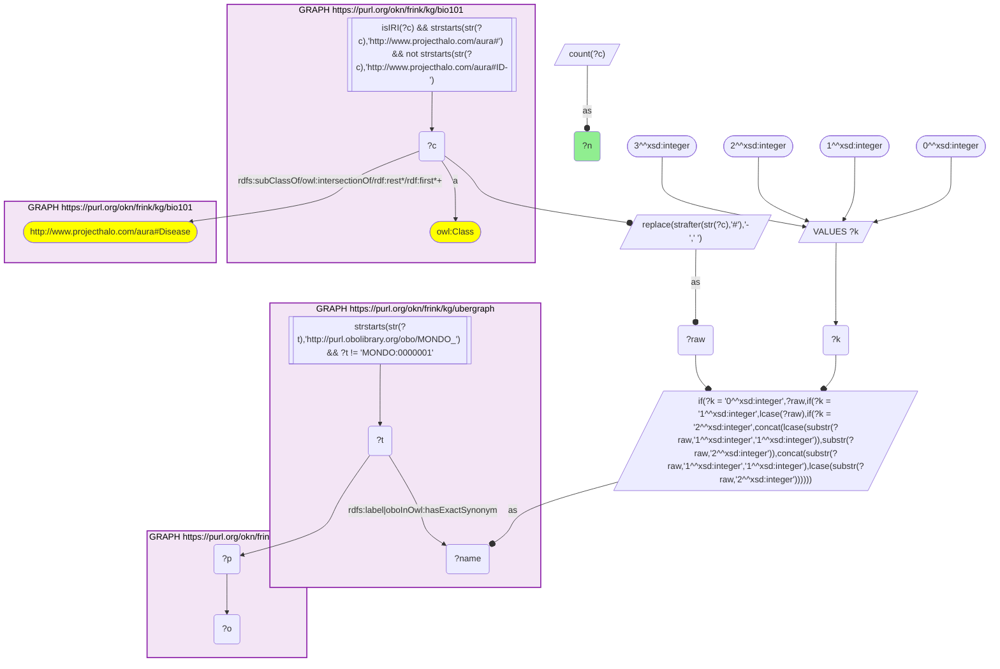
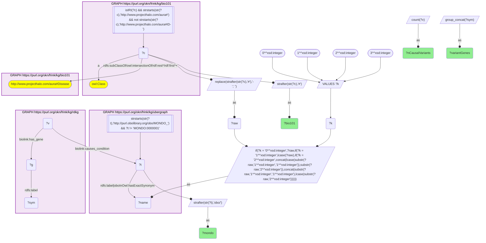
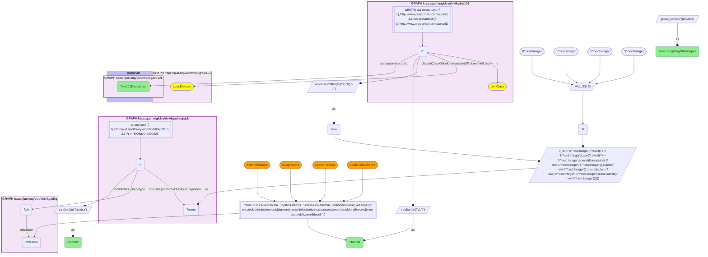

# bio101 × rdkg: which textbook diseases carry the most RDKG genes and phenotypes

- **Date:** 2026-10-05
- **Model:** claude-opus-5-5
- **SPARQL endpoint:** https://apps.okn.us/federation/sparql
- **Generated by:** mcp-okn v0.1.0 (build 8efca43)
- **Contents:** 5 queries · 5 query diagrams

## Knowledge graphs used

- `bio101` — <https://purl.org/okn/frink/kg/bio101>
- `ubergraph` — <https://purl.org/okn/frink/kg/ubergraph>
- `rdkg` — <https://purl.org/okn/frink/kg/rdkg>

## Conversation

👤 **User**

Crosswalk: `bio101` × `rdkg` on **MONDO (bio101 label), bridged through `ubergraph`** (crosswalk `KB5-mondo-label-bio101-rdkg`, verified_count 57). bio101 (KB Bio 101, an OWL ontology of an introductory biology textbook) carries no labels or external ids: each concept is an `owl:Class` IRI `http://www.projecthalo.com/aura#{Name}`, so the only key is the concept name (local name, hyphens to spaces, four case forms: as-is, all lower-case, first letter lowered, and sentence case), matched as an exact literal against ubergraph MONDO `rdfs:label` / `oboInOwl:hasExactSynonym` and restricted to bio101's `aura:Disease` subtree. rdkg stores diseases as MONDO node IRIs `http://purl.obolibrary.org/obo/MONDO_{n}`.

Research question: Which of KB Bio 101's textbook diseases carry the most RDKG gene and phenotype associations?

Why the join is required: bio101 defines the set of diseases an introductory biology course teaches, but it holds no genes or clinical phenotypes. rdkg holds gene, variant and HPO phenotype edges on MONDO diseases, but it has no idea which diseases a textbook covers. Ranking the textbook's diseases by RDKG annotation depth needs the name bridge through ubergraph's MONDO labels.

---

🧠 **Assistant**

## Answer

**By combined count, RDKG's best-annotated textbook diseases are breast cancer (1,075 genes), prostate cancer (616), diabetes mellitus (230 = 223 genes + 7 phenotypes), type 2 diabetes (226) and rheumatoid arthritis (190).** Gene associations drive all five. Ranked by HPO phenotypes instead, the leaders are the chromosomal and Mendelian disorders the textbook teaches as genetics examples: Turner syndrome (117), Down syndrome (101), Angelman syndrome (92), African sleeping sickness (87, the one infectious disease near the top) and Cri-du-chat syndrome (85), then achondroplasia (75). Of the 57 bridged textbook diseases, 39 carry at least one RDKG gene or phenotype. The other 18, mostly umbrella categories, carry none.

### Ranking (the 39 textbook diseases with at least one association)

Genes come from the union of RDKG `Gene related_to Disease`, `SequenceVariant causes_condition` + `has_gene`, `genetic_association`, `gene_associated_with_condition` and `contributes_to`. Phenotypes are `Disease has_phenotype PhenotypicFeature` edges.

| # | bio101 concept | MONDO (RDKG label) | genes | phenotypes | total |
|---|---|---|---|---|---|
| 1 | Breast-Cancer | MONDO_0007254 breast cancer | 1075 | 0 | 1075 |
| 2 | Prostate-Cancer | MONDO_0008315 prostate cancer | 616 | 0 | 616 |
| 3 | Diabetes-Mellitus | MONDO_0005015 diabetes mellitus (disease) | 223 | 7 | 230 |
| 4 | Type-2-Diabetes-Mellitus | MONDO_0005148 type 2 diabetes mellitus | 221 | 5 | 226 |
| 5 | Rheumatoid-Arthritis | MONDO_0008383 rheumatoid arthritis | 174 | 16 | 190 |
| 6 | Endometriosis | MONDO_0005133 endometriosis (disease) | 161 | 3 | 164 |
| 7 | Colon-Cancer | MONDO_0021063 malignant colon neoplasm | 159 | 0 | 159 |
| 8 | Lupus | MONDO_0007915 systemic lupus erythematosus | 71 | 69 | 140 |
| 9 | Down-Syndrome | MONDO_0008608 Down syndrome | 27 | 101 | 128 |
| 10 | Polydactyly | MONDO_0021003 polydactyly (disease) | 121 | 7 | 128 |
| 11 | Turner-Syndrome | MONDO_0019499 Turner syndrome | 7 | 117 | 124 |
| 12 | Arteriosclerosis | MONDO_0002277 arteriosclerosis disorder | 115 | 4 | 119 |
| 13 | Atherosclerosis | MONDO_0005311 atherosclerosis | 115 | 0 | 115 |
| 14 | Achondroplasia | MONDO_0007037 achondroplasia | 26 | 75 | 101 |
| 15 | Angelman-Syndrome | MONDO_0007113 Angelman syndrome | 4 | 92 | 96 |
| 16 | Cri-Du-Chat-Syndrome | MONDO_0007404 Cri-du-chat syndrome | 3 | 85 | 88 |
| 17 | African-Sleeping-Sickness | MONDO_0005459 human African trypanosomiasis | 0 | 87 | 87 |
| 18 | Cystic-Fibrosis | MONDO_0009061 cystic fibrosis | 11 | 59 | 70 |
| 19 | Alkaptonuria | MONDO_0008753 alkaptonuria | 1 | 67 | 68 |
| 20 | Stroke | MONDO_0005098 stroke disorder | 58 | 3 | 61 |
| 21 | Leukemia | MONDO_0005059 leukemia (disease) | 55 | 5 | 60 |
| 22 | Sickle-Cell-Anemia | MONDO_0011382 sickle cell disease | 10 | 50 | 60 |
| 23 | Duchenne-Muscular-Dystrophy | MONDO_0010679 Duchenne muscular dystrophy | 13 | 42 | 55 |
| 24 | Influenza | MONDO_0005812 influenza | 52 | 0 | 52 |
| 25 | CML | MONDO_0011996 chronic myelogenous leukemia, BCR-ABL1 positive | 29 | 16 | 45 |
| 26 | Multiple-Sclerosis | MONDO_0005301 multiple sclerosis | 45 | 0 | 45 |
| 27 | Malaria | MONDO_0005136 malaria | 22 | 16 | 38 |
| 28 | Cholera | MONDO_0015766 cholera | 0 | 34 | 34 |
| 29 | Tetanus | MONDO_0005526 tetanus | 0 | 30 | 30 |
| 30 | Lyme-Disease | MONDO_0019632 Lyme disease | 0 | 24 | 24 |
| 31 | Gastric-Ulcer | MONDO_0001126 gastric ulcer (disease) | 18 | 2 | 20 |
| 32 | Hyperthyroidism | MONDO_0004425 hyperthyroidism | 18 | 0 | 18 |
| 33 | Renal-Disease | MONDO_0005240 kidney disease | 15 | 0 | 15 |
| 34 | Goiter | MONDO_0005397 goiter (disease) | 7 | 3 | 10 |
| 35 | Mitochondrial-Myopathy | MONDO_0009637 inborn mitochondrial myopathy | 9 | 0 | 9 |
| 36 | Tuberculosis | MONDO_0018076 tuberculosis | 4 | 5 | 9 |
| 37 | Color-Blindness | MONDO_0001703 color vision disorder | 8 | 0 | 8 |
| 38 | Autoimmune-Disease | MONDO_0007179 autoimmune disease | 0 | 3 | 3 |
| 39 | Metabolic-Disorder | MONDO_0005066 metabolic disease | 2 | 0 | 2 |

**These 18 have zero associations:** AIDS, Anaphylactic-Shock (anaphylaxis), Bacterial-Disease, Cancer, Cardiovascular-Disease, Chromosomal-Disorder, Cowpox, Gonorrhea, Hemorrhagic-Fever, Human-Disease, Immunodeficiency, Inborn-Error-Of-Metabolism, Klinefelter-Syndrome, Lysosomal-Disorder, Mycosis, Smallpox, Thrombus and Viral-Disease. Most are umbrella MONDO terms, and RDKG does not roll gene or phenotype edges up to them. AIDS, cowpox, gonorrhea, Klinefelter syndrome and smallpox are specific diseases that RDKG holds as nodes but has not annotated.

### Which RDKG edges supply the associations (all 57 bridged diseases)

| RDKG edge | diseases reached | disease-entity pairs |
|---|---|---|
| Gene `related_to` Disease | 34 | 3,494 |
| Disease `has_phenotype` HPO term | 28 | 1,027 |
| SequenceVariant `causes_condition` Disease, then `has_gene` | 6 | 11 |
| `genetic_association`, `gene_associated_with_condition`, Gene `contributes_to` | 0 | 0 |

**Causal-variant genes are rare.** Only six textbook diseases have any:

| bio101 concept | causal variants | genes behind them |
|---|---|---|
| Cystic-Fibrosis | 226 | CFTR |
| Breast-Cancer | 103 | BRCA1, BRCA2, PALB2, PMS2, MSH6 |
| Angelman-Syndrome | 9 | UBE3A |
| Colon-Cancer | 2 | MLH1 |
| Type-2-Diabetes-Mellitus | 2 | HNF4A, GCK |
| Prostate-Cancer | 1 | BRCA2 |

### Do RDKG's phenotypes match what the textbook says?

I kept each disease's RDKG phenotypes whose labels contain a keyword from bio101's own definition.

| bio101 concept | bio101 definition (`aura:user-description`) | matching RDKG phenotypes |
|---|---|---|
| Alkaptonuria | "urine turns black because of an inability to metabolize alkapton..." | Dark urine; Ochronosis; Black pigment gallstones; Pigmentation of the sclera; Brown pigmentation of the conjunctiva; Oil-drop brown pigmentation of the corneal limbus; Irregular hyperpigmentation; Abnormality of skin pigmentation; Hemolytic anemia |
| Cystic-Fibrosis | "excessive secretion of mucus and consequent vulnerability to infection" | Elevated sweat chloride; Exocrine pancreatic insufficiency; Pancreatitis; Recurrent bronchopulmonary / respiratory / lower respiratory tract infections; Recurrent Burkholderia cepacia, Staphylococcus aureus, Haemophilus influenzae and Aspergillus infections; Nontuberculous mycobacterial pulmonary infection |
| Sickle-Cell-Anemia | "red blood cells that assume an abnormal, rigid, sickle shape" | Increased red cell sickling tendency; Chronic hemolytic anemia; Hemolytic anemia; Microcytic / Hypochromic / Iron deficiency anemia; Pigment gallstones; Recurrent (bacterial) infections |
| Achondroplasia | "A form of genetically determined dwarfism" | Rhizomelia; Disproportionate short stature; Severe short stature; Neonatal short-limb short stature |

For all four, RDKG's clinical phenotypes match the textbook's one-line definition, and they add the clinical detail the textbook leaves out.

### Findings

1. **Gene ranking and phenotype ranking measure different things.** The common complex diseases (breast and prostate cancer, diabetes, RA, endometriosis, colon cancer, atherosclerosis) lead on genes, and almost none of them carry HPO phenotypes. The chromosomal and Mendelian disorders lead on phenotypes but have few genes: Turner syndrome has 117 phenotypes and 7 genes, Angelman 92 and 4, Cri-du-chat 85 and 3. Systemic lupus erythematosus is the only textbook disease that is deep on both, with 71 genes and 69 phenotypes; Down syndrome (27 genes, 101 phenotypes) comes closest after it.
2. **Gene counts measure association breadth, not causality.** Breast cancer's 1,075 genes come almost entirely from the `related_to` association edge. Only 5 genes (BRCA1, BRCA2, PALB2, PMS2, MSH6) have `causes_condition` variants. Across all 57 diseases, `related_to` gives 3,494 disease-gene pairs and causal variants give 11.
3. **Parent and subtype terms carry near-duplicate gene sets.** Diabetes mellitus (223) and type 2 diabetes (221) have nearly the same count, and arteriosclerosis and atherosclerosis both have 115 genes. The textbook concepts are distinct, but RDKG annotates them almost identically.
4. **Infectious diseases are phenotype-only.** African sleeping sickness (87), cholera (34), tetanus (30) and Lyme disease (24) carry HPO phenotypes but no gene edges, which fits a rare-disease graph that records host clinical features rather than pathogen genes.
5. **The phenotypes RDKG holds are consistent with the textbook's definitions.** Alkaptonuria's black urine (Dark urine, Ochronosis), cystic fibrosis's infection vulnerability (eight recurrent-infection phenotypes) and sickle-cell shape (Increased red cell sickling tendency) all appear.

### Caveats

- **The bridge is by name and gives a lower bound.** bio101 has no ids, so every match is an exact name-to-MONDO-label or exact-synonym match in one of four case forms. Spelling variants are still missed, for example Huntingtons-Disease (MONDO "Huntington disease"), Tay-Sachs-disease (the hyphen is lost when the name is built) and Pompes-Disease (MONDO "Pompe disease").
- **Scoping.** The join is limited to bio101's `aura:Disease` subtree because bare MONDO name matches pick up homonyms (Epididymis, FAD, Ion, Lichen). This also leaves out conditions bio101 models as processes or states (Heart-Attack, Obesity, Allergy), so 57 is conservative.
- **Umbrella terms show zero by construction.** RDKG does not propagate gene or phenotype edges up the MONDO hierarchy, so categories such as Cancer or Viral-Disease score 0 even though their children carry thousands of edges.
- **Phenotype counts are raw `has_phenotype` edges.** They can include HPO inheritance and onset terms as well as clinical features. Only the forward (disease to phenotype) direction is counted.
- **Counts are as served by RDKG on 2026-10-05.**

## SPARQL queries executed

#### Query 1

_2026-10-06T00:10:58+00:00 · `bio101`, `ubergraph`, `rdkg`_

```sparql
SELECT (COUNT(DISTINCT ?c) AS ?n) WHERE {
  { SELECT DISTINCT ?c ?t WHERE {
  { SELECT DISTINCT ?c ?name WHERE {
      GRAPH <https://purl.org/okn/frink/kg/bio101> { ?c a <http://www.w3.org/2002/07/owl#Class> .
        FILTER(isIRI(?c) && STRSTARTS(STR(?c),'http://www.projecthalo.com/aura#') && !STRSTARTS(STR(?c),'http://www.projecthalo.com/aura#ID-')) }
      GRAPH <https://purl.org/okn/frink/kg/bio101> { ?c (<http://www.w3.org/2000/01/rdf-schema#subClassOf>/(<http://www.w3.org/2002/07/owl#intersectionOf>/<http://www.w3.org/1999/02/22-rdf-syntax-ns#rest>*/<http://www.w3.org/1999/02/22-rdf-syntax-ns#first>)*)+ <http://www.projecthalo.com/aura#Disease> . }
      BIND(REPLACE(STRAFTER(STR(?c),'#'),'-',' ') AS ?raw)
      VALUES ?k { 0 1 2 3 }  # as-is, all lower, first letter lowered, sentence case
      BIND(IF(?k = 0, ?raw, IF(?k = 1, LCASE(?raw), IF(?k = 2, CONCAT(LCASE(SUBSTR(?raw,1,1)),SUBSTR(?raw,2)),
                CONCAT(SUBSTR(?raw,1,1),LCASE(SUBSTR(?raw,2)))))) AS ?name)
  } }
    GRAPH <https://purl.org/okn/frink/kg/ubergraph> { ?t <http://www.w3.org/2000/01/rdf-schema#label>|<http://www.geneontology.org/formats/oboInOwl#hasExactSynonym> ?name .
      FILTER(STRSTARTS(STR(?t),'http://purl.obolibrary.org/obo/MONDO_') && ?t != <http://purl.obolibrary.org/obo/MONDO_0000001>) }
  } }
  GRAPH <https://purl.org/okn/frink/kg/rdkg> { ?t ?p ?o . }
}
```



_1 row(s)_

| n |
| --- |
| 57 |

#### Query 2

_2026-10-06T00:11:11+00:00 · `bio101`, `ubergraph`, `rdkg`_

```sparql
PREFIX biolink: <https://w3id.org/biolink/vocab/>
PREFIX rdfs: <http://www.w3.org/2000/01/rdf-schema#>
SELECT ?bio101 ?mondo ?rdkgLabel ?nGenes ?nPhenotypes ((?nGenes + ?nPhenotypes) AS ?total) WHERE {
 { SELECT ?c ?t ?rdkgLabel (COUNT(DISTINCT ?g) AS ?nGenes) (COUNT(DISTINCT ?ph) AS ?nPhenotypes) WHERE {
  { SELECT DISTINCT ?c ?t WHERE {
  { SELECT DISTINCT ?c ?name WHERE {
      GRAPH <https://purl.org/okn/frink/kg/bio101> { ?c a <http://www.w3.org/2002/07/owl#Class> .
        FILTER(isIRI(?c) && STRSTARTS(STR(?c),'http://www.projecthalo.com/aura#') && !STRSTARTS(STR(?c),'http://www.projecthalo.com/aura#ID-')) }
      GRAPH <https://purl.org/okn/frink/kg/bio101> { ?c (<http://www.w3.org/2000/01/rdf-schema#subClassOf>/(<http://www.w3.org/2002/07/owl#intersectionOf>/<http://www.w3.org/1999/02/22-rdf-syntax-ns#rest>*/<http://www.w3.org/1999/02/22-rdf-syntax-ns#first>)*)+ <http://www.projecthalo.com/aura#Disease> . }
      BIND(REPLACE(STRAFTER(STR(?c),'#'),'-',' ') AS ?raw)
      VALUES ?k { 0 1 2 3 }  # as-is, all lower, first letter lowered, sentence case
      BIND(IF(?k = 0, ?raw, IF(?k = 1, LCASE(?raw), IF(?k = 2, CONCAT(LCASE(SUBSTR(?raw,1,1)),SUBSTR(?raw,2)),
                CONCAT(SUBSTR(?raw,1,1),LCASE(SUBSTR(?raw,2)))))) AS ?name)
  } }
    GRAPH <https://purl.org/okn/frink/kg/ubergraph> { ?t <http://www.w3.org/2000/01/rdf-schema#label>|<http://www.geneontology.org/formats/oboInOwl#hasExactSynonym> ?name .
      FILTER(STRSTARTS(STR(?t),'http://purl.obolibrary.org/obo/MONDO_') && ?t != <http://purl.obolibrary.org/obo/MONDO_0000001>) }
  } }
  GRAPH <https://purl.org/okn/frink/kg/rdkg> {
    ?t a biolink:Disease ; rdfs:label ?rdkgLabel .
    OPTIONAL {
      { ?g biolink:related_to ?t . ?g a biolink:Gene }
      UNION { ?v biolink:causes_condition ?t ; biolink:has_gene ?g }
      UNION { ?t biolink:genetic_association ?g }
      UNION { ?g biolink:gene_associated_with_condition ?t }
      UNION { ?g biolink:contributes_to ?t . ?g a biolink:Gene }
    }
    OPTIONAL { ?t biolink:has_phenotype ?ph . ?ph a biolink:PhenotypicFeature }
  }
 } GROUP BY ?c ?t ?rdkgLabel }
 BIND(STRAFTER(STR(?c),'#') AS ?bio101)
 BIND(STRAFTER(STR(?t),'obo/') AS ?mondo)
} ORDER BY DESC(?total) ?bio101
```



```mermaid
graph TD
classDef projected fill:lightgreen;
classDef literal fill:orange;
classDef iri fill:yellow;
  q2v6("?bio101"):::projected 
  q2v7("?c")
  q2v17("?g")
  q2v15("?k")
  q2v4("?mondo"):::projected 
  q2v2("?nGenes"):::projected 
  q2v3("?nPhenotypes"):::projected 
  q2v14("?name")
  q2v19("?ph")
  q2v16("?raw")
  q2v8("?rdkgLabel"):::projected 
  q2v5("?t")
  q2v1("?total"):::projected 
  q2v18("?v")
  subgraph q2graph0["GRAPH https://purl.org/okn/frink/kg/bio101"]
    style q2graph0 fill:#f3e5f5,stroke:#8e24aa,stroke-width:2px,color:#000;
    q2graph0c2(["owl:Class"]):::iri 
    q2graph0f0[["isIRI(?c) && strstarts(str(?c),'http://www.projecthalo.com/aura#') && not strstarts(str(?c),'http://www.projecthalo.com/aura#ID-')"]]
    q2graph0f0 --> q2v7
    q2v7 --"a"--> q2graph0c2
  end
  subgraph q2graph1["GRAPH https://purl.org/okn/frink/kg/bio101"]
    style q2graph1 fill:#f3e5f5,stroke:#8e24aa,stroke-width:2px,color:#000;
    q2graph1c1(["http://www.projecthalo.com/aura#Disease"]):::iri 
    q2v7 --"rdfs:subClassOf/owl:intersectionOf/rdf:rest*/rdf:first*+"--> q2graph1c1
  end
  q2bind0[/"replace(strafter(str(?c),'#'),'-',' ')"/]
  q2v7 --o q2bind0
  q2bind0 --as--o q2v16
  q2bind1[/"VALUES ?k"/]
  q2bind1-->q2v15
  q2bind10(["0^^xsd:integer"])
  q2bind10 --> q2bind1
  q2bind11(["1^^xsd:integer"])
  q2bind11 --> q2bind1
  q2bind12(["2^^xsd:integer"])
  q2bind12 --> q2bind1
  q2bind13(["3^^xsd:integer"])
  q2bind13 --> q2bind1
  q2bind2[/"if(?k = '0^^xsd:integer',?raw,if(?k = '1^^xsd:integer',lcase(?raw),if(?k = '2^^xsd:integer',concat(lcase(substr(?raw,'1^^xsd:integer','1^^xsd:integer')),substr(?raw,'2^^xsd:integer')),concat(substr(?raw,'1^^xsd:integer','1^^xsd:integer'),lcase(substr(?raw,'2^^xsd:integer'))))))"/]
  q2v15 --o q2bind2
  q2v16 --o q2bind2
  q2bind2 --as--o q2v14
  subgraph q2graph2["GRAPH https://purl.org/okn/frink/kg/ubergraph"]
    style q2graph2 fill:#f3e5f5,stroke:#8e24aa,stroke-width:2px,color:#000;
    q2graph2f1[["strstarts(str(?t),'http://purl.obolibrary.org/obo/MONDO_') && ?t != 'MONDO:0000001'"]]
    q2graph2f1 --> q2v5
    q2v5 --"rdfs:label|oboInOwl:hasExactSynonym"--> q2v14
  end
  subgraph q2graph3["GRAPH https://purl.org/okn/frink/kg/rdkg"]
    style q2graph3 fill:#f3e5f5,stroke:#8e24aa,stroke-width:2px,color:#000;
    q2graph3c2(["biolink:Disease"]):::iri 
    q2graph3c4(["biolink:Gene"]):::iri 
    q2graph3c11(["biolink:PhenotypicFeature"]):::iri 
    q2v5 --"a"--> q2graph3c2
    q2v5 --"rdfs:label"--> q2v8
    subgraph q2optionalgraph30["(optional)"]
    style q2optionalgraph30 fill:#bbf,stroke-dasharray: 5 5,color:#000;
      subgraph q2uniongraph30[" Union "]
      style q2uniongraph30 color:#000;
        q2v17 -."a".-> q2graph3c4
        q2v17 --"biolink:contributes_to"--> q2v5
        subgraph q2uniongraph31[" Union "]
        style q2uniongraph31 color:#000;
          q2v17 --"biolink:gene_associated_with_condition"--> q2v5
          subgraph q2uniongraph32[" Union "]
          style q2uniongraph32 color:#000;
            q2v5 --"biolink:genetic_association"--> q2v17
            subgraph q2uniongraph33[" Union "]
            style q2uniongraph33 color:#000;
            subgraph q2uniongraph33l[" "]
              style q2uniongraph33l fill:#abf,stroke-dasharray: 3 3;
              q2v18 --"biolink:causes_condition"--> q2v5
              q2v18 --"biolink:has_gene"--> q2v17
            end
            subgraph q2uniongraph33r[" "]
              style q2uniongraph33r fill:#abf,stroke-dasharray: 3 3;
              q2v17 --"a"--> q2graph3c4
              q2v17 --"biolink:related_to"--> q2v5
            end
            q2uniongraph33r <== or ==> q2uniongraph33l
            end
          end
        end
      end
    end
    subgraph q2optionalgraph31["(optional)"]
    style q2optionalgraph31 fill:#bbf,stroke-dasharray: 5 5,color:#000;
      q2v19 -."a".-> q2graph3c11
      q2v5 --"biolink:has_phenotype"--> q2v19
    end
  end
  q2bind3[/"count(?g)"/]
  q2bind3 --as--o q2v2
  q2bind4[/"count(?ph)"/]
  q2bind4 --as--o q2v3
  q2bind5[/"strafter(str(?c),'#')"/]
  q2v7 --o q2bind5
  q2bind5 --as--o q2v6
  q2bind6[/"strafter(str(?t),'obo/')"/]
  q2v5 --o q2bind6
  q2bind6 --as--o q2v4
  q2bind7[/"?nGenes + ?nPhenotypes"/]
  q2v2 --o q2bind7
  q2v3 --o q2bind7
  q2bind7 --as--o q2v1
```

_57 row(s) — showing first 3_

| bio101 | mondo | rdkgLabel | nGenes | nPhenotypes | total |
| --- | --- | --- | --- | --- | --- |
| Breast-Cancer | MONDO_0007254 | breast cancer | 1075 | 0 | 1075 |
| Prostate-Cancer | MONDO_0008315 | prostate cancer | 616 | 0 | 616 |
| Diabetes-Mellitus | MONDO_0005015 | diabetes mellitus (disease) | 223 | 7 | 230 |

#### Query 3

_2026-10-06T00:11:23+00:00 · `bio101`, `ubergraph`, `rdkg`_

```sparql
PREFIX biolink: <https://w3id.org/biolink/vocab/>
PREFIX rdfs: <http://www.w3.org/2000/01/rdf-schema#>
SELECT ?edge (COUNT(DISTINCT ?t) AS ?nDiseases) (COUNT(DISTINCT CONCAT(STR(?t), "|", STR(?x))) AS ?nPairs) WHERE {
  { SELECT DISTINCT ?c ?t WHERE {
  { SELECT DISTINCT ?c ?name WHERE {
      GRAPH <https://purl.org/okn/frink/kg/bio101> { ?c a <http://www.w3.org/2002/07/owl#Class> .
        FILTER(isIRI(?c) && STRSTARTS(STR(?c),'http://www.projecthalo.com/aura#') && !STRSTARTS(STR(?c),'http://www.projecthalo.com/aura#ID-')) }
      GRAPH <https://purl.org/okn/frink/kg/bio101> { ?c (<http://www.w3.org/2000/01/rdf-schema#subClassOf>/(<http://www.w3.org/2002/07/owl#intersectionOf>/<http://www.w3.org/1999/02/22-rdf-syntax-ns#rest>*/<http://www.w3.org/1999/02/22-rdf-syntax-ns#first>)*)+ <http://www.projecthalo.com/aura#Disease> . }
      BIND(REPLACE(STRAFTER(STR(?c),'#'),'-',' ') AS ?raw)
      VALUES ?k { 0 1 2 3 }  # as-is, all lower, first letter lowered, sentence case
      BIND(IF(?k = 0, ?raw, IF(?k = 1, LCASE(?raw), IF(?k = 2, CONCAT(LCASE(SUBSTR(?raw,1,1)),SUBSTR(?raw,2)),
                CONCAT(SUBSTR(?raw,1,1),LCASE(SUBSTR(?raw,2)))))) AS ?name)
  } }
    GRAPH <https://purl.org/okn/frink/kg/ubergraph> { ?t <http://www.w3.org/2000/01/rdf-schema#label>|<http://www.geneontology.org/formats/oboInOwl#hasExactSynonym> ?name .
      FILTER(STRSTARTS(STR(?t),'http://purl.obolibrary.org/obo/MONDO_') && ?t != <http://purl.obolibrary.org/obo/MONDO_0000001>) }
  } }
  GRAPH <https://purl.org/okn/frink/kg/rdkg> {
      { ?x biolink:related_to ?t . ?x a biolink:Gene . BIND("gene related_to disease" AS ?edge) }
      UNION { ?v biolink:causes_condition ?t ; biolink:has_gene ?x . BIND("variant causes_condition -> has_gene" AS ?edge) }
      UNION { ?t biolink:genetic_association ?x . BIND("disease genetic_association gene" AS ?edge) }
      UNION { ?x biolink:gene_associated_with_condition ?t . BIND("gene gene_associated_with_condition disease" AS ?edge) }
      UNION { ?x biolink:contributes_to ?t . ?x a biolink:Gene . BIND("gene contributes_to disease" AS ?edge) }
      UNION { ?t biolink:has_phenotype ?x . ?x a biolink:PhenotypicFeature . BIND("disease has_phenotype HPO" AS ?edge) }
  }
} GROUP BY ?edge ORDER BY DESC(?nPairs)
```



```mermaid
graph TD
classDef projected fill:lightgreen;
classDef literal fill:orange;
classDef iri fill:yellow;
  q3v10("?c")
  q3v3("?edge"):::projected 
  q3v8("?k")
  q3v2("?nDiseases"):::projected 
  q3v1("?nPairs"):::projected 
  q3v7("?name")
  q3v9("?raw")
  q3v11("?t")
  q3v13("?v")
  q3v12("?x")
  subgraph q3graph0["GRAPH https://purl.org/okn/frink/kg/bio101"]
    style q3graph0 fill:#f3e5f5,stroke:#8e24aa,stroke-width:2px,color:#000;
    q3graph0c2(["owl:Class"]):::iri 
    q3graph0f0[["isIRI(?c) && strstarts(str(?c),'http://www.projecthalo.com/aura#') && not strstarts(str(?c),'http://www.projecthalo.com/aura#ID-')"]]
    q3graph0f0 --> q3v10
    q3v10 --"a"--> q3graph0c2
  end
  subgraph q3graph1["GRAPH https://purl.org/okn/frink/kg/bio101"]
    style q3graph1 fill:#f3e5f5,stroke:#8e24aa,stroke-width:2px,color:#000;
    q3graph1c1(["http://www.projecthalo.com/aura#Disease"]):::iri 
    q3v10 --"rdfs:subClassOf/owl:intersectionOf/rdf:rest*/rdf:first*+"--> q3graph1c1
  end
  q3bind0[/"replace(strafter(str(?c),'#'),'-',' ')"/]
  q3v10 --o q3bind0
  q3bind0 --as--o q3v9
  q3bind1[/"VALUES ?k"/]
  q3bind1-->q3v8
  q3bind10(["0^^xsd:integer"])
  q3bind10 --> q3bind1
  q3bind11(["1^^xsd:integer"])
  q3bind11 --> q3bind1
  q3bind12(["2^^xsd:integer"])
  q3bind12 --> q3bind1
  q3bind13(["3^^xsd:integer"])
  q3bind13 --> q3bind1
  q3bind2[/"if(?k = '0^^xsd:integer',?raw,if(?k = '1^^xsd:integer',lcase(?raw),if(?k = '2^^xsd:integer',concat(lcase(substr(?raw,'1^^xsd:integer','1^^xsd:integer')),substr(?raw,'2^^xsd:integer')),concat(substr(?raw,'1^^xsd:integer','1^^xsd:integer'),lcase(substr(?raw,'2^^xsd:integer'))))))"/]
  q3v8 --o q3bind2
  q3v9 --o q3bind2
  q3bind2 --as--o q3v7
  subgraph q3graph2["GRAPH https://purl.org/okn/frink/kg/ubergraph"]
    style q3graph2 fill:#f3e5f5,stroke:#8e24aa,stroke-width:2px,color:#000;
    q3graph2f1[["strstarts(str(?t),'http://purl.obolibrary.org/obo/MONDO_') && ?t != 'MONDO:0000001'"]]
    q3graph2f1 --> q3v11
    q3v11 --"rdfs:label|oboInOwl:hasExactSynonym"--> q3v7
  end
  subgraph q3graph3["GRAPH https://purl.org/okn/frink/kg/rdkg"]
    style q3graph3 fill:#f3e5f5,stroke:#8e24aa,stroke-width:2px,color:#000;
    q3graph3c2(["biolink:Gene"]):::iri 
    q3graph3c9(["biolink:PhenotypicFeature"]):::iri 
    subgraph q3uniongraph30[" Union "]
    style q3uniongraph30 color:#000;
    subgraph q3uniongraph30l[" "]
      style q3uniongraph30l fill:#abf,stroke-dasharray: 3 3;
      q3v12 --"a"--> q3graph3c9
      q3v11 --"biolink:has_phenotype"--> q3v12
      q3graph3bind3[/"'disease has_phenotype HPO'"/]
      q3graph3bind3 --as--o q3v3
    end
      subgraph q3uniongraph31[" Union "]
      style q3uniongraph31 color:#000;
      subgraph q3uniongraph31l[" "]
        style q3uniongraph31l fill:#abf,stroke-dasharray: 3 3;
        q3v12 --"a"--> q3graph3c2
        q3v12 --"biolink:contributes_to"--> q3v11
        q3graph3bind4[/"'gene contributes_to disease'"/]
        q3graph3bind4 --as--o q3v3
      end
        subgraph q3uniongraph32[" Union "]
        style q3uniongraph32 color:#000;
        subgraph q3uniongraph32l[" "]
          style q3uniongraph32l fill:#abf,stroke-dasharray: 3 3;
          q3v12 --"biolink:gene_associated_with_condition"--> q3v11
          q3graph3bind5[/"'gene gene_associated_with_condition disease'"/]
          q3graph3bind5 --as--o q3v3
        end
          subgraph q3uniongraph33[" Union "]
          style q3uniongraph33 color:#000;
          subgraph q3uniongraph33l[" "]
            style q3uniongraph33l fill:#abf,stroke-dasharray: 3 3;
            q3v11 --"biolink:genetic_association"--> q3v12
            q3graph3bind6[/"'disease genetic_association gene'"/]
            q3graph3bind6 --as--o q3v3
          end
            subgraph q3uniongraph34[" Union "]
            style q3uniongraph34 color:#000;
            subgraph q3uniongraph34l[" "]
              style q3uniongraph34l fill:#abf,stroke-dasharray: 3 3;
              q3v13 --"biolink:causes_condition"--> q3v11
              q3v13 --"biolink:has_gene"--> q3v12
              q3graph3bind7[/"'variant causes_condition -> has_gene'"/]
              q3graph3bind7 --as--o q3v3
            end
            subgraph q3uniongraph34r[" "]
              style q3uniongraph34r fill:#abf,stroke-dasharray: 3 3;
              q3v12 --"a"--> q3graph3c2
              q3v12 --"biolink:related_to"--> q3v11
              q3graph3bind8[/"'gene related_to disease'"/]
              q3graph3bind8 --as--o q3v3
            end
            q3uniongraph34r <== or ==> q3uniongraph34l
            end
          end
        end
      end
    end
  end
  q3bind9[/"count(?t)"/]
  q3bind9 --as--o q3v2
  q3bind10[/"count(concat(str(?t),'|',str(?x)))"/]
  q3bind10 --as--o q3v1
```

_3 row(s)_

| edge | nDiseases | nPairs |
| --- | --- | --- |
| gene related_to disease | 34 | 3494 |
| disease has_phenotype HPO | 28 | 1027 |
| variant causes_condition -> has_gene | 6 | 11 |

#### Query 4

_2026-10-06T00:11:33+00:00 · `bio101`, `ubergraph`, `rdkg`_

```sparql
PREFIX biolink: <https://w3id.org/biolink/vocab/>
PREFIX rdfs: <http://www.w3.org/2000/01/rdf-schema#>
SELECT ?bio101 ?mondo (COUNT(DISTINCT ?v) AS ?nCausalVariants) (GROUP_CONCAT(DISTINCT ?sym; separator=", ") AS ?variantGenes) WHERE {
  { SELECT DISTINCT ?c ?t WHERE {
  { SELECT DISTINCT ?c ?name WHERE {
      GRAPH <https://purl.org/okn/frink/kg/bio101> { ?c a <http://www.w3.org/2002/07/owl#Class> .
        FILTER(isIRI(?c) && STRSTARTS(STR(?c),'http://www.projecthalo.com/aura#') && !STRSTARTS(STR(?c),'http://www.projecthalo.com/aura#ID-')) }
      GRAPH <https://purl.org/okn/frink/kg/bio101> { ?c (<http://www.w3.org/2000/01/rdf-schema#subClassOf>/(<http://www.w3.org/2002/07/owl#intersectionOf>/<http://www.w3.org/1999/02/22-rdf-syntax-ns#rest>*/<http://www.w3.org/1999/02/22-rdf-syntax-ns#first>)*)+ <http://www.projecthalo.com/aura#Disease> . }
      BIND(REPLACE(STRAFTER(STR(?c),'#'),'-',' ') AS ?raw)
      VALUES ?k { 0 1 2 3 }  # as-is, all lower, first letter lowered, sentence case
      BIND(IF(?k = 0, ?raw, IF(?k = 1, LCASE(?raw), IF(?k = 2, CONCAT(LCASE(SUBSTR(?raw,1,1)),SUBSTR(?raw,2)),
                CONCAT(SUBSTR(?raw,1,1),LCASE(SUBSTR(?raw,2)))))) AS ?name)
  } }
    GRAPH <https://purl.org/okn/frink/kg/ubergraph> { ?t <http://www.w3.org/2000/01/rdf-schema#label>|<http://www.geneontology.org/formats/oboInOwl#hasExactSynonym> ?name .
      FILTER(STRSTARTS(STR(?t),'http://purl.obolibrary.org/obo/MONDO_') && ?t != <http://purl.obolibrary.org/obo/MONDO_0000001>) }
  } }
  GRAPH <https://purl.org/okn/frink/kg/rdkg> { ?v biolink:causes_condition ?t ; biolink:has_gene ?g . ?g rdfs:label ?sym }
  BIND(STRAFTER(STR(?c),'#') AS ?bio101)
  BIND(STRAFTER(STR(?t),'obo/') AS ?mondo)
} GROUP BY ?bio101 ?mondo ORDER BY DESC(?nCausalVariants)
```



_6 row(s) — showing first 3_

| bio101 | mondo | nCausalVariants | variantGenes |
| --- | --- | --- | --- |
| Cystic-Fibrosis | MONDO_0009061 | 226 | CFTR |
| Breast-Cancer | MONDO_0007254 | 103 | BRCA2, BRCA1, PALB2, PMS2, MSH6 |
| Angelman-Syndrome | MONDO_0007113 | 9 | UBE3A |

#### Query 5

_2026-10-06T00:11:46+00:00 · `bio101`, `ubergraph`, `rdkg`_

```sparql
PREFIX aura: <http://www.projecthalo.com/aura#>
PREFIX biolink: <https://w3id.org/biolink/vocab/>
PREFIX rdfs: <http://www.w3.org/2000/01/rdf-schema#>
SELECT ?bio101 ?bio101Description ?mondo (GROUP_CONCAT(DISTINCT ?phLabel; separator="; ") AS ?matchingRdkgPhenotypes) WHERE {
  { SELECT DISTINCT ?c ?t WHERE {
  { SELECT DISTINCT ?c ?name WHERE {
      GRAPH <https://purl.org/okn/frink/kg/bio101> { ?c a <http://www.w3.org/2002/07/owl#Class> .
        FILTER(isIRI(?c) && STRSTARTS(STR(?c),'http://www.projecthalo.com/aura#') && !STRSTARTS(STR(?c),'http://www.projecthalo.com/aura#ID-')) }
      GRAPH <https://purl.org/okn/frink/kg/bio101> { ?c (<http://www.w3.org/2000/01/rdf-schema#subClassOf>/(<http://www.w3.org/2002/07/owl#intersectionOf>/<http://www.w3.org/1999/02/22-rdf-syntax-ns#rest>*/<http://www.w3.org/1999/02/22-rdf-syntax-ns#first>)*)+ <http://www.projecthalo.com/aura#Disease> . }
      BIND(REPLACE(STRAFTER(STR(?c),'#'),'-',' ') AS ?raw)
      VALUES ?k { 0 1 2 3 }  # as-is, all lower, first letter lowered, sentence case
      BIND(IF(?k = 0, ?raw, IF(?k = 1, LCASE(?raw), IF(?k = 2, CONCAT(LCASE(SUBSTR(?raw,1,1)),SUBSTR(?raw,2)),
                CONCAT(SUBSTR(?raw,1,1),LCASE(SUBSTR(?raw,2)))))) AS ?name)
  } }
    GRAPH <https://purl.org/okn/frink/kg/ubergraph> { ?t <http://www.w3.org/2000/01/rdf-schema#label>|<http://www.geneontology.org/formats/oboInOwl#hasExactSynonym> ?name .
      FILTER(STRSTARTS(STR(?t),'http://purl.obolibrary.org/obo/MONDO_') && ?t != <http://purl.obolibrary.org/obo/MONDO_0000001>) }
  } }
  BIND(STRAFTER(STR(?c),'#') AS ?bio101)
  FILTER(?bio101 IN ("Alkaptonuria", "Cystic-Fibrosis", "Sickle-Cell-Anemia", "Achondroplasia"))
  GRAPH <https://purl.org/okn/frink/kg/rdkg> { ?t biolink:has_phenotype ?ph . ?ph rdfs:label ?phLabel . }
  FILTER(REGEX(?phLabel, "urine|ochronosis|pigment|mucus|infection|sweat|pancrea|anemia|sickl|erythrocyte|short stature|rhizomel|dwarf", "i"))
  OPTIONAL { GRAPH <https://purl.org/okn/frink/kg/bio101> { ?c aura:user-description ?bio101Description } }
  BIND(STRAFTER(STR(?t),'obo/') AS ?mondo)
} GROUP BY ?bio101 ?bio101Description ?mondo ORDER BY ?bio101
```



_4 row(s)_

| bio101 | bio101Description | mondo | matchingRdkgPhenotypes |
| --- | --- | --- | --- |
| Achondroplasia | A form of genetically determined dwarfism. | MONDO_0007037 | Neonatal short-limb short stature; Rhizomelia; Disproportionate short stature; Severe short stature |
| Alkaptonuria | A hereditary disease in which urine turns black because of an inability to metabolize alkapton, which accumulates in the blood and is excreted in the urine. | MONDO_0008753 | Irregular hyperpigmentation; Abnormality of skin pigmentation; Hemolytic anemia; Brown pigmentation of the conjunctiva; Black pigment gallstones; Ochronosis; Dark urine; Pigmentation of the sclera; Oil-drop brown pigmentation of the corneal limbus |
| Cystic-Fibrosis | A human genetic disorder caused by a recessive allele for a chloride channel protein; characterized by an excessive secretion of mucus and consequent vulnerability to infection; fatal if untreated. | MONDO_0009061 | Recurrent bronchopulmonary infections; Recurrent Burkholderia cepacia infections; Exocrine pancreatic insufficiency; Recurrent respiratory infections; Recurrent Aspergillus infections; Recurrent Staphylococcus aureus infections; Recurrent lower respiratory tract infections; Recurrent Haemophilus influenzae infections; Nontuberculous mycobacterial pulmonary infection; Elevated sweat chloride; Pancreatitis |
| Sickle-Cell-Anemia | an autosomal recessive genetic blood disorder characterized by red blood cells that assume an abnormal, rigid, sickle shape. | MONDO_0011382 | Microcytic anemia; Recurrent bacterial infections; Recurrent infections; Chronic hemolytic anemia; Iron deficiency anemia; Hemolytic anemia; Hypochromic anemia; Increased red cell sickling tendency; Pigment gallstones |
