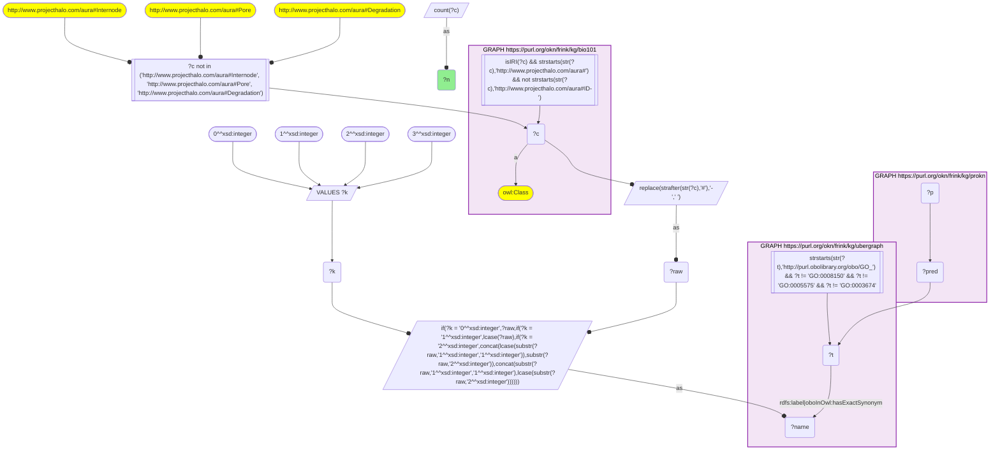
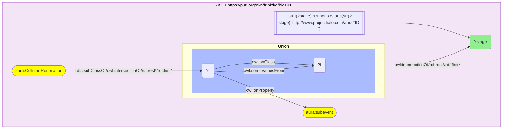
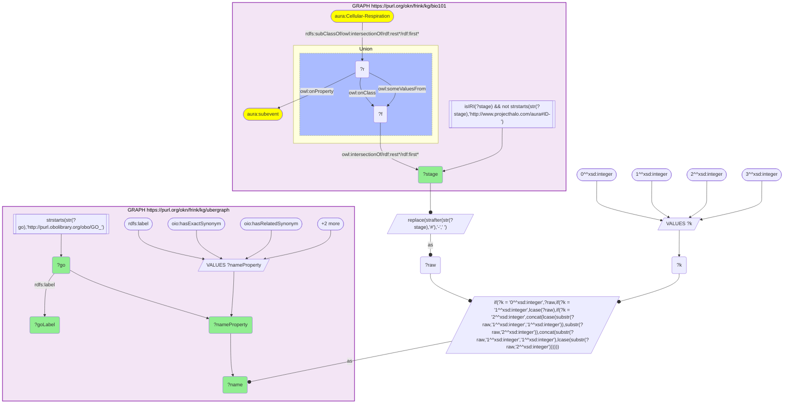
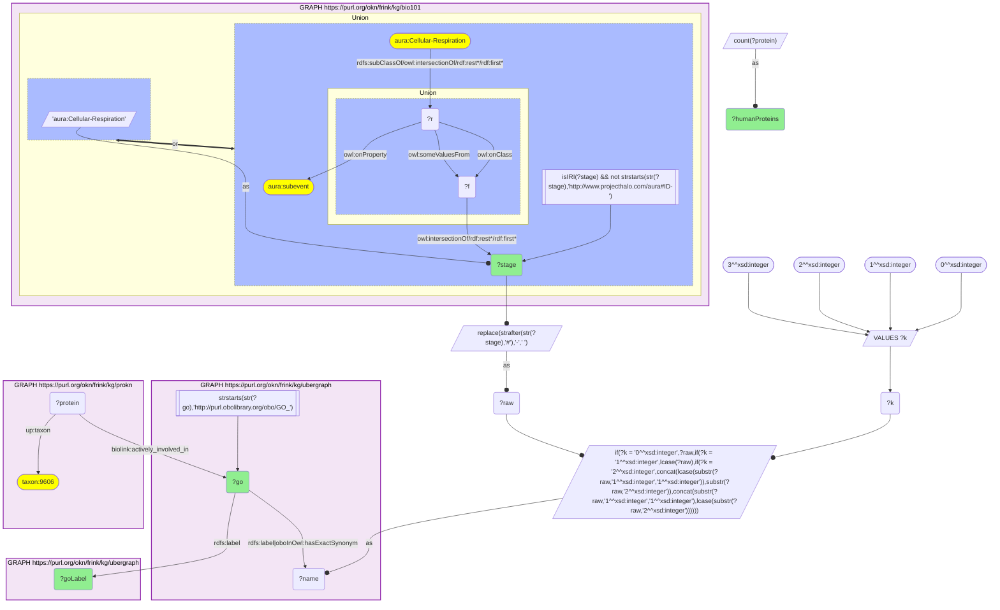
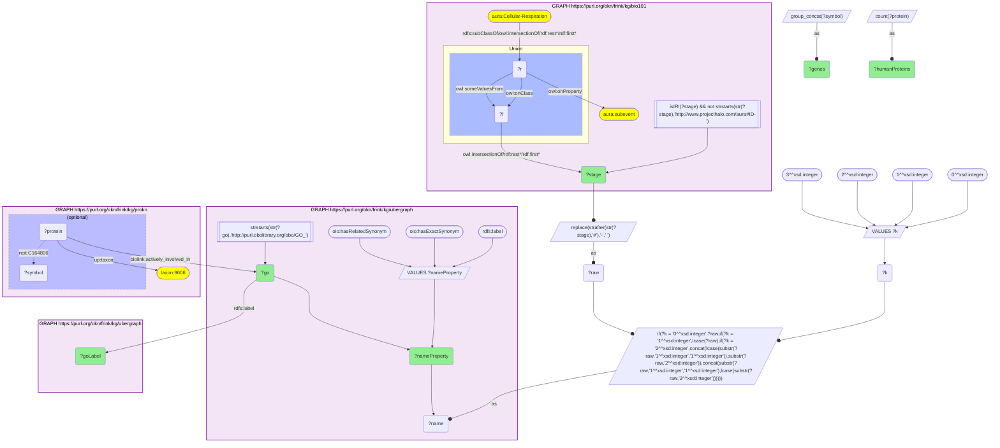

# MF02-Q1: Cellular-respiration stages in KB Bio 101 beside the human proteins ProKN annotates to the matching GO process (bio101 × prokn, GO label-bridged)

- **Date:** 2026-10-05
- **Model:** claude-opus-5-5
- **SPARQL endpoint:** https://apps.okn.us/federation/sparql
- **Generated by:** mcp-okn v0.1.0 (build 8efca43)
- **Contents:** 6 queries · 6 query diagrams

## Knowledge graphs used

- `bio101` — <https://purl.org/okn/frink/kg/bio101>
- `ubergraph` — <https://purl.org/okn/frink/kg/ubergraph>
- `prokn` — <https://purl.org/okn/frink/kg/prokn>

## Conversation

👤 **User**

Crosswalk: `bio101` × `prokn` on **GO (bio101 label), bridged through `ubergraph`** (crosswalk `KB1-go-label-bio101-prokn`, verified_count 310). bio101 (KB Bio 101, an OWL ontology of an introductory biology textbook) carries each concept only as an `owl:Class` IRI `http://www.projecthalo.com/aura#{Name}`. It has no `rdfs:label` and no external id, so the concept NAME is the key: the local name with hyphens turned into spaces, in four case forms (as-is, all lower-case, first letter lowered, and sentence case), matched as a literal against ubergraph's GO `rdfs:label` or `oboInOwl:hasExactSynonym`. prokn carries the resulting `GO_` IRI in object position on its human `up:Protein` nodes (biological-process annotations via `biolink:actively_involved_in`).

Research question: KB Bio 101 teaches cellular respiration as a sequence of stages (glycolysis, pyruvate oxidation, the citric acid cycle, oxidative phosphorylation). For each stage, which human proteins does ProKN annotate to the matching GO process, set beside what the textbook says that stage consumes and produces? Which stages does the exact-name bridge fail to reach?

Why the join is required: bio101 knows what each stage takes in and gives out (glucose to pyruvate, acetyl-CoA to CO2 and NADH, ADP to ATP) but names no gene or protein. ProKN knows which human proteins are annotated to each GO process but has no textbook account of the pathway. Only the concept-name → GO bridge through ubergraph puts the textbook stage and its human enzymes in the same row.

---

🧠 **Assistant**

**bio101 lists four stages under Cellular-Respiration. The catalogued exact-name bridge reaches two of them: the citric acid cycle (31 human ProKN proteins) and oxidative phosphorylation (23). It misses glycolysis and pyruvate oxidation, and the recipe's fourth (sentence-case) form does not change that.** Glycolysis does have a GO counterpart, but only through a *related* synonym, which the recipe does not match. Widening the bridge to related synonyms adds 40 glycolytic proteins. Pyruvate oxidation has no GO name match of any kind. The parent concept Cellular-Respiration also bridges, to GO:0045333 *cellular respiration* (35 proteins).

**Step 1: the bridge is real (logged query 1).** The KB1 skeleton, with its four case forms, returns **310** bio101 concepts that reach a GO term prokn carries, which matches the catalog's verified_count.

**Step 2: the stages, as bio101 defines them (logged query 2).** bio101's own `aura:subevent` restrictions on `aura:Cellular-Respiration` name four stages: Glycolysis, Pyruvate-Oxidation, Citric-Acid-Cycle and Oxidative-Phosphorylation. The stages are read from the textbook, not hand-picked.

**Step 3: which GO name each stage reaches (logged query 3).** Each stage name, in all four case forms, was tested against every ubergraph GO name property (label, exact, related, narrow and broad synonym):

| bio101 stage | Name tested | Matched via | GO term | Inside KB1 recipe? |
|---|---|---|---|---|
| Citric-Acid-Cycle | "citric acid cycle" | `hasExactSynonym` | GO:0006099 tricarboxylic acid cycle | yes |
| Oxidative-Phosphorylation | "oxidative phosphorylation" | `rdfs:label` | GO:0006119 oxidative phosphorylation | yes |
| Glycolysis | "glycolysis" | `hasRelatedSynonym` only | GO:0006096 glycolytic process | **no** |
| Pyruvate-Oxidation | "pyruvate oxidation" | none | none | **no** |

The sentence-case forms ("Citric acid cycle", "Glycolysis", "Oxidative phosphorylation", "Pyruvate oxidation") match nothing extra: GO spells these process names in lower case, so the fourth form adds no row here.

**Step 4: human ProKN proteins on the recipe-bridged terms (logged query 4).** This is the recipe (label | exactSynonym, four case forms), with the parent concept included, joined to human (`up:taxon` 9606) ProKN proteins via `biolink:actively_involved_in`:

| bio101 concept | GO term | Human ProKN proteins |
|---|---|---|
| Cellular-Respiration | GO:0045333 cellular respiration | 35 |
| Citric-Acid-Cycle | GO:0006099 tricarboxylic acid cycle | 31 |
| Oxidative-Phosphorylation | GO:0006119 oxidative phosphorylation | 23 |

**Step 5: the proteins, with glycolysis added as a labelled widening (logged query 5):**

| bio101 stage | Matched via | GO term | Human proteins | ProKN gene symbols |
|---|---|---|---|---|
| Citric-Acid-Cycle | exact synonym | GO:0006099 | 31 | CS, ACO1, ACO2, IDH1, IDH2, IDH3A, IDH3B, IDH3G, OGDH, OGDHL, DLST, DLD, KGD4, SUCLA2, SUCLG1, SUCLG2, SDHA, SDHB, SDHC, SDHD, SDHAF4, FH, MDH1, MDH1B, MDH2, PDHA1, PDHA2, PDHB, DLAT, NNT, CSKMT |
| Oxidative-Phosphorylation | label | GO:0006119 | 23 | COX4I1, COX4I2, COX5A, COX5B, COX6A1, COX6A2, COX6B1, COX6B2, COX6C, COX7A1, COX7A2, COX7B, COX7B2, COX7C, COX8A, COX8C, MT-CO1, UQCRB, UQCRC1, UQCRC2, UQCRH, ATP5F1C, C2orf69 |
| Glycolysis | related synonym (**not matched by the KB1 recipe**) | GO:0006096 | 40 (38 distinct symbols) | HK1, HK2, HK3, HKDC1, GCK, ADPGK, GPI, PFKL, PFKM, PFKP, PFKFB1–4, ALDOA, ALDOB, ALDOC, TPI1, GAPDH, GAPDHS, PGK1, PGK2, PGAM1, PGAM2, PGAM4, BPGM, PGM1, ENO1, ENO2, ENO3, ENO4, PKM, PKLR, LDHA, OGDH, OGDHL, DHTKD1, UCP2 |

**Step 6: what the textbook says each stage does (logged query 6).** These come from bio101's OWL restrictions. Generic upper classes such as Chemical-Entity and Organic-Molecule are dropped.

| bio101 stage | raw-material (inputs) | result (products) | other |
|---|---|---|---|
| Glycolysis | Glucose, ADP, NAD-Plus, Activation-Energy | Pyruvate, ATP, NADH, Free-Energy | site: Cytosol |
| Pyruvate-Oxidation | Pyruvate | Acetyl-CoA, CO2, NADH, Free-Energy | agent: Multienzyme-Complex |
| Citric-Acid-Cycle | Acetyl-CoA, Oxaloacetate, NAD-Plus | CO2, NADH, FADH2, ATP, Free-Energy | |
| Oxidative-Phosphorylation | ADP, Phosphate-Ion, Proton-Motive-Force | ATP, Water-Molecule, Free-Energy | agent: ATP-Synthase |

**Reading the two sides together**

- **Citric acid cycle: the textbook and ProKN agree closely.** Every enzyme of the textbook cycle is present in ProKN's GO:0006099 set: citrate synthase (CS), aconitase (ACO1/2), isocitrate dehydrogenase (IDH1/2/3), the 2-oxoglutarate dehydrogenase complex (OGDH, DLST, DLD), succinyl-CoA synthetase (SUCLA2, SUCLG1/2), succinate dehydrogenase (SDHA–D), fumarase (FH) and malate dehydrogenase (MDH1/2). The textbook's inputs (acetyl-CoA, oxaloacetate) and its NADH and FADH2 products map onto CS, the NAD-linked dehydrogenases (IDH3, OGDH, MDH) and the FAD-linked SDH complex.
- **Pyruvate oxidation has no GO term of its own by name, but its enzymes still reach ProKN through the cycle.** bio101 describes a Multienzyme-Complex turning pyruvate into acetyl-CoA, CO2 and NADH. That is the pyruvate dehydrogenase complex, and its subunits (PDHA1, PDHA2, PDHB, DLAT, with DLD shared) are in ProKN's GO:0006099 set. GO files them under the cycle.
- **Oxidative phosphorylation: ProKN's set is weighted the other way from the textbook.** bio101 names **ATP-Synthase** as the agent of oxidative phosphorylation. ProKN's 23 proteins on GO:0006119 are almost entirely respiratory-chain subunits: 17 cytochrome c oxidase subunits (16 nuclear COX genes plus MT-CO1) and 4 complex III subunits (UQCRB, UQCRC1, UQCRC2, UQCRH). Only one ATP synthase subunit is in the set (ATP5F1C). This most likely reflects which GO term curators attach ATP synthase subunits to; other subunits are probably annotated to more specific ATP-synthesis terms, which this direct-term query does not expand into. It is not evidence that the textbook is wrong.
- **Glycolysis is the textbook's best-known pathway, and the exact-name bridge misses it.** GO's label is "glycolytic process", and "glycolysis" is recorded only as a *related* synonym, so no case form of the name reaches it through label or exact synonym. Taken through that wider match, ProKN's 40 proteins cover all ten textbook steps, from glucose to pyruvate: hexokinase (HK1–3, GCK, HKDC1, ADPGK), GPI, phosphofructokinase (PFKL/M/P), aldolase (ALDOA/B/C), TPI1, GAPDH/GAPDHS, PGK1/2, PGAM1/2/4, enolase (ENO1–4) and pyruvate kinase (PKM, PKLR). Regulators (PFKFB1–4), LDHA (the fermentation exit) and a few annotations outside the canonical pathway (OGDH, OGDHL, DHTKD1, UCP2) are also in the set.

**Caveats**

- **Label-bridged, exact-name, lower bound.** bio101 has no identifiers. The join relies on the concept's name, in one of four case forms, matching a GO label or exact synonym. That is why Glycolysis and Pyruvate-Oxidation are not among the 310 bridged concepts, and why the glycolysis row is a labelled widening through a related synonym rather than part of the catalogued crosswalk. Verify identity before asserting it.
- **Direct GO term only.** Counts are human proteins annotated to that exact GO term with `biolink:actively_involved_in`. No `subClassOf*` expansion into child processes was done, so proteins annotated only to a child term are not counted.
- **Gene symbols** come from ProKN's `NCIT_C164806` property. For glycolysis, 40 proteins carry 38 distinct symbols.
- **The textbook columns** are bio101's own class restrictions, with generic upper-ontology fillers removed for readability. Nothing else was changed.

## SPARQL queries executed

#### Query 1

_2026-10-06T00:03:40+00:00 · `bio101`, `ubergraph`, `prokn`_

```sparql
SELECT (COUNT(DISTINCT ?c) AS ?n) WHERE {
  { SELECT DISTINCT ?c ?t WHERE {
  { SELECT DISTINCT ?c ?name WHERE {
      GRAPH <https://purl.org/okn/frink/kg/bio101> { ?c a <http://www.w3.org/2002/07/owl#Class> .
        FILTER(isIRI(?c) && STRSTARTS(STR(?c),'http://www.projecthalo.com/aura#') && !STRSTARTS(STR(?c),'http://www.projecthalo.com/aura#ID-')) }
      FILTER(?c NOT IN (<http://www.projecthalo.com/aura#Internode>, <http://www.projecthalo.com/aura#Pore>, <http://www.projecthalo.com/aura#Degradation>))  # homonyms (spot-checked 2026-10-05)
      BIND(REPLACE(STRAFTER(STR(?c),'#'),'-',' ') AS ?raw)
      VALUES ?k { 0 1 2 3 }  # as-is, all lower, first letter lowered, sentence case
      BIND(IF(?k = 0, ?raw, IF(?k = 1, LCASE(?raw), IF(?k = 2, CONCAT(LCASE(SUBSTR(?raw,1,1)),SUBSTR(?raw,2)),
                CONCAT(SUBSTR(?raw,1,1),LCASE(SUBSTR(?raw,2)))))) AS ?name)
  } }
    GRAPH <https://purl.org/okn/frink/kg/ubergraph> { ?t <http://www.w3.org/2000/01/rdf-schema#label>|<http://www.geneontology.org/formats/oboInOwl#hasExactSynonym> ?name .
      FILTER(STRSTARTS(STR(?t),'http://purl.obolibrary.org/obo/GO_') && ?t != <http://purl.obolibrary.org/obo/GO_0008150> && ?t != <http://purl.obolibrary.org/obo/GO_0005575> && ?t != <http://purl.obolibrary.org/obo/GO_0003674>) }
  } }
  GRAPH <https://purl.org/okn/frink/kg/prokn> { ?p ?pred ?t . }
}
```



_1 row(s)_

| n |
| --- |
| 310 |

#### Query 2

_2026-10-06T00:03:56+00:00 · `bio101`_

```sparql
PREFIX aura: <http://www.projecthalo.com/aura#>
PREFIX owl:  <http://www.w3.org/2002/07/owl#>
PREFIX rdf:  <http://www.w3.org/1999/02/22-rdf-syntax-ns#>
PREFIX rdfs: <http://www.w3.org/2000/01/rdf-schema#>
# The stages bio101 itself lists as aura:subevent of Cellular-Respiration
SELECT DISTINCT ?stage WHERE {
  GRAPH <https://purl.org/okn/frink/kg/bio101> {
    aura:Cellular-Respiration rdfs:subClassOf/(owl:intersectionOf/rdf:rest*/rdf:first)* ?r .
    ?r owl:onProperty aura:subevent .
    { ?r owl:someValuesFrom ?f } UNION { ?r owl:onClass ?f }
    ?f (owl:intersectionOf/rdf:rest*/rdf:first)* ?stage .
    FILTER(isIRI(?stage) && !STRSTARTS(STR(?stage), "http://www.projecthalo.com/aura#ID-")) }
} ORDER BY ?stage
```



_4 row(s) — showing first 3_

| stage |
| --- |
| http://www.projecthalo.com/aura#Citric-Acid-Cycle |
| http://www.projecthalo.com/aura#Glycolysis |
| http://www.projecthalo.com/aura#Oxidative-Phosphorylation |

#### Query 3

_2026-10-06T00:04:01+00:00 · `bio101`, `ubergraph`_

```sparql
PREFIX aura: <http://www.projecthalo.com/aura#>
PREFIX owl:  <http://www.w3.org/2002/07/owl#>
PREFIX rdf:  <http://www.w3.org/1999/02/22-rdf-syntax-ns#>
PREFIX rdfs: <http://www.w3.org/2000/01/rdf-schema#>
PREFIX oio:  <http://www.geneontology.org/formats/oboInOwl#>
# Which ubergraph name property (any synonym type) carries each stage's name onto a GO term? Only label|hasExactSynonym is inside the KB1 recipe.
SELECT ?stage ?name ?nameProperty ?go ?goLabel WHERE {
  { SELECT DISTINCT ?stage ?name WHERE {
      GRAPH <https://purl.org/okn/frink/kg/bio101> {
        aura:Cellular-Respiration rdfs:subClassOf/(owl:intersectionOf/rdf:rest*/rdf:first)* ?r .
        ?r owl:onProperty aura:subevent .
        { ?r owl:someValuesFrom ?f } UNION { ?r owl:onClass ?f }
        ?f (owl:intersectionOf/rdf:rest*/rdf:first)* ?stage .
        FILTER(isIRI(?stage) && !STRSTARTS(STR(?stage), "http://www.projecthalo.com/aura#ID-")) }
      BIND(REPLACE(STRAFTER(STR(?stage),'#'),'-',' ') AS ?raw)
      VALUES ?k { 0 1 2 3 }  # as-is, all lower, first letter lowered, sentence case
      BIND(IF(?k = 0, ?raw, IF(?k = 1, LCASE(?raw), IF(?k = 2, CONCAT(LCASE(SUBSTR(?raw,1,1)),SUBSTR(?raw,2)),
                CONCAT(SUBSTR(?raw,1,1),LCASE(SUBSTR(?raw,2)))))) AS ?name)
  } }
  GRAPH <https://purl.org/okn/frink/kg/ubergraph> {
    VALUES ?nameProperty { rdfs:label oio:hasExactSynonym oio:hasRelatedSynonym oio:hasNarrowSynonym oio:hasBroadSynonym }
    ?go ?nameProperty ?name .
    FILTER(STRSTARTS(STR(?go),'http://purl.obolibrary.org/obo/GO_'))
    ?go rdfs:label ?goLabel }
} ORDER BY ?stage
```



_3 row(s)_

| stage | name | nameProperty | go | goLabel |
| --- | --- | --- | --- | --- |
| http://www.projecthalo.com/aura#Citric-Acid-Cycle | citric acid cycle | http://www.geneontology.org/formats/oboInOwl#hasExactSynonym | http://purl.obolibrary.org/obo/GO_0006099 | tricarboxylic acid cycle |
| http://www.projecthalo.com/aura#Glycolysis | glycolysis | http://www.geneontology.org/formats/oboInOwl#hasRelatedSynonym | http://purl.obolibrary.org/obo/GO_0006096 | glycolytic process |
| http://www.projecthalo.com/aura#Oxidative-Phosphorylation | oxidative phosphorylation | http://www.w3.org/2000/01/rdf-schema#label | http://purl.obolibrary.org/obo/GO_0006119 | oxidative phosphorylation |

#### Query 4

_2026-10-06T00:04:42+00:00 · `bio101`, `ubergraph`, `prokn`_

```sparql
PREFIX aura: <http://www.projecthalo.com/aura#>
PREFIX owl:  <http://www.w3.org/2002/07/owl#>
PREFIX rdf:  <http://www.w3.org/1999/02/22-rdf-syntax-ns#>
PREFIX rdfs: <http://www.w3.org/2000/01/rdf-schema#>
PREFIX up:   <http://purl.uniprot.org/core/>
PREFIX biolink: <https://w3id.org/biolink/vocab/>
# Recipe-faithful KB1 bridge (label|exactSynonym, four case forms), driven from bio101's own Cellular-Respiration and its aura:subevent stages
SELECT ?stage ?go ?goLabel (COUNT(DISTINCT ?protein) AS ?humanProteins) WHERE {
  { SELECT DISTINCT ?stage ?go WHERE {
    { SELECT DISTINCT ?stage ?name WHERE {
        GRAPH <https://purl.org/okn/frink/kg/bio101> {
          { BIND(aura:Cellular-Respiration AS ?stage) }
          UNION
          { aura:Cellular-Respiration rdfs:subClassOf/(owl:intersectionOf/rdf:rest*/rdf:first)* ?r .
            ?r owl:onProperty aura:subevent .
            { ?r owl:someValuesFrom ?f } UNION { ?r owl:onClass ?f }
            ?f (owl:intersectionOf/rdf:rest*/rdf:first)* ?stage .
            FILTER(isIRI(?stage) && !STRSTARTS(STR(?stage), "http://www.projecthalo.com/aura#ID-")) }
        }
        BIND(REPLACE(STRAFTER(STR(?stage),'#'),'-',' ') AS ?raw)
        VALUES ?k { 0 1 2 3 }  # as-is, all lower, first letter lowered, sentence case
        BIND(IF(?k = 0, ?raw, IF(?k = 1, LCASE(?raw), IF(?k = 2, CONCAT(LCASE(SUBSTR(?raw,1,1)),SUBSTR(?raw,2)),
                  CONCAT(SUBSTR(?raw,1,1),LCASE(SUBSTR(?raw,2)))))) AS ?name)
    } }
    GRAPH <https://purl.org/okn/frink/kg/ubergraph> { ?go rdfs:label|<http://www.geneontology.org/formats/oboInOwl#hasExactSynonym> ?name .
      FILTER(STRSTARTS(STR(?go),'http://purl.obolibrary.org/obo/GO_')) }
  } }
  GRAPH <https://purl.org/okn/frink/kg/ubergraph> { ?go rdfs:label ?goLabel }
  GRAPH <https://purl.org/okn/frink/kg/prokn> { ?protein biolink:actively_involved_in ?go ; up:taxon <http://purl.uniprot.org/taxonomy/9606> . }
} GROUP BY ?stage ?go ?goLabel ORDER BY DESC(?humanProteins)
```



_3 row(s)_

| stage | go | goLabel | humanProteins |
| --- | --- | --- | --- |
| http://www.projecthalo.com/aura#Cellular-Respiration | http://purl.obolibrary.org/obo/GO_0045333 | cellular respiration | 35 |
| http://www.projecthalo.com/aura#Citric-Acid-Cycle | http://purl.obolibrary.org/obo/GO_0006099 | tricarboxylic acid cycle | 31 |
| http://www.projecthalo.com/aura#Oxidative-Phosphorylation | http://purl.obolibrary.org/obo/GO_0006119 | oxidative phosphorylation | 23 |

#### Query 5

_2026-10-06T00:04:55+00:00 · `bio101`, `ubergraph`, `prokn`_

```sparql
PREFIX aura: <http://www.projecthalo.com/aura#>
PREFIX owl:  <http://www.w3.org/2002/07/owl#>
PREFIX rdf:  <http://www.w3.org/1999/02/22-rdf-syntax-ns#>
PREFIX rdfs: <http://www.w3.org/2000/01/rdf-schema#>
PREFIX oio:  <http://www.geneontology.org/formats/oboInOwl#>
PREFIX up:   <http://purl.uniprot.org/core/>
PREFIX biolink: <https://w3id.org/biolink/vocab/>
PREFIX ncit: <http://purl.obolibrary.org/obo/NCIT_>
# Human ProKN proteins per stage; hasRelatedSynonym is OUTSIDE the KB1 recipe (shown as a labelled diagnostic widening)
SELECT ?stage ?nameProperty ?go ?goLabel (COUNT(DISTINCT ?protein) AS ?humanProteins)
       (GROUP_CONCAT(DISTINCT ?symbol; separator=", ") AS ?genes) WHERE {
  { SELECT DISTINCT ?stage ?go ?nameProperty WHERE {
    { SELECT DISTINCT ?stage ?name WHERE {
        GRAPH <https://purl.org/okn/frink/kg/bio101> {
          aura:Cellular-Respiration rdfs:subClassOf/(owl:intersectionOf/rdf:rest*/rdf:first)* ?r .
          ?r owl:onProperty aura:subevent .
          { ?r owl:someValuesFrom ?f } UNION { ?r owl:onClass ?f }
          ?f (owl:intersectionOf/rdf:rest*/rdf:first)* ?stage .
          FILTER(isIRI(?stage) && !STRSTARTS(STR(?stage), "http://www.projecthalo.com/aura#ID-")) }
        BIND(REPLACE(STRAFTER(STR(?stage),'#'),'-',' ') AS ?raw)
        VALUES ?k { 0 1 2 3 }  # as-is, all lower, first letter lowered, sentence case
        BIND(IF(?k = 0, ?raw, IF(?k = 1, LCASE(?raw), IF(?k = 2, CONCAT(LCASE(SUBSTR(?raw,1,1)),SUBSTR(?raw,2)),
                  CONCAT(SUBSTR(?raw,1,1),LCASE(SUBSTR(?raw,2)))))) AS ?name)
    } }
    GRAPH <https://purl.org/okn/frink/kg/ubergraph> {
      VALUES ?nameProperty { rdfs:label oio:hasExactSynonym oio:hasRelatedSynonym }
      ?go ?nameProperty ?name .
      FILTER(STRSTARTS(STR(?go),'http://purl.obolibrary.org/obo/GO_')) }
  } }
  GRAPH <https://purl.org/okn/frink/kg/ubergraph> { ?go rdfs:label ?goLabel }
  GRAPH <https://purl.org/okn/frink/kg/prokn> {
    ?protein biolink:actively_involved_in ?go ; up:taxon <http://purl.uniprot.org/taxonomy/9606> .
    OPTIONAL { ?protein ncit:C164806 ?symbol } }
} GROUP BY ?stage ?nameProperty ?go ?goLabel ORDER BY ?stage
```



_3 row(s)_

| stage | nameProperty | go | goLabel | humanProteins | genes |
| --- | --- | --- | --- | --- | --- |
| http://www.projecthalo.com/aura#Citric-Acid-Cycle | http://www.geneontology.org/formats/oboInOwl#hasExactSynonym | http://purl.obolibrary.org/obo/GO_0006099 | tricarboxylic acid cycle | 31 | MDH1, SDHA, KGD4, IDH3A, PDHA2, SUCLG1, OGDH, SDHAF4, FH, NNT, MDH1B, OGDHL, SDHC, ACO2, SUCLA2, SUCLG2, SDHB, MDH2, CSKMT, DLAT, CS, PDHB, IDH1, DLD, PDHA1, SDHD, ACO1, DLST, IDH3G, IDH2, IDH3B |
| http://www.projecthalo.com/aura#Glycolysis | http://www.geneontology.org/formats/oboInOwl#hasRelatedSynonym | http://purl.obolibrary.org/obo/GO_0006096 | glycolytic process | 40 | PGAM2, PKLR, PGAM1, GCK, PFKL, OGDH, PFKFB1, HK3, HK2, TPI1, HK1, ENO3, PFKP, PFKFB4, HKDC1, PFKFB3, PGAM4, DHTKD1, ADPGK, OGDHL, ENO2, PGM1, PKM, PGK2, ALDOA, ENO4, ALDOB, PFKM, ENO1, PGK1, GPI, BPGM, UCP2, PFKFB2, GAPDHS, LDHA, GAPDH, ALDOC |
| http://www.projecthalo.com/aura#Oxidative-Phosphorylation | http://www.w3.org/2000/01/rdf-schema#label | http://purl.obolibrary.org/obo/GO_0006119 | oxidative phosphorylation | 23 | UQCRC2, COX7C, COX7B, COX6B1, COX7A1, ATP5F1C, C2orf69, COX8C, COX7B2, COX6B2, COX4I2, COX5A, COX6A2, UQCRB, UQCRC1, UQCRH, COX6C, COX4I1, COX7A2, COX5B, MT-CO1, COX8A, COX6A1 |

#### Query 6

_2026-10-06T00:05:02+00:00 · `bio101`_

```sparql
PREFIX aura: <http://www.projecthalo.com/aura#>
PREFIX owl:  <http://www.w3.org/2002/07/owl#>
PREFIX rdf:  <http://www.w3.org/1999/02/22-rdf-syntax-ns#>
PREFIX rdfs: <http://www.w3.org/2000/01/rdf-schema#>
# What the textbook says each respiration stage consumes, yields, and is carried out by (bio101 OWL restrictions; generic upper classes dropped)
SELECT ?stage ?relation (GROUP_CONCAT(DISTINCT STRAFTER(STR(?cls), "#"); separator=", ") AS ?textbookFillers)
WHERE {
  VALUES ?stage { aura:Glycolysis aura:Pyruvate-Oxidation aura:Citric-Acid-Cycle aura:Oxidative-Phosphorylation }
  VALUES ?relation { aura:raw-material aura:result aura:agent aura:site }
  GRAPH <https://purl.org/okn/frink/kg/bio101> {
    ?stage rdfs:subClassOf/(owl:intersectionOf/rdf:rest*/rdf:first)* ?r .
    ?r owl:onProperty ?relation .
    { ?r owl:someValuesFrom ?f } UNION { ?r owl:onClass ?f } UNION { ?r owl:hasValue ?f }
    ?f (owl:intersectionOf/rdf:rest*/rdf:first)* ?cls .
    FILTER(isIRI(?cls) && !STRSTARTS(STR(?cls), "http://www.projecthalo.com/aura#ID-"))
    FILTER(?cls NOT IN (aura:Chemical-Entity, aura:Organic-Molecule, aura:Molecule, aura:Tangible-Entity, aura:Spatial-Entity, aura:Entity, aura:Substance, aura:Monosaccharide, aura:Carbohydrate, aura:Aldose, aura:Aldehyde, aura:Nucleoside-Triphosphate, aura:Ribonucleotide, aura:Protein-Complex))
  } } GROUP BY ?stage ?relation ORDER BY ?stage ?relation
```



```mermaid
graph TD
classDef projected fill:lightgreen;
classDef literal fill:orange;
classDef iri fill:yellow;
  q6v7("?cls")
  q6v9("?f")
  q6v8("?r")
  q6v2("?relation"):::projected 
  q6v3("?stage"):::projected 
  q6v1("?textbookFillers"):::projected 
  q6bind0[/"VALUES ?stage"/]
  q6bind0-->q6v3
  q6bind00(["aura:Glycolysis"])
  q6bind00 --> q6bind0
  q6bind01(["aura:Pyruvate-Oxidation"])
  q6bind01 --> q6bind0
  q6bind02(["aura:Citric-Acid-Cycle"])
  q6bind02 --> q6bind0
  q6bind03(["aura:Oxidative-Phosphorylation"])
  q6bind03 --> q6bind0
  q6bind1[/"VALUES ?relation"/]
  q6bind1-->q6v2
  q6bind10(["aura:raw-material"])
  q6bind10 --> q6bind1
  q6bind11(["aura:result"])
  q6bind11 --> q6bind1
  q6bind12(["aura:agent"])
  q6bind12 --> q6bind1
  q6bind13(["aura:site"])
  q6bind13 --> q6bind1
  subgraph q6graph0["GRAPH https://purl.org/okn/frink/kg/bio101"]
    style q6graph0 fill:#f3e5f5,stroke:#8e24aa,stroke-width:2px,color:#000;
    q6graph0c11(["aura:Aldehyde"]):::iri 
    q6graph0c10(["aura:Aldose"]):::iri 
    q6graph0c9(["aura:Carbohydrate"]):::iri 
    q6graph0c1(["aura:Chemical-Entity"]):::iri 
    q6graph0c6(["aura:Entity"]):::iri 
    q6graph0c3(["aura:Molecule"]):::iri 
    q6graph0c8(["aura:Monosaccharide"]):::iri 
    q6graph0c12(["aura:Nucleoside-Triphosphate"]):::iri 
    q6graph0c2(["aura:Organic-Molecule"]):::iri 
    q6graph0c14(["aura:Protein-Complex"]):::iri 
    q6graph0c13(["aura:Ribonucleotide"]):::iri 
    q6graph0c5(["aura:Spatial-Entity"]):::iri 
    q6graph0c7(["aura:Substance"]):::iri 
    q6graph0c4(["aura:Tangible-Entity"]):::iri 
    q6graph0f0[["isIRI(?cls) && not strstarts(str(?cls),'http://www.projecthalo.com/aura#ID-') && ?cls not in ('aura:Chemical-Entity', 'aura:Organic-Molecule', 'aura:Molecule', 'aura:Tangible-Entity', 'aura:Spatial-Entity', 'aura:Entity', 'aura:Substance', 'aura:Monosaccharide', 'aura:Carbohydrate', 'aura:Aldose', 'aura:Aldehyde', 'aura:Nucleoside-Triphosphate', 'aura:Ribonucleotide', 'aura:Protein-Complex')"]]
    q6graph0c1 --o q6graph0f0
    q6graph0c2 --o q6graph0f0
    q6graph0c3 --o q6graph0f0
    q6graph0c4 --o q6graph0f0
    q6graph0c5 --o q6graph0f0
    q6graph0c6 --o q6graph0f0
    q6graph0c7 --o q6graph0f0
    q6graph0c8 --o q6graph0f0
    q6graph0c9 --o q6graph0f0
    q6graph0c10 --o q6graph0f0
    q6graph0c11 --o q6graph0f0
    q6graph0c12 --o q6graph0f0
    q6graph0c13 --o q6graph0f0
    q6graph0c14 --o q6graph0f0
    q6graph0f0 --> q6v7
    q6v8 --"owl:onProperty"--> q6v2
    q6v3 --"rdfs:subClassOf/owl:intersectionOf/rdf:rest*/rdf:first*"--> q6v8
    subgraph q6uniongraph00[" Union "]
    style q6uniongraph00 color:#000;
      q6v8 --"owl:hasValue"--> q6v9
      subgraph q6uniongraph01[" Union "]
      style q6uniongraph01 color:#000;
        q6v8 --"owl:onClass"--> q6v9
      subgraph q6uniongraph01r[" "]
        style q6uniongraph01r fill:#abf,stroke-dasharray: 3 3;
        q6v8 --"owl:someValuesFrom"--> q6v9
      end
      end
    end
    q6v9 --"owl:intersectionOf/rdf:rest*/rdf:first*"--> q6v7
  end
  q6bind2[/"group_concat(strafter(str(?cls),'#'))"/]
  q6bind2 --as--o q6v1
```

_11 row(s) — showing first 5_

| stage | relation | textbookFillers |
| --- | --- | --- |
| http://www.projecthalo.com/aura#Citric-Acid-Cycle | http://www.projecthalo.com/aura#raw-material | NAD-Plus, Oxaloacetate, Acetyl-CoA |
| http://www.projecthalo.com/aura#Citric-Acid-Cycle | http://www.projecthalo.com/aura#result | ATP, Free-Energy, FADH2, NADH, Carbon-Dioxide |
| http://www.projecthalo.com/aura#Glycolysis | http://www.projecthalo.com/aura#raw-material | NAD-Plus, Glucose, ADP, Activation-Energy |
| http://www.projecthalo.com/aura#Glycolysis | http://www.projecthalo.com/aura#result | Pyruvate, ATP, Free-Energy, NADH |
| http://www.projecthalo.com/aura#Glycolysis | http://www.projecthalo.com/aura#site | Cytosol |
