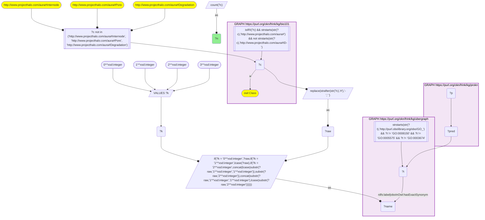
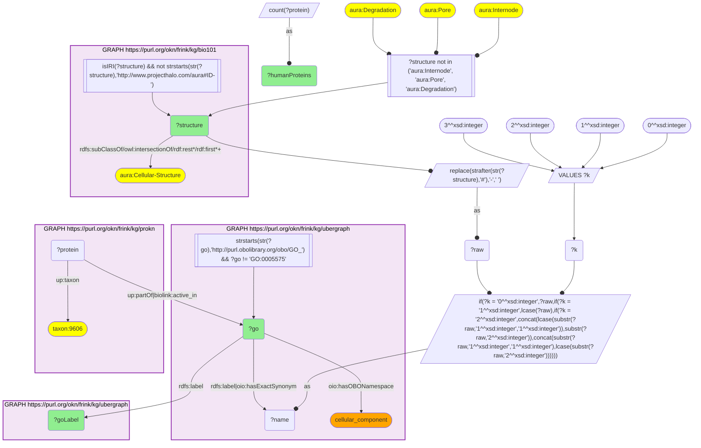
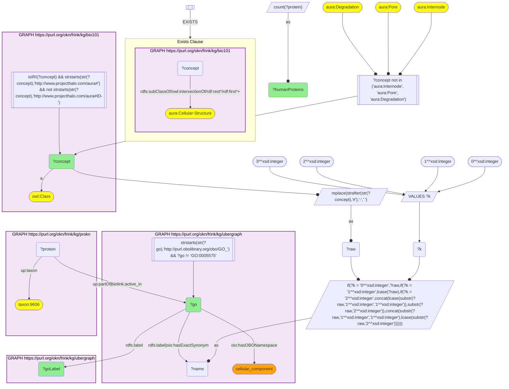
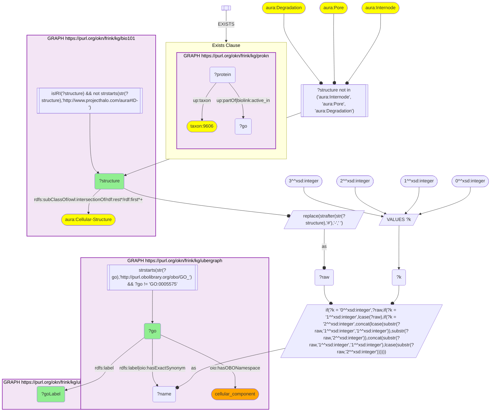
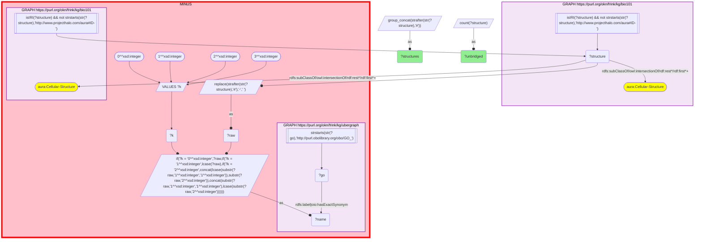
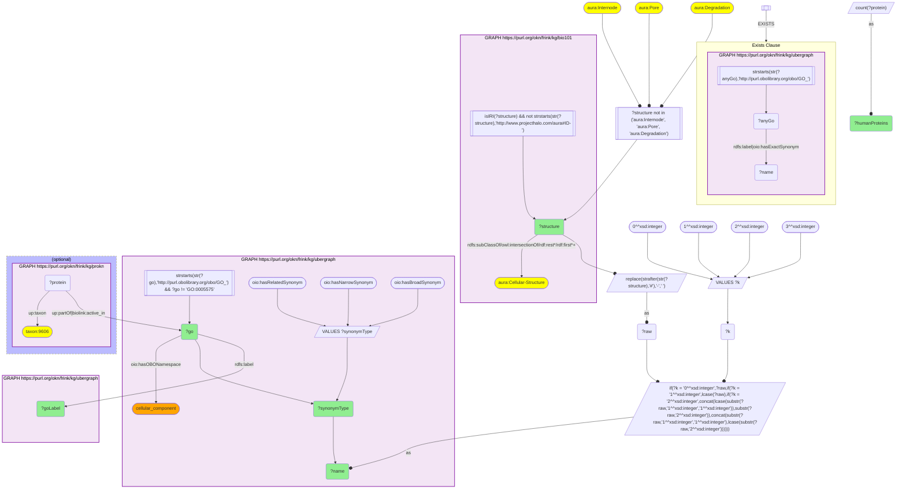
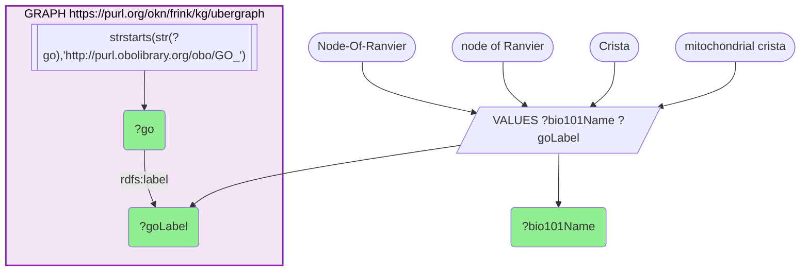
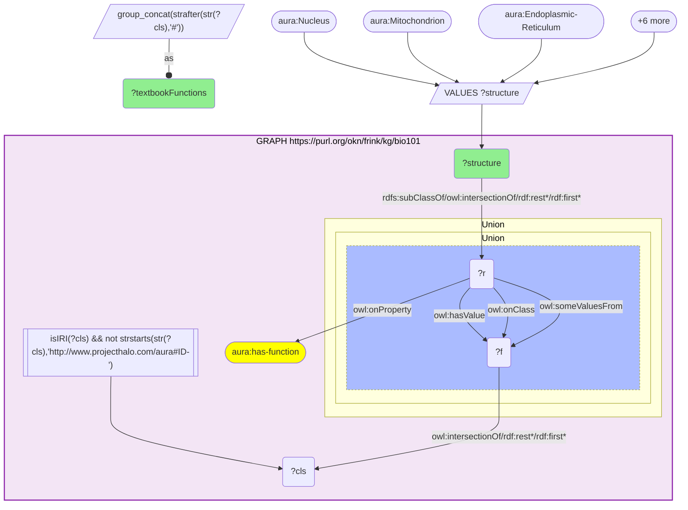

# MF02-Q2: Which KB Bio 101 cell structures carry the most human ProKN protein annotations through their matching GO cellular-component term (bio101 × prokn, GO label-bridged)

- **Date:** 2026-10-05
- **Model:** claude-opus-5-5
- **SPARQL endpoint:** https://apps.okn.us/federation/sparql
- **Generated by:** mcp-okn v0.1.0 (build 8efca43)
- **Contents:** 8 queries · 8 query diagrams

## Knowledge graphs used

- `bio101` — <https://purl.org/okn/frink/kg/bio101>
- `ubergraph` — <https://purl.org/okn/frink/kg/ubergraph>
- `prokn` — <https://purl.org/okn/frink/kg/prokn>

## Conversation

👤 **User**

Crosswalk: `bio101` × `prokn` on **GO (bio101 label), bridged through `ubergraph`** (crosswalk `KB1-go-label-bio101-prokn`, verified_count 310). bio101 (KB Bio 101, an OWL ontology of an introductory biology textbook) carries each concept only as an `owl:Class` IRI `http://www.projecthalo.com/aura#{Name}`. It has no `rdfs:label` and no external id, so the concept NAME is the key: the local name with hyphens turned into spaces, in four case forms (as-is, all lower-case, first letter lowered, and sentence case), matched as a literal against ubergraph's GO `rdfs:label` or `oboInOwl:hasExactSynonym`. prokn carries the resulting `GO_` IRI in object position on its human `up:Protein` nodes (cellular-component location annotations via `up:partOf` and `biolink:active_in`).

Research question: among the structures KB Bio 101 itself files as cell structures (descendants of `aura:Cellular-Structure`: mitochondrion, ribosome, lysosome and so on), which carry the most human ProKN protein annotations through their matching GO cellular-component term? Which familiar structures does the exact-name bridge, or the textbook's own classification, leave out?

Why the join is required: bio101 knows which structures a cell has and what each is for, but names no protein. ProKN knows where each human protein is located by GO cellular component, but has no textbook account of the cell. Only the concept-name → GO bridge through ubergraph lines up a textbook structure with the proteins found there.

---

🧠 **Assistant**

**The nucleus leads by a wide margin: 6,215 human ProKN proteins are located there. The mitochondrion (1,595), endoplasmic reticulum (1,140) and Golgi apparatus (1,042) follow, then the nucleolus (858) and cytoskeleton (764).** In all, 57 bio101 cell structures reach a GO cellular component carrying at least one human ProKN location annotation. They map to 56 distinct GO terms, because Cilium and Eukaryotic-Flagellum share GO:0005929. The Golgi apparatus, Barr body and X/Y chromosomes bridge through the recipe's sentence-case form ("Golgi apparatus", "Barr body", "X chromosome"), which keeps GO's leading capital. Three kinds of gap remain:

1. **bio101 does not file cytoplasm, cytosol, plasma membrane or membrane under Cellular-Structure.** These bridge fine and are the most heavily annotated components of all (4,948–5,916 proteins each), but they fall outside a "cell structures" scope taken from the textbook's own hierarchy.
2. **63 textbook cell structures match no GO name at all under the recipe.** The familiar ones are Basal-Body (GO has "basal body" only as a *broad* synonym of *ciliary basal body*, which carries 216 human proteins), Free-Ribosome and Bound-Ribosome, Crista (GO says *mitochondrial crista*), Node-Of-Ranvier (GO's "node of Ranvier" has a capital in the middle that no case form produces), Sister-Chromatid and Synaptic-Terminal.
3. **31 structures bridge to a GO component that has no human ProKN annotation.** Most are plant, prokaryote or protist structures (chloroplast, cell wall, plasmodesmata, pili), as expected for a human protein set.

**Step 1: the bridge is real (logged query 1).** The KB1 skeleton, with its four case forms, returns **310** bio101 concepts that reach a GO term prokn carries, which matches the catalog's verified_count.

**Step 2: the ranking (logged query 2).** The query takes bio101 classes that are transitively `rdfs:subClassOf` `aura:Cellular-Structure`, applies the recipe (label | exactSynonym, four case forms, the catalog's homonym exclusions, GO root excluded), restricts the match to GO terms whose `hasOBONamespace` is `cellular_component`, and counts distinct human (`up:taxon` 9606) ProKN proteins via `up:partOf | biolink:active_in`.

| Rank | bio101 structure | GO cellular component | Human ProKN proteins |
|---|---|---|---|
| 1 | Nucleus | GO:0005634 nucleus | 6,215 |
| 2 | Mitochondrion | GO:0005739 mitochondrion | 1,595 |
| 3 | Endoplasmic-Reticulum | GO:0005783 endoplasmic reticulum | 1,140 |
| 4 | Golgi-Apparatus | GO:0005794 Golgi apparatus | 1,042 |
| 5 | Nucleolus | GO:0005730 nucleolus | 858 |
| 6 | Cytoskeleton | GO:0005856 cytoskeleton | 764 |
| 7 | Centrosome | GO:0005813 centrosome | 582 |
| 8 | Chromosome | GO:0005694 chromosome | 534 |
| 9 | Axon | GO:0030424 axon | 373 |
| 10 | Cilium / Eukaryotic-Flagellum | GO:0005929 cilium | 360 |
| 11 | Microtubule | GO:0005874 microtubule | 345 |
| 12 | Lysosome | GO:0005764 lysosome | 326 |
| 13 | Spindle | GO:0005819 spindle | 238 |
| 14 | Ribosome | GO:0005840 ribosome | 205 |
| 15 | Intercellular-Junction | GO:0005911 cell-cell junction | 187 |
| 16 | Vesicle | GO:0031982 vesicle | 173 |
| 17 | Centriole | GO:0005814 centriole | 166 |
| 18 | Motile-Cilium | GO:0031514 motile cilium | 164 |
| 19 | Synaptic-Vesicle | GO:0008021 synaptic vesicle | 146 |
| 20 | Growth-Cone | GO:0030426 growth cone | 136 |
| 21 | Acrosome | GO:0001669 acrosomal vesicle | 132 |
| 22 | Peroxisome | GO:0005777 peroxisome | 123 |

The tail continues through mitotic spindle (112), transport vesicle (106), cell body (91), sarcomere (59), the rough and smooth ER (37 and 18), Barr body (5), the X and Y chromosomes (2 each), and so on down to aster (1). Several textbook structures bridge through an exact synonym rather than the GO label: Eukaryotic-Flagellum → *cilium*, Acrosome → *acrosomal vesicle*, Intercellular-Junction → *cell-cell junction*, Transverse-Tubule → *T-tubule*.

**Step 3: components the bridge reaches but bio101 does not call cell structures (logged query 3, top 15).** These are the same recipe and namespace with the opposite scope (bio101 concept *not* under `aura:Cellular-Structure`):

| bio101 concept | GO cellular component | Human ProKN proteins |
|---|---|---|
| Cytoplasm | GO:0005737 cytoplasm | 5,916 |
| Membrane | GO:0016020 membrane | 5,476 |
| Plasma-membrane | GO:0005886 plasma membrane | 5,211 |
| Cytosol | GO:0005829 cytosol | 4,948 |
| Synapse | GO:0045202 synapse | 658 |
| Mitochondrial-Matrix | GO:0005759 mitochondrial matrix | 451 |
| Dendrite | GO:0030425 dendrite | 428 |
| Lysosomal-membrane | GO:0005765 lysosomal membrane | 410 |
| Nuclear-Membrane | GO:0031965 nuclear membrane | 219 |
| Mitochondrial-Membrane | GO:0031966 mitochondrial membrane | 203 |
| Intermediate-Filament | GO:0005882 intermediate filament | 198 |
| Kinetochore | GO:0000776 kinetochore | 160 |
| Nuclear-Matrix | GO:0016363 nuclear matrix | 129 |
| Basement-Membrane | GO:0005604 basement membrane | 95 |
| Coated-Pit | GO:0005905 clathrin-coated pit | 72 |

**Step 4: structures that bridge but carry no human ProKN annotation (logged query 4).** 31 bio101 cell structures name-match a GO cellular component on which ProKN has no human location annotation:

- Plant structures: Chloroplast, Plastid, Amyloplast, Chromoplast, Thylakoid, Granum, Cell-Wall, Primary-Cell-Wall, Secondary-Cell-Wall, Plasmodesmata, Central-Vacuole, Glyoxysome, Phragmoplast, Preprophase-Band, Cell-Plate, Root-Hair.
- Prokaryote and protist or invertebrate structures: Capsule, Pili and Fimbria (both → *pilus*), Contractile-Vacuole, Food-Vacuole, Cnida, Nematocyst, Fertilization-Envelope.
- Three that hit an obsolete GO term: Chromatid (*obsolete chromatid*), Flagellum (*obsolete flagellum*), Polyribosome (*obsolete polysome*).
- Four that human cells certainly have: Nucleosome, Ribosomal-subunit, Large-Ribosomal-Subunit and Small-Ribosomal-Subunit. ProKN has no human annotation on these generic GO terms; human proteins are most likely annotated to more specific child terms instead, which this direct-term query does not reach.

**Step 5: structures the exact-name bridge does not reach at all (logged query 5).** 63 bio101 cell structures match no GO label or exact synonym in any of the four case forms. Many are grouping or textbook-only notions that GO has no component for (Animal-Cell-Structure, Eukaryotic-Cell-Structure, Chromosome-21, Maternal-Chromosome, Defective-Chromosome, F-Plasmid, Ti-Plasmid, Yeast-Artificial-Chromosome, X-Chromosome-Dominant). The familiar biological structures among them are Basal-Body, Free-Ribosome, Bound-Ribosome, Crista, Node-Of-Ranvier, Sister-Chromatid, Nonsister-chromatid, Synaptic-Terminal, Phospholipid-Bilayer, Cisterna, Non-Motile-Cilium, Plant-Cell-Wall and Septum.

**Step 6: why some familiar ones miss (logged queries 6 and 7, labelled diagnostics outside the recipe).** Four of the 63 reach a GO cellular component only through a related, narrow or broad synonym, which the recipe does not match:

| bio101 structure | Name | GO synonym type | GO cellular component | Human ProKN proteins |
|---|---|---|---|---|
| Basal-Body | "basal body" | broad | GO:0036064 ciliary basal body | 216 |
| Free-Ribosome | "free ribosome" | narrow | GO:0005840 ribosome | 205 |
| Plant-Cell-Wall | "plant cell wall" | narrow | GO:0009505 plant-type cell wall | 0 |
| Septum | "septum" | broad | GO:0030428 cell septum | 0 |

Two more miss for reasons no synonym type fixes. GO labels Crista as GO:0030061 *mitochondrial crista* (a longer name), and Node-Of-Ranvier as GO:0033268 *node of Ranvier*. That label has a lower-case start and a capital in the middle, a mixed case that none of the four forms ("Node Of Ranvier", "node of ranvier", "node Of Ranvier", "Node of ranvier") produces.

**Step 7: what the textbook says the leading structures are for (logged query 8, bio101 `aura:has-function`):**

| bio101 structure | Textbook function(s) | Human ProKN proteins |
|---|---|---|
| Nucleus | Synthesis-Of-RNA | 6,215 |
| Mitochondrion | Energy-Transformation-by-Organism, Eukaryotic-Pyruvate-Oxidation, Citric-Acid-Cycle-In-Eukaryote, Eukaryotic-Oxidative-Phosphorylation | 1,595 |
| Endoplasmic-Reticulum | Synthesis-Of-Lipid | 1,140 |
| Golgi-Apparatus | Produce, Create, Store, Release, Segregate, Distinguishing, Synthesis-Reaction, Chemical-Reaction | 1,042 |
| Nucleolus | Synthesis-Of-Ribosomal-Subunit | 858 |
| Cytoskeleton | Support | 764 |
| Lysosome | Intracellular-Digestion, Autophagy | 326 |
| Ribosome | Synthesis-Of-Protein | 205 |
| Peroxisome | Decomposition-Reaction, Chemical-Reaction | 123 |

**Reading the two sides together**

- **The ranking follows organelle size and how broadly GO curators annotate, not textbook emphasis.** The nucleus (6,215) holds about four times as many annotated proteins as the mitochondrion. Whole-compartment terms (nucleus, cytoplasm, membrane) collect broad localisation evidence, so they dominate any count of this kind.
- **The secretory pathway is now complete at the top.** The ER (1,140) and Golgi apparatus (1,042) sit side by side at ranks 3 and 4. The textbook gives the Golgi the longest list of functions of any structure here (produce, store, segregate, release), which fits its role as the sorting station between them.
- **The ribosome ranks surprisingly low (205) for a structure the textbook defines by protein synthesis.** This count is for the direct GO term *ribosome* only. Step 4 shows that bio101's ribosomal-subunit concepts bridge to generic GO subunit terms that carry no human annotation at all; most human ribosomal proteins are probably annotated to more specific child terms, which this query does not expand into with `subClassOf*`. The same applies to the lysosome (326): its membrane proteins sit on *lysosomal membrane* (410), a separate bio101 concept that bio101 does not file under Cellular-Structure.
- **The mitochondrion's textbook functions are the cellular-respiration stages.** These are Pyruvate-Oxidation, Citric-Acid-Cycle and Oxidative-Phosphorylation, in their eukaryotic subclasses. Its 1,595 located proteins are the compartment-level counterpart of those processes.

**Caveats**

- **Label-bridged, exact-name, lower bound.** bio101 has no identifiers, so the join depends on the concept name equalling a GO label or exact synonym, in one of four case forms. Names that GO records only as a related, narrow or broad synonym (Basal-Body, Free-Ribosome), that GO spells longer (Crista), or that carry a mid-name capital (Node-Of-Ranvier) are missed. Step 6 is a diagnostic, not part of the catalogued crosswalk. Three homonyms are excluded by the catalog (Internode, Pore, Degradation). Verify identity before asserting it.
- **Scope comes from the textbook.** "Cell structure" means a transitive subclass of `aura:Cellular-Structure` in bio101. That excludes cytoplasm, cytosol and the membranes, which Step 3 lists separately.
- **Direct GO term only.** Counts are distinct human proteins annotated to that exact cellular-component term via `up:partOf` or `biolink:active_in`. There is no expansion to GO descendants, so parent-child pairs (e.g. Spindle 238 and Mitotic-Spindle 112) are counted independently and overlap.
- **GO namespace filter.** Only GO terms with `hasOBONamespace` `cellular_component` were kept, so a structure name that also matches a GO process is not double-counted here.

## SPARQL queries executed

#### Query 1

_2026-10-06T00:10:14+00:00 · `bio101`, `ubergraph`, `prokn`_

```sparql
SELECT (COUNT(DISTINCT ?c) AS ?n) WHERE {
  { SELECT DISTINCT ?c ?t WHERE {
  { SELECT DISTINCT ?c ?name WHERE {
      GRAPH <https://purl.org/okn/frink/kg/bio101> { ?c a <http://www.w3.org/2002/07/owl#Class> .
        FILTER(isIRI(?c) && STRSTARTS(STR(?c),'http://www.projecthalo.com/aura#') && !STRSTARTS(STR(?c),'http://www.projecthalo.com/aura#ID-')) }
      FILTER(?c NOT IN (<http://www.projecthalo.com/aura#Internode>, <http://www.projecthalo.com/aura#Pore>, <http://www.projecthalo.com/aura#Degradation>))  # homonyms (spot-checked 2026-10-05)
      BIND(REPLACE(STRAFTER(STR(?c),'#'),'-',' ') AS ?raw)
      VALUES ?k { 0 1 2 3 }  # as-is, all lower, first letter lowered, sentence case
      BIND(IF(?k = 0, ?raw, IF(?k = 1, LCASE(?raw), IF(?k = 2, CONCAT(LCASE(SUBSTR(?raw,1,1)),SUBSTR(?raw,2)),
                CONCAT(SUBSTR(?raw,1,1),LCASE(SUBSTR(?raw,2)))))) AS ?name)
  } }
    GRAPH <https://purl.org/okn/frink/kg/ubergraph> { ?t <http://www.w3.org/2000/01/rdf-schema#label>|<http://www.geneontology.org/formats/oboInOwl#hasExactSynonym> ?name .
      FILTER(STRSTARTS(STR(?t),'http://purl.obolibrary.org/obo/GO_') && ?t != <http://purl.obolibrary.org/obo/GO_0008150> && ?t != <http://purl.obolibrary.org/obo/GO_0005575> && ?t != <http://purl.obolibrary.org/obo/GO_0003674>) }
  } }
  GRAPH <https://purl.org/okn/frink/kg/prokn> { ?p ?pred ?t . }
}
```



_1 row(s)_

| n |
| --- |
| 310 |

#### Query 2

_2026-10-06T00:10:26+00:00 · `bio101`, `ubergraph`, `prokn`_

```sparql
PREFIX aura: <http://www.projecthalo.com/aura#>
PREFIX owl:  <http://www.w3.org/2002/07/owl#>
PREFIX rdf:  <http://www.w3.org/1999/02/22-rdf-syntax-ns#>
PREFIX rdfs: <http://www.w3.org/2000/01/rdf-schema#>
PREFIX oio:  <http://www.geneontology.org/formats/oboInOwl#>
PREFIX up:   <http://purl.uniprot.org/core/>
PREFIX biolink: <https://w3id.org/biolink/vocab/>
# KB1 recipe (four case forms), scoped to what bio101 itself files under aura:Cellular-Structure; GO cellular_component terms only; human ProKN location annotations
SELECT ?structure ?go ?goLabel (COUNT(DISTINCT ?protein) AS ?humanProteins) WHERE {
  { SELECT DISTINCT ?structure ?go WHERE {
    { SELECT DISTINCT ?structure ?name WHERE {
        GRAPH <https://purl.org/okn/frink/kg/bio101> {
          ?structure (rdfs:subClassOf/(owl:intersectionOf/rdf:rest*/rdf:first)*)+ aura:Cellular-Structure .
          FILTER(isIRI(?structure) && !STRSTARTS(STR(?structure), "http://www.projecthalo.com/aura#ID-")) }
        FILTER(?structure NOT IN (aura:Internode, aura:Pore, aura:Degradation))
        BIND(REPLACE(STRAFTER(STR(?structure),'#'),'-',' ') AS ?raw)
        VALUES ?k { 0 1 2 3 }  # as-is, all lower, first letter lowered, sentence case
        BIND(IF(?k = 0, ?raw, IF(?k = 1, LCASE(?raw), IF(?k = 2, CONCAT(LCASE(SUBSTR(?raw,1,1)),SUBSTR(?raw,2)),
                  CONCAT(SUBSTR(?raw,1,1),LCASE(SUBSTR(?raw,2)))))) AS ?name)
    } }
    GRAPH <https://purl.org/okn/frink/kg/ubergraph> { ?go rdfs:label|oio:hasExactSynonym ?name .
      FILTER(STRSTARTS(STR(?go),'http://purl.obolibrary.org/obo/GO_') && ?go != <http://purl.obolibrary.org/obo/GO_0005575>)
      ?go oio:hasOBONamespace "cellular_component" }
  } }
  GRAPH <https://purl.org/okn/frink/kg/ubergraph> { ?go rdfs:label ?goLabel }
  GRAPH <https://purl.org/okn/frink/kg/prokn> { ?protein up:partOf|biolink:active_in ?go ; up:taxon <http://purl.uniprot.org/taxonomy/9606> . }
} GROUP BY ?structure ?go ?goLabel ORDER BY DESC(?humanProteins)
```



_57 row(s) — showing first 3_

| structure | go | goLabel | humanProteins |
| --- | --- | --- | --- |
| http://www.projecthalo.com/aura#Nucleus | http://purl.obolibrary.org/obo/GO_0005634 | nucleus | 6215 |
| http://www.projecthalo.com/aura#Mitochondrion | http://purl.obolibrary.org/obo/GO_0005739 | mitochondrion | 1595 |
| http://www.projecthalo.com/aura#Endoplasmic-Reticulum | http://purl.obolibrary.org/obo/GO_0005783 | endoplasmic reticulum | 1140 |

#### Query 3

_2026-10-06T00:10:38+00:00 · `bio101`, `ubergraph`, `prokn`_

```sparql
PREFIX aura: <http://www.projecthalo.com/aura#>
PREFIX owl:  <http://www.w3.org/2002/07/owl#>
PREFIX rdf:  <http://www.w3.org/1999/02/22-rdf-syntax-ns#>
PREFIX rdfs: <http://www.w3.org/2000/01/rdf-schema#>
PREFIX oio:  <http://www.geneontology.org/formats/oboInOwl#>
PREFIX up:   <http://purl.uniprot.org/core/>
PREFIX biolink: <https://w3id.org/biolink/vocab/>
# Recipe-bridged (four case forms) GO cellular_component terms whose bio101 concept is NOT filed under aura:Cellular-Structure (top 15)
SELECT ?concept ?go ?goLabel (COUNT(DISTINCT ?protein) AS ?humanProteins) WHERE {
  { SELECT DISTINCT ?concept ?go WHERE {
    { SELECT DISTINCT ?concept ?name WHERE {
        GRAPH <https://purl.org/okn/frink/kg/bio101> { ?concept a owl:Class .
          FILTER(isIRI(?concept) && STRSTARTS(STR(?concept),'http://www.projecthalo.com/aura#') && !STRSTARTS(STR(?concept),'http://www.projecthalo.com/aura#ID-')) }
        FILTER(?concept NOT IN (aura:Internode, aura:Pore, aura:Degradation))
        BIND(REPLACE(STRAFTER(STR(?concept),'#'),'-',' ') AS ?raw)
        VALUES ?k { 0 1 2 3 }  # as-is, all lower, first letter lowered, sentence case
        BIND(IF(?k = 0, ?raw, IF(?k = 1, LCASE(?raw), IF(?k = 2, CONCAT(LCASE(SUBSTR(?raw,1,1)),SUBSTR(?raw,2)),
                  CONCAT(SUBSTR(?raw,1,1),LCASE(SUBSTR(?raw,2)))))) AS ?name)
    } }
    GRAPH <https://purl.org/okn/frink/kg/ubergraph> { ?go rdfs:label|oio:hasExactSynonym ?name .
      FILTER(STRSTARTS(STR(?go),'http://purl.obolibrary.org/obo/GO_') && ?go != <http://purl.obolibrary.org/obo/GO_0005575>)
      ?go oio:hasOBONamespace "cellular_component" }
    FILTER NOT EXISTS { GRAPH <https://purl.org/okn/frink/kg/bio101> { ?concept (rdfs:subClassOf/(owl:intersectionOf/rdf:rest*/rdf:first)*)+ aura:Cellular-Structure } }
  } }
  GRAPH <https://purl.org/okn/frink/kg/ubergraph> { ?go rdfs:label ?goLabel }
  GRAPH <https://purl.org/okn/frink/kg/prokn> { ?protein up:partOf|biolink:active_in ?go ; up:taxon <http://purl.uniprot.org/taxonomy/9606> . }
} GROUP BY ?concept ?go ?goLabel ORDER BY DESC(?humanProteins) LIMIT 15
```



_15 row(s) — showing first 3_

| concept | go | goLabel | humanProteins |
| --- | --- | --- | --- |
| http://www.projecthalo.com/aura#Cytoplasm | http://purl.obolibrary.org/obo/GO_0005737 | cytoplasm | 5916 |
| http://www.projecthalo.com/aura#Membrane | http://purl.obolibrary.org/obo/GO_0016020 | membrane | 5476 |
| http://www.projecthalo.com/aura#Plasma-membrane | http://purl.obolibrary.org/obo/GO_0005886 | plasma membrane | 5211 |

#### Query 4

_2026-10-06T00:10:55+00:00 · `bio101`, `ubergraph`, `prokn`_

```sparql
PREFIX aura: <http://www.projecthalo.com/aura#>
PREFIX owl:  <http://www.w3.org/2002/07/owl#>
PREFIX rdf:  <http://www.w3.org/1999/02/22-rdf-syntax-ns#>
PREFIX rdfs: <http://www.w3.org/2000/01/rdf-schema#>
PREFIX oio:  <http://www.geneontology.org/formats/oboInOwl#>
PREFIX up:   <http://purl.uniprot.org/core/>
PREFIX biolink: <https://w3id.org/biolink/vocab/>
# bio101 Cellular-Structure descendants that DO name-match a GO cellular component (four case forms) but carry no human ProKN location annotation on it
SELECT ?structure ?go ?goLabel WHERE {
  { SELECT DISTINCT ?structure ?go WHERE {
    { SELECT DISTINCT ?structure ?name WHERE {
        GRAPH <https://purl.org/okn/frink/kg/bio101> {
          ?structure (rdfs:subClassOf/(owl:intersectionOf/rdf:rest*/rdf:first)*)+ aura:Cellular-Structure .
          FILTER(isIRI(?structure) && !STRSTARTS(STR(?structure), "http://www.projecthalo.com/aura#ID-")) }
        FILTER(?structure NOT IN (aura:Internode, aura:Pore, aura:Degradation))
        BIND(REPLACE(STRAFTER(STR(?structure),'#'),'-',' ') AS ?raw)
        VALUES ?k { 0 1 2 3 }  # as-is, all lower, first letter lowered, sentence case
        BIND(IF(?k = 0, ?raw, IF(?k = 1, LCASE(?raw), IF(?k = 2, CONCAT(LCASE(SUBSTR(?raw,1,1)),SUBSTR(?raw,2)),
                  CONCAT(SUBSTR(?raw,1,1),LCASE(SUBSTR(?raw,2)))))) AS ?name) } }
    GRAPH <https://purl.org/okn/frink/kg/ubergraph> { ?go rdfs:label|oio:hasExactSynonym ?name .
      FILTER(STRSTARTS(STR(?go),'http://purl.obolibrary.org/obo/GO_') && ?go != <http://purl.obolibrary.org/obo/GO_0005575>)
      ?go oio:hasOBONamespace "cellular_component" }
  } }
  GRAPH <https://purl.org/okn/frink/kg/ubergraph> { ?go rdfs:label ?goLabel }
  FILTER NOT EXISTS { GRAPH <https://purl.org/okn/frink/kg/prokn> { ?protein up:partOf|biolink:active_in ?go ; up:taxon <http://purl.uniprot.org/taxonomy/9606> . } }
} ORDER BY ?structure
```



_31 row(s) — showing first 3_

| structure | go | goLabel |
| --- | --- | --- |
| http://www.projecthalo.com/aura#Amyloplast | http://purl.obolibrary.org/obo/GO_0009501 | amyloplast |
| http://www.projecthalo.com/aura#Capsule | http://purl.obolibrary.org/obo/GO_0042603 | capsule |
| http://www.projecthalo.com/aura#Cell-Plate | http://purl.obolibrary.org/obo/GO_0009504 | cell plate |

#### Query 5

_2026-10-06T00:10:57+00:00 · `bio101`, `ubergraph`_

```sparql
PREFIX aura: <http://www.projecthalo.com/aura#>
PREFIX owl:  <http://www.w3.org/2002/07/owl#>
PREFIX rdf:  <http://www.w3.org/1999/02/22-rdf-syntax-ns#>
PREFIX rdfs: <http://www.w3.org/2000/01/rdf-schema#>
PREFIX oio:  <http://www.geneontology.org/formats/oboInOwl#>
# bio101 Cellular-Structure descendants whose name, in none of the recipe's four case forms, equals ANY GO label or exact synonym (the exact-name bridge's genuine misses)
SELECT (COUNT(DISTINCT ?structure) AS ?unbridged) (GROUP_CONCAT(DISTINCT STRAFTER(STR(?structure),'#'); separator=", ") AS ?structures) WHERE {
  GRAPH <https://purl.org/okn/frink/kg/bio101> {
    ?structure (rdfs:subClassOf/(owl:intersectionOf/rdf:rest*/rdf:first)*)+ aura:Cellular-Structure .
    FILTER(isIRI(?structure) && !STRSTARTS(STR(?structure), "http://www.projecthalo.com/aura#ID-")) }
  MINUS {
    { SELECT DISTINCT ?structure WHERE {
      { SELECT DISTINCT ?structure ?name WHERE {
        GRAPH <https://purl.org/okn/frink/kg/bio101> {
          ?structure (rdfs:subClassOf/(owl:intersectionOf/rdf:rest*/rdf:first)*)+ aura:Cellular-Structure .
          FILTER(isIRI(?structure) && !STRSTARTS(STR(?structure), "http://www.projecthalo.com/aura#ID-")) }
        BIND(REPLACE(STRAFTER(STR(?structure),'#'),'-',' ') AS ?raw)
        VALUES ?k { 0 1 2 3 }  # as-is, all lower, first letter lowered, sentence case
        BIND(IF(?k = 0, ?raw, IF(?k = 1, LCASE(?raw), IF(?k = 2, CONCAT(LCASE(SUBSTR(?raw,1,1)),SUBSTR(?raw,2)),
                  CONCAT(SUBSTR(?raw,1,1),LCASE(SUBSTR(?raw,2)))))) AS ?name) } }
      GRAPH <https://purl.org/okn/frink/kg/ubergraph> { ?go rdfs:label|oio:hasExactSynonym ?name . FILTER(STRSTARTS(STR(?go),'http://purl.obolibrary.org/obo/GO_')) }
    } }
  }
}
```



_1 row(s)_

| unbridged | structures |
| --- | --- |
| 63 | Algal-Cell-Wall, Animal-Cell-Centrosome, Animal-Cell-Structure, Animal-Mitotic-Spindle, Animal-Statolith, Basal-Body, Bound-Ribosome, Chromosomal-Arrangement, Chromosome-21, Chromosome-Fragment, Cisterna, Condensed-Diploid-Chromosome, Crista, Defective-Chromosome, Diploid-Chromosome, DNA-Double-Helix, Duplication, Eukaryotic-Cell-Structure, Eukaryotic-Chromatin, Eukaryotic-Chromosome, Eukaryotic-Cilium, Eukaryotic-Ribosome, F-Plasmid, Free-Ribosome, Fungal-Cell-Wall, Homologous-chromosome, Human-Chromosome, Intracellular-Material, Looped-Domains, Maternal-Chromosome, Metaphase-Chromatin, Neuron-Structure, Node-Of-Ranvier, Non-Homologous-Chromosome, Non-Motile-Cilium, Nonkinetochore-Microtubule, Nonsister-chromatid, Paternal-Chromosome, Phospholipid-Bilayer, Plant-Cell-Structure, Plant-Cell-Wall, Plant-Statolith, Plasmid, Platelet, Prokaryotic-Cell-Structure, Prokaryotic-Chromatin, Prokaryotic-Chromosome, Prokaryotic-Cilium, Prokaryotic-Flagellum, Prokaryotic-Ribosome, R-Plasmid, Recombinant-Chromosome, Semiautonomous-Organelle, Septum, Sex-Pili, Sex-Pilus, Sister-Chromatid, Statocyst, Synaptic-Terminal, Ti-Plasmid, X-Chromosome-Dominant, X-Chromosome-Recessive, Yeast-Artificial-Chromosome |

#### Query 6

_2026-10-06T00:11:17+00:00 · `bio101`, `ubergraph`, `prokn`_

```sparql
PREFIX aura: <http://www.projecthalo.com/aura#>
PREFIX owl:  <http://www.w3.org/2002/07/owl#>
PREFIX rdf:  <http://www.w3.org/1999/02/22-rdf-syntax-ns#>
PREFIX rdfs: <http://www.w3.org/2000/01/rdf-schema#>
PREFIX oio:  <http://www.geneontology.org/formats/oboInOwl#>
PREFIX up:   <http://purl.uniprot.org/core/>
PREFIX biolink: <https://w3id.org/biolink/vocab/>
# Diagnostic, OUTSIDE the KB1 recipe: do any Cellular-Structure names (four case forms) reach a GO cellular component only through a related / narrow / broad synonym (which the recipe does not match)?
SELECT ?structure ?name ?synonymType ?go ?goLabel (COUNT(DISTINCT ?protein) AS ?humanProteins) WHERE {
  { SELECT DISTINCT ?structure ?name ?synonymType ?go WHERE {
    { SELECT DISTINCT ?structure ?name WHERE {
        GRAPH <https://purl.org/okn/frink/kg/bio101> {
          ?structure (rdfs:subClassOf/(owl:intersectionOf/rdf:rest*/rdf:first)*)+ aura:Cellular-Structure .
          FILTER(isIRI(?structure) && !STRSTARTS(STR(?structure), "http://www.projecthalo.com/aura#ID-")) }
        FILTER(?structure NOT IN (aura:Internode, aura:Pore, aura:Degradation))
        BIND(REPLACE(STRAFTER(STR(?structure),'#'),'-',' ') AS ?raw)
        VALUES ?k { 0 1 2 3 }  # as-is, all lower, first letter lowered, sentence case
        BIND(IF(?k = 0, ?raw, IF(?k = 1, LCASE(?raw), IF(?k = 2, CONCAT(LCASE(SUBSTR(?raw,1,1)),SUBSTR(?raw,2)),
                  CONCAT(SUBSTR(?raw,1,1),LCASE(SUBSTR(?raw,2)))))) AS ?name) } }
    GRAPH <https://purl.org/okn/frink/kg/ubergraph> {
      VALUES ?synonymType { oio:hasRelatedSynonym oio:hasNarrowSynonym oio:hasBroadSynonym }
      ?go ?synonymType ?name .
      FILTER(STRSTARTS(STR(?go),'http://purl.obolibrary.org/obo/GO_') && ?go != <http://purl.obolibrary.org/obo/GO_0005575>)
      ?go oio:hasOBONamespace "cellular_component" }
    FILTER NOT EXISTS { GRAPH <https://purl.org/okn/frink/kg/ubergraph> { ?anyGo rdfs:label|oio:hasExactSynonym ?name . FILTER(STRSTARTS(STR(?anyGo),'http://purl.obolibrary.org/obo/GO_')) } }
  } }
  GRAPH <https://purl.org/okn/frink/kg/ubergraph> { ?go rdfs:label ?goLabel }
  OPTIONAL { GRAPH <https://purl.org/okn/frink/kg/prokn> { ?protein up:partOf|biolink:active_in ?go ; up:taxon <http://purl.uniprot.org/taxonomy/9606> . } }
} GROUP BY ?structure ?name ?synonymType ?go ?goLabel ORDER BY DESC(?humanProteins)
```



_4 row(s) — showing first 3_

| structure | name | synonymType | go | goLabel | humanProteins |
| --- | --- | --- | --- | --- | --- |
| http://www.projecthalo.com/aura#Basal-Body | basal body | http://www.geneontology.org/formats/oboInOwl#hasBroadSynonym | http://purl.obolibrary.org/obo/GO_0036064 | ciliary basal body | 216 |
| http://www.projecthalo.com/aura#Free-Ribosome | free ribosome | http://www.geneontology.org/formats/oboInOwl#hasNarrowSynonym | http://purl.obolibrary.org/obo/GO_0005840 | ribosome | 205 |
| http://www.projecthalo.com/aura#Plant-Cell-Wall | plant cell wall | http://www.geneontology.org/formats/oboInOwl#hasNarrowSynonym | http://purl.obolibrary.org/obo/GO_0009505 | plant-type cell wall | 0 |

#### Query 7

_2026-10-06T00:11:17+00:00 · `ubergraph`_

```sparql
PREFIX rdfs: <http://www.w3.org/2000/01/rdf-schema#>
# Diagnostic: the GO labels of two familiar unbridged structures, Node-Of-Ranvier and Crista. Neither label is any of the four case forms of the bio101 name.
SELECT ?bio101Name ?go ?goLabel WHERE {
  VALUES (?bio101Name ?goLabel) { ("Node-Of-Ranvier" "node of Ranvier") ("Crista" "mitochondrial crista") }
  GRAPH <https://purl.org/okn/frink/kg/ubergraph> { ?go rdfs:label ?goLabel . FILTER(STRSTARTS(STR(?go),'http://purl.obolibrary.org/obo/GO_')) }
}
```



_2 row(s)_

| bio101Name | go | goLabel |
| --- | --- | --- |
| Crista | http://purl.obolibrary.org/obo/GO_0030061 | mitochondrial crista |
| Node-Of-Ranvier | http://purl.obolibrary.org/obo/GO_0033268 | node of Ranvier |

#### Query 8

_2026-10-06T00:11:21+00:00 · `bio101`_

```sparql
PREFIX aura: <http://www.projecthalo.com/aura#>
PREFIX owl:  <http://www.w3.org/2002/07/owl#>
PREFIX rdf:  <http://www.w3.org/1999/02/22-rdf-syntax-ns#>
PREFIX rdfs: <http://www.w3.org/2000/01/rdf-schema#>
# What the textbook says the leading structures are FOR (bio101 aura:has-function restrictions)
SELECT ?structure (GROUP_CONCAT(DISTINCT STRAFTER(STR(?cls), "#"); separator=", ") AS ?textbookFunctions)
WHERE {
  VALUES ?structure { aura:Nucleus aura:Mitochondrion aura:Endoplasmic-Reticulum aura:Golgi-Apparatus aura:Nucleolus aura:Cytoskeleton aura:Lysosome aura:Ribosome aura:Peroxisome }
  GRAPH <https://purl.org/okn/frink/kg/bio101> {
    ?structure rdfs:subClassOf/(owl:intersectionOf/rdf:rest*/rdf:first)* ?r .
    ?r owl:onProperty aura:has-function .
    { ?r owl:someValuesFrom ?f } UNION { ?r owl:onClass ?f } UNION { ?r owl:hasValue ?f }
    ?f (owl:intersectionOf/rdf:rest*/rdf:first)* ?cls .
    FILTER(isIRI(?cls) && !STRSTARTS(STR(?cls), "http://www.projecthalo.com/aura#ID-"))
  } } GROUP BY ?structure ORDER BY ?structure
```



_9 row(s) — showing first 5_

| structure | textbookFunctions |
| --- | --- |
| http://www.projecthalo.com/aura#Cytoskeleton | Support |
| http://www.projecthalo.com/aura#Endoplasmic-Reticulum | Synthesis-Of-Lipid |
| http://www.projecthalo.com/aura#Golgi-Apparatus | Distinguishing, Store, Chemical-Reaction, Segregate, Synthesis-Reaction, Create, Produce, Release |
| http://www.projecthalo.com/aura#Lysosome | Intracellular-Digestion, Autophagy |
| http://www.projecthalo.com/aura#Mitochondrion | Energy-Transformation-by-Organism, Eukaryotic-Oxidative-Phosphorylation, Citric-Acid-Cycle-In-Eukaryote, Eukaryotic-Pyruvate-Oxidation |
