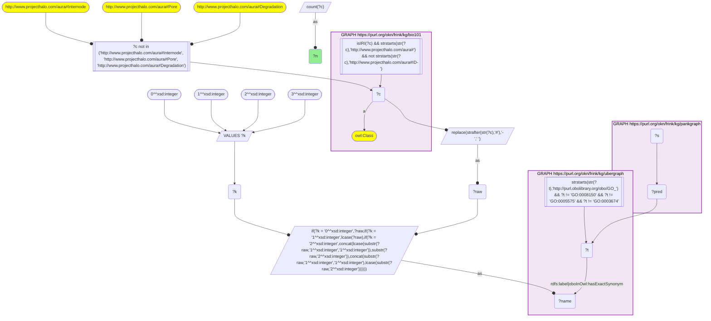
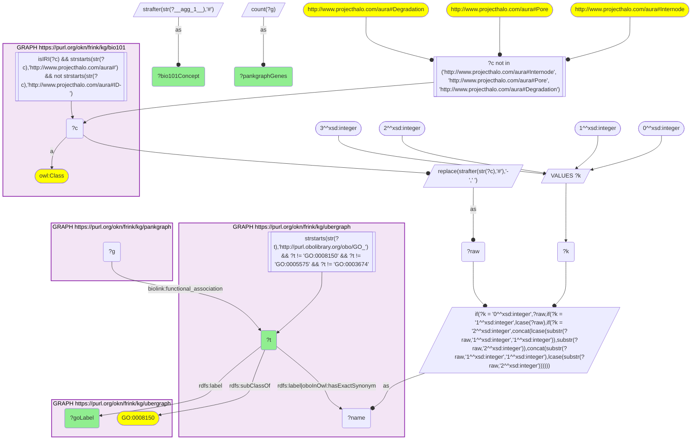
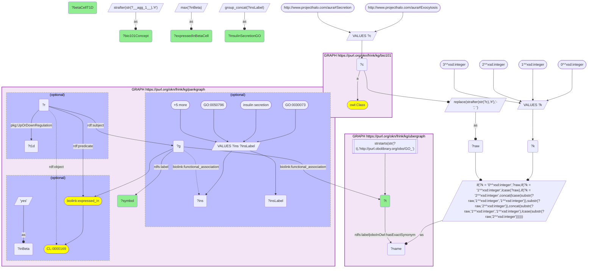
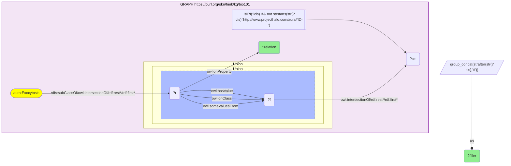
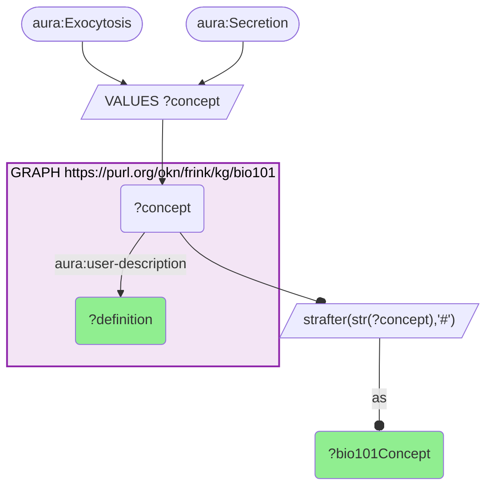

# KB Bio 101 textbook processes matched by name to GO terms on PanKgraph genes, with exocytosis as the insulin-release case

- **Date:** 2026-10-05
- **Model:** claude-opus-5-5
- **SPARQL endpoint:** https://apps.okn.us/federation/sparql
- **Generated by:** mcp-okn v0.1.0 (build 8efca43)
- **Contents:** 5 queries · 5 query diagrams

## Knowledge graphs used

- `bio101` — <https://purl.org/okn/frink/kg/bio101>
- `ubergraph` — <https://purl.org/okn/frink/kg/ubergraph>
- `pankgraph` — <https://purl.org/okn/frink/kg/pankgraph>

## Conversation

👤 **User**

Crosswalk: `bio101` × `pankgraph` on **GO (bio101 label), bridged through `ubergraph`** (crosswalk `KB2-go-label-bio101-pankgraph`, verified_count 201). bio101 (KB Bio 101, the OWL encoding of an introductory biology textbook) names each concept by its class IRI `http://www.projecthalo.com/aura#{Name}` and carries no rdfs:label, cross-reference or external id, so the concept NAME is the only key: the local name, hyphens turned into spaces, in four case forms (as-is, all lower-case, first letter lowered, and sentence case), is matched as a bound literal against ubergraph's GO `rdfs:label` / `oboInOwl:hasExactSynonym`. pankgraph (PanKgraph, the pancreatic-islet / diabetes knowledge graph) carries the resulting GO IRI in object position, in obo form, on `biolink:functional_association` from its Ensembl genes, which carry their HGNC symbols as `rdfs:label`.

Research question: Which KB Bio 101 textbook processes match GO biological-process terms that pankgraph's genes are annotated with, and, for exocytosis (the mechanism by which a beta cell releases insulin), which genes does pankgraph place on that term, how many of them are islet (beta-cell) genes, and what does the textbook say the process is?

Why the join is required: bio101 knows what a process IS in textbook terms (its inputs, path, instrument and sub-steps, encoded only as OWL restrictions) but names no gene. pankgraph knows which human genes are annotated to the process and which are expressed, or differentially expressed in type 1 diabetes, in islet beta cells, but has no textbook account. Neither graph shares an identifier with the other; only ubergraph's GO labels connect a textbook concept name to the GO IRI pankgraph stores.

---

🧠 **Assistant**

**100 KB Bio 101 textbook processes reach pankgraph's gene annotations through GO.** The crosswalk skeleton reproduces its verified count exactly: **201 bio101 concepts** match, by exact name, a GO term that pankgraph carries. Restricting the bridged GO term to the biological_process branch in ubergraph leaves **100 textbook processes on 98 GO process terms** (two GO terms are each reached by two textbook names). The other 101 concepts are mostly cellular components such as Membrane, Nucleus or Mitochondrion, which I left out of this question. The sentence-case name form (first letter kept, rest lower-cased) adds no process: the five concepts only it reaches are all cell parts (Golgi-Apparatus, X-Chromosome, Y-Chromosome, A-Band, Barr-Body).

### The textbook processes with the largest pankgraph gene sets

| bio101 concept | GO term (ubergraph label) | pankgraph genes |
| --- | --- | --- |
| Signal-Transduction | GO:0007165 signal transduction | 1,158 |
| Cell-Differentiation | GO:0030154 cell differentiation | 712 |
| Transmembrane-Transport | GO:0055085 transmembrane transport | 459 |
| Nervous-System-Development | GO:0007399 nervous system development | 434 |
| Olfaction | GO:0007608 sensory perception of smell | 373 |
| Immune-Response | GO:0006955 immune response | 359 |
| Inflammatory-Response | GO:0006954 inflammatory response | 349 |
| Spermatogenesis | GO:0007283 spermatogenesis | 349 |
| Cell-Division | GO:0051301 cell division | 282 |
| Translation | GO:0006412 translation | 248 |
| Regulation-Of-Cell-Cycle | GO:0051726 regulation of cell cycle | 186 |
| Autophagy | GO:0006914 autophagy | 169 |
| Endocytosis | GO:0006897 endocytosis | 164 |
| Gene-Expression | GO:0010467 gene expression | 150 |
| Methylation | GO:0032259 methylation | 144 |
| Protein-Folding | GO:0006457 protein folding | 142 |
| Chemotaxis | GO:0006935 chemotaxis | 119 |
| Mitotic-Cell-Cycle | GO:0000278 mitotic cell cycle | 106 |
| **Exocytosis** | **GO:0006887 exocytosis** | **101** |
| Morphogenesis | GO:0009653 anatomical structure morphogenesis | 98 |

The list runs down to single-gene matches (Detoxification, Nuclear-Division, Reflex). Several matches go through a GO exact synonym rather than the primary label: Olfaction to *sensory perception of smell*, Bone-Formation to *ossification*, Protein-Breakdown to *protein catabolic process*, Gestation to *female pregnancy*, Thermoregulation to *temperature homeostasis*. Anabolism and Synthesis both land on *biosynthetic process*, and Associative-Learning and Classical-Conditioning both land on *associative learning*.

### Exocytosis: the textbook mechanism beside pankgraph's genes

**What bio101 says.** The textbook defines exocytosis as "the durable process by which a cell directs the contents of secretory vesicles out of the cell membrane. These membrane-bound vesicles contain soluble proteins to be secreted to the extracellular environment, as well as membrane proteins and lipids that are sent to become components of the cell membrane." Its OWL restrictions spell out the mechanism:

| bio101 relation | Filler |
| --- | --- |
| object | Organic-Molecule (a Molecule, a Tangible-Entity) |
| origin | Cytoplasm |
| path | Plasma-membrane (a Biomembrane) |
| destination | Extracellular-Side, Outside-Face |
| instrument | Transport-Vesicle |
| is-function-of | Plasma-membrane |
| raw-material | Chemical-Energy; Organic-Molecule |
| in-event-of | Secretor |
| first-subevent | Produce |
| subevent | Produce, Carry, Make-Contact, Fusion, Rearrangement, Release, Consume |

The parent concept Secretion is defined in bio101 only as "Secretion occurs when a ceullar product is exported from the cell" (sic).

**What pankgraph places on GO:0006887.** The bridge reaches **101 pankgraph genes** annotated with *exocytosis*:

ANK1, ARFGEF1, ARHGAP44, BAIAP3, BRSK2, CADPS2, CCL3, CCL5, CCL8, CCR1, CDK16, CPLANE2, CPLX1, CPLX2, CPLX3, DOC2B, EXOC1, EXOC3L1, EXOC3L2, EXOC3L4, EXOC4, EXOC5, EXOC6, EXOC6B, EXOC7, EXOC8, GCGR, HAP1, JAGN1, KCNQ3, LGI3, LIN7A, LIN7B, LIN7C, LLGL1, LLGL2, MIA3, NKD2, NLRP5, NSF, PAK1, PIK3C2A, PIP5K1C, RAB10, RAB11A, RAB13, RAB25, RAB27A, RAB3A, RAB3B, RAB3D, RAB3IL1, RAB3IP, RAB40A, RAB40AL, RAB40B, RAB8A, RAB8B, RIMS1, RIMS2, RIMS3, RIMS4, RPH3A, RPH3AL, SCAMP1, SCAMP5, SNAP23, SNAP25, SNAP47, SNAPIN, SNX19, SRCIN1, STX11, STX17, STX19, STX2, STX3, STXBP1, STXBP2, STXBP3, STXBP5, STXBP5L, SYT10, SYT7, SYTL1, SYTL2, SYTL3, SYTL4, TMEM63B, TNFAIP2, TRIM72, TXLNA, UNC13A, UNC13B, UNC13C, UNC13D, VAMP2, VAMP3, WASHC1, WASHC3, WIPF3

Of these, pankgraph itself says:

- **79 of 101** (78%) have a PanKbase expression record in beta cells (`biolink:expressed_in` CL:0000169, type B pancreatic cell).
- **13 of 101** are also annotated in pankgraph to an insulin-secretion GO term:

| Gene | Insulin-secretion annotation in pankgraph | Beta-cell expression record |
| --- | --- | --- |
| SNAP25 | regulation of; positive regulation of insulin secretion | yes |
| SYTL4 | insulin secretion; negative regulation of insulin secretion | no |
| CPLX1 | insulin secretion | yes |
| RAB3A | insulin secretion | yes |
| RIMS2 | insulin secretion | yes |
| SNX19 | insulin secretion | yes |
| STXBP3 | insulin secretion | yes |
| CPLX3 | insulin secretion | no |
| SYT7 | regulation of insulin secretion | yes |
| CCL5 | regulation of insulin secretion | no |
| RPH3AL | positive regulation of insulin secretion | yes |
| DOC2B | positive regulation of insulin secretion | no |
| STXBP5L | negative regulation of insulin secretion | yes |

- **7 of 101** are called differentially expressed in type 1 diabetes beta cells by PanKbase (the reified `expressed_in` statement's `UpOrDownRegulation`): **downregulated** GCGR, JAGN1, LLGL2, RAB13, RAB25; **upregulated** PAK1, TMEM63B.

**Reading the two side by side** (my interpretation; neither graph links a gene to a textbook sub-step). The textbook's sub-steps line up with recognisable gene families in pankgraph's list. The *instrument* Transport-Vesicle and the *Carry* step correspond to the vesicle-trafficking Rab GTPases and effectors (RAB3A/B/D, RAB8A/B, RAB10, RAB11A, RAB27A, RAB3IP, RAB3IL1, RPH3A, RPH3AL). *Make-Contact* corresponds to tethering and priming (the exocyst EXOC1/4/5/6/6B/7/8 and EXOC3L1/3L2/3L4, RIMS1 to 4, UNC13A to D, CADPS2, BAIAP3). *Fusion* with the plasma membrane corresponds to the SNARE core (SNAP25, SNAP23, SNAP47, STX2/3/11/17/19, VAMP2, VAMP3) with its regulators (STXBP1/2/3/5/5L, CPLX1/2/3, NSF, SNAPIN). *Release* corresponds to the calcium sensors (SYT7, SYT10, SYTL1 to 4, DOC2B). The 13 insulin-secretion genes are spread across these groups: 5 in fusion (SNAP25, CPLX1, CPLX3, STXBP3, STXBP5L), 3 calcium sensors (SYT7, SYTL4, DOC2B), 2 Rab-side (RAB3A, RPH3AL) and 1 in priming (RIMS2), plus SNX19 and the chemokine CCL5, which fit none of the textbook steps.

The textbook concept **Secretion** also bridges (GO:0046903 *secretion*), but pankgraph puts only **7 genes** on that exact term: CA2, CA9, FBLN5, PRKCI, RIMS1, TPD52, UNC13D. RIMS1 and UNC13D are shared with exocytosis, 4 of the 7 have a beta-cell expression record, and none carries an insulin-secretion annotation.

### Caveats

- **Label-bridged, exact-name lower bound.** bio101 has no identifiers, so every match is a concept name, in one of four case forms, equal to a GO label or exact synonym. Spelling variants, and textbook names that are only related or broad synonyms, are missed. Three homonyms (Internode, Pore, Degradation) are excluded in the skeleton. Synonym matches such as Olfaction to *sensory perception of smell* are correct here, but the bridge asserts name equality, not identity, so check any match before relying on it.
- **Direct annotations only.** Gene counts are genes annotated in pankgraph to that exact GO term. They are not propagated up the GO hierarchy. This is why textbook Secretion reaches only 7 genes: islet genes are annotated to specific children such as *insulin secretion*, which the exact-name join does not walk. Expanding each bridged term with ubergraph `rdfs:subClassOf*` would give larger sets.
- **pankgraph's gene catalogue is genome-wide.** pankgraph annotates Ensembl genes in general, which is why spermatogenesis and olfaction appear among the largest sets. Islet relevance comes from pankgraph's own PanKbase beta-cell records (79 of the exocytosis genes), not from the GO join. A beta-cell expression record is not thresholded for expression level.
- **The textbook account is generic.** bio101 describes exocytosis for any cell and any organic-molecule cargo. It does not mention insulin, beta cells or any gene. The pairing is conceptual: a textbook account placed beside a gene set.

Sources: bio101 (concept names, definitions, OWL restrictions), ubergraph (GO labels, exact synonyms and the biological_process branch), pankgraph (gene GO annotations, PanKbase beta-cell expression and T1D differential-expression calls).

## SPARQL queries executed

#### Query 1

_2026-10-06T00:06:49+00:00 · `bio101`, `ubergraph`, `pankgraph`_

```sparql
SELECT (COUNT(DISTINCT ?c) AS ?n) WHERE {
  { SELECT DISTINCT ?c ?t WHERE {
  { SELECT DISTINCT ?c ?name WHERE {
      GRAPH <https://purl.org/okn/frink/kg/bio101> { ?c a <http://www.w3.org/2002/07/owl#Class> .
        FILTER(isIRI(?c) && STRSTARTS(STR(?c),'http://www.projecthalo.com/aura#') && !STRSTARTS(STR(?c),'http://www.projecthalo.com/aura#ID-')) }
      FILTER(?c NOT IN (<http://www.projecthalo.com/aura#Internode>, <http://www.projecthalo.com/aura#Pore>, <http://www.projecthalo.com/aura#Degradation>))  # homonyms (spot-checked 2026-10-05)
      BIND(REPLACE(STRAFTER(STR(?c),'#'),'-',' ') AS ?raw)
      VALUES ?k { 0 1 2 3 }  # as-is, all lower, first letter lowered, sentence case
      BIND(IF(?k = 0, ?raw, IF(?k = 1, LCASE(?raw), IF(?k = 2, CONCAT(LCASE(SUBSTR(?raw,1,1)),SUBSTR(?raw,2)),
                CONCAT(SUBSTR(?raw,1,1),LCASE(SUBSTR(?raw,2)))))) AS ?name)
  } }
    GRAPH <https://purl.org/okn/frink/kg/ubergraph> { ?t <http://www.w3.org/2000/01/rdf-schema#label>|<http://www.geneontology.org/formats/oboInOwl#hasExactSynonym> ?name .
      FILTER(STRSTARTS(STR(?t),'http://purl.obolibrary.org/obo/GO_') && ?t != <http://purl.obolibrary.org/obo/GO_0008150> && ?t != <http://purl.obolibrary.org/obo/GO_0005575> && ?t != <http://purl.obolibrary.org/obo/GO_0003674>) }
  } }
  GRAPH <https://purl.org/okn/frink/kg/pankgraph> { ?s ?pred ?t . }
}
```



_1 row(s)_

| n |
| --- |
| 201 |

#### Query 2

_2026-10-06T00:07:09+00:00 · `bio101`, `ubergraph`, `pankgraph`_

```sparql
PREFIX biolink: <https://w3id.org/biolink/vocab/>
PREFIX rdfs: <http://www.w3.org/2000/01/rdf-schema#>
# bio101 textbook PROCESSES (bridged GO term is a GO biological_process) and their pankgraph gene sets
SELECT (STRAFTER(STR(?c),'#') AS ?bio101Concept) ?t ?goLabel (COUNT(DISTINCT ?g) AS ?pankgraphGenes) WHERE {
  { SELECT DISTINCT ?c ?t WHERE {
  { SELECT DISTINCT ?c ?name WHERE {
      GRAPH <https://purl.org/okn/frink/kg/bio101> { ?c a <http://www.w3.org/2002/07/owl#Class> .
        FILTER(isIRI(?c) && STRSTARTS(STR(?c),'http://www.projecthalo.com/aura#') && !STRSTARTS(STR(?c),'http://www.projecthalo.com/aura#ID-')) }
      FILTER(?c NOT IN (<http://www.projecthalo.com/aura#Internode>, <http://www.projecthalo.com/aura#Pore>, <http://www.projecthalo.com/aura#Degradation>))
      BIND(REPLACE(STRAFTER(STR(?c),'#'),'-',' ') AS ?raw)
      VALUES ?k { 0 1 2 3 }  # as-is, all lower, first letter lowered, sentence case
      BIND(IF(?k = 0, ?raw, IF(?k = 1, LCASE(?raw), IF(?k = 2, CONCAT(LCASE(SUBSTR(?raw,1,1)),SUBSTR(?raw,2)),
                CONCAT(SUBSTR(?raw,1,1),LCASE(SUBSTR(?raw,2)))))) AS ?name)
  } }
    GRAPH <https://purl.org/okn/frink/kg/ubergraph> { ?t <http://www.w3.org/2000/01/rdf-schema#label>|<http://www.geneontology.org/formats/oboInOwl#hasExactSynonym> ?name .
      FILTER(STRSTARTS(STR(?t),'http://purl.obolibrary.org/obo/GO_') && ?t != <http://purl.obolibrary.org/obo/GO_0008150> && ?t != <http://purl.obolibrary.org/obo/GO_0005575> && ?t != <http://purl.obolibrary.org/obo/GO_0003674>) }
  } }
  GRAPH <https://purl.org/okn/frink/kg/ubergraph> { ?t rdfs:subClassOf <http://purl.obolibrary.org/obo/GO_0008150> ; rdfs:label ?goLabel . }
  GRAPH <https://purl.org/okn/frink/kg/pankgraph> { ?g biolink:functional_association ?t . }
} GROUP BY ?c ?t ?goLabel ORDER BY DESC(?pankgraphGenes) ?bio101Concept
```



_100 row(s) — showing first 3_

```csv
bio101Concept,t,goLabel,pankgraphGenes
Signal-Transduction,http://purl.obolibrary.org/obo/GO_0007165,signal transduction,1158
Cell-Differentiation,http://purl.obolibrary.org/obo/GO_0030154,cell differentiation,712
Transmembrane-Transport,http://purl.obolibrary.org/obo/GO_0055085,transmembrane transport,459
```

#### Query 3

_2026-10-06T00:07:30+00:00 · `bio101`, `ubergraph`, `pankgraph`_

```sparql
PREFIX biolink: <https://w3id.org/biolink/vocab/>
PREFIX rdfs: <http://www.w3.org/2000/01/rdf-schema#>
PREFIX rdf: <http://www.w3.org/1999/02/22-rdf-syntax-ns#>
PREFIX pkg: <https://purl.org/okn/frink/kg/pankgraph/schema/>
# Zoom: bio101 Exocytosis / Secretion -> (name bridge) -> GO term -> pankgraph genes,
# with each gene's insulin-secretion GO annotations and its beta-cell (CL:0000169) record in pankgraph
SELECT (STRAFTER(STR(?c),'#') AS ?bio101Concept) ?t ?symbol
       (GROUP_CONCAT(DISTINCT ?insLabel; separator="; ") AS ?insulinSecretionGO)
       (MAX(?inBeta) AS ?expressedInBetaCell) (SAMPLE(?t1d) AS ?betaCellT1D)
WHERE {
  { SELECT DISTINCT ?c ?t WHERE {
  { SELECT DISTINCT ?c ?name WHERE {
      VALUES ?c { <http://www.projecthalo.com/aura#Exocytosis> <http://www.projecthalo.com/aura#Secretion> }
      GRAPH <https://purl.org/okn/frink/kg/bio101> { ?c a <http://www.w3.org/2002/07/owl#Class> . }
      BIND(REPLACE(STRAFTER(STR(?c),'#'),'-',' ') AS ?raw)
      VALUES ?k { 0 1 2 3 }  # as-is, all lower, first letter lowered, sentence case
      BIND(IF(?k = 0, ?raw, IF(?k = 1, LCASE(?raw), IF(?k = 2, CONCAT(LCASE(SUBSTR(?raw,1,1)),SUBSTR(?raw,2)),
                CONCAT(SUBSTR(?raw,1,1),LCASE(SUBSTR(?raw,2)))))) AS ?name)
  } }
    GRAPH <https://purl.org/okn/frink/kg/ubergraph> { ?t <http://www.w3.org/2000/01/rdf-schema#label>|<http://www.geneontology.org/formats/oboInOwl#hasExactSynonym> ?name .
      FILTER(STRSTARTS(STR(?t),'http://purl.obolibrary.org/obo/GO_')) }
  } }
  GRAPH <https://purl.org/okn/frink/kg/pankgraph> {
    ?g biolink:functional_association ?t ; rdfs:label ?symbol .
    OPTIONAL { VALUES (?ins ?insLabel) { (<http://purl.obolibrary.org/obo/GO_0030073> "insulin secretion")
                                         (<http://purl.obolibrary.org/obo/GO_0050796> "regulation of insulin secretion")
                                         (<http://purl.obolibrary.org/obo/GO_0032024> "positive regulation of insulin secretion")
                                         (<http://purl.obolibrary.org/obo/GO_0046676> "negative regulation of insulin secretion") }
               ?g biolink:functional_association ?ins . }
    OPTIONAL { ?g biolink:expressed_in <http://purl.obolibrary.org/obo/CL_0000169> . BIND("yes" AS ?inBeta) }
    OPTIONAL { ?r rdf:subject ?g ; rdf:predicate biolink:expressed_in ; rdf:object <http://purl.obolibrary.org/obo/CL_0000169> ;
                  pkg:UpOrDownRegulation ?t1d . }
  }
} GROUP BY ?c ?t ?symbol ORDER BY ?bio101Concept DESC(COUNT(DISTINCT ?ins)) ?symbol
```



_108 row(s) — showing first 3_

| bio101Concept | t | symbol | insulinSecretionGO | expressedInBetaCell | betaCellT1D |
| --- | --- | --- | --- | --- | --- |
| Exocytosis | http://purl.obolibrary.org/obo/GO_0006887 | SNAP25 | regulation of insulin secretion; positive regulation of insulin secretion | yes |  |
| Exocytosis | http://purl.obolibrary.org/obo/GO_0006887 | SYTL4 | negative regulation of insulin secretion; insulin secretion |  |  |
| Exocytosis | http://purl.obolibrary.org/obo/GO_0006887 | CCL5 | regulation of insulin secretion |  |  |

#### Query 4

_2026-10-06T00:07:48+00:00 · `bio101`_

```sparql
PREFIX aura: <http://www.projecthalo.com/aura#>
PREFIX owl:  <http://www.w3.org/2002/07/owl#>
PREFIX rdf:  <http://www.w3.org/1999/02/22-rdf-syntax-ns#>
PREFIX rdfs: <http://www.w3.org/2000/01/rdf-schema#>
# bio101's textbook account of Exocytosis (its OWL restrictions: what moves, from where, to where, by what, in which steps)
SELECT ?relation (GROUP_CONCAT(DISTINCT STRAFTER(STR(?cls), "#"); separator=" & ") AS ?filler)
WHERE { GRAPH <https://purl.org/okn/frink/kg/bio101> {
  aura:Exocytosis rdfs:subClassOf/(owl:intersectionOf/rdf:rest*/rdf:first)* ?r .
  ?r owl:onProperty ?relation .
  { ?r owl:someValuesFrom ?f } UNION { ?r owl:onClass ?f } UNION { ?r owl:hasValue ?f }
  ?f (owl:intersectionOf/rdf:rest*/rdf:first)* ?cls .
  FILTER(isIRI(?cls) && !STRSTARTS(STR(?cls), "http://www.projecthalo.com/aura#ID-"))
} } GROUP BY ?r ?relation ORDER BY ?relation ?filler
```



_20 row(s) — showing first 3_

```csv
relation,filler
http://www.projecthalo.com/aura#base,Cell & Tangible-Entity
http://www.projecthalo.com/aura#destination,Extracellular-Side & Outside-Face
http://www.projecthalo.com/aura#direction,Angle-Value
```

#### Query 5

_2026-10-06T00:08:01+00:00 · `bio101`_

```sparql
PREFIX aura: <http://www.projecthalo.com/aura#>
# bio101's textbook definitions of the two secretion-side concepts that reach pankgraph
SELECT (STRAFTER(STR(?concept),'#') AS ?bio101Concept) ?definition WHERE {
  VALUES ?concept { aura:Exocytosis aura:Secretion }
  GRAPH <https://purl.org/okn/frink/kg/bio101> { ?concept aura:user-description ?definition }
}
```



_2 row(s)_

| bio101Concept | definition |
| --- | --- |
| Exocytosis | Exocytosis is the durable process by which a cell directs the contents of secretory vesicles out of the cell membrane. These membrane-bound vesicles contain soluble proteins to be secreted to the extracellular environment, as well as membrane proteins and lipids that are sent to become components of the cell membrane. |
| Secretion | Secretion occurs when a ceullar product is exported from the cell . |
