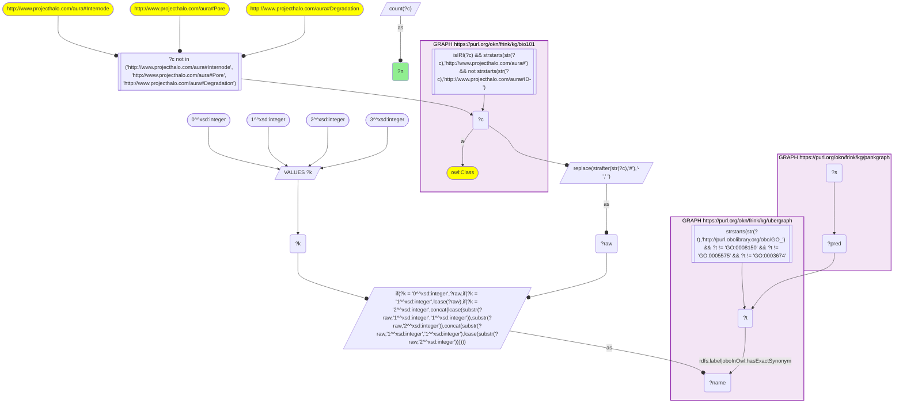
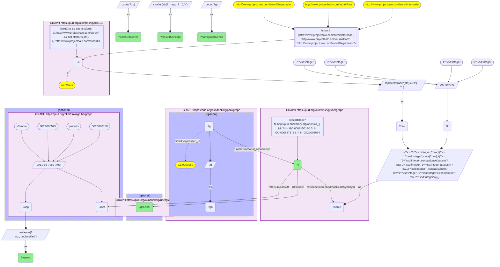
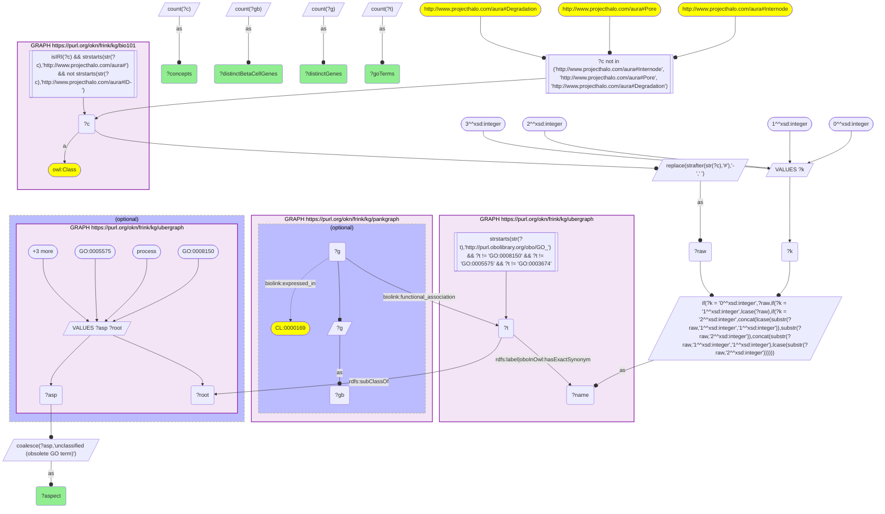
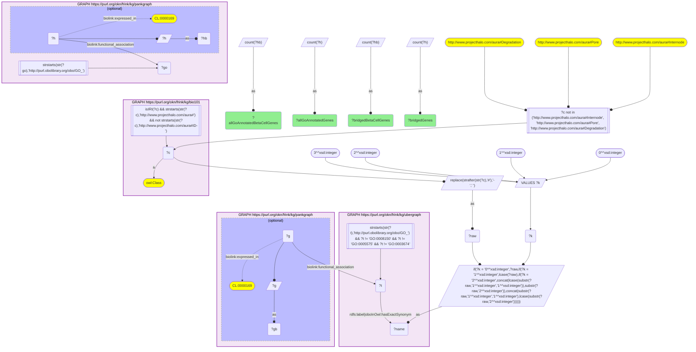
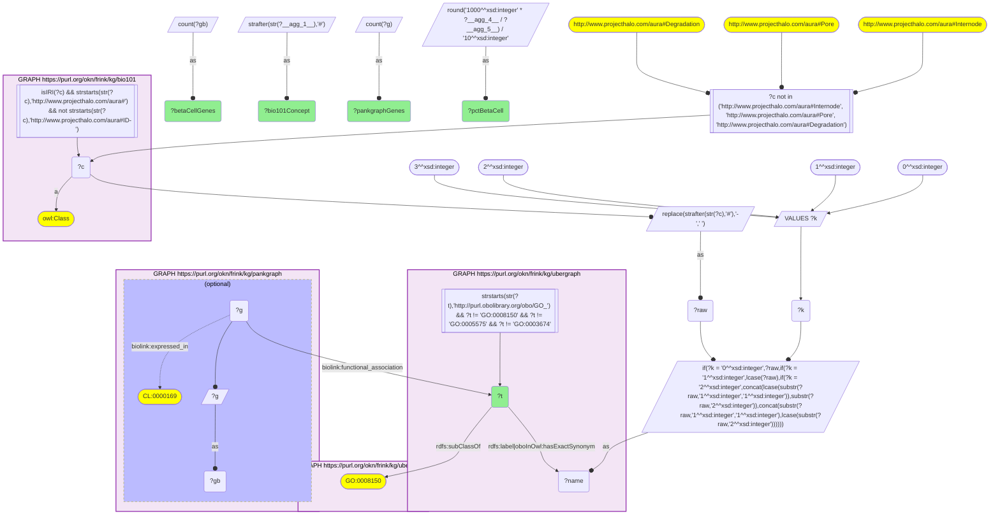

# Which KB Bio 101 textbook concepts carry the largest PanKgraph islet gene sets through GO

- **Date:** 2026-10-05
- **Model:** claude-opus-5-5
- **SPARQL endpoint:** https://apps.okn.us/federation/sparql
- **Generated by:** mcp-okn v0.1.0 (build 8efca43)
- **Contents:** 5 queries · 5 query diagrams

## Knowledge graphs used

- `bio101` — <https://purl.org/okn/frink/kg/bio101>
- `ubergraph` — <https://purl.org/okn/frink/kg/ubergraph>
- `pankgraph` — <https://purl.org/okn/frink/kg/pankgraph>

## Conversation

👤 **User**

Crosswalk: `bio101` × `pankgraph` on **GO (bio101 label), bridged through `ubergraph`** (crosswalk `KB2-go-label-bio101-pankgraph`, verified_count 201). bio101 (KB Bio 101, the OWL encoding of an introductory biology textbook) names each concept by its class IRI `http://www.projecthalo.com/aura#{Name}` and carries no rdfs:label, cross-reference or external id, so the concept NAME is the only key: the local name, hyphens turned into spaces, in four case forms (as-is, all lower-case, first letter lowered, and sentence case), is matched as a bound literal against ubergraph's GO `rdfs:label` / `oboInOwl:hasExactSynonym`. pankgraph (PanKgraph, the pancreatic-islet / diabetes knowledge graph) carries the resulting GO IRI in object position, in obo form, on `biolink:functional_association` from its Ensembl genes, and records PanKbase single-cell expression of each gene in islet cell types on `biolink:expressed_in` (beta cells = CL:0000169).

Research question: Of the KB Bio 101 textbook concepts that reach pankgraph through GO, which carry the largest gene sets, and which carry the largest islet gene sets, counting only genes with a PanKbase beta-cell expression record? How much of pankgraph's GO-annotated gene catalogue does the textbook vocabulary reach at all?

Why the join is required: bio101 supplies the textbook vocabulary (cell parts and processes as a student first meets them) but no genes. pankgraph supplies the genes, their GO annotations and their islet expression, but no textbook framing. Only ubergraph's GO labels and exact synonyms connect a textbook concept name to the GO IRI pankgraph stores, so sizing each textbook concept by its islet gene set needs all three graphs.

---

🧠 **Assistant**

**The largest gene sets belong to textbook cell parts, not processes.** The crosswalk skeleton reproduces its verified count exactly: **201 bio101 concepts** reach a GO term that pankgraph carries. Ranked by the number of distinct pankgraph genes annotated to that GO term, the top five are all cellular components: **Membrane (5,395 genes), Cytoplasm (5,367), Nucleus (4,961), Plasma-membrane (4,107) and Cytosol (4,051)**. The first textbook *process* is **Signal-Transduction (1,158 genes)**, in ninth place. **Golgi-Apparatus (1,069 genes)** ranks eleventh; it is one of five concepts (with X-Chromosome, Y-Chromosome, A-Band and Barr-Body) that only the sentence-case name form reaches, because GO writes it *Golgi apparatus*.

Counting only islet genes (those with a PanKbase beta-cell expression record), the order changes at the top: **Cytoplasm leads with 4,179 beta-cell genes**, ahead of Nucleus (3,951), Membrane (3,425) and Cytosol (3,262).

### The 30 largest bridged concepts

| # | bio101 concept | GO term | Aspect | pankgraph genes | of which beta-cell | % beta-cell |
| --- | --- | --- | --- | --- | --- | --- |
| 1 | Membrane | GO:0016020 membrane | component | 5,395 | 3,425 | 63.5 |
| 2 | Cytoplasm | GO:0005737 cytoplasm | component | 5,367 | 4,179 | 77.9 |
| 3 | Nucleus | GO:0005634 nucleus | component | 4,961 | 3,951 | 79.6 |
| 4 | Plasma-membrane | GO:0005886 plasma membrane | component | 4,107 | 2,248 | 54.7 |
| 5 | Cytosol | GO:0005829 cytosol | component | 4,051 | 3,262 | 80.5 |
| 6 | Nucleolus | GO:0005730 nucleolus | component | 1,345 | 606 | 45.1 |
| 7 | Mitochondrion | GO:0005739 mitochondrion | component | 1,279 | 1,109 | 86.7 |
| 8 | Endoplasmic-Reticulum | GO:0005783 endoplasmic reticulum | component | 1,222 | 923 | 75.5 |
| 9 | Signal-Transduction | GO:0007165 signal transduction | process | 1,158 | 633 | 54.7 |
| 10 | Cytoskeleton | GO:0005856 cytoskeleton | component | 1,130 | 917 | 81.2 |
| 11 | Golgi-Apparatus | GO:0005794 Golgi apparatus | component | 1,069 | 842 | 78.8 |
| 12 | Cell-Differentiation | GO:0030154 cell differentiation | process | 712 | 422 | 59.3 |
| 13 | Synapse | GO:0045202 synapse | component | 698 | 518 | 74.2 |
| 14 | Chromosome | GO:0005694 chromosome | component | 507 | 385 | 75.9 |
| 15 | Centrosome | GO:0005813 centrosome | component | 470 | 417 | 88.7 |
| 16 | Transmembrane-Transport | GO:0055085 transmembrane transport | process | 459 | 292 | 63.6 |
| 17 | Nervous-System-Development | GO:0007399 nervous system development | process | 434 | 294 | 67.7 |
| 18 | Dendrite | GO:0030425 dendrite | component | 377 | 276 | 73.2 |
| 19 | Olfaction | GO:0007608 sensory perception of smell | process | 373 | 9 | 2.4 |
| 20 | Lysosome | GO:0005764 lysosome | component | 364 | 292 | 80.2 |
| 21 | Immune-Response | GO:0006955 immune response | process | 359 | 92 | 25.6 |
| 22 | Inflammatory-Response | GO:0006954 inflammatory response | process | 349 | 154 | 44.1 |
| 23 | Spermatogenesis | GO:0007283 spermatogenesis | process | 349 | 224 | 64.2 |
| 24 | Ribosome | GO:0005840 ribosome | component | 340 | 146 | 42.9 |
| 25 | Axon | GO:0030424 axon | component | 331 | 249 | 75.2 |
| 26 | Mitochondrial-Matrix | GO:0005759 mitochondrial matrix | component | 312 | 279 | 89.4 |
| 27 | Lysosomal-membrane | GO:0005765 lysosomal membrane | component | 293 | 243 | 82.9 |
| 28 | Cell-Division | GO:0051301 cell division | process | 282 | 239 | 84.8 |
| 29 | Microtubule | GO:0005874 microtubule | component | 268 | 222 | 82.8 |
| 30 | Cilium | GO:0005929 cilium | component | 254 | 200 | 78.7 |
| 30 | Eukaryotic-Flagellum | GO:0005929 cilium | component | 254 | 200 | 78.7 |

Cilium and Eukaryotic-Flagellum are two textbook names for one GO term (*flagellum* is an exact synonym of GO *cilium*), so they tie for 30th place.

### Textbook processes ranked by islet gene set

Restricting to the 100 bridged concepts whose GO term is a biological process and ranking by beta-cell genes:

| # | bio101 concept | pankgraph genes | beta-cell genes | % beta-cell |
| --- | --- | --- | --- | --- |
| 1 | Signal-Transduction | 1,158 | 633 | 54.7 |
| 2 | Cell-Differentiation | 712 | 422 | 59.3 |
| 3 | Nervous-System-Development | 434 | 294 | 67.7 |
| 4 | Transmembrane-Transport | 459 | 292 | 63.6 |
| 5 | Cell-Division | 282 | 239 | 84.8 |
| 6 | Spermatogenesis | 349 | 224 | 64.2 |
| 7 | Translation | 248 | 211 | 85.1 |
| 8 | Regulation-Of-Cell-Cycle | 186 | 156 | 83.9 |
| 9 | Inflammatory-Response | 349 | 154 | 44.1 |
| 10 | Autophagy | 169 | 151 | 89.3 |
| 11 | Endocytosis | 164 | 140 | 85.4 |
| 12 | Methylation | 144 | 121 | 84.0 |
| 13 | Protein-Folding | 142 | 119 | 83.8 |
| 14 | Gene-Expression | 150 | 102 | 68.0 |
| 15 | Immune-Response | 359 | 92 | 25.6 |

Ranking by islet genes moves housekeeping processes up (Translation, Autophagy, Endocytosis and Cell-Division are 85 to 89% beta-cell) and pushes Olfaction out entirely: 373 genes, only 9 of them with a beta-cell record. Olfactory receptor genes are annotated but not expressed in islets, so the raw count overstates the textbook concept's islet relevance.

### How much of pankgraph the textbook vocabulary reaches

| GO aspect of the bridged term | bio101 concepts | GO terms | distinct pankgraph genes | of which beta-cell |
| --- | --- | --- | --- | --- |
| cellular component | 97 | 96 | 13,810 | 8,871 |
| biological process | 100 | 98 | 5,366 | 3,298 |
| molecular function | 3 | 3 | 36 | 11 |
| not under any GO root in ubergraph | 1 | 1 | 1 | 1 |
| **all 201 concepts (union)** | **201** | **198** | **14,183** | **8,993** |

pankgraph annotates **16,828 genes** with at least one obo GO term, and **9,533** of them have a beta-cell expression record. The 201 textbook concepts therefore reach **14,183 of 16,828 GO-annotated genes (84.3%)** and **8,993 of 9,533 beta-cell genes (94.3%)**. That is only through direct annotation to one of 198 GO terms. Nearly all of the reach comes from a few broad cell-part terms, while the 100 textbook processes reach 5,366 genes between them.

### Caveats

- **Label-bridged, exact-name lower bound.** bio101 has no identifiers, so every match is a concept name, in one of four case forms, equal to a GO label or exact synonym. Spelling variants, and textbook names that are only related or broad synonyms, are missed. Three homonyms (Internode, Pore, Degradation) are excluded in the skeleton. The bridge asserts name equality, not identity, so check a match before relying on it.
- **Direct annotations only.** A concept's gene set is the genes annotated in pankgraph to exactly that GO term. Annotations are not propagated up the GO hierarchy. Broad terms such as *membrane* or *cytoplasm* are large because annotators use them directly; a specific textbook concept can look small because its genes are annotated to child terms the exact-name join does not walk.
- **"Islet" here means a PanKbase beta-cell expression record.** pankgraph's gene catalogue is genome-wide, which is why spermatogenesis and olfaction rank high on raw counts. The beta-cell column counts genes with any `biolink:expressed_in` CL:0000169 record. It is not thresholded for expression level, and it ignores alpha, delta and other islet cell types.
- **Two textbook names can share one GO term** (Cilium and Eukaryotic-Flagellum here), so concept counts (201) exceed GO-term counts (198).

Sources: bio101 (concept names), ubergraph (GO labels, exact synonyms and the three GO roots), pankgraph (gene GO annotations and PanKbase beta-cell expression records).

## SPARQL queries executed

#### Query 1

_2026-10-06T00:10:51+00:00 · `bio101`, `ubergraph`, `pankgraph`_

```sparql
SELECT (COUNT(DISTINCT ?c) AS ?n) WHERE {
  { SELECT DISTINCT ?c ?t WHERE {
  { SELECT DISTINCT ?c ?name WHERE {
      GRAPH <https://purl.org/okn/frink/kg/bio101> { ?c a <http://www.w3.org/2002/07/owl#Class> .
        FILTER(isIRI(?c) && STRSTARTS(STR(?c),'http://www.projecthalo.com/aura#') && !STRSTARTS(STR(?c),'http://www.projecthalo.com/aura#ID-')) }
      FILTER(?c NOT IN (<http://www.projecthalo.com/aura#Internode>, <http://www.projecthalo.com/aura#Pore>, <http://www.projecthalo.com/aura#Degradation>))  # homonyms (spot-checked 2026-10-05)
      BIND(REPLACE(STRAFTER(STR(?c),'#'),'-',' ') AS ?raw)
      VALUES ?k { 0 1 2 3 }  # as-is, all lower, first letter lowered, sentence case
      BIND(IF(?k = 0, ?raw, IF(?k = 1, LCASE(?raw), IF(?k = 2, CONCAT(LCASE(SUBSTR(?raw,1,1)),SUBSTR(?raw,2)),
                CONCAT(SUBSTR(?raw,1,1),LCASE(SUBSTR(?raw,2)))))) AS ?name)
  } }
    GRAPH <https://purl.org/okn/frink/kg/ubergraph> { ?t <http://www.w3.org/2000/01/rdf-schema#label>|<http://www.geneontology.org/formats/oboInOwl#hasExactSynonym> ?name .
      FILTER(STRSTARTS(STR(?t),'http://purl.obolibrary.org/obo/GO_') && ?t != <http://purl.obolibrary.org/obo/GO_0008150> && ?t != <http://purl.obolibrary.org/obo/GO_0005575> && ?t != <http://purl.obolibrary.org/obo/GO_0003674>) }
  } }
  GRAPH <https://purl.org/okn/frink/kg/pankgraph> { ?s ?pred ?t . }
}
```



_1 row(s)_

| n |
| --- |
| 201 |

#### Query 2

_2026-10-06T00:11:02+00:00 · `bio101`, `ubergraph`, `pankgraph`_

```sparql
PREFIX biolink: <https://w3id.org/biolink/vocab/>
PREFIX rdfs: <http://www.w3.org/2000/01/rdf-schema#>
# Rank every bridged bio101 concept by the size of its pankgraph gene set; GO aspect from ubergraph;
# betaCellGenes = genes that also carry a PanKbase beta-cell (CL:0000169) expression record in pankgraph
SELECT (STRAFTER(STR(?c),'#') AS ?bio101Concept) ?t ?goLabel ?aspect
       (COUNT(DISTINCT ?g) AS ?pankgraphGenes) (COUNT(DISTINCT ?gb) AS ?betaCellGenes) WHERE {
  { SELECT DISTINCT ?c ?t WHERE {
  { SELECT DISTINCT ?c ?name WHERE {
      GRAPH <https://purl.org/okn/frink/kg/bio101> { ?c a <http://www.w3.org/2002/07/owl#Class> .
        FILTER(isIRI(?c) && STRSTARTS(STR(?c),'http://www.projecthalo.com/aura#') && !STRSTARTS(STR(?c),'http://www.projecthalo.com/aura#ID-')) }
      FILTER(?c NOT IN (<http://www.projecthalo.com/aura#Internode>, <http://www.projecthalo.com/aura#Pore>, <http://www.projecthalo.com/aura#Degradation>))
      BIND(REPLACE(STRAFTER(STR(?c),'#'),'-',' ') AS ?raw)
      VALUES ?k { 0 1 2 3 }  # as-is, all lower, first letter lowered, sentence case
      BIND(IF(?k = 0, ?raw, IF(?k = 1, LCASE(?raw), IF(?k = 2, CONCAT(LCASE(SUBSTR(?raw,1,1)),SUBSTR(?raw,2)),
                CONCAT(SUBSTR(?raw,1,1),LCASE(SUBSTR(?raw,2)))))) AS ?name)
  } }
    GRAPH <https://purl.org/okn/frink/kg/ubergraph> { ?t <http://www.w3.org/2000/01/rdf-schema#label>|<http://www.geneontology.org/formats/oboInOwl#hasExactSynonym> ?name .
      FILTER(STRSTARTS(STR(?t),'http://purl.obolibrary.org/obo/GO_') && ?t != <http://purl.obolibrary.org/obo/GO_0008150> && ?t != <http://purl.obolibrary.org/obo/GO_0005575> && ?t != <http://purl.obolibrary.org/obo/GO_0003674>) }
  } }
  GRAPH <https://purl.org/okn/frink/kg/pankgraph> {
    ?g biolink:functional_association ?t .
    OPTIONAL { ?g biolink:expressed_in <http://purl.obolibrary.org/obo/CL_0000169> . BIND(?g AS ?gb) }
  }
  OPTIONAL { GRAPH <https://purl.org/okn/frink/kg/ubergraph> { ?t rdfs:label ?goLabel } }
  OPTIONAL { GRAPH <https://purl.org/okn/frink/kg/ubergraph> {
     VALUES (?root ?asp) { (<http://purl.obolibrary.org/obo/GO_0008150> "process") (<http://purl.obolibrary.org/obo/GO_0005575> "component") (<http://purl.obolibrary.org/obo/GO_0003674> "function") }
     ?t rdfs:subClassOf ?root } }
  BIND(COALESCE(?asp, "unclassified") AS ?aspect)
} GROUP BY ?c ?t ?goLabel ?aspect ORDER BY DESC(?pankgraphGenes) ?bio101Concept LIMIT 31
```



_31 row(s) — showing first 3_

```csv
bio101Concept,t,goLabel,aspect,pankgraphGenes,betaCellGenes
Membrane,http://purl.obolibrary.org/obo/GO_0016020,membrane,component,5395,3425
Cytoplasm,http://purl.obolibrary.org/obo/GO_0005737,cytoplasm,component,5367,4179
Nucleus,http://purl.obolibrary.org/obo/GO_0005634,nucleus,component,4961,3951
```

#### Query 3

_2026-10-06T00:11:13+00:00 · `bio101`, `ubergraph`, `pankgraph`_

```sparql
PREFIX biolink: <https://w3id.org/biolink/vocab/>
PREFIX rdfs: <http://www.w3.org/2000/01/rdf-schema#>
# Coverage by GO aspect: how many bridged bio101 concepts / GO terms, and how many distinct pankgraph genes they reach
SELECT ?aspect (COUNT(DISTINCT ?c) AS ?concepts) (COUNT(DISTINCT ?t) AS ?goTerms)
       (COUNT(DISTINCT ?g) AS ?distinctGenes) (COUNT(DISTINCT ?gb) AS ?distinctBetaCellGenes) WHERE {
  { SELECT DISTINCT ?c ?t WHERE {
  { SELECT DISTINCT ?c ?name WHERE {
      GRAPH <https://purl.org/okn/frink/kg/bio101> { ?c a <http://www.w3.org/2002/07/owl#Class> .
        FILTER(isIRI(?c) && STRSTARTS(STR(?c),'http://www.projecthalo.com/aura#') && !STRSTARTS(STR(?c),'http://www.projecthalo.com/aura#ID-')) }
      FILTER(?c NOT IN (<http://www.projecthalo.com/aura#Internode>, <http://www.projecthalo.com/aura#Pore>, <http://www.projecthalo.com/aura#Degradation>))
      BIND(REPLACE(STRAFTER(STR(?c),'#'),'-',' ') AS ?raw)
      VALUES ?k { 0 1 2 3 }  # as-is, all lower, first letter lowered, sentence case
      BIND(IF(?k = 0, ?raw, IF(?k = 1, LCASE(?raw), IF(?k = 2, CONCAT(LCASE(SUBSTR(?raw,1,1)),SUBSTR(?raw,2)),
                CONCAT(SUBSTR(?raw,1,1),LCASE(SUBSTR(?raw,2)))))) AS ?name)
  } }
    GRAPH <https://purl.org/okn/frink/kg/ubergraph> { ?t <http://www.w3.org/2000/01/rdf-schema#label>|<http://www.geneontology.org/formats/oboInOwl#hasExactSynonym> ?name .
      FILTER(STRSTARTS(STR(?t),'http://purl.obolibrary.org/obo/GO_') && ?t != <http://purl.obolibrary.org/obo/GO_0008150> && ?t != <http://purl.obolibrary.org/obo/GO_0005575> && ?t != <http://purl.obolibrary.org/obo/GO_0003674>) }
  } }
  GRAPH <https://purl.org/okn/frink/kg/pankgraph> {
    ?g biolink:functional_association ?t .
    OPTIONAL { ?g biolink:expressed_in <http://purl.obolibrary.org/obo/CL_0000169> . BIND(?g AS ?gb) }
  }
  OPTIONAL { GRAPH <https://purl.org/okn/frink/kg/ubergraph> {
     VALUES (?root ?asp) { (<http://purl.obolibrary.org/obo/GO_0008150> "process") (<http://purl.obolibrary.org/obo/GO_0005575> "component") (<http://purl.obolibrary.org/obo/GO_0003674> "function") }
     ?t rdfs:subClassOf ?root } }
  BIND(COALESCE(?asp, "unclassified (obsolete GO term)") AS ?aspect)
} GROUP BY ?aspect ORDER BY DESC(?distinctGenes)
```



_4 row(s) — showing first 3_

```csv
aspect,concepts,goTerms,distinctGenes,distinctBetaCellGenes
component,97,96,13810,8871
process,100,98,5366,3298
function,3,3,36,11
```

#### Query 4

_2026-10-06T00:11:24+00:00 · `bio101`, `ubergraph`, `pankgraph`_

```sparql
PREFIX biolink: <https://w3id.org/biolink/vocab/>
# Overall reach: distinct pankgraph genes reached through ANY of the 201 bridged bio101 concepts,
# against pankgraph's whole GO-annotated gene set (denominator)
SELECT ?bridgedGenes ?bridgedBetaCellGenes ?allGoAnnotatedGenes ?allGoAnnotatedBetaCellGenes WHERE {
  { SELECT (COUNT(DISTINCT ?g) AS ?bridgedGenes) (COUNT(DISTINCT ?gb) AS ?bridgedBetaCellGenes) WHERE {
    { SELECT DISTINCT ?t WHERE {
    { SELECT DISTINCT ?c ?name WHERE {
        GRAPH <https://purl.org/okn/frink/kg/bio101> { ?c a <http://www.w3.org/2002/07/owl#Class> .
          FILTER(isIRI(?c) && STRSTARTS(STR(?c),'http://www.projecthalo.com/aura#') && !STRSTARTS(STR(?c),'http://www.projecthalo.com/aura#ID-')) }
        FILTER(?c NOT IN (<http://www.projecthalo.com/aura#Internode>, <http://www.projecthalo.com/aura#Pore>, <http://www.projecthalo.com/aura#Degradation>))
        BIND(REPLACE(STRAFTER(STR(?c),'#'),'-',' ') AS ?raw)
        VALUES ?k { 0 1 2 3 }  # as-is, all lower, first letter lowered, sentence case
        BIND(IF(?k = 0, ?raw, IF(?k = 1, LCASE(?raw), IF(?k = 2, CONCAT(LCASE(SUBSTR(?raw,1,1)),SUBSTR(?raw,2)),
                  CONCAT(SUBSTR(?raw,1,1),LCASE(SUBSTR(?raw,2)))))) AS ?name)
    } }
      GRAPH <https://purl.org/okn/frink/kg/ubergraph> { ?t <http://www.w3.org/2000/01/rdf-schema#label>|<http://www.geneontology.org/formats/oboInOwl#hasExactSynonym> ?name .
        FILTER(STRSTARTS(STR(?t),'http://purl.obolibrary.org/obo/GO_') && ?t != <http://purl.obolibrary.org/obo/GO_0008150> && ?t != <http://purl.obolibrary.org/obo/GO_0005575> && ?t != <http://purl.obolibrary.org/obo/GO_0003674>) }
    } }
    GRAPH <https://purl.org/okn/frink/kg/pankgraph> {
      ?g biolink:functional_association ?t .
      OPTIONAL { ?g biolink:expressed_in <http://purl.obolibrary.org/obo/CL_0000169> . BIND(?g AS ?gb) }
    }
  } }
  { SELECT (COUNT(DISTINCT ?h) AS ?allGoAnnotatedGenes) (COUNT(DISTINCT ?hb) AS ?allGoAnnotatedBetaCellGenes) WHERE {
    GRAPH <https://purl.org/okn/frink/kg/pankgraph> {
      ?h biolink:functional_association ?go . FILTER(STRSTARTS(STR(?go),'http://purl.obolibrary.org/obo/GO_'))
      OPTIONAL { ?h biolink:expressed_in <http://purl.obolibrary.org/obo/CL_0000169> . BIND(?h AS ?hb) }
    }
  } }
}
```



_1 row(s)_

| bridgedGenes | bridgedBetaCellGenes | allGoAnnotatedGenes | allGoAnnotatedBetaCellGenes |
| --- | --- | --- | --- |
| 14183 | 8993 | 16828 | 9533 |

#### Query 5

_2026-10-06T00:11:34+00:00 · `bio101`, `ubergraph`, `pankgraph`_

```sparql
PREFIX biolink: <https://w3id.org/biolink/vocab/>
PREFIX rdfs: <http://www.w3.org/2000/01/rdf-schema#>
# Textbook PROCESSES only, ranked by the islet (beta-cell-expressed) part of their pankgraph gene set
SELECT (STRAFTER(STR(?c),'#') AS ?bio101Concept) ?t
       (COUNT(DISTINCT ?g) AS ?pankgraphGenes) (COUNT(DISTINCT ?gb) AS ?betaCellGenes)
       (ROUND(1000 * COUNT(DISTINCT ?gb) / COUNT(DISTINCT ?g)) / 10 AS ?pctBetaCell) WHERE {
  { SELECT DISTINCT ?c ?t WHERE {
  { SELECT DISTINCT ?c ?name WHERE {
      GRAPH <https://purl.org/okn/frink/kg/bio101> { ?c a <http://www.w3.org/2002/07/owl#Class> .
        FILTER(isIRI(?c) && STRSTARTS(STR(?c),'http://www.projecthalo.com/aura#') && !STRSTARTS(STR(?c),'http://www.projecthalo.com/aura#ID-')) }
      FILTER(?c NOT IN (<http://www.projecthalo.com/aura#Internode>, <http://www.projecthalo.com/aura#Pore>, <http://www.projecthalo.com/aura#Degradation>))
      BIND(REPLACE(STRAFTER(STR(?c),'#'),'-',' ') AS ?raw)
      VALUES ?k { 0 1 2 3 }  # as-is, all lower, first letter lowered, sentence case
      BIND(IF(?k = 0, ?raw, IF(?k = 1, LCASE(?raw), IF(?k = 2, CONCAT(LCASE(SUBSTR(?raw,1,1)),SUBSTR(?raw,2)),
                CONCAT(SUBSTR(?raw,1,1),LCASE(SUBSTR(?raw,2)))))) AS ?name)
  } }
    GRAPH <https://purl.org/okn/frink/kg/ubergraph> { ?t <http://www.w3.org/2000/01/rdf-schema#label>|<http://www.geneontology.org/formats/oboInOwl#hasExactSynonym> ?name .
      FILTER(STRSTARTS(STR(?t),'http://purl.obolibrary.org/obo/GO_') && ?t != <http://purl.obolibrary.org/obo/GO_0008150> && ?t != <http://purl.obolibrary.org/obo/GO_0005575> && ?t != <http://purl.obolibrary.org/obo/GO_0003674>) }
  } }
  GRAPH <https://purl.org/okn/frink/kg/ubergraph> { ?t rdfs:subClassOf <http://purl.obolibrary.org/obo/GO_0008150> . }
  GRAPH <https://purl.org/okn/frink/kg/pankgraph> {
    ?g biolink:functional_association ?t .
    OPTIONAL { ?g biolink:expressed_in <http://purl.obolibrary.org/obo/CL_0000169> . BIND(?g AS ?gb) }
  }
} GROUP BY ?c ?t ORDER BY DESC(?betaCellGenes) ?bio101Concept LIMIT 15
```



_15 row(s) — showing first 5_

```csv
bio101Concept,t,pankgraphGenes,betaCellGenes,pctBetaCell
Signal-Transduction,http://purl.obolibrary.org/obo/GO_0007165,1158,633,54.7
Cell-Differentiation,http://purl.obolibrary.org/obo/GO_0030154,712,422,59.3
Nervous-System-Development,http://purl.obolibrary.org/obo/GO_0007399,434,294,67.7
Transmembrane-Transport,http://purl.obolibrary.org/obo/GO_0055085,459,292,63.6
Cell-Division,http://purl.obolibrary.org/obo/GO_0051301,282,239,84.8
```
