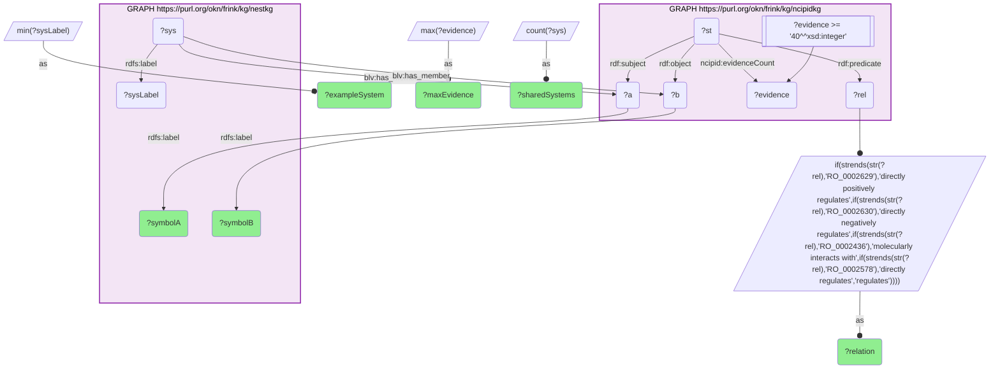
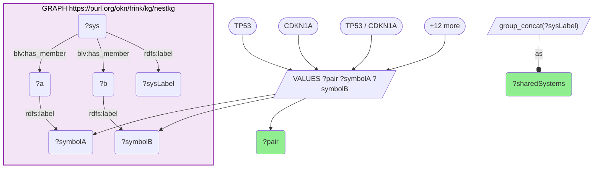

# P07-Q1: Where curated NCI-PID signalling runs inside a data-derived NeST system

- **Date:** 2026-09-02
- **Model:** claude-opus-5[1m]
- **SPARQL endpoint:** https://apps.okn.us/federation/sparql
- **Generated by:** mcp-okn v0.1.0 (build 3638bbc)
- **Contents:** 2 queries · 2 query diagrams

## Knowledge graphs used

- `nestkg` — <https://purl.org/okn/frink/kg/nestkg>
- `ncipidkg` — <https://purl.org/okn/frink/kg/ncipidkg>

## Conversation

👤 **User**

Crosswalk: nestkg × ncipidkg on UniProt accession. NCI-PID (as re-derived through INDRA) carries 83,704 reified signalling statements between proteins, each with an evidence count, but no notion of protein-system membership. NeST carries the systems but no directed signalling. Both mint `http://purl.uniprot.org/uniprot/{acc}` node IRIs, so the join is a direct IRI match.

Research question: Which NCI-PID signalling interactions run between two proteins of the SAME NeST system — i.e. where does curated, directed pathway signalling agree with the data-driven NeST assembly?

---

🧠 **Assistant**

**Why this transcript was rebuilt (2026-09-02).** ncipidkg moved its predicates off placeholder `http://example.org/okn/` IRIs onto `https://www.ndexbio.org/vocab/ncipid/` — the same redeploy that re-keyed crosswalk G2. The evidence count now lives on `ncipid:evidenceCount` (83,704 statements, alongside `inPathway`, `evidenceUrl` and `processType`), so the original query silently returned **0 rows**: no error, just an empty result, which is exactly the failure mode that hides. Only the predicate IRI changed. Every substantive value below — pairs, relations, `maxEvidence`, `sharedSystems` — is identical to the original run.

One further change, made because the rebuild exposed it: the representative system column was `SAMPLE(?sysLabel)`, which is non-deterministic, so it returned different labels on different runs and the original prose built its argument on whichever label happened to come back. It is now `MIN(?sysLabel)` (stable), and a second query enumerates *all* shared systems for the headline pairs, so the claims below cite systems that have been verified rather than sampled.

Interactions with at least 40 INDRA evidence records where **both** partners are members of the same NeST system, aggregated per protein pair:

| A | Relation | B | Max evidence | Shared systems |
|---|---|---|---|---|
| TP53 | directly positively regulates | CDKN1A | 2,324 | 10 |
| TP53 | molecularly interacts with | MDM4 | 1,145 | 3 |
| CDKN1A | directly positively regulates | TP53 | 659 | 10 |
| MDM4 | directly negatively regulates | TP53 | 591 | 3 |
| ATR | directly regulates | TP53 | 410 | 2 |
| IL6 | molecularly interacts with | IL10 | 362 | 2 |
| IL10 | directly negatively regulates | IL6 | 360 | 2 |
| MTOR | directly regulates | ULK1 | 340 | 2 |
| IL6 | directly positively regulates | IL10 | 338 | 2 |
| TGFBR1 | directly regulates | SMAD2 | 331 | 2 |
| INSR | directly regulates | IRS1 | 317 | 1 |
| TP53 | directly negatively regulates | CDKN1A | 264 | 10 |
| IRS1 | molecularly interacts with | INSR | 250 | 1 |
| MDM4 | directly positively regulates | TP53 | 227 | 3 |
| IL4 | directly positively regulates | IL10 | 217 | 2 |
| CDKN1A | molecularly interacts with | CDKN1B | 199 | 8 |
| CDKN1B | molecularly interacts with | CDKN1A | 199 | 8 |
| ATR | directly regulates | RPA2 | 193 | 1 |

**Why this answers the question.** Every high-evidence pair lands in a NeST system whose *name* describes the very signalling event NCI-PID asserts, and the two graphs derived those independently — NCI-PID from curated literature, NeST from protein-interaction and proteomics data. The second query below lists the full membership, so these are checked, not inferred from one label:

- **TP53 → CDKN1A** (2,324 evidence records, the strongest edge in the set) sits inside 10 NeST systems at once, including "TP53 regulates transcription of cell cycle genes", "Cell cycle arrest", "G1 to S cell cycle control" and "Regulation of CDK activity". The nesting is the point: p53's induction of p21 is not confined to one assembly, it is the hinge between several.
- **TP53 ↔ MDM4** and **MDM4 ⊣ TP53** share "MDM2-p53 pathway" (with "Cell cycle arrest" and "BRCA1 mediated protein ubiquitination") — the curated inhibitory edge and the data-derived complex naming the same axis.
- **MTOR → ULK1** shares "Regulatory in autophagy via inhibition of mTORC1" and "AKT/MTOR pathway II"; **TGFBR1 → SMAD2** shares "SMAD-TGFbeta signaling" and "TGF-beta pathway/SMAD protein complex"; **INSR → IRS1** sits in "EGFR-insulin receptor cross-talk". Each is the textbook first step of the pathway its NeST system is named for.
- **IL6 ↔ IL10** appears with both signs (IL6 positively regulating IL10, IL10 negatively regulating IL6) inside "Regulation of interleukin production" and "Lymphocyte activation" — a feedback loop reconstructed from two directed statements.

**What the join buys.** NeST tells you a set of proteins is one assembly under mutational selection but not who acts on whom; NCI-PID tells you who acts on whom but not which assembly it belongs to. Joined, you get *directed, evidence-weighted signalling within a named cancer system* — the shape you need to ask which edge of a mutated system is the actionable one.

**Three reading caveats.** (1) Opposite-sign statements coexist for the same pair (TP53 both positively and negatively regulating CDKN1A) because INDRA aggregates the literature, including context-dependent and contradictory reports; the evidence counts, not the sign alone, carry the weight. (2) `sharedSystems` counts NeST's *nested* systems, so one interaction can legitimately be inside ten of them — that is containment, not ten independent confirmations. (3) Not every NeST system is named: TP53/CDKN1A's ten include a bare `NEST:91`, so a shared-system count mixes interpretable assemblies with unlabelled ones.

## SPARQL queries executed

#### Query 1

_2026-09-02T23:44:50+00:00 · `ncipidkg`, `nestkg`_

```sparql
PREFIX rdf: <http://www.w3.org/1999/02/22-rdf-syntax-ns#>
PREFIX rdfs: <http://www.w3.org/2000/01/rdf-schema#>
PREFIX blv: <https://w3id.org/biolink/vocab/>
PREFIX ncipid: <https://www.ndexbio.org/vocab/ncipid/>
SELECT ?symbolA ?relation ?symbolB (MAX(?evidence) AS ?maxEvidence)
       (COUNT(DISTINCT ?sys) AS ?sharedSystems) (MIN(?sysLabel) AS ?exampleSystem) WHERE {
  GRAPH <https://purl.org/okn/frink/kg/ncipidkg> {
    ?st rdf:subject ?a ; rdf:predicate ?rel ; rdf:object ?b ; ncipid:evidenceCount ?evidence .
    FILTER(?evidence >= 40)
  }
  GRAPH <https://purl.org/okn/frink/kg/nestkg> {
    ?sys blv:has_member ?a , ?b ; rdfs:label ?sysLabel .
    ?a rdfs:label ?symbolA . ?b rdfs:label ?symbolB .
  }
  BIND(IF(STRENDS(STR(?rel),'RO_0002629'),'directly positively regulates',
       IF(STRENDS(STR(?rel),'RO_0002630'),'directly negatively regulates',
       IF(STRENDS(STR(?rel),'RO_0002436'),'molecularly interacts with',
       IF(STRENDS(STR(?rel),'RO_0002578'),'directly regulates','regulates')))) AS ?relation)
} GROUP BY ?symbolA ?relation ?symbolB
  ORDER BY DESC(?maxEvidence) LIMIT 18
```



_18 row(s) — showing first 3_

| symbolA | relation | symbolB | maxEvidence | sharedSystems | exampleSystem |
| --- | --- | --- | --- | --- | --- |
| TP53 | directly positively regulates | CDKN1A | 2324 | 10 | CDK holoenzyme complex I |
| TP53 | molecularly interacts with | MDM4 | 1145 | 3 | BRCA1 mediated protein ubiquitination |
| CDKN1A | directly positively regulates | TP53 | 659 | 10 | CDK holoenzyme complex I |

#### Query 2

_2026-09-02T23:45:24+00:00 · `nestkg`_

```sparql
PREFIX rdfs: <http://www.w3.org/2000/01/rdf-schema#>
PREFIX blv: <https://w3id.org/biolink/vocab/>
# Which NeST systems do the headline pairs actually share? The aggregate above
# collapses this to one representative label; this enumerates them so the prose
# can cite a system it has verified rather than an arbitrarily sampled one.
SELECT ?pair (GROUP_CONCAT(DISTINCT ?sysLabel; SEPARATOR=" | ") AS ?sharedSystems) WHERE {
  VALUES (?symbolA ?symbolB ?pair) {
    ("TP53" "CDKN1A" "TP53 / CDKN1A")
    ("TP53" "MDM4"   "TP53 / MDM4")
    ("MTOR" "ULK1"   "MTOR / ULK1")
    ("IL6"  "IL10"   "IL6 / IL10")
    ("TGFBR1" "SMAD2" "TGFBR1 / SMAD2")
  }
  GRAPH <https://purl.org/okn/frink/kg/nestkg> {
    ?a rdfs:label ?symbolA . ?b rdfs:label ?symbolB .
    ?sys blv:has_member ?a , ?b ; rdfs:label ?sysLabel .
  }
}
GROUP BY ?pair
ORDER BY ?pair
```



_5 row(s)_

| pair | sharedSystems |
| --- | --- |
| IL6 / IL10 | Lymphocyte activation \| Regulation of interleukin production |
| MTOR / ULK1 | AKT/MTOR pathway II \| Regulatory in autophagy via inhibition of mTORC1 |
| TGFBR1 / SMAD2 | SMAD-TGFbeta signaling \| TGF-beta pathway/SMAD protein complex |
| TP53 / CDKN1A | TP53 regulates transcription of cell cycle genes \| Cyclin D associated events in G1 \| Cell cycle arrest \| NEST:91 \| Regulation of CDK activity \| DNA metabolic process \| G1 to S cell cycle control \| CDK holoenzyme complex I \| CDK holoenzyme complex II \| MDM2-p53 pathway |
| TP53 / MDM4 | MDM2-p53 pathway \| BRCA1 mediated protein ubiquitination \| Cell cycle arrest |
