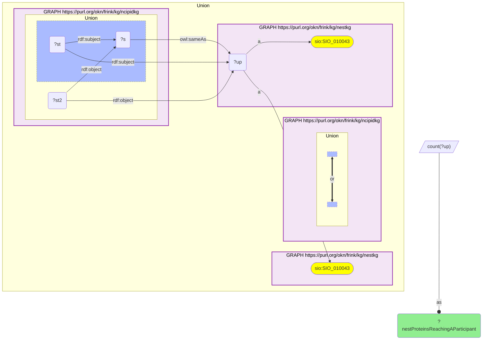
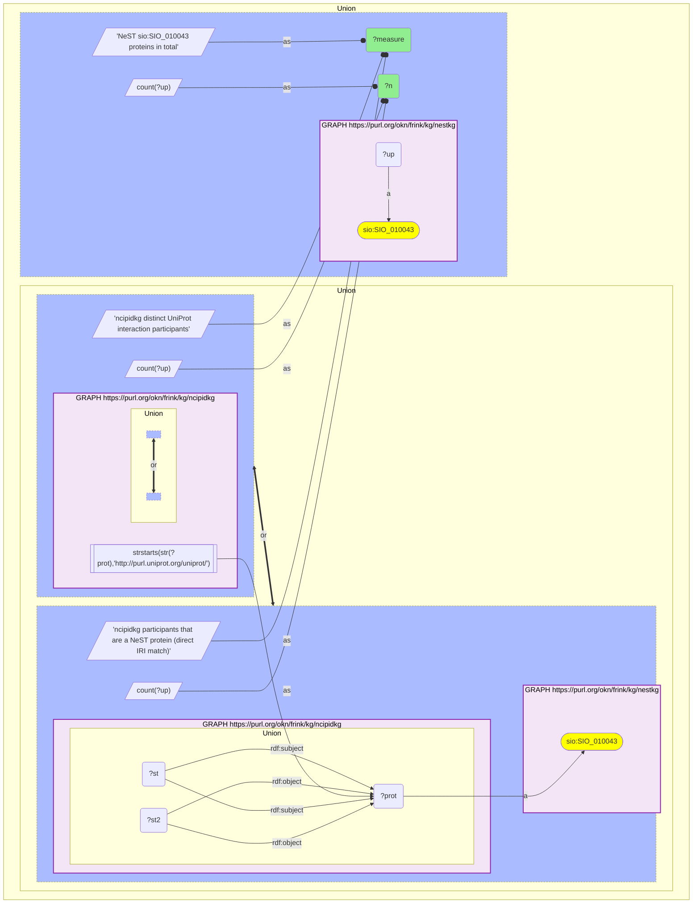
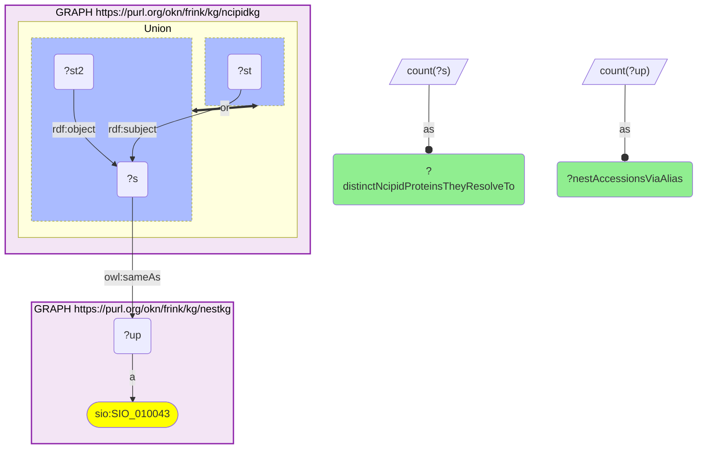
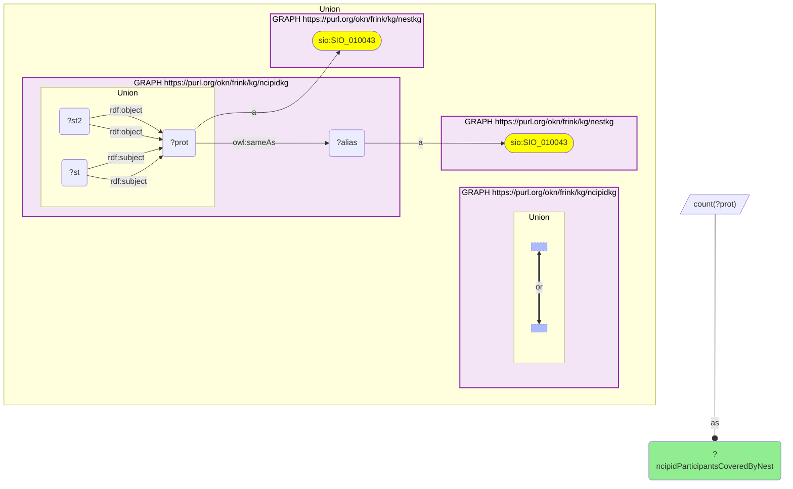

# P07-Q2: How many NeST proteins appear in NCI-PID — 2,451, and 98% of NCI-PID's interaction layer

- **Date:** 2026-09-02
- **Model:** claude-opus-5[1m]
- **SPARQL endpoint:** https://apps.okn.us/federation/sparql
- **Generated by:** mcp-okn v0.1.0 (build 3638bbc)
- **Contents:** 4 queries · 4 query diagrams

## Knowledge graphs used

- `nestkg` — <https://purl.org/okn/frink/kg/nestkg>
- `ncipidkg` — <https://purl.org/okn/frink/kg/ncipidkg>

## Conversation

👤 **User**

Same crosswalk, coverage angle: how many NeST proteins take part in at least one NCI-PID interaction?

---

🧠 **Assistant**

**This transcript replaces a version whose central numbers were wrong (2026-09-02).** The previous answer reported "526 NeST proteins have a record in ncipidkg; 506 of them are participants", and built an argument on that. Both figures came from a **subject-role-only** test — `GRAPH <ncipidkg> { ?up ?p ?o }` — which cannot see a UniProt accession sitting in OBJECT position on ncipidkg's `owl:sameAs`. That is the same defect repaired in crosswalk G2 earlier the same day; G7 was the last ncipidkg crosswalk still carrying it, and the catalogued count has been corrected from 526 to 2,451.

The old version also asserted, specifically, that the 20-protein gap between 526 and 506 was where "the `owl:sameAs` leg" lived. That was wrong by two orders of magnitude: the sameAs leg carries **1,948** proteins, not a slice of 20.

**Corrected answer: 2,451 NeST proteins have a record in ncipidkg, and 2,448 of them reach a reified NCI-PID interaction participant.**

| Measure | Count |
|---|---|
| NeST `sio:SIO_010043` proteins in total | 16,767 |
| NeST proteins with any ncipidkg record (both legs) | **2,451** (14.6% of NeST) |
| … of those, reaching an interaction participant | **2,448** |
| ncipidkg distinct UniProt interaction participants | 2,497 |
| … covered by NeST (both routes) | **2,448 (98.0%)** |
| … covered by a direct IRI match alone (the old method) | 506 (20.3%) |

**Why the second leg is legitimate, and why it is not inflating the count.** ncipidkg's `owl:sameAs` is a UniProt-to-UniProt alias table — `A0A024R986 sameAs P78543, Q3KR25, Q5VUT0` — mapping secondary and isoform accessions onto the one ncipidkg uses. It is not an internal-entity-to-UniProt mapping. So a NeST protein carrying a secondary accession is a genuine identity match to the ncipidkg node holding the primary one, and the join is a real one rather than a string coincidence. The obvious worry is that a many-to-one alias table would inflate the NeST-side count — many NeST accessions collapsing onto a handful of ncipidkg proteins. I checked: the 1,943 alias-reached NeST proteins that reach a participant resolve to **1,943 distinct** ncipidkg participants, exactly one-to-one. There is no inflation.

**The reading reverses.** The old version concluded that "506 of ncipidkg's 2,497 participants — one in five — is a NeST protein", and framed that 20.3% as a notably high hit rate. The true figure is **98.0%**: almost every protein in NCI-PID's curated signalling layer is somewhere in the NeST map. That is a different fact about these two resources. It says NeST's data-derived assembly effectively subsumes NCI-PID's curated protein set, so the interesting question is not *whether* a curated interaction has a NeST home but *which* NeST system it lands in — which is what Q1 asks.

**The scale caveat survives, smaller.** 2,451 is still a minority of NeST's 16,767 proteins (14.6%, not the 3.1% previously stated). NCI-PID remains a curated pathway set rather than a proteome, so this join is for depth on well-studied signalling proteins. For breadth across the whole NeST map the ProKN join is still the one to use (16,729, 99.8%) — that advice was right, though the gap it is arguing against is now four times narrower than the old numbers implied.

**Query-shape note.** Each leg has to be materialised in its own `DISTINCT` sub-SELECT. Writing the nestkg block once and UNIONing only the two ncipidkg branches asks the endpoint to allocate 220 GB and fails outright; the sub-SELECT form returns in about a second.

**A caveat about how this was missed.** The old skeleton was marked `skeleton_verified: true` and reproduced 526 exactly on every run, including in a full 181/181 verification pass earlier today. It was internally consistent and externally wrong. Skeleton verification confirms that a count is *stable*, not that it is *complete* — only auditing the recipe against the graph's actual identifier surfaces catches this class of error.

## SPARQL queries executed

#### Query 1

_2026-09-03T00:59:15+00:00 · `nestkg`, `ncipidkg`_

```sparql
PREFIX rdf: <http://www.w3.org/1999/02/22-rdf-syntax-ns#>
PREFIX sio: <http://semanticscience.org/resource/>
PREFIX owl: <http://www.w3.org/2002/07/owl#>
# NeST proteins that reach an NCI-PID interaction participant, by BOTH routes:
# directly (the protein IRI is itself a participant) or through ncipidkg's
# uniprot-to-uniprot owl:sameAs alias table. Each leg is materialised in its own
# DISTINCT sub-SELECT — a bare UNION here asks the endpoint for 220 GB.
SELECT (COUNT(DISTINCT ?up) AS ?nestProteinsReachingAParticipant) WHERE {
  {
    SELECT DISTINCT ?up WHERE {
      GRAPH <https://purl.org/okn/frink/kg/nestkg> { ?up a sio:SIO_010043 }
      GRAPH <https://purl.org/okn/frink/kg/ncipidkg> {
        { ?st rdf:subject ?up } UNION { ?st2 rdf:object ?up }
      }
    }
  } UNION {
    SELECT DISTINCT ?up WHERE {
      GRAPH <https://purl.org/okn/frink/kg/nestkg> { ?up a sio:SIO_010043 }
      GRAPH <https://purl.org/okn/frink/kg/ncipidkg> {
        ?s owl:sameAs ?up .
        { ?st rdf:subject ?s } UNION { ?st2 rdf:object ?s }
      }
    }
  }
}
```



_1 row(s)_

| nestProteinsReachingAParticipant |
| --- |
| 2448 |

#### Query 2

_2026-09-03T00:59:32+00:00 · `ncipidkg`, `nestkg`_

```sparql
PREFIX rdf: <http://www.w3.org/1999/02/22-rdf-syntax-ns#>
PREFIX sio: <http://semanticscience.org/resource/>
PREFIX owl: <http://www.w3.org/2002/07/owl#>
# The other side of the same join, plus NeST's denominator.
SELECT ?measure ?n WHERE {
  {
    SELECT ("ncipidkg distinct UniProt interaction participants" AS ?measure)
           (COUNT(DISTINCT ?prot) AS ?n) WHERE {
      GRAPH <https://purl.org/okn/frink/kg/ncipidkg> {
        { ?st rdf:subject ?prot } UNION { ?st2 rdf:object ?prot }
        FILTER(STRSTARTS(STR(?prot),'http://purl.uniprot.org/uniprot/'))
      }
    }
  } UNION {
    SELECT ("ncipidkg participants that are a NeST protein (direct IRI match)" AS ?measure)
           (COUNT(DISTINCT ?prot) AS ?n) WHERE {
      GRAPH <https://purl.org/okn/frink/kg/ncipidkg> {
        { ?st rdf:subject ?prot } UNION { ?st2 rdf:object ?prot }
      }
      GRAPH <https://purl.org/okn/frink/kg/nestkg> { ?prot a sio:SIO_010043 }
    }
  } UNION {
    SELECT ("NeST sio:SIO_010043 proteins in total" AS ?measure)
           (COUNT(DISTINCT ?up) AS ?n) WHERE {
      GRAPH <https://purl.org/okn/frink/kg/nestkg> { ?up a sio:SIO_010043 }
    }
  }
}
```



_3 row(s)_

| measure | n |
| --- | --- |
| ncipidkg distinct UniProt interaction participants | 2497 |
| ncipidkg participants that are a NeST protein (direct IRI match) | 506 |
| NeST sio:SIO_010043 proteins in total | 16767 |

#### Query 3

_2026-09-03T00:59:49+00:00 · `nestkg`, `ncipidkg`_

```sparql
PREFIX rdf: <http://www.w3.org/1999/02/22-rdf-syntax-ns#>
PREFIX sio: <http://semanticscience.org/resource/>
PREFIX owl: <http://www.w3.org/2002/07/owl#>
# Is the alias leg inflating the count? Resolve every alias-reached NeST protein
# back to the ncipidkg participant it aliases, and count the DISTINCT participants.
# If 1,948 NeST accessions collapse onto a few hundred ncipidkg proteins, then the
# join is wide in NeST identifiers but narrow in distinct biology.
SELECT (COUNT(DISTINCT ?up) AS ?nestAccessionsViaAlias)
       (COUNT(DISTINCT ?s) AS ?distinctNcipidProteinsTheyResolveTo) WHERE {
  GRAPH <https://purl.org/okn/frink/kg/nestkg> { ?up a sio:SIO_010043 }
  GRAPH <https://purl.org/okn/frink/kg/ncipidkg> {
    ?s owl:sameAs ?up .
    { ?st rdf:subject ?s } UNION { ?st2 rdf:object ?s }
  }
}
```



_1 row(s)_

| nestAccessionsViaAlias | distinctNcipidProteinsTheyResolveTo |
| --- | --- |
| 1943 | 1943 |

#### Query 4

_2026-09-03T01:00:07+00:00 · `ncipidkg`, `nestkg`_

```sparql
PREFIX rdf: <http://www.w3.org/1999/02/22-rdf-syntax-ns#>
PREFIX sio: <http://semanticscience.org/resource/>
PREFIX owl: <http://www.w3.org/2002/07/owl#>
# How much of ncipidkg's interaction layer does NeST actually cover, counting BOTH
# routes (a participant is covered if it is itself a NeST protein, or if it aliases
# to one)?
SELECT (COUNT(DISTINCT ?prot) AS ?ncipidParticipantsCoveredByNest) WHERE {
  {
    SELECT DISTINCT ?prot WHERE {
      GRAPH <https://purl.org/okn/frink/kg/ncipidkg> {
        { ?st rdf:subject ?prot } UNION { ?st2 rdf:object ?prot }
      }
      GRAPH <https://purl.org/okn/frink/kg/nestkg> { ?prot a sio:SIO_010043 }
    }
  } UNION {
    SELECT DISTINCT ?prot WHERE {
      GRAPH <https://purl.org/okn/frink/kg/ncipidkg> {
        { ?st rdf:subject ?prot } UNION { ?st2 rdf:object ?prot }
        ?prot owl:sameAs ?alias .
      }
      GRAPH <https://purl.org/okn/frink/kg/nestkg> { ?alias a sio:SIO_010043 }
    }
  }
}
```



_1 row(s)_

| ncipidParticipantsCoveredByNest |
| --- |
| 2448 |
