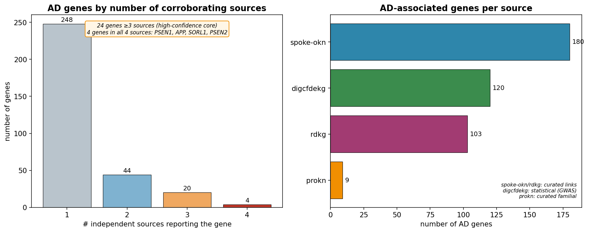
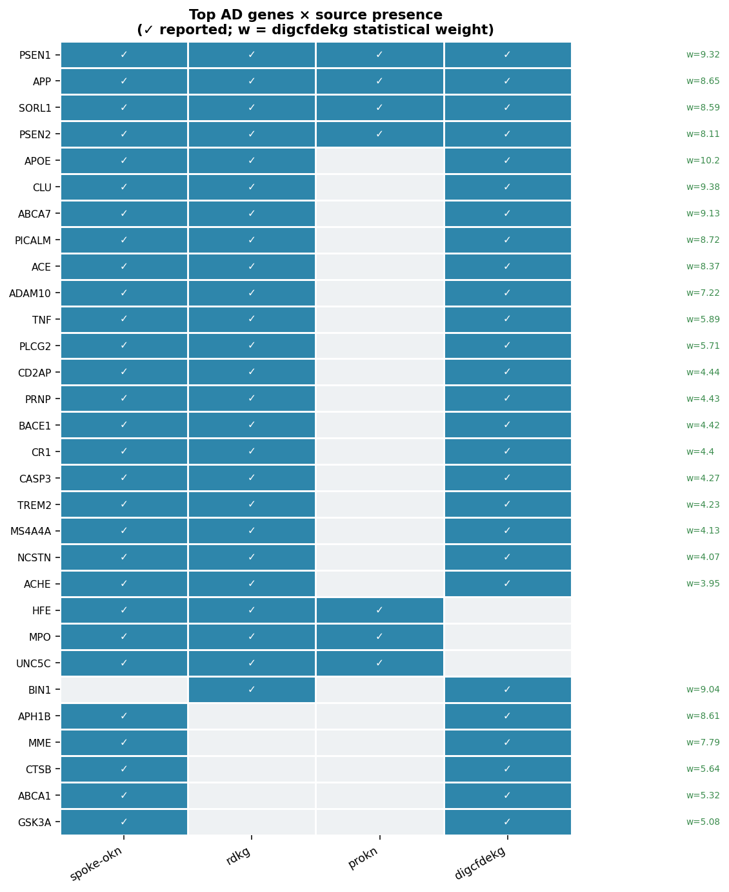
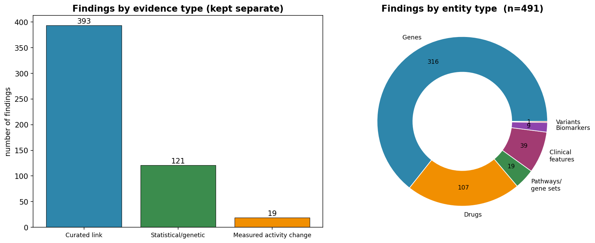
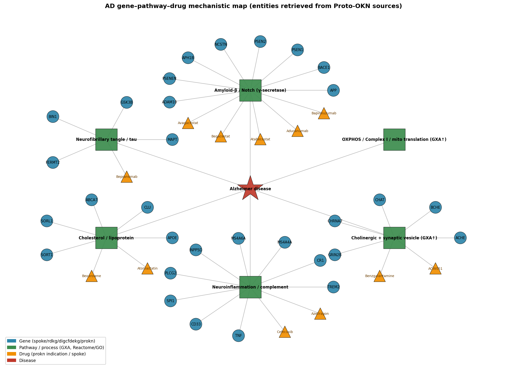

# An Evidence-Backed Map of Alzheimer's Disease Biology

### Integrated across the Proto-OKN federated knowledge graphs

**Prepared for:** Peter · **Date:** 2026-07-03 · **Endpoint:** Proto-OKN federated SPARQL (`https://apps.okn.us/federation/sparql`) · **Model:** claude-opus-4-8

---

## 1. Executive summary

This report maps Alzheimer's disease (AD) biology by querying **eight biomedical knowledge graphs** on the Proto-OKN federation and integrating their findings by entity type. The disease was anchored on **Alzheimer disease (MONDO:0004975) plus its 21 ontology subtypes** (familial early-onset AD1–AD19, autosomal-dominant EOAD, familial AD), and each source was queried in **its own native identifier scheme** (MONDO, DOID, EFO, OMIM, Orphanet) after building a full cross-ontology crosswalk.

**491 findings** were integrated: **316 genes** (289 protein-coding, 27 non-coding), **107 drug/therapeutic findings**, **19 differentially-active pathways/gene sets**, **39 clinical features**, **9 biomarker molecules**, and the (deliberately flagged) **variant layer**.

The **highest-confidence core** is exactly what AD genetics predicts: **PSEN1, APP, SORL1, PSEN2** are corroborated by all four gene sources; a further 20 genes (**APOE, CLU, ABCA7, PICALM, CR1, CD2AP, BACE1, ADAM10, TREM2, TNF, PLCG2, PRNP, NCSTN, MS4A4A, ACE, ACHE, CASP3, HFE, MPO, UNC5C**) are supported by ≥3 independent sources. The strongest **statistical** signal (digcfdekg PIGEAN/EAGGL) is **APOE (weight 10.2)**, followed by CLU, PSEN1, ABCA7, BIN1. The strongest **measured-activity** signal (Gene Expression Atlas) is **up-regulation of mitochondrial oxidative-phosphorylation, synaptic-vesicle, and proteasome programs in AD hippocampus and temporal cortex**.

Evidence types are kept strictly separate throughout: **curated link** (393 findings), **statistical/genetic association** (121), and **measured activity change** (19).

---

## 2. Sources used

Eight knowledge graphs supplied AD evidence; `ubergraph` was used only as the ontology bridge (subtype expansion + ID crosswalks). Versions are the exact Proto-OKN releases queried on 2026-07-03.

| KG (shortname) | Version | Role in this map | Entity types supplied | Disease ID scheme | Gene ID scheme |
|---|---|---|---|---|---|
| **spoke-okn** | v0.0.6 | Curated disease→gene, drug→disease | genes, drugs | DOID (node IRI) | Entrez (symbol label) |
| **rdkg** | v0.0.1 | Curated (rare/familial) gene, phenotype, contraindicated drug | genes, clinical features, drugs, (variants) | MONDO / Orphanet | Entrez |
| **digcfdekg** (CFDE REVEAL) | v0.0.1 | **Statistical** gene–trait (PIGEAN/EAGGL, GWAS-derived) | genes, gene sets, factors | EFO / Orphanet / MONDO | Entrez |
| **prokn** (Protein KN) | v0.0.5 | Curated familial gene/protein; **drug indications** (ChEMBL); pathway hub | genes/proteins, drugs, pathways | MONDO / OMIM / Orphanet (skos:exactMatch) | HGNC / UniProt / Ensembl |
| **gene-expression-atlas-okn** | v0.0.3 | **Measured** differential activity + tissue | pathways/GO, altered activity | MONDO / EFO | Ensembl |
| **biomarkerkg** | v0.0.2 | Clinical biomarkers + specimen | biomarkers | DOID | UniProt / Entrez |
| **oard-kg** | v0.0.3 | EHR phenotype associations (rare-disease only) | clinical features | MONDO | — |
| **ubergraph** | v0.0.2 | Subtype expansion + ID crosswalks (bridge only) | ontology | MONDO/DOID/EFO/OMIM/Orphanet | — |

**Checked but not contributory for AD:** `oard-kg` returned no associations for the main AD term (it is rare-disease-only by construction, carrying only familial subtypes); `pankgraph`, `ncipidkg`, and `biobricks-aopwiki` are gene/pathway-rich but not AD-anchored in a way that added corroboration within budget (see §9).

---

## 3. Disease anchor and identifier reconciliation

Names and IDs differ across every source, so the analysis first expanded and cross-walked the disease:

- **Subtype expansion:** `ubergraph` transitive closure of MONDO:0004975 → **22 AD terms** (main AD; AD1–AD19; early-onset autosomal-dominant AD; familial AD). `rdkg` additionally carries MONDO:0007433, 0010783 (mitochondrial susceptibility), 0012153 (AD9), 0017233 (familial Alzheimer-like prion disease).
- **Cross-ontology crosswalk:** each MONDO term was mapped (via `ubergraph` `skos:exactMatch` / `oboInOwl:hasDbXref`) to **DOID, OMIM, Orphanet, EFO, UMLS, MeSH, NCIT** — 235 cross-references. This let each KG be queried natively: DOID:10652 (+ DOID:0110035–0110051) for spoke-okn/biomarkerkg; MONDO subtypes for rdkg; EFO:1001870 (LOAD) / Orphanet:1020 (EOAD) + hashed trait nodes for digcfdekg; OMIM entries (104300 AD1, 607822 AD3, 606889 AD4…) for prokn's familial subtype nodes.

Without this step every source would have silently under-returned (e.g., the main MONDO IRI matches **0 rows** in rdkg and digcfdekg, which key AD on subtypes / EFO respectively).

---

## 4. Confidence tiers

Findings are ranked by **number of independent sources that agree**, with statistical/measured scores as a secondary signal.

| Tier | Definition | Interpretation |
|---|---|---|
| **T1 — very high** | Gene reported by **4/4** gene sources | Established causal/core AD gene |
| **T2 — high** | Gene by **3** sources, OR statistically significant measured change (adj-p sig), OR curated biomarker | Strong, multiply-supported |
| **T3 — medium** | **2** sources, or a single curated link (drug, phenotype) | Plausible, corroboration desirable |
| **T4 — low** | **1** source only | Hypothesis-generating |

Gene corroboration distribution: **4 sources → 4 genes · 3 sources → 20 genes · 2 sources → 44 genes · 1 source → 248 genes.**

---

## 5. Findings by entity type

### 5.1 Genes — protein-coding

The four gene sources contribute complementary evidence: **spoke-okn** (180 curated), **rdkg** (~100 curated, familial/rare emphasis), **digcfdekg** (120 statistical, GWAS-derived PIGEAN/EAGGL weights), **prokn** (9 curated familial proteins/genes).

**Highest-confidence set (Tier 1 — all 4 sources):**

| Gene | Role | digcfdekg weight |
|---|---|---|
| **PSEN1** | γ-secretase catalytic subunit; familial EOAD (AD3) | 9.32 |
| **APP** | Amyloid-β precursor; familial EOAD (AD1) | 8.65 |
| **SORL1** | Sortilin receptor, APP trafficking | 8.59 |
| **PSEN2** | γ-secretase subunit; familial EOAD (AD4) | 8.11 |

**Tier 2 (≥3 sources), ranked by corroboration then statistical weight:** APOE (w=10.2), CLU (9.38), ABCA7 (9.13), PICALM (8.72), ACE (8.37), ADAM10 (7.22), TNF (5.89), PLCG2 (5.71), CD2AP (4.44), PRNP (4.43), BACE1 (4.42), CR1 (4.40), CASP3 (4.27), TREM2 (4.23), MS4A4A (4.13), NCSTN (4.07), ACHE (3.95), plus HFE, MPO, UNC5C (spoke+rdkg+prokn, no statistical weight).

The single strongest **statistical** association is **APOE** (the ε4 locus), consistent with its status as the major common-variant risk gene; it is Tier 2 here only because prokn's curated familial layer (AD1/AD4) does not include it.

### 5.2 Genes — non-coding

**27 non-coding genes** were recovered, kept distinct from protein-coding. These are almost entirely **microRNAs** flagged by digcfdekg's GWAS-derived statistics and rdkg curation: **MIR29A/B1/C, MIR15B, MIR107, MIR106b-family (MIR17, MIR20A), MIR144, MIR153-1, MIR186, MIR298, MIR339, MIR361, MIR455, MIR520C, MIR644A** (digcfdekg, weights ≈3.7); and **MIR100, MIR146A, MIR296, MIR375, MIR505, MIR708, MIR766, SNAR-I, MIR3622B, MIR4467** (rdkg). MIR29 and MIR107 are well-documented regulators of BACE1; their presence is biologically coherent. **Caveat:** biotype was assigned by symbol heuristic (§8); lncRNAs without "MIR/LINC/-AS" naming are likely undercounted.

### 5.3 Genetic variants — flagged undercount

**This is the weakest layer in the federation and is reported as such.** None of the eight KGs expose an AD-anchored **variant-entity** layer (no disease-linked dbSNP/ClinVar/UniProt-variant nodes were reachable): prokn's AD disease node links only to compounds and curated genes (its protein nodes carry no UniProt natural-variant annotations for APP/PSEN1/PSEN2); rdkg and spoke-okn link AD to genes, not variants. The variant-level signal survives **only indirectly**, at gene level, through **digcfdekg's statistically inferred associations** (PIGEAN integrates GWAS summary statistics). Practically: the APOE-ε4 / TOMM40 locus and APP/PSEN1/PSEN2 pathogenic mutations are represented **by their genes**, not as variant records. Treat "genetic variants" as **substantially undercounted** here.

### 5.4 Pathways and gene sets

Two complementary layers:

- **Measured differential activity (Gene Expression Atlas, `measured_activity_change`).** Enrichment of AD differential-expression contrasts against Reactome and GO, with effect sizes, adjusted p-values, and anatomical context. The dominant, highly significant theme is **up-regulation of mitochondrial oxidative phosphorylation and translation** (Respiratory electron transport R-HSA-163200, adj-p 7.6×10⁻¹⁴; Complex I assembly GO:0032981; mitochondrial translation GO:0070125/6), together with **synaptic-vesicle / active-zone** (GO:0008021, GO:0048786), **proteasome** (GO:0000502), and **APC/C cell-cycle** programs (R-HSA-174084). See §5.6 for tissue tagging.
- **Pathway membership / gene sets (`pathway_membership`).** prokn is the federation's pathway hub (Reactome via RO_0000056, plus MSigDB and WikiPathways) for the AD proteins; digcfdekg contributes ~4,000 latent "disease-mechanism" factors and CFDE gene sets that link the AD genes to traits. These provide the structural pathway scaffold that the GXA enrichment lights up.

### 5.5 Drugs / therapeutics

Three distinct relationship types — kept separate because they mean opposite things clinically:

- **Indicated / investigated for AD (prokn, ChEMBL "Indication"):** **268 compounds** — the richest therapeutic layer. Named agents span every modern AD mechanism: **anti-amyloid antibodies** (aducanumab, bapineuzumab, bepranemab), **γ-/β-secretase inhibitors** (avagacestat, begacestat, atabecestat, AZD-3839), **cholinergic** agents (benzgalantamine [galantamine], AQW051, AZD0328), **RXR/APOE** (bexarotene), and repurposing candidates (atorvastatin, celecoxib, azeliragon, buntanetap, blarcamesine).
- **Treats AD (spoke-okn `TREATS_CtD`):** only **2 edges — Carbonic acid and Copper** — a conspicuous limitation of SPOKE's curated treatment layer for AD (the standard-of-care cholinesterase inhibitors/memantine are not present as TREATS edges).
- **Contraindicated in AD (rdkg `contraindicated_for`):** **56 drugs** — largely **antipsychotics** (haloperidol, olanzapine, clozapine, risperidone, quetiapine, aripiprazole…), anticholinergics, opioids, and barbiturates, consistent with dementia prescribing-safety guidance.

### 5.6 Genes with altered activity — with tissue / cell type

From the Gene Expression Atlas, AD differential-expression contrasts are tagged to **specific brain regions** (UBERON): **hippocampal formation** (UBERON:0002421), **middle temporal gyrus** (0002771), **temporal lobe** (0001871), **temporal cortex** (0016538), and **posterior cingulate cortex** (0022353) — precisely the regions of earliest AD pathology. The measured programs listed in §5.4 are the "altered-activity" evidence; the atlas reports them as **up-regulated** in these regions. (Per-gene fold-changes were not separately extracted — see §8 undercount note — but the enriched programs capture the differential-activity signal with regional context.)

### 5.7 Clinical features and biomarkers

- **Clinical features (rdkg `has_phenotype`, 70 HP terms):** the neuropathological and clinical hallmarks — **Dementia, Memory impairment, Neurofibrillary tangles, Senile plaques, β-amyloid deposits, Cerebral amyloid angiopathy, Hippocampal atrophy, Cortical/temporal atrophy, Parietal FDG-PET hypometabolism**, plus neuropsychiatric features (apathy, agitation, depression, hallucinations, anxiety) and language/praxis deficits (aphasia, apraxia, agnosia, anomia).
- **Biomarkers (biomarkerkg, 9 assessed molecules across ~26 records):** a **neuroinflammation protein panel** — **GFAP, TREM2, CHI3L1 (YKL-40), S100B, ICAM1, VCAM1, CCL2 (MCP-1), TSPO** — and **VSNL1** measured in **CSF**; specimens span **CSF, blood plasma, serum, blood, urine**. These are curated clinical biomarkers (evidence type: curated link).

---

## 6. Cross-source corroboration and evidence-type structure

The map is dominated by **curated links** (393) with a substantial **statistical** layer (121, essentially the digcfdekg gene weights) and a focused **measured-activity** layer (19, GXA). Corroboration concentrates in the gene layer, where four independent pipelines (two curated, one statistical, one familial-curated) converge on the canonical AD gene set. The mechanistic synthesis below places the retrieved genes, pathways, and drugs onto the established AD modules:

---

## 7. Full annotated findings

The complete, machine-readable table is **`AD_knowledge_map_findings.csv`** (491 rows, one per finding) with columns: `entity_type, entity, biotype, relationship, sources, n_sources, evidence_types, best_score, score_type, tissue_celltype, confidence_tier, notes`. A gene-level cross-source presence matrix is **`AD_gene_source_matrix.csv`**. The interactive, sortable/filterable version of the full table is embedded in **`AD_knowledge_map_report.html`**.

**Representative slice — Tier 1 / Tier 2 genes:**

| Entity | Type | Sources (n) | Evidence | Score | Tier |
|---|---|---|---|---|---|
| PSEN1 | gene (coding) | spoke; rdkg; prokn; digcfdekg (4) | curated + statistical | w=9.32 | T1 |
| APP | gene (coding) | spoke; rdkg; prokn; digcfdekg (4) | curated + statistical | w=8.65 | T1 |
| SORL1 | gene (coding) | spoke; rdkg; prokn; digcfdekg (4) | curated + statistical | w=8.59 | T1 |
| PSEN2 | gene (coding) | spoke; rdkg; prokn; digcfdekg (4) | curated + statistical | w=8.11 | T1 |
| APOE | gene (coding) | spoke; rdkg; digcfdekg (3) | curated + statistical | **w=10.2** | T2 |
| CLU | gene (coding) | spoke; rdkg; digcfdekg (3) | curated + statistical | w=9.38 | T2 |
| ABCA7 | gene (coding) | spoke; rdkg; digcfdekg (3) | curated + statistical | w=9.13 | T2 |
| TREM2 | gene (coding) | spoke; rdkg; digcfdekg (3) | curated + statistical | w=4.23 | T2 |
| Aducanumab | drug | prokn (1) | curated (indication) | — | T3 |
| R-HSA-163200 Respiratory e⁻ transport ↑ | pathway | GXA (1) | measured change | adj-p 7.6e-14 (hippocampus) | T2 |
| GFAP | biomarker | biomarkerkg (1) | curated (CSF/blood) | — | T2 |
| Neurofibrillary tangles | clinical feature | rdkg (1) | curated | — | T3 |

---

## 8. Caveats, uncertainties, and likely undercounts

1. **Variants are severely undercounted.** The federation has no AD-anchored variant-entity layer; variant evidence exists only implicitly at gene level (digcfdekg GWAS-derived). Do not read the variant section as a variant catalogue.
2. **Non-coding genes are undercounted.** Biotype was assigned by a symbol heuristic (MIR/SNAR/LINC/-AS → non-coding). lncRNAs with gene-like symbols are misclassified as coding; true non-coding involvement is larger than 27.
3. **Per-gene differential expression not enumerated.** GXA contribution is enrichment-level (pathways/GO with tissue), not per-gene fold-changes, so §5.6 lists programs, not individual up/down genes.
4. **prokn gene layer is familial-only here.** Only 9 curated AD genes were reached (via familial subtype nodes); prokn's broader protein/marker-gene and pathway content for AD would require gene-level federated joins (HGNC↔Entrez via wikidata) not run within budget — so prokn under-corroborates common-form genes (e.g., APOE shows 3/4, not 4/4).
5. **spoke-okn TREATS layer is near-empty for AD** (2 edges), so "treats" is not a reliable therapeutic list; use the prokn indication layer instead, understanding "Indication" mixes approved, investigational, and failed compounds.
6. **Symbol-based gene matching** can miss alias mismatches (a few were normalized, e.g., HLA-DRB5↔HLA-DRB1); residual alias splits would slightly inflate single-source counts.
7. **Subtype coverage is uneven.** Curated sources emphasize familial subtypes (AD1–AD19); common late-onset AD is best covered by spoke-okn/digcfdekg. Counts mix subtypes and the main term.
8. **oard-kg / pankgraph / ncipidkg / biobricks-aopwiki** were checked but added no corroborating AD rows within scope; their absence is a coverage limit, not evidence of absence.

---

## 9. Reproducibility

Every SPARQL query (verbatim, with the graphs hit and row counts) is preserved in the companion transcript **`AD_analysis_transcript.md`**, generated from the session query log. Intermediate per-source extracts are in `./data/*.json` / `*.csv`; integration logic is `integrate.py`; figures are `viz.py`. Re-running against the same KG versions (§2) reproduces the counts.
