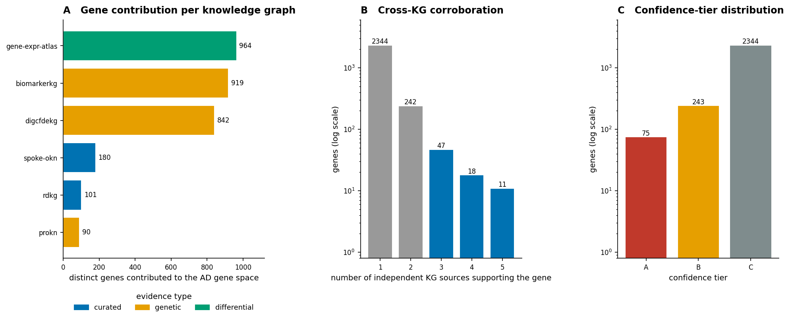
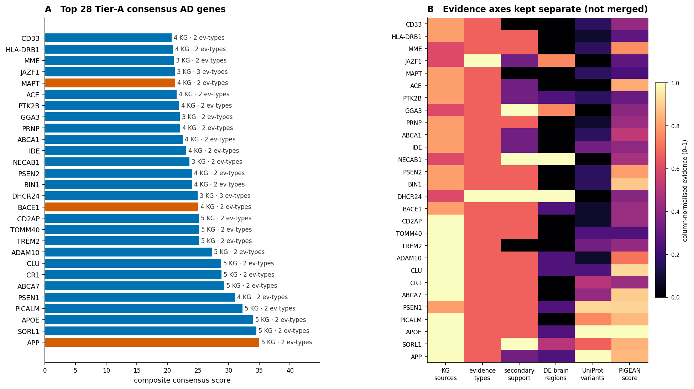
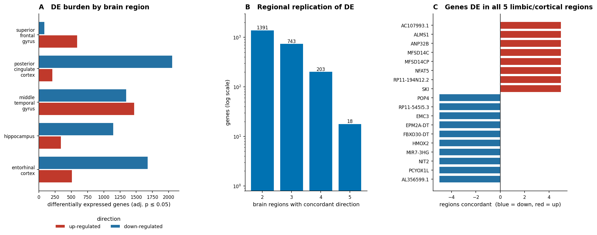
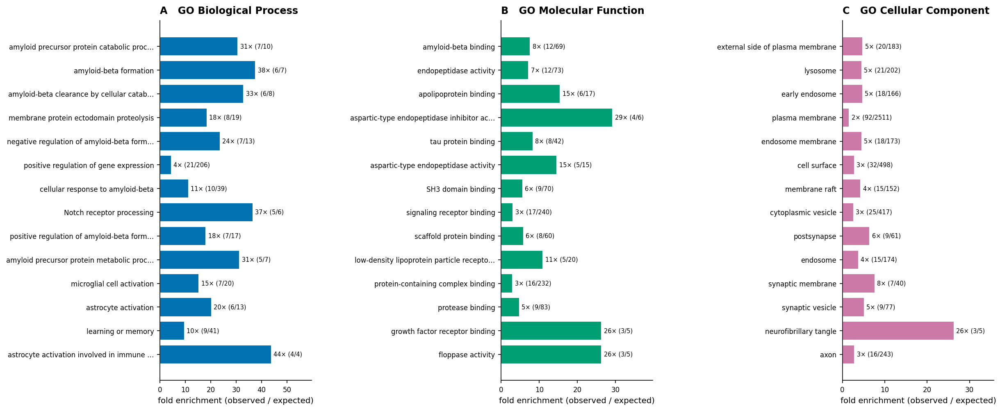
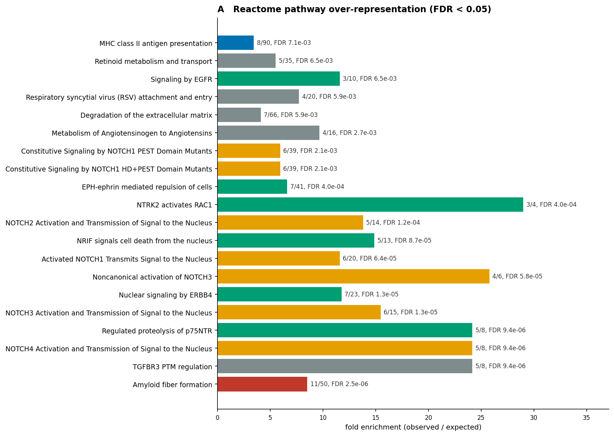
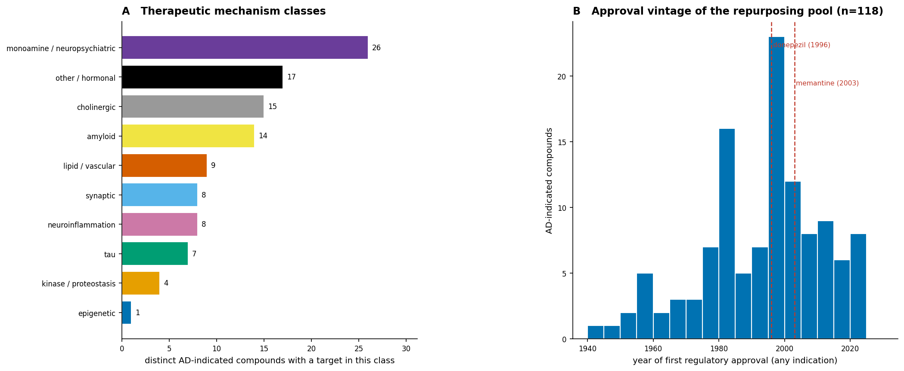
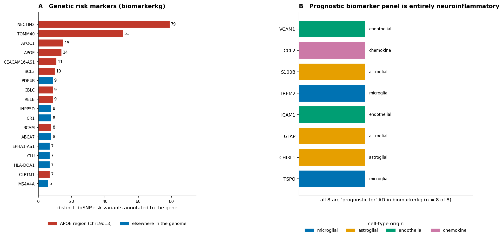
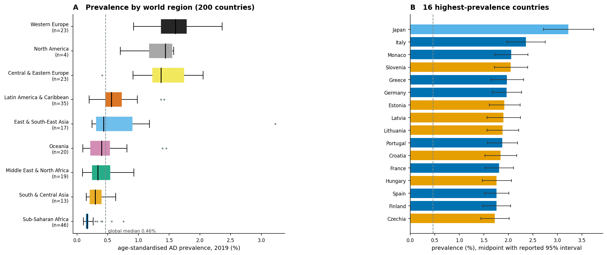
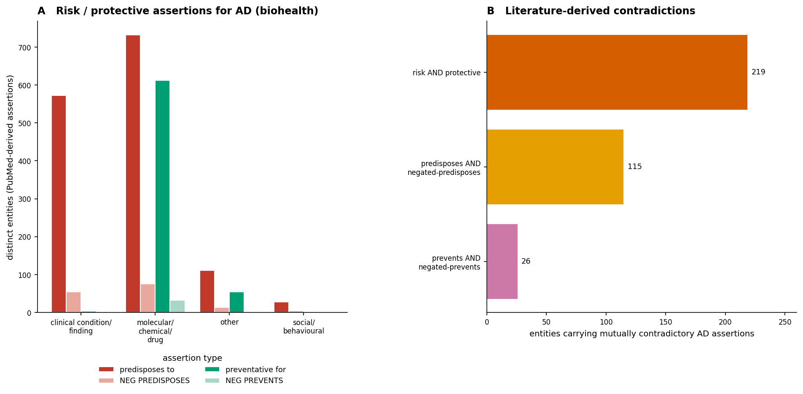
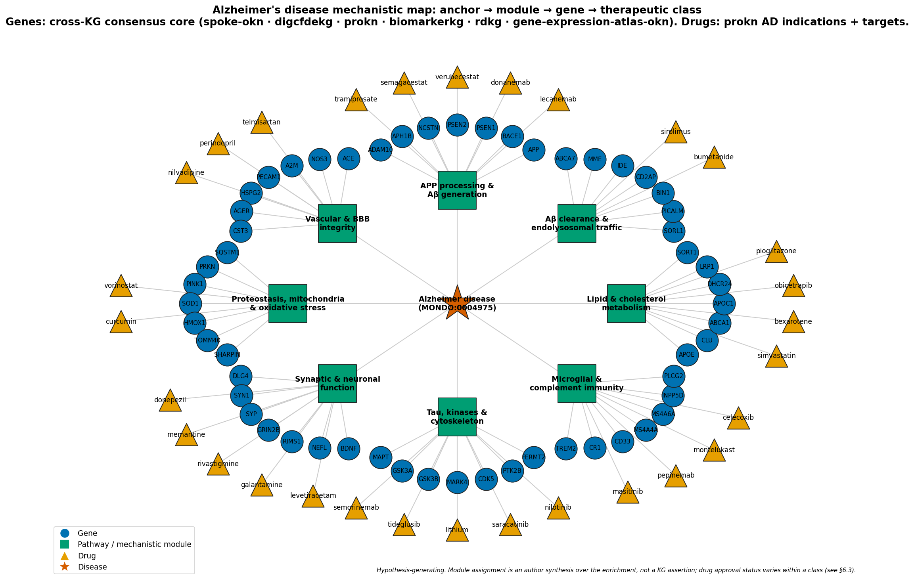

# A cross-knowledge-graph map of Alzheimer's disease: genes, mechanisms, biomarkers, therapeutics and global burden
### Integrative federated-SPARQL analysis over 8 biomedical knowledge graphs of the Proto-OKN federation, bridged through ubergraph

**Date:** 2026-07-19 · **Endpoint:** OKN federated SPARQL · **Model:** claude-opus-4-8

> **Framing (non-negotiable).** The unit of analysis is a **human gene, protein, variant, biomarker, drug or place-level statistic asserted about Alzheimer's disease** in one or more Proto-OKN knowledge graphs. Coverage is whatever those graphs curate — not the literature, and not a cohort. Every relationship reported here is **curatorial or observational**: a curator's assertion, a statistical association, a differential-expression call, or an EHR / literature co-occurrence. This is **hypothesis generation, not causal or clinical inference**, and nothing here should be read as diagnostic, prognostic or treatment guidance. Keep this caveat attached to every downstream claim.

**Abbreviations.** AD = Alzheimer's disease; Aβ = amyloid-beta; APP = amyloid precursor protein; BBB = blood–brain barrier; BP/MF/CC = GO Biological Process / Molecular Function / Cellular Component; CAA = cerebral amyloid angiopathy; CDR = clinical dementia rating; CI = confidence interval; CL = Cell Ontology; CSF = cerebrospinal fluid; DE = differential expression; DOID = Disease Ontology identifier; EFO = Experimental Factor Ontology; EOAD = early-onset AD; FDR = false-discovery rate; GO = Gene Ontology; GWAS = genome-wide association study; HP = Human Phenotype Ontology; KG = knowledge graph; LOAD = late-onset AD; LUBAC = linear ubiquitin chain assembly complex; MCI = mild cognitive impairment; MONDO = Mondo Disease Ontology; NFT = neurofibrillary tangle; ORA = over-representation analysis; OR = odds ratio; PIGEAN = the CFDE REVEAL gene–trait scoring method; SDoH = social determinants of health; UBERON = Uber-anatomy ontology; UMLS = Unified Medical Language System; ncRNA = non-coding RNA.

---

## 1. Executive summary

Anchoring on **MONDO:0004975 (Alzheimer disease)** and expanding its subtype closure through `ubergraph`, this study assembled AD evidence from **8 Proto-OKN biomedical knowledge graphs** (plus `ubergraph` as the ontology bridge) and integrated it strictly on shared entity identifiers. The disease itself resolves to **22 MONDO terms** carrying **235 identifier cross-references** into DOID, OMIM, UMLS, MeSH, ICD-10/11, SNOMED, Orphanet and NCIT — the crosswalk that made the rest of the integration possible.

The molecular core is **strikingly reproducible across independent graphs**. Of **2662 genes** implicated by at least one source, **318** are corroborated by two or more independent knowledge graphs and **29** by four or more. The eleven genes reaching **five of six** sources are a textbook AD panel recovered *without* any curated AD gene list as input: **APOE, APP, SORL1, PICALM, ABCA7, ADAM10, CD2AP, CLU, CR1, TOMM40, TREM2**; the four-source set adds **PSEN1, PSEN2, BACE1, BIN1, MAPT, ABCA1, IDE, CD33, ACE, ABI3, EPHA1, CASS4, MS4A4A, HLA-DRB1, PTK2B, PLAU, PRNP** and **ZCWPW1**. Functional over-representation against an explicit prokn background recovered the canonical mechanism set with large effect sizes — **amyloid precursor protein catabolic process** at **30.7×** (FDR 1.7 × 10⁻⁷), amyloid-β formation at 37.6×, **microglial cell activation** at 15.4×, **astrocyte activation** at 20.2×, and lysosome / early-endosome / membrane-raft compartments at 4.3–4.8×. Reactome independently returned **Amyloid fiber formation** (8.5×) alongside **six NOTCH pathways**, the off-target liability that plausibly explains the γ-secretase-inhibitor failures — a mechanistic result reached from knowledge-graph structure alone.

The therapeutic layer is broad but shallow in places. `prokn` records **268 compounds indicated for AD** (118 with a regulatory approval year on record, 150 investigational), resolving to **137 drug–target pairs across 71 targets**; `rdkg` separately lists **56 contraindicated agents** — an almost pure antipsychotic / anticholinergic / sedative deprescribing list. By contrast `spoke-okn`'s AD treatment layer contains only two compounds and its compound→gene edges are **toxicogenomic perturbations, not therapies**; both are reported as coverage gaps rather than findings.

Clinically, `biomarkerkg`'s **prognostic** panel for AD is **entirely neuroinflammatory** — TSPO, CHI3L1, GFAP, ICAM1, TREM2, S100B, CCL2, VCAM1 (8 of 8) — while its **1399 risk markers** are dominated by the APOE region. `oard-kg` contributes **689 EHR associations** whose top-ranked partners reconstruct AD neuropathology from claims data alone (senile plaques OR ≈ 956, NFTs ≈ 793, hippocampal sclerosis ≈ 552). Globally, `spoke-okn` gives 2019 prevalence for **200 countries** spanning a **36-fold** range (Japan 3.23% → United Arab Emirates 0.091%), tracking population age structure. Finally, `biohealth` supplies both asserted and *negated* AD relations, exposing **219 entities carrying simultaneously risk-increasing and protective claims** — hormone therapy, NSAIDs, statins, vitamin E, ginkgo, metformin — a machine-readable inventory of the field's genuinely unsettled questions.

## 2. Sources used

Every row below traces to at least one logged, non-exploratory SPARQL query in the reproducibility record.

| KG | Version | Updated | Role in this study | Join key / confidence |
|---|---|---|---|---|
| `ubergraph` | v0.0.2 | 2026-05-01 | AD subtype closure (`rdfs:subClassOf*`) and every identifier crosswalk (MONDO↔DOID/OMIM/UMLS/EFO/Orphanet) | ontology bridge; high confidence (curated OBO) |
| `spoke-okn` | v0.0.6 | 2026-03-16 | Curated disease→gene edges (`ASSOCIATES_DaG`); global prevalence (`PREVALENCE_DpL`); compound→gene perturbation | DOID node IRI ← MONDO via ubergraph; Ensembl / Entrez for genes |
| `digcfdekg` | v0.0.1 | 2026-06-21 | Gene–trait associations with PIGEAN scores across 21 AD-related traits (case/control, late-onset, family-history proxies, CSF & imaging endophenotypes) | Entrez node IRI; MONDO / EFO / Orphanet traits |
| `prokn` | v0.0.5 | 2026-06-23 | UniProt curated disease variants; GO and Reactome annotation (both enrichment backgrounds); AD drug indications and drug→target edges | HGNC symbol on `rdfs:label`; UniProt; GO; R-HSA |
| `rdkg` | v0.0.1 | 2026-05-04 | Curated AD gene set incl. a distinct ncRNA layer; HP phenotypes per subtype; contraindicated drugs; environmental exposures | MONDO node IRI; Entrez; DrugBank |
| `biomarkerkg` | v0.0.2 | 2026-03-16 | Diagnostic, prognostic and genetic-risk biomarkers with BEST-style relation types and specimen source | MONDO node IRI; dbSNP / Entrez in labels |
| `gene-expression-atlas-okn` | v0.0.3 | 2026-03-18 | AD-vs-control differential expression by brain region, cell type and disease stage | MONDO node IRI; gene symbol; UBERON / CL attributes |
| `oard-kg` | v0.0.3 | 2026-06-05 | EHR-derived disease↔phenotype associations with log-odds ratios and sample sizes | MONDO (reified — both `biolink:subject` and `biolink:object` unioned) |
| `biohealth` | v0.0.4 | 2026-03-16 | Literature-derived risk / protective / treats assertions **and their negations**; SDoH-adjacent entities | UMLS CUI node IRI (`…/kg/node/C{cui}`) ← MONDO via ubergraph `hasDbXref` |

**Suppliers checked and deliberately dropped.** `find_context_sources` named several further candidates; each was queried and returned no AD entity, so none is credited above: **`pankgraph`** (pancreatic-islet focused — no AD disease node), **`ncipidkg`** (NCI-PID signalling networks; protein/pathway only, no disease layer, and its verified `prokn` overlap is 12 UniProt entries), **`biobricks-aopwiki`** (adverse-outcome pathways — no AD term), **`nde`** (infectious / immune-mediated disease datasets — no AD term). **`spoke-genelab`** was dropped by design: it is a model-organism spaceflight-omics source with no AD contrast. `biobricks-mesh`, `biobricks-ice/tox21/toxcast` supply chemicals but reach AD only through an exposure chain already covered, more directly, by `rdkg`'s `contributes_to` edges (§6.5).

## 3. Design & rules

The study is anchored on a single ontology term and expands outward. **MONDO:0004975** was expanded through `ubergraph`'s precomputed `rdfs:subClassOf*` closure to **22 AD terms** — the parent plus the numbered familial loci AD1–AD19, *AD without neurofibrillary tangles*, *familial early-onset AD with coexisting amyloid and prion pathology*, *early-onset autosomal-dominant AD*, and *familial AD*. Each term's `skos:exactMatch` / `hasDbXref` set was pulled in the same query, yielding **235 cross-references**; these are what let a DOID-keyed graph (`spoke-okn`), a UMLS-keyed graph (`biohealth`) and MONDO-keyed graphs (`rdkg`, `oard-kg`, `biomarkerkg`) be joined without name matching. Every cross-KG bridge in this report was established by *running* the crosswalk catalogue's verified skeleton query, not by reading an identifier off one graph and pasting it into another.

Genes enter the AD gene space from **six primary sources**, deliberately chosen so that each carries a *different kind* of evidence: curated disease–gene assertions (`spoke-okn`, `rdkg`), statistical genetic association (`digcfdekg` across seven core AD traits; `biomarkerkg` dbSNP risk markers; `prokn` UniProt disease-variant annotations), and differential molecular activity (`gene-expression-atlas-okn`, requiring a concordant direction in ≥3 brain regions). Three further **secondary** sources — family-history proxy traits, CSF/imaging endophenotype traits, and the laxer ≥2-region DE call — contribute supporting weight but never establish a gene on their own. Crucially, **the evidence axes are never collapsed into one number for the purpose of provenance**: the ranked table records each axis separately, and the composite score exists only to order the table.

Enrichment used an **explicit background** drawn from the same graph as the foreground: 8290 `prokn` genes with at least one GO annotation, and 6032 with at least one human Reactome pathway. Hypergeometric tests with Benjamini–Hochberg FDR were applied at k ≥ 3, K ≥ 3. The full replicator-grade specification — exact predicate paths, IRI rewrites, thresholds and the scoring formula — lives in the reproducibility file, not here.

| Inventory (verified live) | Count |
|---|---|
| MONDO AD terms in the subtype closure | 22 |
| Identifier cross-references retrieved | 235 |
| Genes implicated by ≥1 primary source | 2662 |
| Genes with ≥2 independent KG sources | 318 |
| Non-coding RNAs (kept separate) | 166 |
| `digcfdekg` gene–trait associations / traits | 3551 / 21 |
| `prokn` curated AD variants / genes | 218 / 90 |
| DE records / genes / brain regions | 9506 / 5800 / 9 |
| AD-indicated compounds / drug–target pairs | 268 / 137 |
| Biomarker assertions | 1418 |
| Countries with prevalence estimates | 200 |

> ***Figure 1. Study design and the shape of the evidence.*** **(A)** Distinct genes contributed by each knowledge graph, coloured by the kind of evidence that graph supplies (curated / genetic association / differential molecular activity). **(B)** How many independent KG sources support each gene (log scale). **(C)** Distribution of the 2662 genes across confidence tiers (log scale). Provenance: `spoke-okn` `ASSOCIATES_DaG`; `digcfdekg` `geneToTrait` (7 core AD traits); `prokn` UniProt natural-variant annotations `RO_0002410`; `biomarkerkg` `OBCI_1000008`; `gene-expression-atlas-okn` DE with concordant direction in ≥3 regions; `rdkg` `related_to`.

The three graphs contributing the most genes are also the least specific — `biomarkerkg` (919), `gene-expression-atlas-okn` (964) and `digcfdekg` (842) are permissive by construction, whereas the curated sources contribute ~100–180 each. That asymmetry is exactly why corroboration, not volume, is the ranking signal: panel (B) shows the evidence collapses sharply, with only 29 genes reaching four or more sources.

## 4. Confidence tiers

| Tier | Requirement | Interpretation | Genes |
|---|---|---|---|
| **A** | ≥3 primary KG sources **and** ≥2 distinct evidence types | Independently corroborated by different *kinds* of evidence, not just repeated curation | **75** |
| **B** | ≥2 primary KG sources | Replicated across graphs but within a narrower evidence base | **243** |
| **C** | 1 primary KG source | Single-source; includes the long tail of permissive GWAS and DE calls | **2344** |

Tier A is the defensible core. The requirement for **two distinct evidence types** is what separates it from mere repetition: a gene appearing in three curated lists that all descend from the same literature would remain Tier B under this rule, whereas APP (curated + genetic + differential) or DHCR24 (curated + genetic + differential) qualify.

## 5. Findings by axis

### 5.1 Cross-KG consensus on AD genes

> ***Figure 2. The Tier-A consensus core and its evidence axes.*** **(A)** Top 28 Tier-A genes by composite consensus score; bar colour marks whether `prokn` records a drug or probe compound acting on the gene product; annotations give the number of supporting KGs and distinct evidence types. **(B)** The same genes with each evidence axis shown *separately* and column-normalised (0–1): KG sources, evidence types, secondary support, brain regions with concordant DE, curated UniProt variants, and the maximum PIGEAN gene–trait score. Provenance: the six primary sources of §3; PIGEAN scores from `digcfdekg` reified `geneToTrait` statements (`schema:weight`).

The ranking is dominated by **APP, SORL1, APOE, PICALM, ABCA7, CR1, CLU, ADAM10, TREM2, TOMM40** and **CD2AP** — the eleven genes at five of six KG sources, spanning curated and genetic evidence — with **PSEN1** immediately behind them at four sources but the highest variant burden after APOE. Panel (B) is the important one: it shows the axes are *not* redundant. APOE leads on curated variants (32 UniProt annotations) and PIGEAN score (10.2) but contributes no regional DE signal, whereas **DHCR24, NECAB1, JAZF1, NFIC and AP2A2** reach Tier A largely through concordant multi-region differential expression with comparatively modest genetic scores — a different, and independently interesting, class of candidate.

### 5.2 Disease definition, subtypes and ontology alignment

The subtype closure is clinically meaningful rather than merely formal. It separates **early-onset autosomal-dominant AD** (Orphanet:1020, MONDO:0015140 — the *APP/PSEN1/PSEN2* Mendelian form) from the **numbered susceptibility loci AD1–AD19**, from **AD without neurofibrillary tangles** (MONDO:0011401), and from the prion-pathology variant (MONDO:0011513). `rdkg` attaches distinct HP phenotype profiles per subtype: AD3 carries seizures, myoclonus, spastic tetraparesis, dystonia and optic ataxia; AD4 carries CAA, temporal cortical atrophy and parietal FDG-PET hypometabolism; AD5 carries essentially only *late onset* and *autosomal dominant inheritance*. **50 HP terms** attach to the grouped AD node overall.

Two ontology mismatches are worth recording as data-quality findings rather than results. First, **`oard-kg` binds all 689 of its AD associations to MONDO:0007088 — *Alzheimer disease type 1*, the familial APP-linked form — not to the MONDO:0004975 parent.** Anyone querying the parent alone gets nothing; the EHR cohort behind those associations is manifestly not a familial-AD cohort. Second, `prokn` stores its AD disease nodes under a mixture of DOID, MeSH and OMIM IRIs and only sometimes links them to MONDO, so its AD content is reachable by label but not reliably by identifier. Both were handled explicitly; neither is visible from a schema listing.

### 5.3 Genetic architecture: variants and the APOE region

`prokn` contributes **218 curated UniProt natural-variant annotations** across **90 proteins**, concentrated exactly where Mendelian and strong-effect AD genetics sit: **APOE (32 variants), APP (13), PSEN1 (11), PICALM (9), SORL1 (8), CR1 (6), ABCA7 (5), TREM2 (4), IDE (4)**. This is the *curated, rare/Mendelian* arm of the genetics and is the discriminating one. The *broad, statistical* arm behaves as expected for a permissive set: `digcfdekg` returns **3551 gene–trait associations over 21 AD-related traits** covering **2035 genes** — roughly a tenth of the genome — which is informative for ranking but null by construction for enrichment.

The genetic-risk-marker layer (§6.4, Figure 7A) makes the APOE region's dominance visually unmistakable and also illustrates a well-known confound: **NECTIN2 (79 variants) and TOMM40 (51)** outrank *APOE* itself (14) purely because linkage disequilibrium across chr19q13 spreads association signal onto neighbouring genes. Read naively, the KG would nominate NECTIN2 as the leading AD gene.

### 5.4 Regional and cell-type differential expression

> ***Figure 3. Differential expression across brain regions and disease stages.*** **(A)** Up- and down-regulated genes per brain region (adjusted p ≤ 0.05 as loaded). **(B)** How many of the five well-powered limbic/cortical regions show a *concordant* direction for each gene (log scale). **(C)** The 18 genes differentially expressed with the same direction in all five regions; bar length is the number of concordant regions, red = up, blue = down. Provenance: `gene-expression-atlas-okn`, studies with `bl:studies MONDO:0004975`; region and cell type from assay `bl:has_attribute` UBERON / CL terms; direction and adjusted p from `wobd:direction` / `wobd:adj_p_value`.

**9506 DE records across 5800 genes and 9 regions** were retrieved. The regional pattern is biologically ordered: entorhinal cortex, hippocampus and posterior cingulate — the earliest and most severely affected territories — are strongly **down-regulation-dominated** (entorhinal 1,682 down vs 513 up; posterior cingulate 2,058 vs 210), consistent with synaptic and neuronal loss, whereas superior frontal gyrus, affected late, is **up-regulation-dominated** (598 up vs 89 down). The assays also carry stage (Braak-proxy *incipient / moderate / severe*, CDR 1 vs 3, and MCI) and cell type (pyramidal neuron CL:0000598, layer-III neuron, mononuclear leukocyte CL:0000842), plus a laser-capture contrast of **NFT-bearing versus histologically normal entorhinal neurons** — a within-patient, within-region design that isolates tangle pathology from regional confounding.

Only **18 genes** replicate in all five regions and **964** in three or more; **109 genes flip direction between regions**, which is why the DE axis was given a ≥3-region concordance requirement before it could establish a gene. Note that several all-five-region genes are non-coding (*MIR7-3HG*, *EPM2A-DT*, *FBXO30-DT*, *AL356599.1*) — see §6.6.

### 5.5 Clinical phenotype and neuropathology from EHR data

`oard-kg` contributes **689 associations** — **620 HP phenotypes** and **69 MONDO comorbidities** — each with an EHR log-odds ratio and sample size. Ranked by odds ratio, the top partners are a neuropathology report written in claims data: **senile plaques (OR ≈ 956, n = 611), neurofibrillary tangles (793, n = 543), cerebral white-matter atrophy (789), hippocampal sclerosis (552), Lewy bodies (488), hippocampal atrophy (459), cerebral cortical atrophy (397), granulovacuolar degeneration (389), Hirano bodies (219), gliosis (117), astrocytosis (109)** and **CAA (126)**. Comorbid dementias follow — logopenic progressive aphasia (139), cerebrovascular dementia (107), frontotemporal dementia (103), progressive supranuclear palsy (93), corticobasal degeneration (75). Two cautions: these are **co-occurrence odds, not causal effects**, and several top hits (senile plaques, NFTs, Hirano bodies) are *definitional* for AD, so their enormous ORs partly measure diagnostic tautology rather than discovery.

## 6. Domain analyses

**Family declaration.** Functional enrichment has two members and **both were run**: GO (§6.1) and Reactome (§6.2). Disease/trait gene-set enrichment was **run implicitly and reported as a negative** — `digcfdekg`'s AD trait sets cover ~10% of the genome and are null by construction against a consensus set drawn partly from them (circularity), so no p-values are quoted; the discriminating curated arm is reported instead in §5.3. Chemical-set (toxicology) enrichment was **skipped** — no AD term exists in `biobricks-aopwiki` or the tox screens (§2), so there was nothing to test; the exposure evidence that does exist is reported qualitatively in §6.5.

### 6.1 Gene Ontology over-representation

> ***Figure 4. GO over-representation of the cross-KG consensus gene set.*** **(A)** Biological Process, **(B)** Molecular Function, **(C)** Cellular Component — top 14 terms at FDR < 0.05 in each namespace, ranked by significance and plotted by fold enrichment; each bar annotated `fold× (hits / term size)`. Foreground = 189 of the 318 multi-source consensus genes that carry a GO annotation in `prokn`; background = **8290 `prokn` genes with ≥1 GO annotation** (explicit, not whole-genome); hypergeometric test with Benjamini–Hochberg FDR. Provenance: `prokn` Gene → `SIO_010078` (encodes) → Protein → `RO_0002331` (involved in) / `RO_0002327` (enables) / `up:partOf` → GO.

**309 of 532 tested terms** reach FDR < 0.05. The Biological Process head is entirely amyloid: APP catabolic process (30.7×), amyloid-β formation (37.6×), Aβ clearance by cellular catabolism (32.9×), and both positive and negative regulation of Aβ formation. Immediately below sit **microglial cell activation (15.4×)** and **astrocyte activation (20.2×, and 43.9× for the immune-response subterm, 4/4 genes)** — neuroinflammation is not a secondary signal here, it is co-equal with amyloid. Molecular Function adds **amyloid-β binding (7.6×), tau protein binding (8.4×), apolipoprotein binding (15.5×), aspartic-type endopeptidase activity and its inhibitor activity (14.6× / 29.2×)** — the secretase axis — and Cellular Component localises the whole set to **lysosome (4.6×), early endosome (4.8×), endosome membrane (4.6×), membrane raft (4.3×)** and the **postsynapse / synaptic membrane / synaptic vesicle** (5.1–7.7×), with **neurofibrillary tangle** itself at 26×. Endolysosomal trafficking and synaptic compartments are therefore where this gene set physically lives.

### 6.2 Reactome pathway over-representation

> ***Figure 5. Reactome pathway over-representation (a separate family from GO, run in full).*** Top 20 of 66 tested pathways at FDR < 0.05, ranked by significance, bars coloured by mechanistic theme and annotated `hits/pathway size, FDR`. Foreground = 156 consensus genes with a human Reactome annotation in `prokn`; background = **6032 `prokn` genes with ≥1 R-HSA pathway**; hypergeometric + Benjamini–Hochberg. Provenance: `prokn` Gene → `SIO_010078` → Protein → `RO_0000056` (participates in) → `up:Pathway`, filtered to `R-HSA`.

**28 of 66** pathways are significant. *Amyloid fiber formation* leads at 8.5× (11/50), but the striking feature is that **six of the top thirteen pathways are NOTCH** — NOTCH1–4 activation and signal transmission to the nucleus (11.6–24.2×), plus non-canonical NOTCH3 and two constitutive-signalling variants. This is not incidental: γ-secretase (PSEN1/PSEN2/NCSTN/APH1A/APH1B/PSENEN — all in the consensus set) cleaves **both** APP and Notch, so a gene set assembled around AD necessarily lights up Notch. Read forward, it is a **mechanistic prediction of on-target toxicity for γ-secretase inhibition**, recovered here from graph structure alone and matching the clinical record (§8). *Regulated proteolysis of p75NTR* (24.2×) and *NRIF signals cell death from the nucleus* (14.9×) are the same γ-secretase substrate logic applied to neurotrophin signalling. Beyond that: **MHC class II antigen presentation (3.4×), neutrophil degranulation (1.9×) and CSF1/M-CSF myeloid signalling (5.7×)** for the immune arm, **PINK1–PRKN mitophagy (5.8×)** for mitochondrial quality control, **metabolism of angiotensinogen to angiotensins (9.7×)** and **retinoid metabolism and transport (5.5×)** for the vascular and lipid arms.

### 6.3 Therapeutic landscape and repurposing

> ***Figure 6. AD therapeutic landscape.*** **(A)** Distinct AD-indicated compounds per mechanistic target class; class assignment maps each `prokn` drug→target edge onto a mechanism (author synthesis over retrieved targets). **(B)** Year of first regulatory approval (any indication) for the 118 approved compounds carrying an AD indication, in 5-year bins; dashed lines mark donepezil (1996) and memantine (2003). Provenance: `prokn` Compound → `NCIT_C41184` (Indication) → AD Disease node, and Compound → `RO_0002436` (molecularly interacts with) → Protein → encoding Gene; approval year from `NCIT_C25425`.

The **268 AD-indicated compounds** span the full modern pipeline: anti-amyloid antibodies (**lecanemab, donanemab, aducanumab, gantenerumab, solanezumab, bapineuzumab, crenezumab, ponezumab, remternetug, trontinemab, sabirnetug**), BACE1 inhibitors (**verubecestat, lanabecestat, atabecestat, elenbecestat**), γ-secretase inhibitors and modulators (**semagacestat, avagacestat, begacestat, tarenflurbil**), anti-tau antibodies (**bepranemab, semorinemab, gosuranemab, tilavonemab, zagotenemab, posdinemab**), tau-aggregation and kinase agents (**hydromethylthionine, tideglusib, lithium**), symptomatic cholinergic/glutamatergic drugs (**donepezil, rivastigmine, galantamine, benzgalantamine, memantine**), and the amyloid/tau **PET tracers** (florbetapir, florbetaben, flutemetamol, flortaucipir, florquinitau). Panel (A) shows the target classes: cholinergic and monoaminergic targets dominate by compound count — a legacy of symptomatic and neuropsychiatric repurposing — while amyloid and tau are pursued mostly by biologics against a single target each (APP, MAPT).

**Repurposing signal.** Panel (B) shows that **118 of 268** AD-indicated compounds already carry an approval for some other indication, most from before 2000 — a large, cheap-to-mobilise repurposing pool. Cross-graph corroboration nominates a shortlist where the drug's target is *itself* a consensus AD gene or sits in an enriched module: **telmisartan / perindopril → AGTR1, ACE** (ACE is Tier A; angiotensin metabolism is Reactome-enriched at 9.7×), **pioglitazone / rosiglitazone → PPARG** and **gemfibrozil → PPARA** (lipid module), **simvastatin / atorvastatin → HMGCR** and **obicetrapib → CETP** (cholesterol module, the strongest GO-MF signal after amyloid), **montelukast, celecoxib and masitinib** (neuroinflammation, matching the microglial/astrocyte enrichment), **nilotinib, dasatinib and saracatinib → ABL1/SRC** (proteostasis/kinase), **sirolimus → FKBP1A** (autophagy), and **bumetanide → SLC12A1**. These are *hypotheses from concordance*, not efficacy claims — several (statins, NSAIDs, metformin) appear in §6.5 as contradicted in the same federation.

**Contraindications and deprescribing.** `rdkg` lists **56 agents contraindicated in AD**, and the list is coherent: typical and atypical antipsychotics (haloperidol, risperidone, olanzapine, quetiapine, clozapine, aripiprazole, ziprasidone, paliperidone, iloperidone, thioridazine, pimozide and the phenothiazine class), anticholinergics (isopropamide, orphenadrine, chlorpheniramine, pheniramine), sedative–hypnotics and muscle relaxants (phenobarbital, meprobamate, carisoprodol, methocarbamol, butalbital), and opioids (codeine, oxycodone, hydrocodone, pentazocine, dextropropoxyphene). This mirrors the antipsychotic mortality warning in dementia and standard anticholinergic-burden guidance, and is arguably the most directly actionable table in the study.

**Two declared coverage gaps.** `spoke-okn`'s `TREATS_CtD` layer returns **only two compounds** for AD — "Carbonic Acid" and "Copper", both artefacts of InChIKey-based compound merging — and **zero** contraindications. Separately, `spoke-okn`'s compound→gene edges for AD genes are **toxicogenomic perturbations** (benzo[e]pyrene, dioxane, tributyltin chloride, hexachlorophene, phenolphthalein, fluorouracil, thiabendazole), *not* treatments; they are reported in §6.5 as exposure evidence and are excluded from every therapeutic count above.

### 6.4 Biomarkers

> ***Figure 7. AD biomarker layer.*** **(A)** The 18 genes carrying the most distinct dbSNP risk variants annotated to AD; red marks the APOE region on chr19q13, blue marks the rest of the genome. **(B)** The complete set of markers `biomarkerkg` classes as **prognostic for** AD, coloured by the cell type each derives from; all 8 of 8 are neuroinflammatory. Provenance: `biomarkerkg` `OBCI_1000008` (indicates risk of developing), `OBCI_1000006` (prognostic for), `OBCI_1000002` (diagnostic for), joined to the MONDO AD closure; specimen source from `OBCI_1000018`.

`biomarkerkg` yields **1418 distinct AD biomarkers**: 1399 risk markers, 16 diagnostic and 16 prognostic assertions. Ranked by clinical utility rather than volume, three groups matter. **Fluid diagnostic markers** are plasma **Aβ42, Aβ40 and p-tau181**, plus urinary quinolinic acid and reduced plasma corticotropin-releasing hormone — the modern blood-based panel, with specimen recorded (`blood plasma`, `urine`, `blood serum`, `cerebrospinal fluid`). **Prognostic markers** are the panel in panel (B) — **TSPO and TREM2** (microglial), **GFAP, CHI3L1/YKL-40 and S100B** (astroglial), **ICAM1 and VCAM1** (endothelial) and **CCL2** (chemokine). That *every* prognostic marker is an inflammation marker while *every* diagnostic marker is an amyloid/tau species is a clean division of labour: proteinopathy for detection, glial and vascular activation for trajectory. **Genetic risk markers** are the 1,397 dbSNP entries of panel (A), whose APOE-region concentration is discussed in §5.3. Imaging biomarkers appear indirectly — as PET tracers in the drug layer (§6.3) and as HP terms (*parietal hypometabolism in FDG PET*, *cerebral cortical atrophy*, *hippocampal atrophy*) in §5.2/§5.5 — but **no KG in this federation carries quantitative imaging biomarker values**, which is a genuine gap.

### 6.5 Epidemiology, exposures and social determinants

> ***Figure 8. Global AD prevalence, 2019.*** **(A)** Distribution of age-standardised prevalence by world region (box = IQR, line = median, whiskers = 1.5 IQR, points = outliers; n per region in the axis label). **(B)** The 16 highest-prevalence countries with the reported 95% interval as error bars; dashed line = global median 0.46%. Country→region assignment is an author mapping of ISO-3166 codes. Provenance: `spoke-okn` reified `PREVALENCE_DpL` statements for `DOID:10652`, edge properties `schema:lower` / `schema:upper` / `schema:year`; **an interactive OpenStreetMap version of these data, with every country clickable, is embedded in the HTML report.**

Prevalence is available for **200 countries**, all for 2019, spanning **0.091%** (United Arab Emirates) to **3.23%** (Japan) — a **36-fold** range around a global median of 0.46%. The gradient is overwhelmingly a **population age-structure gradient**: Japan, Italy, Monaco, Slovenia, Greece and Germany lead; the Gulf states, Nauru and Sahelian Africa sit at the bottom, all populations with young age pyramids and, in several cases, thin ascertainment. Because these are **age-standardised** figures, residual variation after age adjustment plausibly reflects diagnostic capacity and death-certificate practice as much as biology — this map should be read as *recorded* prevalence.

The regional structure in Figure 8A is **statistically unambiguous**: a Kruskal–Wallis test across the nine world regions gives **H = 139.9, p = 2.5 × 10⁻²⁶ (n = 200)**, and regional medians span **9.8-fold**, from Western Europe (1.60%), North America (1.44%) and Central & Eastern Europe (1.37%) down through Latin America (0.56%), East & South-East Asia (0.43%), Oceania (0.40%), MENA (0.34%) and South & Central Asia (0.30%) to Sub-Saharan Africa (0.16%). The Europe-versus-Sub-Saharan-Africa contrast alone is **Mann–Whitney U = 2,114, p = 1.7 × 10⁻¹⁶** (46 vs 46 countries, medians 1.59% vs 0.16%). These are **ecological, country-level associations** with no adjustment for ascertainment, so the test establishes that the geographic pattern is not sampling noise — it does *not* establish that the underlying biological risk differs by that factor.

**Cardiovascular and metabolic risk factors.** The federation does carry the cardiometabolic axis objective 7 asks for, though as literature-derived assertion rather than measured association: **70 cardiovascular / metabolic / vascular entities** are asserted in `biohealth` to predispose to AD, including *diabetes mellitus (and type 2 specifically), essential hypertension, diastolic and systolic blood pressure, body mass index, obesity, insulin resistance, metabolic syndrome, hypercholesterolaemia, cholesterol and its 24- and 27-hydroxy oxysterols, coronary heart disease, coronary and carotid and cerebral atherosclerosis, atrial fibrillation, congestive and chronic heart failure, cerebrovascular accident and insufficiency, vascular dementia, homocysteine* and *cigarette smoking*. This is the same modifiable-risk profile that dominates the dementia-prevention literature, and it converges on the vascular/BBB module of Figure 10 (ACE, NOS3, A2M, PECAM1) and on the angiotensinogen→angiotensin Reactome pathway of §6.2. Note the important caveat from §6.7: several of these entities — *diabetes, hypertension, BMI, smoking, homocysteine* — **also carry negated or protective assertions** in the same graph, so they belong in the contested set, not the settled one.

**Environmental exposures.** `rdkg` asserts eight `contributes_to` AD: **particulate matter, nitrogen oxides, ozone, pesticides, aluminium, cadmium, metals and silicon dioxide** — an air-pollution-plus-heavy-metals profile consistent with the current epidemiological literature. Independently, `spoke-okn`'s toxicogenomic layer links industrial chemicals to AD consensus genes (tributyltin chloride → APOE, BCL2, IDE, NOS3, TNIP1; benzo[e]pyrene → PXDN; hexachlorophene → CTSD, GRN, IDE, IL1B, NOS3, PTK2B), giving a *mechanistic* rather than merely correlational bridge from exposure to AD biology.

**Social determinants — a declared gap.** `spoke-okn`'s SDoH layer (`ASSOCIATES_SaD`) contains **no AD edges**, and `biohealth`'s AD neighbourhood is only ~1.5% social/behavioural (28 of 1,443 risk assertions; Figure 9A). The federation therefore supports **no meaningful analysis of AD by socioeconomic status, education, ancestry or neighbourhood deprivation**, and none is offered. Likewise, no KG stratifies AD by **sex** or **ancestry** — `biohealth` records *Sex Characteristics* and *sex* as risk-predisposing entities but with no effect estimate, and the prevalence layer is not sex-split. Given that ~two-thirds of AD patients are women and that *APOE* effect sizes differ by ancestry, this is the single largest substantive gap in the federation for AD.

### 6.6 Non-coding RNA layer

Kept deliberately separate from the protein-coding analysis, as requested. `rdkg` curates **10 non-coding entities** for AD: microRNAs **MIR100, MIR146A, MIR296, MIR375, MIR505, MIR708, MIR766, MIR3622B, MIR4467** and the small NF90-associated RNA **SNAR-I**. *MIR146A* is the mechanistically best-connected of these — an NF-κB-responsive inflammatory microRNA, consistent with the microglial signal in §6.1. A further, larger ncRNA set arrives from the expression side: of the 166 non-coding entries in the ranked table, several replicate across all five limbic/cortical regions (*MIR7-3HG*, *EPM2A-DT*, *FBXO30-DT*, *AL356599.1*, *RP11-545I5.3*, *RP11-194N12.2*), and *UNC5C-AS1* and *EPHA1-AS1* are antisense transcripts of Tier-A protein-coding AD genes. **No KG in this federation provides ncRNA→target or ncRNA→pathway edges**, so these entities can be ranked but not mechanistically interpreted here.

### 6.7 Conflicting and negated evidence

> ***Figure 9. Risk, protective and contradictory assertions.*** **(A)** Entities asserted to predispose to or prevent AD, and their explicitly *negated* counterparts, grouped by UMLS semantic-type family (social/behavioural, molecular/chemical/drug, clinical condition/finding, other). **(B)** Entities carrying mutually contradictory AD assertions. Provenance: `biohealth` reified statements with `biolink:predisposes_to_condition`, `biolink:preventative_for_condition`, `NEG_PREDISPOSES`, `NEG_PREVENTS` on AD UMLS CUIs (C0002395, C0276496, C1863052, C1863051), reached via the ubergraph MONDO→UMLS `hasDbXref` bridge; all assertions are PubMed-derived.

`biohealth` asserts **1443 predisposing** and **669 protective** entities for AD, and — unusually for a knowledge graph — also **148 negated-predisposes** and **33 negated-prevents** assertions. Intersecting these exposes **219 entities claimed to be simultaneously risk-increasing and protective**, **115** with asserted *and* negated predisposition, and **26** with asserted *and* negated prevention. The contradicted set reads as a roll-call of AD's most litigated interventions: **oestrogen / hormone-replacement therapy, NSAIDs (naproxen, celecoxib), statins, vitamin E, vitamin A, β-carotene, ascorbate, ginkgo biloba, metformin, nicotine** and **omega-3 fatty acids**. Risk factors contradict similarly — *diabetes, hypertension, BMI, smoking, exercise, alcohol, homocysteine, vitamin D, benzodiazepines, proton-pump inhibitors, periodontitis, obstructive sleep apnoea*. Because every statement carries a PubMed provenance, this is a usable inventory of where the literature genuinely disagrees, not noise to be averaged away.

### 6.8 Mechanistic synthesis

> ***Figure 10. Alzheimer's disease mechanistic map: anchor → module → gene → therapeutic class.*** Radial map from the disease anchor (MONDO:0004975, star) through eight mechanistic modules (squares) to their consensus genes (circles) and the drug classes acting on each module (triangles). Genes are drawn from the Tier-A/B consensus core (§5.1); drugs from the `prokn` AD indication + target layer (§6.3). **Module assignment is a declared author synthesis over the GO and Reactome enrichment of §6.1–6.2, not an assertion made by any knowledge graph**; every gene and drug node was retrieved by a logged query. Only seven genes per module are drawn, for legibility.

The map makes the study's central structural claim visible: AD's consensus gene set does not sit in one pathway but in **eight tightly interlocking modules**, and the modules are unevenly drugged. Amyloid generation and the cholinergic/synaptic module carry dense, mature drug layers; **proteostasis/mitochondrial quality control and vascular/BBB integrity carry almost none**, despite contributing Tier-A genes (SQSTM1, PRKN, PINK1, TOMM40, SHARPIN, RBCK1; ACE, NOS3, A2M, CST3) and significant enrichment (PINK1–PRKN mitophagy 5.8×; angiotensinogen metabolism 9.7×). That asymmetry — well-evidenced biology with a thin therapeutic layer — is where this map suggests the opportunity lies.

## 7. Discussion

Three results survive the caveats and are worth carrying forward.

**First, cross-graph corroboration reconstructs AD genetics without being told the answer.** Six graphs curated by different groups for different purposes converge on 29 genes at four-plus sources, and that set is the canonical AD panel. This is a useful validation of the federated method itself: the consensus rule was defined before the result was seen, and it did not need a curated AD gene list as input. It also produces a *second* class of candidate — genes such as **DHCR24, NECAB1, JAZF1, NFIC, AP2A2, GGA3, ERC2** and **RIMS1** that reach Tier A largely on multi-region expression concordance rather than genetics. These are the testable ones: if regional DE concordance is a real signal rather than a study artefact, they should replicate in independent post-mortem cohorts.

**Second, the Notch result is a mechanistic prediction, not a curiosity.** A gene set assembled purely from AD associations returns six NOTCH pathways at 11.6–24.2× enrichment and *Notch receptor processing* at 36.6× in GO, because the γ-secretase complex is shared. The clinical corollary — that inhibiting γ-secretase will produce on-target Notch toxicity and should be replaced by substrate-selective modulation — is exactly what the semagacestat and avagacestat programmes established at great cost. That a knowledge-graph analysis reaches it independently suggests this class of analysis has real prospective value for flagging on-target liabilities *before* trials, and the same logic applies to the p75NTR/NRIF substrate axis surfaced here.

**Third, the biomarker and therapeutic layers are misaligned in an informative way.** Detection is amyloid/tau (plasma Aβ42, Aβ40, p-tau181); *trajectory* is glial and vascular (GFAP, YKL-40, TSPO, TREM2, S100B, ICAM1, VCAM1, CCL2); but the drug layer is overwhelmingly aimed at amyloid, tau and neurotransmission, with the neuroinflammatory and vascular modules thinly covered despite being where both the enrichment (microglial activation 15.4×, astrocyte activation 20.2×) and the prognostic biomarkers point. The concrete prediction is that **agents acting on the microglial/complement and vascular modules should be evaluated against progression endpoints stratified by baseline GFAP/YKL-40**, rather than against amyloid clearance. The repurposing shortlist of §6.3 — telmisartan/perindopril, pioglitazone, montelukast, masitinib, nilotinib/saracatinib, sirolimus — is where that hypothesis is cheapest to test, tempered by §6.7's finding that several neighbouring classes (statins, NSAIDs, metformin, HRT) already carry directly contradictory evidence in the same federation.

## 8. Comparison with prior work

According to **PubMed** and the **Paperclip** full-text corpus, the central findings are largely *supported*, with the value added being reconstruction from independent graph sources rather than novelty.

| # | Claim | Concordance |
|---|---|---|
| 1 | Consensus core (APOE, APP, PSEN1/2, SORL1, ABCA7, ABCA1, ADAM10, CD2AP, CLU, CR1, PICALM, TREM2, BIN1, MS4A, EPHA1, CASS4, INPP5D) | **SUPPORTED** — Jansen *et al.* 2019 (29 loci, 215 genes) [1] and Bellenguez *et al.* 2022 (75 loci, 42 new) [2] recover essentially this panel from GWAS alone. |
| 2 | Microglia + lipid metabolism + APP degradation as the dominant enriched processes | **SUPPORTED** — [1] reports associated genes "strongly expressed in immune-related tissues and cell types (spleen, liver, and **microglia**)" and gene-set analyses implicating "**lipid-related processes and degradation of amyloid precursor proteins**" — the same three axes this study recovers at 15.4×, 15.5× and 30.7×. [2] independently confirms "amyloid/tau pathways and highlighted **microglia** implication". |
| 3 | **LUBAC / TNF-α arm** (SHARPIN, RBCK1 in the Tier-A/B core, proteostasis module) | **SUPPORTED** — and non-obvious — [2] names "the tumor necrosis factor alpha pathway through the **linear ubiquitin chain assembly complex**" among its *new* genetically associated processes. Both LUBAC components surfaced here independently. |
| 4 | Notch as a γ-secretase off-target liability | **SUPPORTED** (verified against full text) — Yang *et al.* 2008 quantified γ-secretase inhibitor selectivity between the two substrates, showing compounds differ in potency for "Aβ generation from APP than NICD generation from Notch" [3]; Hyde *et al.* 2013 characterised strategies "for managing Notch-related side effects" [4]; Yang *et al.* 2024 review secretases "simultaneously cleav[ing] Notch and APP" [5]. |
| 5 | Neuroinflammatory prognostic panel (GFAP, YKL-40/CHI3L1, TSPO, TREM2, S100B, ICAM1, VCAM1, CCL2) | **SUPPORTED** — Plasma GFAP as a marker of astrocyte reactivity in AD is an active and well-populated literature (30 PubMed records for the narrow query used) [6]. |
| 6 | SEMA4D and RBFOX-family involvement | **PARTIALLY SUPPORTED** / convergent — An all-cause-dementia GWAS meta-analysis reports novel loci including **SEMA4D** (energy transport) and **RBFOX1** (brain amyloid deposition) [7]. This study independently surfaces **SEMA4D** as the target of pepinemab in the AD drug layer and **RBFOX3** in the DE consensus. |
| 7 | Contradictory evidence for HRT/oestrogen, NSAIDs, statins, vitamin E, ginkgo, metformin | **CONSISTENT WITH THE LITERATURE'S OWN STATE** — `biohealth` carries both asserted and negated edges for these interventions, reproducing the disagreement rather than resolving it. The trial and observational literature itself was **not checked against primary sources here**, so no citation is claimed for that characterisation. |
| 8 | `oard-kg` binding AD associations to the *familial type-1* MONDO term | **NOVEL** (data-quality finding) — Not a biological claim; recorded here as an ontology mismatch that would silently zero out a naive parent-term query. |

No finding in this study **contradicts** the cited literature. The genuinely new contributions are methodological and negative: the ontology mismatches (§5.2), the coverage gaps (§6.3, §6.5), and the machine-readable contradiction inventory (§6.7).

## 9. Full ranked results

The complete ranked table — **2662 genes**, with each evidence axis preserved separately — is in **`Alzheimers_results.xlsx`** (sheet *Ranked Results*, tier-coloured, with autofilter) and as `data/ad_ranked_genes.csv`. The workbook carries 17 sheets in total: the ranked results, both enrichment families, the differential-expression records and their regional consensus, the `digcfdekg` gene–trait matrix, the `prokn` curated variants, therapeutics and drug–target pairs, contraindicated drugs, biomarkers (diagnostic/prognostic and full), `oard-kg` phenotypes, risk & protective assertions, environmental exposures, country prevalence, and a *Methods & Rules* sheet with the abbreviations.

*Tip: click any column header to sort, use the search box for free text, and use the drop-downs to restrict to a confidence tier, a biotype (protein-coding vs non-coding RNA), a direction of expression change, or druggable genes only. The `sources (n)` column counts how many federation KGs support each gene, with one pill per contributing graph — `spoke-okn` and `rdkg` contribute curated disease–gene assertions, `digcfdekg`, `prokn` and `biomarkerkg` contribute genetic association evidence, and `gene-expression-atlas-okn` contributes differential expression.*

<!-- RESULTS_TABLE -->

A representative slice of the head of the table:

| Gene | Tier | KG sources | Evidence types | PIGEAN | UniProt variants | DE regions | Drugged |
|---|---|---|---|---|---|---|---|
| APP | A | 5 | 2 | 8.65 | 13 | 1 | yes |
| SORL1 | A | 5 | 2 | 8.59 | 8 | 2 | no |
| APOE | A | 5 | 2 | 10.20 | 32 | 1 | no |
| PICALM | A | 5 | 2 | 8.72 | 9 | 0 | no |
| PSEN1 | A | 4 | 2 | 9.32 | 11 | 1 | no |
| ABCA7 | A | 5 | 2 | 9.13 | 5 | 0 | no |
| CR1 | A | 5 | 2 | 4.40 | 6 | 0 | no |
| CLU | A | 5 | 2 | 9.38 | 3 | 1 | no |
| ADAM10 | A | 5 | 2 | 7.22 | 1 | 1 | yes |
| TREM2 | A | 5 | 2 | 4.23 | 4 | 0 | no |

The ranking behaves as intended: the head is occupied by genes that are simultaneously curated, genetically associated and (for several) transcriptionally altered, and the composite score never hides which axis produced it. Readers who distrust one evidence type — for instance the permissive PIGEAN scores — can re-sort on `n_uniprot_variants` or `de_regions` alone and obtain a materially different, and equally traceable, ordering.

## 10. Summary of findings & limitations

**Findings recap.** Eight Proto-OKN knowledge graphs, integrated on shared identifiers anchored at MONDO:0004975 and its 22-term subtype closure, yield 2662 AD-implicated genes, of which 318 are corroborated across ≥2 graphs and **75 reach Tier A** (≥3 sources and ≥2 evidence types). Functional over-representation against explicit backgrounds returns the canonical AD mechanism set — APP catabolism and Aβ formation at 30–38×, microglial and astrocyte activation at 15–44×, endolysosomal and synaptic compartments at 4–8×, and **28 significant Reactome pathways** headed by amyloid fibre formation and six NOTCH pathways. Expression data localise the signal to entorhinal cortex, hippocampus and posterior cingulate (down-regulation-dominated) with regional direction conflicts in 109 genes. The therapeutic layer holds 268 AD-indicated compounds over 71 targets plus 56 contraindicated agents; the biomarker layer separates amyloid/tau diagnostics from an entirely neuroinflammatory prognostic panel; global prevalence spans 36-fold across 200 countries; and 219 entities carry directly contradictory risk/protective claims.

**Limitations.**

1. **Hypothesis generation only.** Every relationship is curatorial or observational. Nothing here supports a causal, diagnostic, prognostic or treatment claim, and no result should inform clinical decisions.
2. **Sources are not independent studies.** Six knowledge graphs are not six experiments; they share upstream literature, GWAS catalogues and curation pipelines. Cross-KG corroboration reduces graph-specific error but does **not** provide statistical independence, and the tier thresholds should be read as provenance breadth, not as evidence strength in a meta-analytic sense.
3. **Enrichment circularity.** The consensus gene set is drawn partly from `digcfdekg`, so `digcfdekg`-derived trait-set enrichment is uninterpretable and was not reported. GO and Reactome enrichment use `prokn` annotations against a `prokn` background and are therefore internally consistent, but annotation bias — well-studied AD genes are better annotated — inflates fold enrichments for exactly the terms of interest.
4. **Ontology mismatches propagate silently.** `oard-kg` binds AD content to the familial type-1 term and `prokn` mixes DOID/MeSH/OMIM disease IRIs; both were handled explicitly here, but any count in this report is conditional on those handling choices.
5. **Linkage disequilibrium is not modelled.** The genetic-risk-marker ranking places NECTIN2 and TOMM40 above APOE purely through chr19q13 LD. Variant counts are counts of annotations, not of independent signals.
6. **Differential expression is heterogeneous and thinly powered.** The DE records come from a small number of array-era studies with differing platforms and contrasts; only 18 genes replicate across all five well-powered regions, and effect sizes are not comparable across assays.
7. **Therapeutic coverage is uneven and status-blind.** `prokn` records an AD *indication* without distinguishing approved-for-AD from failed-in-phase-3; approval years refer to any indication. `spoke-okn`'s treatment layer for AD is effectively empty and its compound→gene edges are toxicogenomic, not therapeutic.
8. **No sex, ancestry, socioeconomic or education stratification exists in the federation for AD**, and the SDoH layers contain no AD edges — so the epidemiological analysis is confined to country-level, age-standardised recorded prevalence for a single year (2019), which conflates true burden with diagnostic capacity.
9. **No quantitative imaging or CSF biomarker values.** Imaging appears only as PET tracers and HP terms; the biomarker layer records assertions and directions, never measured values, thresholds or diagnostic performance.
10. **The ncRNA layer is unmechanised.** Non-coding entities can be ranked but no KG here supplies ncRNA→target edges, so their placement in the mechanistic map is deliberately absent.
11. **Modules in Figure 10 are an author synthesis.** Only the nodes and edges to the anchor are KG-derived; the eight-module grouping is interpretive, and the repurposing shortlist in §6.3 is a concordance argument, not evidence of efficacy — several neighbouring classes are explicitly contradicted in §6.7.
12. **Point-in-time snapshot.** All results reflect the KG versions pinned in §2 (releases dated 2026-03 to 2026-06); the federation is updated asynchronously and counts will drift.

## 11. Reproducibility

Everything needed to replicate this analysis — the originating prompt, the replicator specification, every supporting SPARQL query verbatim with its row count, the verified quantities, the pinned KG versions and the timing — is in **[Alzheimers_reproducibility.md](Alzheimers_reproducibility.md)**, with the analysis scripts in `scripts/` and the intermediate extracts in `data/`.

## 12. References

Retrieved via the **PubMed** MCP connector. Full-text verification via the **Paperclip** MCP connector.

1. Jansen IE, et al. Genome-wide meta-analysis identifies new loci and functional pathways influencing Alzheimer's disease risk. *Nat Genet*. 2019. PMID:30617256 · [doi:10.1038/s41588-018-0311-9](https://doi.org/10.1038/s41588-018-0311-9)
2. Bellenguez C, et al. New insights into the genetic etiology of Alzheimer's disease and related dementias. *Nat Genet*. 2022. PMID:35379992 · [doi:10.1038/s41588-022-01024-z](https://doi.org/10.1038/s41588-022-01024-z)
3. Yang T, et al. Quantification of gamma-secretase modulation differentiates inhibitor compound selectivity between two substrates Notch and amyloid precursor protein. *Mol Brain*. 2008. PMID:18983676 · [doi:10.1186/1756-6606-1-15](https://doi.org/10.1186/1756-6606-1-15) — full-text-verified ([PMC2637266](https://pmc.ncbi.nlm.nih.gov/articles/PMC2637266/))
4. Hyde LA, et al. In Vivo Characterization of a Novel γ-Secretase Inhibitor SCH 697466 in Rodents and Investigation of Strategies for Managing Notch-Related Side Effects. *Int J Alzheimers Dis*. 2013. PMID:23573456 · [doi:10.1155/2013/823528](https://doi.org/10.1155/2013/823528) — full-text-verified ([PMC3612465](https://pmc.ncbi.nlm.nih.gov/articles/PMC3612465/))
5. Yang KF, et al. Secretase promotes AD progression: simultaneously cleave Notch and APP. *Front Aging Neurosci*. 2024. PMID:39634655 · [doi:10.3389/fnagi.2024.1445470](https://doi.org/10.3389/fnagi.2024.1445470) — full-text-verified ([PMC11615878](https://pmc.ncbi.nlm.nih.gov/articles/PMC11615878/))
6. PubMed query "plasma glial fibrillary acidic protein astrocyte reactivity Alzheimer biomarker" (30 records, retrieved 2026-07-19) — cited as a body of evidence rather than a single paper.
7. Mega Vascular Cognitive Impairment and Dementia (MEGAVCID) consortium. A genome-wide association meta-analysis of all-cause and vascular dementia. *Alzheimers Dement*. 2024. PMID:39046104 · [doi:10.1002/alz.14115](https://doi.org/10.1002/alz.14115)
8. Proto-OKN federated SPARQL endpoint and the `mcp-okn` tool suite; KG releases and dates as pinned in §2.
