# Alzheimer's disease cross-knowledge-graph map — Reproducibility Record

- **Date:** 2026-07-19
- **Model:** claude-opus-4-8
- **SPARQL endpoint:** https://apps.okn.us/federation/sparql
- **Generated by:** mcp-okn v0.1.0
- **Study active window:** 2026-07-19 23:07–23:28 UTC (20m 42s)
- **Contents:** 37 queries

## Prompt

Conduct a reproducible, multi-knowledge-graph integrative study of Alzheimer’s disease (AD) to generate a comprehensive, evidence-backed map of its molecular biology, genetics, neuropathology, clinical manifestations, epidemiology, and therapeutic landscape.
Follow the `/okn-bioanalysis` workflow and produce the final report using `/okn-report-style`.
Objectives

1. Characterize Alzheimer’s disease and its subtypes
   * Identify the major forms and subtypes of Alzheimer’s disease, including sporadic and familial AD, early-onset and late-onset disease, and other clinically recognized subgroups.
   * Account for synonymous disease names, ontology mappings, and identifier crosswalks across all knowledge graphs.
   * Document differences in disease definitions, staging systems, and diagnostic criteria where applicable.
2. Integrate evidence across knowledge graphs
   * Search broadly across all relevant knowledge graphs available through mcp-okn.
   * Harmonize identifiers for genes, variants, proteins, pathways, diseases, drugs, biomarkers, tissues, cell types, and phenotypes.
   * Use cross-graph joins whenever they provide complementary evidence.
   * Document which knowledge graphs contributed to each finding.
3. Identify molecular mechanisms
   * Construct a comprehensive molecular profile organized by entity type, including:
      * protein-coding genes
      * non-coding RNAs (kept separate)
      * genetic variants
      * proteins and protein complexes
      * pathways and gene sets
      * biological processes
      * molecular functions
      * upstream regulators
   * Focus on mechanisms including:
      * amyloid precursor protein (APP) processing
      * amyloid-β production and clearance
      * tau phosphorylation and aggregation
      * neuroinflammation
      * microglial and astrocyte activation
      * synaptic dysfunction
      * mitochondrial dysfunction
      * oxidative stress
      * lysosomal and autophagy pathways
      * lipid and cholesterol metabolism
      * vascular dysfunction
      * blood-brain barrier integrity
      * proteostasis
   * Rank genes, variants, and pathways by the strength and consistency of evidence across sources.
4. Characterize disease-associated molecular activity
   * Identify genes with altered expression or activity in Alzheimer’s disease.
   * Record:
      * brain region
      * tissue
      * cell type (neurons, astrocytes, microglia, oligodendrocytes, endothelial cells, etc.)
      * direction of change (upregulated/downregulated)
      * disease stage
      * experimental context
      * supporting datasets
   * Highlight genes consistently dysregulated across multiple studies, brain regions, or cell types.
5. Therapeutic landscape
   * Identify approved drugs, investigational therapeutics, biologics, antibodies, gene therapies, and emerging therapeutic targets.
   * Associate therapies with their molecular targets, affected pathways, mechanisms of action, and supporting evidence.
   * Include therapies targeting amyloid, tau, neuroinflammation, synaptic dysfunction, mitochondrial dysfunction, and vascular mechanisms.
   * Identify opportunities for drug repurposing suggested by cross-graph evidence.
6. Clinical features and biomarkers
   * Identify:
      * cognitive and neurological phenotypes
      * imaging biomarkers
      * cerebrospinal fluid biomarkers
      * blood biomarkers
      * genetic risk markers
      * neuropathological markers
      * disease progression markers
   * Rank biomarkers according to evidence strength and clinical utility.
7. Epidemiology and population health
   * Characterize the prevalence and incidence of Alzheimer’s disease across geographic regions.
   * Integrate epidemiological data with:
      * age
      * sex
      * ancestry
      * socioeconomic indicators
      * environmental exposures
      * cardiovascular and metabolic risk factors
      * social determinants of health
   * Identify statistically supported correlations and geographic patterns.
   * Generate prevalence and incidence maps highlighting regional variation.
8. Evidence assessment
   * For every reported relationship, record separately:
      * supporting knowledge graph(s)
      * relationship type
      * confidence or effect size (when available)
      * evidence type:
         * curated knowledge
         * genetic association
         * differential molecular activity
         * pathway membership
         * protein interaction
         * clinical association
         * literature-derived evidence
   * Preserve these evidence categories independently rather than merging them into a single confidence score.
9. Consensus analysis
   * Rank findings according to cross-source agreement.
   * Highlight the highest-confidence consensus mechanisms, biomarkers, therapeutic targets, and disease genes.
   * Identify conflicting evidence, knowledge gaps, ontology mismatches, and likely underrepresented areas.
   * Distinguish well-established mechanisms from emerging or controversial hypotheses.

## Notes

Analysis executed via the mcp-okn federated SPARQL tools. All 37 logged queries are included verbatim, including logged queries 13 and 14 whose results were DISCARDED (the federation did not honour a cross-GRAPH SELECT DISTINCT subquery as a constraint, and an OPTIONAL-only group leaked unconstrained rows); they are retained so the workaround in queries 15-17 is auditable. Exploratory schema-probing and namespace-probing calls are not logged by design.

## Knowledge graphs used

- `ubergraph` — <https://purl.org/okn/frink/kg/ubergraph>
- `spoke-okn` — <https://purl.org/okn/frink/kg/spoke-okn>
- `digcfdekg` — <https://purl.org/okn/frink/kg/digcfdekg>
- `prokn` — <https://purl.org/okn/frink/kg/prokn>
- `rdkg` — <https://purl.org/okn/frink/kg/rdkg>
- `biomarkerkg` — <https://purl.org/okn/frink/kg/biomarkerkg>
- `gene-expression-atlas-okn` — <https://purl.org/okn/frink/kg/gene-expression-atlas-okn>
- `oard-kg` — <https://purl.org/okn/frink/kg/oard-kg>
- `biohealth` — <https://purl.org/okn/frink/kg/biohealth>

## Replicator specification

### 1. Anchor and disease scope
- **Anchor:** `MONDO:0004975` (Alzheimer disease).
- **Subtype closure:** `ubergraph` `rdfs:subClassOf*` → **22 MONDO terms** (parent + AD1–AD19 + *AD without neurofibrillary tangles* MONDO:0011401 + *AD familial early-onset with coexisting amyloid and prion pathology* MONDO:0011513 + *early-onset autosomal dominant AD* MONDO:0015140 + *familial AD* MONDO:0100087).
- **Crosswalk:** same query pulled `skos:exactMatch` ∪ `oboInOwl:hasDbXref` → **235 cross-references** (DOID, OMIM, UMLS, MeSH, MedGen, ICD-9/10-CM/10-WHO/11, SNOMED-CT, Orphanet, NCIT, GARD, DECIPHER, birnlex).
- `DOID:10652` has **no** descendants in ubergraph's DOID hierarchy (verified, 1 row = itself); DOID subtype coverage was therefore obtained via the MONDO→DOID xrefs, not via a DOID closure.

### 2. Per-KG join recipes actually used (all established by running the query, never by hard-coding an id)
| KG | Entry point | Key |
|---|---|---|
| `ubergraph` | `?mondo rdfs:subClassOf* obo:MONDO_0004975` | MONDO |
| `spoke-okn` | `?doid spoke:ASSOCIATES_DaG ?gene`, `?doid` from `?mondo skos:exactMatch ?doid` FILTER `STRSTARTS(…obo/DOID_)` | DOID node IRI |
| `digcfdekg` | `?gene dig:geneToTrait ?trait`; reified `rdf:subject/predicate/object` + `dig:weight`, `dig:scoreType`, `prov:wasGeneratedBy` | Entrez node IRI `http://www.ncbi.nlm.nih.gov/gene/{id}`; traits are MONDO / EFO / Orphanet / OBA / native node IRIs |
| `prokn` | disease nodes matched on `rdfs:label` CONTAINS "alzheimer" (its AD nodes are DOID / MeSH / OMIM IRIs and only partly `skos:exactMatch`-linked to MONDO) | HGNC symbol on `rdfs:label`; UniProt; GO; R-HSA |
| `rdkg` | `?mondo` node IRI **and** the grouped node `https://rdaccelerate.org/resource/MONDO_GROUPED_GROUP_adf40956bb2a8f82` | MONDO node IRI; Entrez; DrugBank |
| `biomarkerkg` | `?biomarker obci:OBCI_1000002/3/6/8 ?mondo` | MONDO node IRI |
| `gene-expression-atlas-okn` | `?study bl:studies obo:MONDO_0004975 ; bl:has_output ?assay` | MONDO node IRI |
| `oard-kg` | reified: `?assoc bl:subject ?mondo` **UNION** `?assoc bl:object ?mondo` (both positions — one position alone loses half) | MONDO node IRI |
| `biohealth` | node IRI `https://biohealthkg.proto-okn.net/kg/node/C{cui}` for C0002395, C0276496, C1863052, C1863051 | UMLS CUI (reached from MONDO via ubergraph `hasDbXref` `UMLS:{cui}`) |

**Known non-obvious encodings (all discovered, not assumed):**
- `spoke-okn`: `ASSOCIATES_DaG`, `UPREGULATES_CuG`, `DOWNREGULATES_CdG` are **direct triples**; `TREATS_CtD`, `CONTRAINDICATES_CcD`, `PREVALENCE_DpL`, `MORTALITY_DmL` are **reified** (`rdf:subject/predicate/object` + edge properties).
- `prokn` `skos:exactMatch` objects are a **mixture** of full IRIs and CURIE strings ("MONDO:0004975", "DOID:10652"); matching on the CURIE form alone returns 0.
- `rdkg` disease nodes are MONDO IRIs but its **AD gene set hangs off `biolink:related_to` on a grouped node**, not off the MONDO term — a direct `genetic_association` / `gene_associated_with_condition` query on the AD MONDO terms returns **0 rows**.
- The federation endpoint **does not honour a `SELECT DISTINCT` subquery as a constraint across GRAPH blocks**, and a group consisting only of `OPTIONAL{}` blocks leaks unconstrained rows. Both were hit (logged queries 13 and 14, 3,020 rows each, discarded) and worked around by binding the disease term directly (queries 15–17).

### 3. Gene-set construction
**Primary sources (a gene may be established by any one):**
1. `spoke-okn` `ASSOCIATES_DaG` for `DOID:10652` → 180 genes — *curated knowledge*
2. `digcfdekg` `geneToTrait` restricted to **7 core AD traits** (`Alzheimer's disease`, `Alzheimer disease`, EFO_1001870 `Late-onset Alzheimer's disease`, `late-onset Alzheimers disease`, Orphanet_1020 `Early-onset autosomal dominant Alzheimer disease`, `Alzheimer's disease or family history of Alzheimer's disease`, OBA_2001000 `age of onset of Alzheimer disease`) → 842 genes — *genetic association*
3. `prokn` `?variant RO_0002410 ?adDisease` + `?prot bl:has_sequence_variant ?variant` + `?gene sio:SIO_010078 ?prot` → 90 genes / 827 variant rows — *genetic association*
4. `biomarkerkg` `OBCI_1000008` (indicates risk of developing), gene symbol parsed from the marker label `…in gene {SYM}/NCBI:{id}` → 919 genes — *genetic association*
5. `gene-expression-atlas-okn` DE with **concordant direction in ≥3** of the 5 well-powered regions → 964 genes — *differential molecular activity*
6. `rdkg` `related_to` on the grouped AD node → 91 protein-coding + 10 non-coding → *curated knowledge*

**Secondary sources (supporting weight only, never establishing):** `digcfdekg` family-history proxy traits (4); `digcfdekg` CSF/imaging endophenotype traits (10); `gene-expression-atlas-okn` DE concordant in ≥2 regions.

### 4. Enrichment (both families run)
- Foreground: the **297 genes with ≥2 primary sources** among the first five sources; 189 of them carry a `prokn` GO annotation, 156 a `prokn` Reactome annotation.
- **GO background N = 8,290** = `COUNT(DISTINCT ?gene)` where `?gene a up:Gene ; sio:SIO_010078 ?prot` and `?prot` has `RO_0002331` ∪ `RO_0002327` ∪ `up:partOf` → a GO term. **Explicit, not whole-genome.**
- **Reactome background N = 6,032** = same gene→protein path with `?prot RO_0000056 ?pw . ?pw a up:Pathway . FILTER(CONTAINS(STR(?pw),"R-HSA"))`.
- Per-term background counts K taken from the same aggregate queries (13,926 GO terms; 2,128 R-HSA pathways).
- Test: `scipy.stats.hypergeom.sf(k-1, N, K, n)`, Benjamini–Hochberg FDR (monotone), thresholds **k ≥ 3, K ≥ 3**. Implemented in `scripts/ad_enrichment.py`; identical maths to `okn-bioanalysis/scripts/enrichment.py` but driven by per-category background COUNTS because the full prokn gene→GO product is too large to materialise.
- Results: GO 532 terms tested / 309 at FDR<0.05; Reactome 66 tested / 28 at FDR<0.05.

### 5. Differential-expression rules
- Source records use `wobd:direction` (`up`/`down`) and `wobd:adj_p_value`; `wobd:log2fc` present on 10,182 of 11,033 association nodes. Threshold: **adjusted p ≤ 0.05 as loaded by the source** (no re-thresholding).
- The 5 "well-powered" regions are entorhinal cortex (UBERON:0002728), hippocampal formation (UBERON:0002421), middle temporal gyrus (UBERON:0002771), posterior cingulate cortex (UBERON:0022353), superior frontal gyrus (UBERON:0002661). Regions with ≤4 DE genes (postcentral gyrus, primary visual cortex) were retained in the record but excluded from concordance counting.
- Comparator tauopathy assays present in the same studies (Pick disease 1,410 rows; progressive supranuclear palsy 117) were **separated out** and are not part of the AD DE set.

### 6. Scoring and tiers
```
score = 3·n_sources + 2·n_evidence_types + 1·n_secondary + 2·druggable
        + 0.75·min(n_uniprot_variants, 10) + 1·de_regions + 0.75·min(PIGEAN, 6)
Tier A: n_sources ≥ 3 AND n_evidence_types ≥ 2
Tier B: n_sources ≥ 2
Tier C: otherwise
```
`n_evidence_types` counts DISTINCT evidence categories among {curated knowledge, genetic association, differential molecular activity}. **The score is used only to order the table; every axis is also stored separately** (columns `n_sources`, `sources`, `evidence_types`, `n_secondary`, `pigean_score`, `n_uniprot_variants`, `de_regions`, `de_direction`, `de_conflict`, `druggable`) so no axis is recoverable only through the composite.

### 7. Verified quantities (live counts at run time)
22 MONDO AD terms · 235 xrefs · 2,662 genes · 318 with ≥2 KG sources · 29 with ≥4 · 11 with 5 · 75 Tier A / 243 Tier B / 2,344 Tier C · 166 non-coding · 3,551 digcfdekg gene–trait rows over 21 traits (2,035 genes) · 827 prokn variant rows over 90 genes · 11,033 DE records (9,506 AD-only) over 5,800 genes / 9 regions · 18 genes DE-concordant in all 5 core regions, 964 in ≥3, 109 direction conflicts · 268 AD-indicated compounds (118 approved / 150 investigational) · 137 drug–target pairs over 71 targets · 56 contraindicated drugs · 8 environmental exposures · 1,431 biomarker rows (1,418 distinct; 16 diagnostic / 16 prognostic / 1,399 risk) · 919 risk-variant genes · 689 oard-kg associations (620 HP + 69 MONDO) · 2,293 biohealth risk/protective rows (1,443 predisposes / 669 prevents / 148 NEG_PREDISPOSES / 33 NEG_PREVENTS) · 219 / 115 / 26 contradiction sets · 200 countries with 2019 prevalence · 2 spoke-okn TREATS_CtD compounds.

### 8. Suppliers checked and dropped (each queried, each returned no AD entity)
`pankgraph`, `ncipidkg`, `biobricks-aopwiki`, `nde` — verified empty for AD by a single UNION query over label match and AD-term object position. `spoke-genelab` dropped by design (model-organism spaceflight omics, no AD contrast). `biobricks-mesh` / `biobricks-ice` / `-tox21` / `-toxcast` reach AD only through an exposure chain covered more directly by `rdkg` `contributes_to`.

### 9. Limitations carried into the report
Hypothesis generation only; KG sources are not independent studies; enrichment is annotation-biased and partly circular for trait sets; ontology mismatches (oard-kg binds AD to the familial type-1 term; prokn mixes DOID/MeSH/OMIM disease IRIs); linkage disequilibrium is not modelled (NECTIN2/TOMM40 outrank APOE by variant count); DE is heterogeneous and array-era; prokn records an AD *indication* without approved-for-AD status; **no sex, ancestry, socioeconomic or education stratification exists anywhere in the federation for AD** and the SDoH layers contain no AD edges; no quantitative imaging or CSF biomarker values; the ncRNA layer has no target edges; Figure 10's modules are an author synthesis; all counts are a point-in-time snapshot of the KG versions pinned in report §2.

## SPARQL queries

#### Query 1

_2026-07-19T23:07:25+00:00 · `ubergraph`_

```sparql
PREFIX rdfs: <http://www.w3.org/2000/01/rdf-schema#>
SELECT DISTINCT ?term ?label WHERE {
  GRAPH <https://purl.org/okn/frink/kg/ubergraph> {
    ?term rdfs:subClassOf* <http://purl.obolibrary.org/obo/MONDO_0004975> .
    OPTIONAL { ?term rdfs:label ?label . }
  }
} LIMIT 300
```

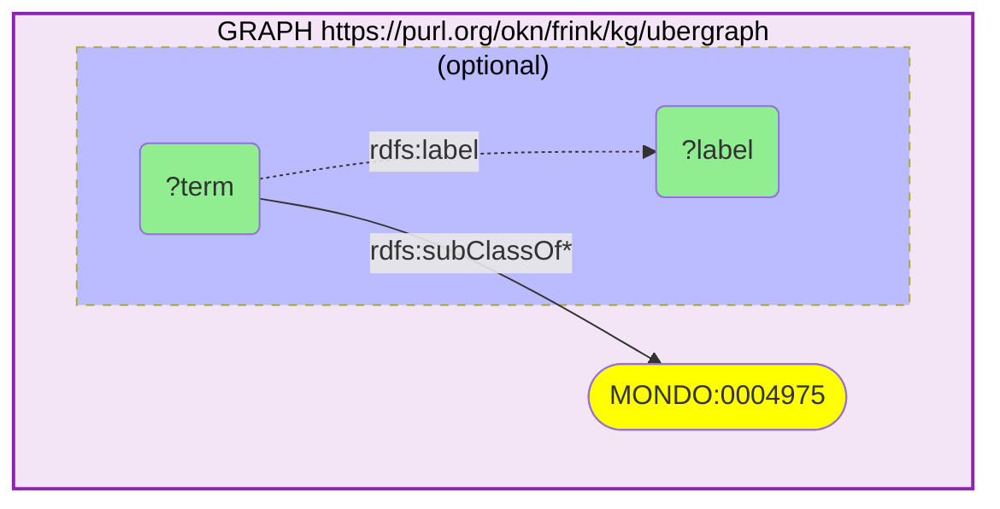

_22 row(s)_

#### Query 2

_2026-07-19T23:07:26+00:00 · `ubergraph`_

```sparql
PREFIX rdfs: <http://www.w3.org/2000/01/rdf-schema#>
SELECT DISTINCT ?term ?label WHERE {
  GRAPH <https://purl.org/okn/frink/kg/ubergraph> {
    ?term rdfs:subClassOf* <http://purl.obolibrary.org/obo/DOID_10652> .
    OPTIONAL { ?term rdfs:label ?label . }
  }
} LIMIT 300
```

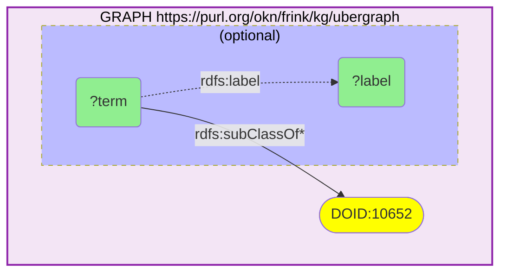

_1 row(s)_

#### Query 3

_2026-07-19T23:07:51+00:00 · `ubergraph`_

```sparql
PREFIX rdfs: <http://www.w3.org/2000/01/rdf-schema#>
PREFIX skos: <http://www.w3.org/2004/02/skos/core#>
PREFIX oio: <http://www.geneontology.org/formats/oboInOwl#>
SELECT DISTINCT ?disease ?label ?xref WHERE {
  GRAPH <https://purl.org/okn/frink/kg/ubergraph> {
    ?disease rdfs:subClassOf* <http://purl.obolibrary.org/obo/MONDO_0004975> .
    OPTIONAL { ?disease rdfs:label ?label }
    OPTIONAL {
      { ?disease skos:exactMatch ?xref } UNION { ?disease oio:hasDbXref ?xref }
    }
  }
}
```

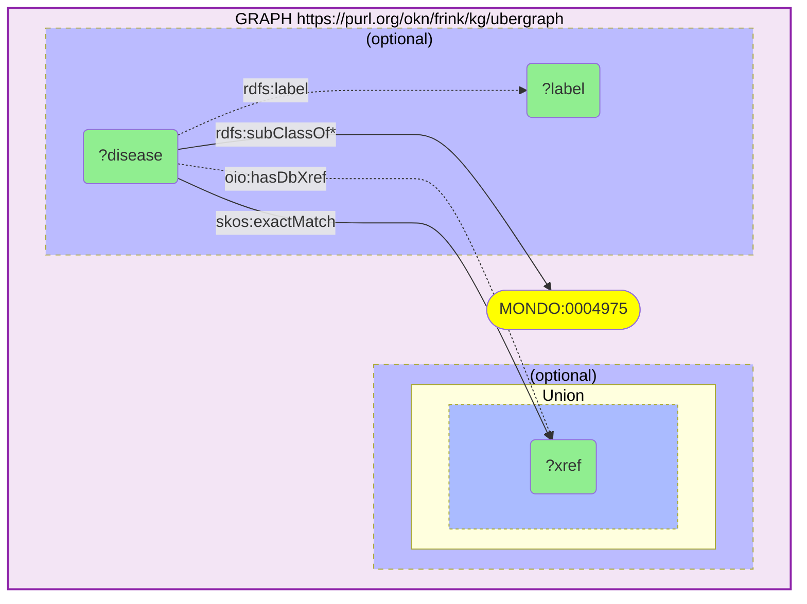

_235 row(s)_

#### Query 4

_2026-07-19T23:09:47+00:00 · `ubergraph`, `rdkg`_

```sparql
PREFIX rdfs: <http://www.w3.org/2000/01/rdf-schema#>
SELECT DISTINCT ?disease ?dLabel ?p WHERE {
  GRAPH <https://purl.org/okn/frink/kg/ubergraph> {
    ?disease rdfs:subClassOf* <http://purl.obolibrary.org/obo/MONDO_0004975> .
  }
  GRAPH <https://purl.org/okn/frink/kg/rdkg> {
    ?disease ?p ?o .
    OPTIONAL { ?disease rdfs:label ?dLabel }
  }
}
```

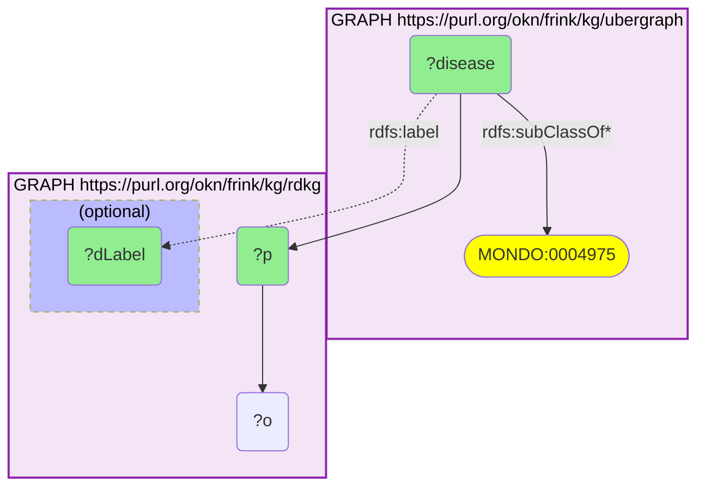

_121 row(s)_

#### Query 5

_2026-07-19T23:10:11+00:00 · `ubergraph`, `spoke-okn`_

```sparql
PREFIX rdfs: <http://www.w3.org/2000/01/rdf-schema#>
PREFIX skos: <http://www.w3.org/2004/02/skos/core#>
PREFIX spoke: <https://purl.org/okn/frink/kg/spoke-okn/schema/>
SELECT DISTINCT ?doid ?dLabel ?sym ?ensembl WHERE {
  GRAPH <https://purl.org/okn/frink/kg/ubergraph> {
    ?mondo rdfs:subClassOf* <http://purl.obolibrary.org/obo/MONDO_0004975> .
    ?mondo skos:exactMatch ?doid .
    FILTER(STRSTARTS(STR(?doid), "http://purl.obolibrary.org/obo/DOID_"))
  }
  GRAPH <https://purl.org/okn/frink/kg/spoke-okn> {
    ?doid spoke:ASSOCIATES_DaG ?gene .
    OPTIONAL { ?doid rdfs:label ?dLabel }
    OPTIONAL { ?gene rdfs:label ?sym }
    OPTIONAL { ?gene spoke:ensembl ?ensembl }
  }
}
```

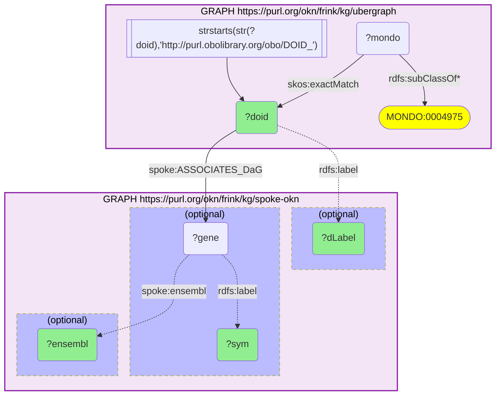

_180 row(s)_

#### Query 6

_2026-07-19T23:10:25+00:00 · `ubergraph`, `digcfdekg`_

```sparql
PREFIX rdfs: <http://www.w3.org/2000/01/rdf-schema#>
PREFIX skos: <http://www.w3.org/2004/02/skos/core#>
PREFIX dig: <https://purl.org/okn/frink/kg/digcfdekg/schema/>
SELECT DISTINCT ?trait ?traitLabel ?gene ?gLabel WHERE {
  {
    GRAPH <https://purl.org/okn/frink/kg/ubergraph> {
      ?mondo rdfs:subClassOf* <http://purl.obolibrary.org/obo/MONDO_0004975> .
    }
    GRAPH <https://purl.org/okn/frink/kg/digcfdekg> {
      ?gene dig:geneToTrait ?mondo .
      BIND(?mondo AS ?trait)
      OPTIONAL { ?mondo rdfs:label ?traitLabel }
      OPTIONAL { ?gene rdfs:label ?gLabel }
    }
  } UNION {
    GRAPH <https://purl.org/okn/frink/kg/ubergraph> {
      ?mondo2 rdfs:subClassOf* <http://purl.obolibrary.org/obo/MONDO_0004975> .
      ?mondo2 skos:exactMatch ?efo .
      FILTER(STRSTARTS(STR(?efo), "http://www.ebi.ac.uk/efo/EFO_") || CONTAINS(STR(?efo), "Orphanet_"))
    }
    GRAPH <https://purl.org/okn/frink/kg/digcfdekg> {
      ?gene dig:geneToTrait ?efo .
      BIND(?efo AS ?trait)
      OPTIONAL { ?efo rdfs:label ?traitLabel }
      OPTIONAL { ?gene rdfs:label ?gLabel }
    }
  }
}
```

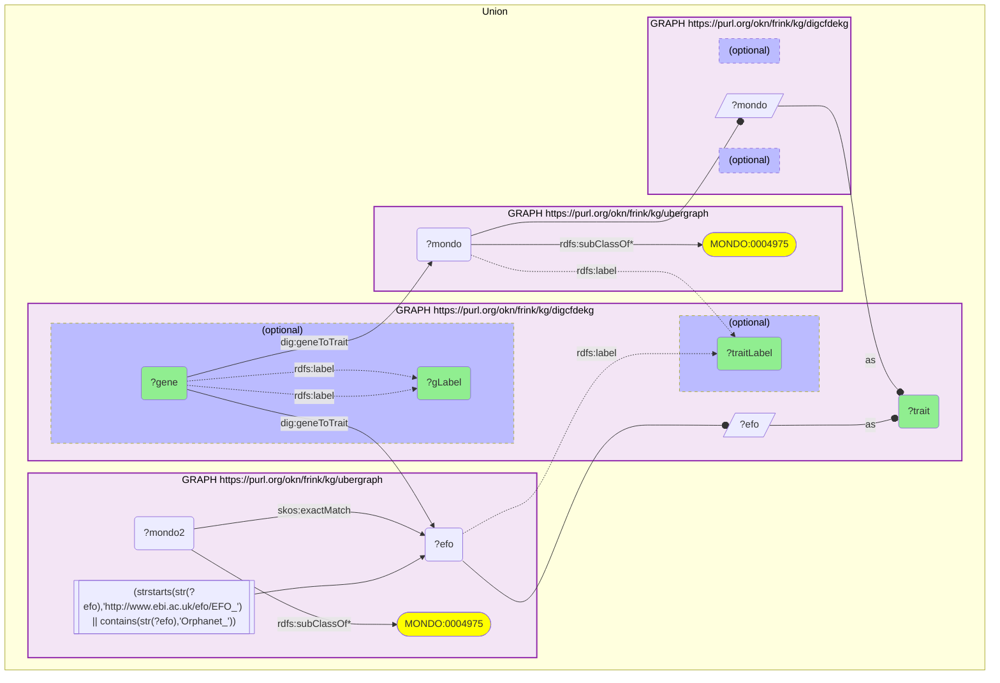

_34 row(s)_

#### Query 7

_2026-07-19T23:10:48+00:00 · `digcfdekg`_

```sparql
PREFIX rdfs: <http://www.w3.org/2000/01/rdf-schema#>
PREFIX dig: <https://purl.org/okn/frink/kg/digcfdekg/schema/>
SELECT DISTINCT ?trait ?traitLabel (COUNT(DISTINCT ?gene) AS ?nGenes) WHERE {
  GRAPH <https://purl.org/okn/frink/kg/digcfdekg> {
    ?gene dig:geneToTrait ?trait .
    ?trait rdfs:label ?traitLabel .
    FILTER(CONTAINS(LCASE(STR(?traitLabel)), "alzheimer") || CONTAINS(LCASE(STR(?traitLabel)), "dementia") || CONTAINS(LCASE(STR(?traitLabel)), "amyloid") || CONTAINS(LCASE(STR(?traitLabel)), "cognitive") || CONTAINS(LCASE(STR(?traitLabel)), "neurofibrillary"))
  }
}
GROUP BY ?trait ?traitLabel
```

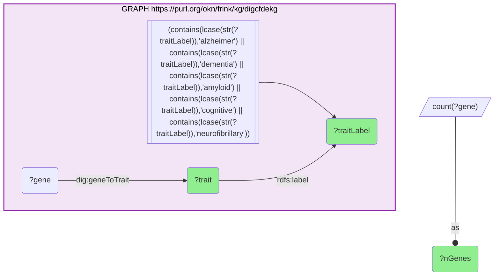

_56 row(s)_

#### Query 8

_2026-07-19T23:11:35+00:00 · `digcfdekg`_

```sparql
PREFIX rdf: <http://www.w3.org/1999/02/22-rdf-syntax-ns#>
PREFIX rdfs: <http://www.w3.org/2000/01/rdf-schema#>
PREFIX prov: <http://www.w3.org/ns/prov#>
PREFIX dig: <https://purl.org/okn/frink/kg/digcfdekg/schema/>
SELECT ?traitLabel ?entrez ?sym ?weight ?scoreType ?method WHERE {
  VALUES ?trait {
    <https://purl.org/okn/frink/kg/digcfdekg/node/trait/e021329febca767bbb43>
    <https://purl.org/okn/frink/kg/digcfdekg/node/trait/81ade4d08175c6695c5e>
    <http://www.ebi.ac.uk/efo/EFO_1001870>
    <https://purl.org/okn/frink/kg/digcfdekg/node/trait/6839c585cc9854226f8a>
    <http://www.orpha.net/ORDO/Orphanet_1020>
    <https://purl.org/okn/frink/kg/digcfdekg/node/trait/25b424c8d4d545160197>
    <http://purl.obolibrary.org/obo/OBA_2001000>
    <http://www.ebi.ac.uk/efo/EFO_0009268>
    <https://purl.org/okn/frink/kg/digcfdekg/node/trait/08145d50d3bbacb53f1d>
    <https://purl.org/okn/frink/kg/digcfdekg/node/trait/7fb3a3bda20fabba1e91>
    <https://purl.org/okn/frink/kg/digcfdekg/node/trait/8cac814b587f2bc63d4c>
    <http://www.ebi.ac.uk/efo/EFO_0004670>
    <http://www.ebi.ac.uk/efo/EFO_0005194>
    <http://www.ebi.ac.uk/efo/EFO_0005659>
    <http://www.ebi.ac.uk/efo/EFO_0006514>
    <http://www.ebi.ac.uk/efo/EFO_0006797>
    <http://www.ebi.ac.uk/efo/EFO_0007707>
    <http://www.ebi.ac.uk/efo/EFO_0007708>
    <http://www.ebi.ac.uk/efo/EFO_0007709>
    <http://www.ebi.ac.uk/efo/EFO_0007710>
    <https://purl.org/okn/frink/kg/digcfdekg/node/trait/118e5854cc16541c89a7>
  }
  GRAPH <https://purl.org/okn/frink/kg/digcfdekg> {
    ?stmt rdf:subject ?gene ;
          rdf:predicate dig:geneToTrait ;
          rdf:object ?trait ;
          dig:weight ?weight .
    OPTIONAL { ?stmt dig:scoreType/rdfs:label ?scoreType }
    OPTIONAL { ?stmt prov:wasGeneratedBy/rdfs:label ?method }
    ?trait rdfs:label ?traitLabel .
    ?gene rdfs:label ?sym .
    BIND(REPLACE(STR(?gene), "^.*/gene/", "") AS ?entrez)
  }
}
```

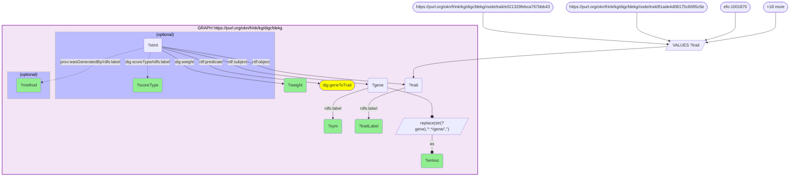

_3551 row(s)_

#### Query 9

_2026-07-19T23:13:06+00:00 · `prokn`_

```sparql
PREFIX rdfs: <http://www.w3.org/2000/01/rdf-schema#>
PREFIX skos: <http://www.w3.org/2004/02/skos/core#>
PREFIX up: <http://purl.uniprot.org/core/>
SELECT DISTINCT ?d ?dLabel ?xm WHERE {
  GRAPH <https://purl.org/okn/frink/kg/prokn> {
    ?d a up:Disease ; rdfs:label ?dLabel .
    FILTER(CONTAINS(LCASE(STR(?dLabel)), "alzheimer"))
    OPTIONAL { ?d skos:exactMatch ?xm }
  }
}
```

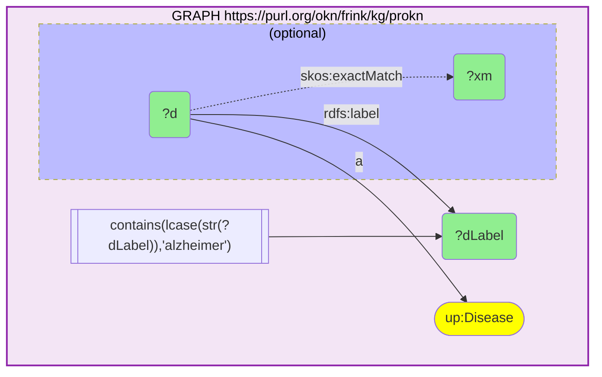

_9 row(s)_

#### Query 10

_2026-07-19T23:13:18+00:00 · `prokn`_

```sparql
PREFIX rdfs: <http://www.w3.org/2000/01/rdf-schema#>
PREFIX skos: <http://www.w3.org/2004/02/skos/core#>
PREFIX up: <http://purl.uniprot.org/core/>
PREFIX bl: <https://biolink.github.io/biolink-model/>
PREFIX sio: <http://semanticscience.org/resource/>
SELECT DISTINCT ?dLabel ?prot ?protLabel ?gene ?sym ?variant ?varComment WHERE {
  GRAPH <https://purl.org/okn/frink/kg/prokn> {
    ?d a up:Disease ; rdfs:label ?dLabel .
    FILTER(CONTAINS(LCASE(STR(?dLabel)), "alzheimer"))
    ?variant <http://purl.obolibrary.org/obo/RO_0002410> ?d .
    ?prot bl:has_sequence_variant ?variant .
    OPTIONAL { ?prot rdfs:label ?protLabel }
    OPTIONAL { ?gene sio:SIO_010078 ?prot . ?gene rdfs:label ?sym }
    OPTIONAL { ?variant rdfs:comment ?varComment }
  }
}
```

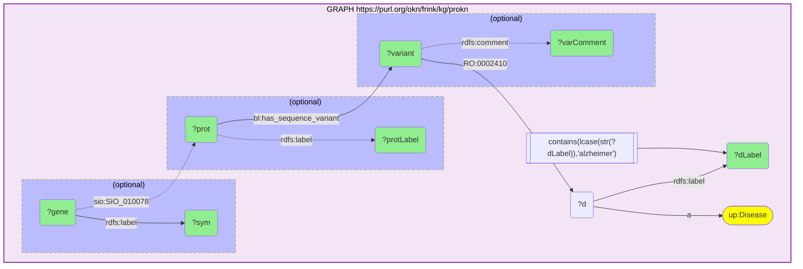

_827 row(s)_

#### Query 11

_2026-07-19T23:13:53+00:00 · `ubergraph`, `biomarkerkg`_

```sparql
PREFIX rdfs: <http://www.w3.org/2000/01/rdf-schema#>
PREFIX obci: <http://purl.obolibrary.org/obo/>
SELECT DISTINCT ?mondo ?dLabel ?rel ?biomarker ?bLabel ?assessed ?aLabel ?sample ?sLabel WHERE {
  GRAPH <https://purl.org/okn/frink/kg/ubergraph> {
    ?mondo rdfs:subClassOf* <http://purl.obolibrary.org/obo/MONDO_0004975> .
    OPTIONAL { ?mondo rdfs:label ?dLabel }
  }
  GRAPH <https://purl.org/okn/frink/kg/biomarkerkg> {
    { ?biomarker obci:OBCI_1000002 ?mondo . BIND("diagnostic_for" AS ?rel) }
    UNION { ?biomarker obci:OBCI_1000003 ?mondo . BIND("monitors_status_of" AS ?rel) }
    UNION { ?biomarker obci:OBCI_1000006 ?mondo . BIND("prognostic_for" AS ?rel) }
    UNION { ?biomarker obci:OBCI_1000008 ?mondo . BIND("indicates_risk_of_developing" AS ?rel) }
    OPTIONAL { ?biomarker rdfs:label ?bLabel }
    OPTIONAL {
      { ?biomarker obci:OBCI_1000009 ?assessed . BIND("above_normal" AS ?dir) }
      UNION { ?biomarker obci:OBCI_1000015 ?assessed . BIND("below_normal" AS ?dir) }
      UNION { ?biomarker obci:OBCI_1000016 ?assessed . BIND("presence_of" AS ?dir) }
      OPTIONAL { ?assessed rdfs:label ?aLabel }
    }
    OPTIONAL { ?biomarker obci:OBCI_1000018 ?sample . OPTIONAL { ?sample rdfs:label ?sLabel } }
  }
}
```

```mermaid
graph TD
classDef projected fill:lightgreen;
classDef literal fill:orange;
classDef iri fill:yellow;
  q11v8("?aLabel"):::projected 
  q11v7("?assessed"):::projected 
  q11v5("?bLabel"):::projected 
  q11v4("?biomarker"):::projected 
  q11v2("?dLabel"):::projected 
  q11v6("?dir")
  q11v1("?mondo"):::projected 
  q11v3("?rel"):::projected 
  q11v10("?sLabel"):::projected 
  q11v9("?sample"):::projected 
  subgraph q11graph0["GRAPH https://purl.org/okn/frink/kg/ubergraph"]
    style q11graph0 fill:#f3e5f5,stroke:#8e24aa,stroke-width:2px,color:#000;
    q11graph0c1(["obci:MONDO_0004975"]):::iri 
    q11v1 --"rdfs:subClassOf*"--> q11graph0c1
    subgraph q11optionalgraph00["(optional)"]
    style q11optionalgraph00 fill:#bbf,stroke-dasharray: 5 5,color:#000;
      q11v1 -."rdfs:label".-> q11v2
    end
  end
  subgraph q11graph1["GRAPH https://purl.org/okn/frink/kg/biomarkerkg"]
    style q11graph1 fill:#f3e5f5,stroke:#8e24aa,stroke-width:2px,color:#000;
    subgraph q11uniongraph10[" Union "]
    style q11uniongraph10 color:#000;
    subgraph q11uniongraph10l[" "]
      style q11uniongraph10l fill:#abf,stroke-dasharray: 3 3;
      q11v4 --"obci:OBCI_1000008"--> q11v1
      q11graph1bind0[/"'indicates_risk_of_developing'"/]
      q11graph1bind0 --as--o q11v3
    end
      subgraph q11uniongraph11[" Union "]
      style q11uniongraph11 color:#000;
      subgraph q11uniongraph11l[" "]
        style q11uniongraph11l fill:#abf,stroke-dasharray: 3 3;
        q11v4 --"obci:OBCI_1000006"--> q11v1
        q11graph1bind1[/"'prognostic_for'"/]
        q11graph1bind1 --as--o q11v3
      end
        subgraph q11uniongraph12[" Union "]
        style q11uniongraph12 color:#000;
        subgraph q11uniongraph12l[" "]
          style q11uniongraph12l fill:#abf,stroke-dasharray: 3 3;
          q11v4 --"obci:OBCI_1000003"--> q11v1
          q11graph1bind2[/"'monitors_status_of'"/]
          q11graph1bind2 --as--o q11v3
        end
        subgraph q11uniongraph12r[" "]
          style q11uniongraph12r fill:#abf,stroke-dasharray: 3 3;
          q11v4 --"obci:OBCI_1000002"--> q11v1
          q11graph1bind3[/"'diagnostic_for'"/]
          q11graph1bind3 --as--o q11v3
        end
        q11uniongraph12r <== or ==> q11uniongraph12l
        end
      end
    end
    subgraph q11optionalgraph11["(optional)"]
    style q11optionalgraph11 fill:#bbf,stroke-dasharray: 5 5,color:#000;
      q11v4 -."rdfs:label".-> q11v5
    end
    subgraph q11optionalgraph12["(optional)"]
    style q11optionalgraph12 fill:#bbf,stroke-dasharray: 5 5,color:#000;
      subgraph q11uniongraph13[" Union "]
      style q11uniongraph13 color:#000;
      subgraph q11uniongraph13l[" "]
        style q11uniongraph13l fill:#abf,stroke-dasharray: 3 3;
        q11v4 -."obci:OBCI_1000016".-> q11v7
        q11graph1bind4[/"'presence_of'"/]
        q11graph1bind4 --as--o q11v6
      end
        subgraph q11uniongraph14[" Union "]
        style q11uniongraph14 color:#000;
        subgraph q11uniongraph14l[" "]
          style q11uniongraph14l fill:#abf,stroke-dasharray: 3 3;
          q11v4 --"obci:OBCI_1000015"--> q11v7
          q11graph1bind5[/"'below_normal'"/]
          q11graph1bind5 --as--o q11v6
        end
        subgraph q11uniongraph14r[" "]
          style q11uniongraph14r fill:#abf,stroke-dasharray: 3 3;
          q11v4 --"obci:OBCI_1000009"--> q11v7
          q11graph1bind6[/"'above_normal'"/]
          q11graph1bind6 --as--o q11v6
        end
        q11uniongraph14r <== or ==> q11uniongraph14l
        end
      end
      subgraph q11optionalgraph13["(optional)"]
      style q11optionalgraph13 fill:#bbf,stroke-dasharray: 5 5,color:#000;
        q11v7 -."rdfs:label".-> q11v8
      end
    end
    subgraph q11optionalgraph14["(optional)"]
    style q11optionalgraph14 fill:#bbf,stroke-dasharray: 5 5,color:#000;
      q11v4 -."obci:OBCI_1000018".-> q11v9
      subgraph q11optionalgraph15["(optional)"]
      style q11optionalgraph15 fill:#bbf,stroke-dasharray: 5 5,color:#000;
        q11v9 -."rdfs:label".-> q11v10
      end
    end
  end
```

_1431 row(s)_

#### Query 12

_2026-07-19T23:14:54+00:00 · `ubergraph`, `oard-kg`_

```sparql
PREFIX rdfs: <http://www.w3.org/2000/01/rdf-schema#>
PREFIX bl: <https://w3id.org/biolink/vocab/>
SELECT ?adTerm ?adLabel ?position ?other ?otherLabel ?lnOR ?ci ?n ?pairCount WHERE {
  GRAPH <https://purl.org/okn/frink/kg/ubergraph> {
    ?mondo rdfs:subClassOf* <http://purl.obolibrary.org/obo/MONDO_0004975> .
  }
  GRAPH <https://purl.org/okn/frink/kg/oard-kg> {
    {
      ?assoc bl:subject ?mondo ; bl:object ?other .
      BIND("AD_as_subject" AS ?position)
    } UNION {
      ?assoc bl:object ?mondo ; bl:subject ?other .
      BIND("AD_as_object" AS ?position)
    }
    BIND(?mondo AS ?adTerm)
    OPTIONAL { ?mondo rdfs:label ?adLabel }
    OPTIONAL { ?other rdfs:label ?otherLabel }
    OPTIONAL {
      ?assoc bl:has_supporting_studies ?study .
      ?study bl:has_study_results ?res .
      OPTIONAL { ?res bl:log_odds_ratio ?lnOR }
      OPTIONAL { ?res bl:log_odds_ratio_95_ci ?ci }
      OPTIONAL { ?res bl:total_sample_size ?n }
      OPTIONAL { ?res bl:concept_pair_count ?pairCount }
    }
  }
}
```

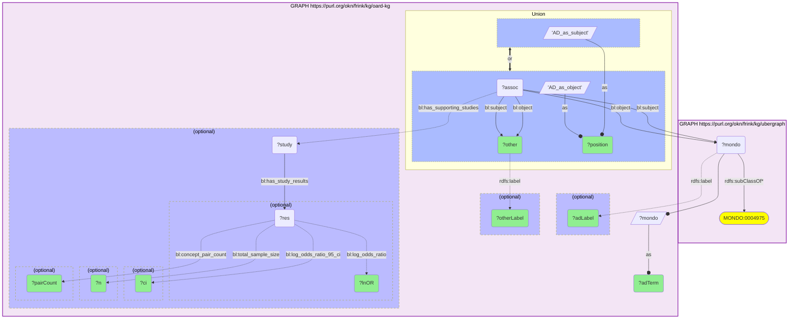

_689 row(s)_

#### Query 13

_2026-07-19T23:15:27+00:00 · `ubergraph`, `gene-expression-atlas-okn`_

```sparql
PREFIX rdfs: <http://www.w3.org/2000/01/rdf-schema#>
PREFIX skos: <http://www.w3.org/2004/02/skos/core#>
PREFIX bl: <https://w3id.org/biolink/vocab/>
PREFIX wobd: <http://purl.org/okn/wobd/>
SELECT DISTINCT ?disease ?dLabel ?study ?title ?factors ?tech ?pmid WHERE {
  {
    GRAPH <https://purl.org/okn/frink/kg/ubergraph> {
      ?mondo rdfs:subClassOf* <http://purl.obolibrary.org/obo/MONDO_0004975> .
      { ?mondo skos:exactMatch ?disease } UNION { BIND(?mondo AS ?disease) }
    }
    GRAPH <https://purl.org/okn/frink/kg/gene-expression-atlas-okn> {
      ?study bl:studies ?disease .
    }
  }
  GRAPH <https://purl.org/okn/frink/kg/gene-expression-atlas-okn> {
    OPTIONAL { ?disease rdfs:label ?dLabel }
    OPTIONAL { ?study wobd:project_title ?title }
    OPTIONAL { ?study wobd:experimental_factors ?factors }
    OPTIONAL { ?study wobd:technology ?tech }
    OPTIONAL { ?study wobd:pubmed_id ?pmid }
  }
}
```

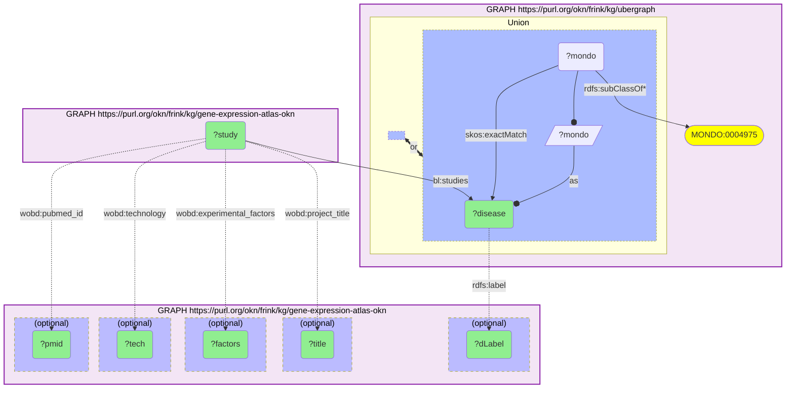

_3020 row(s)_

#### Query 14

_2026-07-19T23:16:23+00:00 · `ubergraph`, `gene-expression-atlas-okn`_

```sparql
PREFIX rdfs: <http://www.w3.org/2000/01/rdf-schema#>
PREFIX skos: <http://www.w3.org/2004/02/skos/core#>
PREFIX bl: <https://w3id.org/biolink/vocab/>
PREFIX wobd: <http://purl.org/okn/wobd/>
SELECT DISTINCT ?disease ?study ?title ?tech ?pmid WHERE {
  {
    SELECT DISTINCT ?disease WHERE {
      GRAPH <https://purl.org/okn/frink/kg/ubergraph> {
        ?mondo rdfs:subClassOf* <http://purl.obolibrary.org/obo/MONDO_0004975> .
        { BIND(?mondo AS ?disease) }
        UNION
        { ?mondo skos:exactMatch ?disease .
          FILTER(STRSTARTS(STR(?disease), "http://purl.obolibrary.org/obo/DOID_")
              || STRSTARTS(STR(?disease), "http://www.ebi.ac.uk/efo/EFO_")
              || CONTAINS(STR(?disease), "Orphanet_")) }
      }
    }
  }
  GRAPH <https://purl.org/okn/frink/kg/gene-expression-atlas-okn> {
    ?study bl:studies ?disease .
    OPTIONAL { ?study wobd:project_title ?title }
    OPTIONAL { ?study wobd:technology ?tech }
    OPTIONAL { ?study wobd:pubmed_id ?pmid }
  }
}
```

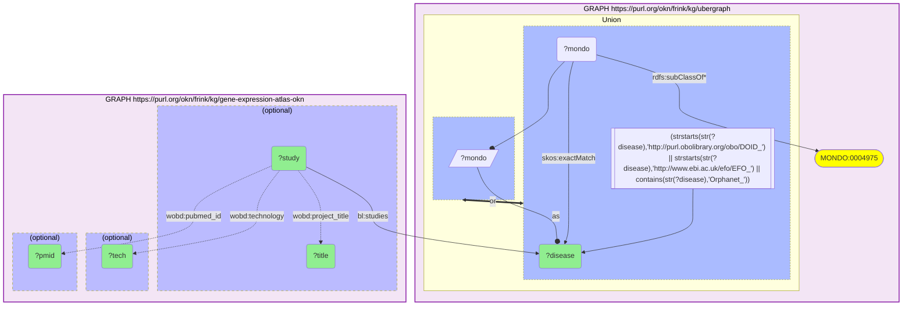

_3020 row(s)_

#### Query 15

_2026-07-19T23:17:02+00:00 · `gene-expression-atlas-okn`_

```sparql
PREFIX bl: <https://w3id.org/biolink/vocab/>
PREFIX wobd: <http://purl.org/okn/wobd/>
PREFIX rdfs: <http://www.w3.org/2000/01/rdf-schema#>
SELECT DISTINCT ?assayName ?attr ?attrType ?attrLabel WHERE {
  GRAPH <https://purl.org/okn/frink/kg/gene-expression-atlas-okn> {
    ?study bl:studies <http://purl.obolibrary.org/obo/MONDO_0004975> ;
           bl:has_output ?assay .
    ?assay bl:name ?assayName ; bl:has_attribute ?attr .
    OPTIONAL { ?attr a ?attrType }
    OPTIONAL { ?attr rdfs:label ?attrLabel }
  }
}
```

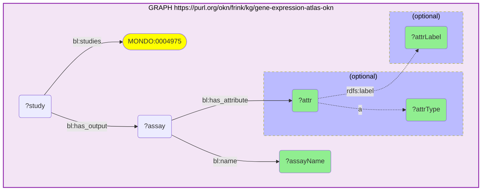

_101 row(s)_

#### Query 16

_2026-07-19T23:17:34+00:00 · `gene-expression-atlas-okn`_

```sparql
PREFIX bl: <https://w3id.org/biolink/vocab/>
PREFIX wobd: <http://purl.org/okn/wobd/>
SELECT ?assayName ?sym ?dir ?log2fc ?adjp WHERE {
  GRAPH <https://purl.org/okn/frink/kg/gene-expression-atlas-okn> {
    ?study bl:studies <http://purl.obolibrary.org/obo/MONDO_0004975> ;
           bl:has_output ?assay .
    ?assay bl:name ?assayName .
    ?assoc bl:subject ?assay ; bl:object ?gene ;
           wobd:direction ?dir ; wobd:adj_p_value ?adjp .
    OPTIONAL { ?assoc wobd:log2fc ?log2fc }
    ?gene bl:symbol ?sym .
  }
}
```

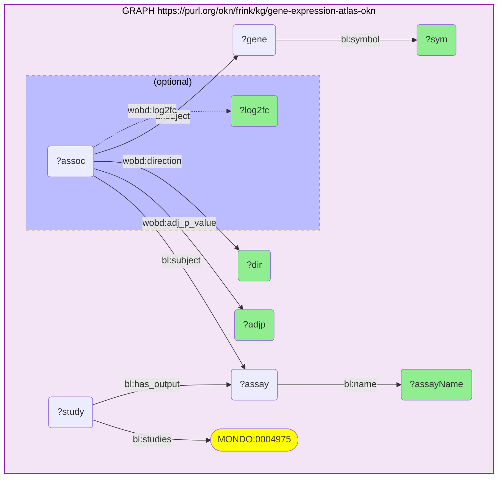

_11033 row(s)_

#### Query 17

_2026-07-19T23:17:41+00:00 · `gene-expression-atlas-okn`, `ubergraph`_

```sparql
PREFIX bl: <https://w3id.org/biolink/vocab/>
PREFIX rdfs: <http://www.w3.org/2000/01/rdf-schema#>
SELECT DISTINCT ?assayName ?attr ?attrClass ?attrLabel WHERE {
  GRAPH <https://purl.org/okn/frink/kg/gene-expression-atlas-okn> {
    ?study bl:studies <http://purl.obolibrary.org/obo/MONDO_0004975> ;
           bl:has_output ?assay .
    ?assay bl:name ?assayName ; bl:has_attribute ?attr .
    ?attr a ?attrClass .
    FILTER(?attrClass IN (bl:AnatomicalEntity, bl:Cell))
  }
  OPTIONAL {
    GRAPH <https://purl.org/okn/frink/kg/ubergraph> { ?attr rdfs:label ?attrLabel }
  }
}
```

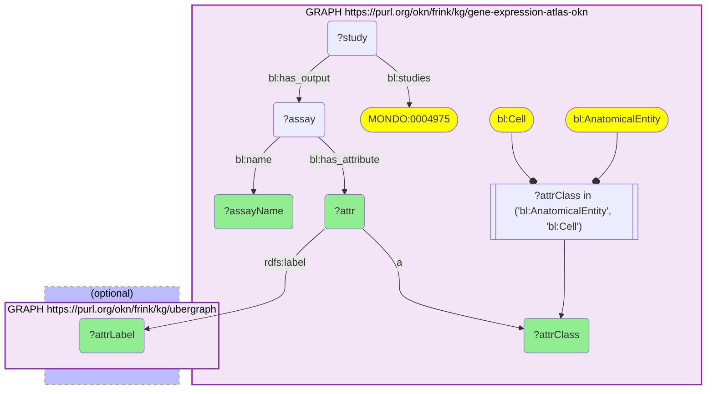

_52 row(s)_

#### Query 18

_2026-07-19T23:18:27+00:00 · `ubergraph`, `spoke-okn`_

```sparql
PREFIX rdf: <http://www.w3.org/1999/02/22-rdf-syntax-ns#>
PREFIX rdfs: <http://www.w3.org/2000/01/rdf-schema#>
PREFIX skos: <http://www.w3.org/2004/02/skos/core#>
PREFIX spoke: <https://purl.org/okn/frink/kg/spoke-okn/schema/>
SELECT DISTINCT ?rel ?compound ?cLabel ?maxPhase ?phase ?sources ?dbxref WHERE {
  GRAPH <https://purl.org/okn/frink/kg/ubergraph> {
    ?mondo rdfs:subClassOf* <http://purl.obolibrary.org/obo/MONDO_0004975> .
    ?mondo skos:exactMatch ?doid .
    FILTER(STRSTARTS(STR(?doid), "http://purl.obolibrary.org/obo/DOID_"))
  }
  GRAPH <https://purl.org/okn/frink/kg/spoke-okn> {
    {
      ?stmt rdf:subject ?compound ; rdf:predicate spoke:TREATS_CtD ; rdf:object ?doid .
      BIND("TREATS" AS ?rel)
      OPTIONAL { ?stmt spoke:phase ?phase }
      OPTIONAL { ?stmt spoke:act_sources ?sources }
    } UNION {
      ?stmt rdf:subject ?compound ; rdf:predicate spoke:CONTRAINDICATES_CcD ; rdf:object ?doid .
      BIND("CONTRAINDICATES" AS ?rel)
      OPTIONAL { ?stmt spoke:act_sources ?sources }
    }
    OPTIONAL { ?compound rdfs:label ?cLabel }
    OPTIONAL { ?compound spoke:max_phase ?maxPhase }
    OPTIONAL { ?compound <http://www.geneontology.org/formats/oboInOwl#hasDbXref> ?dbxref }
  }
}
```

```mermaid
graph TD
classDef projected fill:lightgreen;
classDef literal fill:orange;
classDef iri fill:yellow;
  q18v8("?cLabel"):::projected 
  q18v5("?compound"):::projected 
  q18v10("?dbxref"):::projected 
  q18v1("?doid")
  q18v9("?maxPhase"):::projected 
  q18v2("?mondo")
  q18v6("?phase"):::projected 
  q18v3("?rel"):::projected 
  q18v7("?sources"):::projected 
  q18v4("?stmt")
  subgraph q18graph0["GRAPH https://purl.org/okn/frink/kg/ubergraph"]
    style q18graph0 fill:#f3e5f5,stroke:#8e24aa,stroke-width:2px,color:#000;
    q18graph0c1(["MONDO:0004975"]):::iri 
    q18graph0f0[["strstarts(str(?doid),'http://purl.obolibrary.org/obo/DOID_')"]]
    q18graph0f0 --> q18v1
    q18v2 --"rdfs:subClassOf*"--> q18graph0c1
    q18v2 --"skos:exactMatch"--> q18v1
  end
  subgraph q18graph1["GRAPH https://purl.org/okn/frink/kg/spoke-okn"]
    style q18graph1 fill:#f3e5f5,stroke:#8e24aa,stroke-width:2px,color:#000;
    q18graph1c7(["spoke:CONTRAINDICATES_CcD"]):::iri 
    q18graph1c2(["spoke:TREATS_CtD"]):::iri 
    subgraph q18uniongraph10[" Union "]
    style q18uniongraph10 color:#000;
    subgraph q18uniongraph10l[" "]
      style q18uniongraph10l fill:#abf,stroke-dasharray: 3 3;
      q18v4 --"rdf:predicate"--> q18graph1c7
      q18v4 --"rdf:object"--> q18v1
      q18v4 --"rdf:subject"--> q18v5
      q18graph1bind0[/"'CONTRAINDICATES'"/]
      q18graph1bind0 --as--o q18v3
      subgraph q18optionalgraph10["(optional)"]
      style q18optionalgraph10 fill:#bbf,stroke-dasharray: 5 5,color:#000;
        q18v4 -."spoke:act_sources".-> q18v7
      end
    end
    subgraph q18uniongraph10r[" "]
      style q18uniongraph10r fill:#abf,stroke-dasharray: 3 3;
      q18v4 --"rdf:predicate"--> q18graph1c2
      q18v4 --"rdf:object"--> q18v1
      q18v4 --"rdf:subject"--> q18v5
      q18graph1bind1[/"'TREATS'"/]
      q18graph1bind1 --as--o q18v3
      subgraph q18optionalgraph11["(optional)"]
      style q18optionalgraph11 fill:#bbf,stroke-dasharray: 5 5,color:#000;
        q18v4 -."spoke:phase".-> q18v6
      end
      subgraph q18optionalgraph12["(optional)"]
      style q18optionalgraph12 fill:#bbf,stroke-dasharray: 5 5,color:#000;
        q18v4 -."spoke:act_sources".-> q18v7
      end
    end
    q18uniongraph10r <== or ==> q18uniongraph10l
    end
    subgraph q18optionalgraph13["(optional)"]
    style q18optionalgraph13 fill:#bbf,stroke-dasharray: 5 5,color:#000;
      q18v5 -."rdfs:label".-> q18v8
    end
    subgraph q18optionalgraph14["(optional)"]
    style q18optionalgraph14 fill:#bbf,stroke-dasharray: 5 5,color:#000;
      q18v5 -."spoke:max_phase".-> q18v9
    end
    subgraph q18optionalgraph15["(optional)"]
    style q18optionalgraph15 fill:#bbf,stroke-dasharray: 5 5,color:#000;
      q18v5 -."oboInOwl:hasDbXref".-> q18v10
    end
  end
```

_65 row(s)_

#### Query 19

_2026-07-19T23:18:39+00:00 · `ubergraph`, `spoke-okn`_

```sparql
PREFIX rdf: <http://www.w3.org/1999/02/22-rdf-syntax-ns#>
PREFIX rdfs: <http://www.w3.org/2000/01/rdf-schema#>
PREFIX skos: <http://www.w3.org/2004/02/skos/core#>
PREFIX spoke: <https://purl.org/okn/frink/kg/spoke-okn/schema/>
SELECT DISTINCT ?rel ?cLabel ?maxPhase ?phase ?sources ?drugbank WHERE {
  GRAPH <https://purl.org/okn/frink/kg/ubergraph> {
    ?mondo rdfs:subClassOf* <http://purl.obolibrary.org/obo/MONDO_0004975> .
    ?mondo skos:exactMatch ?doid .
    FILTER(STRSTARTS(STR(?doid), "http://purl.obolibrary.org/obo/DOID_"))
  }
  GRAPH <https://purl.org/okn/frink/kg/spoke-okn> {
    {
      ?stmt rdf:subject ?compound ; rdf:predicate spoke:TREATS_CtD ; rdf:object ?doid .
      BIND("TREATS" AS ?rel)
      OPTIONAL { ?stmt spoke:phase ?phase }
      OPTIONAL { ?stmt spoke:act_sources ?sources }
    } UNION {
      ?stmt rdf:subject ?compound ; rdf:predicate spoke:CONTRAINDICATES_CcD ; rdf:object ?doid .
      BIND("CONTRAINDICATES" AS ?rel)
      OPTIONAL { ?stmt spoke:act_sources ?sources }
    }
    ?compound rdfs:label ?cLabel .
    OPTIONAL { ?compound spoke:max_phase ?maxPhase }
    OPTIONAL { ?compound <http://www.geneontology.org/formats/oboInOwl#hasDbXref> ?drugbank .
               FILTER(STRSTARTS(STR(?drugbank), "http://identifiers.org/drugbank/")) }
  }
}
```

```mermaid
graph TD
classDef projected fill:lightgreen;
classDef literal fill:orange;
classDef iri fill:yellow;
  q19v8("?cLabel"):::projected 
  q19v5("?compound")
  q19v1("?doid")
  q19v10("?drugbank"):::projected 
  q19v9("?maxPhase"):::projected 
  q19v2("?mondo")
  q19v6("?phase"):::projected 
  q19v3("?rel"):::projected 
  q19v7("?sources"):::projected 
  q19v4("?stmt")
  subgraph q19graph0["GRAPH https://purl.org/okn/frink/kg/ubergraph"]
    style q19graph0 fill:#f3e5f5,stroke:#8e24aa,stroke-width:2px,color:#000;
    q19graph0c1(["MONDO:0004975"]):::iri 
    q19graph0f0[["strstarts(str(?doid),'http://purl.obolibrary.org/obo/DOID_')"]]
    q19graph0f0 --> q19v1
    q19v2 --"rdfs:subClassOf*"--> q19graph0c1
    q19v2 --"skos:exactMatch"--> q19v1
  end
  subgraph q19graph1["GRAPH https://purl.org/okn/frink/kg/spoke-okn"]
    style q19graph1 fill:#f3e5f5,stroke:#8e24aa,stroke-width:2px,color:#000;
    q19graph1c7(["spoke:CONTRAINDICATES_CcD"]):::iri 
    q19graph1c2(["spoke:TREATS_CtD"]):::iri 
    subgraph q19uniongraph10[" Union "]
    style q19uniongraph10 color:#000;
    subgraph q19uniongraph10l[" "]
      style q19uniongraph10l fill:#abf,stroke-dasharray: 3 3;
      q19v4 --"rdf:predicate"--> q19graph1c7
      q19v4 --"rdf:object"--> q19v1
      q19v4 --"rdf:subject"--> q19v5
      q19graph1bind0[/"'CONTRAINDICATES'"/]
      q19graph1bind0 --as--o q19v3
      subgraph q19optionalgraph10["(optional)"]
      style q19optionalgraph10 fill:#bbf,stroke-dasharray: 5 5,color:#000;
        q19v4 -."spoke:act_sources".-> q19v7
      end
    end
    subgraph q19uniongraph10r[" "]
      style q19uniongraph10r fill:#abf,stroke-dasharray: 3 3;
      q19v4 --"rdf:predicate"--> q19graph1c2
      q19v4 --"rdf:object"--> q19v1
      q19v4 --"rdf:subject"--> q19v5
      q19graph1bind1[/"'TREATS'"/]
      q19graph1bind1 --as--o q19v3
      subgraph q19optionalgraph11["(optional)"]
      style q19optionalgraph11 fill:#bbf,stroke-dasharray: 5 5,color:#000;
        q19v4 -."spoke:phase".-> q19v6
      end
      subgraph q19optionalgraph12["(optional)"]
      style q19optionalgraph12 fill:#bbf,stroke-dasharray: 5 5,color:#000;
        q19v4 -."spoke:act_sources".-> q19v7
      end
    end
    q19uniongraph10r <== or ==> q19uniongraph10l
    end
    q19v5 --"rdfs:label"--> q19v8
    subgraph q19optionalgraph13["(optional)"]
    style q19optionalgraph13 fill:#bbf,stroke-dasharray: 5 5,color:#000;
      q19v5 -."spoke:max_phase".-> q19v9
    end
    subgraph q19optionalgraph14["(optional)"]
    style q19optionalgraph14 fill:#bbf,stroke-dasharray: 5 5,color:#000;
      q19v5 -."oboInOwl:hasDbXref".-> q19v10
    end
  end
```

_11 row(s)_

#### Query 20

_2026-07-19T23:18:50+00:00 · `spoke-okn`_

```sparql
PREFIX rdf: <http://www.w3.org/1999/02/22-rdf-syntax-ns#>
PREFIX spoke: <https://purl.org/okn/frink/kg/spoke-okn/schema/>
SELECT ?rel (COUNT(DISTINCT ?compound) AS ?nCompounds) WHERE {
  GRAPH <https://purl.org/okn/frink/kg/spoke-okn> {
    {
      ?stmt rdf:subject ?compound ; rdf:predicate spoke:TREATS_CtD ; rdf:object <http://purl.obolibrary.org/obo/DOID_10652> .
      BIND("TREATS_CtD" AS ?rel)
    } UNION {
      ?stmt rdf:subject ?compound ; rdf:predicate spoke:CONTRAINDICATES_CcD ; rdf:object <http://purl.obolibrary.org/obo/DOID_10652> .
      BIND("CONTRAINDICATES_CcD" AS ?rel)
    } UNION {
      ?stmt rdf:subject ?compound ; rdf:predicate spoke:UPREGULATES_CuG ; rdf:object ?g .
      <http://purl.obolibrary.org/obo/DOID_10652> spoke:ASSOCIATES_DaG ?g .
      BIND("UPREGULATES_CuG (AD gene)" AS ?rel)
    } UNION {
      ?stmt rdf:subject ?compound ; rdf:predicate spoke:DOWNREGULATES_CdG ; rdf:object ?g .
      <http://purl.obolibrary.org/obo/DOID_10652> spoke:ASSOCIATES_DaG ?g .
      BIND("DOWNREGULATES_CdG (AD gene)" AS ?rel)
    }
  }
} GROUP BY ?rel
```

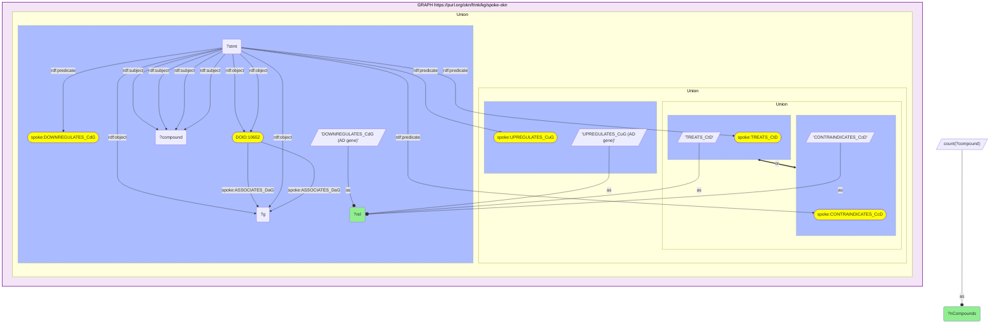

_1 row(s)_

#### Query 21

_2026-07-19T23:19:01+00:00 · `spoke-okn`_

```sparql
PREFIX rdfs: <http://www.w3.org/2000/01/rdf-schema#>
PREFIX spoke: <https://purl.org/okn/frink/kg/spoke-okn/schema/>
SELECT DISTINCT ?rel ?cLabel ?maxPhase ?sym WHERE {
  GRAPH <https://purl.org/okn/frink/kg/spoke-okn> {
    <http://purl.obolibrary.org/obo/DOID_10652> spoke:ASSOCIATES_DaG ?gene .
    ?gene rdfs:label ?sym .
    { ?compound spoke:UPREGULATES_CuG ?gene . BIND("UPREGULATES" AS ?rel) }
    UNION
    { ?compound spoke:DOWNREGULATES_CdG ?gene . BIND("DOWNREGULATES" AS ?rel) }
    ?compound rdfs:label ?cLabel .
    OPTIONAL { ?compound spoke:max_phase ?maxPhase }
  }
}
```

```mermaid
graph TD
classDef projected fill:lightgreen;
classDef literal fill:orange;
classDef iri fill:yellow;
  q21v5("?cLabel"):::projected 
  q21v4("?compound")
  q21v1("?gene")
  q21v6("?maxPhase"):::projected 
  q21v3("?rel"):::projected 
  q21v2("?sym"):::projected 
  subgraph q21graph0["GRAPH https://purl.org/okn/frink/kg/spoke-okn"]
    style q21graph0 fill:#f3e5f5,stroke:#8e24aa,stroke-width:2px,color:#000;
    q21graph0c1(["DOID:10652"]):::iri 
    q21graph0c1 --"spoke:ASSOCIATES_DaG"--> q21v1
    q21v1 --"rdfs:label"--> q21v2
    subgraph q21uniongraph00[" Union "]
    style q21uniongraph00 color:#000;
    subgraph q21uniongraph00l[" "]
      style q21uniongraph00l fill:#abf,stroke-dasharray: 3 3;
      q21v4 --"spoke:DOWNREGULATES_CdG"--> q21v1
      q21graph0bind0[/"'DOWNREGULATES'"/]
      q21graph0bind0 --as--o q21v3
    end
    subgraph q21uniongraph00r[" "]
      style q21uniongraph00r fill:#abf,stroke-dasharray: 3 3;
      q21v4 --"spoke:UPREGULATES_CuG"--> q21v1
      q21graph0bind1[/"'UPREGULATES'"/]
      q21graph0bind1 --as--o q21v3
    end
    q21uniongraph00r <== or ==> q21uniongraph00l
    end
    q21v4 --"rdfs:label"--> q21v5
    subgraph q21optionalgraph00["(optional)"]
    style q21optionalgraph00 fill:#bbf,stroke-dasharray: 5 5,color:#000;
      q21v4 -."spoke:max_phase".-> q21v6
    end
  end
```

_95 row(s)_

#### Query 22

_2026-07-19T23:19:17+00:00 · `prokn`_

```sparql
PREFIX rdfs: <http://www.w3.org/2000/01/rdf-schema#>
PREFIX up: <http://purl.uniprot.org/core/>
PREFIX ncit: <http://purl.obolibrary.org/obo/>
PREFIX schema: <http://schema.org/>
SELECT DISTINCT ?dLabel ?compound ?cName ?cType ?status ?approval WHERE {
  GRAPH <https://purl.org/okn/frink/kg/prokn> {
    ?d a up:Disease ; rdfs:label ?dLabel .
    FILTER(CONTAINS(LCASE(STR(?dLabel)), "alzheimer"))
    ?compound ncit:NCIT_C41184 ?d .
    OPTIONAL { ?compound schema:name ?cName }
    OPTIONAL { ?compound a ?cType }
    OPTIONAL { ?compound schema:status ?status }
    OPTIONAL { ?compound ncit:NCIT_C25425 ?approval }
  }
}
```

```mermaid
graph TD
classDef projected fill:lightgreen;
classDef literal fill:orange;
classDef iri fill:yellow;
  q22v7("?approval"):::projected 
  q22v4("?cName"):::projected 
  q22v5("?cType"):::projected 
  q22v3("?compound"):::projected 
  q22v2("?d")
  q22v1("?dLabel"):::projected 
  q22v6("?status"):::projected 
  subgraph q22graph0["GRAPH https://purl.org/okn/frink/kg/prokn"]
    style q22graph0 fill:#f3e5f5,stroke:#8e24aa,stroke-width:2px,color:#000;
    q22graph0c2(["up:Disease"]):::iri 
    q22graph0f0[["contains(lcase(str(?dLabel)),'alzheimer')"]]
    q22graph0f0 --> q22v1
    q22v2 --"a"--> q22graph0c2
    q22v3 --"ncit:NCIT_C41184"--> q22v2
    q22v2 --"rdfs:label"--> q22v1
    subgraph q22optionalgraph00["(optional)"]
    style q22optionalgraph00 fill:#bbf,stroke-dasharray: 5 5,color:#000;
      q22v3 -."schema:name".-> q22v4
    end
    subgraph q22optionalgraph01["(optional)"]
    style q22optionalgraph01 fill:#bbf,stroke-dasharray: 5 5,color:#000;
      q22v3 -."a".-> q22v5
    end
    subgraph q22optionalgraph02["(optional)"]
    style q22optionalgraph02 fill:#bbf,stroke-dasharray: 5 5,color:#000;
      q22v3 -."schema:status".-> q22v6
    end
    subgraph q22optionalgraph03["(optional)"]
    style q22optionalgraph03 fill:#bbf,stroke-dasharray: 5 5,color:#000;
      q22v3 -."ncit:NCIT_C25425".-> q22v7
    end
  end
```

_892 row(s)_

#### Query 23

_2026-07-19T23:19:36+00:00 · `prokn`_

```sparql
PREFIX rdfs: <http://www.w3.org/2000/01/rdf-schema#>
PREFIX up: <http://purl.uniprot.org/core/>
PREFIX ncit: <http://purl.obolibrary.org/obo/>
PREFIX schema: <http://schema.org/>
PREFIX bl: <https://biolink.github.io/biolink-model/>
SELECT DISTINCT ?compound ?label ?isDrug ?approval ?maxPhase ?blackBox ?targetSym WHERE {
  GRAPH <https://purl.org/okn/frink/kg/prokn> {
    ?d a up:Disease ; rdfs:label ?dLabel .
    FILTER(CONTAINS(LCASE(STR(?dLabel)), "alzheimer"))
    ?compound ncit:NCIT_C41184 ?d .
    OPTIONAL { ?compound rdfs:label ?label }
    OPTIONAL { ?compound a schema:Drug BIND(true AS ?isDrug) }
    OPTIONAL { ?compound ncit:NCIT_C25425 ?approval }
    OPTIONAL { ?compound <https://w3id.org/reproduceme#Phase> ?maxPhase }
    OPTIONAL { ?compound bl:black_box_warning ?blackBox }
    OPTIONAL { ?compound ncit:RO_0002436 ?prot . ?g <http://semanticscience.org/resource/SIO_010078> ?prot . ?g rdfs:label ?targetSym }
  }
}
```

```mermaid
graph TD
classDef projected fill:lightgreen;
classDef literal fill:orange;
classDef iri fill:yellow;
  q23v6("?approval"):::projected 
  q23v8("?blackBox"):::projected 
  q23v3("?compound"):::projected 
  q23v2("?d")
  q23v1("?dLabel")
  q23v9("?g")
  q23v5("?isDrug"):::projected 
  q23v4("?label"):::projected 
  q23v7("?maxPhase"):::projected 
  q23v10("?prot")
  q23v11("?targetSym"):::projected 
  subgraph q23graph0["GRAPH https://purl.org/okn/frink/kg/prokn"]
    style q23graph0 fill:#f3e5f5,stroke:#8e24aa,stroke-width:2px,color:#000;
    q23graph0c2(["up:Disease"]):::iri 
    q23graph0c5(["schema:Drug"]):::iri 
    q23graph0f0[["contains(lcase(str(?dLabel)),'alzheimer')"]]
    q23graph0f0 --> q23v1
    q23v2 --"a"--> q23graph0c2
    q23v3 --"ncit:NCIT_C41184"--> q23v2
    q23v2 --"rdfs:label"--> q23v1
    subgraph q23optionalgraph00["(optional)"]
    style q23optionalgraph00 fill:#bbf,stroke-dasharray: 5 5,color:#000;
      q23v3 -."rdfs:label".-> q23v4
    end
    subgraph q23optionalgraph01["(optional)"]
    style q23optionalgraph01 fill:#bbf,stroke-dasharray: 5 5,color:#000;
      q23v3 -."a".-> q23graph0c5
      q23graph0bind0[/"'true^^xsd:boolean'"/]
      q23graph0bind0 --as--o q23v5
    end
    subgraph q23optionalgraph02["(optional)"]
    style q23optionalgraph02 fill:#bbf,stroke-dasharray: 5 5,color:#000;
      q23v3 -."ncit:NCIT_C25425".-> q23v6
    end
    subgraph q23optionalgraph03["(optional)"]
    style q23optionalgraph03 fill:#bbf,stroke-dasharray: 5 5,color:#000;
      q23v3 -."https://w3id.org/reproduceme#Phase".-> q23v7
    end
    subgraph q23optionalgraph04["(optional)"]
    style q23optionalgraph04 fill:#bbf,stroke-dasharray: 5 5,color:#000;
      q23v3 -."bl:black_box_warning".-> q23v8
    end
    subgraph q23optionalgraph05["(optional)"]
    style q23optionalgraph05 fill:#bbf,stroke-dasharray: 5 5,color:#000;
      q23v9 -."sio:010078".-> q23v10
      q23v3 --"ncit:RO_0002436"--> q23v10
      q23v9 --"rdfs:label"--> q23v11
    end
  end
```

_1408 row(s)_

#### Query 24

_2026-07-19T23:20:17+00:00 · `prokn`_

```sparql
PREFIX rdfs: <http://www.w3.org/2000/01/rdf-schema#>
PREFIX up: <http://purl.uniprot.org/core/>
PREFIX obo: <http://purl.obolibrary.org/obo/>
PREFIX sio: <http://semanticscience.org/resource/>
SELECT DISTINCT ?drugLabel ?targetSym WHERE {
  GRAPH <https://purl.org/okn/frink/kg/prokn> {
    ?d a up:Disease ; rdfs:label ?dLabel .
    FILTER(CONTAINS(LCASE(STR(?dLabel)), "alzheimer"))
    ?compound obo:NCIT_C41184 ?d ; rdfs:label ?drugLabel ; obo:RO_0002436 ?prot .
    FILTER(!STRSTARTS(STR(?drugLabel), "CHEMBL") && !STRSTARTS(STR(?drugLabel), "DRUG_"))
    ?g sio:SIO_010078 ?prot ; rdfs:label ?targetSym .
  }
}
```

```mermaid
graph TD
classDef projected fill:lightgreen;
classDef literal fill:orange;
classDef iri fill:yellow;
  q24v4("?compound")
  q24v3("?d")
  q24v1("?dLabel")
  q24v2("?drugLabel"):::projected 
  q24v6("?g")
  q24v5("?prot")
  q24v7("?targetSym"):::projected 
  subgraph q24graph0["GRAPH https://purl.org/okn/frink/kg/prokn"]
    style q24graph0 fill:#f3e5f5,stroke:#8e24aa,stroke-width:2px,color:#000;
    q24graph0c2(["up:Disease"]):::iri 
    q24graph0f0[["contains(lcase(str(?dLabel)),'alzheimer') && not strstarts(str(?drugLabel),'CHEMBL') && not strstarts(str(?drugLabel),'DRUG_')"]]
    q24graph0f0 --> q24v1
    q24graph0f0 --> q24v2
    q24v3 --"a"--> q24graph0c2
    q24v4 --"obo:NCIT_C41184"--> q24v3
    q24v3 --"rdfs:label"--> q24v1
    q24v4 --"obo:RO_0002436"--> q24v5
    q24v4 --"rdfs:label"--> q24v2
    q24v6 --"sio:SIO_010078"--> q24v5
    q24v6 --"rdfs:label"--> q24v7
  end
```

_137 row(s)_

#### Query 25

_2026-07-19T23:22:06+00:00 · `prokn`_

```sparql
PREFIX rdfs: <http://www.w3.org/2000/01/rdf-schema#>
PREFIX up: <http://purl.uniprot.org/core/>
PREFIX obo: <http://purl.obolibrary.org/obo/>
PREFIX sio: <http://semanticscience.org/resource/>
PREFIX oio: <http://www.geneontology.org/formats/oboInOwl#>
SELECT DISTINCT ?sym ?go ?goLabel ?ns WHERE {
  VALUES ?sym { "SORL1" "ABCA7" "ADAM10" "APOE" "CD2AP" "CLU" "CR1" "HLA-DRB1" "PICALM" "TOMM40" "ZCWPW1" "ABCA1" "APP" "PTK2B" "TREM2" "GGA3" "NECAB1" "SPON1" "APH1B" "BACE1" "BIN1" "CTSH" "MARK4" "MME" "MS4A6A" "PILRA" "PRNP" "PSEN1" "PSEN2" "ABI3" "ACE" "AP2A2" "CNTNAP2" "EPHA1" "ERC2" "FERMT2" "GPR141" "IDE" "IL34" "JAZF1" "MS4A4A" "MTHFD1L" "NCK2" "NFIC" "RASGEF1C" "RIMS1" "TMEM106B" "CASS4" "CD33" "CHRNE" "DSG2" "GRN" "MAPT" "NDUFAF6" "PIK3CD" "PLAU" "SPATC1" "TREML2" "WNT3" "DHCR24" "NSG1" "NTRK2" "ABCA2" "ACHE" "ADAM17" "AGER" "APH1A" "APOC1" "APOC4" "BDNF" "CASP3" "CCDC6" "CR1L" "GSK3A" "HLA-DQA1" "ID4" "LCMT1" "MEGF10" "NCSTN" "PSENEN" "RABEP1" "SLC7A2" "STX8" "TMED10" "TNF" "TRAPPC6A" "ZNF652" "A2M" "ADAMTS4" "ADARB1" "ADGRA3" "AFF1" "AHNAK" "AHNAK2" "ALPK2" "ANAPC1" "ANKH" "ANTXR1" "BCCIP" "BCL2" "BCL6" "BMPER" "BOD1L1" "C1QTNF4" "CCKBR" "CDC42SE2" "CDH18" "CDK13" "CHST11" "CLPTM1" "CUL3" "CYCS" "DGKB" "DOCK3" "DTNA" "EFHD1" "EGFR" "EGLN3" "EIF2B3" "EIF3K" "ELAVL3" "FAF1" "FHOD3" "GAPDH" "GATB" "GFAP" "GPC6" "GPRC5B" "GRAMD1B" "GSK3B" "HACL1" "HECW1" "HIP1R" "HPRT1" "ICA1L" "INO80D" "INPP5D" "ITGB5" "KIF1B" "KIF3B" "KLC1" "LRP4" "MEF2C" "MGMT" "MPDZ" "MXI1" "MYO15A" "MYO1C" "NAV2" "NCKAP5" "NDUFAB1" "NEFL" "NEGR1" "NRXN2" "NSF" "NUP85" "OPTN" "OSMR" "PCCA" "PECAM1" "PLCG2" "PLD3" "PON2" "PPARA" "PPP1R37" "PRKD3" "PRR11" "PSMC3" "PTPRO" "RBFOX3" "RBP4" "REN" "RIN3" "SCIMP" "SFT2D2" "SHARPIN" "SIGLEC11" "SLC14A1" "SLC25A11" "SLC35E1" "SMYD3" "SOD1" "SORT1" "SPI1" "SPOCK1" "STAG1" "STMN4" "SYMPK" "TARDBP" "TGFBR3" "TM2D3" "TOB1" "TP53INP1" "TRIL" "TRIM37" "TRMT10C" "TSPYL5" "TUSC3" "UFC1" "UNC5CL" "VWA8" "WDR12" "WDR7" "ZBTB20" "ZMAT4" "ZNF423" "ZNRF3" "ADAMTS2" "ADK" "AKT1" "APCS" "ARFGEF2" "ARHGAP45" "ATP2C1" "ATP8B4" "BCAM" "BCKDK" "BCL3" "BLNK" "CACNA1G" "CAMTA1" "CBLC" "CELF1" "CELF2" "CENPE" "CHAT" "CHID1" "COL25A1" "CPNE8" "CRK" "CTSB" "CTSD" "DAB1" "DEDD" "DGKQ" "DLG4" "DNAH12" "DOC2A" "DSCAM" "FBXL7" "FCER1G" "GLI2" "HFE" "HS3ST5" "HSPG2" "ICA1" "IDUA" "IQCK" "ITGB1BP1" "KAT8" "KIR3DL2" "KLF16" "LRP1" "MAMSTR" "MBD3" "MPO" "MRC1" "MSRA" "MYO16" "NECTIN2" "NFATC2" "NOS3" "OARD1" "PLEKHA1" "PRKN" "PRSS36" "RASIP1" "RBCK1" "RBM20" "RELB" "REXO1" "RHOH" "SENP7" "SETD7" "SLC24A4" "SLC26A1" "SLCO1C1" "SNCA" "SNX1" "SPPL2A" "SQSTM1" "TFR2" "TLR4" "TMEM184A" "TNFSF13" "TNIP1" "TPCN1" "TRPM1" "TSPAN14" "UMAD1" "WDR81" "ZSCAN12" }
  GRAPH <https://purl.org/okn/frink/kg/prokn> {
    ?gene rdfs:label ?sym ; sio:SIO_010078 ?prot .
    { ?prot obo:RO_0002331 ?go } UNION { ?prot obo:RO_0002327 ?go } UNION { ?prot up:partOf ?go }
    OPTIONAL { ?go rdfs:label ?goLabel }
    OPTIONAL { ?go oio:hasOBONamespace ?ns }
  }
}
```

```mermaid
graph TD
classDef projected fill:lightgreen;
classDef literal fill:orange;
classDef iri fill:yellow;
  q25v2("?gene")
  q25v4("?go"):::projected 
  q25v5("?goLabel"):::projected 
  q25v6("?ns"):::projected 
  q25v3("?prot")
  q25v1("?sym"):::projected 
  q25bind0[/"VALUES ?sym"/]
  q25bind0-->q25v1
  q25bind00(["SORL1"])
  q25bind00 --> q25bind0
  q25bind01(["ABCA7"])
  q25bind01 --> q25bind0
  q25bind02(["ADAM10"])
  q25bind02 --> q25bind0
  q25bind0more([+289 more])
  q25bind0more --> q25bind0
  subgraph q25graph0["GRAPH https://purl.org/okn/frink/kg/prokn"]
    style q25graph0 fill:#f3e5f5,stroke:#8e24aa,stroke-width:2px,color:#000;
    q25v2 --"sio:SIO_010078"--> q25v3
    q25v2 --"rdfs:label"--> q25v1
    subgraph q25uniongraph00[" Union "]
    style q25uniongraph00 color:#000;
      q25v3 --"up:partOf"--> q25v4
      subgraph q25uniongraph01[" Union "]
      style q25uniongraph01 color:#000;
        q25v3 --"obo:RO_0002327"--> q25v4
      subgraph q25uniongraph01r[" "]
        style q25uniongraph01r fill:#abf,stroke-dasharray: 3 3;
        q25v3 --"obo:RO_0002331"--> q25v4
      end
      end
    end
    subgraph q25optionalgraph00["(optional)"]
    style q25optionalgraph00 fill:#bbf,stroke-dasharray: 5 5,color:#000;
      q25v4 -."rdfs:label".-> q25v5
    end
    subgraph q25optionalgraph01["(optional)"]
    style q25optionalgraph01 fill:#bbf,stroke-dasharray: 5 5,color:#000;
      q25v4 -."oio:hasOBONamespace".-> q25v6
    end
  end
```

_6635 row(s)_

#### Query 26

_2026-07-19T23:22:43+00:00 · `prokn`_

```sparql
PREFIX up: <http://purl.uniprot.org/core/>
PREFIX obo: <http://purl.obolibrary.org/obo/>
PREFIX sio: <http://semanticscience.org/resource/>
SELECT ?go (COUNT(DISTINCT ?gene) AS ?K) WHERE {
  GRAPH <https://purl.org/okn/frink/kg/prokn> {
    ?gene a up:Gene ; sio:SIO_010078 ?prot .
    { ?prot obo:RO_0002331 ?go } UNION { ?prot obo:RO_0002327 ?go } UNION { ?prot up:partOf ?go }
  }
} GROUP BY ?go
```

```mermaid
graph TD
classDef projected fill:lightgreen;
classDef literal fill:orange;
classDef iri fill:yellow;
  q26v1("?K"):::projected 
  q26v5("?gene")
  q26v2("?go"):::projected 
  q26v6("?prot")
  subgraph q26graph0["GRAPH https://purl.org/okn/frink/kg/prokn"]
    style q26graph0 fill:#f3e5f5,stroke:#8e24aa,stroke-width:2px,color:#000;
    q26graph0c2(["up:Gene"]):::iri 
    q26v5 --"a"--> q26graph0c2
    q26v5 --"sio:SIO_010078"--> q26v6
    subgraph q26uniongraph00[" Union "]
    style q26uniongraph00 color:#000;
      q26v6 --"up:partOf"--> q26v2
      subgraph q26uniongraph01[" Union "]
      style q26uniongraph01 color:#000;
        q26v6 --"obo:RO_0002327"--> q26v2
      subgraph q26uniongraph01r[" "]
        style q26uniongraph01r fill:#abf,stroke-dasharray: 3 3;
        q26v6 --"obo:RO_0002331"--> q26v2
      end
      end
    end
  end
  q26bind0[/"count(?gene)"/]
  q26bind0 --as--o q26v1
```

_13926 row(s)_

#### Query 27

_2026-07-19T23:22:50+00:00 · `prokn`_

```sparql
PREFIX up: <http://purl.uniprot.org/core/>
PREFIX obo: <http://purl.obolibrary.org/obo/>
PREFIX sio: <http://semanticscience.org/resource/>
SELECT (COUNT(DISTINCT ?gene) AS ?N_GO_background) WHERE {
  GRAPH <https://purl.org/okn/frink/kg/prokn> {
    ?gene a up:Gene ; sio:SIO_010078 ?prot .
    { ?prot obo:RO_0002331 ?go } UNION { ?prot obo:RO_0002327 ?go } UNION { ?prot up:partOf ?go }
  }
}
```

```mermaid
graph TD
classDef projected fill:lightgreen;
classDef literal fill:orange;
classDef iri fill:yellow;
  q27v1("?N_GO_background"):::projected 
  q27v3("?gene")
  q27v5("?go")
  q27v4("?prot")
  subgraph q27graph0["GRAPH https://purl.org/okn/frink/kg/prokn"]
    style q27graph0 fill:#f3e5f5,stroke:#8e24aa,stroke-width:2px,color:#000;
    q27graph0c2(["up:Gene"]):::iri 
    q27v3 --"a"--> q27graph0c2
    q27v3 --"sio:SIO_010078"--> q27v4
    subgraph q27uniongraph00[" Union "]
    style q27uniongraph00 color:#000;
      q27v4 --"up:partOf"--> q27v5
      subgraph q27uniongraph01[" Union "]
      style q27uniongraph01 color:#000;
        q27v4 --"obo:RO_0002327"--> q27v5
      subgraph q27uniongraph01r[" "]
        style q27uniongraph01r fill:#abf,stroke-dasharray: 3 3;
        q27v4 --"obo:RO_0002331"--> q27v5
      end
      end
    end
  end
  q27bind0[/"count(?gene)"/]
  q27bind0 --as--o q27v1
```

_1 row(s)_

#### Query 28

_2026-07-19T23:22:52+00:00 · `prokn`_

```sparql
PREFIX up: <http://purl.uniprot.org/core/>
PREFIX obo: <http://purl.obolibrary.org/obo/>
PREFIX sio: <http://semanticscience.org/resource/>
SELECT ?pw (COUNT(DISTINCT ?gene) AS ?K) WHERE {
  GRAPH <https://purl.org/okn/frink/kg/prokn> {
    ?gene a up:Gene ; sio:SIO_010078 ?prot .
    ?prot obo:RO_0000056 ?pw .
    ?pw a up:Pathway .
    FILTER(CONTAINS(STR(?pw), "R-HSA"))
  }
} GROUP BY ?pw
```

```mermaid
graph TD
classDef projected fill:lightgreen;
classDef literal fill:orange;
classDef iri fill:yellow;
  q28v1("?K"):::projected 
  q28v5("?gene")
  q28v6("?prot")
  q28v2("?pw"):::projected 
  subgraph q28graph0["GRAPH https://purl.org/okn/frink/kg/prokn"]
    style q28graph0 fill:#f3e5f5,stroke:#8e24aa,stroke-width:2px,color:#000;
    q28graph0c2(["up:Gene"]):::iri 
    q28graph0c3(["up:Pathway"]):::iri 
    q28graph0f0[["contains(str(?pw),'R-HSA')"]]
    q28graph0f0 --> q28v2
    q28v5 --"a"--> q28graph0c2
    q28v2 --"a"--> q28graph0c3
    q28v5 --"sio:SIO_010078"--> q28v6
    q28v6 --"obo:RO_0000056"--> q28v2
  end
  q28bind0[/"count(?gene)"/]
  q28bind0 --as--o q28v1
```

_2128 row(s)_

#### Query 29

_2026-07-19T23:23:18+00:00 · `prokn`_

```sparql
PREFIX rdfs: <http://www.w3.org/2000/01/rdf-schema#>
PREFIX up: <http://purl.uniprot.org/core/>
PREFIX obo: <http://purl.obolibrary.org/obo/>
PREFIX sio: <http://semanticscience.org/resource/>
SELECT DISTINCT ?sym ?pw ?pwLabel WHERE {
  VALUES ?sym { "SORL1" "ABCA7" "ADAM10" "APOE" "CD2AP" "CLU" "CR1" "HLA-DRB1" "PICALM" "TOMM40" "ZCWPW1" "ABCA1" "APP" "PTK2B" "TREM2" "GGA3" "NECAB1" "SPON1" "APH1B" "BACE1" "BIN1" "CTSH" "MARK4" "MME" "MS4A6A" "PILRA" "PRNP" "PSEN1" "PSEN2" "ABI3" "ACE" "AP2A2" "CNTNAP2" "EPHA1" "ERC2" "FERMT2" "GPR141" "IDE" "IL34" "JAZF1" "MS4A4A" "MTHFD1L" "NCK2" "NFIC" "RASGEF1C" "RIMS1" "TMEM106B" "CASS4" "CD33" "CHRNE" "DSG2" "GRN" "MAPT" "NDUFAF6" "PIK3CD" "PLAU" "SPATC1" "TREML2" "WNT3" "DHCR24" "NSG1" "NTRK2" "ABCA2" "ACHE" "ADAM17" "AGER" "APH1A" "APOC1" "APOC4" "BDNF" "CASP3" "CCDC6" "CR1L" "GSK3A" "HLA-DQA1" "ID4" "LCMT1" "MEGF10" "NCSTN" "PSENEN" "RABEP1" "SLC7A2" "STX8" "TMED10" "TNF" "TRAPPC6A" "ZNF652" "A2M" "ADAMTS4" "ADARB1" "ADGRA3" "AFF1" "AHNAK" "AHNAK2" "ALPK2" "ANAPC1" "ANKH" "ANTXR1" "BCCIP" "BCL2" "BCL6" "BMPER" "BOD1L1" "C1QTNF4" "CCKBR" "CDC42SE2" "CDH18" "CDK13" "CHST11" "CLPTM1" "CUL3" "CYCS" "DGKB" "DOCK3" "DTNA" "EFHD1" "EGFR" "EGLN3" "EIF2B3" "EIF3K" "ELAVL3" "FAF1" "FHOD3" "GAPDH" "GATB" "GFAP" "GPC6" "GPRC5B" "GRAMD1B" "GSK3B" "HACL1" "HECW1" "HIP1R" "HPRT1" "ICA1L" "INO80D" "INPP5D" "ITGB5" "KIF1B" "KIF3B" "KLC1" "LRP4" "MEF2C" "MGMT" "MPDZ" "MXI1" "MYO15A" "MYO1C" "NAV2" "NCKAP5" "NDUFAB1" "NEFL" "NEGR1" "NRXN2" "NSF" "NUP85" "OPTN" "OSMR" "PCCA" "PECAM1" "PLCG2" "PLD3" "PON2" "PPARA" "PPP1R37" "PRKD3" "PRR11" "PSMC3" "PTPRO" "RBFOX3" "RBP4" "REN" "RIN3" "SCIMP" "SFT2D2" "SHARPIN" "SIGLEC11" "SLC14A1" "SLC25A11" "SLC35E1" "SMYD3" "SOD1" "SORT1" "SPI1" "SPOCK1" "STAG1" "STMN4" "SYMPK" "TARDBP" "TGFBR3" "TM2D3" "TOB1" "TP53INP1" "TRIL" "TRIM37" "TRMT10C" "TSPYL5" "TUSC3" "UFC1" "UNC5CL" "VWA8" "WDR12" "WDR7" "ZBTB20" "ZMAT4" "ZNF423" "ZNRF3" "ADAMTS2" "ADK" "AKT1" "APCS" "ARFGEF2" "ARHGAP45" "ATP2C1" "ATP8B4" "BCAM" "BCKDK" "BCL3" "BLNK" "CACNA1G" "CAMTA1" "CBLC" "CELF1" "CELF2" "CENPE" "CHAT" "CHID1" "COL25A1" "CPNE8" "CRK" "CTSB" "CTSD" "DAB1" "DEDD" "DGKQ" "DLG4" "DNAH12" "DOC2A" "DSCAM" "FBXL7" "FCER1G" "GLI2" "HFE" "HS3ST5" "HSPG2" "ICA1" "IDUA" "IQCK" "ITGB1BP1" "KAT8" "KIR3DL2" "KLF16" "LRP1" "MAMSTR" "MBD3" "MPO" "MRC1" "MSRA" "MYO16" "NECTIN2" "NFATC2" "NOS3" "OARD1" "PLEKHA1" "PRKN" "PRSS36" "RASIP1" "RBCK1" "RBM20" "RELB" "REXO1" "RHOH" "SENP7" "SETD7" "SLC24A4" "SLC26A1" "SLCO1C1" "SNCA" "SNX1" "SPPL2A" "SQSTM1" "TFR2" "TLR4" "TMEM184A" "TNFSF13" "TNIP1" "TPCN1" "TRPM1" "TSPAN14" "UMAD1" "WDR81" "ZSCAN12" }
  GRAPH <https://purl.org/okn/frink/kg/prokn> {
    ?gene rdfs:label ?sym ; sio:SIO_010078 ?prot .
    ?prot obo:RO_0000056 ?pw .
    ?pw a up:Pathway .
    FILTER(CONTAINS(STR(?pw), "R-HSA"))
    OPTIONAL { ?pw rdfs:label ?pwLabel }
  }
}
```

```mermaid
graph TD
classDef projected fill:lightgreen;
classDef literal fill:orange;
classDef iri fill:yellow;
  q29v4("?gene")
  q29v3("?prot")
  q29v2("?pw"):::projected 
  q29v5("?pwLabel"):::projected 
  q29v1("?sym"):::projected 
  q29bind0[/"VALUES ?sym"/]
  q29bind0-->q29v1
  q29bind00(["SORL1"])
  q29bind00 --> q29bind0
  q29bind01(["ABCA7"])
  q29bind01 --> q29bind0
  q29bind02(["ADAM10"])
  q29bind02 --> q29bind0
  q29bind0more([+289 more])
  q29bind0more --> q29bind0
  subgraph q29graph0["GRAPH https://purl.org/okn/frink/kg/prokn"]
    style q29graph0 fill:#f3e5f5,stroke:#8e24aa,stroke-width:2px,color:#000;
    q29graph0c2(["up:Pathway"]):::iri 
    q29graph0f0[["contains(str(?pw),'R-HSA')"]]
    q29graph0f0 --> q29v2
    q29v2 --"a"--> q29graph0c2
    q29v3 --"obo:RO_0000056"--> q29v2
    q29v4 --"sio:SIO_010078"--> q29v3
    q29v4 --"rdfs:label"--> q29v1
    subgraph q29optionalgraph00["(optional)"]
    style q29optionalgraph00 fill:#bbf,stroke-dasharray: 5 5,color:#000;
      q29v2 -."rdfs:label".-> q29v5
    end
  end
```

_923 row(s)_

#### Query 30

_2026-07-19T23:23:25+00:00 · `prokn`_

```sparql
PREFIX up: <http://purl.uniprot.org/core/>
PREFIX obo: <http://purl.obolibrary.org/obo/>
PREFIX sio: <http://semanticscience.org/resource/>
SELECT (COUNT(DISTINCT ?gene) AS ?N_Reactome_background) WHERE {
  GRAPH <https://purl.org/okn/frink/kg/prokn> {
    ?gene a up:Gene ; sio:SIO_010078 ?prot .
    ?prot obo:RO_0000056 ?pw .
    ?pw a up:Pathway .
    FILTER(CONTAINS(STR(?pw), "R-HSA"))
  }
}
```

```mermaid
graph TD
classDef projected fill:lightgreen;
classDef literal fill:orange;
classDef iri fill:yellow;
  q30v1("?N_Reactome_background"):::projected 
  q30v4("?gene")
  q30v5("?prot")
  q30v3("?pw")
  subgraph q30graph0["GRAPH https://purl.org/okn/frink/kg/prokn"]
    style q30graph0 fill:#f3e5f5,stroke:#8e24aa,stroke-width:2px,color:#000;
    q30graph0c2(["up:Gene"]):::iri 
    q30graph0c3(["up:Pathway"]):::iri 
    q30graph0f0[["contains(str(?pw),'R-HSA')"]]
    q30graph0f0 --> q30v3
    q30v4 --"a"--> q30graph0c2
    q30v3 --"a"--> q30graph0c3
    q30v4 --"sio:SIO_010078"--> q30v5
    q30v5 --"obo:RO_0000056"--> q30v3
  end
  q30bind0[/"count(?gene)"/]
  q30bind0 --as--o q30v1
```

_1 row(s)_

#### Query 31

_2026-07-19T23:24:36+00:00 · `spoke-okn`_

```sparql
PREFIX rdf: <http://www.w3.org/1999/02/22-rdf-syntax-ns#>
PREFIX rdfs: <http://www.w3.org/2000/01/rdf-schema#>
PREFIX spoke: <https://purl.org/okn/frink/kg/spoke-okn/schema/>
SELECT ?pred ?dLabel (COUNT(*) AS ?n) WHERE {
  GRAPH <https://purl.org/okn/frink/kg/spoke-okn> {
    ?d a <https://w3id.org/biolink/vocab/Disease> ; rdfs:label ?dLabel .
    FILTER(CONTAINS(LCASE(STR(?dLabel)), "alzheimer") || CONTAINS(LCASE(STR(?dLabel)), "dementia"))
    { ?stmt rdf:subject ?d ; rdf:predicate ?pred . }
    UNION
    { ?stmt rdf:object ?d ; rdf:predicate ?pred . }
  }
} GROUP BY ?pred ?dLabel
```

```mermaid
graph TD
classDef projected fill:lightgreen;
classDef literal fill:orange;
classDef iri fill:yellow;
  q31v7("?d")
  q31v2("?dLabel"):::projected 
  q31v1("?n"):::projected 
  q31v3("?pred"):::projected 
  q31v8("?stmt")
  subgraph q31graph0["GRAPH https://purl.org/okn/frink/kg/spoke-okn"]
    style q31graph0 fill:#f3e5f5,stroke:#8e24aa,stroke-width:2px,color:#000;
    q31graph0c2(["biolink:Disease"]):::iri 
    q31graph0f0[["(contains(lcase(str(?dLabel)),'alzheimer') || contains(lcase(str(?dLabel)),'dementia'))"]]
    q31graph0f0 --> q31v2
    q31v7 --"a"--> q31graph0c2
    q31v7 --"rdfs:label"--> q31v2
    subgraph q31uniongraph00[" Union "]
    style q31uniongraph00 color:#000;
      q31v8 --"rdf:object"--> q31v7
      q31v8 --"rdf:predicate"--> q31v3
    subgraph q31uniongraph00r[" "]
      style q31uniongraph00r fill:#abf,stroke-dasharray: 3 3;
      q31v8 --"rdf:predicate"--> q31v3
      q31v8 --"rdf:subject"--> q31v7
    end
    end
  end
  q31bind0[/"count(*)"/]
  q31bind0 --as--o q31v1
```

_2 row(s)_

#### Query 32

_2026-07-19T23:24:45+00:00 · `spoke-okn`_

```sparql
PREFIX rdf: <http://www.w3.org/1999/02/22-rdf-syntax-ns#>
PREFIX rdfs: <http://www.w3.org/2000/01/rdf-schema#>
PREFIX spoke: <https://purl.org/okn/frink/kg/spoke-okn/schema/>
SELECT ?locName ?stateAbbr ?stateFips ?countyFips ?lat ?long ?dataValue ?dataValueType ?unit ?metric ?lower ?upper ?pop ?year ?question WHERE {
  GRAPH <https://purl.org/okn/frink/kg/spoke-okn> {
    ?stmt rdf:subject <http://purl.obolibrary.org/obo/DOID_10652> ;
          rdf:predicate spoke:PREVALENCE_DpL ;
          rdf:object ?loc .
    OPTIONAL { ?stmt spoke:data_value ?dataValue }
    OPTIONAL { ?stmt spoke:data_value_type ?dataValueType }
    OPTIONAL { ?stmt spoke:data_value_unit ?unit }
    OPTIONAL { ?stmt spoke:metric_name ?metric }
    OPTIONAL { ?stmt spoke:lower ?lower }
    OPTIONAL { ?stmt spoke:upper ?upper }
    OPTIONAL { ?stmt spoke:total_population ?pop }
    OPTIONAL { ?stmt spoke:year ?year }
    OPTIONAL { ?stmt spoke:short_question_text ?question }
    OPTIONAL { ?stmt spoke:location_name ?locName }
    OPTIONAL { ?stmt spoke:state_abbr ?stateAbbr }
    OPTIONAL { ?loc spoke:state_fips ?stateFips }
    OPTIONAL { ?loc spoke:county_fips ?countyFips }
    OPTIONAL { ?loc spoke:latitude ?lat }
    OPTIONAL { ?loc spoke:longitude ?long }
  }
}
```

```mermaid
graph TD
classDef projected fill:lightgreen;
classDef literal fill:orange;
classDef iri fill:yellow;
  q32v15("?countyFips"):::projected 
  q32v3("?dataValue"):::projected 
  q32v4("?dataValueType"):::projected 
  q32v16("?lat"):::projected 
  q32v2("?loc")
  q32v12("?locName"):::projected 
  q32v17("?long"):::projected 
  q32v7("?lower"):::projected 
  q32v6("?metric"):::projected 
  q32v9("?pop"):::projected 
  q32v11("?question"):::projected 
  q32v13("?stateAbbr"):::projected 
  q32v14("?stateFips"):::projected 
  q32v1("?stmt")
  q32v5("?unit"):::projected 
  q32v8("?upper"):::projected 
  q32v10("?year"):::projected 
  subgraph q32graph0["GRAPH https://purl.org/okn/frink/kg/spoke-okn"]
    style q32graph0 fill:#f3e5f5,stroke:#8e24aa,stroke-width:2px,color:#000;
    q32graph0c4(["DOID:10652"]):::iri 
    q32graph0c2(["spoke:PREVALENCE_DpL"]):::iri 
    q32v1 --"rdf:predicate"--> q32graph0c2
    q32v1 --"rdf:subject"--> q32graph0c4
    q32v1 --"rdf:object"--> q32v2
    subgraph q32optionalgraph00["(optional)"]
    style q32optionalgraph00 fill:#bbf,stroke-dasharray: 5 5,color:#000;
      q32v1 -."spoke:data_value".-> q32v3
    end
    subgraph q32optionalgraph01["(optional)"]
    style q32optionalgraph01 fill:#bbf,stroke-dasharray: 5 5,color:#000;
      q32v1 -."spoke:data_value_type".-> q32v4
    end
    subgraph q32optionalgraph02["(optional)"]
    style q32optionalgraph02 fill:#bbf,stroke-dasharray: 5 5,color:#000;
      q32v1 -."spoke:data_value_unit".-> q32v5
    end
    subgraph q32optionalgraph03["(optional)"]
    style q32optionalgraph03 fill:#bbf,stroke-dasharray: 5 5,color:#000;
      q32v1 -."spoke:metric_name".-> q32v6
    end
    subgraph q32optionalgraph04["(optional)"]
    style q32optionalgraph04 fill:#bbf,stroke-dasharray: 5 5,color:#000;
      q32v1 -."spoke:lower".-> q32v7
    end
    subgraph q32optionalgraph05["(optional)"]
    style q32optionalgraph05 fill:#bbf,stroke-dasharray: 5 5,color:#000;
      q32v1 -."spoke:upper".-> q32v8
    end
    subgraph q32optionalgraph06["(optional)"]
    style q32optionalgraph06 fill:#bbf,stroke-dasharray: 5 5,color:#000;
      q32v1 -."spoke:total_population".-> q32v9
    end
    subgraph q32optionalgraph07["(optional)"]
    style q32optionalgraph07 fill:#bbf,stroke-dasharray: 5 5,color:#000;
      q32v1 -."spoke:year".-> q32v10
    end
    subgraph q32optionalgraph08["(optional)"]
    style q32optionalgraph08 fill:#bbf,stroke-dasharray: 5 5,color:#000;
      q32v1 -."spoke:short_question_text".-> q32v11
    end
    subgraph q32optionalgraph09["(optional)"]
    style q32optionalgraph09 fill:#bbf,stroke-dasharray: 5 5,color:#000;
      q32v1 -."spoke:location_name".-> q32v12
    end
    subgraph q32optionalgraph010["(optional)"]
    style q32optionalgraph010 fill:#bbf,stroke-dasharray: 5 5,color:#000;
      q32v1 -."spoke:state_abbr".-> q32v13
    end
    subgraph q32optionalgraph011["(optional)"]
    style q32optionalgraph011 fill:#bbf,stroke-dasharray: 5 5,color:#000;
      q32v2 -."spoke:state_fips".-> q32v14
    end
    subgraph q32optionalgraph012["(optional)"]
    style q32optionalgraph012 fill:#bbf,stroke-dasharray: 5 5,color:#000;
      q32v2 -."spoke:county_fips".-> q32v15
    end
    subgraph q32optionalgraph013["(optional)"]
    style q32optionalgraph013 fill:#bbf,stroke-dasharray: 5 5,color:#000;
      q32v2 -."spoke:latitude".-> q32v16
    end
    subgraph q32optionalgraph014["(optional)"]
    style q32optionalgraph014 fill:#bbf,stroke-dasharray: 5 5,color:#000;
      q32v2 -."spoke:longitude".-> q32v17
    end
  end
```

_200 row(s)_

#### Query 33

_2026-07-19T23:24:57+00:00 · `spoke-okn`_

```sparql
PREFIX rdf: <http://www.w3.org/1999/02/22-rdf-syntax-ns#>
PREFIX rdfs: <http://www.w3.org/2000/01/rdf-schema#>
PREFIX spoke: <https://purl.org/okn/frink/kg/spoke-okn/schema/>
SELECT ?loc ?label ?stateName ?abbr ?stateFips ?countyFips ?cityFips ?lat ?long ?lower ?upper ?year ?metric WHERE {
  GRAPH <https://purl.org/okn/frink/kg/spoke-okn> {
    ?stmt rdf:subject <http://purl.obolibrary.org/obo/DOID_10652> ;
          rdf:predicate spoke:PREVALENCE_DpL ;
          rdf:object ?loc ;
          spoke:lower ?lower ;
          spoke:upper ?upper .
    OPTIONAL { ?stmt spoke:year ?year }
    OPTIONAL { ?stmt spoke:metric_name ?metric }
    OPTIONAL { ?loc rdfs:label ?label }
    OPTIONAL { ?loc spoke:state_name ?stateName }
    OPTIONAL { ?loc spoke:abbr ?abbr }
    OPTIONAL { ?loc spoke:state_fips ?stateFips }
    OPTIONAL { ?loc spoke:county_fips ?countyFips }
    OPTIONAL { ?loc spoke:city_fips ?cityFips }
    OPTIONAL { ?loc spoke:latitude ?lat }
    OPTIONAL { ?loc spoke:longitude ?long }
  }
}
```

```mermaid
graph TD
classDef projected fill:lightgreen;
classDef literal fill:orange;
classDef iri fill:yellow;
  q33v9("?abbr"):::projected 
  q33v12("?cityFips"):::projected 
  q33v11("?countyFips"):::projected 
  q33v7("?label"):::projected 
  q33v13("?lat"):::projected 
  q33v2("?loc"):::projected 
  q33v14("?long"):::projected 
  q33v3("?lower"):::projected 
  q33v6("?metric"):::projected 
  q33v10("?stateFips"):::projected 
  q33v8("?stateName"):::projected 
  q33v1("?stmt")
  q33v4("?upper"):::projected 
  q33v5("?year"):::projected 
  subgraph q33graph0["GRAPH https://purl.org/okn/frink/kg/spoke-okn"]
    style q33graph0 fill:#f3e5f5,stroke:#8e24aa,stroke-width:2px,color:#000;
    q33graph0c4(["DOID:10652"]):::iri 
    q33graph0c2(["spoke:PREVALENCE_DpL"]):::iri 
    q33v1 --"rdf:predicate"--> q33graph0c2
    q33v1 --"rdf:subject"--> q33graph0c4
    q33v1 --"rdf:object"--> q33v2
    q33v1 --"spoke:lower"--> q33v3
    q33v1 --"spoke:upper"--> q33v4
    subgraph q33optionalgraph00["(optional)"]
    style q33optionalgraph00 fill:#bbf,stroke-dasharray: 5 5,color:#000;
      q33v1 -."spoke:year".-> q33v5
    end
    subgraph q33optionalgraph01["(optional)"]
    style q33optionalgraph01 fill:#bbf,stroke-dasharray: 5 5,color:#000;
      q33v1 -."spoke:metric_name".-> q33v6
    end
    subgraph q33optionalgraph02["(optional)"]
    style q33optionalgraph02 fill:#bbf,stroke-dasharray: 5 5,color:#000;
      q33v2 -."rdfs:label".-> q33v7
    end
    subgraph q33optionalgraph03["(optional)"]
    style q33optionalgraph03 fill:#bbf,stroke-dasharray: 5 5,color:#000;
      q33v2 -."spoke:state_name".-> q33v8
    end
    subgraph q33optionalgraph04["(optional)"]
    style q33optionalgraph04 fill:#bbf,stroke-dasharray: 5 5,color:#000;
      q33v2 -."spoke:abbr".-> q33v9
    end
    subgraph q33optionalgraph05["(optional)"]
    style q33optionalgraph05 fill:#bbf,stroke-dasharray: 5 5,color:#000;
      q33v2 -."spoke:state_fips".-> q33v10
    end
    subgraph q33optionalgraph06["(optional)"]
    style q33optionalgraph06 fill:#bbf,stroke-dasharray: 5 5,color:#000;
      q33v2 -."spoke:county_fips".-> q33v11
    end
    subgraph q33optionalgraph07["(optional)"]
    style q33optionalgraph07 fill:#bbf,stroke-dasharray: 5 5,color:#000;
      q33v2 -."spoke:city_fips".-> q33v12
    end
    subgraph q33optionalgraph08["(optional)"]
    style q33optionalgraph08 fill:#bbf,stroke-dasharray: 5 5,color:#000;
      q33v2 -."spoke:latitude".-> q33v13
    end
    subgraph q33optionalgraph09["(optional)"]
    style q33optionalgraph09 fill:#bbf,stroke-dasharray: 5 5,color:#000;
      q33v2 -."spoke:longitude".-> q33v14
    end
  end
```

_200 row(s)_

#### Query 34

_2026-07-19T23:26:34+00:00 · `biohealth`_

```sparql
PREFIX rdf: <http://www.w3.org/1999/02/22-rdf-syntax-ns#>
PREFIX rdfs: <http://www.w3.org/2000/01/rdf-schema#>
SELECT ?rel ?direction (COUNT(DISTINCT ?other) AS ?nPartners) WHERE {
  VALUES ?bh { <https://biohealthkg.proto-okn.net/kg/node/C0002395>
               <https://biohealthkg.proto-okn.net/kg/node/C0276496>
               <https://biohealthkg.proto-okn.net/kg/node/C1863052>
               <https://biohealthkg.proto-okn.net/kg/node/C1863051> }
  GRAPH <https://purl.org/okn/frink/kg/biohealth> {
    { ?stmt rdf:subject ?other ; rdf:predicate ?rel ; rdf:object ?bh . BIND("X_to_AD" AS ?direction) }
    UNION
    { ?stmt rdf:subject ?bh ; rdf:predicate ?rel ; rdf:object ?other . BIND("AD_to_X" AS ?direction) }
  }
} GROUP BY ?rel ?direction
```

```mermaid
graph TD
classDef projected fill:lightgreen;
classDef literal fill:orange;
classDef iri fill:yellow;
  q34v7("?bh")
  q34v2("?direction"):::projected 
  q34v1("?nPartners"):::projected 
  q34v9("?other")
  q34v3("?rel"):::projected 
  q34v8("?stmt")
  q34bind0[/"VALUES ?bh"/]
  q34bind0-->q34v7
  q34bind00(["https://biohealthkg.proto-okn.net/kg/node/C0002395"])
  q34bind00 --> q34bind0
  q34bind01(["https://biohealthkg.proto-okn.net/kg/node/C0276496"])
  q34bind01 --> q34bind0
  q34bind02(["https://biohealthkg.proto-okn.net/kg/node/C1863052"])
  q34bind02 --> q34bind0
  q34bind03(["https://biohealthkg.proto-okn.net/kg/node/C1863051"])
  q34bind03 --> q34bind0
  subgraph q34graph0["GRAPH https://purl.org/okn/frink/kg/biohealth"]
    style q34graph0 fill:#f3e5f5,stroke:#8e24aa,stroke-width:2px,color:#000;
    subgraph q34uniongraph00[" Union "]
    style q34uniongraph00 color:#000;
    subgraph q34uniongraph00l[" "]
      style q34uniongraph00l fill:#abf,stroke-dasharray: 3 3;
      q34v8 --"rdf:object"--> q34v9
      q34v8 --"rdf:predicate"--> q34v3
      q34v8 --"rdf:subject"--> q34v7
      q34graph0bind1[/"'AD_to_X'"/]
      q34graph0bind1 --as--o q34v2
    end
    subgraph q34uniongraph00r[" "]
      style q34uniongraph00r fill:#abf,stroke-dasharray: 3 3;
      q34v8 --"rdf:object"--> q34v7
      q34v8 --"rdf:predicate"--> q34v3
      q34v8 --"rdf:subject"--> q34v9
      q34graph0bind2[/"'X_to_AD'"/]
      q34graph0bind2 --as--o q34v2
    end
    q34uniongraph00r <== or ==> q34uniongraph00l
    end
  end
  q34bind3[/"count(?other)"/]
  q34bind3 --as--o q34v1
```

_61 row(s)_

#### Query 35

_2026-07-19T23:27:05+00:00 · `biohealth`_

```sparql
PREFIX rdf: <http://www.w3.org/1999/02/22-rdf-syntax-ns#>
PREFIX rdfs: <http://www.w3.org/2000/01/rdf-schema#>
PREFIX bl: <https://w3id.org/biolink/vocab/>
PREFIX bh: <https://biohealthkg.proto-okn.net/kg/schema/>
PREFIX dct: <http://purl.org/dc/terms/>
SELECT ?rel ?otherLabel ?cat ?source (COUNT(*) AS ?nStatements) WHERE {
  VALUES ?bh { <https://biohealthkg.proto-okn.net/kg/node/C0002395>
               <https://biohealthkg.proto-okn.net/kg/node/C0276496>
               <https://biohealthkg.proto-okn.net/kg/node/C1863052>
               <https://biohealthkg.proto-okn.net/kg/node/C1863051> }
  VALUES ?rel { bl:predisposes_to_condition bl:preventative_for_condition bh:NEG_PREDISPOSES bh:NEG_PREVENTS }
  GRAPH <https://purl.org/okn/frink/kg/biohealth> {
    ?stmt rdf:subject ?other ; rdf:predicate ?rel ; rdf:object ?bh .
    ?other rdfs:label ?otherLabel ; bl:category ?cat .
    OPTIONAL { ?stmt dct:source ?source }
  }
} GROUP BY ?rel ?otherLabel ?cat ?source
```

```mermaid
graph TD
classDef projected fill:lightgreen;
classDef literal fill:orange;
classDef iri fill:yellow;
  q35v11("?bh")
  q35v3("?cat"):::projected 
  q35v1("?nStatements"):::projected 
  q35v13("?other")
  q35v4("?otherLabel"):::projected 
  q35v5("?rel"):::projected 
  q35v2("?source"):::projected 
  q35v12("?stmt")
  q35bind0[/"VALUES ?bh"/]
  q35bind0-->q35v11
  q35bind00(["https://biohealthkg.proto-okn.net/kg/node/C0002395"])
  q35bind00 --> q35bind0
  q35bind01(["https://biohealthkg.proto-okn.net/kg/node/C0276496"])
  q35bind01 --> q35bind0
  q35bind02(["https://biohealthkg.proto-okn.net/kg/node/C1863052"])
  q35bind02 --> q35bind0
  q35bind03(["https://biohealthkg.proto-okn.net/kg/node/C1863051"])
  q35bind03 --> q35bind0
  q35bind1[/"VALUES ?rel"/]
  q35bind1-->q35v5
  q35bind10(["bl:predisposes_to_condition"])
  q35bind10 --> q35bind1
  q35bind11(["bl:preventative_for_condition"])
  q35bind11 --> q35bind1
  q35bind12(["bh:NEG_PREDISPOSES"])
  q35bind12 --> q35bind1
  q35bind13(["bh:NEG_PREVENTS"])
  q35bind13 --> q35bind1
  subgraph q35graph0["GRAPH https://purl.org/okn/frink/kg/biohealth"]
    style q35graph0 fill:#f3e5f5,stroke:#8e24aa,stroke-width:2px,color:#000;
    q35v12 --"rdf:subject"--> q35v13
    q35v13 --"rdfs:label"--> q35v4
    q35v13 --"bl:category"--> q35v3
    q35v12 --"rdf:object"--> q35v11
    q35v12 --"rdf:predicate"--> q35v5
    subgraph q35optionalgraph00["(optional)"]
    style q35optionalgraph00 fill:#bbf,stroke-dasharray: 5 5,color:#000;
      q35v12 -."dct:source".-> q35v2
    end
  end
  q35bind2[/"count(*)"/]
  q35bind2 --as--o q35v1
```

_2293 row(s)_

#### Query 36

_2026-07-19T23:27:44+00:00 · `ubergraph`, `rdkg`_

```sparql
PREFIX rdfs: <http://www.w3.org/2000/01/rdf-schema#>
PREFIX bl: <https://w3id.org/biolink/vocab/>
SELECT DISTINCT ?dLabel ?rel ?hp ?hpLabel WHERE {
  GRAPH <https://purl.org/okn/frink/kg/ubergraph> {
    ?mondo rdfs:subClassOf* <http://purl.obolibrary.org/obo/MONDO_0004975> .
  }
  GRAPH <https://purl.org/okn/frink/kg/rdkg> {
    ?mondo rdfs:label ?dLabel .
    { ?mondo bl:has_phenotype ?hp . BIND("has_phenotype" AS ?rel) }
    UNION { ?mondo bl:has_onset ?hp . BIND("has_onset" AS ?rel) }
    UNION { ?mondo bl:has_mode_of_inheritance ?hp . BIND("has_mode_of_inheritance" AS ?rel) }
    UNION { ?mondo bl:contraindicated_for ?hp . BIND("contraindicated_drug" AS ?rel) }
    UNION { ?mondo bl:related_to ?hp . BIND("related_to" AS ?rel) }
    OPTIONAL { ?hp rdfs:label ?hpLabel }
  }
}
```

```mermaid
graph TD
classDef projected fill:lightgreen;
classDef literal fill:orange;
classDef iri fill:yellow;
  q36v2("?dLabel"):::projected 
  q36v4("?hp"):::projected 
  q36v5("?hpLabel"):::projected 
  q36v1("?mondo")
  q36v3("?rel"):::projected 
  subgraph q36graph0["GRAPH https://purl.org/okn/frink/kg/ubergraph"]
    style q36graph0 fill:#f3e5f5,stroke:#8e24aa,stroke-width:2px,color:#000;
    q36graph0c1(["MONDO:0004975"]):::iri 
    q36v1 --"rdfs:subClassOf*"--> q36graph0c1
  end
  subgraph q36graph1["GRAPH https://purl.org/okn/frink/kg/rdkg"]
    style q36graph1 fill:#f3e5f5,stroke:#8e24aa,stroke-width:2px,color:#000;
    q36v1 --"rdfs:label"--> q36v2
    subgraph q36uniongraph10[" Union "]
    style q36uniongraph10 color:#000;
    subgraph q36uniongraph10l[" "]
      style q36uniongraph10l fill:#abf,stroke-dasharray: 3 3;
      q36v1 --"bl:related_to"--> q36v4
      q36graph1bind0[/"'related_to'"/]
      q36graph1bind0 --as--o q36v3
    end
      subgraph q36uniongraph11[" Union "]
      style q36uniongraph11 color:#000;
      subgraph q36uniongraph11l[" "]
        style q36uniongraph11l fill:#abf,stroke-dasharray: 3 3;
        q36v1 --"bl:contraindicated_for"--> q36v4
        q36graph1bind1[/"'contraindicated_drug'"/]
        q36graph1bind1 --as--o q36v3
      end
        subgraph q36uniongraph12[" Union "]
        style q36uniongraph12 color:#000;
        subgraph q36uniongraph12l[" "]
          style q36uniongraph12l fill:#abf,stroke-dasharray: 3 3;
          q36v1 --"bl:has_mode_of_inheritance"--> q36v4
          q36graph1bind2[/"'has_mode_of_inheritance'"/]
          q36graph1bind2 --as--o q36v3
        end
          subgraph q36uniongraph13[" Union "]
          style q36uniongraph13 color:#000;
          subgraph q36uniongraph13l[" "]
            style q36uniongraph13l fill:#abf,stroke-dasharray: 3 3;
            q36v1 --"bl:has_onset"--> q36v4
            q36graph1bind3[/"'has_onset'"/]
            q36graph1bind3 --as--o q36v3
          end
          subgraph q36uniongraph13r[" "]
            style q36uniongraph13r fill:#abf,stroke-dasharray: 3 3;
            q36v1 --"bl:has_phenotype"--> q36v4
            q36graph1bind4[/"'has_phenotype'"/]
            q36graph1bind4 --as--o q36v3
          end
          q36uniongraph13r <== or ==> q36uniongraph13l
          end
        end
      end
    end
    subgraph q36optionalgraph10["(optional)"]
    style q36optionalgraph10 fill:#bbf,stroke-dasharray: 5 5,color:#000;
      q36v4 -."rdfs:label".-> q36v5
    end
  end
```

_238 row(s)_

#### Query 37

_2026-07-19T23:28:07+00:00 · `rdkg`_

```sparql
PREFIX rdfs: <http://www.w3.org/2000/01/rdf-schema#>
PREFIX bl: <https://w3id.org/biolink/vocab/>
SELECT DISTINCT ?rel ?tLabel WHERE {
  GRAPH <https://purl.org/okn/frink/kg/rdkg> {
    <https://rdaccelerate.org/resource/MONDO_GROUPED_GROUP_adf40956bb2a8f82> ?rel ?target .
    ?target rdfs:label ?tLabel .
  }
}
```

```mermaid
graph TD
classDef projected fill:lightgreen;
classDef literal fill:orange;
classDef iri fill:yellow;
  q37v3("?rel"):::projected 
  q37v2("?tLabel"):::projected 
  q37v1("?target")
  subgraph q37graph0["GRAPH https://purl.org/okn/frink/kg/rdkg"]
    style q37graph0 fill:#f3e5f5,stroke:#8e24aa,stroke-width:2px,color:#000;
    q37graph0c2(["https://rdaccelerate.org/resource/MONDO_GROUPED_GROUP_adf40956bb2a8f82"]):::iri 
    q37v1 --"rdfs:label"--> q37v2
    q37graph0c2 -->q37v3--> q37v1
  end
```

_225 row(s)_
