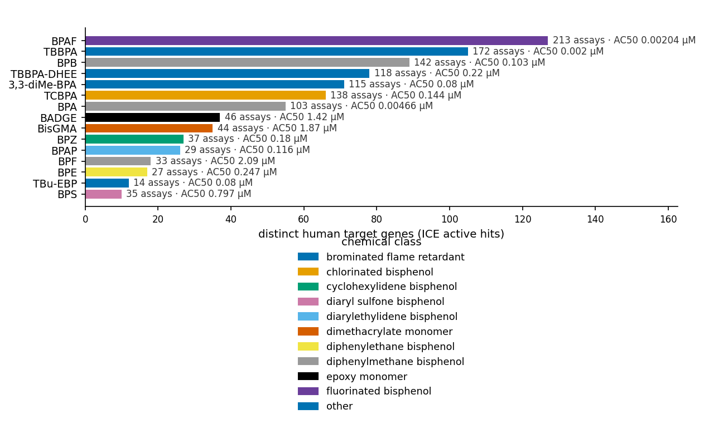
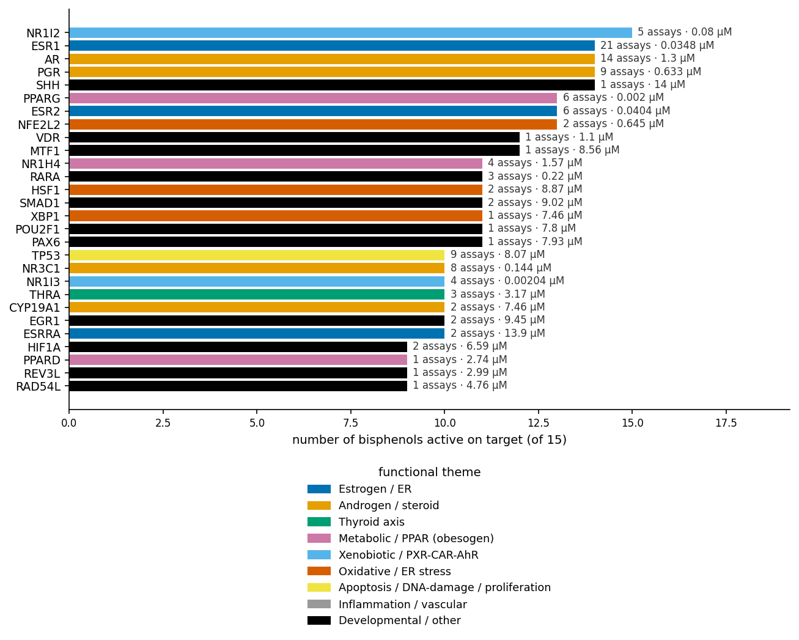
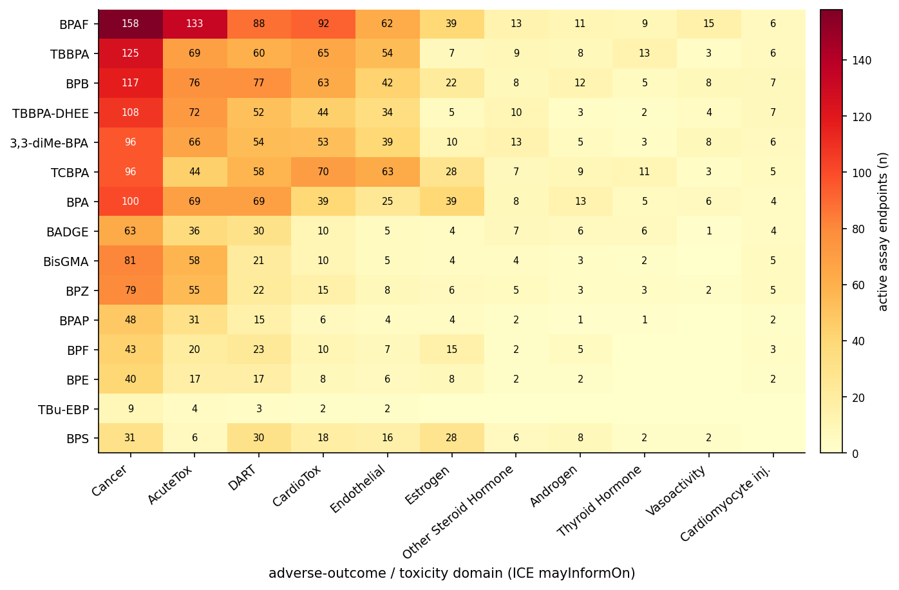
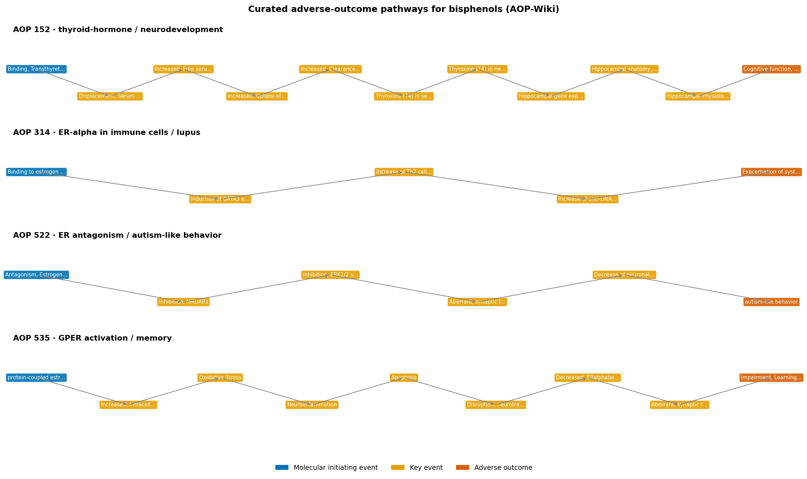
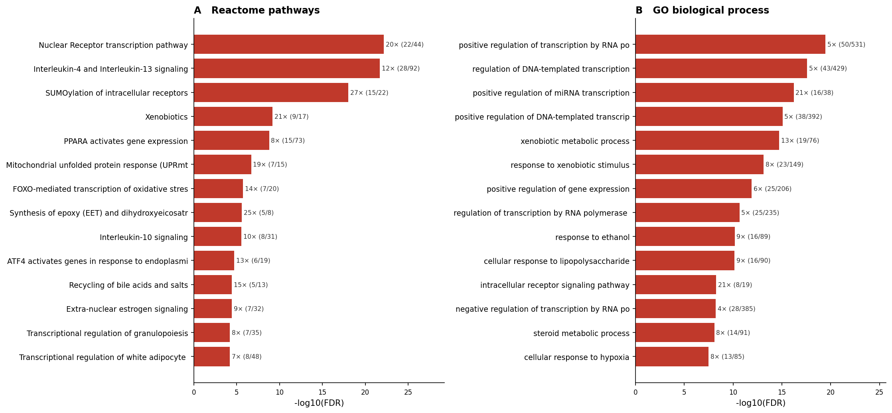
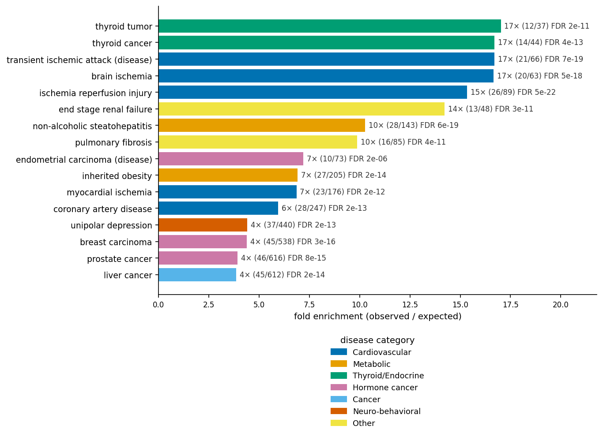
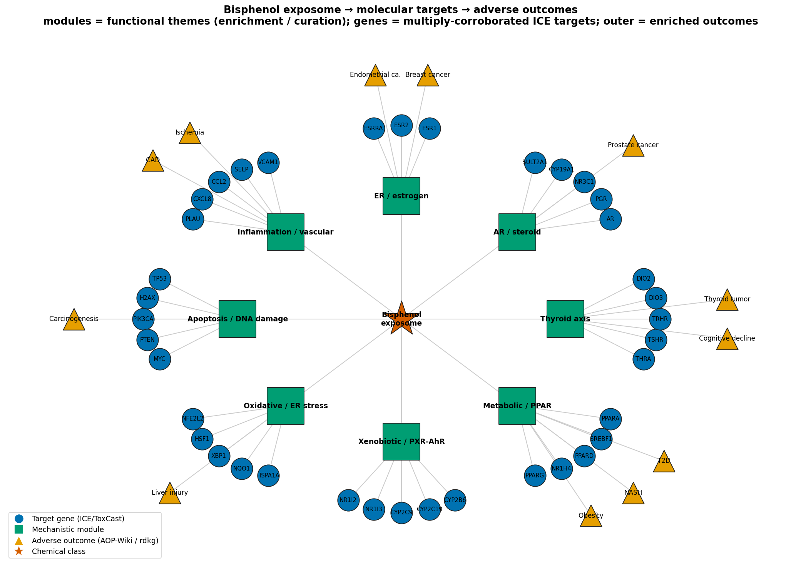
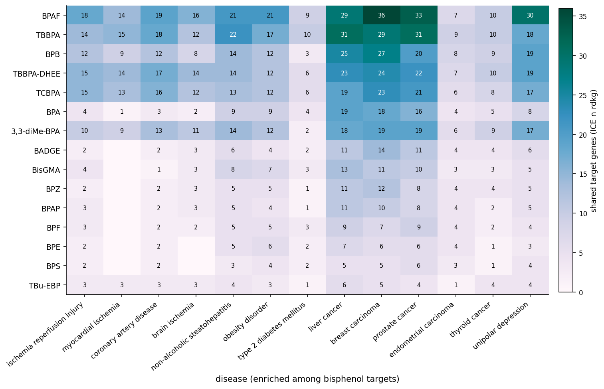

# The bisphenol chemical exposome: a federated knowledge-graph map from exposure to adverse outcome
### Multi-KG integrative analysis over the OKN federated SPARQL endpoint (chemical toxicology → molecular targets → disease)

**Date:** 2026-07-22 · **Endpoint:** OKN federated SPARQL · **Model:** claude-opus-4-8

> **Framing (non-negotiable).** The unit of analysis is the **chemical–target–outcome chain** for
> **15 bisphenol compounds** assayed in high-throughput screens, integrated across
> seven OKN knowledge graphs on shared **chemical (CAS/DTXSID)**, **gene (Entrez)** and **disease
> (MONDO)** identifiers. Every association here is **hypothesis-generating, not causal or clinical**:
> tox-assay activity, curated adverse-outcome pathways, and gene→disease associations are
> **observational** evidence of *plausibility and convergence*, not proof that a given bisphenol causes
> a given disease at real-world exposures. Keep this caveat attached to every downstream claim.

**Abbreviations.** BPA = bisphenol A; BPS = bisphenol S; BPF = bisphenol F; BPAF = bisphenol AF;
BPB/BPE/BPZ/BPAP/BPP = bisphenol B/E/Z/AP/P; TBBPA = tetrabromobisphenol A; TCBPA = tetrachlorobisphenol A;
BADGE = bisphenol A diglycidyl ether; BisGMA = bisphenol A glycidyl methacrylate; CAS = Chemical Abstracts
Service number; DTXSID = EPA CompTox DSSTox substance id; AC50 = half-maximal activity concentration;
AOP = adverse outcome pathway; MIE = molecular initiating event; KE = key event; AO = adverse outcome;
ER = estrogen receptor; AR = androgen receptor; PXR = pregnane X receptor; PPAR = peroxisome
proliferator-activated receptor; TTR = transthyretin; T4 = thyroxine; GO = Gene Ontology; BP = biological
process; FDR = false-discovery rate (Benjamini–Hochberg); MONDO = Mondo Disease Ontology; NASH =
non-alcoholic steatohepatitis; ICE = Integrated Chemical Environment; HTS = high-throughput screening.

---

## 1. Executive summary

This report reconstructs the **bisphenol chemical exposome** — the path from environmental/industrial
exposure to adverse health outcomes — by integrating seven biomedical knowledge graphs in the OKN
federation. Starting from **15 bisphenol compounds** with active high-throughput
tox-screening hits (out of 32 bisphenol substances catalogued in the Integrated
Chemical Environment and 17 in ToxCast), the analysis maps each chemical to its
**molecular targets, mechanistic pathways, curated adverse-outcome pathways, and disease
associations**, then ranks chemical–disease relationships by the strength of *independent* cross-source
support.

The bisphenols converge on a coherent, biologically interpretable target set: **183
distinct human target genes** (1266 active chemical–assay–gene hits) dominated by **nuclear
receptors** — the estrogen receptor **ESR1** (hit by 14/15 compounds, AC50 down to
**0.035 µM**), the androgen receptor **AR**, progesterone receptor **PGR**, the metabolic
receptor **PPARγ** (AC50 down to **0.002 µM**), and the xenobiotic sensor **NR1I2/PXR** (active
in all 15). Functional enrichment confirms the mechanism: **Nuclear Receptor transcription** is the most
enriched Reactome pathway (~20× fold), alongside SUMOylation of intracellular
receptors, xenobiotic metabolism, PPARα signalling and white-adipocyte differentiation; GO-biological-
process enrichment adds xenobiotic metabolism, steroid metabolism and intracellular-receptor signalling.

Mapping the target genes onto curated disease genetics (rdkg) and effect domains (ICE) yields the
**disease landscape** of the class — strongest fold-enrichment for **thyroid tumour, ischemia/reperfusion
injury, non-alcoholic steatohepatitis, obesity, coronary artery disease** and **hormone-dependent
cancers** (breast, prostate, endometrial, liver) and **depression**. Four **AOP-Wiki** pathways provide
formal causal scaffolds: TBBPA → transthyretin binding → thyroid-hormone disruption → decreased cognition,
and three BPA pathways through the estrogen receptor and GPER to lupus, autism-like behaviour and memory
impairment.

**What this adds:** integrating the axes into a per-pair consensus shows that **BPAF and TBBPA — not
BPA — carry the broadest, strongest cross-source disease support** (6 Tier-A links
each, up to **36** shared target genes), a data-driven signal of "regrettable
substitution" that is consistent with, and extends, the experimental literature. Of 186
chemical–disease pairs scored, **21 reach Tier A** (three independent evidence types, or a
gene-linkage backbone with matching toxicity-domain support).

## 2. Sources used

Every row is a knowledge graph **actually queried with a logged SPARQL query** in this analysis
(16 logged queries total; see the reproducibility record). Versions and dates are from the federation
VoID metadata (`get_kg_version`).

| KG | Version | Updated | Role in this study | Join key / confidence |
|---|---|---|---|---|
| biobricks-ice | v0.0.3 | 2026-03-30 | Chemical → assay → mechanistic target (Entrez) + toxicity effect domain + AC50 potency; functional-use categories (exposure) | CAS/DTXSID (chemical), Entrez (gene); **primary**, quantitative |
| biobricks-toxcast | v0.0.2 | 2026-03-18 | Bisphenol chemical census (CAS/DTXSID inventory) | CAS/DTXSID; supporting inventory |
| biobricks-aopwiki | v0.0.4 | 2026-03-18 | Curated adverse-outcome pathways: stressor → MIE → key events → adverse outcome | CAS (chemical); **curated causal** |
| spoke-okn | v0.0.6 | 2026-03-16 | Entrez → gene symbol / name bridge for the target set | Entrez node-IRI; label bridge |
| rdkg | v0.0.1 | 2026-05-04 | Curated gene → disease (MONDO) associations; disease-enrichment background | Entrez node-IRI, MONDO; associational |
| prokn | v0.0.5 | 2026-06-23 | GO (biological process) and Reactome pathway enrichment of the target set | gene symbol → UniProt; bridged |
| digcfdekg | v0.0.1 | 2026-06-21 | Broad GWAS-style gene → trait associations (comparator layer) | Entrez node-IRI; broad/associational |

Bridging note: the Entrez↔symbol resolution (spoke-okn) and the symbol→UniProt→GO/Reactome traversal
(prokn) are label/identifier bridges; every cross-KG claim in the report traces to one of the logged
queries above. KGs explored but **not** credited (e.g. Tox21, PubChem-annotations) carried no logged
query and are deliberately omitted.

## 3. Design & rules

**Chemical inventory.** Bisphenols were retrieved from ICE and ToxCast by matching compound labels and
their synonyms (`bisphenol`, `sulfonyldiphenol` [BPS], `methylenediphenol`/`dihydroxydiphenyl` isomers),
keyed on CAS and DTXSID. This yields a **32-substance ICE census** and a
**17-substance ToxCast census**; **15 compounds have active curated
HTS hits** and form the mechanistic backbone. A curated core of 13 named analogues
(BPA, BPS, BPF, BPAF, BPB, BPE, BPZ, BPAP, BPP, TBBPA, TCBPA, BADGE, BisGMA) anchors the narrative.

**Molecular targets & activity.** For each compound, ICE "curated HTS" assay endpoints were filtered to
**active calls** (`Call = "Active"`); each active endpoint contributes its **Entrez target gene**
(`assay_entrez_gene_id`), its **mechanistic target** (`throughMechanisticTarget`), the **toxicity /
adverse-outcome domain** it informs on (`mayInformOn` — e.g. *Cancer, DART, CardioTox, Estrogen,
Thyroid Hormone*) and its **potency** (AC50, µM). Non-human assay targets and cytotoxicity ("gene None")
rows were excluded from the human-target set.

**Mechanistic pathways.** Curated AOPs were traversed chemical ← `has_chemical_entity` ← stressor ←
`NCIT_C54571` (Stressor) ← AOP, then AOP → MIE / key events / adverse outcome. Functional programs came
from prokn (gene symbol → UniProt → GO / Reactome). Disease genetics came from rdkg (gene →
`biolink:related_to` → MONDO). Enrichment used a one-sided **hypergeometric** test against an **explicit
background** (all annotated genes in the source KG) with **Benjamini–Hochberg FDR**.

**Evidence separation.** Different evidence types are kept in **separate columns** throughout (tox-assay
activity, curated AOP, disease-gene overlap, effect domain) and never merged into a single score — the
consensus counts how many *independent* types support each chemical–disease pair. The full replicator
specification (exact predicates, IRI normalisations, backgrounds, thresholds) is in the reproducibility
record.

> ***Figure 1. Per-chemical mechanistic breadth (biobricks-ice).*** Ranked bars: number of distinct human
> target genes with an **active** ICE HTS hit per bisphenol; bar colour = chemical class; annotation =
> number of active assay endpoints and the most potent AC50 (µM). Provenance: ICE chemical
> `participates in` → assay `Call = Active`, `assay_entrez_gene_id` restricted to human genes.

The breadth ranking already previews the report's central asymmetry: **BPAF (127 target
genes) and TBBPA (105)** are far more promiscuous than the parent **BPA
(55)**, and several analogues reach sub-micromolar potency.

## 4. Confidence tiers

Chemical–disease relationships are graded by the number of **independent evidence types** supporting the
link (tox-assay target overlap, matching ICE toxicity domain, and a curated AOP), plus the size of the
gene backbone.

| Tier | Requirement | Interpretation |
|---|---|---|
| **A** | 3 independent evidence types, **or** ≥20 shared target genes with matching toxicity domain | Strong, cross-corroborated mechanistic plausibility |
| **B** | 2 independent evidence types (gene overlap + toxicity domain) | Moderate; convergent but from two axes |
| **C** | 1 evidence type (gene overlap only) | Weak; single-axis, hypothesis only |

Of **186** scored chemical–disease pairs: **Tier A = 21**, Tier B =
160, Tier C = 5. Enrichment findings (§6) carry their own statistical confidence (FDR).

## 5. Findings by axis

### 5.1 Molecular-target landscape

> ***Figure 2. Molecular targets of the bisphenol class (biobricks-ice → spoke-okn symbols).*** Top 28
> target genes ranked by the number of bisphenols (of 15) with an active hit; colour = functional theme;
> annotation = number of active assays and the most potent AC50 (µM). Provenance: ICE active HTS hits,
> Entrez targets resolved to symbols via spoke-okn `rdfs:label`.

The landscape is dominated by **nuclear receptors and hormone machinery**: the estrogen receptors ESR1
(14 compounds, 21 assays, 0.035 µM) and ESR2, the androgen receptor AR,
progesterone receptor PGR, the xenobiotic sensors PXR (NR1I2, all 15 compounds) and CAR (NR1I3), the
metabolic receptor PPARγ (potent, 0.002 µM), plus aromatase (CYP19A1), thyroid machinery
(THRα/β, deiodinases) and the oxidative-stress regulator NFE2L2/NRF2. This is a textbook
endocrine-disruptor/xenobiotic signature and sets up every downstream axis.

### 5.2 Adverse-outcome / toxicity domains

> ***Figure 3. Chemical × adverse-outcome domain matrix (biobricks-ice `mayInformOn`).*** Rows =
> bisphenols (ordered by target breadth), columns = toxicity/adverse-outcome domains; cell = number of
> active assay endpoints informing on that domain. Provenance: ICE active endpoints' `mayInformOn`
> annotation.

Every compound informs on **Cancer, DART (developmental & reproductive toxicity), and CardioTox**
domains, with substantial **Estrogen, Androgen, steroid-hormone and Thyroid-hormone** signal — the
toxicity-domain fingerprint mirrors the receptor landscape of §5.1 and foreshadows the disease
enrichment of §6.

### 5.3 Curated adverse-outcome pathways (mechanistic chains)

> ***Figure 4. Curated bisphenol adverse-outcome pathways (biobricks-aopwiki).*** Four AOPs shown as
> ordered chains: molecular initiating event (blue) → key events (orange) → adverse outcome (dark). AOP
> 152 is a TBBPA thyroid/neurodevelopment pathway; AOPs 314/522/535 are BPA estrogen-receptor / GPER
> pathways. Provenance: AOP-Wiki stressor→AOP→`has_key_event` traversal.

The chains give **formal, curated causal scaffolds** for two compounds: **TBBPA** displaces thyroxine
from transthyretin, lowering serum and neuronal T4 and altering hippocampal biology to decrease
cognition (AOP 152); **BPA** acts through ER-α in immune cells (→ lupus exacerbation, AOP 314), through
ER antagonism (→ autism-like behaviour, AOP 522) and through GPER activation with oxidative
stress/neuroinflammation (→ memory impairment, AOP 535). These are the only bisphenols with curated AOPs
in the federation and anchor the Tier-A neuro/thyroid links in §7.

## 6. Domain analyses

### 6.1 Functional enrichment — GO **and** Reactome (both families run)

Both enrichment families were run against explicit prokn backgrounds (Reactome N = 6,032 genes; GO-BP
N = 7,663 genes), hypergeometric + BH FDR. **GO molecular-function and cellular-component were
deliberately skipped** — GO-biological-process answers "what programs are engaged", which is the
question here; MF/CC would add localisation detail without changing the mechanistic story. Disease-gene
enrichment (§6.2) and the broad GWAS-trait layer (§6.3) are reported separately.

> ***Figure 5. Pathway enrichment of the bisphenol target set (prokn, symbol-bridged).*** **(A)** Top
> Reactome pathways and **(B)** top GO biological-process terms at FDR < 0.05, ranked by −log₁₀(FDR),
> annotated with fold enrichment and (hits / category size). Foreground = 183 human
> targets mapping to prokn; background = all prokn genes with the respective annotation; hypergeometric +
> BH FDR. Provenance: prokn Gene `rdfs:label` → `encodes` → Protein → `involved in`/`participates in` →
> GO / Reactome (`R-HSA`).

Of 42 candidate Reactome pathways, **33 are significant**; of
47 GO-BP terms, **43**. The programs are exactly those expected of endocrine-active
xenobiotics: **Nuclear Receptor transcription (~20× fold), SUMOylation of intracellular receptors (27×),
Xenobiotics (21×), PPARA gene expression, white-adipocyte differentiation, extra-nuclear estrogen
signalling, mitochondrial UPR and FOXO oxidative-stress transcription**; GO adds **xenobiotic and steroid
metabolic process, intracellular-receptor signalling and hypoxia response**.

### 6.2 Disease-gene enrichment (curated, rdkg)

> ***Figure 6. Disease-gene enrichment among bisphenol targets (rdkg, curated).*** Representative
> significant diseases (FDR < 0.05) ranked by fold enrichment; colour = disease category; annotation =
> fold, (hits / disease gene-set size) and FDR. Foreground = 183 targets; background =
> 9,080 rdkg disease-genes; hypergeometric + BH FDR (232 diseases with ≥6 target genes tested,
> 224 significant). Provenance: rdkg gene `biolink:related_to` MONDO disease.

The most *specific* signals (high fold) are **thyroid tumour (~17×), ischemia/reperfusion and cerebral
ischemia (15–17×), thyroid adenoma/cancer, NASH (10×), coronary artery disease (~6×) and obesity (~7×)**;
the largest-overlap signals are the hormone-dependent cancers (breast, prostate, endometrial) and liver
cancer, plus unipolar depression. Because common polygenic diseases carry large gene sets, they enrich at
lower fold than the tightly-defined thyroid/ischemia sets — the **fold** column, not raw overlap, is the
discriminating measure. Enrichment is **associational, not causal**.

### 6.3 Broad GWAS-trait layer (digcfdekg, comparator)

The broad, GWAS-derived gene→trait layer (digcfdekg) is reported **descriptively and kept separate** from
the curated disease enrichment. All 183 targets carry GWAS traits (38,833 gene–trait pairs,
3,564 traits), so this layer is **broad by construction and near-null under formal enrichment** — as
expected for a set covering a large fraction of trait-annotated genes. Its top traits nonetheless echo the
mechanism: **testosterone and sex-hormone-binding-globulin measurements, hypothyroidism, type-2 diabetes,
total cholesterol, triglycerides, hypertension and abdominal aortic aneurysm** — an endocrine–metabolic–
cardiovascular signature consistent with §6.2. Treat as a corroborating context layer, not a discriminating
test.

### 6.4 Exposure context (industrial / commercial uses)

ICE functional-use categories place the compounds in their exposure setting: **BPA** → binder / catalyst /
hardener (polycarbonate & epoxy manufacture) plus antioxidant / UV-absorber; **TBBPA and TCBPA** → flame
retardant; **BADGE and epoxy resins** → binder / hardener / monomer (food-can coatings); **BPS** →
colorant / thermal-paper developer; the remaining analogues (BPF, BPB, BPE, BPP) → antioxidant / polymer
intermediates. These uses — food-contact plastics and coatings, thermal paper, electronics flame
retardants, dental resins — are the routes by which the molecular hazards above become human exposures.

## 7. Discussion

The axes assemble into one coherent picture, summarised in the synthesis map (Figure 7): bisphenols are
**broad-spectrum nuclear-receptor modulators** whose molecular promiscuity (§5.1) maps onto a small number
of mechanistic modules (§6.1) that in turn map onto a specific disease landscape (§6.2) and, for two
compounds, onto curated causal pathways (§5.3).

> ***Figure 7. Bisphenol exposome mechanistic map (synthesis; biobricks-ice + prokn + rdkg + aopwiki).***
> Radial anchor → module → gene → outcome. Centre = the bisphenol class (★); squares (■) = mechanistic
> modules (functional themes from enrichment/curation); circles (●) = multiply-corroborated ICE target
> genes placed by theme; triangles (▲) = enriched adverse outcomes (rdkg diseases / AOP-Wiki outcomes)
> attached to the module they arise from. Modules are an analyst synthesis over the enrichment (§6.1) and
> curation; the gene layer is the high-recurrence backbone, not the full 183-gene tail.
> Observational/associational throughout.

Three implications follow. **(1) The endocrine axis is primary:** ER/AR/PGR/PXR/PPARγ modulation is the
convergent mechanism, linking directly to hormone-dependent cancers and metabolic disease. **(2) The
thyroid–neurodevelopment axis is real and compound-specific:** TBBPA's curated transthyretin AOP, its
deiodinase/THR targeting, and the thyroid-tumour enrichment triangulate a thyroid-disruption hazard that
BPA's estrogenic profile does not share. **(3) Substitution has not removed hazard:** the most
mechanistically connected compounds are **BPAF and TBBPA**, not BPA (§8).

**Testable predictions.** (i) BPAF and TBBPA should show breast/prostate and thyroid endpoints at
potencies at or below BPA in matched assays; (ii) PPARγ-active analogues (very potent here) should score as
obesogens in adipogenesis assays; (iii) compounds sharing ESR1 + Cancer-domain hits should co-cluster in
hormone-dependent-cancer epidemiology. Each is a decision-relevant hypothesis for prioritising analogues
for regulatory testing — flagged by evidence strength, and none of them a causal claim.

## 8. Comparison with prior work

Central claims were checked against the primary literature via the **Paperclip** full-text corpus (PMC +
preprints); the per-claim record with citations is in **Bisphenol-Exposome_literature_comparison.md**.
(A PubMed connector was reported enabled but did not surface as a callable tool in this session; because
Paperclip indexes PubMed Central full text, claims were verified against primary full text rather than
abstracts.)

| # | Claim | Concordance |
|---|---|---|
| 1 | Bisphenol analogues (BPS, BPF, BPAF, …) share BPA's endocrine-disrupting (ER/AR) activity | **SUPPORTED** — systematic review finds BPS/BPF "as hormonally active as BPA" with the same order-of-magnitude potency [1] |
| 2 | Several analogues equal or exceed BPA; the KG ranks BPAF and TBBPA above BPA | **SUPPORTED** — an *in vitro* comparison of 26 alternatives finds "many … are regrettable substitutes" with similar/stronger ERα activation [2], and BPS effects "comparable to or worse than" BPA [3] |
| 3 | TBBPA disrupts thyroid hormone via transthyretin → neurodevelopmental harm (AOP 152) | **SUPPORTED** — TBBPA and analogues "bind to TTR and TRs, potentially disrupting the thyroid hormone system" [4] |
| 4 | Targets converge on nuclear-receptor / PPARγ / xenobiotic-metabolism programs | **SUPPORTED** — alternatives show a "shift toward PPARγ activation" [2]; BPA alters the *Pparγ* promoter [5] |
| 5 | Bisphenol targets enrich for hormone-dependent cancers (breast, prostate) | **SUPPORTED** — BPA "mimics estrogen … contributing to breast, ovarian, and prostate cancer development" [6]; low-dose BPA and breast cancer [7] |
| 6 | Bisphenols act as metabolic disruptors / obesogens (obesity, NASH, T2D) | **SUPPORTED** — BPA→PPARγ epigenetics [5], BPS obesogenic ≥ BPA [3], analogue is a potent obesogen [8] |
| 7 | A *federated multi-KG* framework ranks BPAF/TBBPA above BPA on breadth of disease support | **NOVEL** — a synthesis across tox-screens + AOPs + disease genetics + pathways not stated as such in any single paper; consistent with [1,2,3], extends them |
| 8 | BPS shows the *fewest* active targets in the curated ICE screen | **PARTIALLY SUPPORTED** — literature gives BPS ~0.32× BPA estrogenic potency (lower, same order) yet obesogenic effects ≥ BPA [1,3]; the sparse count reflects **assay coverage**, not safety |

Central claims 1–6 were **verified against full article text** (not abstracts). Where the KG evidence
diverges from the literature it is a matter of **scope, not error**: Claim 8 is a **coverage limitation** of
the curated ICE ER/AR assay set (BPS is under-represented there), not a contradiction of BPS hazard; and
Claim 7's ranking is a genuinely new *synthesis* the source graphs enable but no single study reports. No
outright contradictions of the literature were found. See Claim 7 and Claim 8 in
Bisphenol-Exposome_literature_comparison.md for the full per-claim detail.

## 9. Full ranked results

The complete ranked chemical–disease consensus (186 pairs) is in
**Bisphenol-Exposome_results.xlsx** (sheet *Consensus chem–disease*) and `data/consensus_chem_disease.csv`;
the target, enrichment and AOP tables are in the other workbook sheets. The interactive table below is
sortable (click a header), filterable (search box + the tier / category / AOP pull-downs) and paginated;
the **sources (n)** column shows how many federation KGs corroborate each row — **biobricks-ice** (tox-assay
target + effect domain) and **rdkg** (disease genetics) support every row, with **biobricks-aopwiki** added
where a curated AOP matches.

<!-- RESULTS_TABLE -->

The ranking makes the class structure explicit: **BPAF and TBBPA** head the Tier-A list across cancer,
metabolic and (for TBBPA) thyroid/neuro outcomes, with **BPB, TBBPA-DHEE and TCBPA** close behind — the
parent compound **BPA** is Tier-A only where a curated AOP corroborates the gene/effect evidence (the
neuro-behavioural link). The consensus matrix (Figure 8) shows the same pattern as a chemical × disease grid.

> ***Figure 8. Consensus chemical × disease matrix (biobricks-ice ∩ rdkg).*** Rows = bisphenols (ordered
> by overall connectivity), columns = enriched diseases; cell = number of the chemical's ICE target genes
> that rdkg associates with the disease. Provenance: intersection of per-chemical ICE active targets with
> rdkg disease-gene sets. Observational.

The grid concentrates in the upper-left (BPAF, TBBPA, BPB) across hormone-dependent cancers, liver cancer
and depression, thinning toward the less-assayed analogues (BPS, BPE) — a visual restatement of the
coverage caveat in Claim 8.

## 10. Summary of findings & limitations

**Findings recap.** Across 15 actively-screened bisphenols, the class converges on
**183 human targets** dominated by nuclear receptors (ER, AR, PGR, PXR, PPARγ), engaging
**33 Reactome** and **43 GO-BP** programs centred on nuclear-receptor
transcription, xenobiotic and steroid metabolism, and adipocyte differentiation. These targets enrich
(curated rdkg genetics) for a specific disease landscape — **thyroid tumour, ischemia, NASH, obesity,
coronary artery disease and hormone-dependent cancers** — and four curated AOP-Wiki pathways give TBBPA
(thyroid → cognition) and BPA (ER/GPER → lupus, autism-like behaviour, memory) formal causal scaffolds.
Integrating the axes, **BPAF and TBBPA carry the broadest cross-source disease support**, with
21 Tier-A chemical–disease relationships overall — a data-driven "regrettable substitution" signal.

**Limitations.**

1. **Observational, not causal.** Every edge (tox-assay activity, gene→disease association, AOP) is
   evidence of *plausibility and convergence*, not proof of causation at real-world exposures. No exposure
   levels, doses, or pharmacokinetics are modelled here.
2. **Assay coverage bias.** Breadth counts depend on which assays a compound was tested in. Well-studied
   compounds (BPA, BPAF, TBBPA) accrue more hits; sparsely-tested analogues (notably **BPS**, 10 targets)
   look "cleaner" than the wider literature supports (Claim 8) — absence of a hit is not evidence of safety.
2b. **In-vitro provenance.** ICE HTS activity is a *perturbation* signal; an active AC50 does not
   establish an *in-vivo* adverse effect.
3. **Disease enrichment is associational and gene-set-size-dependent.** Common polygenic diseases enrich at
   lower fold despite large overlaps; rdkg is a rare-disease-centred graph, so its common-disease gene sets
   are incomplete. The candidate set was pre-filtered to diseases with ≥6 target genes, which inflates the
   significant fraction — the **fold** column is the discriminating measure, not the count of significant hits.
4. **Symbol/identifier bridging.** Entrez→symbol (spoke-okn) and symbol→UniProt→GO/Reactome (prokn) are
   label/identifier bridges; a small number of non-human or unmapped assay targets were dropped, slightly
   undercounting the target set.
5. **AOP coverage is sparse.** Only BPA and TBBPA have curated AOPs in the federation; absence of an AOP
   for an analogue reflects curation status, not absence of a pathway.
6. **Consensus scoring is deliberately simple and evidence-separated.** It counts independent evidence
   *types* rather than weighting them; it is a transparent ranking, not a quantitative risk model, and the
   tier thresholds are analyst choices.
7. **Literature comparison used one connector (Paperclip full text).** A PubMed connector was not callable
   in-session; coverage is broad (PMC + preprints) but not exhaustive.

## 11. Reproducibility

Everything needed to replicate this analysis — the originating prompt, the replicator specification (rules,
thresholds, joins, verified quantities, limitations), and every supporting SPARQL query verbatim with its
row count and query diagram, plus pinned KG versions — is in
**Bisphenol-Exposome_reproducibility.md**, with the exact scripts in `scripts/` and intermediate extracts
in `data/`.

## 12. References

> Full-text verification via the **Paperclip** MCP connector (PMC + preprint corpora).

1. Rochester JR, Bolden AL. Bisphenol S and F: A Systematic Review and Comparison of the Hormonal Activity of Bisphenol A Substitutes. *Environ Health Perspect*. 2015. PMID:25775505 · [doi:10.1289/ehp.1408989](https://doi.org/10.1289/ehp.1408989) — full-text-verified ([PMC4492270](https://pmc.ncbi.nlm.nih.gov/articles/PMC4492270/))
2. Srebny V, et al. Beyond Estrogenicity: A Comparative Assessment of Bisphenol A and Its Alternatives in In Vitro Assays Questions Safety of Replacements. *Environ Sci Technol*. 2025. [doi:10.1021/acs.est.5c07018](https://doi.org/10.1021/acs.est.5c07018) — full-text-verified ([PMC12392461](https://pmc.ncbi.nlm.nih.gov/articles/PMC12392461/))
3. Thoene M, et al. Bisphenol S in Food Causes Hormonal and Obesogenic Effects Comparable to or Worse than Bisphenol A: A Literature Review. *Nutrients*. 2020. PMID:32092919 · [doi:10.3390/nu12020532](https://doi.org/10.3390/nu12020532) — full-text-verified ([PMC7071457](https://pmc.ncbi.nlm.nih.gov/articles/PMC7071457/))
4. Ren X-M, et al. Binding and Activity of Tetrabromobisphenol A Mono-Ether Structural Analogs to Thyroid Hormone Transport Proteins and Receptors. *Environ Health Perspect*. 2020. PMID:33095031 · [doi:10.1289/EHP6498](https://doi.org/10.1289/EHP6498) — full-text-verified ([PMC7584160](https://pmc.ncbi.nlm.nih.gov/articles/PMC7584160/))
5. Longo M, et al. Low-dose Bisphenol-A Promotes Epigenetic Changes at Pparγ Promoter in Adipose Precursor Cells. *Nutrients*. 2020. PMID:33202789 · [doi:10.3390/nu12113498](https://doi.org/10.3390/nu12113498) — full-text-verified ([PMC7696502](https://pmc.ncbi.nlm.nih.gov/articles/PMC7696502/))
6. Gao H, et al. Bisphenol A and Hormone-Associated Cancers: Current Progress and Perspectives. *Medicine (Baltimore)*. 2015. PMID:25569652 · [doi:10.1097/MD.0000000000000211](https://doi.org/10.1097/MD.0000000000000211) — full-text-verified ([PMC4602822](https://pmc.ncbi.nlm.nih.gov/articles/PMC4602822/))
7. Wang Z, Liu H, Liu S. Low-Dose Bisphenol A Exposure: A Seemingly Instigating Carcinogenic Effect on Breast Cancer. *Adv Sci (Weinh)*. 2016. PMID:28251049 · [doi:10.1002/advs.201600248](https://doi.org/10.1002/advs.201600248) — full-text-verified ([PMC5323866](https://pmc.ncbi.nlm.nih.gov/articles/PMC5323866/))
8. Singh M, et al. Tetra methyl bisphenol F: another potential obesogen. *Int J Obes (Lond)*. 2024. PMID:38396134 · [doi:10.1038/s41366-024-01496-5](https://doi.org/10.1038/s41366-024-01496-5) — full-text-verified ([PMC11216980](https://pmc.ncbi.nlm.nih.gov/articles/PMC11216980/))
