# Bisphenol Exposome — Reproducibility Record

- **Date:** 2026-07-22
- **Model:** claude-opus-4-8
- **SPARQL endpoint:** https://apps.okn.us/federation/sparql
- **Generated by:** mcp-okn v0.1.0
- **Study active window:** 2026-07-23 04:50–05:27 UTC (36m 48s)
- **Contents:** 16 queries

## Prompt

Conduct a reproducible, multi-knowledge-graph integrative study of the bisphenol chemical exposome to generate an evidence-backed map tracing each chemical from environmental exposure to adverse health outcomes. Follow the /okn-bioanalysis workflow and produce the final report using /okn-report-style. Objectives: (1) Characterize the chemical exposome — identify bisphenol compounds and their major uses, exposure routes, and chemical classes; harmonize across KGs. (2) Reconstruct mechanistic pathways — per chemical, molecular initiating events, key events, molecular targets, pathways, gene expression changes, adverse outcomes, diseases and phenotypes. (3) Integrate supporting evidence from toxicology, assays, transcriptomics, pathway DBs, disease associations, literature — recording supporting sources, relationship type, confidence/activity score, evidence type, kept separate. (4) Explore exposure context — industrial uses, commercial applications, exposure scenarios. (5) Consensus analysis — rank chemical–disease relationships by strength of mechanistic support across independent evidence sources.

## Knowledge graphs used

- `biobricks-ice` — <https://purl.org/okn/frink/kg/biobricks-ice>
- `biobricks-toxcast` — <https://purl.org/okn/frink/kg/biobricks-toxcast>
- `biobricks-aopwiki` — <https://purl.org/okn/frink/kg/biobricks-aopwiki>
- `spoke-okn` — <https://purl.org/okn/frink/kg/spoke-okn>
- `rdkg` — <https://purl.org/okn/frink/kg/rdkg>
- `prokn` — <https://purl.org/okn/frink/kg/prokn>
- `digcfdekg` — <https://purl.org/okn/frink/kg/digcfdekg>

## Replicator specification

### Chemical set (Objective 1)
- Bisphenols retrieved from biobricks-ice and biobricks-toxcast by matching `rdfs:label` (biolink:ChemicalEntity) and synonyms against: "bisphenol", "sulfonyldiphenol" (BPS = 4,4'-sulfonyldiphenol, DTXSID3022409/CAS 80-09-1), "methylenediphenol", "dihydroxydiphenyl". Chemicals keyed on CAS (`http://identifiers.org/cas/...`) and CompTox DTXSID (`https://comptox.epa.gov/.../DTXSID...`) via `edamontology:has_identifier`.
- Census: 32 bisphenol substances in ICE, 17 in ToxCast. 15 compounds have active curated-HTS hits (backbone). Curated core (13): BPA, BPS, BPF, BPAF, BPB, BPE, BPZ, BPAP, BPP, TBBPA, TCBPA, BADGE, BisGMA.

### Molecular targets & activity (Objectives 2–3), biobricks-ice
- Chemical `RO_0000056` (participates in) MeasureGroup; MeasureGroup `OBI_0000299` Endpoint; Endpoint `IAO_0000136` chemical, `rdfs:label` "Call"/"AC50", `SIO_000300` value.
- Active hit rule: Endpoint label "Call" with value "Active". AC50 from the matching "AC50" endpoint (uM).
- Assay endpoint (`comptox.epa.gov/dashboard/assay-endpoints/<name>`) `BAO_0000209` MeasureGroup, carries `ice:assay_entrez_gene_id` (Entrez), `ice:throughMechanisticTarget` (target label), `ice:mayInformOn` (adverse-outcome/toxicity domain).
- Human targets only (gene IRI numeric, non-"None"); cytotoxicity (gene None) excluded from target set but retained as AcuteTox domain. Verified: 183 human target genes; 1266 human chemical-assay-gene hits; 15 chemicals.
- Entrez->symbol/name resolved in spoke-okn (`rdfs:label`/`rdfs:comment`); IRI normalization https->http on `www.ncbi.nlm.nih.gov/gene/{entrez}`.

### Mechanistic AOPs (Objective 2), biobricks-aopwiki
- Path: chemical `<-has_chemical_entity<-` Stressor `<-NCIT_C54571<-` AOP (a `aop_ontology:AdverseOutcomePathway`). AOP `has_molecular_initiating_event` MIE, `has_key_event` KE (with `dc:title`, `OrganContext` UBERON), `has_adverse_outcome` AO.
- 4 AOPs recovered: AOP 152 (TBBPA, CAS 79-94-7): TTR binding -> T4 displacement -> decreased serum/neuronal T4 -> altered hippocampus -> decreased cognition. AOP 314/522/535 (BPA, CAS 80-05-7): ER-alpha immune / ER antagonism / GPER activation -> lupus / autism-like behavior / memory impairment.

### Functional enrichment (Objective 3), prokn
- Gene symbol on `rdfs:label`; `SIO_010078` (encodes) UniProt protein; GO: protein `RO_0002331` (involved in) GO-BP; Reactome: protein `RO_0000056` (participates in) pathway `a up:Pathway` FILTER CONTAINS "R-HSA".
- Over-representation: one-sided hypergeometric `hypergeom.sf(k-1,N,K,n)`; fold = k/(n*K/N); Benjamini-Hochberg FDR; keep FDR<0.05. Backgrounds: Reactome N=6032 distinct prokn genes with any R-HSA pathway; GO-BP N=7663 distinct prokn genes with any BP term. Foreground n = 151 (Reactome) / 152 (GO) target symbols mapping to prokn. Candidate categories: those the target set hits with k>=5 (Reactome, 42 tested, 33 sig) / k>=8 (GO, 47 tested, 43 sig). GO MF/CC deliberately skipped (BP answers "which programs").

### Disease enrichment (Objective 3/5), rdkg
- Gene `http://identifiers.org/ncbigene/{entrez}` `biolink:related_to` MONDO disease (`rdfs:label`). Background N=9080 distinct rdkg disease-genes (`biolink:category "biolink:Gene"`). Foreground n=173 targets in rdkg. Candidate diseases: those with >=6 target genes (232 tested); per-disease K = distinct rdkg genes related_to it. Hypergeometric + BH FDR; 224 significant. Fold is the discriminating measure (top: thyroid tumor ~17x, ischemia/reperfusion ~15x, NASH ~10x). Associational, not causal.

### Broad trait layer (Objective 3), digcfdekg
- Gene `http://www.ncbi.nlm.nih.gov/gene/{entrez}` `schema/geneToTrait` trait. Descriptive only (all 183 targets carry traits; 38,833 pairs, 3,564 traits) — broad/near-null by construction; reported separately.

### Exposure context (Objective 4), biobricks-ice
- Chemical `RO_0000056` functional-use MeasureGroup; Endpoint label "OECD Functional Use"/"Predicted Functional Use", `SIO_000300` value (e.g. Flame retardant, Binder, Hardener, Antioxidant, Colorant).

### Consensus (Objective 5)
- For each (chemical, representative-enriched-disease): genes_ICE_x_rdkg = |chemical's ICE target Entrez ∩ disease's rdkg gene set|; effect_domain = chemical hits ICE mayInformOn domain aligned to disease category; aop_curated = curated AOP-Wiki outcome matches (TBBPA->Thyroid/Neuro; BPA->Neuro). Evidence types kept SEPARATE; n_evidence = count of independent types. Tier A = 3 types OR (>=20 shared genes + effect domain); B = 2 types; C = 1. 186 pairs; 21 Tier A. BPAF and TBBPA most connected (6 Tier-A each, up to 36 shared genes).

### Endpoint quirks
- No global ORDER BY on heavy patterns (client-side ranking in pandas). Large results auto-saved to file and processed with pandas. Per-category K via bounded VALUES + GROUP BY.

### Limitations
Observational/hypothesis-generating (not causal); assay-coverage bias (BPS under-represented in curated ER/AR set, 10 targets — sparse != safe); in-vitro perturbation != in-vivo effect; disease enrichment associational and gene-set-size dependent (rare-disease-centred rdkg); >=6-target pre-filter inflates significant fraction (use fold); symbol/UniProt bridges drop a few non-human targets; only BPA/TBBPA have curated AOPs; consensus counts evidence types, not a risk model; literature comparison via Paperclip full-text only (PubMed connector not callable in-session).

## SPARQL queries

#### Query 1

_2026-07-23T04:50:31+00:00 · `biobricks-ice`_

```sparql
PREFIX ice: <https://ice.ntp.niehs.nih.gov/property/>
PREFIX rdfs: <http://www.w3.org/2000/01/rdf-schema#>
PREFIX obo: <http://purl.obolibrary.org/obo/>
PREFIX sio: <http://semanticscience.org/resource/>
PREFIX bao: <http://www.bioassayontology.org/bao#>
PREFIX biolink: <https://w3id.org/biolink/vocab/>
PREFIX edam: <http://edamontology.org/>
SELECT DISTINCT ?chemLabel ?dtxsid ?assayName ?gene ?target ?effect ?ac50 WHERE {
  GRAPH <https://purl.org/okn/frink/kg/biobricks-ice> {
    ?chem a biolink:ChemicalEntity ; rdfs:label ?chemLabel ; edam:has_identifier ?dtxsid ; obo:RO_0000056 ?mg .
    FILTER(CONTAINS(STR(?dtxsid), "comptox"))
    FILTER( CONTAINS(LCASE(?chemLabel), "bisphenol") || CONTAINS(LCASE(?chemLabel), "sulfonyldiphenol")
         || CONTAINS(LCASE(?chemLabel), "methylenediphenol") || CONTAINS(LCASE(?chemLabel), "dihydroxydiphenyl") )
    ?mg obo:OBI_0000299 ?callEP .
    ?callEP obo:IAO_0000136 ?chem ; rdfs:label "Call" ; sio:SIO_000300 "Active" .
    ?assayEP bao:BAO_0000209 ?mg ; rdfs:label ?assayName ;
             ice:assay_entrez_gene_id ?gene ; ice:throughMechanisticTarget ?target ; ice:mayInformOn ?effect .
    OPTIONAL { ?mg obo:OBI_0000299 ?ac50EP . ?ac50EP obo:IAO_0000136 ?chem ; rdfs:label "AC50" ; sio:SIO_000300 ?ac50 . }
  }
}
```

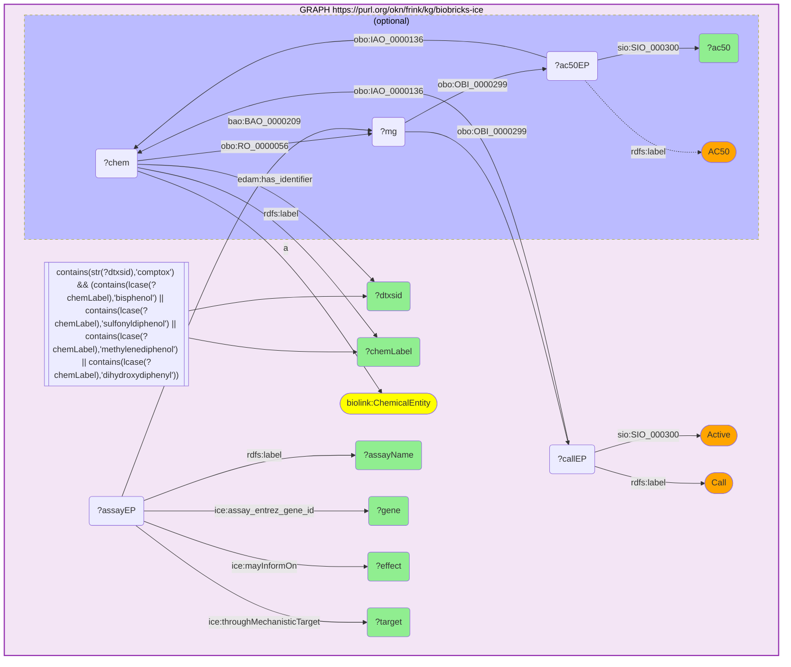

_12557 row(s)_

#### Query 2

_2026-07-23T05:00:15+00:00 · `biobricks-aopwiki`_

```sparql
PREFIX rdfs: <http://www.w3.org/2000/01/rdf-schema#>
PREFIX aop: <http://aopkb.org/aop_ontology#>
PREFIX dc: <http://purl.org/dc/elements/1.1/>
PREFIX obo: <http://purl.obolibrary.org/obo/>
SELECT DISTINCT ?chemTitle ?cas ?aop ?aopTitle ?mieTitle ?aoTitle WHERE {
  GRAPH <https://purl.org/okn/frink/kg/biobricks-aopwiki> {
    ?chem a <http://semanticscience.org/resource/CHEMINF_000000> ; dc:title ?chemTitle ;
          <http://semanticscience.org/resource/CHEMINF_000446> ?cas .
    FILTER( CONTAINS(LCASE(?chemTitle),"bisphenol") || CONTAINS(LCASE(?chemTitle),"sulfonyldiphenol") || CONTAINS(LCASE(?chemTitle),"dihydroxydiphenyl") )
    ?stressor aop:has_chemical_entity ?chem .
    ?aop obo:NCIT_C54571 ?stressor ; a aop:AdverseOutcomePathway .
    OPTIONAL { ?aop dc:title ?aopTitle }
    OPTIONAL { ?aop aop:has_molecular_initiating_event ?mie . ?mie dc:title ?mieTitle }
    OPTIONAL { ?aop aop:has_adverse_outcome ?ao . ?ao dc:title ?aoTitle }
  }
}
ORDER BY ?chemTitle ?aop
```

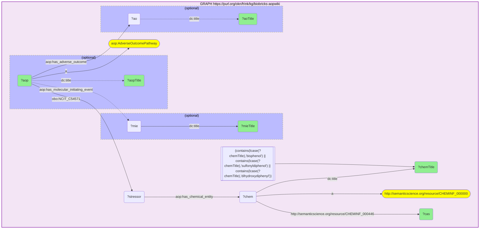

_4 row(s)_

#### Query 3

_2026-07-23T05:00:38+00:00 · `biobricks-aopwiki`_

```sparql
PREFIX rdfs: <http://www.w3.org/2000/01/rdf-schema#>
PREFIX aop: <http://aopkb.org/aop_ontology#>
PREFIX dc: <http://purl.org/dc/elements/1.1/>
PREFIX obo: <http://purl.obolibrary.org/obo/>
PREFIX edam: <http://edamontology.org/>
SELECT DISTINCT ?aop ?ke ?keTitle ?geneId ?organ WHERE {
  GRAPH <https://purl.org/okn/frink/kg/biobricks-aopwiki> {
    VALUES ?aop { <https://identifiers.org/aop/152> <https://identifiers.org/aop/314> <https://identifiers.org/aop/522> <https://identifiers.org/aop/535> }
    ?aop aop:has_key_event ?ke .
    OPTIONAL { ?ke dc:title ?keTitle }
    OPTIONAL { ?ke edam:data_1027 ?geneId }
    OPTIONAL { ?ke aop:OrganContext ?organ }
  }
}
ORDER BY ?aop ?keTitle
```

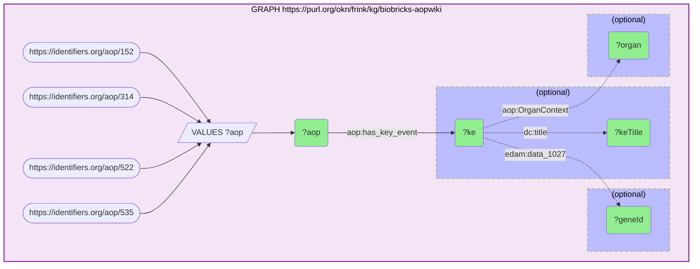

_31 row(s)_

#### Query 4

_2026-07-23T05:02:43+00:00 · `rdkg`_

```sparql
PREFIX rdfs: <http://www.w3.org/2000/01/rdf-schema#>
PREFIX biolink: <https://w3id.org/biolink/vocab/>
SELECT ?gene ?sym ?disease ?dlabel WHERE {
  GRAPH <https://purl.org/okn/frink/kg/rdkg> {
    VALUES ?gene { <http://identifiers.org/ncbigene/10018> <http://identifiers.org/ncbigene/1026> <http://identifiers.org/ncbigene/10344> <http://identifiers.org/ncbigene/10488> <http://identifiers.org/ncbigene/1051> <http://identifiers.org/ncbigene/10599> <http://identifiers.org/ncbigene/1128> <http://identifiers.org/ncbigene/1277> <http://identifiers.org/ncbigene/1281> <http://identifiers.org/ncbigene/1282> <http://identifiers.org/ncbigene/132> <http://identifiers.org/ncbigene/134> <http://identifiers.org/ncbigene/135> <http://identifiers.org/ncbigene/1435> <http://identifiers.org/ncbigene/152> <http://identifiers.org/ncbigene/153> <http://identifiers.org/ncbigene/154> <http://identifiers.org/ncbigene/1543> <http://identifiers.org/ncbigene/1544> <http://identifiers.org/ncbigene/1551> <http://identifiers.org/ncbigene/1555> <http://identifiers.org/ncbigene/1557> <http://identifiers.org/ncbigene/1559> <http://identifiers.org/ncbigene/1562> <http://identifiers.org/ncbigene/1571> <http://identifiers.org/ncbigene/1573> <http://identifiers.org/ncbigene/1576> <http://identifiers.org/ncbigene/1579> <http://identifiers.org/ncbigene/1581> <http://identifiers.org/ncbigene/1588> <http://identifiers.org/ncbigene/1591> <http://identifiers.org/ncbigene/1634> <http://identifiers.org/ncbigene/1649> <http://identifiers.org/ncbigene/1728> <http://identifiers.org/ncbigene/1733> <http://identifiers.org/ncbigene/1734> <http://identifiers.org/ncbigene/1735> <http://identifiers.org/ncbigene/1812> <http://identifiers.org/ncbigene/1813> <http://identifiers.org/ncbigene/1815> <http://identifiers.org/ncbigene/1845> <http://identifiers.org/ncbigene/1950> <http://identifiers.org/ncbigene/1958> <http://identifiers.org/ncbigene/196> <http://identifiers.org/ncbigene/2099> <http://identifiers.org/ncbigene/2100> <http://identifiers.org/ncbigene/2101> <http://identifiers.org/ncbigene/2113> <http://identifiers.org/ncbigene/2152> <http://identifiers.org/ncbigene/2168> <http://identifiers.org/ncbigene/2194> <http://identifiers.org/ncbigene/2247> <http://identifiers.org/ncbigene/22926> <http://identifiers.org/ncbigene/2308> <http://identifiers.org/ncbigene/23089> <http://identifiers.org/ncbigene/2309> <http://identifiers.org/ncbigene/2328> <http://identifiers.org/ncbigene/23410> <http://identifiers.org/ncbigene/2353> <http://identifiers.org/ncbigene/250> <http://identifiers.org/ncbigene/2623> <http://identifiers.org/ncbigene/2729> <http://identifiers.org/ncbigene/2735> <http://identifiers.org/ncbigene/2908> <http://identifiers.org/ncbigene/2939> <http://identifiers.org/ncbigene/3014> <http://identifiers.org/ncbigene/3020> <http://identifiers.org/ncbigene/3082> <http://identifiers.org/ncbigene/3091> <http://identifiers.org/ncbigene/3122> <http://identifiers.org/ncbigene/3158> <http://identifiers.org/ncbigene/3170> <http://identifiers.org/ncbigene/3172> <http://identifiers.org/ncbigene/3175> <http://identifiers.org/ncbigene/3297> <http://identifiers.org/ncbigene/3303> <http://identifiers.org/ncbigene/3358> <http://identifiers.org/ncbigene/3362> <http://identifiers.org/ncbigene/3363> <http://identifiers.org/ncbigene/3383> <http://identifiers.org/ncbigene/3479> <http://identifiers.org/ncbigene/3484> <http://identifiers.org/ncbigene/355> <http://identifiers.org/ncbigene/3552> <http://identifiers.org/ncbigene/3558> <http://identifiers.org/ncbigene/3569> <http://identifiers.org/ncbigene/3570> <http://identifiers.org/ncbigene/3576> <http://identifiers.org/ncbigene/3605> <http://identifiers.org/ncbigene/3627> <http://identifiers.org/ncbigene/367> <http://identifiers.org/ncbigene/3725> <http://identifiers.org/ncbigene/3791> <http://identifiers.org/ncbigene/3949> <http://identifiers.org/ncbigene/4023> <http://identifiers.org/ncbigene/4086> <http://identifiers.org/ncbigene/4283> <http://identifiers.org/ncbigene/4312> <http://identifiers.org/ncbigene/4314> <http://identifiers.org/ncbigene/4318> <http://identifiers.org/ncbigene/4319> <http://identifiers.org/ncbigene/4520> <http://identifiers.org/ncbigene/4602> <http://identifiers.org/ncbigene/4609> <http://identifiers.org/ncbigene/4774> <http://identifiers.org/ncbigene/4780> <http://identifiers.org/ncbigene/4899> <http://identifiers.org/ncbigene/4929> <http://identifiers.org/ncbigene/4985> <http://identifiers.org/ncbigene/4987> <http://identifiers.org/ncbigene/4988> <http://identifiers.org/ncbigene/5054> <http://identifiers.org/ncbigene/5080> <http://identifiers.org/ncbigene/51> <http://identifiers.org/ncbigene/5166> <http://identifiers.org/ncbigene/5241> <http://identifiers.org/ncbigene/5290> <http://identifiers.org/ncbigene/5327> <http://identifiers.org/ncbigene/5328> <http://identifiers.org/ncbigene/5329> <http://identifiers.org/ncbigene/5451> <http://identifiers.org/ncbigene/5465> <http://identifiers.org/ncbigene/54658> <http://identifiers.org/ncbigene/5467> <http://identifiers.org/ncbigene/5468> <http://identifiers.org/ncbigene/5562> <http://identifiers.org/ncbigene/5728> <http://identifiers.org/ncbigene/5732> <http://identifiers.org/ncbigene/58> <http://identifiers.org/ncbigene/581> <http://identifiers.org/ncbigene/5914> <http://identifiers.org/ncbigene/595> <http://identifiers.org/ncbigene/5980> <http://identifiers.org/ncbigene/6095> <http://identifiers.org/ncbigene/6097> <http://identifiers.org/ncbigene/6256> <http://identifiers.org/ncbigene/6257> <http://identifiers.org/ncbigene/6288> <http://identifiers.org/ncbigene/6347> <http://identifiers.org/ncbigene/6390> <http://identifiers.org/ncbigene/6401> <http://identifiers.org/ncbigene/6403> <http://identifiers.org/ncbigene/6469> <http://identifiers.org/ncbigene/6528> <http://identifiers.org/ncbigene/6530> <http://identifiers.org/ncbigene/6531> <http://identifiers.org/ncbigene/6580> <http://identifiers.org/ncbigene/6656> <http://identifiers.org/ncbigene/6667> <http://identifiers.org/ncbigene/6714> <http://identifiers.org/ncbigene/6720> <http://identifiers.org/ncbigene/6822> <http://identifiers.org/ncbigene/7039> <http://identifiers.org/ncbigene/7040> <http://identifiers.org/ncbigene/7056> <http://identifiers.org/ncbigene/706> <http://identifiers.org/ncbigene/7067> <http://identifiers.org/ncbigene/7068> <http://identifiers.org/ncbigene/7069> <http://identifiers.org/ncbigene/7076> <http://identifiers.org/ncbigene/7077> <http://identifiers.org/ncbigene/7124> <http://identifiers.org/ncbigene/7132> <http://identifiers.org/ncbigene/7157> <http://identifiers.org/ncbigene/7201> <http://identifiers.org/ncbigene/7253> <http://identifiers.org/ncbigene/7412> <http://identifiers.org/ncbigene/7421> <http://identifiers.org/ncbigene/7430> <http://identifiers.org/ncbigene/7494> <http://identifiers.org/ncbigene/836> <http://identifiers.org/ncbigene/8438> <http://identifiers.org/ncbigene/847> <http://identifiers.org/ncbigene/8647> <http://identifiers.org/ncbigene/8714> <http://identifiers.org/ncbigene/8837> <http://identifiers.org/ncbigene/8856> <http://identifiers.org/ncbigene/9429> <http://identifiers.org/ncbigene/952> <http://identifiers.org/ncbigene/958> <http://identifiers.org/ncbigene/969> <http://identifiers.org/ncbigene/9970> <http://identifiers.org/ncbigene/9971> }
    ?gene rdfs:label ?sym ; biolink:related_to ?disease .
    ?disease rdfs:label ?dlabel .
    FILTER(CONTAINS(STR(?disease),"MONDO"))
  }
}
```

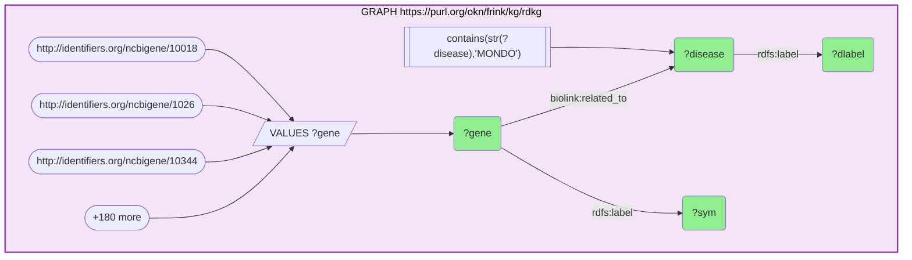

_5955 row(s)_

#### Query 5

_2026-07-23T05:03:47+00:00 · `rdkg`_

```sparql
PREFIX biolink: <https://w3id.org/biolink/vocab/>
SELECT (COUNT(DISTINCT ?g) AS ?n_bg) WHERE {
  GRAPH <https://purl.org/okn/frink/kg/rdkg> {
    ?g biolink:related_to ?d ; <https://w3id.org/biolink/vocab/category> "biolink:Gene" .
    FILTER(CONTAINS(STR(?d),"MONDO"))
  }
}
```

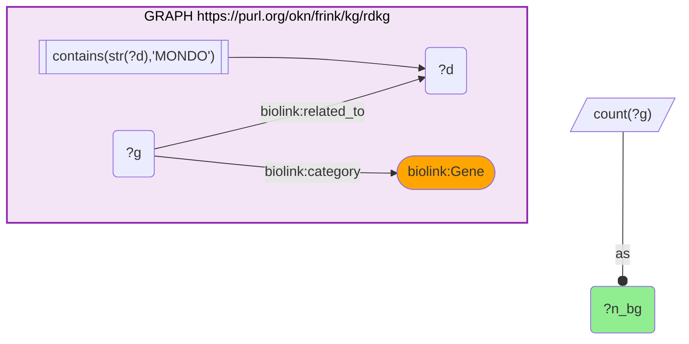

_1 row(s)_

#### Query 6

_2026-07-23T05:05:00+00:00 · `rdkg`_

```sparql
PREFIX biolink: <https://w3id.org/biolink/vocab/>
PREFIX rdfs: <http://www.w3.org/2000/01/rdf-schema#>
SELECT ?d (COUNT(DISTINCT ?g) AS ?K) WHERE {
  GRAPH <https://purl.org/okn/frink/kg/rdkg> {
    VALUES ?d { <http://purl.obolibrary.org/obo/MONDO_0003582> <http://purl.obolibrary.org/obo/MONDO_0021100> <http://purl.obolibrary.org/obo/MONDO_0007254> <http://purl.obolibrary.org/obo/MONDO_0016266> <http://purl.obolibrary.org/obo/MONDO_0016267> <http://purl.obolibrary.org/obo/MONDO_0016419> <http://purl.obolibrary.org/obo/MONDO_0023122> <http://purl.obolibrary.org/obo/MONDO_0008315> <http://purl.obolibrary.org/obo/MONDO_0005159> <http://purl.obolibrary.org/obo/MONDO_0002691> <http://purl.obolibrary.org/obo/MONDO_0004989> <http://purl.obolibrary.org/obo/MONDO_0018055> <http://purl.obolibrary.org/obo/MONDO_0018533> <http://purl.obolibrary.org/obo/MONDO_0018532> <http://purl.obolibrary.org/obo/MONDO_0018534> <http://purl.obolibrary.org/obo/MONDO_0005263> <http://purl.obolibrary.org/obo/MONDO_0008903> <http://purl.obolibrary.org/obo/MONDO_0005575> <http://purl.obolibrary.org/obo/MONDO_0005359> <http://purl.obolibrary.org/obo/MONDO_0007027> <http://purl.obolibrary.org/obo/MONDO_0005010> <http://purl.obolibrary.org/obo/MONDO_0019182> <http://purl.obolibrary.org/obo/MONDO_0011122> <http://purl.obolibrary.org/obo/MONDO_0012048> <http://purl.obolibrary.org/obo/MONDO_0005379> <http://purl.obolibrary.org/obo/MONDO_0005203> <http://purl.obolibrary.org/obo/MONDO_0001442> <http://purl.obolibrary.org/obo/MONDO_0024644> <http://purl.obolibrary.org/obo/MONDO_0018184> <http://purl.obolibrary.org/obo/MONDO_0001056> <http://purl.obolibrary.org/obo/MONDO_0004950> <http://purl.obolibrary.org/obo/MONDO_0021085> <http://purl.obolibrary.org/obo/MONDO_0005335> <http://purl.obolibrary.org/obo/MONDO_0024331> <http://purl.obolibrary.org/obo/MONDO_0021117> <http://purl.obolibrary.org/obo/MONDO_0005264> <http://purl.obolibrary.org/obo/MONDO_0005299> <http://purl.obolibrary.org/obo/MONDO_0006176> <http://purl.obolibrary.org/obo/MONDO_0006402> <http://purl.obolibrary.org/obo/MONDO_0005606> <http://purl.obolibrary.org/obo/MONDO_0005258> <http://purl.obolibrary.org/obo/MONDO_0005260> <http://purl.obolibrary.org/obo/MONDO_0005233> <http://purl.obolibrary.org/obo/MONDO_0004970> <http://purl.obolibrary.org/obo/MONDO_0020643> <http://purl.obolibrary.org/obo/MONDO_0045059> <http://purl.obolibrary.org/obo/MONDO_0003197> <http://purl.obolibrary.org/obo/MONDO_0004993> <http://purl.obolibrary.org/obo/MONDO_0005401> <http://purl.obolibrary.org/obo/MONDO_0001751> <http://purl.obolibrary.org/obo/MONDO_0005068> <http://purl.obolibrary.org/obo/MONDO_0006716> <http://purl.obolibrary.org/obo/MONDO_0021063> <http://purl.obolibrary.org/obo/MONDO_0003268> <http://purl.obolibrary.org/obo/MONDO_0001438> <http://purl.obolibrary.org/obo/MONDO_0002771> <http://purl.obolibrary.org/obo/MONDO_0018513> <http://purl.obolibrary.org/obo/MONDO_0005148> <http://purl.obolibrary.org/obo/MONDO_0006292> <http://purl.obolibrary.org/obo/MONDO_0005015> <http://purl.obolibrary.org/obo/MONDO_0002277> <http://purl.obolibrary.org/obo/MONDO_0004987> <http://purl.obolibrary.org/obo/MONDO_0004986> <http://purl.obolibrary.org/obo/MONDO_0004979> <http://purl.obolibrary.org/obo/MONDO_0005311> <http://purl.obolibrary.org/obo/MONDO_0001187> <http://purl.obolibrary.org/obo/MONDO_0004765> <http://purl.obolibrary.org/obo/MONDO_0004114> <http://purl.obolibrary.org/obo/MONDO_0005617> <http://purl.obolibrary.org/obo/MONDO_0004784> <http://purl.obolibrary.org/obo/MONDO_0005065> <http://purl.obolibrary.org/obo/MONDO_0006406> <http://purl.obolibrary.org/obo/MONDO_0016211> <http://purl.obolibrary.org/obo/MONDO_0002492> <http://purl.obolibrary.org/obo/MONDO_0002454> <http://purl.obolibrary.org/obo/MONDO_0005032> <http://purl.obolibrary.org/obo/MONDO_0002108> <http://purl.obolibrary.org/obo/MONDO_0005155> <http://purl.obolibrary.org/obo/MONDO_0005009> <http://purl.obolibrary.org/obo/MONDO_0005252> <http://purl.obolibrary.org/obo/MONDO_0016682> <http://purl.obolibrary.org/obo/MONDO_0100342> <http://purl.obolibrary.org/obo/MONDO_0005192> <http://purl.obolibrary.org/obo/MONDO_0015278> <http://purl.obolibrary.org/obo/MONDO_0005300> <http://purl.obolibrary.org/obo/MONDO_0006658> <http://purl.obolibrary.org/obo/MONDO_0009831> <http://purl.obolibrary.org/obo/MONDO_0005531> <http://purl.obolibrary.org/obo/MONDO_0016681> <http://purl.obolibrary.org/obo/MONDO_0024327> <http://purl.obolibrary.org/obo/MONDO_0021040> <http://purl.obolibrary.org/obo/MONDO_0004375> <http://purl.obolibrary.org/obo/MONDO_0018177> <http://purl.obolibrary.org/obo/MONDO_0005027> <http://purl.obolibrary.org/obo/MONDO_0015074> <http://purl.obolibrary.org/obo/MONDO_0005016> <http://purl.obolibrary.org/obo/MONDO_0016689> <http://purl.obolibrary.org/obo/MONDO_0006337> <http://purl.obolibrary.org/obo/MONDO_0005133> <http://purl.obolibrary.org/obo/MONDO_0016684> <http://purl.obolibrary.org/obo/MONDO_0016686> <http://purl.obolibrary.org/obo/MONDO_0016688> <http://purl.obolibrary.org/obo/MONDO_0005468> <http://purl.obolibrary.org/obo/MONDO_0010888> <http://purl.obolibrary.org/obo/MONDO_0016687> <http://purl.obolibrary.org/obo/MONDO_0006757> <http://purl.obolibrary.org/obo/MONDO_0008383> <http://purl.obolibrary.org/obo/MONDO_0005002> <http://purl.obolibrary.org/obo/MONDO_0014231> <http://purl.obolibrary.org/obo/MONDO_0002447> <http://purl.obolibrary.org/obo/MONDO_0021251> <http://purl.obolibrary.org/obo/MONDO_0021042> <http://purl.obolibrary.org/obo/MONDO_0006891> <http://purl.obolibrary.org/obo/MONDO_0018321> <http://purl.obolibrary.org/obo/MONDO_0010709> <http://purl.obolibrary.org/obo/MONDO_0005384> <http://purl.obolibrary.org/obo/MONDO_0018466> <http://purl.obolibrary.org/obo/MONDO_0009830> <http://purl.obolibrary.org/obo/MONDO_0017636> <http://purl.obolibrary.org/obo/MONDO_0006003> <http://purl.obolibrary.org/obo/MONDO_0010482> <http://purl.obolibrary.org/obo/MONDO_0011751> <http://purl.obolibrary.org/obo/MONDO_0011962> <http://purl.obolibrary.org/obo/MONDO_0001386> <http://purl.obolibrary.org/obo/MONDO_0016093> <http://purl.obolibrary.org/obo/MONDO_0008170> <http://purl.obolibrary.org/obo/MONDO_0016096> <http://purl.obolibrary.org/obo/MONDO_0021068> <http://purl.obolibrary.org/obo/MONDO_0002898> <http://purl.obolibrary.org/obo/MONDO_0008159> <http://purl.obolibrary.org/obo/MONDO_0018369> <http://purl.obolibrary.org/obo/MONDO_0006335> <http://purl.obolibrary.org/obo/MONDO_0003792> <http://purl.obolibrary.org/obo/MONDO_0003795> <http://purl.obolibrary.org/obo/MONDO_0006045> <http://purl.obolibrary.org/obo/MONDO_0003969> <http://purl.obolibrary.org/obo/MONDO_0020543> <http://purl.obolibrary.org/obo/MONDO_0005744> <http://purl.obolibrary.org/obo/MONDO_0002752> <http://purl.obolibrary.org/obo/MONDO_0005601> <http://purl.obolibrary.org/obo/MONDO_0020542> <http://purl.obolibrary.org/obo/MONDO_0005567> <http://purl.obolibrary.org/obo/MONDO_0018172> <http://purl.obolibrary.org/obo/MONDO_0018171> <http://purl.obolibrary.org/obo/MONDO_0018166> <http://purl.obolibrary.org/obo/MONDO_0005298> <http://purl.obolibrary.org/obo/MONDO_0005249> <http://purl.obolibrary.org/obo/MONDO_0017327> <http://purl.obolibrary.org/obo/MONDO_0013276> <http://purl.obolibrary.org/obo/MONDO_0006857> <http://purl.obolibrary.org/obo/MONDO_0020538> <http://purl.obolibrary.org/obo/MONDO_0020541> <http://purl.obolibrary.org/obo/MONDO_0016248> <http://purl.obolibrary.org/obo/MONDO_0016249> <http://purl.obolibrary.org/obo/MONDO_0002531> <http://purl.obolibrary.org/obo/MONDO_0025483> <http://purl.obolibrary.org/obo/MONDO_0001166> <http://purl.obolibrary.org/obo/MONDO_0002125> <http://purl.obolibrary.org/obo/MONDO_0005301> <http://purl.obolibrary.org/obo/MONDO_0019434> <http://purl.obolibrary.org/obo/MONDO_0006589> <http://purl.obolibrary.org/obo/MONDO_0002123> <http://purl.obolibrary.org/obo/MONDO_0018891> <http://purl.obolibrary.org/obo/MONDO_0005480> <http://purl.obolibrary.org/obo/MONDO_0002505> <http://purl.obolibrary.org/obo/MONDO_0001106> <http://purl.obolibrary.org/obo/MONDO_0002512> <http://purl.obolibrary.org/obo/MONDO_0017596> <http://purl.obolibrary.org/obo/MONDO_0017597> <http://purl.obolibrary.org/obo/MONDO_0006373> <http://purl.obolibrary.org/obo/MONDO_0003699> <http://purl.obolibrary.org/obo/MONDO_0001569> <http://purl.obolibrary.org/obo/MONDO_0005942> <http://purl.obolibrary.org/obo/MONDO_0004071> <http://purl.obolibrary.org/obo/MONDO_0018225> <http://purl.obolibrary.org/obo/MONDO_0021636> <http://purl.obolibrary.org/obo/MONDO_0016693> <http://purl.obolibrary.org/obo/MONDO_0006383> <http://purl.obolibrary.org/obo/MONDO_0019781> <http://purl.obolibrary.org/obo/MONDO_0017884> <http://purl.obolibrary.org/obo/MONDO_0032920> <http://purl.obolibrary.org/obo/MONDO_0020324> <http://purl.obolibrary.org/obo/MONDO_0005534> <http://purl.obolibrary.org/obo/MONDO_0005532> <http://purl.obolibrary.org/obo/MONDO_0016685> <http://purl.obolibrary.org/obo/MONDO_0017347> <http://purl.obolibrary.org/obo/MONDO_0020323> <http://purl.obolibrary.org/obo/MONDO_0016642> <http://purl.obolibrary.org/obo/MONDO_0019436> <http://purl.obolibrary.org/obo/MONDO_0021124> <http://purl.obolibrary.org/obo/MONDO_0007008> <http://purl.obolibrary.org/obo/MONDO_0002909> <http://purl.obolibrary.org/obo/MONDO_0006644> <http://purl.obolibrary.org/obo/MONDO_0005098> <http://purl.obolibrary.org/obo/MONDO_0015796> <http://purl.obolibrary.org/obo/MONDO_0021074> <http://purl.obolibrary.org/obo/MONDO_0011401> <http://purl.obolibrary.org/obo/MONDO_0005101> <http://purl.obolibrary.org/obo/MONDO_0017346> <http://purl.obolibrary.org/obo/MONDO_0002367> <http://purl.obolibrary.org/obo/MONDO_0006525> <http://purl.obolibrary.org/obo/MONDO_0008243> <http://purl.obolibrary.org/obo/MONDO_0006474> <http://purl.obolibrary.org/obo/MONDO_0002571> <http://purl.obolibrary.org/obo/MONDO_0005292> <http://purl.obolibrary.org/obo/MONDO_0013662> <http://purl.obolibrary.org/obo/MONDO_0013626> <http://purl.obolibrary.org/obo/MONDO_0005206> <http://purl.obolibrary.org/obo/MONDO_0005059> <http://purl.obolibrary.org/obo/MONDO_0005061> <http://purl.obolibrary.org/obo/MONDO_0005083> <http://purl.obolibrary.org/obo/MONDO_0002083> <http://purl.obolibrary.org/obo/MONDO_0004981> <http://purl.obolibrary.org/obo/MONDO_0009807> <http://purl.obolibrary.org/obo/MONDO_0005086> <http://purl.obolibrary.org/obo/MONDO_0004971> <http://purl.obolibrary.org/obo/MONDO_0012819> <http://purl.obolibrary.org/obo/MONDO_0010481> <http://purl.obolibrary.org/obo/MONDO_0002251> <http://purl.obolibrary.org/obo/MONDO_0015597> <http://purl.obolibrary.org/obo/MONDO_0024614> <http://purl.obolibrary.org/obo/MONDO_0002444> <http://purl.obolibrary.org/obo/MONDO_0007763> <http://purl.obolibrary.org/obo/MONDO_0007576> <http://purl.obolibrary.org/obo/MONDO_0006592> <http://purl.obolibrary.org/obo/MONDO_0007191> <http://purl.obolibrary.org/obo/MONDO_0009100> <http://purl.obolibrary.org/obo/MONDO_0005580> <http://purl.obolibrary.org/obo/MONDO_0003175> <http://purl.obolibrary.org/obo/MONDO_0005005> <http://purl.obolibrary.org/obo/MONDO_0019086> <http://purl.obolibrary.org/obo/MONDO_0002629> }
    ?g biolink:related_to ?d ; <https://w3id.org/biolink/vocab/category> "biolink:Gene" .
  }
} GROUP BY ?d
```

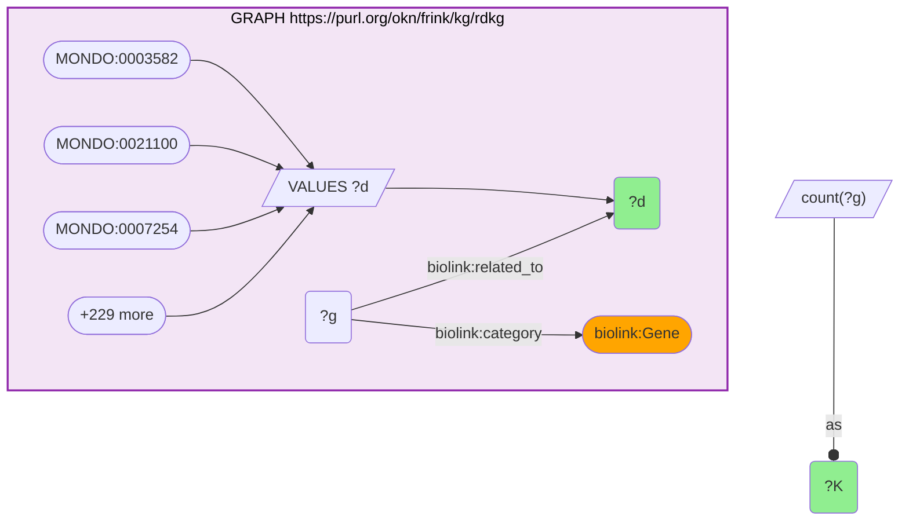

_232 row(s)_

#### Query 7

_2026-07-23T05:07:47+00:00 · `prokn`_

```sparql
PREFIX rdfs: <http://www.w3.org/2000/01/rdf-schema#>
PREFIX up: <http://purl.uniprot.org/core/>
SELECT ?sym ?pw ?pwLabel WHERE {
  GRAPH <https://purl.org/okn/frink/kg/prokn> {
    VALUES ?sym { "BCL2L11" "CDKN1A" "CCL26" "CREB3" "CEBPB" "SLCO1B1" "CHRM1" "COL1A1" "COL3A1" "COL4A1" "ADK" "ADORA1" "ADORA2A" "CSF1" "ADRA2C" "ADRB1" "ADRB2" "CYP1A1" "CYP1A2" "CYP3A7" "CYP2B6" "CYP2C19" "CYP2C9" "CYP2C18" "CYP2E1" "CYP2J2" "CYP3A4" "CYP4A11" "CYP7A1" "CYP19A1" "CYP24A1" "DCN" "DDIT3" "NQO1" "DIO1" "DIO2" "DIO3" "DRD1" "DRD2" "DRD4" "DUSP3" "EGF" "EGR1" "AHR" "ESR1" "ESR2" "ESRRA" "ETS1" "F3" "FABP1" "FASN" "FGF2" "ATF6" "FOXO1" "PEG10" "FOXO3" "FMO3" "SIRT3" "FOS" "ALPP" "GATA1" "GCLC" "GLI1" "NR3C1" "GSTA2" "H2AX" "H3-3A" "HGF" "HIF1A" "HLA-DRA" "HMGCS2" "FOXA2" "HNF4A" "ONECUT1" "HSF1" "HSPA1A" "HTR2C" "HTR6" "HTR7" "ICAM1" "IGF1" "IGFBP1" "FAS" "IL1A" "IL2" "IL6" "IL6R" "CXCL8" "IL17A" "CXCL10" "AR" "JUN" "KDR" "LDLR" "LPL" "SMAD1" "CXCL9" "MMP1" "MMP3" "MMP9" "MMP10" "MTF1" "MYB" "MYC" "NFIA" "NFE2L2" "NRF1" "NR4A2" "OPRD1" "OPRL1" "OPRM1" "SERPINE1" "PAX6" "ACOX1" "PDK4" "PGR" "PIK3CA" "PLAT" "PLAU" "PLAUR" "POU2F1" "PPARA" "UGT1A1" "PPARD" "PPARG" "PRKAA1" "PTEN" "PTGER2" "ACTA1" "BAX" "RARA" "CCND1" "REV3L" "RORA" "RORC" "RXRA" "RXRB" "SAA1" "CCL2" "SDHB" "SELE" "SELP" "SHH" "SLC5A5" "SLC6A2" "SLC6A3" "SLC22A1" "SOX1" "SP1" "SRC" "SREBF1" "SULT2A1" "TGFA" "TGFB1" "THBD" "TSPO" "THRA" "THRB" "THRSP" "TIMP1" "TIMP2" "TNF" "TNFRSF1A" "TP53" "TRHR" "TSHR" "VCAM1" "VDR" "EZR" "XBP1" "CASP3" "RAD54L" "CAT" "ABCB11" "ABCC3" "CFLAR" "NR1I2" "ABCG2" "CD38" "CD40" "CD69" "NR1I3" "NR1H4" }
    ?gene rdfs:label ?sym ; <http://semanticscience.org/resource/SIO_010078> ?prot .
    ?prot <http://purl.obolibrary.org/obo/RO_0000056> ?pw .
    ?pw a up:Pathway .
    FILTER(CONTAINS(STR(?pw),"R-HSA"))
    OPTIONAL { ?pw rdfs:label ?pwLabel }
  }
}
```

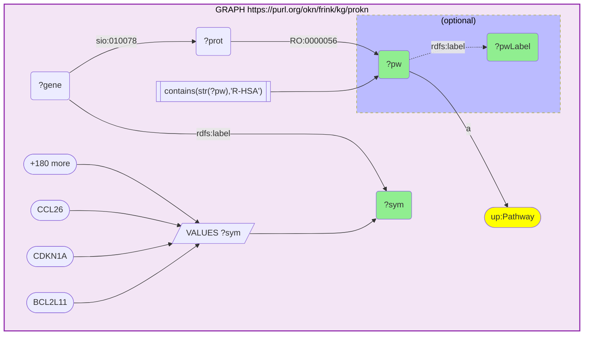

_1183 row(s)_

#### Query 8

_2026-07-23T05:08:31+00:00 · `prokn`_

```sparql
PREFIX rdfs: <http://www.w3.org/2000/01/rdf-schema#>
SELECT ?sym ?go ?goLabel WHERE {
  GRAPH <https://purl.org/okn/frink/kg/prokn> {
    VALUES ?sym { "BCL2L11" "CDKN1A" "CCL26" "CREB3" "CEBPB" "SLCO1B1" "CHRM1" "COL1A1" "COL3A1" "COL4A1" "ADK" "ADORA1" "ADORA2A" "CSF1" "ADRA2C" "ADRB1" "ADRB2" "CYP1A1" "CYP1A2" "CYP3A7" "CYP2B6" "CYP2C19" "CYP2C9" "CYP2C18" "CYP2E1" "CYP2J2" "CYP3A4" "CYP4A11" "CYP7A1" "CYP19A1" "CYP24A1" "DCN" "DDIT3" "NQO1" "DIO1" "DIO2" "DIO3" "DRD1" "DRD2" "DRD4" "DUSP3" "EGF" "EGR1" "AHR" "ESR1" "ESR2" "ESRRA" "ETS1" "F3" "FABP1" "FASN" "FGF2" "ATF6" "FOXO1" "PEG10" "FOXO3" "FMO3" "SIRT3" "FOS" "ALPP" "GATA1" "GCLC" "GLI1" "NR3C1" "GSTA2" "H2AX" "H3-3A" "HGF" "HIF1A" "HLA-DRA" "HMGCS2" "FOXA2" "HNF4A" "ONECUT1" "HSF1" "HSPA1A" "HTR2C" "HTR6" "HTR7" "ICAM1" "IGF1" "IGFBP1" "FAS" "IL1A" "IL2" "IL6" "IL6R" "CXCL8" "IL17A" "CXCL10" "AR" "JUN" "KDR" "LDLR" "LPL" "SMAD1" "CXCL9" "MMP1" "MMP3" "MMP9" "MMP10" "MTF1" "MYB" "MYC" "NFIA" "NFE2L2" "NRF1" "NR4A2" "OPRD1" "OPRL1" "OPRM1" "SERPINE1" "PAX6" "ACOX1" "PDK4" "PGR" "PIK3CA" "PLAT" "PLAU" "PLAUR" "POU2F1" "PPARA" "UGT1A1" "PPARD" "PPARG" "PRKAA1" "PTEN" "PTGER2" "ACTA1" "BAX" "RARA" "CCND1" "REV3L" "RORA" "RORC" "RXRA" "RXRB" "SAA1" "CCL2" "SDHB" "SELE" "SELP" "SHH" "SLC5A5" "SLC6A2" "SLC6A3" "SLC22A1" "SOX1" "SP1" "SRC" "SREBF1" "SULT2A1" "TGFA" "TGFB1" "THBD" "TSPO" "THRA" "THRB" "THRSP" "TIMP1" "TIMP2" "TNF" "TNFRSF1A" "TP53" "TRHR" "TSHR" "VCAM1" "VDR" "EZR" "XBP1" "CASP3" "RAD54L" "CAT" "ABCB11" "ABCC3" "CFLAR" "NR1I2" "ABCG2" "CD38" "CD40" "CD69" "NR1I3" "NR1H4" }
    ?gene rdfs:label ?sym ; <http://semanticscience.org/resource/SIO_010078> ?prot .
    ?prot <http://purl.obolibrary.org/obo/RO_0002331> ?go .
    OPTIONAL { ?go rdfs:label ?goLabel }
  }
}
```

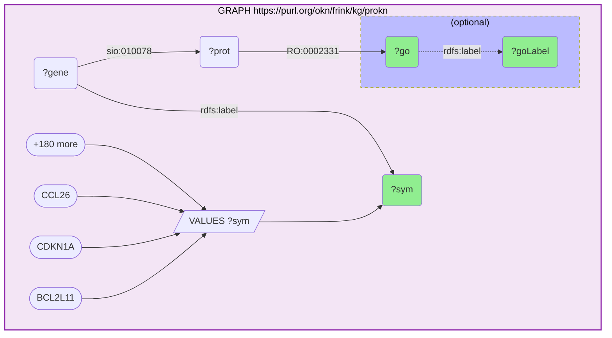

_3900 row(s)_

#### Query 9

_2026-07-23T05:09:14+00:00 · `prokn`_

```sparql
PREFIX rdfs: <http://www.w3.org/2000/01/rdf-schema#>
PREFIX up: <http://purl.uniprot.org/core/>
SELECT (COUNT(DISTINCT ?sym) AS ?N_react) WHERE {
  GRAPH <https://purl.org/okn/frink/kg/prokn> {
    ?gene rdfs:label ?sym ; <http://semanticscience.org/resource/SIO_010078> ?prot .
    ?prot <http://purl.obolibrary.org/obo/RO_0000056> ?pw .
    ?pw a up:Pathway . FILTER(CONTAINS(STR(?pw),"R-HSA"))
  }
}
```

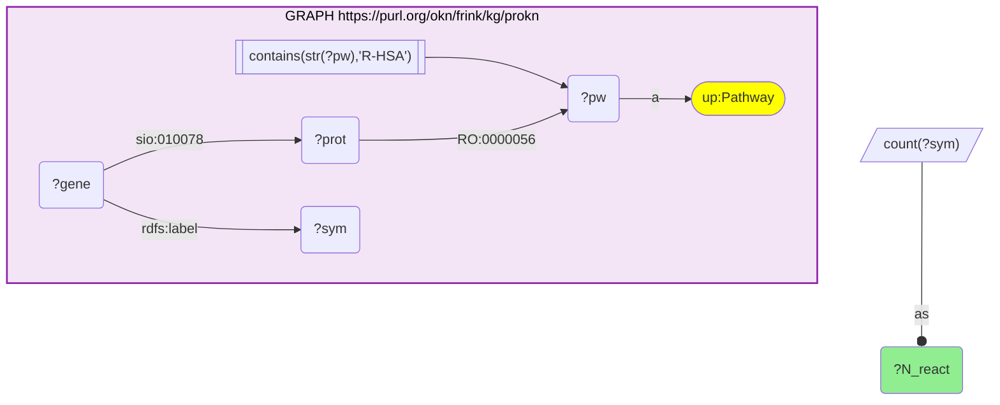

_1 row(s)_

#### Query 10

_2026-07-23T05:09:16+00:00 · `prokn`_

```sparql
PREFIX rdfs: <http://www.w3.org/2000/01/rdf-schema#>
SELECT (COUNT(DISTINCT ?sym) AS ?N_go) WHERE {
  GRAPH <https://purl.org/okn/frink/kg/prokn> {
    ?gene rdfs:label ?sym ; <http://semanticscience.org/resource/SIO_010078> ?prot .
    ?prot <http://purl.obolibrary.org/obo/RO_0002331> ?go .
  }
}
```

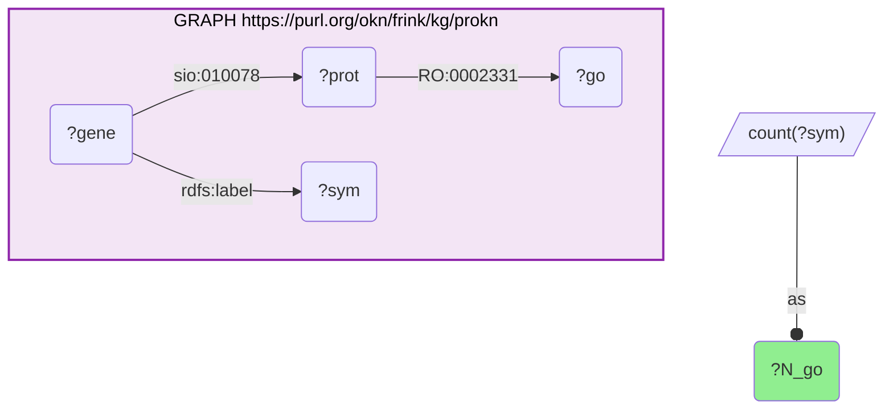

_1 row(s)_

#### Query 11

_2026-07-23T05:09:40+00:00 · `prokn`_

```sparql
PREFIX rdfs: <http://www.w3.org/2000/01/rdf-schema#>
SELECT ?pw (COUNT(DISTINCT ?sym) AS ?K) WHERE {
  GRAPH <https://purl.org/okn/frink/kg/prokn> {
    VALUES ?pw { <https://identifiers.org/reactome/R-HSA-6785807> <https://identifiers.org/reactome/R-HSA-383280> <https://identifiers.org/reactome/R-HSA-1989781> <https://identifiers.org/reactome/R-HSA-4090294> <https://identifiers.org/reactome/R-HSA-9018519> <https://identifiers.org/reactome/R-HSA-418555> <https://identifiers.org/reactome/R-HSA-211981> <https://identifiers.org/reactome/R-HSA-6783783> <https://identifiers.org/reactome/R-HSA-381340> <https://identifiers.org/reactome/R-HSA-418594> <https://identifiers.org/reactome/R-HSA-1442490> <https://identifiers.org/reactome/R-HSA-9616222> <https://identifiers.org/reactome/R-HSA-6811558> <https://identifiers.org/reactome/R-HSA-1257604> <https://identifiers.org/reactome/R-HSA-2559582> <https://identifiers.org/reactome/R-HSA-9009391> <https://identifiers.org/reactome/R-HSA-9615017> <https://identifiers.org/reactome/R-HSA-9841251> <https://identifiers.org/reactome/R-HSA-2219530> <https://identifiers.org/reactome/R-HSA-216083> <https://identifiers.org/reactome/R-HSA-9749641> <https://identifiers.org/reactome/R-HSA-1474228> <https://identifiers.org/reactome/R-HSA-380994> <https://identifiers.org/reactome/R-HSA-3000178> <https://identifiers.org/reactome/R-HSA-5689880> <https://identifiers.org/reactome/R-HSA-114608> <https://identifiers.org/reactome/R-HSA-5617472> <https://identifiers.org/reactome/R-HSA-9841922> <https://identifiers.org/reactome/R-HSA-9933387> <https://identifiers.org/reactome/R-HSA-198933> <https://identifiers.org/reactome/R-HSA-5362517> <https://identifiers.org/reactome/R-HSA-1592389> <https://identifiers.org/reactome/R-HSA-159418> <https://identifiers.org/reactome/R-HSA-2151201> <https://identifiers.org/reactome/R-HSA-381426> <https://identifiers.org/reactome/R-HSA-5673001> <https://identifiers.org/reactome/R-HSA-2022090> <https://identifiers.org/reactome/R-HSA-375276> <https://identifiers.org/reactome/R-HSA-6798695> <https://identifiers.org/reactome/R-HSA-2426168> <https://identifiers.org/reactome/R-HSA-2142670> <https://identifiers.org/reactome/R-HSA-202733> }
    ?gene rdfs:label ?sym ; <http://semanticscience.org/resource/SIO_010078> ?prot .
    ?prot <http://purl.obolibrary.org/obo/RO_0000056> ?pw .
  }
} GROUP BY ?pw
```

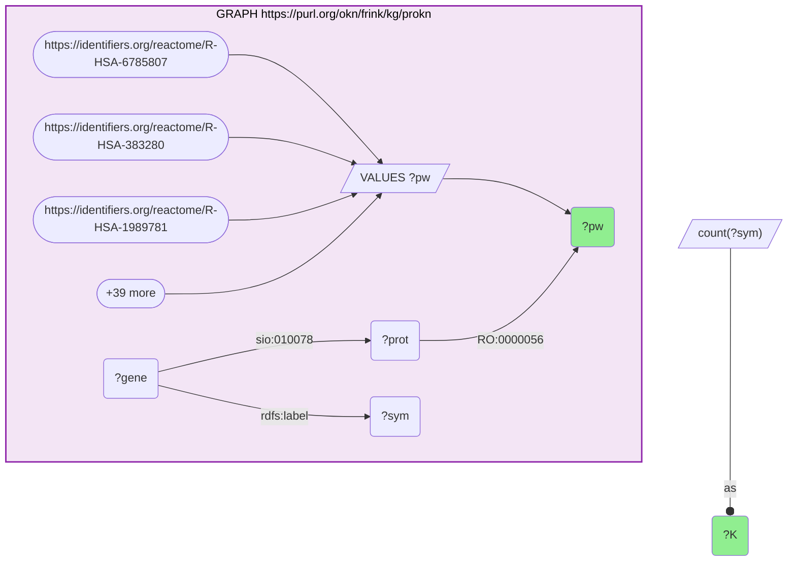

_42 row(s)_

#### Query 12

_2026-07-23T05:10:00+00:00 · `prokn`_

```sparql
PREFIX rdfs: <http://www.w3.org/2000/01/rdf-schema#>
SELECT ?go (COUNT(DISTINCT ?sym) AS ?K) WHERE {
  GRAPH <https://purl.org/okn/frink/kg/prokn> {
    VALUES ?go { <http://purl.obolibrary.org/obo/GO_0045944> <http://purl.obolibrary.org/obo/GO_0006355> <http://purl.obolibrary.org/obo/GO_0007165> <http://purl.obolibrary.org/obo/GO_0045893> <http://purl.obolibrary.org/obo/GO_0000122> <http://purl.obolibrary.org/obo/GO_0010628> <http://purl.obolibrary.org/obo/GO_0006357> <http://purl.obolibrary.org/obo/GO_0006629> <http://purl.obolibrary.org/obo/GO_0009410> <http://purl.obolibrary.org/obo/GO_0043066> <http://purl.obolibrary.org/obo/GO_0007186> <http://purl.obolibrary.org/obo/GO_0008284> <http://purl.obolibrary.org/obo/GO_0006805> <http://purl.obolibrary.org/obo/GO_0006915> <http://purl.obolibrary.org/obo/GO_0071222> <http://purl.obolibrary.org/obo/GO_1902895> <http://purl.obolibrary.org/obo/GO_0008285> <http://purl.obolibrary.org/obo/GO_0045471> <http://purl.obolibrary.org/obo/GO_0006954> <http://purl.obolibrary.org/obo/GO_0045892> <http://purl.obolibrary.org/obo/GO_0008202> <http://purl.obolibrary.org/obo/GO_0071456> <http://purl.obolibrary.org/obo/GO_0001666> <http://purl.obolibrary.org/obo/GO_0006955> <http://purl.obolibrary.org/obo/GO_0006631> <http://purl.obolibrary.org/obo/GO_0043065> <http://purl.obolibrary.org/obo/GO_0043410> <http://purl.obolibrary.org/obo/GO_0010629> <http://purl.obolibrary.org/obo/GO_0051897> <http://purl.obolibrary.org/obo/GO_0006508> <http://purl.obolibrary.org/obo/GO_0048511> <http://purl.obolibrary.org/obo/GO_0001525> <http://purl.obolibrary.org/obo/GO_0045766> <http://purl.obolibrary.org/obo/GO_0070374> <http://purl.obolibrary.org/obo/GO_0007267> <http://purl.obolibrary.org/obo/GO_0032496> <http://purl.obolibrary.org/obo/GO_0032355> <http://purl.obolibrary.org/obo/GO_0030335> <http://purl.obolibrary.org/obo/GO_0030154> <http://purl.obolibrary.org/obo/GO_0006974> <http://purl.obolibrary.org/obo/GO_0007200> <http://purl.obolibrary.org/obo/GO_0034976> <http://purl.obolibrary.org/obo/GO_0002376> <http://purl.obolibrary.org/obo/GO_0042632> <http://purl.obolibrary.org/obo/GO_0030522> <http://purl.obolibrary.org/obo/GO_0050729> <http://purl.obolibrary.org/obo/GO_0008203> }
    ?gene rdfs:label ?sym ; <http://semanticscience.org/resource/SIO_010078> ?prot .
    ?prot <http://purl.obolibrary.org/obo/RO_0002331> ?go .
  }
} GROUP BY ?go
```

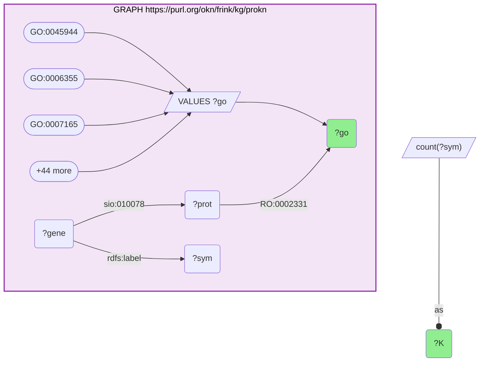

_47 row(s)_

#### Query 13

_2026-07-23T05:12:51+00:00 · `biobricks-ice`_

```sparql
PREFIX rdfs: <http://www.w3.org/2000/01/rdf-schema#>
PREFIX obo: <http://purl.obolibrary.org/obo/>
PREFIX sio: <http://semanticscience.org/resource/>
PREFIX bao: <http://www.bioassayontology.org/bao#>
PREFIX biolink: <https://w3id.org/biolink/vocab/>
SELECT DISTINCT ?chemLabel ?useType ?useValue WHERE {
  GRAPH <https://purl.org/okn/frink/kg/biobricks-ice> {
    ?chem a biolink:ChemicalEntity ; rdfs:label ?chemLabel ; obo:RO_0000056 ?mg .
    FILTER( CONTAINS(LCASE(?chemLabel), "bisphenol") || CONTAINS(LCASE(?chemLabel), "sulfonyldiphenol")
         || CONTAINS(LCASE(?chemLabel), "methylenediphenol") || CONTAINS(LCASE(?chemLabel), "dihydroxydiphenyl") )
    ?mg obo:OBI_0000299 ?ep .
    ?ep obo:IAO_0000136 ?chem ; rdfs:label ?useType ; sio:SIO_000300 ?useValue .
    FILTER(CONTAINS(?useType, "Functional Use"))
  }
}
ORDER BY ?chemLabel ?useValue
```

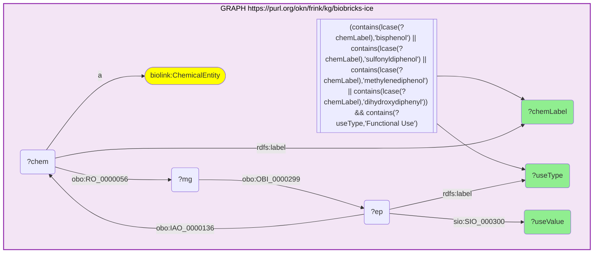

_47 row(s)_

#### Query 14

_2026-07-23T05:14:30+00:00 · `digcfdekg`_

```sparql
PREFIX rdfs: <http://www.w3.org/2000/01/rdf-schema#>
SELECT ?sym ?trait ?tlabel WHERE {
  GRAPH <https://purl.org/okn/frink/kg/digcfdekg> {
    VALUES ?g { <http://www.ncbi.nlm.nih.gov/gene/10018> <http://www.ncbi.nlm.nih.gov/gene/1026> <http://www.ncbi.nlm.nih.gov/gene/10344> <http://www.ncbi.nlm.nih.gov/gene/10488> <http://www.ncbi.nlm.nih.gov/gene/1051> <http://www.ncbi.nlm.nih.gov/gene/10599> <http://www.ncbi.nlm.nih.gov/gene/1128> <http://www.ncbi.nlm.nih.gov/gene/1277> <http://www.ncbi.nlm.nih.gov/gene/1281> <http://www.ncbi.nlm.nih.gov/gene/1282> <http://www.ncbi.nlm.nih.gov/gene/132> <http://www.ncbi.nlm.nih.gov/gene/134> <http://www.ncbi.nlm.nih.gov/gene/135> <http://www.ncbi.nlm.nih.gov/gene/1435> <http://www.ncbi.nlm.nih.gov/gene/152> <http://www.ncbi.nlm.nih.gov/gene/153> <http://www.ncbi.nlm.nih.gov/gene/154> <http://www.ncbi.nlm.nih.gov/gene/1543> <http://www.ncbi.nlm.nih.gov/gene/1544> <http://www.ncbi.nlm.nih.gov/gene/1551> <http://www.ncbi.nlm.nih.gov/gene/1555> <http://www.ncbi.nlm.nih.gov/gene/1557> <http://www.ncbi.nlm.nih.gov/gene/1559> <http://www.ncbi.nlm.nih.gov/gene/1562> <http://www.ncbi.nlm.nih.gov/gene/1571> <http://www.ncbi.nlm.nih.gov/gene/1573> <http://www.ncbi.nlm.nih.gov/gene/1576> <http://www.ncbi.nlm.nih.gov/gene/1579> <http://www.ncbi.nlm.nih.gov/gene/1581> <http://www.ncbi.nlm.nih.gov/gene/1588> <http://www.ncbi.nlm.nih.gov/gene/1591> <http://www.ncbi.nlm.nih.gov/gene/1634> <http://www.ncbi.nlm.nih.gov/gene/1649> <http://www.ncbi.nlm.nih.gov/gene/1728> <http://www.ncbi.nlm.nih.gov/gene/1733> <http://www.ncbi.nlm.nih.gov/gene/1734> <http://www.ncbi.nlm.nih.gov/gene/1735> <http://www.ncbi.nlm.nih.gov/gene/1812> <http://www.ncbi.nlm.nih.gov/gene/1813> <http://www.ncbi.nlm.nih.gov/gene/1815> <http://www.ncbi.nlm.nih.gov/gene/1845> <http://www.ncbi.nlm.nih.gov/gene/1950> <http://www.ncbi.nlm.nih.gov/gene/1958> <http://www.ncbi.nlm.nih.gov/gene/196> <http://www.ncbi.nlm.nih.gov/gene/2099> <http://www.ncbi.nlm.nih.gov/gene/2100> <http://www.ncbi.nlm.nih.gov/gene/2101> <http://www.ncbi.nlm.nih.gov/gene/2113> <http://www.ncbi.nlm.nih.gov/gene/2152> <http://www.ncbi.nlm.nih.gov/gene/2168> <http://www.ncbi.nlm.nih.gov/gene/2194> <http://www.ncbi.nlm.nih.gov/gene/2247> <http://www.ncbi.nlm.nih.gov/gene/22926> <http://www.ncbi.nlm.nih.gov/gene/2308> <http://www.ncbi.nlm.nih.gov/gene/23089> <http://www.ncbi.nlm.nih.gov/gene/2309> <http://www.ncbi.nlm.nih.gov/gene/2328> <http://www.ncbi.nlm.nih.gov/gene/23410> <http://www.ncbi.nlm.nih.gov/gene/2353> <http://www.ncbi.nlm.nih.gov/gene/250> <http://www.ncbi.nlm.nih.gov/gene/2623> <http://www.ncbi.nlm.nih.gov/gene/2729> <http://www.ncbi.nlm.nih.gov/gene/2735> <http://www.ncbi.nlm.nih.gov/gene/2908> <http://www.ncbi.nlm.nih.gov/gene/2939> <http://www.ncbi.nlm.nih.gov/gene/3014> <http://www.ncbi.nlm.nih.gov/gene/3020> <http://www.ncbi.nlm.nih.gov/gene/3082> <http://www.ncbi.nlm.nih.gov/gene/3091> <http://www.ncbi.nlm.nih.gov/gene/3122> <http://www.ncbi.nlm.nih.gov/gene/3158> <http://www.ncbi.nlm.nih.gov/gene/3170> <http://www.ncbi.nlm.nih.gov/gene/3172> <http://www.ncbi.nlm.nih.gov/gene/3175> <http://www.ncbi.nlm.nih.gov/gene/3297> <http://www.ncbi.nlm.nih.gov/gene/3303> <http://www.ncbi.nlm.nih.gov/gene/3358> <http://www.ncbi.nlm.nih.gov/gene/3362> <http://www.ncbi.nlm.nih.gov/gene/3363> <http://www.ncbi.nlm.nih.gov/gene/3383> <http://www.ncbi.nlm.nih.gov/gene/3479> <http://www.ncbi.nlm.nih.gov/gene/3484> <http://www.ncbi.nlm.nih.gov/gene/355> <http://www.ncbi.nlm.nih.gov/gene/3552> <http://www.ncbi.nlm.nih.gov/gene/3558> <http://www.ncbi.nlm.nih.gov/gene/3569> <http://www.ncbi.nlm.nih.gov/gene/3570> <http://www.ncbi.nlm.nih.gov/gene/3576> <http://www.ncbi.nlm.nih.gov/gene/3605> <http://www.ncbi.nlm.nih.gov/gene/3627> <http://www.ncbi.nlm.nih.gov/gene/367> <http://www.ncbi.nlm.nih.gov/gene/3725> <http://www.ncbi.nlm.nih.gov/gene/3791> <http://www.ncbi.nlm.nih.gov/gene/3949> <http://www.ncbi.nlm.nih.gov/gene/4023> <http://www.ncbi.nlm.nih.gov/gene/4086> <http://www.ncbi.nlm.nih.gov/gene/4283> <http://www.ncbi.nlm.nih.gov/gene/4312> <http://www.ncbi.nlm.nih.gov/gene/4314> <http://www.ncbi.nlm.nih.gov/gene/4318> <http://www.ncbi.nlm.nih.gov/gene/4319> <http://www.ncbi.nlm.nih.gov/gene/4520> <http://www.ncbi.nlm.nih.gov/gene/4602> <http://www.ncbi.nlm.nih.gov/gene/4609> <http://www.ncbi.nlm.nih.gov/gene/4774> <http://www.ncbi.nlm.nih.gov/gene/4780> <http://www.ncbi.nlm.nih.gov/gene/4899> <http://www.ncbi.nlm.nih.gov/gene/4929> <http://www.ncbi.nlm.nih.gov/gene/4985> <http://www.ncbi.nlm.nih.gov/gene/4987> <http://www.ncbi.nlm.nih.gov/gene/4988> <http://www.ncbi.nlm.nih.gov/gene/5054> <http://www.ncbi.nlm.nih.gov/gene/5080> <http://www.ncbi.nlm.nih.gov/gene/51> <http://www.ncbi.nlm.nih.gov/gene/5166> <http://www.ncbi.nlm.nih.gov/gene/5241> <http://www.ncbi.nlm.nih.gov/gene/5290> <http://www.ncbi.nlm.nih.gov/gene/5327> <http://www.ncbi.nlm.nih.gov/gene/5328> <http://www.ncbi.nlm.nih.gov/gene/5329> <http://www.ncbi.nlm.nih.gov/gene/5451> <http://www.ncbi.nlm.nih.gov/gene/5465> <http://www.ncbi.nlm.nih.gov/gene/54658> <http://www.ncbi.nlm.nih.gov/gene/5467> <http://www.ncbi.nlm.nih.gov/gene/5468> <http://www.ncbi.nlm.nih.gov/gene/5562> <http://www.ncbi.nlm.nih.gov/gene/5728> <http://www.ncbi.nlm.nih.gov/gene/5732> <http://www.ncbi.nlm.nih.gov/gene/58> <http://www.ncbi.nlm.nih.gov/gene/581> <http://www.ncbi.nlm.nih.gov/gene/5914> <http://www.ncbi.nlm.nih.gov/gene/595> <http://www.ncbi.nlm.nih.gov/gene/5980> <http://www.ncbi.nlm.nih.gov/gene/6095> <http://www.ncbi.nlm.nih.gov/gene/6097> <http://www.ncbi.nlm.nih.gov/gene/6256> <http://www.ncbi.nlm.nih.gov/gene/6257> <http://www.ncbi.nlm.nih.gov/gene/6288> <http://www.ncbi.nlm.nih.gov/gene/6347> <http://www.ncbi.nlm.nih.gov/gene/6390> <http://www.ncbi.nlm.nih.gov/gene/6401> <http://www.ncbi.nlm.nih.gov/gene/6403> <http://www.ncbi.nlm.nih.gov/gene/6469> <http://www.ncbi.nlm.nih.gov/gene/6528> <http://www.ncbi.nlm.nih.gov/gene/6530> <http://www.ncbi.nlm.nih.gov/gene/6531> <http://www.ncbi.nlm.nih.gov/gene/6580> <http://www.ncbi.nlm.nih.gov/gene/6656> <http://www.ncbi.nlm.nih.gov/gene/6667> <http://www.ncbi.nlm.nih.gov/gene/6714> <http://www.ncbi.nlm.nih.gov/gene/6720> <http://www.ncbi.nlm.nih.gov/gene/6822> <http://www.ncbi.nlm.nih.gov/gene/7039> <http://www.ncbi.nlm.nih.gov/gene/7040> <http://www.ncbi.nlm.nih.gov/gene/7056> <http://www.ncbi.nlm.nih.gov/gene/706> <http://www.ncbi.nlm.nih.gov/gene/7067> <http://www.ncbi.nlm.nih.gov/gene/7068> <http://www.ncbi.nlm.nih.gov/gene/7069> <http://www.ncbi.nlm.nih.gov/gene/7076> <http://www.ncbi.nlm.nih.gov/gene/7077> <http://www.ncbi.nlm.nih.gov/gene/7124> <http://www.ncbi.nlm.nih.gov/gene/7132> <http://www.ncbi.nlm.nih.gov/gene/7157> <http://www.ncbi.nlm.nih.gov/gene/7201> <http://www.ncbi.nlm.nih.gov/gene/7253> <http://www.ncbi.nlm.nih.gov/gene/7412> <http://www.ncbi.nlm.nih.gov/gene/7421> <http://www.ncbi.nlm.nih.gov/gene/7430> <http://www.ncbi.nlm.nih.gov/gene/7494> <http://www.ncbi.nlm.nih.gov/gene/836> <http://www.ncbi.nlm.nih.gov/gene/8438> <http://www.ncbi.nlm.nih.gov/gene/847> <http://www.ncbi.nlm.nih.gov/gene/8647> <http://www.ncbi.nlm.nih.gov/gene/8714> <http://www.ncbi.nlm.nih.gov/gene/8837> <http://www.ncbi.nlm.nih.gov/gene/8856> <http://www.ncbi.nlm.nih.gov/gene/9429> <http://www.ncbi.nlm.nih.gov/gene/952> <http://www.ncbi.nlm.nih.gov/gene/958> <http://www.ncbi.nlm.nih.gov/gene/969> <http://www.ncbi.nlm.nih.gov/gene/9970> <http://www.ncbi.nlm.nih.gov/gene/9971> }
    ?g rdfs:label ?sym ; <https://purl.org/okn/frink/kg/digcfdekg/schema/geneToTrait> ?trait .
    OPTIONAL { ?trait rdfs:label ?tlabel }
  }
}
```

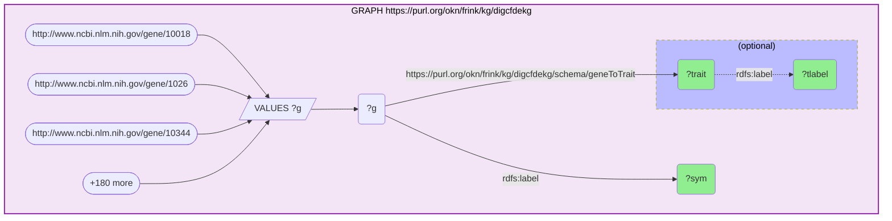

_38833 row(s)_

#### Query 15

_2026-07-23T05:26:52+00:00 · `biobricks-toxcast`_

```sparql
PREFIX rdfs: <http://www.w3.org/2000/01/rdf-schema#>
PREFIX biolink: <https://w3id.org/biolink/vocab/>
PREFIX edam: <http://edamontology.org/>
SELECT DISTINCT ?label ?cas ?dtxsid WHERE {
  GRAPH <https://purl.org/okn/frink/kg/biobricks-toxcast> {
    ?chem a biolink:ChemicalEntity ; rdfs:label ?label ; edam:has_identifier ?cas , ?dtxsid .
    FILTER(CONTAINS(STR(?cas),"cas")) FILTER(CONTAINS(STR(?dtxsid),"comptox"))
    FILTER( CONTAINS(LCASE(?label), "bisphenol") || CONTAINS(LCASE(?label), "sulfonyldiphenol")
         || CONTAINS(LCASE(?label), "methylenediphenol") || CONTAINS(LCASE(?label), "dihydroxydiphenyl") )
  }
}
ORDER BY ?label
```

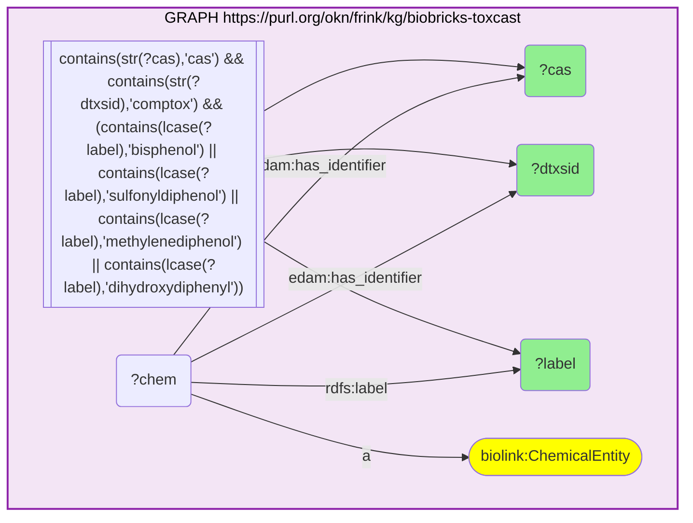

_17 row(s)_

#### Query 16

_2026-07-23T05:27:19+00:00 · `spoke-okn`_

```sparql
PREFIX rdfs: <http://www.w3.org/2000/01/rdf-schema#>
SELECT ?g ?sym ?name WHERE {
  GRAPH <https://purl.org/okn/frink/kg/spoke-okn> {
    VALUES ?g { <http://www.ncbi.nlm.nih.gov/gene/2099> <http://www.ncbi.nlm.nih.gov/gene/2100> <http://www.ncbi.nlm.nih.gov/gene/2101> <http://www.ncbi.nlm.nih.gov/gene/367> <http://www.ncbi.nlm.nih.gov/gene/5241> <http://www.ncbi.nlm.nih.gov/gene/2908> <http://www.ncbi.nlm.nih.gov/gene/8856> <http://www.ncbi.nlm.nih.gov/gene/9970> <http://www.ncbi.nlm.nih.gov/gene/9971> <http://www.ncbi.nlm.nih.gov/gene/5465> <http://www.ncbi.nlm.nih.gov/gene/5467> <http://www.ncbi.nlm.nih.gov/gene/5468> <http://www.ncbi.nlm.nih.gov/gene/6256> <http://www.ncbi.nlm.nih.gov/gene/6257> <http://www.ncbi.nlm.nih.gov/gene/7421> <http://www.ncbi.nlm.nih.gov/gene/7067> <http://www.ncbi.nlm.nih.gov/gene/7068> <http://www.ncbi.nlm.nih.gov/gene/1733> <http://www.ncbi.nlm.nih.gov/gene/1734> <http://www.ncbi.nlm.nih.gov/gene/1735> <http://www.ncbi.nlm.nih.gov/gene/7253> <http://www.ncbi.nlm.nih.gov/gene/1588> <http://www.ncbi.nlm.nih.gov/gene/196> <http://www.ncbi.nlm.nih.gov/gene/4780> <http://www.ncbi.nlm.nih.gov/gene/1728> <http://www.ncbi.nlm.nih.gov/gene/2729> <http://www.ncbi.nlm.nih.gov/gene/847> <http://www.ncbi.nlm.nih.gov/gene/3297> <http://www.ncbi.nlm.nih.gov/gene/3303> <http://www.ncbi.nlm.nih.gov/gene/22926> <http://www.ncbi.nlm.nih.gov/gene/7494> <http://www.ncbi.nlm.nih.gov/gene/1649> <http://www.ncbi.nlm.nih.gov/gene/7157> <http://www.ncbi.nlm.nih.gov/gene/581> <http://www.ncbi.nlm.nih.gov/gene/836> <http://www.ncbi.nlm.nih.gov/gene/1026> <http://www.ncbi.nlm.nih.gov/gene/4609> <http://www.ncbi.nlm.nih.gov/gene/595> <http://www.ncbi.nlm.nih.gov/gene/7124> <http://www.ncbi.nlm.nih.gov/gene/3569> <http://www.ncbi.nlm.nih.gov/gene/3552> <http://www.ncbi.nlm.nih.gov/gene/3576> <http://www.ncbi.nlm.nih.gov/gene/6347> <http://www.ncbi.nlm.nih.gov/gene/3383> <http://www.ncbi.nlm.nih.gov/gene/7412> <http://www.ncbi.nlm.nih.gov/gene/5054> <http://www.ncbi.nlm.nih.gov/gene/6403> <http://www.ncbi.nlm.nih.gov/gene/6401> <http://www.ncbi.nlm.nih.gov/gene/5914> <http://www.ncbi.nlm.nih.gov/gene/6095> <http://www.ncbi.nlm.nih.gov/gene/6097> <http://www.ncbi.nlm.nih.gov/gene/6469> <http://www.ncbi.nlm.nih.gov/gene/2735> <http://www.ncbi.nlm.nih.gov/gene/5080> <http://www.ncbi.nlm.nih.gov/gene/6667> <http://www.ncbi.nlm.nih.gov/gene/1543> <http://www.ncbi.nlm.nih.gov/gene/1544> <http://www.ncbi.nlm.nih.gov/gene/1576> <http://www.ncbi.nlm.nih.gov/gene/1555> <http://www.ncbi.nlm.nih.gov/gene/6822> <http://www.ncbi.nlm.nih.gov/gene/54658> <http://www.ncbi.nlm.nih.gov/gene/9429> <http://www.ncbi.nlm.nih.gov/gene/8647> <http://www.ncbi.nlm.nih.gov/gene/5290> <http://www.ncbi.nlm.nih.gov/gene/5728> <http://www.ncbi.nlm.nih.gov/gene/2194> <http://www.ncbi.nlm.nih.gov/gene/6720> <http://www.ncbi.nlm.nih.gov/gene/4023> <http://www.ncbi.nlm.nih.gov/gene/2308> <http://www.ncbi.nlm.nih.gov/gene/2309> <http://www.ncbi.nlm.nih.gov/gene/3172> }
    ?g rdfs:label ?sym . OPTIONAL { ?g rdfs:comment ?name }
  }
}
```

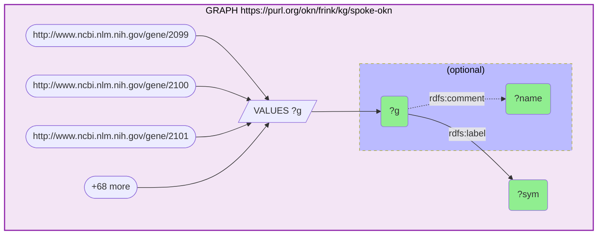

_71 row(s)_
