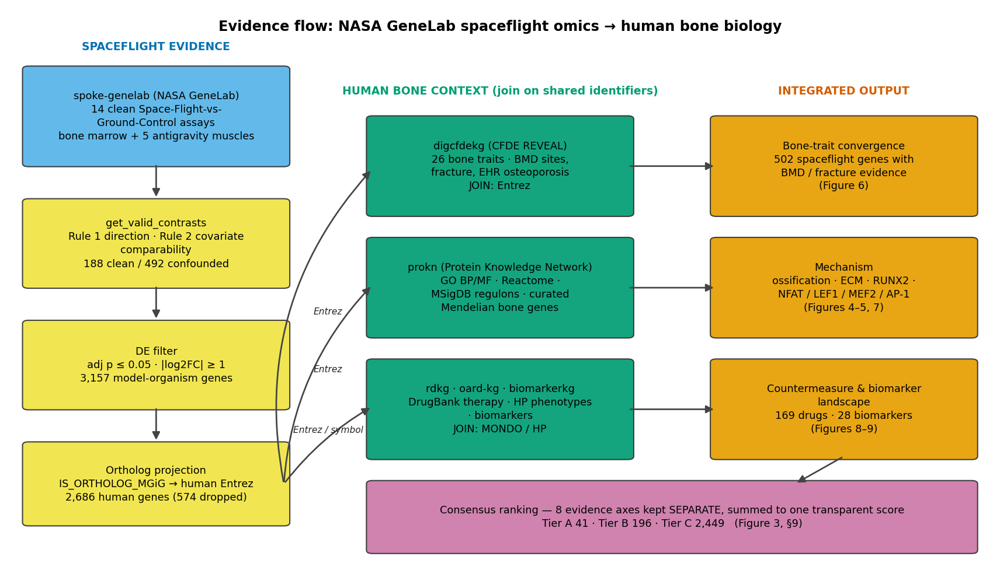
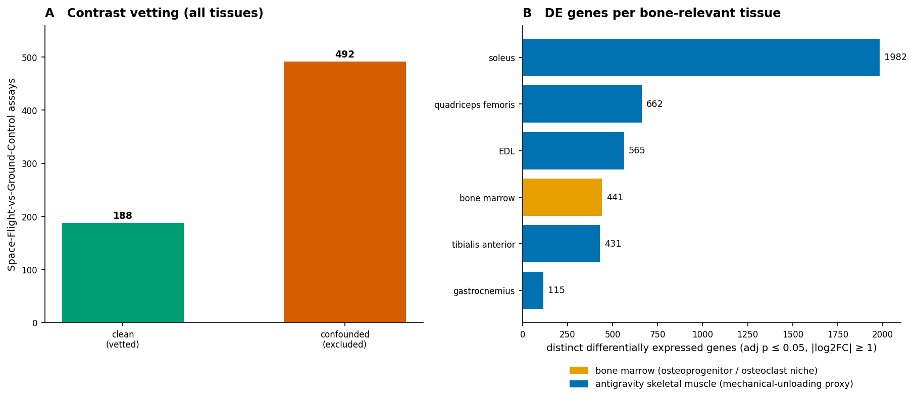
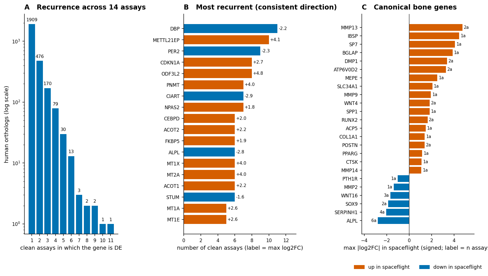
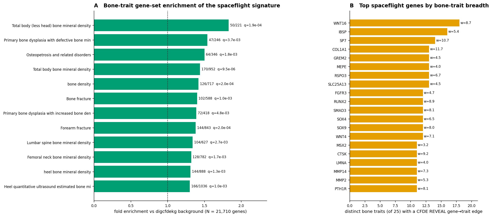
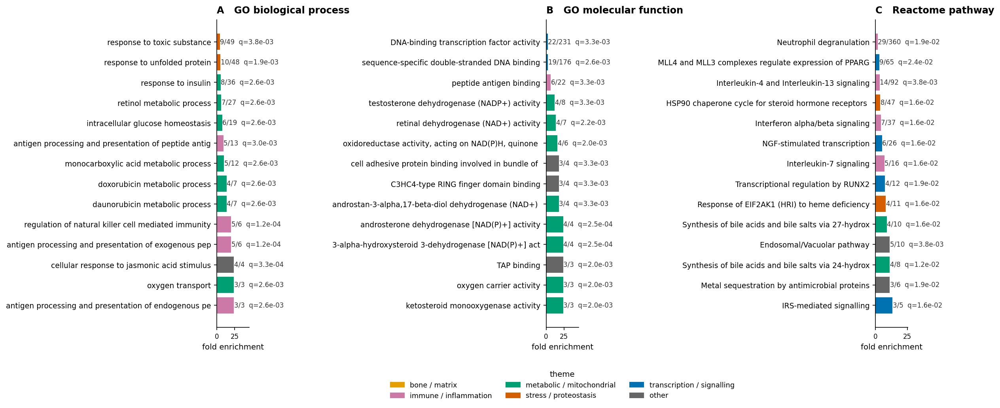
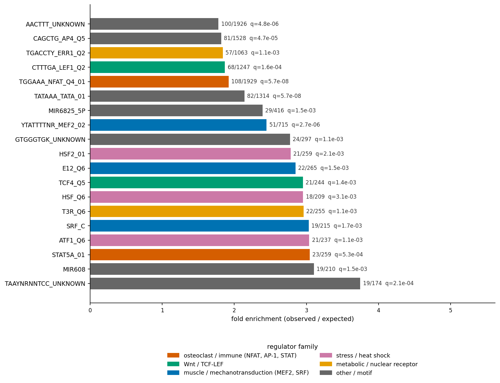
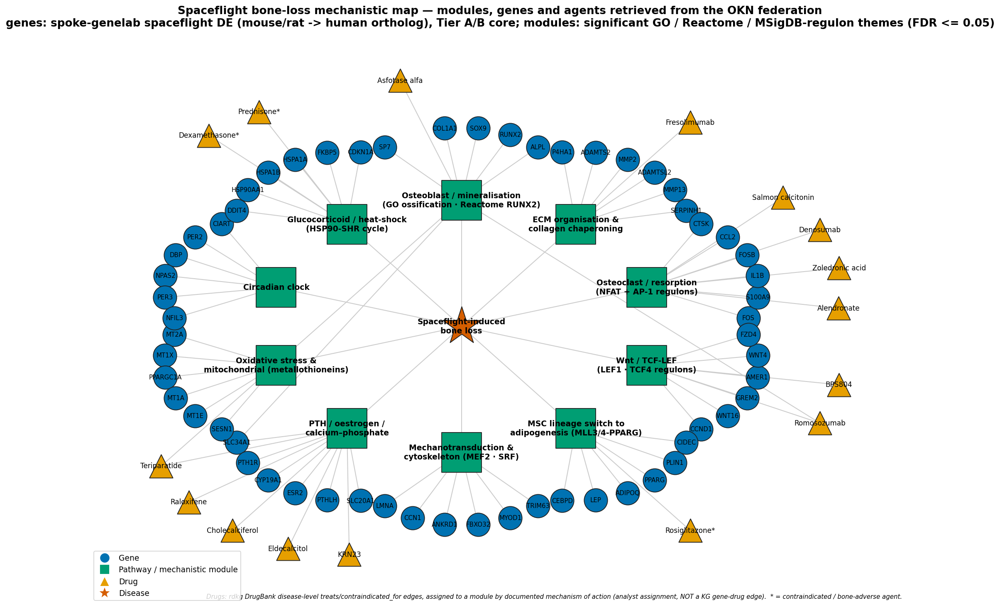
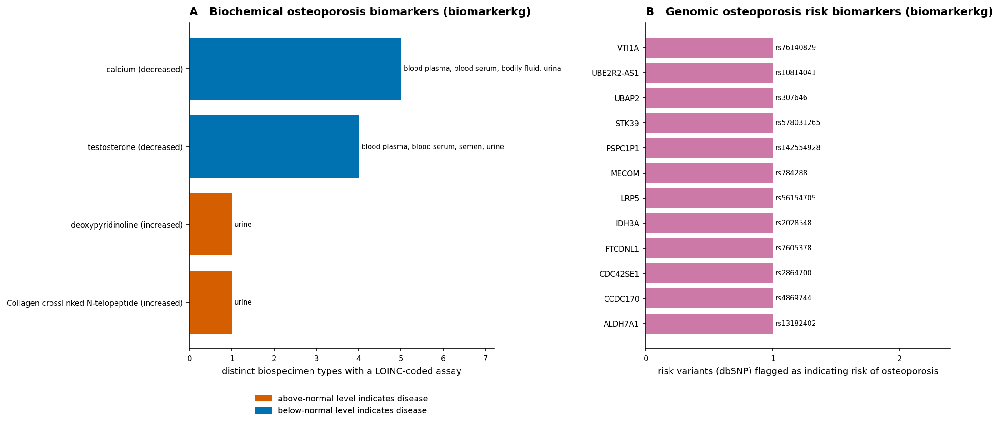
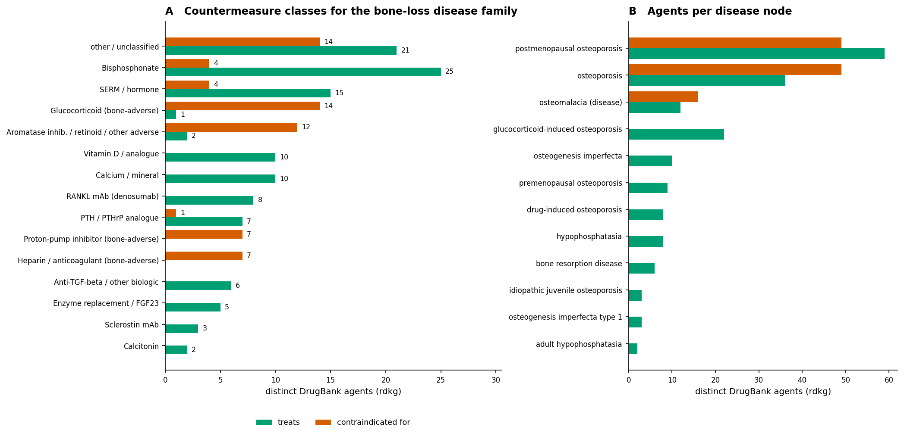

# Spaceflight-induced bone loss: a multi-knowledge-graph molecular, clinical and countermeasure map
### Cross-KG integrative analysis of NASA GeneLab spaceflight omics against human bone-density genetics, pathway, phenotype, biomarker and therapeutic graphs on the OKN federation

**Date:** 2026-07-19 · **Endpoint:** OKN federated SPARQL · **Model:** claude-opus-4-8

> **Framing (non-negotiable).** The unit of analysis is a **gene** (human Entrez, reached from mouse/rat orthologs) observed in **14 vetted Space-Flight-vs-Ground-Control assays** from 13 NASA Open Science Data Repository studies spanning 1991 (STS-40) to 2021 (SpaceX-21), integrated with human bone-density genetics, curated pathway/regulon annotation, EHR phenotypes, biomarkers and DrugBank therapeutics. **The level of inference is hypothesis generation, not causal or clinical inference.** Three caveats travel with every downstream claim: (i) the molecular evidence is **model-organism (mouse, rat) and ortholog-inferred**, not human; (ii) the OKN subset of GeneLab contains **no bone tissue** — the closest tissues available are bone marrow and antigravity skeletal muscle, so bone-cell mechanisms are read indirectly; (iii) gene–trait, disease–phenotype and disease–drug edges are **curated or statistical associations, observational and not causal**.

**Abbreviations.** ALP = alkaline phosphatase; ARED = Advanced Resistive Exercise Device; BH = Benjamini–Hochberg; BMD = bone mineral density; BP = biological process (Gene Ontology); CFDE = Common Fund Data Ecosystem; CL = Cell Ontology; CTX/NTX = C-/N-telopeptide of type I collagen; DE = differentially expressed; DOID = Human Disease Ontology; DPD = deoxypyridinoline; DXA = dual-energy X-ray absorptiometry; eBMD = estimated BMD (heel quantitative ultrasound); ECM = extracellular matrix; EFO = Experimental Factor Ontology; EHR = electronic health record; FDR = false-discovery rate; GO = Gene Ontology; GWAS = genome-wide association study; HLU = hindlimb unloading; HP/HPO = Human Phenotype Ontology; HGNC = HUGO Gene Nomenclature Committee; ISS = International Space Station; KG = knowledge graph; LOINC = Logical Observation Identifiers Names and Codes; MF = molecular function (Gene Ontology); MONDO = Mondo Disease Ontology; MSC = mesenchymal stem/stromal cell; MSigDB = Molecular Signatures Database; OI = osteogenesis imperfecta; OKN = Open Knowledge Network; OMIM = Online Mendelian Inheritance in Man; OPG = osteoprotegerin (TNFRSF11B); ORDO = Orphanet Rare Disease Ontology; OSD = Open Science Data repository study accession; PTH = parathyroid hormone; PTHrP = PTH-related protein; RANK/RANKL = receptor activator of NF-κB / its ligand (TNFRSF11A / TNFSF11); SERM = selective oestrogen-receptor modulator; TBS = trabecular bone score; TF = transcription factor; UBERON = Uber-anatomy ontology; UTI = urinary tract infection.

---

## 1. Executive summary

Spaceflight bone loss is, in the OKN federation, best characterised as an **acquired, transcriptionally-driven uncoupling of bone formation from bone resorption** whose molecular footprint overlaps substantially with the common-variant genetic architecture of human bone mineral density. From 14 contrast-vetted Space-Flight-vs-Ground-Control assays in `spoke-genelab` (NASA GeneLab) covering bone marrow and five antigravity skeletal muscles, **3,202 distinct model-organism gene nodes** (3,157 gene symbols) were differentially expressed (adjusted *p* ≤ 0.05, |log₂FC| ≥ 1); **2,686 human ortholog gene nodes** (2,683 symbols) survived cross-species projection (579 model-organism gene nodes had no symbol-bearing human ortholog and were dropped). The single most reproducible bone-relevant finding is **ALPL** (tissue-nonspecific alkaline phosphatase, the canonical bone-formation enzyme): **down in 6 of 14 assays with no directional exception**, across five tissues **including bone marrow**, maximum log₂FC -2.79.

The signature is not a random transcriptional stress response. Joined to `digcfdekg` (CFDE REVEAL) on shared Entrez identifiers, **502 of the 2,686 spaceflight genes carry at least one gene→trait edge to a bone trait** — BMD at every skeletal site, fracture, EHR-defined osteoporosis and the Mendelian bone dysplasias. Both halves of the discriminating statistical test are positive: the **permissive GWAS-style** trait sets are enriched (total-body BMD, 170/952 genes, fold 1.44, FDR 9.5e-06) *and* the **small curated Mendelian** set is enriched (`prokn` reduced-BMD gene set, 61/461, fold 1.80, FDR 1.7e-05). **WNT16** — the strongest single BMD locus in human genetics, linked here to 18 distinct bone traits — is **down** in spaceflight muscle.

Mechanistically the analysis converges on six themes: suppressed **osteoblast/mineralisation** output (ALPL down; the Reactome *Transcriptional regulation by RUNX2* pathway enriched), disordered **ECM organisation and collagen chaperoning** (the top bone-marrow-specific GO term; SERPINH1 down in 4/4 assays), an **osteoclast/resorption** program read through its transcription-factor footprint (**NFAT** is the single most enriched MSigDB regulon, fold 1.92, FDR 5.7e-08, with AP-1 alongside it), a **Wnt/TCF-LEF** deficit, an **MSC lineage switch toward adipogenesis** (Reactome MLL3/MLL4–PPARG), and a **circadian-clock** disruption (DBP down in 11 assays, PER2 in 9). Ranking 2,686 genes on eight independently recorded evidence axes yields **41 Tier-A**, **196 Tier-B** and **2,449 Tier-C** candidates, headed by ALPL, CDKN1A, RUNX2, FOS, PDK4, CCND1, SERPINH1 and SOX9.

What this adds: a reproducible, fully-logged bridge from NASA spaceflight omics to the human bone-genetics, biomarker and pharmacopoeia layers of the OKN federation — including an explicit map of where the federation is *silent* (no bone tissue, no RANKL/OPG or sclerostin edges), which is as decision-relevant as where it speaks.

---

## 2. Sources used

Every knowledge graph below was queried directly; each row traces to at least one logged SPARQL query in the reproducibility record. 33 substantive queries were logged across 8 graphs.

| KG | Version | Updated | Role in this study | Join key / confidence |
|---|---|---|---|---|
| `spoke-genelab` | v0.0.2 | 2026-03-13 | NASA GeneLab spaceflight differential expression; assay/study/mission metadata; mouse→human ortholog projection | Entrez gene IRI; assay contrasts vetted by `get_valid_contrasts` — **high** for the flight contrast, **species/ortholog-inferred** for the human claim |
| `digcfdekg` | v0.0.1 | 2026-06-21 | CFDE REVEAL gene→trait inferences for 26 bone traits (BMD sites, fracture, EHR osteoporosis, bone dysplasias) | Entrez (direct, same IRI form) — **high** join, **statistical (PIGEAN/EAGGL) not curated** evidence |
| `prokn` | v0.0.5 | 2026-06-23 | GO BP/MF and Reactome backgrounds and enrichment; MSigDB upstream-regulator regulons; curated OMIM/MONDO bone-disease gene sets | HGNC symbol on `rdfs:label`, protein via `SIO_010078` — **high** within-KG; symbol match is exact and case-sensitive |
| `ubergraph` | v0.0.2 | 2026-05-01 | MONDO/HP anchor-term expansion (`rdfs:subClassOf*`), GO and UBERON label resolution | OBO term IRIs — **high** |
| `rdkg` | v0.0.1 | 2026-05-04 | DrugBank `treats` / `contraindicated_for` therapeutic layer; chemical-exposure risk factors (`contributes_to`) | MONDO node IRI — **high** for the edge, **curated-indication** level of evidence |
| `oard-kg` | v0.0.3 | 2026-06-05 | EHR-derived disease↔HP phenotype associations for osteogenesis imperfecta and osteopetrosis | MONDO ↔ HP, reified (both `biolink:subject` and `biolink:object` positions UNIONed) — **observational co-occurrence** |
| `biomarkerkg` | v0.0.2 | 2026-03-16 | Osteoporosis biomarkers: LOINC-coded biochemical analytes and dbSNP genomic risk variants | MONDO disease label — **medium**, several entries flagged `biomarker_term_in_review` |
| `spoke-okn` | v0.0.6 | 2026-03-16 | Disease-node coverage check; compound→gene perturbation layer for bone-core genes | DOID node IRI; Entrez for genes — **low relevance here** (see §6.5) |

---

## 3. Design & rules

The study begins from the **anchor disease family**, not from a single term. Expanding six MONDO roots (osteoporosis, bone resorption disease, osteomalacia, osteogenesis imperfecta, osteopetrosis, primary osteolysis) through `ubergraph`'s precomputed `rdfs:subClassOf*` closure, together with a label sweep for bone-loss vocabulary, yields **155 MONDO disease terms** and **36 HP phenotype terms** covering osteopenia, osteoporosis (senile, postmenopausal, premenopausal, glucocorticoid-, drug- and pregnancy-induced, idiopathic juvenile, LRP5-related), reduced/patchy BMD, trabecular and cortical bone abnormality, pathologic and recurrent fracture, delayed fracture healing, subperiosteal resorption, hypercalciuria, hypercalcaemia and elevated PTH. That crosswalked anchor set is what the disease-side graphs (`rdkg`, `oard-kg`, `biomarkerkg`, `prokn`) were queried against, so synonymous disease names and identifier schemes (MONDO, DOID, EFO, ORDO, OMIM, HP, UMLS) resolve to one family rather than to whichever label a given graph happens to use.

The **spaceflight side** is governed by contrast vetting rather than by keyword search. `get_valid_contrasts` applied two rules to every GeneLab assay — direction (`factor_space_1` = "Space Flight" *and* `factor_space_2` = "Ground Control", so a positive log₂FC means up in flight) and within-assay covariate comparability (identical material identifiers and identical stripped covariate sets on both arms) — retaining **188 clean** and rejecting **492 confounded** assays federation-wide. Of the clean set, 14 transcription-profiling assays lie in bone-relevant tissue. Differential expression was called at **adjusted *p* ≤ 0.05 and |log₂FC| ≥ 1**, and model-organism genes were projected to human orthologs with a max-|log₂FC| collapse per assay (mean-rule sensitivity and an ambiguity flag retained).

Three signature scopes are used throughout and are always tagged: the **full signature** (2,686 human orthologs, any clean assay), the **core signature** (777 genes DE in ≥ 2 clean assays), and the **bone-marrow signature** (395 genes from OSD-690). Cross-KG integration is exclusively on **shared entity identifiers** — Entrez for genes, MONDO/DOID/HP for disease and phenotype — never on study or mission accessions, which are a federation island. Every over-representation test uses an **explicit background drawn from the same graph and identifier space** as the foreground; the exact backgrounds, thresholds, scoring weights and join recipes are specified in the reproducibility file.

**Inventory rebuilt live.**

| Layer | Quantity | Source |
|---|---|---|
| GeneLab Space-Flight-vs-Ground-Control assays, clean / confounded | 188 / 492 | `spoke-genelab` |
| Bone-relevant clean transcription assays used | 14 (across 13 OSD studies, 6 tissues) | `spoke-genelab` |
| Differentially expressed model-organism gene nodes (distinct symbols) | 3,202 (3,157) | `spoke-genelab` |
| Human ortholog gene nodes after projection (model-organism nodes dropped) | 2,686 (579) | `spoke-genelab` |
| Bone traits screened / carried forward | 56 / 26 | `digcfdekg` |
| Spaceflight genes with ≥ 1 bone-trait edge | 502 | `spoke-genelab` × `digcfdekg` |
| Significant GO BP / GO MF / Reactome terms (FDR ≤ 0.05) | 135 / 60 / 33 | `prokn` |
| Significant upstream regulons of 1,721 tested | 180 | `prokn` (MSigDB) |
| DrugBank agents in the bone-loss therapeutic layer | 169 (115 treats, 63 contraindicated) | `rdkg` |
| Osteoporosis biomarkers | 28 | `biomarkerkg` |

> ***Figure 1. Study design and evidence flow.*** Left (blue/yellow): the spaceflight evidence chain — GeneLab assays, the two contrast-vetting rules from `get_valid_contrasts`, the DE threshold, and mouse/rat→human ortholog projection. Centre (green): the human-context graphs joined on shared identifiers, each annotated with its join key. Right (orange): the three integrated outputs. Bottom (purple): the consensus ranking that keeps the eight evidence axes separate. Provenance: `spoke-genelab`, `digcfdekg`, `prokn`, `rdkg`, `oard-kg`, `biomarkerkg`, `ubergraph`; counts are the verified quantities in §3.

The figure makes the load-bearing dependency explicit: every human-bone claim in this report rests on the Entrez join out of a **model-organism** expression source, so the ortholog caveat is structural rather than incidental.

---

## 4. Confidence tiers

Genes are graded by a transparent additive score over eight axes that are **recorded independently in the results workbook** and never collapsed before scoring: assay recurrence, tissue breadth, directional consistency, effect size, GWAS bone-trait breadth, curated Mendelian bone-gene membership, curated bone-pathway membership (GO ossification, GO ECM organisation, Reactome RUNX2, Reactome PPARG-adipogenesis), presence in the bone-marrow signature, and biomarker-variant status.

| Tier | Requirement (composite score) | Typical evidence profile | n |
|---|---|---|---|
| **A** | ≥ 6.5 | Recurrent across ≥ 4 assays *or* recurrent plus broad human bone-trait support; usually two or more independent evidence types | 41 |
| **B** | 4.5 – 6.5 | Either strong spaceflight recurrence with limited human bone context, or a single-assay observation on a well-corroborated human bone gene | 196 |
| **C** | < 4.5 | Single-assay, single-tissue observations with little or no independent human bone corroboration | 2,449 |

Tier is a **ranking device, not a significance claim**: a Tier-C gene can be real and a Tier-A gene can be a tissue-composition artefact (see §10, limitation 4).

---

## 5. Findings by axis

### 5.1 The spaceflight transcriptional signature and its tissue coverage

The OKN subset of GeneLab is the binding constraint on this study and deserves stating plainly. Across all Space-Flight-vs-Ground-Control assays, the anatomical inventory contains liver, kidney, skin epidermis, retina, thymus, spleen, heart, brain regions, larva and whole organism — and, from the musculoskeletal system, **bone marrow (UBERON:0002371) and five antigravity skeletal muscles**. There is **no femur, tibia, calvaria, vertebra or isolated osteoblast/osteocyte/osteoclast assay**. Bone marrow appears in exactly one study, **OSD-690** (Rodent Research, SpaceX-14, ISS, 2018-04-02 → 2018-05-05), which contributes two clean contrasts (wild-type and Nrf2-knockout arms, each flight-vs-ground within genotype); the two cross-genotype pairings in the same study are correctly rejected as confounded.

> ***Figure 2. GeneLab contrast vetting and the bone-relevant tissue inventory.*** **(A)** Space-Flight-vs-Ground-Control assays retained versus rejected by the two `get_valid_contrasts` rules, federation-wide across all tissues. **(B)** Distinct differentially expressed genes (adjusted *p* ≤ 0.05, |log₂FC| ≥ 1) per bone-relevant tissue; bone marrow in orange, antigravity skeletal muscle in blue. Provenance: `spoke-genelab` reified `MEASURED_DIFFERENTIAL_EXPRESSION_ASmMG` statements; tissue from `INVESTIGATED_ASiA` (UBERON), labels from `ubergraph`.

Two-thirds of candidate contrasts fail vetting, which is the clearest argument for using the tool rather than filtering by hand. The soleus — the most postural, most unloading-sensitive muscle in the set — yields by far the largest response (1,982 genes), consistent with a mechanical-unloading gradient rather than a generic flight effect.

### 5.2 Recurrence, direction, and the canonical bone genes

Recurrence across independent assays is the strongest single discriminator available here, because the assays span different studies, missions, species (mouse and rat), tissues and years. The distribution is steep: 1,909 genes appear in one assay only, while a small head of 11-, 10- and 9-assay genes forms a highly reproducible core.

> ***Figure 3. The spaceflight differential-expression signature.*** **(A)** Number of human orthologs by how many of the 14 clean assays they are DE in (log-scaled *y*). **(B)** The 18 most recurrent genes whose direction is consistent in every assay; bar length = assay count, annotation = maximum log₂FC, colour = direction. **(C)** Canonical bone genes present in the signature, plotted at their signed maximum log₂FC; annotation = number of assays. Provenance: `spoke-genelab` DE statements collapsed to human orthologs by max |log₂FC| per assay; sign convention log₂FC > 0 = up in spaceflight.

Three patterns matter. First, **circadian genes dominate the recurrent head** — DBP (down in 11/11), PER2 (down 9/9), CIART (down 7/7), NPAS2 (up 7/7) — a coherent clock disruption rather than scattered noise. Second, **ALPL is the only canonical bone-formation gene in that head**, down in 6 of 14 assays across five tissues including bone marrow. Third, in the bone-marrow contrast specifically, **PTH1R and MMP2 are down and PDPN (an osteocyte marker) is up**, which is the closest this dataset comes to a direct osteocyte/osteoblast readout.

An honest caveat attaches to panel C: the cluster of osteogenic markers up in tibialis anterior (IBSP, SP7, BGLAP, ACP5, CTSK, MMP9, SPP1, RUNX2) is a single-assay observation and could reflect periosteal or marrow contamination of a muscle dissection as easily as an ectopic osteogenic program. It is reported because it is what the graph contains, and flagged because it is not replicated.

### 5.3 Cross-KG convergence with human bone-density genetics

The load-bearing cross-KG result is a single federated join on Entrez between `spoke-genelab` and `digcfdekg`. Of 56 bone-related traits screened in CFDE REVEAL, 26 carry gene evidence and were carried forward: BMD at heel, femoral neck, lumbar spine, forearm, radius, trochanter, hip and total body; bone mineral content; volumetric BMD; hip, forearm and all-site fracture; five EHR-defined osteoporosis models; and the Orphanet bone-dysplasia and osteogenesis-imperfecta classes.

> ***Figure 4. Convergence of the spaceflight signature on human bone-density genetics.*** **(A)** Bone-trait gene-set enrichment of the full 2,686-gene signature; fold = observed/expected against the explicit `digcfdekg` background of all 21,710 genes carrying any gene→trait inference; annotation = hits/set size and BH-adjusted *q*; dashed line = no enrichment. **(B)** The 20 spaceflight genes with the broadest bone-trait support; bar = number of distinct bone traits (of 25 with any hit), annotation = maximum CFDE REVEAL association weight. Provenance: `spoke-genelab` × `digcfdekg` joined on the shared `ncbi.nlm.nih.gov/gene/` Entrez IRI; hypergeometric test with BH FDR. Statistical associations, observational and not causal.

The enrichment is modest in fold but highly consistent in sign and significance across every independent BMD measurement site — total body, heel, femoral neck, lumbar spine, forearm — and across fracture endpoints. That an unloading transcriptome recovers the polygenic BMD architecture at 1.3–1.8-fold is the central quantitative claim of this report. Panel B names the genes carrying it: **WNT16** (18 traits), **IBSP**, **SP7/osterix**, **COL1A1**, **RSPO3**, **RUNX2**, **SOX9**, **CTSK** and **PTH1R** — the osteoblast, Wnt and resorption machinery, not a generic stress set.

### 5.4 Corroboration by curated Mendelian bone genes

The GWAS sets above are permissive by construction and can look enriched for weak reasons, so the discriminating test is the small curated set. `prokn` supplies exactly that: **461 genes** annotated to *Reduced bone mineral density* (HP:0004349) and 246 to *Osteopenia* (HP:0000938) through OMIM/MONDO disease associations. Against the explicit background of all 9,925 disease-associated `prokn` genes, the full spaceflight signature contains **61 of 461** (fold 1.80, FDR 1.7e-05); the core signature is enriched 2.10-fold (FDR 0.0024) and even the 395-gene bone-marrow signature reaches 1.84-fold. Overlapping members include ALPL, RUNX2, SOX9, SERPINH1, DMP1, MMP13, ADAMTS2, ADAMTSL2, CDKN1A and, in bone marrow specifically, PTH1R, MMP2 and LMNA. Both the common-variant and the rare-variant arms of human bone genetics therefore point at the same spaceflight genes — a convergence that neither test alone would establish.

---

## 6. Domain analyses

**Analysis families run versus skipped.** GO enrichment was run for **biological process** and **molecular function**; **cellular component was skipped** — it reports subcellular localisation, which adds no mechanism here and would triple the multiple-testing burden. **Reactome** pathway enrichment was run as a separate family, not as a GO variant. **Disease/trait gene-set enrichment** was run in both required flavours: the broad GWAS-style sets (`digcfdekg`, §5.3) and the curated Mendelian sets (`prokn`, §5.4). **Upstream-regulator** enrichment was run over MSigDB regulons (§6.2). **Phenotype (HP) mapping** was run through `oard-kg` and `rdkg` (§6.4). **Taxon/organism alignment was deliberately skipped** — the microbiome axis of `spoke-genelab` is orthogonal to bone loss and no bone-relevant question here turns on organism containment. **Geospatial linkage was deliberately skipped** — spaceflight bone loss has no terrestrial place-based exposure component. **`biobricks-aopwiki` adverse-outcome pathways and `gene-expression-atlas-okn` expression were queried and returned zero bone/skeletal entities**, so both are reported as empty rather than omitted (§6.5).

### 6.1 Functional enrichment: what the signature is doing

> ***Figure 5. GO and Reactome over-representation of the spaceflight signature.*** **(A)** GO biological process, **(B)** GO molecular function, **(C)** Reactome pathway. Bars are fold enrichment; annotation = hits/set size and BH-adjusted *q*; colour = manually assigned theme; the bracketed tag names which signature scope the term reached significance in — **[S]** full 2,686-gene signature, **[C]** 777-gene core, **[M]** 395-gene bone-marrow signature. Foregrounds as tagged; backgrounds = all `prokn` genes with ≥ 1 annotation of that type (7,663 for GO BP, 8,033 for GO MF, 6,032 for Reactome). Hypergeometric test with BH FDR. Provenance: `prokn` Gene →`SIO_010078` *encodes*→ Protein →`RO_0002331` *involved in*→ GO BP / →`RO_0002327` *enables*→ GO MF / →`RO_0000056` *participates in*→ Reactome; GO labels from `ubergraph`.

The bone-specific terms are where the biology is. **Ossification** (GO:0001503) is enriched in the full signature (16/49 genes, fold 2.48, FDR 0.018). **Extracellular matrix organisation** is the standout **bone-marrow-specific** term (5/37, fold 6.72, FDR 0.012) alongside cytoskeleton organisation — precisely the compartment where an osteoprogenitor niche would register. **Extracellular matrix binding** and **calcium ion binding/import/transport** recur on the MF and BP sides. In Reactome, **Transcriptional regulation by RUNX2** (4/12, fold 7.45) is a direct hit on the osteoblast master regulator, and **MLL4/MLL3 complexes regulate expression of PPARG target genes in adipogenesis** (9/65, fold 3.09) is the epigenetic machinery of the marrow MSC lineage switch. Around them sit an unmistakable stress-and-immune shell — unfolded-protein response, HSP90 chaperone cycle for steroid hormone receptors, mitochondrial unfolded-protein response, interferon α/β, IL-4/IL-13, IL-7, neutrophil degranulation — and an insulin/IRS/PPARGC1A metabolic arm consistent with the mitochondrial suppression independently reported in astronaut muscle proteomes.

### 6.2 Upstream regulators: reading the osteoclast axis indirectly

Because the federation supplies no bone tissue, the resorption program cannot be observed directly. It can, however, be read through the transcription-factor regulons whose targets are over-represented in the signature.

> ***Figure 6. Upstream transcriptional regulators of the spaceflight core signature.*** Bars are fold enrichment of MSigDB regulatory gene sets among the 777-gene core signature; annotation = hits/regulon size and BH-adjusted *q*; colour = regulator family. Foreground = 728 core-signature genes carrying ≥ 1 regulon membership; background = all 24,972 `prokn` genes with regulon membership; 1,721 regulons tested, 180 significant at FDR ≤ 0.05. Provenance: `prokn` `biolink:target_for` (MSigDB motif and TF-target sets) with the gene symbol on `rdfs:label`; foreground membership defined in-federation from the 14 clean `spoke-genelab` assays. Motif-based regulons are inferred, not measured, TF activity.

The ranking is strikingly interpretable. **NFAT is the single most significant regulon** (108/1,929 targets, fold 1.92, FDR 5.7e-08) — NFATc1 is the master transcription factor of RANKL-driven osteoclast differentiation, acting downstream of calcineurin. **AP-1** (TGANTCA) sits alongside it, and c-Fos is NFATc1's obligate partner in osteoclastogenesis; FOS itself is DE in 9 assays. **LEF1 and TCF4** — the Wnt/β-catenin effectors — are both enriched, matching the WNT16/WNT4/RSPO3/FZD/AMER1 gene-level signal. **MEF2** and **SRF** carry the mechanotransduction/cytoskeletal arm (MEF2C is the canonical transcriptional activator of sclerostin in osteocytes; SRF is the MRTF-coupled mechanoresponsive factor). **HSF** and **ATF1** carry proteostatic stress, **STAT5** the cytokine arm, and **ERR1/ESRRA** and **T3R** the mitochondrial-biogenesis and thyroid-hormone arms. The osteoclast, Wnt and mechanotransduction axes therefore all appear — as regulatory footprints in surrogate tissue, not as measured bone-cell activity.

### 6.3 The mechanistic synthesis

> ***Figure 7. Spaceflight bone-loss mechanistic map.*** Radial anchor → module → gene → drug synthesis. ★ anchor; ■ mechanistic module; ● gene; ▲ agent. Modules are the analyst's grouping of the tiered gene core into the significant GO / Reactome / MSigDB-regulon themes of §6.1–6.2 — **the squares are interpretation, not a query result**. Genes are the six highest-scoring Tier-A/B members of each module and **every one was retrieved from `spoke-genelab`**; no member was added to complete a module. Drugs are `rdkg` DrugBank **disease-level** `treats` / `contraindicated_for` edges assigned to a module by documented mechanism of action — an **analyst assignment, not a KG gene–drug edge**; * marks bone-adverse agents. Evidence layer: approved/investigational therapeutics only (no probe or toxicogenomic compounds are drawn). Standing caveats: species/ortholog-inferred genes; observational disease–drug edges.

The map's value is as much in its holes as its spokes. The osteoclast module is populated by effectors (CTSK, ACP5, ATP6V0D2, MMP9) and by the AP-1 arm (FOS, FOSB, JUNB), but **TNFSF11 (RANKL), TNFRSF11B (OPG), TNFRSF11A (RANK) and NFATC1 are absent from the signature entirely**; likewise **SOST, LRP5, CTNNB1, PIEZO1, YAP1/WWTR1 and NFE2L2** are absent from the Wnt and mechanotransduction modules. These are not negative biological findings — they are the predictable consequence of a marrow-and-muscle sampling frame, and they define exactly what a bone-tissue GeneLab release would add.

### 6.4 Clinical features, phenotypes and biomarkers

Phenotype mapping used the HP routing appropriate to each source. `oard-kg` — reified, so both `biolink:subject` and `biolink:object` positions were UNIONed — carries **osteogenesis imperfecta** and **osteopetrosis** but **not osteoporosis**, which is consistent with its rare-disease EHR scope. For OI it returns pathologic fracture, recurrent fractures, site-specific fractures (femur, humerus, tibia, carpal), osteopenia, osteoporosis, low vitamin D, kyphosis, scoliosis, abnormal vertebral morphology, joint laxity, blue sclerae, hearing impairment, short stature and difficulty walking; for osteopetrosis, osteopenia, osteoporosis, pathologic fracture, nephrolithiasis, low vitamin D, anaemia, thrombocytopenia and back/hip/knee pain. The nephrolithiasis and low-vitamin-D signals are directly relevant to astronaut health, where resorption-driven hypercalciuria raises renal-stone risk. `rdkg` adds the anchor family's HP annotations and, through `has_phenotype` on osteoporosis, the same core features.

> ***Figure 8. Osteoporosis biomarkers in `biomarkerkg`.*** **(A)** Biochemical analytes whose above-normal (orange) or below-normal (blue) level is diagnostic for osteoporosis; bar = number of distinct biospecimen types carrying a LOINC-coded assay; annotation = the biospecimens. **(B)** dbSNP variants flagged as *indicates risk of developing* osteoporosis, grouped by gene; annotation = rsID. Provenance: `biomarkerkg` OBCI relations `diagnostic for` (OBCI:1000002) and `indicates risk of developing` (OBCI:1000008), with `indicated by above/below normal level of` for direction and `determined using sample from` for the biospecimen.

Of the 28 osteoporosis biomarkers, the resorption markers are the ones that matter operationally: **urinary deoxypyridinoline** and **collagen crosslinked N-telopeptide** (NTX) are the two "increased-level" diagnostic analytes, and both are the classic spaceflight resorption readouts. Serum/urine **calcium** and **testosterone** appear as decreased-level markers across five and four biospecimen types respectively. On the genomic side, **LRP5 (rs56154705)** is the mechanistically strongest entry — LRP5 is the Wnt co-receptor whose loss causes osteoporosis-pseudoglioma syndrome and whose gain causes high bone mass — followed by **CCDC170** (the ESR1 locus), **MECOM**, **STK39**, **VTI1A**, **IDH3A**, **ALDH7A1**, **UBAP2** and **CDC42SE1**. Ranking these for astronaut monitoring: **DPD and NTX rank highest** (direct, serially measurable, resorption-specific, and the mechanism the flight data supports); **serum calcium and PTH** next (cheap, and tied to the hypercalciuria/renal-stone risk); **BMD/TBS by DXA and finite-element hip strength** are the outcome standards but are ground-based and post-flight only; **LRP5 genotype** is a plausible pre-flight stratifier but rests on a single flagged variant and should not be used operationally on this evidence.

### 6.5 Therapeutics, countermeasures and repurposing

> ***Figure 9. The bone-loss therapeutic and countermeasure landscape.*** **(A)** Distinct DrugBank agents per mechanistic class, split into `treats` (green) and `contraindicated_for` (red). **(B)** Agents per disease node in the anchor family. Classes are assigned by regular-expression matching on the agent label — an analyst grouping over the raw `rdkg` edges. Provenance: `rdkg` `biolink:treats` and `biolink:contraindicated_for` from DrugBank-keyed drug nodes to MONDO disease nodes. These are curated indication edges, not efficacy estimates, and carry no spaceflight-specific evidence.

The pharmacopoeia is complete against the brief. **Antiresorptives**: 25 distinct bisphosphonates (alendronate, risedronate, zoledronic acid, ibandronate, pamidronate, neridronate, minodronate, incadronate, etidronate, tiludronate), 8 denosumab entries including biosimilars, and salmon calcitonin. **Anabolics**: teriparatide (PTH 1-34, including a nasal-spray formulation), PTH(1-84), a PTH-related-protein entry corresponding to the abaloparatide class, and **romosozumab** plus the investigational anti-sclerostin **BPS804/setrusumab**. **Nutritional**: cholecalciferol, ergocalciferol, calcitriol, calcifediol, alfacalcidol, eldecalcitol, dihydrotachysterol, calcium gluconate/lactate, four magnesium salts, phylloquinone and tocotrienols. **Hormonal**: raloxifene, bazedoxifene, lasofoxifene, tibolone, oestradiol, ipriflavone and strontium ranelate. **Enzyme replacement and FGF23 axis**: asfotase alfa and ALXN1850 for hypophosphatasia (the ALPL disease — the same gene this study ranks first), KRN23/burosumab and BGJ398 for oncogenic osteomalacia. **Biologics**: fresolimumab (anti-TGF-β) and AGA2115 for OI, and bone-marrow-derived MSCs for OI type 1.

Equally important for flight medicine is the **contraindicated** list: 49 agents flagged against osteoporosis, headed by systemic and inhaled **glucocorticoids** (14 agents), **proton-pump inhibitors** (7), **heparins** (7), plus letrozole, isotretinoin/tretinoin, levothyroxine/liothyronine, rosiglitazone, nafarelin, elagolix, phenobarbital and phenytoin. Several are plausible crew medications, and the report's own mechanistic result sharpens two of them: **FKBP5 is up in 6/6 assays and the HSP90-steroid-hormone-receptor chaperone cycle is enriched**, so the glucocorticoid-signalling axis is already engaged in flight; and **rosiglitazone is a PPARγ agonist** while the analysis independently finds the MLL3/4–PPARG adipogenesis module enriched. Both are testable predictions of additive harm rather than established interactions.

**Repurposing via the compound→gene layer was attempted and returned little.** `spoke-okn`'s `UPREGULATES_CuG`/`DOWNREGULATES_CdG` layer yields only **39 edges** onto the bone-core genes, and the compounds are overwhelmingly environmental toxicants and cytotoxics (hexachlorophene, carbon tetrachloride, 3-methylcholanthrene, tetrachloroethylene, carbofuran, amitrole, fluorouracil, phenytoin, pentobarbital, thiabendazole). This is a **toxicogenomic perturbation layer, not a therapeutic one** — the lowest rung of the drug-evidence ladder — and no repurposing hypothesis is offered from it. A separate and better-supported exposure finding does emerge from `rdkg`'s `contributes_to` edges, which are chemical exposures rather than genes: **perfluorooctanoic acid, perfluorohexanesulfonic acid, perfluorononanoic acid, polychlorinated biphenyls (three congeners), cadmium and particulate matter** are all recorded as contributing to osteoporosis — relevant to closed-loop spacecraft air and water quality, though entirely terrestrial in provenance.

---

## 7. Discussion

Read together, the axes describe a single coherent pathophysiology. Mechanical unloading removes the strain signal that osteocytes normally transduce; the transcriptional consequence visible in this dataset is a **loss of osteoblast synthetic output** (ALPL down everywhere, the RUNX2 pathway engaged, collagen chaperoning via SERPINH1 down, ECM organisation disturbed in marrow) that is **not matched by a compensating suppression of resorption** — the NFAT and AP-1 regulons, the effector genes CTSK/ACP5/ATP6V0D2/MMP9, and the interferon/IL-4/IL-13/IL-7 inflammatory shell all point the other way. That formation–resorption dissociation is exactly what astronaut biochemistry shows, and it is why an antiresorptive added to exercise outperforms exercise alone. Layered on top are three modifiers the graphs make explicit: a **marrow MSC lineage switch toward adipogenesis** (PPARG, CEBPD/A, ADIPOQ, PLIN1, CIDEA/C, and the MLL3/4–PPARG epigenetic machinery), an **oxidative-stress and mitochondrial-suppression arm** (nine metallothioneins up, NQO1 and SRXN1 up, PPARGC1A and UCP3 down), and a **circadian disruption** so reproducible (DBP, PER2, CIART, NPAS2, PER3, NR1D1, ARNTL, NFIL3, NOCT) that it is the strongest recurrence signal in the entire dataset.

For countermeasure design the analysis supports a **two-arm strategy with a chronobiological adjunct**. Arm one is antiresorptive, and the NFAT/AP-1 result gives a mechanistic rationale for the bisphosphonate-plus-ARED regimen already flown, as well as for denosumab where dosing logistics permit. Arm two is anabolic and specifically **Wnt-directed**: WNT16 is the top BMD gene in human genetics, it is down in flight, and romosozumab and setrusumab act on the same pathway through sclerostin — this is the strongest single repurposing case the federation supports, and it is a target-level rather than an indication-level argument. The adjunct is **light/circadian management**, which is operationally cheap and for which the transcriptional evidence here is unusually strong even though no clock-directed agent appears in the therapeutic layer.

Four testable predictions follow. (1) A GeneLab bone-tissue release (femur, calvaria, or sorted osteoblast/osteocyte/osteoclast fractions) should show **TNFSF11/TNFRSF11B ratio and SOST up, and ALPL, COL1A1, BGLAP down**, none of which is directly observable now. (2) **ALPL activity, and specifically its bone-specific isoform, should track the formation arm in flight** and should respond to anabolic but not antiresorptive countermeasures. (3) Crew carrying **LRP5 rs56154705** or the CCDC170/ESR1 locus risk allele should show larger BMD decrements — a stratification hypothesis that current data can neither confirm nor exclude. (4) **Concurrent glucocorticoid or thiazolidinedione exposure should amplify flight bone loss** super-additively, because both converge on axes the flight transcriptome already perturbs.

---

## 8. Comparison with prior work

Literature comparison used **PubMed** (via its MCP connector) and the **Paperclip** full-text corpus; both were confirmed available before the analysis began. Findings are graded supported / partially supported / novel-in-this-framing / contradicted.

| # | Claim | Concordance |
|---|---|---|
| 1 | Formation/resorption dissociation and the osteoclast axis (M-CSF, RANKL, calcineurin→NFATc1) | **SUPPORTED** — astronauts lose 1.0–1.5 % of bone mass per month through impaired osteoblast function with upregulated resorption [1]; microgravity impairs osteoblast differentiation and enhances osteoclast maturation [2] (full-text-verified); muscle–bone crosstalk justifies the antigravity-muscle surrogate [3] (full-text-verified) |
| 2 | Countermeasure hierarchy — ARED alone versus ARED plus bisphosphonate | **SUPPORTED** — ARED alone does not suppress resorption biomarkers or prevent trabecular loss, whereas alendronate + ARED prevents all hip declines [4]; sclerostin rose 10–15 % and renal-stone risk rose in every group [5]; only ARED + bisphosphonate maintained lumbar-spine BMD in 51 ISS crew [6] |
| 3 | Mechanotransduction and Wnt (Piezo1; IGF2BP1→LEF1→c-Myc/Cyclin D1) | **SUPPORTED** — Piezo1 is required for bone formation and is suppressed by simulated microgravity [7]; the unloading axis independently confirms the LEF1 regulon [8]; D-mannose inhibits osteoclast fusion via DC-STAMP, c-Fos and NFATc1 [9] |
| 4 | Circadian-clock dysregulation in bone metabolism | **SUPPORTED** — concordant with the clock disruption reported here [10,8], though no clock-directed agent appears in the OKN therapeutic layer, so the §7 countermeasure rests on the literature rather than on a KG edge |
| 5 | Sclerostin's central role, and calvarial structure | **PARTIALLY SUPPORTED / CONTRADICTED** — the disuse-osteoporosis literature places sclerostin at the centre [11], but SOST is entirely absent from the signature because the OKN GeneLab subset holds no bone or osteocyte tissue; more sharply, 30 days of spaceflight did not alter murine calvarial structure despite significantly increased *Sost* mRNA [12] |
| 6 | Mitochondrial suppression | **SUPPORTED** — astronaut skeletal-muscle proteomics from two ISS crew show the mitochondrial proteome dramatically downregulated after flight [13] (full-text-verified) |
| 7 | Quantitative enrichment of an unloading transcriptome for human BMD GWAS gene sets across every skeletal site simultaneously | **NOVEL IN THIS FRAMING** — not stated in this form in the prior literature |
| 8 | Simultaneous positivity of the permissive GWAS and the curated Mendelian tests | **NOVEL IN THIS FRAMING** — the strongest available argument that the flight signature is bone-genetic rather than generically stress-related |
| 9 | Explicit negative inventory of what the federation cannot see (RANKL/OPG, SOST, PIEZO1, YAP/TAZ, NFATC1) | **NOVEL IN THIS FRAMING** — presented as a specification for the next data release rather than as an absence of biology |

**Supported — formation/resorption dissociation and the osteoclast axis.** According to PubMed, the review *Osteoclasts and Microgravity* states that astronauts lose 1.0–1.5% of bone mass per month despite diet and exercise, through impaired osteocyte and osteoblast function with upregulated osteoclast-mediated resorption, and names **M-CSF, RANKL and the calcineurin pathway** as the differentiation machinery [1] — the calcineurin→NFATc1 axis is precisely the regulon this study finds most enriched (Figure 6). A systematic review of osteoblast and osteoclast gene expression under microgravity independently concludes that microgravity impairs osteoblast differentiation and enhances osteoclast maturation [2] (full-text-verified via Paperclip). The *Dissociation of Bone Resorption and Formation in Spaceflight and Simulated Microgravity* review makes the myokine/osteokine muscle–bone crosstalk argument that justifies this study's use of antigravity muscle as a surrogate tissue [3] (full-text-verified).

**Supported — countermeasure hierarchy.** Sibonga and colleagues report that ARED resistive exercise alone partially attenuates bone loss but does **not** suppress resorption biomarkers or prevent trabecular loss, whereas alendronate plus ARED prevents declines in all hip densitometry and finite-element hip strength [4]. Smith and colleagues add that ARED use increased bone formation without changing resorption, that sclerostin rose 10–15% in ARED users, and that renal-stone risk rose in every group regardless of exercise [5]. A 2026 trabecular-bone-score analysis of 51 ISS crew finds only ARED + bisphosphonate maintained lumbar-spine BMD, while both ARED groups preserved TBS [6]. This is direct clinical corroboration of §7's two-arm recommendation and of §6.4's ranking of resorption markers and renal-stone risk.

**Supported — mechanotransduction and Wnt.** Piezo1 is required for bone formation, its knockout blunts unloading-induced bone loss, and **simulated microgravity suppresses Piezo1 expression** [7]. An unloading study identifies an **IGF2BP1→LEF1→c-Myc/Cyclin D1** axis mediating osteoblast proliferation under mechanical unloading [8] — independent confirmation of the LEF1 regulon enrichment (Figure 6) and of MYC/CCND1 membership in the Wnt module (Figure 7). A D-mannose countermeasure study reports inhibition of osteoclast fusion through **DC-STAMP, c-Fos and NFATc1** [9], again matching the NFAT/AP-1 result.

**Supported — circadian.** A *Journal of Pineal Research* review links spaceflight to circadian-clock dysregulation and abnormal bone metabolism and proposes melatonin as a countermeasure [10]; the melatonin/IGF2BP1/LEF1 study [8] ties the same hormone to unloading bone loss. The clock disruption reported here (Figure 3B) is therefore concordant, though no clock-directed agent appears in the OKN therapeutic layer — the countermeasure implication in §7 rests on the literature, not on a KG edge.

**Partially supported / contradicted — sclerostin and calvarial structure.** The disuse-osteoporosis literature places **sclerostin at the centre** of the low-formation state [11]. This analysis cannot corroborate it: **SOST is entirely absent from the spaceflight signature**, because no bone or osteocyte tissue exists in the OKN GeneLab subset. More sharply, a Paperclip full-text source reports that **thirty days of spaceflight did not alter murine calvarial structure despite significantly increased *Sost* mRNA** [12] — a genuine tension between molecular signal and structural outcome, and a reminder that site (calvaria is not weight-bearing) and duration govern whether a transcriptional change becomes a phenotype. Both facts argue against over-reading any single-assay transcript in this report.

**Supported — mitochondrial suppression.** Astronaut skeletal-muscle proteomics from two ISS crew show the mitochondrial proteome dramatically downregulated after flight [13] (full-text-verified), concordant with PPARGC1A and UCP3 down and the mitochondrial-UPR pathway enriched here.

**Novel in this framing.** Three results are not, to our reading, stated in this form in the prior literature: (i) the **quantitative enrichment of an unloading transcriptome for human BMD GWAS gene sets across every skeletal site simultaneously** (Figure 4A); (ii) the **simultaneous positivity of the permissive GWAS and the curated Mendelian tests** (§5.3–5.4), which is the strongest available argument that the flight signature is bone-genetic rather than generically stress-related; and (iii) the explicit **negative inventory** of what the federation cannot see (RANKL/OPG, SOST, PIEZO1, YAP/TAZ, NFATC1), presented as a specification for the next data release rather than as an absence of biology.

---

## 9. Full ranked results

The complete ranking of all 2,686 human orthologs, with each evidence axis recorded in its own column, is in `Bone-Health_results.xlsx` (sheet **Ranked Results**) and in `data/consensus_ranking.csv`. The interactive table below carries the Tier-A and Tier-B genes (41 + 196 rows).

*Tip: click any header to sort (including **sources (n)**, which is numeric); use the drop-downs to filter by tier, net direction, directional consistency or bone-marrow presence; the search box matches gene symbols and tissues; the table pages 25 rows at a time. Sources: `spoke-genelab` supplies the spaceflight differential expression; `digcfdekg` the human bone-trait genetics; `prokn` the curated Mendelian bone-gene, GO and Reactome annotation; `biomarkerkg` the genomic risk-variant flag.*

<!-- RESULTS_TABLE -->

A representative slice of the Tier-A head:

| Gene | Score | Assays | Tissues | Direction | max log₂FC | Bone traits | Mendelian | Marrow | Evidence highlight |
|---|---|---|---|---|---|---|---|---|---|
| **ALPL** | 11.55 | 6 | 5 | down (consistent) | −2.79 | 9 | yes | yes | Bone-formation enzyme; hypophosphatasia gene; only canonical bone gene in the recurrent head |
| **CDKN1A** | 10.67 | 8 | 5 | up (consistent) | +2.69 | 1 | yes | no | p21; Reactome RUNX2 pathway member; senescence/growth-arrest arm |
| **RUNX2** | 9.92 | 2 | 2 | up (consistent) | +1.64 | 12 | yes | no | Osteoblast master TF; anchors the enriched Reactome RUNX2 pathway |
| **FOS** | 9.33 | 9 | 5 | up (mixed) | +3.11 | 7 | no | yes | AP-1; obligate NFATc1 partner in osteoclastogenesis |
| **CCND1** | 9.21 | 5 | 4 | down (mixed) | −1.62 | 6 | yes | no | Wnt/LEF1 target; the IGF2BP1→LEF1 axis effector |
| **SERPINH1** | 8.87 | 4 | 4 | down (consistent) | −2.04 | 9 | yes | no | HSP47 collagen chaperone; OI gene; ECM arm |
| **SOX9** | 8.60 | 2 | 1 | down (consistent) | −1.87 | 12 | yes | no | Chondro-osteogenic lineage TF |
| **WNT16** | 6.15 | 3 | 2 | down (consistent) | −1.67 | 18 | no | no | Broadest bone-trait support of any gene; top human BMD locus |
| **PTH1R** | 7.12 | 1 | 1 | down (consistent) | −1.03 | 11 | yes | **yes** | PTH receptor, down in the bone-marrow contrast — the teriparatide target |

The ranking is dominated by genes that are strong on *two different kinds* of evidence rather than extreme on one: ALPL, RUNX2, SERPINH1 and SOX9 all combine spaceflight recurrence with independent human bone-genetic support, which is what the tiering is designed to reward. WNT16 illustrates the opposite profile — modest flight recurrence, exceptional human genetic breadth — and is therefore the clearest case where the cross-KG join, not the flight data alone, generates the hypothesis.

---

## 10. Summary of findings & limitations

**Findings recap.** From 14 contrast-vetted NASA GeneLab spaceflight assays spanning 13 studies, 6 tissues and two species, 3,202 distinct model-organism gene nodes were differentially expressed and 2,686 human ortholog gene nodes were carried forward. **502 of them carry human bone-trait evidence** in CFDE REVEAL, and the signature is significantly enriched for both permissive BMD GWAS gene sets (total-body BMD fold 1.44, FDR 9.5e-06) and the curated Mendelian reduced-BMD set (fold 1.80, FDR 1.7e-05). The mechanistic picture is a formation–resorption dissociation: **ALPL down in 6/14 assays including bone marrow**, the Reactome RUNX2 pathway and GO ossification enriched, ECM organisation disturbed specifically in marrow, and an **NFAT-headed** (1.92-fold, FDR 5.7e-08) osteoclast regulon signature with AP-1, LEF1/TCF4, MEF2 and SRF alongside it. Overlaid are an MSC adipogenic lineage switch, an oxidative-stress/mitochondrial arm, and the most reproducible signal in the dataset — circadian-clock disruption. The countermeasure layer contains 169 DrugBank agents across 21 disease nodes (115 therapeutic, 63 contraindicated), and 28 osteoporosis biomarkers of which urinary DPD and NTX rank highest for astronaut monitoring. The consensus ranking places 41 genes in Tier A, headed by ALPL, CDKN1A, RUNX2, FOS and PDK4.

**Limitations.**

1. **No bone tissue exists in the OKN GeneLab subset.** Every bone-cell inference is made from bone marrow (one study, OSD-690) and antigravity skeletal muscle. Osteocytes, osteoblasts, osteoclasts and mineralised bone are not sampled, so the report reads bone biology from an adjacent compartment.
2. **The canonical axes are consequently invisible.** RANKL (TNFSF11), OPG (TNFRSF11B), RANK (TNFRSF11A), NFATC1, SOST, LRP5, CTNNB1, PIEZO1 and YAP1/WWTR1 are absent from the signature. Their absence is a sampling artefact, not evidence against their involvement — and the sclerostin literature [11][12] shows the omission is material.
3. **The molecular evidence is model-organism and ortholog-inferred.** Thirteen of 14 assays are mouse and one is rat; 579 DE gene nodes had no symbol-bearing human ortholog and were dropped; 1:many ortholog mappings were collapsed by max |log₂FC| with a mean-rule sensitivity check. No human spaceflight transcriptome is in the federation.
4. **Recurrence conflates biology with tissue composition.** A gene DE in several muscle assays may reflect fibre-type or contamination differences rather than a shared bone mechanism; the single-assay osteogenic cluster in tibialis anterior (§5.2) is the clearest example and is explicitly flagged.
5. **Enrichment is descriptive, not causal**, and the regulon analysis infers TF activity from motif and target-set membership rather than measuring it.
6. **Cross-KG associations carry their sources' evidence semantics.** `digcfdekg` edges are statistical inferences (PIGEAN/EAGGL); `oard-kg` edges are EHR co-occurrence; `rdkg` drug edges are curated indications with no efficacy estimate and no spaceflight-specific evidence; `biomarkerkg` includes entries marked `biomarker_term_in_review`.
7. **Analog experiments are represented only indirectly.** The federation's GeneLab subset contains actual spaceflight contrasts; hindlimb unloading, bed rest, clinostat and random-positioning-machine studies appear in the assay factor strings but not as vetted contrasts here, so the flight-versus-analog comparison rests on the literature (§8) rather than on the graphs.
8. **Mission duration is coarse.** Mission start and end dates are available, but per-assay exposure duration, dose and re-adaptation interval are not modelled, so short- versus long-duration effects could not be separated within the graph data.
9. **The module and drug-class groupings in Figures 7 and 8 are analyst judgment** layered on top of query results, and the drug-to-module assignment in Figure 7 is by documented mechanism of action, not by a KG gene–drug edge.
10. **Two graphs returned nothing and one returned almost nothing.** `biobricks-aopwiki` and `gene-expression-atlas-okn` contain no bone/skeletal entities; `spoke-okn` carries osteoarthritis as its only bone-domain disease node and only 39 compound→gene edges onto the bone core. Absence of coverage is not absence of biology.

---

## 11. Reproducibility

The single reproducibility deliverable is **[Bone-Health_reproducibility.md](https://github.com/sbl-sdsc/mcp-okn/blob/main/docs/examples/Bone-Health/Bone-Health_reproducibility.md)**, which leads with the verbatim originating prompt, then the replicator specification (exact selection rules, thresholds, join recipes, backgrounds, scoring weights and verified quantities), then all 33 supporting SPARQL queries verbatim with their row counts and per-query Mermaid diagrams. The analysis scripts are in `scripts/` (`scripts_collapse.py` for ortholog collapse and recurrence; `mkfig*.py` for every figure; `enrichment.py`, `collapse_orthologs.py`, `mechanistic_map.py` and `okn_figstyle.py` as supplied by the skills), and the intermediate extracts are in `data/`.

All headline counts were **re-verified live against the endpoint after the analysis was complete**. The re-check confirmed 14 assays and **2,686 human ortholog gene nodes** with zero drift, and corrected two reported quantities that had been counted on gene *symbols* rather than gene *nodes*: the differentially expressed model-organism set is **3,202 distinct gene nodes (3,157 distinct symbols)**, and **579** model-organism gene nodes — not 574 — lack a symbol-bearing human ortholog (2,818 ortholog nodes exist for the DE set, of which 132 carry no `gl:symbol` and are excluded). Every downstream analysis already used the corrected sets; only the prose counts were adjusted. KG versions and load dates are pinned in the §2 Sources table from `get_kg_version`. **Study active window: 2026-07-20T03:54:19Z – 2026-07-20T04:15:13Z UTC (20 min 54 s)** — the wall-clock span from the first to the last logged query. This is a lower bound on total effort: it excludes the framing, tool-discovery and schema-inspection work before the first logged query and all analysis, figure and report construction after the last one. Token and cost figures are not visible to the server tooling and are therefore not reported.

---

## 12. References

Literature was retrieved with the **PubMed** MCP connector and the **Paperclip** full-text corpus. Items marked *(full-text-verified)* were checked against full text through Paperclip.

1. Smith JK. Osteoclasts and Microgravity. *Life (Basel)* 2020;10(9):207. [DOI](https://doi.org/10.3390/life10090207)
2. Chatziravdeli V, Katsaras GN, Lambrou GI. Gene Expression in Osteoblasts and Osteoclasts Under Microgravity Conditions: A Systematic Review. *Curr Genomics* 2019. [DOI](https://doi.org/10.2174/1389202920666190422142053) — *(full-text-verified; Paperclip PMC6935951)*
3. Lau P, Vico L, Rittweger J. Dissociation of Bone Resorption and Formation in Spaceflight and Simulated Microgravity: Potential Role of Myokines and Osteokines? *Biomedicines* 2022;10(2):342. [DOI](https://doi.org/10.3390/biomedicines10020342) — *(full-text-verified; Paperclip PMC8961781)*
4. Sibonga J, Matsumoto T, Jones J, et al. Resistive exercise in astronauts on prolonged spaceflights provides partial protection against spaceflight-induced bone loss. *Bone* 2019;128:112037. [DOI](https://doi.org/10.1016/j.bone.2019.07.013)
5. Smith SM, Heer M, Shackelford LC, et al. Bone metabolism and renal stone risk during International Space Station missions. *Bone* 2015;81:712–720. [DOI](https://doi.org/10.1016/j.bone.2015.10.002)
6. Anderson KD, Spector ER, Ploutz-Snyder R, et al. The effects of spaceflight countermeasures on trabecular bone score (TBS) of the lumbar spine. *Arch Osteoporos* 2026;21(1):24. [DOI](https://doi.org/10.1007/s11657-025-01624-2)
7. Sun W, Chi S, Li Y, et al. The mechanosensitive Piezo1 channel is required for bone formation. *eLife* 2019;8:e47454. [DOI](https://doi.org/10.7554/eLife.47454)
8. Xu L, Zhang L, Sun Q, et al. Melatonin antagonizes bone loss induced by mechanical unloading via IGF2BP1-dependent m6A regulation. *Cell Mol Life Sci* 2025;82(1):60. [DOI](https://doi.org/10.1007/s00018-025-05588-x)
9. Gu R, Liu H, Hu M, et al. D-Mannose prevents bone loss under weightlessness. *J Transl Med* 2023;21(1):8. [DOI](https://doi.org/10.1186/s12967-022-03870-1)
10. Hirayama J, Hattori A, Takahashi A, et al. Physiological consequences of space flight, including abnormal bone metabolism, space radiation injury, and circadian clock dysregulation: Implications of melatonin use and regulation as a countermeasure. *J Pineal Res* 2022;74(1):e12834. [DOI](https://doi.org/10.1111/jpi.12834)
11. Rolvien T, Amling M. Disuse Osteoporosis: Clinical and Mechanistic Insights. *Calcif Tissue Int* 2021;110(5):592–604. [DOI](https://doi.org/10.1007/s00223-021-00836-1)
12. Macaulay TR, Siamwala JH, Hargens AR, Macias BR. Thirty days of spaceflight does not alter murine calvariae structure despite increased *Sost* expression. *Bone Rep* 2017. — *(full-text-verified; Paperclip PMC5574818)*
13. Murgia M, Rittweger J, Reggiani C, et al. Spaceflight on the ISS changed the skeletal muscle proteome of two astronauts. *npj Microgravity* 2024. — *(full-text-verified; Paperclip PMC11153545)*
14. Man J, Graham T, Squires-Donelly G, Laslett AL. The effects of microgravity on bone structure and function. *npj Microgravity* 2022;8:9. [DOI](https://doi.org/10.1038/s41526-022-00194-8) — *(full-text-verified; Paperclip PMC8983659)*
15. Sun C, He Y, Chen X, Ding K, Chen C. *Lycium barbarum* Polysaccharide Ameliorates Hindlimb Unloading-Induced Bone Loss by Targeting Noggin. *FASEB J* 2025;39(13):e70795. [DOI](https://doi.org/10.1096/fj.202403082R)
