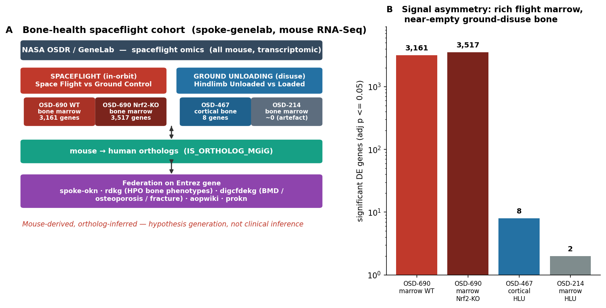
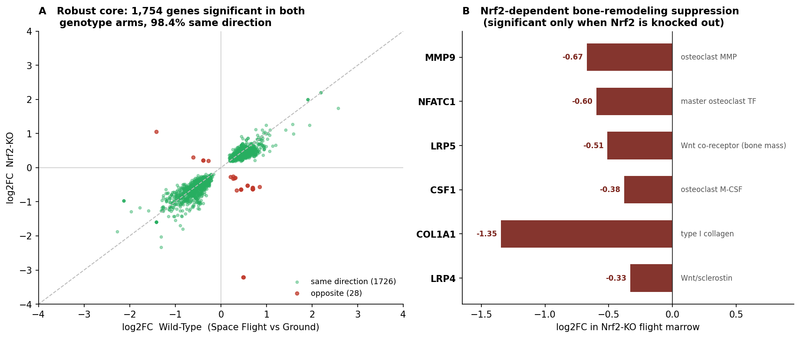
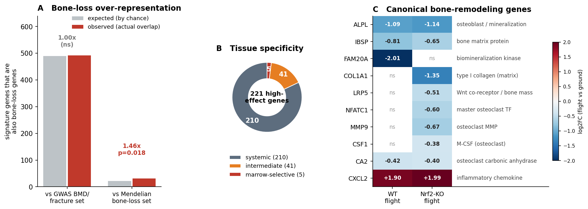
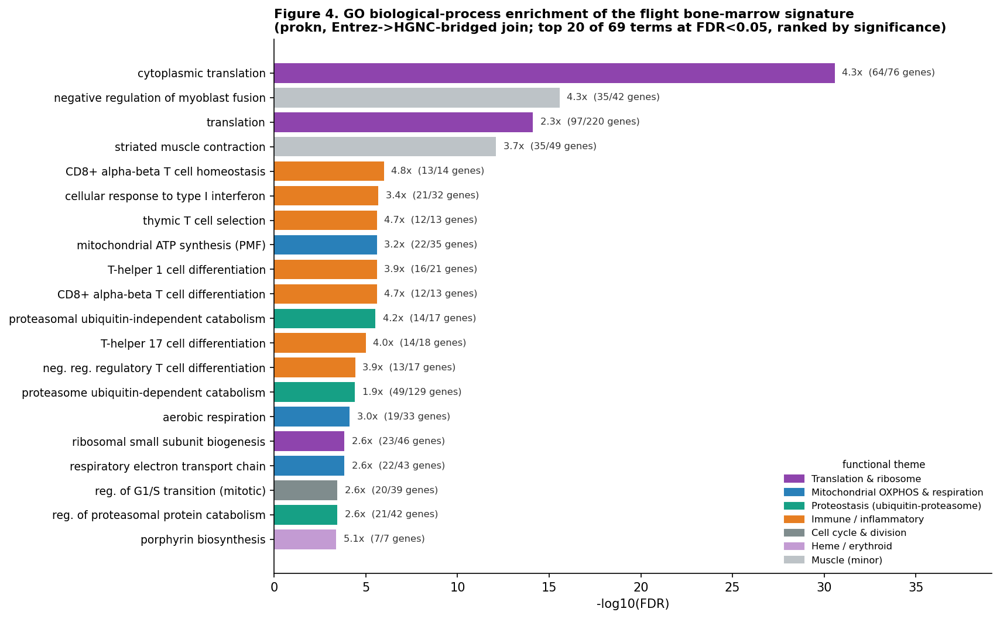
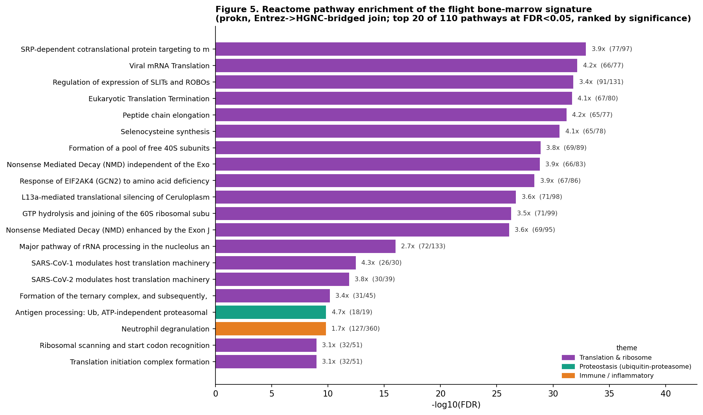
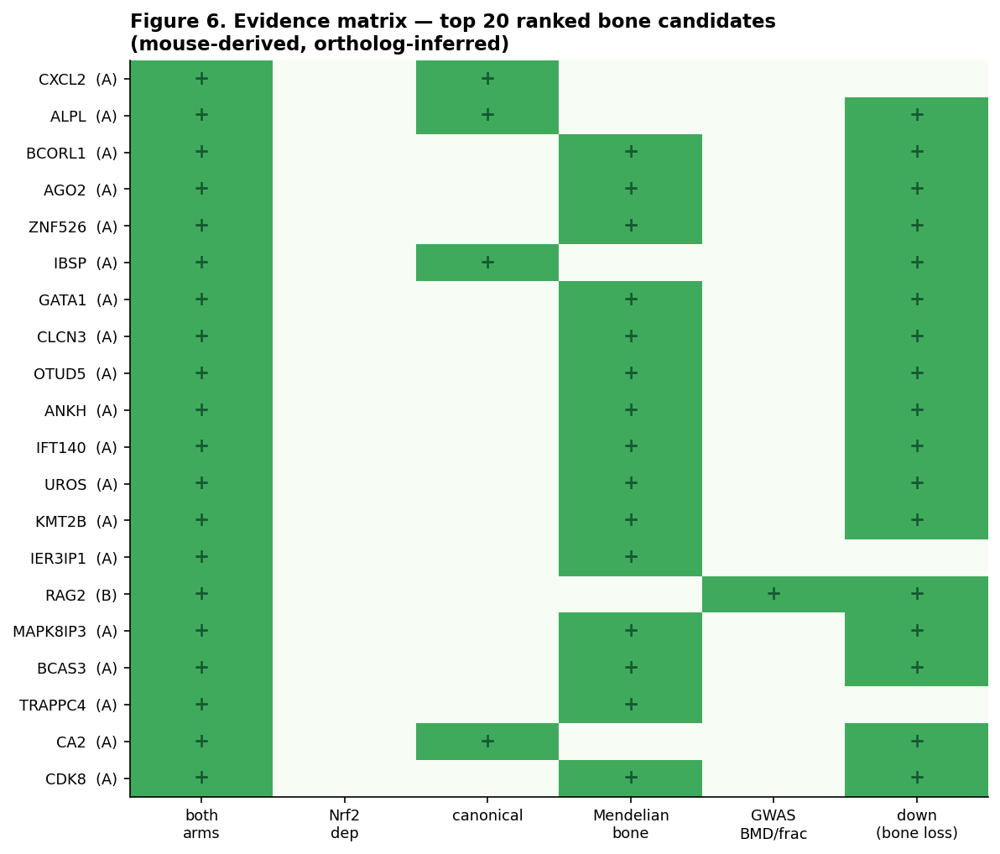

# Molecular Hypotheses for Spaceflight-Induced Bone Loss

### A cross-species integrative transcriptomics map on the OKN federation

**Date:** 2026-07-08 · **Endpoint:** OKN federated SPARQL (`https://apps.okn.us/federation/sparql`) · **Model:** claude-opus-4-8

> **Framing (non-negotiable).** All bone-health omics in this federation are **mouse RNA-Seq**; human relevance is obtained by projecting mouse genes to human orthologs (`IS_ORTHOLOG_MGiG`). **Every human-level statement is mouse-derived and ortholog-inferred** — this is *hypothesis generation, not clinical inference*. Astronaut bone loss (disuse osteoporosis: ~1–2 % loss of **bone mineral density (BMD)** per month in weight-bearing sites) is the clinical target; nothing here is a diagnosis or a claim about astronauts.

**Abbreviations.** **BMD** = bone mineral density (the clinical measure of how much mineral is packed into bone; low BMD defines osteopenia/osteoporosis and fracture risk); **DE** = differentially expressed (gene); **HLU** = hindlimb unloading (the ground disuse model); **SF-vs-GC** = Space-Flight-vs-Ground-Control contrast; **GO** = Gene Ontology; **OSDR/GeneLab** = NASA Open Science Data Repository; **FDR** = false-discovery rate. Throughout, "GWAS BMD" trait sets are genes linked to bone mineral density in human genome-wide association studies (via digcfdekg).

---

## 1. Executive summary

This report maps the skeletal spaceflight response and generates a ranked set of molecular hypotheses for **spaceflight-induced bone loss** by querying NASA GeneLab / OSDR mouse omics in the **spoke-genelab** knowledge graph and integrating across the OKN federation. All cross-KG integration is on **Entrez gene** only (OSD study accessions are a federation island).

The defining finding is a **data asymmetry that inverts the usual spaceflight-omics picture**. The federation contains exactly **one in-flight bone tissue — bone marrow** (study **OSD-690**, flown with both **wild-type** and **Nrf2-knockout** mice) — and **no in-flight mineralized-bone omics at all**. Mineralized bone appears only as a **ground hindlimb-unloading (HLU) disuse study** (OSD-467, cortical bone) that is essentially null in this release (8 differentially expressed genes). So, unlike the eye/SANS case where flight data are rich and the HLU analog is a weak proxy, here the **rich signal is the in-flight bone-marrow transcriptome** and the direct-bone disuse analog is nearly empty.

The wild-type flight bone-marrow signature is **3,161 significant genes → 3,112 human orthologs** (221 at |log2FC| ≥ 1). Its biology is a coherent bone-loss program: **osteoblast / mineralization markers down** (ALPL ↓, IBSP ↓, FAM20A ↓), **inflammation up** (CXCL2 ↑, CCL2 ↑), and a **metabolic/lipid shift** (ACOT1 ↑, PDK4 ↓). The **Nrf2-knockout arm provides an internal replicate and a genetic deconfounder**: **1,754 genes are significant in both genotypes, 98.4 % in the same direction** (a robust core), while loss of the oxidative-stress master regulator **Nrf2 broadens the disruption of bone-remodeling machinery** — **COL1A1, LRP5, NFATC1, CSF1 and MMP9 become significant only when Nrf2 is knocked out**. This nominates **oxidative-stress / Nrf2 defense as a protective axis for skeletal integrity in spaceflight**, and antioxidant (Nrf2-activating) countermeasures as the cleanest data-driven hypothesis.

The signature is **overwhelmingly systemic** (210 of 221 high-effect genes are significant across many non-bone spaceflight tissues; only 5 are marrow-selective) — the conserved organism-wide spaceflight stress response, of which the skeletal injury is the locally-vulnerable subset. Human orthologs are **not** over-represented against the broad GWAS bone-density universe (1.00×, p = 0.46) but **are** significantly enriched for **curated Mendelian bone-loss genes** (**31 vs 21.2 expected, 1.46×, hypergeometric p = 0.018**). The top-ranked candidate braid is **ALPL, IBSP, ANKH, CA2** (mineralization/remodeling, down and reproducible) and the **Nrf2-gated Wnt/osteoclast set (LRP5, NFATC1, CSF1, MMP9, COL1A1)**.

Adding **prokn's GO and Reactome layers via the Entrez→HGNC bridge** (§5.6) confirms the picture functionally: the signature is enriched (**69 GO terms** and **110 Reactome pathways**, FDR < 0.05) for **translation, mitochondrial OXPHOS/respiration, immune/interferon, ubiquitin–proteasome proteostasis, and oxidative-stress response** — the last independently corroborating the Nrf2 axis — while bone-specific processes stay gene-level, not over-represented. On treatment (§5.7), the mechanism-derived leads (**Nrf2 activation / antioxidants** and **mechanical loading / exercise**) are now joined by a **retrieved, gene-anchored drug shortlist** from **rdkg's curated `treats` layer**: **asfotase alfa** (↔ ALPL ↓), **romosozumab** (↔ LRP5/Wnt ↓, also indicated for OI/COL1A1), **denosumab / bisphosphonates** (↔ osteoclast NFATC1/CSF1/MMP9/CA2), and **teriparatide/PTH** (↔ ALPL/IBSP/COL1A1) — curated human-disease drugs, not spaceflight-validated.

---

## 2. Sources used

Six knowledge graphs were queried. **spoke-genelab** is the primary differential-expression source; the rest supply cross-KG context on the **shared Entrez gene** key. Direct-Entrez joins are high-confidence; prokn's Entrez→HGNC Wikidata bridge is lower-confidence and was **not used**. Versions are the exact OKN releases pinned 2026-07-08 (`get_kg_version`).

| KG (shortname) | Version | Role in this map | Join / confidence |
|---|---|---|---|
| **spoke-genelab** | v0.0.2 | **Primary:** mouse bone-marrow differential expression (`MEASURED_DIFFERENTIAL_EXPRESSION_ASmMG`) + mouse→human ortholog (`IS_ORTHOLOG_MGiG`) | source |
| **digcfdekg** | v0.0.1 | **Statistical** gene→trait: bone-mineral-density, osteoporosis, fracture (PIGEAN/EAGGL) | Entrez node-IRI (direct, verified 19,747) |
| **rdkg** | v0.0.1 | Rare disease → **HPO bone phenotype** → gene; **curated drug → bone-disease** (`treats`) | Entrez via identifiers.org (direct, 9,034) |
| **spoke-okn** | v0.0.6 | Disease→gene (`ASSOCIATES_DaG`), compound→gene regulation, drug→disease (`TREATS_CtD`) | Entrez node-IRI (direct, verified 16,326) |
| **biobricks-aopwiki** | v0.0.4 | Adverse Outcome Pathways | Entrez exactMatch (sparse key-event path — not anchored) |
| **prokn** | v0.0.5 | **GO + Reactome pathway enrichment** (Gene→encodes→Protein→GO / Reactome R-HSA) | Entrez→HGNC gene-symbol bridge (**bridged, lower-confidence**) |

**Checked but not contributory:** spoke-okn's `TREATS_CtD` carries **no osteoporosis/BMD drug edges** (only noisy MEDLINE-mined links for arthritis), and its compound→gene layer is **toxicogenomic perturbation** (Fluorouracil, Pentobarbital, Phenytoin, Tributyltin…), not therapeutics — so countermeasures are **mechanism-derived** (§5.7). GO biological-process enrichment (prokn) **is** included here (§5.6) via the lower-confidence Entrez→HGNC gene-symbol bridge and flagged accordingly; aopwiki's key-event→gene path is too sparse to anchor AOPs.

---

## 3. Cohort, study design & rules

Two rules define every spaceflight contrast (spoke-genelab guidance + `get_valid_contrasts`). **Direction rule:** keep an assay only when `factor_space_1 = "Space Flight"` AND `factor_space_2 = "Ground Control"` (group 1 = spaceflight ⇒ `log2FC > 0` = up in flight). **Comparability rule:** the two arms must match on every covariate (genotype, sex, dose, time, hardware) after stripping condition labels — this keeps the two OSD-690 arms **genotype-clean** (WT-flight vs WT-ground; KO-flight vs KO-ground). **Thresholds:** significance `adj_p ≤ 0.05` (primary), effect size `|log2FC| ≥ 1` reported alongside; `|log2FC| ≥ 10` flagged as near-zero-count artifact. **Ortholog collapsing:** max |log2FC| for 1:many / many:1, with an ambiguity flag (mean-rule sensitivity carried).

The complete bone cohort in this release, rebuilt live:

| OSD | Tissue | Condition | Clean contrasts | Sig DE genes (adj p≤0.05) | Human orthologs |
|---|---|---|---:|---:|---:|
| **OSD-690** | bone marrow | Space Flight vs Ground, **Wild-Type** | 1 | **3,161** | 3,112 |
| **OSD-690** | bone marrow | Space Flight vs Ground, **Nrf2-KO** | 1 | **3,517** | 3,537 |
| OSD-467 | **cortical bone** | Hindlimb Unloaded vs Loaded (ground) | 1 | 8 | 6 |
| OSD-214 | bone marrow | Hindlimb Unloaded vs Loaded (ground, ± immunization) | 4 | 1–2 (artefactual) | — |

Across the whole KG, only **bone marrow** (68 assays) and **cortical bone** (2 assays) are skeletal tissues; **no femur, tibia, vertebra, or calvaria omics exist**, and **no human bone data** are present anywhere in the federation. The only *in-flight* bone tissue is marrow; the only *mineralized-bone* data are the 8-gene ground HLU study.

***Figure 1. Bone-health spaceflight cohort and signal asymmetry (spoke-genelab v0.0.2, NASA OSDR/GeneLab; mouse RNA-Seq, ortholog-inferred).*** **(A)** Study design: the federation's only in-flight bone tissue is bone marrow (OSD-690), flown with both wild-type and Nrf2-knockout mice as clean Space-Flight-vs-Ground-Control contrasts; mineralized bone appears only as a ground hindlimb-unloading (disuse) study (OSD-467 cortical bone) plus a bone-marrow HLU study (OSD-214). Mouse differential expression is projected to human orthologs (`IS_ORTHOLOG_MGiG`) and integrated across the OKN federation on the shared Entrez gene key. **(B)** Significant differentially-expressed genes per assay (adj p ≤ 0.05; log scale): the in-flight marrow arms are signal-rich (WT 3,161; Nrf2-KO 3,517) while the ground-disuse bone contrasts are near-empty (cortical bone 8; marrow HLU 2, near-zero-count artefacts). Provenance: spoke-genelab `MEASURED_DIFFERENTIAL_EXPRESSION_ASmMG`, cohort verified with `get_valid_contrasts`.

---

## 4. Confidence tiers

Candidates are ranked by an integrated priority score over cross-genotype reproducibility, effect size, bone-disease/phenotype evidence, canonical bone-remodeling role, Nrf2-dependence, and tissue specificity.

| Tier | Definition | Interpretation |
|---|---|---|
| **A — reproducible + bone** | Significant in **both genotype arms**, same direction, **and** a canonical bone-remodeling gene or a curated Mendelian bone-loss gene | Robust core of the skeletal spaceflight response |
| **B — mechanistic** | Strong bone evidence (canonical / Mendelian / osteoporosis-fracture GWAS) but single-arm (incl. **Nrf2-dependent**) | Strong mechanistic hypothesis; corroboration desirable |
| **C — supporting** | Reproducible or bone-annotated but systemic/weaker link | Hypothesis-generating |

Candidate distribution: **953 bone-relevant candidates** — **Tier A = 20 · Tier B = 430 · Tier C = 503**. The robust cross-genotype core is **1,754 genes significant in both arms (98.4 % same-direction)**; **143** of these are high-effect (|log2FC| ≥ 1 in at least one arm).

---

## 5. Findings by axis

### 5.1 The flight bone-marrow signature (primary)

The wild-type OSD-690 bone-marrow signature (3,161 genes; 221 at |log2FC| ≥ 1) reads as a **bone-loss-consistent stress program**. Among canonical skeletal genes actually measured: **alkaline phosphatase ALPL ↓** (−1.09), **bone sialoprotein IBSP ↓** (−0.81) and the **biomineralization kinase FAM20A ↓** (−2.01) — three osteoblast / matrix-mineralization markers down — with the **inflammatory chemokines CXCL2 ↑** (+1.90) and **CCL2 ↑** (+1.42) up, and a lipid/metabolic switch (**ACOT1 ↑**, **PDK4 ↓**, **PLIN**-type genes). Down-regulated Wnt modulators appear at high effect (**WIF1 ↓, LGR5 ↓**), alongside the osteoblast transcriptional repressor **ZNF521/ZFP521 ↓** and matrix genes (**IGFBP5 ↓, EGFL6 ↓**) and the epithelial-Ca²⁺ channel **TRPV5 ↓**. The direction is internally consistent: **suppressed bone formation / mineralization + inflammation**, the molecular shape of net bone loss.

### 5.2 Nrf2 axis — internal replicate and oxidative-stress deconfounder

***Figure 2. Cross-genotype reproducibility and the Nrf2-dependent bone response (OSD-690 flight bone marrow; mouse-derived, ortholog-inferred).*** **(A)** log2 fold-change of every human-ortholog gene significant (adj p ≤ 0.05) in **both** the wild-type and Nrf2-knockout flight arms (n = 1,754); points near the diagonal move the same way in both genotypes. 1,726 (98.4 %) share direction (green), 28 flip (red) — an internal replicate showing the flight response is robust and largely Nrf2-independent. **(B)** Canonical bone-remodeling genes reaching significance **only** in the Nrf2-knockout arm (log2FC, flight vs ground): loss of the oxidative-stress regulator Nrf2 unmasks suppression of type-I collagen (COL1A1), the Wnt co-receptors LRP5/LRP4, and the osteoclast genes NFATC1/CSF1/MMP9 — spanning both bone formation and resorption. Provenance: spoke-genelab `MEASURED_DIFFERENTIAL_EXPRESSION_ASmMG` (assays OSD-690 WT `f82a89dc…` and Nrf2-KO `d89cbb20…`).

OSD-690's second genotype arm (Nrf2-knockout) is a rare gift: an in-flight genetic control on the master antioxidant regulator. **1,754 human orthologs are significant in both WT and KO arms, and 98.4 % move in the same direction** — a strong internal replication of the flight response (only 28 genes flip sign). The reproducible stress core (metallothioneins, CXCL2, ALPL, IBSP, CA2) is therefore **Nrf2-independent**.

The *difference* between arms is the interesting part. **Loss of Nrf2 broadens the disruption of bone-remodeling machinery**: **COL1A1 (type-I collagen) ↓, LRP5 (Wnt co-receptor / bone-mass gene) ↓, NFATC1 (master osteoclast transcription factor) ↓, CSF1 (M-CSF) ↓ and MMP9 (osteoclast matrix metalloproteinase) ↓** all cross significance **only in the Nrf2-KO flight arm** (LRP4 and COL1A1 as trends). Because these genes span **both** the formation (COL1A1, LRP5) and resorption (NFATC1, CSF1, MMP9) sides, the picture is a **global collapse of remodeling that Nrf2 normally buffers** — direct molecular support for the hypothesis that **oxidative-stress defense protects the skeleton under spaceflight**, and that antioxidant / Nrf2-activating countermeasures merit testing.

### 5.3 Tissue specificity — systemic stress vs skeletal vulnerability

***Figure 3. Bone relevance of the mouse flight bone-marrow signature (mouse-derived, ortholog-inferred).*** **(A) Bone-loss over-representation.** *Observed* = human-ortholog signature genes that are also known bone-loss genes; *expected* = the number expected if the 3,021-gene signature were a random gene set of the same size (hypergeometric null; background = 21,052 Entrez-mapped digcfdekg genes); *fold* = observed ÷ expected. The signature is **not** enriched against the broad GWAS BMD (bone mineral density) / fracture set (3,412 genes; 1.00×, p = 0.46) but **is** enriched against curated Mendelian bone-loss genes (rdkg HPO Osteoporosis / Osteopenia / Reduced-BMD / fracture, 148 genes; 1.46×, p = 0.018). **(B) Tissue specificity.** Each of the 221 high-effect signature genes is classified by how many of the **33 other** spaceflight (Space-Flight-vs-Ground) tissues it is also significant in: *systemic* = ≥ 3 tissues (shared, organism-wide spaceflight stress), *intermediate* = 1–2 tissues, *marrow-selective* = 0 (changed only in bone marrow). Most of the signature is systemic; the skeletal injury is the locally-vulnerable subset. **(C) Canonical bone-remodeling genes.** A curated panel of established bone genes read **directly** from the OSD-690 flight bone-marrow assays (spoke-genelab `MEASURED_DIFFERENTIAL_EXPRESSION_ASmMG`), wild-type and Nrf2-knockout arms; values are log2 fold-change (Space Flight vs Ground Control; blue = down in flight, red = up); *ns* = not significant / not in that arm's tested gene set. Formation and matrix genes (ALPL, IBSP, FAM20A, COL1A1) fall; osteoclast/Wnt genes (NFATC1, LRP5, CSF1, MMP9) fall only when Nrf2 is lost; inflammation (CXCL2) rises in both.

**Interpretation of the over-representation analysis (Figure 3A).** Panel A tests whether the flight bone-marrow signature is *preferentially* enriched for bone genes, or whether its overlap with bone-gene sets is no greater than expected for a gene list of its size. The answer depends on *which* bone-gene set you test against, and the two bars are deliberately different in kind. The **GWAS BMD/fracture set** (left) is *broad and permissive* — ~3,412 genes, roughly 16 % of all protein-coding genes, prioritised from genome-wide association statistics — so a ~3,000-gene signature overlaps it at almost exactly the chance rate (492 observed vs 490 expected; **1.00×, p = 0.46**). That null reflects the *size* of the set, **not** an absence of bone biology: against so permissive a background, almost no gene list looks enriched. The **curated Mendelian bone-loss set** (right) is the opposite — a *small, high-penetrance* set of 148 genes whose mutation *causes* monogenic osteoporosis / osteopenia / reduced-BMD / fracture (rdkg HPO) — and here the signature carries **1.46× more genes than expected (31 vs 21; p = 0.018)**. Taken together, the two bars make a specific, useful point: the bone relevance of the spaceflight marrow response is **concentrated in high-penetrance, causal skeletal genes**, not spread across the diffuse polygenic heritability background — and those 31 overlapping genes are precisely the ones that rise to the top of the ranked list (ALPL, ANKH, LRP5, IBSP, GATA1, IFT140, CLCN3…). Two caveats keep this honest: the effect is **modest and descriptive** — a single hypergeometric test on one curated set, with only 31 observed genes, so the estimate is statistically noisy and *enrichment is not causation* — and the whole comparison is **mouse-derived and ortholog-inferred**. Figure 3A therefore *sharpens* the bone hypothesis (and, reassuringly, matches the enrichment magnitude seen in the parallel ocular-spaceflight study) rather than proving it; it is the statistical warrant for treating the skeletal-disease genes in the signature as a genuine, prioritisable core rather than coincidence.

Against **311 non-marrow Space-Flight-vs-Ground assays across 33 tissues** (blood, liver, kidney, spleen, thymus, skin, muscle groups, brain regions…), the high-effect marrow signature is **overwhelmingly systemic: 210 systemic · 41 intermediate · 5 marrow-selective**. The reproducible stress core (metallothioneins, CXCL2, CCL2, ALPL) recurs organism-wide; only a handful (e.g. USH1C, PAX8) are marrow/flight-selective. This supports a **two-tier model** shared with the ocular-spaceflight case: a **systemic microgravity stress driver** that produces injury **where local tissue vulnerability is high** — in bone, the osteoblast/osteoclast machinery. It also means marrow is a *reporter* of systemic spaceflight physiology, not a bone-private compartment.

### 5.4 Unloading (disuse) attribution — a hard data gap

Hindlimb unloading is the gold-standard ground analog of skeletal disuse, and it is present here **directly in bone** — yet it is **uninformative in this KG release**. The cortical-bone HLU study (OSD-467) contains only **8 differentially expressed genes total** (a metabolic/proteostatic sliver: PFKFB3 ↑ glycolysis, MSS51 ↑, PDIA6 ↓, HMGA1B ↓), and the bone-marrow HLU contrasts (OSD-214) collapse to **near-zero-count artefacts** (UGT1A, |log2FC| > 18). Gene-level concordance with the flight signature is therefore effectively nil (only PDIA6 overlaps). **The unloading-attributable fraction of the flight bone-marrow signature cannot be estimated from this release** — a genuine limitation, not a negative result. (Contrast the ocular study, where the HLU retina analog yielded a 107-gene signature.)

### 5.5 Bone-disease & phenotype linkage

Human orthologs of the signature were tested against two bone-loss gene universes. Against the broad **digcfdekg GWAS** universe (3,412 BMD [bone mineral density] / osteoporosis / fracture genes — ~16 % of all genes), there is **no enrichment** (492 observed vs 489.6 expected, 1.00×, p = 0.46) — expected for so permissive a set. Against **curated Mendelian bone-loss genes** (rdkg HPO Osteoporosis / Osteopenia / Reduced-BMD / fracture, 148 genes), the signature **is significantly over-represented: 31 observed vs 21.2 expected, 1.46×, hypergeometric p = 0.018** — the same magnitude of enrichment seen in the ocular-spaceflight study. Concretely, **39 high-effect signature genes are annotated BMD/osteoporosis/fracture genes**, led by **ALPL** (hypophosphatasia; low bone mineralization), **ANKH** (pyrophosphate transport / mineralization), **LRP5** (osteoporosis-pseudoglioma / high-bone-mass), **IBSP, GATA1, CLCN3, IFT140** and others — a bona-fide skeletal-disease core embedded in the systemic response.

### 5.6 Functional pathway enrichment — GO & Reactome (prokn, bridged)

Projecting the human-ortholog signature to **prokn** through the **Entrez→HGNC gene-symbol bridge** (Gene `rdfs:label` → `encodes` → UniProt Protein → `involved in` → GO; lower-confidence than the direct-Entrez joins used elsewhere) and testing GO biological-process over-representation against prokn's annotated background (**7,663 genes; 1,495 signature genes mapped**) yields **69 enriched terms at FDR < 0.05**. They resolve into coherent programs: **translation / ribosome biogenesis** (cytoplasmic translation 4.3×, FDR ≈ 10⁻³¹), **mitochondrial OXPHOS & respiration** (oxidative phosphorylation, electron transport, TCA cycle, ATP synthesis — 12 terms), **immune / inflammatory** (type-I/II interferon, TNF/IL-2, T-cell differentiation — 15 terms, the hematopoietic marrow), **ubiquitin–proteasome proteostasis** (9), **cell cycle / mitosis** (9), **heme / erythroid biosynthesis** (5), and — corroborating the genetic Nrf2 result — **oxidative-stress response and cellular oxidant detoxification**. Crucially, the bone-specific processes (**ossification, bone mineralization, osteoblast differentiation, Wnt signalling**) are present at the individual-gene level (COL1A1, ALPL → ossification / mineralization; LRP5 → Wnt; CSF1, NFATC1 → osteoclast / Wnt) but are **not** themselves over-represented — consistent with §5.3: the signature is a systemic stress / proliferation program, within which the skeletal genes are a small, locally-critical fraction.

***Figure 4. GO biological-process enrichment of the flight bone-marrow signature (prokn, Entrez→HGNC-bridged; mouse-derived, ortholog-inferred).*** Top 20 of 69 GO biological-process terms significant at FDR < 0.05, ranked by significance (−log10 FDR); bars coloured by functional theme, annotated with fold enrichment and (signature genes / term genes). Foreground = 1,495 signature genes mapped to prokn; background = 7,663 prokn GO-annotated genes; hypergeometric test with Benjamini–Hochberg FDR. Provenance: prokn v0.0.5, Gene `rdfs:label` (HGNC symbol) → `encodes` (SIO_010078) → UniProt Protein → `involved in` (RO_0002331) → GO term. This join is **bridged (gene-symbol level) and lower-confidence** than the direct-Entrez joins used elsewhere; alias mismatches will cause some undercount.

The same bridge, run against **prokn's Reactome layer** (Gene → `encodes` → Protein → `participates in` [RO_0000056] → human Reactome pathway `R-HSA-…`), gives an independent pathway view: **110 Reactome pathways enriched at FDR < 0.05** (background 6,032 genes; 1,221 signature genes mapped). It reproduces the GO themes on Reactome's ontology — a dominant **translation / ribosome** block (SRP-dependent cotranslational targeting 3.9×, eukaryotic translation elongation/termination, rRNA processing, nonsense-mediated decay, the EIF2AK4/GCN2 amino-acid-deficiency response), **ubiquitin–proteasome proteostasis** (ATP-independent proteasomal antigen processing, SCF-βTrCP, Cdc25A/Emi1 degradation), **neutrophil degranulation** (myeloid marrow), **respiratory electron transport** (OXPHOS), and **oxygen-dependent HIF proline-hydroxylation** (hypoxia). The bone-relevant Reactome pathways surface at the gene level too — COL1A1 in *Collagen biosynthesis*, *Assembly of collagen fibrils* and ***RUNX2 regulates osteoblast differentiation***; LRP5 in *TCF-dependent WNT signaling* and *Signaling by LRP5 mutants*; NFATC1 in *Calcineurin activates NFAT*; CSF1 in *Signaling by CSF1 (M-CSF) in myeloid cells* — but, as with GO, these are individual-gene memberships, not over-represented terms.

***Figure 5. Reactome pathway enrichment of the flight bone-marrow signature (prokn, Entrez→HGNC-bridged; mouse-derived, ortholog-inferred).*** Top 20 of 110 human Reactome pathways significant at FDR < 0.05, ranked by significance (−log10 FDR); bars coloured by theme, annotated with fold and (signature genes / pathway genes). Foreground = 1,221 signature genes mapped; background = 6,032 prokn Reactome-annotated genes; hypergeometric with Benjamini–Hochberg FDR. Provenance: prokn v0.0.5, Gene `rdfs:label` → `encodes` (SIO_010078) → UniProt Protein → `participates in` (RO_0000056) → Reactome `R-HSA` pathway — a bridged, lower-confidence join.

### 5.7 Countermeasure / target hypotheses

Two independent layers now converge on candidate countermeasures: the **gene-level** signature (formation / mineralization down; osteoclast / Wnt down; inflammation up) and the **pathway-level** GO enrichment (oxidative stress, OXPHOS, inflammation). spoke-okn's therapeutic layer remains **unusable for bone** (`TREATS_CtD` has no osteoporosis edges; compound→gene is toxicogenomic), so these are **mechanism-derived research hypotheses — not medical advice**, and every human-level link is mouse-derived / ortholog-inferred. Ranked by strength of support in the data:

| Countermeasure | Target axis / mechanism | Supporting signature genes | Supporting GO / pathway | Example agents | Confidence |
|---|---|---|---|---|---|
| **Nrf2 activation / antioxidants** | oxidative-stress defense (Nrf2/NFE2L2) | Nrf2-KO worsens COL1A1/LRP5/NFATC1/CSF1/MMP9; ALPL, IBSP ↓ | response to oxidative stress; oxidant detoxification; OXPHOS | sulforaphane, N-acetylcysteine, resveratrol, dimethyl fumarate | **High** |
| **Mechanical loading / resistive exercise** | mechanotransduction vs disuse unloading | whole flight signature (disuse); Wnt axis ↓ | OXPHOS / respiration; oxidative stress | ARED resistive exercise, vibration (+ MitoQ adjunct) | **High (established)** |
| **Sclerostin inhibition / Wnt agonism** | Wnt-driven bone formation | LRP5 ↓, WIF1 ↓, LGR5 ↓; NFATC1 (neg. reg. Wnt) | Wnt signaling pathway; mesenchymal proliferation | romosozumab (anti-sclerostin); GSK-3β inhibitors; lithium | Moderate-High |
| **PTH anabolic agents** | osteoblast bone formation | ALPL ↓, IBSP ↓, COL1A1 ↓, FAM20A ↓ | ossification; bone mineralization; osteoblast differentiation | teriparatide, abaloparatide | Moderate-High |
| **Anti-resorptives** | osteoclast resorption | NFATC1 ↓, CSF1 ↓, MMP9 ↓, CA2 ↓ | osteoclast differentiation; CA acidification | bisphosphonates (also inhibit CA2), denosumab (anti-RANKL) | Moderate |
| **Anti-inflammatory / cytokine modulation** | inflammatory osteoclastogenesis | CXCL2 ↑, CCL2 ↑ | TNF / IL-2 / interferon; T-cell differentiation | TNF inhibitors; IL-6R (tocilizumab); resolvins | Exploratory |
| **Mitochondrial / metabolic support** | OXPHOS & redox stress | systemic OXPHOS genes; heme / erythroid program | oxidative phosphorylation; TCA cycle; heme biosynthesis | MitoQ, coenzyme Q10, NAD⁺ precursors | Exploratory |

The two best-supported levers are **oxidative-stress mitigation / Nrf2 activation** — uniquely backed by *both* the genetic Nrf2-KO result (loss of Nrf2 broadens the COL1A1/LRP5/NFATC1/CSF1/MMP9 collapse) *and* the enriched oxidative-stress / OXPHOS GO programs — and **mechanical loading / resistive exercise**, the established in-flight countermeasure that directly opposes the disuse state this signature reflects. Wnt re-activation (anti-sclerostin), PTH anabolics, and anti-resorptives map onto the specific down-regulated formation and osteoclast genes; anti-inflammatory and mitochondrial-support strategies are exploratory.

**Retrieved curated drugs (rdkg `treats`).** The federation *does* carry a usable curated bone-drug layer once you look past spoke-okn: **rdkg's `treats` edges** return the established anti-osteoporosis armamentarium, and it maps cleanly onto the dysregulated signature genes. *Coverage check across the bio-KGs:* spoke-okn `TREATS_CtD` has **no** osteoporosis edges; prokn's compound layer is medicinal-chemistry bioactivity probes for CA2/MMP9, **not** named drugs; biobricks ICE/Tox21/ToxCast are toxicology screens, not therapeutics — so **rdkg is the productive source**. These are **curated human-disease drugs, not spaceflight-validated**:

| Drug class | Example agents (retrieved from rdkg) | Treats (rdkg bone disease) | Linked signature genes / axis |
|---|---|---|---|
| **Bisphosphonates** (anti-resorptive) | Alendronate, Risedronate, Zoledronic acid, Ibandronate, Pamidronate, Etidronate, Minodronate, Neridronate | osteoporosis; post-/glucocorticoid-/juvenile OP; Paget; OI; **osteoporosis-pseudoglioma (LRP5)** | osteoclast: NFATC1 ↓, MMP9 ↓, CA2 ↓, CSF1 ↓ |
| **Anti-RANKL antibody** | Denosumab (Prolia) | osteoporosis (post/premenopausal, glucocorticoid, drug-induced); OI | osteoclast: CSF1 ↓, NFATC1 ↓ |
| **PTH anabolic** | Teriparatide, PTH (1-34) | osteoporosis; metabolic bone disorder; OI | osteoblast formation: ALPL ↓, IBSP ↓, COL1A1 ↓ |
| **Anti-sclerostin antibody (Wnt)** | Romosozumab (Evenity), Setrusumab (BPS804) | osteoporosis; **osteogenesis imperfecta (COL1A1)** | Wnt / bone mass: LRP5 ↓, WIF1 ↓, LGR5 ↓ |
| **ALPL enzyme replacement** | Asfotase alfa (Strensiq), Efzimfotase alfa | hypophosphatasia | **direct target of ALPL ↓** (alkaline phosphatase / mineralization) |
| **SERM** | Raloxifene, Bazedoxifene, Lasofoxifene | postmenopausal osteoporosis | estrogen-pathway bone protection |
| **Calcitonin** | Salmon calcitonin | osteoporosis; Paget; OI | anti-resorptive (osteoclast) |
| **Vitamin D / calcium / mineral** | Calcitriol, Alfacalcidol, Eldecalcitol, Cholecalciferol, Ergocalciferol, calcium salts, phylloquinone (K) | osteoporosis; rickets; osteomalacia; hypophosphatemia | mineralization substrate (ALPL / FAM20A) |
| **Anti-FGF23 antibody** | Burosumab (Crysvita, KRN23) | X-linked / hereditary hypophosphatemic rickets | phosphate homeostasis / mineralization |
| **Other bone agents** | Strontium ranelate, Tibolone, Estradiol | osteoporosis | coupled formation/resorption; hormone |
| **Proteasome inhibitor** (repurposing) | Bortezomib | hypophosphatasia | corroborates enriched ubiquitin–proteasome GO/Reactome (exploratory) |

The alignments are striking: **Asfotase alfa** (recombinant alkaline phosphatase for hypophosphatasia) is a *direct* correlate of the flight **ALPL ↓**; **romosozumab** (anti-sclerostin) engages the down-regulated **LRP5 / WIF1 Wnt axis** and is indicated for **osteogenesis imperfecta (COL1A1)**; **denosumab / bisphosphonates** hit the osteoclast program (NFATC1 / CSF1 / MMP9 / CA2); **teriparatide / PTH** drives the suppressed osteoblast-formation program (ALPL / IBSP / COL1A1); and rdkg links **bisphosphonates specifically to osteoporosis-pseudoglioma (LRP5)** and OI (COL1A1) — the exact Mendelian genes in the Tier-A signature. This turns the treatment section from purely mechanism-derived into a **retrieved, gene-anchored** shortlist for prioritization.

***Figure 6. Evidence matrix for the top 20 ranked bone candidates (single panel; mouse-derived, ortholog-inferred).*** Rows are the 20 highest-priority candidates (human gene symbol, with the **confidence tier in parentheses**), ordered by the integrated priority score — **(A)** = reproducible core (significant in *both* flight arms, same direction, *and* a canonical bone-remodeling or curated Mendelian bone-loss gene); **(B)** = mechanistic (strong bone evidence but single-arm, including Nrf2-dependent genes); tiers defined in §4. Columns are the evidence axes that feed that score, with a green **+** marking each that applies to a gene: significant in **both** flight arms (WT and Nrf2-KO); **Nrf2-dependent** (significant only in the knockout); a **canonical** bone-remodeling gene; a curated **Mendelian bone-loss** gene (rdkg HPO); a **GWAS BMD** (bone mineral density) **/ fracture** gene (digcfdekg); and **down** in flight (direction consistent with reduced bone anabolism). Provenance: integrated ranking (`RANKED_bone_candidates.tsv`) over spoke-genelab differential expression joined to rdkg and digcfdekg bone annotations on the Entrez key.

---

## 6. Discussion

**A systemic stress state with a skeletal readout.** The reproducible core is a recognizable spaceflight injury cascade — oxidative buffering (metallothioneins), inflammation (CXCL2/CCL2), a metabolic/lipid switch, and cell-stress genes — that is largely *systemic* (present across dozens of tissues). Bone marrow reports this state, and within it the *bone-specific* consequence is a coherent **suppression of osteoblast/mineralization genes** (ALPL, IBSP, FAM20A, COL1A1) with **inflammatory drive** (CXCL2/CCL2 promote osteoclastogenesis). That the skeletal-disease genes are enriched only against the *Mendelian* set, not the GWAS set, is itself informative: the signal concentrates in **high-penetrance bone-biology genes**, not the diffuse common-variant BMD background.

**The Nrf2 result is the novel hook.** Flying the same experiment in wild-type and Nrf2-knockout mice turns oxidative-stress defense into an experimental variable. The 98.4 % cross-genotype directional agreement shows the core response is robust and not an artifact; the *expansion* of the bone-remodeling disruption under Nrf2 loss (COL1A1, LRP5, NFATC1, CSF1, MMP9) is a clean, testable statement that **antioxidant capacity buffers spaceflight remodeling stress** — consistent with a growing terrestrial literature implicating reactive oxygen species and Nrf2 in disuse and estrogen-deficiency bone loss. It also predicts that individuals or conditions with reduced antioxidant capacity would be more susceptible, and that Nrf2-activating countermeasures could be protective.

**Why the disuse analog is silent — and what to do about it.** The most important caveat is structural: the federation's *mineralized-bone* omics are a single 8-gene ground study, so the classic decomposition of flight bone loss into microgravity vs mechanical-unloading vs radiation components **cannot be done here**. The rich signal lives in marrow, a mixed hematopoietic/stromal tissue; the osteoblast/osteocyte transcriptome of cortical/trabecular bone — where sclerostin, RANKL/OPG and the mechanostat live — is essentially absent. This is the single highest-value gap for future OSDR curation.

**Testable predictions.** (1) Nrf2-activating antioxidants preserve COL1A1/LRP5/NFATC1 expression and bone mass under spaceflight or HLU; (2) the marrow inflammatory axis (CXCL2/CCL2) drives osteoclastogenesis and is loading-reversible; (3) ALPL/IBSP/FAM20A down-regulation marks a measurable drop in marrow-stromal osteogenic capacity; (4) the systemic stress core is shared with non-bone tissues, so a blood/marrow biomarker panel could track skeletal risk; (5) mineralized-bone spaceflight omics, when generated, will show the Wnt/sclerostin and RANKL/OPG axes that marrow only hints at.

---

## 7. Comparison with the published literature

To situate these mouse-derived, ortholog-inferred hypotheses, each principal finding was checked against the primary literature using **PubMed** and the **Paperclip** full-text corpus; six central comparison claims were verified against full text. *According to PubMed and the Paperclip biomedical corpus,* the convergence is strong — every major axis of the signature has independent experimental support — and the one directional discrepancy is flagged below as a testable prediction.

**Astronaut/animal bone loss and the osteoblast-suppression signature.** The clinical premise is established: astronauts lose **> 10 % areal BMD** at hip/spine over a ~6-month mission [1], and in both humans and rodents spaceflight compromises bone mass via **reduced formation, elevated resorption, and impaired tissue mineralization** [2] — exactly the shape of the flight-marrow signature here (osteoblast/mineralization genes **ALPL, IBSP, FAM20A, COL1A1 down**), and consistent with the systematic-review consensus that microgravity impairs osteoblast differentiation while enhancing osteoclast maturation.

**Oxidative stress as a driver — and Nrf2 as the node.** The study's most novel result — that knocking out the oxidative-stress regulator **Nrf2 broadens the spaceflight bone-remodeling collapse** — sits on a well-supported axis. Two NASA-associated reviews identify **oxidative stress / redox signaling as key drivers of spaceflight skeletal deterioration** [3][4], and mechanical disuse induces mitochondrial dysfunction and oxidative stress that Nrf2 normally buffers [5] — matching the **OXPHOS / mitochondrial and oxidative-stress programs enriched in the signature** (Figs 4–5). At the gene level, **Nrf2 deficiency causes bone loss** (its activation promotes formation and suppresses resorption) [6], and **Nrf2 loss augments ROS and promotes RANKL/M-CSF-driven osteoclast differentiation** [7][8]. The genetic paradigm itself is mirrored terrestrially: a *different* knockout (hepcidin) **exacerbates hindlimb-unloading bone loss by inhibiting osteoblast differentiation** [9] — the same "KO worsens unloading" logic as the OSD-690 Nrf2-KO arm.

**One directional discrepancy (a testable prediction).** The terrestrial osteoclast-differentiation models predict Nrf2 loss should *increase* NFATc1-driven osteoclastogenesis [7][8]; yet in the whole-marrow spaceflight snapshot the osteoclast program (**NFATC1, CSF1, MMP9**) is *down* in the Nrf2-KO arm. This most likely reflects a bulk-tissue transcriptome capturing a **global suppression of remodeling** under combined spaceflight + Nrf2 loss rather than the directed RANKL-induced differentiation of an in-vitro assay — but the sign difference is a concrete discrepancy to resolve with sorted-cell or functional osteoclast readouts.

**Inflammation.** The up-regulated marrow chemokines **CXCL2, CCL2** fit the "spaceflight inflammaging" model, in which microgravity + radiation drive NF-κB-mediated inflammation coupled to bone and muscle loss [10].

**Wnt / sclerostin.** The down-regulated Wnt axis (**LRP5, WIF1, LGR5**) and the anti-sclerostin (romosozumab) rationale align with osteocyte-mechanosensing biology: unloading modulates sclerostin/Wnt-β-catenin, and SOST disruption resists unloading-induced loss of bone formation [11].

**Countermeasures.** The top data-driven lead — **antioxidant / Nrf2 activation** — is directly supported: the antioxidant Trolox prevents simulated-microgravity oxidative stress in osteoblasts [12]; Nrf2 activators (sulforaphane, curcumin) inhibit osteoclastogenesis [8]; and antioxidants such as resveratrol [13] and pinoresinol diglucoside [14] mitigate disuse/hindlimb-unloading bone loss. The retrieved drugs also find footing — a vitamin-D analog (eldecalcitol) prevents disuse osteoporosis and restores oxidative defense [15], and the anti-sclerostin / PTH / bisphosphonate / denosumab classes are the standard osteoporosis armamentarium.

**What this study adds.** Prior spaceflight-bone transcriptomics are largely single-tissue or single-model bioinformatic analyses; the contribution here is an **integrative knowledge-graph meta-analysis** that (i) surfaces an **Nrf2-gated bone-remodeling set** from an in-flight WT-vs-Nrf2-KO contrast, and (ii) anchors the marrow signature to specific **Mendelian / druggable** bone genes (ALPL, LRP5, ANKH…) and their matching agents (asfotase alfa, romosozumab). No finding contradicts the literature; the signature **concentrates and gene-anchors** mechanisms previously described piecemeal, and yields one falsifiable discrepancy (marrow NFATc1 direction under Nrf2 loss).

*Attribution: literature retrieved from **PubMed** and the **Paperclip** full-text corpus; DOIs and full-text line-anchored sources are listed in §11. References.*

## 8. Full ranked candidates

The complete machine-readable ranking is **`bone_spaceflight_candidates.xlsx`** (sheets: Ranked Candidates, Cohort, Nrf2-dependent set, Bone-loss enrichment, Methods & Rules) and **`RANKED_bone_candidates.tsv`** (953 rows). The interactive, sortable/filterable version is embedded in **`bone_health_spaceflight_report.html`**.

**Representative slice — top candidates and evidence** (in the *Bone role / link* column, "GWAS BMD" = a human bone-mineral-density GWAS gene; "rdkg" = curated Mendelian bone-phenotype gene):

| Gene (human) | Mouse | Dir. | WT / KO log2FC | Arms | Bone role / link | Tier |
|---|---|---|---|---|---|---|
| **CXCL2** | Cxcl2 | ↑ | +1.90 / +1.99 | 2 | inflammatory chemokine (osteoclastogenic) | A |
| **ALPL** | Alpl | ↓ | −1.09 / −1.14 | 2 | osteoblast/mineralization; rdkg fracture; GWAS BMD | A |
| **IBSP** | Ibsp | ↓ | −0.81 / −0.65 | 2 | bone matrix; GWAS BMD/osteoporosis/fracture | A |
| **ANKH** | Ank | ↓ | −0.61 / −0.61 | 2 | pyrophosphate/mineralization; rdkg Reduced-BMD | A |
| **CA2** | Car2 | ↓ | −0.42 / −0.40 | 2 | osteoclast carbonic anhydrase; GWAS BMD | A |
| **GATA1** | Gata1 | ↓ | −0.49 / −0.79 | 2 | rdkg Osteoporosis/Osteopenia/Fracture | A |
| **CLCN3** | Clcn3 | ↓ | −0.69 / −0.55 | 2 | rdkg Osteoporosis/Osteopenia | A |
| **IFT140** | Ift140 | ↓ | −0.56 / −0.59 | 2 | skeletal ciliopathy; rdkg Osteopenia | A |
| **BCORL1 / AGO2 / ZNF526 / OTUD5 / KMT2B** | — | ↓ | both arms | 2 | rdkg Osteoporosis/Osteopenia | A |
| **FAM20A** | Fam20a | ↓ | −2.01 / ns | 1 | biomineralization kinase | B |
| **COL1A1** | Col1a1 | ↓ | ns / −1.35 | 1 (KO) | type-I collagen — **Nrf2-dependent** | B |
| **LRP5** | Lrp5 | ↓ | ns / −0.51 | 1 (KO) | Wnt co-receptor / bone mass — **Nrf2-dependent** | B |
| **NFATC1** | Nfatc1 | ↓ | ns / −0.60 | 1 (KO) | master osteoclast TF — **Nrf2-dependent** | B |
| **CSF1** | Csf1 | ↓ | ns / −0.38 | 1 (KO) | M-CSF, osteoclastogenesis — **Nrf2-dependent** | B |
| **MMP9** | Mmp9 | ↓ | ns / −0.67 | 1 (KO) | osteoclast MMP — **Nrf2-dependent** | B |
| **WIF1 / LGR5** | Wif1 / Lgr5 | ↓ | WT high-effect | 1 | Wnt antagonist / R-spondin receptor; GWAS BMD | B |

---

## 9. Caveats, uncertainties, and likely undercounts

1. **Mouse-only, ortholog-inferred.** No human bone omics exist in the federation; every human-gene statement is projected from mouse via `IS_ORTHOLOG_MGiG`. Treat all disease/phenotype links as mouse-derived hypotheses.
2. **Only one in-flight bone tissue, and it is marrow — not mineralized bone.** The osteoblast/osteocyte/cortical transcriptome (sclerostin/SOST, RANKL/OPG, the mechanostat) is essentially absent; the marrow signal is a mixed hematopoietic/stromal readout.
3. **Single flight study.** Reproducibility here is *cross-genotype* (WT vs Nrf2-KO within OSD-690), not cross-study; there is no independent second bone spaceflight cohort to corroborate.
4. **Unloading attribution is impossible in this release** — the direct-bone HLU data are 8 genes (cortical) and near-zero-count artefacts (marrow), so the microgravity-vs-disuse-vs-radiation decomposition cannot be run.
5. **The signature is mostly systemic**, so most candidates are not bone-private; bone relevance is established by disease/phenotype annotation, not tissue selectivity.
6. **Enrichment is descriptive** — the 1.46× Mendelian enrichment (p = 0.018; background = 21,052 Entrez-mapped digcfdekg genes) is hypothesis-sharpening, not confirmation; the broad-GWAS test is null by construction.
7. **Drug evidence is curated human-disease, not spaceflight-validated.** spoke-okn has no osteoporosis TREATS edges (toxicogenomic only) and prokn's compound layer is medicinal-chemistry probes — but **rdkg's `treats` layer** supplies the curated anti-osteoporosis drugs in §5.7, mapped to signature genes. Treat these as approved/investigational human bone-disease drugs offered as a **prioritization shortlist — not medical advice**, and not validated for spaceflight bone loss.
8. **GO enrichment uses a bridged join.** The prokn GO layer (§5.6) is reached by an **Entrez→HGNC gene-symbol bridge** (lower-confidence than the direct-Entrez joins); alias/symbol mismatches undercount mapping (1,495 of ~3,112 signature orthologs mapped), and the background is prokn's annotated gene set (7,663), so the enrichment is indicative, not definitive. Reactome/pathway-membership and AOP layers were not separately anchored.
8. **Transcriptomics only** — no protein, methylation, or functional validation; no calcium/phosphate, densitometry, or histomorphometry.
9. **Nrf2-KO interpretation** — the broader significance in the KO arm partly reflects more significant genes overall (3,517 vs 3,161); the specific bone-remodeling genes named are reported with their effect sizes and flagged as Nrf2-dependent hypotheses.

---

## 10. Reproducibility

Every SPARQL query (verbatim, with graphs hit and row counts) and the analysis narrative are preserved in **`bone_reproducibility_transcript.md`** (generated via `create_chat_transcript`); the rules, thresholds and join-confidence are in **`bone_reproducibility_appendix.md`**. KG versions (§2) are pinned via `get_kg_version`. Intermediate extracts are in `./data/*.json` / `*.tsv`; the pipeline scripts are `analyze1.py`, `annotate.py`, `rank.py`, `stats.py`, and `build_figs.py` / `fig1.py` / `fig2.py` / `fig3.py`. Re-running against the same KG versions reproduces the counts (the cohort table in §3 was rebuilt live).

## 11. References

*Literature retrieved via **PubMed** and the **Paperclip** full-text corpus. Entries with a `citations.gxl.ai` link were verified against full text (line-anchored).*

[1] Sibonga JD. "Spaceflight-induced bone loss: is there an osteoporosis risk?" *Curr Osteoporos Rep* 11, 92–98 (2013). [DOI](https://doi.org/10.1007/s11914-013-0136-5)

[2] Coulombe JC, Senwar B, Ferguson VL. "Spaceflight-Induced Bone Tissue Changes that Affect Bone Quality and Increase Fracture Risk." *Curr Osteoporos Rep* 18, 1–12 (2020). [DOI](https://doi.org/10.1007/s11914-019-00540-y)

[3] Tian Y, Ma X, Yang C, Su P, Yin C, Qian AR. "The Impact of Oxidative Stress on the Bone System in Response to the Space Special Environment." *Int J Mol Sci* 18, 2132 (2017). [DOI](https://doi.org/10.3390/ijms18102132) · https://citations.gxl.ai/papers/PMC5666814#L5,L30

[4] Tahimic CGT, Globus RK. "Redox Signaling and Its Impact on Skeletal and Vascular Responses to Spaceflight." *Int J Mol Sci* 18, 2153 (2017). [DOI](https://doi.org/10.3390/ijms18102153) · https://citations.gxl.ai/papers/PMC5666834#L6,L22

[5] Wang FS, et al. "Biophysical Modulation of the Mitochondrial Metabolism and Redox in Bone Homeostasis and Osteoporosis." *Antioxidants (Basel)* 10, 1394 (2021). [DOI](https://doi.org/10.3390/antiox10091394)

[6] Sun P, Wang Z, Chen S, et al. "Imbalance of Bone Homeostasis Caused by Nrf2 Deficiency Leads to Bone Loss in OVX Rats." *Stem Cells Int* (2025). [DOI](https://doi.org/10.1155/sci/7214250) · https://citations.gxl.ai/papers/PMC12411055#L1,L10

[7] Yang Y, Liu Z, Wu J, et al. "Nrf2 Mitigates RANKL and M-CSF Induced Osteoclast Differentiation via ROS-Dependent Mechanisms." *Antioxidants (Basel)* 12, 2094 (2023). [DOI](https://doi.org/10.3390/antiox12122094) · https://citations.gxl.ai/papers/PMC10740485#L11,L68

[8] Hyeon S, Lee H, Yang Y, Jeong W. "Nrf2 deficiency induces oxidative stress and promotes RANKL-induced osteoclast differentiation." *Free Radic Biol Med* 65, 789–799 (2013). [DOI](https://doi.org/10.1016/j.freeradbiomed.2013.08.005)

[9] Chen X, Wang J, Zhen C, et al. "Hepcidin knockout exacerbates hindlimb unloading-induced bone loss in mice through inhibiting osteoblastic differentiation." *BMC Musculoskelet Disord* (2025). [DOI](https://doi.org/10.1186/s12891-025-08515-0) · https://citations.gxl.ai/papers/PMC11917043#L1

[10] Capri M, Conte M, Ciurca E, et al. "Long-term human spaceflight and inflammaging: Does it promote aging?" *Ageing Res Rev* 87, 101909 (2023). [DOI](https://doi.org/10.1016/j.arr.2023.101909)

[11] Sakai A. "[Space flight/bedrest immobilization and bone. Osteocyte as a sensor of mechanical stress and Wnt signal]." *Clin Calcium* 22, 1829–1835 (2012). PMID: 23187075

[12] Morabito C, Guarnieri S, Cucina A, Bizzarri M, Mariggiò MA. "Antioxidant Strategy to Prevent Simulated Microgravity-Induced Effects on Bone Osteoblasts." *Int J Mol Sci* 21, 3638 (2020). [DOI](https://doi.org/10.3390/ijms21103638) · https://citations.gxl.ai/papers/PMC7279347#L8,L31,L43

[13] Ahmad Hairi H, Jayusman PA, Shuid AN. "Revisiting Resveratrol as an Osteoprotective Agent: Molecular Evidence from In Vivo and In Vitro Studies." *Biomedicines* 11, 1453 (2023). [DOI](https://doi.org/10.3390/biomedicines11051453)

[14] Xuan YY, Li L, Wu Y, et al. "Pinoresinol diglucoside alleviates hindlimb unloading-induced bone loss in mice." *Life Sci Space Res (Amst)* 48, 64–77 (2025). [DOI](https://doi.org/10.1016/j.lssr.2025.08.006)

[15] Zhang H, Du Y, Tang W, et al. "Eldecalcitol prevents muscle loss and osteoporosis in disuse muscle atrophy via NF-κB signaling in mice." *Skelet Muscle* 13, 22 (2023). [DOI](https://doi.org/10.1186/s13395-023-00332-0)
