# Spaceflight-induced bone loss — multi-KG integrative study: reproducibility record

- **Date:** 2026-07-19
- **Model:** claude-opus-4-8
- **SPARQL endpoint:** https://apps.okn.us/federation/sparql
- **Generated by:** mcp-okn v0.1.0
- **Elapsed time:** 2026-07-20 03:50–04:33 UTC (43m 47s)
- **Contents:** 33 queries

## Prompt

Conduct a reproducible, multi-knowledge-graph integrative study of spaceflight-induced bone loss to generate a comprehensive, evidence-backed map of its molecular biology, genetics, cellular mechanisms, physiology, clinical manifestations, and countermeasure landscape.
Follow the `/okn-bioanalysis` workflow and produce the final report using `/okn-report-style`.
Objectives

1. Characterize spaceflight-induced bone loss
   * Identify the major skeletal manifestations of bone loss associated with short- and long-duration spaceflight.
   * Include related conditions such as osteopenia, osteoporosis, trabecular and cortical bone deterioration, impaired fracture healing, and altered bone remodeling.
   * Account for synonymous disease names, ontology mappings, and identifier crosswalks across all knowledge graphs.
   * Document differences between actual spaceflight and terrestrial analogs, including hindlimb unloading, bed rest, clinostat, and random positioning machine studies.
2. Integrate evidence across knowledge graphs
   * Search broadly across all relevant knowledge graphs available through mcp-okn.
   * Harmonize identifiers for genes, variants, proteins, pathways, diseases, drugs, tissues, cell types, phenotypes, and GeneLab studies.
   * Use cross-graph joins whenever they provide complementary evidence.
   * Document which knowledge graphs contributed to each finding.
3. Identify molecular mechanisms
   * Construct a comprehensive molecular profile organized by entity type, including protein-coding genes, non-coding RNAs (kept separate), genetic variants, proteins and protein complexes, pathways and gene sets, biological processes, molecular functions, upstream regulators.
   * Focus on mechanisms including osteoblast differentiation and function; osteoclast differentiation and bone resorption; osteocyte mechanotransduction; mesenchymal stem cell differentiation; Wnt/beta-catenin signaling; RANK/RANKL/OPG signaling; BMP and TGF-beta signaling; sclerostin regulation; extracellular matrix organization; collagen synthesis and mineralization; calcium and phosphate homeostasis; vitamin D and parathyroid hormone signaling; mitochondrial dysfunction; oxidative stress; inflammation and immune regulation; mechanosensitive signaling pathways (e.g. YAP/TAZ, integrins, focal adhesion).
   * Rank genes, variants, and pathways by the strength and consistency of evidence across sources.
4. Characterize disease-associated molecular activity
   * Identify genes with altered expression or activity during spaceflight or simulated microgravity.
   * Record species, tissue, bone type, skeletal cell type, direction of change, flight or analog experiment, mission duration, supporting datasets.
   * Highlight genes consistently dysregulated across multiple species, missions, tissues, or experimental models.
5. Therapeutic and countermeasure landscape
   * Identify approved drugs, investigational therapeutics, biologics, nutritional interventions, exercise countermeasures, mechanical loading approaches, and emerging therapies.
   * Include bisphosphonates, denosumab, teriparatide, abaloparatide, romosozumab, vitamin D and calcium supplementation, exercise protocols, vibration therapy, mechanical loading devices, novel anabolic and anti-resorptive therapies.
   * Associate interventions with their molecular targets, affected pathways, mechanisms of action, and supporting evidence.
   * Identify opportunities for drug repurposing suggested by cross-graph evidence.
6. Clinical features and biomarkers
   * Identify imaging biomarkers, biochemical markers of bone formation and resorption, circulating biomarkers, genomic biomarkers, biomechanical measurements, bone mineral density measures, fracture risk indicators.
   * Rank biomarkers according to evidence strength and suitability for monitoring astronaut bone health.
7. Comparison with terrestrial bone disorders
   * Compare the molecular and cellular signatures of spaceflight-induced bone loss with age-related osteoporosis, disuse osteoporosis, glucocorticoid-induced osteoporosis, fracture healing, osteogenesis imperfecta, Paget disease of bone.
   * Identify conserved mechanisms, unique adaptations to microgravity, and opportunities for translating terrestrial therapies to spaceflight.
8. Evidence assessment
   * For every reported relationship, record separately: supporting knowledge graph(s), relationship type, confidence or effect size (when available), evidence type (curated knowledge, genetic association, differential molecular activity, pathway membership, protein interaction, experimental observation, literature-derived evidence).
   * Preserve these evidence categories independently rather than merging them into a single confidence score.
9. Consensus analysis
   * Rank findings according to cross-source agreement.
   * Highlight the highest-confidence consensus mechanisms, biomarkers, therapeutic targets, and countermeasures.
   * Identify conflicting evidence, knowledge gaps, ontology mismatches, and underrepresented research areas.
   * Distinguish well-established mechanisms from emerging hypotheses.

## Notes

Deliverables: spaceflight_bone_loss_report.md / .html (rendered from the .md, check_report_parity PASS), spaceflight_bone_loss_results.xlsx (11 sheets), figures/fig1–fig9, data/ extracts, scripts/. Literature comparison used the PubMed and Paperclip MCP connectors (both confirmed available at preflight); items marked full-text-verified were checked against Paperclip full text.

## Knowledge graphs used

- `spoke-genelab` — <https://purl.org/okn/frink/kg/spoke-genelab>
- `digcfdekg` — <https://purl.org/okn/frink/kg/digcfdekg>
- `prokn` — <https://purl.org/okn/frink/kg/prokn>
- `ubergraph` — <https://purl.org/okn/frink/kg/ubergraph>
- `rdkg` — <https://purl.org/okn/frink/kg/rdkg>
- `oard-kg` — <https://purl.org/okn/frink/kg/oard-kg>
- `biomarkerkg` — <https://purl.org/okn/frink/kg/biomarkerkg>
- `spoke-okn` — <https://purl.org/okn/frink/kg/spoke-okn>

## Replicator specification

### A. Level of inference and standing caveats
Hypothesis generation only. (i) Molecular evidence is **model-organism (Mus musculus, Rattus norvegicus) and ortholog-inferred**; (ii) the OKN GeneLab subset contains **no bone tissue** — bone marrow and antigravity skeletal muscle are the closest available compartments; (iii) gene–trait, disease–phenotype and disease–drug edges are **curated or statistical associations, observational and not causal**.

### B. Anchor disease / phenotype set
- MONDO roots expanded with `ubergraph` `rdfs:subClassOf*` (reflexive): MONDO:0005298 osteoporosis, MONDO:0000837 bone resorption disease, MONDO:0001068 osteomalacia, MONDO:0019019 osteogenesis imperfecta, MONDO:0017198 osteopetrosis, MONDO:0019707 primary osteolysis.
- Plus a label sweep over `ubergraph` for MONDO terms matching `osteoporo|osteopeni|bone loss|bone density|bone mineral densit|osteolysis|osteomalacia|bone resorption|osteogenesis imperfecta|paget disease of bone|osteopetro|hyperostosis|disuse atroph|bone fragility|brittle bone` → **155 MONDO terms**.
- HP anchor: `ubergraph` label sweep for `osteoporo|osteopeni|reduced bone mineral densit|decreased bone mineral densit|bone mineral densit|bone resorption|trabecular|cortical bone|bone fragility|recurrent fracture|pathologic fracture|impaired.*heal|delayed fracture|hypercalciuria|hypercalcemia|elevated circulating parathyroid|abnormal bone ossification|abnormal cortical bone|abnormal trabecular` → **36 HP terms**.

### C. Spaceflight contrast selection (spoke-genelab)
Rules enforced by `get_valid_contrasts` (NOT hand-written):
1. **Direction** — keep only `factor_space_1 = "Space Flight"` AND `factor_space_2 = "Ground Control"`. Sign convention: `log2fc > 0` = UP in spaceflight.
2. **Within-assay comparability** — `material_id_1 = material_id_2` AND, after stripping condition labels (`space flight`, `ground control`, `basal control`, `vivarium control`, `cell culture control`, case-insensitive) and anchored group codes `^(GC|FLT|VIV|BSL|CC)(_C[0-9]+)?$`, `factors_1` and `factors_2` hold the SAME covariate set.
Federation-wide outcome: **188 clean / 492 confounded**.

Bone-relevant tissues selected by UBERON: bone marrow UBERON:0002371; quadriceps femoris UBERON:0001377; tibialis anterior UBERON:0001385; extensor digitorum longus UBERON:0001386; gastrocnemius UBERON:0001388; soleus UBERON:0001389. Clean transcription-profiling assays in these tissues = **14** (13 OSD studies; OSD-99, 101, 103, 104, 105, 326, 419, 422, 576, 665, 666, 690 ×2, 770). Missions: STS-40 (1991), SpaceX-4 (2014), SpaceX-10 (2017), SpaceX-14 (2018), SpaceX-21 (2020–21). DNA-methylation assays (OSD-103, OSD-105) were retrieved but not used for the expression signature.

### D. Differential-expression and ortholog rules
- Reified read: `?stmt rdf:subject ?assay ; rdf:predicate gl:MEASURED_DIFFERENTIAL_EXPRESSION_ASmMG ; rdf:object ?gene ; gl:log2fc ?l ; gl:adj_p_value ?p`.
- DE call: `FILTER(?p <= 0.05 && ABS(?l) >= 1)` → 4,531 assay×gene rows, **3,202 distinct model-organism gene nodes** (3,157 distinct gene symbols).
- Ortholog projection: `gl:IS_ORTHOLOG_MGiG` → human Gene node (`http://www.ncbi.nlm.nih.gov/gene/{entrez}`). Collapse **per assay** with `collapse_orthologs.collapse` — max |log2FC| representative, mean-rule value retained as a sensitivity check, `n_mouse_map` ambiguity flag, `sign_flip` flag. 579 model-organism gene nodes had no symbol-bearing human ortholog and were dropped (2,818 ortholog nodes exist for the DE set; 132 carry no `gl:symbol` and are excluded). Result: **2,686 human ortholog gene nodes / 2,683 distinct symbols**.
- Signature scopes: **full** = 2,686; **core** = 777 (DE in ≥2 clean assays); **bone marrow** = 395 (OSD-690 only).

### E. Cross-KG joins (all on shared entity identifiers; never on OSD/GLDS accessions)
| Pair | Key | Recipe |
|---|---|---|
| spoke-genelab × digcfdekg | Entrez | both sides use `http://www.ncbi.nlm.nih.gov/gene/{entrez}` verbatim — direct join, no bridge, no IRI rewrite (verified crosswalk C11, 19,747 shared genes) |
| ubergraph × rdkg / oard-kg | MONDO | rdkg and oard-kg diseases ARE `obo/MONDO_*` node IRIs; oard-kg is reified so BOTH `biolink:subject` and `biolink:object` positions are UNIONed |
| within prokn (enrichment) | HGNC symbol | `?gene rdfs:label ?sym ; SIO_010078 ?prot`; `?prot RO_0002331 ?go` (BP) / `RO_0002327 ?go` (MF) / `RO_0000056 ?pw` with `FILTER(CONTAINS(STR(?pw),"R-HSA"))` |
| within prokn (regulons) | HGNC symbol | `?reg biolink:target_for ?gene` (MSigDB motif / TF-target sets) |
| spoke-okn × signature | Entrez / symbol | `?gene rdfs:label ?symbol` then `UPREGULATES_CuG` / `DOWNREGULATES_CdG` |

### F. Enrichment specification (hypergeometric survival function + Benjamini–Hochberg FDR; fold = observed / expected)
| Family | Foreground | Background (explicit, same KG + id space) | N | Result |
|---|---|---|---|---|
| GO biological process | each of the 3 signature scopes | all prokn genes with ≥1 GO BP annotation | 7,663 | 135 terms FDR ≤ 0.05 |
| GO molecular function | each of the 3 scopes | all prokn genes with ≥1 GO MF annotation | 8,033 | 60 terms |
| Reactome pathway | each of the 3 scopes | all prokn genes with ≥1 human R-HSA pathway | 6,032 | 33 terms |
| Bone-trait gene sets (broad / GWAS) | each of the 3 scopes | all digcfdekg genes with ≥1 `geneToTrait` inference | 21,710 | 12 traits FDR ≤ 0.05 (full signature) |
| Curated Mendelian bone gene sets | each of the 3 scopes | all prokn genes with ≥1 `biolink:associated_with` disease link and a gene-symbol-shaped label `^[A-Z][A-Z0-9]{1,9}(-[A-Z0-9]{1,4})?$` | 9,925 | reduced-BMD set fold 1.80 FDR 1.7e-05 |
| Upstream regulators (MSigDB) | 777-gene core, membership derived IN-FEDERATION via a HAVING(COUNT(DISTINCT ?assay) >= 2) subquery | all prokn genes with ≥1 regulon membership | 24,972 (n = 728) | 180 of 1,721 regulons FDR ≤ 0.05 |
Minimum cell counts: `kmin = 3`, `Kmin = 3` for GO/Reactome/trait sets; `k ≥ 5, K ≥ 5` for regulons; `kmin = 1, Kmin = 2` for the four curated Mendelian sets. GO **cellular component** was deliberately skipped (localisation, not mechanism). Taxon/organism alignment and geospatial linkage were deliberately skipped (no bone-relevant question turns on them).

### G. Consensus scoring (axes recorded SEPARATELY in the workbook; the score is a transparent sum)
```
ax_recurrence      = clip(n_assays, 0, 6) / 6 * 3
ax_tissue_breadth  = clip(n_tissues, 0, 5) / 5 * 2
ax_direction       = 1.0 if (n_up == 0 or n_down == 0) else 0
ax_effect          = clip(|max_log2FC| / 4, 0, 1) * 1.5
ax_gwas            = clip(n_bone_traits, 0, 18) / 18 * 3
ax_mendelian       = 2.0 if gene in prokn reduced-BMD or osteopenia set else 0
ax_pathway         = 1.5 if gene in (GO ossification | GO ECM organisation | Reactome RUNX2 | Reactome PPARG-adipogenesis) else 0
ax_bonemarrow      = 1.0 if DE in the OSD-690 bone-marrow contrast else 0
ax_biomarker       = 1.0 if gene carries a biomarkerkg osteoporosis risk variant else 0
evidence_score     = sum of the nine terms
tier               = A if score >= 6.5 ; B if 4.5 <= score < 6.5 ; C otherwise
```
Tier distribution: **A 41 / B 196 / C 2,449** of 2,686.

### H. Verified quantities (re-checked live at the end of the run; zero drift)
188 clean / 492 confounded contrasts · 14 assays used · 3,202 model-organism DE gene nodes (3,157 symbols) · 2,686 human ortholog nodes (579 model-organism nodes dropped) · 777 core · 395 bone-marrow · 502 genes with ≥1 bone-trait edge · 26 bone traits carried forward of 56 screened · 155 MONDO + 36 HP anchor terms · 135 GO BP + 60 GO MF + 33 Reactome significant terms · 180 of 1,721 significant regulons · 169 DrugBank agents (115 treats, 63 contraindicated) across 21 disease nodes · 28 osteoporosis biomarkers · 39 spoke-okn compound→gene edges · 33 logged queries across 8 KGs.

### I. Limitations that a replicator must carry forward
1. No bone tissue in the OKN GeneLab subset; all bone-cell inference is from marrow (one study) and antigravity muscle.
2. RANKL/TNFSF11, OPG/TNFRSF11B, RANK/TNFRSF11A, NFATC1, SOST, LRP5, CTNNB1, PIEZO1, YAP1/WWTR1 are absent from the signature — a sampling artefact, not a negative biological result.
3. Model-organism and ortholog-inferred throughout; no human spaceflight transcriptome exists in the federation.
4. Recurrence conflates biology with tissue composition (the single-assay osteogenic cluster in tibialis anterior is the clearest example and is flagged in the report).
5. Enrichment is descriptive; regulon analysis infers TF activity from motif/target-set membership rather than measuring it.
6. Source evidence semantics differ: digcfdekg = statistical (PIGEAN/EAGGL); oard-kg = EHR co-occurrence; rdkg = curated indication with no efficacy estimate; biomarkerkg includes `biomarker_term_in_review` entries.
7. Terrestrial analogs (hindlimb unloading, bed rest, clinostat, RPM) are not vetted contrasts in the federation; the flight-vs-analog comparison rests on the literature (report §8).
8. Mission start/end dates are available but per-assay exposure duration and re-adaptation interval are not modelled.
9. Mechanistic-map modules and drug-class groupings are analyst judgment layered on query results; the Figure 7 drug-to-module assignment is by documented mechanism of action, not a KG gene–drug edge.
10. `biobricks-aopwiki` and `gene-expression-atlas-okn` were queried and returned zero bone/skeletal entities; `spoke-okn` carries osteoarthritis as its only bone-domain disease node.

## SPARQL queries

#### Query 1

_2026-07-20T03:54:19+00:00 · `ubergraph`_

```sparql
PREFIX rdfs: <http://www.w3.org/2000/01/rdf-schema#>
SELECT DISTINCT ?term ?label WHERE {
  GRAPH <https://purl.org/okn/frink/kg/ubergraph> {
    ?term rdfs:subClassOf* <http://purl.obolibrary.org/obo/MONDO_0005298> .
    OPTIONAL { ?term rdfs:label ?label . }
  }
} LIMIT 400
```

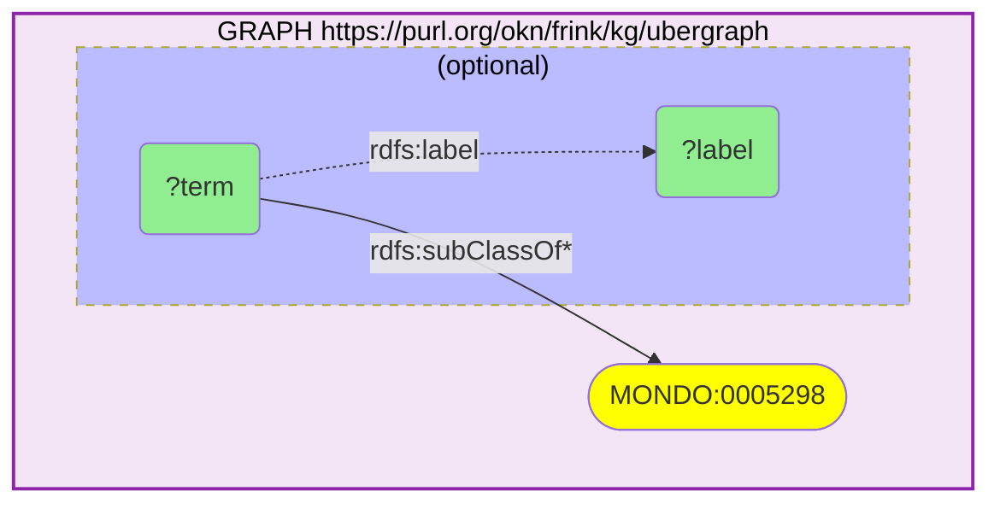

_13 row(s)_

#### Query 2

_2026-07-20T03:54:38+00:00 · `ubergraph`_

```sparql
PREFIX rdfs: <http://www.w3.org/2000/01/rdf-schema#>
# Anchor set A: MONDO disease terms whose labels denote bone loss / low bone mass /
# bone-remodeling disorders, harvested from ubergraph's OBO closure.
SELECT DISTINCT ?term ?label WHERE {
  GRAPH <https://purl.org/okn/frink/kg/ubergraph> {
    ?term rdfs:label ?label .
    FILTER(STRSTARTS(STR(?term), "http://purl.obolibrary.org/obo/MONDO_"))
    FILTER(
      REGEX(LCASE(?label), "osteoporo|osteopeni|bone loss|bone density|bone mineral densit|osteolysis|osteomalacia|bone resorption|osteogenesis imperfecta|paget disease of bone|osteopetro|hyperostosis|disuse atroph|bone fragility|brittle bone")
    )
  }
}
```

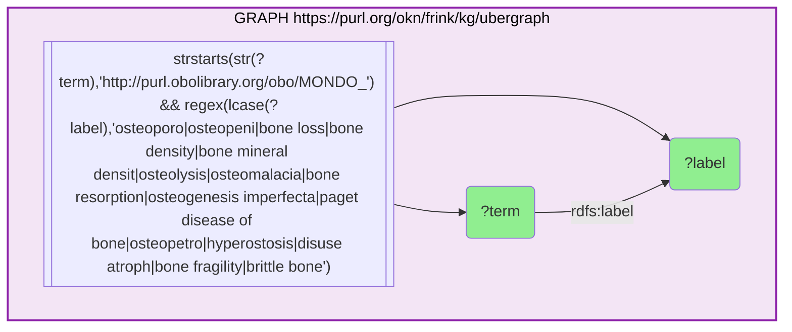

_155 row(s)_

#### Query 3

_2026-07-20T03:54:49+00:00 · `ubergraph`_

```sparql
PREFIX rdfs: <http://www.w3.org/2000/01/rdf-schema#>
# Anchor set B: HP (Human Phenotype Ontology) terms for skeletal manifestations of
# bone loss — the phenotype vocabulary used for clinical-feature mapping.
SELECT DISTINCT ?term ?label WHERE {
  GRAPH <https://purl.org/okn/frink/kg/ubergraph> {
    ?term rdfs:label ?label .
    FILTER(STRSTARTS(STR(?term), "http://purl.obolibrary.org/obo/HP_"))
    FILTER(
      REGEX(LCASE(?label), "osteoporo|osteopeni|reduced bone mineral densit|decreased bone mineral densit|bone mineral densit|bone resorption|trabecular|cortical bone|bone fragility|recurrent fracture|pathologic fracture|impaired.*heal|delayed fracture|hypercalciuria|hypercalcemia|elevated circulating parathyroid|abnormal bone ossification|abnormal cortical bone|abnormal trabecular")
    )
  }
}
```

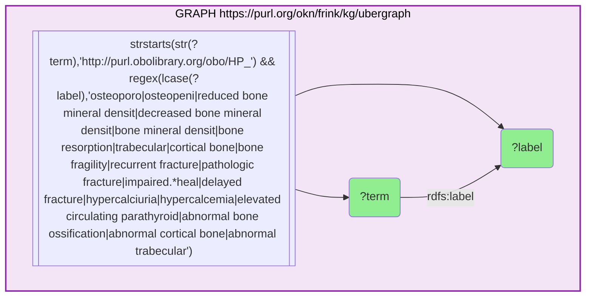

_36 row(s)_

#### Query 4

_2026-07-20T03:55:24+00:00 · `spoke-genelab`, `ubergraph`_

```sparql
PREFIX rdfs: <http://www.w3.org/2000/01/rdf-schema#>
PREFIX gl: <https://purl.org/okn/frink/kg/spoke-genelab/schema/>
# Landscape of NASA GeneLab (spoke-genelab) spaceflight assays by anatomy, with the
# UBERON label supplied by ubergraph; counts assays per tissue and flags the
# Space-Flight-vs-Ground-Control direction.
SELECT ?anatomy ?anatomyLabel (COUNT(DISTINCT ?assay) AS ?nAssays) WHERE {
  GRAPH <https://purl.org/okn/frink/kg/spoke-genelab> {
    ?assay gl:INVESTIGATED_ASiA ?anatomy ;
           gl:factor_space_1 "Space Flight" ;
           gl:factor_space_2 "Ground Control" .
  }
  GRAPH <https://purl.org/okn/frink/kg/ubergraph> {
    ?anatomy rdfs:label ?anatomyLabel .
  }
}
GROUP BY ?anatomy ?anatomyLabel
```

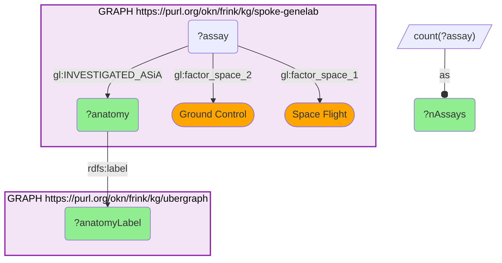

_34 row(s)_

#### Query 5

_2026-07-20T03:55:39+00:00 · `spoke-genelab`, `ubergraph`_

```sparql
PREFIX rdfs: <http://www.w3.org/2000/01/rdf-schema#>
PREFIX gl: <https://purl.org/okn/frink/kg/spoke-genelab/schema/>
# Bone-relevant spaceflight assays in NASA GeneLab: bone marrow + the hindlimb /
# antigravity skeletal muscles that share the mechanical-unloading axis with bone.
# Returns mission, study, dates and the assay's experimental arms.
SELECT ?anatomyLabel ?assay ?study ?projectTitle ?mission ?spaceProgram ?flightProgram
       ?startDate ?endDate ?measurement ?technology ?f1 ?f2 ?mat1 ?mat2
WHERE {
  GRAPH <https://purl.org/okn/frink/kg/spoke-genelab> {
    VALUES ?anatomy {
      <http://purl.obolibrary.org/obo/UBERON_0002371>
      <http://purl.obolibrary.org/obo/UBERON_0001377>
      <http://purl.obolibrary.org/obo/UBERON_0001385>
      <http://purl.obolibrary.org/obo/UBERON_0001386>
      <http://purl.obolibrary.org/obo/UBERON_0001388>
      <http://purl.obolibrary.org/obo/UBERON_0001389>
    }
    ?assay gl:INVESTIGATED_ASiA ?anatomy ;
           gl:factor_space_1 "Space Flight" ;
           gl:factor_space_2 "Ground Control" ;
           gl:measurement ?measurement ;
           gl:material_name_1 ?mat1 ;
           gl:material_name_2 ?mat2 .
    OPTIONAL { ?assay gl:technology ?technology }
    OPTIONAL { ?assay gl:factors_1 ?f1 }
    OPTIONAL { ?assay gl:factors_2 ?f2 }
    ?study gl:PERFORMED_SpAS ?assay ;
           gl:project_title ?projectTitle .
    OPTIONAL { ?mission gl:CONDUCTED_MIcS ?study ;
                        gl:space_program ?spaceProgram ;
                        gl:flight_program ?flightProgram ;
                        gl:start_date ?startDate ;
                        gl:end_date ?endDate }
  }
  GRAPH <https://purl.org/okn/frink/kg/ubergraph> { ?anatomy rdfs:label ?anatomyLabel }
}
```

```mermaid
graph TD
classDef projected fill:lightgreen;
classDef literal fill:orange;
classDef iri fill:yellow;
  q5v1("?anatomy")
  q5v16("?anatomyLabel"):::projected 
  q5v2("?assay"):::projected 
  q5v12("?endDate"):::projected 
  q5v7("?f1"):::projected 
  q5v8("?f2"):::projected 
  q5v13("?flightProgram"):::projected 
  q5v3("?mat1"):::projected 
  q5v4("?mat2"):::projected 
  q5v5("?measurement"):::projected 
  q5v11("?mission"):::projected 
  q5v10("?projectTitle"):::projected 
  q5v14("?spaceProgram"):::projected 
  q5v15("?startDate"):::projected 
  q5v9("?study"):::projected 
  q5v6("?technology"):::projected 
  subgraph q5graph0["GRAPH https://purl.org/okn/frink/kg/spoke-genelab"]
    style q5graph0 fill:#f3e5f5,stroke:#8e24aa,stroke-width:2px,color:#000;
    q5graph0c10(["Ground Control"]):::literal 
    q5graph0c8(["Space Flight"]):::literal 
    q5graph0bind0[/"VALUES ?anatomy"/]
    q5graph0bind0-->q5v1
    q5graph0bind00(["UBERON:0002371"])
    q5graph0bind00 --> q5graph0bind0
    q5graph0bind01(["UBERON:0001377"])
    q5graph0bind01 --> q5graph0bind0
    q5graph0bind02(["UBERON:0001385"])
    q5graph0bind02 --> q5graph0bind0
    q5graph0bind0more([+3 more])
    q5graph0bind0more --> q5graph0bind0
    q5v2 --"gl:factor_space_1"--> q5graph0c8
    q5v2 --"gl:factor_space_2"--> q5graph0c10
    q5v2 --"gl:INVESTIGATED_ASiA"--> q5v1
    q5v2 --"gl:material_name_1"--> q5v3
    q5v2 --"gl:material_name_2"--> q5v4
    q5v2 --"gl:measurement"--> q5v5
    subgraph q5optionalgraph00["(optional)"]
    style q5optionalgraph00 fill:#bbf,stroke-dasharray: 5 5,color:#000;
      q5v2 -."gl:technology".-> q5v6
    end
    subgraph q5optionalgraph01["(optional)"]
    style q5optionalgraph01 fill:#bbf,stroke-dasharray: 5 5,color:#000;
      q5v2 -."gl:factors_1".-> q5v7
    end
    subgraph q5optionalgraph02["(optional)"]
    style q5optionalgraph02 fill:#bbf,stroke-dasharray: 5 5,color:#000;
      q5v2 -."gl:factors_2".-> q5v8
    end
    q5v9 --"gl:PERFORMED_SpAS"--> q5v2
    q5v9 --"gl:project_title"--> q5v10
    subgraph q5optionalgraph03["(optional)"]
    style q5optionalgraph03 fill:#bbf,stroke-dasharray: 5 5,color:#000;
      q5v11 -."gl:CONDUCTED_MIcS".-> q5v9
      q5v11 --"gl:end_date"--> q5v12
      q5v11 --"gl:flight_program"--> q5v13
      q5v11 --"gl:space_program"--> q5v14
      q5v11 --"gl:start_date"--> q5v15
    end
  end
  subgraph q5graph1["GRAPH https://purl.org/okn/frink/kg/ubergraph"]
    style q5graph1 fill:#f3e5f5,stroke:#8e24aa,stroke-width:2px,color:#000;
    q5v1 --"rdfs:label"--> q5v16
  end
```

_15 row(s)_

#### Query 6

_2026-07-20T03:55:49+00:00 · `spoke-genelab`_

```sparql
PREFIX gl: <https://purl.org/okn/frink/kg/spoke-genelab/schema/>
# Bone marrow (UBERON:0002371) spaceflight assays in NASA GeneLab — the most
# bone-proximal tissue present in spoke-genelab (osteoprogenitor / osteoclast niche).
SELECT ?assay ?measurement ?technology ?mat1 ?mat2 ?f1 ?f2 ?study ?projectTitle ?mission ?startDate ?endDate
WHERE {
  GRAPH <https://purl.org/okn/frink/kg/spoke-genelab> {
    ?assay gl:INVESTIGATED_ASiA <http://purl.obolibrary.org/obo/UBERON_0002371> ;
           gl:factor_space_1 "Space Flight" ;
           gl:factor_space_2 "Ground Control" ;
           gl:measurement ?measurement .
    OPTIONAL { ?assay gl:technology ?technology }
    OPTIONAL { ?assay gl:material_name_1 ?mat1 }
    OPTIONAL { ?assay gl:material_name_2 ?mat2 }
    OPTIONAL { ?assay gl:factors_1 ?f1 }
    OPTIONAL { ?assay gl:factors_2 ?f2 }
    OPTIONAL { ?study gl:PERFORMED_SpAS ?assay .
               OPTIONAL { ?study gl:project_title ?projectTitle }
               OPTIONAL { ?mission gl:CONDUCTED_MIcS ?study ;
                                   gl:start_date ?startDate ; gl:end_date ?endDate } }
  }
}
```

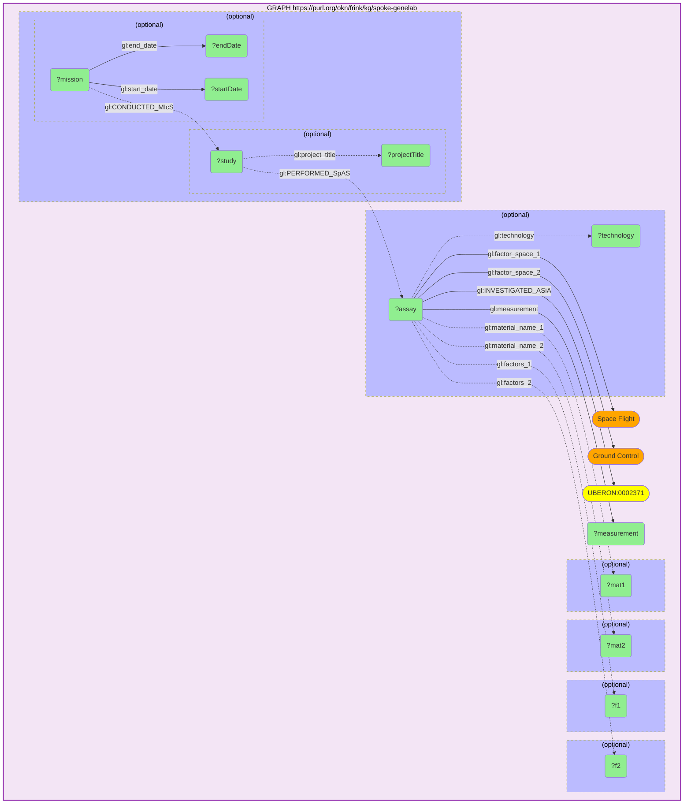

_16 row(s)_

#### Query 7

_2026-07-20T03:56:18+00:00 · `spoke-genelab`_

```sparql
PREFIX rdf: <http://www.w3.org/1999/02/22-rdf-syntax-ns#>
PREFIX gl: <https://purl.org/okn/frink/kg/spoke-genelab/schema/>
# Spaceflight differential expression in the 14 CLEAN (get_valid_contrasts-vetted)
# Space-Flight-vs-Ground-Control transcription assays of bone marrow + antigravity
# skeletal muscle. Sign convention: log2fc > 0 = UP in spaceflight.
SELECT ?assay ?gene ?symbol ?organism ?taxonomy ?log2fc ?adj_p
WHERE {
  GRAPH <https://purl.org/okn/frink/kg/spoke-genelab> {
    VALUES ?assay {
      <https://purl.org/okn/frink/kg/spoke-genelab/node/OSD-690-d89cbb20c4b7855f3f955e4adbb6515d>
      <https://purl.org/okn/frink/kg/spoke-genelab/node/OSD-690-f82a89dc82f2903149d2d11cbd6a130d>
      <https://purl.org/okn/frink/kg/spoke-genelab/node/OSD-101-315b0669c5d09d5618b4b25934569250>
      <https://purl.org/okn/frink/kg/spoke-genelab/node/OSD-103-f007f036b41857967d769f4df2450e35>
      <https://purl.org/okn/frink/kg/spoke-genelab/node/OSD-104-ec6e344401cc5008b3cb12c08cad9c7f>
      <https://purl.org/okn/frink/kg/spoke-genelab/node/OSD-105-cfde96b31f3c39139e213c293fde11e0>
      <https://purl.org/okn/frink/kg/spoke-genelab/node/OSD-326-0fc1dbed094071ca1f2f41bddd0ac5a7>
      <https://purl.org/okn/frink/kg/spoke-genelab/node/OSD-419-09b86865fee0ca01d066824227b7a93d>
      <https://purl.org/okn/frink/kg/spoke-genelab/node/OSD-422-c44d743ac966082af0d193a0b7258e3e>
      <https://purl.org/okn/frink/kg/spoke-genelab/node/OSD-576-df35787540b0077305f2739d53c076ed>
      <https://purl.org/okn/frink/kg/spoke-genelab/node/OSD-665-a4167284b0876ec8d3daba0d0e4a567f>
      <https://purl.org/okn/frink/kg/spoke-genelab/node/OSD-666-c82351edcee1ddd508c2e56d39337eaf>
      <https://purl.org/okn/frink/kg/spoke-genelab/node/OSD-770-10b02918dd6677725691e274c83a7eaf>
      <https://purl.org/okn/frink/kg/spoke-genelab/node/OSD-99-69f6c3ba8382c8668e921659326759d7>
    }
    ?stmt rdf:subject ?assay ;
          rdf:predicate gl:MEASURED_DIFFERENTIAL_EXPRESSION_ASmMG ;
          rdf:object ?gene ;
          gl:log2fc ?log2fc ;
          gl:adj_p_value ?adj_p .
    ?gene gl:symbol ?symbol ; gl:organism ?organism ; gl:taxonomy ?taxonomy .
    FILTER(?adj_p <= 0.05 && ABS(?log2fc) >= 1)
  }
}
```

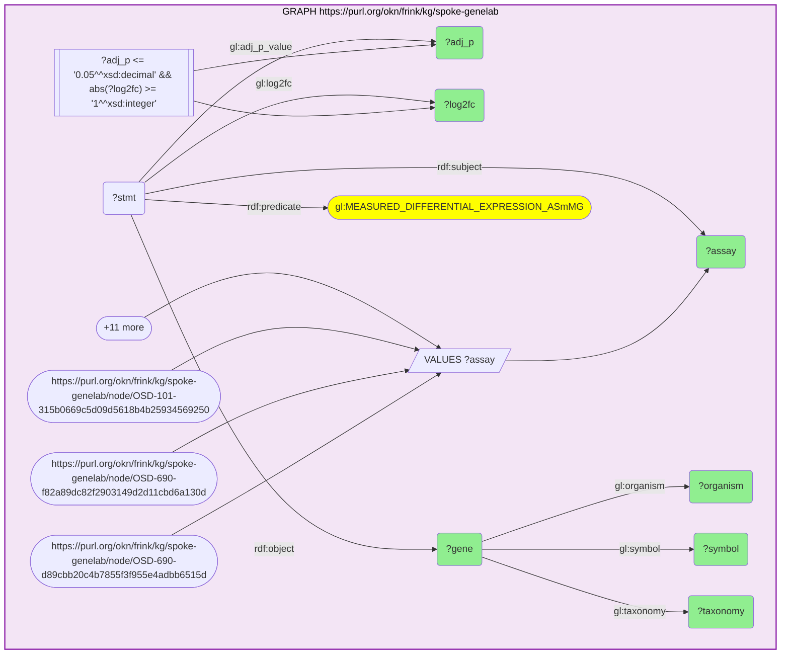

_4531 row(s)_

#### Query 8

_2026-07-20T03:57:01+00:00 · `spoke-genelab`_

```sparql
PREFIX rdf: <http://www.w3.org/1999/02/22-rdf-syntax-ns#>
PREFIX gl: <https://purl.org/okn/frink/kg/spoke-genelab/schema/>
# Cross-species projection: map every spaceflight-DE model-organism gene from the
# 14 clean bone-marrow / antigravity-muscle contrasts onto its HUMAN ortholog
# (Entrez), so the signature can be integrated with the human-keyed KGs.
SELECT ?assay ?symbol ?organism ?log2fc ?adj_p ?humanGene ?humanSymbol
WHERE {
  GRAPH <https://purl.org/okn/frink/kg/spoke-genelab> {
    VALUES ?assay {
      <https://purl.org/okn/frink/kg/spoke-genelab/node/OSD-690-d89cbb20c4b7855f3f955e4adbb6515d>
      <https://purl.org/okn/frink/kg/spoke-genelab/node/OSD-690-f82a89dc82f2903149d2d11cbd6a130d>
      <https://purl.org/okn/frink/kg/spoke-genelab/node/OSD-101-315b0669c5d09d5618b4b25934569250>
      <https://purl.org/okn/frink/kg/spoke-genelab/node/OSD-103-f007f036b41857967d769f4df2450e35>
      <https://purl.org/okn/frink/kg/spoke-genelab/node/OSD-104-ec6e344401cc5008b3cb12c08cad9c7f>
      <https://purl.org/okn/frink/kg/spoke-genelab/node/OSD-105-cfde96b31f3c39139e213c293fde11e0>
      <https://purl.org/okn/frink/kg/spoke-genelab/node/OSD-326-0fc1dbed094071ca1f2f41bddd0ac5a7>
      <https://purl.org/okn/frink/kg/spoke-genelab/node/OSD-419-09b86865fee0ca01d066824227b7a93d>
      <https://purl.org/okn/frink/kg/spoke-genelab/node/OSD-422-c44d743ac966082af0d193a0b7258e3e>
      <https://purl.org/okn/frink/kg/spoke-genelab/node/OSD-576-df35787540b0077305f2739d53c076ed>
      <https://purl.org/okn/frink/kg/spoke-genelab/node/OSD-665-a4167284b0876ec8d3daba0d0e4a567f>
      <https://purl.org/okn/frink/kg/spoke-genelab/node/OSD-666-c82351edcee1ddd508c2e56d39337eaf>
      <https://purl.org/okn/frink/kg/spoke-genelab/node/OSD-770-10b02918dd6677725691e274c83a7eaf>
      <https://purl.org/okn/frink/kg/spoke-genelab/node/OSD-99-69f6c3ba8382c8668e921659326759d7>
    }
    ?stmt rdf:subject ?assay ;
          rdf:predicate gl:MEASURED_DIFFERENTIAL_EXPRESSION_ASmMG ;
          rdf:object ?gene ;
          gl:log2fc ?log2fc ;
          gl:adj_p_value ?adj_p .
    ?gene gl:symbol ?symbol ; gl:organism ?organism .
    ?gene gl:IS_ORTHOLOG_MGiG ?humanGene .
    ?humanGene gl:symbol ?humanSymbol .
    FILTER(?adj_p <= 0.05 && ABS(?log2fc) >= 1)
  }
}
```

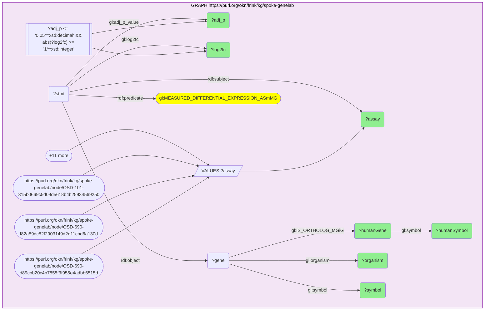

_4146 row(s)_

#### Query 9

_2026-07-20T04:01:05+00:00 · `ubergraph`, `rdkg`_

```sparql
PREFIX rdfs: <http://www.w3.org/2000/01/rdf-schema#>
PREFIX biolink: <https://w3id.org/biolink/vocab/>
# rdkg curated gene -> disease (contributes_to) edges across the bone-loss /
# bone-remodeling disease family, expanded inline from ubergraph MONDO subClassOf*.
# Genes are Entrez (identifiers.org/ncbigene) node IRIs.
SELECT DISTINCT ?anchorLabel ?disease ?diseaseLabel ?gene ?geneLabel
WHERE {
  VALUES (?anchor ?anchorLabel) {
    (<http://purl.obolibrary.org/obo/MONDO_0005298> "osteoporosis")
    (<http://purl.obolibrary.org/obo/MONDO_0000837> "bone resorption disease")
    (<http://purl.obolibrary.org/obo/MONDO_0001068> "osteomalacia")
    (<http://purl.obolibrary.org/obo/MONDO_0019019> "osteogenesis imperfecta")
    (<http://purl.obolibrary.org/obo/MONDO_0017198> "osteopetrosis")
    (<http://purl.obolibrary.org/obo/MONDO_0019707> "primary osteolysis")
  }
  GRAPH <https://purl.org/okn/frink/kg/ubergraph> { ?disease rdfs:subClassOf* ?anchor }
  GRAPH <https://purl.org/okn/frink/kg/rdkg> {
    ?gene biolink:contributes_to ?disease .
    ?gene rdfs:label ?geneLabel .
    ?disease rdfs:label ?diseaseLabel .
  }
}
```

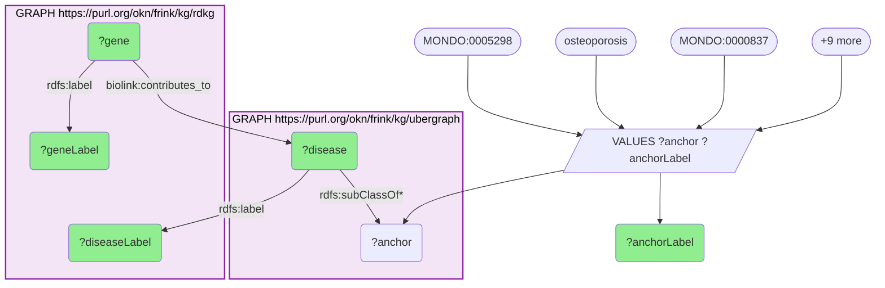

_24 row(s)_

#### Query 10

_2026-07-20T04:01:51+00:00 · `spoke-okn`_

```sparql
PREFIX rdfs: <http://www.w3.org/2000/01/rdf-schema#>
PREFIX so: <https://purl.org/okn/frink/kg/spoke-okn/schema/>
SELECT ?disease ?lbl (COUNT(DISTINCT ?g) AS ?n) WHERE {
  GRAPH <https://purl.org/okn/frink/kg/spoke-okn> {
    ?disease so:ASSOCIATES_DaG ?g ; rdfs:label ?lbl .
    FILTER(CONTAINS(LCASE(STR(?lbl)), "osteo") || CONTAINS(LCASE(STR(?lbl)), "bone") || CONTAINS(LCASE(STR(?lbl)), "musculoskeletal") || CONTAINS(LCASE(STR(?lbl)), "sarcopenia"))
  }
} GROUP BY ?disease ?lbl
```

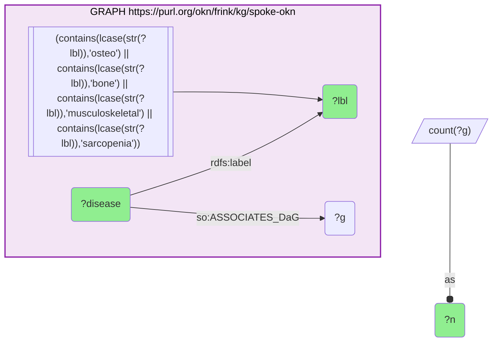

_1 row(s)_

#### Query 11

_2026-07-20T04:02:00+00:00 · `spoke-okn`_

```sparql
PREFIX rdfs: <http://www.w3.org/2000/01/rdf-schema#>
# Inventory of spoke-okn's bone-related disease nodes (any predicate role), to
# establish coverage of the bone-loss family in the SPOKE Open Knowledge Network.
SELECT DISTINCT ?disease ?lbl WHERE {
  GRAPH <https://purl.org/okn/frink/kg/spoke-okn> {
    ?disease rdfs:label ?lbl .
    FILTER(STRSTARTS(STR(?disease), "http://purl.obolibrary.org/obo/DOID_"))
    FILTER(CONTAINS(LCASE(STR(?lbl)), "osteo") || CONTAINS(LCASE(STR(?lbl)), "bone") || CONTAINS(LCASE(STR(?lbl)), "skelet"))
  }
}
```

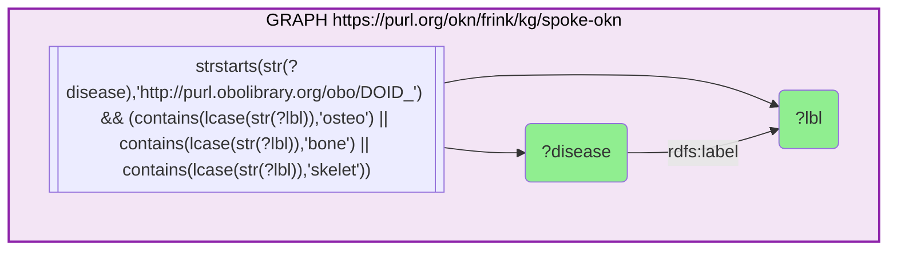

_1 row(s)_

#### Query 12

_2026-07-20T04:02:19+00:00 · `digcfdekg`_

```sparql
PREFIX rdf: <http://www.w3.org/1999/02/22-rdf-syntax-ns#>
PREFIX rdfs: <http://www.w3.org/2000/01/rdf-schema#>
PREFIX dig: <https://purl.org/okn/frink/kg/digcfdekg/schema/>
# digcfdekg (CFDE REVEAL) bone-related TRAITS and how much gene evidence each carries.
# Traits are ontology-keyed (EFO / MONDO / Orphanet / HPO); associations are reified
# with a probability weight from PIGEAN / EAGGL.
SELECT ?trait ?traitLabel ?origLabel (COUNT(DISTINCT ?gene) AS ?nGenes) (MAX(?w) AS ?maxWeight)
WHERE {
  GRAPH <https://purl.org/okn/frink/kg/digcfdekg> {
    ?trait a dig:Trait ; rdfs:label ?traitLabel .
    FILTER(REGEX(LCASE(?traitLabel), "osteoporo|osteopeni|bone mineral|bone densit|bone loss|bone fracture|fracture|osteomalacia|osteogenesis imperfecta|paget|osteopetro|bone resorption|osteoblast|osteoclast|bone geometr|heel bone|skeletal"))
    OPTIONAL { ?trait dig:originalLabel ?origLabel }
    OPTIONAL {
      ?stmt rdf:subject ?gene ; rdf:predicate dig:geneToTrait ; rdf:object ?trait ; dig:weight ?w .
    }
  }
} GROUP BY ?trait ?traitLabel ?origLabel
```

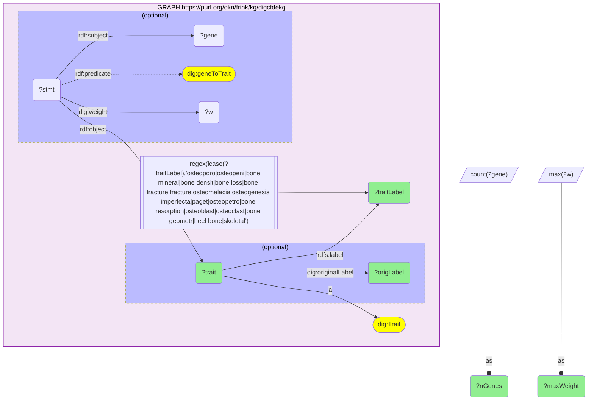

_56 row(s)_

#### Query 13

_2026-07-20T04:03:07+00:00 · `spoke-genelab`, `digcfdekg`_

```sparql
PREFIX rdf: <http://www.w3.org/1999/02/22-rdf-syntax-ns#>
PREFIX rdfs: <http://www.w3.org/2000/01/rdf-schema#>
PREFIX gl: <https://purl.org/okn/frink/kg/spoke-genelab/schema/>
PREFIX dig: <https://purl.org/okn/frink/kg/digcfdekg/schema/>
# HEADLINE CROSS-KG BRIDGE (Entrez): genes differentially expressed in NASA GeneLab
# spaceflight assays (spoke-genelab, model organism -> human ortholog) that are ALSO
# associated with human bone-mineral-density / osteoporosis / fracture traits in
# digcfdekg (CFDE REVEAL, PIGEAN/EAGGL). Join key: the shared Entrez gene IRI.
SELECT ?assay ?symbol ?organism ?log2fc ?adj_p ?humanGene ?humanSymbol ?trait ?traitLabel ?weight
WHERE {
  GRAPH <https://purl.org/okn/frink/kg/spoke-genelab> {
    VALUES ?assay {
      <https://purl.org/okn/frink/kg/spoke-genelab/node/OSD-690-d89cbb20c4b7855f3f955e4adbb6515d>
      <https://purl.org/okn/frink/kg/spoke-genelab/node/OSD-690-f82a89dc82f2903149d2d11cbd6a130d>
      <https://purl.org/okn/frink/kg/spoke-genelab/node/OSD-101-315b0669c5d09d5618b4b25934569250>
      <https://purl.org/okn/frink/kg/spoke-genelab/node/OSD-103-f007f036b41857967d769f4df2450e35>
      <https://purl.org/okn/frink/kg/spoke-genelab/node/OSD-104-ec6e344401cc5008b3cb12c08cad9c7f>
      <https://purl.org/okn/frink/kg/spoke-genelab/node/OSD-105-cfde96b31f3c39139e213c293fde11e0>
      <https://purl.org/okn/frink/kg/spoke-genelab/node/OSD-326-0fc1dbed094071ca1f2f41bddd0ac5a7>
      <https://purl.org/okn/frink/kg/spoke-genelab/node/OSD-419-09b86865fee0ca01d066824227b7a93d>
      <https://purl.org/okn/frink/kg/spoke-genelab/node/OSD-422-c44d743ac966082af0d193a0b7258e3e>
      <https://purl.org/okn/frink/kg/spoke-genelab/node/OSD-576-df35787540b0077305f2739d53c076ed>
      <https://purl.org/okn/frink/kg/spoke-genelab/node/OSD-665-a4167284b0876ec8d3daba0d0e4a567f>
      <https://purl.org/okn/frink/kg/spoke-genelab/node/OSD-666-c82351edcee1ddd508c2e56d39337eaf>
      <https://purl.org/okn/frink/kg/spoke-genelab/node/OSD-770-10b02918dd6677725691e274c83a7eaf>
      <https://purl.org/okn/frink/kg/spoke-genelab/node/OSD-99-69f6c3ba8382c8668e921659326759d7>
    }
    ?stmt rdf:subject ?assay ;
          rdf:predicate gl:MEASURED_DIFFERENTIAL_EXPRESSION_ASmMG ;
          rdf:object ?gene ;
          gl:log2fc ?log2fc ;
          gl:adj_p_value ?adj_p .
    ?gene gl:symbol ?symbol ; gl:organism ?organism ; gl:IS_ORTHOLOG_MGiG ?humanGene .
    ?humanGene gl:symbol ?humanSymbol .
    FILTER(?adj_p <= 0.05 && ABS(?log2fc) >= 1)
  }
  GRAPH <https://purl.org/okn/frink/kg/digcfdekg> {
    VALUES ?trait {
      <http://www.ebi.ac.uk/efo/EFO_0009270> <http://www.ebi.ac.uk/efo/EFO_0007785>
      <http://www.ebi.ac.uk/efo/EFO_0007701> <http://www.ebi.ac.uk/efo/EFO_0007702>
      <http://www.ebi.ac.uk/efo/EFO_0007620> <http://www.ebi.ac.uk/efo/EFO_0007621>
      <http://www.ebi.ac.uk/efo/EFO_0007933> <http://www.ebi.ac.uk/efo/EFO_0020095>
      <http://purl.obolibrary.org/obo/OBA_2045559> <http://purl.obolibrary.org/obo/MONDO_0005327>
      <https://purl.org/okn/frink/kg/digcfdekg/node/trait/9e16eca420eee5f32d37>
      <https://purl.org/okn/frink/kg/digcfdekg/node/trait/8a1c7ae8b81e9b648213>
      <https://purl.org/okn/frink/kg/digcfdekg/node/trait/ce9fab5cfc433881fa71>
      <https://purl.org/okn/frink/kg/digcfdekg/node/trait/e491549d91b916e24445>
      <https://purl.org/okn/frink/kg/digcfdekg/node/trait/eac7647078ccfdee1d15>
      <https://purl.org/okn/frink/kg/digcfdekg/node/trait/f536cb6072cfe6124034>
      <https://purl.org/okn/frink/kg/digcfdekg/node/trait/4c9a9bb4a649f5e9348c>
      <https://purl.org/okn/frink/kg/digcfdekg/node/trait/2cf19057fbed004c20dd>
      <https://purl.org/okn/frink/kg/digcfdekg/node/trait/e833c63364fe37d83622>
      <https://purl.org/okn/frink/kg/digcfdekg/node/trait/b9d2e23e2c4ab2bc7ef9>
      <https://purl.org/okn/frink/kg/digcfdekg/node/trait/822d2a7dd4120de88ed8>
      <http://www.orpha.net/ORDO/Orphanet_93446> <http://www.orpha.net/ORDO/Orphanet_666>
      <http://www.orpha.net/ORDO/Orphanet_2781> <http://www.orpha.net/ORDO/Orphanet_93447>
    }
    ?st2 rdf:subject ?humanGene ; rdf:predicate dig:geneToTrait ; rdf:object ?trait ; dig:weight ?weight .
    ?trait rdfs:label ?traitLabel .
  }
}
```

```mermaid
graph TD
classDef projected fill:lightgreen;
classDef literal fill:orange;
classDef iri fill:yellow;
  q13v1("?adj_p"):::projected 
  q13v3("?assay"):::projected 
  q13v5("?gene")
  q13v6("?humanGene"):::projected 
  q13v9("?humanSymbol"):::projected 
  q13v2("?log2fc"):::projected 
  q13v7("?organism"):::projected 
  q13v11("?st2")
  q13v4("?stmt")
  q13v8("?symbol"):::projected 
  q13v10("?trait"):::projected 
  q13v13("?traitLabel"):::projected 
  q13v12("?weight"):::projected 
  subgraph q13graph0["GRAPH https://purl.org/okn/frink/kg/spoke-genelab"]
    style q13graph0 fill:#f3e5f5,stroke:#8e24aa,stroke-width:2px,color:#000;
    q13graph0c16(["gl:MEASURED_DIFFERENTIAL_EXPRESSION_ASmMG"]):::iri 
    q13graph0f0[["?adj_p <= '0.05^^xsd:decimal' && abs(?log2fc) >= '1^^xsd:integer'"]]
    q13graph0f0 --> q13v1
    q13graph0f0 --> q13v2
    q13graph0bind0[/"VALUES ?assay"/]
    q13graph0bind0-->q13v3
    q13graph0bind00(["https://purl.org/okn/frink/kg/spoke-genelab/node/OSD-690-d89cbb20c4b7855f3f955e4adbb6515d"])
    q13graph0bind00 --> q13graph0bind0
    q13graph0bind01(["https://purl.org/okn/frink/kg/spoke-genelab/node/OSD-690-f82a89dc82f2903149d2d11cbd6a130d"])
    q13graph0bind01 --> q13graph0bind0
    q13graph0bind02(["https://purl.org/okn/frink/kg/spoke-genelab/node/OSD-101-315b0669c5d09d5618b4b25934569250"])
    q13graph0bind02 --> q13graph0bind0
    q13graph0bind0more([+11 more])
    q13graph0bind0more --> q13graph0bind0
    q13v4 --"rdf:predicate"--> q13graph0c16
    q13v4 --"rdf:object"--> q13v5
    q13v4 --"rdf:subject"--> q13v3
    q13v4 --"gl:adj_p_value"--> q13v1
    q13v4 --"gl:log2fc"--> q13v2
    q13v5 --"gl:IS_ORTHOLOG_MGiG"--> q13v6
    q13v5 --"gl:organism"--> q13v7
    q13v5 --"gl:symbol"--> q13v8
    q13v6 --"gl:symbol"--> q13v9
  end
  subgraph q13graph1["GRAPH https://purl.org/okn/frink/kg/digcfdekg"]
    style q13graph1 fill:#f3e5f5,stroke:#8e24aa,stroke-width:2px,color:#000;
    q13graph1c27(["dig:geneToTrait"]):::iri 
    q13graph1bind1[/"VALUES ?trait"/]
    q13graph1bind1-->q13v10
    q13graph1bind10(["efo:0009270"])
    q13graph1bind10 --> q13graph1bind1
    q13graph1bind11(["efo:0007785"])
    q13graph1bind11 --> q13graph1bind1
    q13graph1bind12(["efo:0007701"])
    q13graph1bind12 --> q13graph1bind1
    q13graph1bind1more([+22 more])
    q13graph1bind1more --> q13graph1bind1
    q13v11 --"rdf:predicate"--> q13graph1c27
    q13v11 --"rdf:object"--> q13v10
    q13v11 --"rdf:subject"--> q13v6
    q13v11 --"dig:weight"--> q13v12
    q13v10 --"rdfs:label"--> q13v13
  end
```

_2387 row(s)_

#### Query 14

_2026-07-20T04:04:09+00:00 · `prokn`_

```sparql
PREFIX rdfs: <http://www.w3.org/2000/01/rdf-schema#>
# prokn GO BACKGROUND (biological process): every HGNC gene symbol -> GO BP term, via
# the encoded UniProt protein. This is the explicit background for the hypergeometric
# over-representation test of the spaceflight signature.
SELECT ?sym ?go WHERE {
  GRAPH <https://purl.org/okn/frink/kg/prokn> {
    ?gene rdfs:label ?sym ; <http://semanticscience.org/resource/SIO_010078> ?prot .
    ?prot <http://purl.obolibrary.org/obo/RO_0002331> ?go .
  }
}
```


_71917 row(s)_

#### Query 15

_2026-07-20T04:04:19+00:00 · `prokn`_

```sparql
PREFIX rdfs: <http://www.w3.org/2000/01/rdf-schema#>
# prokn REACTOME BACKGROUND: every HGNC gene symbol -> human Reactome pathway (R-HSA)
# via the encoded UniProt protein. Separate enrichment family from GO — run in
# addition to, not instead of, the GO test.
SELECT ?sym ?pw WHERE {
  GRAPH <https://purl.org/okn/frink/kg/prokn> {
    ?gene rdfs:label ?sym ; <http://semanticscience.org/resource/SIO_010078> ?prot .
    ?prot <http://purl.obolibrary.org/obo/RO_0000056> ?pw .
    ?pw a <http://purl.uniprot.org/core/Pathway> .
    FILTER(CONTAINS(STR(?pw), "R-HSA"))
  }
}
```

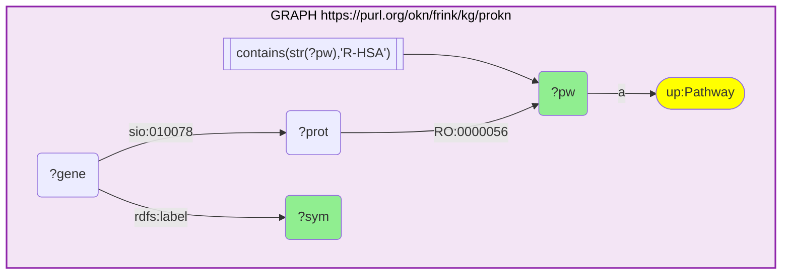

_30017 row(s)_

#### Query 16

_2026-07-20T04:04:26+00:00 · `prokn`_

```sparql
PREFIX rdfs: <http://www.w3.org/2000/01/rdf-schema#>
# prokn GO BACKGROUND (molecular function): HGNC gene symbol -> GO MF term the encoded
# UniProt protein 'enables'. Third GO aspect alongside BP; used for the MF enrichment
# family and for the molecular-function inventory of the signature.
SELECT ?sym ?go WHERE {
  GRAPH <https://purl.org/okn/frink/kg/prokn> {
    ?gene rdfs:label ?sym ; <http://semanticscience.org/resource/SIO_010078> ?prot .
    ?prot <http://purl.obolibrary.org/obo/RO_0002327> ?go .
  }
}
```

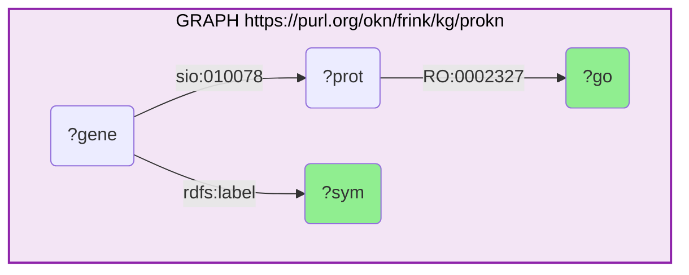

_48025 row(s)_

#### Query 17

_2026-07-20T04:05:41+00:00 · `ubergraph`_

```sparql
PREFIX rdfs: <http://www.w3.org/2000/01/rdf-schema#>
# Labels for every GO term significantly over-represented (BH FDR <= 0.05) in the
# spaceflight signature, from ubergraph.
SELECT ?term ?label WHERE {
  GRAPH <https://purl.org/okn/frink/kg/ubergraph> {
    ?term rdfs:label ?label .
    FILTER(STRSTARTS(STR(?term), "http://purl.obolibrary.org/obo/GO_"))
  }
}
```

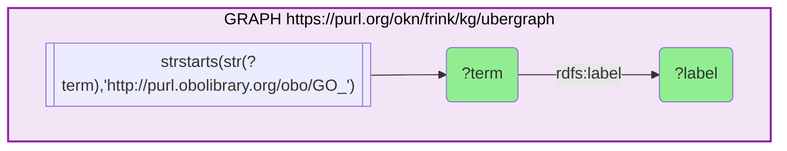

_48199 row(s)_

#### Query 18

_2026-07-20T04:05:44+00:00 · `prokn`_

```sparql
PREFIX rdfs: <http://www.w3.org/2000/01/rdf-schema#>
# Reactome pathway labels from prokn, for the pathway-level enrichment results.
SELECT DISTINCT ?pw ?label WHERE {
  GRAPH <https://purl.org/okn/frink/kg/prokn> {
    ?pw a <http://purl.uniprot.org/core/Pathway> ; rdfs:label ?label .
    FILTER(CONTAINS(STR(?pw), "R-HSA"))
  }
}
```

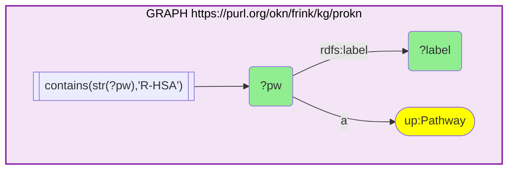

_2848 row(s)_

#### Query 19

_2026-07-20T04:07:10+00:00 · `oard-kg`_

```sparql
PREFIX rdfs: <http://www.w3.org/2000/01/rdf-schema#>
PREFIX biolink: <https://w3id.org/biolink/vocab/>
# oard-kg EHR disease<->phenotype associations for the core bone-loss MONDO terms
# (taken from the logged ubergraph subClassOf* expansion). oard-kg is REIFIED, so
# BOTH biolink:subject and biolink:object positions are UNIONed.
SELECT DISTINCT ?disease ?other ?otherLabel ?role WHERE {
  VALUES ?disease {
    <http://purl.obolibrary.org/obo/MONDO_0005298> <http://purl.obolibrary.org/obo/MONDO_0000837>
    <http://purl.obolibrary.org/obo/MONDO_0001068> <http://purl.obolibrary.org/obo/MONDO_0019019>
    <http://purl.obolibrary.org/obo/MONDO_0008159> <http://purl.obolibrary.org/obo/MONDO_0000757>
    <http://purl.obolibrary.org/obo/MONDO_0024650> <http://purl.obolibrary.org/obo/MONDO_0024651>
    <http://purl.obolibrary.org/obo/MONDO_0017198> <http://purl.obolibrary.org/obo/MONDO_0019707>
    <http://purl.obolibrary.org/obo/MONDO_0019409> <http://purl.obolibrary.org/obo/MONDO_0700047>
    <http://purl.obolibrary.org/obo/MONDO_0100194> <http://purl.obolibrary.org/obo/MONDO_0009820>
    <http://purl.obolibrary.org/obo/MONDO_0044675> <http://purl.obolibrary.org/obo/MONDO_0018315>
  }
  GRAPH <https://purl.org/okn/frink/kg/oard-kg> {
    { ?stmt biolink:subject ?disease ; biolink:object ?other . BIND("disease-as-subject" AS ?role) }
    UNION
    { ?stmt biolink:object ?disease ; biolink:subject ?other . BIND("disease-as-object" AS ?role) }
    OPTIONAL { ?other rdfs:label ?otherLabel }
  }
}
```

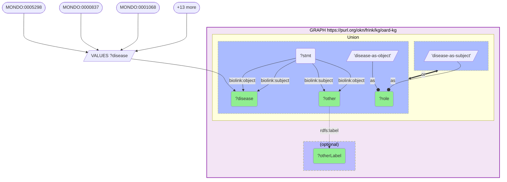

_148 row(s)_

#### Query 20

_2026-07-20T04:07:25+00:00 · `biomarkerkg`_

```sparql
PREFIX rdfs: <http://www.w3.org/2000/01/rdf-schema#>
PREFIX obci: <http://purl.obolibrary.org/obo/>
# biomarkerkg (BiomarkerKB): biomarkers whose clinical role is defined against a
# bone-loss / bone-remodeling disease. Covers every BEST-classification relation the
# KG carries (diagnostic / monitoring / prognostic / risk), plus the assessed entity
# direction and the anatomical sample source.
SELECT DISTINCT ?biomarker ?bmLabel ?rel ?disease ?diseaseLabel ?assessed ?assessedLabel ?direction ?sample ?sampleLabel
WHERE {
  GRAPH <https://purl.org/okn/frink/kg/biomarkerkg> {
    VALUES ?rel { obci:OBCI_1000002 obci:OBCI_1000003 obci:OBCI_1000006 obci:OBCI_1000008 }
    ?biomarker ?rel ?disease .
    ?disease rdfs:label ?diseaseLabel .
    FILTER(REGEX(LCASE(?diseaseLabel), "osteoporo|osteopeni|bone|osteomalacia|osteogenesis imperfecta|paget|osteopetro|fracture|skelet|osteoarthritis"))
    OPTIONAL { ?biomarker rdfs:label ?bmLabel }
    OPTIONAL { ?biomarker obci:OBCI_1000009 ?assessed . BIND("above normal" AS ?direction) ?assessed rdfs:label ?assessedLabel }
    OPTIONAL { ?biomarker obci:OBCI_1000015 ?assessed2 . }
    OPTIONAL { ?biomarker obci:OBCI_1000018 ?sample . ?sample rdfs:label ?sampleLabel }
  }
}
```

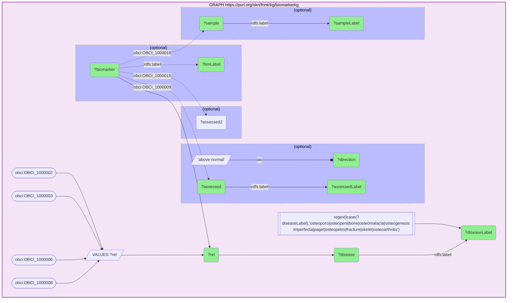

_650 row(s)_

#### Query 21

_2026-07-20T04:07:54+00:00 · `rdkg`_

```sparql
PREFIX rdfs: <http://www.w3.org/2000/01/rdf-schema#>
PREFIX biolink: <https://w3id.org/biolink/vocab/>
# rdkg curated therapeutic layer for the bone-loss disease family: DrugBank drugs /
# treatments that TREAT or are CONTRAINDICATED FOR each MONDO disease. This is the
# approved/investigational-therapy rung of the evidence ladder.
SELECT DISTINCT ?disease ?diseaseLabel ?drug ?drugLabel ?relation
WHERE {
  GRAPH <https://purl.org/okn/frink/kg/rdkg> {
    ?disease a biolink:Disease ; rdfs:label ?diseaseLabel .
    FILTER(REGEX(LCASE(?diseaseLabel), "^osteoporo|osteoporosis|osteopeni|bone mineral densit|osteolysis|osteomalacia|bone resorption|osteogenesis imperfecta|paget disease of bone|osteopetro|bone fragility|brittle bone|hypophosphatasia|bone loss"))
    { ?drug biolink:treats ?disease . BIND("treats" AS ?relation) }
    UNION
    { ?drug biolink:contraindicated_for ?disease . BIND("contraindicated_for" AS ?relation) }
    OPTIONAL { ?drug rdfs:label ?drugLabel }
  }
}
```

```mermaid
graph TD
classDef projected fill:lightgreen;
classDef literal fill:orange;
classDef iri fill:yellow;
  q21v2("?disease"):::projected 
  q21v1("?diseaseLabel"):::projected 
  q21v4("?drug"):::projected 
  q21v5("?drugLabel"):::projected 
  q21v3("?relation"):::projected 
  subgraph q21graph0["GRAPH https://purl.org/okn/frink/kg/rdkg"]
    style q21graph0 fill:#f3e5f5,stroke:#8e24aa,stroke-width:2px,color:#000;
    q21graph0c2(["biolink:Disease"]):::iri 
    q21graph0f0[["regex(lcase(?diseaseLabel),'^osteoporo|osteoporosis|osteopeni|bone mineral densit|osteolysis|osteomalacia|bone resorption|osteogenesis imperfecta|paget disease of bone|osteopetro|bone fragility|brittle bone|hypophosphatasia|bone loss')"]]
    q21graph0f0 --> q21v1
    q21v2 --"a"--> q21graph0c2
    q21v2 --"rdfs:label"--> q21v1
    subgraph q21uniongraph00[" Union "]
    style q21uniongraph00 color:#000;
    subgraph q21uniongraph00l[" "]
      style q21uniongraph00l fill:#abf,stroke-dasharray: 3 3;
      q21v4 --"biolink:contraindicated_for"--> q21v2
      q21graph0bind0[/"'contraindicated_for'"/]
      q21graph0bind0 --as--o q21v3
    end
    subgraph q21uniongraph00r[" "]
      style q21uniongraph00r fill:#abf,stroke-dasharray: 3 3;
      q21v4 --"biolink:treats"--> q21v2
      q21graph0bind1[/"'treats'"/]
      q21graph0bind1 --as--o q21v3
    end
    q21uniongraph00r <== or ==> q21uniongraph00l
    end
    subgraph q21optionalgraph00["(optional)"]
    style q21optionalgraph00 fill:#bbf,stroke-dasharray: 5 5,color:#000;
      q21v4 -."rdfs:label".-> q21v5
    end
  end
```

_301 row(s)_

#### Query 22

_2026-07-20T04:09:20+00:00 · `prokn`_

```sparql
PREFIX rdfs: <http://www.w3.org/2000/01/rdf-schema#>
# prokn UPSTREAM-REGULATOR background: size of every MSigDB regulatory gene set
# (transcription-factor / motif regulon) via biolink:target_for, plus the total gene
# universe. Explicit background for the upstream-regulator over-representation test.
SELECT ?reg ?regLabel (COUNT(DISTINCT ?g) AS ?K) WHERE {
  GRAPH <https://purl.org/okn/frink/kg/prokn> {
    ?reg <https://biolink.github.io/biolink-model/target_for> ?g ; rdfs:label ?regLabel .
    ?g rdfs:label ?sym .
  }
} GROUP BY ?reg ?regLabel
```

```mermaid
graph TD
classDef projected fill:lightgreen;
classDef literal fill:orange;
classDef iri fill:yellow;
  q22v1("?K"):::projected 
  q22v7("?g")
  q22v3("?reg"):::projected 
  q22v2("?regLabel"):::projected 
  q22v8("?sym")
  subgraph q22graph0["GRAPH https://purl.org/okn/frink/kg/prokn"]
    style q22graph0 fill:#f3e5f5,stroke:#8e24aa,stroke-width:2px,color:#000;
    q22v3 --"https://biolink.github.io/biolink-model/target_for"--> q22v7
    q22v7 --"rdfs:label"--> q22v8
    q22v3 --"rdfs:label"--> q22v2
  end
  q22bind0[/"count(?g)"/]
  q22bind0 --as--o q22v1
```

_3852 row(s)_

#### Query 23

_2026-07-20T04:10:21+00:00 · `prokn`_

```sparql
PREFIX rdfs: <http://www.w3.org/2000/01/rdf-schema#>
# prokn UPSTREAM-REGULATOR foreground: how many of the 777 core spaceflight-signature
# genes (DE in >=2 clean Space-Flight-vs-Ground-Control assays) fall in each MSigDB
# transcription-factor / motif regulon. Paired with the logged background query.
SELECT ?reg ?regLabel (COUNT(DISTINCT ?g) AS ?k) WHERE {
  GRAPH <https://purl.org/okn/frink/kg/prokn> {
    VALUES ?sym { "ABCC8" "ABHD15" "ACOT1" "ACOT2" "ACOT4" "ACOXL" "ACSM3" "ACTN3" "ACVR1B" "ACVR1C" "ADAM12" "ADAM33" "ADAMTS1" "ADAMTS2" "ADAMTS4" "ADAMTSL2" "ADIPOQ" "ADORA1" "ADTRP" "AKAP17A" "AKR1C1" "AKR1C2" "AKR1C3" "AKR1C4" "ALAS2" "ALB" "ALDH18A1" "ALDH1A1" "ALDH1A2" "ALDH1L1" "ALDH3B2" "ALPL" "AMER1" "AMPD3" "AMPH" "ANK1" "ANKEF1" "ANKRD1" "ANKS1B" "ANXA13" "AOC3" "APLN" "APOC1" "APOL1" "APOL2" "APOL3" "APOL4" "APOL6" "APOLD1" "ARC" "ARHGDIG" "ARID5A" "ARMC2" "ARMC3" "ARNTL" "ARRDC2" "ARRDC3" "ASIC1" "ASPM" "ATF3" "ATP1A3" "ATP1B2" "ATP1B4" "ATP2A1" "ATP6V0D2" "ATP8" "AURKA" "B3GALT2" "B3GNT3" "B4GALNT4" "BAAT" "BACH2" "BANP" "BCL6" "BDH1" "BMPR1B" "BRINP2" "BRME1" "BTG2" "C1QTNF3" "C1S" "C9" "CA12" "CA14" "CA5B" "CACNA1E" "CACNA1G" "CADPS" "CAMK1G" "CBLN1" "CBS" "CCDC18" "CCDC77" "CCDC80" "CCL2" "CCL23" "CCL7" "CCN1" "CCN5" "CCND1" "CCR1" "CCRL2" "CD209" "CD27" "CD82" "CDH3" "CDHR3" "CDKL1" "CDKN1A" "CDO1" "CEBPD" "CEP85L" "CERS1" "CES1" "CES2" "CGN" "CHAC1" "CHD9" "CHRM2" "CHRNA2" "CHRNA4" "CHRNA9" "CIART" "CIDEA" "CIDEC" "CIRBP" "CITED2" "CITED4" "CLDN5" "CLEC10A" "CLEC4D" "CLEC4M" "CNGA3" "CNTFR" "CNTN1" "CNTNAP4" "COL25A1" "CPNE5" "CPXM1" "CREM" "CRIP3" "CRLF1" "CRTAC1" "CSRNP1" "CSRP3" "CSTA" "CTH" "CTHRC1" "CTPS2" "CTSE" "CXCL1" "CXCL10" "CXCL2" "CXCL3" "CXCR2" "CYFIP2" "CYP2E1" "CYYR1" "DBP" "DCDC2" "DCT" "DDIT3" "DDIT4" "DDIT4L" "DEPP1" "DGAT2" "DHRS9" "DIO2" "DKK2" "DMP1" "DNAH14" "DNAH3" "DNAI1" "DNAJA1" "DNAJB1" "DOC2B" "DOK5" "DSC2" "DSP" "DUSP10" "DUSP18" "DUSP5" "DYNC1I1" "DYNLL1" "E2F8" "EDA2R" "EDAR" "EFR3B" "EGLN3" "EGR1" "EGR2" "EGR3" "EIF4EBP1" "ELL2" "ENAH" "EPHA1" "EPHX1" "EPHX3" "EPN3" "EPOP" "ERC2" "ERFE" "ESCO2" "ESRP2" "ESRRG" "EXPH5" "EYA4" "F2RL1" "FAM214A" "FAM81A" "FAT2" "FBXO32" "FGF5" "FHL3" "FKBP5" "FLT4" "FMO4" "FOLH1" "FOS" "FOSB" "FRAT1" "FSCN2" "FZD4" "FZD9" "G0S2" "GABRR1" "GABRR2" "GAL" "GBP6" "GBX2" "GCK" "GDF1" "GDNF" "GFRA1" "GLB1L2" "GNG4" "GPD1" "GPNMB" "GPR156" "GPR4" "GPRC5C" "GPT2" "GRAMD1B" "GRAMD4" "GREB1" "GREM2" "GRIA1" "GSTA1" "GSTA2" "GSTA3" "GSTA5" "GSTM1" "GSTM2" "GSTM5" "GUCA1B" "GYPA" "GYPB" "GYPE" "HAS1" "HBA1" "HBA2" "HBB" "HBD" "HIF3A" "HLA-A" "HLA-B" "HLA-C" "HLA-E" "HLA-F" "HLA-G" "HMGA1" "HMGCS2" "HPDL" "HPGD" "HPN" "HS3ST5" "HSP90AA1" "HSPA1A" "HSPA1B" "HSPA4L" "HSPE1" "HSPH1" "HTRA1" "IDH1" "IDH2" "IDO1" "IFI16" "IFIT1" "IGDCC3" "IGF2BP3" "IGFBP2" "IGFBP5" "IGHM" "IGSF1" "IGSF10" "IL1B" "IL36G" "IL6R" "IL7R" "ILDR1" "IMPACT" "INMT" "IRF7" "IRGM" "IRS1" "IRS2" "ISG15" "ISLR2" "JUNB" "JUP" "KCNC4" "KCNF1" "KCNG2" "KCNG4" "KCNIP2" "KCNJ15" "KCNMB2" "KLB" "KLF1" "KLHDC8A" "KLHL38" "KLK1" "KLK2" "KLK3" "KRT80" "KSR2" "KY" "LAMA1" "LAMB3" "LAMC2" "LBH" "LCN2" "LCTL" "LEP" "LGALS12" "LILRA1" "LILRA2" "LILRA4" "LILRA5" "LILRA6" "LILRB5" "LMOD2" "LRRC32" "LRRC38" "LRRC52" "LRRC58" "LRRN1" "LRTM2" "LTBP2" "LYPD6" "MAF" "MAFA" "MAFB" "MAFF" "MALL" "MAMDC2" "MAP1A" "MAP3K21" "MAPK10" "MARCHF4" "MCHR1" "MDGA1" "MFAP4" "MGAM" "MGST2" "MLF1" "MMP13" "MMP8" "MPP2" "MPP3" "MT1A" "MT1E" "MT1F" "MT1G" "MT1H" "MT1L" "MT1M" "MT1X" "MT2A" "MTARC1" "MUC4" "MYBPH" "MYC" "MYF6" "MYH1" "MYH3" "MYH6" "MYL2" "MYL3" "MYL4" "MYLK4" "MYOD1" "MYOG" "MYOZ1" "NAPB" "NAV3" "NDRG4" "NDST3" "NEK10" "NEK5" "NELL2" "NET1" "NFE2L3" "NFIL3" "NGFR" "NLRC3" "NLRC5" "NMRK2" "NNAT" "NNT" "NOCT" "NPAS2" "NQO1" "NR1D1" "NR4A1" "NR4A2" "NR4A3" "NREP" "NRG4" "NRIP3" "NRL" "NTSR2" "NUP133" "OAS1" "OAS2" "OAS3" "OASL" "ODF3L2" "OPN1LW" "OPN1MW" "ORM1" "ORM2" "OTUD1" "OXTR" "P3H2" "P4HA1" "PARD6B" "PAX3" "PAX8" "PC" "PCK1" "PCP4L1" "PDE4B" "PDE4D" "PDK4" "PDXK" "PEG3" "PER2" "PER3" "PERM1" "PFKFB3" "PGAP3" "PHF11" "PHYHIP" "PIK3IP1" "PIK3R1" "PIM1" "PKHD1" "PKP1" "PLA2G4E" "PLAUR" "PLB1" "PLCD4" "PLEKHH1" "PLIN1" "PLIN5" "PLK3" "PLN" "PLVAP" "PMP2" "PNMT" "PNPLA2" "PNPLA3" "POLN" "POPDC2" "POSTN" "PPARA" "PPARGC1A" "PPP1R14B" "PPP1R14C" "PPP1R15A" "PPP1R3C" "PRELID2" "PRIMA1" "PRKAG3" "PRKAR2B" "PRKCD" "PRND" "PROM1" "PRUNE2" "PSD4" "PTGER3" "PTPRR" "PTPRT" "PVALB" "RAB11FIP4" "RAB30" "RAD51C" "RAMP1" "RASGEF1B" "RBP7" "RCAN1" "RCOR2" "RDH16" "REEP6" "RET" "RETN" "RETNLB" "RETREG1" "RFX2" "RGCC" "RGS11" "RGS2" "RGS6" "RGS9BP" "RHBDL3" "RHOF" "RMI2" "RNASE2" "RNASE3" "RNF115" "RP1" "RRAD" "RSAD2" "RSC1A1" "RUNX2" "S100A8" "S100A9" "SAMD7" "SBK2" "SBK3" "SCD" "SCN3B" "SEC14L5" "SELE" "SELL" "SERPINA3" "SERPINE1" "SERPINH1" "SESN1" "SH2B2" "SH2D6" "SHROOM2" "SLC13A4" "SLC14A1" "SLC18A1" "SLC20A1" "SLC22A12" "SLC22A2" "SLC22A23" "SLC22A3" "SLC25A13" "SLC25A22" "SLC25A25" "SLC25A42" "SLC28A1" "SLC30A2" "SLC37A1" "SLC39A12" "SLC39A14" "SLC43A1" "SLC43A2" "SLC4A1" "SLC4A3" "SLC5A5" "SLC6A20" "SLC6A9" "SLFN12" "SLFN12L" "SLIT1" "SLN" "SMOC1" "SMTNL2" "SNCA" "SNX22" "SOX21" "SOX4" "SOX9" "SPAG4" "SPHK1" "SPNS3" "SPOCK2" "SPTB" "SRARP" "SRRM4" "SRXN1" "ST3GAL5" "STBD1" "STC2" "STK32A" "STUM" "STYK1" "SUCNR1" "SV2B" "SV2C" "SYNJ2" "SYNM" "SYT12" "TACC2" "TACC3" "TBC1D1" "TBC1D10C" "TBX2" "TENM4" "TENT5C" "TESMIN" "TFRC" "TGM5" "THBS1" "TIAM2" "TMEFF1" "TMEM102" "TMEM108" "TMEM140" "TMEM171" "TMEM233" "TMEM25" "TMEM37" "TMEM45B" "TMEM53" "TMEM63C" "TMEM74B" "TMEM88B" "TNFAIP2" "TNFRSF12A" "TNNT3" "TOB1" "TP53I11" "TPPP3" "TRARG1" "TRHDE" "TRIB3" "TRIM17" "TRIM46" "TRIM63" "TRPM1" "TRPM6" "TSGA10" "TSHZ2" "TSPYL4" "TTBK1" "TTC39A" "TTLL12" "TTPA" "TTYH1" "TXK" "UBE4A" "UCHL1" "UCP3" "UGDH" "UHRF1" "UNC13C" "UNC13D" "UNC93A" "UNG" "UROC1" "USP29" "VASH1" "VASH2" "VEGFA" "VEGFD" "VNN1" "WDR72" "WEE1" "WIF1" "WNT16" "WNT4" "XIRP1" "ZAP70" "ZBP1" "ZC3H12D" "ZC3H6" "ZDBF2" "ZNF136" "ZNF333" "ZNF419" "ZNF423" "ZNF750" "ZNF773" "ZNF845" "ZP2" "ZWINT" }
    ?g rdfs:label ?sym .
    ?reg <https://biolink.github.io/biolink-model/target_for> ?g ; rdfs:label ?regLabel .
  }
} GROUP BY ?reg ?regLabel
```

```mermaid
graph TD
classDef projected fill:lightgreen;
classDef literal fill:orange;
classDef iri fill:yellow;
  q23v8("?g")
  q23v1("?k"):::projected 
  q23v3("?reg"):::projected 
  q23v2("?regLabel"):::projected 
  q23v7("?sym")
  subgraph q23graph0["GRAPH https://purl.org/okn/frink/kg/prokn"]
    style q23graph0 fill:#f3e5f5,stroke:#8e24aa,stroke-width:2px,color:#000;
    q23graph0bind0[/"VALUES ?sym"/]
    q23graph0bind0-->q23v7
    q23graph0bind00(["ABCC8"])
    q23graph0bind00 --> q23graph0bind0
    q23graph0bind01(["ABHD15"])
    q23graph0bind01 --> q23graph0bind0
    q23graph0bind02(["ACOT1"])
    q23graph0bind02 --> q23graph0bind0
    q23graph0bind0more([+679 more])
    q23graph0bind0more --> q23graph0bind0
    q23v3 --"https://biolink.github.io/biolink-model/target_for"--> q23v8
    q23v8 --"rdfs:label"--> q23v7
    q23v3 --"rdfs:label"--> q23v2
  end
  q23bind1[/"count(?g)"/]
  q23bind1 --as--o q23v1
```

_3086 row(s)_

#### Query 24

_2026-07-20T04:10:40+00:00 · `prokn`_

```sparql
PREFIX rdfs: <http://www.w3.org/2000/01/rdf-schema#>
# Universe sizes for the upstream-regulator (MSigDB regulon) enrichment: total prokn
# genes with any regulon membership (N) and how many of the 777 core spaceflight
# signature genes are in that universe (n).
SELECT (COUNT(DISTINCT ?g) AS ?N) WHERE {
  GRAPH <https://purl.org/okn/frink/kg/prokn> {
    ?reg <https://biolink.github.io/biolink-model/target_for> ?g .
    ?g rdfs:label ?sym .
  }
}
```

```mermaid
graph TD
classDef projected fill:lightgreen;
classDef literal fill:orange;
classDef iri fill:yellow;
  q24v1("?N"):::projected 
  q24v3("?g")
  q24v5("?reg")
  q24v4("?sym")
  subgraph q24graph0["GRAPH https://purl.org/okn/frink/kg/prokn"]
    style q24graph0 fill:#f3e5f5,stroke:#8e24aa,stroke-width:2px,color:#000;
    q24v3 --"rdfs:label"--> q24v4
    q24v5 --"https://biolink.github.io/biolink-model/target_for"--> q24v3
  end
  q24bind0[/"count(?g)"/]
  q24bind0 --as--o q24v1
```

_1 row(s)_

#### Query 25

_2026-07-20T04:11:01+00:00 · `prokn`_

```sparql
PREFIX rdfs: <http://www.w3.org/2000/01/rdf-schema#>
# n for the upstream-regulator enrichment: how many of the 777 core spaceflight
# signature genes exist in prokn AND carry at least one MSigDB regulon membership.
SELECT (COUNT(DISTINCT ?g) AS ?n) WHERE {
  GRAPH <https://purl.org/okn/frink/kg/prokn> {
    VALUES ?sym { "ALPL" "AMER1" "ARNTL" "ATP6V0D2" "BMPR1B" "CCN1" "CCN5" "CDKN1A" "CEBPD" "CIART" "CTHRC1" "DBP" "DKK2" "DMP1" "EGR1" "EGR2" "EGR3" "FBXO32" "FKBP5" "FOS" "FOSB" "FZD4" "FZD9" "GREM2" "IGFBP5" "IL1B" "IRS1" "IRS2" "JUNB" "LEP" "LTBP2" "MAF" "MAFB" "MMP13" "MMP8" "MT1X" "MT2A" "MYC" "MYOD1" "MYOG" "NPAS2" "NQO1" "NR1D1" "NR4A1" "NR4A2" "NR4A3" "P4HA1" "PAX3" "PDK4" "PER2" "PER3" "PLIN1" "POSTN" "PPARA" "PPARGC1A" "PRKCD" "RUNX2" "S100A8" "S100A9" "SERPINE1" "SERPINH1" "SOX4" "SOX9" "SPHK1" "THBS1" "TRIM63" "VEGFA" "WIF1" "WNT16" "WNT4" "ZNF423"
      "ACOT1" "ACOT2" "ADIPOQ" "ATF3" "BTG2" "CCL2" "CXCL1" "CXCL2" "CXCL10" "DDIT3" "DDIT4" "GPNMB" "HSPA1A" "HSPA1B" "HSP90AA1" "IDH1" "IDH2" "LCN2" "MMP13" "MYH3" "NNT" "PCK1" "PFKFB3" "PIK3R1" "PIM1" "PLK3" "RCAN1" "RGS2" "SCD" "SELE" "SESN1" "SLC20A1" "SLC39A14" "SRXN1" "STC2" "TFRC" "TNFRSF12A" "TOB1" "TRIB3" "UCP3" "VEGFD" }
    ?g rdfs:label ?sym .
    ?reg <https://biolink.github.io/biolink-model/target_for> ?g .
  }
}
```

```mermaid
graph TD
classDef projected fill:lightgreen;
classDef literal fill:orange;
classDef iri fill:yellow;
  q25v4("?g")
  q25v1("?n"):::projected 
  q25v5("?reg")
  q25v3("?sym")
  subgraph q25graph0["GRAPH https://purl.org/okn/frink/kg/prokn"]
    style q25graph0 fill:#f3e5f5,stroke:#8e24aa,stroke-width:2px,color:#000;
    q25graph0bind0[/"VALUES ?sym"/]
    q25graph0bind0-->q25v3
    q25graph0bind00(["ALPL"])
    q25graph0bind00 --> q25graph0bind0
    q25graph0bind01(["AMER1"])
    q25graph0bind01 --> q25graph0bind0
    q25graph0bind02(["ARNTL"])
    q25graph0bind02 --> q25graph0bind0
    q25graph0bind0more([+109 more])
    q25graph0bind0more --> q25graph0bind0
    q25v4 --"rdfs:label"--> q25v3
    q25v5 --"https://biolink.github.io/biolink-model/target_for"--> q25v4
  end
  q25bind1[/"count(?g)"/]
  q25bind1 --as--o q25v1
```

_1 row(s)_

#### Query 26

_2026-07-20T04:11:44+00:00 · `spoke-genelab`, `prokn`_

```sparql
PREFIX rdf: <http://www.w3.org/1999/02/22-rdf-syntax-ns#>
PREFIX rdfs: <http://www.w3.org/2000/01/rdf-schema#>
PREFIX gl: <https://purl.org/okn/frink/kg/spoke-genelab/schema/>
# n for the upstream-regulator enrichment, derived IN-FEDERATION (no hard-coded gene
# list): the CORE spaceflight signature = human orthologs differentially expressed in
# >=2 of the 14 clean Space-Flight-vs-Ground-Control assays; n = how many of those
# genes prokn carries with at least one MSigDB regulon membership.
SELECT (COUNT(DISTINCT ?g) AS ?n) WHERE {
  { SELECT ?humanSymbol WHERE {
      GRAPH <https://purl.org/okn/frink/kg/spoke-genelab> {
        VALUES ?assay {
          <https://purl.org/okn/frink/kg/spoke-genelab/node/OSD-690-d89cbb20c4b7855f3f955e4adbb6515d>
          <https://purl.org/okn/frink/kg/spoke-genelab/node/OSD-690-f82a89dc82f2903149d2d11cbd6a130d>
          <https://purl.org/okn/frink/kg/spoke-genelab/node/OSD-101-315b0669c5d09d5618b4b25934569250>
          <https://purl.org/okn/frink/kg/spoke-genelab/node/OSD-103-f007f036b41857967d769f4df2450e35>
          <https://purl.org/okn/frink/kg/spoke-genelab/node/OSD-104-ec6e344401cc5008b3cb12c08cad9c7f>
          <https://purl.org/okn/frink/kg/spoke-genelab/node/OSD-105-cfde96b31f3c39139e213c293fde11e0>
          <https://purl.org/okn/frink/kg/spoke-genelab/node/OSD-326-0fc1dbed094071ca1f2f41bddd0ac5a7>
          <https://purl.org/okn/frink/kg/spoke-genelab/node/OSD-419-09b86865fee0ca01d066824227b7a93d>
          <https://purl.org/okn/frink/kg/spoke-genelab/node/OSD-422-c44d743ac966082af0d193a0b7258e3e>
          <https://purl.org/okn/frink/kg/spoke-genelab/node/OSD-576-df35787540b0077305f2739d53c076ed>
          <https://purl.org/okn/frink/kg/spoke-genelab/node/OSD-665-a4167284b0876ec8d3daba0d0e4a567f>
          <https://purl.org/okn/frink/kg/spoke-genelab/node/OSD-666-c82351edcee1ddd508c2e56d39337eaf>
          <https://purl.org/okn/frink/kg/spoke-genelab/node/OSD-770-10b02918dd6677725691e274c83a7eaf>
          <https://purl.org/okn/frink/kg/spoke-genelab/node/OSD-99-69f6c3ba8382c8668e921659326759d7>
        }
        ?stmt rdf:subject ?assay ; rdf:predicate gl:MEASURED_DIFFERENTIAL_EXPRESSION_ASmMG ;
              rdf:object ?gene ; gl:log2fc ?l ; gl:adj_p_value ?p .
        FILTER(?p <= 0.05 && ABS(?l) >= 1)
        ?gene gl:IS_ORTHOLOG_MGiG ?hg . ?hg gl:symbol ?humanSymbol .
      }
    } GROUP BY ?humanSymbol HAVING (COUNT(DISTINCT ?assay) >= 2) }
  GRAPH <https://purl.org/okn/frink/kg/prokn> {
    ?g rdfs:label ?humanSymbol .
    ?reg <https://biolink.github.io/biolink-model/target_for> ?g .
  }
}
```

```mermaid
graph TD
classDef projected fill:lightgreen;
classDef literal fill:orange;
classDef iri fill:yellow;
  q26v7("?assay")
  q26v11("?g")
  q26v9("?gene")
  q26v10("?hg")
  q26v3("?humanSymbol")
  q26v6("?l")
  q26v1("?n"):::projected 
  q26v5("?p")
  q26v12("?reg")
  q26v8("?stmt")
  q26f0[["count(?assay) >= '2^^xsd:integer'"]]
  subgraph q26graph0["GRAPH https://purl.org/okn/frink/kg/spoke-genelab"]
    style q26graph0 fill:#f3e5f5,stroke:#8e24aa,stroke-width:2px,color:#000;
    q26graph0c16(["gl:MEASURED_DIFFERENTIAL_EXPRESSION_ASmMG"]):::iri 
    q26graph0f1[["?p <= '0.05^^xsd:decimal' && abs(?l) >= '1^^xsd:integer'"]]
    q26graph0f1 --> q26v5
    q26graph0f1 --> q26v6
    q26graph0bind0[/"VALUES ?assay"/]
    q26graph0bind0-->q26v7
    q26graph0bind00(["https://purl.org/okn/frink/kg/spoke-genelab/node/OSD-690-d89cbb20c4b7855f3f955e4adbb6515d"])
    q26graph0bind00 --> q26graph0bind0
    q26graph0bind01(["https://purl.org/okn/frink/kg/spoke-genelab/node/OSD-690-f82a89dc82f2903149d2d11cbd6a130d"])
    q26graph0bind01 --> q26graph0bind0
    q26graph0bind02(["https://purl.org/okn/frink/kg/spoke-genelab/node/OSD-101-315b0669c5d09d5618b4b25934569250"])
    q26graph0bind02 --> q26graph0bind0
    q26graph0bind0more([+11 more])
    q26graph0bind0more --> q26graph0bind0
    q26v8 --"rdf:predicate"--> q26graph0c16
    q26v8 --"rdf:object"--> q26v9
    q26v8 --"rdf:subject"--> q26v7
    q26v8 --"gl:adj_p_value"--> q26v5
    q26v8 --"gl:log2fc"--> q26v6
    q26v9 --"gl:IS_ORTHOLOG_MGiG"--> q26v10
    q26v10 --"gl:symbol"--> q26v3
  end
  subgraph q26graph1["GRAPH https://purl.org/okn/frink/kg/prokn"]
    style q26graph1 fill:#f3e5f5,stroke:#8e24aa,stroke-width:2px,color:#000;
    q26v11 --"rdfs:label"--> q26v3
    q26v12 --"https://biolink.github.io/biolink-model/target_for"--> q26v11
  end
  q26bind1[/"count(?assay)"/]
  q26bind1 --as--o q26v1
```

_1 row(s)_

#### Query 27

_2026-07-20T04:12:11+00:00 · `spoke-okn`_

```sparql
PREFIX rdfs: <http://www.w3.org/2000/01/rdf-schema#>
PREFIX so: <https://purl.org/okn/frink/kg/spoke-okn/schema/>
# spoke-okn COMPOUND -> GENE perturbation layer for the bone-core spaceflight genes.
# NOTE: these are toxicogenomic / transcriptional-perturbation edges (a compound
# increases or decreases the gene), NOT approved therapies - a lower evidence rung
# than rdkg's DrugBank 'treats'. Used only to generate repurposing hypotheses.
SELECT ?compound ?compoundLabel ?maxPhase ?gene ?geneSymbol ?direction
WHERE {
  GRAPH <https://purl.org/okn/frink/kg/spoke-okn> {
    VALUES ?geneSymbol { "ALPL" "WNT16" "RUNX2" "SP7" "CTSK" "PTH1R" "MMP13" "MMP9" "MMP2" "MMP14"
                         "SPP1" "IBSP" "BGLAP" "DMP1" "MEPE" "COL1A1" "SERPINH1" "POSTN" "SOX9"
                         "PPARG" "CEBPD" "CDKN1A" "FOS" "FOSB" "JUNB" "NR4A1" "PPARGC1A" "VEGFA"
                         "ACP5" "ATP6V0D2" "TNFRSF12A" "THBS1" "LEP" "ADIPOQ" "IL1B" "TNF" "LCN2"
                         "MT2A" "NQO1" "SRXN1" "FKBP5" "PDK4" "FBXO32" "TRIM63" "MSTN" "IGFBP5" }
    ?gene rdfs:label ?geneSymbol .
    { ?compound so:UPREGULATES_CuG ?gene . BIND("upregulates" AS ?direction) }
    UNION
    { ?compound so:DOWNREGULATES_CdG ?gene . BIND("downregulates" AS ?direction) }
    ?compound rdfs:label ?compoundLabel .
    OPTIONAL { ?compound so:max_phase ?maxPhase }
  }
}
```

```mermaid
graph TD
classDef projected fill:lightgreen;
classDef literal fill:orange;
classDef iri fill:yellow;
  q27v4("?compound"):::projected 
  q27v5("?compoundLabel"):::projected 
  q27v3("?direction"):::projected 
  q27v2("?gene"):::projected 
  q27v1("?geneSymbol"):::projected 
  q27v6("?maxPhase"):::projected 
  subgraph q27graph0["GRAPH https://purl.org/okn/frink/kg/spoke-okn"]
    style q27graph0 fill:#f3e5f5,stroke:#8e24aa,stroke-width:2px,color:#000;
    q27graph0bind0[/"VALUES ?geneSymbol"/]
    q27graph0bind0-->q27v1
    q27graph0bind00(["ALPL"])
    q27graph0bind00 --> q27graph0bind0
    q27graph0bind01(["WNT16"])
    q27graph0bind01 --> q27graph0bind0
    q27graph0bind02(["RUNX2"])
    q27graph0bind02 --> q27graph0bind0
    q27graph0bind0more([+43 more])
    q27graph0bind0more --> q27graph0bind0
    q27v2 --"rdfs:label"--> q27v1
    subgraph q27uniongraph00[" Union "]
    style q27uniongraph00 color:#000;
    subgraph q27uniongraph00l[" "]
      style q27uniongraph00l fill:#abf,stroke-dasharray: 3 3;
      q27v4 --"so:DOWNREGULATES_CdG"--> q27v2
      q27graph0bind1[/"'downregulates'"/]
      q27graph0bind1 --as--o q27v3
    end
    subgraph q27uniongraph00r[" "]
      style q27uniongraph00r fill:#abf,stroke-dasharray: 3 3;
      q27v4 --"so:UPREGULATES_CuG"--> q27v2
      q27graph0bind2[/"'upregulates'"/]
      q27graph0bind2 --as--o q27v3
    end
    q27uniongraph00r <== or ==> q27uniongraph00l
    end
    q27v4 --"rdfs:label"--> q27v5
    subgraph q27optionalgraph00["(optional)"]
    style q27optionalgraph00 fill:#bbf,stroke-dasharray: 5 5,color:#000;
      q27v4 -."so:max_phase".-> q27v6
    end
  end
```

_39 row(s)_

#### Query 28

_2026-07-20T04:12:36+00:00 · `digcfdekg`_

```sparql
PREFIX rdf: <http://www.w3.org/1999/02/22-rdf-syntax-ns#>
PREFIX rdfs: <http://www.w3.org/2000/01/rdf-schema#>
PREFIX dig: <https://purl.org/okn/frink/kg/digcfdekg/schema/>
# Full digcfdekg gene sets for the bone-trait panel (BMD sites, fracture, EHR-defined
# osteoporosis, and the Mendelian bone-dysplasia comparators). Used for (a) disease /
# trait gene-set enrichment of the spaceflight signature and (b) the terrestrial-vs-
# spaceflight signature comparison.
SELECT ?trait ?traitLabel ?gene ?geneLabel ?weight WHERE {
  GRAPH <https://purl.org/okn/frink/kg/digcfdekg> {
    VALUES ?trait {
      <http://www.ebi.ac.uk/efo/EFO_0009270> <http://www.ebi.ac.uk/efo/EFO_0007785>
      <http://www.ebi.ac.uk/efo/EFO_0007701> <http://www.ebi.ac.uk/efo/EFO_0007702>
      <http://www.ebi.ac.uk/efo/EFO_0007620> <http://www.ebi.ac.uk/efo/EFO_0007621>
      <http://www.ebi.ac.uk/efo/EFO_0007933> <http://www.ebi.ac.uk/efo/EFO_0020095>
      <http://purl.obolibrary.org/obo/OBA_2045559> <http://purl.obolibrary.org/obo/MONDO_0005327>
      <https://purl.org/okn/frink/kg/digcfdekg/node/trait/9e16eca420eee5f32d37>
      <https://purl.org/okn/frink/kg/digcfdekg/node/trait/8a1c7ae8b81e9b648213>
      <https://purl.org/okn/frink/kg/digcfdekg/node/trait/ce9fab5cfc433881fa71>
      <https://purl.org/okn/frink/kg/digcfdekg/node/trait/e491549d91b916e24445>
      <https://purl.org/okn/frink/kg/digcfdekg/node/trait/eac7647078ccfdee1d15>
      <https://purl.org/okn/frink/kg/digcfdekg/node/trait/f536cb6072cfe6124034>
      <https://purl.org/okn/frink/kg/digcfdekg/node/trait/4c9a9bb4a649f5e9348c>
      <https://purl.org/okn/frink/kg/digcfdekg/node/trait/2cf19057fbed004c20dd>
      <https://purl.org/okn/frink/kg/digcfdekg/node/trait/e833c63364fe37d83622>
      <https://purl.org/okn/frink/kg/digcfdekg/node/trait/b9d2e23e2c4ab2bc7ef9>
      <https://purl.org/okn/frink/kg/digcfdekg/node/trait/822d2a7dd4120de88ed8>
      <http://www.orpha.net/ORDO/Orphanet_93446> <http://www.orpha.net/ORDO/Orphanet_666>
      <http://www.orpha.net/ORDO/Orphanet_2781> <http://www.orpha.net/ORDO/Orphanet_93447>
      <http://www.orpha.net/ORDO/Orphanet_93444>
    }
    ?stmt rdf:subject ?gene ; rdf:predicate dig:geneToTrait ; rdf:object ?trait ; dig:weight ?weight .
    ?trait rdfs:label ?traitLabel .
    OPTIONAL { ?gene rdfs:label ?geneLabel }
  }
}
```

```mermaid
graph TD
classDef projected fill:lightgreen;
classDef literal fill:orange;
classDef iri fill:yellow;
  q28v3("?gene"):::projected 
  q28v6("?geneLabel"):::projected 
  q28v2("?stmt")
  q28v1("?trait"):::projected 
  q28v5("?traitLabel"):::projected 
  q28v4("?weight"):::projected 
  subgraph q28graph0["GRAPH https://purl.org/okn/frink/kg/digcfdekg"]
    style q28graph0 fill:#f3e5f5,stroke:#8e24aa,stroke-width:2px,color:#000;
    q28graph0c28(["dig:geneToTrait"]):::iri 
    q28graph0bind0[/"VALUES ?trait"/]
    q28graph0bind0-->q28v1
    q28graph0bind00(["efo:0009270"])
    q28graph0bind00 --> q28graph0bind0
    q28graph0bind01(["efo:0007785"])
    q28graph0bind01 --> q28graph0bind0
    q28graph0bind02(["efo:0007701"])
    q28graph0bind02 --> q28graph0bind0
    q28graph0bind0more([+23 more])
    q28graph0bind0more --> q28graph0bind0
    q28v2 --"rdf:predicate"--> q28graph0c28
    q28v2 --"rdf:object"--> q28v1
    q28v2 --"rdf:subject"--> q28v3
    q28v2 --"dig:weight"--> q28v4
    q28v1 --"rdfs:label"--> q28v5
    subgraph q28optionalgraph00["(optional)"]
    style q28optionalgraph00 fill:#bbf,stroke-dasharray: 5 5,color:#000;
      q28v3 -."rdfs:label".-> q28v6
    end
  end
```

_9353 row(s)_

#### Query 29

_2026-07-20T04:12:44+00:00 · `digcfdekg`_

```sparql
PREFIX rdf: <http://www.w3.org/1999/02/22-rdf-syntax-ns#>
PREFIX dig: <https://purl.org/okn/frink/kg/digcfdekg/schema/>
# Explicit BACKGROUND for the digcfdekg trait gene-set enrichment: every gene that
# carries at least one gene->trait inference in CFDE REVEAL (the universe a bone-trait
# gene could have been drawn from).
SELECT (COUNT(DISTINCT ?gene) AS ?N) WHERE {
  GRAPH <https://purl.org/okn/frink/kg/digcfdekg> {
    ?stmt rdf:subject ?gene ; rdf:predicate dig:geneToTrait ; rdf:object ?t .
  }
}
```

```mermaid
graph TD
classDef projected fill:lightgreen;
classDef literal fill:orange;
classDef iri fill:yellow;
  q29v1("?N"):::projected 
  q29v5("?gene")
  q29v3("?stmt")
  q29v4("?t")
  subgraph q29graph0["GRAPH https://purl.org/okn/frink/kg/digcfdekg"]
    style q29graph0 fill:#f3e5f5,stroke:#8e24aa,stroke-width:2px,color:#000;
    q29graph0c2(["dig:geneToTrait"]):::iri 
    q29v3 --"rdf:predicate"--> q29graph0c2
    q29v3 --"rdf:object"--> q29v4
    q29v3 --"rdf:subject"--> q29v5
  end
  q29bind0[/"count(?gene)"/]
  q29bind0 --as--o q29v1
```

_1 row(s)_

#### Query 30

_2026-07-20T04:13:47+00:00 · `prokn`_

```sparql
PREFIX rdfs: <http://www.w3.org/2000/01/rdf-schema#>
# prokn disease layer: which bone-loss / bone-remodeling diseases does the Protein
# Knowledge Network carry, and via which identifier? Establishes prokn's coverage of
# the anchor disease family before joining protein evidence onto it.
SELECT DISTINCT ?d ?lbl WHERE {
  GRAPH <https://purl.org/okn/frink/kg/prokn> {
    ?d rdfs:label ?lbl .
    FILTER(REGEX(LCASE(STR(?lbl)), "osteoporo|osteopeni|bone mineral densit|osteomalacia|osteogenesis imperfecta|paget disease of bone|osteopetro"))
    FILTER(STRSTARTS(STR(?d), "http://purl.obolibrary.org/obo/MONDO_") || STRSTARTS(STR(?d), "http://purl.uniprot.org/diseases/") || STRSTARTS(STR(?d), "https://www.omim.org/"))
  }
}
```

```mermaid
graph TD
classDef projected fill:lightgreen;
classDef literal fill:orange;
classDef iri fill:yellow;
  q30v2("?d"):::projected 
  q30v1("?lbl"):::projected 
  subgraph q30graph0["GRAPH https://purl.org/okn/frink/kg/prokn"]
    style q30graph0 fill:#f3e5f5,stroke:#8e24aa,stroke-width:2px,color:#000;
    q30graph0f0[["regex(lcase(str(?lbl)),'osteoporo|osteopeni|bone mineral densit|osteomalacia|osteogenesis imperfecta|paget disease of bone|osteopetro') && (strstarts(str(?d),'http://purl.obolibrary.org/obo/MONDO_') || strstarts(str(?d),'http://purl.uniprot.org/diseases/') || strstarts(str(?d),'https://www.omim.org/'))"]]
    q30graph0f0 --> q30v1
    q30graph0f0 --> q30v2
    q30v2 --"rdfs:label"--> q30v1
  end
```

_49 row(s)_

#### Query 31

_2026-07-20T04:14:22+00:00 · `prokn`_

```sparql
PREFIX rdfs: <http://www.w3.org/2000/01/rdf-schema#>
PREFIX rdf: <http://www.w3.org/1999/02/22-rdf-syntax-ns#>
PREFIX biolink: <https://biolink.github.io/biolink-model/>
# prokn curated entity->disease evidence for the bone-loss disease family (OMIM- and
# MONDO-keyed), captured BOTH as the direct biolink:associated_with edge and as the
# object of prokn's reified evidence statements, with the entity's label.
SELECT DISTINCT ?disease ?diseaseLabel ?entity ?entityLabel ?route WHERE {
  GRAPH <https://purl.org/okn/frink/kg/prokn> {
    VALUES ?disease {
      <https://www.omim.org/entry/166710> <https://www.omim.org/entry/601884>
      <https://www.omim.org/entry/603506> <https://www.omim.org/entry/606990>
      <https://www.omim.org/entry/612286> <https://www.omim.org/entry/300910>
      <https://www.omim.org/entry/167250> <https://www.omim.org/entry/616833>
      <https://www.omim.org/entry/603499> <https://www.omim.org/entry/MTHU014153>
      <https://www.omim.org/entry/MTHU064523> <https://www.omim.org/entry/MTHU072304>
      <http://purl.obolibrary.org/obo/MONDO_0008146> <http://purl.obolibrary.org/obo/MONDO_0008147>
      <http://purl.obolibrary.org/obo/MONDO_0012591> <http://purl.obolibrary.org/obo/MONDO_0020645>
    }
    ?disease rdfs:label ?diseaseLabel .
    { ?entity biolink:associated_with ?disease . BIND("associated_with" AS ?route) }
    UNION
    { ?stmt rdf:object ?disease ; rdf:subject ?entity . BIND("reified statement" AS ?route) }
    OPTIONAL { ?entity rdfs:label ?entityLabel }
  }
}
```

```mermaid
graph TD
classDef projected fill:lightgreen;
classDef literal fill:orange;
classDef iri fill:yellow;
  q31v1("?disease"):::projected 
  q31v2("?diseaseLabel"):::projected 
  q31v4("?entity"):::projected 
  q31v6("?entityLabel"):::projected 
  q31v3("?route"):::projected 
  q31v5("?stmt")
  subgraph q31graph0["GRAPH https://purl.org/okn/frink/kg/prokn"]
    style q31graph0 fill:#f3e5f5,stroke:#8e24aa,stroke-width:2px,color:#000;
    q31graph0bind0[/"VALUES ?disease"/]
    q31graph0bind0-->q31v1
    q31graph0bind00(["https://www.omim.org/entry/166710"])
    q31graph0bind00 --> q31graph0bind0
    q31graph0bind01(["https://www.omim.org/entry/601884"])
    q31graph0bind01 --> q31graph0bind0
    q31graph0bind02(["https://www.omim.org/entry/603506"])
    q31graph0bind02 --> q31graph0bind0
    q31graph0bind0more([+13 more])
    q31graph0bind0more --> q31graph0bind0
    q31v1 --"rdfs:label"--> q31v2
    subgraph q31uniongraph00[" Union "]
    style q31uniongraph00 color:#000;
    subgraph q31uniongraph00l[" "]
      style q31uniongraph00l fill:#abf,stroke-dasharray: 3 3;
      q31v5 --"rdf:object"--> q31v1
      q31v5 --"rdf:subject"--> q31v4
      q31graph0bind1[/"'reified statement'"/]
      q31graph0bind1 --as--o q31v3
    end
    subgraph q31uniongraph00r[" "]
      style q31uniongraph00r fill:#abf,stroke-dasharray: 3 3;
      q31v4 --"biolink:associated_with"--> q31v1
      q31graph0bind2[/"'associated_with'"/]
      q31graph0bind2 --as--o q31v3
    end
    q31uniongraph00r <== or ==> q31uniongraph00l
    end
    subgraph q31optionalgraph00["(optional)"]
    style q31optionalgraph00 fill:#bbf,stroke-dasharray: 5 5,color:#000;
      q31v4 -."rdfs:label".-> q31v6
    end
  end
```

_1600 row(s)_

#### Query 32

_2026-07-20T04:14:48+00:00 · `prokn`_

```sparql
PREFIX rdfs: <http://www.w3.org/2000/01/rdf-schema#>
PREFIX biolink: <https://biolink.github.io/biolink-model/>
# Explicit BACKGROUND for the CURATED (Mendelian) bone gene-set enrichment: every
# prokn entity that carries at least one biolink:associated_with disease link and has
# a gene-symbol-shaped label. This is the universe for the discriminating rare-disease
# test, complementing the permissive GWAS trait sets from digcfdekg.
SELECT (COUNT(DISTINCT ?sym) AS ?N) WHERE {
  GRAPH <https://purl.org/okn/frink/kg/prokn> {
    ?entity biolink:associated_with ?d ; rdfs:label ?sym .
    FILTER(REGEX(STR(?sym), "^[A-Z][A-Z0-9]{1,9}(-[A-Z0-9]{1,4})?$"))
  }
}
```

```mermaid
graph TD
classDef projected fill:lightgreen;
classDef literal fill:orange;
classDef iri fill:yellow;
  q32v1("?N"):::projected 
  q32v5("?d")
  q32v4("?entity")
  q32v3("?sym")
  subgraph q32graph0["GRAPH https://purl.org/okn/frink/kg/prokn"]
    style q32graph0 fill:#f3e5f5,stroke:#8e24aa,stroke-width:2px,color:#000;
    q32graph0f0[["regex(str(?sym),'^#91;A-Z#93;#91;A-Z0-9#93;{1,9}(-#91;A-Z0-9#93;{1,4})?$')"]]
    q32graph0f0 --> q32v3
    q32v4 --"rdfs:label"--> q32v3
    q32v4 --"biolink:associated_with"--> q32v5
  end
  q32bind0[/"count(?sym)"/]
  q32bind0 --as--o q32v1
```

_1 row(s)_

#### Query 33

_2026-07-20T04:15:13+00:00 · `prokn`_

```sparql
PREFIX rdfs: <http://www.w3.org/2000/01/rdf-schema#>
PREFIX biolink: <https://biolink.github.io/biolink-model/>
# The explicit BACKGROUND GENE LIST for the curated (Mendelian) bone gene-set test:
# every gene-symbol-shaped prokn entity with at least one disease association. Pulled
# in full so the signature can be intersected with the universe before testing.
SELECT DISTINCT ?sym WHERE {
  GRAPH <https://purl.org/okn/frink/kg/prokn> {
    ?entity biolink:associated_with ?d ; rdfs:label ?sym .
    FILTER(REGEX(STR(?sym), "^[A-Z][A-Z0-9]{1,9}(-[A-Z0-9]{1,4})?$"))
  }
}
```

```mermaid
graph TD
classDef projected fill:lightgreen;
classDef literal fill:orange;
classDef iri fill:yellow;
  q33v3("?d")
  q33v2("?entity")
  q33v1("?sym"):::projected 
  subgraph q33graph0["GRAPH https://purl.org/okn/frink/kg/prokn"]
    style q33graph0 fill:#f3e5f5,stroke:#8e24aa,stroke-width:2px,color:#000;
    q33graph0f0[["regex(str(?sym),'^#91;A-Z#93;#91;A-Z0-9#93;{1,9}(-#91;A-Z0-9#93;{1,4})?$')"]]
    q33graph0f0 --> q33v1
    q33v2 --"rdfs:label"--> q33v1
    q33v2 --"biolink:associated_with"--> q33v3
  end
```

_9925 row(s)_
