# Type 2 Diabetes — Federated Knowledge-Graph Map: Reproducibility Record

- **Date:** 2026-07-19
- **Model:** claude-opus-4-8
- **SPARQL endpoint:** https://apps.okn.us/federation/sparql
- **Generated by:** mcp-okn v0.1.0
- **Elapsed time:** 2026-07-19 18:10–21:07 UTC (2h 57m)
- **Contents:** 22 queries

## Prompt

Conduct a reproducible, multi-knowledge-graph integrative study of Type 2 Diabetes (T2D) to generate a comprehensive, evidence-backed map of its molecular biology, genetics, clinical manifestations, epidemiology, and therapeutic landscape.
Follow the `/okn-bioanalysis` workflow and produce the final report using `/okn-report-style`.
Objectives

1. Characterize Type 2 Diabetes and its subtypes
   * Identify the major forms, subtypes, and clinical classifications of Type 2 Diabetes.
   * Account for synonymous disease names, ontology mappings, and identifier crosswalks across all knowledge graphs.
   * Document differences in disease definitions, diagnostic criteria, and ontology coverage where applicable.
2. Integrate evidence across knowledge graphs
   * Search broadly across all relevant knowledge graphs available through mcp-okn.
   * Harmonize identifiers for genes, variants, pathways, diseases, drugs, biomarkers, tissues, and phenotypes.
   * Use cross-graph joins whenever they provide complementary evidence.
   * Document which knowledge graphs contributed to each finding.
3. Identify molecular mechanisms
   * Construct a comprehensive molecular profile organized by entity type, including:
      * protein-coding genes
      * non-coding RNAs (kept separate)
      * genetic variants
      * pathways and gene sets
      * biological processes
      * molecular functions
      * upstream regulators
   * Rank genes, variants, and pathways by the strength and consistency of evidence across sources.
4. Characterize disease-associated molecular activity
   * Identify genes with altered expression or activity in Type 2 Diabetes.
   * Record:
      * tissue or organ
      * cell type
      * direction of change (upregulated/downregulated)
      * experimental context
      * supporting datasets
   * Highlight genes consistently dysregulated across multiple tissues or studies.
5. Therapeutic landscape
   * Identify approved drugs, investigational therapeutics, biologics, and emerging treatment targets.
   * Associate drugs with their molecular targets, pathways, mechanisms of action, and supporting evidence.
   * Identify opportunities for drug repurposing suggested by cross-graph evidence.
6. Clinical features and biomarkers
   * Identify:
      * clinical phenotypes
      * diagnostic biomarkers
      * prognostic biomarkers
      * disease complications
      * laboratory measurements
   * Rank biomarkers according to evidence strength and clinical utility.
7. Epidemiology and population health
   * Characterize the prevalence of Type 2 Diabetes across geographic regions.
   * Integrate prevalence data with:
      * demographic variables
      * socioeconomic indicators
      * environmental factors
      * social determinants of health
   * Identify statistically supported correlations and geographic patterns.
   * Generate a prevalence map highlighting regional variation.
8. Evidence assessment
   * For every reported relationship, record separately:
      * supporting knowledge graph(s)
      * relationship type
      * confidence or effect size (when available)
      * evidence type:
         * curated knowledge
         * statistical association
         * genetic association
         * differential molecular activity
         * pathway membership
         * literature-derived evidence
   * Preserve these evidence categories independently rather than merging them into a single confidence score.
9. Consensus analysis
   * Rank findings according to cross-source agreement.
   * Highlight the highest-confidence consensus set.
   * Identify conflicting evidence, knowledge gaps, ontology mismatches, and likely underrepresented areas.

## Notes

**IMPORTANT — incomplete auto-logged query record.** The mcp-okn query log was cleared twice during this
study: once by a parallel analysis branch, and once by a server restart. The 22 queries reproduced
verbatim below are the FINAL re-run of the study's core supporting queries; every one of their row
counts was re-verified against the values used in the report (spec §7). A further set of branch
queries could not be re-logged before this record was generated; their exact SPARQL and their
identifying predicates are transcribed in spec §9 so the analysis remains auditable end to end.

Deliverables: `Diabetes_report.md` / `.html` (`check_report_parity` PASS), `Diabetes_results.xlsx`
(22 sheets), `figures/fig1`–`fig8`, `scripts/`. Literature comparison in
[Diabetes_literature_comparison.md](https://github.com/sbl-sdsc/mcp-okn/blob/main/docs/examples/Diabetes/Diabetes_literature_comparison.md)
(28 supported / 15 novel / 4 contradicted, 74 unique PMIDs).

## Knowledge graphs used

Queried and logged in this record: `ubergraph`, `digcfdekg`, `spoke-okn`, `biomarkerkg`, `prokn`,
`pankgraph`, `rdkg`.

Queried earlier in the study, with their queries transcribed in spec §9 (log cleared before this
record was generated): `gene-expression-atlas-okn`, `oard-kg`, `biohealth`, `biobricks-ice`,
`biobricks-aopwiki`, `biobricks-mesh`, `biobricks-pubchem-annotations`, `nde`, `spatialkg`,
`medical-device-kg`, and the two declared negatives `ncipidkg` and `evoweb`.

## Replicator specification

### 1. Disease scope and identifier resolution
- **Anchor:** `MONDO:0005148` (type 2 diabetes mellitus). Subtree via ubergraph `rdfs:subClassOf*` → **7 terms** (+ MONDO:0005827 lipoatrophic diabetes; MONDO:0011027 / 0011072 / 0011363 / 0011955 / 0014488 = NIDDM1–5).
- **Context superclass:** `MONDO:0005015` (diabetes mellitus) → **45 MONDO terms**. Retrieved separately; never merged into T2D counts.
- **Crosswalks** (one ubergraph query, `skos:exactMatch` UNION `oboInOwl:hasDbXref`, 75 rows): DOID:9352 · EFO:0001360 · OMIM:125853 · UMLS:C0011860 · MeSH:D003924 · SCTID:44054006 · NCIT:C26747 · ICD10CM:E11 · ICD11 119724091 · MEDGEN:41523.
- **Per-KG anchors actually used** (each KG keys diabetes differently): rdkg + biomarkerkg = MONDO node IRIs; prokn = `https://www.ncbi.nlm.nih.gov/mesh/?term=D003924`; spoke-okn = `DOID_9351` (NO T2D node exists); oard-kg = `HP_0005978`; biohealth = UMLS `C0011860` / `C0011849`; digcfdekg = MONDO/EFO/Orphanet/HP/local trait IRIs.
- **Rejected bridge:** `identifier-mappings` maps T2D to `MONDO:0015887` ("obsolete rare diabetes mellitus type 2"). Not used; ubergraph used instead.

### 2. Evidence streams (kept separate, never merged)
Disease-anchored (count toward the consensus core):
- **statistical** — digcfdekg reified `?stmt rdf:subject ?gene ; rdf:predicate dig:geneToTrait ; rdf:object MONDO_0005148 ; dig:weight ?w` (PIGEAN combined score) → 849 genes.
- **curated** — spoke-okn `DOID_9351 sp:ASSOCIATES_DaG ?gene` → 678 genes; prokn `?gene biolink:associated_with <MeSH T2D>` (source DDKG_CLINVAR) → 13 genes (ABCC8, ENPP1, GCK, HNF1A, HNF1B, HNF4A, IRS1, KCNJ11, PDX1, PPARG, RBPJ, SLC2A2, WFS1).
- **genetic** — biomarkerkg `?b OBCI:1000008|1000002|1000003|1000006 MONDO_0005148`; gene + rsID parsed from the biomarker `rdfs:label` with the regex `dbSNP:(rs\d+) sequence variation in gene ([A-Za-z0-9\-\._]+)/NCBI:(\d*)` → 2,318 rsID–gene pairs; 1,028 coding genes; **184 non-coding loci** (empty Entrez group) kept in a SEPARATE layer.

Molecular-activity (context only; do NOT count toward the core):
- **differential expression** — gene-expression-atlas-okn T2D records with `direction`, `log2fc`, `adj_p_value` → 78 rows / 74 genes.
- **chromatin** — pankgraph `type_2_diabetes__OCR_GeneActivityScore_mean` vs `non_diabetic__OCR_GeneActivityScore_mean`; log2 ratio; |log2 ratio| ≥ 1 to flag → 123,931 rows / 17,922 genes / 7 CL cell types.
- **molecular QTL** — pankgraph islet/pancreas eQTL, `pip` ≥ 0.9 to flag → 23,256 rows.

### 3. Consensus, scoring and tiers
- **Universe** = 2,117 genes with ≥1 disease-anchored stream. **Core** = 381 genes with ≥2.
- `n_disease_streams` = (pigean_weight present) + (spokeokn_DaG) + (n_gwas_variants>0) + (prokn_clinvar). Max 4; observed 1:1736, 2:320, 3:52, 4:9.
- **Integrated score** = 3.0·ev_curated + 2.5·ev_genetic + 2.0·clip(pigean_weight/10·2, 0, 2) + 1.5·ev_diffexpr + 1.0·ev_qtl + 1.5·ev_druggable + 1.0·ev_aop + 0.5·ev_exposure, with ev_curated ∈ {0,1,2} (prokn ClinVar + spoke-okn) and ev_diffexpr ∈ {0,1,2} (GXA + pankgraph OCR).
- **Tiers.** A: (curated>0)+(genetic>0)+(statistical>0) ≥ 3, OR ≥2 of those AND ≥1 molecular-activity stream AND score ≥ 8. B: ≥2 independent, OR ≥1 independent AND ≥2 molecular. C: remainder. → **A=66, B=455, C=1596**.

### 4. Enrichment
- Hypergeometric over-representation, Benjamini–Hochberg FDR (monotone), thresholds **k ≥ 4, K ≥ 3**.
- **GO.** Foreground = 252 of the 381 core genes carrying a GO annotation in prokn. Background N = **8,290** (Query 12). Category sizes from Query 13; membership from Query 14. Path: `?gene rdfs:label ?sym ; SIO:010078 ?prot`, then `RO:0002331` (BP) UNION `RO:0002327` (MF) UNION `up:partOf` (CC). 431 terms tested, **270 at FDR<0.05**.
- **Reactome.** Foreground = 212 core genes with ≥1 human pathway. Background N = **6,032** (distinct genes in Query 16). Category sizes from Query 15. Path: `?prot RO:0000056 ?pw . ?pw a up:Pathway . FILTER CONTAINS(STR(?pw),"R-HSA")`. 109 pathways tested, **80 at FDR<0.05**.
- **Trait gene-set (broad).** Signature EXCLUDES digcfdekg to avoid circularity: 91 genes with ≥2 of {spoke-okn, biomarkerkg, prokn ClinVar}. Background N = **21,710** (Query 17). 22 of 22 testable sets significant.
- **Curated Mendelian.** rdkg `biolink:genetic_association` within the MONDO_0005015 subtree (Query 19) = transient neonatal diabetes {ZFP57, KCNJ11, PLAGL1, HYMAI, ABCC8}, K=5. Independent signature recovers 2/5 → 95×, p = 1.7e-4.
- **Declared skips.** Chemical/exposure gene-set enrichment (ICE assay panels are not curated gene sets → reported as intersection counts instead). Phenotype/HP gene-set enrichment (no gene→HP edge exists in the federation; the gene→disease→HP route re-uses the signature and is circular).

### 5. Cross-KG joins used
- ubergraph `rdfs:subClassOf*` for the MONDO subtree, joined INLINE to the target KG in the same query (Queries 3, 6, 19).
- Gene integration on **Entrez** IRI form `http://www.ncbi.nlm.nih.gov/gene/{id}` (digcfdekg ↔ spoke-okn) and on **HGNC symbol** (`rdfs:label`) for prokn.
- Geography: spoke-okn county nodes are `https://purl.org/okn/frink/kg/spoke-okn/location/{FIPS5}` (Query 22); spatialkg counties rebuild as `http://stko-kwg.geog.ucsb.edu/lod/resource/administrativeRegion.USA.{FIPS5}` — verified recipe K1-county-fips, **3,122 counties join**. County polygons from spatialkg `geo:hasGeometry/geo:asWKT`, simplified 0.01°, reprojected to EPSG:3857.
- oard-kg is REIFIED: the T2D term appears on `biolink:subject` (587) OR `biolink:object` (776) with ZERO overlap — both positions MUST be UNIONed.
- spoke-okn SDoH nodes are keyed by the CODE IN THE NODE IRI (`.../sdoh/{CODE}`), **not** by `rdfs:label` (CHR_* labels are stripped of the prefix). Joining on the label silently drops every CHR_* variable.

### 6. Epidemiology
- Outcome: `CHR_diabetes_prevalence` from spoke-okn `sp:PREVALENCEIN_SpL` (County Health Rankings 2023), 3,129 counties, 5.6–21.5 %, median 10.1. Agreement with the population-weighted aggregate of CDC PLACES place-level prevalence: r = 0.936 (n = 3,052).
- SDoH panel: 61 variables keyed on the 5-digit county FIPS parsed from the place node IRI; latest year per (county, variable); numeric value parsed from the leading number of the `sp:value` literal (CHR values carry a `(quartile)` suffix).
- PM2.5 / PM10 from `sp:FOUNDIN_EfL` (`ENVO_01000415` / `ENVO_01000405`), county mean of the first numeric in the multi-valued `value` list.
- Univariable: Pearson + Spearman, BH-FDR over 63 variables → 61 significant.
- Multivariable: OLS on z-scored predictors, n = 3,073 complete cases, **R² = 0.862**. β (SE): poverty +0.695 (0.026); physical inactivity +0.519 (0.027); short sleep +0.482 (0.021); <HS education +0.478 (0.024); uninsured +0.311 (0.018); limited healthy-food access +0.144 (0.016); rural **−0.245** (0.016); Gini +0.026 (n.s.); PM2.5 −0.024 (n.s.).

### 7. Verified quantities (final live re-check)
Logged below: MONDO T2D subtree **7** · crosswalk rows **75** · MONDO diabetes superclass **45** · rdkg T2D exposures **44** · rdkg T2D relations **290** · digcfdekg gene→T2D **849** · digcfdekg totals **21,710 genes / 5,124 traits** · digcfdekg diabetes traits **220** · spoke-okn diabetes disease nodes **2** · spoke-okn ASSOCIATES_DaG **678** · spoke-okn county identifiers **3,196** · prokn diabetes diseases **30** · prokn T2D indications **1,462 rows / 295 compounds** · prokn drug→target **1,022 rows** · prokn genes with GO **8,290** · prokn GO term sizes **13,926** · prokn gene→GO **161,834** · prokn Reactome pathway sizes **2,128** · prokn gene→Reactome **30,015** · rdkg curated Mendelian diabetes genes **5** · biomarkerkg T2D biomarkers **2,348** · pankgraph gene→condition **1 row (T1D only, 176 genes)**.

Verified earlier in the session, before the log was cleared (see §9): GXA T2D 78 rows / 73 genes / 5 studies · oard-kg 1,590 rows / 1,363 partners (587 subject + 776 object) · pankgraph OCR 123,931 / 17,926 genes / 7 cell types · pankgraph eQTL 23,256 / 19,448 SNVs / 8,282 genes · spoke-okn prevalence 27,565 (27,365 PLACES + 200 IHME) · spoke-okn SDoH 187,913 rows / 3,193 counties / 61 variables · spoke-okn environment 11,367 · spoke-okn × spatialkg 3,122 counties · biohealth 31,096 / 12,448 partners · biobricks-ice exposure→gene 3,781 · aopwiki 758 rows / 38 AOPs / 138 genes · biobricks-mesh 169 · nde 2,298 rows / 1,149 datasets · medical-device-kg 35 rows / 161 MAUDE reports · biobricks-pubchem-annotations 677 · ncipidkg 0 T2D proteins (declared negative) · evoweb prokaryotic only (declared negative).

Of eleven branch queries re-run for drift checking, nine reproduced their counts exactly. Two did not, for a recoverable reason rather than data drift: the diabetes-wide GXA extract (6,314 vs 6,231 rows — the original disease-term set was not recoverable from the brief; the T2D-specific extract actually used in the report matched exactly at 78 rows) and the first SDoH panel re-run (186,496 vs 187,913 — subsequently re-derived exactly with an explicit 61-IRI `VALUES` list, reproducing R² = 0.862 and every coefficient to three decimals).

### 8. Limitations that constrain replication
1. spoke-okn has NO T2D node — all spoke-okn disease-gene edges and ALL epidemiology are **all-cause diagnosed diabetes**.
2. oard-kg has no MONDO T2D term (HP:0005978 instead) and is a rare-disease EHR resource: 27 of 28 MONDO diabetes-complication terms have zero associations.
3. `DOID:9352` is a leaf in the loaded ubergraph slice (no subclasses, no label).
4. pankgraph has no `Type2Diabetic__expression_*` predicate — its donor-group differential expression is T1D-only.
5. spoke-okn has zero diabetes mortality records and only 163 `TREATS_CtD` edges federation-wide (no antidiabetic drug).
6. prokn `RO:0002212` / `RO:0002213` (LINCS transcriptional perturbation) uses PubChem CIDs, disjoint from the ChEMBL IRIs carrying indications — the two layers do not join.
7. Variant-to-gene attribution is nearest-gene in the source graphs (ANKH vs ANK1; TLE1 vs TLE4 — both pairs present as distinct genes with distinct rsIDs).
8. County-level results are ecological; the PM2.5 null is a plausible artefact of county-mean exposure.
9. **The query log was cleared twice** (a parallel branch, then a server restart). The 22 queries below are the final re-run; §9 transcribes the branch queries that could not be re-logged.

### 9. Branch queries NOT in the logged record below (transcribed)

**(a) gene-expression-atlas-okn — human T2D differential expression (78 rows / 73 genes / 5 studies).** Every gene-level record for `MONDO_0005148` with tissue (UBERON), cell type (CL), `direction`, `log2fc`, `adj_p_value`, study and assay. NOTE: `bl:object` on `GeneExpressionMixin` is not gene-only — 38 of the 114 T2D association records are Reactome / GO / InterPro terms carrying only `direction` + `adj_p_value`; requiring `wobd:log2fc` separates the 76 gene rows from those 38 term rows. Human GXA rows carry **NCBI Gene** ids (2,911 of 3,130); only rodent rows carry Ensembl, so an Ensembl-only join loses nearly all human evidence.

**(b) oard-kg — EHR phenotype associations (1,590 rows / 1,363 partners).** Reified; the anchor is the HPO term `HP_0005978` (oard-kg has no MONDO T2D term). Both positions must be UNIONed:
`{ ?a biolink:subject <obo/HP_0005978> ; biolink:object ?partner } UNION { ?a biolink:subject ?partner ; biolink:object <obo/HP_0005978> }`, with `concept_pair_count`, `concept_count_subject`, `concept_count_object`, `dataset_count`, `log_odds_ratio`, `log_odds_ratio_95_ci`, `total_sample_size`, `supporting_data_set`. Subject-side 587, object-side 776, zero overlap.

**(c) pankgraph — T2D vs non-diabetic open chromatin (123,931 rows).** Reified statements; the OCR→gene link is `?ocr biolink:located_in ?ensembl_gene` and the cell type is the statement's `rdf:object`. Payload: `schema:type_2_diabetes__OCR_GeneActivityScore_mean` / `_median` paired with `schema:non_diabetic__OCR_GeneActivityScore_mean` / `_median` (schema: `https://purl.org/okn/frink/kg/pankgraph/schema/`); the log2 ratio is computed client-side.

**(d) pankgraph — islet/pancreas eQTL (23,256 rows).** `rsid`, `snv`, gene (Ensembl + `gene_name`), `tissue_name`, `tissue_uberon`, `slope`, `pip`, `nominal_p`, `credible_set`, `effect_allele`, `other_allele`, `source`, `data_version`; the PIP ≥ 0.9 subset is 8,555 rows / 2,290 genes.

**(e) spoke-okn — diabetes prevalence by place (27,565 rows).** Reified `?stmt rdf:subject <obo/DOID_9351> ; rdf:predicate sp:PREVALENCE_DpL ; rdf:object ?place` with edge properties `sp:data_value`, `sp:data_value_type`, `sp:data_value_unit`, `sp:location_name`, `sp:lower`, `sp:upper`, `sp:metric_name`, `sp:short_question_text`, `sp:state_abbr`, `sp:state_desc`, `sp:total_population`, `sp:value`, `sp:year`, plus the place's `sp:city_fips` / `sp:state_fips` / `sp:iso3`. 27,365 CDC PLACES place-level rows (no `year` property at all) + 200 IHME country rows (2019).

**(f) spoke-okn — SDoH prevalence by county (187,913 rows / 3,193 counties / 61 variables).** The working form keys the SDoH node by its IRI, not its label:

```sparql
PREFIX rdf:  <http://www.w3.org/1999/02/22-rdf-syntax-ns#>
PREFIX sp:   <https://purl.org/okn/frink/kg/spoke-okn/schema/>
PREFIX sdoh: <https://purl.org/okn/frink/kg/spoke-okn/sdoh/>
SELECT ?sdoh_code ?county_FIPS ?variable ?value ?method ?year WHERE {
  GRAPH <https://purl.org/okn/frink/kg/spoke-okn> {
    VALUES ?sdoh { sdoh:ACS_GINI_INDEX sdoh:ACS_MEDIAN_HH_INC sdoh:ACS_PCT_BACHELOR_DGR
      sdoh:ACS_PCT_EMPLOYED sdoh:ACS_PCT_HH_FOOD_STMP sdoh:ACS_PCT_HH_PUB_ASSIST
      sdoh:ACS_PCT_HS_GRADUATE sdoh:ACS_PCT_HU_MOBILE_HOME sdoh:ACS_PCT_HU_NO_VEH
      sdoh:ACS_PCT_LT_HS sdoh:ACS_PCT_MEDICAID_ANY sdoh:ACS_PCT_NOT_LABOR
      sdoh:ACS_PCT_OWNER_HU_COST_30PCT sdoh:ACS_PCT_PUBL_TRANSIT sdoh:ACS_PCT_RENTER_HU_COST_30PCT
      sdoh:ACS_PCT_UNEMPLOY sdoh:ACS_PCT_UNINSURED sdoh:ACS_PCT_VACANT_HU sdoh:ACS_PCT_WALK_2WORK
      sdoh:ACS_PER_CAPITA_INC sdoh:AHRF_PHYS_PRIMARY_RATE sdoh:AHRF_UNEMPLOYED_RATE
      sdoh:CCBP_CS_RATE sdoh:CCBP_FCRSC_RATE sdoh:CCBP_FF_RATE sdoh:CCBP_FSR_RATE
      sdoh:CDCP_DOCTOR_VISIT_ADULT_A sdoh:CDCP_NO_PHY_ACTV_ADULT_A sdoh:CDCP_SLEEP_LESS7HR_ADULT_A
      sdoh:CDCSVI sdoh:CHR_broadband_access
      sdoh:CHR_children_eligible_for_free_or_reduced_price_lunch sdoh:CHR_children_in_poverty
      sdoh:CHR_diabetes_prevalence sdoh:CHR_driving_alone_to_work sdoh:CHR_food_environment_index
      sdoh:CHR_frequent_physical_distress sdoh:CHR_high_school_completion sdoh:CHR_homeownership
      sdoh:CHR_income_inequality sdoh:CHR_life_expectancy sdoh:CHR_limited_access_to_healthy_foods
      sdoh:CHR_poor_or_fair_health sdoh:CHR_poor_physical_health_days
      sdoh:CHR_premature_age-adjusted_mortality sdoh:CHR_premature_death
      sdoh:CHR_preventable_hospital_stays sdoh:CHR_primary_care_physicians sdoh:CHR_rural
      sdoh:CHR_severe_housing_cost_burden sdoh:CHR_severe_housing_problems sdoh:CHR_some_college
      sdoh:CHR_teen_births sdoh:CHR_uninsured sdoh:CHR_uninsured_adults
      sdoh:FEA_SNAP_BENEFITS_PER_CAPITA sdoh:FEA_TOT_FARMERS_MARKET sdoh:FEA_TOT_FOODBANK
      sdoh:MHSVI_RPL_THEMES_ALL sdoh:SAHIE_PCT_UNINSURED64 sdoh:SAIPE_PCT_POV }
    ?stmt rdf:subject ?sdoh ;
          rdf:predicate sp:PREVALENCEIN_SpL ;
          rdf:object ?place ;
          sp:value ?value .
    OPTIONAL { ?stmt sp:variable ?variable }
    OPTIONAL { ?stmt sp:method ?method }
    OPTIONAL { ?stmt sp:year ?year }
    BIND(REPLACE(STR(?sdoh),  "^.*/sdoh/",     "") AS ?sdoh_code)
    BIND(REPLACE(STR(?place), "^.*/location/", "") AS ?county_FIPS)
  }
}
```

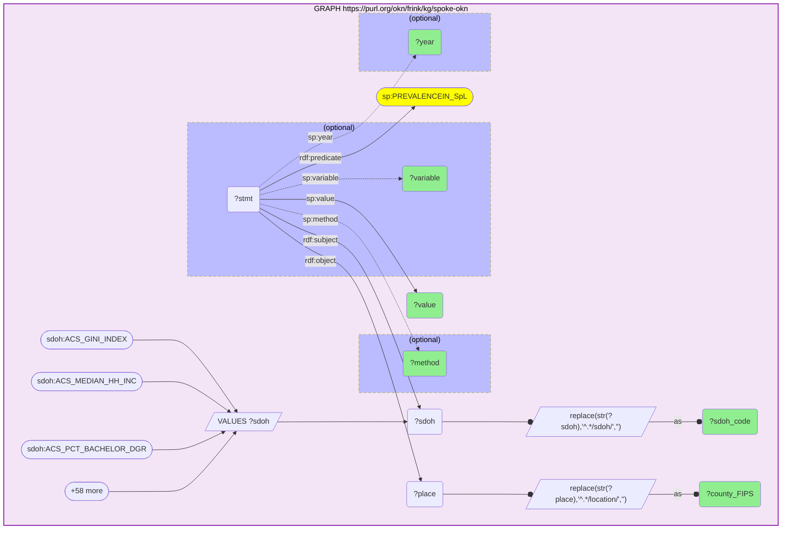
```mermaid
graph TD
classDef projected fill:lightgreen;
classDef literal fill:orange;
classDef iri fill:yellow;
  q1v1("?county_FIPS"):::projected 
  q1v8("?method"):::projected 
  q1v2("?place")
  q1v4("?sdoh")
  q1v3("?sdoh_code"):::projected 
  q1v5("?stmt")
  q1v6("?value"):::projected 
  q1v7("?variable"):::projected 
  q1v9("?year"):::projected 
  subgraph q1graph0["GRAPH https://purl.org/okn/frink/kg/spoke-okn"]
    style q1graph0 fill:#f3e5f5,stroke:#8e24aa,stroke-width:2px,color:#000;
    q1graph0c63(["sp:PREVALENCEIN_SpL"]):::iri 
    q1graph0bind0[/"VALUES ?sdoh"/]
    q1graph0bind0-->q1v4
    q1graph0bind00(["sdoh:ACS_GINI_INDEX"])
    q1graph0bind00 --> q1graph0bind0
    q1graph0bind01(["sdoh:ACS_MEDIAN_HH_INC"])
    q1graph0bind01 --> q1graph0bind0
    q1graph0bind02(["sdoh:ACS_PCT_BACHELOR_DGR"])
    q1graph0bind02 --> q1graph0bind0
    q1graph0bind0more([+58 more])
    q1graph0bind0more --> q1graph0bind0
    q1v5 --"rdf:predicate"--> q1graph0c63
    q1v5 --"rdf:object"--> q1v2
    q1v5 --"rdf:subject"--> q1v4
    q1v5 --"sp:value"--> q1v6
    subgraph q1optionalgraph00["(optional)"]
    style q1optionalgraph00 fill:#bbf,stroke-dasharray: 5 5,color:#000;
      q1v5 -."sp:variable".-> q1v7
    end
    subgraph q1optionalgraph01["(optional)"]
    style q1optionalgraph01 fill:#bbf,stroke-dasharray: 5 5,color:#000;
      q1v5 -."sp:method".-> q1v8
    end
    subgraph q1optionalgraph02["(optional)"]
    style q1optionalgraph02 fill:#bbf,stroke-dasharray: 5 5,color:#000;
      q1v5 -."sp:year".-> q1v9
    end
    q1graph0bind1[/"replace(str(?sdoh),'^.*/sdoh/','')"/]
    q1v4 --o q1graph0bind1
    q1graph0bind1 --as--o q1v3
    q1graph0bind2[/"replace(str(?place),'^.*/location/','')"/]
    q1v2 --o q1graph0bind2
    q1graph0bind2 --as--o q1v1
  end
```

**(g) spoke-okn — environmental features by place (11,367 rows).** Reified `sp:FOUNDIN_EfL` for `ENVO_01000415` (PM2.5) and `ENVO_01000405` (PM10) with `sp:metrics`, `sp:unit`, `sp:value`, `sp:year`; `metrics` / `unit` / `value` / `source` are multi-valued per statement and must be grouped, not cross-producted.

**(h) spatialkg × spoke-okn — county geometry for the prevalence map (3,095 polygons).**

```sparql
PREFIX rdfs: <http://www.w3.org/2000/01/rdf-schema#>
PREFIX geo:  <http://www.opengis.net/ont/geosparql#>
PREFIX sp:   <https://purl.org/okn/frink/kg/spoke-okn/schema/>
SELECT ?county_FIPS ?label ?wkt WHERE {
  GRAPH <https://purl.org/okn/frink/kg/spoke-okn> {
    ?place sp:county_fips ?cf ; sp:state_fips ?sf .
    BIND(REPLACE(STR(?place), "^.*/location/", "") AS ?county_FIPS)
    FILTER(STRLEN(?county_FIPS) = 5)
  }
  BIND(IRI(CONCAT("http://stko-kwg.geog.ucsb.edu/lod/resource/administrativeRegion.USA.", ?county_FIPS)) AS ?region)
  GRAPH <https://purl.org/okn/frink/kg/spatialkg> {
    ?region geo:hasGeometry/geo:asWKT ?wkt .
    OPTIONAL { ?region rdfs:label ?label }
  }
}
```

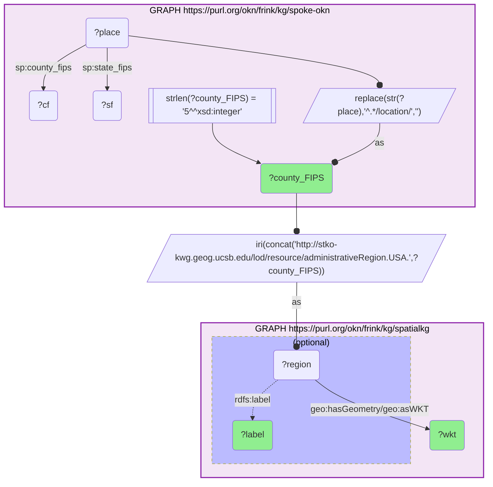
```mermaid
graph TD
classDef projected fill:lightgreen;
classDef literal fill:orange;
classDef iri fill:yellow;
  q2v4("?cf")
  q2v2("?county_FIPS"):::projected 
  q2v7("?label"):::projected 
  q2v3("?place")
  q2v1("?region")
  q2v5("?sf")
  q2v6("?wkt"):::projected 
  subgraph q2graph0["GRAPH https://purl.org/okn/frink/kg/spoke-okn"]
    style q2graph0 fill:#f3e5f5,stroke:#8e24aa,stroke-width:2px,color:#000;
    q2graph0f0[["strlen(?county_FIPS) = '5^^xsd:integer'"]]
    q2graph0f0 --> q2v2
    q2v3 --"sp:county_fips"--> q2v4
    q2v3 --"sp:state_fips"--> q2v5
    q2graph0bind0[/"replace(str(?place),'^.*/location/','')"/]
    q2v3 --o q2graph0bind0
    q2graph0bind0 --as--o q2v2
  end
  q2bind1[/"iri(concat('http://stko-kwg.geog.ucsb.edu/lod/resource/administrativeRegion.USA.',?county_FIPS))"/]
  q2v2 --o q2bind1
  q2bind1 --as--o q2v1
  subgraph q2graph1["GRAPH https://purl.org/okn/frink/kg/spatialkg"]
    style q2graph1 fill:#f3e5f5,stroke:#8e24aa,stroke-width:2px,color:#000;
    q2v1 --"geo:hasGeometry/geo:asWKT"--> q2v6
    subgraph q2optionalgraph10["(optional)"]
    style q2optionalgraph10 fill:#bbf,stroke-dasharray: 5 5,color:#000;
      q2v1 -."rdfs:label".-> q2v7
    end
  end
```

**(i) biohealth — SDoH / phenotype associations (31,096 rows).** Reified statements anchored on the UMLS-CUI node IRIs for `C0011860` (T2D) and `C0011849` (diabetes mellitus), both subject and object positions, with `dc:source` (PubMed 30,468 / MIMIC 408 / both 220). biohealth carries **no numeric statistic**.

**(j) biobricks-ice — exposure→gene (3,781 rows).** CAS → `RO:0000056` → Measure_Group ← `BAO:0000209` ← assay endpoint → `ice:assay_entrez_gene_id`, with Entrez→symbol resolved by a federated join to rdkg. 260 genes; 904 rows on consensus-core genes; 167 Active × core across 29 distinct core genes.

**(k) biobricks-aopwiki — metabolic adverse outcome pathways (758 rows).** AOPs anchored on a diabetes / insulin / glucose / adipogenesis / steatosis / metabolic-syndrome key event: 38 AOPs, 147 key events (24 molecular initiating events, 15 adverse outcomes), 186 key-event relationships, 138 HGNC gene targets.

**(l) prokn — the enrichment foreground.** The 381-gene consensus core was passed as a `VALUES ?sym { … }` block against `?gene rdfs:label ?sym ; sio:SIO_010078 ?prot` with the same three GO predicates (8,467 rows / 252 genes / 3,266 GO terms). Equivalent and preferred for replication: run **Query 14** below (161,834 rows) and intersect with the core list client-side — which is exactly what `scripts/` does.

## SPARQL queries

#### Query 1

_2026-07-19T21:01:04+00:00 · `ubergraph`_

```sparql
PREFIX rdfs: <http://www.w3.org/2000/01/rdf-schema#>
SELECT DISTINCT ?disease ?label WHERE {
  GRAPH <https://purl.org/okn/frink/kg/ubergraph> {
    ?disease rdfs:subClassOf* <http://purl.obolibrary.org/obo/MONDO_0005148> .
    OPTIONAL { ?disease rdfs:label ?label }
  }
}
```

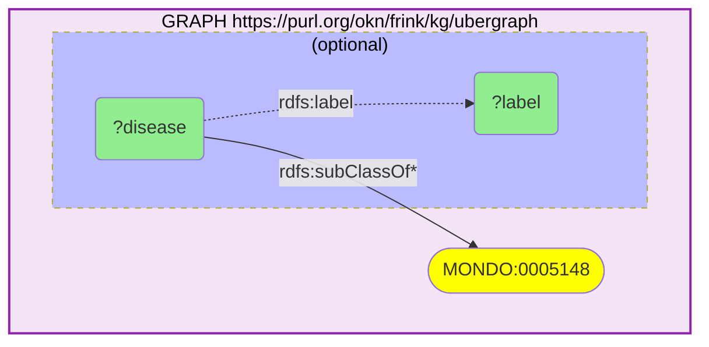
```mermaid
graph TD
classDef projected fill:lightgreen;
classDef literal fill:orange;
classDef iri fill:yellow;
  q3v1("?disease"):::projected 
  q3v2("?label"):::projected 
  subgraph q3graph0["GRAPH https://purl.org/okn/frink/kg/ubergraph"]
    style q3graph0 fill:#f3e5f5,stroke:#8e24aa,stroke-width:2px,color:#000;
    q3graph0c1(["MONDO:0005148"]):::iri 
    q3v1 --"rdfs:subClassOf*"--> q3graph0c1
    subgraph q3optionalgraph00["(optional)"]
    style q3optionalgraph00 fill:#bbf,stroke-dasharray: 5 5,color:#000;
      q3v1 -."rdfs:label".-> q3v2
    end
  end
```

_7 row(s)_

#### Query 2

_2026-07-19T21:01:05+00:00 · `ubergraph`_

```sparql
PREFIX rdfs: <http://www.w3.org/2000/01/rdf-schema#>
PREFIX skos: <http://www.w3.org/2004/02/skos/core#>
PREFIX oboInOwl: <http://www.geneontology.org/formats/oboInOwl#>
SELECT DISTINCT ?disease ?label ?xref ?via WHERE {
  GRAPH <https://purl.org/okn/frink/kg/ubergraph> {
    ?disease rdfs:subClassOf* <http://purl.obolibrary.org/obo/MONDO_0005148> .
    OPTIONAL { ?disease rdfs:label ?label }
    { ?disease skos:exactMatch ?xref . BIND("skos:exactMatch" AS ?via) }
    UNION
    { ?disease oboInOwl:hasDbXref ?xref . BIND("oboInOwl:hasDbXref" AS ?via) }
  }
}
```

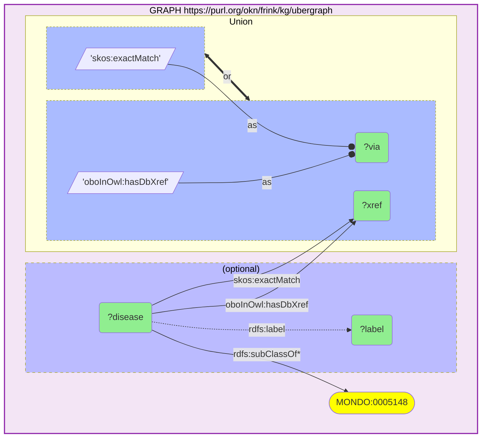
```mermaid
graph TD
classDef projected fill:lightgreen;
classDef literal fill:orange;
classDef iri fill:yellow;
  q4v1("?disease"):::projected 
  q4v2("?label"):::projected 
  q4v3("?via"):::projected 
  q4v4("?xref"):::projected 
  subgraph q4graph0["GRAPH https://purl.org/okn/frink/kg/ubergraph"]
    style q4graph0 fill:#f3e5f5,stroke:#8e24aa,stroke-width:2px,color:#000;
    q4graph0c1(["MONDO:0005148"]):::iri 
    q4v1 --"rdfs:subClassOf*"--> q4graph0c1
    subgraph q4optionalgraph00["(optional)"]
    style q4optionalgraph00 fill:#bbf,stroke-dasharray: 5 5,color:#000;
      q4v1 -."rdfs:label".-> q4v2
    end
    subgraph q4uniongraph00[" Union "]
    style q4uniongraph00 color:#000;
    subgraph q4uniongraph00l[" "]
      style q4uniongraph00l fill:#abf,stroke-dasharray: 3 3;
      q4v1 --"oboInOwl:hasDbXref"--> q4v4
      q4graph0bind0[/"'oboInOwl:hasDbXref'"/]
      q4graph0bind0 --as--o q4v3
    end
    subgraph q4uniongraph00r[" "]
      style q4uniongraph00r fill:#abf,stroke-dasharray: 3 3;
      q4v1 --"skos:exactMatch"--> q4v4
      q4graph0bind1[/"'skos:exactMatch'"/]
      q4graph0bind1 --as--o q4v3
    end
    q4uniongraph00r <== or ==> q4uniongraph00l
    end
  end
```

_75 row(s)_

#### Query 3

_2026-07-19T21:01:18+00:00 · `ubergraph`, `rdkg`_

```sparql
PREFIX rdfs: <http://www.w3.org/2000/01/rdf-schema#>
PREFIX bl: <https://w3id.org/biolink/vocab/>
SELECT DISTINCT ?disease ?dLabel ?pred ?gene ?gLabel WHERE {
  GRAPH <https://purl.org/okn/frink/kg/ubergraph> {
    ?disease rdfs:subClassOf* <http://purl.obolibrary.org/obo/MONDO_0005148> .
  }
  GRAPH <https://purl.org/okn/frink/kg/rdkg> {
    { ?disease bl:genetic_association ?gene . BIND("genetic_association" AS ?pred) }
    UNION { ?gene bl:gene_associated_with_condition ?disease . BIND("gene_associated_with_condition" AS ?pred) }
    UNION { ?gene bl:contributes_to ?disease . BIND("contributes_to" AS ?pred) }
    OPTIONAL { ?gene rdfs:label ?gLabel }
    OPTIONAL { ?disease rdfs:label ?dLabel }
  }
}
```

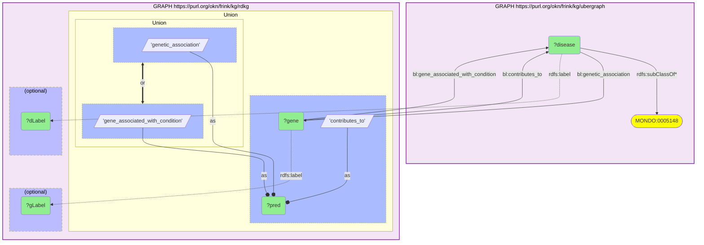
```mermaid
graph TD
classDef projected fill:lightgreen;
classDef literal fill:orange;
classDef iri fill:yellow;
  q5v5("?dLabel"):::projected 
  q5v1("?disease"):::projected 
  q5v4("?gLabel"):::projected 
  q5v3("?gene"):::projected 
  q5v2("?pred"):::projected 
  subgraph q5graph0["GRAPH https://purl.org/okn/frink/kg/ubergraph"]
    style q5graph0 fill:#f3e5f5,stroke:#8e24aa,stroke-width:2px,color:#000;
    q5graph0c1(["MONDO:0005148"]):::iri 
    q5v1 --"rdfs:subClassOf*"--> q5graph0c1
  end
  subgraph q5graph1["GRAPH https://purl.org/okn/frink/kg/rdkg"]
    style q5graph1 fill:#f3e5f5,stroke:#8e24aa,stroke-width:2px,color:#000;
    subgraph q5uniongraph10[" Union "]
    style q5uniongraph10 color:#000;
    subgraph q5uniongraph10l[" "]
      style q5uniongraph10l fill:#abf,stroke-dasharray: 3 3;
      q5v3 --"bl:contributes_to"--> q5v1
      q5graph1bind0[/"'contributes_to'"/]
      q5graph1bind0 --as--o q5v2
    end
      subgraph q5uniongraph11[" Union "]
      style q5uniongraph11 color:#000;
      subgraph q5uniongraph11l[" "]
        style q5uniongraph11l fill:#abf,stroke-dasharray: 3 3;
        q5v3 --"bl:gene_associated_with_condition"--> q5v1
        q5graph1bind1[/"'gene_associated_with_condition'"/]
        q5graph1bind1 --as--o q5v2
      end
      subgraph q5uniongraph11r[" "]
        style q5uniongraph11r fill:#abf,stroke-dasharray: 3 3;
        q5v1 --"bl:genetic_association"--> q5v3
        q5graph1bind2[/"'genetic_association'"/]
        q5graph1bind2 --as--o q5v2
      end
      q5uniongraph11r <== or ==> q5uniongraph11l
      end
    end
    subgraph q5optionalgraph10["(optional)"]
    style q5optionalgraph10 fill:#bbf,stroke-dasharray: 5 5,color:#000;
      q5v3 -."rdfs:label".-> q5v4
    end
    subgraph q5optionalgraph11["(optional)"]
    style q5optionalgraph11 fill:#bbf,stroke-dasharray: 5 5,color:#000;
      q5v1 -."rdfs:label".-> q5v5
    end
  end
```

_44 row(s)_

#### Query 4

_2026-07-19T21:01:23+00:00 · `digcfdekg`_

```sparql
PREFIX rdf: <http://www.w3.org/1999/02/22-rdf-syntax-ns#>
PREFIX rdfs: <http://www.w3.org/2000/01/rdf-schema#>
PREFIX dig: <https://purl.org/okn/frink/kg/digcfdekg/schema/>
PREFIX prov: <http://www.w3.org/ns/prov#>
SELECT ?gene ?symbol ?weight ?scoreType ?method WHERE {
  GRAPH <https://purl.org/okn/frink/kg/digcfdekg> {
    ?stmt rdf:subject ?gene ;
          rdf:predicate dig:geneToTrait ;
          rdf:object <http://purl.obolibrary.org/obo/MONDO_0005148> ;
          dig:weight ?weight .
    OPTIONAL { ?stmt dig:scoreType/rdfs:label ?scoreType }
    OPTIONAL { ?stmt prov:wasGeneratedBy/rdfs:label ?method }
    ?gene rdfs:label ?symbol .
  }
}
```

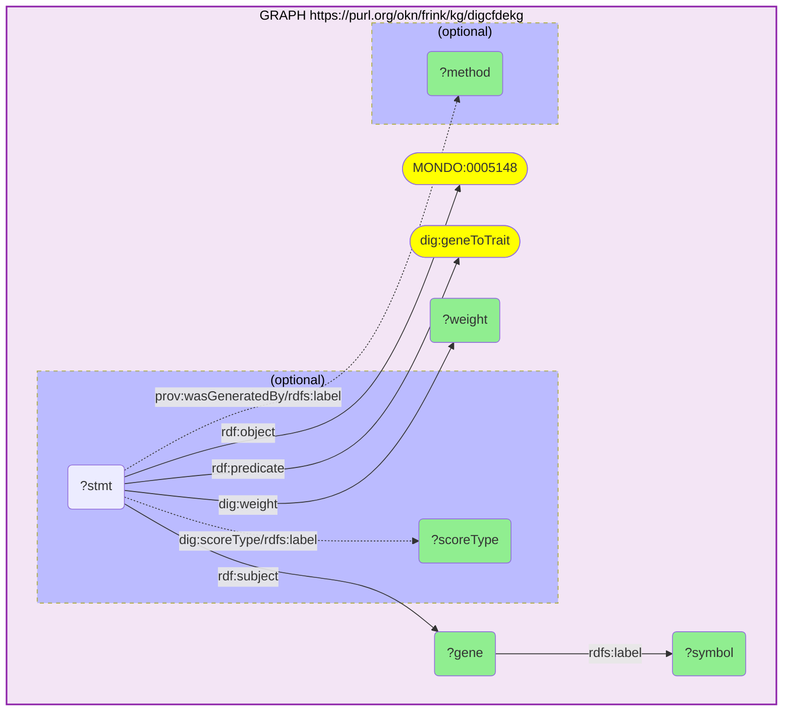
```mermaid
graph TD
classDef projected fill:lightgreen;
classDef literal fill:orange;
classDef iri fill:yellow;
  q6v2("?gene"):::projected 
  q6v5("?method"):::projected 
  q6v4("?scoreType"):::projected 
  q6v1("?stmt")
  q6v6("?symbol"):::projected 
  q6v3("?weight"):::projected 
  subgraph q6graph0["GRAPH https://purl.org/okn/frink/kg/digcfdekg"]
    style q6graph0 fill:#f3e5f5,stroke:#8e24aa,stroke-width:2px,color:#000;
    q6graph0c2(["MONDO:0005148"]):::iri 
    q6graph0c4(["dig:geneToTrait"]):::iri 
    q6v1 --"rdf:object"--> q6graph0c2
    q6v1 --"rdf:predicate"--> q6graph0c4
    q6v1 --"rdf:subject"--> q6v2
    q6v1 --"dig:weight"--> q6v3
    subgraph q6optionalgraph00["(optional)"]
    style q6optionalgraph00 fill:#bbf,stroke-dasharray: 5 5,color:#000;
      q6v1 -."dig:scoreType/rdfs:label".-> q6v4
    end
    subgraph q6optionalgraph01["(optional)"]
    style q6optionalgraph01 fill:#bbf,stroke-dasharray: 5 5,color:#000;
      q6v1 -."prov:wasGeneratedBy/rdfs:label".-> q6v5
    end
    q6v2 --"rdfs:label"--> q6v6
  end
```

_849 row(s)_

#### Query 5

_2026-07-19T21:01:37+00:00 · `ubergraph`_

```sparql
PREFIX rdfs: <http://www.w3.org/2000/01/rdf-schema#>
SELECT DISTINCT ?disease ?label WHERE {
  GRAPH <https://purl.org/okn/frink/kg/ubergraph> {
    ?disease rdfs:subClassOf* <http://purl.obolibrary.org/obo/MONDO_0005015> .
    ?disease rdfs:label ?label .
    FILTER(STRSTARTS(STR(?disease), "http://purl.obolibrary.org/obo/MONDO_"))
  }
}
```

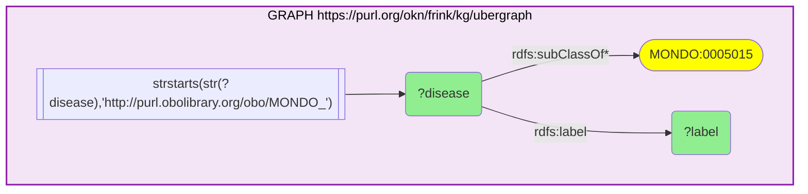
```mermaid
graph TD
classDef projected fill:lightgreen;
classDef literal fill:orange;
classDef iri fill:yellow;
  q7v1("?disease"):::projected 
  q7v2("?label"):::projected 
  subgraph q7graph0["GRAPH https://purl.org/okn/frink/kg/ubergraph"]
    style q7graph0 fill:#f3e5f5,stroke:#8e24aa,stroke-width:2px,color:#000;
    q7graph0c1(["MONDO:0005015"]):::iri 
    q7graph0f0[["strstarts(str(?disease),'http://purl.obolibrary.org/obo/MONDO_')"]]
    q7graph0f0 --> q7v1
    q7v1 --"rdfs:subClassOf*"--> q7graph0c1
    q7v1 --"rdfs:label"--> q7v2
  end
```

_45 row(s)_

#### Query 6

_2026-07-19T21:01:44+00:00 · `ubergraph`, `rdkg`_

```sparql
PREFIX rdfs: <http://www.w3.org/2000/01/rdf-schema#>
PREFIX bl: <https://w3id.org/biolink/vocab/>
SELECT DISTINCT ?disease ?dLabel ?rel ?obj ?objLabel WHERE {
  GRAPH <https://purl.org/okn/frink/kg/ubergraph> {
    ?disease rdfs:subClassOf* <http://purl.obolibrary.org/obo/MONDO_0005148> .
  }
  GRAPH <https://purl.org/okn/frink/kg/rdkg> {
    ?disease rdfs:label ?dLabel .
    { ?disease bl:has_phenotype ?obj . BIND("has_phenotype" AS ?rel) }
    UNION { ?disease bl:has_mode_of_inheritance ?obj . BIND("has_mode_of_inheritance" AS ?rel) }
    UNION { ?disease bl:has_onset ?obj . BIND("has_onset" AS ?rel) }
    UNION { ?disease bl:disease_has_location ?obj . BIND("disease_has_location" AS ?rel) }
    UNION { ?obj bl:treats ?disease . BIND("treats" AS ?rel) }
    UNION { ?obj bl:contraindicated_for ?disease . BIND("contraindicated_for" AS ?rel) }
    UNION { ?disease bl:prevented_by ?obj . BIND("prevented_by" AS ?rel) }
    UNION { ?disease bl:associated_with ?obj . BIND("associated_with" AS ?rel) }
    UNION { ?obj bl:causes_condition ?disease . BIND("causes_condition" AS ?rel) }
    OPTIONAL { ?obj rdfs:label ?objLabel }
  }
}
```


```mermaid
graph TD
classDef projected fill:lightgreen;
classDef literal fill:orange;
classDef iri fill:yellow;
  q8v2("?dLabel"):::projected 
  q8v1("?disease"):::projected 
  q8v4("?obj"):::projected 
  q8v5("?objLabel"):::projected 
  q8v3("?rel"):::projected 
  subgraph q8graph0["GRAPH https://purl.org/okn/frink/kg/ubergraph"]
    style q8graph0 fill:#f3e5f5,stroke:#8e24aa,stroke-width:2px,color:#000;
    q8graph0c1(["MONDO:0005148"]):::iri 
    q8v1 --"rdfs:subClassOf*"--> q8graph0c1
  end
  subgraph q8graph1["GRAPH https://purl.org/okn/frink/kg/rdkg"]
    style q8graph1 fill:#f3e5f5,stroke:#8e24aa,stroke-width:2px,color:#000;
    q8v1 --"rdfs:label"--> q8v2
    subgraph q8uniongraph10[" Union "]
    style q8uniongraph10 color:#000;
    subgraph q8uniongraph10l[" "]
      style q8uniongraph10l fill:#abf,stroke-dasharray: 3 3;
      q8v4 --"bl:causes_condition"--> q8v1
      q8graph1bind0[/"'causes_condition'"/]
      q8graph1bind0 --as--o q8v3
    end
      subgraph q8uniongraph11[" Union "]
      style q8uniongraph11 color:#000;
      subgraph q8uniongraph11l[" "]
        style q8uniongraph11l fill:#abf,stroke-dasharray: 3 3;
        q8v1 --"bl:associated_with"--> q8v4
        q8graph1bind1[/"'associated_with'"/]
        q8graph1bind1 --as--o q8v3
      end
        subgraph q8uniongraph12[" Union "]
        style q8uniongraph12 color:#000;
        subgraph q8uniongraph12l[" "]
          style q8uniongraph12l fill:#abf,stroke-dasharray: 3 3;
          q8v1 --"bl:prevented_by"--> q8v4
          q8graph1bind2[/"'prevented_by'"/]
          q8graph1bind2 --as--o q8v3
        end
          subgraph q8uniongraph13[" Union "]
          style q8uniongraph13 color:#000;
          subgraph q8uniongraph13l[" "]
            style q8uniongraph13l fill:#abf,stroke-dasharray: 3 3;
            q8v4 --"bl:contraindicated_for"--> q8v1
            q8graph1bind3[/"'contraindicated_for'"/]
            q8graph1bind3 --as--o q8v3
          end
            subgraph q8uniongraph14[" Union "]
            style q8uniongraph14 color:#000;
            subgraph q8uniongraph14l[" "]
              style q8uniongraph14l fill:#abf,stroke-dasharray: 3 3;
              q8v4 --"bl:treats"--> q8v1
              q8graph1bind4[/"'treats'"/]
              q8graph1bind4 --as--o q8v3
            end
              subgraph q8uniongraph15[" Union "]
              style q8uniongraph15 color:#000;
              subgraph q8uniongraph15l[" "]
                style q8uniongraph15l fill:#abf,stroke-dasharray: 3 3;
                q8v1 --"bl:disease_has_location"--> q8v4
                q8graph1bind5[/"'disease_has_location'"/]
                q8graph1bind5 --as--o q8v3
              end
                subgraph q8uniongraph16[" Union "]
                style q8uniongraph16 color:#000;
                subgraph q8uniongraph16l[" "]
                  style q8uniongraph16l fill:#abf,stroke-dasharray: 3 3;
                  q8v1 --"bl:has_onset"--> q8v4
                  q8graph1bind6[/"'has_onset'"/]
                  q8graph1bind6 --as--o q8v3
                end
                  subgraph q8uniongraph17[" Union "]
                  style q8uniongraph17 color:#000;
                  subgraph q8uniongraph17l[" "]
                    style q8uniongraph17l fill:#abf,stroke-dasharray: 3 3;
                    q8v1 --"bl:has_mode_of_inheritance"--> q8v4
                    q8graph1bind7[/"'has_mode_of_inheritance'"/]
                    q8graph1bind7 --as--o q8v3
                  end
                  subgraph q8uniongraph17r[" "]
                    style q8uniongraph17r fill:#abf,stroke-dasharray: 3 3;
                    q8v1 --"bl:has_phenotype"--> q8v4
                    q8graph1bind8[/"'has_phenotype'"/]
                    q8graph1bind8 --as--o q8v3
                  end
                  q8uniongraph17r <== or ==> q8uniongraph17l
                  end
                end
              end
            end
          end
        end
      end
    end
    subgraph q8optionalgraph10["(optional)"]
    style q8optionalgraph10 fill:#bbf,stroke-dasharray: 5 5,color:#000;
      q8v4 -."rdfs:label".-> q8v5
    end
  end
```

_290 row(s)_

#### Query 7

_2026-07-19T21:02:39+00:00 · `spoke-okn`_

```sparql
PREFIX rdfs: <http://www.w3.org/2000/01/rdf-schema#>
PREFIX bl: <https://w3id.org/biolink/vocab/>
SELECT DISTINCT ?d ?label WHERE {
  GRAPH <https://purl.org/okn/frink/kg/spoke-okn> {
    ?d a bl:Disease ; rdfs:label ?label .
    FILTER(CONTAINS(LCASE(?label),"diabet"))
  }
}
```

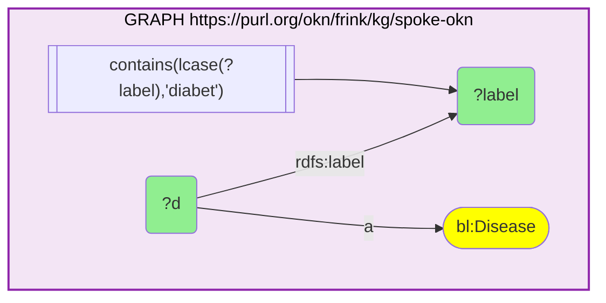
```mermaid
graph TD
classDef projected fill:lightgreen;
classDef literal fill:orange;
classDef iri fill:yellow;
  q9v2("?d"):::projected 
  q9v1("?label"):::projected 
  subgraph q9graph0["GRAPH https://purl.org/okn/frink/kg/spoke-okn"]
    style q9graph0 fill:#f3e5f5,stroke:#8e24aa,stroke-width:2px,color:#000;
    q9graph0c2(["bl:Disease"]):::iri 
    q9graph0f0[["contains(lcase(?label),'diabet')"]]
    q9graph0f0 --> q9v1
    q9v2 --"a"--> q9graph0c2
    q9v2 --"rdfs:label"--> q9v1
  end
```

_2 row(s)_

#### Query 8

_2026-07-19T21:02:44+00:00 · `spoke-okn`_

```sparql
PREFIX rdfs: <http://www.w3.org/2000/01/rdf-schema#>
PREFIX sp: <https://purl.org/okn/frink/kg/spoke-okn/schema/>
SELECT DISTINCT ?gene ?symbol ?ensembl WHERE {
  GRAPH <https://purl.org/okn/frink/kg/spoke-okn> {
    <http://purl.obolibrary.org/obo/DOID_9351> sp:ASSOCIATES_DaG ?gene .
    OPTIONAL { ?gene rdfs:label ?symbol }
    OPTIONAL { ?gene sp:ensembl ?ensembl }
  }
}
```

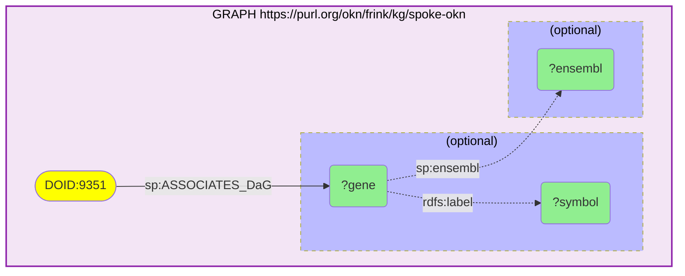
```mermaid
graph TD
classDef projected fill:lightgreen;
classDef literal fill:orange;
classDef iri fill:yellow;
  q10v3("?ensembl"):::projected 
  q10v1("?gene"):::projected 
  q10v2("?symbol"):::projected 
  subgraph q10graph0["GRAPH https://purl.org/okn/frink/kg/spoke-okn"]
    style q10graph0 fill:#f3e5f5,stroke:#8e24aa,stroke-width:2px,color:#000;
    q10graph0c1(["DOID:9351"]):::iri 
    q10graph0c1 --"sp:ASSOCIATES_DaG"--> q10v1
    subgraph q10optionalgraph00["(optional)"]
    style q10optionalgraph00 fill:#bbf,stroke-dasharray: 5 5,color:#000;
      q10v1 -."rdfs:label".-> q10v2
    end
    subgraph q10optionalgraph01["(optional)"]
    style q10optionalgraph01 fill:#bbf,stroke-dasharray: 5 5,color:#000;
      q10v1 -."sp:ensembl".-> q10v3
    end
  end
```

_678 row(s)_

#### Query 9

_2026-07-19T21:03:07+00:00 · `prokn`_

```sparql
PREFIX rdfs: <http://www.w3.org/2000/01/rdf-schema#>
PREFIX up: <http://purl.uniprot.org/core/>
SELECT DISTINCT ?d ?dLabel ?xref WHERE {
  GRAPH <https://purl.org/okn/frink/kg/prokn> {
    ?d a up:Disease ; rdfs:label ?dLabel .
    OPTIONAL { ?d rdfs:seeAlso ?xref }
    FILTER(CONTAINS(LCASE(?dLabel),"diabetes"))
  }
}
```

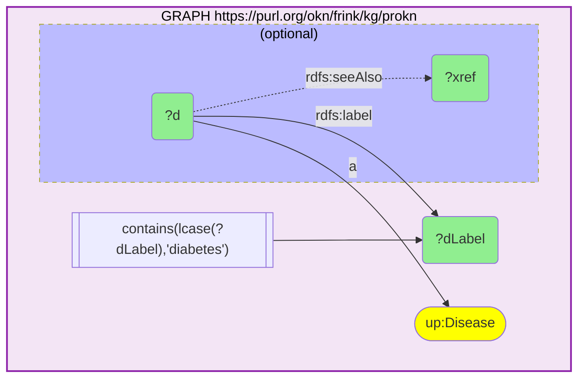
```mermaid
graph TD
classDef projected fill:lightgreen;
classDef literal fill:orange;
classDef iri fill:yellow;
  q11v2("?d"):::projected 
  q11v1("?dLabel"):::projected 
  q11v3("?xref"):::projected 
  subgraph q11graph0["GRAPH https://purl.org/okn/frink/kg/prokn"]
    style q11graph0 fill:#f3e5f5,stroke:#8e24aa,stroke-width:2px,color:#000;
    q11graph0c2(["up:Disease"]):::iri 
    q11graph0f0[["contains(lcase(?dLabel),'diabetes')"]]
    q11graph0f0 --> q11v1
    q11v2 --"a"--> q11graph0c2
    q11v2 --"rdfs:label"--> q11v1
    subgraph q11optionalgraph00["(optional)"]
    style q11optionalgraph00 fill:#bbf,stroke-dasharray: 5 5,color:#000;
      q11v2 -."rdfs:seeAlso".-> q11v3
    end
  end
```

_30 row(s)_

#### Query 10

_2026-07-19T21:03:12+00:00 · `prokn`_

```sparql
PREFIX rdfs: <http://www.w3.org/2000/01/rdf-schema#>
PREFIX obo: <http://purl.obolibrary.org/obo/>
SELECT DISTINCT ?compound ?cLabel ?maxPhase WHERE {
  GRAPH <https://purl.org/okn/frink/kg/prokn> {
    ?compound obo:NCIT_C41184 <https://www.ncbi.nlm.nih.gov/mesh/?term=D003924> .
    OPTIONAL { ?compound rdfs:label ?cLabel }
    OPTIONAL { ?compound <https://w3id.org/reproduceme#Phase> ?maxPhase }
  }
}
```

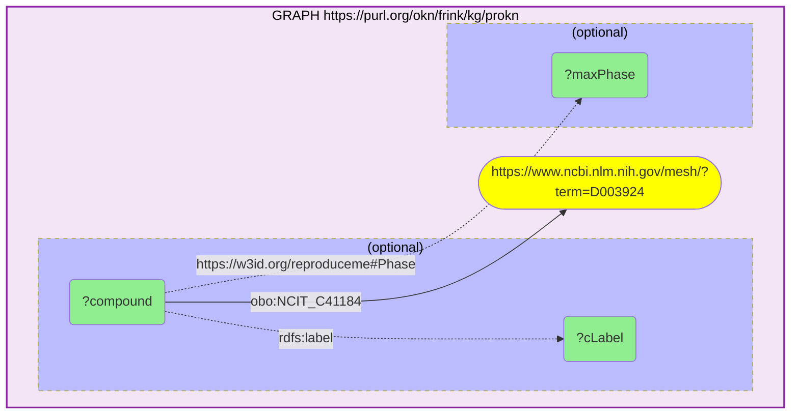
```mermaid
graph TD
classDef projected fill:lightgreen;
classDef literal fill:orange;
classDef iri fill:yellow;
  q12v2("?cLabel"):::projected 
  q12v1("?compound"):::projected 
  q12v3("?maxPhase"):::projected 
  subgraph q12graph0["GRAPH https://purl.org/okn/frink/kg/prokn"]
    style q12graph0 fill:#f3e5f5,stroke:#8e24aa,stroke-width:2px,color:#000;
    q12graph0c2(["https://www.ncbi.nlm.nih.gov/mesh/?term=D003924"]):::iri 
    q12v1 --"obo:NCIT_C41184"--> q12graph0c2
    subgraph q12optionalgraph00["(optional)"]
    style q12optionalgraph00 fill:#bbf,stroke-dasharray: 5 5,color:#000;
      q12v1 -."rdfs:label".-> q12v2
    end
    subgraph q12optionalgraph01["(optional)"]
    style q12optionalgraph01 fill:#bbf,stroke-dasharray: 5 5,color:#000;
      q12v1 -."https://w3id.org/reproduceme#Phase".-> q12v3
    end
  end
```

_1462 row(s)_

#### Query 11

_2026-07-19T21:03:18+00:00 · `prokn`_

```sparql
PREFIX rdfs: <http://www.w3.org/2000/01/rdf-schema#>
PREFIX obo: <http://purl.obolibrary.org/obo/>
PREFIX sio: <http://semanticscience.org/resource/>
SELECT DISTINCT ?compound ?cLabel ?maxPhase ?prot ?sym WHERE {
  GRAPH <https://purl.org/okn/frink/kg/prokn> {
    ?compound obo:NCIT_C41184 <https://www.ncbi.nlm.nih.gov/mesh/?term=D003924> ;
              obo:RO_0002436 ?prot .
    OPTIONAL { ?compound rdfs:label ?cLabel }
    OPTIONAL { ?gene sio:SIO_010078 ?prot ; rdfs:label ?sym }
    OPTIONAL { ?compound <https://w3id.org/reproduceme#Phase> ?maxPhase }
  }
}
```

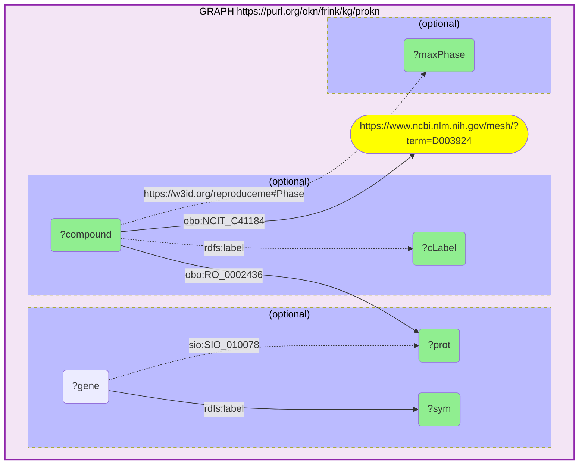
```mermaid
graph TD
classDef projected fill:lightgreen;
classDef literal fill:orange;
classDef iri fill:yellow;
  q13v3("?cLabel"):::projected 
  q13v1("?compound"):::projected 
  q13v4("?gene")
  q13v6("?maxPhase"):::projected 
  q13v2("?prot"):::projected 
  q13v5("?sym"):::projected 
  subgraph q13graph0["GRAPH https://purl.org/okn/frink/kg/prokn"]
    style q13graph0 fill:#f3e5f5,stroke:#8e24aa,stroke-width:2px,color:#000;
    q13graph0c2(["https://www.ncbi.nlm.nih.gov/mesh/?term=D003924"]):::iri 
    q13v1 --"obo:NCIT_C41184"--> q13graph0c2
    q13v1 --"obo:RO_0002436"--> q13v2
    subgraph q13optionalgraph00["(optional)"]
    style q13optionalgraph00 fill:#bbf,stroke-dasharray: 5 5,color:#000;
      q13v1 -."rdfs:label".-> q13v3
    end
    subgraph q13optionalgraph01["(optional)"]
    style q13optionalgraph01 fill:#bbf,stroke-dasharray: 5 5,color:#000;
      q13v4 -."sio:SIO_010078".-> q13v2
      q13v4 --"rdfs:label"--> q13v5
    end
    subgraph q13optionalgraph02["(optional)"]
    style q13optionalgraph02 fill:#bbf,stroke-dasharray: 5 5,color:#000;
      q13v1 -."https://w3id.org/reproduceme#Phase".-> q13v6
    end
  end
```

_1022 row(s)_

#### Query 12

_2026-07-19T21:03:23+00:00 · `prokn`_

```sparql
PREFIX rdfs: <http://www.w3.org/2000/01/rdf-schema#>
PREFIX obo: <http://purl.obolibrary.org/obo/>
PREFIX up: <http://purl.uniprot.org/core/>
PREFIX sio: <http://semanticscience.org/resource/>
SELECT (COUNT(DISTINCT ?sym) AS ?n_genes_with_GO) WHERE {
  GRAPH <https://purl.org/okn/frink/kg/prokn> {
    ?gene rdfs:label ?sym ; sio:SIO_010078 ?prot .
    { ?prot obo:RO_0002331 ?go }
    UNION
    { ?prot obo:RO_0002327 ?go }
    UNION
    { ?prot up:partOf ?go }
  }
}
```

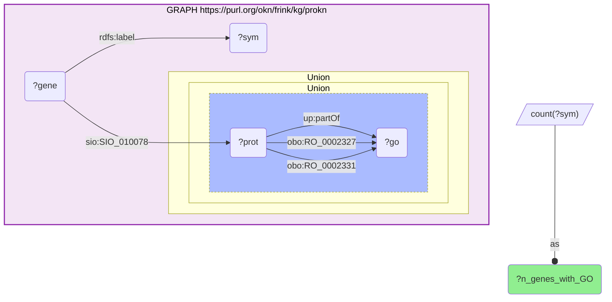
```mermaid
graph TD
classDef projected fill:lightgreen;
classDef literal fill:orange;
classDef iri fill:yellow;
  q14v3("?gene")
  q14v6("?go")
  q14v1("?n_genes_with_GO"):::projected 
  q14v4("?prot")
  q14v5("?sym")
  subgraph q14graph0["GRAPH https://purl.org/okn/frink/kg/prokn"]
    style q14graph0 fill:#f3e5f5,stroke:#8e24aa,stroke-width:2px,color:#000;
    q14v3 --"sio:SIO_010078"--> q14v4
    q14v3 --"rdfs:label"--> q14v5
    subgraph q14uniongraph00[" Union "]
    style q14uniongraph00 color:#000;
      q14v4 --"up:partOf"--> q14v6
      subgraph q14uniongraph01[" Union "]
      style q14uniongraph01 color:#000;
        q14v4 --"obo:RO_0002327"--> q14v6
      subgraph q14uniongraph01r[" "]
        style q14uniongraph01r fill:#abf,stroke-dasharray: 3 3;
        q14v4 --"obo:RO_0002331"--> q14v6
      end
      end
    end
  end
  q14bind0[/"count(?sym)"/]
  q14bind0 --as--o q14v1
```

_1 row(s) — `n_genes_with_GO` = 8290_

#### Query 13

_2026-07-19T21:03:30+00:00 · `prokn`_

```sparql
PREFIX rdfs: <http://www.w3.org/2000/01/rdf-schema#>
PREFIX obo: <http://purl.obolibrary.org/obo/>
PREFIX up: <http://purl.uniprot.org/core/>
PREFIX sio: <http://semanticscience.org/resource/>
SELECT ?go ?goLabel (COUNT(DISTINCT ?sym) AS ?K) WHERE {
  GRAPH <https://purl.org/okn/frink/kg/prokn> {
    ?gene rdfs:label ?sym ; sio:SIO_010078 ?prot .
    { ?prot obo:RO_0002331 ?go }
    UNION
    { ?prot obo:RO_0002327 ?go }
    UNION
    { ?prot up:partOf ?go }
    OPTIONAL { ?go rdfs:label ?goLabel }
  }
}
GROUP BY ?go ?goLabel
```

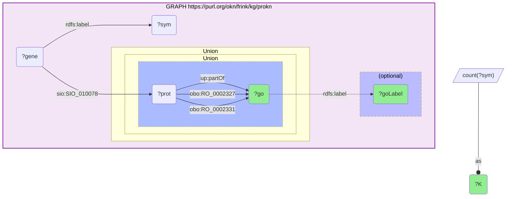
```mermaid
graph TD
classDef projected fill:lightgreen;
classDef literal fill:orange;
classDef iri fill:yellow;
  q15v1("?K"):::projected 
  q15v7("?gene")
  q15v3("?go"):::projected 
  q15v2("?goLabel"):::projected 
  q15v8("?prot")
  q15v9("?sym")
  subgraph q15graph0["GRAPH https://purl.org/okn/frink/kg/prokn"]
    style q15graph0 fill:#f3e5f5,stroke:#8e24aa,stroke-width:2px,color:#000;
    q15v7 --"sio:SIO_010078"--> q15v8
    q15v7 --"rdfs:label"--> q15v9
    subgraph q15uniongraph00[" Union "]
    style q15uniongraph00 color:#000;
      q15v8 --"up:partOf"--> q15v3
      subgraph q15uniongraph01[" Union "]
      style q15uniongraph01 color:#000;
        q15v8 --"obo:RO_0002327"--> q15v3
      subgraph q15uniongraph01r[" "]
        style q15uniongraph01r fill:#abf,stroke-dasharray: 3 3;
        q15v8 --"obo:RO_0002331"--> q15v3
      end
      end
    end
    subgraph q15optionalgraph00["(optional)"]
    style q15optionalgraph00 fill:#bbf,stroke-dasharray: 5 5,color:#000;
      q15v3 -."rdfs:label".-> q15v2
    end
  end
  q15bind0[/"count(?sym)"/]
  q15bind0 --as--o q15v1
```

_13926 row(s)_

#### Query 14

_2026-07-19T21:03:39+00:00 · `prokn`_

```sparql
PREFIX rdfs: <http://www.w3.org/2000/01/rdf-schema#>
PREFIX obo: <http://purl.obolibrary.org/obo/>
PREFIX up: <http://purl.uniprot.org/core/>
PREFIX sio: <http://semanticscience.org/resource/>
SELECT DISTINCT ?sym ?go ?aspect WHERE {
  GRAPH <https://purl.org/okn/frink/kg/prokn> {
    ?gene rdfs:label ?sym ; sio:SIO_010078 ?prot .
    { ?prot obo:RO_0002331 ?go . BIND("BP" AS ?aspect) }
    UNION
    { ?prot obo:RO_0002327 ?go . BIND("MF" AS ?aspect) }
    UNION
    { ?prot up:partOf ?go . BIND("CC" AS ?aspect) }
  }
}
```

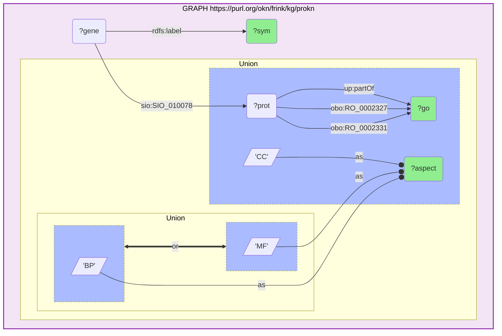
```mermaid
graph TD
classDef projected fill:lightgreen;
classDef literal fill:orange;
classDef iri fill:yellow;
  q16v4("?aspect"):::projected 
  q16v1("?gene")
  q16v5("?go"):::projected 
  q16v2("?prot")
  q16v3("?sym"):::projected 
  subgraph q16graph0["GRAPH https://purl.org/okn/frink/kg/prokn"]
    style q16graph0 fill:#f3e5f5,stroke:#8e24aa,stroke-width:2px,color:#000;
    q16v1 --"sio:SIO_010078"--> q16v2
    q16v1 --"rdfs:label"--> q16v3
    subgraph q16uniongraph00[" Union "]
    style q16uniongraph00 color:#000;
    subgraph q16uniongraph00l[" "]
      style q16uniongraph00l fill:#abf,stroke-dasharray: 3 3;
      q16v2 --"up:partOf"--> q16v5
      q16graph0bind0[/"'CC'"/]
      q16graph0bind0 --as--o q16v4
    end
      subgraph q16uniongraph01[" Union "]
      style q16uniongraph01 color:#000;
      subgraph q16uniongraph01l[" "]
        style q16uniongraph01l fill:#abf,stroke-dasharray: 3 3;
        q16v2 --"obo:RO_0002327"--> q16v5
        q16graph0bind1[/"'MF'"/]
        q16graph0bind1 --as--o q16v4
      end
      subgraph q16uniongraph01r[" "]
        style q16uniongraph01r fill:#abf,stroke-dasharray: 3 3;
        q16v2 --"obo:RO_0002331"--> q16v5
        q16graph0bind2[/"'BP'"/]
        q16graph0bind2 --as--o q16v4
      end
      q16uniongraph01r <== or ==> q16uniongraph01l
      end
    end
  end
```

_161834 row(s)_

#### Query 15

_2026-07-19T21:03:57+00:00 · `prokn`_

```sparql
PREFIX rdfs: <http://www.w3.org/2000/01/rdf-schema#>
PREFIX obo: <http://purl.obolibrary.org/obo/>
PREFIX up: <http://purl.uniprot.org/core/>
PREFIX sio: <http://semanticscience.org/resource/>
SELECT ?pw ?pwLabel (COUNT(DISTINCT ?sym) AS ?K) WHERE {
  GRAPH <https://purl.org/okn/frink/kg/prokn> {
    ?gene rdfs:label ?sym ; sio:SIO_010078 ?prot .
    ?prot obo:RO_0000056 ?pw .
    ?pw a up:Pathway .
    FILTER(CONTAINS(STR(?pw),"R-HSA"))
    OPTIONAL { ?pw rdfs:label ?pwLabel }
  }
}
GROUP BY ?pw ?pwLabel
```

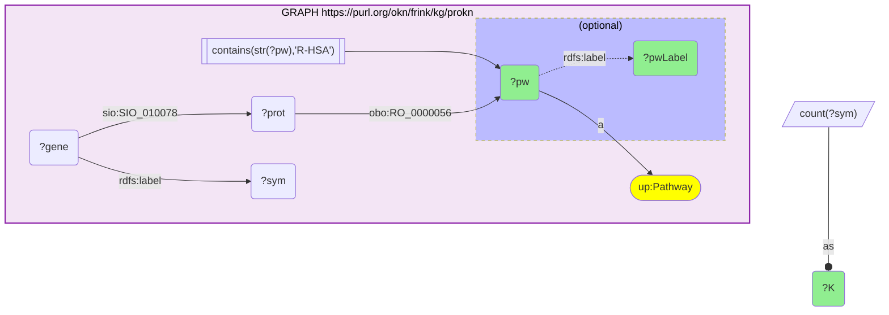
```mermaid
graph TD
classDef projected fill:lightgreen;
classDef literal fill:orange;
classDef iri fill:yellow;
  q17v1("?K"):::projected 
  q17v8("?gene")
  q17v7("?prot")
  q17v3("?pw"):::projected 
  q17v2("?pwLabel"):::projected 
  q17v9("?sym")
  subgraph q17graph0["GRAPH https://purl.org/okn/frink/kg/prokn"]
    style q17graph0 fill:#f3e5f5,stroke:#8e24aa,stroke-width:2px,color:#000;
    q17graph0c2(["up:Pathway"]):::iri 
    q17graph0f0[["contains(str(?pw),'R-HSA')"]]
    q17graph0f0 --> q17v3
    q17v3 --"a"--> q17graph0c2
    q17v7 --"obo:RO_0000056"--> q17v3
    q17v8 --"sio:SIO_010078"--> q17v7
    q17v8 --"rdfs:label"--> q17v9
    subgraph q17optionalgraph00["(optional)"]
    style q17optionalgraph00 fill:#bbf,stroke-dasharray: 5 5,color:#000;
      q17v3 -."rdfs:label".-> q17v2
    end
  end
  q17bind0[/"count(?sym)"/]
  q17bind0 --as--o q17v1
```

_2128 row(s)_

#### Query 16

_2026-07-19T21:04:03+00:00 · `prokn`_

```sparql
PREFIX rdfs: <http://www.w3.org/2000/01/rdf-schema#>
PREFIX obo: <http://purl.obolibrary.org/obo/>
PREFIX up: <http://purl.uniprot.org/core/>
PREFIX sio: <http://semanticscience.org/resource/>
SELECT DISTINCT ?sym ?pw WHERE {
  GRAPH <https://purl.org/okn/frink/kg/prokn> {
    ?gene rdfs:label ?sym ; sio:SIO_010078 ?prot .
    ?prot obo:RO_0000056 ?pw .
    ?pw a up:Pathway .
    FILTER(CONTAINS(STR(?pw),"R-HSA"))
    OPTIONAL { ?pw rdfs:label ?pwLabel }
  }
}
```

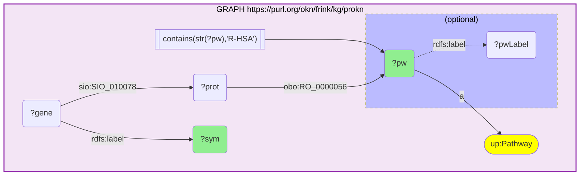
```mermaid
graph TD
classDef projected fill:lightgreen;
classDef literal fill:orange;
classDef iri fill:yellow;
  q18v3("?gene")
  q18v2("?prot")
  q18v1("?pw"):::projected 
  q18v5("?pwLabel")
  q18v4("?sym"):::projected 
  subgraph q18graph0["GRAPH https://purl.org/okn/frink/kg/prokn"]
    style q18graph0 fill:#f3e5f5,stroke:#8e24aa,stroke-width:2px,color:#000;
    q18graph0c2(["up:Pathway"]):::iri 
    q18graph0f0[["contains(str(?pw),'R-HSA')"]]
    q18graph0f0 --> q18v1
    q18v1 --"a"--> q18graph0c2
    q18v2 --"obo:RO_0000056"--> q18v1
    q18v3 --"sio:SIO_010078"--> q18v2
    q18v3 --"rdfs:label"--> q18v4
    subgraph q18optionalgraph00["(optional)"]
    style q18optionalgraph00 fill:#bbf,stroke-dasharray: 5 5,color:#000;
      q18v1 -."rdfs:label".-> q18v5
    end
  end
```

_30015 row(s)_

#### Query 17

_2026-07-19T21:04:08+00:00 · `digcfdekg`_

```sparql
PREFIX rdf: <http://www.w3.org/1999/02/22-rdf-syntax-ns#>
PREFIX dig: <https://purl.org/okn/frink/kg/digcfdekg/schema/>
SELECT (COUNT(DISTINCT ?gene) AS ?n_genes_total) (COUNT(DISTINCT ?trait) AS ?n_traits_total) WHERE {
  GRAPH <https://purl.org/okn/frink/kg/digcfdekg> {
    ?stmt rdf:subject ?gene ;
          rdf:predicate dig:geneToTrait ;
          rdf:object ?trait .
  }
}
```

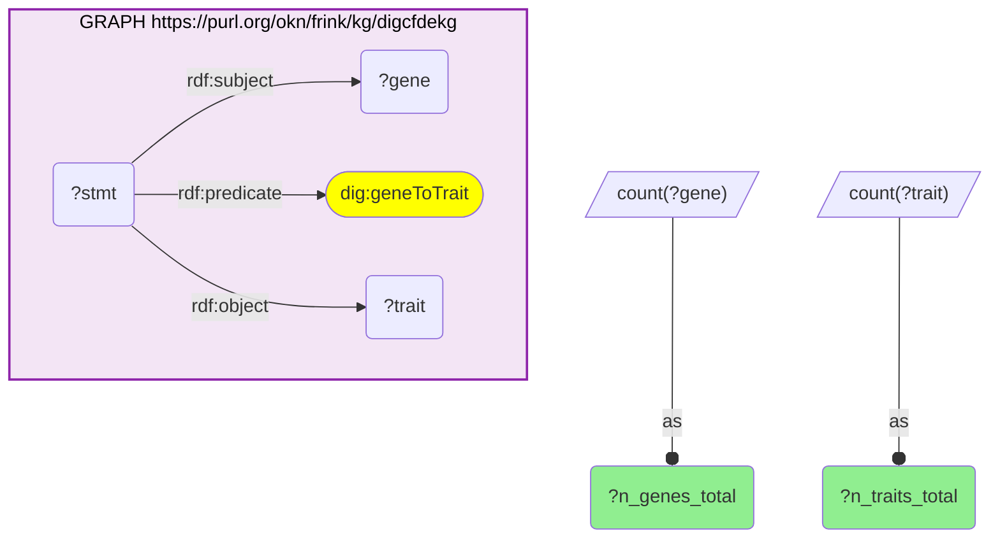
```mermaid
graph TD
classDef projected fill:lightgreen;
classDef literal fill:orange;
classDef iri fill:yellow;
  q19v7("?gene")
  q19v2("?n_genes_total"):::projected 
  q19v1("?n_traits_total"):::projected 
  q19v5("?stmt")
  q19v6("?trait")
  subgraph q19graph0["GRAPH https://purl.org/okn/frink/kg/digcfdekg"]
    style q19graph0 fill:#f3e5f5,stroke:#8e24aa,stroke-width:2px,color:#000;
    q19graph0c2(["dig:geneToTrait"]):::iri 
    q19v5 --"rdf:predicate"--> q19graph0c2
    q19v5 --"rdf:object"--> q19v6
    q19v5 --"rdf:subject"--> q19v7
  end
  q19bind0[/"count(?gene)"/]
  q19bind0 --as--o q19v2
  q19bind1[/"count(?trait)"/]
  q19bind1 --as--o q19v1
```

_1 row(s) — 21710 genes / 5124 traits_

#### Query 18

_2026-07-19T21:04:13+00:00 · `digcfdekg`_

```sparql
PREFIX rdfs: <http://www.w3.org/2000/01/rdf-schema#>
PREFIX dig: <https://purl.org/okn/frink/kg/digcfdekg/schema/>
SELECT DISTINCT ?trait ?label ?orig WHERE {
  GRAPH <https://purl.org/okn/frink/kg/digcfdekg> {
    ?trait a dig:Trait ; rdfs:label ?label .
    OPTIONAL { ?trait dig:originalLabel ?orig }
    FILTER(CONTAINS(LCASE(?label),"diabet") || CONTAINS(LCASE(?label),"glycemic") || CONTAINS(LCASE(?label),"insulin") || CONTAINS(LCASE(?label),"glucose") || CONTAINS(LCASE(?label),"hba1c") || CONTAINS(LCASE(?label),"glycated"))
  }
}
```

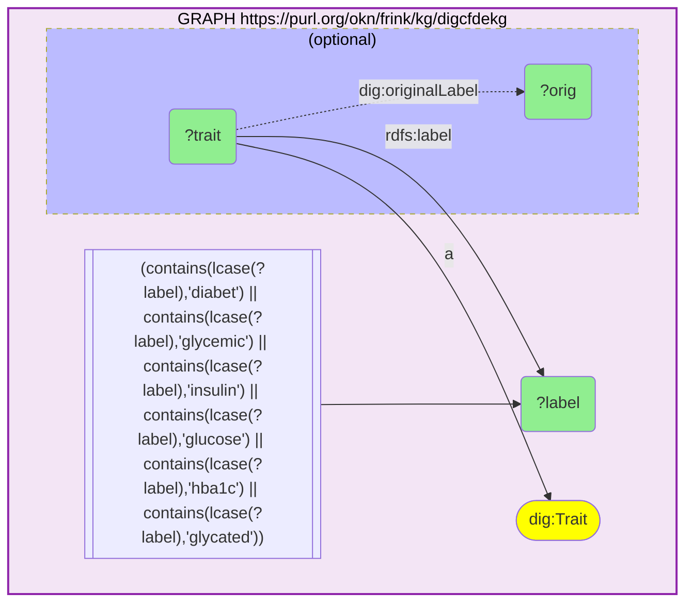
```mermaid
graph TD
classDef projected fill:lightgreen;
classDef literal fill:orange;
classDef iri fill:yellow;
  q20v1("?label"):::projected 
  q20v3("?orig"):::projected 
  q20v2("?trait"):::projected 
  subgraph q20graph0["GRAPH https://purl.org/okn/frink/kg/digcfdekg"]
    style q20graph0 fill:#f3e5f5,stroke:#8e24aa,stroke-width:2px,color:#000;
    q20graph0c2(["dig:Trait"]):::iri 
    q20graph0f0[["(contains(lcase(?label),'diabet') || contains(lcase(?label),'glycemic') || contains(lcase(?label),'insulin') || contains(lcase(?label),'glucose') || contains(lcase(?label),'hba1c') || contains(lcase(?label),'glycated'))"]]
    q20graph0f0 --> q20v1
    q20v2 --"a"--> q20graph0c2
    q20v2 --"rdfs:label"--> q20v1
    subgraph q20optionalgraph00["(optional)"]
    style q20optionalgraph00 fill:#bbf,stroke-dasharray: 5 5,color:#000;
      q20v2 -."dig:originalLabel".-> q20v3
    end
  end
```

_220 row(s)_

#### Query 19

_2026-07-19T21:04:19+00:00 · `ubergraph`, `rdkg`_

```sparql
PREFIX rdfs: <http://www.w3.org/2000/01/rdf-schema#>
PREFIX bl: <https://w3id.org/biolink/vocab/>
SELECT DISTINCT ?disease ?dLabel ?gene ?gLabel WHERE {
  GRAPH <https://purl.org/okn/frink/kg/ubergraph> {
    ?disease rdfs:subClassOf* <http://purl.obolibrary.org/obo/MONDO_0005015> .
  }
  GRAPH <https://purl.org/okn/frink/kg/rdkg> {
    ?disease rdfs:label ?dLabel .
    { ?gene bl:gene_associated_with_condition ?disease }
    UNION
    { ?disease bl:genetic_association ?gene }
    ?gene a bl:Gene ; rdfs:label ?gLabel .
  }
}
```

```mermaid
graph TD
classDef projected fill:lightgreen;
classDef literal fill:orange;
classDef iri fill:yellow;
  q21v2("?dLabel"):::projected 
  q21v1("?disease"):::projected 
  q21v4("?gLabel"):::projected 
  q21v3("?gene"):::projected 
  subgraph q21graph0["GRAPH https://purl.org/okn/frink/kg/ubergraph"]
    style q21graph0 fill:#f3e5f5,stroke:#8e24aa,stroke-width:2px,color:#000;
    q21graph0c1(["MONDO:0005015"]):::iri 
    q21v1 --"rdfs:subClassOf*"--> q21graph0c1
  end
  subgraph q21graph1["GRAPH https://purl.org/okn/frink/kg/rdkg"]
    style q21graph1 fill:#f3e5f5,stroke:#8e24aa,stroke-width:2px,color:#000;
    q21graph1c5(["bl:Gene"]):::iri 
    q21v1 --"rdfs:label"--> q21v2
    subgraph q21uniongraph10[" Union "]
    style q21uniongraph10 color:#000;
      q21v1 --"bl:genetic_association"--> q21v3
    subgraph q21uniongraph10r[" "]
      style q21uniongraph10r fill:#abf,stroke-dasharray: 3 3;
      q21v3 --"bl:gene_associated_with_condition"--> q21v1
    end
    end
    q21v3 --"a"--> q21graph1c5
    q21v3 --"rdfs:label"--> q21v4
  end
```

_5 row(s)_

#### Query 20

_2026-07-19T21:04:27+00:00 · `biomarkerkg`_

```sparql
PREFIX rdfs: <http://www.w3.org/2000/01/rdf-schema#>
PREFIX obci: <http://purl.obolibrary.org/obo/OBCI_>
SELECT DISTINCT ?biomarker ?bLabel ?rel ?specimen ?specLabel ?best WHERE {
  GRAPH <https://purl.org/okn/frink/kg/biomarkerkg> {
    { ?biomarker obci:1000002 <http://purl.obolibrary.org/obo/MONDO_0005148> . BIND("diagnostic_for" AS ?rel) }
    UNION
    { ?biomarker obci:1000006 <http://purl.obolibrary.org/obo/MONDO_0005148> . BIND("prognostic_for" AS ?rel) }
    UNION
    { ?biomarker obci:1000003 <http://purl.obolibrary.org/obo/MONDO_0005148> . BIND("monitors_status_of" AS ?rel) }
    UNION
    { ?biomarker obci:1000008 <http://purl.obolibrary.org/obo/MONDO_0005148> . BIND("indicates_risk_of_developing" AS ?rel) }
    OPTIONAL { ?biomarker rdfs:label ?bLabel }
    OPTIONAL { ?biomarker obci:1000018 ?specimen . OPTIONAL { ?specimen rdfs:label ?specLabel } }
    OPTIONAL { ?biomarker obci:1000011 ?best }
  }
}
```

```mermaid
graph TD
classDef projected fill:lightgreen;
classDef literal fill:orange;
classDef iri fill:yellow;
  q22v3("?bLabel"):::projected 
  q22v6("?best"):::projected 
  q22v2("?biomarker"):::projected 
  q22v1("?rel"):::projected 
  q22v5("?specLabel"):::projected 
  q22v4("?specimen"):::projected 
  subgraph q22graph0["GRAPH https://purl.org/okn/frink/kg/biomarkerkg"]
    style q22graph0 fill:#f3e5f5,stroke:#8e24aa,stroke-width:2px,color:#000;
    q22graph0c2(["MONDO:0005148"]):::iri 
    subgraph q22uniongraph00[" Union "]
    style q22uniongraph00 color:#000;
    subgraph q22uniongraph00l[" "]
      style q22uniongraph00l fill:#abf,stroke-dasharray: 3 3;
      q22v2 --"obci:1000008"--> q22graph0c2
      q22graph0bind0[/"'indicates_risk_of_developing'"/]
      q22graph0bind0 --as--o q22v1
    end
      subgraph q22uniongraph01[" Union "]
      style q22uniongraph01 color:#000;
      subgraph q22uniongraph01l[" "]
        style q22uniongraph01l fill:#abf,stroke-dasharray: 3 3;
        q22v2 --"obci:1000003"--> q22graph0c2
        q22graph0bind1[/"'monitors_status_of'"/]
        q22graph0bind1 --as--o q22v1
      end
        subgraph q22uniongraph02[" Union "]
        style q22uniongraph02 color:#000;
        subgraph q22uniongraph02l[" "]
          style q22uniongraph02l fill:#abf,stroke-dasharray: 3 3;
          q22v2 --"obci:1000006"--> q22graph0c2
          q22graph0bind2[/"'prognostic_for'"/]
          q22graph0bind2 --as--o q22v1
        end
        subgraph q22uniongraph02r[" "]
          style q22uniongraph02r fill:#abf,stroke-dasharray: 3 3;
          q22v2 --"obci:1000002"--> q22graph0c2
          q22graph0bind3[/"'diagnostic_for'"/]
          q22graph0bind3 --as--o q22v1
        end
        q22uniongraph02r <== or ==> q22uniongraph02l
        end
      end
    end
    subgraph q22optionalgraph00["(optional)"]
    style q22optionalgraph00 fill:#bbf,stroke-dasharray: 5 5,color:#000;
      q22v2 -."rdfs:label".-> q22v3
    end
    subgraph q22optionalgraph01["(optional)"]
    style q22optionalgraph01 fill:#bbf,stroke-dasharray: 5 5,color:#000;
      q22v2 -."obci:1000018".-> q22v4
      subgraph q22optionalgraph02["(optional)"]
      style q22optionalgraph02 fill:#bbf,stroke-dasharray: 5 5,color:#000;
        q22v4 -."rdfs:label".-> q22v5
      end
    end
    subgraph q22optionalgraph03["(optional)"]
    style q22optionalgraph03 fill:#bbf,stroke-dasharray: 5 5,color:#000;
      q22v2 -."obci:1000011".-> q22v6
    end
  end
```

_2348 row(s)_

#### Query 21

_2026-07-19T21:04:36+00:00 · `pankgraph`_

```sparql
PREFIX rdfs: <http://www.w3.org/2000/01/rdf-schema#>
PREFIX bl: <https://w3id.org/biolink/vocab/>
SELECT DISTINCT ?d ?label (COUNT(DISTINCT ?g) AS ?nGenes) WHERE {
  GRAPH <https://purl.org/okn/frink/kg/pankgraph> {
    ?g bl:gene_associated_with_condition ?d .
    OPTIONAL { ?d rdfs:label ?label }
  }
}
GROUP BY ?d ?label
```

```mermaid
graph TD
classDef projected fill:lightgreen;
classDef literal fill:orange;
classDef iri fill:yellow;
  q23v3("?d"):::projected 
  q23v7("?g")
  q23v2("?label"):::projected 
  q23v1("?nGenes"):::projected 
  subgraph q23graph0["GRAPH https://purl.org/okn/frink/kg/pankgraph"]
    style q23graph0 fill:#f3e5f5,stroke:#8e24aa,stroke-width:2px,color:#000;
    q23v7 --"bl:gene_associated_with_condition"--> q23v3
    subgraph q23optionalgraph00["(optional)"]
    style q23optionalgraph00 fill:#bbf,stroke-dasharray: 5 5,color:#000;
      q23v3 -."rdfs:label".-> q23v2
    end
  end
  q23bind0[/"count(?g)"/]
  q23bind0 --as--o q23v1
```

_1 row(s) — MONDO_0005147 (type 1 diabetes), 176 genes; **no T2D row**_

#### Query 22

_2026-07-19T21:04:41+00:00 · `spoke-okn`_

```sparql
PREFIX rdfs: <http://www.w3.org/2000/01/rdf-schema#>
PREFIX sp: <https://purl.org/okn/frink/kg/spoke-okn/schema/>
SELECT ?county_FIPS ?label ?state_name WHERE {
  GRAPH <https://purl.org/okn/frink/kg/spoke-okn> {
    ?place sp:county_fips ?cf ; sp:state_fips ?sf .
    OPTIONAL { ?place rdfs:label ?label }
    OPTIONAL { ?place sp:state_name ?state_name }
    FILTER(STRSTARTS(STR(?place),"https://purl.org/okn/frink/kg/spoke-okn/location/"))
    BIND(REPLACE(STR(?place),"^.*/location/","") AS ?county_FIPS)
    FILTER(STRLEN(?county_FIPS)=5)
  }
}
```

```mermaid
graph TD
classDef projected fill:lightgreen;
classDef literal fill:orange;
classDef iri fill:yellow;
  q24v3("?cf")
  q24v2("?county_FIPS"):::projected 
  q24v5("?label"):::projected 
  q24v1("?place")
  q24v4("?sf")
  q24v6("?state_name"):::projected 
  subgraph q24graph0["GRAPH https://purl.org/okn/frink/kg/spoke-okn"]
    style q24graph0 fill:#f3e5f5,stroke:#8e24aa,stroke-width:2px,color:#000;
    q24graph0f0[["strstarts(str(?place),'https://purl.org/okn/frink/kg/spoke-okn/location/') && strlen(?county_FIPS) = '5^^xsd:integer'"]]
    q24graph0f0 --> q24v1
    q24graph0f0 --> q24v2
    q24v1 --"sp:county_fips"--> q24v3
    q24v1 --"sp:state_fips"--> q24v4
    subgraph q24optionalgraph00["(optional)"]
    style q24optionalgraph00 fill:#bbf,stroke-dasharray: 5 5,color:#000;
      q24v1 -."rdfs:label".-> q24v5
    end
    subgraph q24optionalgraph01["(optional)"]
    style q24optionalgraph01 fill:#bbf,stroke-dasharray: 5 5,color:#000;
      q24v1 -."sp:state_name".-> q24v6
    end
    q24graph0bind0[/"replace(str(?place),'^.*/location/','')"/]
    q24v1 --o q24graph0bind0
    q24graph0bind0 --as--o q24v2
  end
```

_3196 row(s)_
