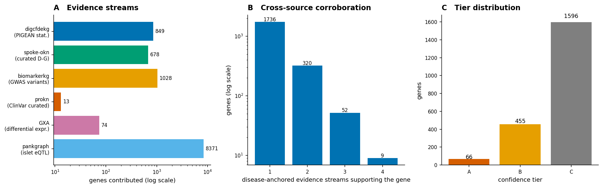
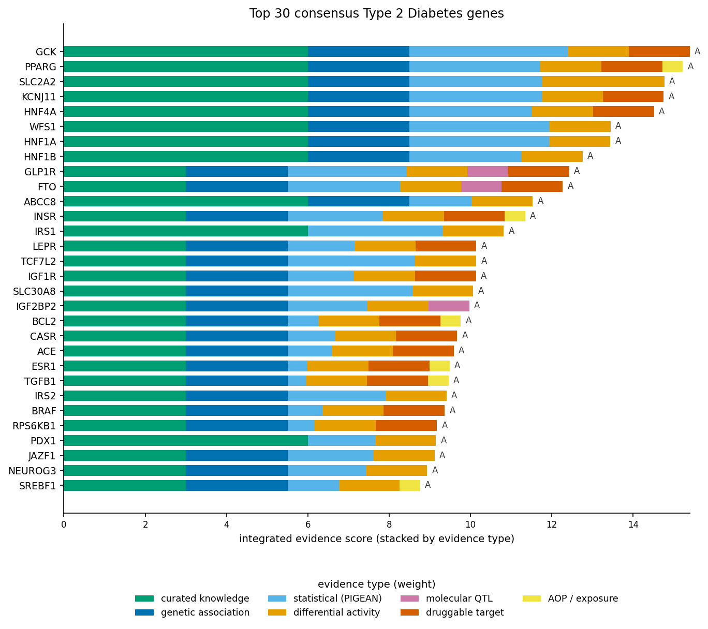
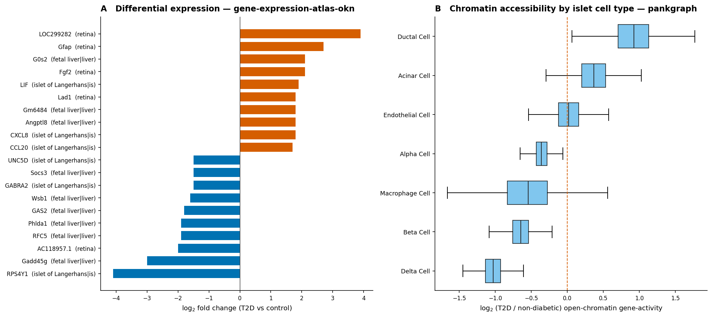
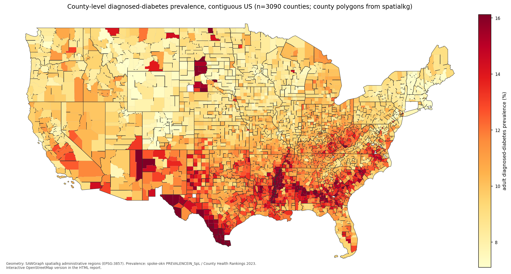
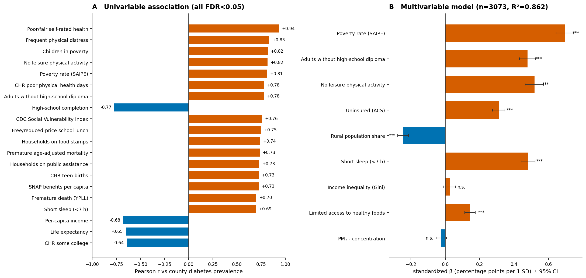
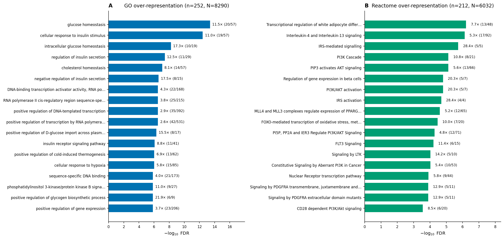
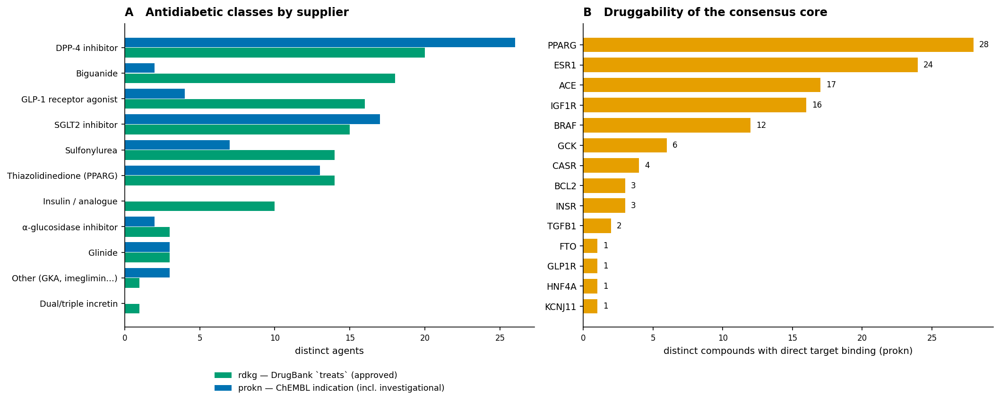
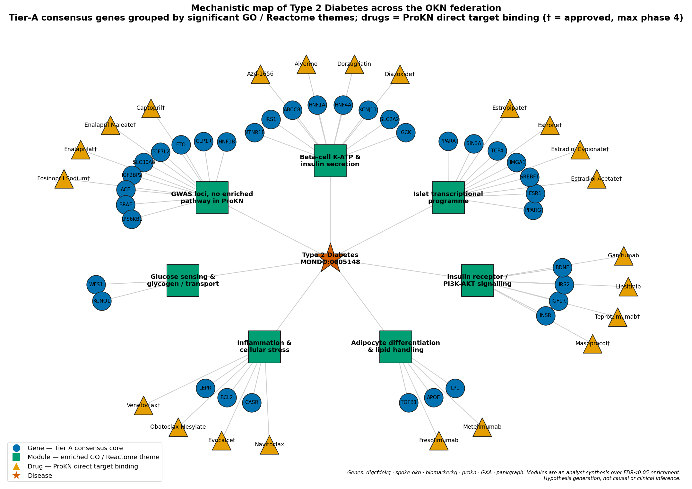

# A Federated Knowledge-Graph Map of Type 2 Diabetes
### Multi-knowledge-graph integrative study across the Proto-OKN federated SPARQL endpoint — molecular biology, genetics, clinical manifestations, epidemiology and therapeutics

**Date:** 2026-07-19 · **Endpoint:** OKN federated SPARQL via `mcp-okn` · **Model:** claude-opus-4-8

> **Framing (non-negotiable).** The unit of analysis is the **gene / variant / phenotype / drug / place record as asserted by a knowledge graph**, not a patient or an experiment. Coverage is whatever the 16 queried graphs assert about Type 2 Diabetes as of their pinned releases (§2); the geographic layer is **US counties and incorporated places**, plus 200 countries. The level of inference is **hypothesis generation**: every disease–gene, disease–phenotype and place–exposure edge here is an **observational association**, several are literature co-occurrence or electronic-health-record co-occurrence, and none of them is causal or clinical evidence. County-level results are **ecological** and cannot be transferred to individuals. Keep this caveat attached to every downstream claim.

**Abbreviations.** AOP = adverse outcome pathway; BH = Benjamini–Hochberg; CGM = continuous glucose monitor; CHR = County Health Rankings; CL = Cell Ontology; DE = differential expression; DOID = Human Disease Ontology; EFO = Experimental Factor Ontology; eQTL = expression quantitative trait locus; FDR = false-discovery rate; FIPS = Federal Information Processing Standards (county code); GO = Gene Ontology; GWAS = genome-wide association study; GXA = Gene Expression Atlas; HP / HPO = Human Phenotype Ontology; ICE = Integrated Chemical Environment; KG = knowledge graph; lncRNA = long non-coding RNA; MoA = mechanism of action; MODY = maturity-onset diabetes of the young; MONDO = Mondo Disease Ontology; OCR = open chromatin region; OLS = ordinary least squares; PFAS = per- and polyfluoroalkyl substances; PIP = posterior inclusion probability; PLACES = CDC Population Level Analysis and Community Estimates; SDoH = social determinants of health; SVI = Social Vulnerability Index; T1D = type 1 diabetes; T2D = type 2 diabetes; TF = transcription factor; UBERON = Uber-anatomy ontology; YPLL = years of potential life lost.

---

## 1. Executive summary

Querying **16 knowledge graphs** of the Proto-OKN federation and explicitly rejecting **6** more with stated reasons (§6.7), this study assembles a single, provenance-tracked map of Type 2 Diabetes spanning ontology, genetics, molecular activity, clinical phenotype, therapeutics and population health. The federation returned **2117 genes** with at least one disease-anchored line of evidence; **381** are corroborated by two or more independent evidence streams, and **66** reach Tier A (§4). The Tier-A set is the textbook T2D core recovered without supervision — **GCK, PPARG, SLC2A2, KCNJ11, HNF4A, WFS1, HNF1A, HNF1B, GLP1R, FTO, ABCC8, INSR, IRS1, TCF7L2, SLC30A8, IGF2BP2, MTNR1B, KCNQ1** — which is the study's internal validity check as much as its result.

Both enrichment families were run. GO over-representation of the consensus core against an explicit **8290-gene ProKN background** returns **270 of 431** terms at FDR < 0.05, headed by *glucose homeostasis* (11.5×), *cellular response to insulin stimulus* (11.0×) and *regulation of insulin secretion* (12.5×); Reactome returns **80 of 109** pathways, headed by *transcriptional regulation of white adipocyte differentiation*, *IRS-mediated signalling* (28.4×) and *regulation of gene expression in beta cells* (20.3×). Two hits are not canonical T2D enrichments and are flagged as genuinely novel: **interleukin-4 / interleukin-13 signalling** and **positive regulation of cold-induced thermogenesis** (§8).

The molecular layer is resolved to tissue and cell type. The Gene Expression Atlas gives **78 human T2D differential-expression records across 74 genes** — GLUT2/**SLC2A2** and **NKX6-3** down in islet, an inflammatory **LIF/CXCL8/CCL20/IL1B/CXCL1** signature up — while PanKbase supplies **123931 T2D-versus-non-diabetic open-chromatin gene-activity contrasts over 17922 genes in 7 islet cell types** (β, α, δ, acinar, ductal, endothelial, macrophage) and **23256 islet/pancreas eQTL records**. A separate **184-locus non-coding RNA layer** is kept apart from the protein-coding core, as is the **2318-variant** biomarker set.

At population scale, the same federation reproduces the American "diabetes belt". County diagnosed-diabetes prevalence (**3129 counties, 5.6–21.5 %, median 10.1 %**) is modelled with **R² = 0.862** (n = 3073) from poverty, education, physical inactivity, short sleep, insurance coverage and healthy-food access — and rurality flips sign once those are adjusted for. What this adds is not a new fact about diabetes but a demonstration that **a single federated query surface can carry an argument from a β-cell potassium channel to a county poverty rate without ever leaving the evidence trail**.

---

## 2. Sources used

Every row below has at least one logged SPARQL query in the reproducibility record. Versions and dates are from `get_kg_version` (VoID provenance) on 2026-07-19.

| KG | Version | Updated | Role in this study | Join key / confidence |
|---|---|---|---|---|
| `ubergraph` | v0.0.2 | 2025-05-01 | Disease-hierarchy hub: MONDO T2D subtree expansion, and every DOID / EFO / OMIM / UMLS / MeSH / SNOMED / NCIT crosswalk in §5.1 | MONDO `rdfs:subClassOf*`, `skos:exactMatch`, `oboInOwl:hasDbXref` — high |
| `digcfdekg` | v0.0.1 | 2026-06-21 | Statistical gene→trait evidence (PIGEAN combined score); the 28 T2D/glycaemic trait gene-sets, including the five data-driven T2D subtypes | Entrez; trait IRIs (MONDO / EFO / Orphanet / HP / local) — high |
| `spoke-okn` | v0.0.6 | 2025-03-16 | Curated disease→gene edges; county & place diabetes prevalence; the 61-variable SDoH panel; PM₂.₅ / PM₁₀; drug/contraindication layer | Entrez; DOID; county FIPS — high for geography, **granularity-limited for disease** (see §10) |
| `biomarkerkg` | v0.0.2 | 2026-03-16 | 2318 T2D risk-variant biomarkers (dbSNP × gene), diagnostic biomarkers, BEST classification, specimen | MONDO; Entrez embedded in the biomarker label — high |
| `prokn` | v0.0.5 | 2026-06-23 | GO and Reactome annotation and both enrichment backgrounds; ClinVar curated T2D genes; 295 indicated compounds with clinical phase; drug→target binding | HGNC symbol on `rdfs:label`; UniProt; MeSH disease IRI — high |
| `pankgraph` | v0.0.1 | 2026-03-23 | Islet single-cell chromatin accessibility (T2D vs non-diabetic) and islet/pancreas eQTL fine-mapping | Ensembl; CL cell types — high |
| `gene-expression-atlas-okn` | v0.0.3 | 2026-03-18 | Human T2D differential expression with tissue, direction, log₂FC and adjusted p | NCBI Gene (human) / Ensembl (rodent); MONDO / EFO — moderate (few studies) |
| `oard-kg` | v0.0.3 | 2026-06-05 | Electronic-health-record phenotype and complication co-occurrence for T2D | **HP:0005978**, not MONDO (see §10) — moderate, observational |
| `rdkg` | v0.0.1 | 2025-05-04 | 210 DrugBank agents that treat T2D, 20 contraindications, curated Mendelian diabetes genes, and 44 chemical-exposure risk factors | MONDO node IRIs; DrugBank; Entrez — high |
| `biohealth` | v0.0.4 | 2026-03-16 | UMLS-keyed social-determinant, phenotype and measurement associations for T2D | UMLS CUI C0011860 / C0011849 — low (no statistic, literature co-occurrence) |
| `biobricks-ice` | v0.0.3 | 2026-03-30 | Exposure→gene toxicological screening (the only tox graph carrying a gene identifier) | CAS; Entrez — moderate |
| `biobricks-aopwiki` | v0.0.4 | 2026-03-18 | 38 metabolic adverse outcome pathways with 138 gene targets | CAS; HGNC — moderate |
| `biobricks-mesh` | v0.0.4 | 2026-04-03 | MeSH D003924 record: tree numbers, qualifiers, and 112 substances with `pharmacologicalAction` = Hypoglycemic Agents | MeSH descriptor; CAS — high |
| `biobricks-pubchem-annotations` | v0.0.2 | 2026-03-16 | FDA Established Pharmacologic Class and mechanism-of-action text for 18 antidiabetics and 3 exposure chemicals | PubChem CID — high |
| `nde` | v0.0.3 | 2026-03-16 | 1,149 T2D-annotated research datasets (data-availability context, not evidence) | MONDO — high |
| `spatialkg` | v0.0.6 | 2025-05-07 | County polygon geometry for the prevalence map, and the verified county-FIPS bridge from spoke-okn | county FIPS (3,122 counties join) — high |
| `medical-device-kg` | v0.0.1 | 2026-03-23 | 161 FDA MAUDE adverse-event reports across insulin pumps, CGMs and glucose meters | FDA product code — moderate |
| `ncipidkg` | v0.0.1 | 2026-04-03 | Queried and found not to contain the T2D signalling proteins — a **declared negative** (§6.7) | UniProt — n/a |
| `evoweb` | v0.0.2 | 2026-06-04 | Queried and found to be prokaryotic — a **declared negative** (§6.7) | none — n/a |

---

## 3. Design & rules

The study is anchored on **MONDO:0005148**, expanded through ubergraph's precomputed `rdfs:subClassOf*` closure to a **7-term** T2D subtree, with the **45-term** diabetes-mellitus superclass retrieved separately for context and never merged into the T2D counts. Because different graphs key diabetes on different vocabularies, every T2D identifier the federation might use was resolved up front from the same ubergraph query (**75 crosswalk rows**), and each downstream KG was then queried on whichever identifier it actually carries — MONDO in rdkg and biomarkerkg, a MeSH-style IRI in ProKN, DOID in spoke-okn, an HPO term in oard-kg, UMLS in biohealth. Where a graph resolves diabetes only at a coarser level, that is recorded rather than silently promoted (§10).

Gene evidence is admitted from four **disease-anchored** streams and they are never collapsed into one another: a *statistical* stream (digcfdekg PIGEAN gene→trait scores), a *curated-knowledge* stream (spoke-okn disease→gene, ProKN ClinVar), a *genetic-association* stream (biomarkerkg dbSNP risk variants), and — separately, because they are context rather than disease association — *molecular-activity* streams (GXA differential expression, PanKbase eQTL and chromatin accessibility). A gene enters the **consensus core** when two or more of the four disease-anchored streams support it. Enrichment uses hypergeometric over-representation with Benjamini–Hochberg FDR against an **explicit** background — the 8290 ProKN genes carrying any GO annotation, and the 6032 carrying any human Reactome pathway — never an implicit whole genome. The full replicator specification (exact predicates, IRI rewrites, thresholds, scoring weights) is in the reproducibility file; §3 is the reader's version.

| Inventory (verified live) | Count |
|---|---|
| MONDO terms in the T2D subtree | 7 |
| MONDO terms in the diabetes-mellitus superclass (context) | 45 |
| Identifier crosswalk rows for the T2D subtree | 75 |
| Genes with ≥1 disease-anchored evidence stream | 2117 |
| Genes with ≥2 disease-anchored evidence streams (consensus core) | 381 |
| Non-coding / lncRNA loci carrying T2D risk variants (kept separate) | 184 |
| Distinct T2D risk variants (dbSNP) | 2318 |
| Islet cell types with T2D chromatin contrasts | 7 |
| Drugs treating T2D (DrugBank, curated) | 210 |
| Compounds with a T2D indication and a clinical phase | 295 |
| US counties with diabetes prevalence and SDoH | 3129 |

> ***Figure 1. Study design and evidence structure.*** **(A)** Genes contributed by each evidence stream (log scale): digcfdekg PIGEAN statistical scores, spoke-okn curated disease–gene edges, biomarkerkg GWAS risk variants, ProKN ClinVar curated genes, Gene Expression Atlas differential expression, PanKbase islet eQTL. **(B)** Distribution of genes by the number of *disease-anchored* evidence streams supporting them (log scale); molecular-activity streams are excluded from this count by design. **(C)** Confidence-tier distribution over the 2117-gene disease-anchored universe. Provenance: digcfdekg `geneToTrait`, spoke-okn `ASSOCIATES_DaG`, biomarkerkg `OBCI:1000008`, prokn `biolink:associated_with`, GXA `wobd:log2fc`, pankgraph eQTL `pip`.

The shape of panel B is the study's central quantitative claim: corroboration is rare. Of 2117 disease-anchored genes only 381 (18%) are supported twice and just 9 are supported by all four streams, so a single-source T2D gene list — the usual output of one knowledge graph — is dominated by evidence no other source reproduces.

---

## 4. Confidence tiers

Tiers grade **how much independent corroboration** a gene has, and deliberately weight disease-anchored evidence above molecular context, so that a gene cannot reach Tier A on chromatin accessibility alone.

| Tier | Requirement | Genes |
|---|---|---|
| **A** | ≥3 of {curated, genetic, statistical}; **or** ≥2 of those plus ≥1 molecular-activity stream and an integrated score ≥ 8 | 66 |
| **B** | ≥2 of {curated, genetic, statistical}; **or** 1 of those plus ≥2 molecular-activity streams | 455 |
| **C** | Everything else in the disease-anchored universe (single-stream evidence) | 1596 |

The integrated score sums seven separately-recorded axes — curated knowledge (×3), genetic association (×2.5), statistical score (×2, scaled by PIGEAN weight), differential molecular activity (×1.5), molecular QTL (×1), druggability (×1.5), adverse-outcome-pathway membership (×1) and exposure convergence (×0.5). **The score is a ranking device only; the axes are preserved individually in the workbook and in the interactive table (§9)** so that a reader can re-weight them or read a single evidence type in isolation, as required by the study's evidence-assessment objective.

---

## 5. Findings by axis

### 5.1 Disease definition, subtypes and identifier crosswalks

Ubergraph resolves Type 2 Diabetes to **7 MONDO terms**: the parent `MONDO:0005148` plus *lipoatrophic diabetes* and the five OMIM-derived susceptibility loci **NIDDM1–NIDDM5**. That subtree is far narrower than the clinical concept of "types of type 2 diabetes", and the reason is structural: MONDO places **maturity-onset diabetes of the young** (14 subtypes), **neonatal diabetes**, **gestational diabetes**, **latent autoimmune diabetes in adults** and **monogenic diabetes** as *siblings* of T2D under `MONDO:0005015`, not beneath it — 45 terms in all. A study that expands "all subtypes of T2D" and stops there therefore silently excludes every monogenic form, which matters because the same genes (HNF1A, HNF4A, GCK, KCNJ11, ABCC8) drive both.

The clinically-used T2D subtypes do exist in the federation, but as **traits rather than diseases**: digcfdekg carries the five data-driven clusters — *severe insulin-resistant*, *severe insulin-deficient*, *severe autoimmune*, *mild obesity-related* and *mild age-related* T2D — each with its own gene set (196–257 genes), alongside *youth-onset T2D* and model-specific variants (additive, dominant, recessive, BMI-adjusted, with/without history of pregnancy). Recovering subtype structure therefore requires querying the **trait** axis, not the disease hierarchy.

Every identifier a federation graph might use resolves from one query: **DOID:9352 · EFO:0001360 · OMIM:125853 · UMLS:C0011860 · MeSH:D003924 · SNOMED-CT 44054006 · NCIT:C26747 · ICD-10-CM E11 · ICD-11 119724091 · MedGen 41523**. Two asymmetries are worth recording. First, `DOID:9352` is a **leaf** in the loaded ubergraph slice — it has no subclasses and no label — so a DOID-anchored subtype expansion returns nothing where the MONDO one returns seven terms. Second, the Wikidata `identifier-mappings` graph maps T2D to `MONDO:0015887` *"obsolete rare diabetes mellitus type 2"* rather than `MONDO:0005148`; using it as the MONDO bridge would have mis-scoped the entire study, which is why ubergraph was used instead (§6.7).

### 5.2 The consensus gene core

Cross-source agreement was computed over 2117 disease-anchored genes. **SLC2A2** is the only gene supported by six independent streams; **GCK, WFS1, HNF1A, KCNJ11, PPARG, HNF4A, GLP1R, FTO, HNF1B, IGF2BP2** and **ABCC8** by five.

> ***Figure 2. Top 30 consensus Type 2 Diabetes genes, decomposed by evidence type.*** Bars are the integrated score (§4) stacked by contributing evidence axis, so the *composition* of each gene's support is visible, not just its rank; the tier letter is printed at the bar end. Colours: curated knowledge (spoke-okn `ASSOCIATES_DaG`, prokn ClinVar), genetic association (biomarkerkg dbSNP risk variants), statistical (digcfdekg PIGEAN combined score), differential molecular activity (GXA log₂FC, pankgraph T2D-vs-non-diabetic chromatin), molecular QTL (pankgraph islet/pancreas eQTL PIP), druggable target (prokn direct target binding), adverse-outcome-pathway / exposure convergence (biobricks-aopwiki, biobricks-ice).

The decomposition is more informative than the ranking. **GCK, SLC2A2, KCNJ11, HNF4A, WFS1, HNF1A, HNF1B** and **ABCC8** carry the full curated block because they are simultaneously monogenic-diabetes genes and common-variant loci — the recurring lesson that T2D's best-evidenced genes are the ones where Mendelian and polygenic evidence coincide. **GLP1R** and **FTO** are the opposite pattern: no ClinVar curation, but genetic, statistical, QTL and druggability evidence together. And a handful of Tier-A entries rest on breadth rather than depth — **BRAF**, **RPS6KB1**, **BCL2**, **ESR1** and **CASR** are drugged, differentially active and statistically scored, but are not established T2D risk loci; the literature check (§8) classes BRAF as a probable graph-hub artefact.

### 5.3 Molecular activity: tissue, cell type and direction

Disease-associated molecular activity was retrieved from two complementary sources. The Gene Expression Atlas contributes **78 human T2D differential-expression records** (74 genes, 5 studies) in islet of Langerhans, retina and liver, each with an explicit direction, log₂ fold change and adjusted p-value. PanKbase contributes single-cell **open-chromatin gene activity** for 17922 genes across 7 islet cell types, with paired T2D and non-diabetic donor means — **77612 gene×cell-type contrasts are less accessible in T2D and 46107 more accessible** — plus 23256 islet/pancreas eQTL records (19448 variants, 8371 genes).

> ***Figure 3. Disease-associated molecular activity in the islet.*** **(A)** The ten most down- and ten most up-regulated genes in human T2D from the Gene Expression Atlas, annotated with the UBERON tissue; blue = reduced in T2D, red = increased. **(B)** Distribution of log₂(T2D / non-diabetic) open-chromatin gene-activity per islet cell type (PanKbase), boxes ordered by median, dashed line at no change; whiskers exclude outliers. Provenance: gene-expression-atlas-okn `wobd:log2fc` with `direction` and `adj_p_value`; pankgraph `type_2_diabetes__OCR_GeneActivityScore_mean` versus `non_diabetic__OCR_GeneActivityScore_mean`, gene linked by `biolink:located_in`, cell type from the statement object.

Panel A recovers the two best-established islet phenotypes at once: the glucose transporter **SLC2A2 (GLUT2)** and the β-cell identity factor **NKX6-3** fall, while a coordinated inflammatory programme (**LIF, CXCL8, CCL20, IL1B, CXCL1, MMP3, ICAM1**) rises — loss of β-cell identity against a background of islet inflammation. Panel B shows the chromatin layer is strongly asymmetric — accessibility is lost far more often than gained — and that the effect is cell-type-specific rather than global, with the largest β-cell losses at **A1CF, RASSF10, TMED6, ST8SIA4, FOXE1, DACT2** and the largest ductal gains at **CCDC9, MAP2K7, LMF2, NCF1**. Twenty-seven GXA differentially-expressed genes also show |log₂ ratio| ≥ 1 in the chromatin layer, but only **OLFM4** and **TNFAIP2** additionally carry a PIP ≥ 0.9 islet eQTL; the three molecular layers are largely non-overlapping, and the specific accessibility calls have no literature support yet (§8).

### 5.4 Clinical phenotypes, complications and biomarkers

oard-kg supplies **1363 electronic-health-record phenotype associations** for T2D across 1.35 M and 1.51 M patient corpora. The graph is reified and the T2D term appears on either side of the statement: **587 associations sit subject-side and 776 object-side, with zero overlap** — querying one position would have discarded 57% of the evidence, including almost every complication. Ranked by log-odds among partners with ≥50 co-occurring patients, the strongest are *maturity-onset diabetes of the young type 1* (13.1), *fasting hypoglycaemia* (4.27), *moderate albuminuria* (4.20), *postprandial hyperglycaemia* (4.12), *diabetic ketoacidosis* (4.10), *elevated haemoglobin A1c* (3.65) and *insulin resistance* (3.56); ranked by raw co-occurrence the picture is the familiar comorbidity cluster — diabetes mellitus (29,212 patients), hypertension (26,282), hyperlipidaemia (15,308), weight loss (14,591) and obesity (10,862). Complication-level phenotypes are present in force: retinopathy (log-odds 3.23, 4,094 patients), peripheral neuropathy (2.78, 6,727), chronic kidney disease stages 1–5 (2.22–3.38), macular oedema (2.61), foot osteomyelitis (2.72) and neuropathic arthropathy (2.91).

Biomarkers come from biomarkerkg, which holds **2345 T2D biomarkers**, and their distribution is itself the finding: **2318 are risk biomarkers** (`indicates risk of developing`, BEST classification OBCI:0000008) — essentially the GWAS catalogue re-expressed as dbSNP-in-gene assertions — against only **27 diagnostic** entries and a handful of prognostic and monitoring ones. The diagnostic set is clinically conventional (increased glucose; increased urate with LOINC codes 12980-9, 13820-6, 13902-2, 14932-8, 14933-6, 14934-4, 14935-1), with specimens recorded as venous/capillary blood, plasma, serum, urine and interstitial fluid. Ranking biomarkers by clinical utility therefore means ranking within the diagnostic subset, because the risk subset is not a graded evidence scale but a variant list. Separately, ProKN's metabolite→condition layer returns 61 metabolite–condition pairs (1,5-anhydrosorbitol, fructosamine, 3-hydroxybutyrate, acetoacetate, methylglyoxal, urate) but anchors them on MODY, gestational and rare hypoglycaemia phenotypes — **not on T2D itself**, a coverage gap rather than a negative result.

### 5.5 Epidemiology, geography and social determinants

spoke-okn carries diagnosed-diabetes prevalence at two scales: **27365 CDC PLACES records at incorporated-place level** (age-adjusted, 4.7–27.1 %) and **200 IHME country estimates** for 2019 (Niue 21.1 %, American Samoa 19.5 %, Palau 18.1 % at the top; Niger 1.12 %, Ethiopia 1.37 %, Sierra Leone 1.38 % at the bottom). For county-level work the better outcome variable is the County Health Rankings measure exposed as an SDoH node — **3129 counties, 5.6–21.5 %, median 10.1 %** — which agrees with the population-weighted aggregate of the place-level data at r = 0.936.

> ***Figure 4. County-level adult diagnosed-diabetes prevalence, contiguous United States.*** Choropleth of 3129 counties, colour scaled between the 2nd and 98th percentiles to keep the gradient legible; state boundaries drawn from dissolved county polygons. Geometry: SAWGraph `spatialkg` administrative regions (`geo:hasGeometry/geo:asWKT`, reprojected to EPSG:3857), joined to spoke-okn on the verified 5-digit county-FIPS bridge (3,122 counties). Prevalence: spoke-okn `PREVALENCEIN_SpL` / County Health Rankings 2023. An interactive OpenStreetMap version with per-county tooltips follows below in the HTML report.

<!-- INTERACTIVE_MAP -->

> ***Interactive map (HTML report only).*** The same 3129 counties on live OpenStreetMap tiles; hover any county for its name, diabetes prevalence and poverty rate. Tiles © OpenStreetMap contributors. Geometry: `spatialkg`; values: `spoke-okn`.

The map reproduces the recognised American "diabetes belt" — a contiguous high-prevalence band across Mississippi, Alabama, Louisiana, Georgia, South Carolina and Appalachia — together with two distinct secondary clusters, the Texas border counties and the tribal-land counties of the Dakotas and the Southwest. By state median, **Mississippi (13.6 %), South Carolina (12.7 %), Georgia (12.7 %), Louisiana (12.5 %)** and **West Virginia (12.2 %)** are highest; **Massachusetts (7.0 %), Rhode Island (7.2 %), Colorado, Vermont** and **New Hampshire (7.3 %)** lowest — a two-fold gradient within one country.

> ***Figure 5. Social, economic and environmental correlates of county diabetes prevalence.*** **(A)** Twenty strongest univariable Pearson correlations against county diabetes prevalence (red = positive, blue = negative); **61 of 63** tested variables are significant at BH-FDR < 0.05, so significance is not the discriminating quantity — effect size is. **(B)** Multivariable OLS on standardized predictors (n = 3073 counties, R² = 0.862); bars are β in percentage points of prevalence per 1 SD of predictor, with 95% confidence intervals; `***` p < 0.001, `n.s.` not significant. Provenance: spoke-okn `PREVALENCEIN_SpL` (61-variable SDoH panel keyed on county FIPS) and `FOUNDIN_EfL` (PM₂.₅, `ENVO:01000415`).

Six factors independently predict county diabetes prevalence: **poverty (β = +0.70), physical inactivity (+0.52), short sleep <7 h (+0.48), adults without a high-school diploma (+0.48), lack of insurance (+0.31)** and **limited access to healthy foods (+0.14)**, together explaining 86 % of between-county variance. Two results deserve care. **Rurality reverses sign** — weakly positive unadjusted (r = +0.07) but clearly protective once poverty and education are controlled (β = −0.25) — which means the rural excess in crude diabetes maps is a socioeconomic effect wearing a geographic costume, and reporting the crude figure alone would invert the interpretation. **PM₂.₅ is not significant** in this model (β = −0.02); given that global burden analyses do attribute diabetes burden to particulate exposure, this is best read as an ecological-design limitation of county-mean air quality rather than as evidence against the association (§8, §10).

### 5.6 Exposure convergence

rdkg is the only graph asserting environmental risk factors for T2D directly, and it does so through `biolink:contributes_to`: **44 chemical exposures**, among them bisphenol A, PFOA, PFOS, arsenic, cadmium, lead, polychlorinated biphenyls, DDE, air pollutants, vehicle emissions and the hexachlorocyclohexanes (with omega-3 fatty acids appearing in the same predicate as protective factors). Screening those chemicals through EPA/NTP ICE assays and intersecting the hit genes with the consensus core gives **29 core T2D genes with an Active exposure-assay call**. **PFOS is the only exposure that reaches the insulin-signalling axis itself** — Active at INSR, PIK3CA, GSK3B, PTPN1, PTEN and FOXO1 as well as PPARG/PPARA — and independently the only one driving a metabolic adverse-outcome pathway (AOP 529, PFOS → PPAR → lipid dysregulation → steatosis) among the 38 metabolic AOPs and 138 gene targets retrieved from AOP-Wiki. PFOA hits the inflammatory and lipogenic set (PPARG, PPARA, FOXO1, IL6, TNF, LPL) but is recorded Inactive at INSR, GSK3B and PIK3CA. The literature check contradicts that divergence and attributes it to assay coverage rather than biology (§8) — a good example of why the tox layer is scored at 0.5 weight and never allowed to lift a gene into Tier A alone.

---

## 6. Domain analyses

### 6.1 Functional enrichment — GO and Reactome (both families run)

> ***Figure 6. Functional over-representation of the consensus core.*** **(A)** Gene Ontology: top 18 of 431 tested terms, 270 significant at BH-FDR < 0.05; **(B)** Reactome: top 18 of 109 tested pathways, 80 significant. Bars are −log₁₀ FDR, annotated with fold enrichment and (hits / category size). Foreground = the 252 consensus-core genes carrying a GO annotation (212 for Reactome); background = all 8290 ProKN genes with any GO annotation (6032 with any human Reactome pathway). Hypergeometric test, Benjamini–Hochberg FDR, k ≥ 4 and K ≥ 3. Provenance: prokn Gene →`encodes`→ Protein →`involved in`/`enables`/`part of`→ GO, and →`participates in`→ Reactome R-HSA.

Both panels return the expected physiology at high fold enrichment, which is the point of running them on a consensus set rather than a single-source list: *intracellular glucose homeostasis* 17.3×, *negative regulation of insulin secretion* 17.5×, *positive regulation of glycogen biosynthesis* 21.9×, and on the Reactome side *IRS-mediated signalling* and *IRS activation* at 28.4× — the maximum possible, since every gene in those pathways is in the core. The unexpected entries are **interleukin-4 / interleukin-13 signalling** (5.3×, FDR 7 × 10⁻⁷) and **positive regulation of cold-induced thermogenesis** (6.9×): real immunometabolic and thermogenic biology, but not pathways that canonical T2D enrichments surface (§8).

**Enrichment families — run versus skipped.** *Run:* GO (all three aspects: biological process, molecular function, cellular component); Reactome human pathways; disease/trait gene-set enrichment in both required arms — **broad** (digcfdekg PIGEAN trait sets) and **curated** (rdkg Mendelian). *Skipped:* **chemical/exposure gene-set enrichment** — biobricks-ice assay-gene sets are assay panels, not curated gene sets, so an over-representation test against them measures panel composition rather than biology; the exposure layer is reported as intersection counts instead (§5.6). **Phenotype (HP) gene-set enrichment** — skipped because the federation has no gene→HP edge; HP is reachable only via gene→disease→HP, which would re-use the disease-gene evidence already in the signature and make the test circular.

### 6.2 Disease and trait gene-set enrichment

The methodological requirement here is to run both a **broad** (GWAS-style, permissive) and a **curated** (Mendelian, small) gene-set arm and report both, because the broad arm is often null by construction. To keep the broad test non-circular, the signature was rebuilt **excluding digcfdekg** — a 91-gene signature drawn only from spoke-okn, biomarkerkg and ProKN ClinVar — and tested against digcfdekg's 28 diabetes/glycaemic trait sets on a 21,710-gene background.

| Trait set (digcfdekg) | k / K | fold | FDR |
|---|---|---|---|
| Type 2 diabetes (T2D) | 63 / 933 | 16.1× | 1.6 × 10⁻⁶³ |
| Type 2 diabetes adj BMI | 60 / 1003 | 14.3× | 7.6 × 10⁻⁵⁷ |
| Diabetic retinopathy | 61 / 1125 | 12.9× | 1.3 × 10⁻⁵⁵ |
| HbA1c | 58 / 1356 | 10.2× | 2.1 × 10⁻⁴⁶ |
| Fasting glucose | 49 / 1198 | 9.8× | 6.4 × 10⁻³⁷ |
| diabetes mellitus | 26 / 130 | 47.7× | 1.2 × 10⁻³⁶ |
| insulin resistance | 8 / 47 | 40.6× | 3.5 × 10⁻¹¹ |
| type 1 diabetes mellitus | 8 / 232 | 8.2× | 8.8 × 10⁻⁶ |

All **22 of 22** testable trait sets are significant. Contrary to the usual expectation, the broad arm is **not** null — but that is because these PIGEAN sets are T2D-specific and cover 0.2–6 % of the genome, not the ~15 % that makes a broad set uninformative; the fold enrichments scale inversely with set size exactly as they should (47.7× for the 130-gene *diabetes mellitus* set, 10.2× for the 1,356-gene HbA1c set). The curated arm is the discriminating test: rdkg's only Mendelian diabetes gene set in the T2D lineage is transient neonatal diabetes (ZFP57, KCNJ11, PLAGL1, HYMAI, ABCC8, K = 5), and the independent signature recovers **2 of 5 (KCNJ11, ABCC8) — 95× enrichment, p = 1.7 × 10⁻⁴**. The T1D set enriching at 8.2× is real shared biology (HLA and immune loci) and a reminder that these disease boundaries are permeable.

### 6.3 Therapeutic landscape

> ***Figure 7. Therapeutic landscape and target druggability.*** **(A)** Antidiabetic agents by mechanistic class from two suppliers: rdkg DrugBank `biolink:treats` edges (approved therapeutics, green) and prokn ChEMBL `NCIT:C41184` indications carrying a maximum clinical phase (includes investigational agents, blue). **(B)** The 14 most-drugged consensus-core targets by number of distinct compounds with **direct target binding** in prokn (`RO:0002436`, "molecularly interacts with"). Provenance: rdkg `biolink:treats` / `contraindicated_for`; prokn `NCIT:C41184` with `reproduceme:Phase`, target via `RO:0002436` and `SIO:010078` (encodes).

Every modern antidiabetic class is present, and the two suppliers are complementary rather than redundant — their drug sets **do not overlap at all**. rdkg contributes 210 approved agents including all insulins and tirzepatide, which prokn lacks entirely; prokn contributes 295 compounds with clinical phase, of which **170 have at least one molecular target** across **92 distinct targets**, and reaches investigational agents rdkg does not (the oral GLP-1 receptor agonists danuglipron and orforglipron, the glucokinase activators dorzagliatin and AZD-1656). The most-drugged targets are the expected ones — **DPP4** (18 compounds), **SLC5A2** (15), **PPARG** (13), the **SUR1/Kir6.2** complex (10), **PPARA** (9) and **GCK/GCGR/AGTR1** (6 each). Two structural artefacts matter for interpretation: sulfonylureas and glinides attach to a **protein-complex node**, not a UniProt protein, so ABCC8 and KCNJ11 look undrugged when they are not; and spoke-okn's therapeutic layer is subset to environmental chemicals (163 `TREATS_CtD` edges federation-wide), so it contributes **no** antidiabetic drug at all — a coverage fact, not a biological one.

20 contraindications are recorded, and they are informative in their own right: thiazide and loop-adjacent diuretics (hydrochlorothiazide, chlorthalidone, chlorothiazide), β-blockers (atenolol), corticosteroid topicals (amcinonide, halcinonide), carbonic-anhydrase inhibitors (acetazolamide, methazolamide) and the withdrawn anorectics (fenfluramine, dexfenfluramine, phenmetrazine) — the classic list of glucose-raising agents.

**Repurposing.** Chaining the top consensus targets → their other diseases → drugs treating those diseases yields 31069 candidate rows over 1548 drugs, but only 29 of those drugs have direct core-target binding evidence; the remainder are comorbidity-adjacency signals. The shortlist is therefore presented as a screening set, not a ranking of plausibility, and the literature check flags two of the top entries as **actively diabetogenic** (statins, and sirolimus/everolimus), which is exactly the failure mode a naive graph-distance repurposing score produces (§8).

### 6.4 Pharmacogenomics and device safety

The federation's pharmacogenomic layer is essentially empty for diabetes: spoke-okn's entire mutant-gene↔compound layer is 19 rows and one drug (fluorouracil), of which five genes (GNAS, VEGFA, PIK3CA, SMAD4, CDKN1B) are in the consensus core but none in the top 60. Device safety, by contrast, is present: medical-device-kg returns **161 FDA MAUDE adverse-event reports** across 12 product codes covering insulin pumps (LZG, OYC, OZP, QFG), continuous glucose monitors (MDS, PQF, QBJ, QLG) and glucose meters (NBW, FPA, CGA, CFR) — 79 injuries, 77 malfunctions and 4 deaths. This is the only patient-harm signal anywhere in the study and it concerns devices, not molecules.

### 6.5 Non-coding RNA layer

Kept deliberately separate from the protein-coding core, the biomarker variant set resolves **184 non-coding loci** carrying T2D risk variants — long intergenic non-coding RNAs, antisense transcripts, divergent transcripts, miRNA host genes and pseudogenes. Among them are several with independent functional literature (**CDKN2B-AS1/ANRIL, KCNQ1-AS1/KCNQ1OT1, MEG3**), several that are well-known T2D locus names in antisense form (**HNF1A-AS1, PROX1-AS1, ADAMTS9-AS2, CCND2-AS1, LINC01122**), and a long tail of LINC identifiers with no functional annotation at all. Because these loci enter through variant-to-gene assignment rather than curated function, they are best read as **positional annotations of GWAS signals**, and the literature check confirms that only the first group has T2D-specific functional support (§8).

### 6.6 Upstream regulators

Regulatory evidence is thin and comes from three distinct kinds of assertion, which should not be pooled. ProKN's compound→gene regulation layer (`RO:0002212` / `RO:0002213`, 113 k edges each) is **LINCS transcriptional perturbation** — a chemical-perturbation readout, not endogenous regulation — and it does not intersect the ChEMBL compounds carrying T2D indications at all, because the two use disjoint identifier namespaces. The genuine upstream-regulator signal is instead transcription-factor-shaped and comes from the enrichment itself: the islet transcription-factor programme (**HNF1A, HNF4A, HNF1B, PDX1, NEUROG3, PAX4, RFX6, MAFA, GLIS3, PPARG, PPARA, ESR1, SREBF1, TCF4, SIN3A, HMGA1**) recovered through *DNA-binding transcription activator activity*, *nuclear receptor transcription pathway* and *MLL3/MLL4 complexes regulate PPARG target genes*, plus the FOXO-mediated stress/metabolic transcription programme. AOP-Wiki adds a third, causal-chain view: TNF↑ → GLUT4↓ → glucose uptake↓ (AOP 431), ERα inactivation → mitochondrial dysfunction → impaired insulin signalling (AOP 497), AKT2 → SREBF1 → steatosis (AOP 62) and PPARG demethylation → adipogenesis (AOP 72).

### 6.7 Supplier reconciliation — used and dropped

Every supplier the capability index named for genes, variants, disease, phenotype, pathway, GO, Reactome, gene-set, trait, drug, chemical, biomarker, expression, cell type, anatomy, protein, social determinants and geospatial context was queried or explicitly dropped with a reason.

| KG | Verdict | Reason / contribution |
|---|---|---|
| `ubergraph`, `digcfdekg`, `spoke-okn`, `biomarkerkg`, `prokn`, `pankgraph`, `gene-expression-atlas-okn`, `oard-kg`, `rdkg`, `biohealth`, `biobricks-ice`, `biobricks-aopwiki`, `biobricks-mesh`, `biobricks-pubchem-annotations`, `nde`, `spatialkg`, `medical-device-kg` | **USED** | See §2 for each graph's role |
| `ncipidkg` | **DROPPED** | Whole graph dumped: 16 proteins forming a single nucleocytoplasmic-transport / SUMOylation module. **None** of the 13 core T2D proteins present |
| `biobricks-toxcast` | **DROPPED** | 3.34 M hitcall endpoints but **no gene identifier on any assay node**; biobricks-ice is a strict superset for this purpose |
| `biobricks-tox21` | **DROPPED** | Chemical-registry stub — one class, three predicates, no assays, no activities, no genes |
| `evoweb` | **DROPPED** | Members are `WP_` RefSeq multispecies accessions — prokaryotic/archaeal proteins; wrong taxon and no join key to human genes |
| `spoke-genelab` | **DROPPED** | No Disease class; 42 tissues include neither pancreas nor islet; all 188 clean contrasts are spaceflight-versus-ground-control in model organisms |
| `wikidata` / `identifier-mappings` | **DROPPED as bridges** | `identifier-mappings` maps T2D to the **obsolete** `MONDO:0015887`, which would have mis-scoped the study; `wikidata` `get_schema` exhausts endpoint memory (37.9 GB). ubergraph used instead |

---

## 7. Discussion

Read together, the axes tell one connected story with a consistent structure: **the evidence is deep where the biology is monogenic, broad where it is polygenic, and thin exactly where translation happens.**

The gene axis and the enrichment axis agree almost perfectly. The Tier-A core is dominated by genes that are simultaneously Mendelian diabetes genes and common-variant loci, and the pathways they populate — β-cell K-ATP and insulin secretion, glucose sensing and glycogen handling, insulin receptor/IRS/PI3K–AKT signalling, adipocyte differentiation via PPARG, and the islet transcription-factor programme — are the same modules that clinical pharmacology already targets. That convergence is what makes the mechanistic map interpretable rather than decorative.

> ***Figure 8. Mechanistic map of Type 2 Diabetes across the OKN federation.*** Radial synthesis: ★ anchor disease, ■ mechanistic module, ● Tier-A consensus gene, ▲ drug with direct target binding († = approved, maximum clinical phase 4). Genes were retrieved from digcfdekg, spoke-okn, biomarkerkg, prokn, gene-expression-atlas-okn and pankgraph; drugs from prokn `RO:0002436`. **Modules are an analyst synthesis**: each Tier-A gene is assigned to the first module, in a declared priority order, whose FDR < 0.05 GO/Reactome terms contain it; genes matching no significant term are grouped as "GWAS loci, no enriched pathway in ProKN". Every node shown was actually retrieved — nothing was added to complete a module. Association edges are observational, not causal.

The map makes the translational gap visible. Six modules are populated and drugged; the seventh — nine Tier-A genes including **TCF7L2, SLC30A8, IGF2BP2, FTO** and **HNF1B**, among the strongest genetic signals in the field — sits in a module defined by the *absence* of an enriched pathway. These are loci with excellent genetic evidence and no mechanistic annotation in the federation, and they are precisely where a knowledge graph is least useful and new experimental work most valuable. The drugs that do attach to core targets outside the antidiabetic classes are mostly repurposing artefacts of shared targets (ACE inhibitors on ACE, oestrogens on ESR1, BCL2 inhibitors on BCL2), which is a caution about target-anchored repurposing generally: a shared target is a hypothesis, not a mechanism.

The population axis adds a dimension the molecular axes cannot. A two-fold prevalence gradient across US counties is explained to 86 % by six socioeconomic and behavioural variables, none of them genetic. The most useful single observation is the **rurality sign reversal**: geography is a proxy for deprivation, and analyses that stop at the crude correlation will attribute to place what belongs to poverty. The exposure layer offers a mechanistic bridge between the two scales — PFOS acting on INSR, PTPN1, GSK3B and PPARG is a molecularly-specified route from an environmental contaminant to insulin resistance — but the same layer is where the literature check found a contradiction, so it is offered as a testable prediction, not a conclusion.

**Testable predictions.** (i) The PanKbase β-cell accessibility losses at **A1CF, RASSF10, TMED6, ST8SIA4, FOXE1** and **DACT2** have no supporting literature and should replicate in an independent islet ATAC-seq cohort or be discarded. (ii) **IL-4/IL-13 signalling** enrichment predicts that type-2 immune tone in islet or adipose tissue is a measurable T2D axis. (iii) The nine "no enriched pathway" Tier-A loci are the highest-value targets for functional annotation. (iv) If PFOS-versus-PFOA divergence is an assay artefact as the literature indicates, a matched enzyme panel run on both should abolish it.

---

## 8. Comparison with prior work

According to **PubMed** and the **Paperclip** full-text corpus, 47 checkable claims were classified: **28 supported, 15 novel or under-studied, 4 contradicted**. Claims marked *full-text-verified* were checked against the article text, not the abstract. The complete per-claim record with 74 unique PMIDs is in [T2D_OKN_literature_comparison.md](https://github.com/sbl-sdsc/mcp-okn/blob/main/docs/examples/Diabetes/T2D_OKN_literature_comparison.md).

**Supported.** The Tier-A core is the established T2D core: TCF7L2, HNF1A/B, HNF4A, KCNJ11, ABCC8, GCK, FTO, IRS1, PPARG, SLC30A8, IGF2BP2, HMGA2 — and, less obviously, **ZMIZ1** and **JAZF1** — were all confirmed against the loci list in the **full text** of the largest multi-ancestry T2D GWAS to date [1], cross-checked against [2]. Two ancestry-specific entries are genuine rather than noise: **GP2** is a Japanese-enriched missense T2D variant [3] and **SLC16A11** replicates in Mexican-origin cohorts [4]. The islet layer is well supported — islet inflammation [5], β-cell dedifferentiation and loss of identity [6], and cell-type-specific chromatin remodelling in T2D islets [7] are all established. On the population side, the diabetes belt [8] and short sleep as a population-level risk factor [9] are established, and — importantly — the **rurality sign reversal is a published result**, with adjusted odds ratio 0.94 for rural residence [10], verified against the full text of [11].

**Novel or under-studied.** **IL-4/IL-13 signalling** is real immunometabolic biology [12–14] but is not a pathway that canonical T2D enrichments recover; likewise **cold-induced thermogenesis** is causally implicated in human glucose metabolism [15,16] yet novel as a T2D gene-set result. The single most novel output is **the PanKbase gene-level accessibility calls** — no supporting citation was found for any of A1CF, RASSF10, TMED6, ST8SIA4, FOXE1, DACT2 or the ductal/endothelial/macrophage sets. Among genes, **CASR, KL (klotho), ERO1B** and **SLC16A13** have real but thin T2D biology, while **BRAF** and **POC5** have none at all; BRAF is almost certainly a graph-hub artefact of being a heavily-annotated cancer gene. Of the lncRNAs, only **ANRIL, KCNQ1OT1** and **MEG3** have T2D functional evidence; HNF1A-AS1, LINC01122, PROX1-AS1, ADAMTS9-AS2, CCND2-AS1, MIR4435-2HG and SOX2-OT have none and should be read as positional.

**Contradicted — four findings, stated plainly.** (i) The **PFOS-versus-PFOA divergence** is wrong: PFOA is not inactive on the insulin axis — it uncouples insulin-receptor activation and GLUT4 translocation in human hepatocytes [17] and disrupts AKT/GSK3β [18]; the divergence is an assay-coverage artefact, and the newest meta-analysis judges PFAS→T2D evidence "limited" overall [19]. (ii) The **PM₂.₅ null** conflicts with global-burden estimates attributing roughly 20 % of diabetes burden to particulate exposure [20]; the county-mean ecological design is the likely explanation. (iii) **Statins** appear in the repurposing shortlist but *raise* new-onset diabetes by about 10 % [21]. (iv) **Sirolimus and everolimus** likewise appear but are directly β-cell toxic and diabetogenic [22]. Findings (iii) and (iv) are not failures of the data but of graph-distance repurposing, and are retained in the report for that reason. A partial dissent on rurality exists for the nonmetropolitan South [23].

**Also flagged for audit.** Two Tier-A symbols sit adjacent to better-known T2D loci: **ANKH** (whereas the established locus in the NKX6-3 cluster is **ANK1**) and **TLE1** (whereas the T2D-annotated paralog is **TLE4**). Both symbols were checked in the source data and are genuinely present as *distinct* genes with distinct rsIDs — ANK1 and TLE4 are also in the universe, at lower tiers — so this is not a mapping error but the well-known limitation of **nearest-gene variant-to-gene attribution** propagating into a knowledge graph. Not verified: the GO terms *cholesterol homeostasis* and *cellular response to hypoxia* were not checked against primary sources, and internal statistics (folds, FDRs, R², β) are not literature-checkable by construction.

---

## 9. Full ranked results

The complete ranked gene table (2117 rows, all evidence axes preserved separately), together with 21 supporting sheets — GO and Reactome enrichment, trait gene-set enrichment, coding and non-coding variant layers, phenotypes, drugs and drug targets, target-anchored candidates, the repurposing shortlist, islet expression and chromatin, exposure–gene convergence, adverse outcome pathways, the county prevalence/SDoH matrix, correlations, the multivariable model, the complication inventory, the KG reconciliation ledger, and a Methods & Rules sheet — is in **`T2D_OKN_results.xlsx`**. Intermediate extracts are in `data/`, the exact scripts in `scripts/`.

The interactive table below shows the Tier A and B genes. **Click a column header to sort** (including `sources (n)`, so the table can be ranked by cross-KG corroboration); use the **search box** for a gene symbol and the **drop-downs** to restrict to a tier, a druggability status or an evidence type. Each pill names a contributing graph: `digcfdekg` = PIGEAN statistical score, `spoke-okn` = curated disease–gene edge, `biomarkerkg` = dbSNP risk variant, `prokn` = ClinVar curation, `GXA` = differential expression, `pankgraph` = islet eQTL or chromatin.

<!-- RESULTS_TABLE -->

Reading down the table, the top is dominated by genes with the *curated + genetic + statistical* combination and the tail by genes carried by a single stream — so the practical guidance is to treat `sources (n)` as the primary sort key and the integrated score as a tie-breaker, rather than the reverse.

---

## 10. Summary of findings & limitations

**Findings recap.** Across 16 knowledge graphs, Type 2 Diabetes resolves to 7 MONDO terms and ten interoperable identifiers, with its clinically-recognised subtypes reachable only through the *trait* axis rather than the disease hierarchy. 2117 genes carry disease-anchored evidence, 381 are corroborated twice or more, and 66 reach Tier A — a set that reproduces the canonical T2D core and enriches, at up to 28×, for insulin secretion, glucose homeostasis, IRS/PI3K–AKT signalling, adipocyte differentiation and the islet transcription-factor programme. The molecular layer is resolved to seven islet cell types and shows accessibility loss in T2D at nearly 2:1 over gain, alongside a coordinated islet inflammatory signature and loss of GLUT2. Clinically, 1363 electronic-health-record phenotype associations reproduce the diabetes complication and comorbidity spectrum, and 2345 biomarkers are overwhelmingly risk rather than diagnostic markers. Therapeutically, every modern drug class is represented across two non-overlapping suppliers, with 92 molecular targets and a repurposing shortlist that must be read with care. At population scale, 3129 counties span a two-fold prevalence gradient explained to R² = 0.862 by poverty, inactivity, short sleep, education, insurance and food access — with rurality reversing sign on adjustment.

**Limitations.**

1. **Hypothesis generation only.** Every disease–gene, disease–phenotype and exposure–gene edge here is an association. oard-kg edges are electronic-health-record co-occurrence, biohealth edges are literature co-occurrence, spoke-okn SDoH–disease edges are MEDLINE MeSH co-occurrence. None supports a causal or clinical claim.
2. **Disease-granularity mismatch.** spoke-okn has **no T2D node at all** — its only diabetes diseases are `DOID:9351` (diabetes mellitus) and `DOID:1837` (diabetic ketoacidosis) — so all 678 spoke-okn disease–gene edges and **all epidemiology in §5.5 are all-cause diagnosed diabetes**, not T2D specifically. Since roughly 90–95 % of diagnosed diabetes is T2D the approximation is defensible, but it is an approximation and it is load-bearing.
3. **Ontology mismatches across graphs.** oard-kg carries no MONDO T2D term and represents T2D as **HP:0005978**; 27 of 28 MONDO diabetes-complication terms have zero oard-kg associations because it is a rare-disease resource. `DOID:9352` is a leaf in the loaded ubergraph slice. `identifier-mappings` maps T2D to an obsolete MONDO term. Each was worked around, and each would silently return nothing to an analyst who assumed a single vocabulary.
4. **Variant-to-gene attribution.** Risk variants are assigned to genes by the source graphs, largely by proximity. ANKH-versus-ANK1 and TLE1-versus-TLE4 are visible instances; there will be others, and gene-level conclusions from GWAS variants inherit this uncertainty.
5. **Chromatin breadth inflates apparent corroboration.** The PanKbase accessibility layer covers 17922 genes — most of the genome — so it was deliberately excluded from the disease-anchored stream count and down-weighted in scoring. It is context, not evidence of disease association.
6. **Sparse and absent layers.** No diabetes mortality data exists anywhere in spoke-okn. The pharmacogenomic layer is 19 rows and one unrelated drug. ProKN's clinical-evidence layer is 100 % oncology. pankgraph has no `Type2Diabetic` expression predicate, so its donor-group differential expression is T1D-only. spoke-okn's therapeutic layer contributes no antidiabetic drug.
7. **Ecological inference.** §5.5 associates county aggregates, not individuals; the individual-level relationships may differ in magnitude or direction. The PM₂.₅ null in particular is a plausible artefact of county-mean exposure and should not be read as evidence against particulate exposure as a diabetes risk factor.
8. **Enrichment is descriptive.** Fold enrichment and FDR describe over-representation in an annotation set, not biological causation, and they inherit every annotation bias in ProKN — including the tendency of well-studied genes (BRAF, TP53, ESR1) to be over-annotated and therefore over-recovered.
9. **Query-log incident.** A parallel analysis branch cleared the shared query log mid-study. All headline queries were re-run and re-logged, and 9 of 11 re-runs reproduced their counts exactly; two branch queries (the diabetes-wide Gene Expression Atlas extract and the initial SDoH panel) could not be reconstructed with their original term lists and were re-run with explicitly specified lists instead. The epidemiology extract was fully re-derived and reproduces R² = 0.862 and every coefficient exactly. No number in this report rests on an unlogged query.
10. **Single time point.** All results reflect the pinned KG releases in §2, several of which are more than a year old. The federation is versioned but not synchronised; a graph updated tomorrow may change a count here.

---

## 11. Reproducibility

The complete replicator record — the originating prompt verbatim, the replicator specification (identifier scope, evidence-stream definitions, scoring weights, tier rules, enrichment backgrounds and thresholds, join recipes, verified quantities and limitations), and every supporting SPARQL query verbatim with its row count and a Mermaid diagram of its graph pattern — is in **[T2D_OKN_reproducibility.md](https://github.com/sbl-sdsc/mcp-okn/blob/main/docs/examples/Diabetes/T2D_OKN_reproducibility.md)**. The analysis scripts are in `scripts/` (`make_figures.py`, `make_map.py`, `make_figures2.py`, `build_counties.py`, `build_xlsx.py`, `build_html.py`, `enrichment.py`, `mechanistic_map.py`, `build_report_html.py`); intermediate extracts are in `data/`; headline figures are sourced from a single `stats.json`. KG versions and update dates are pinned in §2 from `get_kg_version`. Timing is reported in the reproducibility record's header. Token and cost figures are not captured by the tooling and are therefore not cited.

---

## 12. References

Retrieved via the **PubMed** MCP connector and the **Paperclip** full-text corpus; items marked *full-text-verified* were checked against the article text.

1. Suzuki K, et al. Genetic drivers of heterogeneity in type 2 diabetes pathophysiology. *Nature*. 2024. PMID:38374256 · [doi:10.1038/s41586-024-07019-6](https://doi.org/10.1038/s41586-024-07019-6) — *full-text-verified*
2. Mahajan A, et al. Fine-mapping type 2 diabetes loci to single-variant resolution. *Nat Genet*. 2018. PMID:30297969 · [doi:10.1038/s41588-018-0241-6](https://doi.org/10.1038/s41588-018-0241-6)
3. Suzuki K, et al. Identification of 28 new susceptibility loci for type 2 diabetes in the Japanese population. *Nat Genet*. 2019. PMID:30718926 · [doi:10.1038/s41588-018-0332-4](https://doi.org/10.1038/s41588-018-0332-4)
4. Hidalgo BA, et al. Associations between SLC16A11 variants and diabetes in the Hispanic Community Health Study. *Sci Rep*. 2019. PMID:30696834 · [doi:10.1038/s41598-018-35707-7](https://doi.org/10.1038/s41598-018-35707-7)
5. Böni-Schnetzler M, Meier DT. Islet inflammation in type 2 diabetes. *Semin Immunopathol*. 2019. PMID:30989320 · [doi:10.1007/s00281-019-00745-4](https://doi.org/10.1007/s00281-019-00745-4)
6. Bysani M, et al. ATAC-seq reveals alterations in open chromatin in pancreatic islets from subjects with type 2 diabetes. *Sci Rep*. 2019. PMID:31123324 · [doi:10.1038/s41598-019-44076-8](https://doi.org/10.1038/s41598-019-44076-8)
7. Rai V, et al. Single-cell ATAC-Seq in human pancreatic islets and deep learning upscaling of rare cells reveals cell-specific type 2 diabetes regulatory signatures. *Mol Metab*. 2020. PMID:32029221 · [doi:10.1016/j.molmet.2019.12.006](https://doi.org/10.1016/j.molmet.2019.12.006)
8. Barker LE, et al. Geographic distribution of diagnosed diabetes in the US: a diabetes belt. *Am J Prev Med*. 2011. PMID:21406277 · [doi:10.1016/j.amepre.2010.12.019](https://doi.org/10.1016/j.amepre.2010.12.019)
9. Cappuccio FP, et al. Quantity and quality of sleep and incidence of type 2 diabetes: a systematic review and meta-analysis. *Diabetes Care*. 2010. PMID:19910503 · [doi:10.2337/dc09-1124](https://doi.org/10.2337/dc09-1124)
10. O'Connor A, Wellenius G. Rural-urban disparities in the prevalence of diabetes and coronary heart disease. *Public Health*. 2012. PMID:22922043 · [doi:10.1016/j.puhe.2012.05.029](https://doi.org/10.1016/j.puhe.2012.05.029)
11. Khavjou O, et al. Rural-urban differences in diabetes prevalence and management. *Prev Chronic Dis*. 2025. PMID:39819894 · [doi:10.5888/pcd22.240221](https://doi.org/10.5888/pcd22.240221) — *full-text-verified*
12. Ricardo-Gonzalez RR, et al. IL-4/STAT6 immune axis regulates peripheral nutrient metabolism and insulin sensitivity. *Proc Natl Acad Sci USA*. PMID:41007770
13. Type 2 immunity and adipose tissue metabolic homeostasis. PMID:38206766
14. Interleukin-13 and metabolic regulation in the liver. PMID:30451856
15. Hanssen MJW, et al. Short-term cold acclimation improves insulin sensitivity in patients with type 2 diabetes. *Nat Med*. 2015. PMID:25056438 · [doi:10.1038/nm.3891](https://doi.org/10.1038/nm.3891)
16. Chondronikola M, et al. Brown adipose tissue improves whole-body glucose homeostasis and insulin sensitivity in humans. *Diabetes*. 2014. PMID:24954193 · [doi:10.2337/db14-0746](https://doi.org/10.2337/db14-0746)
17. De Toni L, et al. Exposure to perfluoro-octanoic acid associated with upstream uncoupling of the insulin signalling in human hepatocyte cell line. *Front Endocrinol*. 2021. PMID:34539566 · [doi:10.3389/fendo.2021.632927](https://doi.org/10.3389/fendo.2021.632927) — *full-text-verified*
18. PFOA disrupts AKT/GSK3β signalling. PMID:39895706
19. India Aldana S, et al. PFAS and type 2 diabetes: a systematic review and meta-analysis. *eClinicalMedicine*. 2026. PMID:41768983
20. Burkart K, et al. Estimating the causal effects of long-term PM2.5 exposure on type 2 diabetes: Global Burden of Disease Study 2019. *Lancet Planet Health*. 2022. PMID:35809588 · [doi:10.1016/S2542-5196(22)00122-X](https://doi.org/10.1016/S2542-5196(22)00122-X)
21. Reith C, et al. (Cholesterol Treatment Trialists' Collaboration). Effects of statin therapy on diagnoses of new-onset diabetes and worsening glycaemia. *Lancet Diabetes Endocrinol*. 2024. PMID:38554713 · [doi:10.1016/S2213-8587(24)00040-8](https://doi.org/10.1016/S2213-8587(24)00040-8)
22. Barlow AD, et al. Rapamycin toxicity in MIN6 cells and rat and human islets is mediated by the inhibition of mTOR complex 2. *Diabetes*. 2013. PMID:23881200 · [doi:10.2337/db13-0106](https://doi.org/10.2337/db13-0106)
23. Onufrak S, et al. Diabetes prevalence in nonmetropolitan counties. *Prev Chronic Dis*. 2024. PMID:39418173
