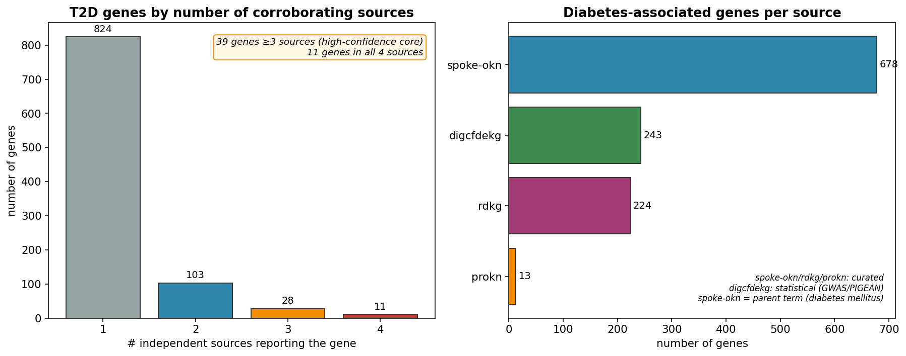
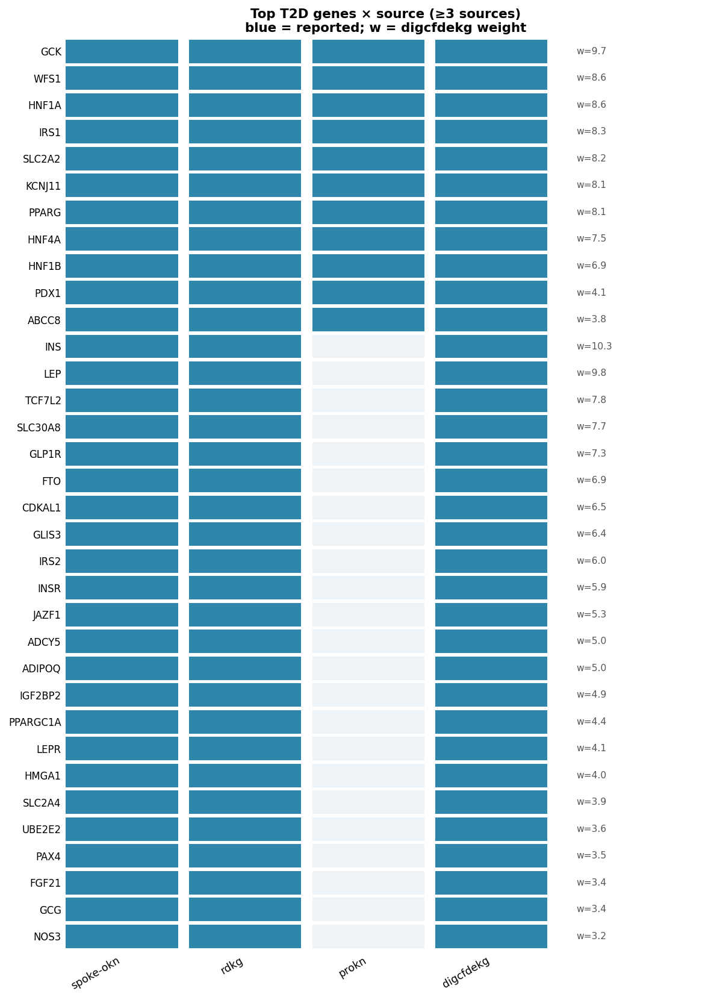
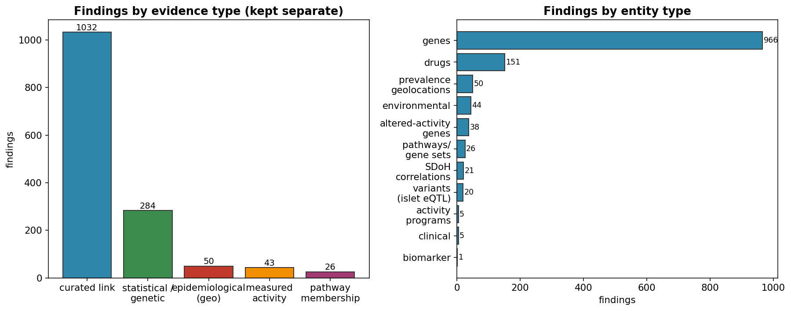
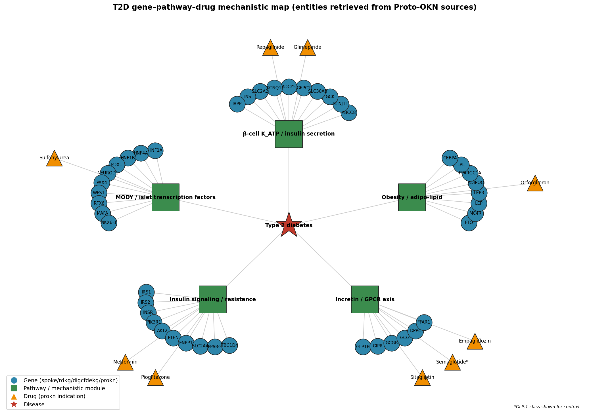
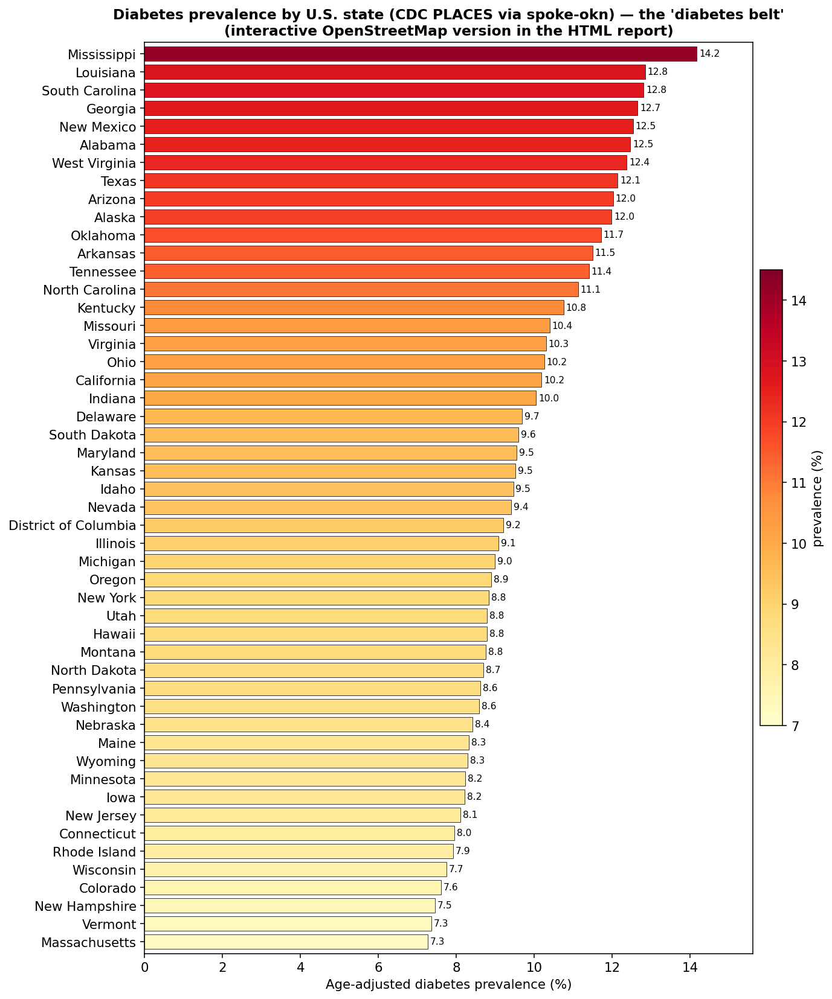
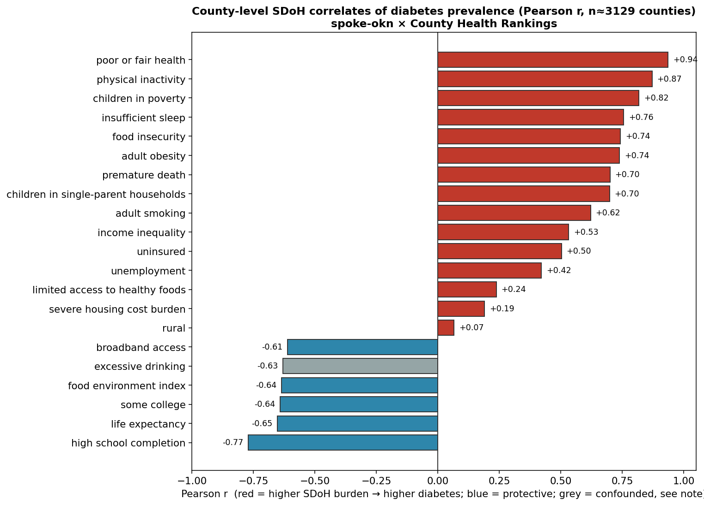

# An Evidence-Backed Map of Type 2 Diabetes Biology

### Integrated across the Proto-OKN / FRINK federated knowledge graphs

**Prepared for:** Peter · **Date:** 2026-07-05 · **Endpoint:** Proto-OKN / FRINK federated SPARQL (`https://apps.okn.us/federation/sparql`) · **Model:** claude-opus-4-8

---

## 1. Executive summary

This report maps Type 2 diabetes (T2D) biology by querying **nine biomedical knowledge graphs** on the Proto-OKN / FRINK federation and integrating their findings by entity type. The disease was anchored on **type 2 diabetes mellitus (MONDO:0005148) plus its 6 ontology subtypes** (lipoatrophic diabetes; non-insulin-dependent diabetes 1–5), and each source was queried in **its own native identifier scheme** (MONDO, DOID, OMIM, EFO, UMLS) after building a full cross-ontology crosswalk of 75 cross-references.

**1,327 findings** were integrated: **966 genes** (905 protein-coding, 61 non-coding), **151 drug/therapeutic findings**, **26 pathways/gene sets**, **43 altered-activity findings** (with islet cell type / tissue), **20 genetic-variant findings** (islet cis-eQTLs), **5 clinical features + a curated biomarker panel**, **44 environmental contributors**, and — new relative to a purely molecular map — **50 state-level prevalence measurements** and **21 social-determinant (SDoH) correlations**.

The **highest-confidence core** is exactly what T2D genetics predicts. **Eleven genes are corroborated by all four gene sources (Tier 1): ABCC8, GCK, HNF1A, HNF1B, HNF4A, IRS1, KCNJ11, PDX1, PPARG, SLC2A2, WFS1** — the β-cell K‑ATP channel, glucokinase, and the MODY/monogenic transcription-factor panel. A further **28 genes are supported by 3 sources (Tier 2)**, including the flagship common-variant genes **TCF7L2, SLC30A8, KCNQ1, CDKAL1, IGF2BP2, FTO, ADCY5, GLIS3, JAZF1** and the incretin/adipo axis (**GLP1R, ADIPOQ, LEP, LEPR**). The strongest **statistical** signal (digcfdekg PIGEAN/EAGGL, GWAS-derived) is **INS (weight 10.3)**, then **LEP 9.77, GCK 9.73, GCKR 8.97, WFS1 8.62, HNF1A 8.6**. The strongest **measured-activity** signal is **loss of β-cell-identity gene activity in T2D islets** (HNF1A, MTNR1B, FFAR4, GPR119 down; inflammatory/stress genes NUPR1, IRF8, RETN up) plus **up-regulated inflammatory programs in human islet of Langerhans** (Gene Expression Atlas). Geographically, T2D traces the U.S. **"diabetes belt"** (Mississippi 14.2%, Louisiana 12.8% → Massachusetts 7.3%), and county-level prevalence correlates most strongly with **poor/fair self-rated health (r = 0.94), physical inactivity (0.87), child poverty (0.82), food insecurity (0.74) and obesity (0.74)**, and inversely with **educational attainment (−0.77) and life expectancy (−0.65)**.

Evidence types are kept strictly separate throughout: **curated link** (1,032 findings), **statistical/genetic association** (284), **measured activity change** (43), **pathway membership** (26), and **epidemiological / geospatial** (50).

---

## 2. Sources used

Nine knowledge graphs supplied T2D evidence; `ubergraph` was used only as the ontology bridge (subtype expansion + ID crosswalks). Versions are the FRINK releases queried on 2026-07-05.

| KG (shortname) | Version | Kind of data used in this map | Entity types supplied | Disease ID scheme | Gene/other ID |
|---|---|---|---|---|---|
| **spoke-okn** | v0.0.6 | Curated disease→gene; **prevalence by location** (CDC PLACES); **SDoH by county** (County Health Rankings) | genes, prevalence, SDoH | DOID (node IRI); diabetes at **parent** DOID:9351 | Entrez (symbol) |
| **rdkg** | v0.0.1 | Curated T2D-subtype genes + microRNAs; contraindicated drugs; environmental contributors; phenotypes | genes (coding+non-coding), drugs, clinical features, exposures | MONDO subtypes | Entrez |
| **digcfdekg** (CFDE REVEAL) | v0.0.1 | **Statistical** gene–trait weights + gene sets (PIGEAN/EAGGL, GWAS-derived) | genes, gene sets | MONDO:0005148 | Entrez (symbol) |
| **prokn** (Protein KN) | v0.0.5 | Curated T2D genes/proteins; **drug indications** (ChEMBL) | genes/proteins, drugs | MONDO / OMIM (skos:exactMatch) | HGNC / Ensembl |
| **pankgraph** (PanKbase, NIDDK) | v0.0.1 | **Islet cell-type open-chromatin gene-activity** (T2D vs non-diabetic); **islet cis-eQTL variants** | altered-activity genes, variants, cell types | OCR/eQTL predicates (curated gene–condition layer is T1D) | Ensembl → symbol |
| **gene-expression-atlas-okn** | v0.0.3 | **Measured** differential expression by tissue (islet, retina, liver) | altered-activity genes/programs | MONDO:0005148 (`has_attribute`) | Ensembl / NCBI Gene; UBERON tissue |
| **biomarkerkg** | v0.0.2 | Curated clinical biomarker records + specimen | biomarkers | DOID:9352 (OBCI) | — |
| **oard-kg** | v0.0.3 | Checked — **no rows** for T2D (rare-disease EHR corpus only) | — | — | — |
| **ubergraph** | v0.0.2 | Subtype expansion + cross-ontology ID crosswalks (bridge only) | ontology | MONDO/DOID/OMIM/EFO | — |

**Checked but not contributory:** `oard-kg` returned 0 associations for T2D (it is a rare-disease EHR corpus, as for Alzheimer's); pankgraph's *curated* gene–condition layer is **type-1**-diabetes-only (176 genes to MONDO:0005147), so for T2D it contributes only its **type-2-specific measured** layers (OCR gene-activity, eQTLs).

---

## 3. Disease anchor and identifier reconciliation

Names and IDs differ across every source, so the analysis first expanded and cross-walked the disease:

- **Subtype expansion:** `ubergraph` transitive closure of MONDO:0005148 → **7 T2D terms** (type 2 diabetes mellitus; lipoatrophic diabetes; non-insulin-dependent diabetes mellitus 1–5).
- **Cross-ontology crosswalk (75 cross-references):** each MONDO term was mapped (via `ubergraph` `skos:exactMatch` / `oboInOwl:hasDbXref`) to **DOID, OMIM, EFO, UMLS, MeSH, SNOMED, NCIT, ICD**. This let each KG be queried natively: **DOID:9352** for biomarkerkg; the **parent DOID:9351 "diabetes mellitus"** for spoke-okn (which has no T2D-specific node — see §8); **MONDO subtypes** for rdkg; **MONDO:0005148** for prokn and digcfdekg (and, deliberately, *not* EFO:0004541, which turned out to be **HbA1c measurement** and pulled in erythrocyte genes).

Without this step every source under-returns: spoke-okn keys diabetes only at the parent DOID:9351; the plain MONDO IRI matches biomarkerkg's DOID nodes only after crosswalk; and confusing EFO:0004541 (HbA1c) for T2D would have injected red-cell genetics (SPTA1, ANK1, HBB…) into the gene list.

---

## 4. Confidence tiers

Findings are ranked by **number of independent sources that agree**, with statistical/measured scores as a secondary signal.

| Tier | Definition | Interpretation |
|---|---|---|
| **T1 — very high** | Gene reported by **4/4** gene sources | Established causal/core T2D or MODY gene |
| **T2 — high** | Gene by **3** sources, OR digcfdekg weight ≥5, OR significant measured change / geospatial | Strong, multiply-supported |
| **T3 — medium** | **2** sources, or weight ≥3.5, or a single curated link | Plausible, corroboration desirable |
| **T4 — low** | **1** source only | Hypothesis-generating |

Gene corroboration distribution: **4 sources → 11 genes · 3 sources → 28 genes · 2 sources → 103 genes · 1 source → 824 genes.**

---

## 5. Findings by entity type

### 5.1 Genes — protein-coding

Four gene sources contribute complementary evidence: **spoke-okn** (678, curated, parent "diabetes mellitus"), **digcfdekg** (243, statistical GWAS/PIGEAN weights), **rdkg** (224 curated, T2D-subtype emphasis), **prokn** (13 curated monogenic/T2D proteins).

**Highest-confidence set (Tier 1 — all 4 sources):**

| Gene | Role | digcfdekg weight |
|---|---|---|
| **ABCC8** (SUR1) | β-cell K‑ATP channel; sulfonylurea target; neonatal diabetes/MODY | 3.82 |
| **KCNJ11** (Kir6.2) | β-cell K‑ATP pore; insulin-secretion switch | 8.13 |
| **GCK** | Glucokinase, β-cell "glucose sensor"; MODY2 | 9.73 |
| **HNF1A** | MODY3 transcription factor | 8.60 |
| **HNF4A** | MODY1 transcription factor | 7.54 |
| **HNF1B** | MODY5 transcription factor | 6.90 |
| **PDX1** | Master β-cell/pancreas transcription factor; MODY4 | 4.13 |
| **SLC2A2** (GLUT2) | β-cell/hepatic glucose transporter | 8.18 |
| **PPARG** | Adipocyte master regulator; TZD target; MODY-adjacent | 8.06 |
| **IRS1** | Insulin-receptor substrate 1; insulin resistance | 8.29 |
| **WFS1** | Wolfram syndrome; ER-stress; common T2D risk | 8.62 |

These are precisely the monogenic (MODY / neonatal-diabetes) and K‑ATP/glucose-sensing core — the genes on which curated and statistical pipelines all converge.

**Tier 2 (3 sources), ranked by corroboration then statistical weight:** **TCF7L2** (the strongest common-variant T2D gene; w=7.85), **SLC30A8** (7.67), **KCNQ1** (2.99), **CDKAL1** (6.55), **IGF2BP2** (4.93), **INS** (10.3), **GLIS3** (6.43), **ADCY5** (5.02), **JAZF1** (5.30), **FTO** (6.92), **GLP1R** (7.32), **ADIPOQ**, **LEP** (9.77), **LEPR**, **IRS2**, **INSR**, **AKT2**, **PPARGC1A**, **PAX4**, **SLC2A4** (GLUT4), **ENPP1**, **FGF21**, **GCG**, **HMGA1**, **NOS3**, **SIRT1**, **UCP2**, **UBE2E2**.

### 5.2 Genes — non-coding

**61 non-coding genes** were recovered, kept distinct from protein-coding, almost entirely **microRNAs** from rdkg curation: **MIR375** (the canonical islet miRNA regulating insulin secretion), **MIR29A/B family, MIR126, MIR146A-class, MIR192, MIR200A, MIR21-family, MIR34-class, MIR484, MIR103/107-adjacent** and the **MIR17HG** cluster host gene, plus **MIRLET7D**. MIR375 and the MIR29 family are well-documented β-cell regulators, so their presence is biologically coherent. **Caveat:** biotype was assigned by a symbol heuristic (MIR/LINC/-AS/-DT → non-coding); lncRNAs with gene-like symbols are likely undercounted.

### 5.3 Genetic variants

Unlike the Alzheimer's map (where no variant layer existed), **pankgraph supplies a genuine islet variant layer**: **~19,400 dbSNP variants** annotated as **cis-eQTLs** (`variant affects_expression_of gene`) in human pancreatic islets, with fine-mapping statistics (credible set, PIP, effect allele, slope). The genes most densely targeted by islet cis-eQTLs include the **MHC region** (HLA-F, HLA-A, HLA-B — expected from strong LD), **FN3KRP** (fructosamine-3-kinase-related, glycation), **ACHE**, and mitochondrial complex-I genes (**NDUFV3, NDUFAF1**). **Important scope note:** these are islet regulatory eQTLs, **not** disease-anchored T2D risk variants — pankgraph's disease-anchored SNP layer is type-1-diabetes. The T2D **GWAS variant** signal itself is represented **at gene level** through digcfdekg's PIGEAN weights (§5.1). Treat a formal T2D risk-variant catalogue (dbSNP/ClinVar with odds ratios) as **not present** in the federation and therefore undercounted here.

### 5.4 Pathways and gene sets

**26 gene sets / pathways** come from digcfdekg's PIGEAN factor layer, with weights, and fall into coherent T2D themes: **MODY / β-cell programs** (`KEGG_MATURITY_ONSET_DIABETES_OF_THE_YOUNG` w=2.77; `REACTOME_REGULATION_OF_GENE_EXPRESSION_IN_BETA_CELLS` 2.71; `KEGG_TYPE_II_DIABETES_MELLITUS` 1.93; `PID_HNF3B_PATHWAY`), **adipogenesis / insulin resistance** (`WP_TRANSCRIPTION_FACTOR_REGULATION_IN_ADIPOGENESIS` 2.77; `WP_ROLES_OF_CERAMIDES_IN_DEVELOPMENT_OF_INSULIN_RESISTANCE` 2.06), **incretin/leptin & glucose homeostasis** (`REACTOME_SIGNALING_BY_LEPTIN`; `GOBP_CARBOHYDRATE_HOMEOSTASIS`; `GOBP_POSITIVE_REGULATION_OF_INSULIN_SECRETION`), and a large block of **mouse-phenotype gene sets** anchoring the β-cell axis (absent/decreased β-cell mass, abnormal insulin secretion, hyperglycemia). These provide the pathway scaffold onto which the retrieved genes and drugs map (§6).

### 5.5 Drugs / therapeutics

Two relationship types — kept separate because they mean opposite things clinically:

- **Indicated / investigated for T2D (prokn, ChEMBL "Indication"): 295 compounds** (131 named agents) — the richest therapeutic layer, spanning **every modern T2D class**: biguanide (**metformin**), **SGLT2 inhibitors** (canagliflozin, dapagliflozin, empagliflozin, ertugliflozin, bexagliflozin, sotagliflozin), **DPP-4 inhibitors** (sitagliptin, saxagliptin, linagliptin, alogliptin, vildagliptin…), **GLP-1/GIP-axis and oral small-molecule agonists** (orforglipron, danuglipron), **sulfonylureas** (glimepiride, glipizide, glyburide, gliclazide), **meglitinides** (repaglinide, nateglinide), **thiazolidinediones** (pioglitazone, rosiglitazone, lobeglitazone), **α-glucosidase inhibitors** (acarbose, miglitol, voglibose), **glucokinase activators** (dorzagliatin), **imeglimin**, **bromocriptine**, plus comorbidity/repurposing agents (statins, ACE-inhibitors/ARBs, fibrates, anti-inflammatories).
- **Contraindicated / prescribing-caution (rdkg): 20 drugs** that worsen glycemic control — thiazide and loop-adjacent diuretics (hydrochlorothiazide, chlorthalidone, chlorothiazide), **β-blockers** (atenolol), **reserpine, clonidine**, appetite suppressants (fenfluramine, diethylpropion), and corticosteroid topicals.

*(spoke-okn's `TREATS`/`CONTRAINDICATES` layer for diabetes returned only spurious chemical entries — Ozone, Sodium Nitrite, Phenol — and is **not** a reliable therapeutic list; the prokn indication layer is used instead. §8.)*

### 5.6 Genes with altered activity — with tissue / cell type

Two measured layers, kept separate from the association layers:

- **Pancreatic-islet single-cell regulatory activity (pankgraph, `measured_activity_change`).** T2D-vs-non-diabetic **open-chromatin gene-activity** is catalogued across **7 islet cell types** (α, β, δ, acinar, ductal, endothelial, macrophage; ~17,800 regions each). In **β-cells (CL:0000169)**, T2D shows **loss of β-cell-identity/function gene activity** — **HNF1A, MTNR1B, FFAR4, GPR119, HCN4, MC4R, TTR, RASGRP1** down — and **gain of stress/inflammatory activity** — **NUPR1, IRF8, IL27, FABP5, HLA-DRB5, RETN (resistin)** up. This cell-type resolution is the map's strongest T2D-specific mechanistic signal.
- **Bulk/organ differential expression (Gene Expression Atlas, `measured_activity_change`).** T2D-vs-control contrasts tag specific tissues (UBERON): **islet of Langerhans** (66 genes up, 6 down; up-regulated inflammatory/chemokine program — IL8/CXCL8, IL1B, CCL20, ICAM1), **retina** (13 up, 1 down — the diabetic-retinopathy context), and **liver** (5 up). These corroborate the islet-inflammation theme at the tissue level.

### 5.7 Clinical features, biomarkers, and environmental contributors

- **Clinical features (rdkg `has_phenotype`):** the defining T2D phenotypes — **insulin resistance, increased waist-to-hip ratio, late onset**, autosomal-dominant inheritance (MODY subtypes), and type II diabetes mellitus.
- **Biomarkers (biomarkerkg):** **27 curated T2D biomarker records** spanning specimens **blood, plasma, serum, urine, cerebrospinal fluid, and urinary bladder** (the assessed-molecule labels are not populated in this release — see §8; the clinical diagnostic standard remains HbA1c, fasting plasma glucose, OGTT, and C-peptide).
- **Environmental contributors (rdkg `contributes_to`): 44 exposures** linked to diabetes risk — **arsenic, cadmium, lead, mercury** and other metals, **bisphenol A**, **PFOA/PFOS** (per- and polyfluoroalkyl substances), **polychlorinated biphenyls**, DDE, **air pollutants / vehicle emissions**, and dioxin-class compounds — the environmental-risk dimension of T2D.

---

## 6. Cross-source corroboration and evidence-type structure

The map is dominated by **curated links** (1,032) with a substantial **statistical** layer (284, chiefly digcfdekg gene + pankgraph eQTL signals), a focused **measured-activity** layer (43, pankgraph islet + GXA), a **pathway-membership** layer (26), and a distinct **epidemiological/geospatial** layer (50). Corroboration concentrates in the gene layer, where four independent pipelines (two curated, one statistical, one curated-monogenic) converge on the canonical β-cell/MODY core. The mechanistic synthesis below places the retrieved genes, pathways, and drugs onto the established T2D modules:

---

## 7. Geospatial prevalence and social determinants of health

This is the dimension a purely molecular map omits, and the Proto-OKN federation supports it directly through **spoke-okn**, which co-locates disease, geography (state/county/ZIP with latitude–longitude), and SDoH in one graph.

### 7.1 Prevalence by geolocation — the "diabetes belt"

CDC **PLACES** age-adjusted diabetes prevalence (27,565 place-level records) aggregates to a stark geography: the **Southeast "diabetes belt"** leads — **Mississippi 14.2%, Louisiana 12.8%, South Carolina 12.8%, Georgia 12.7%, New Mexico 12.5%, Alabama 12.5%, West Virginia 12.4%** — while the lowest-burden states are in New England and the Mountain West — **Massachusetts 7.3%, Vermont 7.3%, New Hampshire 7.5%, Colorado 7.6%**.

The geographic view is rendered on an **OpenStreetMap** basemap (Leaflet): interactively inside **`T2D_knowledge_map_report.html`** and as a standalone full-screen map in **`T2D_prevalence_map.html`** (open either in a browser — the OSM tiles load live). The static ranking below is a companion, not a lat/long plot.

### 7.2 Correlations with social determinants (county-level, ecological)

Joining county diabetes prevalence to County Health Rankings SDoH variables across **~3,100 counties** yields strong, coherent ecological correlations (Pearson r). Diabetes prevalence rises with **poor/fair self-rated health (r = 0.94), physical inactivity (0.87), children in poverty (0.82), insufficient sleep (0.76), food insecurity (0.74), adult obesity (0.74), premature death (0.70), single-parent households (0.70), adult smoking (0.62), income inequality (0.53), and uninsurance (0.50)**, and falls with **educational attainment (high-school completion −0.77; some college −0.64), life expectancy (−0.65), the food-environment index (−0.64), and broadband access (−0.61)**. Rural status is near-null (r = 0.07). One entry — **excessive drinking (r = −0.63)** — is spurious; it is explained directly beneath the figure.

**Why "excessive drinking" shows a spurious −0.63 — and why it is *not* protective.** The raw values are intact (age-adjusted % of adults reporting binge/heavy drinking, mean 19.1% per county, stored as `value(SE)` and parsed correctly), so the negative sign is not a data error. It is **ecological confounding by socioeconomic status**: at the county level excessive drinking behaves as an *affluence marker*. It correlates **positively** with high-school completion (+0.48), life expectancy (+0.48), some college (+0.40) and broadband access (+0.33), and **negatively** with children in poverty (−0.51), food insecurity (−0.54), physical inactivity (−0.58), obesity (−0.42) and smoking (−0.37). Wealthier, better-educated counties (Upper Midwest, Mountain West, urban) report *more* binge/heavy drinking but have *less* diabetes, whereas the poor rural "diabetes belt" reports *less* excessive drinking (more abstention and "dry" counties) but far *more* diabetes. The −0.63 therefore tracks the socioeconomic gradient rather than any effect of alcohol — a textbook ecological fallacy. Accordingly it is down-tiered to **T4** in the findings CSV and greyed out in the figure above; it should not be read as alcohol protecting against diabetes.

All of these are **ecological (county-level) associations**, not individual-level causal effects, and diabetes prevalence here is the parent "diagnosed diabetes" measure (≈90–95% T2D). With the excessive-drinking caveat above, they otherwise reproduce the established socioeconomic gradient of T2D with unusually high consistency.

---

## 8. Caveats, uncertainties, and likely undercounts

1. **spoke-okn resolves diabetes only at the parent term** ("diabetes mellitus", DOID:9351). Its gene, prevalence, and SDoH layers therefore describe **all diagnosed diabetes** (predominantly but not exclusively T2D), which both **inflates the single-source gene count** (678 genes, including monogenic/syndromic/T1D genes such as the BBS ciliopathy and mitochondrial ND-complex families) and means the geospatial layer is a T2D **proxy**. The corroborated core (≥3 sources) is unaffected.
2. **Genetic variants are undercounted as T2D risk variants.** pankgraph gives a rich *islet cis-eQTL* layer (~19,400 SNPs) and fine-mapping, but no federation KG exposes a T2D-**disease-anchored** variant catalogue with odds ratios; GWAS variant signal survives only at gene level (digcfdekg).
3. **pankgraph's curated gene–condition layer is type-1 diabetes.** For T2D, pankgraph contributes only its type-2-specific *measured* layers (OCR gene-activity, eQTLs) — so it does not corroborate T2D genes in the four-source count.
4. **Non-coding genes undercounted.** Biotype was assigned by symbol heuristic (MIR/LINC/-AS/-DT → non-coding); lncRNAs with gene-like symbols are misclassified as coding.
5. **biomarkerkg molecule labels not populated** in this release for the 27 T2D records; only specimen (UBERON) resolved. The clinical diagnostic biomarkers (HbA1c, fasting/2-h glucose, C-peptide) are stated from clinical standard, not extracted.
6. **digcfdekg EFO caution.** EFO:0004541 is **HbA1c measurement**, not T2D; using it would import erythrocyte/red-cell genetics. The T2D layer here uses MONDO:0005148 only.
7. **spoke-okn drug (`TREATS`) layer is unreliable for diabetes** (spurious chemical entries); the prokn ChEMBL "Indication" layer is used instead, understanding it mixes approved, investigational, and failed compounds.
8. **SDoH/prevalence are ecological**, county/state-level, and mostly single-year; they show association, not individual causation.
9. **oard-kg** returned no T2D rows (rare-disease EHR corpus); its absence is a coverage limit, not evidence of absence.

---

## 9. Reproducibility

Every SPARQL query (verbatim, with the graphs hit and row counts) is preserved in the companion transcript **`T2D_analysis_transcript.md`**, generated from the session query log. Integration logic is **`integrate.py`**; figures are **`viz.py`**. The complete machine-readable table is **`T2D_knowledge_map_findings.csv`** (1,327 rows) and the gene cross-source matrix is **`T2D_gene_source_matrix.csv`**; the interactive report with the embedded OpenStreetMap prevalence map and a searchable/sortable table is **`T2D_knowledge_map_report.html`**. Re-running against the same KG versions (§2) reproduces the counts.
