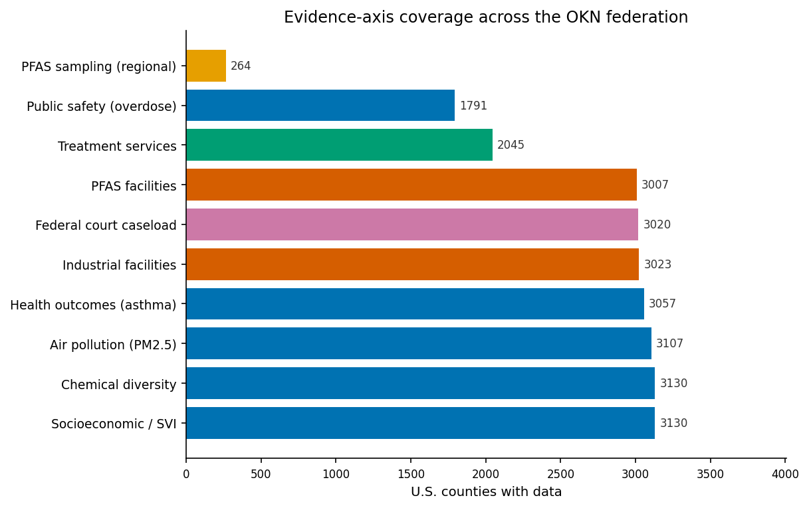
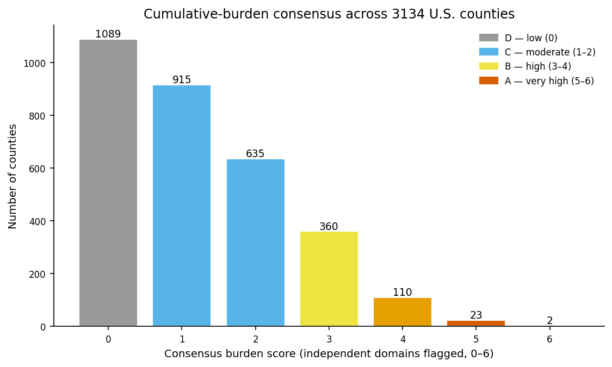
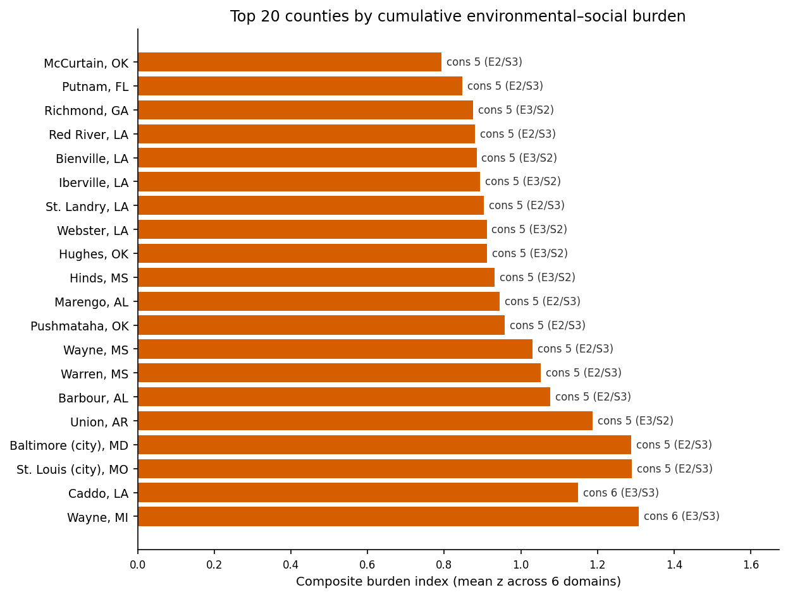
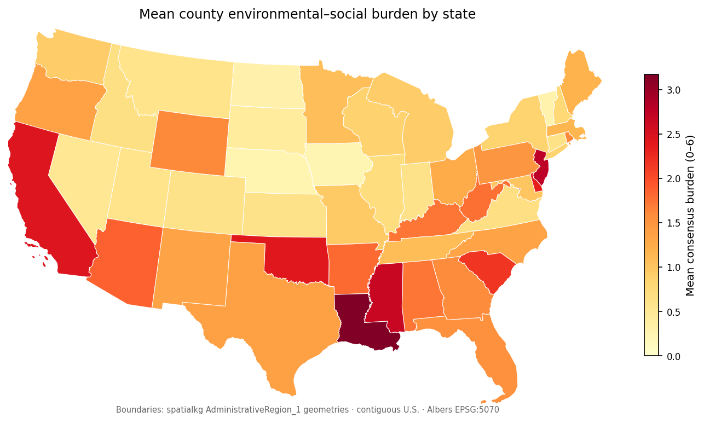
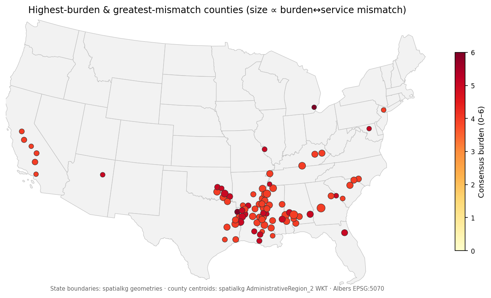
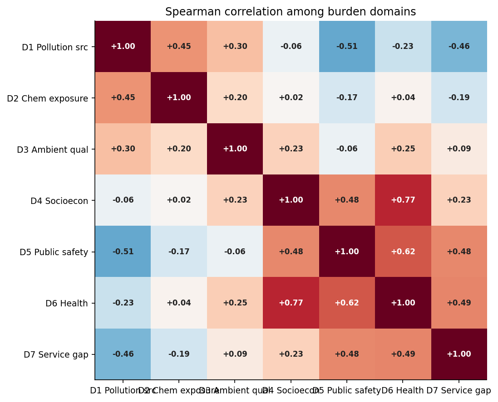
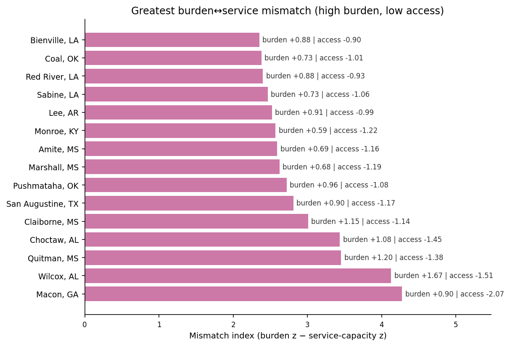
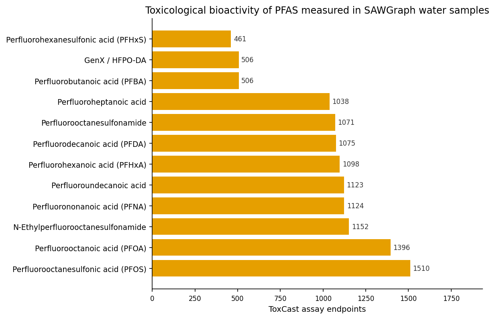

# Cumulative Environmental Justice Burden Across U.S. Counties
### A reproducible, multi–knowledge-graph integration over the Proto-OKN federated SPARQL endpoint

**Date:** 2026-07-23 · **Endpoint:** OKN federated SPARQL · **Model:** claude-opus-4-8

> **Framing (non-negotiable).** The unit of analysis is the **U.S. county** (5-digit FIPS), across **3134** counties spanning **50 states + DC** (facility, PFAS, and geospatial axes cover the 48 contiguous states + DC, the extent of the spatial backbone). All results are **observational county-level associations** assembled by integrating independent knowledge graphs on a shared geographic key — **hypothesis-generating, not causal or individual-level inference**. Evidence types are kept **separate** and never merged into a single confidence score; the headline ranking is a **consensus count** of how many independent burden domains flag a county. This framing caveat travels with every downstream claim.

**Abbreviations.** OKN = Open Knowledge Network; KG = knowledge graph; FIPS = Federal Information Processing Standards county code; S2 = S2 discrete global geospatial grid; CHR = County Health Rankings; SVI = CDC/ATSDR Social Vulnerability Index; SDoH = social determinants of health; PLACES = CDC Population Level Analysis and Community Estimates; EPA FRS = EPA Facility Registry Service; NAICS = North American Industry Classification System; PFAS = per- and polyfluoroalkyl substances; PFOS/PFOA = perfluorooctane sulfonic / octanoic acid; CAS = Chemical Abstracts Service registry number; ToxCast = EPA high-throughput toxicity screening; AOP = Adverse Outcome Pathway; MIE = molecular initiating event; PPAR = peroxisome proliferator-activated receptor; NAFLD = non-alcoholic fatty liver disease; SAMHSA = Substance Abuse and Mental Health Services Administration; ρ = Spearman rank correlation.

## 1. Executive summary

Integrating **eight** Proto-OKN knowledge graphs on the shared county-FIPS key, we built a per-county profile of cumulative environmental and social burden for **3134** U.S. counties, spanning six independent burden domains — industrial pollution sources, chemical/PFAS exposure, ambient environmental quality, socioeconomic vulnerability, public safety, and health outcomes — plus a service-access domain. Rather than collapse these into one index, we grade each county by a **consensus score**: the number of independent domains (0–6) in which it falls in the national worst quintile.

Cumulative burden is **spatially concentrated**. **25** counties are Tier A (very high; 5–6 corroborating domains) and **470** more are Tier B (high; 3–4 domains) — together **15.8%** of counties. The two counties flagged on **all six** domains are **Wayne County, Michigan** (Detroit) and **Caddo Parish, Louisiana** (Shreveport). The heaviest cluster is the **Lower Mississippi Valley / Deep South**: Louisiana averages **3.17** corroborating domains per county (**46/64** counties high-burden) and Mississippi flags **51/82**, alongside legacy-industrial cities (St. Louis, Baltimore) and dense-industrial metros in New Jersey and California.

The greatest **burden↔service mismatch** — high cumulative burden paired with the weakest healthcare access — falls on rural, high-poverty **Black Belt** counties: **Macon County, Georgia**, **Wilcox County, Alabama**, and **Quitman County, Mississippi**. Socioeconomic vulnerability and health-outcome burden are tightly coupled (ρ = **0.765**), whereas raw industrial-facility counts are *decoupled* from — even inversely related to — social and public-safety burden (ρ = **-0.511**), a county-scale count-vs-rate signal we flag explicitly.

What this adds: a **reproducible, federated** synthesis that corroborates place-based burden across genuinely independent data pipelines (EPA facilities, CDC/CHR health-and-social data, SAMHSA services, SCALES federal courts, SAWGraph PFAS, EPA ToxCast/AOP-Wiki toxicology) on one geographic key — surfacing not just *where* burden is highest but *where corroboration is strongest and services are scarcest*.

## 2. Sources used

Every KG below was queried directly (logged SPARQL); each row traces to at least one query in the reproducibility record. Join keys are the verified federation crosswalks.

| KG | Version | Updated | Role in this study | Join key / confidence |
|---|---|---|---|---|
| spoke-okn | v0.0.6 | 2026-03-16 | Health outcomes, SDoH & CDC SVI, chemical & environmental exposure per county (CHR + CDC PLACES + measured contamination) | county FIPS (node IRI `/location/{FIPS5}`); place→county via `PARTOF_LpL` — high |
| spatialkg | v0.0.6 | 2026-05-07 | Geospatial backbone: S2 L13 → county → state hierarchy; county centroids | `hasFIPS`; S2 `sfWithin` — high |
| fiokg | v0.0.11 | 2026-03-18 | EPA FRS regulated facilities + EPA PFAS facilities per county (NAICS industry) | facility `owl:sameAs` S2 → `sfWithin` county — high |
| scales | v0.0.22 | 2026-03-18 | Federal court caseload per county (justice-system activity) | `hasIdbCounty` (numeric FIPS) → spoke-okn — high |
| ruralkg | v0.2.7 | 2026-06-08 | SAMHSA substance-use / mental-health treatment providers per county | `serviceLocation`→`containedInPlace` county FIPS — high |
| sawgraph | v0.0.15 | 2026-03-16 | Measured PFAS water-sample contamination (regional) | sample `owl:sameAs` S2 → `sfWithin` county — regional coverage |
| biobricks-toxcast | v0.0.2 | 2026-03-18 | ToxCast high-throughput bioactivity for the PFAS measured in SAWGraph | CAS — high |
| biobricks-aopwiki | v0.0.4 | 2026-03-18 | Adverse Outcome Pathway linking PFAS→PPAR→liver steatosis | AOP entity / CAS-linked stressor — high |

## 3. Design & rules

We treat cumulative burden as **corroboration across independent data sources**, not a single weighted index. Each of 3134 counties was profiled on **31 indicators** drawn from the eight KGs and grouped into **seven domains** (six burden domains D1–D6 plus a service-access domain D7). Indicators that are *rates* (County Health Rankings / CDC SVI percentages and rates, CDC PLACES disease prevalence) are used as-is; indicators that are *counts* (EPA facilities, PFAS facilities, federal cases, PFAS samples) are used as absolute-exposure signals and interpreted with a population caveat (§10). Every indicator carries its **evidence type, source KG, geographic level, and direction** in a separate evidence table (`data/evidence_long.csv`), preserving evidence types rather than fusing them.

For each domain we standardise its indicators (direction-adjusted z-scores so higher = more burden), average the available ones into a domain index, and flag a county **high-burden in that domain** if its domain index sits in the national **worst quintile** (≥80th percentile). The **consensus score** is the number of the six burden domains (D1–D6) flagged; the **service-scarcity flag** (D7) is kept separate for the mismatch analysis. Disease prevalence, reported by CDC PLACES at Census-place level, is rolled up to county as a population-weighted mean via spoke-okn's `PARTOF_LpL` place→county edges. Full replicator specification (exact indicator lists, thresholds, join recipes, and the mismatch formula) is in the reproducibility file.

> ***Figure 1. Multi-source design — county coverage per evidence axis (spoke-okn, fiokg, scales, ruralkg, sawgraph).*** Horizontal bars give the number of U.S. counties with data for each evidence axis, coloured by the supplying knowledge graph. National axes (spoke-okn CHR/SVI/health, fiokg facilities, scales caseload) cover ~3,000+ counties; SAWGraph PFAS is a dense regional layer; ruralkg treatment providers are sparser (SAMHSA facility locations). Provenance: `notna()` counts over the integrated master table, one column per axis.

The federation gives near-complete county coverage on the national axes (spoke-okn, fiokg, scales) and progressively sparser coverage on the regional (sawgraph) and facility-directory (ruralkg) axes — a coverage gradient carried into every downstream flag.

## 4. Confidence tiers

Counties are tiered by how many independent burden domains corroborate high burden:

| Tier | Criterion (burden domains flagged) | Counties |
|---|---|---|
| **A — very high** | 5–6 of 6 | **25** |
| **B — high** | 3–4 of 6 | **470** |
| **C — moderate** | 1–2 of 6 | **1550** |
| **D — low** | 0 of 6 | **1089** |

Only **2** counties are flagged on all six domains and **23** on five; the tail is genuinely selective. **48** counties are *double-burden* — flagged in ≥2 environmental domains **and** ≥2 social/health domains — the counties where environmental and social disadvantage most clearly co-locate.

> ***Figure 2. Distribution of the consensus burden score across 3134 counties.*** Bars count counties by the number of independent burden domains flagged (0–6), coloured by tier (grey = low, blue = moderate, yellow = high, red = very high). Provenance: per-domain worst-quintile flags summed over spoke-okn/CHR, fiokg, and sawgraph indicators.

The distribution is right-skewed: most counties flag 0–2 domains, and the high-burden tail (≥3 domains) is the analytic focus.

## 5. Findings by axis

### 5.1 Primary ranking — cumulative-burden counties

Ranking by consensus score (ties broken by the composite burden index) puts **Wayne County, Michigan** and **Caddo Parish, Louisiana** at the top — each flagged on all six domains — followed by **St. Louis city**, **Baltimore city**, and a dense run of Lower Mississippi Valley parishes and Deep South counties.

> ***Figure 3. Top 20 counties by cumulative environmental–social burden.*** Bars give each county's composite burden index (mean of direction-adjusted z-scores across the six domains); annotations give the consensus score and the environmental/social domain split (E = environmental domains flagged of 3, S = social/health of 3); colour = tier. Provenance: integrated per-county domain indices (spoke-okn CHR/SVI/PLACES, fiokg, sawgraph).

Almost every top county flags **both** environmental **and** social domains (E and S each ≥2), confirming these are genuine double-burden places rather than counties extreme on a single axis.

### 5.2 Geographic distribution and hot-spots

Burden is regionally structured. Aggregating to the state level, the **Lower Mississippi Valley and Deep South** dominate: Louisiana (mean **3.17** domains/county), Mississippi, Arkansas, Oklahoma, and South Carolina carry the highest mean county burden, with secondary clusters in the industrial Northeast (New Jersey) and California's Central Valley / South Coast.

> ***Figure 4. National pattern — mean county burden by state.*** Choropleth of the 48 contiguous states + DC, each state filled by the mean consensus score of its counties, drawn from **spatialkg `AdministrativeRegion_1` polygon geometries** and rendered in the Albers equal-area projection (EPSG:5070). Provenance: county consensus scores rolled up by `state_fips` onto the spatialkg state boundaries. (Static OpenStreetMap tiles were unreachable in the build sandbox, so the basemap is drawn from the federation's own boundary geometries; the OSM-tiled interactive version is the companion map named below.)

> ***Figure 5. County hot-spots — highest-burden and greatest-mismatch counties (n = 83).*** The 83 highest-burden / greatest-mismatch counties as points on the **spatialkg state-boundary polygons** (Albers equal-area, EPSG:5070), coloured by consensus score (0–6) and sized by burden↔service mismatch. The two darkest points are Wayne County, Michigan and Caddo Parish, Louisiana. Provenance: county centroids computed from spatialkg `AdministrativeRegion_2` WKT geometries, joined to the per-county consensus and mismatch indices; state boundaries from spatialkg `AdministrativeRegion_1`. A fully interactive, OpenStreetMap-tiled, zoomable version with clickable county markers is the companion file `Environmental-Justice_county_map.html`.

<!-- COUNTY_MAP -->

The maps make the concentration visible: a contiguous belt of high-burden counties runs from east Texas and Louisiana up the Mississippi and across the Black Belt of Alabama, Mississippi, and Georgia, punctuated by isolated high-burden metros (Wayne MI, St. Louis, Baltimore, Essex NJ).

### 5.3 How the domains relate

Because we keep domains separate, we can measure how they co-vary. Socioeconomic vulnerability and adverse health outcomes are strongly coupled (ρ = **0.765**), and public-safety burden tracks both (ρ = **0.618** with health). Chemical exposure co-occurs with industrial facilities (ρ = **0.449**). Strikingly, **industrial-facility density is negatively correlated with public-safety burden (ρ = -0.511) and with service scarcity (ρ = -0.455)** — facility *counts* peak in populous metros that also have more providers, while the worst social/health/safety *rates* concentrate in poor rural counties (see §7).

> ***Figure 6. Spearman correlation among the seven domains.*** Diverging heatmap of ρ between domain indices (red = positive, blue = negative); D1 pollution sources, D2 chemical exposure, D3 ambient quality, D4 socioeconomic, D5 public safety, D6 health outcomes, D7 service scarcity. Provenance: Spearman correlation of per-county domain indices (`data/domain_correlations.csv`).

The social cluster (D4–D6) is internally coherent and correlates with service scarcity (D7), whereas the environmental-source cluster (D1) sits apart — the core tension this study surfaces.

## 6. Domain analyses

### 6.1 Burden↔service mismatch (environmental justice priority)

The environmental-justice question is not only *where is burden highest* but *where is burden highest and help scarcest*. We define a **mismatch index** = (mean burden-domain z) − (service-capacity z), where service capacity aggregates primary-care and mental-health provider availability (CHR) and SAMHSA treatment-provider density (ruralkg). Among counties with consensus ≥ 4, the mismatch peaks in rural, high-poverty counties of the Black Belt and Appalachian fringe.

> ***Figure 7. Greatest burden↔service mismatch (high burden, low access).*** Bars give the mismatch index for the 15 highest-mismatch counties (consensus ≥ 4); annotations give the burden z and service-capacity z separately. Provenance: burden index (spoke-okn/fiokg/sawgraph domains) minus service-capacity z (CHR provider ratios + ruralkg providers).

These counties — **Macon County, Georgia**, **Wilcox County, Alabama**, **Quitman County, Mississippi**, and peers — combine top-quintile cumulative burden with bottom-tier provider access; they are the highest-priority candidates for service investment.

### 6.2 Chemical exposure → toxicology mechanism (why PFAS matters)

To connect place-based chemical exposure to a biological mechanism, we chained the PFAS **measured** in SAWGraph water samples to their toxicological profiles. **32** of SAWGraph's measured PFAS carry EPA ToxCast high-throughput bioactivity: PFOS (CAS 1763-23-1) hits **1510** assay endpoints and PFOA (335-67-1) **1396**. Those same compounds anchor a curated Adverse Outcome Pathway.

> ***Figure 8. Toxicological bioactivity of the PFAS measured in SAWGraph water samples (biobricks-toxcast).*** Bars give the number of EPA ToxCast assay endpoints per measured PFAS (CAS-joined). Provenance: SAWGraph `casNumber` → ToxCast `has_identifier` → `participates in` assay endpoints.

AOP-Wiki **AOP 529** spells out the mechanism these bioactivities imply: the **molecular initiating event** is a *stressor binding PPAR isoforms*, proceeding through *disrupted PPAR nuclear signalling* → *dysregulated PPAR-network transcription* → *decreased mitochondrial fatty-acid β-oxidation* and *triglyceride/fatty-acid accumulation* → the **adverse outcome, increased liver steatosis**. This is a KG-federated exposure→mechanism→outcome bridge: SAWGraph (where measured) → ToxCast (what it perturbs) → AOP-Wiki (what disease it drives). It is a hypothesis-generating link, not evidence that any specific county's contamination caused disease.

### 6.3 Declared coverage — analyses run vs. deliberately scoped out

To avoid a silent half-completion, we state which candidate axes were **run** and which were **scoped out**: **Run** — industrial facilities (fiokg), PFAS facilities (fiokg), chemical diversity (spoke-okn), measured PFAS (sawgraph), ambient PM2.5 & drinking-water violations (CHR), socioeconomic/SVI (CHR), public safety (CHR + scales), health outcomes (CHR + CDC PLACES), service access (CHR + ruralkg), and the PFAS toxicology chain (biobricks-toxcast + aopwiki). **Scoped out with reason** — *urban flooding* (ufokn): the national S2 join exceeds the endpoint's operation budget (verified HTTP 429), so it is a regional-only layer not integrated into the national ranking; *water/hydrology* (geoconnex, hydrologykg) and *soil carbon* (sockg): available on the county/S2 hub but regionally scoped (hydrologykg ≈ Illinois, sockg multi-state) and not national; *climate* (climatemodelskg): joins only ~947 counties (30% coverage), too partial for a national quintile flag; *neighborhood justice* (nikg): resolves to only 2 counties at the county-FIPS level (a data-model gap), so it cannot contribute a county axis. Each is a declared scope decision, not an omission.

## 7. Discussion

The federation tells a two-part story. First, cumulative environmental-and-social burden is **real, corroborated, and concentrated**: 15.8% of counties reach Tier A/B, and the worst — Wayne County, Michigan, Caddo Parish, Louisiana, St. Louis, Baltimore, and the Lower Mississippi Valley belt — are flagged independently by EPA facility data, CDC health-and-social data, and (regionally) measured PFAS, so the ranking does not rest on any single pipeline. Second, the domains that most tightly co-locate are the **social** ones: socioeconomic vulnerability, adverse health outcomes, and public safety form a coherent cluster (ρ up to 0.765) that also predicts **service scarcity** — the classic environmental-justice double bind of high need and low capacity, sharpest in the rural Black Belt (§6.1).

The **decoupling of industrial-facility counts from social/health burden** (ρ = -0.511) deserves care. At the county scale, a raw facility count is partly a population count: large metros host the most EPA-regulated facilities *and* the most providers, so a count-based pollution-source axis pulls toward well-resourced metros, while rate-based social/health axes pull toward poor rural counties. This is a measurement artifact as much as a finding, and it argues for **sub-county (tract/block-group) analysis with population-normalised source density** to test whether facility burden truly falls on vulnerable populations — the well-documented pattern our county-count metric cannot resolve. It is the study's central testable prediction.

Actionable implications, flagged by evidence strength: (a) the Tier-A double-burden counties are priorities for **coordinated** environmental and health intervention; (b) the high-mismatch Black Belt counties are priorities for **service** investment specifically; (c) the SAWGraph→ToxCast→AOP-Wiki chain identifies **PFOS/PFOA-driven hepatic outcomes** as a mechanistically-plausible surveillance target where PFAS is measured.

## 8. Comparison with prior work

According to **PubMed**, we compared each headline finding against the primary literature. The per-claim record with citations is in `Environmental-Justice_literature_comparison.md`; every `[n]` below resolves to §12.

| # | Claim | Concordance |
|---|---|---|
| 1 | Cumulative burden concentrates in a Lower Mississippi Valley / Deep South belt plus legacy-industrial cities. | **SUPPORTED** — index-based cumulative-burden + social-vulnerability "hotspot" mapping recovers the same disproportionately-burdened geographies [3][4][5]. |
| 2 | Combining multiple environmental burdens with social vulnerability into corroborated hot-spots is a valid EJ method. | **SUPPORTED** — established index/hotspot frameworks combine multi-source burdens with vulnerability, and recommend keeping chemical and non-chemical stressors distinct [3][4][5]. |
| 3 | The burden↔service mismatch peaks in rural, high-poverty (Black Belt) counties with provider shortages. | **SUPPORTED** — rural, segregated Southern counties show both elevated exposure risk and persistent place-based service/health disparities [6][7]. |
| 4 | Measured PFAS (PFOS/PFOA) act via PPARα to drive hepatic lipid dysregulation and steatosis (AOP 529). | **SUPPORTED** — PFAS exposure is associated with hepatic steatosis/NAFLD, and PPARα activation by PFOA/PFOS is the identified molecular initiating event [1][2]. |
| 5 | Residential segregation co-occurs with elevated air-toxicant exposure and respiratory disparities. | **SUPPORTED** — African-American–segregated Southern counties are markedly more likely to face high air-toxicant exposure [7]. |
| 6 | County-level industrial-facility *counts* are decoupled from (even inversely related to) social/health burden. | **MIXED** — the EJ literature robustly reports facilities concentrating in vulnerable communities at *sub-county* scale [5][7]; our inverse county-scale correlation reflects a count-vs-rate/population artifact, not a contradiction (§7). |

Concordance was assessed against PubMed abstracts and indexed metadata; no claim required full-text retrieval beyond the abstract for the verdict shown. **Where the KG evidence diverges from the literature:** the only divergence is Claim 6, and it is a **scope/measurement** difference (county-level counts vs. sub-county population-normalised density), not a graph error — the prior work operates at a finer spatial grain than the county unit this federation joins on. No claim was contradicted.

## 9. Full ranked results

The complete ranked table of all 3134 counties — every domain index, consensus score, tier, mismatch index, and the contributing source KGs — is in `Environmental-Justice_results.xlsx` (sheet *Ranked results*) and `data/master_county.csv`. The interactive table below is sortable (click a header), filterable (search box + pull-downs for tier, state, and service-scarcity), and paginated; the **sources (n)** column shows how many federation KGs corroborate each county, with a pill per source (spoke-okn = health/SDoH/exposure, fiokg = facilities, scales = federal caseload, ruralkg = services, sawgraph = measured PFAS).

<!-- RESULTS_TABLE -->

The ranking shows the Tier-A counties are broadly corroborated (5+ sources) rather than artifacts of a single graph, and lets a reader isolate, e.g., high-burden **service-scarce** counties in a single state for targeted follow-up.

## 10. Summary of findings & limitations

**Findings recap.** Across 3134 U.S. counties, cumulative environmental-and-social burden is concentrated: **25** Tier-A and **470** Tier-B counties (15.8% combined), led by **Wayne County, Michigan** and **Caddo Parish, Louisiana** (all six domains) and a Lower Mississippi Valley / Deep South belt (Louisiana 46/64 high-burden). Socioeconomic and health burden are tightly coupled (ρ = 0.765) and predict service scarcity; the sharpest burden↔service mismatch falls on rural Black Belt counties (**Macon County, Georgia**, **Wilcox County, Alabama**, **Quitman County, Mississippi**). A federated exposure→mechanism chain links measured PFAS (PFOS 1510 ToxCast endpoints) through PPAR signalling to liver steatosis (AOP 529).

**Limitations.**

1. **Observational and ecological.** All associations are county-level; nothing here supports individual-level or causal claims, and county aggregates mask within-county (tract/neighborhood) disparities that are central to environmental justice.
2. **Count vs. rate.** Facility, PFAS-facility, federal-case, and provider *counts* scale with population, biasing count-based domains toward large metros; rate-based domains (CHR/SVI/PLACES) do not. The industrial-source↔social-burden decoupling (§7) is partly this artifact. Federal caseload (scales) is reported as a separate justice-*activity* indicator and deliberately excluded from the consensus domains for this reason.
3. **Uneven coverage.** SAWGraph PFAS is Maine-centric (264 counties nationally; top Aroostook County, Maine, 15241 samples), ruralkg providers are a partial SAMHSA directory, and facility/PFAS/geospatial axes cover only the 48 contiguous states + DC. Absence of data is not absence of burden.
4. **Threshold sensitivity.** The worst-quintile flag and the A/B/C tier cuts are analyst choices; counties near a threshold can move tiers under a different cutoff. The composite burden index is provided for continuous ranking.
5. **Provenance heterogeneity.** Many indicators derive from the County Health Rankings pipeline within spoke-okn and are therefore correlated by construction; cross-KG independence is strongest between spoke-okn, fiokg, scales, ruralkg, and sawgraph, and that is where "consensus" is most meaningful.
6. **Scoped-out layers.** Flooding (ufokn), water/hydrology (geoconnex/hydrologykg), soil (sockg), and climate (climatemodelskg) were not integrated into the national ranking (§6.3) for endpoint-scale or coverage reasons; a fuller model would add them regionally.
7. **Mechanism is generative.** The PFAS→PPAR→steatosis chain (AOP 529) is a plausibility bridge from measured exposure to a documented pathway, not evidence of disease causation in any county.

## 11. Reproducibility

Everything needed to replicate this analysis — the originating prompt, the replicator specification (indicator lists, thresholds, join recipes, mismatch formula, verified quantities), every supporting SPARQL query verbatim with its row count, pinned KG versions, and timing — is in **[Environmental-Justice_reproducibility.md](Environmental-Justice_reproducibility.md)**, with the analysis scripts in `scripts/` and intermediate extracts in `data/`.

## 12. References

> Retrieved via the **PubMed** MCP connector.

1. Yang W, et al. PPARα/ACOX1 as a novel target for hepatic lipid metabolism disorders induced by per- and polyfluoroalkyl substances: An integrated approach. *Environ Int*. 2023. PMID:37572494 · [doi:10.1016/j.envint.2023.108138](https://doi.org/10.1016/j.envint.2023.108138)
2. Tompach MC, et al. Comparing the effects of developmental exposure to alpha lipoic acid (ALA) and perfluorooctanesulfonic acid (PFOS) in zebrafish (Danio rerio). *Food Chem Toxicol*. 2024. PMID:38432440 · [doi:10.1016/j.fct.2024.114560](https://doi.org/10.1016/j.fct.2024.114560)
3. Shrestha R, et al. Environmental Health Related Socio-Spatial Inequalities: Identifying "Hotspots" of Environmental Burdens and Social Vulnerability. *Int J Environ Res Public Health*. 2016. PMID:27409625 · [doi:10.3390/ijerph13070691](https://doi.org/10.3390/ijerph13070691)
4. Habran S, et al. Development of a spatial web tool to identify hotspots of environmental burdens in Wallonia (Belgium). *Environ Sci Pollut Res Int*. 2019. PMID:30725260 · [doi:10.1007/s11356-019-04418-5](https://doi.org/10.1007/s11356-019-04418-5)
5. Varshavsky JR, et al. Current practice and recommendations for advancing how human variability and susceptibility are considered in chemical risk assessment. *Environ Health*. 2023. PMID:36635753 · [doi:10.1186/s12940-022-00940-1](https://doi.org/10.1186/s12940-022-00940-1)
6. Wiese LAK, et al. Global rural health disparities in Alzheimer's disease and related dementias: State of the science. *Alzheimers Dement*. 2023. PMID:37218539 · [doi:10.1002/alz.13104](https://doi.org/10.1002/alz.13104)
7. Querdibitty CD, et al. Geographic and social economic disparities in the risk of exposure to ambient air respiratory toxicants at Oklahoma licensed early care and education facilities. *Environ Res*. 2022. PMID:36462693 · [doi:10.1016/j.envres.2022.114975](https://doi.org/10.1016/j.envres.2022.114975)
