# Environmental Justice across U.S. counties — Reproducibility record

- **Date:** 2026-07-23
- **Model:** claude-opus-4-8
- **SPARQL endpoint:** https://apps.okn.us/federation/sparql
- **Generated by:** mcp-okn v0.1.0
- **Study active window:** 2026-07-23 06:40–07:13 UTC (32m 29s)
- **Contents:** 17 queries · 17 query diagrams

## Prompt

Conduct a reproducible, multi-knowledge-graph integrative study of environmental justice across U.S. counties to identify communities experiencing the greatest cumulative environmental and social burden. Follow the /okn-bioanalysis workflow and produce the final report using /okn-report-style.
Objectives: 1. Characterize cumulative environmental burden (integrate indicators of environmental exposures, pollution, infrastructure, public safety, socioeconomic conditions, access to services; harmonize geography across KGs). 2. Integrate health and social determinants of health (relate environmental/justice indicators to health outcomes, disease burden, healthcare access; identify geographic patterns, disparities, overlapping burdens). 3. Integrate supporting evidence from all relevant Proto-OKN KGs; for every finding record supporting sources, relationship type, geographic level, measured value/score, evidence type; preserve different evidence types separately rather than combining into a single confidence score. 4. Consensus analysis: rank counties by cumulative environmental burden using corroborating evidence from independent data sources; identify counties with highest cumulative burden, greatest mismatch between burden and services, major drivers, correlations between environmental indicators/public safety/SDoH/health outcomes, and important uncertainties, conflicting evidence, and data gaps.

## Knowledge graphs used

- `spoke-okn` — <https://purl.org/okn/frink/kg/spoke-okn>
- `spatialkg` — <https://purl.org/okn/frink/kg/spatialkg>
- `fiokg` — <https://purl.org/okn/frink/kg/fiokg>
- `scales` — <https://purl.org/okn/frink/kg/scales>
- `ruralkg` — <https://purl.org/okn/frink/kg/ruralkg>
- `sawgraph` — <https://purl.org/okn/frink/kg/sawgraph>
- `biobricks-toxcast` — <https://purl.org/okn/frink/kg/biobricks-toxcast>
- `biobricks-aopwiki` — <https://purl.org/okn/frink/kg/biobricks-aopwiki>

REPLICATOR SPECIFICATION — Cumulative Environmental Justice burden across U.S. counties

OBJECTIVE. Rank U.S. counties by cumulative environmental + social burden by integrating independent Proto-OKN KGs on the shared county-FIPS key; keep evidence types separate; rank by a consensus count of independent burden domains; add burden-vs-service mismatch, domain correlations, and a PFAS exposure->mechanism chain.

UNIT & COVERAGE. Unit = U.S. county (5-digit FIPS). 3,134 counties (50 states + DC). Facility, PFAS and geospatial axes cover the 48 contiguous states + DC (extent of spatialkg).

INTEGRATION KEYS (verified OKN crosswalks). spoke-okn county node IRI .../location/{FIPS5}; sub-county place nodes /location/{7-digit} roll to county via schema:PARTOF_LpL. spatialkg AdministrativeRegion_2 kwg:hasFIPS; S2Cell_Level13 kwg:sfWithin county. fiokg facility owl:sameAs S2 cell, cell sfWithin county (national route); fiokg county node owl:sameAs spatialkg county. scales scales:hasIdbCounty (numeric FIPS, left-pad to 5). ruralkg TreatmentProvider schema:serviceLocation -> location schema:containedInPlace administrativeRegion.USA.{FIPS5}. sawgraph sample owl:sameAs S2 cell -> sfWithin county. biobricks-toxcast chemical edamontology:has_identifier http://identifiers.org/cas/{CAS} (sawgraph coso:casNumber normalized: undashed 5-10 digit -> dashed). biobricks-aopwiki AOP 529 aop_ontology:has_molecular_initiating_event / has_key_event / has_adverse_outcome.

INDICATORS (31) BY DOMAIN.
D1 pollution sources: n_fac (fiokg facilities/county), n_pfas_fac (fiokg EPA-PFAS-Facility/county).
D2 chemical exposure: n_chem (spoke-okn FOUNDIN_CfL distinct compounds/county), n_pfas_obs (sawgraph PFAS samples/county; regional).
D3 ambient quality: CHR 'air pollution - particulate matter', 'drinking water violations' (Yes/No->1/0).
D4 socioeconomic: CHR/CDC-SVI 'Overall(SES,HH,REM,HTT)' + children in poverty, income inequality, unemployment, severe housing cost burden, food insecurity, uninsured.
D5 public safety: CHR firearm fatalities, homicides, drug overdose deaths, motor vehicle crash deaths.
D6 health outcomes: CHR premature death, poor or fair health, frequent mental distress, low birthweight + CDC PLACES prev_asthma, prev_chronic_obstructive_pulmonary_disease, prev_coronary_artery_disease, prev_diabetes_mellitus, prev_cerebrovascular_disease (place->county population-weighted mean).
D7 service scarcity: CHR primary care physicians, mental health providers (population-per-provider ratio, higher=worse), preventable hospital stays, ruralkg n_prov (higher=better, direction -1).
Reported separately, NOT in consensus: scales n_case (federal court caseload; population-driven justice-activity indicator, excluded from ranking domains to avoid population confound).

CHR VALUE PARSING. Strip trailing parenthetical rank '(q)'; population ratio 'X:1' -> X; Yes/No -> 1/0; take latest year per (county, variable).

SCORING. Per indicator z=(x-mean)/sd multiplied by direction (+1 higher-is-worse; -1 provider counts). Domain index = mean of available direction-adjusted z. Domain flag = domain index >= 80th national percentile (worst quintile) among counties with >=1 indicator. Consensus = sum of flags over D1-D6 (0-6). Tiers: A>=5, B 3-4, C 1-2, D 0. Burden index = mean of D1-D6 domain indices. Service capacity = -(D7 index). Mismatch index = burden index - z(service capacity). Double-burden = >=2 environmental domains AND >=2 social/health domains flagged.

VERIFIED QUANTITIES (re-verify live; expect zero drift). Counties integrated 3,134. Facilities total 3,551,326; PFAS facilities 158,794; federal cases 670,290; sawgraph counties 264; ruralkg providers 7,952. Tiers A=25, B=470, C=1550, D=1089. Consensus distribution: 6->2, 5->23, 4->110, 3->360, 2->635, 1->915, 0->1089. Spearman domain rho: D4-D6 0.765, D5-D6 0.618, D4-D5 0.477, D6-D7 0.489, D1-D5 -0.511, D1-D7 -0.455, D1-D2 0.449. Top consensus: Wayne County MI, Caddo Parish LA (all 6). Top mismatch (consensus>=4): Macon GA, Wilcox AL, Quitman MS. State means: Louisiana 3.17 (46/64 high), Mississippi 51/82. Mechanistic: 32 measured PFAS with ToxCast bioactivity (PFOS 1510 endpoints, PFOA 1396); AOP 529 PPAR binding (MIE) -> disrupted lipid storage -> increased liver steatosis (AO).

ENDPOINT CONSTRAINTS. No global ORDER BY (rank client-side). Heavy string-filter joins over large owl:sameAs sets time out (HTTP 429) -> drive from the small typed side (spatialkg typed county/S2 nodes). ufokn national S2 join exceeds the server operation budget (HTTP 429) -> flooding scoped out of the national ranking. Large results auto-save to file; processed with pandas.

LIMITATIONS. Observational/ecological (county-level; masks within-county disparities). Count-vs-rate population confound in D1/D2 and scales caseload. sawgraph PFAS regionally concentrated (Maine). Many indicators are CHR-derived (correlated by construction); cross-KG independence strongest among spoke-okn/fiokg/scales/ruralkg/sawgraph. Quintile flag and A/B/C cuts are analyst choices. Scoped-out layers: ufokn (flooding), geoconnex/hydrologykg (water), sockg (soil), climatemodelskg (climate, ~947 counties), nikg (2 counties at county-FIPS level). PFAS mechanism is generative, not causal for any county.

## SPARQL queries

#### Query 1

_2026-07-23T06:40:33+00:00 · `spoke-okn`_

```sparql
PREFIX rdf: <http://www.w3.org/1999/02/22-rdf-syntax-ns#>
PREFIX schema: <https://purl.org/okn/frink/kg/spoke-okn/schema/>
PREFIX rdfs: <http://www.w3.org/2000/01/rdf-schema#>
SELECT ?fips ?label ?stateName WHERE {
  GRAPH <https://purl.org/okn/frink/kg/spoke-okn> {
    BIND(IRI(CONCAT('https://schema.org/','AdministrativeArea')) AS ?ty)
    ?loc a ?ty ; rdfs:label ?label .
    FILTER(REGEX(STR(?loc),'/location/[0-9]{5}$'))
    BIND(REPLACE(STR(?loc),'^.*/location/([0-9]{5})$','$1') AS ?fips)
    OPTIONAL { ?loc schema:state_name ?stateName }
  }
}
```

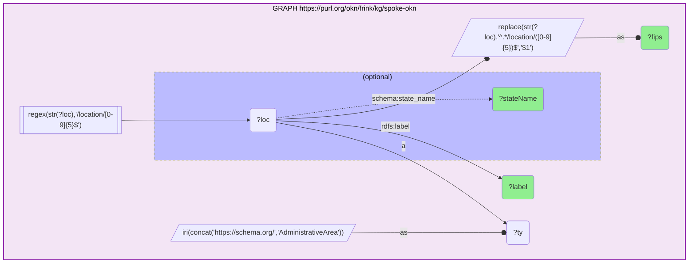

_3196 row(s)_

#### Query 2

_2026-07-23T06:40:37+00:00 · `spoke-okn`_

```sparql
PREFIX rdf: <http://www.w3.org/1999/02/22-rdf-syntax-ns#>
PREFIX schema: <https://purl.org/okn/frink/kg/spoke-okn/schema/>
SELECT ?fips (COUNT(DISTINCT ?chem) AS ?n_chem) (COUNT(*) AS ?n_chem_obs) (COUNT(DISTINCT ?media) AS ?n_media) WHERE {
  GRAPH <https://purl.org/okn/frink/kg/spoke-okn> {
    ?stmt rdf:subject ?chem ; rdf:predicate schema:FOUNDIN_CfL ; rdf:object ?loc .
    OPTIONAL { ?stmt schema:media ?media }
    FILTER(REGEX(STR(?loc),'/location/[0-9]{5}$'))
    BIND(REPLACE(STR(?loc),'^.*/location/([0-9]{5})$','$1') AS ?fips)
  }
} GROUP BY ?fips
```

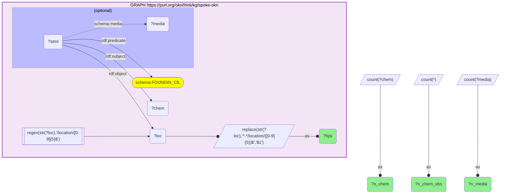

_3192 row(s)_

#### Query 3

_2026-07-23T06:40:38+00:00 · `spoke-okn`_

```sparql
PREFIX rdf: <http://www.w3.org/1999/02/22-rdf-syntax-ns#>
PREFIX schema: <https://purl.org/okn/frink/kg/spoke-okn/schema/>
SELECT ?fips (COUNT(DISTINCT ?env) AS ?n_env) (COUNT(*) AS ?n_env_obs) WHERE {
  GRAPH <https://purl.org/okn/frink/kg/spoke-okn> {
    ?stmt rdf:subject ?env ; rdf:predicate schema:FOUNDIN_EfL ; rdf:object ?loc .
    FILTER(REGEX(STR(?loc),'/location/[0-9]{5}$'))
    BIND(REPLACE(STR(?loc),'^.*/location/([0-9]{5})$','$1') AS ?fips)
  }
} GROUP BY ?fips
```

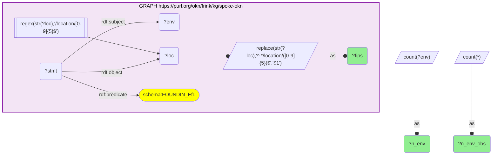

_3192 row(s)_

#### Query 4

_2026-07-23T06:41:32+00:00 · `spoke-okn`_

```sparql
PREFIX rdf: <http://www.w3.org/1999/02/22-rdf-syntax-ns#>
PREFIX schema: <https://purl.org/okn/frink/kg/spoke-okn/schema/>
SELECT ?fips ?var ?val ?year WHERE {
  GRAPH <https://purl.org/okn/frink/kg/spoke-okn> {
    VALUES ?var { "air pollution - particulate matter" "drinking water violations" "children in poverty" "income inequality" "unemployment" "severe housing cost burden" "food insecurity" "uninsured" "firearm fatalities" "homicides" "drug overdose deaths" "motor vehicle crash deaths" "premature death" "poor or fair health" "low birthweight" "frequent mental distress" "life expectancy" "primary care physicians" "mental health providers" "preventable hospital stays" "Overall(Socioeconomic Status,Household Characteristics,Racial & Ethnic Minority Status,Housing Type & Transportation)" "rural" "adult obesity" "physical inactivity" "limited access to healthy foods" "children in single-parent households" "residential segregation - black/white" "severe housing problems" }
    ?stmt rdf:predicate schema:PREVALENCEIN_SpL ; rdf:object ?loc ; schema:variable ?var ; schema:value ?val .
    OPTIONAL { ?stmt schema:year ?year }
    FILTER(REGEX(STR(?loc),'/location/[0-9]{5}$'))
    BIND(REPLACE(STR(?loc),'^.*/location/([0-9]{5})$','$1') AS ?fips)
  }
}
```

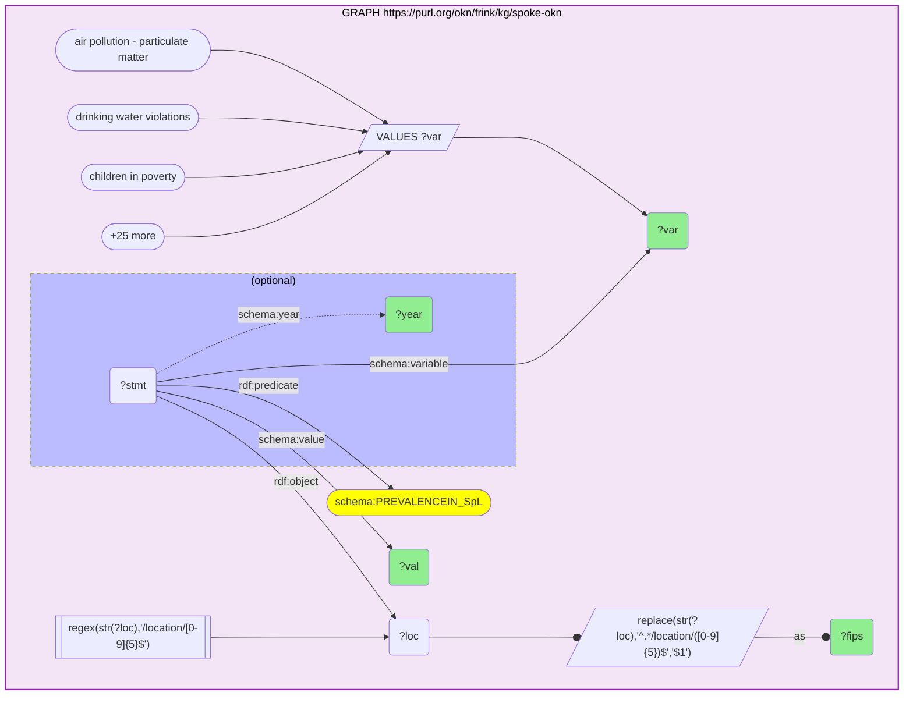

_81215 row(s)_

#### Query 5

_2026-07-23T06:44:14+00:00 · `spatialkg`, `fiokg`_

```sparql
PREFIX owl: <http://www.w3.org/2002/07/owl#>
PREFIX kwg: <http://stko-kwg.geog.ucsb.edu/lod/ontology/>
SELECT ?fips (COUNT(DISTINCT ?f) AS ?n_fac) WHERE {
  GRAPH <https://purl.org/okn/frink/kg/spatialkg> { ?reg a kwg:AdministrativeRegion_2 ; kwg:hasFIPS ?fips . }
  GRAPH <https://purl.org/okn/frink/kg/fiokg> { ?f owl:sameAs ?reg . }
} GROUP BY ?fips
```

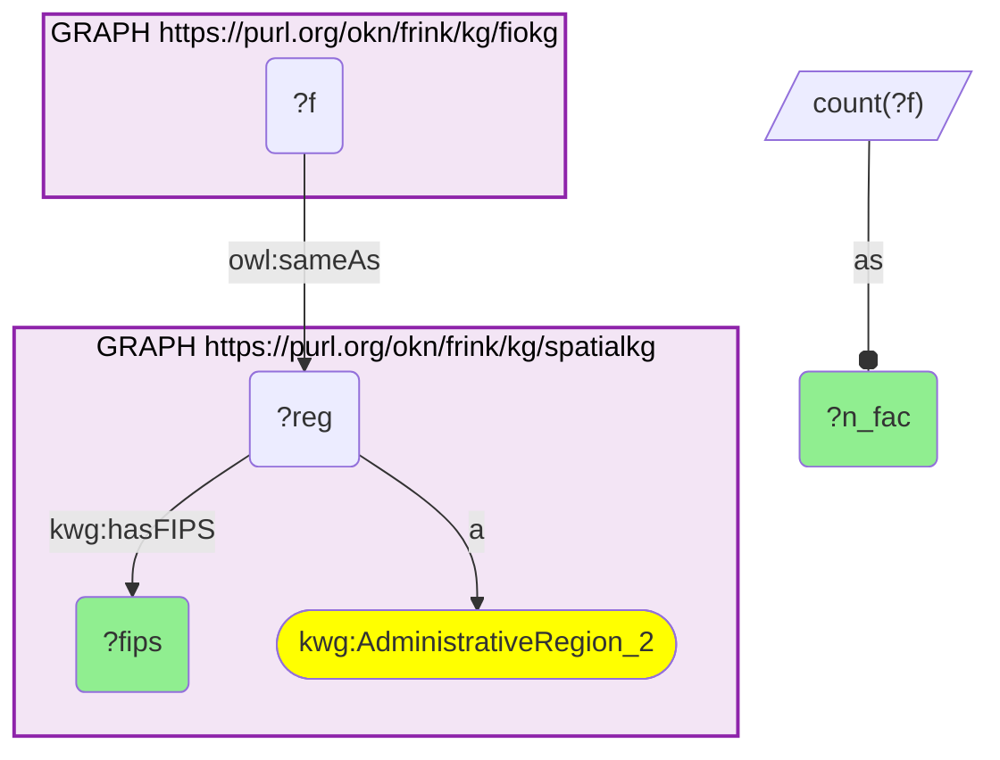

_3031 row(s)_ — superseded by Query 7 (this route counts one KG-alignment node per county, not facilities)

#### Query 6

_2026-07-23T06:46:29+00:00 · `scales`_

```sparql
PREFIX scales: <http://schemas.scales-okn.org/rdf/scales#>
PREFIX xsd: <http://www.w3.org/2001/XMLSchema#>
SELECT ?fips (COUNT(DISTINCT ?x) AS ?n_case) WHERE {
  GRAPH <https://purl.org/okn/frink/kg/scales> { ?x scales:hasIdbCounty ?c . FILTER(?c != 88888) }
  BIND(REPLACE(CONCAT('00000',STR(xsd:integer(?c))),'^.*(.{5})$','$1') AS ?fips)
} GROUP BY ?fips
```

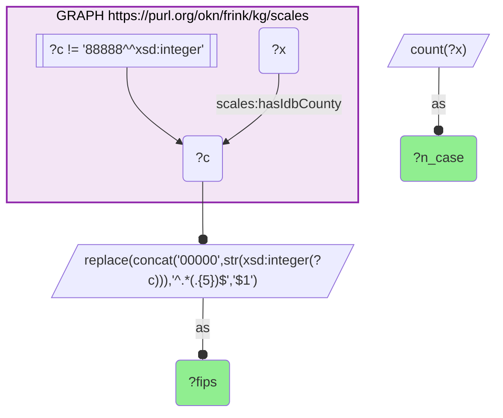

_3129 row(s)_ — national scales caseload; final county set restricted to contiguous states via Query 10

#### Query 7

_2026-07-23T06:48:37+00:00 · `spatialkg`, `fiokg`_

```sparql
PREFIX owl: <http://www.w3.org/2002/07/owl#>
PREFIX kwg: <http://stko-kwg.geog.ucsb.edu/lod/ontology/>
PREFIX fio: <http://w3id.org/fio/v1/fio#>
SELECT ?fips (COUNT(DISTINCT ?fac) AS ?n_fac) WHERE {
  GRAPH <https://purl.org/okn/frink/kg/spatialkg> { ?county a kwg:AdministrativeRegion_2 ; kwg:hasFIPS ?fips . }
  GRAPH <https://purl.org/okn/frink/kg/fiokg> { ?fcounty owl:sameAs ?county . ?fac kwg:sfWithin ?fcounty ; a fio:Facility . }
} GROUP BY ?fips
```

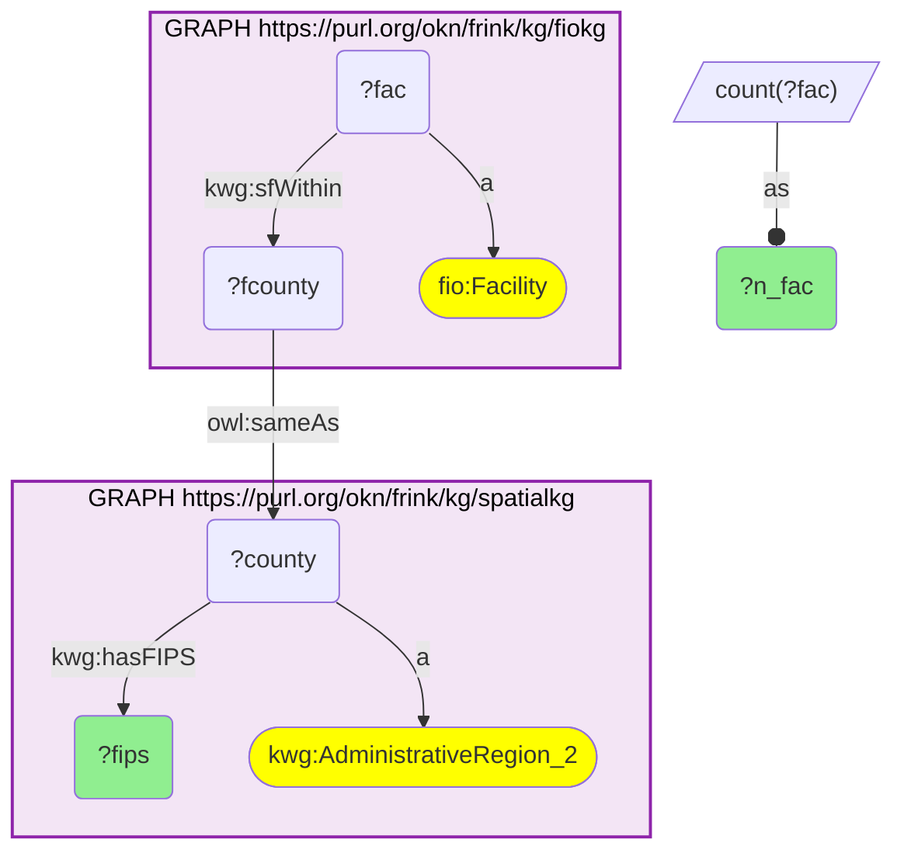

_3031 row(s)_

#### Query 8

_2026-07-23T06:50:45+00:00 · `spatialkg`, `fiokg`_

```sparql
PREFIX owl: <http://www.w3.org/2002/07/owl#>
PREFIX kwg: <http://stko-kwg.geog.ucsb.edu/lod/ontology/>
PREFIX fio: <http://w3id.org/fio/v1/fio#>
PREFIX frs: <http://w3id.org/fio/v1/epa-frs#>
SELECT ?fips ?county (COUNT(DISTINCT ?fac) AS ?n_fac) WHERE {
  GRAPH <https://purl.org/okn/frink/kg/spatialkg> { ?county a kwg:AdministrativeRegion_2 ; kwg:hasFIPS ?fips . }
  GRAPH <https://purl.org/okn/frink/kg/fiokg> { ?fcounty owl:sameAs ?county . ?fac kwg:sfWithin ?fcounty ; a fio:Facility . }
} GROUP BY ?fips ?county
```

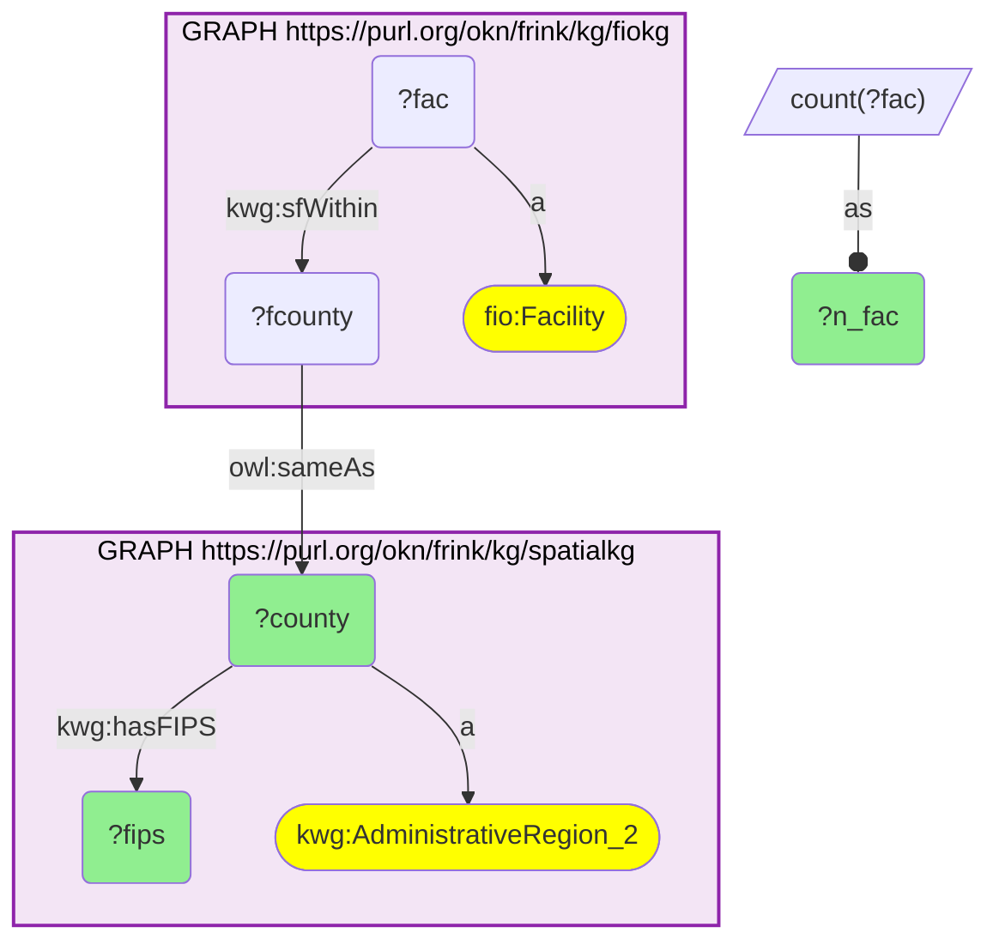

_3031 row(s)_

#### Query 9

_2026-07-23T06:50:47+00:00 · `spatialkg`, `fiokg`_

```sparql
PREFIX owl: <http://www.w3.org/2002/07/owl#>
PREFIX kwg: <http://stko-kwg.geog.ucsb.edu/lod/ontology/>
PREFIX frs: <http://w3id.org/fio/v1/epa-frs#>
SELECT ?fips ?county (COUNT(DISTINCT ?fac) AS ?n_pfas_fac) WHERE {
  GRAPH <https://purl.org/okn/frink/kg/spatialkg> { ?county a kwg:AdministrativeRegion_2 ; kwg:hasFIPS ?fips . }
  GRAPH <https://purl.org/okn/frink/kg/fiokg> { ?fcounty owl:sameAs ?county . ?fac kwg:sfWithin ?fcounty ; a frs:EPA-PFAS-Facility . }
} GROUP BY ?fips ?county
```

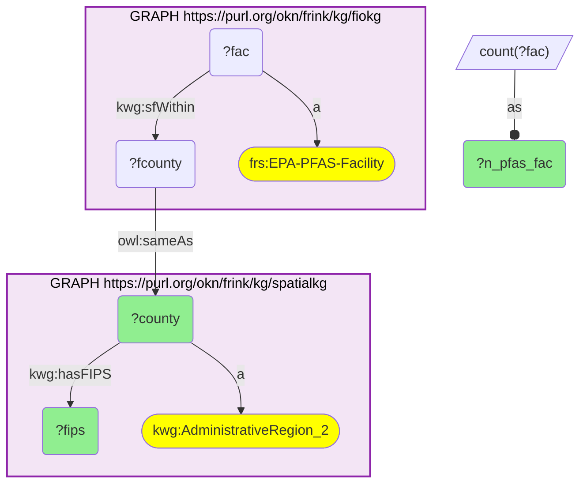

_3015 row(s)_

#### Query 10

_2026-07-23T06:51:19+00:00 · `scales`, `spatialkg`_

```sparql
PREFIX scales: <http://schemas.scales-okn.org/rdf/scales#>
PREFIX xsd: <http://www.w3.org/2001/XMLSchema#>
PREFIX kwg: <http://stko-kwg.geog.ucsb.edu/lod/ontology/>
SELECT ?fips ?county (COUNT(DISTINCT ?x) AS ?n_case) WHERE {
  GRAPH <https://purl.org/okn/frink/kg/scales> { ?x scales:hasIdbCounty ?c . FILTER(?c != 88888) }
  BIND(REPLACE(CONCAT('00000',STR(xsd:integer(?c))),'^.*(.{5})$','$1') AS ?fips)
  GRAPH <https://purl.org/okn/frink/kg/spatialkg> { ?county kwg:hasFIPS ?fips ; a kwg:AdministrativeRegion_2 . }
} GROUP BY ?fips ?county
```

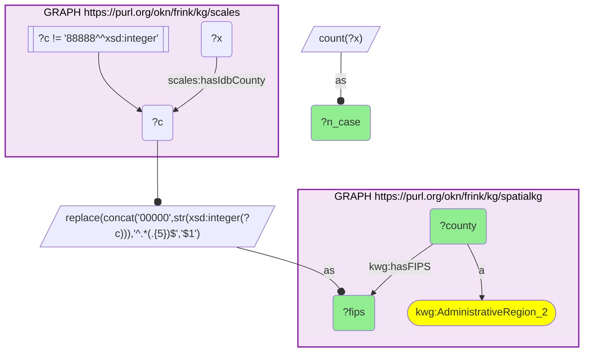

_6058 row(s)_ — 2 spatialkg county nodes per FIPS (kwg + datacommons); deduped to 3,029 in post-processing

#### Query 11

_2026-07-23T06:53:16+00:00 · `spoke-okn`_

```sparql
PREFIX rdf: <http://www.w3.org/1999/02/22-rdf-syntax-ns#>
PREFIX schema: <https://purl.org/okn/frink/kg/spoke-okn/schema/>
PREFIX rdfs: <http://www.w3.org/2000/01/rdf-schema#>
SELECT ?fips ?dLabel ?dv ?pop WHERE {
  GRAPH <https://purl.org/okn/frink/kg/spoke-okn> {
    VALUES ?dLabel { "asthma" "chronic obstructive pulmonary disease" "coronary artery disease" "chronic kidney disease" "diabetes mellitus" "cerebrovascular disease" }
    ?d rdfs:label ?dLabel .
    ?stmt rdf:subject ?d ; rdf:predicate schema:PREVALENCE_DpL ; rdf:object ?place ; schema:data_value ?dv .
    OPTIONAL { ?stmt schema:total_population ?pop }
    ?place schema:PARTOF_LpL ?county .
    FILTER(REGEX(STR(?place),'/location/[0-9]{7}$'))
    FILTER(REGEX(STR(?county),'/location/[0-9]{5}$'))
    BIND(REPLACE(STR(?county),'^.*/location/([0-9]{5})$','$1') AS ?fips)
  }
}
```

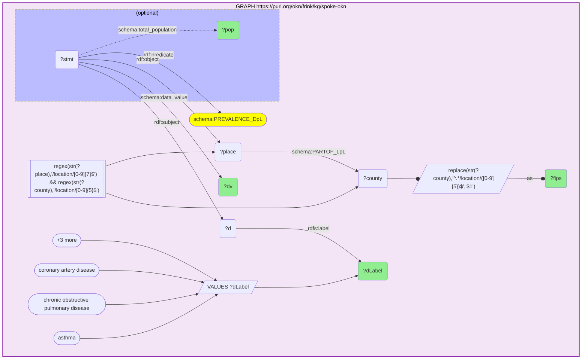

_125765 row(s)_

#### Query 12

_2026-07-23T06:53:54+00:00 · `ruralkg`_

```sparql
SELECT ?county (COUNT(DISTINCT ?t) AS ?n_prov) WHERE {
  GRAPH <https://purl.org/okn/frink/kg/ruralkg> {
    ?t a <http://sail.ua.edu/ruralkg/treatment/TreatmentProvider> ; ?sl ?loc .
    FILTER(STRENDS(STR(?sl),'schema.org/serviceLocation'))
    ?loc ?cip ?county .
    FILTER(STRENDS(STR(?cip),'schema.org/containedInPlace'))
    FILTER(STRSTARTS(STR(?county),'http://stko-kwg.geog.ucsb.edu/lod/resource/administrativeRegion.USA.'))
  }
} GROUP BY ?county
```

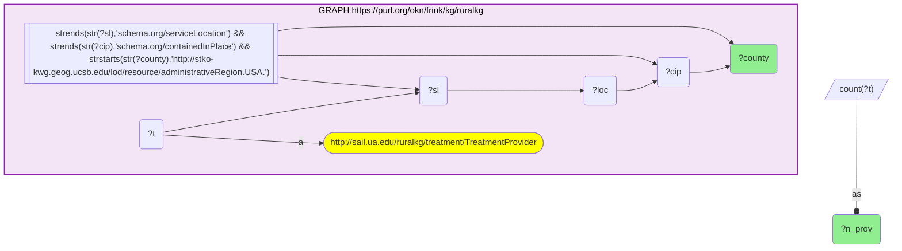

_2075 row(s)_

#### Query 13

_2026-07-23T06:54:42+00:00 · `sawgraph`, `spatialkg`_

```sparql
PREFIX owl: <http://www.w3.org/2002/07/owl#>
PREFIX kwg: <http://stko-kwg.geog.ucsb.edu/lod/ontology/>
SELECT ?fips ?county (COUNT(DISTINCT ?s) AS ?n_pfas_obs) WHERE {
  GRAPH <https://purl.org/okn/frink/kg/sawgraph> { ?s owl:sameAs ?cell . FILTER(STRSTARTS(STR(?cell),'http://stko-kwg.geog.ucsb.edu/lod/resource/s2.level13.')) }
  GRAPH <https://purl.org/okn/frink/kg/spatialkg> { ?cell kwg:sfWithin ?county . ?county a kwg:AdministrativeRegion_2 ; kwg:hasFIPS ?fips . }
} GROUP BY ?fips ?county
```

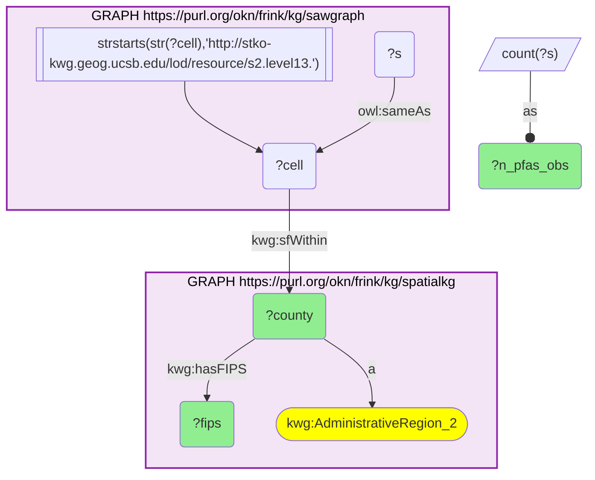

_528 row(s)_ — 2 county-IRI namespaces (kwg + datacommons); Query 14 restricts to kwg → 264

#### Query 14

_2026-07-23T06:55:29+00:00 · `sawgraph`, `spatialkg`_

```sparql
PREFIX owl: <http://www.w3.org/2002/07/owl#>
PREFIX kwg: <http://stko-kwg.geog.ucsb.edu/lod/ontology/>
SELECT ?fips ?county (COUNT(DISTINCT ?s) AS ?n_pfas_obs) (COUNT(DISTINCT ?cell) AS ?n_pfas_cells) WHERE {
  GRAPH <https://purl.org/okn/frink/kg/sawgraph> { ?s owl:sameAs ?cell . FILTER(STRSTARTS(STR(?cell),'http://stko-kwg.geog.ucsb.edu/lod/resource/s2.level13.')) }
  GRAPH <https://purl.org/okn/frink/kg/spatialkg> { ?cell kwg:sfWithin ?county . ?county a kwg:AdministrativeRegion_2 ; kwg:hasFIPS ?fips . FILTER(STRSTARTS(STR(?county),'http://stko-kwg')) }
} GROUP BY ?fips ?county
```

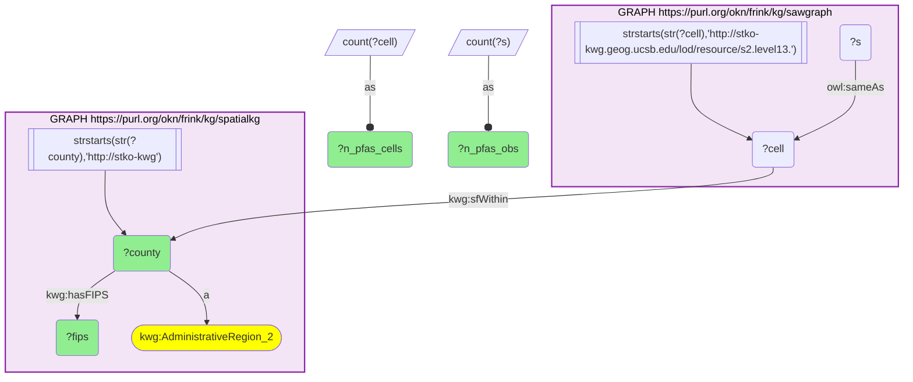

_264 row(s)_

#### Query 15

_2026-07-23T07:00:51+00:00 · `sawgraph`, `biobricks-toxcast`_

```sparql
PREFIX rdfs: <http://www.w3.org/2000/01/rdf-schema#>
PREFIX edam: <http://edamontology.org/>
PREFIX ro: <http://purl.obolibrary.org/obo/>
PREFIX bao: <http://www.bioassayontology.org/bao#>
SELECT ?cas ?chemLabel (COUNT(DISTINCT ?assay) AS ?n_endpoints) WHERE {
  { SELECT DISTINCT ?cas WHERE {
      GRAPH <https://purl.org/okn/frink/kg/sawgraph> {
        ?s <http://w3id.org/coso/v1/contaminoso#casNumber> ?raw .
        BIND(IF(REGEX(STR(?raw),'^[0-9]{5,10}$'), REPLACE(STR(?raw),'^([0-9]+)([0-9]{2})([0-9])$','$1-$2-$3'), STR(?raw)) AS ?cas)
        FILTER(REGEX(?cas,'^[0-9]{2,7}-[0-9]{2}-[0-9]$'))
  } } }
  BIND(IRI(CONCAT('http://identifiers.org/cas/', ?cas)) AS ?casIri)
  GRAPH <https://purl.org/okn/frink/kg/biobricks-toxcast> {
    ?t edam:has_identifier ?casIri . OPTIONAL { ?t rdfs:label ?chemLabel }
    ?t ro:RO_0000056 ?assay .
  }
} GROUP BY ?cas ?chemLabel
```

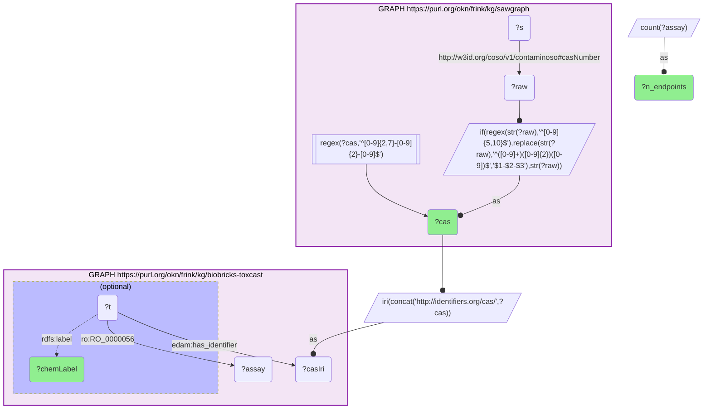

_32 row(s)_

#### Query 16

_2026-07-23T07:06:03+00:00 · `spatialkg`_

```sparql
PREFIX kwg: <http://stko-kwg.geog.ucsb.edu/lod/ontology/>
PREFIX geo: <http://www.opengis.net/ont/geosparql#>
SELECT ?fips ?wkt WHERE {
  GRAPH <https://purl.org/okn/frink/kg/spatialkg> {
    ?reg a kwg:AdministrativeRegion_2 ; kwg:hasFIPS ?fips ; geo:hasGeometry ?g .
    ?g geo:asWKT ?wkt .
    FILTER(STRSTARTS(STR(?reg),'http://stko-kwg'))
    VALUES ?fips { "26163" "22017" "29510" "24510" "05139" "01005" "28149" "28153" "40127" "01091" "28049" "40063" "22119" "22097" "22047" "22013" "22081" "13245" "12107" "40089" "47157" "04017" "22085" "22101" "40121" "06037" "48201" "06029" "28051" "01131" "48245" "28063" "28027" "28151" "34013" "28125" "28119" "28163" "06019" "28021" "22033" "06047" "28065" "28133" "22107" "13301" "01023" "21153" "28103" "22067" "06077" "45005" "22071" "22027" "28011" "06107" "29155" "01099" "05077" "22029" "13193" "48405" "22031" "01129" "37155" "22117" "05017" "05027" "05069" "01013" "28093" "28005" "21171" "40029" "22021" "40023" "45061" "48455" "48387" "45069" "21065" "48419" "01053" }
  }
}
```

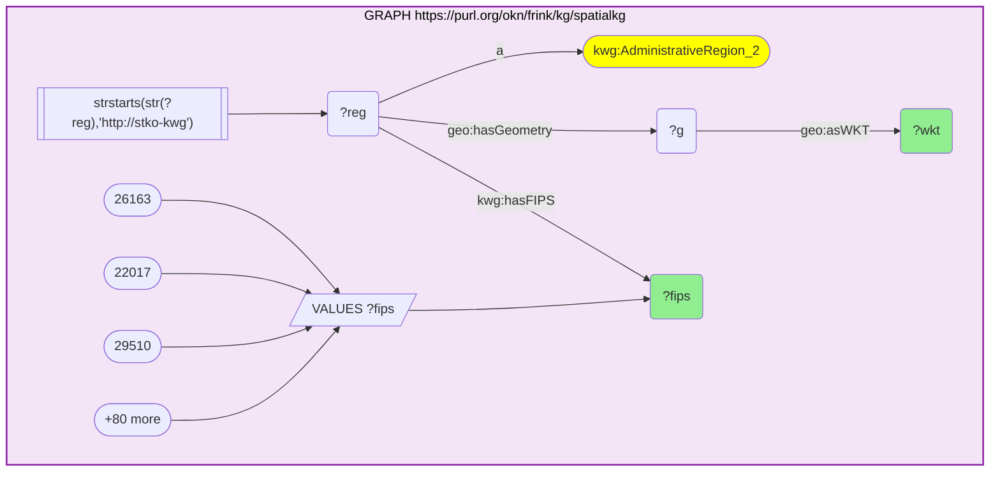

_83 row(s)_ — county centroids for the hot-spot map (WKT → shapely centroid)

#### Query 17

_2026-07-23T07:13:02+00:00 · `biobricks-aopwiki`_

```sparql
PREFIX dc: <http://purl.org/dc/elements/1.1/>
PREFIX aop: <http://aopkb.org/aop_ontology#>
SELECT ?rel ?kelabel WHERE {
  GRAPH <https://purl.org/okn/frink/kg/biobricks-aopwiki> {
    <https://identifiers.org/aop/529> ?rel ?ke .
    FILTER(?rel IN (aop:has_molecular_initiating_event, aop:has_adverse_outcome, aop:has_key_event))
    ?ke dc:title ?kelabel .
  }
}
```

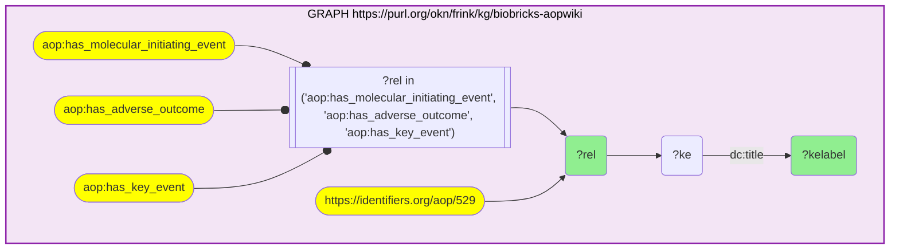

_10 row(s)_
