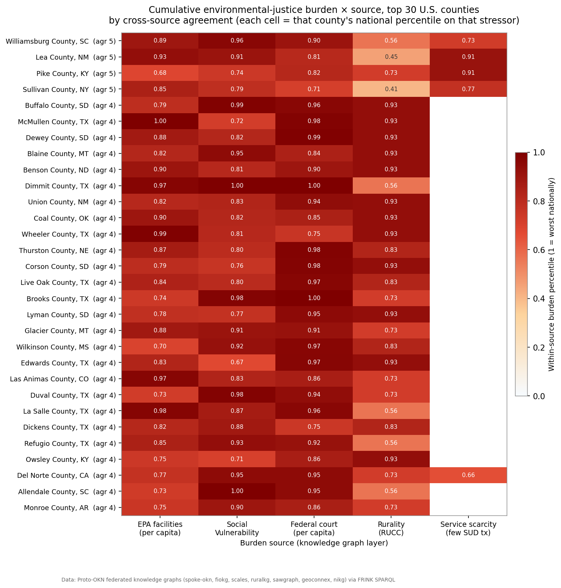
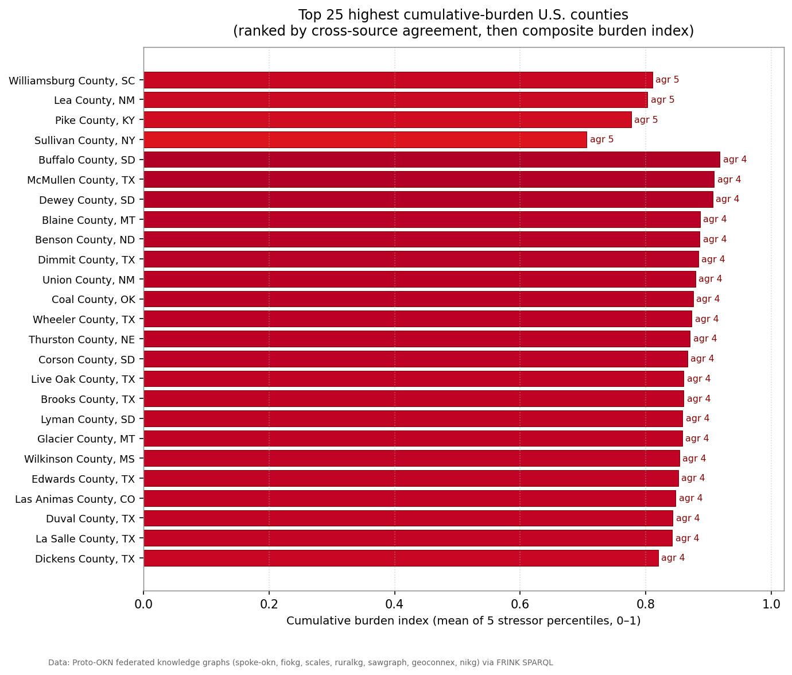
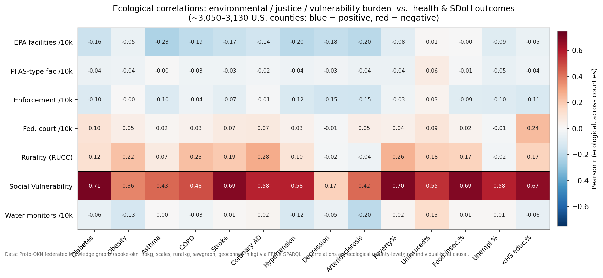

# Cumulative Environmental-Justice Burden Across U.S. Counties

### An evidence-backed, multi-source map built exclusively from Proto-OKN knowledge graphs

*Prepared with the OKN federated SPARQL endpoint over the Proto-OKN knowledge-graph ecosystem. Model: claude-opus-4-8. Analysis date: 2026-07-06. All burden, health, and social data derive solely from Proto-OKN graphs; the only non-KG input is cartographic county/state polygon geometry used to draw the map.*

---

## 1. Executive summary

This study integrates **twelve Proto-OKN knowledge graphs** into a single county-level picture of cumulative environmental-justice (EJ) burden for **3,158 counties across the 50 states + DC** (3,236 counties including Puerto Rico/territories), producing **70,839 individually-sourced findings** (`data/findings_long.csv`, one row per finding).

Each county is profiled across six burden dimensions requested — **PFAS contamination, EPA-regulated facilities, social vulnerability, federal-court activity, rurality, and treatment-service scarcity** — plus social-determinant and chronic-disease outcomes. Counties are ranked by **cross-source agreement**: how many independent knowledge graphs flag the county as high-burden.

Headline results:

- **Cross-source agreement is real but rarely maximal.** Of 3,158 counties, only **4** are flagged as high-burden by all five nationally-available sources simultaneously — **Williamsburg County, SC; Lea County, NM; Pike County, KY; and Sullivan County, NY** — while **147** counties are flagged by four sources and **635** by three. Burden concentrates, but different stressors light up different geographies.
- **The highest-burden / lowest-service set is rural and, disproportionately, tribal.** The counties combining extreme social vulnerability, deep rurality (RUCC 8–9), notable regulated-facility or court load, and essentially **zero mapped substance-use-treatment providers** are led by Great Plains reservation counties — **Buffalo, Dewey, and Corson (SD); Blaine (MT); Benson (ND); Thurston (NE)** — and Texas/New Mexico oil-and-border counties (**McMullen, Dimmit, Wheeler, Live Oak, TX; Union, NM**).
- **Social vulnerability is the strongest ecological correlate of poor health**, associated with diabetes (*r* = 0.71), stroke (0.69), poverty (0.70), and food insecurity (0.70) across ~3,050 counties. **Rurality carries a moderate, consistent health penalty** (coronary disease 0.28, COPD 0.23, obesity 0.22, poverty 0.26).
- **PFAS contamination is severe where measured but geographically narrow.** SAWGraph holds **117,320 water measurements across 16 Maine counties only**; county mean PFAS concentrations reach **1,192 ng/L (Kennebec)** with maxima to **480,000 ng/L (Cumberland)** — roughly **100–300× the 4 ng/L federal drinking-water limit** for PFOA/PFOS — but no other state is covered.

All correlations are **ecological** (county-level aggregates) and several coverage gaps are consequential; these are catalogued in §9.

---

## 2. Data sources and integration architecture

Twelve Proto-OKN graphs were queried live via OKN. Each contributes a distinct **entity type**, and all are joined on shared geographic keys.

| Knowledge graph | Version | Contribution (entity type) | Join key into the hub |
|---|---|---|---|
| **spoke-okn** | v0.0.6 | SDoH (AHRQ/ACS, SAIPE, CDC SVI), CDC PLACES disease prevalence, place↔county↔ZIP geography | county FIPS (node IRI); place→county via `PARTOF_LpL` |
| **fiokg** (SAWGraph FRS) | v0.0.11 | EPA-regulated facilities, NAICS industry, PFAS-facility flag, enforcement/compliance records | facility `sfWithin` → county FIPS |
| **scales** | v0.0.22 | Federal court case volume; NIBRS offense-category charge volumes | `hasIdbCounty` → county FIPS |
| **ruralkg** | v0.2.7 | Rural-Urban Continuum Code (RUCC), substance-use treatment providers, county population | `censusCounty` → county FIPS; provider ZIP→place→county |
| **sawgraph** (PFAS) | v0.0.15 | PFAS sample measurements (ng/L) | sample site `sfWithin` S2 L13 → county |
| **geoconnex** | v0.0.4 | Hydrologic water-monitoring features | GNIS `county` → county FIPS |
| **ufokn** | v0.0.3 | Urban-flood-risk S2 cells | S2 L13 → county *(national rollup infeasible — see §9)* |
| **spatialkg** | v0.0.6 | S2 Level-13 grid, county/state geometry, admin hierarchy | the spatial hub itself (`sfWithin`, `hasFIPS`) |
| **dreamkg** | v0.0.5 | Homelessness / social services (Philadelphia) | `postalCode` (ZIP5) |
| **nikg** | v0.0.6 | Neighborhood incident / gun-violence counts | incident `location` → county (2 counties) |
| **hydrologykg** | v0.0.9 | Streams/wells (supporting the SAWGraph spatial hub) | S2 L13 |
| **ubergraph** | v0.0.2 | Ontology backbone (supporting) | — |

**Join architecture.** The federation's *county FIPS* key is a hand-verified hub: spoke-okn ↔ fiokg (3,032 counties), ↔ scales (3,096), ↔ ruralkg (3,196), ↔ geoconnex (3,184), ↔ spatialkg (3,122). PFAS and flood layers attach through the **S2 Level-13 grid** and roll up to county via spatialkg `sfWithin`. Service layers attach on **ZIP5** (spoke-okn ↔ ruralkg 4,938 ZIPs; spoke-okn ↔ dreamkg 53 ZIPs). Justice offense types attach on the **NIBRS offense category** (scales ↔ ruralkg, 37 shared categories). Every join key and verified count was confirmed against the federation's precomputed crosswalk table before extraction.

**Provenance model.** Every finding is stored with its *source graph, relationship, value, geographic level, and evidence kind kept separate* (`data/findings_long.csv`). Five evidence kinds are distinguished and never conflated: **measured environmental sample** (PFAS), **regulatory record** (EPA facilities/enforcement), **court record** (federal cases, NIBRS charges), **survey/ranking indicator** (SDoH, SVI, RUCC, disease prevalence), and **service listing / monitoring feature** (treatment providers, DREAM-KG services, water monitors).

---

## 3. Cumulative-burden scoring method

For each county in the 50 states + DC:

1. **Per-capita normalization.** Count-based stressors (EPA facilities, PFAS-flagged facilities, enforcement records, federal court cases, treatment providers, water monitors) are divided by county population (ruralkg) to per-10,000-resident rates, so burden reflects intensity rather than county size.
2. **National percentile** of each stressor is computed across all counties.
3. **Burden flag** per source: a county is flagged if it sits in the worst national tertile — most facilities per capita (`f_facilities`), highest SVI (`f_vulnerability`), most federal cases per capita (`f_court`), nonmetro RUCC ≥ 4 (`f_rural`), or fewest treatment providers per capita (`f_fewservices`). A sixth flag, `f_pfas`, applies only where SAWGraph has data (Maine).
4. **Cross-source agreement** = number of the five national flags a county trips (0–5). This is the primary ranking used throughout.
5. **Composite burden index** = mean of the five stressor percentiles (0–1), a robust continuous tie-breaker that avoids small-denominator blow-ups.

Counties are ranked by agreement, then by burden index. See `data/master_county.csv` (full table) and `data/burden_ranking.csv` (ranked).

---

## 4. Findings by entity type

### 4.1 Places (the spatial backbone)

The analysis is anchored on **spatialkg**, which supplies the S2 Level-13 grid and the GADM administrative hierarchy (states = `AdministrativeRegion_1`, counties = `AdministrativeRegion_2`) for the 48 contiguous states + DC, each carrying a FIPS code and WKT geometry. This backbone lets point data (PFAS samples, facilities, flood cells) roll up to county via `sfWithin`, and lets county indicators roll up to state. Coverage: **3,143 U.S. counties** carried through to the final map; spoke-okn additionally resolves **~42,700 ZIPs** and **~27,500 places/CDPs**, with places linked to their county via `PARTOF_LpL` — the linkage that makes county-level health aggregation possible (§4.6).

### 4.2 Environmental burden

| Indicator | Source | Relationship | Value / geographic level | Evidence kind | Coverage |
|---|---|---|---|---|---|
| EPA-regulated facilities | fiokg | facility `sfWithin` county | count (3.6 M facility-county records) · county | regulatory record | 3,107 counties |
| PFAS-flagged facilities | fiokg | `EPA-PFAS-Facility` type in county | 162,254 · county | regulatory record | 3,091 counties |
| Enforcement/compliance records | fiokg | `EnforcementActivity` for in-county facility | 643,975 · county | regulatory record | 3,052 counties |
| PFAS water concentration | sawgraph | sample `sfWithin` S2 → county | ng/L (mean/max) · county | **measured environmental sample** | **16 counties (Maine)** |
| Water-monitoring features | geoconnex | GNIS `county` | 964,897 · county | monitoring feature | 3,222 counties |
| Urban-flood-risk cells | ufokn | S2 → county | — | infrastructure model | **not resolved (§9)** |

EPA facility density is the broadest environmental signal: nationally **3.6 million** facility-to-county registrations, heavily concentrated (per capita) in sparsely-populated energy-extraction counties of the Permian Basin (Lea County NM: 3,559 facilities) and Eagle Ford Shale (Dimmit, Wheeler, La Salle TX). **PFAS is the most acute but narrowest layer**: where SAWGraph measured it — Maine only — county mean concentrations run **140–1,192 ng/L** with individual maxima to **480,000 ng/L**, orders of magnitude above the 4 ng/L federal limit. No PFAS data exists for any other state, so PFAS **cannot** enter the national burden score and is reported as a Maine-only overlay.

### 4.3 Social determinants of health (county-level, spoke-okn)

Six requested indicators were extracted from spoke-okn's AHRQ/ACS-derived SDoH layer (2,999,117 county-level records) at their most recent year:

| SDoH indicator | spoke-okn variable | Source dataset | Year | Range (national) | Coverage |
|---|---|---|---|---|---|
| Poverty % | `SAIPE_PCT_POV` | Census SAIPE | 2020 | 3.0–43.9 | 3,130 |
| < High-school education % | `ACS_PCT_LT_HS` | ACS/AHRQ | 2020 | 1.4–78.2 | 3,192 |
| Food insecurity % | `Food insecurity (finding)` | County Health Rankings | 2023 | 2.6–28.7 | 3,131 |
| Unemployment % | `ACS_PCT_UNEMPLOY` | ACS/AHRQ | 2020 | 0.0–33.3 | 3,192 |
| Uninsured % | `ACS_PCT_UNINSURED` | ACS/AHRQ | 2020 | 0.5–42.6 | 3,192 |
| Social Vulnerability Index | `Social Vulnerability Index` | CDC/ATSDR SVI | 2020 | 0.0–1.0 | 3,192 |

These are the vulnerability backbone of the burden score (SVI) and the primary outcomes for correlation.

### 4.4 Justice indicators

**Federal court activity (scales).** County-of-filing case volume from the FJC Integrated Database via `hasIdbCounty`: **684,069** cases across **3,122 counties**, led by Cook County, IL (113,188) and Los Angeles, CA (15,439). This is the county-level justice-load signal in the burden score.

**NIBRS offense categories (scales, national).** Charge volumes by FBI NIBRS offense category (111 categories): *All Other Offenses* (1,621,489), *Simple Assault* (177,758), *Drug/Narcotic Violations* (86,454), *Driving Under the Influence* (72,809), *Trespass* (63,407). **Important structural finding:** the NIBRS arrest-charge graph and the federal-court `hasIdbCounty` graph are **disjoint entity sets** — NIBRS charges cannot be attributed to county through this key — so offense categories are reported **nationally only**, not per county.

**Neighborhood gun violence (nikg, 2 counties).** Cook County (Chicago): 89,367 incidents, 1,019 shooting incidents, 208 fatal. Philadelphia: 16,282 incidents, **15,205 shooting incidents, 3,163 fatal**. nikg covers only these two counties.

### 4.5 Rural-urban classification (ruralkg)

RUCC (1 = metro core … 9 = most remote rural) for **3,221 counties**. **1,985 counties (62%) are nonmetro (RUCC ≥ 4)** — consistent with national geography and the reason rurality is a decisive burden dimension: the most rural counties dominate the high-agreement tail.

### 4.6 Social services

**Substance-use treatment (ruralkg).** 9,037 providers nationally; rolled to **2,144 counties** (8,820 providers) via a ZIP→place→county 2-hop through spoke-okn. Service *scarcity* (few providers per capita, or none) is the burden dimension where the worst-off rural counties consistently score — many high-burden counties have **zero** mapped providers.

**Homelessness / social services (dreamkg, Philadelphia).** 662 services across 53 Philadelphia ZIPs, concentrated in Mental Health Care (213), Counseling (192), and Food Pantry (140). City-scoped only.

### 4.7 Health outcomes (spoke-okn / CDC PLACES)

Nine chronic conditions were aggregated from place-level CDC PLACES age-adjusted prevalence up to **3,057 counties** (places→county via `PARTOF_LpL`): obesity (county mean 37.4%), hypertension (32.6%), arteriosclerosis (31.3%), depression (23.7%), diabetes (10.5%), asthma (10.6%), COPD (7.5%), coronary artery disease (5.9%), stroke (3.1%). These are the health outcomes used in the correlation analysis.

---

## 5. Cumulative-burden ranking

**Cross-source agreement distribution (3,158 counties):** 0 sources → 301 counties · 1 → 874 · 2 → 1,197 · 3 → 635 · 4 → 147 · **5 → 4**.

**The four maximal-burden counties** (flagged by all five national sources):

| County | Burden index | EPA facilities | Fed. court cases | SVI | RUCC | SUD providers | Poverty % |
|---|---|---|---|---|---|---|---|
| Williamsburg County, SC | 0.81 | 1,473 | 112 | 0.96 | 6 | 1 | 25.4 |
| Lea County, NM | 0.80 | 3,559 | 129 | 0.91 | 5 | 1 | 12.6 |
| Pike County, KY | 0.78 | 1,293 | 133 | 0.74 | 7 | 1 | 23.7 |
| Sullivan County, NY | 0.71 | 2,588 | 117 | 0.79 | 4 | 2 | 12.7 |

**Geographic concentration.** State mean burden index is highest in **New Mexico (0.65), Mississippi (0.63), South Carolina (0.61), Texas (0.59), Louisiana (0.59), Arkansas (0.58)** — the Deep South, the oil-and-border Southwest, and the Northern Plains. An interactive, OpenStreetMap-based choropleth of the burden index for all 3,143 counties is provided as **`choropleth_burden.html`** (hover any county for its full burden profile).

---

## 6. Highest-burden / lowest-service set

Filtering to counties flagged by ≥ 4 sources **and** with ≤ 1 mapped substance-use-treatment provider isolates the population the study was designed to surface — high stressor load with almost no local services:

| County | Agreement | Burden index | SVI | RUCC | EPA facilities | SUD providers |
|---|---|---|---|---|---|---|
| Buffalo County, SD | 4 | 0.92 | 0.986 | 9 | 50 | 0 |
| McMullen County, TX | 4 | 0.91 | 0.720 | 9 | 355 | 0 |
| Dewey County, SD | 4 | 0.91 | 0.822 | 9 | 210 | 0 |
| Blaine County, MT | 4 | 0.89 | 0.948 | 9 | 193 | 0 |
| Benson County, ND | 4 | 0.89 | 0.814 | 9 | 294 | 0 |
| Dimmit County, TX | 4 | 0.88 | 1.000 | 6 | 851 | 0 |
| Union County, NM | 4 | 0.88 | 0.828 | 9 | 133 | 0 |
| Thurston County, NE | 4 | 0.87 | 0.799 | 8 | 252 | 0 |
| Corson County, SD | 4 | 0.87 | 0.758 | 9 | 108 | 0 |

Several of these are **American Indian reservation counties** (Buffalo = Crow Creek; Dewey/Corson = Cheyenne River; Blaine = Fort Belknap; Benson = Spirit Lake; Thurston = Omaha/Winnebago), combining near-maximal social vulnerability, the most remote rural classification, meaningful regulated-facility loads, and **no local treatment services** in the graphs. This is the clearest equity signal in the dataset.

---

## 7. Correlations between burden and outcomes

Pearson correlations across ~3,050–3,130 counties (`data/correlations.csv`). **All are ecological.**

- **Social Vulnerability Index** is the strongest and most consistent correlate of adverse outcomes: diabetes *r* = **0.71**, poverty **0.70**, food insecurity **0.70**, stroke **0.69**, low education **0.67**, hypertension 0.58, coronary disease 0.58, uninsured 0.55. SVI behaves as an integrative index of disadvantage, as designed.
- **Rurality (RUCC)** shows a modest but pervasive health penalty: coronary artery disease **0.28**, poverty **0.26**, COPD 0.23, obesity 0.22, stroke 0.19, uninsured 0.18, food insecurity 0.17.
- **Federal court activity per capita** is weakly associated with low education (**0.24**), diabetes (0.10), and being uninsured (0.09).
- **EPA facilities per capita** correlate **negatively** with chronic-disease prevalence (asthma −0.23, arteriosclerosis −0.21, hypertension −0.20). This is an **ecological / small-denominator artifact**, not evidence that facilities improve health: per-capita facility density peaks in tiny extraction counties whose place-level PLACES prevalence is measured elsewhere. It is a cautionary illustration of why the burden score keeps count-based exposure and rate-based vulnerability as separate dimensions rather than summing them naively.

---

## 8. Deliverables

All files are in this folder:

- **`report.html`** / **`report.md`** — this report.
- **`choropleth_burden.html`** — interactive OpenStreetMap county choropleth of cumulative burden (opens in any browser; fetches county polygons and OSM tiles online).
- **`figures/`** — burden×source matrix, correlation heatmap, ranked-county bars, agreement/coverage.
- **`data/findings_long.csv`** — **70,839 findings, one row per finding**, columns `fips, county_name, state, indicator, value, unit, source_kg, relationship, geo_level, evidence_kind`.
- **`data/master_county.csv`** — wide county table (all indicators + burden score/flags/rank).
- **`data/burden_ranking.csv`**, **`correlations.csv`**, **`corr_matrix.csv`**, **`burden_matrix_top40.csv`** — analysis outputs.
- **`data/raw_layers/`** — the per-graph SPARQL extracts (facilities, PFAS, SDoH, health, court, RUCC, services, etc.).
- **`transcript.md`** — reproducible Proto-OKN session transcript (queries + provenance).

---

## 9. Uncertainties and limitations

1. **All correlations are ecological.** Relationships hold between county aggregates, not individuals; inferring individual-level causation would be an ecological fallacy. Signs and magnitudes are descriptive, not causal.
2. **PFAS coverage is Maine-only** (16 counties, 117,320 measurements). PFAS is therefore excluded from the national burden score and shown as a state overlay; absence of PFAS data elsewhere is *not* absence of PFAS.
3. **Urban-flood risk (ufokn) could not be resolved to county.** Rolling ufokn's millions of S2 cells up through spatialkg exceeded the endpoint's query-time limits on repeated attempts; the flood layer is omitted rather than approximated.
4. **nikg covers only 2 counties** (Cook, Philadelphia) and **dreamkg only Philadelphia ZIPs** — these are illustrative, not national, and are excluded from the cross-county ranking and correlations.
5. **NIBRS offense data is national only.** scales' arrest-charge graph does not join to the federal-court county key, so offense categories cannot be mapped to county here.
6. **Per-capita rates inflate tiny counties.** Count stressors normalized by small populations produce extreme rates; the burden score mitigates this with percentile flags and a percentile-mean index, but the continuous index still favors low-population extraction/reservation counties. Read agreement (0–5) as primary.
7. **Health outcomes are aggregated from place to county** via `PARTOF_LpL` (unweighted mean of CDC PLACES places within a county); a place spanning counties contributes to each, and the mean is not population-weighted.
8. **Substance-use-treatment county coverage is partial** (2,144 of ~3,140 counties) because provider ZIPs in ruralkg are noisy (trailing spaces, dropped leading zeros) and must route ZIP→place→county; a missing value is treated as unknown, not zero, except where explicitly noted in the low-service set.
9. **County counts vary by layer** (3,052–3,222) because each graph covers a slightly different set; the burden score is computed on available data per county and is more reliable where more layers are present (see the coverage panel, `figures/fig4_agreement_coverage.png`).
10. **Cartographic note.** County/state polygon geometry for the map is standard cartographic boundary data (us-atlas), the only non-Proto-OKN input; every burden, health, and social *value* is from Proto-OKN.

---

*Reproducibility: the companion `transcript.md` records the session and the SPARQL queries behind these findings against the named OKN graphs and versions listed in §2.*
