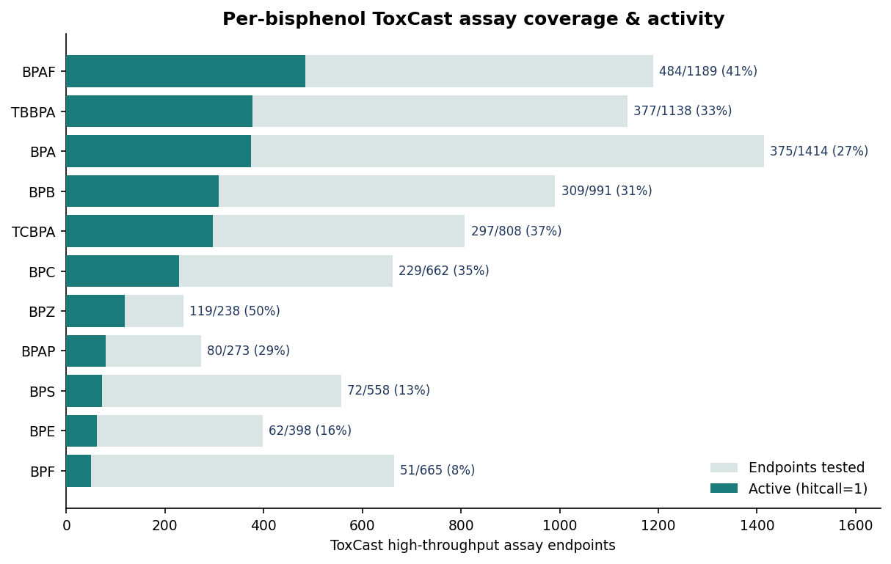
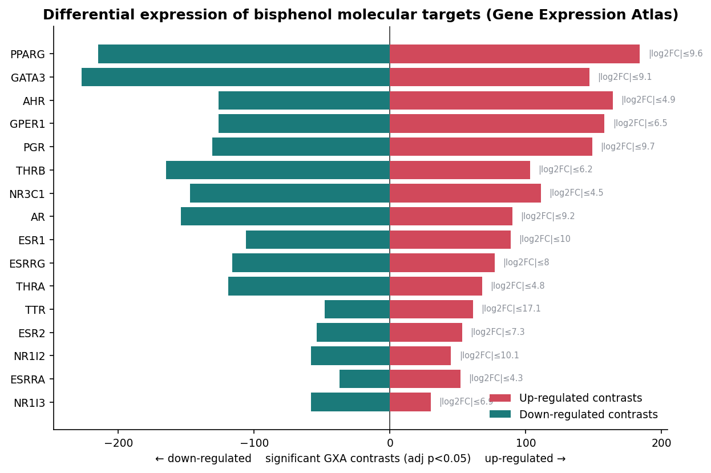
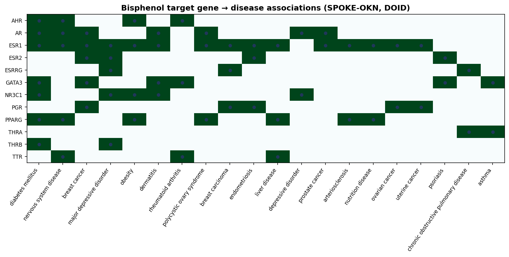
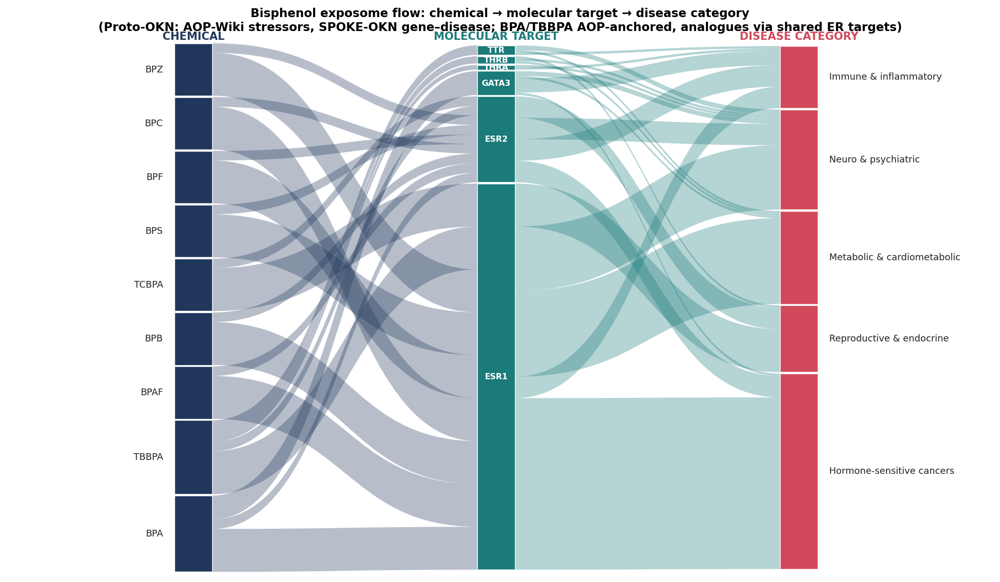
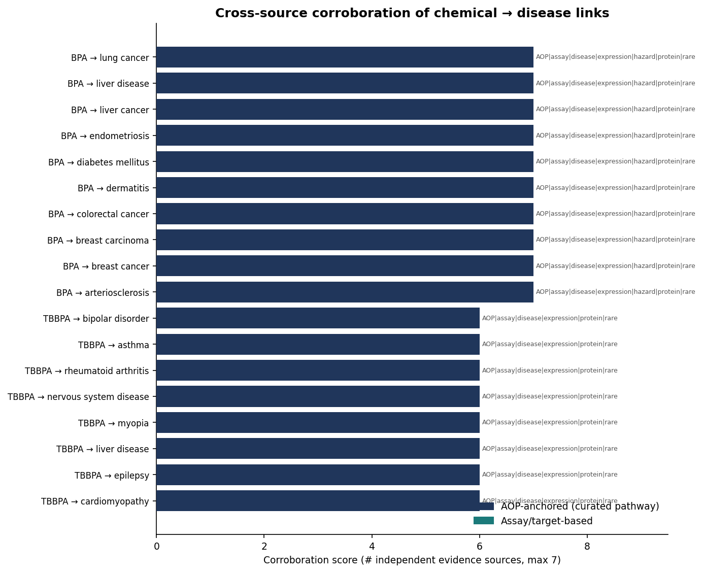

# The Chemical Exposome of Bisphenols
### An evidence-backed exposure→disease map built exclusively from Proto-OKN knowledge graphs
*Generated 2026-07-05 · OKN federated SPARQL endpoint · 216 findings across 14 knowledge graphs*

---
## Executive summary
This map traces bisphenol A (BPA) and 12 structural analogues from **exposure and industrial use**, through **curated adverse outcome pathways (AOPs)**, **molecular targets**, **high-throughput assay activity**, and **differential gene expression**, to **resulting diseases and phenotypes** — using only Proto-OKN graphs joined on reconciled chemical (CAS/CID/DTXSID/ChEBI), gene (Ensembl/Entrez), protein (UniProt) and disease (DOID↔MONDO) identifiers.

**Headline results**
- **13 bisphenols** resolved and cross-walked: all 13 in ICE, 11 in ToxCast & Tox21, and **only 2 (BPA, TBBPA) carry curated AOPs** in AOP-Wiki.
- The mechanistic spine is **estrogen-receptor signalling**: every one of BPA's three AOPs initiates at an estrogen receptor (ERα/ERβ/GPER), converging on adverse outcomes in **immune (lupus), neurodevelopmental (autism-like), and cognitive (learning/memory)** domains. TBBPA instead initiates at **transthyretin (thyroid axis) → neurodevelopmental toxicity**.
- **16 molecular targets** (ESR1, ESR2, ESRRA/G, AR, GPER1, PGR, thyroid receptors, PXR/CAR, PPARG, AHR, GATA3, TTR) link to **45 distinct diseases** in SPOKE-OKN and hundreds of rare diseases in RDKG; all 16 are **differentially expressed** across GXA disease contrasts.
- **26 chemical→disease links reach the maximum corroboration score (7/7 independent sources)** — all BPA, led by **breast cancer** (uniquely supported by three converging targets: ERα, ERβ and GATA3).
- **Best-supported pathway:** BPA → ERα (AOP-Wiki MIE + ToxCast-active + ERα differentially expressed + ERα→breast/ovarian/uterine cancer, endometriosis, PCOS in SPOKE + rare-disease genetics in RDKG + curated protein annotation in ProKN + PubChem 'reproductive toxicity cat. 2 / endocrine disruptor' hazard).

> **Read the uncertainties section carefully.** AOP coverage is curated and sparse; assay activity is *in-vitro*, not *in-vivo* effect; several joins are ontology-bridged; and AOP-Wiki's automated key-event→gene annotations are unreliable (documented below), so molecular targets were taken from the *curated molecular-initiating-event biology*, not those automated links.

## 1. Data provenance & method
All data come from the Proto-OKN federation. Knowledge graphs and versions used:

| Layer | Knowledge graph | Version | Role in the map |
|---|---|---|---|
| | `biobricks-aopwiki` | v0.0.4 | curated AOPs: MIE→KE→AO & chemical stressors |
| | `biobricks-toxcast` | v0.0.2 | HTS assay endpoints + binary hitcalls |
| | `biobricks-tox21` | v0.0.3 | chemical coverage (registry only) |
| | `biobricks-ice` | v0.0.3 | functional-use categories & assay/safety curation |
| | `biobricks-pubchem-annotations` | v0.0.2 | GHS / toxicity / hazard literature annotations |
| | `gene-expression-atlas-okn` | v0.0.3 | differential expression by disease & tissue |
| | `spoke-okn` | v0.0.6 | gene↔disease associations (DOID) |
| | `rdkg` | v0.0.1 | gene↔rare-disease associations (MONDO) |
| | `prokn` | v0.0.5 | protein GO / Reactome annotations (UniProt) |
| | `oard-kg` | v0.0.3 | EHR disease↔phenotype associations |
| | `ubergraph` | v0.0.2 | CHEBI↔CAS, DOID↔MONDO bridges & category expansion |
| | `sudokn` | v0.0.10 | US manufacturers of BPA-derived polycarbonate/epoxy |
| | `sawgraph` | v0.0.15 | PFAS environmental graph (no bisphenols) |
| | `fiokg` | v0.0.11 | EPA facilities + NAICS (no chemical identifiers) |

**Identifier reconciliation (joins).** Chemical layers joined on **CAS** (`identifiers.org/cas/`; AOP-Wiki uses the `https` form, ToxCast/ICE/Tox21 the `http` form — rewritten on join). Genes joined on **Ensembl** (AOP-Wiki `skos:exactMatch` ↔ GXA node-IRI ↔ SPOKE `ensembl`) and **Entrez** (SPOKE/rdkg gene node-IRIs `…/gene/{id}`). Proteins joined on **UniProt** (ProKN node-IRIs). Diseases bridged **DOID↔MONDO** through Ubergraph `oboInOwl:hasDbXref` (45/45 SPOKE diseases mapped).

**Evidence typing (kept separate).** Every finding is tagged with its source graph, relationship type (`has-molecular-initiating-event`, `has-key-event`, `has-adverse-outcome`, `chemical-stressor-of`, `target-gene-of`, `assayed-in`, `differentially-expressed-in`, `associated-with-disease`, `disease-phenotype`, `functional-use-of`, `hazard-annotation`) and evidence kind (*curated AOP link*, *HTS assay measurement*, *measured differential expression*, *literature annotation*, *curated/statistical disease association*, *ontology bridge*). These are never merged.

## 2. Chemicals — identity, cross-walk & functional use

| Abbr | Name | CAS | PubChem CID | DTXSID | AOP-Wiki | ToxCast | Tox21 | ICE | ICE functional use |
|---|---|---|---|---|:--:|:--:|:--:|:--:|---|
| **BPA** | Bisphenol A | 80-05-7 | 6623 | DTXSID7020182 | ✓ | ✓ | ✓ | ✓ | Antioxidant, Binder, Catalyst, Hardener, Uv absorber |
| **BPS** | Bisphenol S (4,4'-sulfonyldiphenol) | 80-09-1 | — | DTXSID3022409 | · | ✓ | ✓ | ✓ | Colorant |
| **BPF** | Bisphenol F (bis(4-hydroxyphenyl)methane) | 620-92-8 | — | DTXSID9022445 | · | ✓ | ✓ | ✓ | Antioxidant |
| **BPAF** | Bisphenol AF (hexafluoro) | 1478-61-1 | — | DTXSID7037717 | · | ✓ | ✓ | ✓ | — |
| **BPB** | Bisphenol B | 77-40-7 | — | DTXSID4022442 | · | ✓ | ✓ | ✓ | Antioxidant |
| **BPAP** | Bisphenol AP | 1571-75-1 | — | DTXSID5051444 | · | ✓ | ✓ | ✓ | Antioxidant, Uv absorber |
| **BPE** | Bisphenol E | 2081-08-5 | — | DTXSID3047891 | · | ✓ | ✓ | ✓ | Antioxidant |
| **BPC** | Bisphenol C (3,3'-dimethyl BPA) | 79-97-0 | — | DTXSID8047890 | · | ✓ | ✓ | ✓ | Antioxidant, Uv absorber |
| **BPZ** | Bisphenol Z | 843-55-0 | — | DTXSID4047963 | · | ✓ | ✓ | ✓ | — |
| **BPP** | Bisphenol P | 2167-51-3 | — | DTXSID0058693 | · | · | · | ✓ | Antioxidant |
| **BPM** | Bisphenol M | 13595-25-0 | — | DTXSID7065548 | · | · | · | ✓ | Antioxidant, Uv absorber |
| **TBBPA** | Tetrabromobisphenol A | 79-94-7 | 6618 | DTXSID1026081 | ✓ | ✓ | ✓ | ✓ | Flame retardant |
| **TCBPA** | Tetrachlorobisphenol A | 79-95-8 | — | DTXSID3021770 | · | ✓ | ✓ | ✓ | Flame retardant |

Functional-use profiles cleanly separate the family: **BPA** = *binder / catalyst / hardener* (polycarbonate & epoxy monomer); the halogenated **TBBPA/TCBPA** = *flame retardant*; the newer analogues (BPS, BPF, BPAF, BPB…) = *antioxidant / UV-absorber / colorant* substitutes.

## 3. Adverse outcome pathways (AOP-Wiki)
Only **BPA** and **TBBPA** exist as AOP chemical stressors. Their curated pathways:

| Chemical | AOP | Molecular initiating event | Adverse outcome | #KEs | Target |
|---|---|---|---|:--:|---|
| BPA | AOP 314 | Binding to estrogen receptor (ER)-alpha in immune cells | Exacerbation of systemic lupus erythematosus (SLE) | 5 | ESR1/GATA3 |
| BPA | AOP 522 | Antagonism, Estrogen receptor | autism-like behavior | 6 | ESR1/ESR2 |
| BPA | AOP 535 | protein-coupled estrogen receptor 1 (GPER) activation | Impairment, Learning and memory | 9 | GPER1/ESR1/ESR2 |
| TBBPA | AOP 152 | Binding, Transthyretin in serum | Cognitive function, decreased | 11 | TTR |

BPA's three pathways **all initiate at an estrogen receptor** (ERα binding, ER antagonism, GPER activation) and diverge to immune, neurodevelopmental and cognitive outcomes. TBBPA initiates at **transthyretin** (thyroid-hormone distribution) leading to decreased cognitive function.

## 4. Molecular targets
Targets were taken from the **curated MIE biology** and verified against AOP-Wiki HGNC cross-reference nodes (see *Uncertainties* for why the automated key-event→gene links were **not** used). Identifiers:

| Gene | Protein | Ensembl | Entrez | UniProt | Role |
|---|---|---|---|---|---|
| **ESR1** | Estrogen receptor alpha | ENSG00000091831 | 2099 | P03372 | Primary estrogenic MIE target (AOP314/522); ToxCast ER assays |
| **ESR2** | Estrogen receptor beta | ENSG00000140009 | 2100 | Q92731 | Estrogenic target; ERalpha/beta heterodimer (AOP535 KE) |
| **GPER1** | G-protein coupled estrogen receptor 1 | ENSG00000164850 | 2852 | Q99527 | MIE of AOP535 (GPER activation -> memory impairment) |
| **AR** | Androgen receptor | ENSG00000169083 | 367 | P10275 | Anti-androgen activity in ToxCast/ICE AR assays |
| **TTR** | Transthyretin | ENSG00000118271 | 7276 | P02766 | MIE of AOP152 (TTR binding -> neurodevelopmental tox); TBBPA |
| **THRA** | Thyroid hormone receptor alpha | ENSG00000126351 | 7067 | P10827 | Thyroid axis (TBBPA/halogenated bisphenols) |
| **THRB** | Thyroid hormone receptor beta | ENSG00000151090 | 7068 | P10828 | Thyroid axis (TBBPA/halogenated bisphenols) |
| **ESRRA** | Estrogen-related receptor alpha | — | — | P11474 | BPA high-affinity receptor (literature); not in aopwiki HGNC set |
| **ESRRG** | Estrogen-related receptor gamma | — | — | P62508 | BPA very high-affinity receptor (literature); not in aopwiki HGNC set |
| **NR1I2** | Pregnane X receptor (PXR) | ENSG00000144852 | 8856 | O75469 | Xenobiotic nuclear receptor; ToxCast actives |
| **NR1I3** | Constitutive androstane receptor (CAR) | ENSG00000143257 | 9970 | Q14994 | Xenobiotic nuclear receptor |
| **NR3C1** | Glucocorticoid receptor | ENSG00000113580 | 2908 | P04150 | Steroid receptor cross-talk |
| **PGR** | Progesterone receptor | ENSG00000082175 | 5241 | P06401 | Steroid receptor |
| **PPARG** | Peroxisome proliferator-activated receptor gamma | ENSG00000132170 | 5468 | P37231 | Metabolic/adipogenic target (obesogen hypothesis) |
| **AHR** | Aryl hydrocarbon receptor | ENSG00000106546 | 196 | P35869 | Xenobiotic sensing |
| **GATA3** | GATA binding protein 3 | ENSG00000107485 | 2625 | P23771 | KE in AOP314 (GATA3 induction -> Th2/IL-4 -> SLE) |

## 5. High-throughput assay evidence (ToxCast)
ToxCast hitcalls are **binary** in this release (active = hitcall 1). Coverage and activity per chemical are in Figure 1. **BPAF is the most active** analogue (484/1189 endpoints, 41%), followed by TBBPA, BPB, TCBPA and BPA; the popular substitutes **BPS (13%) and BPF (8%) are the least active** of those tested. *Assay activity is in-vitro and does not by itself establish an in-vivo adverse effect.*

## 6. Differential expression (Gene Expression Atlas)

All 16 targets are significantly differentially expressed (adj p<0.05) across many GXA disease/tissue contrasts — **PPARG (399), GATA3 (374), AHR (290), GPER1 (284)** lead by breadth, while **TTR** shows the largest single effect size (|log2FC| up to 17.1).

## 7. From targets to disease (SPOKE-OKN, RDKG, ProKN, OARD)

SPOKE-OKN supplies **92 gene→disease associations** across 45 DOID diseases; the estrogen/androgen receptors and PPARG dominate the hormone-sensitive-cancer, reproductive and cardiometabolic clusters. RDKG adds curated **rare-disease** associations (ESR1 124, PPARG 104, ESR2 73, AR 59 MONDO diseases). ProKN confirms every target protein with GO/Reactome annotations (ESR1: 15 Reactome pathways, 31 GO terms). OARD contributes **EHR disease→phenotype** profiles for the rare-disease subset — most relevantly **precocious puberty (1,639 phenotypes)** and **prostate cancer (1,218)**, both classic endocrine-disruption outcomes.

## 8. Integrated exposome flow

The flow reads left→right: **chemical → molecular target → disease category**. BPA and TBBPA are AOP-anchored; analogues enter through the shared estrogen-receptor axis (ERα/ERβ), supported by assay activity and target→disease evidence rather than a curated pathway of their own.

## 9. Cross-source corroboration ranking

Each **chemical→disease** link was scored by the number of *independent* Proto-OKN sources that agree on the chain (AOP structure · assay activity · differential expression · disease association · rare-disease genetics · protein annotation · hazard annotation; max 7). Of 234 links: **26 score 7** (all BPA), **12 score 6** (TBBPA, thyroid axis), **196 score 5** (analogues via the ER axis — differentiated further by assay potency).

**Best-supported BPA links (7/7 independent sources):**

Hodgkin's lymphoma, arteriosclerosis, asthma, breast cancer, breast carcinoma, colorectal cancer, dermatitis, diabetes mellitus, endometriosis, epilepsy, liver cancer, liver disease, lung cancer, lymphoid leukemia, major depressive disorder, migraine, multiple sclerosis, nervous system disease, nutrition disease, obesity, ovarian cancer, polycystic ovary syndrome, prostate cancer, psoriasis, rheumatoid arthritis, uterine cancer.

**Breast cancer** is the single best-corroborated outcome: it is the only disease reached through **three converging BPA targets — ERα, ERβ and GATA3** — with all seven evidence types agreeing.

**TBBPA (6/7, thyroid/transthyretin axis):** arteriosclerosis, asthma, bipolar disorder, breast cancer, breast carcinoma, cardiomyopathy, chronic obstructive pulmonary disease, colorectal cancer, dermatitis, diabetes mellitus, endometriosis, epilepsy, liver cancer, liver disease, lung cancer, major depressive disorder, migraine, myopia, nervous system disease, nutrition disease, obesity, ovarian cancer, polycystic ovary syndrome, prostate cancer, psoriasis, rheumatoid arthritis, uterine cancer, uterine fibroid.

## 10. Industrial & exposure context
BPA is the monomer of **polycarbonate plastic** and **epoxy resins**; TBBPA is a **flame retardant**. Among the industrial Proto-OKN graphs, **SUDOKN** catalogues numerous US small/medium manufacturers of BPA-derived polycarbonate and epoxy-resin products (e.g. TUFFAK polycarbonate sheet, IMPEX panels, epoxy-resin work surfaces) — a *material-based* link, since SUDOKN keys on products, not CAS. **SAWGraph** (PFAS-only) and **FIOKG** (facilities/NAICS) carry no bisphenol chemical identifiers, so no direct chemical join exists there.

## 11. Uncertainties & limitations (flagged)
1. **AOP coverage is curated and sparse.** Only BPA and TBBPA have AOPs; the 11 analogues have *no* curated pathway and are placed on the map through the shared ER axis by assay + target→disease inference (lower-tier evidence).
2. **AOP-Wiki automated gene links are unreliable.** The KG's key-event→gene annotations (`edam:data_1025`) are machine-derived and frequently wrong — e.g. the ERα-binding MIE maps to *MDK/MVK/PPIB* and ER antagonism to *EREG/GCNT2*, none of which is ESR1; downstream key events (oxidative stress, apoptosis) each pull in *thousands* of genes. Molecular targets were therefore taken from the **curated MIE biology**, not these links. TTR was the one correctly captured target.
3. **Assay activity ≠ in-vivo effect.** ToxCast hitcalls are in-vitro; potency and toxicokinetics are not modelled here.
4. **Ontology-bridged joins.** DOID↔MONDO (SPOKE↔RDKG/OARD) rely on Ubergraph cross-references; CAS formatting differs between graphs and was rewritten on join.
5. **CAS/CID gaps.** PubChem CIDs were verified from the graph only for BPA (6623) and TBBPA (6618); analogue CIDs were left blank rather than asserted. PubChem hazard annotations were extracted for BPA (richest coverage); the KG stores no annotation *heading*, so hazards were recovered by text-filtering annotation bodies.
6. **Disease-association evidence is largely statistical/literature-derived** (SPOKE MeSH co-occurrence, RDKG curation) — associative, not causal, and target-level rather than chemical-specific.
7. **Tox21** in this federation is a chemical registry (CAS + name) with no endpoint-level activity; ToxCast provides the quantitative assay layer.

## 12. Reproducibility
- **Data tables** (one row per finding): `findings_master.csv` (216 rows) plus 12 per-layer CSVs in `data/`.
- **Corroboration:** `corroboration_detail.csv` (275 chemical–target–disease triples) and `corroboration_ranking.csv` (234 ranked links).
- **Figures:** `figures/` (5 PNGs + interactive `sankey_chemical_target_disease.html`).
- **Query transcript:** `bisphenol_exposome_transcript.md` — every SPARQL query that produced a finding, verbatim, with results.
- All queries ran against `https://frink.apps.renci.org` named graphs listed in §1.

## Sources
All findings derive from the Proto-OKN federation. Primary graphs (with homepages):

- [biobricks-aopwiki](https://github.com/biobricks-ai/aopwikirdf-kg)
- [biobricks-toxcast](https://github.com/biobricks-ai/biobricks-okg)
- [biobricks-ice](https://github.com/biobricks-ai/biobricks-okg)
- [biobricks-pubchem-annotations](https://github.com/biobricks-ai/pubchem-annotations-kg)
- [gene-expression-atlas-okn](https://www.ebi.ac.uk/gxa/home)
- [spoke-okn](https://spoke.ucsf.edu)
- [rdkg](https://registry.okn.us)
- [prokn](https://research.bioinformatics.udel.edu/ProKN/)
- [oard-kg](https://github.com/WengLab-InformaticsResearch/oard-react)
- [ubergraph](https://github.com/INCATools/ubergraph/)
- [sudokn](https://projects.engineering.asu.edu/sudokn/)
