# Flood-Cascade — Reproducibility Record

- **Date:** 2026-07-26
- **Model:** claude-opus-5
- **SPARQL endpoint:** https://apps.okn.us/federation/sparql
- **Generated by:** mcp-okn v0.1.0
- **Skills:** okn-bioanalysis v0.1.0 · okn-report-style v0.1.0
- **Elapsed time:** 2026-07-26 19:30–20:45 UTC (1h 15m)
- **Contents:** 15 queries

## Prompt

A flood is not a static exposure — it picks contamination up in one place and puts it down
in another. Existing burden maps, including this federation's own Environmental-Justice
study, score a county on what sits inside it. That misses every community whose risk
arrives from upstream.
Using the OKN federation, build a case study called Flood-Cascade that follows the water.  Follow the `/okn-bioanalysis` workflow where applicable and produce the final report using `/okn-report-style`.
Ask:
Where is flood exposure modeled, and what contaminant sources — regulated industrial
facilities, PFAS observations and releases, manufacturers, agricultural land — sit inside
that footprint? Which industries turn out to be the most flood-exposed, and how
concentrated is that exposure?
Where does the water go? Use the hydrologic network to identify what lies downstream of
each exposed source: which reaches, which water bodies, which monitoring locations, which
counties. Be explicit about how far downstream the data actually lets you follow, and
label every downstream claim with the strength of the connection behind it. Flooded
drinking-water wells deserve their own treatment — that is a direct pathway, not a routed
one.
Who lives downstream, how healthy are they, how rural are they, and what services and
institutions exist there to absorb a shock?
The result I want is a typology, not just a ranking: places whose contamination stays
home; places that receive risk generated somewhere else; and places that are heavy on
both. The imported-risk group is the whole point of doing this — quantify how much the
ranking changes when you drop the routing step and rank on co-location alone.
Check the top places against the published work on flood-induced contaminant mobilization
and flood-exposed Superfund sites, and say which of your findings that literature already
knows.

## Notes

Query record curated to 15 of the 21 logged queries. Dropped: five of the six byte-identical `fiokg` facility chunks (batches 2-6) and the second of the two byte-identical `downstreamFlowPathTC` batches — each differs from the retained one only in its `VALUES` block. Query 1 below is the live re-verification of the UF-OKN headline count run at the end of the analysis (47,512 buildings — zero drift from the extraction run); the extraction query itself is identical apart from projecting `?building ?lat ?lng ?depth` instead of the counts.

## Knowledge graphs used

- `ufokn` — <https://purl.org/okn/frink/kg/ufokn>
- `spatialkg` — <https://purl.org/okn/frink/kg/spatialkg>
- `fiokg` — <https://purl.org/okn/frink/kg/fiokg>
- `hydrologykg` — <https://purl.org/okn/frink/kg/hydrologykg>
- `sawgraph` — <https://purl.org/okn/frink/kg/sawgraph>
- `ruralkg` — <https://purl.org/okn/frink/kg/ruralkg>
- `sudokn` — <https://purl.org/okn/frink/kg/sudokn>

## Replicator specification

### Unit of analysis
US county (5-digit FIPS). Intermediate units: **S2 Level-13 cells** (~1.2 km edge) and **NHDPlus v2
stream reaches** identified by COMID.

### Stage 1 — flood footprint (ufokn)
Selection rule: every `schema:Observation` with `schema:variableMeasured` → a `schema:PropertyValue`
whose `schema:propertyID` is the **literal string** `"http://qudt.org/vocab/quantitykind/Depth"`,
joined to its `schema:observationAbout` building and that building's `schema:geo` →
`schema:GeoCoordinates` latitude/longitude. The extraction query projects
`?building ?lat ?lng ?depth`; Query 1 below is the same pattern projecting counts, re-run at the end
of the analysis as a drift check (47,512 buildings / 111,706 depth observations — no drift).

**Endpoint quirk (essential):** `ufokn` stores schema.org predicates in the non-canonical `https://`
form. A bracketed `<https://schema.org/X>` and a `PREFIX sdo: <https://schema.org/>` are both
canonicalised to `http://` by the parser and match **nothing**. The working idiom is a runtime-built
IRI: `BIND(IRI(CONCAT("https://schema.org/","observationAbout")) AS ?p)`, which is also far faster
than the `FILTER(STRENDS(STR(?p),'schema.org/X'))` alternative.

Per building we keep max modelled depth over all forecast timestamps. S2 Level-13 cell computed
**client-side** with `s2sphere` (`CellId.from_lat_lng(...).parent(13).id()`), verified identical to
the server's `point_to_s2` for a control point (lat 33.1138, lng −115.553 →
`s2.level13.9283981086327570432`).

Verified: 47,512 distinct buildings → 2,738 distinct S2 L13 cells; 2,503 cells resolve to a
`spatialkg` `AdministrativeRegion_2`; 358 counties.

### Stage 2 — sources inside the footprint (fiokg)
For each flood cell IRI `http://stko-kwg.geog.ucsb.edu/lod/resource/s2.level13.{id}`:
`?f kwg-ont:sfWithin ?cell ; epa-frs:hasFRSId ?frs`, with `GROUP_CONCAT(DISTINCT ...)` over
`fio:ofIndustry` (NAICS, all hierarchy levels) and `epa-frs:hasEnvironmentalInterest`.
County from `spatialkg` `?cell kwg-ont:sfWithin ?county`, filtered to `STRLEN(fips)=5`.

**Chunking:** the 2,738 cell IRIs were sent as `VALUES` in **six batches of ≤460**; the six queries
are byte-identical apart from the `VALUES` block, so only batch 1 is retained in the query record.
Results were concatenated and de-duplicated client-side.

Verified: 11,085 distinct FRS facilities in 1,339 flood cells (53.5% of the 2,503 mapped cells);
2,270 facilities (20.5%) carry a NAICS code. Sector HHI 908; manufacturing (31–33) 799 facilities
(35.2% of the NAICS-coded set); top-3 sector share 45.1%.

### Stage 3 — routing (hydrologykg + spatialkg)
Key structural facts, both established by logged queries:
- `hydrologykg` mints each NHDPlus reach **as its geoconnex COMID IRI**
  (`https://geoconnex.us/nhdplusv2/comid/{COMID}`), so no bridge graph is needed.
- Reaches attach to S2 cells via **`kwg-ont:sfCrosses`**, *not* `sfWithin` (a line crosses cells; only
  point features such as wells are `sfWithin` — see the two type-census queries in the record).
  Querying `sfWithin` on reaches returns only wells and is the easiest way to conclude wrongly that
  reaches carry no geography.

Recipe:
1. Bulk-pull `?r nhdplusv2:hasCOMID ?comid ; kwg-ont:sfCrosses ?cell` → 1,401,430 reach↔cell rows
   over 437,081 reaches; and the same pattern joined to `spatialkg` `?cell kwg-ont:sfWithin ?county`
   → 419,271 distinct reach↔county pairs over 413,434 reaches in 832 counties (the raw query returns
   1,279,766 rows before client-side de-duplication). Both intersections are done in pandas.
2. **Source reach** = a reach whose `sfCrosses` cell set intersects the flood-cell set **and** that
   cell contains ≥1 FRS facility → 1,101 source reaches over 687 cells. (Without the facility
   condition: 2,249 reaches over 1,316 cells.)
3. `?src hyf:downstreamFlowPathTC ?ds` for each source reach, sent as `VALUES` in **two batches of
   ≤560 COMIDs** (batch 1 retained in the record). **Do not join `?ds nhdplusv2:hasCOMID ?dsc` in the
   same query** — it exhausts the endpoint's memory (HTTP 500, "tried to allocate 3.3 GB"); the COMID
   is the last path segment of the `?ds` IRI, so parse it client-side.
   Verified: 996,529 distinct links, 15,727 distinct downstream reaches, mean fan-out 905.
4. Downstream reach → S2 cells → county, client-side from the bulk tables (25,063 downstream cells).

**Tier assignment.** ReachCode pulled for all 507,486 reaches; HUC8 = `rc[:8]`, HUC4 = `rc[:4]`,
HUC2 = `rc[:2]`. A source→downstream link is Tier A if `huc8(ds) == huc8(src)` (weight 1.0), else
Tier B if `huc4` matches (0.5), else Tier C if `huc2` matches (0.25), else Tier D (0.1).
Verified: A = 57,586; B = 143,555; C = 370,004; D = 0. Network extent: 348 HUC8 subbasins in 10 HUC2
regions.

### Stage 4 — scoring and typology
- **Retained score** = percentile rank of the county's count of co-located flood-exposed facilities.
- **Imported score** = percentile rank of `Σ over source reaches upstream of the county of
  (tier weight × number of flood-exposed facilities in that reach's source cell)`, counting each
  (downstream county, source reach) pair once and **excluding self-links** (`ds_fips == src_fips`).
- **Typology cut:** high = percentile ≥ **0.60** on the respective axis. Compound = high/high;
  Imported = high imported, low retained; Retained = high retained, low imported; Low = neither.
  Verified: 153 Retained, 149 Imported, 59 Compound, 158 Low over 519 counties.
- **Cascade score** = 0.5 × retained score + 0.5 × imported score.
- **Baseline (counterfactual)** = rank on co-located flood-exposed facility count alone.
  Verified: Spearman ρ = 0.578, Kendall τ = 0.475, 31/50 top-50 churn, 50/100 top-100 overlap,
  179 counties zero-on-baseline and non-zero with routing (18,521,405 residents).

### Stage 5 — receiving communities
- `ruralkg` `settlementtype:censusCounty` / `hasRUCC` → `code`, plus `population`; latest vintage per
  county (2013). The `censusCounty` object is the **full spatialkg region IRI**, not a bare FIPS —
  strip the last dot segment. Coverage 99.4% of the 519 counties.
  Verified: Imported 62% rural / median RUCC 6 / median population 20,813; Retained 33% rural /
  median RUCC 3 / median population 107,215.
- Downstream monitoring: intersect the 25,063 downstream S2 cells with the 88,007 `sawgraph`
  feature cells (`?feat owl:sameAs ?cell`). Verified: 727 monitored downstream cells over 705
  reaches in 79 counties; 151 of the 208 Imported/Compound counties have none (8,432,938 residents).
  Only 13 of the 88,007 `sawgraph` cells coincide with a flood cell.

### Stage 6 — direct well pathway
`?well kwg-ont:sfWithin ?cell` in `hydrologykg` for the 116 flood cells in Illinois and Maine (the
only states with a well inventory), with `il-isgs:wellPurpose` / `me-mgs:hasUse` /
`il-isgs:wellDepth`. Verified: 1,006 wells — 982 ISGS (Illinois) + 24 MGS (Maine); purposes
MONIT 419, WATER 333, ENG 211, WTST 13, CROP 3, other 3; Maine uses Domestic 23, Commercial 1.

### Declared exclusions
- **`sudokn` manufacturers** — only 225 sites in this release carry
  `SUDOKN:hasLatitudeValue`/`hasLongitudeValue` (the crosswalk documents ~42,560 placeable sites), and
  those are dominated by foreign semiconductor headquarters. Excluded rather than proxied.
- **`sockg` agricultural land** — a soil-carbon research-site graph with a verified footprint of
  ~1,069 S2 cells in 62 counties; two orders of magnitude too sparse for a 2,738-cell footprint.
  Deliberately not run.
- **`geoconnex`** — its `hyf:downstreamWaterbody` mainstem layer (31,952 edges) and
  `gnis:county` predicate were examined during design but contribute no logged result; the routing is
  carried entirely by `hydrologykg`. Not credited as a source.

### Limitations affecting replication
Flood layer is model output, not observation. Routing is topological (no travel time, discharge,
dilution or decay); HUC nesting is a distance **proxy**. The routable network covers 348 HUC8
subbasins in 10 HUC2 regions — Gulf, South Atlantic, Texas, Great Plains and Pacific flood cells have
no routable network here. No contaminant release is asserted or observed. Well counts are a two-state
floor. Monitoring gaps conflate real absence with federation coverage. RUCC/population are 2013
vintage. The 0.60 typology cut is an analyst choice. Both axes count facilities, not hazard.
County map positions are the median of a county's S2 cells (the federation carries no county
polygons).

### Environment
`s2sphere`, `pandas`, `numpy`, `scipy`, `matplotlib`, `folium`, `geopandas`, `openpyxl`.
OpenStreetMap raster tiles were unreachable from the analysis sandbox, so the **static** figures use
the federation's own NHDPlus reach-cell point cloud as the geographic reference layer; the
**interactive** map in the HTML report uses live OSM tiles fetched by the reader's browser.

## SPARQL queries

#### Query 1

_2026-07-26T20:44:25+00:00 · `ufokn`_

```sparql
SELECT (COUNT(DISTINCT ?building) AS ?buildings) (COUNT(*) AS ?depthObs) WHERE {
  BIND(IRI(CONCAT("https://schema.org/","observationAbout")) AS ?pAbout)
  BIND(IRI(CONCAT("https://schema.org/","variableMeasured")) AS ?pVar)
  BIND(IRI(CONCAT("https://schema.org/","propertyID")) AS ?pPid)
  BIND(IRI(CONCAT("https://schema.org/","value")) AS ?pVal)
  BIND(IRI(CONCAT("https://schema.org/","geo")) AS ?pGeo)
  BIND(IRI(CONCAT("https://schema.org/","latitude")) AS ?pLat)
  BIND(IRI(CONCAT("https://schema.org/","longitude")) AS ?pLng)
  GRAPH <https://purl.org/okn/frink/kg/ufokn> {
    ?obs ?pAbout ?building ; ?pVar ?pv .
    ?pv ?pPid "http://qudt.org/vocab/quantitykind/Depth" ; ?pVal ?depth .
    ?building ?pGeo ?gc .
    ?gc ?pLat ?lat ; ?pLng ?lng .
  }
}
```

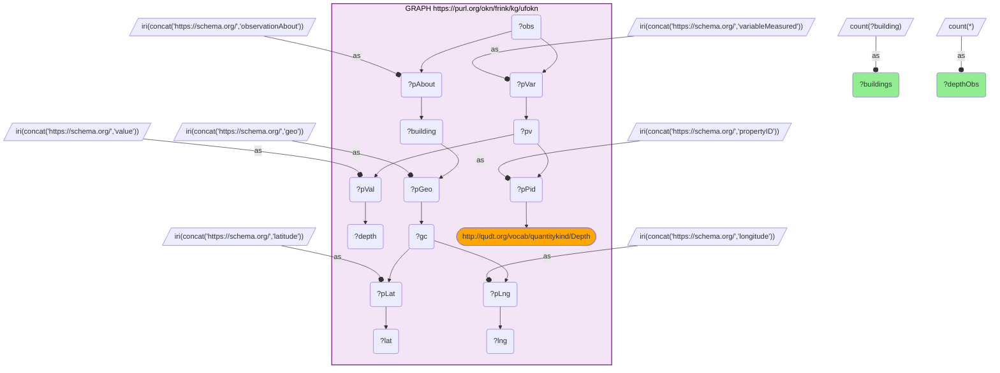

_1 row(s)_

#### Query 2

_2026-07-26T19:55:43+00:00 · `spatialkg`, `fiokg`_

```sparql
SELECT ?id ?fips ?frs (GROUP_CONCAT(DISTINCT ?nc;separator="|") AS ?naics) (GROUP_CONCAT(DISTINCT ?e;separator="|") AS ?interests) WHERE {
  VALUES ?id { "5525937169648058368" "5525968780607356928" "5526597254581846016" "5526597323301322752" "5526835298849259520" "5526835333208997888" "5526836638879055872" "5526913673412476928" "5526958444151570432" "5526960299577442304" "5526960368296919040" "5526986790935724032" "5527093718441525248" "5527096261062164480" "5527096364141379584" "5527096707738763264" "5527097394933530624" "5527099937554169856" "5527102926851407872" "5527103236089053184" "5527103785844867072" "5527104232521465856" "5527119316446609408" "5527119350806347776" "5527119797482946560" "5527121893426987008" "5527121927786725376" "5527132682384834560" "5527148212986576896" "5527156390604308480" "5527156459323785216" "5527195114029449216" "5527195423267094528" "5527212396977848320" "5527213049812877312" "5527253250706767872" "5527312521255452672" "5527730713631129600" "5527740471796826112" "5527740746674733056" "5527741433869500416" "5527750470480691200" "5529117060354801664" "5533935292106407936" "5533935326466146304" "5533936425977774080" "5533996349361487872" "5563696323091234816" "5563696357450973184" "5563696529249665024" "5563696563609403392" "5563696666688618496" "5563696735408095232" "5563697010286002176" "5563704913025826816" "5563704947385565184" "5563704981745303552" "5563705119184257024" "5563705497141379072" "5563705531501117440" "5563705600220594176" "5563705703299809280" "5563705737659547648" "5563705772019286016" "5563705806379024384" "5563705840738762752" "5563705875098501120" "5563705943817977856" "5563705978177716224" "5563706115616669696" "5563706321775099904" "5563706356134838272" "5563706424854315008" "5563706459214053376" "5563706527933530112" "5563706596653006848" "5563706699732221952" "5563706734091960320" "5563707043329605632" "5563707077689344000" "5563707112049082368" "5563707455646466048" "5563712300369575936" "5563712781405913088" "5563712815765651456" "5563712850125389824" "5563745732395008000" "5563745801114484736" "5563745835474223104" "5563745869833961472" "5563749030929891328" "5563749958642827264" "5563750027362304000" "5563750061722042368" "5563750130441519104" "5563750164801257472" "5563750302240210944" "5563750405319426048" "5563750439679164416" "5563750748916809728" "5563751058154455040" "5563751504831053824" "5563755627999657984" "5563756109035995136" "5563756177755471872" "5563756212115210240" "5563756246474948608" "5563756280834686976" "5563756452633378816" "5563756486993117184" "5563756521352855552" "5563756555712593920" "5563756933669715968" "5563757036748931072" "5563757071108669440" "5563757105468407808" "5563757139828146176" "5563757174187884544" "5563757242907361280" "5563769646772912128" "5563769681132650496" "5563770333967679488" "5563770368327417856" "5563770780644278272" "5563770815004016640" "5563770952442970112" "5563770986802708480" "5563772739149365248" "5563772979667533824" "5563773357624655872" "5563773426344132608" "5563773460703870976" "5563773529423347712" "5563774044819423232" "5563774147898638336" "5563774663294713856" "5563774732014190592" "5563774766373928960" "5569438282049126400" "5572172252071329792" "5572172286431068160" "5572310343859830784" "5572398442229006336" "5572496642361262080" "5572524061432479744" "5572547872731168768" "5572570825036398592" "5572570996835090432" "5956424284346777600" "5956685865034973184" "5956737645160693760" "5956793960771878912" "5956997404782755840" "5957568257476001792" "5957877014084976640" "5957879453626400768" "5957879487986139136" "5959028924313763840" "5959057889573208064" "5959058301890068480" "5959058473688760320" "5959060226035417088" "5959060294754893824" "5959060569632800768" "5959060638352277504" "5959060672712015872" "5959063490210562048" "5959146743856627712" "5959146881295581184" "5959146915655319552" "5959146950015057920" "5959149973672034304" "5959152035256336384" "5959158151289765888" "5959158254368980992" "5959158872844271616" "5959159422600085504" "5959159456959823872" "5959159628758515712" "5959160109794852864" "5959160419032498176" "5959160865709096960" "5959161106227265536" "5959161243666219008" "5959161278025957376" "5959161312385695744" "5959164026805026816" "5959167909455462400" "5959168081254154240" "5959170280277409792" "5959171482868252672" "5959171551587729408" "5959171585947467776" "5959185673440198656" "5959186566793396224" "5959188594017959936" "5959220686013595648" "5959220789092810752" "5959707219908886528" "5959709315852926976" "5961018009567887360" "5961631227818541056" "5961640745466068992" "5962291656349712384" "5962298974973984768" "5962299181132414976" "5962301277076455424" "5962301311436193792" "5962301483234885632" "5962301517594624000" "5962301620673839104" "5962301758112792576" "5962301792472530944" "5962302032990699520" "5962302101710176256" "5962389925201444864" "5962390371878043648" "5962393807851880448" "5962398893093158912" "5962403256779931648" "5962405077846065152" "5962418512503767040" "5962418546863505408" "5962418581223243776" "5962418615582982144" "5962418959180365824" "5962418993540104192" "5962421261282836480" "5962421295642574848" "5962421673599696896" "5962422670032109568" "5962422944910016512" "5962423013629493248" "5962423047989231616" "5962423116708708352" "5962423288507400192" "5962424869055365120" "5962450535779926016" "5962456754892570624" "5962456789252308992" "5964754974712791040" "5964755009072529408" "5964755180871221248" "5967291135721209856" "5967291204440686592" "5986745447786479616" "6000934198666330112" "6001264464471523328" "6004437139633209344" "6004437448870854656" "6004536885953691648" "6004655255252369408" "6004664085705129984" "6004667899636088832" "6004673637712396288" "6004702740410793984" "6004723631131721728" "6004723665491460096" "6004723699851198464" "6004723837290151936" "6004723871649890304" "6004724318326489088" "6004724352686227456" "6004724421405704192" "6004725074240733184" "6004734660607737856" "6004734694967476224" "6004734798046691328" "6004735347802505216" "6089663550077272064" "6089663584437010432" "6089663618796748800" "6089663756235702272" "6090292367649144832" "6090312021419491328" "6090314220442746880" "6090374143826460672" "6090374178186199040" "6090374727942012928" "6090374762301751296" "6090374831021228032" "6090374865380966400" "6090374899740704768" "6090374934100443136" "6090374968460181504" "6090375140258873344" "6090375243338088448" "6090375277697826816" "6090375312057565184" "6090375346417303552" "6090375380777041920" "6090375483856257024" "6090375724374425600" "6090475298896216064" "6090492650564091904" "6093519159398760448" "6095665749693562880" "6095665784053301248" "6095982134164455424" "6095982271603408896" "6095982305963147264" "6095982340322885632" "6095982443402100736" "6095991617452244992" "6095991926689890304" "6095991995409367040" "6096391289928941568" "6096391427367895040" "6096392801757429760" "6101065073340448768" "6102284191217483776" "6102284294296698880" "6102284397375913984" "6102284431735652352" "6105161475708420096" "9260901821864476672" "9260901856224215040" "9260901890583953408" "9260942297636274176" "9263905721991299072" "9263905962509467648" "9263905996869206016" "9263908883087228928" "9263911769305251840" "9263911906744205312" "9263935924201324544" "9263936061640278016" "9266505276717006848" "9266906976418267136" "9266949376335413248" "9266950441487302656" "9266950475847041024" "9266951747157360640" "9266951781517099008" "9279903478736486400" "9282107243635933184" "9282107277995671552" "9283981086327570432" "9665011583893372928" "9665011927490756608" "9665030687907905536" "9665032234096132096" "9665032268455870464" "9665034639277817856" "9665074427854848000" "9665074496574324736" "9665074702732754944" "9665077760749469696" "9665082845990748160" "9665090130255282176" "9665185512888991744" "9665191835080851456" "9665192968952217600" "9665978947967385600" "9666588833323417600" "9670177364398571520" "9670660737197932544" "9671073397655732224" "9671077761342504960" "9671077795702243328" "9671689948801007616" "9671690223678914560" "9671690910873681920" "9671728500427456512" "9671772274734137344" "9671772309093875712" "9671943558029901824" "9671943661109116928" "9671943935987023872" "9671944245224669184" "9671944691901267968" "9671953247476121600" "9671954656225394688" "9671954690585133056" "9671955102901993472" "9671955137261731840" "9671956923968126976" "9671958195278446592" "9672496921616318464" "9672610102594502656" "9672792552805236736" "9673503936828407808" "9673504314785529856" "9673507338442506240" "9673528194803695616" "9673786408237531136" "9673786442597269504" "9673786476957007872" "9673786511316746240" "9673786545676484608" "9673786580036222976" "9673786683115438080" "9673786889273868288" "9673786923633606656" "9673787129792036864" "9673787164151775232" "9673787198511513600" "9673788675980263424" "9673788847778955264" "9673788882138693632" "9673788916498432000" "9673788950858170368" "9673788985217908736" "9673789019577647104" "9673789053937385472" "9673789088297123840" "9673789466254245888" "9673789500613984256" "9673789672412676096" "9673790943722995712" "9673790978082734080" "9673791424759332864" "9673791768356716544" "9673793623782588416" "9673794036099448832" "9673794414056570880" "9673794585855262720" "9673801011126337536" "9673801182925029376" "9673804584539127808" "9673804653258604544" "9673804790697558016" "9673805031215726592" "9673805203014418432" "9673805237374156800" "9673805306093633536" "9673805374813110272" "9673806474324738048" "9673810975450464256" "9673811009810202624" "9673811044169940992" "9673811112889417728" "9673811147249156096" "9673811250328371200" "9673811422127063040" "9673811456486801408" "9673811628285493248" "9673811697004969984" "9673811765724446720" "9673812006242615296" "9673812143681568768" "9673812178041307136" "9673812212401045504" "9673812246760783872" "9673813792949010432" "9673832450286944256" "9673832484646682624" "9673833721597263872" "9673833824676478976" "9673846778297843712" "9673848290126331904" "9673848324486070272" "9673850592228802560" "9673851760459907072" "9673851966618337280" "9673854062562377728" "9673854165641592832" "9673854200001331200" "9673894022938099712" "9673894057297838080" }
  BIND(IRI(CONCAT("http://stko-kwg.geog.ucsb.edu/lod/resource/s2.level13.", ?id)) AS ?cell)
  GRAPH <https://purl.org/okn/frink/kg/spatialkg> {
    ?cell <http://stko-kwg.geog.ucsb.edu/lod/ontology/sfWithin> ?county .
  }
  BIND(STRAFTER(STR(?county),'administrativeRegion.USA.') AS ?fips)
  FILTER(STRLEN(?fips) = 5)
  OPTIONAL {
    GRAPH <https://purl.org/okn/frink/kg/fiokg> {
      ?f <http://stko-kwg.geog.ucsb.edu/lod/ontology/sfWithin> ?cell ;
         <http://w3id.org/fio/v1/epa-frs#hasFRSId> ?frs .
      OPTIONAL { ?f <http://w3id.org/fio/v1/fio#ofIndustry> ?naicsIri BIND(STRAFTER(STR(?naicsIri),'NAICS-') AS ?nc) }
      OPTIONAL { ?f <http://w3id.org/fio/v1/epa-frs#hasEnvironmentalInterest> ?eiIri BIND(STRAFTER(STR(?eiIri),'EnvironmentalInterestType.') AS ?e) }
    }
  }
} GROUP BY ?id ?fips ?frs
```

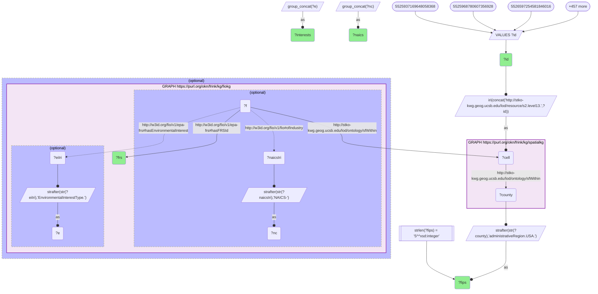

_1483 row(s)_

#### Query 3

_2026-07-26T20:06:59+00:00 · `sawgraph`_

```sparql
SELECT ?feat ?cell ?ftype WHERE {
  GRAPH <https://purl.org/okn/frink/kg/sawgraph> {
    ?feat <http://www.w3.org/2002/07/owl#sameAs> ?cell .
    FILTER(STRSTARTS(STR(?cell),'http://stko-kwg.geog.ucsb.edu/lod/resource/s2.level13.'))
    OPTIONAL { ?feat <http://w3id.org/coso/v1/contaminoso#ofFeatureType> ?ftype }
  }
}
```

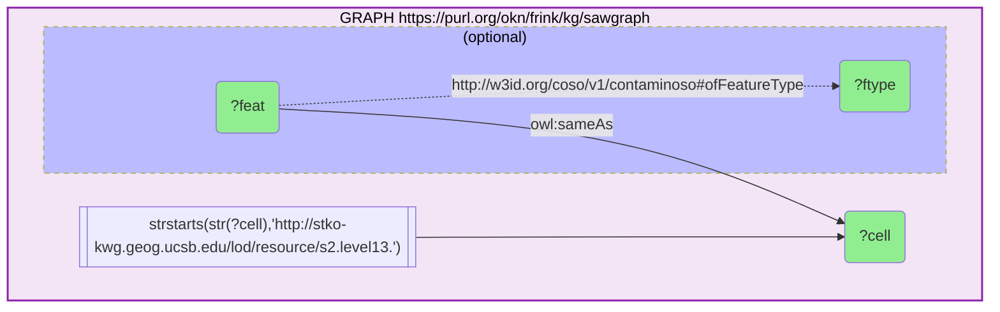

_88007 row(s)_

#### Query 4

_2026-07-26T20:08:12+00:00 · `sawgraph`, `spatialkg`_

```sparql
SELECT ?fips (COUNT(DISTINCT ?cell) AS ?nCells) WHERE {
  GRAPH <https://purl.org/okn/frink/kg/sawgraph> {
    ?feat <http://www.w3.org/2002/07/owl#sameAs> ?cell .
    FILTER(STRSTARTS(STR(?cell),'http://stko-kwg.geog.ucsb.edu/lod/resource/s2.level13.'))
  }
  GRAPH <https://purl.org/okn/frink/kg/spatialkg> {
    ?cell <http://stko-kwg.geog.ucsb.edu/lod/ontology/sfWithin> ?county .
  }
  BIND(STRAFTER(STR(?county),'administrativeRegion.USA.') AS ?fips)
  FILTER(STRLEN(?fips) = 5)
} GROUP BY ?fips
```

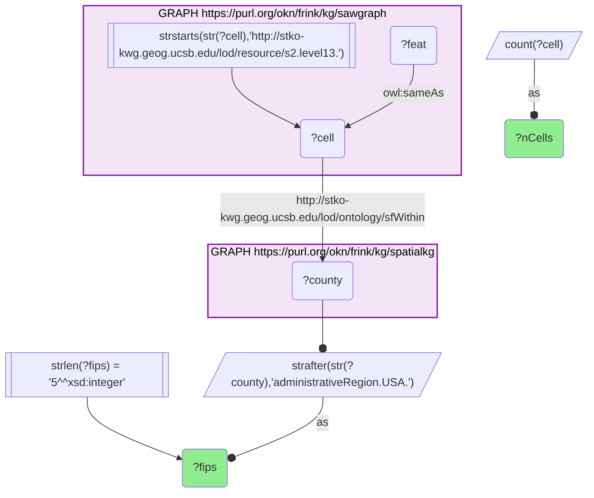

_264 row(s)_

#### Query 5

_2026-07-26T20:08:22+00:00 · `sudokn`_

```sparql
SELECT ?site ?lat ?lng ?naics ?company WHERE {
  GRAPH <https://purl.org/okn/frink/kg/sudokn> {
    ?company <http://asu.edu/semantics/SUDOKN/hasGeospatialLocation> ?site .
    ?site <http://asu.edu/semantics/SUDOKN/hasLatitudeValue> ?lat ;
          <http://asu.edu/semantics/SUDOKN/hasLongitudeValue> ?lng .
    OPTIONAL { ?company <http://asu.edu/semantics/SUDOKN/hasPrimaryNAICSClassifier> ?naics }
  }
}
```

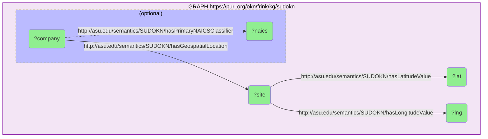

_225 row(s)_

#### Query 6

_2026-07-26T20:11:02+00:00 · `hydrologykg`, `spatialkg`_

```sparql
SELECT ?st (COUNT(DISTINCT ?cell) AS ?nCells) WHERE {
  GRAPH <https://purl.org/okn/frink/kg/hydrologykg> {
    ?h <http://stko-kwg.geog.ucsb.edu/lod/ontology/sfWithin> ?cell .
    FILTER(STRSTARTS(STR(?cell),'http://stko-kwg.geog.ucsb.edu/lod/resource/s2.level13.'))
  }
  GRAPH <https://purl.org/okn/frink/kg/spatialkg> {
    ?cell <http://stko-kwg.geog.ucsb.edu/lod/ontology/sfWithin> ?county .
  }
  BIND(STRAFTER(STR(?county),'administrativeRegion.USA.') AS ?st)
  FILTER(STRLEN(?st) = 2)
} GROUP BY ?st
```

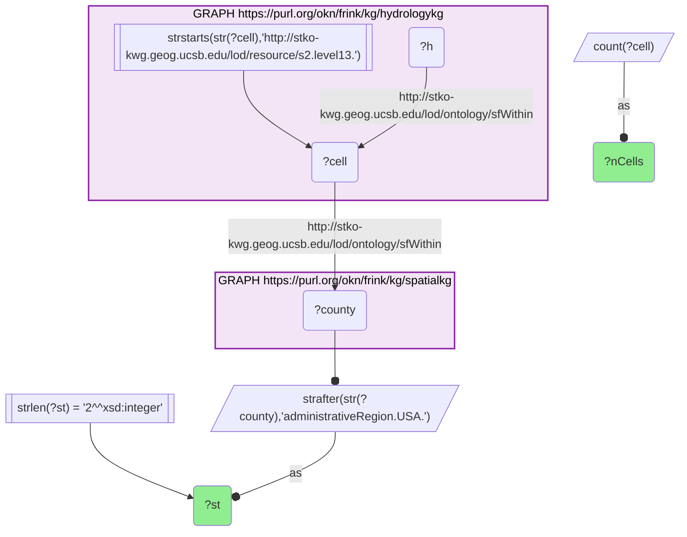

_9 row(s)_

#### Query 7

_2026-07-26T20:11:53+00:00 · `hydrologykg`_

```sparql
SELECT ?srcType (COUNT(DISTINCT ?src) AS ?n) WHERE {
  VALUES ?id { "5525937169648058368" "5525968780607356928" "5526597254581846016" "5526597323301322752" "5526958444151570432" "5526960299577442304" "5526960368296919040" "5526986790935724032" "5529117060354801664" "9790251936891535360" "9790253002043424768" "9790253139482378240" "9790253620518715392" "9790253757957668864" "9790253792317407232" "9790282895015804928" "9790292034706210816" "9790611648992509952" "9790615978319544320" "9790619414293381120" "9790619517372596224" "9790632642792652800" "9790643363031023616" "9790643534829715456" "9790643569189453824" "9790644187664744448" "9790644222024482816" "9790644256384221184" "9790644634341343232" "9790644668701081600" "9790644806140035072" "9790644840499773440" "9790644874859511808" "9790644909219250176" "9790644943578988544" "9790644977938726912" "9790645012298465280" "9790645046658203648" "9790645081017942016" "9790645115377680384" "9790741082126942208" "9790770390983770112" "9790773139762839552" "9790774720310804480" "9790777091132751872" "9790790525790453760" "9790792243777372160" "9790864055630561280" "9790871099376926720" "9790871202456141824" "9790873745076781056" "9790873813796257792" "9790876940532449280" "9790880445225762816" "9790881029341315072" "9790911678227939328" "9790937344952500224" "9790942567632732160" "9790944766655987712" "9790954524821684224" "9790963149116014592" "9791019018050600960" "9791022316585484288" "9791046608920510464" "9791050044894347264" "9791315851830362112" "9791315989269315584" "9791316092348530688" "9791443670057091072" "9791444632129765376" "9791445353684271104" "9792885095441367040" "9792888050378866688" "9792894922326540288" "9802511697699667968" "9802648689976541184" "9802651747993255936" "9802723044450369536" "9802742732580454400" "9802743247976529920" "9802743316696006656" "9802743763372605440" "9802744106969989120" "9802744553646587904" "9802746168554291200" "9802746271633506304" "9802748230138593280" "9802748298858070016" "9802748779894407168" "9802748882973622272" "9802750704039755776" "9802751975350075392" "9802752009709813760" "9802752078429290496" "9802758847297748992" "9802759843730161664" "9802760737083359232" "9802761218119696384" "9802781937041932288" "9802782349358792704" "9802783655028850688" "9802790320818094080" "9802793103956901888" "9802800937977249792" "9802915699503398912" "9802927622332612608" "9803052382542626816" "9803053550773731328" "9803063755616026624" "9803876260349214720" "9804215184808476672" "9832675596616859648" "9832827363581231104" "9832843512658264064" "9832843993694601216" "9832844028054339584" }
  BIND(IRI(CONCAT("http://stko-kwg.geog.ucsb.edu/lod/resource/s2.level13.", ?id)) AS ?cell)
  GRAPH <https://purl.org/okn/frink/kg/hydrologykg> {
    ?src <http://stko-kwg.geog.ucsb.edu/lod/ontology/sfWithin> ?cell ; a ?srcType .
  }
} GROUP BY ?srcType
```

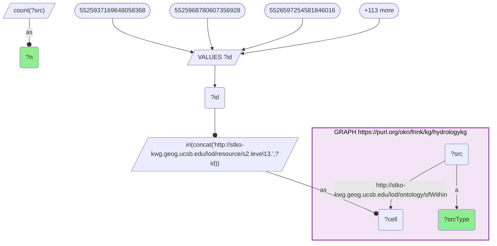

_5 row(s)_

#### Query 8

_2026-07-26T20:12:06+00:00 · `hydrologykg`_

```sparql
SELECT ?t (COUNT(DISTINCT ?h) AS ?n) WHERE {
  GRAPH <https://purl.org/okn/frink/kg/hydrologykg> {
    ?h <http://stko-kwg.geog.ucsb.edu/lod/ontology/sfWithin> ?cell ; a ?t .
    FILTER(STRSTARTS(STR(?cell),'http://stko-kwg.geog.ucsb.edu/lod/resource/s2.level13.'))
  }
} GROUP BY ?t
```

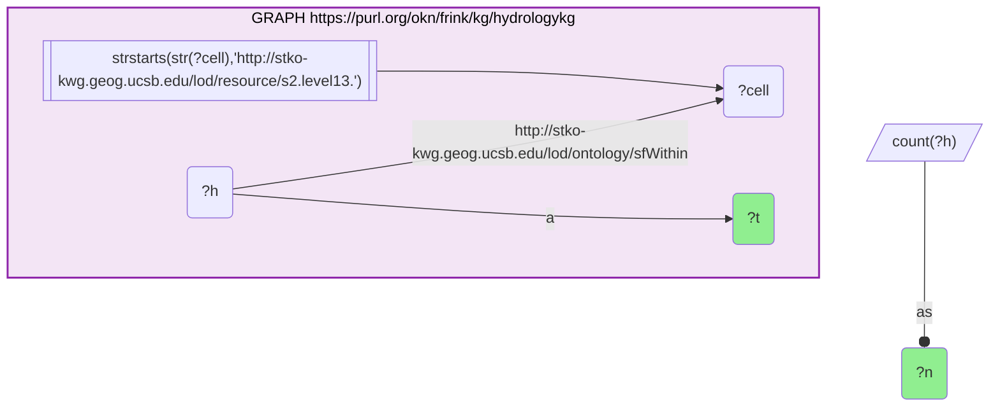

_5 row(s)_

#### Query 9

_2026-07-26T20:15:42+00:00 · `hydrologykg`, `spatialkg`_

```sparql
SELECT ?comid ?fips WHERE {
  GRAPH <https://purl.org/okn/frink/kg/hydrologykg> {
    ?r <http://nhdplusv2.spatialai.org/v1/nhdplusv2#hasCOMID> ?comid ;
       <http://stko-kwg.geog.ucsb.edu/lod/ontology/sfCrosses> ?cell .
  }
  GRAPH <https://purl.org/okn/frink/kg/spatialkg> {
    ?cell <http://stko-kwg.geog.ucsb.edu/lod/ontology/sfWithin> ?county .
  }
  BIND(STRAFTER(STR(?county),'administrativeRegion.USA.') AS ?fips)
  FILTER(STRLEN(?fips) = 5)
}
```

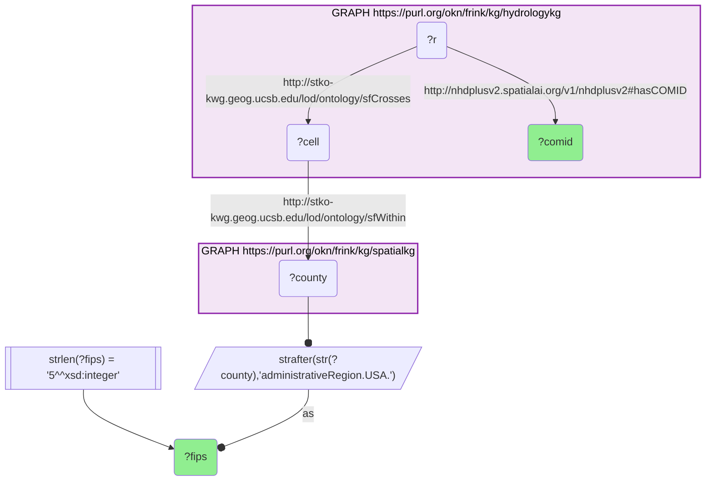

_1279766 row(s)_

#### Query 10

_2026-07-26T20:16:34+00:00 · `hydrologykg`_

```sparql
SELECT ?comid ?s2 WHERE {
  GRAPH <https://purl.org/okn/frink/kg/hydrologykg> {
    ?r <http://nhdplusv2.spatialai.org/v1/nhdplusv2#hasCOMID> ?comid ;
       <http://stko-kwg.geog.ucsb.edu/lod/ontology/sfCrosses> ?cell .
  }
  BIND(STRAFTER(STR(?cell),'s2.level13.') AS ?s2)
}
```

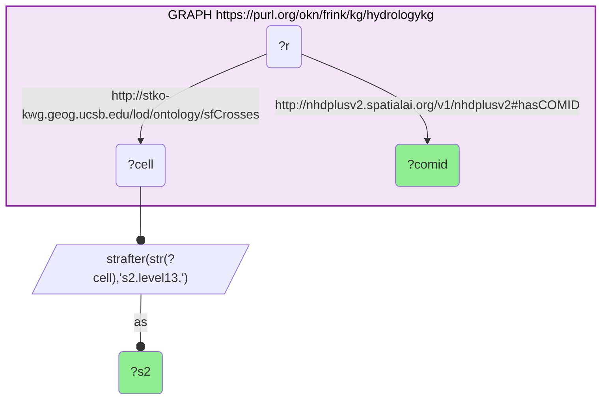

_1401430 row(s)_

#### Query 11

_2026-07-26T20:18:41+00:00 · `hydrologykg`_

```sparql
SELECT ?srcc ?ds WHERE {
  VALUES ?srcc { "10161556" "10161558" "10161578" "10161614" "10161812" "10163538" "10163594" "10163596" "10163614" "10163680" "10163686" "10163710" "10163726" "10163728" "10163730" "10163732" "10163734" "10163736" "10163744" "10163746" "10163776" "10163778" "10163780" "10163788" "10163872" "10163874" "10163884" "10163886" "10163946" "10186650" "10186740" "10186766" "10186768" "10186772" "10186918" "10186920" "10186928" "10186938" "10186940" "10186942" "10186944" "10186950" "10186966" "10186968" "10186970" "10186976" "10186978" "10186980" "10186982" "10186984" "10186986" "10186988" "10186992" "10187004" "10187006" "10187014" "10187024" "10187026" "10187028" "10187030" "10187036" "10187042" "10187044" "10187054" "10187062" "10187064" "10187128" "10187130" "10187154" "10187200" "10187866" "10187874" "10187876" "10187924" "10187926" "10187966" "10187968" "10187988" "10188006" "10188022" "10188292" "10188294" "10188316" "10188320" "10188368" "10188392" "10188398" "10188456" "10188472" "10188516" "10188520" "10188598" "10188600" "10188624" "10188720" "10188722" "10188774" "10188956" "10188964" "10188966" "10189076" "10189082" "10189092" "10189098" "10189154" "10189156" "10189268" "10189270" "10189316" "10189366" "10189378" "10189396" "10189414" "10189642" "10189644" "10189654" "10189662" "10189676" "10189680" "10189682" "10189698" "10189700" "10189706" "10189712" "10189714" "10189716" "10189720" "10189956" "10189958" "10189962" "10190032" "10190036" "10190038" "10190040" "10190286" "10190288" "10190292" "10190296" "10190300" "10190306" "10190308" "10190324" "10190334" "10204849" "10263714" "10263716" "10263726" "10263728" "10263792" "10263818" "10263886" "10263896" "10263938" "10263946" "10263966" "10263994" "10264004" "10264012" "10264014" "10264020" "10264032" "10264050" "10264056" "10264076" "10264078" "10264088" "10264114" "10264116" "10264118" "10264124" "10264144" "10264150" "10264178" "10264186" "10264198" "10264204" "10264216" "10264240" "10264242" "10264250" "10264262" "10264282" "10264284" "10264286" "10264288" "10264314" "10264316" "10264324" "10264326" "10264336" "10264340" "10264398" "10264504" "10264512" "10264524" "10264532" "10264560" "10264596" "10264606" "10264608" "10264610" "10264760" "10265430" "10265536" "10265538" "10265540" "10265586" "10265616" "10265832" "10265856" "10265928" "10265940" "10265948" "10265990" "10266034" "10266056" "10266182" "10266272" "10266276" "10266288" "10266290" "10266300" "10266312" "10266350" "10266352" "10266360" "10266480" "10266482" "10266484" "10266486" "10266488" "10266490" "10266496" "10266536" "10266538" "10266540" "10266558" "10266628" "10283700" "10299573" "10299663" "10300083" "10300085" "10300087" "10300089" "10300091" "10300107" "10300281" "10300363" "10300483" "10300633" "10300661" "10300711" "10300777" "10300791" "10300797" "10300799" "10300801" "10300825" "10300913" "10300923" "10302231" "10302293" "10302647" "10302753" "10302857" "10302957" "10302959" "10356698" "10356770" "10357098" "10357100" "10357592" "10358082" "10358084" "10358086" "10358524" "10358534" "10358716" "10358724" "10609192" "10609194" "10609196" "10609198" "10609200" "10609206" "10609500" "10609508" "10969157" "1099824" "1099830" "1099866" "1099988" "1099992" "1100030" "1100042" "1100056" "1100058" "1100062" "1100064" "1100078" "1100080" "1100086" "1100092" "1100100" "1100102" "1100106" "1100116" "1100118" "1100120" "1100138" "1100390" "1100438" "1100446" "1100544" "1100682" "1100686" "1100688" "1100690" "1100692" "1100694" "1100716" "1100718" "1100720" "1100742" "1100750" "1100822" "1100836" "1101300" "1101450" "1103718" "1103852" "1103854" "1103864" "1104060" "1104080" "1104192" "1104306" "1104330" "1104372" "11621066" "11621886" "11621902" "11621918" "11621954" "11622736" "11622740" "11622764" "11627473" "12152868" "12152870" "12152906" "12152908" "12152958" "13132221" "13132635" "13289714" "13289804" "13289814" "13289818" "13289828" "13289834" "13289836" "13289840" "13289866" "13289868" "13291162" "13291432" "13293416" "13293430" "13293432" "13293452" "13293454" "13293456" "13293458" "13293482" "13294128" "13395861" "13410714" "13410716" "13410798" "13412356" "13412364" "13412388" "13412910" "13412912" "13549747" "13549749" "13550813" "13551281" "13580646" "13585162" "13585170" "13585172" "13585192" "13585490" "13585548" "13585550" "13585552" "13586502" "13586504" "13586520" "13597795" "13597803" "13597833" "13597835" "13604846" "13604950" "13604974" "13604976" "13605100" "13605102" "13605104" "13605172" "13605212" "13605214" "13605220" "13605312" "13605322" "13605336" "13605338" "13605352" "13605384" "13605406" "13605410" "13605412" "13605792" "13605890" "13605922" "13606040" "13606044" "13606068" "13607984" "13632059" "13632067" "13632071" "13632137" "13632221" "13632231" "13632239" "13632279" "13632311" "13632315" "13632345" "13632371" "13632373" "13632395" "13632843" "13632853" "13632877" "13633989" "13633991" "13633993" "13634883" "13634885" "13634913" "13635341" "13635351" "13635413" "13637141" "13637179" "13637185" "13637187" "13637423" "13653868" "13803400" "13804170" "14701944" "14701946" "14701948" "14701966" "14701968" "14701972" "14784499" "14787163" "14787173" "14787213" "14820465" "14820487" "14839033" "14839053" "14839055" "14839059" "14839061" "14839065" "14839075" "14839079" "14839085" "14839087" "14839101" "14839123" "14839233" "14839247" "166195759" "1824390" "1825188" "1825204" "1825218" "1825254" "1825278" "1825282" "1825298" "1825302" "1825330" "1825334" "1825336" "1825350" "1825374" "1825446" "1825500" "1825648" "1826834" "1826836" "1826846" "1826848" "1826864" "1826866" "1826874" "1826878" "1826888" "1826934" "1826980" "1827068" "1827104" "1827324" "1827366" "1827420" "1827560" "1827564" "1827612" "1827626" "1827632" "1827640" "1827894" "1827896" "1828388" "1828390" "1828392" "1828402" "1828404" "1828406" "1828408" "1828410" "1828412" "1828418" "1828426" "1828430" "18439174" "18439238" "18439242" "18439274" "18439478" "18439480" "18440438" "18441416" "18443904" "18444810" "18444848" "18444868" "18445530" }
  BIND(IRI(CONCAT("https://geoconnex.us/nhdplusv2/comid/", ?srcc)) AS ?src)
  GRAPH <https://purl.org/okn/frink/kg/hydrologykg> {
    ?src <https://www.opengis.net/def/schema/hy_features/hyf/downstreamFlowPathTC> ?ds .
  }
}
```

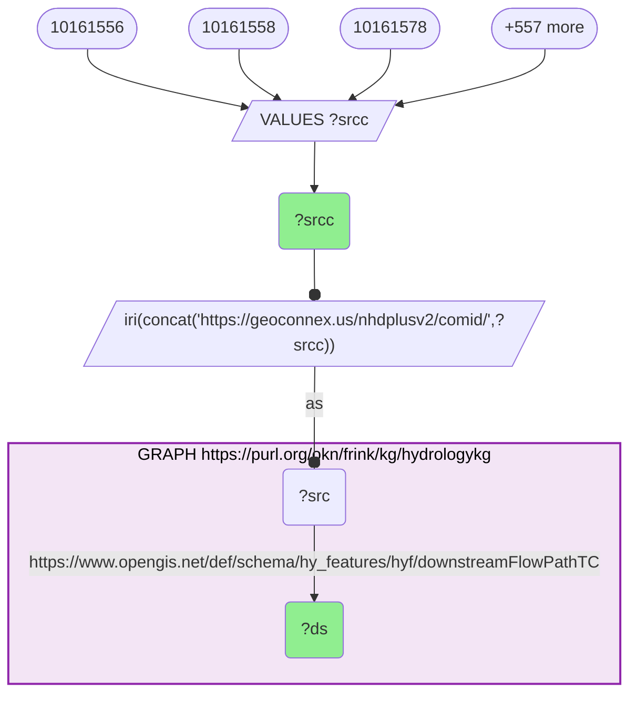

_493610 row(s)_

#### Query 12

_2026-07-26T20:20:37+00:00 · `hydrologykg`_

```sparql
SELECT ?comid ?rc WHERE {
  GRAPH <https://purl.org/okn/frink/kg/hydrologykg> {
    ?r <http://nhdplusv2.spatialai.org/v1/nhdplusv2#hasCOMID> ?comid ;
       <http://nhdplusv2.spatialai.org/v1/nhdplusv2#hasReachCode> ?rc .
  }
}
```

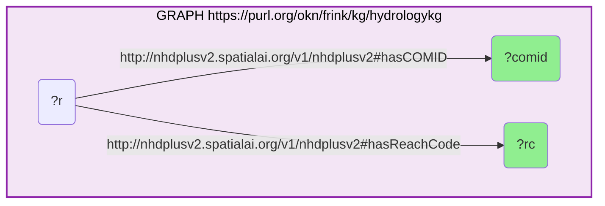

_507487 row(s)_

#### Query 13

_2026-07-26T20:21:36+00:00 · `spatialkg`_

```sparql
SELECT ?fips ?label WHERE {
  GRAPH <https://purl.org/okn/frink/kg/spatialkg> {
    ?r a <http://stko-kwg.geog.ucsb.edu/lod/ontology/AdministrativeRegion_2> ;
       <http://www.w3.org/2000/01/rdf-schema#label> ?label .
  }
  BIND(STRAFTER(STR(?r),'administrativeRegion.USA.') AS ?fips)
  FILTER(STRLEN(?fips) = 5)
}
```

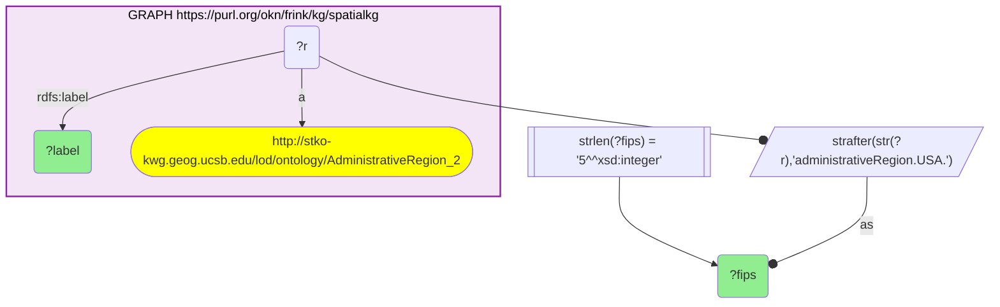

_3114 row(s)_

#### Query 14

_2026-07-26T20:21:46+00:00 · `ruralkg`_

```sparql
SELECT ?fips ?rucc ?pop ?yr WHERE {
  GRAPH <https://purl.org/okn/frink/kg/ruralkg> {
    ?c <http://sail.ua.edu/ruralkg/settlementtype/censusCounty> ?fips ;
       <http://sail.ua.edu/ruralkg/settlementtype/hasRUCC> ?r .
    ?r <http://sail.ua.edu/ruralkg/settlementtype/code> ?rucc .
    OPTIONAL { ?c <http://sail.ua.edu/ruralkg/settlementtype/population> ?pop }
    OPTIONAL { ?c <http://sail.ua.edu/ruralkg/settlementtype/year> ?yr }
  }
}
```

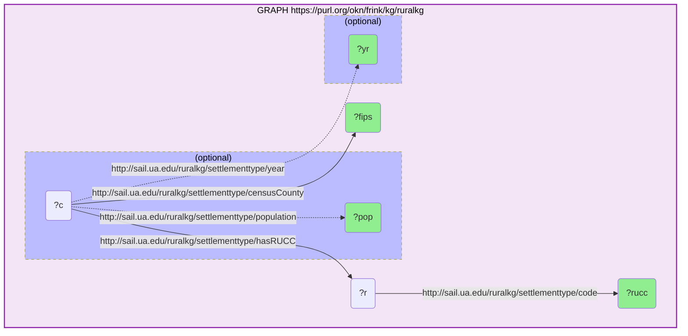

_3234 row(s)_

#### Query 15

_2026-07-26T20:22:22+00:00 · `hydrologykg`_

```sparql
SELECT ?id ?well ?use ?purpose ?depth WHERE {
  VALUES ?id { "5525937169648058368" "5525968780607356928" "5526597254581846016" "5526597323301322752" "5526958444151570432" "5526960299577442304" "5526960368296919040" "5526986790935724032" "5529117060354801664" "9790251936891535360" "9790253002043424768" "9790253139482378240" "9790253620518715392" "9790253757957668864" "9790253792317407232" "9790282895015804928" "9790292034706210816" "9790611648992509952" "9790615978319544320" "9790619414293381120" "9790619517372596224" "9790632642792652800" "9790643363031023616" "9790643534829715456" "9790643569189453824" "9790644187664744448" "9790644222024482816" "9790644256384221184" "9790644634341343232" "9790644668701081600" "9790644806140035072" "9790644840499773440" "9790644874859511808" "9790644909219250176" "9790644943578988544" "9790644977938726912" "9790645012298465280" "9790645046658203648" "9790645081017942016" "9790645115377680384" "9790741082126942208" "9790770390983770112" "9790773139762839552" "9790774720310804480" "9790777091132751872" "9790790525790453760" "9790792243777372160" "9790864055630561280" "9790871099376926720" "9790871202456141824" "9790873745076781056" "9790873813796257792" "9790876940532449280" "9790880445225762816" "9790881029341315072" "9790911678227939328" "9790937344952500224" "9790942567632732160" "9790944766655987712" "9790954524821684224" "9790963149116014592" "9791019018050600960" "9791022316585484288" "9791046608920510464" "9791050044894347264" "9791315851830362112" "9791315989269315584" "9791316092348530688" "9791443670057091072" "9791444632129765376" "9791445353684271104" "9792885095441367040" "9792888050378866688" "9792894922326540288" "9802511697699667968" "9802648689976541184" "9802651747993255936" "9802723044450369536" "9802742732580454400" "9802743247976529920" "9802743316696006656" "9802743763372605440" "9802744106969989120" "9802744553646587904" "9802746168554291200" "9802746271633506304" "9802748230138593280" "9802748298858070016" "9802748779894407168" "9802748882973622272" "9802750704039755776" "9802751975350075392" "9802752009709813760" "9802752078429290496" "9802758847297748992" "9802759843730161664" "9802760737083359232" "9802761218119696384" "9802781937041932288" "9802782349358792704" "9802783655028850688" "9802790320818094080" "9802793103956901888" "9802800937977249792" "9802915699503398912" "9802927622332612608" "9803052382542626816" "9803053550773731328" "9803063755616026624" "9803876260349214720" "9804215184808476672" "9832675596616859648" "9832827363581231104" "9832843512658264064" "9832843993694601216" "9832844028054339584" }
  BIND(IRI(CONCAT("http://stko-kwg.geog.ucsb.edu/lod/resource/s2.level13.", ?id)) AS ?cell)
  GRAPH <https://purl.org/okn/frink/kg/hydrologykg> {
    ?well <http://stko-kwg.geog.ucsb.edu/lod/ontology/sfWithin> ?cell .
    OPTIONAL { ?well <http://sawgraph.spatialai.org/v1/me-mgs#hasUse> ?u BIND(STRAFTER(STR(?u),'#') AS ?use) }
    OPTIONAL { ?well <http://sawgraph.spatialai.org/v1/il-isgs#wellPurpose> ?pp BIND(STRAFTER(STR(?pp),'#') AS ?purpose) }
    OPTIONAL { ?well <http://sawgraph.spatialai.org/v1/il-isgs#wellDepth> ?d . ?d <http://qudt.org/schema/qudt/numericValue> ?depth }
  }
}
```

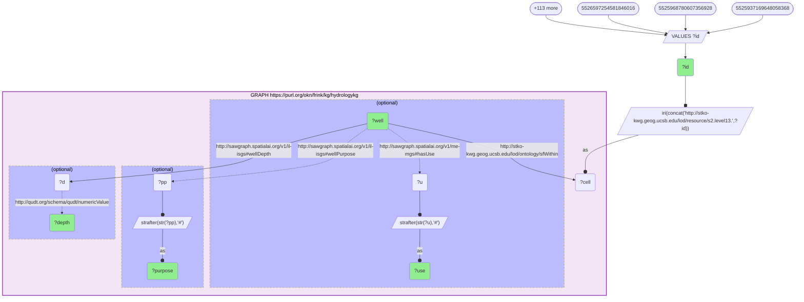

_1006 row(s)_
