# Instrument-Criticality reproducibility record

- **Date:** 2026-08-03
- **Model:** gpt-5.6-sol
- **Skills:** okn-bioanalysis v0.1.2 · okn-report-style v0.1.6 · Spreadsheets
- **External MCP servers:** Paperclip
- **SPARQL endpoint:** https://apps.okn.us/federation/sparql
- **Generated by:** mcp-okn v0.1.0 (build 2c4b70537a23eeb62c1736312d171270e59b57f4)
- **Study active window:** 2026-08-03 23:18–23:28 UTC (10m 42s)
- **Contents:** 18 queries · 14 query diagrams

## Prompt

A climate model is only as trustworthy as the observations it was evaluated against, and those observations come from instruments flying on spacecraft with finite lives. Missions get retired, defunded, or flown decades past their design life, and the reviews that decide their fate turn on a question nobody can currently answer with evidence: if this instrument goes dark, what does climate science stop being able to check?
Using the OKN federation, build a case study called Instrument-Criticality that answers it. Follow the `/okn-bioanalysis` workflow where applicable and produce the final report using `/okn-report-style`.
Ask:
What observing infrastructure does the federation actually describe — which instruments, which platforms, which archives — and how much of the record does each account for? Establish the scale and the shape of the catalogue before you rank anything, and say what the catalogue does not cover.
Which of that infrastructure does climate modelling genuinely depend on, and how do you know? There is likely more than one way to establish a dependency. Find them, use more than one, and treat agreement between independent routes as the strength of a claim rather than trusting any single route. Say what "dependency" means in each case, and flag where the evidence is textual rather than structural.
Where is that dependency concentrated? I want the distribution, not just the top of it: infrastructure that many models lean on; infrastructure that few models lean on but that nothing else could substitute for; and infrastructure with a large data footprint and no modelling uptake at all. Those are three different kinds of risk and they should not collapse into a single ranking.
Who, and where. Which people work across both the modelling and the observation side — that community is itself part of the infrastructure, and its size is a finding. And where on the ground does this literature actually study? Put research attention on the map, and say where decisions are resting on a thin evidence base.
The finding I care about most is the asymmetry: the instruments whose loss would be least survivable are probably not the ones with the largest data volumes. Rank the observing infrastructure by what modelling would lose if it went away, keep the criteria for that rank visible, and be candid about which comparisons the data genuinely supports and which it does not — including anything you wanted to compute and could not because the field simply is not populated. A named limitation is worth more to me than a number I cannot trust.
Then check your top-ranked instruments against the published record on observing-system dependence and mission continuity: which of these are already understood as critical, and which is this federation telling us something the literature has not.

## Notes

Queries 14 and 15 in the session log are deliberately excluded because an endpoint optimizer returned internally inconsistent aggregate alternative counts. Query 16 is the raw 699-pair extraction used for the client-side substitution calculation.

## Knowledge graphs used

- `nasa-gesdisc-kg` — <https://purl.org/okn/frink/kg/nasa-gesdisc-kg>
- `climatemodelskg` — <https://purl.org/okn/frink/kg/climatemodelskg>

## Notes

Queries 14 and 15 in the session log are deliberately excluded because an endpoint optimizer returned internally inconsistent aggregate alternative counts. Query 16 is the raw 699-pair extraction used for the client-side substitution calculation.

## Knowledge graphs used

- `nasa-gesdisc-kg` — <https://purl.org/okn/frink/kg/nasa-gesdisc-kg>
- `climatemodelskg` — <https://purl.org/okn/frink/kg/climatemodelskg>

## Replicator specification

### Knowledge-graph snapshots
- `nasa-gesdisc-kg` v0.0.6, last updated 2026-06-08.
- `climatemodelskg` v0.0.15, last updated 2026-05-06.
- The unit of climate-model analysis is the `cm:Source` node reached by `PAPER_USES_MODEL`; the nominal `cm:Model` class has zero instances.

### Catalogue scope
Spaceborne platforms are NASA platforms whose type is one of: Earth Observation Satellites; Solar/Space Observation Satellites; Navigation Satellites; Space Stations/Crewed Spacecraft; Space-based Platforms; Spacecraft. The resulting instrument set has 288 nodes. Generic/non-specific labels are excluded from rankability: NOT APPLICABLE, COMPUTER, GPS, IMAGING RADIOMETERS, RADIOMETERS, SCATTEROMETERS, SAR, SUN PHOTOMETERS, CAMERAS, LIDAR, RADAR, ALTIMETERS, RADAR ALTIMETERS, IMAGING SPECTROMETERS, SPECTROMETERS, MICROWAVE RADIOMETERS (case-normalized comparison). Eleven spaceborne nodes are classified generic/invalid and 277 are rankable.

### Cross-graph joins
1. DOI equality after lowercase/trim normalization: climate Paper DOI ↔ NASA Publication DOI. This yields 651 shared DOI papers.
2. Instrument-name equality after lowercase/trim normalization: climate Instrument name ↔ NASA Instrument label.
3. Platform-name equality after lowercase/trim normalization: climate Platform name ↔ NASA Platform label.
4. Person identity is never inferred from global exact-name overlap. The conservative people result requires the same DOI-matched paper plus exact author name in both graphs; ORCID is reported when available.

### Dependency routes
- Evaluation-context text: a paper uses a model, experiments on an observational-dataset node, and mentions an exact-matched instrument.
- Direct instrument text: a paper uses a model and mentions an exact-matched instrument.
- Platform text: a paper uses a model and mentions an exact-matched platform; NASA says the platform carries the instrument.
- DOI–dataset–platform: a climate model paper and NASA publication share a DOI; the NASA publication uses a dataset; the dataset has a platform; the platform carries the instrument.
- Direct structural Model→ObservationalDataset→Instrument matching was attempted and returned only NOT APPLICABLE; it is not used.

### Criticality score
For each rankable instrument:
`score = 100 × [0.45·L(E) + 0.15·L(max(T−E,0)) + 0.25·L(D) + 0.10·L(P) + 0.05·I(U>0)]`,
where E is distinct models in evaluation-context text, T is distinct models in direct instrument text, D is distinct models in DOI–dataset–platform, P is distinct models in platform text, U is unique measured-variable count, and `L(x)=log1p(x)/log1p(maximum observed on that axis)`. The four routes overlap and are not summed as raw counts. Dataset footprint is intentionally excluded. Tier A is score ≥70; Tier B 40–69.9; Tier C <40.

### Distribution rules
- Many-model dependence: more than 20 distinct models on the evaluation-context route.
- Low-uptake/scarce-variable candidate: five or fewer evaluation-context models and at least one variable with zero alternatives among exact-matched space instruments.
- High-footprint/no-uptake: platform-mediated dataset count above the 75th percentile (80) and zero models on all measured routes.
- “Data footprint” means distinct NASA dataset records reached via an instrument’s platforms. It is an upper bound, not bytes or instrument-specific records.

### Downstream computation
The raw 699 instrument–variable pairs are aggregated client-side because an endpoint aggregate query returned internally inconsistent zeros. For each matched instrument, count variables, variables with zero alternative matched instruments, minimum alternative count, and mean alternative count. Spearman correlation between criticality score and platform-mediated dataset count is 0.640; Pearson correlation with log1p(dataset count) is 0.600. Data extracts and the build scripts are bundled with the report.

### Geographic rules
Country and city nodes are paper text mentions, not study-site predicates. The map uses country entities and OpenStreetMap markers, sized by papers that both use a model and mention an instrument. “Thin” means fewer than three such papers. City results are exported but excluded from decision mapping because homonym/geocoding errors are visible.

### Literature comparison
Paperclip supplied abstract/arXiv discovery. Primary publisher and agency records from NASA, JAXA, NOAA, and NSIDC were used for status and continuity checks. PubMed was not called because its tool scope explicitly excludes climate and remote-sensing literature. Concordance labels are SUPPORTED, PARTIALLY SUPPORTED, NOVEL, UNRESOLVED, and CONTRADICTED.

### Reproducibility limitations
No direct NASA Dataset→Instrument edge; no instrument byte volume; no populated platform start/end dates; no mission operational-status field; no channel-equivalence or calibration-overlap field; only 30 of 82 exact-matched space instruments have variable semantics; climate corpus is 2,000 papers; textual mentions are not causal use; platform-mediated routes can attribute the wrong carried instrument; author names are ambiguous; geography is a mention proxy; and no observing-system denial experiment or causal degradation estimate is represented.

## SPARQL queries

#### Query 1 — NASA catalogue counts and edge coverage

_2026-08-03T23:18:11+00:00 · `nasa-gesdisc-kg`_

```sparql
PREFIX rdf: <http://www.w3.org/1999/02/22-rdf-syntax-ns#>
PREFIX nasa: <https://purl.org/okn/frink/kg/nasa-gesdisc/schema/>
SELECT ?metric ?n WHERE {
  GRAPH <https://purl.org/okn/frink/kg/nasa-gesdisc-kg> {
    { SELECT ("datasets" AS ?metric) (COUNT(DISTINCT ?x) AS ?n) WHERE { ?x a nasa:Dataset } }
    UNION { SELECT ("instruments" AS ?metric) (COUNT(DISTINCT ?x) AS ?n) WHERE { ?x a nasa:Instrument } }
    UNION { SELECT ("platforms" AS ?metric) (COUNT(DISTINCT ?x) AS ?n) WHERE { ?x a nasa:Platform } }
    UNION { SELECT ("data_centers" AS ?metric) (COUNT(DISTINCT ?x) AS ?n) WHERE { ?x a nasa:DataCenter } }
    UNION { SELECT ("projects" AS ?metric) (COUNT(DISTINCT ?x) AS ?n) WHERE { ?x a nasa:Project } }
    UNION { SELECT ("publications" AS ?metric) (COUNT(DISTINCT ?x) AS ?n) WHERE { ?x a nasa:Publication } }
    UNION { SELECT ("authors" AS ?metric) (COUNT(DISTINCT ?x) AS ?n) WHERE { ?x a nasa:Author } }
    UNION { SELECT ("institutions" AS ?metric) (COUNT(DISTINCT ?x) AS ?n) WHERE { ?x a nasa:Institution } }
    UNION { SELECT ("datasets_with_platform" AS ?metric) (COUNT(DISTINCT ?x) AS ?n) WHERE { ?x a nasa:Dataset ; nasa:HAS_PLATFORM ?p } }
    UNION { SELECT ("datasets_with_data_center" AS ?metric) (COUNT(DISTINCT ?x) AS ?n) WHERE { ?c nasa:HAS_DATASET ?x . ?x a nasa:Dataset } }
    UNION { SELECT ("datasets_with_daac_literal" AS ?metric) (COUNT(DISTINCT ?x) AS ?n) WHERE { ?x a nasa:Dataset ; nasa:daac ?d } }
    UNION { SELECT ("datasets_with_project" AS ?metric) (COUNT(DISTINCT ?x) AS ?n) WHERE { ?x a nasa:Dataset ; nasa:OF_PROJECT ?p } }
    UNION { SELECT ("platform_instrument_links" AS ?metric) (COUNT(*) AS ?n) WHERE { ?p nasa:HAS_INSTRUMENT ?i } }
    UNION { SELECT ("dataset_platform_links" AS ?metric) (COUNT(*) AS ?n) WHERE { ?d nasa:HAS_PLATFORM ?p } }
    UNION { SELECT ("publication_dataset_links" AS ?metric) (COUNT(*) AS ?n) WHERE { ?pub nasa:USES_DATASET ?d } }
    UNION { SELECT ("datasets_used_by_publications" AS ?metric) (COUNT(DISTINCT ?d) AS ?n) WHERE { ?pub nasa:USES_DATASET ?d } }
  }
}
```

```mermaid
graph TD
classDef projected fill:lightgreen;
classDef literal fill:orange;
classDef iri fill:yellow;
  q1v6("?c")
  q1v7("?d")
  q1v8("?i")
  q1v2("?metric"):::projected 
  q1v1("?n"):::projected 
  q1v5("?p")
  q1v9("?pub")
  q1v4("?x")
  subgraph q1graph0["GRAPH kg:nasa-gesdisc-kg"]
    style q1graph0 fill:#f3e5f5,stroke:#8e24aa,stroke-width:2px,color:#000;
    q1graph0c8(["nasa:Author"]):::iri 
    q1graph0c5(["nasa:DataCenter"]):::iri 
    q1graph0c2(["nasa:Dataset"]):::iri 
    q1graph0c9(["nasa:Institution"]):::iri 
    q1graph0c3(["nasa:Instrument"]):::iri 
    q1graph0c4(["nasa:Platform"]):::iri 
    q1graph0c6(["nasa:Project"]):::iri 
    q1graph0c7(["nasa:Publication"]):::iri 
    subgraph q1uniongraph00[" Union "]
    style q1uniongraph00 color:#000;
    subgraph q1uniongraph00l[" "]
      style q1uniongraph00l fill:#abf,stroke-dasharray: 3 3;
      q1v9 --"nasa:USES_DATASET"--> q1v7
      q1graph0bind0[/"'datasets_used_by_publications'"/]
      q1graph0bind0 --o|as| q1v2
      q1graph0bind1[/"count(?d)"/]
      q1graph0bind1 --o|as| q1v1
    end
      subgraph q1uniongraph01[" Union "]
      style q1uniongraph01 color:#000;
      subgraph q1uniongraph01l[" "]
        style q1uniongraph01l fill:#abf,stroke-dasharray: 3 3;
        q1v9 --"nasa:USES_DATASET"--> q1v7
        q1graph0bind2[/"'publication_dataset_links'"/]
        q1graph0bind2 --o|as| q1v2
        q1graph0bind3[/"count(?d)"/]
        q1graph0bind3 --o|as| q1v1
      end
        subgraph q1uniongraph02[" Union "]
        style q1uniongraph02 color:#000;
        subgraph q1uniongraph02l[" "]
          style q1uniongraph02l fill:#abf,stroke-dasharray: 3 3;
          q1v7 --"nasa:HAS_PLATFORM"--> q1v5
          q1graph0bind4[/"'dataset_platform_links'"/]
          q1graph0bind4 --o|as| q1v2
          q1graph0bind5[/"count(?d)"/]
          q1graph0bind5 --o|as| q1v1
        end
          subgraph q1uniongraph03[" Union "]
          style q1uniongraph03 color:#000;
          subgraph q1uniongraph03l[" "]
            style q1uniongraph03l fill:#abf,stroke-dasharray: 3 3;
            q1v5 --"nasa:HAS_INSTRUMENT"--> q1v8
            q1graph0bind6[/"'platform_instrument_links'"/]
            q1graph0bind6 --o|as| q1v2
            q1graph0bind7[/"count(?d)"/]
            q1graph0bind7 --o|as| q1v1
          end
            subgraph q1uniongraph04[" Union "]
            style q1uniongraph04 color:#000;
            subgraph q1uniongraph04l[" "]
              style q1uniongraph04l fill:#abf,stroke-dasharray: 3 3;
              q1v4 --"a"--> q1graph0c2
              q1v4 --"nasa:OF_PROJECT"--> q1v5
              q1graph0bind8[/"'datasets_with_project'"/]
              q1graph0bind8 --o|as| q1v2
              q1graph0bind9[/"count(?d)"/]
              q1graph0bind9 --o|as| q1v1
            end
              subgraph q1uniongraph05[" Union "]
              style q1uniongraph05 color:#000;
              subgraph q1uniongraph05l[" "]
                style q1uniongraph05l fill:#abf,stroke-dasharray: 3 3;
                q1v4 --"a"--> q1graph0c2
                q1v4 --"nasa:daac"--> q1v7
                q1graph0bind10[/"'datasets_with_daac_literal'"/]
                q1graph0bind10 --o|as| q1v2
                q1graph0bind11[/"count(?d)"/]
                q1graph0bind11 --o|as| q1v1
              end
                subgraph q1uniongraph06[" Union "]
                style q1uniongraph06 color:#000;
                subgraph q1uniongraph06l[" "]
                  style q1uniongraph06l fill:#abf,stroke-dasharray: 3 3;
                  q1v4 --"a"--> q1graph0c2
                  q1v6 --"nasa:HAS_DATASET"--> q1v4
                  q1graph0bind12[/"'datasets_with_data_center'"/]
                  q1graph0bind12 --o|as| q1v2
                  q1graph0bind13[/"count(?d)"/]
                  q1graph0bind13 --o|as| q1v1
                end
                  subgraph q1uniongraph07[" Union "]
                  style q1uniongraph07 color:#000;
                  subgraph q1uniongraph07l[" "]
                    style q1uniongraph07l fill:#abf,stroke-dasharray: 3 3;
                    q1v4 --"a"--> q1graph0c2
                    q1v4 --"nasa:HAS_PLATFORM"--> q1v5
                    q1graph0bind14[/"'datasets_with_platform'"/]
                    q1graph0bind14 --o|as| q1v2
                    q1graph0bind15[/"count(?d)"/]
                    q1graph0bind15 --o|as| q1v1
                  end
                    subgraph q1uniongraph08[" Union "]
                    style q1uniongraph08 color:#000;
                    subgraph q1uniongraph08l[" "]
                      style q1uniongraph08l fill:#abf,stroke-dasharray: 3 3;
                      q1v4 --"a"--> q1graph0c9
                      q1graph0bind16[/"'institutions'"/]
                      q1graph0bind16 --o|as| q1v2
                      q1graph0bind17[/"count(?d)"/]
                      q1graph0bind17 --o|as| q1v1
                    end
                      subgraph q1uniongraph09[" Union "]
                      style q1uniongraph09 color:#000;
                      subgraph q1uniongraph09l[" "]
                        style q1uniongraph09l fill:#abf,stroke-dasharray: 3 3;
                        q1v4 --"a"--> q1graph0c8
                        q1graph0bind18[/"'authors'"/]
                        q1graph0bind18 --o|as| q1v2
                        q1graph0bind19[/"count(?d)"/]
                        q1graph0bind19 --o|as| q1v1
                      end
                        subgraph q1uniongraph010[" Union "]
                        style q1uniongraph010 color:#000;
                        subgraph q1uniongraph010l[" "]
                          style q1uniongraph010l fill:#abf,stroke-dasharray: 3 3;
                          q1v4 --"a"--> q1graph0c7
                          q1graph0bind20[/"'publications'"/]
                          q1graph0bind20 --o|as| q1v2
                          q1graph0bind21[/"count(?d)"/]
                          q1graph0bind21 --o|as| q1v1
                        end
                          subgraph q1uniongraph011[" Union "]
                          style q1uniongraph011 color:#000;
                          subgraph q1uniongraph011l[" "]
                            style q1uniongraph011l fill:#abf,stroke-dasharray: 3 3;
                            q1v4 --"a"--> q1graph0c6
                            q1graph0bind22[/"'projects'"/]
                            q1graph0bind22 --o|as| q1v2
                            q1graph0bind23[/"count(?d)"/]
                            q1graph0bind23 --o|as| q1v1
                          end
                            subgraph q1uniongraph012[" Union "]
                            style q1uniongraph012 color:#000;
                            subgraph q1uniongraph012l[" "]
                              style q1uniongraph012l fill:#abf,stroke-dasharray: 3 3;
                              q1v4 --"a"--> q1graph0c5
                              q1graph0bind24[/"'data_centers'"/]
                              q1graph0bind24 --o|as| q1v2
                              q1graph0bind25[/"count(?d)"/]
                              q1graph0bind25 --o|as| q1v1
                            end
                              subgraph q1uniongraph013[" Union "]
                              style q1uniongraph013 color:#000;
                              subgraph q1uniongraph013l[" "]
                                style q1uniongraph013l fill:#abf,stroke-dasharray: 3 3;
                                q1v4 --"a"--> q1graph0c4
                                q1graph0bind26[/"'platforms'"/]
                                q1graph0bind26 --o|as| q1v2
                                q1graph0bind27[/"count(?d)"/]
                                q1graph0bind27 --o|as| q1v1
                              end
                                subgraph q1uniongraph014[" Union "]
                                style q1uniongraph014 color:#000;
                                subgraph q1uniongraph014l[" "]
                                  style q1uniongraph014l fill:#abf,stroke-dasharray: 3 3;
                                  q1v4 --"a"--> q1graph0c3
                                  q1graph0bind28[/"'instruments'"/]
                                  q1graph0bind28 --o|as| q1v2
                                  q1graph0bind29[/"count(?d)"/]
                                  q1graph0bind29 --o|as| q1v1
                                end
                                subgraph q1uniongraph014r[" "]
                                  style q1uniongraph014r fill:#abf,stroke-dasharray: 3 3;
                                  q1v4 --"a"--> q1graph0c2
                                  q1graph0bind30[/"'datasets'"/]
                                  q1graph0bind30 --o|as| q1v2
                                  q1graph0bind31[/"count(?d)"/]
                                  q1graph0bind31 --o|as| q1v1
                                end
                                q1uniongraph014r <== or ==> q1uniongraph014l
                                end
                              end
                            end
                          end
                        end
                      end
                    end
                  end
                end
              end
            end
          end
        end
      end
    end
  end
```

_16 row(s)_

#### Query 2 — Climate catalogue counts and edge coverage

_2026-08-03T23:18:33+00:00 · `climatemodelskg`_

```sparql
PREFIX cm: <https://climatepub4kg.github.io/ontology#>
SELECT ?metric ?n WHERE {
  GRAPH <https://purl.org/okn/frink/kg/climatemodelskg> {
    { SELECT ("papers" AS ?metric) (COUNT(DISTINCT ?x) AS ?n) WHERE { ?x a cm:Paper } }
    UNION { SELECT ("papers_with_doi" AS ?metric) (COUNT(DISTINCT ?x) AS ?n) WHERE { ?x a cm:Paper ; cm:doi ?d } }
    UNION { SELECT ("sources" AS ?metric) (COUNT(DISTINCT ?x) AS ?n) WHERE { ?x a cm:Source } }
    UNION { SELECT ("models_typed_model" AS ?metric) (COUNT(DISTINCT ?x) AS ?n) WHERE { ?x a cm:Model } }
    UNION { SELECT ("observational_datasets" AS ?metric) (COUNT(DISTINCT ?x) AS ?n) WHERE { ?x a cm:ObservationalDataset } }
    UNION { SELECT ("instruments" AS ?metric) (COUNT(DISTINCT ?x) AS ?n) WHERE { ?x a cm:Instrument } }
    UNION { SELECT ("platforms" AS ?metric) (COUNT(DISTINCT ?x) AS ?n) WHERE { ?x a cm:Platform } }
    UNION { SELECT ("authors" AS ?metric) (COUNT(DISTINCT ?x) AS ?n) WHERE { ?x a cm:Author } }
    UNION { SELECT ("cities" AS ?metric) (COUNT(DISTINCT ?x) AS ?n) WHERE { ?x a cm:City } }
    UNION { SELECT ("countries" AS ?metric) (COUNT(DISTINCT ?x) AS ?n) WHERE { ?x a cm:Country } }
    UNION { SELECT ("subdivisions" AS ?metric) (COUNT(DISTINCT ?x) AS ?n) WHERE { ?x a cm:Country_Subdivision } }
    UNION { SELECT ("paper_model_links" AS ?metric) (COUNT(*) AS ?n) WHERE { ?p cm:PAPER_USES_MODEL ?m } }
    UNION { SELECT ("papers_using_models" AS ?metric) (COUNT(DISTINCT ?p) AS ?n) WHERE { ?p cm:PAPER_USES_MODEL ?m } }
    UNION { SELECT ("models_used_by_papers" AS ?metric) (COUNT(DISTINCT ?m) AS ?n) WHERE { ?p cm:PAPER_USES_MODEL ?m } }
    UNION { SELECT ("model_obs_links" AS ?metric) (COUNT(*) AS ?n) WHERE { ?m cm:MODEL_EXPERIMENTS_ON_OBSERVATIONAL_DATASET ?o } }
    UNION { SELECT ("models_with_structural_obs" AS ?metric) (COUNT(DISTINCT ?m) AS ?n) WHERE { ?m cm:MODEL_EXPERIMENTS_ON_OBSERVATIONAL_DATASET ?o } }
    UNION { SELECT ("obs_used_by_models" AS ?metric) (COUNT(DISTINCT ?o) AS ?n) WHERE { ?m cm:MODEL_EXPERIMENTS_ON_OBSERVATIONAL_DATASET ?o } }
    UNION { SELECT ("paper_obs_links" AS ?metric) (COUNT(*) AS ?n) WHERE { ?p cm:PAPER_EXPERIMENTS_ON_OBSERVATIONAL_DATASET ?o } }
    UNION { SELECT ("papers_with_obs" AS ?metric) (COUNT(DISTINCT ?p) AS ?n) WHERE { ?p cm:PAPER_EXPERIMENTS_ON_OBSERVATIONAL_DATASET ?o } }
    UNION { SELECT ("obs_used_by_papers" AS ?metric) (COUNT(DISTINCT ?o) AS ?n) WHERE { ?p cm:PAPER_EXPERIMENTS_ON_OBSERVATIONAL_DATASET ?o } }
  }
}
```

```mermaid
graph TD
classDef projected fill:lightgreen;
classDef literal fill:orange;
classDef iri fill:yellow;
  q2v5("?d")
  q2v7("?m")
  q2v2("?metric"):::projected 
  q2v1("?n"):::projected 
  q2v8("?o")
  q2v6("?p")
  q2v4("?x")
  subgraph q2graph0["GRAPH kg:climatemodelskg"]
    style q2graph0 fill:#f3e5f5,stroke:#8e24aa,stroke-width:2px,color:#000;
    q2graph0c9(["cm:Author"]):::iri 
    q2graph0c10(["cm:City"]):::iri 
    q2graph0c11(["cm:Country"]):::iri 
    q2graph0c12(["cm:Country_Subdivision"]):::iri 
    q2graph0c7(["cm:Instrument"]):::iri 
    q2graph0c5(["cm:Model"]):::iri 
    q2graph0c6(["cm:ObservationalDataset"]):::iri 
    q2graph0c2(["cm:Paper"]):::iri 
    q2graph0c8(["cm:Platform"]):::iri 
    q2graph0c4(["cm:Source"]):::iri 
    subgraph q2uniongraph00[" Union "]
    style q2uniongraph00 color:#000;
    subgraph q2uniongraph00l[" "]
      style q2uniongraph00l fill:#abf,stroke-dasharray: 3 3;
      q2v6 --"cm:PAPER_EXPERIMENTS_ON_OBSERVATIONAL_DATASET"--> q2v8
      q2graph0bind0[/"'obs_used_by_papers'"/]
      q2graph0bind0 --o|as| q2v2
      q2graph0bind1[/"count(?o)"/]
      q2graph0bind1 --o|as| q2v1
    end
      subgraph q2uniongraph01[" Union "]
      style q2uniongraph01 color:#000;
      subgraph q2uniongraph01l[" "]
        style q2uniongraph01l fill:#abf,stroke-dasharray: 3 3;
        q2v6 --"cm:PAPER_EXPERIMENTS_ON_OBSERVATIONAL_DATASET"--> q2v8
        q2graph0bind2[/"'papers_with_obs'"/]
        q2graph0bind2 --o|as| q2v2
        q2graph0bind3[/"count(?o)"/]
        q2graph0bind3 --o|as| q2v1
      end
        subgraph q2uniongraph02[" Union "]
        style q2uniongraph02 color:#000;
        subgraph q2uniongraph02l[" "]
          style q2uniongraph02l fill:#abf,stroke-dasharray: 3 3;
          q2v6 --"cm:PAPER_EXPERIMENTS_ON_OBSERVATIONAL_DATASET"--> q2v8
          q2graph0bind4[/"'paper_obs_links'"/]
          q2graph0bind4 --o|as| q2v2
          q2graph0bind5[/"count(?o)"/]
          q2graph0bind5 --o|as| q2v1
        end
          subgraph q2uniongraph03[" Union "]
          style q2uniongraph03 color:#000;
          subgraph q2uniongraph03l[" "]
            style q2uniongraph03l fill:#abf,stroke-dasharray: 3 3;
            q2v7 --"cm:MODEL_EXPERIMENTS_ON_OBSERVATIONAL_DATASET"--> q2v8
            q2graph0bind6[/"'obs_used_by_models'"/]
            q2graph0bind6 --o|as| q2v2
            q2graph0bind7[/"count(?o)"/]
            q2graph0bind7 --o|as| q2v1
          end
            subgraph q2uniongraph04[" Union "]
            style q2uniongraph04 color:#000;
            subgraph q2uniongraph04l[" "]
              style q2uniongraph04l fill:#abf,stroke-dasharray: 3 3;
              q2v7 --"cm:MODEL_EXPERIMENTS_ON_OBSERVATIONAL_DATASET"--> q2v8
              q2graph0bind8[/"'models_with_structural_obs'"/]
              q2graph0bind8 --o|as| q2v2
              q2graph0bind9[/"count(?o)"/]
              q2graph0bind9 --o|as| q2v1
            end
              subgraph q2uniongraph05[" Union "]
              style q2uniongraph05 color:#000;
              subgraph q2uniongraph05l[" "]
                style q2uniongraph05l fill:#abf,stroke-dasharray: 3 3;
                q2v7 --"cm:MODEL_EXPERIMENTS_ON_OBSERVATIONAL_DATASET"--> q2v8
                q2graph0bind10[/"'model_obs_links'"/]
                q2graph0bind10 --o|as| q2v2
                q2graph0bind11[/"count(?o)"/]
                q2graph0bind11 --o|as| q2v1
              end
                subgraph q2uniongraph06[" Union "]
                style q2uniongraph06 color:#000;
                subgraph q2uniongraph06l[" "]
                  style q2uniongraph06l fill:#abf,stroke-dasharray: 3 3;
                  q2v6 --"cm:PAPER_USES_MODEL"--> q2v7
                  q2graph0bind12[/"'models_used_by_papers'"/]
                  q2graph0bind12 --o|as| q2v2
                  q2graph0bind13[/"count(?o)"/]
                  q2graph0bind13 --o|as| q2v1
                end
                  subgraph q2uniongraph07[" Union "]
                  style q2uniongraph07 color:#000;
                  subgraph q2uniongraph07l[" "]
                    style q2uniongraph07l fill:#abf,stroke-dasharray: 3 3;
                    q2v6 --"cm:PAPER_USES_MODEL"--> q2v7
                    q2graph0bind14[/"'papers_using_models'"/]
                    q2graph0bind14 --o|as| q2v2
                    q2graph0bind15[/"count(?o)"/]
                    q2graph0bind15 --o|as| q2v1
                  end
                    subgraph q2uniongraph08[" Union "]
                    style q2uniongraph08 color:#000;
                    subgraph q2uniongraph08l[" "]
                      style q2uniongraph08l fill:#abf,stroke-dasharray: 3 3;
                      q2v6 --"cm:PAPER_USES_MODEL"--> q2v7
                      q2graph0bind16[/"'paper_model_links'"/]
                      q2graph0bind16 --o|as| q2v2
                      q2graph0bind17[/"count(?o)"/]
                      q2graph0bind17 --o|as| q2v1
                    end
                      subgraph q2uniongraph09[" Union "]
                      style q2uniongraph09 color:#000;
                      subgraph q2uniongraph09l[" "]
                        style q2uniongraph09l fill:#abf,stroke-dasharray: 3 3;
                        q2v4 --"a"--> q2graph0c12
                        q2graph0bind18[/"'subdivisions'"/]
                        q2graph0bind18 --o|as| q2v2
                        q2graph0bind19[/"count(?o)"/]
                        q2graph0bind19 --o|as| q2v1
                      end
                        subgraph q2uniongraph010[" Union "]
                        style q2uniongraph010 color:#000;
                        subgraph q2uniongraph010l[" "]
                          style q2uniongraph010l fill:#abf,stroke-dasharray: 3 3;
                          q2v4 --"a"--> q2graph0c11
                          q2graph0bind20[/"'countries'"/]
                          q2graph0bind20 --o|as| q2v2
                          q2graph0bind21[/"count(?o)"/]
                          q2graph0bind21 --o|as| q2v1
                        end
                          subgraph q2uniongraph011[" Union "]
                          style q2uniongraph011 color:#000;
                          subgraph q2uniongraph011l[" "]
                            style q2uniongraph011l fill:#abf,stroke-dasharray: 3 3;
                            q2v4 --"a"--> q2graph0c10
                            q2graph0bind22[/"'cities'"/]
                            q2graph0bind22 --o|as| q2v2
                            q2graph0bind23[/"count(?o)"/]
                            q2graph0bind23 --o|as| q2v1
                          end
                            subgraph q2uniongraph012[" Union "]
                            style q2uniongraph012 color:#000;
                            subgraph q2uniongraph012l[" "]
                              style q2uniongraph012l fill:#abf,stroke-dasharray: 3 3;
                              q2v4 --"a"--> q2graph0c9
                              q2graph0bind24[/"'authors'"/]
                              q2graph0bind24 --o|as| q2v2
                              q2graph0bind25[/"count(?o)"/]
                              q2graph0bind25 --o|as| q2v1
                            end
                              subgraph q2uniongraph013[" Union "]
                              style q2uniongraph013 color:#000;
                              subgraph q2uniongraph013l[" "]
                                style q2uniongraph013l fill:#abf,stroke-dasharray: 3 3;
                                q2v4 --"a"--> q2graph0c8
                                q2graph0bind26[/"'platforms'"/]
                                q2graph0bind26 --o|as| q2v2
                                q2graph0bind27[/"count(?o)"/]
                                q2graph0bind27 --o|as| q2v1
                              end
                                subgraph q2uniongraph014[" Union "]
                                style q2uniongraph014 color:#000;
                                subgraph q2uniongraph014l[" "]
                                  style q2uniongraph014l fill:#abf,stroke-dasharray: 3 3;
                                  q2v4 --"a"--> q2graph0c7
                                  q2graph0bind28[/"'instruments'"/]
                                  q2graph0bind28 --o|as| q2v2
                                  q2graph0bind29[/"count(?o)"/]
                                  q2graph0bind29 --o|as| q2v1
                                end
                                  subgraph q2uniongraph015[" Union "]
                                  style q2uniongraph015 color:#000;
                                  subgraph q2uniongraph015l[" "]
                                    style q2uniongraph015l fill:#abf,stroke-dasharray: 3 3;
                                    q2v4 --"a"--> q2graph0c6
                                    q2graph0bind30[/"'observational_datasets'"/]
                                    q2graph0bind30 --o|as| q2v2
                                    q2graph0bind31[/"count(?o)"/]
                                    q2graph0bind31 --o|as| q2v1
                                  end
                                    subgraph q2uniongraph016[" Union "]
                                    style q2uniongraph016 color:#000;
                                    subgraph q2uniongraph016l[" "]
                                      style q2uniongraph016l fill:#abf,stroke-dasharray: 3 3;
                                      q2v4 --"a"--> q2graph0c5
                                      q2graph0bind32[/"'models_typed_model'"/]
                                      q2graph0bind32 --o|as| q2v2
                                      q2graph0bind33[/"count(?o)"/]
                                      q2graph0bind33 --o|as| q2v1
                                    end
                                      subgraph q2uniongraph017[" Union "]
                                      style q2uniongraph017 color:#000;
                                      subgraph q2uniongraph017l[" "]
                                        style q2uniongraph017l fill:#abf,stroke-dasharray: 3 3;
                                        q2v4 --"a"--> q2graph0c4
                                        q2graph0bind34[/"'sources'"/]
                                        q2graph0bind34 --o|as| q2v2
                                        q2graph0bind35[/"count(?o)"/]
                                        q2graph0bind35 --o|as| q2v1
                                      end
                                        subgraph q2uniongraph018[" Union "]
                                        style q2uniongraph018 color:#000;
                                        subgraph q2uniongraph018l[" "]
                                          style q2uniongraph018l fill:#abf,stroke-dasharray: 3 3;
                                          q2v4 --"a"--> q2graph0c2
                                          q2v4 --"cm:doi"--> q2v5
                                          q2graph0bind36[/"'papers_with_doi'"/]
                                          q2graph0bind36 --o|as| q2v2
                                          q2graph0bind37[/"count(?o)"/]
                                          q2graph0bind37 --o|as| q2v1
                                        end
                                        subgraph q2uniongraph018r[" "]
                                          style q2uniongraph018r fill:#abf,stroke-dasharray: 3 3;
                                          q2v4 --"a"--> q2graph0c2
                                          q2graph0bind38[/"'papers'"/]
                                          q2graph0bind38 --o|as| q2v2
                                          q2graph0bind39[/"count(?o)"/]
                                          q2graph0bind39 --o|as| q2v1
                                        end
                                        q2uniongraph018r <== or ==> q2uniongraph018l
                                        end
                                      end
                                    end
                                  end
                                end
                              end
                            end
                          end
                        end
                      end
                    end
                  end
                end
              end
            end
          end
        end
      end
    end
  end
```

_20 row(s)_

#### Query 3 — Archive/data-center catalogue

_2026-08-03T23:21:00+00:00 · `nasa-gesdisc-kg`_

```sparql
PREFIX nasa: <https://purl.org/okn/frink/kg/nasa-gesdisc/schema/>
PREFIX rdfs: <http://www.w3.org/2000/01/rdf-schema#>
SELECT ?center ?center_name
       (COUNT(DISTINCT ?dataset) AS ?dataset_count)
       (COUNT(DISTINCT ?platform) AS ?platform_count)
       (COUNT(DISTINCT ?instrument) AS ?instrument_count)
       (COUNT(DISTINCT ?pub) AS ?publication_count)
WHERE {
  GRAPH <https://purl.org/okn/frink/kg/nasa-gesdisc-kg> {
    ?center a nasa:DataCenter ; rdfs:label ?center_name .
    OPTIONAL {
      ?center nasa:HAS_DATASET ?dataset .
      OPTIONAL {
        ?dataset nasa:HAS_PLATFORM ?platform .
        OPTIONAL { ?platform nasa:HAS_INSTRUMENT ?instrument }
      }
      OPTIONAL { ?pub nasa:USES_DATASET ?dataset }
    }
  }
}
GROUP BY ?center ?center_name
```

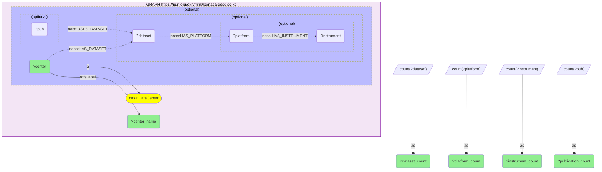

_189 row(s)_

#### Query 4 — DOI–dataset–platform dependency route

_2026-08-03T23:21:18+00:00 · `climatemodelskg`, `nasa-gesdisc-kg`_

```sparql
PREFIX cm: <https://climatepub4kg.github.io/ontology#>
PREFIX nasa: <https://purl.org/okn/frink/kg/nasa-gesdisc/schema/>
PREFIX bibo: <http://purl.org/ontology/bibo/>
PREFIX rdfs: <http://www.w3.org/2000/01/rdf-schema#>
SELECT ?instrument_name
       (COUNT(DISTINCT ?model) AS ?doi_models)
       (COUNT(DISTINCT ?cpaper) AS ?doi_climate_papers)
       (COUNT(DISTINCT ?dataset) AS ?doi_datasets)
       (COUNT(DISTINCT ?npub) AS ?doi_nasa_publications)
WHERE {
  GRAPH <https://purl.org/okn/frink/kg/climatemodelskg> {
    ?cpaper cm:doi ?d1 ; cm:PAPER_USES_MODEL ?model .
    BIND(LCASE(REPLACE(STR(?d1),"^https?://(dx[.])?doi[.]org/","")) AS ?bare)
  }
  GRAPH <https://purl.org/okn/frink/kg/nasa-gesdisc-kg> {
    ?npub bibo:doi ?d2 ; nasa:USES_DATASET ?dataset .
    BIND(LCASE(REPLACE(STR(?d2),"^https?://(dx[.])?doi[.]org/","")) AS ?bare)
    ?dataset nasa:HAS_PLATFORM ?platform .
    ?platform nasa:HAS_INSTRUMENT ?instrument .
    ?instrument rdfs:label ?instrument_name .
  }
}
GROUP BY ?instrument_name
```

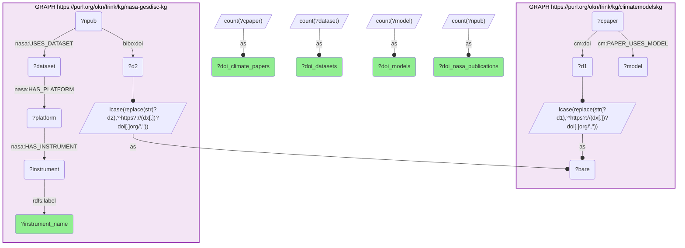

_70 row(s)_

#### Query 5 — Platform-type distribution

_2026-08-03T23:21:33+00:00 · `nasa-gesdisc-kg`_

```sparql
PREFIX nasa: <https://purl.org/okn/frink/kg/nasa-gesdisc/schema/>
PREFIX dct: <http://purl.org/dc/terms/>
SELECT (STR(?ptype) AS ?platform_type) (COUNT(DISTINCT ?platform) AS ?platforms)
       (COUNT(DISTINCT ?dataset) AS ?datasets)
       (COUNT(DISTINCT ?instrument) AS ?instruments)
WHERE {
  GRAPH <https://purl.org/okn/frink/kg/nasa-gesdisc-kg> {
    ?platform a nasa:Platform .
    OPTIONAL { ?platform dct:type ?ptype }
    OPTIONAL { ?dataset nasa:HAS_PLATFORM ?platform }
    OPTIONAL { ?platform nasa:HAS_INSTRUMENT ?instrument }
  }
}
GROUP BY ?ptype
```

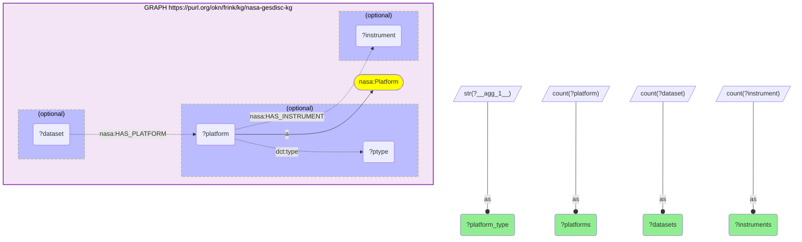

_32 row(s)_

#### Query 6 — Spaceborne instrument catalogue

_2026-08-03T23:21:48+00:00 · `nasa-gesdisc-kg`_

```sparql
PREFIX nasa: <https://purl.org/okn/frink/kg/nasa-gesdisc/schema/>
PREFIX rdfs: <http://www.w3.org/2000/01/rdf-schema#>
PREFIX dct: <http://purl.org/dc/terms/>
SELECT ?instrument ?instrument_name
       (COUNT(DISTINCT ?platform) AS ?space_platform_count)
       (COUNT(DISTINCT ?dataset) AS ?space_dataset_count)
       (COUNT(DISTINCT ?center) AS ?archive_count)
       (COUNT(DISTINCT ?pub) AS ?publication_count)
WHERE {
  GRAPH <https://purl.org/okn/frink/kg/nasa-gesdisc-kg> {
    ?instrument a nasa:Instrument ; rdfs:label ?instrument_name .
    ?platform nasa:HAS_INSTRUMENT ?instrument ; dct:type ?ptype .
    FILTER(STR(?ptype) IN (
      "Earth Observation Satellites",
      "Solar/Space Observation Satellites",
      "Navigation Satellites",
      "Space Stations/Crewed Spacecraft",
      "Space-based Platforms",
      "Spacecraft"
    ))
    OPTIONAL {
      ?dataset nasa:HAS_PLATFORM ?platform .
      OPTIONAL { ?center nasa:HAS_DATASET ?dataset }
      OPTIONAL { ?pub nasa:USES_DATASET ?dataset }
    }
  }
}
GROUP BY ?instrument ?instrument_name
```

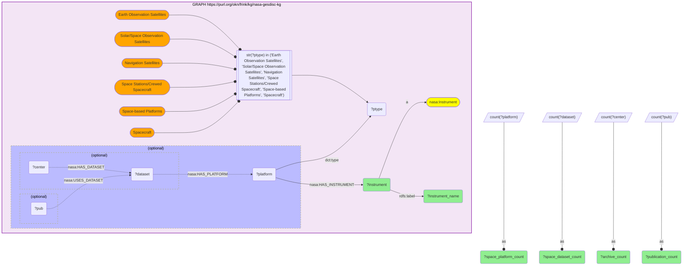

_288 row(s)_

#### Query 7 — Direct instrument-text dependency route

_2026-08-03T23:22:09+00:00 · `climatemodelskg`, `nasa-gesdisc-kg`_

```sparql
PREFIX cm: <https://climatepub4kg.github.io/ontology#>
PREFIX nasa: <https://purl.org/okn/frink/kg/nasa-gesdisc/schema/>
PREFIX rdfs: <http://www.w3.org/2000/01/rdf-schema#>
PREFIX dct: <http://purl.org/dc/terms/>
SELECT ?instrument_name
       (COUNT(DISTINCT ?model) AS ?text_models)
       (COUNT(DISTINCT ?paper) AS ?text_papers)
       (COUNT(DISTINCT ?cinst) AS ?text_mentions)
WHERE {
  GRAPH <https://purl.org/okn/frink/kg/climatemodelskg> {
    ?paper cm:PAPER_USES_MODEL ?model ; cm:PAPER_MENTIONS ?cinst .
    ?cinst a cm:Instrument ; cm:name ?cname .
    BIND(LCASE(STR(?cname)) AS ?k)
  }
  GRAPH <https://purl.org/okn/frink/kg/nasa-gesdisc-kg> {
    ?instrument a nasa:Instrument ; rdfs:label ?instrument_name .
    ?platform nasa:HAS_INSTRUMENT ?instrument ; dct:type ?ptype .
    FILTER(STR(?ptype) IN (
      "Earth Observation Satellites",
      "Solar/Space Observation Satellites",
      "Navigation Satellites",
      "Space Stations/Crewed Spacecraft",
      "Space-based Platforms",
      "Spacecraft"
    ))
    BIND(LCASE(STR(?instrument_name)) AS ?k)
  }
}
GROUP BY ?instrument_name
```

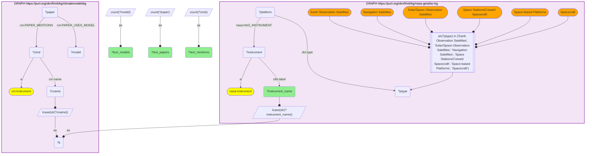

_50 row(s)_

#### Query 8 — Platform-text dependency route

_2026-08-03T23:22:25+00:00 · `climatemodelskg`, `nasa-gesdisc-kg`_

```sparql
PREFIX cm: <https://climatepub4kg.github.io/ontology#>
PREFIX nasa: <https://purl.org/okn/frink/kg/nasa-gesdisc/schema/>
PREFIX rdfs: <http://www.w3.org/2000/01/rdf-schema#>
PREFIX dct: <http://purl.org/dc/terms/>
SELECT ?instrument_name
       (COUNT(DISTINCT ?model) AS ?platform_text_models)
       (COUNT(DISTINCT ?paper) AS ?platform_text_papers)
       (COUNT(DISTINCT ?platform) AS ?mentioned_platforms)
WHERE {
  GRAPH <https://purl.org/okn/frink/kg/climatemodelskg> {
    ?paper cm:PAPER_USES_MODEL ?model ; cm:PAPER_MENTIONS ?cplatform .
    ?cplatform a cm:Platform ; cm:name ?cname .
    BIND(LCASE(STR(?cname)) AS ?k)
  }
  GRAPH <https://purl.org/okn/frink/kg/nasa-gesdisc-kg> {
    ?platform a nasa:Platform ; rdfs:label ?platform_name ; dct:type ?ptype ;
              nasa:HAS_INSTRUMENT ?instrument .
    ?instrument rdfs:label ?instrument_name .
    FILTER(STR(?ptype) IN (
      "Earth Observation Satellites",
      "Solar/Space Observation Satellites",
      "Navigation Satellites",
      "Space Stations/Crewed Spacecraft",
      "Space-based Platforms",
      "Spacecraft"
    ))
    BIND(LCASE(STR(?platform_name)) AS ?k)
  }
}
GROUP BY ?instrument_name
```

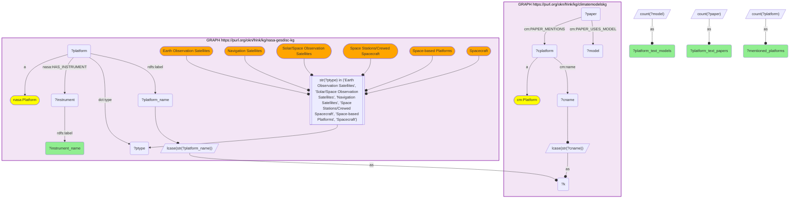

_108 row(s)_

#### Query 9 — Attempted direct structural observation–instrument route

_2026-08-03T23:22:38+00:00 · `climatemodelskg`, `nasa-gesdisc-kg`_

```sparql
PREFIX cm: <https://climatepub4kg.github.io/ontology#>
PREFIX nasa: <https://purl.org/okn/frink/kg/nasa-gesdisc/schema/>
PREFIX rdfs: <http://www.w3.org/2000/01/rdf-schema#>
PREFIX dct: <http://purl.org/dc/terms/>
SELECT ?instrument_name
       (COUNT(DISTINCT ?model) AS ?structural_models)
       (COUNT(DISTINCT ?obs) AS ?structural_observational_datasets)
WHERE {
  GRAPH <https://purl.org/okn/frink/kg/climatemodelskg> {
    ?model cm:MODEL_EXPERIMENTS_ON_OBSERVATIONAL_DATASET ?obs .
    ?obs cm:name ?obs_name .
    BIND(LCASE(STR(?obs_name)) AS ?k)
  }
  GRAPH <https://purl.org/okn/frink/kg/nasa-gesdisc-kg> {
    ?instrument a nasa:Instrument ; rdfs:label ?instrument_name .
    ?platform nasa:HAS_INSTRUMENT ?instrument ; dct:type ?ptype .
    FILTER(STR(?ptype) IN (
      "Earth Observation Satellites",
      "Solar/Space Observation Satellites",
      "Navigation Satellites",
      "Space Stations/Crewed Spacecraft",
      "Space-based Platforms",
      "Spacecraft"
    ))
    BIND(LCASE(STR(?instrument_name)) AS ?k)
  }
}
GROUP BY ?instrument_name
```

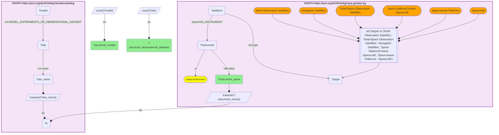

_1 row(s)_

#### Query 10 — Union of dependency routes

_2026-08-03T23:23:30+00:00 · `climatemodelskg`, `nasa-gesdisc-kg`_

```sparql
PREFIX cm: <https://climatepub4kg.github.io/ontology#>
PREFIX nasa: <https://purl.org/okn/frink/kg/nasa-gesdisc/schema/>
PREFIX bibo: <http://purl.org/ontology/bibo/>
PREFIX rdfs: <http://www.w3.org/2000/01/rdf-schema#>
PREFIX dct: <http://purl.org/dc/terms/>
SELECT ?instrument_name
       (COUNT(DISTINCT ?model) AS ?union_models)
       (COUNT(DISTINCT ?cpaper) AS ?union_climate_papers)
       (COUNT(DISTINCT ?route) AS ?route_count)
       (GROUP_CONCAT(DISTINCT ?route; separator=" | ") AS ?routes)
WHERE {
  {
    GRAPH <https://purl.org/okn/frink/kg/climatemodelskg> {
      ?cpaper cm:PAPER_USES_MODEL ?model ; cm:PAPER_MENTIONS ?cinst .
      ?cinst a cm:Instrument ; cm:name ?cname .
      BIND(LCASE(STR(?cname)) AS ?k)
    }
    GRAPH <https://purl.org/okn/frink/kg/nasa-gesdisc-kg> {
      ?instrument a nasa:Instrument ; rdfs:label ?instrument_name .
      ?platform nasa:HAS_INSTRUMENT ?instrument ; dct:type ?ptype .
      FILTER(STR(?ptype) IN ("Earth Observation Satellites","Solar/Space Observation Satellites","Navigation Satellites","Space Stations/Crewed Spacecraft","Space-based Platforms","Spacecraft"))
      BIND(LCASE(STR(?instrument_name)) AS ?k)
    }
    BIND("direct instrument text" AS ?route)
  }
  UNION
  {
    GRAPH <https://purl.org/okn/frink/kg/climatemodelskg> {
      ?cpaper cm:PAPER_USES_MODEL ?model ; cm:PAPER_MENTIONS ?cplatform .
      ?cplatform a cm:Platform ; cm:name ?cname .
      BIND(LCASE(STR(?cname)) AS ?k)
    }
    GRAPH <https://purl.org/okn/frink/kg/nasa-gesdisc-kg> {
      ?platform a nasa:Platform ; rdfs:label ?platform_name ; dct:type ?ptype ; nasa:HAS_INSTRUMENT ?instrument .
      ?instrument rdfs:label ?instrument_name .
      FILTER(STR(?ptype) IN ("Earth Observation Satellites","Solar/Space Observation Satellites","Navigation Satellites","Space Stations/Crewed Spacecraft","Space-based Platforms","Spacecraft"))
      BIND(LCASE(STR(?platform_name)) AS ?k)
    }
    BIND("platform text, then carried instrument" AS ?route)
  }
  UNION
  {
    GRAPH <https://purl.org/okn/frink/kg/climatemodelskg> {
      ?cpaper cm:doi ?d1 ; cm:PAPER_USES_MODEL ?model .
      BIND(LCASE(REPLACE(STR(?d1),"^https?://(dx[.])?doi[.]org/","")) AS ?bare)
    }
    GRAPH <https://purl.org/okn/frink/kg/nasa-gesdisc-kg> {
      ?npub bibo:doi ?d2 ; nasa:USES_DATASET ?dataset .
      BIND(LCASE(REPLACE(STR(?d2),"^https?://(dx[.])?doi[.]org/","")) AS ?bare)
      ?dataset nasa:HAS_PLATFORM ?platform .
      ?platform dct:type ?ptype ; nasa:HAS_INSTRUMENT ?instrument .
      ?instrument rdfs:label ?instrument_name .
      FILTER(STR(?ptype) IN ("Earth Observation Satellites","Solar/Space Observation Satellites","Navigation Satellites","Space Stations/Crewed Spacecraft","Space-based Platforms","Spacecraft"))
    }
    BIND("DOI-shared paper, dataset, platform, carried instrument" AS ?route)
  }
}
GROUP BY ?instrument_name
```

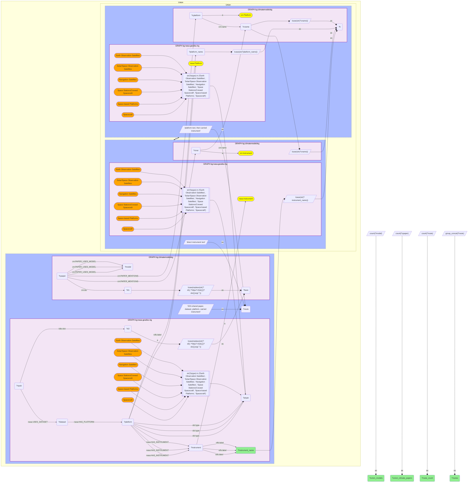

_138 row(s)_

#### Query 11 — Evaluation-context instrument route

_2026-08-03T23:23:47+00:00 · `climatemodelskg`, `nasa-gesdisc-kg`_

```sparql
PREFIX cm: <https://climatepub4kg.github.io/ontology#>
PREFIX nasa: <https://purl.org/okn/frink/kg/nasa-gesdisc/schema/>
PREFIX rdfs: <http://www.w3.org/2000/01/rdf-schema#>
PREFIX dct: <http://purl.org/dc/terms/>
SELECT ?instrument_name
       (COUNT(DISTINCT ?model) AS ?evaluation_models)
       (COUNT(DISTINCT ?paper) AS ?evaluation_papers)
       (COUNT(DISTINCT ?obs) AS ?observational_datasets)
WHERE {
  GRAPH <https://purl.org/okn/frink/kg/climatemodelskg> {
    ?paper cm:PAPER_USES_MODEL ?model ;
           cm:PAPER_EXPERIMENTS_ON_OBSERVATIONAL_DATASET ?obs ;
           cm:PAPER_MENTIONS ?cinst .
    ?cinst a cm:Instrument ; cm:name ?cname .
    BIND(LCASE(STR(?cname)) AS ?k)
  }
  GRAPH <https://purl.org/okn/frink/kg/nasa-gesdisc-kg> {
    ?instrument a nasa:Instrument ; rdfs:label ?instrument_name .
    ?platform nasa:HAS_INSTRUMENT ?instrument ; dct:type ?ptype .
    FILTER(STR(?ptype) IN ("Earth Observation Satellites","Solar/Space Observation Satellites","Navigation Satellites","Space Stations/Crewed Spacecraft","Space-based Platforms","Spacecraft"))
    BIND(LCASE(STR(?instrument_name)) AS ?k)
  }
}
GROUP BY ?instrument_name
```

```mermaid
graph TD
classDef projected fill:lightgreen;
classDef literal fill:orange;
classDef iri fill:yellow;
  q7v11("?cinst")
  q7v10("?cname")
  q7v3("?evaluation_models"):::projected 
  q7v2("?evaluation_papers"):::projected 
  q7v16("?instrument")
  q7v4("?instrument_name"):::projected 
  q7v9("?k")
  q7v14("?model")
  q7v13("?obs")
  q7v1("?observational_datasets"):::projected 
  q7v12("?paper")
  q7v17("?platform")
  q7v15("?ptype")
  subgraph q7graph0["GRAPH https://purl.org/okn/frink/kg/climatemodelskg"]
    style q7graph0 fill:#f3e5f5,stroke:#8e24aa,stroke-width:2px,color:#000;
    q7graph0c2(["cm:Instrument"]):::iri 
    q7v11 --"a"--> q7graph0c2
    q7v12 --"cm:PAPER_MENTIONS"--> q7v11
    q7v11 --"cm:name"--> q7v10
    q7v12 --"cm:PAPER_EXPERIMENTS_ON_OBSERVATIONAL_DATASET"--> q7v13
    q7v12 --"cm:PAPER_USES_MODEL"--> q7v14
    q7graph0bind0[/"lcase(str(?cname))"/]
    q7v10 --o q7graph0bind0
    q7graph0bind0 --as--o q7v9
  end
  subgraph q7graph1["GRAPH https://purl.org/okn/frink/kg/nasa-gesdisc-kg"]
    style q7graph1 fill:#f3e5f5,stroke:#8e24aa,stroke-width:2px,color:#000;
    q7graph1c1(["Earth Observation Satellites"]):::literal 
    q7graph1c3(["Navigation Satellites"]):::literal 
    q7graph1c2(["Solar/Space Observation Satellites"]):::literal 
    q7graph1c4(["Space Stations/Crewed Spacecraft"]):::literal 
    q7graph1c5(["Space-based Platforms"]):::literal 
    q7graph1c6(["Spacecraft"]):::literal 
    q7graph1c8(["nasa:Instrument"]):::iri 
    q7graph1f0[["str(?ptype) in ('Earth Observation Satellites', 'Solar/Space Observation Satellites', 'Navigation Satellites', 'Space Stations/Crewed Spacecraft', 'Space-based Platforms', 'Spacecraft')"]]
    q7graph1c1 --o q7graph1f0
    q7graph1c2 --o q7graph1f0
    q7graph1c3 --o q7graph1f0
    q7graph1c4 --o q7graph1f0
    q7graph1c5 --o q7graph1f0
    q7graph1c6 --o q7graph1f0
    q7graph1f0 --> q7v15
    q7v16 --"a"--> q7graph1c8
    q7v17 --"nasa:HAS_INSTRUMENT"--> q7v16
    q7v16 --"rdfs:label"--> q7v4
    q7v17 --"dct:type"--> q7v15
    q7graph1bind1[/"lcase(str(?instrument_name))"/]
    q7v4 --o q7graph1bind1
    q7graph1bind1 --as--o q7v9
  end
  q7bind2[/"count(?model)"/]
  q7bind2 --as--o q7v3
  q7bind3[/"count(?paper)"/]
  q7bind3 --as--o q7v2
  q7bind4[/"count(?obs)"/]
  q7bind4 --as--o q7v1
```

_44 row(s)_

#### Query 12 — Raw instrument–variable semantics

_2026-08-03T23:25:30+00:00 · `climatemodelskg`_

```sparql
PREFIX cm: <https://climatepub4kg.github.io/ontology#>
SELECT ?instrument_name ?variable ?variable_name ?variable_long_name WHERE {
  GRAPH <https://purl.org/okn/frink/kg/climatemodelskg> {
    ?instrument a cm:Instrument ; cm:name ?instrument_name ; cm:MEASURES_VARIABLE ?variable .
    OPTIONAL { ?variable cm:name ?variable_name }
    OPTIONAL { ?variable cm:variable_long_name ?variable_long_name }
  }
}
```

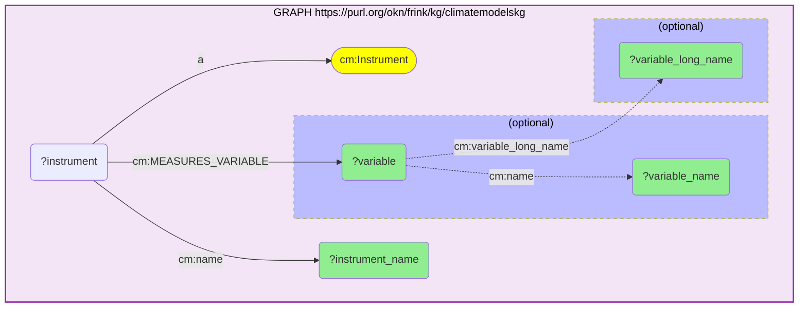

_699 row(s)_

#### Query 13 — Cross-community people on DOI-matched papers

_2026-08-03T23:26:43+00:00 · `climatemodelskg`, `nasa-gesdisc-kg`_

```sparql
PREFIX cm: <https://climatepub4kg.github.io/ontology#>
PREFIX nasa: <https://purl.org/okn/frink/kg/nasa-gesdisc/schema/>
PREFIX bibo: <http://purl.org/ontology/bibo/>
PREFIX rdfs: <http://www.w3.org/2000/01/rdf-schema#>
SELECT ?author_name ?orcid
       (COUNT(DISTINCT ?cpaper) AS ?shared_doi_papers)
       (COUNT(DISTINCT ?model) AS ?models)
       (COUNT(DISTINCT ?dataset) AS ?nasa_datasets)
WHERE {
  GRAPH <https://purl.org/okn/frink/kg/climatemodelskg> {
    ?cpaper cm:doi ?d1 ; cm:PAPER_AUTHORED_BY ?ca ; cm:PAPER_USES_MODEL ?model .
    ?ca cm:name ?cname .
    BIND(LCASE(REPLACE(STR(?d1),"^https?://(dx[.])?doi[.]org/","")) AS ?bare)
    BIND(LCASE(REPLACE(STR(?cname),"[.]$","")) AS ?aname)
  }
  GRAPH <https://purl.org/okn/frink/kg/nasa-gesdisc-kg> {
    ?npub bibo:doi ?d2 ; nasa:AUTHORED_BY ?na ; nasa:USES_DATASET ?dataset .
    ?na rdfs:label ?nname .
    OPTIONAL { ?na nasa:orcid ?orcid }
    BIND(LCASE(REPLACE(STR(?d2),"^https?://(dx[.])?doi[.]org/","")) AS ?bare)
    BIND(LCASE(REPLACE(STR(?nname),"[.]$","")) AS ?aname)
  }
  BIND(STR(?cname) AS ?author_name)
}
GROUP BY ?author_name ?orcid
```

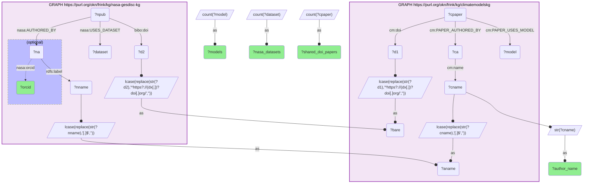

_155 row(s)_

#### Query 14 — Global name-overlap audit

_2026-08-03T23:27:01+00:00 · `climatemodelskg`, `nasa-gesdisc-kg`_

```sparql
PREFIX cm: <https://climatepub4kg.github.io/ontology#>
PREFIX nasa: <https://purl.org/okn/frink/kg/nasa-gesdisc/schema/>
PREFIX rdfs: <http://www.w3.org/2000/01/rdf-schema#>
SELECT ?metric ?n WHERE {
  {
    SELECT ("climate_distinct_author_names" AS ?metric) (COUNT(DISTINCT ?nm) AS ?n) WHERE {
      GRAPH <https://purl.org/okn/frink/kg/climatemodelskg> {
        ?a a cm:Author ; cm:name ?nm .
      }
    }
  }
  UNION
  {
    SELECT ("name_overlap_with_nasa_authors" AS ?metric) (COUNT(DISTINCT ?nm) AS ?n) WHERE {
      {
        SELECT DISTINCT ?nm WHERE {
          GRAPH <https://purl.org/okn/frink/kg/climatemodelskg> {
            ?a a cm:Author ; cm:name ?nm .
          }
        }
      }
      GRAPH <https://purl.org/okn/frink/kg/nasa-gesdisc-kg> {
        ?b a nasa:Author ; rdfs:label ?nm .
      }
    }
  }
  UNION
  {
    SELECT ("overlap_names_with_orcid" AS ?metric) (COUNT(DISTINCT ?nm) AS ?n) WHERE {
      {
        SELECT DISTINCT ?nm WHERE {
          GRAPH <https://purl.org/okn/frink/kg/climatemodelskg> {
            ?a a cm:Author ; cm:name ?nm .
          }
        }
      }
      GRAPH <https://purl.org/okn/frink/kg/nasa-gesdisc-kg> {
        ?b a nasa:Author ; rdfs:label ?nm ; nasa:orcid ?orcid .
      }
    }
  }
}
```

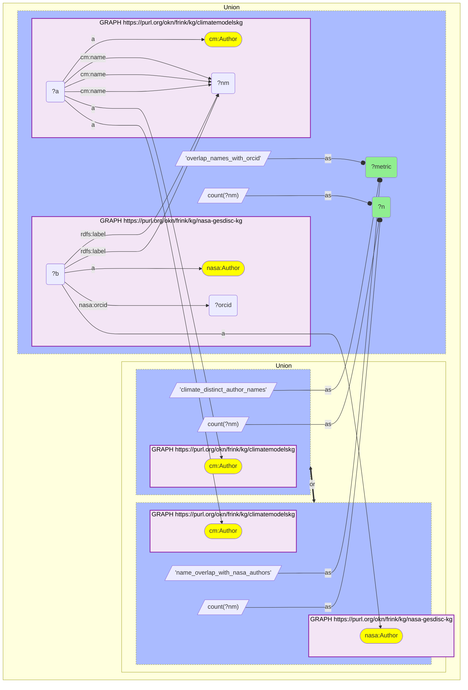

_3 row(s)_

#### Query 15 — City attention extract (flagged)

_2026-08-03T23:27:31+00:00 · `climatemodelskg`_

```sparql
PREFIX cm: <https://climatepub4kg.github.io/ontology#>
SELECT ?city ?city_name ?country_code ?latitude ?longitude
       (COUNT(DISTINCT ?paper) AS ?papers)
       (COUNT(DISTINCT ?model_paper) AS ?model_papers)
       (COUNT(DISTINCT ?instrument_paper) AS ?instrument_model_papers)
       (COUNT(DISTINCT ?model) AS ?models)
WHERE {
  GRAPH <https://purl.org/okn/frink/kg/climatemodelskg> {
    ?city a cm:City ; cm:name ?city_name ; cm:country_code ?country_code ;
          cm:latitude ?latitude ; cm:longitude ?longitude .
    ?paper cm:PAPER_MENTIONS ?city .
    OPTIONAL {
      ?paper cm:PAPER_USES_MODEL ?model .
      BIND(?paper AS ?model_paper)
      OPTIONAL {
        ?paper cm:PAPER_MENTIONS ?instrument .
        ?instrument a cm:Instrument .
        BIND(?paper AS ?instrument_paper)
      }
    }
  }
}
GROUP BY ?city ?city_name ?country_code ?latitude ?longitude
```

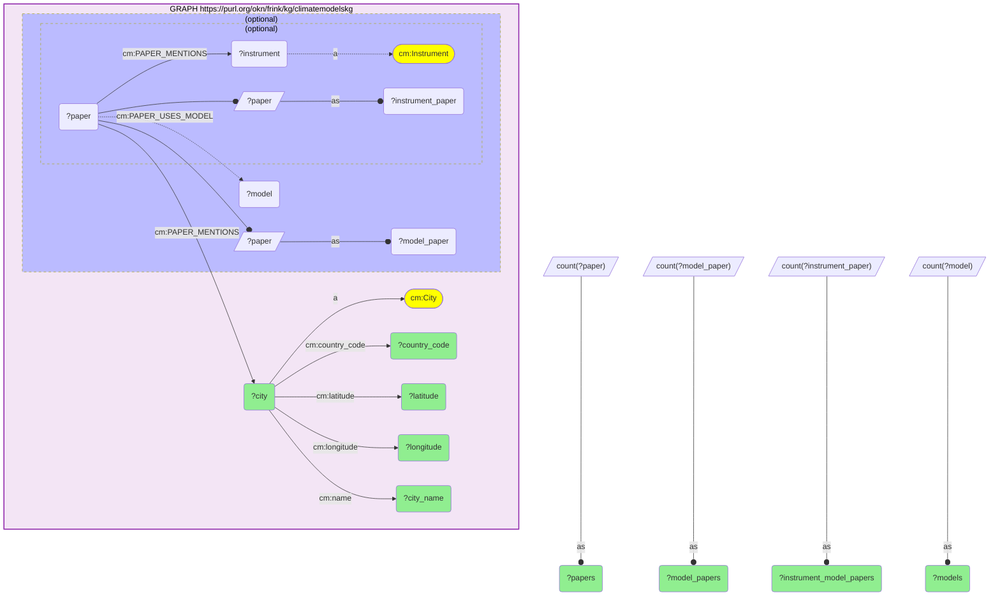

_2045 row(s)_

#### Query 16 — Country attention extract

_2026-08-03T23:27:57+00:00 · `climatemodelskg`_

```sparql
PREFIX cm: <https://climatepub4kg.github.io/ontology#>
SELECT ?country ?country_name ?iso ?north ?south ?east ?west
       (COUNT(DISTINCT ?paper) AS ?papers)
       (COUNT(DISTINCT ?model_paper) AS ?model_papers)
       (COUNT(DISTINCT ?instrument_paper) AS ?instrument_model_papers)
       (COUNT(DISTINCT ?model) AS ?models)
WHERE {
  GRAPH <https://purl.org/okn/frink/kg/climatemodelskg> {
    ?country a cm:Country ; cm:country ?country_name ; cm:iso ?iso ;
             cm:north ?north ; cm:south ?south ; cm:east ?east ; cm:west ?west .
    ?paper cm:PAPER_MENTIONS ?country .
    OPTIONAL {
      ?paper cm:PAPER_USES_MODEL ?model .
      BIND(?paper AS ?model_paper)
      OPTIONAL {
        ?paper cm:PAPER_MENTIONS ?instrument .
        ?instrument a cm:Instrument .
        BIND(?paper AS ?instrument_paper)
      }
    }
  }
}
GROUP BY ?country ?country_name ?iso ?north ?south ?east ?west
```

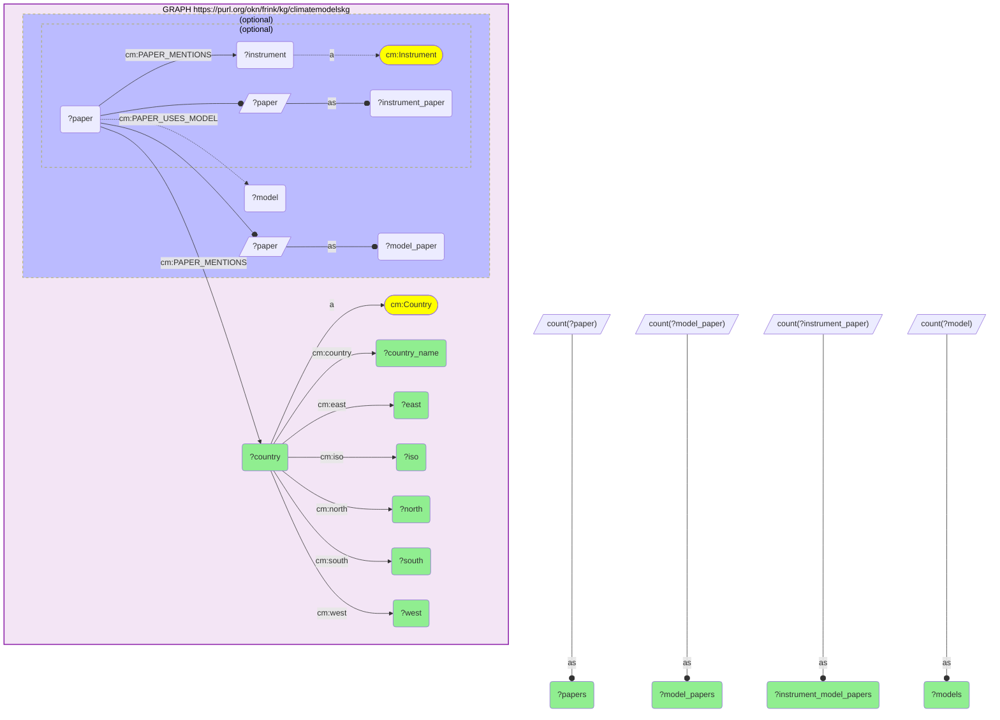

_215 row(s)_

#### Query 17 — Coverage and missing-field audit

_2026-08-03T23:28:40+00:00 · `nasa-gesdisc-kg`, `climatemodelskg`_

```sparql
PREFIX cm: <https://climatepub4kg.github.io/ontology#>
PREFIX nasa: <https://purl.org/okn/frink/kg/nasa-gesdisc/schema/>
PREFIX rdfs: <http://www.w3.org/2000/01/rdf-schema#>
PREFIX dct: <http://purl.org/dc/terms/>
PREFIX schema: <http://schema.org/>
SELECT ?metric ?n WHERE {
  {
    SELECT ("spaceborne_instruments" AS ?metric) (COUNT(DISTINCT ?instrument) AS ?n) WHERE {
      GRAPH <https://purl.org/okn/frink/kg/nasa-gesdisc-kg> {
        ?platform nasa:HAS_INSTRUMENT ?instrument ; dct:type ?ptype .
        FILTER(STR(?ptype) IN ("Earth Observation Satellites","Solar/Space Observation Satellites","Navigation Satellites","Space Stations/Crewed Spacecraft","Space-based Platforms","Spacecraft"))
      }
    }
  }
  UNION
  {
    SELECT ("spaceborne_instruments_name_matched_to_climate" AS ?metric) (COUNT(DISTINCT ?instrument) AS ?n) WHERE {
      GRAPH <https://purl.org/okn/frink/kg/nasa-gesdisc-kg> {
        ?platform nasa:HAS_INSTRUMENT ?instrument ; dct:type ?ptype .
        ?instrument rdfs:label ?nasa_name .
        FILTER(STR(?ptype) IN ("Earth Observation Satellites","Solar/Space Observation Satellites","Navigation Satellites","Space Stations/Crewed Spacecraft","Space-based Platforms","Spacecraft"))
        BIND(LCASE(STR(?nasa_name)) AS ?k)
      }
      GRAPH <https://purl.org/okn/frink/kg/climatemodelskg> {
        ?cinst a cm:Instrument ; cm:name ?climate_name .
        BIND(LCASE(STR(?climate_name)) AS ?k)
      }
    }
  }
  UNION
  {
    SELECT ("matched_spaceborne_instruments_with_variable_edges" AS ?metric) (COUNT(DISTINCT ?instrument) AS ?n) WHERE {
      GRAPH <https://purl.org/okn/frink/kg/nasa-gesdisc-kg> {
        ?platform nasa:HAS_INSTRUMENT ?instrument ; dct:type ?ptype .
        ?instrument rdfs:label ?nasa_name .
        FILTER(STR(?ptype) IN ("Earth Observation Satellites","Solar/Space Observation Satellites","Navigation Satellites","Space Stations/Crewed Spacecraft","Space-based Platforms","Spacecraft"))
        BIND(LCASE(STR(?nasa_name)) AS ?k)
      }
      GRAPH <https://purl.org/okn/frink/kg/climatemodelskg> {
        ?cinst a cm:Instrument ; cm:name ?climate_name ; cm:MEASURES_VARIABLE ?v .
        BIND(LCASE(STR(?climate_name)) AS ?k)
      }
    }
  }
  UNION
  {
    SELECT ("datasets_with_direct_instrument_edge" AS ?metric) (COUNT(DISTINCT ?dataset) AS ?n) WHERE {
      GRAPH <https://purl.org/okn/frink/kg/nasa-gesdisc-kg> {
        ?dataset a nasa:Dataset ; nasa:HAS_INSTRUMENT ?instrument .
      }
    }
  }
  UNION
  {
    SELECT ("platforms_with_start_date" AS ?metric) (COUNT(DISTINCT ?platform) AS ?n) WHERE {
      GRAPH <https://purl.org/okn/frink/kg/nasa-gesdisc-kg> {
        ?platform a nasa:Platform ; schema:startDate ?date .
      }
    }
  }
  UNION
  {
    SELECT ("platforms_with_end_date" AS ?metric) (COUNT(DISTINCT ?platform) AS ?n) WHERE {
      GRAPH <https://purl.org/okn/frink/kg/nasa-gesdisc-kg> {
        ?platform a nasa:Platform ; schema:endDate ?date .
      }
    }
  }
}
```

```mermaid
graph TD
classDef projected fill:lightgreen;
classDef literal fill:orange;
classDef iri fill:yellow;
  q17v10("?cinst")
  q17v9("?climate_name")
  q17v12("?dataset")
  q17v13("?date")
  q17v6("?instrument")
  q17v7("?k")
  q17v2("?metric"):::projected 
  q17v1("?n"):::projected 
  q17v8("?nasa_name")
  q17v5("?platform")
  q17v4("?ptype")
  q17v11("?v")
  subgraph q17union0[" Union "]
  style q17union0 color:#000;
  subgraph q17union0l[" "]
    style q17union0l fill:#abf,stroke-dasharray: 3 3;
    subgraph q17graph0["GRAPH kg:nasa-gesdisc-kg"]
      style q17graph0 fill:#f3e5f5,stroke:#8e24aa,stroke-width:2px,color:#000;
      q17graph0c2(["nasa:Platform"]):::iri 
      q17v5 --"a"--> q17graph0c2
      q17v5 --"schema:endDate"--> q17v13
    end
    q17bind0[/"'platforms_with_end_date'"/]
    q17bind0 --o|as| q17v2
    q17bind1[/"count(?platform)"/]
    q17bind1 --o|as| q17v1
  end
    subgraph q17union1[" Union "]
    style q17union1 color:#000;
    subgraph q17union1l[" "]
      style q17union1l fill:#abf,stroke-dasharray: 3 3;
      subgraph q17graph1["GRAPH kg:nasa-gesdisc-kg"]
        style q17graph1 fill:#f3e5f5,stroke:#8e24aa,stroke-width:2px,color:#000;
        q17graph1c2(["nasa:Platform"]):::iri 
        q17v5 --"a"--> q17graph1c2
        q17v5 --"schema:startDate"--> q17v13
      end
      q17bind2[/"'platforms_with_start_date'"/]
      q17bind2 --o|as| q17v2
      q17bind3[/"count(?platform)"/]
      q17bind3 --o|as| q17v1
    end
      subgraph q17union2[" Union "]
      style q17union2 color:#000;
      subgraph q17union2l[" "]
        style q17union2l fill:#abf,stroke-dasharray: 3 3;
        subgraph q17graph2["GRAPH kg:nasa-gesdisc-kg"]
          style q17graph2 fill:#f3e5f5,stroke:#8e24aa,stroke-width:2px,color:#000;
          q17graph2c2(["nasa:Dataset"]):::iri 
          q17v12 --"a"--> q17graph2c2
          q17v12 --"nasa:HAS_INSTRUMENT"--> q17v6
        end
        q17bind4[/"'datasets_with_direct_instrument_edge'"/]
        q17bind4 --o|as| q17v2
        q17bind5[/"count(?platform)"/]
        q17bind5 --o|as| q17v1
      end
        subgraph q17union3[" Union "]
        style q17union3 color:#000;
        subgraph q17union3l[" "]
          style q17union3l fill:#abf,stroke-dasharray: 3 3;
          subgraph q17graph3["GRAPH kg:nasa-gesdisc-kg"]
            style q17graph3 fill:#f3e5f5,stroke:#8e24aa,stroke-width:2px,color:#000;
            q17graph3c1(["Earth Observation Satellites"]):::literal 
            q17graph3c3(["Navigation Satellites"]):::literal 
            q17graph3c2(["Solar/Space Observation Satellites"]):::literal 
            q17graph3c4(["Space Stations/Crewed Spacecraft"]):::literal 
            q17graph3c5(["Space-based Platforms"]):::literal 
            q17graph3c6(["Spacecraft"]):::literal 
            q17graph3f0[["str(?ptype) in ('Earth Observation Satellites', 'Solar/Space Observation Satellites', 'Navigation Satellites', 'Space Stations/Crewed Spacecraft', 'Space-based Platforms', 'Spacecraft')"]]
            q17graph3c1 --o q17graph3f0
            q17graph3c2 --o q17graph3f0
            q17graph3c3 --o q17graph3f0
            q17graph3c4 --o q17graph3f0
            q17graph3c5 --o q17graph3f0
            q17graph3c6 --o q17graph3f0
            q17graph3f0 --> q17v4
            q17v5 --"nasa:HAS_INSTRUMENT"--> q17v6
            q17v6 --"rdfs:label"--> q17v8
            q17v5 --"dct:type"--> q17v4
            q17graph3bind6[/"lcase(str(?nasa_name))"/]
            q17v8 --o q17graph3bind6
            q17graph3bind6 --o|as| q17v7
          end
          subgraph q17graph4["GRAPH kg:climatemodelskg"]
            style q17graph4 fill:#f3e5f5,stroke:#8e24aa,stroke-width:2px,color:#000;
            q17graph4c2(["cm:Instrument"]):::iri 
            q17v10 --"a"--> q17graph4c2
            q17v10 --"cm:MEASURES_VARIABLE"--> q17v11
            q17v10 --"cm:name"--> q17v9
            q17graph4bind7[/"lcase(str(?climate_name))"/]
            q17v9 --o q17graph4bind7
            q17graph4bind7 --o|as| q17v7
          end
          q17bind8[/"'matched_spaceborne_instruments_with_variable_edges'"/]
          q17bind8 --o|as| q17v2
          q17bind9[/"count(?platform)"/]
          q17bind9 --o|as| q17v1
        end
          subgraph q17union4[" Union "]
          style q17union4 color:#000;
          subgraph q17union4l[" "]
            style q17union4l fill:#abf,stroke-dasharray: 3 3;
            subgraph q17graph5["GRAPH kg:nasa-gesdisc-kg"]
              style q17graph5 fill:#f3e5f5,stroke:#8e24aa,stroke-width:2px,color:#000;
              q17graph5c1(["Earth Observation Satellites"]):::literal 
              q17graph5c3(["Navigation Satellites"]):::literal 
              q17graph5c2(["Solar/Space Observation Satellites"]):::literal 
              q17graph5c4(["Space Stations/Crewed Spacecraft"]):::literal 
              q17graph5c5(["Space-based Platforms"]):::literal 
              q17graph5c6(["Spacecraft"]):::literal 
              q17graph5f1[["str(?ptype) in ('Earth Observation Satellites', 'Solar/Space Observation Satellites', 'Navigation Satellites', 'Space Stations/Crewed Spacecraft', 'Space-based Platforms', 'Spacecraft')"]]
              q17graph5c1 --o q17graph5f1
              q17graph5c2 --o q17graph5f1
              q17graph5c3 --o q17graph5f1
              q17graph5c4 --o q17graph5f1
              q17graph5c5 --o q17graph5f1
              q17graph5c6 --o q17graph5f1
              q17graph5f1 --> q17v4
              q17v5 --"nasa:HAS_INSTRUMENT"--> q17v6
              q17v6 --"rdfs:label"--> q17v8
              q17v5 --"dct:type"--> q17v4
              q17graph5bind10[/"lcase(str(?nasa_name))"/]
              q17v8 --o q17graph5bind10
              q17graph5bind10 --o|as| q17v7
            end
            subgraph q17graph6["GRAPH kg:climatemodelskg"]
              style q17graph6 fill:#f3e5f5,stroke:#8e24aa,stroke-width:2px,color:#000;
              q17graph6c2(["cm:Instrument"]):::iri 
              q17v10 --"a"--> q17graph6c2
              q17v10 --"cm:name"--> q17v9
              q17graph6bind11[/"lcase(str(?climate_name))"/]
              q17v9 --o q17graph6bind11
              q17graph6bind11 --o|as| q17v7
            end
            q17bind12[/"'spaceborne_instruments_name_matched_to_climate'"/]
            q17bind12 --o|as| q17v2
            q17bind13[/"count(?platform)"/]
            q17bind13 --o|as| q17v1
          end
          subgraph q17union4r[" "]
            style q17union4r fill:#abf,stroke-dasharray: 3 3;
            subgraph q17graph7["GRAPH kg:nasa-gesdisc-kg"]
              style q17graph7 fill:#f3e5f5,stroke:#8e24aa,stroke-width:2px,color:#000;
              q17graph7c1(["Earth Observation Satellites"]):::literal 
              q17graph7c3(["Navigation Satellites"]):::literal 
              q17graph7c2(["Solar/Space Observation Satellites"]):::literal 
              q17graph7c4(["Space Stations/Crewed Spacecraft"]):::literal 
              q17graph7c5(["Space-based Platforms"]):::literal 
              q17graph7c6(["Spacecraft"]):::literal 
              q17graph7f2[["str(?ptype) in ('Earth Observation Satellites', 'Solar/Space Observation Satellites', 'Navigation Satellites', 'Space Stations/Crewed Spacecraft', 'Space-based Platforms', 'Spacecraft')"]]
              q17graph7c1 --o q17graph7f2
              q17graph7c2 --o q17graph7f2
              q17graph7c3 --o q17graph7f2
              q17graph7c4 --o q17graph7f2
              q17graph7c5 --o q17graph7f2
              q17graph7c6 --o q17graph7f2
              q17graph7f2 --> q17v4
              q17v5 --"dct:type"--> q17v4
              q17v5 --"nasa:HAS_INSTRUMENT"--> q17v6
            end
            q17bind14[/"'spaceborne_instruments'"/]
            q17bind14 --o|as| q17v2
            q17bind15[/"count(?platform)"/]
            q17bind15 --o|as| q17v1
          end
          q17union4r <== or ==> q17union4l
          end
        end
      end
    end
  end
```

_6 row(s)_

#### Query 18 — Instrument–platform listing

_2026-08-03T23:28:53+00:00 · `nasa-gesdisc-kg`_

```sparql
PREFIX nasa: <https://purl.org/okn/frink/kg/nasa-gesdisc/schema/>
PREFIX rdfs: <http://www.w3.org/2000/01/rdf-schema#>
PREFIX dct: <http://purl.org/dc/terms/>
SELECT ?instrument_name ?platform_name ?platform_type WHERE {
  GRAPH <https://purl.org/okn/frink/kg/nasa-gesdisc-kg> {
    ?instrument a nasa:Instrument ; rdfs:label ?instrument_name .
    ?platform nasa:HAS_INSTRUMENT ?instrument ; rdfs:label ?platform_name ; dct:type ?platform_type .
    FILTER(STR(?platform_type) IN ("Earth Observation Satellites","Solar/Space Observation Satellites","Navigation Satellites","Space Stations/Crewed Spacecraft","Space-based Platforms","Spacecraft"))
  }
}
```

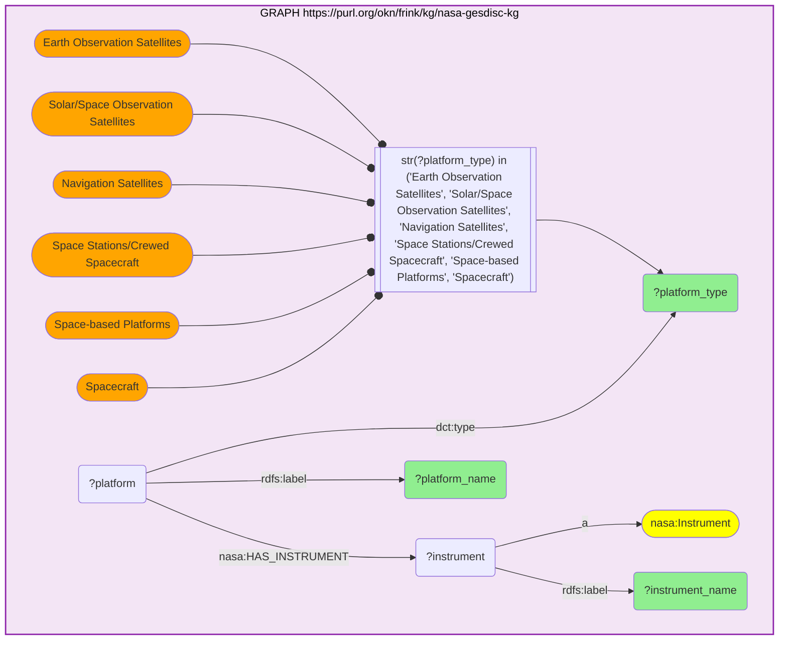

_704 row(s)_

