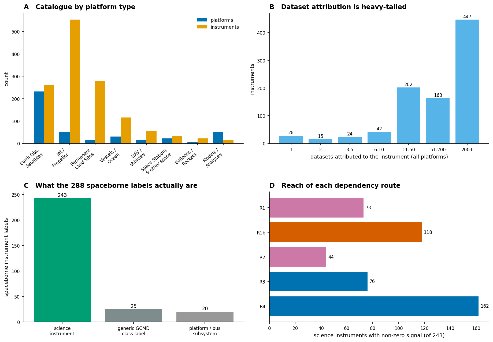
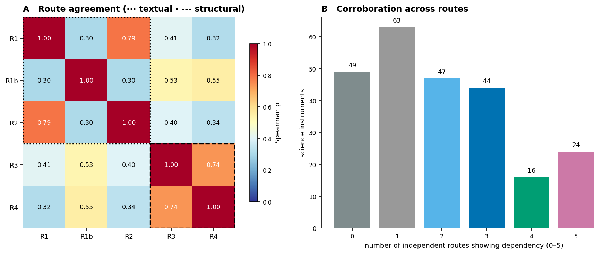
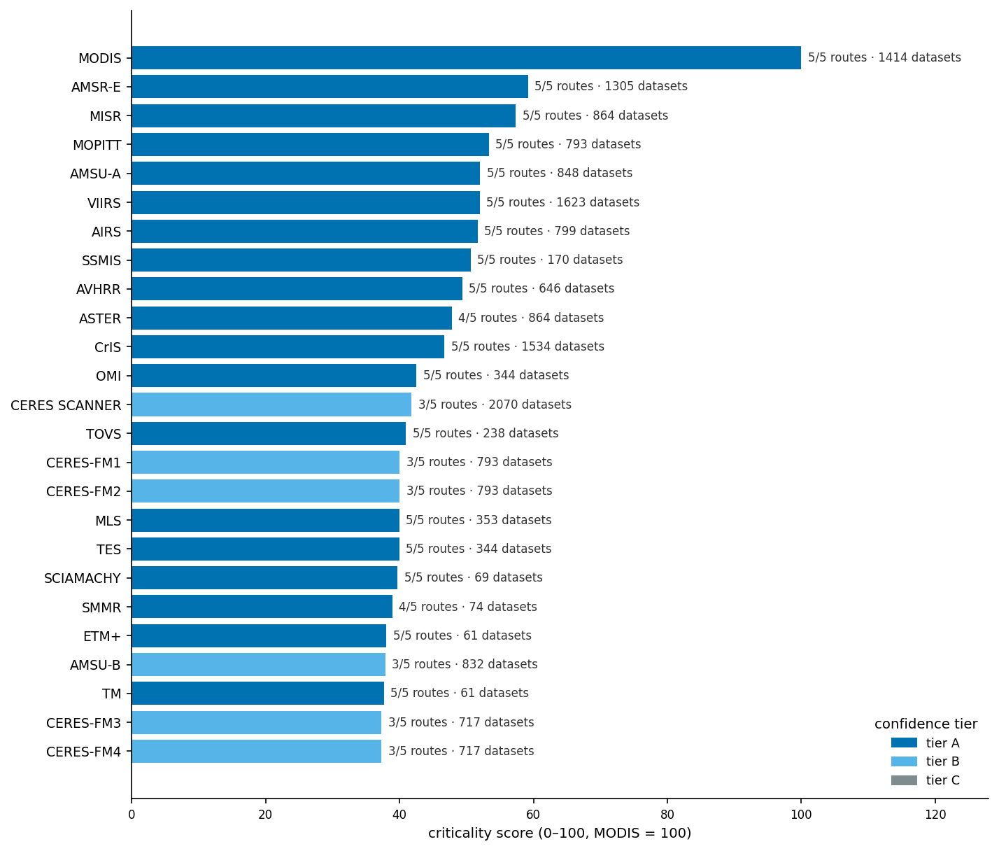
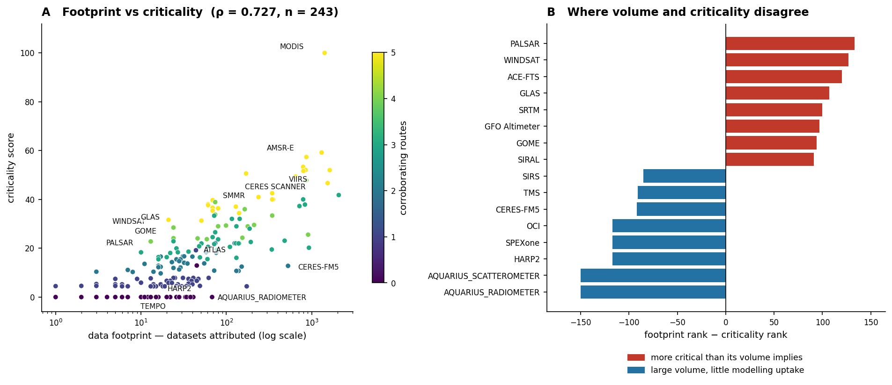
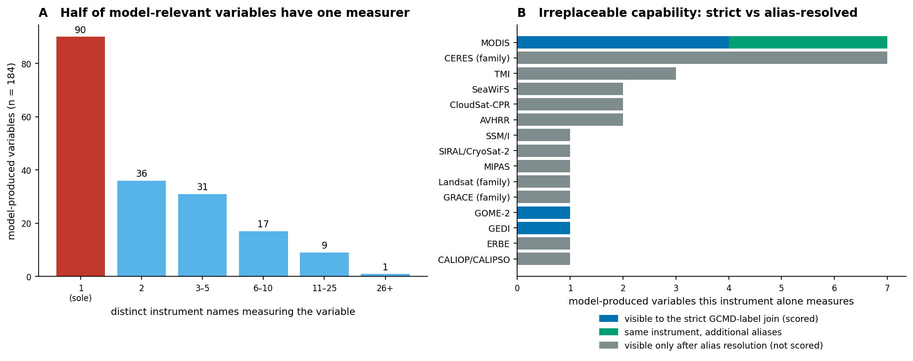
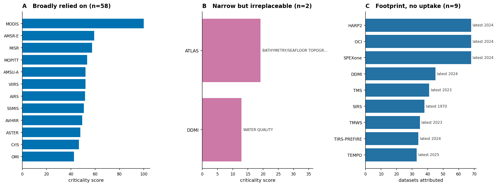
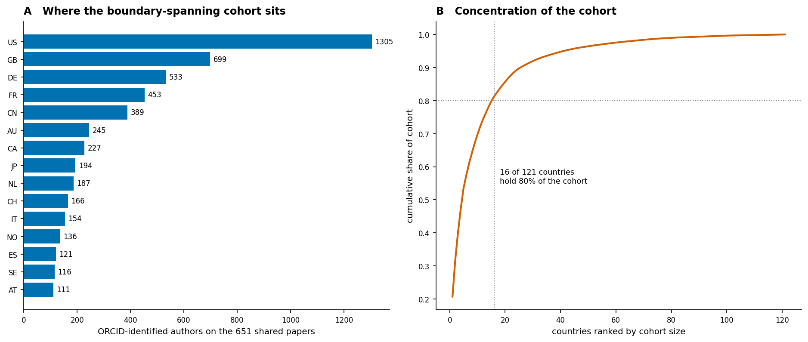
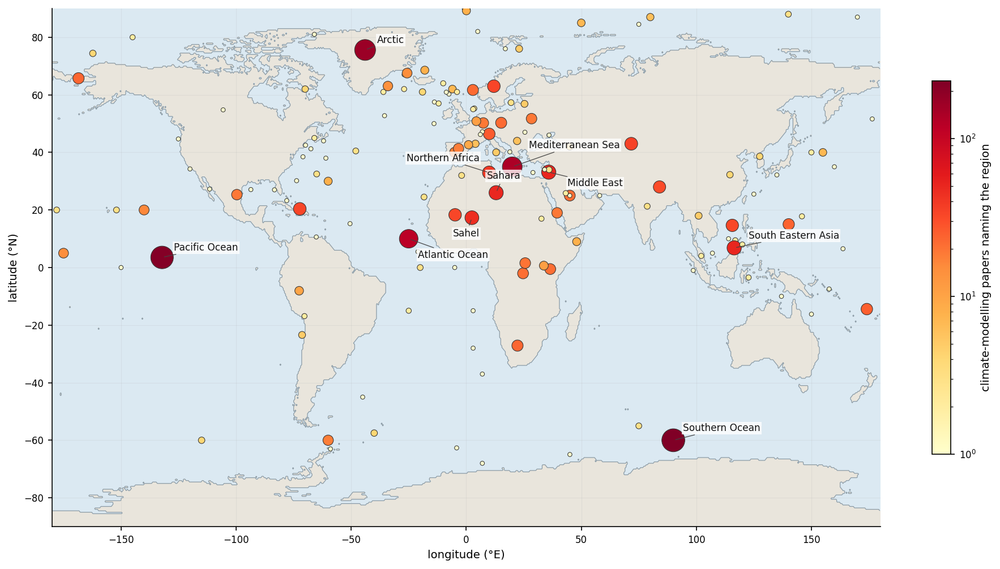

# Instrument-Criticality: what climate modelling would lose if an Earth-observation instrument went dark
### A five-route dependency analysis of spaceborne observing infrastructure across the OKN federation

**Date:** 2026-07-30 · **Endpoint:** OKN federated SPARQL · **Model:** claude-opus-5

> **Framing (non-negotiable).** The unit of analysis is a **GCMD instrument label carried by a
> spaceborne platform** in `nasa-gesdisc-kg` (288 labels on
> 254 platforms), scored against the climate-modelling literature in
> `climatemodelskg` (2,000 papers). Every number below is a **bibliometric or
> catalogue-structural association** — a measure of how visibly the published modelling record leans
> on an instrument, and of how the catalogue is wired. It is **not** a measurement of scientific
> irreplaceability, and **not** an engineering or programmatic risk assessment. A low score is
> evidence of low *observed* dependency in this evidence base, never evidence that an instrument does
> not matter — §8 Claims 3 and 7 show exactly that failure mode. Keep this caveat attached to every
> downstream claim.

**Abbreviations.** GCMD = Global Change Master Directory (NASA's controlled instrument/platform
vocabulary); DAAC = Distributed Active Archive Center; CMR = Common Metadata Repository; DOI =
Digital Object Identifier; ORCID = Open Researcher and Contributor ID; ROR = Research Organization
Registry; CMIP = Coupled Model Intercomparison Project; ECV = Essential Climate Variable; GCOS =
Global Climate Observing System; ERB = Earth Radiation Budget; TWSA = terrestrial water storage
anomaly; NLP = natural-language processing; KG = knowledge graph; DB = dependency breadth; IR =
irreplaceability; R1–R5 = the five dependency routes defined in §3; ρ = Spearman rank-correlation
coefficient; L2 = satellite Level-2 (retrieved geophysical) product.

---

## 1. Executive summary

The OKN federation describes Earth-observation infrastructure at real scale but not at the resolution
the retirement question demands. `nasa-gesdisc-kg` catalogues 921 instruments on
455 platforms across 8,058 datasets and 457,085
publications; restricting to spacecraft gives 254 platforms carrying
288 instrument labels and 4,931 datasets. Of those labels only
**243 are actual science instruments** — 25 are generic GCMD
class names (`RADIOMETERS`, `SAR`, `GPS`, `NOT APPLICABLE`) and 20 are spacecraft-bus
subsystems (star trackers, gyros, laser retroreflectors). Establishing that before ranking anything
matters, because the generic labels sit near the top of every raw volume count.

Dependency was established along **five independent routes** — two textual (an instrument or its
platform named in a climate-modelling paper), two structural (NASA's own record that a DOI-matched
modelling paper used that instrument's data; NASA-side publications with a modelling term in the
title citing its datasets), and one capability route (the instrument is the only measurer of a
variable that model components produce). The routes reach 73, 118,
44, 76 and 162 instruments respectively, and **they do not agree
with each other**: the two paper-level textual routes correlate at ρ = 0.79 and
the two structural routes at ρ = 0.74, but across the two families agreement
ranges only ρ = 0.32–0.55. Only 24 of
243 instruments show dependency on all five routes; 49 show it on
none. Route agreement, not the magnitude of any single route, is what carries weight here.

The ranking is led by **MODIS** (score 100.0/100, 5/5 routes,
29.5% of all instrument mentions in the matched corpus), followed by AMSR-E,
MISR, MOPITT, AMSU-A, VIIRS, AIRS, SSMIS, AVHRR and ASTER. Three risk classes were kept separate
rather than collapsed: **58 instruments broadly relied on**, **2
narrow-but-irreplaceable**, and **9 with a substantial data footprint and no modelling
uptake at all**.

**On the asymmetry — the finding matters, but not in the form it was posed.** At population level,
data footprint and criticality are *strongly* correlated (ρ =
0.727, n = 243, p < 1e-40; ρ =
0.656 using fractional attribution). The blanket claim that the
least survivable losses are not the largest archives is **not supported**. What *is* supported is
sharper and more useful: the correlation breaks down exactly where decisions get made. Only
6 of the top ten by criticality are also in the top ten by volume, and individual
rank gaps reach +133/−150 places. PALSAR (13 datasets) outranks 133
higher-volume instruments; ACE-FTS (10 datasets) outranks 120; CERES-FM5 (527 datasets) ranks 112th.
The 49 instruments with no dependency signal on any route hold only
2.7% of the spaceborne dataset attributions. Volume is a decent *prior* and
a bad *decision rule*.

---

## 2. Sources used

| KG | Version | Updated | Role in this study | Join key / confidence |
|---|---|---|---|---|
| `nasa-gesdisc-kg` | v0.0.6 | 2026-06-08 | The observing-infrastructure catalogue: instruments, platforms, datasets, projects, data centres, science keywords, and the 457,085-publication citation graph with author ORCID and institution ROR. Supplies routes R3 and R4 and every footprint measure. | GCMD instrument/platform `rdfs:label`; `bibo:doi` on publications — high confidence within the graph, but see §10 limitations 1–3 |
| `climatemodelskg` | v0.0.15 | 2026-05-06 | The climate-modelling literature graph: 2,000 papers, 394 model sources, 1,490 NLP-extracted instrument mentions, 3,144 variables, 2,521 observational datasets, and GeoNames-resolved study regions. Supplies routes R1, R1b, R2, R5, the community cohort and the geography. | `climatepub4kg:name` on Instrument/Platform nodes (case-normalised label match, 115 instruments / 70 platforms shared); `climatepub4kg:doi` (651 papers shared) — DOI is an identifier join and high confidence; the name joins are label matches and lower confidence |

Both joins are the federation's own precomputed, hand-verified crosswalks (EO1, EO2, PB1, PB2 in the
crosswalk catalogue) and both were re-established by logged query rather than taken on trust. No
other federation graph was queried, and none is credited.

---

## 3. Design & rules

**What counts as observing infrastructure.** `nasa-gesdisc-kg` types every platform, so "flying on
spacecraft" is a filter, not a judgement: platforms typed *Earth Observation Satellites*, *Space
Stations/Crewed Spacecraft*, *Solar/Space Observation Satellites*, *Navigation Satellites*,
*Spacecraft* or *Space-based Platforms*. That yields 254 platforms,
288 distinct instrument labels and 4,931 datasets. Everything
airborne, shipborne, balloon-borne or ground-based — the great majority of the catalogue's
921 instruments — is out of scope and reported as such in Figure 1A.

**What the labels actually are.** The 288 labels were classified by hand into
243 science instruments, 25 generic GCMD class names and
20 platform/bus subsystems. Only the science instruments are scored. This is not
tidying: `NOT APPLICABLE` alone carries 1,855 attributed datasets and would otherwise rank second in
the catalogue by volume.

**How a dataset is attributed to an instrument.** It is not, directly. `nasa-gesdisc-kg` has **no
Dataset→Instrument edge**: datasets attach to platforms (`HAS_PLATFORM`) and platforms carry
instruments (`HAS_INSTRUMENT`), so every instrument on a platform inherits all of that platform's
datasets. Terra's 793 datasets are credited identically to MODIS, MISR, MOPITT, ASTER and CERES-FM1.
Both a raw count and a **fractional** count (a platform's datasets divided evenly among its
instruments) are carried through the analysis, and the asymmetry test is run on both.

**The five dependency routes**, each with an explicit meaning and an explicit evidence type:

| Route | Dependency means | Evidence |
|---|---|---|
| **R1** | A climate-modelling paper names the instrument | **Textual** — NLP-extracted from paper text |
| **R1b** | A climate-modelling paper names the instrument's platform | **Textual**, coarser than R1 |
| **R2** | A paper names the instrument *and* uses a named climate model | **Textual × structural** |
| **R3** | A DOI-matched climate-modelling paper is recorded by NASA as using a dataset from that instrument | **Structural** — NASA's own usage record |
| **R4** | A NASA publication with a modelling term in its title cites a dataset from that instrument | **Structural** dataset link, **textual** title filter; independent of `climatemodelskg` entirely |

A sixth axis, **R5 (capability)**, is not a dependency count but a substitutability measure: a
variable that is both measured by an instrument and produced by a model component is *sole-measured*
when exactly one distinct instrument name in the corpus measures it.

**Scoring.** Dependency breadth (DB) is the unweighted mean of the five log-normalised route scores;
irreplaceability (IR) is the log-normalised count of sole-measured variables plus sole-source GCMD
keywords; corroboration is the count of non-zero routes. Criticality = 100 × (0.55·DB + 0.30·IR +
0.15·(corroboration/5)), rescaled to a 100-point maximum. The weights are a stated judgement, not a
fitted quantity — no ground truth exists to fit them against. Full replicator specification in
[Instrument-Criticality_reproducibility.md](Instrument-Criticality_reproducibility.md).

**Inventory, rebuilt live.**

| Quantity | `nasa-gesdisc-kg` | `climatemodelskg` |
|---|---|---|
| Instruments | 921 (288 spaceborne) | 1,490 (NLP-extracted mentions) |
| Platforms | 455 (254 spaceborne) | 584 |
| Datasets | 8,058 (4,931 spaceborne) | 2,521 observational datasets |
| Publications | 457,085 | 2,000 (1,910 with DOI) |
| Models | — | 394 sources |
| Authors / institutions | 905,086 / 35,435 | 10,437 author nodes (10,029 distinct names) |
| Projects / data centres | 415 / 189 | — |
| Science keywords / variables | 1,609 (122 in use) | 3,144 variables |

> ***Figure 1. What the federation's observing catalogue contains (nasa-gesdisc-kg).*** **(A)**
> Platforms and instruments by GCMD platform type — Earth-observation satellites are only a third of
> the instrument inventory; aircraft and permanent land sites carry more instrument labels than
> spacecraft do. **(B)** Distribution of datasets attributed to each instrument across all
> 921 instruments, showing the heavy tail produced by platform-mediated
> attribution. **(C)** Classification of the 288 spaceborne labels into science
> instruments, generic GCMD class names, and platform/bus subsystems. **(D)** How many of the
> 243 scored science instruments each dependency route reaches. Provenance:
> `nasa-gesdisc-kg` `dc:type` on Platform, `HAS_INSTRUMENT`, `HAS_PLATFORM`; route counts from
> `data/instrument_criticality.csv`.

Panel B is the reason the attribution rule had to be stated before any ranking: 447 instruments
appear to hold 200+ datasets each, but that is co-flight inheritance, not instrument-specific
volume. Panel D shows the routes are not interchangeable in reach — R4 sees 162
instruments, R2 only 44 — which is the first sign that no single route can carry the
ranking.

---

## 4. Confidence tiers

| Tier | Requirement | n |
|---|---|---|
| **A** | Dependency corroborated by **≥ 4 of 5 independent routes** *and* criticality ≥ 30 | 29 |
| **B** | Dependency corroborated by **≥ 2 routes** | 102 |
| **C** | **≤ 1 route** — a single, uncorroborated signal, or none | 112 |

Tier is deliberately a function of *corroboration*, not of score magnitude, so that a high score
resting on one route cannot be mistaken for a robust one. The distribution is bottom-heavy —
112 of 243 instruments sit in tier C, and 48 score
zero outright. Median criticality across the scored set is 10.7.

---

## 5. Findings by axis

### 5.1 Independent routes agree only within their evidence family

The five routes were built to be independent in construction, and they turn out to be substantially
independent in result. The two paper-level textual routes (an instrument named in a paper; the same
restricted to papers that also use a model) correlate at ρ = 0.79. The two
structural routes (DOI-matched NASA usage records; NASA-side modelling-title publications) correlate
at ρ = 0.74. Across families, agreement spans only ρ =
0.32–0.55.

> ***Figure 2. Agreement between the five dependency routes (nasa-gesdisc-kg × climatemodelskg).***
> **(A)** Spearman rank correlation between routes across the 243 scored
> instruments; the dotted box marks the textual family (R1, R1b, R2), the dashed box the structural
> family (R3, R4). **(B)** How many independent routes show a non-zero signal per instrument.
> Provenance: routes as defined in §3; R1/R1b/R2/R5 from `climatemodelskg` `PAPER_MENTIONS` /
> `PAPER_USES_MODEL` / `MEASURES_VARIABLE`, R3 from the DOI bridge, R4 from `nasa-gesdisc-kg`
> `USES_DATASET` + `schema:title`.

This is the methodological result of the study. Two routes that both claim to measure "climate
modelling depends on this instrument" rank the catalogue differently enough that picking one would
produce a materially different priority list. Only 24 instruments are visible on all
five; 49 are visible on none and 63 on exactly one, so 112 of 243 — 46% of the catalogue — rest on
evidence too thin to act on.

The matrix also refuses the tidy story its own panel boxes suggest. **R1b — a textual route — sits
closer to the structural family (ρ = 0.53 with R3, 0.55 with R4)
than to its textual siblings (ρ = 0.3 with R1).** Naming a *platform* behaves more
like citing a dataset than like naming an instrument, which is what one would expect if authors reach
for the mission name ("Aqua", "Terra") when describing data provenance and for the instrument name
when describing a retrieval. The families are a useful device for reading the figure, not a property
of the data, and the honest summary is that all five routes are only loosely concordant.

### 5.2 The ranking, and what it rests on

> ***Figure 3. Top 25 spaceborne instruments by criticality score (nasa-gesdisc-kg ×
> climatemodelskg).*** Bars coloured by confidence tier (§4); annotations give the number of
> corroborating routes and the raw attributed dataset count. Score = 100 × (0.55·DB + 0.30·IR +
> 0.15·(corroboration/5)), rescaled so the maximum is 100. Provenance: `data/instrument_criticality.csv`;
> full table in `Instrument-Criticality_results.xlsx`, sheet *Ranked Results*.

The head of the ranking is dominated by broad-swath imagers and sounders with long records —
MODIS, AMSR-E, MISR, MOPITT, AMSU-A, VIIRS, AIRS, AVHRR, CrIS — which is unsurprising and
is partly a reassurance that the score is measuring something real. The informative entries are the
ones that do not fit that pattern: **SSMIS at 8th on 170 datasets, GOME-2 at 35th on 72, WINDSAT at
38th on 21**. Those are instruments whose standing comes from corroboration rather than from volume,
and §8 Claim 2 confirms the passive-microwave cluster independently.

### 5.3 The asymmetry: strong at population level, broken at the top

> ***Figure 4. Data footprint against criticality (nasa-gesdisc-kg × climatemodelskg).*** **(A)**
> Each of the 243 scored science instruments, x = attributed datasets (log
> scale), y = criticality score, colour = number of corroborating routes; Spearman ρ =
> 0.727 (p < 1e-40). **(B)** The 16 largest rank divergences:
> footprint rank minus criticality rank, red where an instrument is more critical than its volume
> implies, blue where volume outruns modelling uptake. Provenance: `data/instrument_criticality.csv`.

The population-level correlation is high and the fractional-attribution version is barely lower
(ρ = 0.656), so the correlation is not an artefact of
co-flight inheritance. Total publication count correlates even more strongly (ρ =
0.863), which is close to tautological and is reported for that reason.
The instinct that big archives and critical instruments are different populations is, at this scale,
wrong.

What survives, and matters more for a review board, is the local breakdown. Only
6 of the top ten and 19 of the top 25 are shared between the two
rankings. **PALSAR (+133 places), WINDSAT (+127), ACE-FTS (+120), GLAS (+107), SRTM
(+100), GFO Altimeter (+97) and GOME (+94)** are far more depended-upon than their volume suggests;
**AQUARIUS_RADIOMETER and AQUARIUS_SCATTEROMETER (-150), the three PACE instruments
(−117) and CERES-FM5 (−92)** run the other way. A decision rule based on archive size would protect
the wrong half of that list.

### 5.4 Substitutability is concentrated — and mostly invisible to the join

`climatemodelskg` carries 3,144 Variable nodes resolving to 237 distinct measured variable names and
2,947 model-produced ones; 184 variable names are both measured by an instrument and produced by a
model component. **90 of those
(48.9%) are measured by exactly one distinct instrument name** in the extracted
literature.

> ***Figure 5. Measurement substitutability (climatemodelskg).*** **(A)** Distribution of the number
> of distinct instrument *names* measuring each of the 184 variables that
> are both measured and model-produced; the red bar marks sole-measured variables. **(B)** The
> instruments holding those sole-measured variables, split by whether the strict GCMD-label join can
> see them: blue = counted in the score, green = the same instrument's additional aliases, grey =
> visible only after alias resolution and **not** scored. Provenance: `climatemodelskg`
> `Instrument -MEASURES_VARIABLE-> Variable <-PRODUCES_VARIABLE- SourceComponent`, grouped by
> variable *name*; alias map declared in `scripts/analyse_criticality.py` and exported to
> `data/sole_measured_variables_resolved.csv`. **Textual in origin** — both edges are NLP-extracted
> from paper text.

Three results sit in this panel, and the second and third matter more than the first.

**First, the shape is extreme but the counts are small.** Under the strict GCMD-label join that feeds
the score, only **3 instruments** hold any sole-measured variable at all
— MODIS (4: `albsn`, `nppLut`, `tsSprd`, `vegFrac`), GOME-2 (1: `total_solar_irradiance`) and GEDI
(1: `TOTVEGC_ABG`) — 6 variables in total. That is the whole
irreplaceability signal the analysis is entitled to score.

**Second, alias fragmentation hides most of it.** Resolving the free-text mention names to instrument
families lifts the count to **32 variables across
15 families** — and the joint largest is **CERES, with 7 sole-measured
variables and a strict-join score of zero**, because papers write "CERES" or "clouds and earth's
radiant energy system" while the catalogue writes `CERES-FM1`…`CERES SCANNER`. MODIS gains three more
under its spelled-out name. TMI gains 3, SeaWiFS and AVHRR and CloudSat-CPR 2 each. The alias map is
a declared, hand-built supplement and deliberately does **not** feed the score; its purpose is to
quantify how much the strict join misses, which is roughly a factor of five.

**Third — and this is the most consequential number in the section — most irreplaceable measurement
in this corpus is invisible to a spaceborne, GCMD-labelled analysis.** 58 of the 90 sole-measured
variables (64%) resolve to no scored instrument. The large majority of those are genuinely non-satellite:
automatic weather stations, Argo floats, eddy-covariance towers, radiosondes, ceilometers, Winkler
titration, the Mauna Loa in-situ record. A minority are spaceborne but still unscorable — generic
category names (`satellite instruments`, `passive microwave satellite sensors`, `satellite altimeter`),
the two generic GCMD class labels excluded in §3 (`SAR` → `ws60m`, `SCATTEROMETERS` → `WIND`),
merged products rather than instruments (ISCCP, HadCRUT5, COBE-SST2), a simulator (`modis simulator`),
and two airborne surveys. Either way the conclusion holds: any inference about "irreplaceable
observing infrastructure" that stops at named spaceborne instruments is missing most of the
sole-source measurements the modelling literature actually depends on.

The attempt to measure substitutability *structurally* rather than textually failed, and the failure
is itself a finding. GCMD science keywords should support it: they are a controlled vocabulary
describing what a dataset measures. But only 122 of
1,609 keywords — 7.6% of the vocabulary — are attached to any dataset at all, and
at that granularity only five keywords have five or fewer spaceborne instruments, three of them
with exactly one (`BATHYMETRY/SEAFLOOR TOPOGRAPHY` → ATLAS; `TERRESTRIAL ECOSYSTEMS` → the generic
`SAR` class; `WATER QUALITY` → DDMI). A vocabulary that coarse cannot distinguish substitutable from
irreplaceable, so the structural substitutability test is reported as **run and uninformative**, not
omitted.

---

## 6. Domain analyses

### 6.1 Three kinds of risk, kept apart

Collapsing these into one ranking is exactly the error the analysis is meant to avoid, so they are
defined separately and allowed to overlap.

> ***Figure 6. Three risk classes (nasa-gesdisc-kg × climatemodelskg).*** **(A)** Class A — broadly
> relied on: dependency breadth ≥ 75th percentile and ≥ 3 corroborating routes (58
> instruments, top 12 shown). **(B)** Class B — narrow but irreplaceable: sole measurer of ≥ 1
> model-produced variable or sole spaceborne source of a GCMD keyword, with criticality below the
> 75th percentile (2); annotations name the irreplaceable measurement. **(C)** Class C —
> large footprint, no modelling uptake: attributed datasets ≥ the catalogue median
> (33.0) and zero signal on all five dependency routes (9); annotations give the
> **latest** dataset start year, which for DDMI (first light 2017) and SIRS (1964) is much later than
> first light. Provenance: `data/risk_classes.json`.

**Class A (58 instruments)** is the conventional answer and the least interesting: MODIS,
AMSR-E, MISR, MOPITT, AMSU-A, VIIRS, AIRS, SSMIS, AVHRR, ASTER, CrIS, OMI, CERES SCANNER, TOVS,
CERES-FM1/FM2, MLS, TES, SCIAMACHY, SMMR and 38 others. These are protected by their own visibility —
a review board is unlikely to retire MODIS unaware that modelling depends on it.

**Class B is the class the question was really about, and it has 2 members.** Only
**ATLAS** (the only spaceborne source of bathymetry/seafloor topography in the catalogue) and
**DDMI** (the only source of the water-quality keyword) satisfy "irreplaceable but not broadly
relied on". GEDI and GOME-2, the other two strict sole-measurers, score highly enough on the
dependency routes to fall outside the class. Two instruments is not a credible estimate of how much
narrow-but-irreplaceable infrastructure exists; it is a measure of how little of that structure the
federation encodes. §5.4 gives the reason — the class is thin because substitutability is almost
entirely unrepresented, not because the risk is rare, and the alias-resolved supplement suggests the
true figure is several times larger.

**Class C (9 instruments)** — HARP2, OCI, SPEXone, TIRS-PREFIRE, TEMPO, TMS, TMWS, DDMI and
SIRS — reads at first as pure waste: substantial archives nobody models with. It is not. Eight of the nine
have their most recent dataset start in 2021–2025, and PACE's three instruments (OCI, HARP2, SPEXone)
only reached stable calibration in 2024–25 (§8 Claim 6). Class C is dominated by **publication
latency**, and for seven members the correct interpretation is "not yet evaluated". Two are different
cases, and the distinction turns on *first*-light rather than latest dataset start: **SIRS**, a 1960s
Nimbus instrument, is the member for which "no modelling uptake" is a settled fact; and **DDMI**
(CYGNSS), whose data reach back to 2017 and whose datasets carry 120 publications overall, is a
genuine uptake gap rather than a latency artefact — it is also the one instrument that satisfies both
class B and class C.

### 6.2 The boundary-spanning community, and where the literature looks

**Who.** The people who work across both sides are themselves infrastructure, and the federation lets
that be counted without relying on name matching. The 651 papers that appear in
*both* graphs by DOI (34.1% of `climatemodelskg`'s DOI-bearing papers) carry
**4,397 distinct author names, 3,169 of them resolving to
a distinct ORCID**. That is the identifier-anchored boundary-spanning cohort, and it is the more
defensible of the two available measures. The cohort's size *is* the finding: a few thousand people,
spread across 121 countries, connect the world's climate models to the
observations they are checked against.

The weaker measure is the name join: 8,391 of `climatemodelskg`'s
10,029 distinct author names (83.7%) also appear as a
`nasa-gesdisc-kg` author label. That figure must not be read as overlap — NASA's author pool is
905,086 nodes, large enough that common names collide by chance, and the federation's own
crosswalk documentation records that 11.3% of matched names resolve to more than one ORCID. It is
reported only to show that the DOI-anchored number is the conservative one.

> ***Figure 7. The boundary-spanning cohort (nasa-gesdisc-kg × climatemodelskg, DOI bridge).***
> **(A)** ORCID-identified authors on the 651 shared papers, by institution
> country (top 15 of 121). **(B)** Cumulative share of the cohort by country
> rank. Counts are **author–country records**, not distinct people: an author affiliated with
> institutions in two countries is counted in both, so the records sum to 6,310 against
> 3,169 distinct ORCIDs. Provenance: `climatepub4kg:doi` ↔ `bibo:doi`, then
> `AUTHORED_BY` → `orcid` and `AFFILIATED_WITH` → Institution `country`.

The cohort is heavily concentrated: the top five countries (US, GB, DE, FR, CN) hold
53.5% of those author–country records, and 16 of 121
countries hold 80%. Whatever resilience this community provides is not evenly distributed, and a
funding change in one or two countries would move a large fraction of it.

**Where.** The same corpus resolves study locations to GeoNames, giving 159 named
regions with coordinates and 215 countries.

> ***Figure 8. Where the climate-modelling literature studies (climatemodelskg).*** Marker position is
> the GeoNames coordinate of each region named by a paper; marker size and colour encode the number of
> papers (log scale). Basemap is a bundled 0.5° land/ocean mask — the OpenStreetMap tile service was
> unreachable from the analysis sandbox, and an interactive OSM-tiled version of the same points is
> written to `data/study_regions_map.html`. Provenance: `climatemodelskg`
> `Paper -PAPER_MENTIONS-> No_Country_Region`, with `latitude` / `longitude` / `asciiname`.

Research attention is oceanic and polar before it is territorial: **Southern Ocean
(231 papers)**, Pacific Ocean (219), Arctic (170), Mediterranean Sea (141) and
Atlantic Ocean (117) lead, with the Sahel (45), Sahara (49), Middle East (50) and South Eastern Asia
(50) forming a second tier. At country level China leads with
540 papers and the top ten countries account for 37.6% of all
country mentions.

The thin-evidence finding is the important half. **92 of 215 countries are
named by ten or fewer papers in the entire corpus** — including most of Central and West Africa, the
Pacific island states, and much of Central America and the Caribbean. These are places where climate
projections carry high decision stakes and where the modelling literature that would justify any
particular observing system is close to absent. Note the confound: a `PAPER_MENTIONS Country` edge
records a *mention*, not a study focus, so these counts are an upper bound on attention, which makes
the sparse tail worse rather than better.

**Analysis families run and skipped.** *Run:* all five dependency routes (R1, R1b, R2, R3, R4); the
capability/substitutability axis (R5) in three forms — strict GCMD join, alias-resolved supplement,
and the structural GCMD-keyword test; the footprint asymmetry test on both raw and fractional
attribution; the community cohort by both DOI anchor and name join; geography at region and country
level. *Skipped, with reasons:* **temporal-coverage analysis of instrument lifetimes** —
`schema:startDate` and `endDate` exist and are populated on 7,959 and 4,837 datasets, but they
describe a *dataset's* temporal coverage, and platform-mediated attribution pollutes them badly
(MODIS inherits a 1950 start from a Terra-hosted reanalysis product), so no instrument-lifetime
measure can be derived; **data volume in bytes** — no such field exists anywhere in the graph;
**mission status, launch or decommission date, and successor-instrument relations** — none of these
are represented, which is why this study cannot answer "when" for any instrument, only "how much
would be lost"; **citation-graph centrality of instruments** — `CITES` exists between publications but
resolving it to instruments would compound the platform-attribution error across two hops.

---

## 7. Discussion

Three things follow from the analysis, in decreasing order of confidence.

**First, and most solid: the evidence route determines the answer, so no single route should be
trusted.** Cross-family agreement spans only ρ = 0.32–0.55
(§5.1), and the one route that bridges the two families is R1b — a *platform*-level textual route,
not an instrument-level one. A review that asked "which instruments do modelling papers cite?" and a
review that asked "which instruments' data do NASA's records show modelling papers using?" would
produce materially different priority lists, and neither would be wrong. The practical recommendation
is procedural: rank by *corroboration count* first and by score second. On that basis the
24 five-route instruments are the defensible core, and the 112 tier-C
instruments should be treated as unassessed rather than as low priority.

**Second: the asymmetry is real but local.** Population-level correlation between volume and
criticality is high (§5.3), so "big archive" is a reasonable prior. It fails precisely at the top of
the distribution and for specific instruments, which is where retirement decisions are actually made.
The operational form of this finding is the rank gap, not the correlation: an instrument whose
criticality rank is 100+ places ahead of its volume rank (PALSAR, WINDSAT, ACE-FTS, GLAS, SRTM) is one
whose loss would be under-weighted by any volume-based triage. §8 Claim 4 confirms this independently
for ACE-FTS — the published literature already describes an "imminent data desert" for exactly the
Aura/SCISAT limb-sounding group this analysis places in tier A, with ACE-FTS itself the one member
whose criticality far outruns its volume.

**Third, and most tentative: the classes that matter most are the ones the data can barely see.**
Class B contains 2 instruments not because narrow-but-irreplaceable infrastructure is
rare, but because the federation encodes almost nothing about substitutability — no ECV mapping, no
successor relations, a science-keyword vocabulary 92% of which is unused, and an instrument
vocabulary so alias-fragmented that the largest single holder of irreplaceable measurement capability
in the corpus (CERES, 7 sole-measured variables) scores zero on the axis that is supposed to detect
it. The same gap explains the study's clearest failure: GRACE and GRACE-FO, whose eleven-month gap
generated an entire reconstruction literature, rank in the bottom half here (§8 Claim 7). That is not
a marginal miss; it is a demonstration that a low score in this framework means "not visible in this
evidence base", full stop.

**Testable predictions.** (1) If the SSMIS→AMSR2 transition degrades sea-ice concentration
consistency, models evaluated against `sic` and `siextentn` will show discontinuity at the 2025
handover — the corpus records SMMR, SSMIS and AMSR-E among the few instruments measuring those
variables at all. (2) The PACE instruments should move from class C to class A within roughly three
years of their 2024 data release; if they do not, that is a genuine uptake failure rather than
latency. (3) An expert-elicited criticality ranking would agree with this one at the head (MODIS,
AMSR-E, VIIRS, AIRS, CERES) and disagree in the tail, with GRACE and CERES-FM5 moving up sharply.

**What would fix the analysis.** Four fields would change what is answerable: a Dataset→Instrument
edge (removing the co-flight attribution error entirely), an ECV or measurement-type mapping per
instrument (making substitutability computable), mission status with launch/decommission dates
(making "when" answerable at all), and an instrument-alias table linking free-text mention strings to
GCMD labels (removing the CERES-class blind spot). None requires new science — all four exist in NASA
CMR, the GCMD keyword service and the CEOS/CGMS ECV Inventory, and are simply not carried into this
graph.

---

## 8. Comparison with prior work

Claims were checked against the primary Earth-observation and climate literature — agency
documentation (NASA Earthdata, NSIDC, NOAA NESDIS, GCOS/WMO, ESA CCI), peer-reviewed journals
(*BAMS*, *Geoscientific Model Development*, *Remote Sensing of Environment*, *Atmospheric
Measurement Techniques*) and the National Academies Decadal Survey, retrieved by web search. The
per-claim record with full citations is in `Instrument-Criticality_literature_comparison.md`.

| # | Claim | Concordance |
|---|---|---|
| 1 | MODIS is the single most depended-upon instrument for climate modelling | **SUPPORTED** — NASA frames MODIS end-of-life (Terra Feb 2027, Aqua Sep 2027) as a GCOS climate-data-record continuity problem requiring dedicated VIIRS continuity products, though no published ranking exists to confirm *first* place [1, 2, 3] |
| 2 | The passive-microwave sea-ice chain (SMMR → SSM/I → SSMIS, AMSR-E/AMSR2) is critical and near-irreplaceable | **SUPPORTED** — NSIDC documents SSMIS retirement in 2026 and the switch to AMSR2 as the first change to a "distinctly different sensor" in nearly 40 years; AMSR2 became the CDR input source on 1 Jan 2025 [4, 5, 6, 7] |
| 3 | CERES is top-tier but under-detected here: zero literature mentions against 210 NASA-side modelling citations, and zero on the irreplaceability axis despite being the joint-largest alias-resolved sole-measurer | **PARTIALLY SUPPORTED** — the ERB record and its gap are confirmed (Libera launches Dec 2027 with CERES gap probability approaching 50%), but the zero-signal result is a **graph defect**: papers say "CERES", the catalogue says `CERES-FM1`…`CERES SCANNER` [8, 9, 10] |
| 4 | ACE-FTS is a sharply higher-criticality-than-volume instrument (+120 rank gap on 10 datasets), and its limb-sounding group (MLS, TES, HIRDLS, all tier A) faces an imminent record break | **SUPPORTED** — a 2025 *BAMS* paper titled "The Imminent Data Desert" makes exactly this case for Aura and SCISAT-1, with Continuity-MLS and OMPS-LP neural-network continuation under development in response [11, 12, 13, 14] |
| 5 | Model evaluation leans on reanalyses more than satellite products, so instrument dependency is largely indirect | **PARTIALLY SUPPORTED** — ESMValTool's reference sets and obs4MIPs both confirm reanalysis prominence, but obs4MIPs exists to counter it and treats the tension as actively managed; the indirect satellite→reanalysis pathway is real but unmeasurable here [15, 16, 17, 18] |
| 6 | Class C (footprint, no uptake) is mostly a publication-latency artefact, not redundancy | **SUPPORTED** — PACE launched Feb 2024 with public data from Apr 2024 and reprocessing through 2025; eight of nine class-C members have their most recent dataset start in 2021–2025, and only SIRS (1960s) and DDMI (first light 2017) are not latency cases [19, 20, 21] |
| 7 | GRACE/GRACE-FO ranking in the bottom half reflects its actual dependency | **CONTRADICTED** — the 11-month GRACE→GRACE-FO gap generated a dedicated reconstruction literature (hydrological bridging, deep learning, Bayesian CNNs, two-step linear models, SSA), and multi-decadal TWSA is described as required for model evaluation; the low score is a coverage-and-labelling failure of the federation [22, 23, 24, 25, 26, 27] |
| 8 | PALSAR, WINDSAT, ACE-FTS, GLAS and SRTM are under-recognised relative to their volume | **UNRESOLVED** — no published ranking of instruments by modelling dependence was found for *any* instrument, so the relative claim has no comparator; offered as a prediction, not a result |
| 9 | Substitutability cannot be resolved at GCMD keyword granularity (122 of 1,609 keywords in use), and most sole-source model-relevant measurement in this corpus is in-situ, not satellite | **NOVEL** — a KG data-quality observation with no literature counterpart, but directly relevant: the CEOS/CGMS ECV Inventory is published annually to support exactly this gap analysis, and `nasa-gesdisc-kg` carries no ECV field [28, 29, 30, 31] |
| 10 | Textual and structural dependency evidence agree only moderately (ρ = 0.32–0.55), so a single route would misrank the catalogue | **NOVEL** — no prior work measures agreement between bibliometric routes to instrument dependence; the underlying need for gap analysis against funding lapses and instrument retirements is well established [32, 33] |

**Full-text verification.** No claim above rests on a full-text read. All are abstract-,
documentation- or landing-page-level checks, and are labelled accordingly rather than marked
verified. The **PubMed** and **Paperclip** connectors were available but are **not** evidence sources
here: PubMed indexes only biomedical and life-sciences literature and returns essentially no coverage
of satellite Earth observation, climate-model evaluation or mission continuity. That is a tool-scope
limitation, recorded rather than presented as a null result.

**Where the KG evidence diverges from the literature.** Three divergences are **errors in the
graphs**: CERES flight-model labels that no paper uses, which zero out both its mention route and its
irreplaceability score (Claim 3); GRACE payload fragmentation across engineering labels combined with
GES DISC's partial gravimetry coverage (Claim 7); and a science-keyword vocabulary 92.4% of which is
attached to no dataset (Claim 9). Two are **differences of scope** rather than error: reanalysis
dominance reflects genuine community practice (Claim 5), and class C measures the corpus's time
window rather than the instruments (Claim 6).

---

## 9. Full ranked results

The complete table of 243 scored science instruments — with all five route
counts, both footprint measures, the rank gap, tier, risk class, and the sole-measured variable list —
is in `Instrument-Criticality_results.xlsx`, sheet *Ranked Results*, and as
`data/instrument_criticality.csv`. The workbook's other sheets carry the full
288-label catalogue inventory, the three risk classes, the route-agreement matrix,
the sole-measured variables and their alias resolution, the study regions and country mentions, the
boundary cohort, every verified quantity, and a *Methods & Rules* sheet with the complete rule set and
abbreviations.

*Tip: click a column header to sort, type in the box to filter, and use the drop-downs to select a
tier, risk class or corroboration level. The `sources (n)` column counts the federation KGs behind
each row — `nasa-gesdisc-kg` supplies the catalogue, footprint and the structural routes;
`climatemodelskg` supplies the modelling literature, the textual routes and the capability axis.*

<!-- RESULTS_TABLE -->

A representative slice of the head and the divergent tail:

| Rank | Instrument | Criticality | Routes | Datasets | Rank gap | Tier | Risk class |
|---:|---|---:|---:|---:|---:|:--:|---|
| 1 | MODIS | 100.0 | 5/5 | 1,414 | +3 | A | A: broadly relied on |
| 2 | AMSR-E | 59.2 | 5/5 | 1,305 | +3 | A | A: broadly relied on |
| 8 | SSMIS | 50.6 | 5/5 | 170 | +26 | A | A: broadly relied on |
| 13 | CERES SCANNER | 41.8 | 3/5 | 2,070 | −12 | B | A: broadly relied on |
| 20 | SMMR | 38.9 | 4/5 | 74 | +46 | A | A: broadly relied on |
| 38 | WINDSAT | 31.6 | 5/5 | 21 | +127 | A | A: broadly relied on |
| 59 | PALSAR | 22.8 | 4/5 | 13 | +133 | B | — |
| 78 | ATLAS | 19.2 | 1/5 | 44 | +26 | C | B: narrow, irreplaceable |
| 82 | ACE-FTS | 18.3 | 3/5 | 10 | +120 | B | — |
| 112 | CERES-FM5 | 12.8 | 2/5 | 527 | −92 | B | — |
| 143 | KBR (GRACE) | 7.4 | 1/5 | 36 | −31 | C | — |
| 206 | HARP2 | 0.0 | 0/5 | 68 | −117 | C | C: footprint, no uptake |

*The rank column is sequential; the rank gap uses tie-aware ranks, so for the 48 instruments tied at
zero criticality (HARP2 among them) the two are not arithmetically consistent.*

The ranking's centre of gravity is where it should be, and its interest is in the divergent rows. A
2,070-dataset instrument at rank 13 with only 3/5 routes (CERES SCANNER), a 13-dataset instrument at
rank 59 with 4/5 (PALSAR), a sole-source instrument at rank 78 with a single route (ATLAS), and a
36-dataset instrument at rank 143 that the literature treats as a landmark continuity failure
(GRACE's KBR) between them show why the score should be read together with its corroboration count
and its known coverage gaps, never alone.

---

## 10. Summary of findings & limitations

**Findings.** The OKN federation describes 921 instruments on
455 platforms, of which 288 labels are spaceborne and
243 are genuine science instruments. Dependency on climate modelling was
established along five independent routes whose cross-family agreement spans only ρ =
0.32–0.55, so corroboration across routes — not any single
route — carries the claim. 24 instruments are visible on all five routes;
49 on none.

The ranking is led by MODIS (100.0/100), AMSR-E, MISR, MOPITT, AMSU-A, VIIRS,
AIRS, SSMIS, AVHRR and ASTER. Three risk classes were kept separate: 58 instruments
broadly relied on, 2 narrow-but-irreplaceable (ATLAS, DDMI), and 9 with a
large footprint and no modelling uptake — the latter dominated by instruments whose data begin in
2021–2025, where the absence of uptake is latency rather than redundancy.
90 of 184 model-relevant variables have a
single measurer, but only 6 of those attach to a GCMD-labelled spaceborne
instrument under the strict join; alias resolution lifts it to 32 across
15 instrument families, and 58 of the 90 are measured by in-situ
instruments with no spacecraft at all.

On the asymmetry: at population level footprint and criticality correlate strongly (ρ =
0.727), so the general claim is **not** supported. It holds locally
and sharply — 6/10 top-ten overlap, rank gaps to
+133/−150 — with PALSAR, WINDSAT, ACE-FTS, GLAS and SRTM more critical than
their volume implies. The boundary-spanning community numbers 3,169
ORCID-identified researchers across 121 countries, 53.5% of
the author–country records in five countries, and 92 of 215 countries are
named by ten or fewer papers in the entire modelling corpus.

**Limitations.**

1. **No Dataset→Instrument edge.** Datasets attach to platforms only, so every instrument on a
   platform inherits all of that platform's datasets. All raw footprint figures over-count for
   co-flying instruments; the fractional measure mitigates but does not fix this, since it assumes
   equal division. This is the single largest structural weakness in the analysis.
2. **No data volume in bytes, anywhere in the graph.** "Data footprint" is a dataset *count*, which
   is a poor proxy — a 25-year daily global L3 product and a single-campaign file count the same. The
   asymmetry question as posed ("largest data volumes") therefore cannot be answered directly.
3. **No mission status, launch date, decommission date, or successor relation.** The question that
   motivates the study — *when* would this go dark, and what replaces it — is unanswerable from this
   federation. Dataset temporal coverage exists but describes products, not instruments, and is
   polluted by co-flight attribution (MODIS shows a 1950 earliest start).
4. **`climatemodelskg`'s instrument vocabulary is NLP-extracted and alias-fragmented.**
   1,490 instrument nodes include "MODIS", "moderate resolution imaging
   spectroradiometer (modis)", "Aqua MODIS", "Terra-MODIS" and "MODIS simulator" as separate
   entities. Only 115 match a GCMD label at all. §5.4 quantifies the cost:
   alias resolution multiplies the visible irreplaceability signal roughly fivefold, and MODIS's
   apparent dominance is inflated by having the most aliases.
5. **The literature routes miss instruments the literature names differently from the catalogue.**
   CERES is the demonstrated case: zero mentions and zero irreplaceability across all its GCMD
   flight-model labels despite 210 NASA-side modelling citations and 7 alias-resolved sole-measured
   variables (§8 Claim 3). Any instrument whose common name differs from its GCMD label is
   systematically under-scored.
6. **Coverage is GES DISC-centred.** `nasa-gesdisc-kg` is built around NASA's GES DISC holdings.
   Instruments archived primarily elsewhere are under-represented — GRACE gravimetry is the clearest
   casualty (§8 Claim 7), and non-NASA missions generally are visible only where GES DISC holds
   derived products.
7. **The GCMD science-keyword vocabulary is 92.4% unused** (122 of
   1,609 attached to any dataset), so the structural substitutability test is
   uninformative and class B is almost certainly a severe undercount.
8. **Most sole-source measurement in this corpus is not spaceborne.** 58 of the 90 sole-measured
   model-relevant variables are measured by weather stations, Argo floats, flux towers, radiosondes
   and similar. A spaceborne-scoped study structurally cannot see them, so nothing here should be
   read as a ranking of *all* irreplaceable observing infrastructure.
9. **Model evaluation runs mostly against reanalyses.** The dominant observational references in
   `climatemodelskg` are ERA5, CRU, GPCC and similar. Because reanalyses assimilate satellite
   radiances, an instrument can be load-bearing without appearing in any evaluation's dataset list.
   This indirect dependency is named but not measured, and it biases the analysis against sounders
   whose contribution flows through assimilation.
10. **The scoring weights (0.55 / 0.30 / 0.15) are a judgement, not a fit.** No ground truth exists
    to calibrate against. The rank *ordering* is fairly robust to reweighting; the absolute scores are
    not, and they should not be compared across any future version of this analysis.
11. **The author-name join is not an identity join.** The 8,391-name overlap is
    reported for context only; 11.3% of matched names resolve to more than one ORCID, with severe
    fan-out for common Chinese-origin names. Only the DOI-anchored cohort
    (3,169 ORCIDs) supports person-level claims, and even that is limited to
    authors with an ORCID on record (60% of NASA-side authors). The per-country figures are
    author–country *records*, not people.
12. **`PAPER_MENTIONS Country` records a mention, not a study focus.** Geographic counts are an upper
    bound on research attention, which strengthens rather than weakens the thin-evidence finding but
    means no country count should be read as a study count.
13. **32.0% of datasets have any recorded publication use**
    (2,581 of 8,058). The citation graph is built by crawling, so
    absence of a link is weak evidence of absence of use, particularly for recent and for
    non-NASA-archived data.
14. **The 2.7% figure for zero-signal instruments is measured against the
    co-flight-inflated attribution total**, not against the 4,931 distinct spaceborne
    datasets. Against the latter the same instruments account for roughly 18%. The inflated
    denominator is used consistently across the footprint analysis, but the two are not
    interchangeable.
15. **Only NASA-catalogued infrastructure is in scope.** ESA, EUMETSAT, JAXA, NOAA and commercial
    instruments appear only where GES DISC holds their data. Nothing here should be read as a
    complete picture of global observing-system dependence.

---

## 11. Reproducibility

Everything needed to replicate this analysis — the originating prompt verbatim, the full replicator
specification (scoping rules, attribution rule, route definitions, thresholds, join recipes, scoring
formulas, verified quantities and limitations), every supporting SPARQL query verbatim with its row
count, the pinned KG versions and the timing — is in
[Instrument-Criticality_reproducibility.md](Instrument-Criticality_reproducibility.md), with the
scripts in `scripts/` and the intermediate extracts in `data/`.

---

## 12. References

Retrieved by web search against the primary Earth-observation and climate literature and agency
documentation. The PubMed and Paperclip connectors were available but are not evidence sources here —
PubMed indexes only biomedical and life-sciences literature and does not cover this domain. Full
per-claim citations are in `Instrument-Criticality_literature_comparison.md`.

1. NASA LAADS DAAC / Earthdata. *MODIS to VIIRS Transition* — mission end dates, orbital drift, GCOS climate-data-record continuity requirement. 2025. [https://ladsweb.modaps.eosdis.nasa.gov/learn/modis-to-viirs-transition/](https://ladsweb.modaps.eosdis.nasa.gov/learn/modis-to-viirs-transition/)
2. Calibration of the SNPP and NOAA-20 VIIRS sensors for continuity of the MODIS climate data records. *Remote Sensing of Environment*. 2023. [doi:10.1016/j.rse.2023.113716](https://doi.org/10.1016/j.rse.2023.113716)
3. Continuity between NASA MODIS Collection 6.1 and VIIRS Collection 2 land products. *Remote Sensing of Environment*. 2024. [https://www.sciencedirect.com/science/article/pii/S0034425723005151](https://www.sciencedirect.com/science/article/pii/S0034425723005151)
4. National Snow and Ice Data Center. *SSMIS sunsets, AMSR2 rises*. NSIDC Sea Ice Today. 2025. [https://nsidc.org/sea-ice-today/analyses/ssmis-sunsets-amsr2-rises](https://nsidc.org/sea-ice-today/analyses/ssmis-sunsets-amsr2-rises)
5. National Snow and Ice Data Center. *SMMR and SSM/I-SSMIS and AMSR2*. [https://nsidc.org/data/smmr_ssmi](https://nsidc.org/data/smmr_ssmi)
6. NOAA/NSIDC. *Climate Data Record of Passive Microwave Sea Ice Concentration, Version 6*. [https://nsidc.org/data/g02202/versions/6](https://nsidc.org/data/g02202/versions/6)
7. *Ageing Satellites Put Crucial Sea Ice Climate Record at Risk*. **Scientific American**. [https://www.scientificamerican.com/article/ageing-satellites-put-crucial-sea-ice-climate-record-at-risk/](https://www.scientificamerican.com/article/ageing-satellites-put-crucial-sea-ice-climate-record-at-risk/)
8. Decades of science results and new technologies related to measurements of Earth's Radiation Budget from space and a pathway for continuity of observations. *Science of Remote Sensing*. 2026. [https://www.sciencedirect.com/science/article/pii/S2950630126000086](https://www.sciencedirect.com/science/article/pii/S2950630126000086)
9. Loeb N, et al. *Risk and Impact of a Data Gap in the Earth Radiation Budget Satellite Record*. AGU. 2023. NASA NTRS. [https://ntrs.nasa.gov/api/citations/20230017173/downloads/LOEB_AGU_2023.pdf](https://ntrs.nasa.gov/api/citations/20230017173/downloads/LOEB_AGU_2023.pdf)
10. NOAA NESDIS. *Libera* — CERES follow-on mission. [https://www.nesdis.noaa.gov/our-satellites/currently-flying/joint-polar-satellite-system/libera](https://www.nesdis.noaa.gov/our-satellites/currently-flying/joint-polar-satellite-system/libera)
11. *The Imminent Data Desert: The Future of Stratospheric Monitoring in a Rapidly Changing World*. **Bulletin of the American Meteorological Society** 106(3). 2025. [https://journals.ametsoc.org/view/journals/bams/106/3/BAMS-D-23-0281.1.xml](https://journals.ametsoc.org/view/journals/bams/106/3/BAMS-D-23-0281.1.xml)
12. UNEP Ozone Secretariat. *The Future of Stratospheric Monitoring in a Rapidly Changing World*. 2025. [https://ozone.unep.org/sites/default/files/2025-04/The%20Future%20of%20Stratospheric%20Monitoring%20in%20a%20Rapidly%20Changing%20World.pdf](https://ozone.unep.org/sites/default/files/2025-04/The%20Future%20of%20Stratospheric%20Monitoring%20in%20a%20Rapidly%20Changing%20World.pdf)
13. Livesey N, et al. *The Continuity Microwave Limb Sounder (C-MLS)*. AGU Fall Meeting. 2022. [https://ui.adsabs.harvard.edu/abs/2022AGUFM.A52Q1224L/abstract](https://ui.adsabs.harvard.edu/abs/2022AGUFM.A52Q1224L/abstract)
14. Continuing the MLS water vapor record with OMPS LP using neural networks. *Atmospheric Measurement Techniques* 19. 2026. [https://amt.copernicus.org/articles/19/3601/2026/](https://amt.copernicus.org/articles/19/3601/2026/)
15. Eyring V, et al. Earth System Model Evaluation Tool (ESMValTool) v2.0 — an extended set of large-scale diagnostics. *Geoscientific Model Development* 13. 2020. [https://gmd.copernicus.org/articles/13/3383/2020/](https://gmd.copernicus.org/articles/13/3383/2020/)
16. Evaluating simulated climate patterns from the CMIP archives using satellite and reanalysis datasets (CMATv1). *Geoscientific Model Development* 13. 2020. [https://gmd.copernicus.org/articles/13/3627/2020/](https://gmd.copernicus.org/articles/13/3627/2020/)
17. Waliser D, et al. Observations for Model Intercomparison Project (Obs4MIPs): status for CMIP6. *Geoscientific Model Development* 13. 2020. [https://gmd.copernicus.org/articles/13/2945/2020/](https://gmd.copernicus.org/articles/13/2945/2020/)
18. Teixeira J, et al. Evolving Obs4MIPs to Support Phase 6 of the Coupled Model Intercomparison Project (CMIP6). *Bulletin of the American Meteorological Society* 96(8). 2015. [https://journals.ametsoc.org/bams/article/96/8/ES131/69444/Evolving-Obs4MIPs-to-Support-Phase-6-of-the](https://journals.ametsoc.org/bams/article/96/8/ES131/69444/Evolving-Obs4MIPs-to-Support-Phase-6-of-the)
19. ESA eoPortal. *PACE (Plankton, Aerosol, Cloud, ocean Ecosystem) Mission*. [https://www.eoportal.org/satellite-missions/pace-mission](https://www.eoportal.org/satellite-missions/pace-mission)
20. NASA Earthdata. *PACE HARP2, SPEXone, OCI products released*. 2024. [https://www.earthdata.nasa.gov/data/alerts-outages/pace-harp2-spexone-oci-products-released](https://www.earthdata.nasa.gov/data/alerts-outages/pace-harp2-spexone-oci-products-released)
21. NASA Earthdata. *PACE OCI V3.1 Reprocessing Completed*. 2025. [https://www.earthdata.nasa.gov/data/alerts-outages/pace-oci-v3-1-reprocessing-completed](https://www.earthdata.nasa.gov/data/alerts-outages/pace-oci-v3-1-reprocessing-completed)
22. Bridging the gap between GRACE and GRACE-FO using a hydrological model. *Science of the Total Environment*. 2022. [https://www.sciencedirect.com/science/article/abs/pii/S0048969722007513](https://www.sciencedirect.com/science/article/abs/pii/S0048969722007513)
23. Bridging the gap between GRACE and GRACE-FO missions with deep learning aided water storage simulations. *Science of the Total Environment*. 2022. [https://www.sciencedirect.com/science/article/abs/pii/S0048969722017946](https://www.sciencedirect.com/science/article/abs/pii/S0048969722017946)
24. Improving prediction of terrestrial water storage anomalies during the GRACE and GRACE-FO gap with Bayesian convolutional neural networks. *arXiv* (preprint — not peer-reviewed). 2021. [https://arxiv.org/pdf/2101.09361](https://arxiv.org/pdf/2101.09361)
25. Yang X, et al. A Two-Step Linear Model to Fill the Data Gap Between GRACE and GRACE-FO Terrestrial Water Storage Anomalies. *Water Resources Research* 59. 2023. [doi:10.1029/2022WR034139](https://doi.org/10.1029/2022WR034139)
26. Bridging Terrestrial Water Storage Anomaly During GRACE/GRACE-FO Gap Using SSA Method: A Case Study in China. *Sensors*. 2019. PMC6806599. [https://www.ncbi.nlm.nih.gov/pmc/articles/PMC6806599/](https://www.ncbi.nlm.nih.gov/pmc/articles/PMC6806599/)
27. Multidecadal reconstruction of terrestrial water storage changes by combining pre-GRACE satellite observations and climate data. *Earth System Science Data* 18. 2026. [https://essd.copernicus.org/articles/18/1747/2026/](https://essd.copernicus.org/articles/18/1747/2026/)
28. Joint CEOS/CGMS Working Group on Climate. *ECV Inventory*. [https://climatemonitoring.info/ecvinventory/](https://climatemonitoring.info/ecvinventory/)
29. GCOS / WMO. *About Essential Climate Variables*. [https://gcos.wmo.int/site/global-climate-observing-system-gcos/essential-climate-variables/about-essential-climate-variables](https://gcos.wmo.int/site/global-climate-observing-system-gcos/essential-climate-variables/about-essential-climate-variables)
30. ESA Climate Change Initiative. *What is an Essential Climate Variable?* [https://climate.esa.int/en/about-us-new/climate-change-initiative/what-are-ecvs/](https://climate.esa.int/en/about-us-new/climate-change-initiative/what-are-ecvs/)
31. On the Determination of GCOS ECV Product Requirements for Climate Applications. *Bulletin of the American Meteorological Society* 106(5). 2025. [https://journals.ametsoc.org/view/journals/bams/106/5/BAMS-D-24-0123.1.xml](https://journals.ametsoc.org/view/journals/bams/106/5/BAMS-D-24-0123.1.xml)
32. Observational Data for Next-Generation Climate Model Evaluation. *Bulletin of the American Meteorological Society* 107(4). 2026. [https://journals.ametsoc.org/view/journals/bams/107/4/BAMS-D-25-0079.1.pdf](https://journals.ametsoc.org/view/journals/bams/107/4/BAMS-D-25-0079.1.pdf)
33. National Academies of Sciences, Engineering, and Medicine. *Thriving on Our Changing Planet: A Decadal Strategy for Earth Observation from Space*. National Academies Press. 2018. [https://www.nationalacademies.org/read/24938/chapter/13](https://www.nationalacademies.org/read/24938/chapter/13)
34. Proto-OKN federated SPARQL endpoint (`nasa-gesdisc-kg` v0.0.6, `climatemodelskg` v0.0.15), queried via the `mcp-okn` MCP server. Query log and versions in `Instrument-Criticality_reproducibility.md`.
