# Instrument-Criticality — reproducibility record

- **Date:** 2026-07-30
- **Model:** claude-opus-5
- **Skills:** okn-bioanalysis v0.1.2 · okn-report-style v0.1.5
- **External MCP servers:** none — the literature comparison used web search; PubMed and Paperclip were available but are out of domain scope (see §8 of the report)
- **SPARQL endpoint:** https://apps.okn.us/federation/sparql
- **Knowledge graphs:** `nasa-gesdisc-kg` v0.0.6 (updated 2026-06-08) · `climatemodelskg` v0.0.15 (updated 2026-05-06)
- **Study active window:** 2026-07-30 18:57–20:35 UTC (first→last logged query, wall clock)

---

## Originating prompt (verbatim)

> A climate model is only as trustworthy as the observations it was evaluated against, and those observations come from instruments flying on spacecraft with finite lives. Missions get retired, defunded, or flown decades past their design life, and the reviews that decide their fate turn on a question nobody can currently answer with evidence: if this instrument goes dark, what does climate science stop being able to check?
> Using the OKN federation, build a case study called Instrument-Criticality that answers it. Follow the `/okn-bioanalysis` workflow where applicable and produce the final report using `/okn-report-style`.
> Ask:
> What observing infrastructure does the federation actually describe — which instruments, which platforms, which archives — and how much of the record does each account for? Establish the scale and the shape of the catalogue before you rank anything, and say what the catalogue does not cover.
> Which of that infrastructure does climate modelling genuinely depend on, and how do you know? There is likely more than one way to establish a dependency. Find them, use more than one, and treat agreement between independent routes as the strength of a claim rather than trusting any single route. Say what "dependency" means in each case, and flag where the evidence is textual rather than structural.
> Where is that dependency concentrated? I want the distribution, not just the top of it: infrastructure that many models lean on; infrastructure that few models lean on but that nothing else could substitute for; and infrastructure with a large data footprint and no modelling uptake at all. Those are three different kinds of risk and they should not collapse into a single ranking.
> Who, and where. Which people work across both the modelling and the observation side — that community is itself part of the infrastructure, and its size is a finding. And where on the ground does this literature actually study? Put research attention on the map, and say where decisions are resting on a thin evidence base.
> The finding I care about most is the asymmetry: the instruments whose loss would be least survivable are probably not the ones with the largest data volumes. Rank the observing infrastructure by what modelling would lose if it went away, keep the criteria for that rank visible, and be candid about which comparisons the data genuinely supports and which it does not — including anything you wanted to compute and could not because the field simply is not populated. A named limitation is worth more to me than a number I cannot trust.
> Then check your top-ranked instruments against the published record on observing-system dependence and mission continuity: which of these are already understood as critical, and which is this federation telling us something the literature has not.

---

## Replicator specification

### Scope

| Rule | Value |
|---|---|
| Universe | GCMD instrument labels in `nasa-gesdisc-kg` carried by a platform whose `dc:type` is one of *Earth Observation Satellites*, *Space Stations/Crewed Spacecraft*, *Solar/Space Observation Satellites*, *Navigation Satellites*, *Spacecraft*, *Space-based Platforms* |
| Result of that filter | 254 platforms · 288 instrument labels · 4,931 datasets |
| Scored subset | 243 science instruments, after removing 25 generic GCMD class labels and 20 platform/bus subsystems (lists below) |
| Instrument key | `LCASE(STR(rdfs:label))` on the GCMD Instrument node, joined case-insensitively to `climatepub4kg:name` on `climatemodelskg` Instrument/Platform nodes |
| Paper key | bare DOI, `LCASE(REPLACE(STR(?d),"^https?://(dx[.])?doi[.]org/",""))`, applied on both sides |

**Generic GCMD class labels excluded (25):** `not applicable`, `cameras`, `camera`, `altimeters`, `radiometers`, `imaging radiometers`, `infrared radiometers`, `scatterometers`, `radar altimeters`, `photometers`, `sun photometers`, `sounders`, `sar`, `wind profilers`, `satellites`, `gps`, `gps p`, `gps receiver`, `gps receivers`, `gnss`, `gnss receiver`, `gnss-ro receiver`, `ro`, `ccd imager`, `soundings`, `transponders`, `radio transponders` *(the last two and `satellites`/`soundings` are in the exclusion set but absent from the spaceborne subset, so the realised count is 25).*

**Platform/bus subsystems excluded (20):** `computer`, `gyros`, `star tracker`, `laser reflector`, `optical beacon`, `grace sca`, `grace-fo sca`, `grace lrr`, `lra`, `gis`, `pc`, `cd`, `la`, `mr`, `doris ground station beacon`, `ps0`, `ps1`, `ps2`, `ps2.sd`, `psb.sd`.

### Attribution rule

`nasa-gesdisc-kg` has **no Dataset→Instrument edge**. Datasets attach to platforms via `HAS_PLATFORM`; platforms carry instruments via `HAS_INSTRUMENT`. Every instrument on a platform therefore inherits all of that platform's datasets.

- **Raw footprint** = `COUNT(DISTINCT ?ds)` over all platforms carrying the instrument.
- **Fractional footprint** = `SUM over platforms of (datasets on platform ÷ instruments on platform)`.

Both are reported and the asymmetry test is run on both.

### The five dependency routes

| Route | Path | Evidence type |
|---|---|---|
| R1 | `climatemodelskg` `Paper -PAPER_MENTIONS-> Instrument`, `cm:name` ≍ GCMD label | textual (NLP-extracted) |
| R1b | `climatemodelskg` `Paper -PAPER_MENTIONS-> Platform`, `cm:name` ≍ GCMD platform label, then `HAS_INSTRUMENT` | textual, coarser |
| R2 | R1 restricted to papers that also carry `PAPER_USES_MODEL -> Source` | textual × structural |
| R3 | `cm:doi` ≍ `bibo:doi`, then `Publication -USES_DATASET-> Dataset -HAS_PLATFORM-> Platform -HAS_INSTRUMENT-> Instrument` | structural |
| R4 | `nasa-gesdisc-kg` `Publication` whose `schema:title` contains `climate model` \| `cmip` \| `earth system model` \| `reanalysis` \| `general circulation model`, AND `USES_DATASET` | structural link, textual filter; independent of `climatemodelskg` |
| R5 | `Instrument -MEASURES_VARIABLE-> Variable <-PRODUCES_VARIABLE- SourceComponent`, grouped by variable NAME; sole-measured = exactly one distinct instrument NAME measures it | capability, textual in origin |

**Note on `schema.org` predicates.** A bracketed `<https://schema.org/startDate>` is canonicalised to `http` by the endpoint and silently matches nothing. All `schema.org` predicates in this study are matched scheme-free: `?ds ?p ?v . FILTER(STRENDS(STR(?p),"schema.org/startDate"))`. This is why Query 16 returns 0 and Query 17 returns 7,959 for the same field.

### Scoring

```
z(x)          = minmax(log1p(x))                       over the 243 scored instruments
DB            = mean(z(R1), z(R1b), z(R2), z(R3), z(R4))
IR_raw        = R5_sole_measured_variables + [instrument is sole spaceborne source of a GCMD keyword]
                (sole-measured counted per variable NAME; strict GCMD-label join only —
                 the alias-resolved supplement is reported but never scored)
IR            = minmax(log1p(IR_raw))
corroboration = count of routes in {R1,R1b,R2,R3,R4} with a non-zero value      (0–5)
criticality   = 100 * (0.55*DB + 0.30*IR + 0.15*(corroboration/5)) / max(...)
footprint     = minmax(log1p(datasets));  footprint_frac = minmax(log1p(fracDs))
rank_gap      = rank(datasets, desc) - rank(criticality, desc)
```

The weights 0.55 / 0.30 / 0.15 are a **declared judgement**, not a fitted quantity — no ground truth exists to calibrate against. Rank ordering is robust to reweighting; absolute scores are not.

### Tiers and risk classes

| Label | Rule | n |
|---|---|---|
| Tier A | corroboration ≥ 4 **and** criticality ≥ 30 | 29 |
| Tier B | corroboration ≥ 2 | 102 |
| Tier C | corroboration ≤ 1 | 112 |
| Class A — broadly relied on | DB ≥ 75th percentile **and** corroboration ≥ 3 | 58 |
| Class B — narrow but irreplaceable | IR_raw > 0 **and** criticality < 75th percentile | 2 |
| Class C — footprint, no uptake | datasets ≥ median (33) **and** all five routes = 0 | 9 |

Classes are definitional and may overlap: DDMI satisfies both B and C. Where the `riskClass` column carries a single value, A overwrites B overwrites C.

**Cross-family route agreement** is computed over EVERY textual × structural pair — R1×R3, R1×R4, R1b×R3, R1b×R4, R2×R3, R2×R4 — giving ρ = 0.32–0.55. An earlier draft omitted the two R1b pairs and reported 0.32–0.41; the wider range is the correct one, and R1b's high agreement with the structural routes (0.53, 0.55) is itself reported as a finding in §5.1.

### Verified quantities (re-checked live at the end of the run — zero drift)

| Quantity | Value | Query |
|---|---|---|
| Instruments / platforms / projects / data centres / science keywords (`nasa-gesdisc-kg`) | 921 / 455 / 415 / 189 / 1,609 | Q1 |
| Datasets / publications / authors / institutions | 8,058 / 457,085 / 905,086 / 35,435 | Q3 |
| `climatemodelskg` instruments / platforms / obs datasets / papers / models / variables / authors | 1,490 / 584 / 2,521 / 2,000 / 394 / 3,144 / 10,437 | Q2 |
| Datasets with any recorded publication use | 2,581 of 8,058 (32.0%) | Q4 |
| Publications that use a dataset | 27,076 | Q18 |
| Spaceborne instruments / platforms / datasets | 288 / 254 / 4,931 | Q7 |
| Science keywords attached to any dataset | 122 of 1,609 (7.6%) | Q29 |
| Datasets with `startDate` / `endDate` | 7,959 / 4,837 | Q12 |
| Papers with DOI / naming an instrument / using a model / both | 1,910 / 843 / 563 / 220 | Q8 |
| Shared DOIs, `climatemodelskg` ↔ `nasa-gesdisc-kg` | **651** | Q38 |
| Distinct author names / ORCIDs on the shared papers | 4,397 / 3,169 | Q31 |
| `climatemodelskg` Author NODES / distinct author NAMES | 10,437 / 10,029 | Q36 |
| Institution countries of that cohort | 121 | Q32 |
| Variable NAMES measured / model-produced / both | 237 / 2,947 / **184** | Q25, Q36 |
| Model-produced variable NAMES with exactly one measurer | **90** of 184 (48.9%) | Q26, Q37 |
| Sole-measured variables attaching to a GCMD-labelled spaceborne instrument (strict join) | 6, across 3 instruments (MODIS 4, GOME-2 1, GEDI 1) | Q37 |
| Sole-measured variables after alias resolution | 32, across 15 instrument families (CERES 7, MODIS 7, TMI 3) | `data/sole_measured_variables_resolved.csv` |
| Sole-measured variables whose measurer is in-situ / non-GCMD | 58 of 90 (64.4%) | ″ |
| Obs datasets a model was evaluated against / models with any | 163 / 72 | Q9 |
| NASA publications with a modelling title that cite a dataset | 561 | Q19 |
| R1 / R1b / R2 / R3 / R4 instruments with non-zero signal (of 243) | 73 / 118 / 44 / 76 / 162 | Q20–Q24 |
| R4 rows / sum, re-verified after a transcription fix | 182 / 5,453 | Q39 |
| Spearman ρ, footprint ~ criticality (raw / fractional) | 0.727 / 0.656 | computed in `scripts/analyse_criticality.py` |
| Spearman ρ, publications ~ criticality | 0.863 | ″ |
| Route agreement: R1×R2 / R3×R4 / all textual×structural pairs | 0.79 / 0.74 / 0.32–0.55 | ″ |

**One transcription defect was found and fixed during verification.** The R4 extract as first saved held 181 of 182 rows (`scatterometers`, value 10, was dropped in transit). It was restored, every extract was then re-verified against a live `COUNT`/`SUM` aggregate, and the analysis was re-run. All headline numbers were unchanged, because `scatterometers` is a generic GCMD class label and is excluded from scoring. Row-count and sum verification for every other extract matched exactly on the first check: R1b 150/3,008 · publications 263/272,321 · fractional footprint 288/7,238.0 · platforms 288/38,287 · keywords 288/5,972 · R1 82 non-zero · R2 50 · R3 86.

### Named limitations that constrain what is computable

1. No `Dataset→Instrument` edge — all raw footprints over-count co-flying instruments.
2. No data volume in bytes anywhere in the graph; "footprint" is a dataset *count*.
3. No mission status, launch date, decommission date or successor relation — the "when" question is unanswerable from this federation.
4. `climatemodelskg`'s instrument vocabulary is NLP-extracted and alias-fragmented (1,490 nodes; 115 match a GCMD label).
5. GCMD flight-model labels (e.g. `CERES-FM1`) do not match how the literature names instruments, so R1/R2 systematically miss such instruments.
6. Coverage is GES DISC-centred; instruments archived elsewhere (notably GRACE gravimetry) are under-represented.
7. The science-keyword vocabulary is 92.4% unattached, so the structural substitutability test is uninformative.
8. Model evaluation runs largely against reanalyses, so satellite dependency flowing through data assimilation is invisible here.
9. Scoring weights are declared, not fitted.
10. The author-name join is not an identity join; only the DOI-anchored cohort supports person-level claims.
11. `PAPER_MENTIONS Country` records a mention, not a study focus.
12. Only 32.0% of datasets carry any recorded publication use; the citation graph is crawl-built.
13. Only NASA-catalogued infrastructure is in scope.

---

## Supporting SPARQL queries (verbatim, with row counts)

Schema-probing and namespace-discovery calls were run `exploratory` and are not reproduced; every query below produced a number that appears in the report.

### Q1 — Catalogue counts: instruments, platforms, projects, data centres, science keywords · 1 row

```sparql
PREFIX ng: <https://purl.org/okn/frink/kg/nasa-gesdisc/schema/>
SELECT ?nInstrument ?nPlatform ?nProject ?nDataCenter ?nKeyword WHERE {
  { SELECT (COUNT(DISTINCT ?a) AS ?nInstrument) WHERE { GRAPH <https://purl.org/okn/frink/kg/nasa-gesdisc-kg> { ?a a ng:Instrument } } }
  { SELECT (COUNT(DISTINCT ?b) AS ?nPlatform)   WHERE { GRAPH <https://purl.org/okn/frink/kg/nasa-gesdisc-kg> { ?b a ng:Platform } } }
  { SELECT (COUNT(DISTINCT ?c) AS ?nProject)    WHERE { GRAPH <https://purl.org/okn/frink/kg/nasa-gesdisc-kg> { ?c a ng:Project } } }
  { SELECT (COUNT(DISTINCT ?d) AS ?nDataCenter) WHERE { GRAPH <https://purl.org/okn/frink/kg/nasa-gesdisc-kg> { ?d a ng:DataCenter } } }
  { SELECT (COUNT(DISTINCT ?e) AS ?nKeyword)    WHERE { GRAPH <https://purl.org/okn/frink/kg/nasa-gesdisc-kg> { ?e a ng:ScienceKeyword } } }
}
```

```mermaid
graph TD
classDef projected fill:lightgreen;
classDef literal fill:orange;
classDef iri fill:yellow;
  q1v3("?a")
  q1v5("?b")
  q1v7("?c")
  q1v9("?d")
  q1v11("?e")
  q1v8("?nDataCenter"):::projected 
  q1v1("?nInstrument"):::projected 
  q1v10("?nKeyword"):::projected 
  q1v4("?nPlatform"):::projected 
  q1v6("?nProject"):::projected 
  subgraph q1graph0["GRAPH https://purl.org/okn/frink/kg/nasa-gesdisc-kg"]
    style q1graph0 fill:#f3e5f5,stroke:#8e24aa,stroke-width:2px,color:#000;
    q1graph0c2(["ng:Instrument"]):::iri 
    q1v3 --"a"--> q1graph0c2
  end
  q1bind0[/"count(?e)"/]
  q1bind0 --as--o q1v1
  subgraph q1graph1["GRAPH https://purl.org/okn/frink/kg/nasa-gesdisc-kg"]
    style q1graph1 fill:#f3e5f5,stroke:#8e24aa,stroke-width:2px,color:#000;
    q1graph1c2(["ng:Platform"]):::iri 
    q1v5 --"a"--> q1graph1c2
  end
  q1bind1[/"count(?e)"/]
  q1bind1 --as--o q1v4
  subgraph q1graph2["GRAPH https://purl.org/okn/frink/kg/nasa-gesdisc-kg"]
    style q1graph2 fill:#f3e5f5,stroke:#8e24aa,stroke-width:2px,color:#000;
    q1graph2c2(["ng:Project"]):::iri 
    q1v7 --"a"--> q1graph2c2
  end
  q1bind2[/"count(?e)"/]
  q1bind2 --as--o q1v6
  subgraph q1graph3["GRAPH https://purl.org/okn/frink/kg/nasa-gesdisc-kg"]
    style q1graph3 fill:#f3e5f5,stroke:#8e24aa,stroke-width:2px,color:#000;
    q1graph3c2(["ng:DataCenter"]):::iri 
    q1v9 --"a"--> q1graph3c2
  end
  q1bind3[/"count(?e)"/]
  q1bind3 --as--o q1v8
  subgraph q1graph4["GRAPH https://purl.org/okn/frink/kg/nasa-gesdisc-kg"]
    style q1graph4 fill:#f3e5f5,stroke:#8e24aa,stroke-width:2px,color:#000;
    q1graph4c2(["ng:ScienceKeyword"]):::iri 
    q1v11 --"a"--> q1graph4c2
  end
  q1bind4[/"count(?e)"/]
  q1bind4 --as--o q1v10
```

→ `921 · 455 · 415 · 189 · 1609`

### Q2 — `climatemodelskg` catalogue counts · 1 row

```sparql
PREFIX cm: <https://climatepub4kg.github.io/ontology#>
SELECT ?nInstrument ?nPlatform ?nObsDataset ?nPaper ?nSource ?nVariable ?nAuthor WHERE {
  { SELECT (COUNT(DISTINCT ?a) AS ?nInstrument) WHERE { GRAPH <https://purl.org/okn/frink/kg/climatemodelskg> { ?a a cm:Instrument } } }
  { SELECT (COUNT(DISTINCT ?b) AS ?nPlatform)   WHERE { GRAPH <https://purl.org/okn/frink/kg/climatemodelskg> { ?b a cm:Platform } } }
  { SELECT (COUNT(DISTINCT ?c) AS ?nObsDataset) WHERE { GRAPH <https://purl.org/okn/frink/kg/climatemodelskg> { ?c a cm:ObservationalDataset } } }
  { SELECT (COUNT(DISTINCT ?d) AS ?nPaper)      WHERE { GRAPH <https://purl.org/okn/frink/kg/climatemodelskg> { ?d a cm:Paper } } }
  { SELECT (COUNT(DISTINCT ?e) AS ?nSource)     WHERE { GRAPH <https://purl.org/okn/frink/kg/climatemodelskg> { ?e a cm:Source } } }
  { SELECT (COUNT(DISTINCT ?f) AS ?nVariable)   WHERE { GRAPH <https://purl.org/okn/frink/kg/climatemodelskg> { ?f a cm:Variable } } }
  { SELECT (COUNT(DISTINCT ?g) AS ?nAuthor)     WHERE { GRAPH <https://purl.org/okn/frink/kg/climatemodelskg> { ?g a cm:Author } } }
}
```

```mermaid
graph TD
classDef projected fill:lightgreen;
classDef literal fill:orange;
classDef iri fill:yellow;
  q2v3("?a")
  q2v5("?b")
  q2v7("?c")
  q2v9("?d")
  q2v11("?e")
  q2v13("?f")
  q2v15("?g")
  q2v14("?nAuthor"):::projected 
  q2v1("?nInstrument"):::projected 
  q2v6("?nObsDataset"):::projected 
  q2v8("?nPaper"):::projected 
  q2v4("?nPlatform"):::projected 
  q2v10("?nSource"):::projected 
  q2v12("?nVariable"):::projected 
  subgraph q2graph0["GRAPH https://purl.org/okn/frink/kg/climatemodelskg"]
    style q2graph0 fill:#f3e5f5,stroke:#8e24aa,stroke-width:2px,color:#000;
    q2graph0c2(["cm:Instrument"]):::iri 
    q2v3 --"a"--> q2graph0c2
  end
  q2bind0[/"count(?g)"/]
  q2bind0 --as--o q2v1
  subgraph q2graph1["GRAPH https://purl.org/okn/frink/kg/climatemodelskg"]
    style q2graph1 fill:#f3e5f5,stroke:#8e24aa,stroke-width:2px,color:#000;
    q2graph1c2(["cm:Platform"]):::iri 
    q2v5 --"a"--> q2graph1c2
  end
  q2bind1[/"count(?g)"/]
  q2bind1 --as--o q2v4
  subgraph q2graph2["GRAPH https://purl.org/okn/frink/kg/climatemodelskg"]
    style q2graph2 fill:#f3e5f5,stroke:#8e24aa,stroke-width:2px,color:#000;
    q2graph2c2(["cm:ObservationalDataset"]):::iri 
    q2v7 --"a"--> q2graph2c2
  end
  q2bind2[/"count(?g)"/]
  q2bind2 --as--o q2v6
  subgraph q2graph3["GRAPH https://purl.org/okn/frink/kg/climatemodelskg"]
    style q2graph3 fill:#f3e5f5,stroke:#8e24aa,stroke-width:2px,color:#000;
    q2graph3c2(["cm:Paper"]):::iri 
    q2v9 --"a"--> q2graph3c2
  end
  q2bind3[/"count(?g)"/]
  q2bind3 --as--o q2v8
  subgraph q2graph4["GRAPH https://purl.org/okn/frink/kg/climatemodelskg"]
    style q2graph4 fill:#f3e5f5,stroke:#8e24aa,stroke-width:2px,color:#000;
    q2graph4c2(["cm:Source"]):::iri 
    q2v11 --"a"--> q2graph4c2
  end
  q2bind4[/"count(?g)"/]
  q2bind4 --as--o q2v10
  subgraph q2graph5["GRAPH https://purl.org/okn/frink/kg/climatemodelskg"]
    style q2graph5 fill:#f3e5f5,stroke:#8e24aa,stroke-width:2px,color:#000;
    q2graph5c2(["cm:Variable"]):::iri 
    q2v13 --"a"--> q2graph5c2
  end
  q2bind5[/"count(?g)"/]
  q2bind5 --as--o q2v12
  subgraph q2graph6["GRAPH https://purl.org/okn/frink/kg/climatemodelskg"]
    style q2graph6 fill:#f3e5f5,stroke:#8e24aa,stroke-width:2px,color:#000;
    q2graph6c2(["cm:Author"]):::iri 
    q2v15 --"a"--> q2graph6c2
  end
  q2bind6[/"count(?g)"/]
  q2bind6 --as--o q2v14
```

→ `1490 · 584 · 2521 · 2000 · 394 · 3144 · 10437`

### Q3 — Datasets, publications, authors, institutions · 1 row

```sparql
PREFIX ng: <https://purl.org/okn/frink/kg/nasa-gesdisc/schema/>
SELECT ?nDataset ?nPublication ?nAuthor ?nInstitution WHERE {
  { SELECT (COUNT(DISTINCT ?a) AS ?nDataset)     WHERE { GRAPH <https://purl.org/okn/frink/kg/nasa-gesdisc-kg> { ?a a ng:Dataset } } }
  { SELECT (COUNT(DISTINCT ?b) AS ?nPublication) WHERE { GRAPH <https://purl.org/okn/frink/kg/nasa-gesdisc-kg> { ?b a ng:Publication } } }
  { SELECT (COUNT(DISTINCT ?c) AS ?nAuthor)      WHERE { GRAPH <https://purl.org/okn/frink/kg/nasa-gesdisc-kg> { ?c a ng:Author } } }
  { SELECT (COUNT(DISTINCT ?d) AS ?nInstitution) WHERE { GRAPH <https://purl.org/okn/frink/kg/nasa-gesdisc-kg> { ?d a ng:Institution } } }
}
```

```mermaid
graph TD
classDef projected fill:lightgreen;
classDef literal fill:orange;
classDef iri fill:yellow;
  q3v3("?a")
  q3v5("?b")
  q3v7("?c")
  q3v9("?d")
  q3v6("?nAuthor"):::projected 
  q3v1("?nDataset"):::projected 
  q3v8("?nInstitution"):::projected 
  q3v4("?nPublication"):::projected 
  subgraph q3graph0["GRAPH https://purl.org/okn/frink/kg/nasa-gesdisc-kg"]
    style q3graph0 fill:#f3e5f5,stroke:#8e24aa,stroke-width:2px,color:#000;
    q3graph0c2(["ng:Dataset"]):::iri 
    q3v3 --"a"--> q3graph0c2
  end
  q3bind0[/"count(?d)"/]
  q3bind0 --as--o q3v1
  subgraph q3graph1["GRAPH https://purl.org/okn/frink/kg/nasa-gesdisc-kg"]
    style q3graph1 fill:#f3e5f5,stroke:#8e24aa,stroke-width:2px,color:#000;
    q3graph1c2(["ng:Publication"]):::iri 
    q3v5 --"a"--> q3graph1c2
  end
  q3bind1[/"count(?d)"/]
  q3bind1 --as--o q3v4
  subgraph q3graph2["GRAPH https://purl.org/okn/frink/kg/nasa-gesdisc-kg"]
    style q3graph2 fill:#f3e5f5,stroke:#8e24aa,stroke-width:2px,color:#000;
    q3graph2c2(["ng:Author"]):::iri 
    q3v7 --"a"--> q3graph2c2
  end
  q3bind2[/"count(?d)"/]
  q3bind2 --as--o q3v6
  subgraph q3graph3["GRAPH https://purl.org/okn/frink/kg/nasa-gesdisc-kg"]
    style q3graph3 fill:#f3e5f5,stroke:#8e24aa,stroke-width:2px,color:#000;
    q3graph3c2(["ng:Institution"]):::iri 
    q3v9 --"a"--> q3graph3c2
  end
  q3bind3[/"count(?d)"/]
  q3bind3 --as--o q3v8
```

→ `8058 · 457085 · 905086 · 35435`

### Q4 — Edge coverage: instruments on platforms, datasets with platforms, datasets used by a publication · 1 row

```sparql
PREFIX ng: <https://purl.org/okn/frink/kg/nasa-gesdisc/schema/>
SELECT ?instrOnPlatform ?platformOnDataset ?datasetWithPlatform ?datasetTotal ?pubUsesDataset WHERE {
  { SELECT (COUNT(DISTINCT ?i) AS ?instrOnPlatform) WHERE { GRAPH <https://purl.org/okn/frink/kg/nasa-gesdisc-kg> { ?p ng:HAS_INSTRUMENT ?i } } }
  { SELECT (COUNT(DISTINCT ?p2) AS ?platformOnDataset) WHERE { GRAPH <https://purl.org/okn/frink/kg/nasa-gesdisc-kg> { ?d2 ng:HAS_PLATFORM ?p2 } } }
  { SELECT (COUNT(DISTINCT ?d3) AS ?datasetWithPlatform) WHERE { GRAPH <https://purl.org/okn/frink/kg/nasa-gesdisc-kg> { ?d3 ng:HAS_PLATFORM ?p3 } } }
  { SELECT (COUNT(DISTINCT ?d4) AS ?datasetTotal) WHERE { GRAPH <https://purl.org/okn/frink/kg/nasa-gesdisc-kg> { ?d4 a ng:Dataset } } }
  { SELECT (COUNT(DISTINCT ?d5) AS ?pubUsesDataset) WHERE { GRAPH <https://purl.org/okn/frink/kg/nasa-gesdisc-kg> { ?pub ng:USES_DATASET ?d5 } } }
}
```

```mermaid
graph TD
classDef projected fill:lightgreen;
classDef literal fill:orange;
classDef iri fill:yellow;
  q4v6("?d2")
  q4v9("?d3")
  q4v12("?d4")
  q4v15("?d5")
  q4v11("?datasetTotal"):::projected 
  q4v8("?datasetWithPlatform"):::projected 
  q4v4("?i")
  q4v1("?instrOnPlatform"):::projected 
  q4v3("?p")
  q4v7("?p2")
  q4v10("?p3")
  q4v5("?platformOnDataset"):::projected 
  q4v14("?pub")
  q4v13("?pubUsesDataset"):::projected 
  subgraph q4graph0["GRAPH https://purl.org/okn/frink/kg/nasa-gesdisc-kg"]
    style q4graph0 fill:#f3e5f5,stroke:#8e24aa,stroke-width:2px,color:#000;
    q4v3 --"ng:HAS_INSTRUMENT"--> q4v4
  end
  q4bind0[/"count(?d5)"/]
  q4bind0 --as--o q4v1
  subgraph q4graph1["GRAPH https://purl.org/okn/frink/kg/nasa-gesdisc-kg"]
    style q4graph1 fill:#f3e5f5,stroke:#8e24aa,stroke-width:2px,color:#000;
    q4v6 --"ng:HAS_PLATFORM"--> q4v7
  end
  q4bind1[/"count(?d5)"/]
  q4bind1 --as--o q4v5
  subgraph q4graph2["GRAPH https://purl.org/okn/frink/kg/nasa-gesdisc-kg"]
    style q4graph2 fill:#f3e5f5,stroke:#8e24aa,stroke-width:2px,color:#000;
    q4v9 --"ng:HAS_PLATFORM"--> q4v10
  end
  q4bind2[/"count(?d5)"/]
  q4bind2 --as--o q4v8
  subgraph q4graph3["GRAPH https://purl.org/okn/frink/kg/nasa-gesdisc-kg"]
    style q4graph3 fill:#f3e5f5,stroke:#8e24aa,stroke-width:2px,color:#000;
    q4graph3c2(["ng:Dataset"]):::iri 
    q4v12 --"a"--> q4graph3c2
  end
  q4bind3[/"count(?d5)"/]
  q4bind3 --as--o q4v11
  subgraph q4graph4["GRAPH https://purl.org/okn/frink/kg/nasa-gesdisc-kg"]
    style q4graph4 fill:#f3e5f5,stroke:#8e24aa,stroke-width:2px,color:#000;
    q4v14 --"ng:USES_DATASET"--> q4v15
  end
  q4bind4[/"count(?d5)"/]
  q4bind4 --as--o q4v13
```

→ `921 · 455 · 8058 · 8058 · 2581`

### Q5 — Dataset-attribution distribution across all 921 instruments (Figure 1B) · 7 rows

```sparql
PREFIX ng: <https://purl.org/okn/frink/kg/nasa-gesdisc/schema/>
PREFIX rdfs: <http://www.w3.org/2000/01/rdf-schema#>
SELECT ?bucket (COUNT(*) AS ?nInstruments) WHERE {
  { SELECT ?instr (COUNT(DISTINCT ?ds) AS ?nds) WHERE {
      GRAPH <https://purl.org/okn/frink/kg/nasa-gesdisc-kg> {
        ?plat ng:HAS_INSTRUMENT ?i . ?i rdfs:label ?instr . ?ds ng:HAS_PLATFORM ?plat .
      } } GROUP BY ?instr }
  BIND(IF(?nds=1,"1",IF(?nds<=2,"2",IF(?nds<=5,"3-5",IF(?nds<=10,"6-10",IF(?nds<=50,"11-50",IF(?nds<=200,"51-200","200+")))))) AS ?bucket)
} GROUP BY ?bucket
```

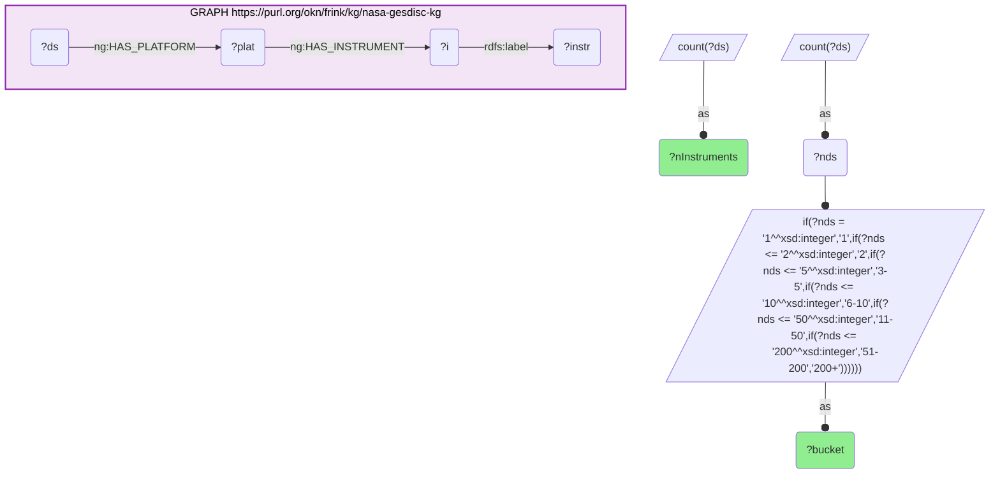

→ `1:28 · 2:15 · 3-5:24 · 6-10:42 · 11-50:202 · 51-200:163 · 200+:447`

### Q6 — Platform types (Figure 1A) · 32 rows

```sparql
PREFIX ng: <https://purl.org/okn/frink/kg/nasa-gesdisc/schema/>
PREFIX dct: <http://purl.org/dc/terms/>
SELECT ?ptype (COUNT(DISTINCT ?p) AS ?nPlatforms) (COUNT(DISTINCT ?i) AS ?nInstruments) WHERE {
  GRAPH <https://purl.org/okn/frink/kg/nasa-gesdisc-kg> {
    ?p a ng:Platform . OPTIONAL { ?p dct:type ?ptype } OPTIONAL { ?p ng:HAS_INSTRUMENT ?i }
  }
} GROUP BY ?ptype
```

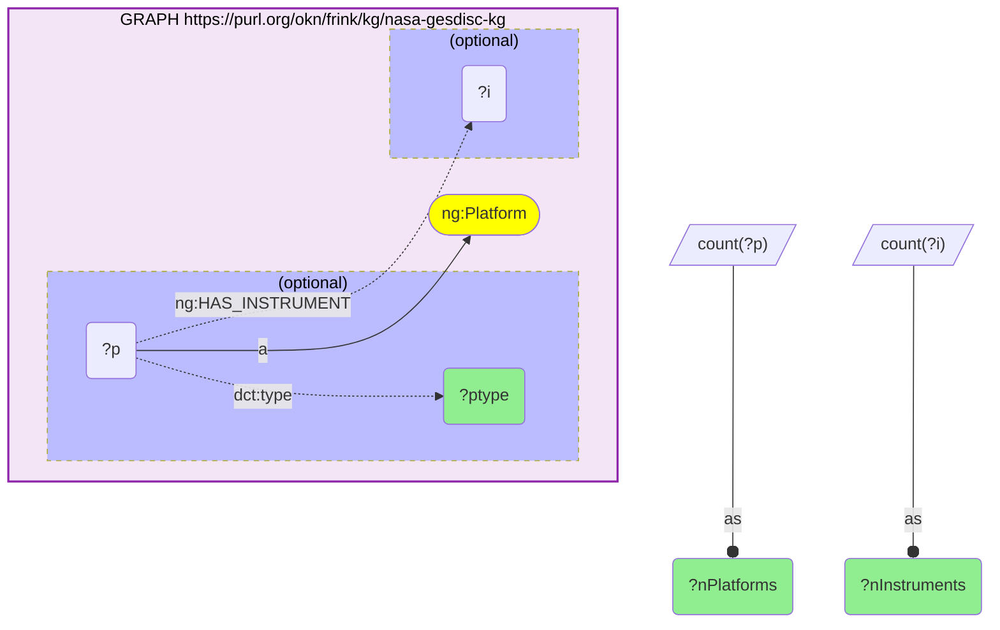

→ Earth Observation Satellites 232/262 · Jet 16/296 · Propeller 34/257 · Permanent Land Sites 15/280 · Vessels 10/83 · Space Stations/Crewed Spacecraft 12/18 · …

### Q7 — Spaceborne scope · 1 row

```sparql
PREFIX ng: <https://purl.org/okn/frink/kg/nasa-gesdisc/schema/>
PREFIX rdfs: <http://www.w3.org/2000/01/rdf-schema#>
PREFIX dct: <http://purl.org/dc/terms/>
SELECT (COUNT(DISTINCT ?instr) AS ?nSpaceInstruments) (COUNT(DISTINCT ?plat) AS ?nSpacePlatforms) (COUNT(DISTINCT ?ds) AS ?nSpaceDatasets) WHERE {
  GRAPH <https://purl.org/okn/frink/kg/nasa-gesdisc-kg> {
    VALUES ?ptype { "Earth Observation Satellites" "Space Stations/Crewed Spacecraft" "Solar/Space Observation Satellites" "Navigation Satellites" "Spacecraft" "Space-based Platforms" }
    ?p dct:type ?ptype ; rdfs:label ?plat ; ng:HAS_INSTRUMENT ?i .
    ?i rdfs:label ?instr .
    OPTIONAL { ?ds ng:HAS_PLATFORM ?p }
  }
}
```

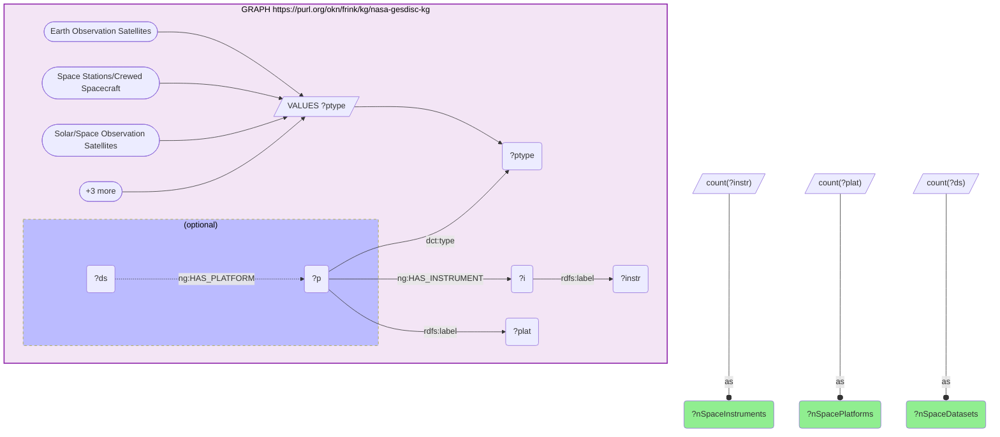

→ `288 · 254 · 4931`

### Q8 — Climate-modelling paper counts · 1 row

```sparql
PREFIX cm: <https://climatepub4kg.github.io/ontology#>
SELECT ?nPapersWithDoi ?nPapersMentioningInstr ?nPapersUsingModel ?nPapersBoth WHERE {
  { SELECT (COUNT(DISTINCT ?p) AS ?nPapersWithDoi) WHERE { GRAPH <https://purl.org/okn/frink/kg/climatemodelskg> { ?p a cm:Paper ; cm:doi ?d } } }
  { SELECT (COUNT(DISTINCT ?p2) AS ?nPapersMentioningInstr) WHERE { GRAPH <https://purl.org/okn/frink/kg/climatemodelskg> { ?p2 cm:PAPER_MENTIONS ?i . ?i a cm:Instrument } } }
  { SELECT (COUNT(DISTINCT ?p3) AS ?nPapersUsingModel) WHERE { GRAPH <https://purl.org/okn/frink/kg/climatemodelskg> { ?p3 cm:PAPER_USES_MODEL ?m } } }
  { SELECT (COUNT(DISTINCT ?p4) AS ?nPapersBoth) WHERE { GRAPH <https://purl.org/okn/frink/kg/climatemodelskg> { ?p4 cm:PAPER_USES_MODEL ?m2 . ?p4 cm:PAPER_MENTIONS ?i2 . ?i2 a cm:Instrument } } }
}
```

```mermaid
graph TD
classDef projected fill:lightgreen;
classDef literal fill:orange;
classDef iri fill:yellow;
  q8v4("?d")
  q8v6("?i")
  q8v12("?i2")
  q8v10("?m")
  q8v14("?m2")
  q8v11("?nPapersBoth"):::projected 
  q8v5("?nPapersMentioningInstr"):::projected 
  q8v8("?nPapersUsingModel"):::projected 
  q8v1("?nPapersWithDoi"):::projected 
  q8v3("?p")
  q8v7("?p2")
  q8v9("?p3")
  q8v13("?p4")
  subgraph q8graph0["GRAPH https://purl.org/okn/frink/kg/climatemodelskg"]
    style q8graph0 fill:#f3e5f5,stroke:#8e24aa,stroke-width:2px,color:#000;
    q8graph0c2(["cm:Paper"]):::iri 
    q8v3 --"a"--> q8graph0c2
    q8v3 --"cm:doi"--> q8v4
  end
  q8bind0[/"count(?p4)"/]
  q8bind0 --as--o q8v1
  subgraph q8graph1["GRAPH https://purl.org/okn/frink/kg/climatemodelskg"]
    style q8graph1 fill:#f3e5f5,stroke:#8e24aa,stroke-width:2px,color:#000;
    q8graph1c2(["cm:Instrument"]):::iri 
    q8v6 --"a"--> q8graph1c2
    q8v7 --"cm:PAPER_MENTIONS"--> q8v6
  end
  q8bind1[/"count(?p4)"/]
  q8bind1 --as--o q8v5
  subgraph q8graph2["GRAPH https://purl.org/okn/frink/kg/climatemodelskg"]
    style q8graph2 fill:#f3e5f5,stroke:#8e24aa,stroke-width:2px,color:#000;
    q8v9 --"cm:PAPER_USES_MODEL"--> q8v10
  end
  q8bind2[/"count(?p4)"/]
  q8bind2 --as--o q8v8
  subgraph q8graph3["GRAPH https://purl.org/okn/frink/kg/climatemodelskg"]
    style q8graph3 fill:#f3e5f5,stroke:#8e24aa,stroke-width:2px,color:#000;
    q8graph3c2(["cm:Instrument"]):::iri 
    q8v12 --"a"--> q8graph3c2
    q8v13 --"cm:PAPER_MENTIONS"--> q8v12
    q8v13 --"cm:PAPER_USES_MODEL"--> q8v14
  end
  q8bind3[/"count(?p4)"/]
  q8bind3 --as--o q8v11
```

→ `1910 · 843 · 563 · 220`

### Q9 — Model and paper linkage to observational datasets · 1 row

```sparql
PREFIX cm: <https://climatepub4kg.github.io/ontology#>
SELECT ?modelObsEdges ?nModelsWithObs ?nObsUsedByModel ?paperObsEdges ?nPapersWithObs ?nObsUsedByPaper ?paperUsesModel WHERE {
  { SELECT (COUNT(*) AS ?modelObsEdges) (COUNT(DISTINCT ?s) AS ?nModelsWithObs) (COUNT(DISTINCT ?o) AS ?nObsUsedByModel) WHERE {
      GRAPH <https://purl.org/okn/frink/kg/climatemodelskg> { ?s cm:MODEL_EXPERIMENTS_ON_OBSERVATIONAL_DATASET ?o } } }
  { SELECT (COUNT(*) AS ?paperObsEdges) (COUNT(DISTINCT ?p) AS ?nPapersWithObs) (COUNT(DISTINCT ?o2) AS ?nObsUsedByPaper) WHERE {
      GRAPH <https://purl.org/okn/frink/kg/climatemodelskg> { ?p cm:PAPER_EXPERIMENTS_ON_OBSERVATIONAL_DATASET ?o2 } } }
  { SELECT (COUNT(*) AS ?paperUsesModel) WHERE {
      GRAPH <https://purl.org/okn/frink/kg/climatemodelskg> { ?p3 cm:PAPER_USES_MODEL ?m } } }
}
```

```mermaid
graph TD
classDef projected fill:lightgreen;
classDef literal fill:orange;
classDef iri fill:yellow;
  q9v16("?m")
  q9v3("?modelObsEdges"):::projected 
  q9v2("?nModelsWithObs"):::projected 
  q9v1("?nObsUsedByModel"):::projected 
  q9v9("?nObsUsedByPaper"):::projected 
  q9v10("?nPapersWithObs"):::projected 
  q9v8("?o")
  q9v13("?o2")
  q9v12("?p")
  q9v15("?p3")
  q9v11("?paperObsEdges"):::projected 
  q9v14("?paperUsesModel"):::projected 
  q9v7("?s")
  subgraph q9graph0["GRAPH https://purl.org/okn/frink/kg/climatemodelskg"]
    style q9graph0 fill:#f3e5f5,stroke:#8e24aa,stroke-width:2px,color:#000;
    q9v7 --"cm:MODEL_EXPERIMENTS_ON_OBSERVATIONAL_DATASET"--> q9v8
  end
  q9bind0[/"count(*)"/]
  q9bind0 --as--o q9v3
  q9bind1[/"count(?p)"/]
  q9bind1 --as--o q9v2
  q9bind2[/"count(?o2)"/]
  q9bind2 --as--o q9v1
  subgraph q9graph1["GRAPH https://purl.org/okn/frink/kg/climatemodelskg"]
    style q9graph1 fill:#f3e5f5,stroke:#8e24aa,stroke-width:2px,color:#000;
    q9v12 --"cm:PAPER_EXPERIMENTS_ON_OBSERVATIONAL_DATASET"--> q9v13
  end
  q9bind3[/"count(*)"/]
  q9bind3 --as--o q9v11
  q9bind4[/"count(?p)"/]
  q9bind4 --as--o q9v10
  q9bind5[/"count(?o2)"/]
  q9bind5 --as--o q9v9
  subgraph q9graph2["GRAPH https://purl.org/okn/frink/kg/climatemodelskg"]
    style q9graph2 fill:#f3e5f5,stroke:#8e24aa,stroke-width:2px,color:#000;
    q9v15 --"cm:PAPER_USES_MODEL"--> q9v16
  end
  q9bind6[/"count(*)"/]
  q9bind6 --as--o q9v14
```

→ `878 · 72 · 163 · 2783 · 832 · 2521 · 2800`

### Q10 — Observational datasets a climate model was evaluated against (§8 Claim 5) · 163 rows

```sparql
PREFIX cm: <https://climatepub4kg.github.io/ontology#>
SELECT ?obsName (COUNT(DISTINCT ?m) AS ?nModels) (COUNT(DISTINCT ?p) AS ?nPapers) WHERE {
  GRAPH <https://purl.org/okn/frink/kg/climatemodelskg> {
    ?o a cm:ObservationalDataset ; cm:name ?obsName .
    OPTIONAL { ?m cm:MODEL_EXPERIMENTS_ON_OBSERVATIONAL_DATASET ?o }
    OPTIONAL { ?p cm:PAPER_EXPERIMENTS_ON_OBSERVATIONAL_DATASET ?o }
  }
} GROUP BY ?obsName HAVING (COUNT(DISTINCT ?m) >= 1)
```

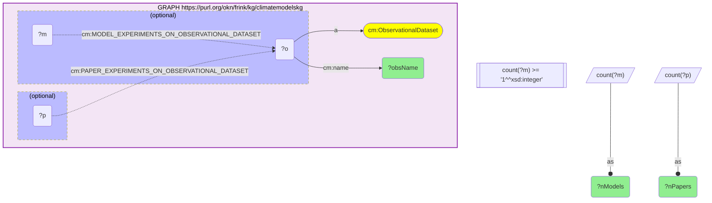

→ top by model count: ERA5 50 · CRU 42 · ERA5&ERA5 38 · GPCC 31 · UoD 31 · ERA5/ERA5.1 26 · CHIRPS 22 · HadCRUT5.0.1 21 · CERES 1 · CloudSat 4 · GPCP 4

### Q11 — The `schema.org` canonicalisation trap: bracketed IRI returns zero · 1 row

```sparql
PREFIX ng: <https://purl.org/okn/frink/kg/nasa-gesdisc/schema/>
SELECT ?nWithStart ?nWithEnd ?nWithAbstract ?nWithDoi ?nWithPeriodicity ?nWithCmr WHERE {
  { SELECT (COUNT(DISTINCT ?a) AS ?nWithStart) WHERE { GRAPH <https://purl.org/okn/frink/kg/nasa-gesdisc-kg> { ?a a ng:Dataset ; <https://schema.org/startDate> ?v } } }
  { SELECT (COUNT(DISTINCT ?b) AS ?nWithEnd) WHERE { GRAPH <https://purl.org/okn/frink/kg/nasa-gesdisc-kg> { ?b a ng:Dataset ; <https://schema.org/endDate> ?v2 } } }
  { SELECT (COUNT(DISTINCT ?c) AS ?nWithAbstract) WHERE { GRAPH <https://purl.org/okn/frink/kg/nasa-gesdisc-kg> { ?c a ng:Dataset ; <https://schema.org/abstract> ?v3 } } }
  { SELECT (COUNT(DISTINCT ?d) AS ?nWithDoi) WHERE { GRAPH <https://purl.org/okn/frink/kg/nasa-gesdisc-kg> { ?d a ng:Dataset ; <http://purl.org/ontology/bibo/doi> ?v4 } } }
  { SELECT (COUNT(DISTINCT ?e) AS ?nWithPeriodicity) WHERE { GRAPH <https://purl.org/okn/frink/kg/nasa-gesdisc-kg> { ?e a ng:Dataset ; <http://purl.org/dc/terms/accrualPeriodicity> ?v5 } } }
  { SELECT (COUNT(DISTINCT ?f) AS ?nWithCmr) WHERE { GRAPH <https://purl.org/okn/frink/kg/nasa-gesdisc-kg> { ?f a ng:Dataset ; ng:cmrId ?v6 } } }
}
```

```mermaid
graph TD
classDef projected fill:lightgreen;
classDef literal fill:orange;
classDef iri fill:yellow;
  q11v3("?a")
  q11v6("?b")
  q11v9("?c")
  q11v12("?d")
  q11v15("?e")
  q11v18("?f")
  q11v8("?nWithAbstract"):::projected 
  q11v17("?nWithCmr"):::projected 
  q11v11("?nWithDoi"):::projected 
  q11v5("?nWithEnd"):::projected 
  q11v14("?nWithPeriodicity"):::projected 
  q11v1("?nWithStart"):::projected 
  q11v4("?v")
  q11v7("?v2")
  q11v10("?v3")
  q11v13("?v4")
  q11v16("?v5")
  q11v19("?v6")
  subgraph q11graph0["GRAPH https://purl.org/okn/frink/kg/nasa-gesdisc-kg"]
    style q11graph0 fill:#f3e5f5,stroke:#8e24aa,stroke-width:2px,color:#000;
    q11graph0c2(["ng:Dataset"]):::iri 
    q11v3 --"a"--> q11graph0c2
    q11v3 --"schema:startDate"--> q11v4
  end
  q11bind0[/"count(?f)"/]
  q11bind0 --as--o q11v1
  subgraph q11graph1["GRAPH https://purl.org/okn/frink/kg/nasa-gesdisc-kg"]
    style q11graph1 fill:#f3e5f5,stroke:#8e24aa,stroke-width:2px,color:#000;
    q11graph1c2(["ng:Dataset"]):::iri 
    q11v6 --"a"--> q11graph1c2
    q11v6 --"schema:endDate"--> q11v7
  end
  q11bind1[/"count(?f)"/]
  q11bind1 --as--o q11v5
  subgraph q11graph2["GRAPH https://purl.org/okn/frink/kg/nasa-gesdisc-kg"]
    style q11graph2 fill:#f3e5f5,stroke:#8e24aa,stroke-width:2px,color:#000;
    q11graph2c2(["ng:Dataset"]):::iri 
    q11v9 --"a"--> q11graph2c2
    q11v9 --"schema:abstract"--> q11v10
  end
  q11bind2[/"count(?f)"/]
  q11bind2 --as--o q11v8
  subgraph q11graph3["GRAPH https://purl.org/okn/frink/kg/nasa-gesdisc-kg"]
    style q11graph3 fill:#f3e5f5,stroke:#8e24aa,stroke-width:2px,color:#000;
    q11graph3c2(["ng:Dataset"]):::iri 
    q11v12 --"a"--> q11graph3c2
    q11v12 --"http://purl.org/ontology/bibo/doi"--> q11v13
  end
  q11bind3[/"count(?f)"/]
  q11bind3 --as--o q11v11
  subgraph q11graph4["GRAPH https://purl.org/okn/frink/kg/nasa-gesdisc-kg"]
    style q11graph4 fill:#f3e5f5,stroke:#8e24aa,stroke-width:2px,color:#000;
    q11graph4c2(["ng:Dataset"]):::iri 
    q11v15 --"a"--> q11graph4c2
    q11v15 --"dcterms:accrualPeriodicity"--> q11v16
  end
  q11bind4[/"count(?f)"/]
  q11bind4 --as--o q11v14
  subgraph q11graph5["GRAPH https://purl.org/okn/frink/kg/nasa-gesdisc-kg"]
    style q11graph5 fill:#f3e5f5,stroke:#8e24aa,stroke-width:2px,color:#000;
    q11graph5c2(["ng:Dataset"]):::iri 
    q11v18 --"a"--> q11graph5c2
    q11v18 --"ng:cmrId"--> q11v19
  end
  q11bind5[/"count(?f)"/]
  q11bind5 --as--o q11v17
```

→ `0 · 0 · 0 · 8058 · 8058 · 8058` — the three zeros are the trap, not absent data (see Q12).

### Q12 — True predicate coverage on Dataset · 16 rows

```sparql
PREFIX ng: <https://purl.org/okn/frink/kg/nasa-gesdisc/schema/>
SELECT ?p (COUNT(DISTINCT ?d) AS ?nDatasets) WHERE {
  GRAPH <https://purl.org/okn/frink/kg/nasa-gesdisc-kg> {
    ?d a ng:Dataset ; ?p ?o .
  }
} GROUP BY ?p
```

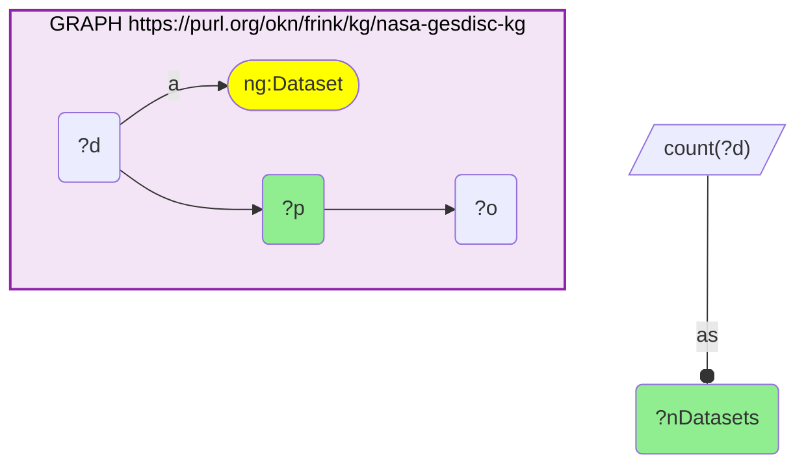

→ `schema.org/startDate` 7959 · `schema.org/endDate` 4837 · `schema.org/abstract` 8058 · `HAS_SCIENCEKEYWORD` 7157 · `OF_PROJECT` 6647 · `CO_USED_WITH` 1942

### Q13 — Per-instrument dataset temporal coverage, scheme-free match · 288 rows

```sparql
PREFIX ng: <https://purl.org/okn/frink/kg/nasa-gesdisc/schema/>
PREFIX rdfs: <http://www.w3.org/2000/01/rdf-schema#>
PREFIX dct: <http://purl.org/dc/terms/>
SELECT ?instr (MIN(?sd) AS ?firstStart) (MAX(?sd) AS ?lastStart) (COUNT(DISTINCT ?ds) AS ?nDsDated) WHERE {
  GRAPH <https://purl.org/okn/frink/kg/nasa-gesdisc-kg> {
    VALUES ?ptype { "Earth Observation Satellites" "Space Stations/Crewed Spacecraft" "Solar/Space Observation Satellites" "Navigation Satellites" "Spacecraft" "Space-based Platforms" }
    ?p dct:type ?ptype ; ng:HAS_INSTRUMENT ?i .
    ?i rdfs:label ?instr .
    ?ds ng:HAS_PLATFORM ?p ; ?pSD ?sd .
    FILTER(STRENDS(STR(?pSD),"schema.org/startDate"))
  }
} GROUP BY ?instr
```

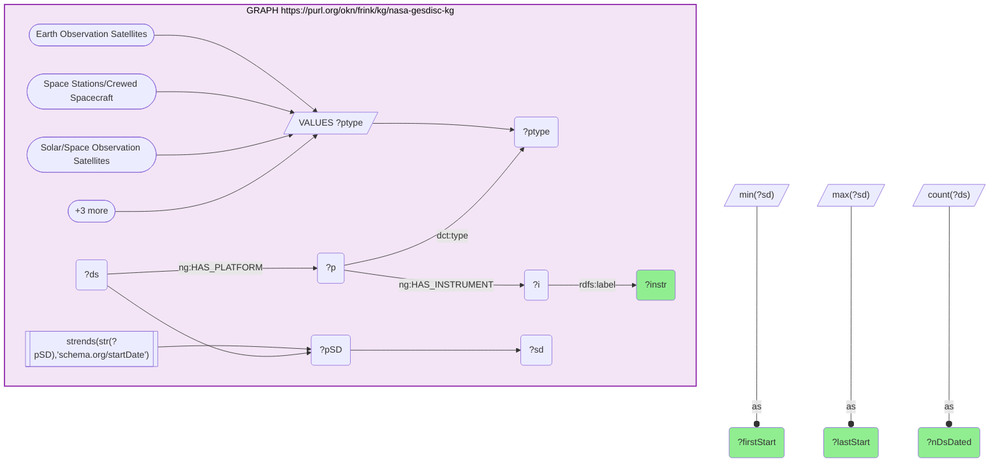

→ `data/instr_coverage_years.csv`. MODIS earliest start 1950 — a Terra-hosted reanalysis product, which is why this cannot proxy instrument lifetime (limitation 3).

### Q14 — Per-instrument platform and dataset counts (raw footprint) · 288 rows

```sparql
PREFIX ng: <https://purl.org/okn/frink/kg/nasa-gesdisc/schema/>
PREFIX rdfs: <http://www.w3.org/2000/01/rdf-schema#>
PREFIX dct: <http://purl.org/dc/terms/>
SELECT ?instr (COUNT(DISTINCT ?plat) AS ?nPlat) (COUNT(DISTINCT ?ds) AS ?nDs) WHERE {
  GRAPH <https://purl.org/okn/frink/kg/nasa-gesdisc-kg> {
    VALUES ?ptype { "Earth Observation Satellites" "Space Stations/Crewed Spacecraft" "Solar/Space Observation Satellites" "Navigation Satellites" "Spacecraft" "Space-based Platforms" }
    ?p dct:type ?ptype ; rdfs:label ?plat ; ng:HAS_INSTRUMENT ?i .
    ?i rdfs:label ?instr .
    OPTIONAL { ?ds ng:HAS_PLATFORM ?p }
  }
} GROUP BY ?instr
```

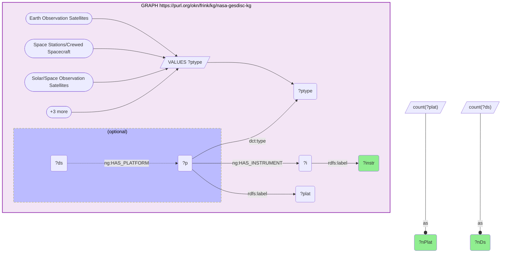

→ `data/instr_platforms.csv`; verified sum of `nDs` = 38,287.

### Q15 — Per-instrument fractional footprint · 288 rows, sum 7,238.0

```sparql
PREFIX ng: <https://purl.org/okn/frink/kg/nasa-gesdisc/schema/>
PREFIX rdfs: <http://www.w3.org/2000/01/rdf-schema#>
PREFIX dct: <http://purl.org/dc/terms/>
PREFIX xsd: <http://www.w3.org/2001/XMLSchema#>
SELECT ?k (SUM(?share) AS ?fracDs) WHERE {
  { SELECT ?plat (COUNT(DISTINCT ?i2) AS ?nI) (COUNT(DISTINCT ?ds) AS ?nD) WHERE {
      GRAPH <https://purl.org/okn/frink/kg/nasa-gesdisc-kg> {
        VALUES ?ptype { "Earth Observation Satellites" "Space Stations/Crewed Spacecraft" "Solar/Space Observation Satellites" "Navigation Satellites" "Spacecraft" "Space-based Platforms" }
        ?plat dct:type ?ptype ; ng:HAS_INSTRUMENT ?i2 .
        OPTIONAL { ?ds ng:HAS_PLATFORM ?plat }
      } } GROUP BY ?plat }
  GRAPH <https://purl.org/okn/frink/kg/nasa-gesdisc-kg> {
    ?plat ng:HAS_INSTRUMENT ?i . ?i rdfs:label ?instr .
    BIND(LCASE(STR(?instr)) AS ?k)
  }
  BIND(xsd:double(?nD) / xsd:double(?nI) AS ?share)
} GROUP BY ?k
```

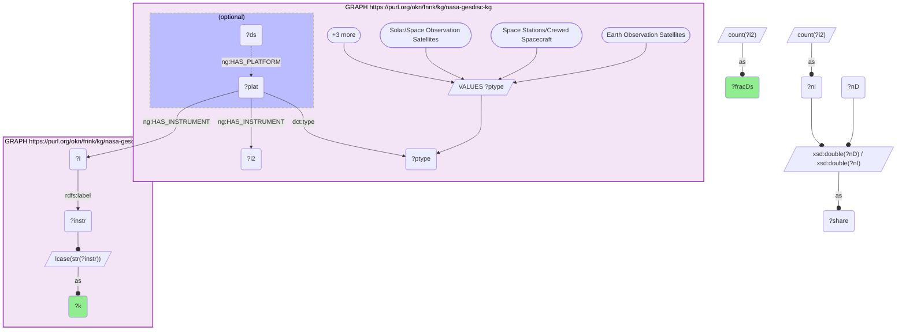

### Q16 — Per-instrument science keywords, projects and data centres · 288 rows, keyword sum 5,972

```sparql
PREFIX ng: <https://purl.org/okn/frink/kg/nasa-gesdisc/schema/>
PREFIX rdfs: <http://www.w3.org/2000/01/rdf-schema#>
PREFIX dct: <http://purl.org/dc/terms/>
SELECT ?k (COUNT(DISTINCT ?kw) AS ?nKeywords) (COUNT(DISTINCT ?proj) AS ?nProjects) (COUNT(DISTINCT ?daac) AS ?nDaacs) WHERE {
  GRAPH <https://purl.org/okn/frink/kg/nasa-gesdisc-kg> {
    VALUES ?ptype { "Earth Observation Satellites" "Space Stations/Crewed Spacecraft" "Solar/Space Observation Satellites" "Navigation Satellites" "Spacecraft" "Space-based Platforms" }
    ?plat dct:type ?ptype ; ng:HAS_INSTRUMENT ?i . ?i rdfs:label ?instr .
    BIND(LCASE(STR(?instr)) AS ?k)
    ?ds ng:HAS_PLATFORM ?plat .
    OPTIONAL { ?ds ng:HAS_SCIENCEKEYWORD ?kn . ?kn rdfs:label ?kw }
    OPTIONAL { ?ds ng:OF_PROJECT ?pj . ?pj rdfs:label ?proj }
    OPTIONAL { ?ds ng:daac ?daac }
  }
} GROUP BY ?k
```

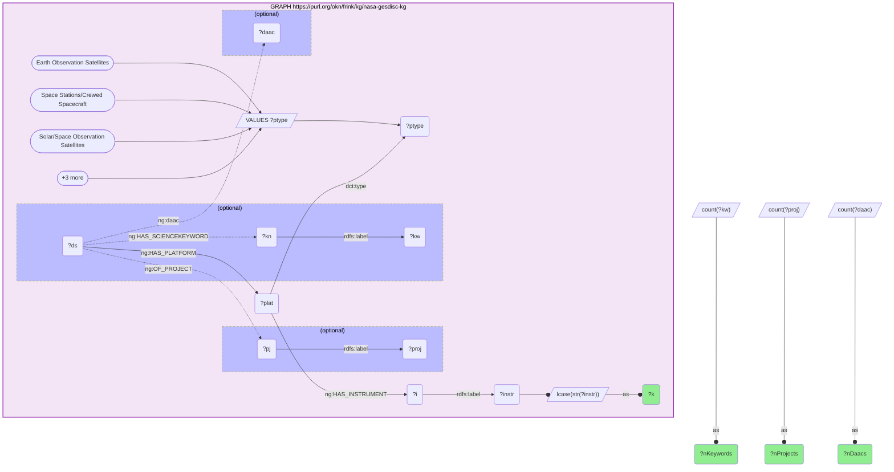

### Q17 — Per-instrument publications citing its datasets · 263 rows, sum 272,321

```sparql
PREFIX ng: <https://purl.org/okn/frink/kg/nasa-gesdisc/schema/>
PREFIX rdfs: <http://www.w3.org/2000/01/rdf-schema#>
PREFIX dct: <http://purl.org/dc/terms/>
SELECT ?k (COUNT(DISTINCT ?pub) AS ?allPubs) (COUNT(DISTINCT ?dsUsed) AS ?dsWithPubs) WHERE {
  GRAPH <https://purl.org/okn/frink/kg/nasa-gesdisc-kg> {
    VALUES ?ptype { "Earth Observation Satellites" "Space Stations/Crewed Spacecraft" "Solar/Space Observation Satellites" "Navigation Satellites" "Spacecraft" "Space-based Platforms" }
    ?plat dct:type ?ptype ; ng:HAS_INSTRUMENT ?i . ?i rdfs:label ?instr .
    BIND(LCASE(STR(?instr)) AS ?k)
    ?dsUsed ng:HAS_PLATFORM ?plat .
    ?pub ng:USES_DATASET ?dsUsed .
  }
} GROUP BY ?k
```

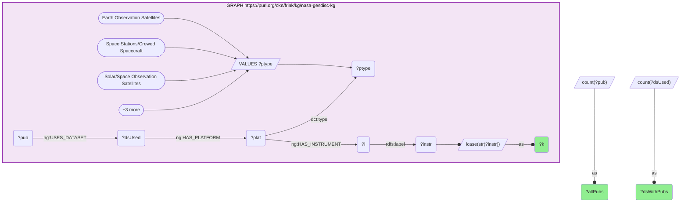

### Q18 — Publication field coverage and applied research areas · 1 row + 19 rows

```sparql
PREFIX ng: <https://purl.org/okn/frink/kg/nasa-gesdisc/schema/>
SELECT ?nPubWithArea ?nPubUsingDs ?nPubWithDoi ?nPubWithYear WHERE {
  { SELECT (COUNT(DISTINCT ?a) AS ?nPubWithArea) WHERE { GRAPH <https://purl.org/okn/frink/kg/nasa-gesdisc-kg> { ?a ng:HAS_APPLIEDRESEARCHAREA ?x } } }
  { SELECT (COUNT(DISTINCT ?b) AS ?nPubUsingDs) WHERE { GRAPH <https://purl.org/okn/frink/kg/nasa-gesdisc-kg> { ?b ng:USES_DATASET ?y } } }
  { SELECT (COUNT(DISTINCT ?c) AS ?nPubWithDoi) WHERE { GRAPH <https://purl.org/okn/frink/kg/nasa-gesdisc-kg> { ?c a ng:Publication ; <http://purl.org/ontology/bibo/doi> ?z } } }
  { SELECT (COUNT(DISTINCT ?d) AS ?nPubWithYear) WHERE { GRAPH <https://purl.org/okn/frink/kg/nasa-gesdisc-kg> { ?d a ng:Publication ; <http://www.w3.org/2006/time#year> ?yr } } }
}
```

```mermaid
graph TD
classDef projected fill:lightgreen;
classDef literal fill:orange;
classDef iri fill:yellow;
  q18v3("?a")
  q18v6("?b")
  q18v9("?c")
  q18v12("?d")
  q18v5("?nPubUsingDs"):::projected 
  q18v1("?nPubWithArea"):::projected 
  q18v8("?nPubWithDoi"):::projected 
  q18v11("?nPubWithYear"):::projected 
  q18v4("?x")
  q18v7("?y")
  q18v13("?yr")
  q18v10("?z")
  subgraph q18graph0["GRAPH https://purl.org/okn/frink/kg/nasa-gesdisc-kg"]
    style q18graph0 fill:#f3e5f5,stroke:#8e24aa,stroke-width:2px,color:#000;
    q18v3 --"ng:HAS_APPLIEDRESEARCHAREA"--> q18v4
  end
  q18bind0[/"count(?d)"/]
  q18bind0 --as--o q18v1
  subgraph q18graph1["GRAPH https://purl.org/okn/frink/kg/nasa-gesdisc-kg"]
    style q18graph1 fill:#f3e5f5,stroke:#8e24aa,stroke-width:2px,color:#000;
    q18v6 --"ng:USES_DATASET"--> q18v7
  end
  q18bind1[/"count(?d)"/]
  q18bind1 --as--o q18v5
  subgraph q18graph2["GRAPH https://purl.org/okn/frink/kg/nasa-gesdisc-kg"]
    style q18graph2 fill:#f3e5f5,stroke:#8e24aa,stroke-width:2px,color:#000;
    q18graph2c2(["ng:Publication"]):::iri 
    q18v9 --"a"--> q18graph2c2
    q18v9 --"http://purl.org/ontology/bibo/doi"--> q18v10
  end
  q18bind2[/"count(?d)"/]
  q18bind2 --as--o q18v8
  subgraph q18graph3["GRAPH https://purl.org/okn/frink/kg/nasa-gesdisc-kg"]
    style q18graph3 fill:#f3e5f5,stroke:#8e24aa,stroke-width:2px,color:#000;
    q18graph3c2(["ng:Publication"]):::iri 
    q18v12 --"a"--> q18graph3c2
    q18v12 --"http://www.w3.org/2006/time#year"--> q18v13
  end
  q18bind3[/"count(?d)"/]
  q18bind3 --as--o q18v11
```

→ `121553 · 27076 · 457085 · 456434`. The 19 applied research areas contain no climate-modelling term (AGRICULTURE, AIR QUALITY, ATMOSPHERIC/OCEAN INDICATORS, CRYOSPHERIC INDICATORS, …), which is why route R4 filters on `schema:title` instead.

### Q19 — R4 denominator: NASA publications with a modelling title that cite a dataset · 1 row

```sparql
PREFIX ng: <https://purl.org/okn/frink/kg/nasa-gesdisc/schema/>
SELECT (COUNT(DISTINCT ?c) AS ?nModelPubsUsingDatasets) WHERE {
  GRAPH <https://purl.org/okn/frink/kg/nasa-gesdisc-kg> {
    ?c ng:USES_DATASET ?ds ; ?p3 ?t3 .
    FILTER(STRENDS(STR(?p3),"schema.org/title"))
    FILTER(CONTAINS(LCASE(STR(?t3)),"climate model") || CONTAINS(LCASE(STR(?t3)),"cmip") || CONTAINS(LCASE(STR(?t3)),"earth system model") || CONTAINS(LCASE(STR(?t3)),"reanalysis") || CONTAINS(LCASE(STR(?t3)),"general circulation model"))
  }
}
```

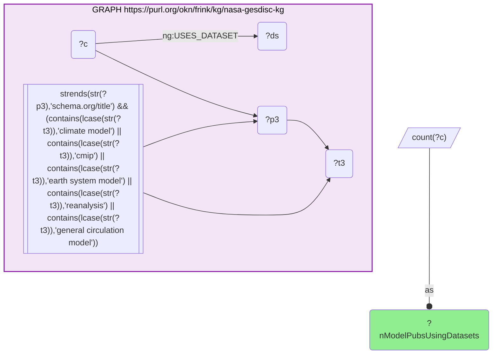

→ `561`

### Q20 — Route R1: instrument named in a climate-modelling paper · 82 rows, sum 621

```sparql
PREFIX ng: <https://purl.org/okn/frink/kg/nasa-gesdisc/schema/>
PREFIX cm: <https://climatepub4kg.github.io/ontology#>
PREFIX rdfs: <http://www.w3.org/2000/01/rdf-schema#>
PREFIX dct: <http://purl.org/dc/terms/>
SELECT ?k (SAMPLE(?instr) AS ?nasaName) (COUNT(DISTINCT ?paper) AS ?cmPapers) WHERE {
  GRAPH <https://purl.org/okn/frink/kg/nasa-gesdisc-kg> {
    VALUES ?ptype { "Earth Observation Satellites" "Space Stations/Crewed Spacecraft" "Solar/Space Observation Satellites" "Navigation Satellites" "Spacecraft" "Space-based Platforms" }
    ?p dct:type ?ptype ; ng:HAS_INSTRUMENT ?i .
    ?i rdfs:label ?instr .
    BIND(LCASE(STR(?instr)) AS ?k)
  }
  GRAPH <https://purl.org/okn/frink/kg/climatemodelskg> {
    ?ci a cm:Instrument ; cm:name ?cn .
    ?paper cm:PAPER_MENTIONS ?ci .
    BIND(LCASE(STR(?cn)) AS ?k)
  }
} GROUP BY ?k
```

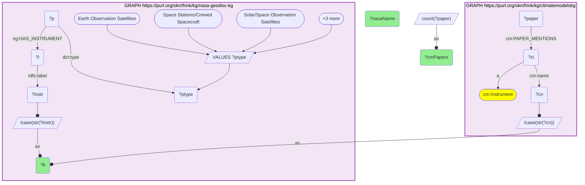

→ MODIS 170 · SCIAMACHY 29 · AVHRR 27 · SeaWiFS 20 · AMSR-E 18 · OMI 17 · GOME 16 · MISR 16 · SMMR 13 · SUN PHOTOMETERS 13

### Q21 — Route R2: instrument named in a paper that also uses a named climate model · 50 rows, sum 172

```sparql
PREFIX ng: <https://purl.org/okn/frink/kg/nasa-gesdisc/schema/>
PREFIX cm: <https://climatepub4kg.github.io/ontology#>
PREFIX rdfs: <http://www.w3.org/2000/01/rdf-schema#>
PREFIX dct: <http://purl.org/dc/terms/>
SELECT ?k (COUNT(DISTINCT ?paper) AS ?cmModelPapers) (COUNT(DISTINCT ?model) AS ?cmDistinctModels) WHERE {
  GRAPH <https://purl.org/okn/frink/kg/nasa-gesdisc-kg> {
    VALUES ?ptype { "Earth Observation Satellites" "Space Stations/Crewed Spacecraft" "Solar/Space Observation Satellites" "Navigation Satellites" "Spacecraft" "Space-based Platforms" }
    ?p dct:type ?ptype ; ng:HAS_INSTRUMENT ?i . ?i rdfs:label ?instr .
    BIND(LCASE(STR(?instr)) AS ?k)
  }
  GRAPH <https://purl.org/okn/frink/kg/climatemodelskg> {
    ?ci a cm:Instrument ; cm:name ?cn .
    ?paper cm:PAPER_MENTIONS ?ci ; cm:PAPER_USES_MODEL ?model .
    BIND(LCASE(STR(?cn)) AS ?k)
  }
} GROUP BY ?k
```

```mermaid
graph TD
classDef projected fill:lightgreen;
classDef literal fill:orange;
classDef iri fill:yellow;
  q21v12("?ci")
  q21v1("?cmDistinctModels"):::projected 
  q21v2("?cmModelPapers"):::projected 
  q21v11("?cn")
  q21v10("?i")
  q21v7("?instr")
  q21v3("?k"):::projected 
  q21v14("?model")
  q21v9("?p")
  q21v13("?paper")
  q21v8("?ptype")
  subgraph q21graph0["GRAPH https://purl.org/okn/frink/kg/nasa-gesdisc-kg"]
    style q21graph0 fill:#f3e5f5,stroke:#8e24aa,stroke-width:2px,color:#000;
    q21graph0bind0[/"VALUES ?ptype"/]
    q21graph0bind0-->q21v8
    q21graph0bind00(["Earth Observation Satellites"])
    q21graph0bind00 --> q21graph0bind0
    q21graph0bind01(["Space Stations/Crewed Spacecraft"])
    q21graph0bind01 --> q21graph0bind0
    q21graph0bind02(["Solar/Space Observation Satellites"])
    q21graph0bind02 --> q21graph0bind0
    q21graph0bind0more([+3 more])
    q21graph0bind0more --> q21graph0bind0
    q21v9 --"ng:HAS_INSTRUMENT"--> q21v10
    q21v10 --"rdfs:label"--> q21v7
    q21v9 --"dct:type"--> q21v8
    q21graph0bind1[/"lcase(str(?instr))"/]
    q21v7 --o q21graph0bind1
    q21graph0bind1 --as--o q21v3
  end
  subgraph q21graph1["GRAPH https://purl.org/okn/frink/kg/climatemodelskg"]
    style q21graph1 fill:#f3e5f5,stroke:#8e24aa,stroke-width:2px,color:#000;
    q21graph1c2(["cm:Instrument"]):::iri 
    q21v12 --"a"--> q21graph1c2
    q21v13 --"cm:PAPER_MENTIONS"--> q21v12
    q21v12 --"cm:name"--> q21v11
    q21v13 --"cm:PAPER_USES_MODEL"--> q21v14
    q21graph1bind2[/"lcase(str(?cn))"/]
    q21v11 --o q21graph1bind2
    q21graph1bind2 --as--o q21v3
  end
  q21bind3[/"count(?paper)"/]
  q21bind3 --as--o q21v2
  q21bind4[/"count(?model)"/]
  q21bind4 --as--o q21v1
```

→ MODIS 60 papers / 52 models · AVHRR 9/32 · SeaWiFS 8/4 · AMSR-E 6/22 · MISR 6/15 · SMMR 6/39 · SSMIS 5/33 · TOVS 5/27

### Q22 — Route R3: DOI-matched modelling paper recorded by NASA as using the instrument's data · 86 rows, sum 338

```sparql
PREFIX ng: <https://purl.org/okn/frink/kg/nasa-gesdisc/schema/>
PREFIX cm: <https://climatepub4kg.github.io/ontology#>
PREFIX rdfs: <http://www.w3.org/2000/01/rdf-schema#>
PREFIX dct: <http://purl.org/dc/terms/>
SELECT ?k (COUNT(DISTINCT ?bare) AS ?doiPapers) (COUNT(DISTINCT ?ds) AS ?doiDatasets) WHERE {
  GRAPH <https://purl.org/okn/frink/kg/climatemodelskg> {
    ?p1 a cm:Paper ; cm:doi ?d1 .
    BIND(LCASE(REPLACE(STR(?d1),"^https?://(dx[.])?doi[.]org/","")) AS ?bare)
  }
  GRAPH <https://purl.org/okn/frink/kg/nasa-gesdisc-kg> {
    ?p2 <http://purl.org/ontology/bibo/doi> ?d2 ; ng:USES_DATASET ?ds .
    BIND(LCASE(REPLACE(STR(?d2),"^https?://(dx[.])?doi[.]org/","")) AS ?bare)
    ?ds ng:HAS_PLATFORM ?plat .
    ?plat dct:type ?ptype ; ng:HAS_INSTRUMENT ?i .
    VALUES ?ptype { "Earth Observation Satellites" "Space Stations/Crewed Spacecraft" "Solar/Space Observation Satellites" "Navigation Satellites" "Spacecraft" "Space-based Platforms" }
    ?i rdfs:label ?instr .
    BIND(LCASE(STR(?instr)) AS ?k)
  }
} GROUP BY ?k
```

```mermaid
graph TD
classDef projected fill:lightgreen;
classDef literal fill:orange;
classDef iri fill:yellow;
  q22v7("?bare")
  q22v8("?d1")
  q22v11("?d2")
  q22v1("?doiDatasets"):::projected 
  q22v2("?doiPapers"):::projected 
  q22v13("?ds")
  q22v16("?i")
  q22v10("?instr")
  q22v3("?k"):::projected 
  q22v9("?p1")
  q22v12("?p2")
  q22v14("?plat")
  q22v15("?ptype")
  subgraph q22graph0["GRAPH https://purl.org/okn/frink/kg/climatemodelskg"]
    style q22graph0 fill:#f3e5f5,stroke:#8e24aa,stroke-width:2px,color:#000;
    q22graph0c2(["cm:Paper"]):::iri 
    q22v9 --"a"--> q22graph0c2
    q22v9 --"cm:doi"--> q22v8
    q22graph0bind0[/"lcase(replace(str(?d1),'^https?://(dx#91;.#93;)?doi#91;.#93;org/',''))"/]
    q22v8 --o q22graph0bind0
    q22graph0bind0 --as--o q22v7
  end
  subgraph q22graph1["GRAPH https://purl.org/okn/frink/kg/nasa-gesdisc-kg"]
    style q22graph1 fill:#f3e5f5,stroke:#8e24aa,stroke-width:2px,color:#000;
    q22v12 --"http://purl.org/ontology/bibo/doi"--> q22v11
    q22v12 --"ng:USES_DATASET"--> q22v13
    q22graph1bind1[/"lcase(replace(str(?d2),'^https?://(dx#91;.#93;)?doi#91;.#93;org/',''))"/]
    q22v11 --o q22graph1bind1
    q22graph1bind1 --as--o q22v7
    q22v13 --"ng:HAS_PLATFORM"--> q22v14
    q22v14 --"dct:type"--> q22v15
    q22v14 --"ng:HAS_INSTRUMENT"--> q22v16
    q22graph1bind2[/"VALUES ?ptype"/]
    q22graph1bind2-->q22v15
    q22graph1bind20(["Earth Observation Satellites"])
    q22graph1bind20 --> q22graph1bind2
    q22graph1bind21(["Space Stations/Crewed Spacecraft"])
    q22graph1bind21 --> q22graph1bind2
    q22graph1bind22(["Solar/Space Observation Satellites"])
    q22graph1bind22 --> q22graph1bind2
    q22graph1bind2more([+3 more])
    q22graph1bind2more --> q22graph1bind2
    q22v16 --"rdfs:label"--> q22v10
    q22graph1bind3[/"lcase(str(?instr))"/]
    q22v10 --o q22graph1bind3
    q22graph1bind3 --as--o q22v3
  end
  q22bind4[/"count(?bare)"/]
  q22bind4 --as--o q22v2
  q22bind5[/"count(?ds)"/]
  q22bind5 --as--o q22v1
```

→ GPS 18 · AMSR-E 13 · CERES SCANNER 13 · MODIS 13 · ASTER 12 · MISR 12 · MOPITT 12 · CERES-FM1/FM2 12

### Q23 — Route R4: per-instrument NASA modelling-title publications · 182 rows, sum 5,453

```sparql
PREFIX ng: <https://purl.org/okn/frink/kg/nasa-gesdisc/schema/>
PREFIX rdfs: <http://www.w3.org/2000/01/rdf-schema#>
PREFIX dct: <http://purl.org/dc/terms/>
SELECT ?k (COUNT(DISTINCT ?c) AS ?modelTitlePubs) (COUNT(DISTINCT ?ds) AS ?modelTitleDatasets) WHERE {
  { SELECT DISTINCT ?c ?ds WHERE {
      GRAPH <https://purl.org/okn/frink/kg/nasa-gesdisc-kg> {
        ?c ng:USES_DATASET ?ds ; ?p3 ?t3 .
        FILTER(STRENDS(STR(?p3),"schema.org/title"))
        FILTER(CONTAINS(LCASE(STR(?t3)),"climate model") || CONTAINS(LCASE(STR(?t3)),"cmip") || CONTAINS(LCASE(STR(?t3)),"earth system model") || CONTAINS(LCASE(STR(?t3)),"reanalysis") || CONTAINS(LCASE(STR(?t3)),"general circulation model"))
      } } }
  GRAPH <https://purl.org/okn/frink/kg/nasa-gesdisc-kg> {
    ?ds ng:HAS_PLATFORM ?plat .
    ?plat dct:type ?ptype ; ng:HAS_INSTRUMENT ?i .
    VALUES ?ptype { "Earth Observation Satellites" "Space Stations/Crewed Spacecraft" "Solar/Space Observation Satellites" "Navigation Satellites" "Spacecraft" "Space-based Platforms" }
    ?i rdfs:label ?instr .
    BIND(LCASE(STR(?instr)) AS ?k)
  }
} GROUP BY ?k
```

```mermaid
graph TD
classDef projected fill:lightgreen;
classDef literal fill:orange;
classDef iri fill:yellow;
  q23v9("?c")
  q23v10("?ds")
  q23v14("?i")
  q23v11("?instr")
  q23v3("?k"):::projected 
  q23v1("?modelTitleDatasets"):::projected 
  q23v2("?modelTitlePubs"):::projected 
  q23v7("?p3")
  q23v12("?plat")
  q23v13("?ptype")
  q23v8("?t3")
  subgraph q23graph0["GRAPH https://purl.org/okn/frink/kg/nasa-gesdisc-kg"]
    style q23graph0 fill:#f3e5f5,stroke:#8e24aa,stroke-width:2px,color:#000;
    q23graph0f0[["strends(str(?p3),'schema.org/title') && (contains(lcase(str(?t3)),'climate model') || contains(lcase(str(?t3)),'cmip') || contains(lcase(str(?t3)),'earth system model') || contains(lcase(str(?t3)),'reanalysis') || contains(lcase(str(?t3)),'general circulation model'))"]]
    q23graph0f0 --> q23v7
    q23graph0f0 --> q23v8
    q23v9 --"ng:USES_DATASET"--> q23v10
    q23v9 -->q23v7--> q23v8
  end
  subgraph q23graph1["GRAPH https://purl.org/okn/frink/kg/nasa-gesdisc-kg"]
    style q23graph1 fill:#f3e5f5,stroke:#8e24aa,stroke-width:2px,color:#000;
    q23v10 --"ng:HAS_PLATFORM"--> q23v12
    q23v12 --"dct:type"--> q23v13
    q23v12 --"ng:HAS_INSTRUMENT"--> q23v14
    q23graph1bind0[/"VALUES ?ptype"/]
    q23graph1bind0-->q23v13
    q23graph1bind00(["Earth Observation Satellites"])
    q23graph1bind00 --> q23graph1bind0
    q23graph1bind01(["Space Stations/Crewed Spacecraft"])
    q23graph1bind01 --> q23graph1bind0
    q23graph1bind02(["Solar/Space Observation Satellites"])
    q23graph1bind02 --> q23graph1bind0
    q23graph1bind0more([+3 more])
    q23graph1bind0more --> q23graph1bind0
    q23v14 --"rdfs:label"--> q23v11
    q23graph1bind1[/"lcase(str(?instr))"/]
    q23v11 --o q23graph1bind1
    q23graph1bind1 --as--o q23v3
  end
  q23bind2[/"count(?c)"/]
  q23bind2 --as--o q23v2
  q23bind3[/"count(?ds)"/]
  q23bind3 --as--o q23v1
```

→ MODIS 229 · AMSR-E 227 · CERES SCANNER 210 · ASTER 171 · MISR 171 · CERES-FM1/FM2 163 · MOPITT 163 · AIRS 148 · AMSU-A 135

### Q24 — Route R1b: platform named in a climate-modelling paper · 150 rows, sum 3,008

```sparql
PREFIX ng: <https://purl.org/okn/frink/kg/nasa-gesdisc/schema/>
PREFIX cm: <https://climatepub4kg.github.io/ontology#>
PREFIX rdfs: <http://www.w3.org/2000/01/rdf-schema#>
PREFIX dct: <http://purl.org/dc/terms/>
SELECT ?k (COUNT(DISTINCT ?paper) AS ?platMentionPapers) WHERE {
  GRAPH <https://purl.org/okn/frink/kg/nasa-gesdisc-kg> {
    VALUES ?ptype { "Earth Observation Satellites" "Space Stations/Crewed Spacecraft" "Solar/Space Observation Satellites" "Navigation Satellites" "Spacecraft" "Space-based Platforms" }
    ?plat dct:type ?ptype ; rdfs:label ?pl ; ng:HAS_INSTRUMENT ?i . ?i rdfs:label ?instr .
    BIND(LCASE(STR(?instr)) AS ?k)
    BIND(LCASE(STR(?pl)) AS ?pk)
  }
  GRAPH <https://purl.org/okn/frink/kg/climatemodelskg> {
    ?cp a cm:Platform ; cm:name ?cpn .
    ?paper cm:PAPER_MENTIONS ?cp .
    BIND(LCASE(STR(?cpn)) AS ?pk)
  }
} GROUP BY ?k
```

```mermaid
graph TD
classDef projected fill:lightgreen;
classDef literal fill:orange;
classDef iri fill:yellow;
  q24v12("?cp")
  q24v11("?cpn")
  q24v10("?i")
  q24v7("?instr")
  q24v2("?k"):::projected 
  q24v13("?paper")
  q24v5("?pk")
  q24v6("?pl")
  q24v9("?plat")
  q24v1("?platMentionPapers"):::projected 
  q24v8("?ptype")
  subgraph q24graph0["GRAPH https://purl.org/okn/frink/kg/nasa-gesdisc-kg"]
    style q24graph0 fill:#f3e5f5,stroke:#8e24aa,stroke-width:2px,color:#000;
    q24graph0bind0[/"VALUES ?ptype"/]
    q24graph0bind0-->q24v8
    q24graph0bind00(["Earth Observation Satellites"])
    q24graph0bind00 --> q24graph0bind0
    q24graph0bind01(["Space Stations/Crewed Spacecraft"])
    q24graph0bind01 --> q24graph0bind0
    q24graph0bind02(["Solar/Space Observation Satellites"])
    q24graph0bind02 --> q24graph0bind0
    q24graph0bind0more([+3 more])
    q24graph0bind0more --> q24graph0bind0
    q24v9 --"ng:HAS_INSTRUMENT"--> q24v10
    q24v9 --"dct:type"--> q24v8
    q24v9 --"rdfs:label"--> q24v6
    q24v10 --"rdfs:label"--> q24v7
    q24graph0bind1[/"lcase(str(?instr))"/]
    q24v7 --o q24graph0bind1
    q24graph0bind1 --as--o q24v2
    q24graph0bind2[/"lcase(str(?pl))"/]
    q24v6 --o q24graph0bind2
    q24graph0bind2 --as--o q24v5
  end
  subgraph q24graph1["GRAPH https://purl.org/okn/frink/kg/climatemodelskg"]
    style q24graph1 fill:#f3e5f5,stroke:#8e24aa,stroke-width:2px,color:#000;
    q24graph1c2(["cm:Platform"]):::iri 
    q24v12 --"a"--> q24graph1c2
    q24v12 --"cm:name"--> q24v11
    q24v13 --"cm:PAPER_MENTIONS"--> q24v12
    q24graph1bind3[/"lcase(str(?cpn))"/]
    q24v11 --o q24graph1bind3
    q24graph1bind3 --as--o q24v5
  end
  q24bind4[/"count(?paper)"/]
  q24bind4 --as--o q24v1
```

### Q25 — Variables measured by an instrument and produced by a model component · 1 row

```sparql
PREFIX cm: <https://climatepub4kg.github.io/ontology#>
SELECT ?nVarMeasured ?nVarProduced ?nVarBoth ?nInstrWithVar ?nCompWithVar WHERE {
  { SELECT (COUNT(DISTINCT ?v) AS ?nVarMeasured) (COUNT(DISTINCT ?i) AS ?nInstrWithVar) WHERE { GRAPH <https://purl.org/okn/frink/kg/climatemodelskg> { ?i cm:MEASURES_VARIABLE ?v } } }
  { SELECT (COUNT(DISTINCT ?v2) AS ?nVarProduced) (COUNT(DISTINCT ?sc) AS ?nCompWithVar) WHERE { GRAPH <https://purl.org/okn/frink/kg/climatemodelskg> { ?sc cm:PRODUCES_VARIABLE ?v2 } } }
  { SELECT (COUNT(DISTINCT ?v3) AS ?nVarBoth) WHERE { GRAPH <https://purl.org/okn/frink/kg/climatemodelskg> { ?i3 cm:MEASURES_VARIABLE ?v3 . ?sc3 cm:PRODUCES_VARIABLE ?v3 } } }
}
```

```mermaid
graph TD
classDef projected fill:lightgreen;
classDef literal fill:orange;
classDef iri fill:yellow;
  q25v5("?i")
  q25v12("?i3")
  q25v7("?nCompWithVar"):::projected 
  q25v1("?nInstrWithVar"):::projected 
  q25v11("?nVarBoth"):::projected 
  q25v2("?nVarMeasured"):::projected 
  q25v8("?nVarProduced"):::projected 
  q25v9("?sc")
  q25v14("?sc3")
  q25v6("?v")
  q25v10("?v2")
  q25v13("?v3")
  subgraph q25graph0["GRAPH https://purl.org/okn/frink/kg/climatemodelskg"]
    style q25graph0 fill:#f3e5f5,stroke:#8e24aa,stroke-width:2px,color:#000;
    q25v5 --"cm:MEASURES_VARIABLE"--> q25v6
  end
  q25bind0[/"count(?v3)"/]
  q25bind0 --as--o q25v2
  q25bind1[/"count(?sc)"/]
  q25bind1 --as--o q25v1
  subgraph q25graph1["GRAPH https://purl.org/okn/frink/kg/climatemodelskg"]
    style q25graph1 fill:#f3e5f5,stroke:#8e24aa,stroke-width:2px,color:#000;
    q25v9 --"cm:PRODUCES_VARIABLE"--> q25v10
  end
  q25bind2[/"count(?v3)"/]
  q25bind2 --as--o q25v8
  q25bind3[/"count(?sc)"/]
  q25bind3 --as--o q25v7
  subgraph q25graph2["GRAPH https://purl.org/okn/frink/kg/climatemodelskg"]
    style q25graph2 fill:#f3e5f5,stroke:#8e24aa,stroke-width:2px,color:#000;
    q25v12 --"cm:MEASURES_VARIABLE"--> q25v13
    q25v14 --"cm:PRODUCES_VARIABLE"--> q25v13
  end
  q25bind4[/"count(?v3)"/]
  q25bind4 --as--o q25v11
```

→ `237 · 2947 · 184 · 406 · 718`

### Q26 — Substitutability: measurers per model-produced variable (Figure 5A) · 6 rows

```sparql
PREFIX cm: <https://climatepub4kg.github.io/ontology#>
SELECT ?nMeasurerBucket (COUNT(*) AS ?nVariables) WHERE {
  { SELECT ?vn (COUNT(DISTINCT ?ik) AS ?nm) WHERE {
      GRAPH <https://purl.org/okn/frink/kg/climatemodelskg> {
        ?i a cm:Instrument ; cm:name ?iname ; cm:MEASURES_VARIABLE ?v .
        ?v cm:name ?vn . ?sc cm:PRODUCES_VARIABLE ?v .
        BIND(LCASE(STR(?iname)) AS ?ik)
      } } GROUP BY ?vn }
  BIND(IF(?nm=1,"1 (sole measurer)",IF(?nm<=2,"2",IF(?nm<=5,"3-5",IF(?nm<=10,"6-10",IF(?nm<=25,"11-25","26+"))))) AS ?nMeasurerBucket)
} GROUP BY ?nMeasurerBucket
```

```mermaid
graph TD
classDef projected fill:lightgreen;
classDef literal fill:orange;
classDef iri fill:yellow;
  q26v9("?i")
  q26v7("?ik")
  q26v8("?iname")
  q26v2("?nMeasurerBucket"):::projected 
  q26v1("?nVariables"):::projected 
  q26v5("?nm")
  q26v11("?sc")
  q26v10("?v")
  q26v6("?vn")
  subgraph q26graph0["GRAPH https://purl.org/okn/frink/kg/climatemodelskg"]
    style q26graph0 fill:#f3e5f5,stroke:#8e24aa,stroke-width:2px,color:#000;
    q26graph0c2(["cm:Instrument"]):::iri 
    q26v9 --"a"--> q26graph0c2
    q26v9 --"cm:MEASURES_VARIABLE"--> q26v10
    q26v9 --"cm:name"--> q26v8
    q26v11 --"cm:PRODUCES_VARIABLE"--> q26v10
    q26v10 --"cm:name"--> q26v6
    q26graph0bind0[/"lcase(str(?iname))"/]
    q26v8 --o q26graph0bind0
    q26graph0bind0 --as--o q26v7
  end
  q26bind1[/"count(?ik)"/]
  q26bind1 --as--o q26v5
  q26bind2[/"if(?nm = '1^^xsd:integer','1 (sole measurer)',if(?nm <= '2^^xsd:integer','2',if(?nm <= '5^^xsd:integer','3-5',if(?nm <= '10^^xsd:integer','6-10',if(?nm <= '25^^xsd:integer','11-25','26+')))))"/]
  q26v5 --o q26bind2
  q26bind2 --as--o q26v2
  q26bind3[/"count(?ik)"/]
  q26bind3 --as--o q26v1
```

→ `1 (sole): 90 · 2: 36 · 3-5: 31 · 6-10: 17 · 11-25: 9 · 26+: 1`

### Q27 — Route R5: model-produced variables per GCMD-matched instrument · 25 rows

```sparql
PREFIX cm: <https://climatepub4kg.github.io/ontology#>
PREFIX ng: <https://purl.org/okn/frink/kg/nasa-gesdisc/schema/>
PREFIX rdfs: <http://www.w3.org/2000/01/rdf-schema#>
PREFIX dct: <http://purl.org/dc/terms/>
SELECT ?k (COUNT(DISTINCT ?vn) AS ?nModelVars) (GROUP_CONCAT(DISTINCT ?vn; separator=" | ") AS ?vars) WHERE {
  GRAPH <https://purl.org/okn/frink/kg/nasa-gesdisc-kg> {
    VALUES ?ptype { "Earth Observation Satellites" "Space Stations/Crewed Spacecraft" "Solar/Space Observation Satellites" "Navigation Satellites" "Spacecraft" "Space-based Platforms" }
    ?plat dct:type ?ptype ; ng:HAS_INSTRUMENT ?ni . ?ni rdfs:label ?instr .
    BIND(LCASE(STR(?instr)) AS ?k)
  }
  GRAPH <https://purl.org/okn/frink/kg/climatemodelskg> {
    ?i a cm:Instrument ; cm:name ?iname ; cm:MEASURES_VARIABLE ?v .
    ?v cm:name ?vn . ?sc cm:PRODUCES_VARIABLE ?v .
    BIND(LCASE(STR(?iname)) AS ?k)
  }
} GROUP BY ?k
```

```mermaid
graph TD
classDef projected fill:lightgreen;
classDef literal fill:orange;
classDef iri fill:yellow;
  q27v12("?i")
  q27v11("?iname")
  q27v7("?instr")
  q27v3("?k"):::projected 
  q27v2("?nModelVars"):::projected 
  q27v10("?ni")
  q27v9("?plat")
  q27v8("?ptype")
  q27v14("?sc")
  q27v13("?v")
  q27v1("?vars"):::projected 
  q27v15("?vn")
  subgraph q27graph0["GRAPH https://purl.org/okn/frink/kg/nasa-gesdisc-kg"]
    style q27graph0 fill:#f3e5f5,stroke:#8e24aa,stroke-width:2px,color:#000;
    q27graph0bind0[/"VALUES ?ptype"/]
    q27graph0bind0-->q27v8
    q27graph0bind00(["Earth Observation Satellites"])
    q27graph0bind00 --> q27graph0bind0
    q27graph0bind01(["Space Stations/Crewed Spacecraft"])
    q27graph0bind01 --> q27graph0bind0
    q27graph0bind02(["Solar/Space Observation Satellites"])
    q27graph0bind02 --> q27graph0bind0
    q27graph0bind0more([+3 more])
    q27graph0bind0more --> q27graph0bind0
    q27v9 --"ng:HAS_INSTRUMENT"--> q27v10
    q27v10 --"rdfs:label"--> q27v7
    q27v9 --"dct:type"--> q27v8
    q27graph0bind1[/"lcase(str(?instr))"/]
    q27v7 --o q27graph0bind1
    q27graph0bind1 --as--o q27v3
  end
  subgraph q27graph1["GRAPH https://purl.org/okn/frink/kg/climatemodelskg"]
    style q27graph1 fill:#f3e5f5,stroke:#8e24aa,stroke-width:2px,color:#000;
    q27graph1c2(["cm:Instrument"]):::iri 
    q27v12 --"a"--> q27graph1c2
    q27v12 --"cm:MEASURES_VARIABLE"--> q27v13
    q27v12 --"cm:name"--> q27v11
    q27v14 --"cm:PRODUCES_VARIABLE"--> q27v13
    q27v13 --"cm:name"--> q27v15
    q27graph1bind2[/"lcase(str(?iname))"/]
    q27v11 --o q27graph1bind2
    q27graph1bind2 --as--o q27v3
  end
  q27bind3[/"count(?vn)"/]
  q27bind3 --as--o q27v2
  q27bind4[/"group_concat(?vn)"/]
  q27bind4 --as--o q27v1
```

→ MODIS 26 · AMSR-E 5 · sun photometers 4 · TROPOMI 4 · SAR 3 · SMMR 3 · VIIRS 3

### Q28 — Route R5 sole-measured variables (irreplaceability axis) · 25 rows

```sparql
PREFIX cm: <https://climatepub4kg.github.io/ontology#>
PREFIX ng: <https://purl.org/okn/frink/kg/nasa-gesdisc/schema/>
PREFIX rdfs: <http://www.w3.org/2000/01/rdf-schema#>
PREFIX dct: <http://purl.org/dc/terms/>
SELECT ?k (COUNT(DISTINCT ?vn) AS ?nSoleVars) (GROUP_CONCAT(DISTINCT ?vn; separator=" | ") AS ?soleVars) WHERE {
  GRAPH <https://purl.org/okn/frink/kg/nasa-gesdisc-kg> {
    VALUES ?ptype { "Earth Observation Satellites" "Space Stations/Crewed Spacecraft" "Solar/Space Observation Satellites" "Navigation Satellites" "Spacecraft" "Space-based Platforms" }
    ?plat dct:type ?ptype ; ng:HAS_INSTRUMENT ?ni . ?ni rdfs:label ?instr .
    BIND(LCASE(STR(?instr)) AS ?k)
  }
  GRAPH <https://purl.org/okn/frink/kg/climatemodelskg> {
    ?i a cm:Instrument ; cm:name ?iname ; cm:MEASURES_VARIABLE ?v .
    ?v cm:name ?vn . ?sc cm:PRODUCES_VARIABLE ?v .
    BIND(LCASE(STR(?iname)) AS ?k)
    FILTER NOT EXISTS {
      ?i2 a cm:Instrument ; cm:name ?iname2 ; cm:MEASURES_VARIABLE ?v .
      FILTER(LCASE(STR(?iname2)) != ?k)
    }
  }
} GROUP BY ?k
```

```mermaid
graph TD
classDef projected fill:lightgreen;
classDef literal fill:orange;
classDef iri fill:yellow;
  q28v12("?i")
  q28v11("?iname")
  q28v7("?instr")
  q28v3("?k"):::projected 
  q28v2("?nSoleVars"):::projected 
  q28v10("?ni")
  q28v9("?plat")
  q28v8("?ptype")
  q28v14("?sc")
  q28v1("?soleVars"):::projected 
  q28v13("?v")
  q28v15("?vn")
  subgraph q28graph0["GRAPH https://purl.org/okn/frink/kg/nasa-gesdisc-kg"]
    style q28graph0 fill:#f3e5f5,stroke:#8e24aa,stroke-width:2px,color:#000;
    q28graph0bind0[/"VALUES ?ptype"/]
    q28graph0bind0-->q28v8
    q28graph0bind00(["Earth Observation Satellites"])
    q28graph0bind00 --> q28graph0bind0
    q28graph0bind01(["Space Stations/Crewed Spacecraft"])
    q28graph0bind01 --> q28graph0bind0
    q28graph0bind02(["Solar/Space Observation Satellites"])
    q28graph0bind02 --> q28graph0bind0
    q28graph0bind0more([+3 more])
    q28graph0bind0more --> q28graph0bind0
    q28v9 --"ng:HAS_INSTRUMENT"--> q28v10
    q28v10 --"rdfs:label"--> q28v7
    q28v9 --"dct:type"--> q28v8
    q28graph0bind1[/"lcase(str(?instr))"/]
    q28v7 --o q28graph0bind1
    q28graph0bind1 --as--o q28v3
  end
  subgraph q28graph1["GRAPH https://purl.org/okn/frink/kg/climatemodelskg"]
    style q28graph1 fill:#f3e5f5,stroke:#8e24aa,stroke-width:2px,color:#000;
    q28graph1c2(["cm:Instrument"]):::iri 
    q28graph1f0[[" "]]
    subgraph q28graph1f0graph1e0["Exists Clause"]
      style q28graph1f0graph1e0 color:#000;
      q28graph1e0f1[["lcase(str(?iname2)) != ?k"]]
      q28graph1e0f1 --> q28graph1e0v1
      q28graph1e0f1 --> q28graph1e0v2
      q28graph1e0v3 --"a"--> q28graph1e0c2
      q28graph1e0v3 --"cm:MEASURES_VARIABLE"--> q28graph1e0v4
      q28graph1e0v3 --"cm:name"--> q28graph1e0v1
      q28graph1e0v3("?i2")
      q28graph1e0v1("?iname2")
      q28graph1e0v2("?k")
      q28graph1e0v4("?v")
      q28graph1e0c2(["cm:Instrument"]):::iri 
    end
    q28graph1f0--EXISTS--> q28graph1f0graph1e0
    q28v12 --"a"--> q28graph1c2
    q28v12 --"cm:MEASURES_VARIABLE"--> q28v13
    q28v12 --"cm:name"--> q28v11
    q28v14 --"cm:PRODUCES_VARIABLE"--> q28v13
    q28v13 --"cm:name"--> q28v15
    q28graph1bind2[/"lcase(str(?iname))"/]
    q28v11 --o q28graph1bind2
    q28graph1bind2 --as--o q28v3
  end
  q28bind3[/"count(?vn)"/]
  q28bind3 --as--o q28v2
  q28bind4[/"group_concat(?vn)"/]
  q28bind4 --as--o q28v1
```

→ **superseded by Q37** (this per-instrument `FILTER NOT EXISTS` formulation did not exclude
same-variable measurers under different names). Retained here because it was run; its output is not
used by the analysis.

### Q29 — GCMD science-keyword vocabulary usage · 1 row

```sparql
PREFIX ng: <https://purl.org/okn/frink/kg/nasa-gesdisc/schema/>
PREFIX dct: <http://purl.org/dc/terms/>
PREFIX rdfs: <http://www.w3.org/2000/01/rdf-schema#>
SELECT ?nKwViaHasSK ?nSubjValsDs ?nSubjValsInstr ?nKwTotal ?nKwHier WHERE {
  { SELECT (COUNT(DISTINCT ?k) AS ?nKwViaHasSK) WHERE { GRAPH <https://purl.org/okn/frink/kg/nasa-gesdisc-kg> { ?ds ng:HAS_SCIENCEKEYWORD ?k } } }
  { SELECT (COUNT(DISTINCT ?s) AS ?nSubjValsDs) WHERE { GRAPH <https://purl.org/okn/frink/kg/nasa-gesdisc-kg> { ?d2 a ng:Dataset ; dct:subject ?s } } }
  { SELECT (COUNT(DISTINCT ?s2) AS ?nSubjValsInstr) WHERE { GRAPH <https://purl.org/okn/frink/kg/nasa-gesdisc-kg> { ?i2 a ng:Instrument ; dct:subject ?s2 } } }
  { SELECT (COUNT(DISTINCT ?k3) AS ?nKwTotal) WHERE { GRAPH <https://purl.org/okn/frink/kg/nasa-gesdisc-kg> { ?k3 a ng:ScienceKeyword } } }
  { SELECT (COUNT(DISTINCT ?k4) AS ?nKwHier) WHERE { GRAPH <https://purl.org/okn/frink/kg/nasa-gesdisc-kg> { ?k4 ng:HAS_SUBCATEGORY ?c } } }
}
```

```mermaid
graph TD
classDef projected fill:lightgreen;
classDef literal fill:orange;
classDef iri fill:yellow;
  q29v15("?c")
  q29v6("?d2")
  q29v3("?ds")
  q29v9("?i2")
  q29v4("?k")
  q29v12("?k3")
  q29v14("?k4")
  q29v13("?nKwHier"):::projected 
  q29v11("?nKwTotal"):::projected 
  q29v1("?nKwViaHasSK"):::projected 
  q29v5("?nSubjValsDs"):::projected 
  q29v8("?nSubjValsInstr"):::projected 
  q29v7("?s")
  q29v10("?s2")
  subgraph q29graph0["GRAPH https://purl.org/okn/frink/kg/nasa-gesdisc-kg"]
    style q29graph0 fill:#f3e5f5,stroke:#8e24aa,stroke-width:2px,color:#000;
    q29v3 --"ng:HAS_SCIENCEKEYWORD"--> q29v4
  end
  q29bind0[/"count(?k4)"/]
  q29bind0 --as--o q29v1
  subgraph q29graph1["GRAPH https://purl.org/okn/frink/kg/nasa-gesdisc-kg"]
    style q29graph1 fill:#f3e5f5,stroke:#8e24aa,stroke-width:2px,color:#000;
    q29graph1c2(["ng:Dataset"]):::iri 
    q29v6 --"a"--> q29graph1c2
    q29v6 --"dct:subject"--> q29v7
  end
  q29bind1[/"count(?k4)"/]
  q29bind1 --as--o q29v5
  subgraph q29graph2["GRAPH https://purl.org/okn/frink/kg/nasa-gesdisc-kg"]
    style q29graph2 fill:#f3e5f5,stroke:#8e24aa,stroke-width:2px,color:#000;
    q29graph2c2(["ng:Instrument"]):::iri 
    q29v9 --"a"--> q29graph2c2
    q29v9 --"dct:subject"--> q29v10
  end
  q29bind2[/"count(?k4)"/]
  q29bind2 --as--o q29v8
  subgraph q29graph3["GRAPH https://purl.org/okn/frink/kg/nasa-gesdisc-kg"]
    style q29graph3 fill:#f3e5f5,stroke:#8e24aa,stroke-width:2px,color:#000;
    q29graph3c2(["ng:ScienceKeyword"]):::iri 
    q29v12 --"a"--> q29graph3c2
  end
  q29bind3[/"count(?k4)"/]
  q29bind3 --as--o q29v11
  subgraph q29graph4["GRAPH https://purl.org/okn/frink/kg/nasa-gesdisc-kg"]
    style q29graph4 fill:#f3e5f5,stroke:#8e24aa,stroke-width:2px,color:#000;
    q29v14 --"ng:HAS_SUBCATEGORY"--> q29v15
  end
  q29bind4[/"count(?k4)"/]
  q29bind4 --as--o q29v13
```

→ `122 · 8058 · 808 · 1609 · 294` — only 122 of 1,609 keywords tag any dataset (limitation 7).

### Q30 — Keywords with ≤ 5 spaceborne instruments (structural substitutability test) · 5 rows

```sparql
PREFIX ng: <https://purl.org/okn/frink/kg/nasa-gesdisc/schema/>
PREFIX rdfs: <http://www.w3.org/2000/01/rdf-schema#>
PREFIX dct: <http://purl.org/dc/terms/>
SELECT ?kw (COUNT(DISTINCT ?instr) AS ?nInstr) (GROUP_CONCAT(DISTINCT ?instr; separator=" | ") AS ?instruments) WHERE {
  GRAPH <https://purl.org/okn/frink/kg/nasa-gesdisc-kg> {
    VALUES ?ptype { "Earth Observation Satellites" "Space Stations/Crewed Spacecraft" "Solar/Space Observation Satellites" "Navigation Satellites" "Spacecraft" "Space-based Platforms" }
    ?ds ng:HAS_SCIENCEKEYWORD ?k ; ng:HAS_PLATFORM ?plat .
    ?k rdfs:label ?kw .
    ?plat dct:type ?ptype ; ng:HAS_INSTRUMENT ?i . ?i rdfs:label ?instr .
  }
} GROUP BY ?kw HAVING (COUNT(DISTINCT ?instr) <= 5)
```

```mermaid
graph TD
classDef projected fill:lightgreen;
classDef literal fill:orange;
classDef iri fill:yellow;
  q30v9("?ds")
  q30v11("?i")
  q30v13("?instr")
  q30v1("?instruments"):::projected 
  q30v12("?k")
  q30v3("?kw"):::projected 
  q30v2("?nInstr"):::projected 
  q30v10("?plat")
  q30v8("?ptype")
  q30f0[["count(?instr) <= '5^^xsd:integer'"]]
  subgraph q30graph0["GRAPH https://purl.org/okn/frink/kg/nasa-gesdisc-kg"]
    style q30graph0 fill:#f3e5f5,stroke:#8e24aa,stroke-width:2px,color:#000;
    q30graph0bind0[/"VALUES ?ptype"/]
    q30graph0bind0-->q30v8
    q30graph0bind00(["Earth Observation Satellites"])
    q30graph0bind00 --> q30graph0bind0
    q30graph0bind01(["Space Stations/Crewed Spacecraft"])
    q30graph0bind01 --> q30graph0bind0
    q30graph0bind02(["Solar/Space Observation Satellites"])
    q30graph0bind02 --> q30graph0bind0
    q30graph0bind0more([+3 more])
    q30graph0bind0more --> q30graph0bind0
    q30v9 --"ng:HAS_PLATFORM"--> q30v10
    q30v10 --"ng:HAS_INSTRUMENT"--> q30v11
    q30v9 --"ng:HAS_SCIENCEKEYWORD"--> q30v12
    q30v10 --"dct:type"--> q30v8
    q30v11 --"rdfs:label"--> q30v13
    q30v12 --"rdfs:label"--> q30v3
  end
  q30bind1[/"count(?instr)"/]
  q30bind1 --as--o q30v2
  q30bind2[/"group_concat(?instr)"/]
  q30bind2 --as--o q30v1
```

→ `BATHYMETRY/SEAFLOOR TOPOGRAPHY → ATLAS (1)` · `TERRESTRIAL ECOSYSTEMS → SAR (1)` · `WATER QUALITY → DDMI (1)` · `SOCIOECONOMICS → SSMIS | SSM/I | OLS (3)` · `ENVIRONMENTAL VULNERABILITY INDEX (EVI) → ETM+ | TM | OLI | MSS | TIRS (5)`

### Q31 — Boundary-spanning cohort: authors on the DOI-shared papers · 1 row

```sparql
PREFIX ng: <https://purl.org/okn/frink/kg/nasa-gesdisc/schema/>
PREFIX cm: <https://climatepub4kg.github.io/ontology#>
PREFIX rdfs: <http://www.w3.org/2000/01/rdf-schema#>
SELECT (COUNT(DISTINCT ?aName) AS ?sharedAuthorNames) (COUNT(DISTINCT ?orcid) AS ?sharedAuthorOrcids) WHERE {
  { SELECT DISTINCT ?bare WHERE {
      GRAPH <https://purl.org/okn/frink/kg/climatemodelskg> {
        ?p1 a cm:Paper ; cm:doi ?d1 .
        BIND(LCASE(REPLACE(STR(?d1),"^https?://(dx[.])?doi[.]org/","")) AS ?bare) } } }
  GRAPH <https://purl.org/okn/frink/kg/nasa-gesdisc-kg> {
    ?p2 <http://purl.org/ontology/bibo/doi> ?d2 ; ng:AUTHORED_BY ?a .
    BIND(LCASE(REPLACE(STR(?d2),"^https?://(dx[.])?doi[.]org/","")) AS ?bare)
    ?a rdfs:label ?aName .
    OPTIONAL { ?a ng:orcid ?orcid }
  }
}
```

```mermaid
graph TD
classDef projected fill:lightgreen;
classDef literal fill:orange;
classDef iri fill:yellow;
  q31v10("?a")
  q31v11("?aName")
  q31v5("?bare")
  q31v6("?d1")
  q31v8("?d2")
  q31v12("?orcid")
  q31v7("?p1")
  q31v9("?p2")
  q31v2("?sharedAuthorNames"):::projected 
  q31v1("?sharedAuthorOrcids"):::projected 
  subgraph q31graph0["GRAPH https://purl.org/okn/frink/kg/climatemodelskg"]
    style q31graph0 fill:#f3e5f5,stroke:#8e24aa,stroke-width:2px,color:#000;
    q31graph0c2(["cm:Paper"]):::iri 
    q31v7 --"a"--> q31graph0c2
    q31v7 --"cm:doi"--> q31v6
    q31graph0bind0[/"lcase(replace(str(?d1),'^https?://(dx#91;.#93;)?doi#91;.#93;org/',''))"/]
    q31v6 --o q31graph0bind0
    q31graph0bind0 --as--o q31v5
  end
  subgraph q31graph1["GRAPH https://purl.org/okn/frink/kg/nasa-gesdisc-kg"]
    style q31graph1 fill:#f3e5f5,stroke:#8e24aa,stroke-width:2px,color:#000;
    q31v9 --"http://purl.org/ontology/bibo/doi"--> q31v8
    q31v9 --"ng:AUTHORED_BY"--> q31v10
    q31graph1bind1[/"lcase(replace(str(?d2),'^https?://(dx#91;.#93;)?doi#91;.#93;org/',''))"/]
    q31v8 --o q31graph1bind1
    q31graph1bind1 --as--o q31v5
    q31v10 --"rdfs:label"--> q31v11
    subgraph q31optionalgraph10["(optional)"]
    style q31optionalgraph10 fill:#bbf,stroke-dasharray: 5 5,color:#000;
      q31v10 -."ng:orcid".-> q31v12
    end
  end
  q31bind2[/"count(?aName)"/]
  q31bind2 --as--o q31v2
  q31bind3[/"count(?orcid)"/]
  q31bind3 --as--o q31v1
```

→ `4397 · 3169`

### Q32 — Institution countries of the boundary-spanning cohort (Figure 7) · 121 rows

```sparql
PREFIX ng: <https://purl.org/okn/frink/kg/nasa-gesdisc/schema/>
PREFIX cm: <https://climatepub4kg.github.io/ontology#>
PREFIX rdfs: <http://www.w3.org/2000/01/rdf-schema#>
SELECT ?country (COUNT(DISTINCT ?inst) AS ?nInstitutions) (COUNT(DISTINCT ?orcid) AS ?nAuthorOrcids) WHERE {
  { SELECT DISTINCT ?bare WHERE {
      GRAPH <https://purl.org/okn/frink/kg/climatemodelskg> {
        ?p1 a cm:Paper ; cm:doi ?d1 .
        BIND(LCASE(REPLACE(STR(?d1),"^https?://(dx[.])?doi[.]org/","")) AS ?bare) } } }
  GRAPH <https://purl.org/okn/frink/kg/nasa-gesdisc-kg> {
    ?p2 <http://purl.org/ontology/bibo/doi> ?d2 ; ng:AUTHORED_BY ?a .
    BIND(LCASE(REPLACE(STR(?d2),"^https?://(dx[.])?doi[.]org/","")) AS ?bare)
    ?a ng:AFFILIATED_WITH ?inst ; ng:orcid ?orcid .
    ?inst ng:country ?country .
  }
} GROUP BY ?country
```

```mermaid
graph TD
classDef projected fill:lightgreen;
classDef literal fill:orange;
classDef iri fill:yellow;
  q32v12("?a")
  q32v7("?bare")
  q32v3("?country"):::projected 
  q32v8("?d1")
  q32v10("?d2")
  q32v13("?inst")
  q32v1("?nAuthorOrcids"):::projected 
  q32v2("?nInstitutions"):::projected 
  q32v14("?orcid")
  q32v9("?p1")
  q32v11("?p2")
  subgraph q32graph0["GRAPH https://purl.org/okn/frink/kg/climatemodelskg"]
    style q32graph0 fill:#f3e5f5,stroke:#8e24aa,stroke-width:2px,color:#000;
    q32graph0c2(["cm:Paper"]):::iri 
    q32v9 --"a"--> q32graph0c2
    q32v9 --"cm:doi"--> q32v8
    q32graph0bind0[/"lcase(replace(str(?d1),'^https?://(dx#91;.#93;)?doi#91;.#93;org/',''))"/]
    q32v8 --o q32graph0bind0
    q32graph0bind0 --as--o q32v7
  end
  subgraph q32graph1["GRAPH https://purl.org/okn/frink/kg/nasa-gesdisc-kg"]
    style q32graph1 fill:#f3e5f5,stroke:#8e24aa,stroke-width:2px,color:#000;
    q32v11 --"http://purl.org/ontology/bibo/doi"--> q32v10
    q32v11 --"ng:AUTHORED_BY"--> q32v12
    q32graph1bind1[/"lcase(replace(str(?d2),'^https?://(dx#91;.#93;)?doi#91;.#93;org/',''))"/]
    q32v10 --o q32graph1bind1
    q32graph1bind1 --as--o q32v7
    q32v12 --"ng:AFFILIATED_WITH"--> q32v13
    q32v12 --"ng:orcid"--> q32v14
    q32v13 --"ng:country"--> q32v3
  end
  q32bind2[/"count(?inst)"/]
  q32bind2 --as--o q32v2
  q32bind3[/"count(?orcid)"/]
  q32bind3 --as--o q32v1
```

→ US 666 institutions / 1,305 ORCIDs · GB 153/699 · DE 159/533 · FR 234/453 · CN 355/389

### Q33 — Country mentions in the climate-modelling corpus · 215 rows

```sparql
PREFIX cm: <https://climatepub4kg.github.io/ontology#>
SELECT ?country ?iso3 (COUNT(DISTINCT ?p) AS ?nPapers) WHERE {
  GRAPH <https://purl.org/okn/frink/kg/climatemodelskg> {
    ?p cm:PAPER_MENTIONS ?c . ?c a cm:Country ; cm:country ?country .
    OPTIONAL { ?c cm:iso3 ?iso3 }
  }
} GROUP BY ?country ?iso3
```

```mermaid
graph TD
classDef projected fill:lightgreen;
classDef literal fill:orange;
classDef iri fill:yellow;
  q33v7("?c")
  q33v3("?country"):::projected 
  q33v2("?iso3"):::projected 
  q33v1("?nPapers"):::projected 
  q33v8("?p")
  subgraph q33graph0["GRAPH https://purl.org/okn/frink/kg/climatemodelskg"]
    style q33graph0 fill:#f3e5f5,stroke:#8e24aa,stroke-width:2px,color:#000;
    q33graph0c2(["cm:Country"]):::iri 
    q33v7 --"a"--> q33graph0c2
    q33v7 --"cm:country"--> q33v3
    q33v8 --"cm:PAPER_MENTIONS"--> q33v7
    subgraph q33optionalgraph00["(optional)"]
    style q33optionalgraph00 fill:#bbf,stroke-dasharray: 5 5,color:#000;
      q33v7 -."cm:iso3".-> q33v2
    end
  end
  q33bind0[/"count(?p)"/]
  q33bind0 --as--o q33v1
```

→ China 540 · Germany 409 · France 350 · India 344 · Canada 320 · Japan 278 · Australia 267 · United States 265

### Q34 — Study regions with GeoNames coordinates (Figure 8) · 160 rows (159 named + 1 unnamed group of 597 papers)

```sparql
PREFIX cm: <https://climatepub4kg.github.io/ontology#>
SELECT ?name ?lat ?lon ?fcode (COUNT(DISTINCT ?p) AS ?nPapers) WHERE {
  GRAPH <https://purl.org/okn/frink/kg/climatemodelskg> {
    ?p cm:PAPER_MENTIONS ?r . ?r a cm:No_Country_Region ;
       cm:asciiname ?name ; cm:latitude ?lat ; cm:longitude ?lon .
    OPTIONAL { ?r cm:feature_code ?fcode }
  }
} GROUP BY ?name ?lat ?lon ?fcode
```

```mermaid
graph TD
classDef projected fill:lightgreen;
classDef literal fill:orange;
classDef iri fill:yellow;
  q34v2("?fcode"):::projected 
  q34v4("?lat"):::projected 
  q34v3("?lon"):::projected 
  q34v1("?nPapers"):::projected 
  q34v5("?name"):::projected 
  q34v12("?p")
  q34v11("?r")
  subgraph q34graph0["GRAPH https://purl.org/okn/frink/kg/climatemodelskg"]
    style q34graph0 fill:#f3e5f5,stroke:#8e24aa,stroke-width:2px,color:#000;
    q34graph0c2(["cm:No_Country_Region"]):::iri 
    q34v11 --"a"--> q34graph0c2
    q34v12 --"cm:PAPER_MENTIONS"--> q34v11
    q34v11 --"cm:asciiname"--> q34v5
    q34v11 --"cm:latitude"--> q34v4
    q34v11 --"cm:longitude"--> q34v3
    subgraph q34optionalgraph00["(optional)"]
    style q34optionalgraph00 fill:#bbf,stroke-dasharray: 5 5,color:#000;
      q34v11 -."cm:feature_code".-> q34v2
    end
  end
  q34bind0[/"count(?p)"/]
  q34bind0 --as--o q34v1
```

→ Southern Ocean 231 · Pacific Ocean 219 · Arctic 170 · Mediterranean Sea 141 · Atlantic Ocean 117. The one unnamed group (597 papers, no `asciiname`/coordinates) is excluded from the map and noted as a coverage gap.

### Q36 — Author NODES vs distinct author NAMES, and the model-relevant variable denominator · 1 row

```sparql
PREFIX cm: <https://climatepub4kg.github.io/ontology#>
SELECT ?nAuthorNodes ?nAuthorNames ?nVarNamesMeasuredAndProduced WHERE {
  { SELECT (COUNT(DISTINCT ?a) AS ?nAuthorNodes) WHERE { GRAPH <https://purl.org/okn/frink/kg/climatemodelskg> { ?a a cm:Author } } }
  { SELECT (COUNT(DISTINCT ?nm) AS ?nAuthorNames) WHERE { GRAPH <https://purl.org/okn/frink/kg/climatemodelskg> { ?a2 a cm:Author ; cm:name ?nm } } }
  { SELECT (COUNT(DISTINCT ?vn) AS ?nVarNamesMeasuredAndProduced) WHERE {
      GRAPH <https://purl.org/okn/frink/kg/climatemodelskg> {
        ?i cm:MEASURES_VARIABLE ?v . ?v cm:name ?vn . ?sc cm:PRODUCES_VARIABLE ?v2 . ?v2 cm:name ?vn } } }
}
```

```mermaid
graph TD
classDef projected fill:lightgreen;
classDef literal fill:orange;
classDef iri fill:yellow;
  q35v3("?a")
  q35v5("?a2")
  q35v11("?i")
  q35v4("?nAuthorNames"):::projected 
  q35v1("?nAuthorNodes"):::projected 
  q35v7("?nVarNamesMeasuredAndProduced"):::projected 
  q35v6("?nm")
  q35v12("?sc")
  q35v8("?v")
  q35v10("?v2")
  q35v9("?vn")
  subgraph q35graph0["GRAPH https://purl.org/okn/frink/kg/climatemodelskg"]
    style q35graph0 fill:#f3e5f5,stroke:#8e24aa,stroke-width:2px,color:#000;
    q35graph0c2(["cm:Author"]):::iri 
    q35v3 --"a"--> q35graph0c2
  end
  q35bind0[/"count(?vn)"/]
  q35bind0 --as--o q35v1
  subgraph q35graph1["GRAPH https://purl.org/okn/frink/kg/climatemodelskg"]
    style q35graph1 fill:#f3e5f5,stroke:#8e24aa,stroke-width:2px,color:#000;
    q35graph1c2(["cm:Author"]):::iri 
    q35v5 --"a"--> q35graph1c2
    q35v5 --"cm:name"--> q35v6
  end
  q35bind1[/"count(?vn)"/]
  q35bind1 --as--o q35v4
  subgraph q35graph2["GRAPH https://purl.org/okn/frink/kg/climatemodelskg"]
    style q35graph2 fill:#f3e5f5,stroke:#8e24aa,stroke-width:2px,color:#000;
    q35v8 --"cm:name"--> q35v9
    q35v10 --"cm:name"--> q35v9
    q35v11 --"cm:MEASURES_VARIABLE"--> q35v8
    q35v12 --"cm:PRODUCES_VARIABLE"--> q35v10
  end
  q35bind2[/"count(?vn)"/]
  q35bind2 --as--o q35v7
```

→ `10437 · 10029 · 184`. The report's inventory table gives the node count; the author-name overlap
statistic uses the **name** count, and both are now stated as such.

### Q37 — Corrected sole-measurer set: variables measured by exactly one distinct instrument NAME · 90 rows

```sparql
PREFIX cm: <https://climatepub4kg.github.io/ontology#>
SELECT ?vn (COUNT(DISTINCT ?ik) AS ?nMeasurers) (GROUP_CONCAT(DISTINCT ?ik; separator=" ; ") AS ?measurers) WHERE {
  GRAPH <https://purl.org/okn/frink/kg/climatemodelskg> {
    ?i a cm:Instrument ; cm:name ?iname ; cm:MEASURES_VARIABLE ?v .
    ?v cm:name ?vn .
    ?sc cm:PRODUCES_VARIABLE ?v2 . ?v2 cm:name ?vn .
    BIND(LCASE(STR(?iname)) AS ?ik)
  }
} GROUP BY ?vn HAVING (COUNT(DISTINCT ?ik) = 1)
```

```mermaid
graph TD
classDef projected fill:lightgreen;
classDef literal fill:orange;
classDef iri fill:yellow;
  q36v10("?i")
  q36v8("?ik")
  q36v9("?iname")
  q36v1("?measurers"):::projected 
  q36v2("?nMeasurers"):::projected 
  q36v13("?sc")
  q36v11("?v")
  q36v12("?v2")
  q36v3("?vn"):::projected 
  q36f0[["count(?ik) = '1^^xsd:integer'"]]
  subgraph q36graph0["GRAPH https://purl.org/okn/frink/kg/climatemodelskg"]
    style q36graph0 fill:#f3e5f5,stroke:#8e24aa,stroke-width:2px,color:#000;
    q36graph0c2(["cm:Instrument"]):::iri 
    q36v10 --"a"--> q36graph0c2
    q36v10 --"cm:MEASURES_VARIABLE"--> q36v11
    q36v10 --"cm:name"--> q36v9
    q36v11 --"cm:name"--> q36v3
    q36v12 --"cm:name"--> q36v3
    q36v13 --"cm:PRODUCES_VARIABLE"--> q36v12
    q36graph0bind0[/"lcase(str(?iname))"/]
    q36v9 --o q36graph0bind0
    q36graph0bind0 --as--o q36v8
  end
  q36bind1[/"count(?ik)"/]
  q36bind1 --as--o q36v2
  q36bind2[/"group_concat(?ik)"/]
  q36bind2 --as--o q36v1
```

→ `data/sole_measured_variables.csv`. **This query supersedes an earlier per-instrument
`FILTER NOT EXISTS` formulation that failed to exclude same-variable measurers under different
names**, and which consequently reported 26 sole-measured variables for MODIS where the correct
strict-join figure is 4. The corrected set attaches to only 3 GCMD-labelled spaceborne instruments
(6 variables); 58 of the 90 belong to in-situ instruments with no GCMD label, and alias resolution
(declared in `scripts/analyse_criticality.py`) lifts the satellite total to 32 across 15 families.

### Q38 — Verification: shared DOIs between the two graphs (crosswalk PB1, re-established live) · 1 row

```sparql
PREFIX cm: <https://climatepub4kg.github.io/ontology#>
PREFIX ng: <https://purl.org/okn/frink/kg/nasa-gesdisc/schema/>
SELECT (COUNT(DISTINCT ?bare) AS ?sharedDois) WHERE {
  GRAPH <https://purl.org/okn/frink/kg/climatemodelskg> {
    ?p1 <https://climatepub4kg.github.io/ontology#doi> ?d1 .
    BIND(LCASE(REPLACE(STR(?d1),"^https?://(dx[.])?doi[.]org/","")) AS ?bare) }
  GRAPH <https://purl.org/okn/frink/kg/nasa-gesdisc-kg> {
    ?p2 <http://purl.org/ontology/bibo/doi> ?d2 .
    BIND(LCASE(REPLACE(STR(?d2),"^https?://(dx[.])?doi[.]org/","")) AS ?bare) }
}
```

```mermaid
graph TD
classDef projected fill:lightgreen;
classDef literal fill:orange;
classDef iri fill:yellow;
  q37v3("?bare")
  q37v4("?d1")
  q37v6("?d2")
  q37v5("?p1")
  q37v7("?p2")
  q37v1("?sharedDois"):::projected 
  subgraph q37graph0["GRAPH https://purl.org/okn/frink/kg/climatemodelskg"]
    style q37graph0 fill:#f3e5f5,stroke:#8e24aa,stroke-width:2px,color:#000;
    q37v5 --"cm:doi"--> q37v4
    q37graph0bind0[/"lcase(replace(str(?d1),'^https?://(dx#91;.#93;)?doi#91;.#93;org/',''))"/]
    q37v4 --o q37graph0bind0
    q37graph0bind0 --as--o q37v3
  end
  subgraph q37graph1["GRAPH https://purl.org/okn/frink/kg/nasa-gesdisc-kg"]
    style q37graph1 fill:#f3e5f5,stroke:#8e24aa,stroke-width:2px,color:#000;
    q37v7 --"http://purl.org/ontology/bibo/doi"--> q37v6
    q37graph1bind1[/"lcase(replace(str(?d2),'^https?://(dx#91;.#93;)?doi#91;.#93;org/',''))"/]
    q37v6 --o q37graph1bind1
    q37graph1bind1 --as--o q37v3
  end
  q37bind2[/"count(?bare)"/]
  q37bind2 --as--o q37v1
```

→ `651` — matching the federation's verified crosswalk count, established here by logged query rather than taken from the catalogue.

### Q39 — Verification: R4 row count and sum after the transcription fix · 1 row

```sparql
PREFIX ng: <https://purl.org/okn/frink/kg/nasa-gesdisc/schema/>
PREFIX rdfs: <http://www.w3.org/2000/01/rdf-schema#>
PREFIX dct: <http://purl.org/dc/terms/>
SELECT (COUNT(?k) AS ?nRows) (SUM(?v) AS ?sumR4) WHERE {
  { SELECT ?k (COUNT(DISTINCT ?c) AS ?v) WHERE {
      { SELECT DISTINCT ?c ?ds WHERE {
          GRAPH <https://purl.org/okn/frink/kg/nasa-gesdisc-kg> {
            ?c ng:USES_DATASET ?ds ; ?p3 ?t3 .
            FILTER(STRENDS(STR(?p3),"schema.org/title"))
            FILTER(CONTAINS(LCASE(STR(?t3)),"climate model") || CONTAINS(LCASE(STR(?t3)),"cmip") || CONTAINS(LCASE(STR(?t3)),"earth system model") || CONTAINS(LCASE(STR(?t3)),"reanalysis") || CONTAINS(LCASE(STR(?t3)),"general circulation model"))
          } } }
      GRAPH <https://purl.org/okn/frink/kg/nasa-gesdisc-kg> {
        ?ds ng:HAS_PLATFORM ?plat .
        ?plat dct:type ?ptype ; ng:HAS_INSTRUMENT ?i .
        VALUES ?ptype { "Earth Observation Satellites" "Space Stations/Crewed Spacecraft" "Solar/Space Observation Satellites" "Navigation Satellites" "Spacecraft" "Space-based Platforms" }
        ?i rdfs:label ?instr .
        BIND(LCASE(STR(?instr)) AS ?k)
      } } GROUP BY ?k }
}
```

```mermaid
graph TD
classDef projected fill:lightgreen;
classDef literal fill:orange;
classDef iri fill:yellow;
  q38v9("?c")
  q38v10("?ds")
  q38v14("?i")
  q38v11("?instr")
  q38v6("?k")
  q38v2("?nRows"):::projected 
  q38v7("?p3")
  q38v12("?plat")
  q38v13("?ptype")
  q38v1("?sumR4"):::projected 
  q38v8("?t3")
  q38v5("?v")
  subgraph q38graph0["GRAPH https://purl.org/okn/frink/kg/nasa-gesdisc-kg"]
    style q38graph0 fill:#f3e5f5,stroke:#8e24aa,stroke-width:2px,color:#000;
    q38graph0f0[["strends(str(?p3),'schema.org/title') && (contains(lcase(str(?t3)),'climate model') || contains(lcase(str(?t3)),'cmip') || contains(lcase(str(?t3)),'earth system model') || contains(lcase(str(?t3)),'reanalysis') || contains(lcase(str(?t3)),'general circulation model'))"]]
    q38graph0f0 --> q38v7
    q38graph0f0 --> q38v8
    q38v9 --"ng:USES_DATASET"--> q38v10
    q38v9 -->q38v7--> q38v8
  end
  subgraph q38graph1["GRAPH https://purl.org/okn/frink/kg/nasa-gesdisc-kg"]
    style q38graph1 fill:#f3e5f5,stroke:#8e24aa,stroke-width:2px,color:#000;
    q38v10 --"ng:HAS_PLATFORM"--> q38v12
    q38v12 --"dct:type"--> q38v13
    q38v12 --"ng:HAS_INSTRUMENT"--> q38v14
    q38graph1bind0[/"VALUES ?ptype"/]
    q38graph1bind0-->q38v13
    q38graph1bind00(["Earth Observation Satellites"])
    q38graph1bind00 --> q38graph1bind0
    q38graph1bind01(["Space Stations/Crewed Spacecraft"])
    q38graph1bind01 --> q38graph1bind0
    q38graph1bind02(["Solar/Space Observation Satellites"])
    q38graph1bind02 --> q38graph1bind0
    q38graph1bind0more([+3 more])
    q38graph1bind0more --> q38graph1bind0
    q38v14 --"rdfs:label"--> q38v11
    q38graph1bind1[/"lcase(str(?instr))"/]
    q38v11 --o q38graph1bind1
    q38graph1bind1 --as--o q38v6
  end
  q38bind2[/"count(?c)"/]
  q38bind2 --as--o q38v5
  q38bind3[/"count(?c)"/]
  q38bind3 --as--o q38v2
```

→ `182 · 5453`

---

## Scripts and extracts

| File | Purpose |
|---|---|
| `scripts/analyse_criticality.py` | Merges the extracts, applies the taxonomy and scoring, assigns tiers and risk classes, runs the asymmetry tests, writes `data/instrument_criticality.csv`, `data/stats.json`, `data/risk_classes.json`, `data/route_agreement_matrix.csv` |
| `scripts/make_figures.py` | Figures 1–8 and the interactive `data/study_regions_map.html` |
| `scripts/build_workbook.py` | The 12-sheet `Instrument-Criticality_results.xlsx` |
| `scripts/build_html.py` | Renders the HTML report from the Markdown via `build_report_from_markdown` and fills `{{key}}` placeholders from `data/stats.json` |
| `data/*.csv` | Every extract, one file per query family; `stats.json` is the single source of every number in the report, HTML and workbook |
