# Liver-Lipid-GPT reproducibility record

- **Date:** 2026-09-08
- **Model:** GPT-6-Astra
- **Skills:** okn-bioanalysis v0.1.2 · okn-report-style v0.1.7
- **External MCP servers:** PubMed · Paperclip
- **SPARQL endpoint:** https://apps.okn.us/federation/sparql
- **Generated by:** mcp-okn v0.1.0 (build c9e73ea)
- **Study active window:** 2026-09-08 01:15–01:23 UTC (7m 54s)
- **Contents:** 17 queries · 17 query diagrams

## Prompt

[$okn-bioanalysis](/Users/peter/.codex/skills/okn-bioanalysis/SKILL.md) [$okn-report-style](/Users/peter/.codex/skills/okn-report-style/SKILL.md) [@mcp-okn-dev](plugin://dev-6a4214c898208191b3ea7a0956129553@created-by-me-remote) Use the assays in spoke-genelab to reproduce part of the [https://doi.org/10.1038/s41598-019-55869-2](https://doi.org/10.1038/s41598-019-55869-2) paper where data is available. Link to other biomedical KGs in OKN to augment the data.

## Notes

The initial default-scope connector log did not persist. All supporting extraction queries and cross-KG bridges were rerun under the explicit scope liver-2019-astra-0908 and their row counts matched the saved extracts. The active-query window therefore records the reproducibility rerun, not the total analysis time. Model identifier was supplied by the user.

## Knowledge graphs used

- `spoke-genelab` — <https://purl.org/okn/frink/kg/spoke-genelab>
- `wikidata` — <https://purl.org/okn/frink/kg/wikidata>
- `prokn` — <https://purl.org/okn/frink/kg/prokn>
- `rdkg` — <https://purl.org/okn/frink/kg/rdkg>
- `digcfdekg` — <https://purl.org/okn/frink/kg/digcfdekg>

## Replicator specification
The analysis unit is one gene within one clean assay. Selected assays: https://purl.org/okn/frink/kg/spoke-genelab/node/OSD-137-2d49c2d99e55a9e2c2729122a7521106; https://purl.org/okn/frink/kg/spoke-genelab/node/OSD-25-e4263b3370f6c7cfbb04a37d79742f3f; https://purl.org/okn/frink/kg/spoke-genelab/node/OSD-47-65754b3ba1b48856d4afd330ef225e46. Keep Space Flight arm 1 / Ground Control arm 2 only; match material IDs and both stripped covariate sets. Strip exact condition labels and anchored group codes per get_valid_contrasts. Do not pool missions or strains. OSD-168 failed the supplied factor matching; OSD-48 was audited but not substituted for OSD-168. Assay-to-paper mapping uses the paper Methods, not its inconsistent Results accession description.

Primary threshold: stored adjusted p <= 0.05 and absolute log2FC >= 1. Sensitivity: adjusted p <= 0.05 and absolute log2FC >= log2(1.2). Graph extraction is already selected at adjusted p <= 0.1; no original tested-gene universe or sample matrix is available here. These are ORA analyses, not the original GSEA, IPA, ANOVA or DESeq2 reruns. Query counts reverified: OSD-25 4617 retained / 116 strict; OSD-47 68 / 13; OSD-137 4 / 2. Counts sum gene-assay rows, not unique genes across assays.

Ortholog join: spoke-genelab IS_ORTHOLOG_MGiG produces human Entrez IRIs. Collapse separately per assay by max absolute effect using the bundled collapse function; retain matching p, mean effect, number of mouse symbols and sign flag. Human retained counts: 4639, 89, 3 for OSD-25/47/137. Strict human row counts: 116, 9, 1. Many-to-one counts among retained mappings: 83, 8, 0; no max-versus-mean sign flips. One-to-many mappings also flagged. Numeric effects from the helper are rounded to four decimals; original unrounded mouse extracts remain available.

Functional bridge: human Entrez -> Wikidata P351/P594 (Ensembl) or P351/P354 (HGNC) -> ProKN SIO_010078 (encodes) -> protein RO_0002331 (GO BP), or RO_0000056 with R-HSA object (Reactome). Both identifier routes are retained and annotation gene IDs normalized to unique human Entrez IDs before enrichment. The catalog's digcfdekg-to-ProKN functional route supplied the bridge pattern, extended to spoke-genelab's human Entrez IDs and actually executed as logged cross-KG queries. HGNC and Ensembl routes are complementary, not independent evidence.

Disease bridge: replace http://www.ncbi.nlm.nih.gov/gene/ with http://identifiers.org/ncbigene/ for rdkg. Live probing showed disease-to-gene orientation for genetic_association and most annotation through related_to, despite misleading generic schema descriptions. We retrieved all specified disease-to-gene relationships, used related_to for annotation, and only genetic_association for the explicitly genetic enrichment test. Exact disease-node sets were used; no claim about expanded disease categories is made. Trait bridge: shared Entrez IRI directly joins digcfdekg geneToTrait. The four declared exact labels are non-alcoholic fatty liver disease, triglyceride measurement, LDL cholesterol, HDL cholesterol. This is a focused four-set screen, not a test of all 152 lipid-related labels discovered in catalog exploration.

Enrichment uses enrichment.py with kmin=0 and Kmin=1, so BH includes every eligible category regardless of observed overlap. Foreground and category membership are intersected with explicit background sets; hypergeom.sf(k-1,N,K,n), expected=n*K/N, fold=k/expected. Families are GO BP, Reactome, four lipid traits, and rdkg explicit genetic associations. Each assay/rule/direction/background is a distinct exploratory family. All-annotation backgrounds: 7578 GO genes (9381 terms), 5972 Reactome genes (2124 pathways), 21710 digcfdekg trait genes, 486 rdkg explicit-genetic genes. Conditional backgrounds are assay-retained mapped genes intersected with that family; they do not restore the missing original experiment universe. No p-value is computed with an empty annotated foreground; data/analysis_status.tsv records run/skipped status for all combinations. data/enrichment.tsv includes zero-overlap tests; workbook enrichment tabs contain every nonzero-overlap result, including nonsignificant rows.

The 126 ranked human assay-gene rows use score=10*(retrieved lipid/circadian term present)+number of biological KGs+min(abs(log2FC),5)/10, then adjusted-p tie-break. Relevant terms are labeled by a declared substring filter: lipid, fatty acid, cholesterol, triglyceride, lipoprotein, circadian. Tier B requires strict DE, such an annotation, unambiguous retrieved orthology and no max/mean sign flip; others Tier C. No Tier A; 15 B and 111 C. Source count excludes the Wikidata mapping bridge. Drug target evidence and phenotype inference were not used in ranking. Gene expression and ontology membership do not measure regulator activation.

## Context-supplier reconciliation
The initial capability call used join_key="gene", which returned payload-only sources. The follow-up used the catalog's actual key "Entrez"; an empty generic-key match was not interpreted as absent biology.

| Context | Suppliers and decisions |
|---|---|
| GO | prokn used for protein-based BP annotation; pankgraph not used because a second GO annotation resource was outside the bounded reproduction. |
| Pathway | prokn used for Reactome; biobricks-aopwiki omitted because adverse-outcome/exposure pathways were not the selected question; gene-expression-atlas-okn omitted because baseline-expression context was not required; ncipidkg omitted because focused signaling pathways were not needed for the chosen broad functional test; nestkg omitted because a further pathway/network supplier was outside scope. |
| Trait | digcfdekg used for the four lipid/NAFLD endpoints. |
| Disease | rdkg used for general and explicit genetic links; digcfdekg used for traits. prokn queried only for functions. spoke-okn, pankgraph and biomarkerkg omitted to avoid enlarging the bounded annotation exercise; biobricks-aopwiki and biobricks-mesh omitted because toxicology/literature chemical links were not required; biohealth omitted because SDoH/UMLS was out of scope; gene-expression-atlas-okn omitted because baseline context was unnecessary; nde omitted because dataset discovery was already resolved; nestkg omitted because another disease-network layer was outside scope; oard-kg omitted because EHR co-occurrence/phenotype augmentation was not chosen. |
| Phenotype | biohealth, gene-expression-atlas-okn, oard-kg, prokn and rdkg listed as suppliers; no phenotype analysis performed because not needed for the selected lipid-transcript reproduction. |
| Drug | biobricks-aopwiki, biobricks-mesh, prokn, rdkg, ruralkg and spoke-okn listed as suppliers; no drug analysis performed because the user asked for paper reproduction, not treatment prioritization. |

These are scope choices, not demonstrations of missing payload. No source credit is assigned for a capability lookup alone.

## Literature and interpretation
PubMed metadata: PMID 31844325, DOI 10.1038/s41598-019-55869-2. Paperclip full-text path /papers/PMC6915713/content.lines: dataset mapping lines 53-57, analysis rules 63-69, GO/regulator results 31-34, ORO caveats 24-25, supplementary beta-oxidation line 247, fatty-acid metabolism line 413, circadian rhythm line 1672. The companion literature comparison records six claims. Source graph selection policy was read at https://github.com/BaranziniLab/spoke_genelab (adjusted p <= 0.1).
No regulator activity, disease incidence, treatment efficacy, causal spaceflight estimate or independent clinical validation is claimed. The strongest enrichment is a descriptive human trait association in STS-135. Original sample sizes from the paper are contextual only, not effective n reconstructed from KG fields.

## Rebuilding and provenance
Use the supplied extracts with scripts/analyze.py, then scripts/figures.py and scripts/build_package.py. Python dependencies: pandas, numpy, scipy, matplotlib, openpyxl. The report-style helper renders HTML from the single Markdown source; data/stats.json fills prose and KPI cards. Figures use okn_figstyle.apply_style. See data/supporting_queries.json and the verbatim queries below for data re-extraction. Registered graph versions are pinned below and in data/kg_versions.json; Wikidata version is null according to get_kg_version, so exact future mapping reproducibility requires the included mapping extracts.


## Pinned graph versions

| KG | Version | Last updated |
|---|---|---|
| digcfdekg | v0.0.1 | 2026-06-21T16:55:33.595+00:00 |
| prokn | v0.0.5 | 2026-06-23T14:26:02.126+00:00 |
| rdkg | v0.0.1 | 2026-05-04T19:19:45.042+00:00 |
| spoke-genelab | v0.0.2 | 2026-03-13T18:36:44.259+00:00 |
| wikidata | unavailable (null from get_kg_version) | unavailable |

## SPARQL queries

#### Query 1

_2026-09-08T01:15:19+00:00 · `spoke-genelab`_

```sparql
PREFIX gl:<https://purl.org/okn/frink/kg/spoke-genelab/schema/> PREFIX rdf:<http://www.w3.org/1999/02/22-rdf-syntax-ns#> SELECT ?assay (COUNT(?s) AS ?retained) (SUM(IF(?p<=0.05 && ABS(?lfc)>=1,1,0)) AS ?strict) WHERE { VALUES ?assay {<https://purl.org/okn/frink/kg/spoke-genelab/node/OSD-137-2d49c2d99e55a9e2c2729122a7521106> <https://purl.org/okn/frink/kg/spoke-genelab/node/OSD-25-e4263b3370f6c7cfbb04a37d79742f3f> <https://purl.org/okn/frink/kg/spoke-genelab/node/OSD-47-65754b3ba1b48856d4afd330ef225e46>} GRAPH <https://purl.org/okn/frink/kg/spoke-genelab> {?s rdf:subject ?assay; rdf:predicate gl:MEASURED_DIFFERENTIAL_EXPRESSION_ASmMG;gl:log2fc ?lfc;gl:adj_p_value ?p}} GROUP BY ?assay
```

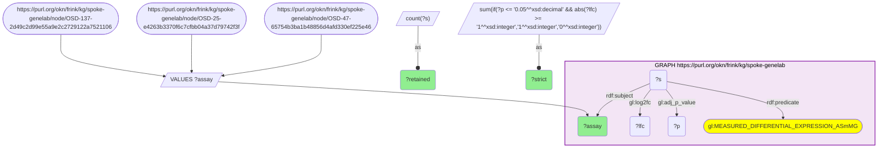

_3 row(s)_

#### Query 2

_2026-09-08T01:16:29+00:00 · `spoke-genelab`_

```sparql
PREFIX gl:<https://purl.org/okn/frink/kg/spoke-genelab/schema/> PREFIX rdf:<http://www.w3.org/1999/02/22-rdf-syntax-ns#> SELECT ?gene ?symbol ?lfc ?p ?mean1 ?mean2 ?sd1 ?sd2 WHERE { GRAPH <https://purl.org/okn/frink/kg/spoke-genelab> { ?s rdf:subject <https://purl.org/okn/frink/kg/spoke-genelab/node/OSD-137-2d49c2d99e55a9e2c2729122a7521106>; rdf:predicate gl:MEASURED_DIFFERENTIAL_EXPRESSION_ASmMG; rdf:object ?gene; gl:log2fc ?lfc; gl:adj_p_value ?p. OPTIONAL{?gene gl:symbol ?symbol} OPTIONAL{?s gl:group_mean_1 ?mean1;gl:group_mean_2 ?mean2;gl:group_stdev_1 ?sd1;gl:group_stdev_2 ?sd2} } }
```

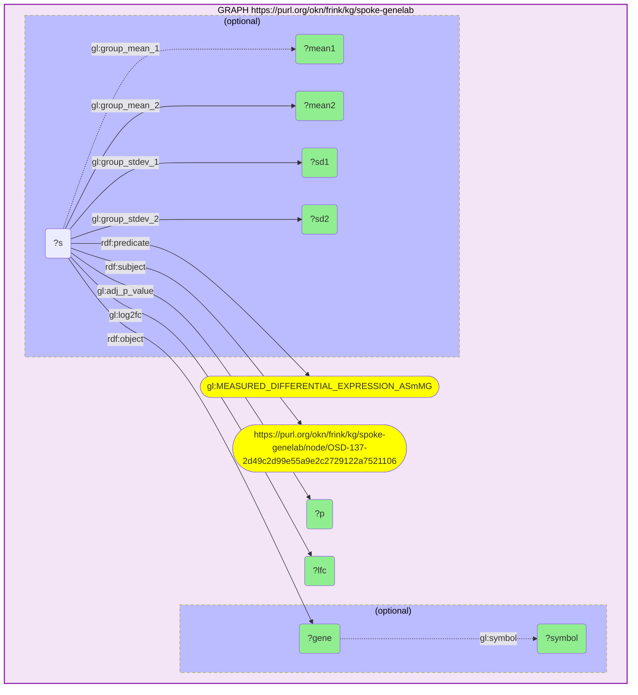

_4 row(s)_

#### Query 3

_2026-09-08T01:16:52+00:00 · `spoke-genelab`_

```sparql
PREFIX gl:<https://purl.org/okn/frink/kg/spoke-genelab/schema/> PREFIX rdf:<http://www.w3.org/1999/02/22-rdf-syntax-ns#> SELECT ?gene ?symbol ?lfc ?p ?mean1 ?mean2 ?sd1 ?sd2 WHERE { GRAPH <https://purl.org/okn/frink/kg/spoke-genelab> { ?s rdf:subject <https://purl.org/okn/frink/kg/spoke-genelab/node/OSD-25-e4263b3370f6c7cfbb04a37d79742f3f>; rdf:predicate gl:MEASURED_DIFFERENTIAL_EXPRESSION_ASmMG; rdf:object ?gene; gl:log2fc ?lfc; gl:adj_p_value ?p. OPTIONAL{?gene gl:symbol ?symbol} OPTIONAL{?s gl:group_mean_1 ?mean1;gl:group_mean_2 ?mean2;gl:group_stdev_1 ?sd1;gl:group_stdev_2 ?sd2} } }
```

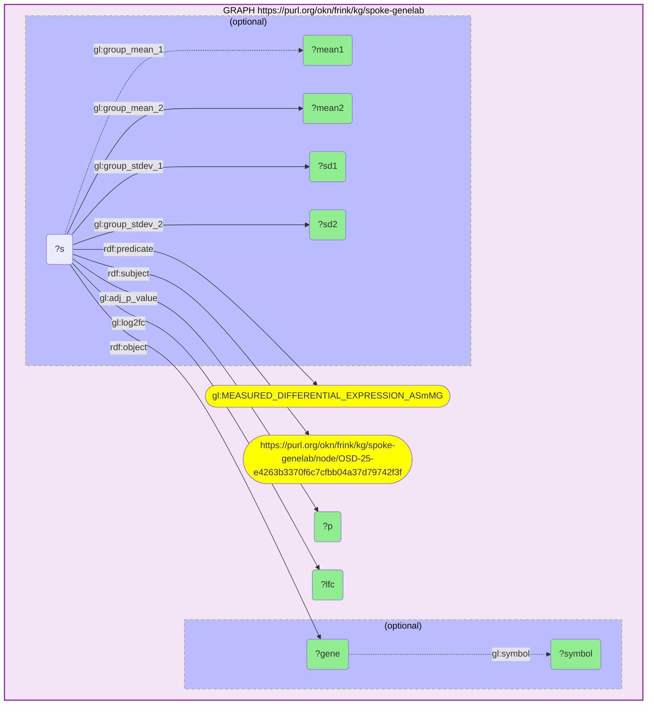

_4617 row(s)_

#### Query 4

_2026-09-08T01:16:58+00:00 · `spoke-genelab`_

```sparql
PREFIX gl:<https://purl.org/okn/frink/kg/spoke-genelab/schema/> PREFIX rdf:<http://www.w3.org/1999/02/22-rdf-syntax-ns#> SELECT ?gene ?symbol ?lfc ?p ?mean1 ?mean2 ?sd1 ?sd2 WHERE { GRAPH <https://purl.org/okn/frink/kg/spoke-genelab> { ?s rdf:subject <https://purl.org/okn/frink/kg/spoke-genelab/node/OSD-47-65754b3ba1b48856d4afd330ef225e46>; rdf:predicate gl:MEASURED_DIFFERENTIAL_EXPRESSION_ASmMG; rdf:object ?gene; gl:log2fc ?lfc; gl:adj_p_value ?p. OPTIONAL{?gene gl:symbol ?symbol} OPTIONAL{?s gl:group_mean_1 ?mean1;gl:group_mean_2 ?mean2;gl:group_stdev_1 ?sd1;gl:group_stdev_2 ?sd2} } }
```


_68 row(s)_

#### Query 5

_2026-09-08T01:17:02+00:00 · `spoke-genelab`_

```sparql
PREFIX gl:<https://purl.org/okn/frink/kg/spoke-genelab/schema/> PREFIX rdf:<http://www.w3.org/1999/02/22-rdf-syntax-ns#> SELECT DISTINCT ?gene ?human WHERE {GRAPH <https://purl.org/okn/frink/kg/spoke-genelab> {VALUES ?assay {<https://purl.org/okn/frink/kg/spoke-genelab/node/OSD-137-2d49c2d99e55a9e2c2729122a7521106> <https://purl.org/okn/frink/kg/spoke-genelab/node/OSD-25-e4263b3370f6c7cfbb04a37d79742f3f> <https://purl.org/okn/frink/kg/spoke-genelab/node/OSD-47-65754b3ba1b48856d4afd330ef225e46>} ?s rdf:subject ?assay; rdf:predicate gl:MEASURED_DIFFERENTIAL_EXPRESSION_ASmMG; rdf:object ?gene. ?gene gl:IS_ORTHOLOG_MGiG ?human.}}
```

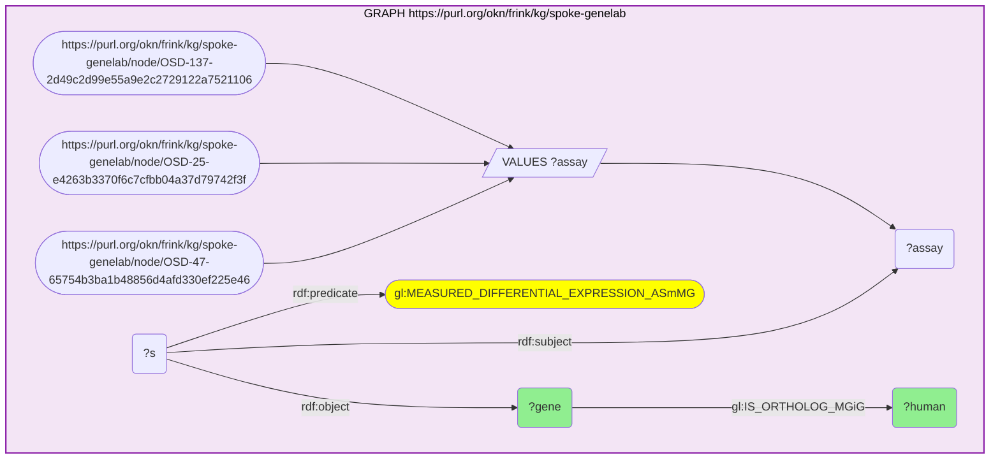

_4846 row(s)_

#### Query 6

_2026-09-08T01:17:44+00:00 · `spoke-genelab`, `wikidata`, `prokn`_

```sparql
PREFIX gl:<https://purl.org/okn/frink/kg/spoke-genelab/schema/> PREFIX rdf:<http://www.w3.org/1999/02/22-rdf-syntax-ns#> SELECT DISTINCT ?human ?g2 ?protein WHERE { {SELECT DISTINCT ?human WHERE {GRAPH <https://purl.org/okn/frink/kg/spoke-genelab> {VALUES ?assay {<https://purl.org/okn/frink/kg/spoke-genelab/node/OSD-137-2d49c2d99e55a9e2c2729122a7521106> <https://purl.org/okn/frink/kg/spoke-genelab/node/OSD-25-e4263b3370f6c7cfbb04a37d79742f3f> <https://purl.org/okn/frink/kg/spoke-genelab/node/OSD-47-65754b3ba1b48856d4afd330ef225e46>} ?s rdf:subject ?assay; rdf:predicate gl:MEASURED_DIFFERENTIAL_EXPRESSION_ASmMG; rdf:object ?gene. ?gene gl:IS_ORTHOLOG_MGiG ?human.}}} BIND(REPLACE(STR(?human),'^.*/gene/','') AS ?entrez) GRAPH <https://purl.org/okn/frink/kg/wikidata> {?item <http://www.wikidata.org/prop/direct/P351> ?entrez; <http://www.wikidata.org/prop/direct/P594> ?key} BIND(IRI(CONCAT('https://www.ensembl.org/id/',?key)) AS ?g2) GRAPH <https://purl.org/okn/frink/kg/prokn>{?g2 <http://semanticscience.org/resource/SIO_010078> ?protein}}
```

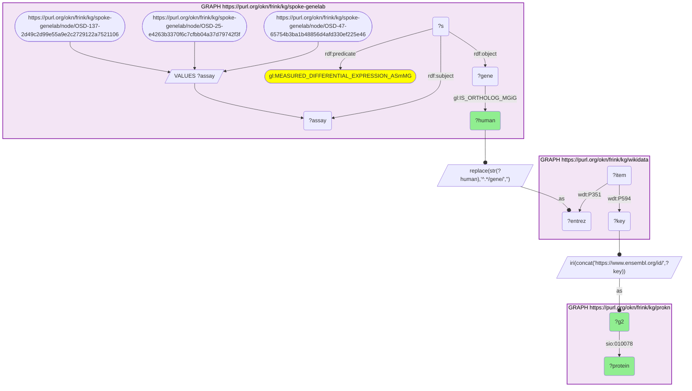

_2271 row(s)_

#### Query 7

_2026-09-08T01:18:25+00:00 · `spoke-genelab`, `wikidata`, `prokn`_

```sparql
PREFIX gl:<https://purl.org/okn/frink/kg/spoke-genelab/schema/> PREFIX rdf:<http://www.w3.org/1999/02/22-rdf-syntax-ns#> SELECT DISTINCT ?human ?g2 ?protein WHERE { {SELECT DISTINCT ?human WHERE {GRAPH <https://purl.org/okn/frink/kg/spoke-genelab> {VALUES ?assay {<https://purl.org/okn/frink/kg/spoke-genelab/node/OSD-137-2d49c2d99e55a9e2c2729122a7521106> <https://purl.org/okn/frink/kg/spoke-genelab/node/OSD-25-e4263b3370f6c7cfbb04a37d79742f3f> <https://purl.org/okn/frink/kg/spoke-genelab/node/OSD-47-65754b3ba1b48856d4afd330ef225e46>} ?s rdf:subject ?assay; rdf:predicate gl:MEASURED_DIFFERENTIAL_EXPRESSION_ASmMG; rdf:object ?gene. ?gene gl:IS_ORTHOLOG_MGiG ?human.}}} BIND(REPLACE(STR(?human),'^.*/gene/','') AS ?entrez) GRAPH <https://purl.org/okn/frink/kg/wikidata> {?item <http://www.wikidata.org/prop/direct/P351> ?entrez; <http://www.wikidata.org/prop/direct/P354> ?key} BIND(IRI(CONCAT('http://identifiers.org/hgnc/',?key)) AS ?g2) GRAPH <https://purl.org/okn/frink/kg/prokn>{?g2 <http://semanticscience.org/resource/SIO_010078> ?protein}}
```

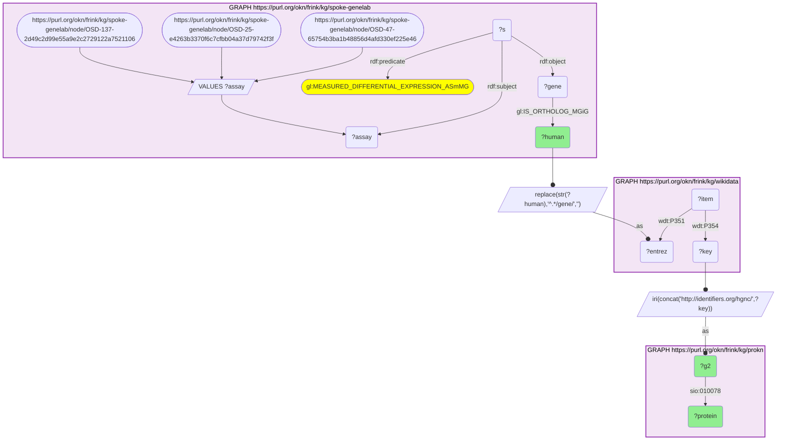

_46 row(s)_

#### Query 8

_2026-09-08T01:18:33+00:00 · `prokn`_

```sparql
SELECT DISTINCT ?g2 ?symbol ?term ?label WHERE { GRAPH <https://purl.org/okn/frink/kg/prokn> {?g2 <http://semanticscience.org/resource/SIO_010078> ?protein. ?protein <http://purl.obolibrary.org/obo/RO_0002331> ?term.  OPTIONAL{?g2 <http://www.w3.org/2000/01/rdf-schema#label> ?symbol} OPTIONAL{?term <http://www.w3.org/2000/01/rdf-schema#label> ?label} } }
```

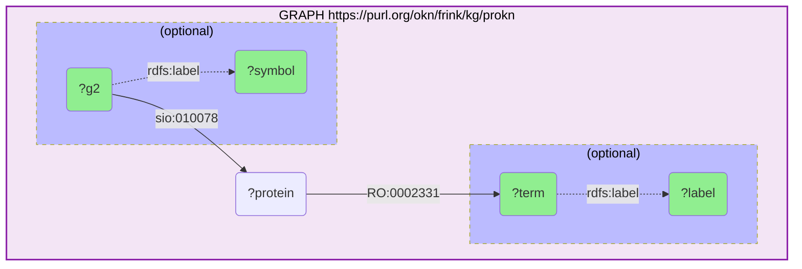

_71913 row(s)_

#### Query 9

_2026-09-08T01:18:40+00:00 · `prokn`_

```sparql
SELECT DISTINCT ?g2 ?symbol ?term ?label WHERE { GRAPH <https://purl.org/okn/frink/kg/prokn> {?g2 <http://semanticscience.org/resource/SIO_010078> ?protein. ?protein <http://purl.obolibrary.org/obo/RO_0000056> ?term. FILTER(CONTAINS(STR(?term),'R-HSA')) OPTIONAL{?g2 <http://www.w3.org/2000/01/rdf-schema#label> ?symbol} OPTIONAL{?term <http://www.w3.org/2000/01/rdf-schema#label> ?label} } }
```

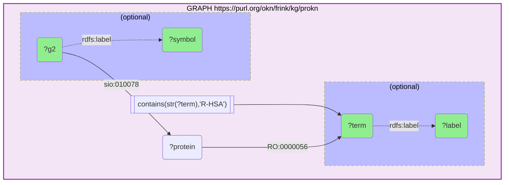

_30015 row(s)_

#### Query 10

_2026-09-08T01:20:57+00:00 · `rdkg`_

```sparql
PREFIX b:<https://w3id.org/biolink/vocab/> PREFIX rdfs:<http://www.w3.org/2000/01/rdf-schema#> SELECT DISTINCT ?gene ?disease ?label ?relation WHERE {GRAPH <https://purl.org/okn/frink/kg/rdkg>{?gene a b:Gene. ?disease a b:Disease; ?relation ?gene. VALUES ?relation {b:related_to b:genetic_association b:gene_associated_with_condition b:contributes_to} OPTIONAL{?disease rdfs:label ?label}}}
```

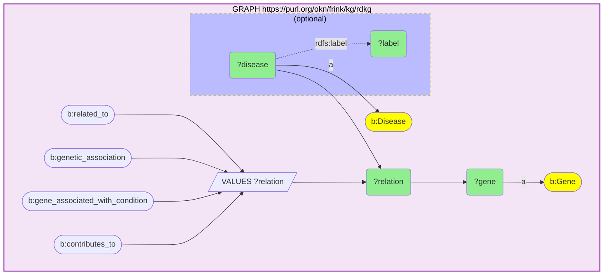

_81011 row(s)_

#### Query 11

_2026-09-08T01:21:03+00:00 · `digcfdekg`_

```sparql
SELECT DISTINCT ?gene WHERE {GRAPH <https://purl.org/okn/frink/kg/digcfdekg>{?gene <https://purl.org/okn/frink/kg/digcfdekg/schema/geneToTrait> ?t}}
```

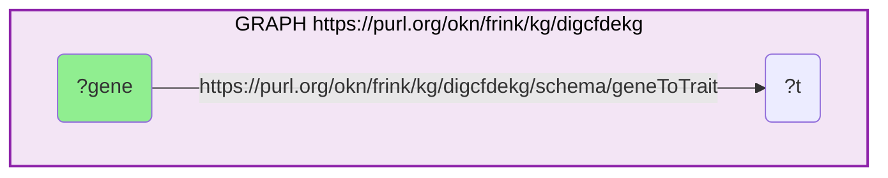

_21710 row(s)_

#### Query 12

_2026-09-08T01:21:09+00:00 · `digcfdekg`_

```sparql
SELECT DISTINCT ?gene ?trait ?label WHERE {GRAPH <https://purl.org/okn/frink/kg/digcfdekg>{?trait <http://www.w3.org/2000/01/rdf-schema#label> ?label. VALUES ?label {"non-alcoholic fatty liver disease" "triglyceride measurement" "LDL cholesterol" "HDL cholesterol"} ?gene <https://purl.org/okn/frink/kg/digcfdekg/schema/geneToTrait> ?trait}}
```

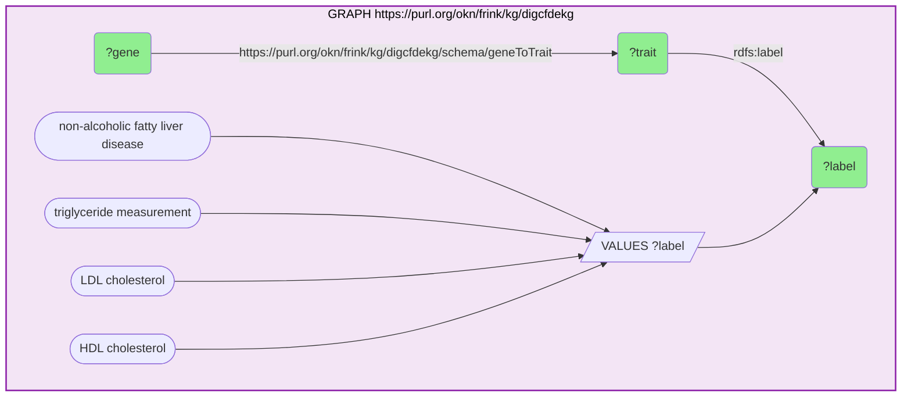

_3281 row(s)_

#### Query 13

_2026-09-08T01:21:15+00:00 · `spoke-genelab`_

```sparql
PREFIX gl:<https://purl.org/okn/frink/kg/spoke-genelab/schema/> SELECT DISTINCT ?study ?title ?assay ?p ?v WHERE { GRAPH <https://purl.org/okn/frink/kg/spoke-genelab> { ?study gl:project_title ?title; gl:PERFORMED_SpAS ?assay. FILTER(REGEX(STR(?study), "OSD-(25|47|48|137|168)$")) ?assay ?p ?v. FILTER(?p IN (gl:factor_space_1,gl:factor_space_2,gl:factors_1,gl:factors_2,gl:measurement,gl:technology)) } }
```

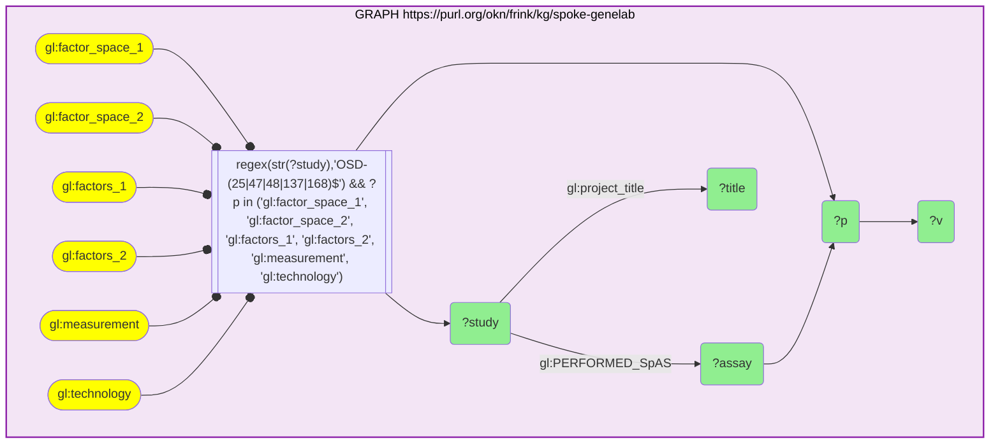

_1458 row(s)_

#### Query 14

_2026-09-08T01:21:46+00:00 · `wikidata`_

```sparql
SELECT DISTINCT ?entrez ?key WHERE {GRAPH <https://purl.org/okn/frink/kg/wikidata>{?item <http://www.wikidata.org/prop/direct/P351> ?entrez; <http://www.wikidata.org/prop/direct/P594> ?key}}
```


_156397 row(s)_

#### Query 15

_2026-09-08T01:22:03+00:00 · `wikidata`_

```sparql
SELECT DISTINCT ?entrez ?key WHERE {GRAPH <https://purl.org/okn/frink/kg/wikidata>{?item <http://www.wikidata.org/prop/direct/P351> ?entrez; <http://www.wikidata.org/prop/direct/P354> ?key}}
```

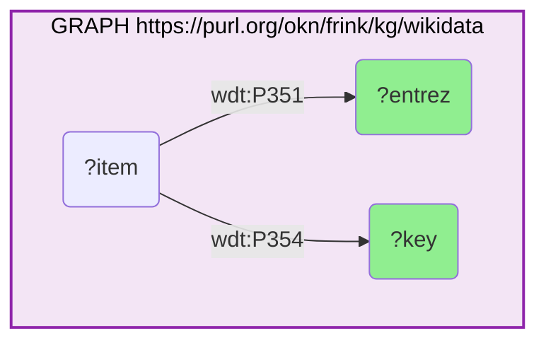

_43560 row(s)_

#### Query 16

_2026-09-08T01:23:08+00:00 · `spoke-genelab`, `rdkg`_

```sparql
PREFIX gl:<https://purl.org/okn/frink/kg/spoke-genelab/schema/> PREFIX rdf:<http://www.w3.org/1999/02/22-rdf-syntax-ns#> SELECT DISTINCT ?human ?disease ?label WHERE { GRAPH <https://purl.org/okn/frink/kg/spoke-genelab> {VALUES ?assay {<https://purl.org/okn/frink/kg/spoke-genelab/node/OSD-137-2d49c2d99e55a9e2c2729122a7521106> <https://purl.org/okn/frink/kg/spoke-genelab/node/OSD-25-e4263b3370f6c7cfbb04a37d79742f3f> <https://purl.org/okn/frink/kg/spoke-genelab/node/OSD-47-65754b3ba1b48856d4afd330ef225e46>} ?s rdf:subject ?assay; rdf:predicate gl:MEASURED_DIFFERENTIAL_EXPRESSION_ASmMG; rdf:object ?gene; gl:adj_p_value ?p;gl:log2fc ?lfc. FILTER(?p<=0.05 && ABS(?lfc)>=1) ?gene gl:IS_ORTHOLOG_MGiG ?human.} BIND(IRI(CONCAT('http://identifiers.org/ncbigene/',REPLACE(STR(?human),'^.*/gene/',''))) AS ?r) GRAPH <https://purl.org/okn/frink/kg/rdkg>{?disease a <https://w3id.org/biolink/vocab/Disease>; <https://w3id.org/biolink/vocab/related_to> ?r; <http://www.w3.org/2000/01/rdf-schema#label> ?label}}
```

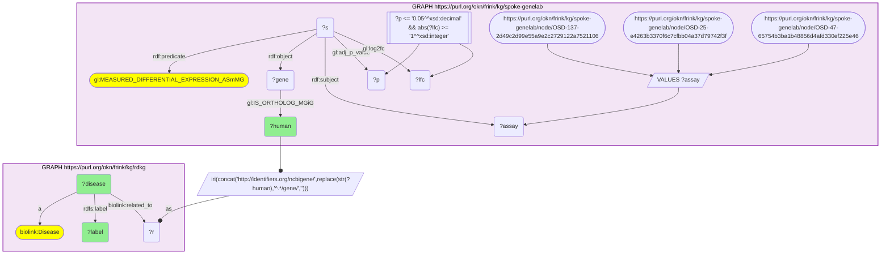

_755 row(s)_

#### Query 17

_2026-09-08T01:23:13+00:00 · `spoke-genelab`, `digcfdekg`_

```sparql
PREFIX gl:<https://purl.org/okn/frink/kg/spoke-genelab/schema/> PREFIX rdf:<http://www.w3.org/1999/02/22-rdf-syntax-ns#> SELECT DISTINCT ?human ?trait ?label WHERE { GRAPH <https://purl.org/okn/frink/kg/spoke-genelab> {VALUES ?assay {<https://purl.org/okn/frink/kg/spoke-genelab/node/OSD-137-2d49c2d99e55a9e2c2729122a7521106> <https://purl.org/okn/frink/kg/spoke-genelab/node/OSD-25-e4263b3370f6c7cfbb04a37d79742f3f> <https://purl.org/okn/frink/kg/spoke-genelab/node/OSD-47-65754b3ba1b48856d4afd330ef225e46>} ?s rdf:subject ?assay; rdf:predicate gl:MEASURED_DIFFERENTIAL_EXPRESSION_ASmMG; rdf:object ?gene; gl:adj_p_value ?p;gl:log2fc ?lfc. FILTER(?p<=0.05 && ABS(?lfc)>=1) ?gene gl:IS_ORTHOLOG_MGiG ?human.} GRAPH <https://purl.org/okn/frink/kg/digcfdekg>{?human <https://purl.org/okn/frink/kg/digcfdekg/schema/geneToTrait> ?trait. ?trait <http://www.w3.org/2000/01/rdf-schema#label> ?label. VALUES ?label {"non-alcoholic fatty liver disease" "triglyceride measurement" "LDL cholesterol" "HDL cholesterol"}}}
```

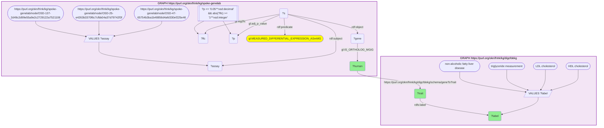

_77 row(s)_
