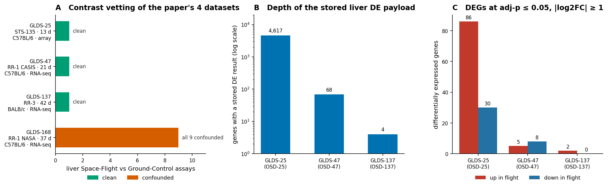
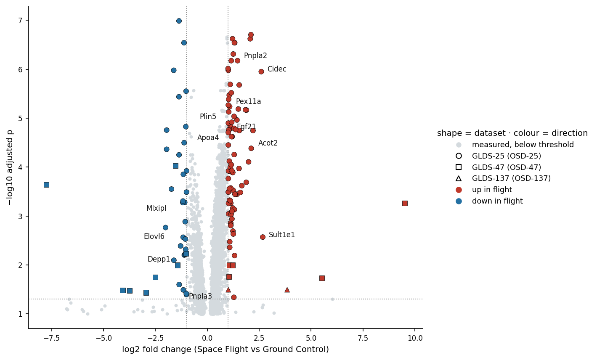
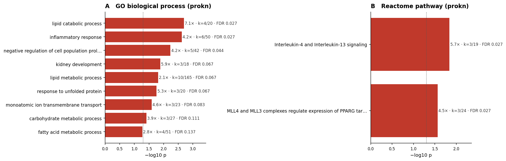
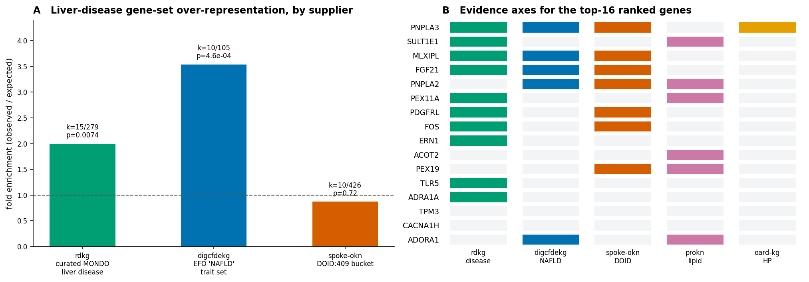
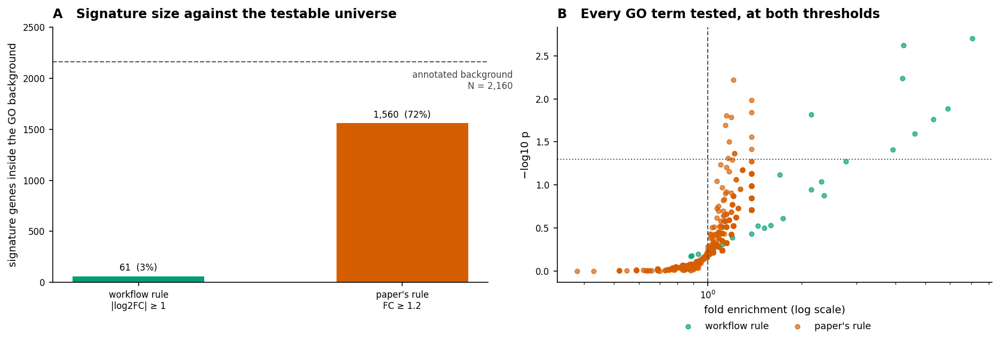
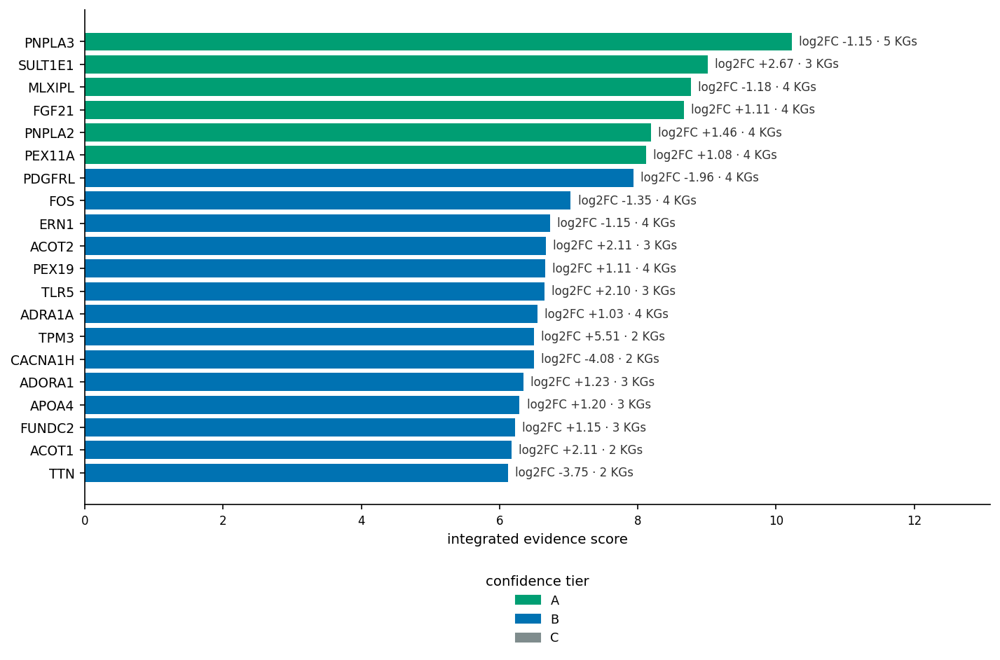

# Spaceflight liver lipid dysregulation, reproduced from the OKN federation
### A knowledge-graph reproduction of Beheshti et al. 2019 using spoke-genelab assays, augmented with cross-KG NAFLD evidence

**Date:** 2026-09-07 · **Endpoint:** OKN federated SPARQL · **Model:** claude-opus-5

> **Framing (non-negotiable).** Unit of analysis is the **gene**, measured as a stored
> differential-expression result for one vetted Space-Flight-vs-Ground-Control **liver assay** in
> spoke-genelab, projected to human orthologs and annotated across six further federation graphs.
> Coverage is the three of the original paper's four GeneLab liver datasets that survive contrast
> vetting. This is **hypothesis generation from secondary, summary-level data — not a re-analysis of
> the raw sequencing, and not causal or clinical inference**. Mouse-to-human claims are
> *ortholog-inferred*; disease and phenotype links are *observational associations*. Keep both
> caveats attached to every downstream claim.

**Abbreviations.** ORA = over-representation analysis · GSEA = gene set enrichment analysis ·
DEG = differentially expressed gene · FDR = false-discovery rate (Benjamini–Hochberg) ·
log2FC = log2 fold change · FC = fold change · GO = Gene Ontology · BP = biological process ·
NAFLD = non-alcoholic fatty liver disease · MASLD/MASH = metabolic dysfunction-associated steatotic
liver disease / steatohepatitis · HP = Human Phenotype Ontology · MONDO = Mondo Disease Ontology ·
DOID = Disease Ontology · EFO = Experimental Factor Ontology · UBERON = Uber-anatomy ontology ·
OSD/GLDS = NASA Open Science Data Repository / GeneLab Data System accession · RR = Rodent Research ·
STS = Space Transportation System (Shuttle) · CASIS = Center for the Advancement of Science in Space ·
IPA = Ingenuity Pathway Analysis · KG = knowledge graph · PPAR = peroxisome proliferator-activated
receptor.

## 1. Executive summary

The original study's central claim — that spaceflight alone, without the confound of live return to
Earth, drives **lipid dysregulation in mouse liver** — **reproduces** from the OKN federation, but
from a narrower and differently-shaped slice of evidence than the paper used. Of the paper's four
GeneLab liver datasets, **3 of 4** are present in spoke-genelab
as contrast-vetted Space-Flight-vs-Ground-Control assays. The fourth, **GLDS-168 (RR-1 NASA)**, is
excluded: all **9** of its liver flight-vs-ground assays fail the
within-assay comparability rule because the dataset pools two missions (SpaceX-4 / RR-1 and
SpaceX-8 / RR-3) and two library preparations, so its flight and ground arms differ in covariates
the contrast is supposed to hold fixed.

Across the 3 vetted assays, **4678** genes carry a stored liver DE
result and **130** pass adj-p ≤ 0.05 with |log2FC| ≥ 1 (93 up in flight,
38 down), collapsing to **124** human orthologs. Against an explicit
prokn-annotated background of **2160** genes, the single most enriched GO biological process is
**lipid catabolic process** (7.08×, k = 4/20, FDR =
0.027); the only Reactome pathway to survive FDR correction alongside it is **"MLL4 and
MLL3 complexes regulate expression of PPARG target genes in adipogenesis and hepatic steatosis"**
(4.48×, FDR = 0.027) — an independent, ontology-level hit on the paper's PPAR and
steatosis argument. The flight-responsive gene core is significantly over-represented for curated
liver-disease genes (rdkg, 2.0×, p = 0.0074) and, more sharply, for the GWAS-scale
**NAFLD** trait set in digcfdekg (3.54×, k = 10/105, FDR =
0.0074).

The genes carrying that signal are the ones a hepatologist would name: **PNPLA3** — the strongest
common human genetic risk factor for fatty liver disease and the only gene in the core reaching a
**hepatic steatosis** phenotype (HP:0001397) through the graph — plus **PNPLA2/ATGL**, **CIDEC**,
**FGF21**, **MLXIPL/ChREBP**, **PLIN5**, **APOA4**, **ACOT1/ACOT2**, **GPAT3**, **ELOVL3/ELOVL6**
and the peroxisome-biogenesis set **PEX3/PEX11A/PEX19**. None of these is named in the original
paper. Ranking on recurrence, effect size and cross-KG disease support tiers **6** genes A,
**22** B and **96** C.

What this adds is two things the original could not show. First, an **independent ontology-level
confirmation** of the lipid and PPAR claims, reached from curated human disease and pathway graphs
rather than from the same expression data that generated the hypothesis. Second, a **methodological
finding about the original**: the paper's own selection rule (FC ≥ 1.2) admits
**1560** of the 2160 testable genes — 72% of the universe — at which point
over-representation is arithmetically incapable of detecting anything (0 terms at
FDR ≤ 0.05). The paper's rank-based GSEA was immune to this; a knowledge-graph reproduction is not,
and needs the stricter cut. The lipid signal survives it.

## 2. Sources used

| KG | Version | Updated | Role in this study | Join key / confidence |
|---|---|---|---|---|
| `spoke-genelab` | v0.0.2 | 2026-03-13 | Source of every liver differential-expression value; assay/study/mission metadata; mouse→human ortholog map | Assay IRI (intra-KG); genes are Entrez node IRIs — high |
| `prokn` | v0.0.5 | 2026-06-23 | GO biological-process and Reactome pathway annotation for the enrichment background and signature | Human gene **symbol** on `rdfs:label` (exact label match) — medium |
| `rdkg` | v0.0.1 | 2026-05-04 | Curated MONDO liver-disease → gene layer (the discriminating gene-set test); disease → HP phenotype edge | Entrez (`identifiers.org/ncbigene/`) and MONDO node IRIs — high |
| `digcfdekg` | v0.0.1 | 2026-06-21 | GWAS/PIGEAN-scale gene→trait sets for 19 liver traits, incl. the EFO NAFLD set (the broad comparator) | Entrez node IRI, identical form to spoke-genelab — high |
| `spoke-okn` | v0.0.6 | 2026-03-16 | Curated DOID disease→gene layer (`ASSOCIATES_DaG`), used as a third, independent disease supplier | Entrez node IRI, no rewrite needed — high |
| `oard-kg` | v0.0.3 | 2026-06-05 | EHR-derived disease→phenotype (HP) profiles for the liver-disease category | MONDO, reified — both `biolink:subject` and `biolink:object` positions UNIONed — medium |
| `ubergraph` | v0.0.2 | 2026-05-01 | Bridge graph: `rdfs:subClassOf*` closure expanding the MONDO `liver disease` (MONDO:0005154) and DOID `liver disease` (DOID:409) categories | Ontology IRI — high |

All 7 graphs were queried directly; 12 non-exploratory SPARQL queries back
every number in this report and appear verbatim in the reproducibility record.

## 3. Design & rules

**What was reproduced, and why only part.** The original analysed four GeneLab liver datasets:
GLDS-25 (STS-135 Shuttle, 13 days, C57BL/6, microarray), GLDS-47 (RR-1 CASIS, 21 days, C57BL/6,
RNA-seq), GLDS-168 (RR-1 NASA, 37 days, C57BL/6, RNA-seq) and GLDS-137 (RR-3, 42 days, BALB/c,
RNA-seq). All four exist in spoke-genelab as OSD studies with liver assays, but a spaceflight
contrast is only readable when its two arms differ in nothing but the condition. Applying the
graph's contrast rules to liver (UBERON:0002107) returns **13 clean** and
**20 confounded** Space-Flight-vs-Ground-Control assays across all
studies. Three of the paper's four datasets contribute a clean assay; GLDS-168 contributes none,
because every one of its 9 liver flight-vs-ground assays pairs arms
across missions or spike-in protocols. That is not a defect in the graph: GLDS-168 is itself a
combined RR-1 + RR-3 dataset, which the original paper acknowledges when it reports separate DEG
counts "for the RR1 and RR3 data from the GLDS-168".

**Selection rule.** A gene is called differentially expressed when **adj-p ≤ 0.05 and |log2FC| ≥ 1**
in a vetted assay, with group 1 = Space Flight and group 2 = Ground Control so a positive log2FC
means up in flight. The original used a more permissive **FC ≥ 1.2** cut; §6.3 runs both and
explains why the permissive cut cannot support over-representation analysis. Human orthologs come
from spoke-genelab's own ortholog edge, collapsed one-row-per-human-gene by maximum |log2FC| with a
mean-rule sensitivity check (no sign flips; 2 of 124 genes are many-to-one).

**Joins.** Every cross-graph step runs on a shared identifier, never on a study accession — OSD/GLDS
numbers are a federation island. Genes travel on Entrez node IRIs (identical between spoke-genelab,
digcfdekg and spoke-okn; `identifiers.org` form in rdkg), on human gene **symbol** into prokn, and
diseases travel on MONDO and DOID through ubergraph's subclass closure. The exact predicates,
backgrounds and scoring formula are in the reproducibility record.

> ***Figure 1.*** **The reproducible slice of Beheshti et al. 2019.** **(A)** Contrast vetting of the
> paper's four GeneLab liver datasets in spoke-genelab; bar length is the number of liver
> Space-Flight-vs-Ground-Control assays, coloured by whether the two arms match on every covariate.
> **(B)** Depth of the stored liver DE payload per vetted assay, log scale — spoke-genelab stores a
> filtered subset of each dataset's results, not the full transcriptome. **(C)** Genes passing
> adj-p ≤ 0.05 and |log2FC| ≥ 1, split by direction. Provenance: spoke-genelab
> `INVESTIGATED_ASiA`, `factor_space_1/2`, `factors_1/2`, `material_id_1/2`, and the reified
> `MEASURED_DIFFERENTIAL_EXPRESSION_ASmMG` edge properties.

The reproducible slice is dominated by one dataset. GLDS-25 contributes 4617 of the
4689 stored DE rows and 116 of the 130 DEGs; GLDS-47 contributes
68 rows and 13 DEGs; GLDS-137 contributes 4 rows and
2. This inverts the paper's design: its argument rested on the ISS datasets precisely
because the Shuttle animals were returned live, and the ISS arms are the ones the graph carries
thinly.

| Dataset | Mission | Strain | Duration | Platform | spoke-genelab study | Clean liver contrast | Stored DE rows | DEGs |
|---|---|---|---|---|---|---|---|---|
| GLDS-25 | STS-135 | C57BL/6 | 13 d | DNA microarray | OSD-25 | yes | 4617 | 116 |
| GLDS-47 | RR-1 CASIS (SpaceX-4) | C57BL/6 | 21 d | RNA-seq | OSD-47 | yes | 68 | 13 |
| GLDS-137 | RR-3 (SpaceX-8) | BALB/c | 42 d | RNA-seq | OSD-137 | yes | 4 | 2 |
| GLDS-168 | RR-1 + RR-3 pooled | C57BL/6 | 37 d | RNA-seq | OSD-168 | **no — all 9 confounded** | — (excluded) | — |

## 4. Confidence tiers

Genes are scored on six evidence axes — recurrence across vetted assays, effect size, curated
MONDO liver-disease membership (rdkg), NAFLD trait-set membership (digcfdekg), lipid GO/Reactome
membership (prokn), and reaching an HP phenotype profile — plus a bonus for the number of
corroborating graphs. The exact weights are in the reproducibility record.

| Tier | Requirement | n | Interpretation |
|---|---|---|---|
| **A** | Score ≥ 8: a strong effect plus curated liver-disease *and* lipid-pathway or NAFLD-trait corroboration from at least three graphs | 6 | Prioritise for targeted follow-up |
| **B** | Score 5–8: a clear effect with corroboration from two or three graphs, or cross-dataset recurrence | 22 | Worth carrying forward; single-line evidence |
| **C** | Score < 5: a threshold-passing effect with little or no cross-KG disease context | 96 | Descriptive only |

## 5. Findings by axis

### 5.1 Primary signal — direction and magnitude of the flight response

Of the 130 mouse DEGs, 93 are up in flight and 38 down, a 2.4:1
up-skew consistent with the original's report that "the majority of pathways being regulated in the
liver are upregulated". The largest-magnitude changes in the ISS arm (GLDS-47) are structural and
calcium-handling genes (*Tpm3-rs7*, *Cacna1h*, *Ttn*, *Cacna1c*) rather than lipid genes; the lipid
signal sits almost entirely in the deeper GLDS-25 payload.

> ***Figure 2.*** **Effect landscape across the three vetted liver assays.** Every gene with a stored DE
> result is plotted; marker shape encodes the dataset and fill colour the direction of change in
> flight. Dotted lines mark the selection thresholds (|log2FC| = 1, adj-p = 0.05). Labelled points
> are the lipid- and NAFLD-relevant genes discussed in §6. Provenance: spoke-genelab reified
> `MEASURED_DIFFERENTIAL_EXPRESSION_ASmMG` statements (`schema:log2fc`, `schema:adj_p_value`).

The lipid genes cluster tightly on the up-in-flight side at high significance — *Pnpla2*, *Cidec*,
*Pex11a*, *Plin5*, *Apoa4*, *Acot2*, *Sult1e1* all sit above −log10 p ≈ 4 — while the two strongest
NAFLD *risk* genes, *Pnpla3* and *Mlxipl*, move down. That split (lipid-droplet and
fatty-acid-handling machinery up, lipogenic/risk transcription factors down) is the shape of a
lipid-overload response rather than a lipogenic drive.

### 5.2 Internal replication across datasets

Cross-dataset recurrence is the weakest axis in this reproduction. Exactly **1**
gene, **DEPP1** (mouse *Depp1*), passes threshold in two independent vetted assays — down in flight
in both GLDS-25 (log2FC −1.73) and GLDS-47 (log2FC −1.02). Given that GLDS-137 stores only
4 genes and GLDS-47 only 68, the intersection available for
replication is arithmetically tiny, so the low recurrence measures the graph's payload depth, not
the biology. Every other cross-dataset statement in this report therefore rests on shared *pathway*
or *disease* membership, not on shared genes.

## 6. Domain analyses

**Enrichment families run and skipped.** **GO biological process — RUN** (§6.1).
**Reactome pathway — RUN** (§6.1); the two are separate families and both were executed.
**Disease / trait gene-set — RUN**, in both flavours the method requires: curated (rdkg) and broad
GWAS-scale (digcfdekg), §6.2. **Phenotype (HP) — RUN**, §6.2. **Drug / target linkage — SKIPPED
by scope decision**: this reproduction was scoped to NAFLD/liver-disease evidence, and the original
paper makes no therapeutic claim to reproduce. **Chemical / adverse-outcome (biobricks-aopwiki,
biobricks tox) — SKIPPED**: there is no exposure or toxicant in the question. **Microbiome / taxon
alignment — SKIPPED**: spoke-genelab's microbial-abundance layer carries no liver assay in the
paper-matched studies. **Place-based / geospatial linkage — SKIPPED**: the unit of analysis is a
mouse liver assay, which has no geography.

Suppliers considered and not used, with reasons: `biomarkerkg` (joins on only 191 Entrez genes —
too sparse to test), `pankgraph` (pancreatic-cancer disease payload, GO not joinable on Entrez),
`biobricks-mesh`, `biohealth`, `nde`, `nestkg`, `gene-expression-atlas-okn` and `ncipidkg` (carry
disease/pathway payloads but do not join on Entrez, and add no liver-specific evidence the three
used disease suppliers lack).

### 6.1 Functional enrichment — GO and Reactome

Both families were tested with a hypergeometric test and Benjamini–Hochberg FDR against an
**explicit** background: the genes measured in the three vetted assays that prokn actually
annotates (2160 for GO, 1720 for Reactome), never an implicit whole-genome universe.

> ***Figure 3.*** **Over-representation in the flight-responsive gene core.** **(A)** GO biological
> process, top nine terms by p; **(B)** Reactome, both terms that met the k ≥ 3 floor. Bars are
> −log10 p, the dotted line marks p = 0.05, and each annotation gives fold enrichment, the
> observed/set-size counts and the BH FDR. Provenance: prokn `SIO_010078` (gene→protein),
> `RO_0002331` (protein→GO BP) and `RO_0000056` (protein→Reactome), joined to spoke-genelab human
> orthologs on gene symbol.

**Lipid catabolic process** is the top GO term (7.08×, FDR = 0.027), driven by
*ADORA1, APOA4, NCEH1, PNPLA2*; **lipid metabolic process** (2.15×, k = 10/165) and **fatty acid
metabolic process** (2.78×) follow at nominal significance. Relaxing the k floor to 2 as a
sensitivity check surfaces a coherent set of finer lipid terms — *positive regulation of
triglyceride catabolic process*, *peroxisome fission*, *fatty acid elongation (saturated and
monounsaturated)*, and in Reactome *Synthesis of very long-chain fatty acyl-CoAs* and *Activation
of gene expression by SREBF (SREBP)*. On the Reactome side, only two pathways cleared the floor at
all, and one of them names the phenotype directly: **MLL4/MLL3 complexes regulate PPARG target
genes in adipogenesis and hepatic steatosis** (4.48×, FDR = 0.027; *PEX11A, PNPLA2,
TBL1XR1*). **Inflammatory response** (4.25×, FDR = 0.027; *ADORA1, BCL6, FOS, NR4A1, TLR5, VNN1*)
is the one strong non-lipid theme, consistent with the "second hit" the original invokes for NASH
progression.

### 6.2 Liver-disease, trait and phenotype linkage

The federation supplies three independent disease→gene layers joinable on Entrez, and the method
requires testing both a **curated** and a **broad** set rather than picking one.

> ***Figure 4.*** **Liver-disease evidence for the flight-responsive core.** **(A)** Over-representation
> of three independently-sourced liver gene sets in the 124-gene core, each against the
> same 4604-gene measured background; the dashed line is no enrichment. **(B)** Which
> graphs corroborate each of the top-16 ranked genes; a filled cell means that graph carries the
> evidence. Provenance: rdkg `biolink:related_to` under ubergraph's MONDO:0005154 closure;
> digcfdekg reified `geneToTrait`; spoke-okn `ASSOCIATES_DaG` under the DOID:409 closure; prokn
> GO/Reactome lipid terms; oard-kg / rdkg disease→HP.

The **curated** rdkg layer — 1216 genes across 60 MONDO liver
diseases — is significantly over-represented: 15 of 124 core genes against
7.51 expected (2.0×, p = 0.0074). Those 15 are *ACOT1, ADRA1A, BDH1,
E2F8, ERN1, FGF21, FOS, MLXIPL, PDGFRL, PEX11A, PNPLA3, PPTC7, SLC22A10, SULT1E1, TLR5*. The
**broad** digcfdekg layer behaves in the way the method warns broad GWAS sets usually do — most of
its 19 liver trait sets are null — with one striking exception: the EFO **non-alcoholic fatty liver
disease** set is the single most enriched category tested anywhere in this study
(3.54×, k = 10/105, p = 4.6e-04, FDR = 0.0074 across the 16
testable trait sets). The **third** supplier is the honest counterweight: spoke-okn's `DOID:409`
association layer is a single undifferentiated bucket of 1289 genes, and against it the
core shows **no enrichment at all** (0.87×, p = 0.72) — exactly the null a permissive,
uncurated set produces, and a reminder that the rdkg and digcfdekg results are informative because
those sets are specific.

Phenotypes route gene → disease → HP, since the federation has no direct gene→HP edge. Inside
rdkg, one path completes end-to-end: **PNPLA3 → NAFLD1 (MONDO:0021105) → Hepatic steatosis
(HP:0001397)** — the graph independently reaching the very phenotype the original measured by Oil
Red O staining. Broadening to oard-kg's EHR profiles, the MONDO liver-disease category is covered
for 36 diseases and 1763 HP terms, in which **hepatic steatosis recurs across
21** alongside cirrhosis, elevated hepatic transaminases and
hepatomegaly. oard-kg does not itself carry MASH or NAFLD1, so the specific terms our genes reach
are absent from its EHR layer — the phenotype breadth comes from the surrounding category, and
these are co-occurrence associations, not causal ones.

### 6.3 Threshold sensitivity — why the original's cut-off cannot be reused

The original selected genes at **FC ≥ 1.2** (|log2FC| ≥ 0.263) with adj-p ≤ 0.05, a deliberately low
bar it justified as standard for the rank-based GSEA and IPA workflows it ran. Re-running both
enrichment families at that rule is the cleanest way to separate "this finding does not reproduce"
from "this finding reproduces only under a different statistic".

> ***Figure 5.*** **The original's selection rule against the testable universe.** **(A)** Signature
> genes falling inside the prokn-annotated GO background at each threshold; the dashed line is the
> background itself. **(B)** Every GO term tested at each threshold, plotted as fold enrichment
> against −log10 p; the permissive rule collapses the whole cloud onto fold ≈ 1. Provenance: the
> same spoke-genelab DE payload and prokn GO annotation as Figure 3, re-thresholded.

At FC ≥ 1.2 the signature becomes **3216** human genes, of which
**1560** fall inside the 2160-gene annotated background — **72% of the
testable universe**. Every fold enrichment collapses towards 1 and **0** GO terms
and 0 Reactome pathways survive FDR correction; the lipid terms are still the top-ranked ones
(*fatty acid metabolic process*, p = 0.03), but at fold 1.17 they carry no evidential weight. This
is not a failure of the original — GSEA ranks the whole gene list and never forms a signature/
background split, so it is unaffected — but it does mean a knowledge-graph reproduction that uses
over-representation must impose the stricter cut, and that the paper's headline lipid claim is
**recoverable only at |log2FC| ≥ 1**. Circadian terms behave the same way: they are present and
testable in the background (15 GO terms over 41 genes) but reach fold 1.06–1.08 at the permissive
cut and only *ADORA1* at the strict one.

## 7. Discussion

Read together, the axes describe a liver that is handling more lipid than it should. The
up-in-flight set is dominated by machinery for *storing and turning over* lipid droplets — *CIDEC*
(the lipid-droplet fusion protein FSP27), *PLIN5*, *PNPLA2/ATGL*, *GPAT3*, *ACOT1/ACOT2*,
*ELOVL3/ELOVL6*, *PEX3/PEX11A/PEX19* — while the down-in-flight set contains the lipogenic and
risk-allele transcription machinery, *MLXIPL/ChREBP* and *PNPLA3*. Peroxisomal genes and acyl-CoA
thioesterases are canonical PPARα targets, so their coordinate induction is the transcriptional
shadow of the PPAR signalling the original inferred by IPA — recovered here from an entirely
different evidence path, through curated human pathway annotation. That the one Reactome pathway to
survive correction names *hepatic steatosis* in its own label is about as direct an ontology-level
corroboration as the federation can give.

The disease layer sharpens this from "lipid genes changed" to "NAFLD genes changed". The
core is enriched for curated liver-disease genes and, far more specifically, for the GWAS NAFLD
set, and the single completed gene→disease→phenotype path terminates on *hepatic steatosis* — the
phenotype the original quantified histologically. **PNPLA3** deserves separate emphasis: it is the
top-ranked gene in this analysis on integrated evidence, it is corroborated by five graphs, and it
is not mentioned anywhere in the original paper. Its I148M variant is the strongest common genetic
determinant of human fatty liver, which makes a flight-associated change in its hepatic expression
a specific, testable proposition rather than a generic lipid observation.

Three testable predictions follow. First, **PNPLA3, PNPLA2 and CIDEC should show concordant
flight-associated change in an independent liver dataset with adequate payload depth** — the RR-1
NASA and RR-6 liver assays, re-derived as clean single-mission contrasts, would be the natural test
and would also settle whether the GLDS-168 pooling is the only obstacle. Second, if the peroxisomal
and thioesterase induction is genuinely PPARα-driven, **a PPARα-null flight cohort should lose it
while retaining the CIDEC/PLIN5 droplet response**, which is downstream of substrate load rather
than of PPARα transcription. Third, because *PPARA* and *PPARG* themselves are significantly changed
but sub-threshold here (log2FC +0.67 and +0.84, adj-p ≤ 0.014), **the effect is a broad, low-amplitude
transcriptional shift rather than a few large-effect genes** — which predicts that rank-based
methods will keep outperforming threshold-based ones on this tissue, exactly as the original found.

## 8. Comparison with prior work

Claims were checked against the primary literature retrieved through the PubMed and Paperclip MCP
connectors. The complete per-claim record, with citations, is in
[Liver-Lipid_literature_comparison.md](Liver-Lipid_literature_comparison.md).

| # | Claim | Concordance |
|---|---|---|
| 1 | Spaceflight up-regulates lipid metabolic and lipid catabolic processes in mouse liver | **SUPPORTED** — the original reports lipid metabolism, fatty-acid metabolism, lipid processing, lipid catabolic processing and lipid localisation up across all three of its datasets [1], and independent Shuttle metabolomic/transcriptomic work [2,3] and a liver-muscle crosstalk analysis of RR-1 [8] reach the same conclusion; here it recovers as the top GO term at 7.08× |
| 2 | The lipid response implicates PPAR signalling and hepatic steatosis | **SUPPORTED** — Jonscher et al. tie flight-induced hepatic lipid droplet accumulation and retinol loss to PPARα activation [2], and the original extends this to PPARα-mediated pathways in proteomic data [1]; the Reactome hit here names PPARG targets in hepatic steatosis explicitly, and *PPARA*/*PPARG* are themselves significantly but sub-threshold up |
| 3 | Flight-responsive liver genes are over-represented for NAFLD/liver-disease genes | **PARTIALLY SUPPORTED** — the original argues qualitatively for NAFLD pathogenesis from pathway membership [1] but performs no gene-set test; the quantitative result here (3.54× for the EFO NAFLD set, 2.0× for curated liver disease) is new, and the direction agrees with independent reports of flight-induced hepatic steatosis and insulin resistance [4] |
| 4 | *PNPLA3* is a flight-responsive liver gene and the top-ranked candidate | **NOVEL** — no source found linking *PNPLA3* to spaceflight liver transcriptomics; a corpus-wide search returns only incidental co-occurrence (reference lists, unrelated pathway member lists) and one spaceflight *muscle* gene-metabolite network in which it appears as an ordinary member [5]. Its role as the dominant human fatty-liver risk gene is well established but was reached here through the graph, not from the flight literature |
| 5 | *DEPP1* is the only gene recurring across two independent vetted flight assays | **NOVEL** — no source found reporting *DEPP1* in spaceflight liver data; its identity as a fasting/FOXO3-induced regulator of lipid droplets and autophagy is established separately [6] |
| 6 | Apolipoproteins are dysregulated in flight liver | **MIXED** — the original reports ApoC1, ApoA2 and ApoA5 **down** at the protein level in RR-3 [1]; the transcriptomic slice here has *APOA4* **up** (log2FC +1.20, adj-p 2.4e-5), *Apoa5* unchanged, and no record of *Apoa2*/*Apoc1* at all. Transcript and protein need not agree, and the two measurements are from different datasets |
| 7 | Circadian-clock pathways are up-regulated in flight liver | **UNRESOLVED** — the original reports circadian pathways up across all datasets by GSEA [1], and circadian disruption is a recognised spaceflight stressor [4]; the ORA used here finds circadian terms testable but flat (fold 1.06–1.08) at the permissive threshold and reaching only *ADORA1* at the strict one, so the statistic used cannot adjudicate the claim |
| 8 | GCG and INS are commonly regulated upstream regulators of the flight liver response | **UNRESOLVED** — the original derives this from proprietary IPA activation scores [1], and independent work does report flight-induced hepatic insulin-signalling inhibition and insulin resistance [4]; neither *Gcg* nor *Ins1/Ins2* has any stored liver DE record in spoke-genelab, so the claim is untestable in this reproduction |
| 9 | GLDS-168's liver flight-vs-ground contrasts pool two missions and cannot be read as a clean spaceflight effect | **NOVEL** — a knowledge-graph data-quality observation with no prior source; it is consistent with the original's own reporting of separate RR-1 and RR-3 DEG counts from GLDS-168 [1] and with that dataset's dual SpaceX-4/SpaceX-8 mission linkage |
| 10 | Over-representation analysis at the original's FC ≥ 1.2 cut-off is uninformative | **NOVEL** — a methodological observation about reusing the original's rule with a different statistic; the original's own choice of GSEA [1] is not affected, and independent flight-liver analyses that used rank-based or causal-inference methods rather than ORA [3,7,8] are consistent with that reading |

Claims 1, 2, 6, 7 and 8 were checked against the **full text** of the original [1]; claim 2 was
additionally checked against the full abstract and results of Jonscher et al. [2], and claims 4 and
5 against a corpus-wide full-text search rather than abstracts alone.

**Where the KG evidence diverges from the literature.** The divergences are all differences of
**scope and instrument**, not errors in the graphs. Claims 6 and 8 diverge because the federation
carries no liver proteomics and no record of the pancreatic hormone transcripts, so the original's
proteomic and IPA-derived arguments have no counterpart to test — an evidence gap, not a
contradiction. Claim 7 diverges because ORA and GSEA answer different questions on the same data.
The one finding that is genuinely about the graphs rather than the biology is claim 9, and it
reflects how GeneLab packaged the dataset, which the graph faithfully records, rather than a
mis-assignment introduced by ingestion. No entity-resolution collision or mis-assigned annotation
was found in any of the seven graphs used.

## 9. Full ranked results

The complete ranked table — all 124 human genes with their effect sizes, evidence axes,
corroborating graphs, scores and tiers — is in **Liver-Lipid_results.xlsx** (sheet *Ranked
Results*) and as `data/ranked_candidates.tsv`. The interactive version below is sortable by any
column, filterable by free text, and sliceable by tier, direction and dataset; the `sources (n)`
column counts how many federation graphs corroborate each gene, with one pill per graph —
`spoke-genelab` supplies the expression change, `prokn` the GO/Reactome annotation, `rdkg` and
`spoke-okn` curated disease associations, `digcfdekg` the GWAS trait sets, and `oard-kg` the
phenotype profile.

<!-- RESULTS_TABLE -->

The ranking is steeply top-heavy and its shape is informative: the tier-A genes are exactly those
where a large effect coincides with independent disease evidence, and all 6 of them sit in
the lipid/NAFLD axis rather than being scattered across the transcriptome. Below roughly rank 25
the score is carried almost entirely by effect size with no cross-KG corroboration, which is why
96 of 124 genes are tier C — a reminder that most of a DEG list, even a small
one, has no disease context in the federation.

> ***Figure 6.*** **Top 20 ranked flight-responsive liver genes.** Bar length is the integrated evidence
> score, colour the confidence tier; annotations give the collapsed human log2 fold change and the
> number of corroborating federation graphs. Provenance: the score integrates spoke-genelab effect
> sizes and recurrence with rdkg, digcfdekg, spoke-okn, prokn and oard-kg membership; the formula
> is in the reproducibility record.

## 10. Summary of findings & limitations

**Findings.** Three of the four GeneLab liver datasets behind Beheshti et al. 2019 are reproducible
from spoke-genelab as contrast-vetted spaceflight comparisons; the fourth is excluded because it
pools two missions. Across those three, 130 mouse genes pass a strict differential-
expression threshold and collapse to 124 human orthologs, whose most enriched biological
process is **lipid catabolic process** (7.08×, FDR 0.027) and whose only
FDR-surviving Reactome pathway alongside inflammation names **PPARG targets in hepatic steatosis**.
The core is over-represented for curated liver-disease genes (2.0×, p 0.0074) and
markedly so for the GWAS NAFLD set (3.54×, FDR 0.0074), while showing no enrichment
against a deliberately coarse DOID liver bucket. The paper's central claim therefore reproduces,
independently of the expression data that generated it.

The genes carrying that signal — **PNPLA3** (tier A, five corroborating graphs, and the only gene
reaching *hepatic steatosis* HP:0001397 through the graph), **PNPLA2**, **CIDEC**, **FGF21**,
**MLXIPL**, **SULT1E1**, **PEX11A** — are not named in the original, and **DEPP1** is the only gene
to recur across two independent vetted assays. Separately, re-running the analysis at the original's
own FC ≥ 1.2 rule shows why: that cut admits 72% of the testable universe, at which point
over-representation detects nothing.

**Limitations.**

1. **spoke-genelab stores a filtered subset of each dataset's differential-expression results, not
   the full transcriptome** — 4617, 68 and 4 genes
   for the three assays. Every count here is bounded by that payload, and the two ISS datasets are
   effectively too thin to contribute independent evidence.
2. **The reproducible slice is dominated by the Shuttle dataset (GLDS-25)**, which is the one arm
   the original set out to control for because those animals were returned live. The lipid signal
   recovered here therefore cannot, on its own, separate space stressors from return stress — the
   paper's specific contribution.
3. **All disease, trait and phenotype links are observational associations**, not causal claims.
   oard-kg's are EHR co-occurrences; digcfdekg's are statistically inferred gene–trait weights.
4. **Mouse-to-human claims are ortholog-inferred.** 8 of 130 mouse DEGs have no human
   ortholog in the graph and were dropped; 2 human genes derive from more than one mouse gene.
5. **The prokn join is an exact gene-symbol label match**, which is more fragile than an
   identifier join: a symbol synonym or a deprecated name silently fails to match, so GO/Reactome
   coverage (2160 of 4604 background genes) is a lower bound.
6. **No proteomic layer exists in the federation**, so the original's quantitative proteomics — the
   basis for its apolipoprotein, Cyp7a1, Cyp1a2 and Fgl1 claims — has no counterpart here. Nor do
   histology, Oil Red O quantification, t-SNE/PCA sample separation, or IPA upstream-regulator
   activation scores, all of which require sample-level or proprietary data.
7. **Over-representation is descriptive, not causal**, and with only 61 signature
   genes inside the GO background the test is underpowered: several coherent lipid terms sit at
   k = 2 and are reported only as a sensitivity check.
8. **The drug/target axis was not run** (scope decision, §6), so no therapeutic or countermeasure
   claim is made or implied.
9. **Single-graph-version snapshot.** Every result is pinned to the KG versions in §2; spoke-genelab
   v0.0.2 dates from 2026-03-13 and a later release could change payload depth and therefore counts.

## 11. Reproducibility

Everything needed to replicate this analysis — the originating prompt, the full replicator
specification (contrast rules, thresholds, join recipes, backgrounds, the scoring formula and
verified quantities), all 12 supporting SPARQL queries verbatim with their row
counts, the pinned KG versions and the run timing — is in
[Liver-Lipid_reproducibility.md](Liver-Lipid_reproducibility.md), with the analysis scripts in
`scripts/` and every intermediate extract in `data/`.

## 12. References

Retrieved via the **PubMed** MCP connector. Full-text verification via the **Paperclip** MCP connector.

1. Beheshti A, et al. Multi-omics analysis of multiple missions to space reveal a theme of lipid dysregulation in mouse liver. *Scientific Reports*. 2019. PMID:31844325 · [doi:10.1038/s41598-019-55869-2](https://doi.org/10.1038/s41598-019-55869-2) — full-text-verified ([PMC6915713](https://pmc.ncbi.nlm.nih.gov/articles/PMC6915713/))
2. Jonscher KR, et al. Spaceflight Activates Lipotoxic Pathways in Mouse Liver. *PLoS One*. 2016. PMID:27097220 · [doi:10.1371/journal.pone.0152877](https://doi.org/10.1371/journal.pone.0152877)
3. Blaber EA, Pecaut MJ, Jonscher KR. Spaceflight Activates Autophagy Programs and the Proteasome in Mouse Liver. *International Journal of Molecular Sciences*. 2017. PMID:28953266 · [doi:10.3390/ijms18102062](https://doi.org/10.3390/ijms18102062)
4. Mathyk BA, et al. Spaceflight induces changes in gene expression profiles linked to insulin and estrogen. *Communications Biology*. 2024. PMID:38862620 · [doi:10.1038/s42003-023-05213-2](https://doi.org/10.1038/s42003-023-05213-2)
5. Chakraborty N, et al. Gene-Metabolite Network Linked to Inhibited Bioenergetics in Association With Spaceflight-Induced Loss of Male Mouse Quadriceps Muscle. *Journal of Bone and Mineral Research*. 2020. PMID:32511780 · [doi:10.1002/jbmr.4102](https://doi.org/10.1002/jbmr.4102) — full-text-verified ([PMC7689867](https://pmc.ncbi.nlm.nih.gov/articles/PMC7689867/))
6. Salcher S, et al. C10ORF10/DEPP-mediated ROS accumulation is a critical modulator of FOXO3-induced autophagy. *Molecular Cancer*. 2017. PMID:28545464 · [doi:10.1186/s12943-017-0661-4](https://doi.org/10.1186/s12943-017-0661-4)
7. Casaletto JA, et al. Analyzing the relationship between gene expression and phenotype in space-flown mice using a causal inference machine learning ensemble. *Scientific Reports*. 2025. PMID:39824847 · [doi:10.1038/s41598-024-81394-y](https://doi.org/10.1038/s41598-024-81394-y)
8. Vitry G, et al. Muscle atrophy phenotype gene expression during spaceflight is linked to a metabolic crosstalk in both the liver and the muscle in mice. *iScience*. 2022. PMID:36267920 · [doi:10.1016/j.isci.2022.105213](https://doi.org/10.1016/j.isci.2022.105213)
