# Liver-Lipid — Reproducibility Record

- **Date:** 2026-09-07
- **Model:** claude-opus-5
- **Skills:** okn-bioanalysis v0.1.2 · okn-report-style v0.1.5
- **External MCP servers:** PubMed · Paperclip
- **SPARQL endpoint:** https://apps.okn.us/federation/sparql
- **Generated by:** mcp-okn v0.1.0 (build c9e73ea)
- **Elapsed time:** 2026-09-07 22:28–23:02 UTC (34m 17s)
- **Contents:** 12 queries

## Prompt

/okn-report-style Use the assays in spoke-genelab to reproduce part of the https://doi.org/10.1038/s41598-019-55869-2 paper where data is available. Link to other biomedical KGs in OKN to augment the data.

## Knowledge graphs used

- `spoke-genelab` — <https://purl.org/okn/frink/kg/spoke-genelab>
- `prokn` — <https://purl.org/okn/frink/kg/prokn>
- `rdkg` — <https://purl.org/okn/frink/kg/rdkg>
- `digcfdekg` — <https://purl.org/okn/frink/kg/digcfdekg>
- `spoke-okn` — <https://purl.org/okn/frink/kg/spoke-okn>
- `oard-kg` — <https://purl.org/okn/frink/kg/oard-kg>
- `ubergraph` — <https://purl.org/okn/frink/kg/ubergraph>

## Replicator specification

**Target.** Beheshti A, et al. *Multi-omics analysis of multiple missions to space reveal a theme of
lipid dysregulation in mouse liver.* Sci Rep 9:19195 (2019). PMID 31844325 · doi:10.1038/s41598-019-55869-2.

**Scope decision (user-set).** Strict paper-matched datasets only, with the cross-KG augmentation
weighted to NAFLD / liver-disease evidence. spoke-genelab also carries clean liver contrasts for
OSD-48, OSD-173, OSD-245 and OSD-686 and a liver WGBS methylation layer for OSD-47/OSD-48; these were
deliberately excluded as outside the paper's dataset set.

### 1. Dataset selection

Tissue: liver, `UBERON:0002107` (`INVESTIGATED_ASiA`).

`get_valid_contrasts(tissue="UBERON:0002107", include_confounded=True)` returns **13 clean** and
**20 confounded** Space-Flight-vs-Ground-Control liver assays across all spoke-genelab studies. A
contrast is clean only when (Rule 1) `factor_space_1 = "Space Flight"` AND `factor_space_2 =
"Ground Control"`, and (Rule 2) after stripping the condition labels (`Space/Ground/Basal/Vivarium/
Cell Culture Control`, case-insensitive) and the anchored group codes `^(GC|FLT|VIV|BSL|CC)(_C[0-9]+)?$`,
`factors_1` and `factors_2` hold the SAME covariate set AND `material_id_1 = material_id_2`. With
this orientation group 1 = Space Flight, so `log2fc > 0` means UP in flight.

The three vetted assays used (mapping the paper's GLDS accessions to spoke-genelab OSD studies):

| Paper | Mission (spoke-genelab) | Assay IRI (suffix of `.../spoke-genelab/node/`) |
|---|---|---|
| GLDS-25 (STS-135) | Commercial Biomedical Test Module-3, STS-135, 2011-07-08→21 | `OSD-25-e4263b3370f6c7cfbb04a37d79742f3f` |
| GLDS-47 (RR-1 CASIS) | Rodent Research-1, SpaceX-4, 2014-09-21→10-25 | `OSD-47-65754b3ba1b48856d4afd330ef225e46` |
| GLDS-137 (RR-3) | Rodent Research 3, SpaceX-8, 2016-04-08→05-11 | `OSD-137-2d49c2d99e55a9e2c2729122a7521106` |

**GLDS-168 (OSD-168) excluded.** All 9 of its liver Space-Flight-vs-Ground-Control assays fail
Rule 2: flight covariates `['SpaceX-4']` or `['SpaceX-8']` against control covariates such as
`['SpaceX-8 (RR3', 'With Spike-in']` or `['SpaceX-4 (RR1', 'Without Spike-in']`. The study is
linked to BOTH SpaceX-4 and SpaceX-8 missions in spoke-genelab.

### 2. Differential expression

Reified edge: `?stmt rdf:subject ?assay ; rdf:predicate gl:MEASURED_DIFFERENTIAL_EXPRESSION_ASmMG ;
rdf:object ?gene ; gl:log2fc ?l ; gl:adj_p_value ?p ; gl:group_mean_1 ?m1 ; gl:group_mean_2 ?m2`.

DEG rule: `?p <= 0.05 && ABS(?l) >= 1`. Sensitivity arm at the ORIGINAL's rule: `ABS(?l) >= 0.263`
(FC >= 1.2), same adj-p.

**Verified quantities.** Stored liver DE rows: OSD-25 = 4,617; OSD-47 = 68; OSD-137 = 4 (total
4,689 rows over 4,678 distinct mouse genes). spoke-genelab stores a FILTERED SUBSET per assay, not
the full transcriptome — OSD-25 has 3,469 rows at adj-p <= 0.05 out of 4,617, so the payload is not
significance-filtered either. DEGs at the strict rule: OSD-25 = 116 (86 up / 30 down), OSD-47 = 13
(5 / 8), OSD-137 = 2 (2 / 0); 130 distinct mouse genes, 93 up / 38 down. Exactly 1 gene (*Depp1*,
Entrez 213393) passes in two assays.

### 3. Ortholog projection

`?mouse_gene gl:IS_ORTHOLOG_MGiG ?human_gene`; human genes carry `NCBITaxon_9606` on `gl:taxonomy`.
4,744 ortholog rows cover 4,399 of the 4,678 measured mouse genes → 4,610 human genes (4,604 with a
symbol). Collapse one row per human gene by **max |log2FC|**, carrying `log2fc_mean` (mean rule) as
a sensitivity check and `n_mouse_map` as an ambiguity flag: `scripts/collapse_orthologs.py`.
Result: 124 human genes; 8 of the 130 mouse DEGs have no ortholog and were dropped; 2 human genes
map from >1 mouse gene; 0 sign flips between the max and mean rules.

### 4. Cross-KG joins (all on shared identifiers — never on OSD/GLDS accessions)

- **spoke-genelab → prokn (GO / Reactome).** No gene-level crosswalk exists for this pair
  (`get_join_strategy` returns only a CL cell-type join, verified_count 1), so the join is the
  documented **exact gene-SYMBOL label match**: spoke-genelab `gl:symbol` on the human ortholog =
  prokn `rdfs:label` (plain `xsd:string`, no language tag). Then prokn
  `SIO_010078` (gene→UniProt protein) → `RO_0002331` "involved in" (GO BP) or `RO_0000056`
  "participates in" + `a up:Pathway` + `CONTAINS(STR(?pw),"R-HSA")` (Reactome). This is more
  fragile than an id join and yields a LOWER BOUND: 2,160 of 4,604 background genes carry GO BP
  (19,467 rows, 5,454 terms); 1,720 carry Reactome (8,778 rows, 1,628 pathways).
- **ubergraph → rdkg (curated disease).** `?disease rdfs:subClassOf* obo:MONDO_0005154` in
  ubergraph, joined to rdkg `?gene a biolink:Gene ; biolink:related_to ?disease`. NOTE: rdkg's
  real gene→disease predicate is `biolink:related_to` (80,335 edges from `biolink:Gene`);
  `gene_associated_with_condition` (32 objects) and `genetic_association` (546) are near-empty and
  must not be used. Yields 3,257 rows / 60 MONDO liver diseases / 1,216 genes.
- **spoke-genelab → digcfdekg (broad trait).** Direct: both graphs key genes as
  `http://www.ncbi.nlm.nih.gov/gene/{entrez}` node IRIs, no rewrite. digcfdekg is reified:
  `?stmt rdf:subject ?gene ; rdf:predicate dg:geneToTrait ; rdf:object ?trait ; dg:weight ?w`.
  19 liver-related traits matched by label regex, 3,409 rows, 2,660 genes.
- **spoke-genelab → spoke-okn → ubergraph (curated DOID disease).** Direct Entrez node-IRI join
  (`get_join_strategy` verified_count 16,326); spoke-okn's curated disease→gene predicate is
  `sok:ASSOCIATES_DaG` (the gene→disease direction carries only `EXPRESSEDIN_GeiD` /
  `MARKER_POS_GmpD` / `MARKER_NEG_GmnD`, which are expression/marker layers, not associations).
  Restricted to `?disease rdfs:subClassOf* obo:DOID_409` in ubergraph.
- **ubergraph → oard-kg (phenotype).** `get_join_strategy("oard-kg","rdkg")` verified_count 2,014
  on MONDO. oard-kg is REIFIED and the disease IRI appears as the object of BOTH `biolink:subject`
  and `biolink:object`, so both positions are UNIONed — querying one silently drops half.
- **rdkg intra-KG (phenotype).** `?disease biolink:has_phenotype ?hp`, filtered to `obo:HP_`.

### 5. Enrichment

`scripts/enrichment.py`: hypergeometric survival function + Benjamini–Hochberg FDR, `kmin=3`,
`Kmin=5`. Backgrounds are **explicit** and are the intersection of the measured gene set with the
annotating graph, never an implicit whole genome: **N = 2,160** (GO), **N = 1,720** (Reactome),
**N = 4,604** (disease/trait gene sets, all symbol-space background genes). Signature n inside each
background: 61 (GO), 48 (Reactome), 124 (disease/trait).

**Verified quantities.**
- GO BP: 23 terms tested, 3 at FDR <= 0.05. Top: `GO:0016042` lipid catabolic process,
  k/K = 4/20, expected 0.56, fold 7.08, p 1.99e-3, FDR 0.027 (*ADORA1, APOA4, NCEH1, PNPLA2*);
  `GO:0006954` inflammatory response 6/50, fold 4.25, FDR 0.027; `GO:0008285` 5/42, fold 4.22,
  FDR 0.044. `GO:0006629` lipid metabolic process 10/165, fold 2.15, p 0.015, FDR 0.067.
- Reactome: 2 pathways cleared the k floor, both at FDR <= 0.05. `R-HSA-9841922` MLL4/MLL3 →
  PPARG targets in adipogenesis and hepatic steatosis, k/K = 3/24, fold 4.48, p 0.027, FDR 0.027
  (*PEX11A, PNPLA2, TBL1XR1*); `R-HSA-6785807` IL-4/IL-13 signalling 3/19, fold 5.66, FDR 0.027.
- Disease/trait (`enrich_single`, kmin=Kmin=1): rdkg MONDO liver disease K=279, k=15, expected
  7.51, fold 2.00, p 7.4e-3. digcfdekg EFO "non-alcoholic fatty liver disease" K=105, k=10,
  expected 2.83, fold 3.54, p 4.62e-4, FDR 0.0074 over the 16 testable trait sets. spoke-okn
  DOID:409 K=426, k=10, expected 11.47, fold 0.87, p 0.724 — NULL.
  **Method note:** an earlier spoke-okn test that pulled the disease set by querying only the
  signature genes was CIRCULAR (K = k = 10) and was discarded; the reported test uses the
  background-independent set of 1,289 DOID:409 genes.
- Threshold sensitivity at the original's FC >= 1.2: signature 3,216 human genes, 1,560 inside the
  2,160-gene GO background (72%); 843 GO terms and 537 Reactome pathways tested; **0** at
  FDR <= 0.05 in either family; top lipid term fold 1.17.

### 6. Scoring and tiers

```
score = 3.0*(n_datasets - 1)
      + 1.5*min(|log2FC|, 4)
      + 2.5*[gene in rdkg MONDO liver-disease set]
      + 1.0*[gene in spoke-okn DOID:409 set]        # down-weighted: that set is null on its own
      + 2.0*[gene in digcfdekg EFO NAFLD trait set]
      + 1.0*[gene in another digcfdekg liver trait set, and not the NAFLD one]
      + 1.5*[gene on a prokn lipid-themed GO term or Reactome pathway]
      + 1.0*[gene reaches an HP profile via its disease]
      + 0.5*(n_sources - 1)
tier  = A if score >= 8 ; B if 5 <= score < 8 ; C otherwise
```
Lipid theme regex: `lipid|fatty acid|lipoprotein|cholesterol|triglyceride|sterol|peroxisom|acyl-CoA|steatos|PPAR`.
Tier distribution: A = 6, B = 22, C = 96 (124 genes).

### 7. Limitations that bound every number above

Payload depth (4,617 / 68 / 4 stored rows) bounds all counts; the reproducible slice is dominated by
the Shuttle dataset the original set out to control for; mouse→human is ortholog-inferred; the prokn
symbol join is a lower bound; all disease/trait/phenotype links are observational; the federation
carries no proteomic, histological or sample-level layer, so the original's proteomics, Oil Red O
quantification, t-SNE/PCA and IPA upstream-regulator results have no counterpart here.

### 8. Literature comparison

10 claims checked against PubMed and Paperclip; per-claim record in
`Liver-Lipid_literature_comparison.md`. DOI links were taken verbatim from NCBI records and could
NOT be resolution-tested: this session's egress policy blocks outbound HTTP to `doi.org`.

## SPARQL queries

#### Query 1

_2026-09-07T22:32:04+00:00 · `spoke-genelab`_

```sparql
PREFIX rdfs: <http://www.w3.org/2000/01/rdf-schema#>
PREFIX gl: <https://purl.org/okn/frink/kg/spoke-genelab/schema/>
# Liver-assay inventory in spoke-genelab: every assay that investigated liver (UBERON:0002107),
# with its parent study, mission, dates and the Space-Flight/Ground-Control orientation.
SELECT DISTINCT ?study ?project_title ?mission ?space_program ?start_date ?end_date
                ?assay ?measurement ?technology ?factor_space_1 ?factor_space_2
WHERE {
  GRAPH <https://purl.org/okn/frink/kg/spoke-genelab> {
    ?assay gl:INVESTIGATED_ASiA <http://purl.obolibrary.org/obo/UBERON_0002107> ;
           gl:measurement ?measurement ;
           gl:technology  ?technology ;
           gl:factor_space_1 ?factor_space_1 ;
           gl:factor_space_2 ?factor_space_2 .
    ?study gl:PERFORMED_SpAS ?assay ;
           gl:project_title ?project_title .
    OPTIONAL {
      ?mission gl:CONDUCTED_MIcS ?study ;
               gl:space_program ?space_program ;
               gl:start_date ?start_date ;
               gl:end_date   ?end_date .
    }
  }
}
```

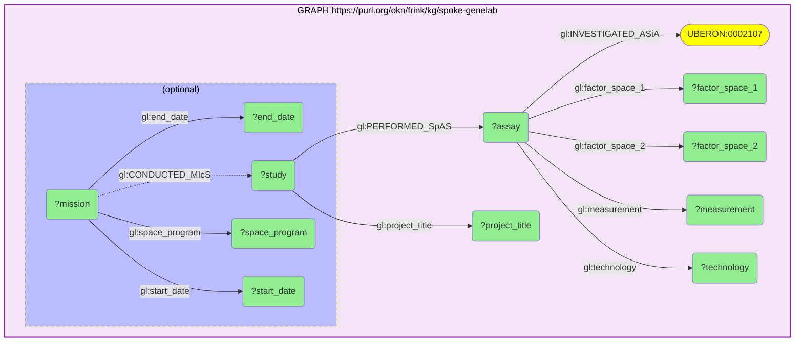

_322 row(s)_

#### Query 2

_2026-09-07T22:35:31+00:00 · `spoke-genelab`_

```sparql
PREFIX rdf: <http://www.w3.org/1999/02/22-rdf-syntax-ns#>
PREFIX gl:  <https://purl.org/okn/frink/kg/spoke-genelab/schema/>
# Measured background and differential-expression tallies for the three paper-matched,
# contrast-vetted liver assays (Space Flight arm 1 vs Ground Control arm 2).
# OSD-25 = GLDS-25 (STS-135, microarray); OSD-47 = GLDS-47 (RR-1 CASIS, RNA-seq);
# OSD-137 = GLDS-137 (RR-3, RNA-seq).
SELECT ?assay
       (COUNT(DISTINCT ?gene) AS ?measured_genes)
       (SUM(IF(?p <= 0.05, 1, 0))                    AS ?sig_padj)
       (SUM(IF(?p <= 0.05 && ABS(?lfc) >= 1, 1, 0))  AS ?deg_strict)
       (SUM(IF(?p <= 0.05 && ?lfc >=  1, 1, 0))      AS ?deg_up)
       (SUM(IF(?p <= 0.05 && ?lfc <= -1, 1, 0))      AS ?deg_down)
WHERE {
  GRAPH <https://purl.org/okn/frink/kg/spoke-genelab> {
    VALUES ?assay {
      <https://purl.org/okn/frink/kg/spoke-genelab/node/OSD-25-e4263b3370f6c7cfbb04a37d79742f3f>
      <https://purl.org/okn/frink/kg/spoke-genelab/node/OSD-47-65754b3ba1b48856d4afd330ef225e46>
      <https://purl.org/okn/frink/kg/spoke-genelab/node/OSD-137-2d49c2d99e55a9e2c2729122a7521106>
    }
    ?stmt rdf:subject   ?assay ;
          rdf:predicate gl:MEASURED_DIFFERENTIAL_EXPRESSION_ASmMG ;
          rdf:object    ?gene ;
          gl:log2fc     ?lfc ;
          gl:adj_p_value ?p .
  }
}
GROUP BY ?assay
```

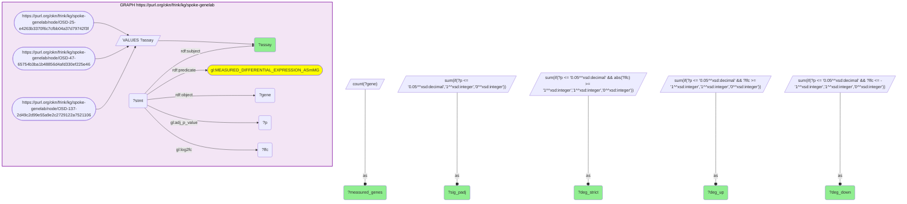

_3 row(s)_

#### Query 3

_2026-09-07T22:36:14+00:00 · `spoke-genelab`_

```sparql
PREFIX rdf: <http://www.w3.org/1999/02/22-rdf-syntax-ns#>
PREFIX gl:  <https://purl.org/okn/frink/kg/spoke-genelab/schema/>
# Full measured liver differential-expression payload for the three paper-matched, vetted
# Space-Flight-vs-Ground-Control assays. Serves as BOTH the DEG source (adj_p <= 0.05 and
# |log2FC| >= 1, applied client-side) and the explicit measured background for enrichment.
SELECT ?assay ?gene ?symbol ?taxonomy ?log2fc ?adj_p_value ?group_mean_1 ?group_mean_2
WHERE {
  GRAPH <https://purl.org/okn/frink/kg/spoke-genelab> {
    VALUES ?assay {
      <https://purl.org/okn/frink/kg/spoke-genelab/node/OSD-25-e4263b3370f6c7cfbb04a37d79742f3f>
      <https://purl.org/okn/frink/kg/spoke-genelab/node/OSD-47-65754b3ba1b48856d4afd330ef225e46>
      <https://purl.org/okn/frink/kg/spoke-genelab/node/OSD-137-2d49c2d99e55a9e2c2729122a7521106>
    }
    ?stmt rdf:subject    ?assay ;
          rdf:predicate  gl:MEASURED_DIFFERENTIAL_EXPRESSION_ASmMG ;
          rdf:object     ?gene ;
          gl:log2fc      ?log2fc ;
          gl:adj_p_value ?adj_p_value ;
          gl:group_mean_1 ?group_mean_1 ;
          gl:group_mean_2 ?group_mean_2 .
    ?gene gl:symbol   ?symbol ;
          gl:taxonomy ?taxonomy .
  }
}
```

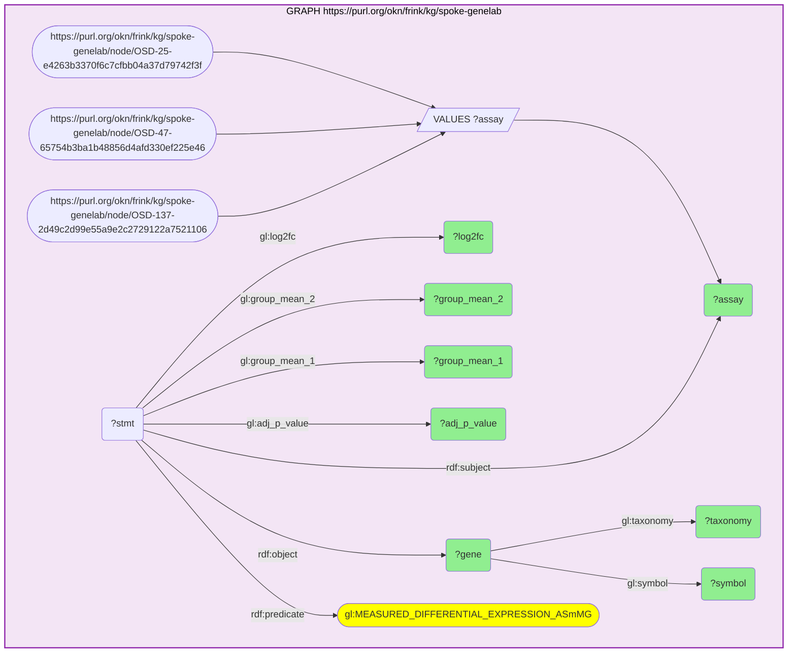

_4689 row(s)_

#### Query 4

_2026-09-07T22:36:44+00:00 · `spoke-genelab`_

```sparql
PREFIX rdf: <http://www.w3.org/1999/02/22-rdf-syntax-ns#>
PREFIX gl:  <https://purl.org/okn/frink/kg/spoke-genelab/schema/>
# Mouse -> human ortholog projection for every gene measured in the three vetted liver assays.
# Covers both the DEG set and the measured background, so enrichment uses a like-for-like
# human background rather than an implicit whole-genome one.
SELECT DISTINCT ?assay ?gene ?mouse_symbol ?human ?human_symbol ?human_taxonomy
WHERE {
  GRAPH <https://purl.org/okn/frink/kg/spoke-genelab> {
    VALUES ?assay {
      <https://purl.org/okn/frink/kg/spoke-genelab/node/OSD-25-e4263b3370f6c7cfbb04a37d79742f3f>
      <https://purl.org/okn/frink/kg/spoke-genelab/node/OSD-47-65754b3ba1b48856d4afd330ef225e46>
      <https://purl.org/okn/frink/kg/spoke-genelab/node/OSD-137-2d49c2d99e55a9e2c2729122a7521106>
    }
    ?stmt rdf:subject   ?assay ;
          rdf:predicate gl:MEASURED_DIFFERENTIAL_EXPRESSION_ASmMG ;
          rdf:object    ?gene .
    ?gene  gl:symbol ?mouse_symbol ;
           gl:IS_ORTHOLOG_MGiG ?human .
    ?human gl:symbol ?human_symbol ;
           gl:taxonomy ?human_taxonomy .
  }
}
```

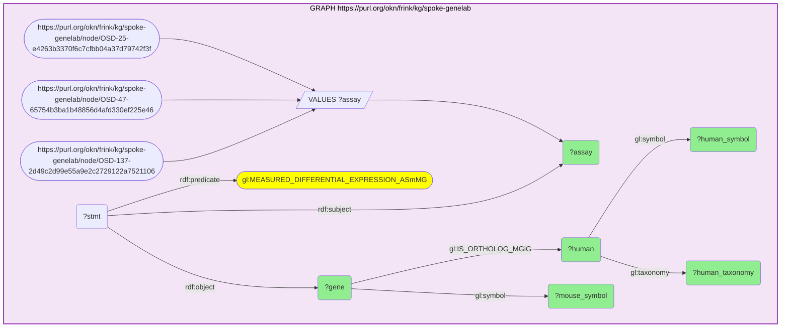

_4744 row(s)_

#### Query 5

_2026-09-07T22:38:09+00:00 · `spoke-genelab` · `prokn`_

```sparql
PREFIX rdf:  <http://www.w3.org/1999/02/22-rdf-syntax-ns#>
PREFIX rdfs: <http://www.w3.org/2000/01/rdf-schema#>
PREFIX gl:   <https://purl.org/okn/frink/kg/spoke-genelab/schema/>
# CROSS-KG BRIDGE (spoke-genelab -> prokn) on human gene SYMBOL:
# every gene measured in the three vetted liver assays -> its human ortholog -> the prokn
# HGNC gene carrying that symbol on rdfs:label -> encoded UniProt protein -> GO biological
# process ("involved in", RO_0002331). Supplies BOTH the GO category->gene map and the
# prokn-annotated background for the hypergeometric test.
SELECT DISTINCT ?human_symbol ?prokn_gene ?protein ?go ?go_label
WHERE {
  GRAPH <https://purl.org/okn/frink/kg/spoke-genelab> {
    VALUES ?assay {
      <https://purl.org/okn/frink/kg/spoke-genelab/node/OSD-25-e4263b3370f6c7cfbb04a37d79742f3f>
      <https://purl.org/okn/frink/kg/spoke-genelab/node/OSD-47-65754b3ba1b48856d4afd330ef225e46>
      <https://purl.org/okn/frink/kg/spoke-genelab/node/OSD-137-2d49c2d99e55a9e2c2729122a7521106>
    }
    ?stmt rdf:subject   ?assay ;
          rdf:predicate gl:MEASURED_DIFFERENTIAL_EXPRESSION_ASmMG ;
          rdf:object    ?mouse_gene .
    ?mouse_gene gl:IS_ORTHOLOG_MGiG ?human_gene .
    ?human_gene gl:symbol ?human_symbol .
  }
  GRAPH <https://purl.org/okn/frink/kg/prokn> {
    ?prokn_gene rdfs:label ?human_symbol ;
                <http://semanticscience.org/resource/SIO_010078> ?protein .
    ?protein <http://purl.obolibrary.org/obo/RO_0002331> ?go .
    OPTIONAL { ?go rdfs:label ?go_label }
  }
}
```

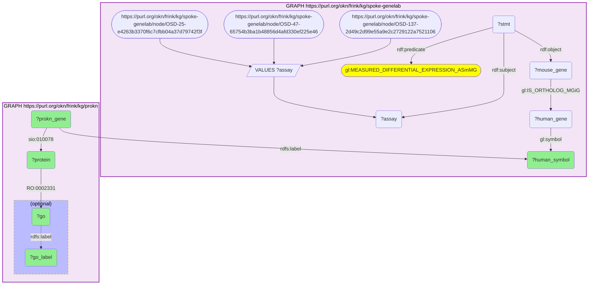

_19467 row(s)_

#### Query 6

_2026-09-07T22:38:23+00:00 · `spoke-genelab` · `prokn`_

```sparql
PREFIX rdf:  <http://www.w3.org/1999/02/22-rdf-syntax-ns#>
PREFIX rdfs: <http://www.w3.org/2000/01/rdf-schema#>
PREFIX gl:   <https://purl.org/okn/frink/kg/spoke-genelab/schema/>
# CROSS-KG BRIDGE (spoke-genelab -> prokn) on human gene SYMBOL, Reactome family.
# A SEPARATE enrichment family from GO: measured mouse gene -> human ortholog -> prokn gene
# -> encoded UniProt protein -> "participates in" (RO_0000056) a human Reactome pathway.
SELECT DISTINCT ?human_symbol ?protein ?pathway ?pathway_label
WHERE {
  GRAPH <https://purl.org/okn/frink/kg/spoke-genelab> {
    VALUES ?assay {
      <https://purl.org/okn/frink/kg/spoke-genelab/node/OSD-25-e4263b3370f6c7cfbb04a37d79742f3f>
      <https://purl.org/okn/frink/kg/spoke-genelab/node/OSD-47-65754b3ba1b48856d4afd330ef225e46>
      <https://purl.org/okn/frink/kg/spoke-genelab/node/OSD-137-2d49c2d99e55a9e2c2729122a7521106>
    }
    ?stmt rdf:subject   ?assay ;
          rdf:predicate gl:MEASURED_DIFFERENTIAL_EXPRESSION_ASmMG ;
          rdf:object    ?mouse_gene .
    ?mouse_gene gl:IS_ORTHOLOG_MGiG ?human_gene .
    ?human_gene gl:symbol ?human_symbol .
  }
  GRAPH <https://purl.org/okn/frink/kg/prokn> {
    ?prokn_gene rdfs:label ?human_symbol ;
                <http://semanticscience.org/resource/SIO_010078> ?protein .
    ?protein <http://purl.obolibrary.org/obo/RO_0000056> ?pathway .
    ?pathway a <http://purl.uniprot.org/core/Pathway> .
    FILTER(CONTAINS(STR(?pathway), "R-HSA"))
    OPTIONAL { ?pathway rdfs:label ?pathway_label }
  }
}
```

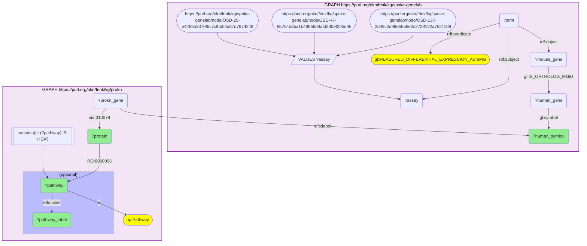

_8778 row(s)_

#### Query 7

_2026-09-07T22:43:01+00:00 · `ubergraph` · `rdkg`_

```sparql
PREFIX rdfs: <http://www.w3.org/2000/01/rdf-schema#>
PREFIX bl:   <https://w3id.org/biolink/vocab/>
# CROSS-KG (ubergraph -> rdkg): every MONDO disease under "liver disease" (MONDO:0005154),
# expanded with ubergraph's precomputed rdfs:subClassOf* closure, joined to the curated
# rdkg gene->disease layer (biolink:related_to, gene node IRI = identifiers.org/ncbigene/{entrez}).
# This is the CURATED / discriminating disease gene-set for the NAFLD hypothesis test.
SELECT DISTINCT ?disease ?disease_label ?gene ?gene_symbol
WHERE {
  GRAPH <https://purl.org/okn/frink/kg/ubergraph> {
    ?disease rdfs:subClassOf* <http://purl.obolibrary.org/obo/MONDO_0005154> .
    OPTIONAL { ?disease rdfs:label ?disease_label }
  }
  GRAPH <https://purl.org/okn/frink/kg/rdkg> {
    ?gene a bl:Gene ;
          bl:related_to ?disease ;
          rdfs:label ?gene_symbol .
  }
}
```

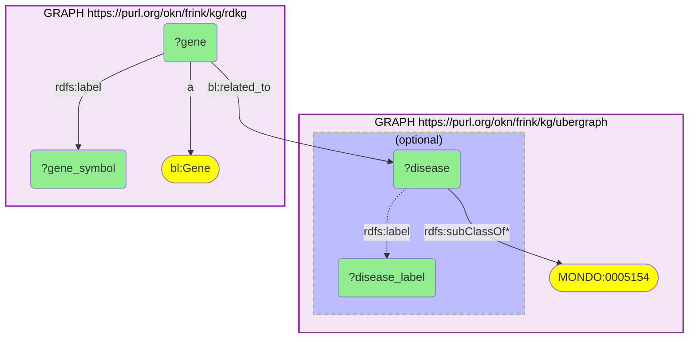

_3257 row(s)_

#### Query 8

_2026-09-07T22:43:46+00:00 · `digcfdekg`_

```sparql
PREFIX rdf:  <http://www.w3.org/1999/02/22-rdf-syntax-ns#>
PREFIX rdfs: <http://www.w3.org/2000/01/rdf-schema#>
PREFIX dg:   <https://purl.org/okn/frink/kg/digcfdekg/schema/>
# BROAD / permissive comparator set: digcfdekg gene->trait associations (PIGEAN / EAGGL
# GWAS-scale inference) for liver-steatosis-related traits. Genes are Entrez node IRIs
# (http://www.ncbi.nlm.nih.gov/gene/{entrez}) — the same IRI form spoke-genelab uses for
# human orthologs, so this joins directly with no bridge.
SELECT DISTINCT ?trait ?trait_label ?gene ?gene_label ?weight
WHERE {
  GRAPH <https://purl.org/okn/frink/kg/digcfdekg> {
    ?trait a dg:Trait ; rdfs:label ?trait_label .
    FILTER(REGEX(STR(?trait_label), "fatty liver|steatos|steatohepat|NAFLD|NASH|cirrhosis|hepatic fat|liver fat|liver disease", "i"))
    ?stmt rdf:subject   ?gene ;
          rdf:predicate dg:geneToTrait ;
          rdf:object    ?trait ;
          dg:weight     ?weight .
    ?gene rdfs:label ?gene_label .
  }
}
```

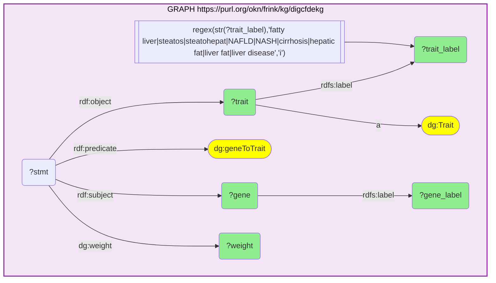

_3409 row(s)_

#### Query 9

_2026-09-07T22:44:17+00:00 · `rdkg`_

```sparql
PREFIX rdfs: <http://www.w3.org/2000/01/rdf-schema#>
PREFIX bl:   <https://w3id.org/biolink/vocab/>
# Phenotype layer (HP). Gene->HP has no direct edge in the federation, so route
# gene -> disease -> phenotype, staying inside rdkg for the curated disease->HP edge.
# Scoped to the MONDO liver diseases that the flight-responsive signature genes touch.
SELECT DISTINCT ?disease ?disease_label ?gene_symbol ?phenotype ?phenotype_label
WHERE {
  GRAPH <https://purl.org/okn/frink/kg/rdkg> {
    VALUES ?disease {
      <http://purl.obolibrary.org/obo/MONDO_0007027>   # metabolic dysfunction-associated steatohepatitis
      <http://purl.obolibrary.org/obo/MONDO_0021105>   # NAFLD1
      <http://purl.obolibrary.org/obo/MONDO_0004790>   # fatty liver disease
      <http://purl.obolibrary.org/obo/MONDO_0005359>   # drug-induced liver injury
      <http://purl.obolibrary.org/obo/MONDO_0005155>   # cirrhosis of liver
      <http://purl.obolibrary.org/obo/MONDO_0006644>   # alcoholic liver cirrhosis
    }
    ?disease bl:has_phenotype ?phenotype .
    FILTER(STRSTARTS(STR(?phenotype), "http://purl.obolibrary.org/obo/HP_"))
    OPTIONAL { ?disease   rdfs:label ?disease_label }
    OPTIONAL { ?phenotype rdfs:label ?phenotype_label }
    ?gene a bl:Gene ; bl:related_to ?disease ; rdfs:label ?gene_symbol .
  }
}
```

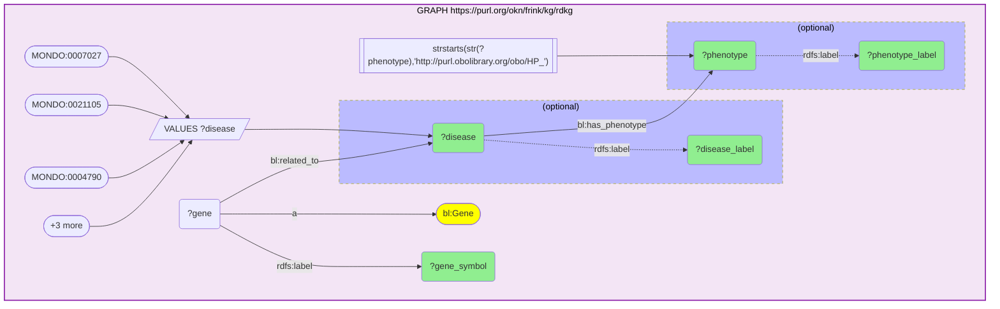

_2 row(s)_

#### Query 10

_2026-09-07T22:45:09+00:00 · `ubergraph` · `oard-kg`_

```sparql
PREFIX rdfs: <http://www.w3.org/2000/01/rdf-schema#>
PREFIX bl:   <https://w3id.org/biolink/vocab/>
# CROSS-KG (ubergraph -> oard-kg): expand the MONDO "liver disease" category inline with
# ubergraph's subClassOf* closure, then pull oard-kg's EHR phenotype (HP) profile for any
# member it carries. oard-kg is reified with the disease on EITHER biolink:subject or
# biolink:object, so both positions are UNIONed. Co-occurrence: observational, not causal.
SELECT DISTINCT ?disease ?disease_label ?phenotype ?phenotype_label
WHERE {
  GRAPH <https://purl.org/okn/frink/kg/ubergraph> {
    ?disease rdfs:subClassOf* <http://purl.obolibrary.org/obo/MONDO_0005154> .
  }
  GRAPH <https://purl.org/okn/frink/kg/oard-kg> {
    { ?assoc bl:subject ?disease ; bl:object  ?phenotype . }
    UNION
    { ?assoc bl:object  ?disease ; bl:subject ?phenotype . }
    FILTER(STRSTARTS(STR(?phenotype), "http://purl.obolibrary.org/obo/HP_"))
    OPTIONAL { ?disease   rdfs:label ?disease_label }
    OPTIONAL { ?phenotype rdfs:label ?phenotype_label }
  }
}
```

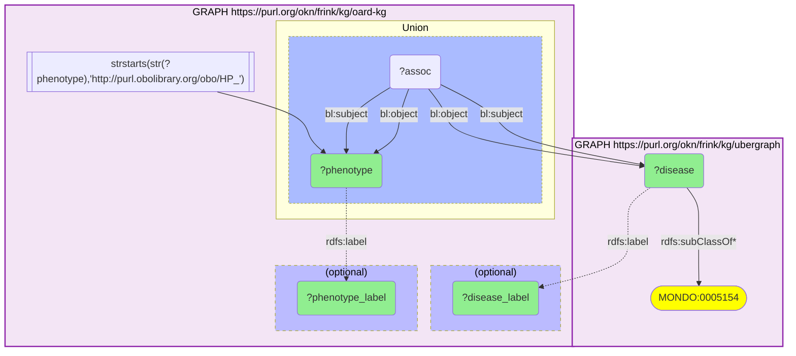

_7209 row(s)_

#### Query 11

_2026-09-07T22:46:03+00:00 · `spoke-genelab` · `spoke-okn` · `ubergraph`_

```sparql
PREFIX rdf:  <http://www.w3.org/1999/02/22-rdf-syntax-ns#>
PREFIX rdfs: <http://www.w3.org/2000/01/rdf-schema#>
PREFIX gl:   <https://purl.org/okn/frink/kg/spoke-genelab/schema/>
PREFIX sok:  <https://purl.org/okn/frink/kg/spoke-okn/schema/>
# THREE-KG BRIDGE (spoke-genelab -> spoke-okn -> ubergraph): flight-responsive liver DEGs
# (adj_p <= 0.05, |log2FC| >= 1) -> human ortholog (shared Entrez node IRI, no rewrite needed)
# -> spoke-okn's curated disease->gene layer (ASSOCIATES_DaG, DOID) -> restricted to the DOID
# "liver disease" (DOID:409) subtree expanded by ubergraph's subClassOf* closure.
SELECT DISTINCT ?human_symbol ?mouse_symbol ?log2fc ?adj_p ?disease ?disease_label
WHERE {
  GRAPH <https://purl.org/okn/frink/kg/spoke-genelab> {
    VALUES ?assay {
      <https://purl.org/okn/frink/kg/spoke-genelab/node/OSD-25-e4263b3370f6c7cfbb04a37d79742f3f>
      <https://purl.org/okn/frink/kg/spoke-genelab/node/OSD-47-65754b3ba1b48856d4afd330ef225e46>
      <https://purl.org/okn/frink/kg/spoke-genelab/node/OSD-137-2d49c2d99e55a9e2c2729122a7521106>
    }
    ?stmt rdf:subject ?assay ;
          rdf:predicate gl:MEASURED_DIFFERENTIAL_EXPRESSION_ASmMG ;
          rdf:object ?mouse_gene ;
          gl:log2fc ?log2fc ;
          gl:adj_p_value ?adj_p .
    FILTER(?adj_p <= 0.05 && ABS(?log2fc) >= 1)
    ?mouse_gene gl:symbol ?mouse_symbol ;
                gl:IS_ORTHOLOG_MGiG ?human_gene .
    ?human_gene gl:symbol ?human_symbol .
  }
  GRAPH <https://purl.org/okn/frink/kg/spoke-okn> {
    ?disease sok:ASSOCIATES_DaG ?human_gene .
  }
  GRAPH <https://purl.org/okn/frink/kg/ubergraph> {
    ?disease rdfs:subClassOf* <http://purl.obolibrary.org/obo/DOID_409> .
    OPTIONAL { ?disease rdfs:label ?disease_label }
  }
}
```

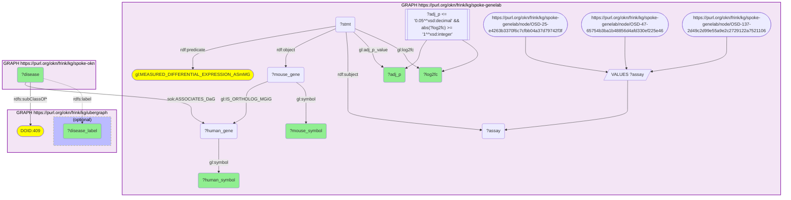

_10 row(s)_

#### Query 12

_2026-09-07T22:46:52+00:00 · `ubergraph` · `spoke-okn`_

```sparql
PREFIX rdfs: <http://www.w3.org/2000/01/rdf-schema#>
PREFIX sok:  <https://purl.org/okn/frink/kg/spoke-okn/schema/>
# Background-wide spoke-okn liver-disease gene set: EVERY gene curated as associated
# (ASSOCIATES_DaG) with any DOID under "liver disease" (DOID:409), expanded through
# ubergraph's subClassOf* closure. Independent of the signature, so it can serve as a
# valid category for the hypergeometric test (the signature-scoped pull cannot).
SELECT DISTINCT ?gene ?gene_symbol ?disease
WHERE {
  GRAPH <https://purl.org/okn/frink/kg/ubergraph> {
    ?disease rdfs:subClassOf* <http://purl.obolibrary.org/obo/DOID_409> .
  }
  GRAPH <https://purl.org/okn/frink/kg/spoke-okn> {
    ?disease sok:ASSOCIATES_DaG ?gene .
    ?gene rdfs:label ?gene_symbol .
  }
}
```

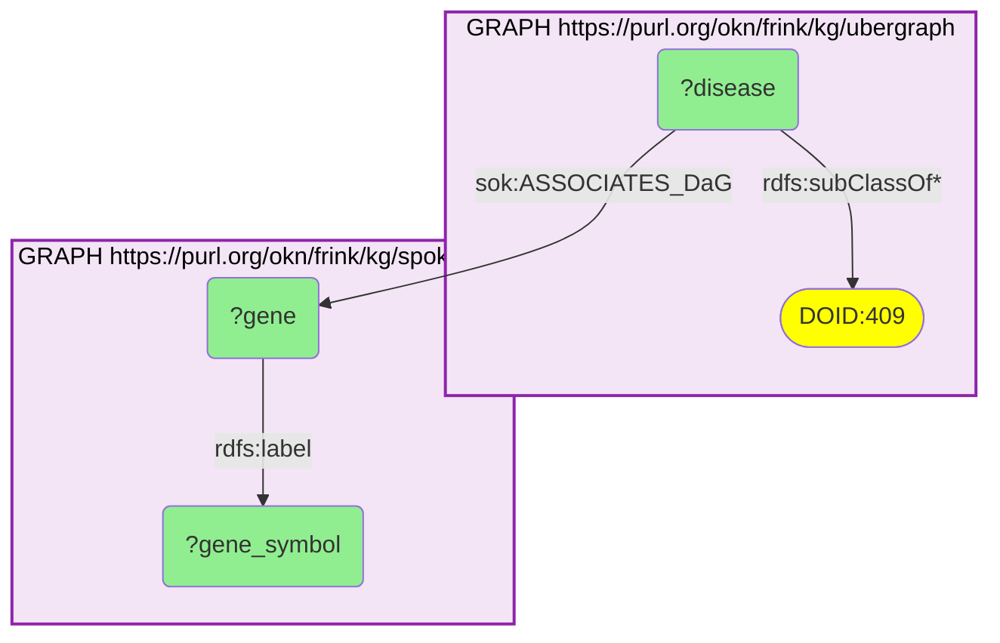

_1289 row(s)_
