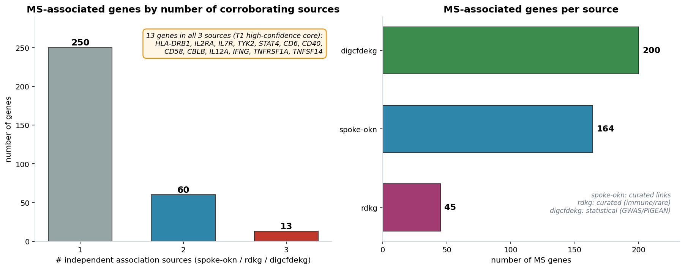
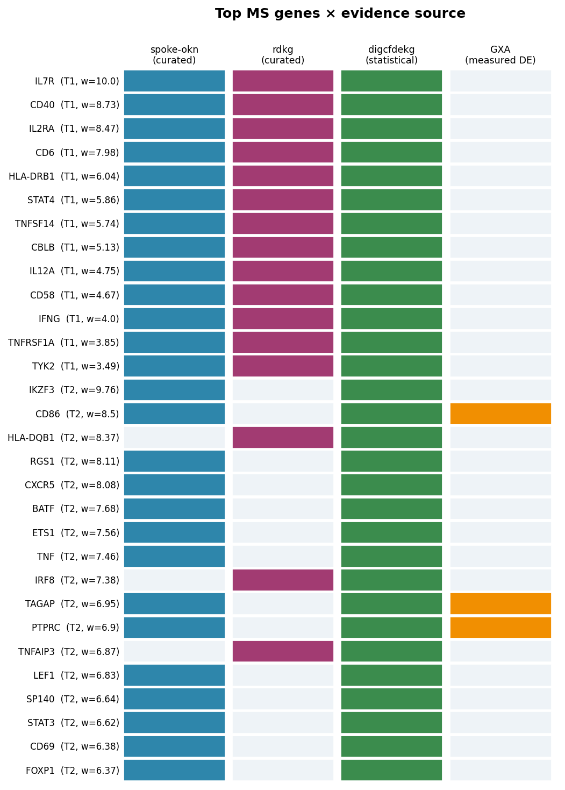
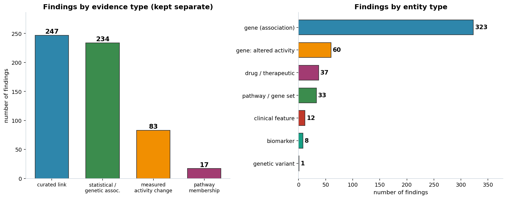
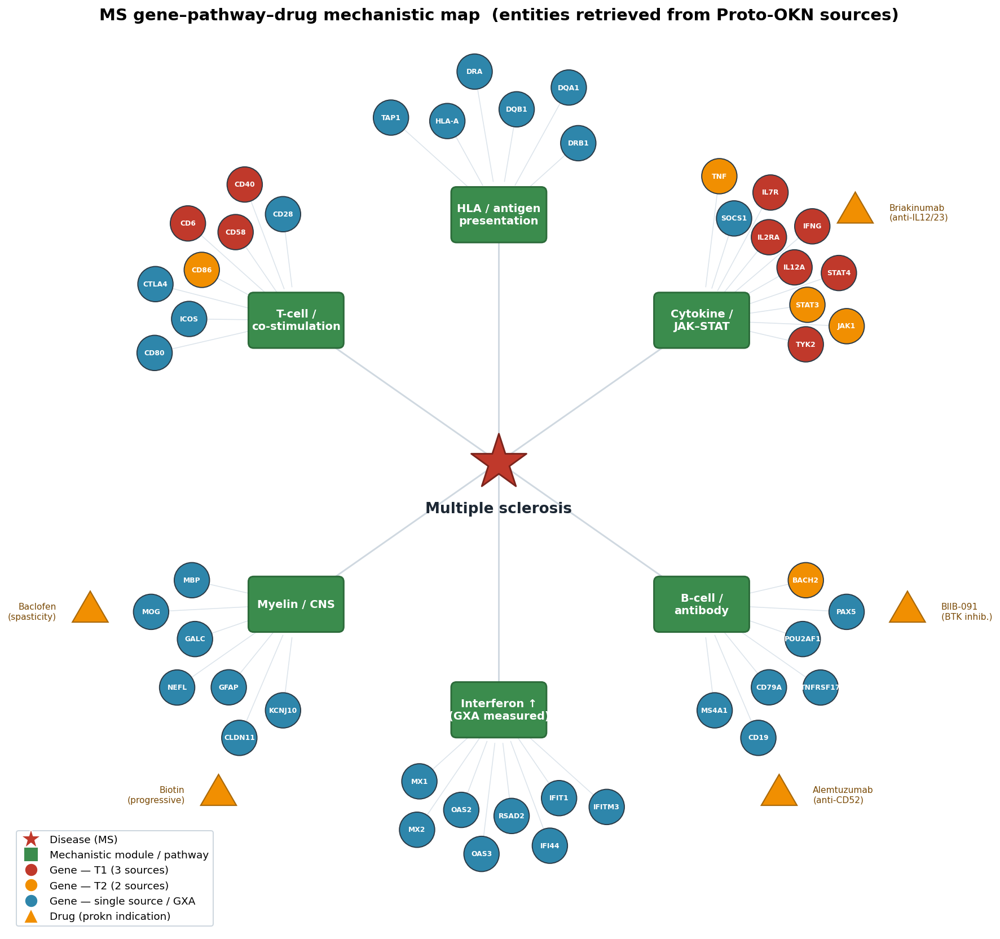

# An Evidence-Backed Map of Multiple Sclerosis Biology

### Integrated across the Proto-OKN federated knowledge graphs

**Prepared for:** Peter · **Date:** 2026-07-03 · **Endpoint:** Proto-OKN federated SPARQL (`https://apps.okn.us/federation/sparql`) · **Model:** claude-opus-4-8

---

## 1. Executive summary

This report maps multiple sclerosis (MS) biology by querying **seven biomedical knowledge graphs** on the Proto-OKN federation and integrating their findings by entity type. The disease was anchored on **multiple sclerosis (MONDO:0005301) plus its 7 ontology subtypes** (relapsing-remitting, secondary-progressive, primary-progressive, progressive-relapsing, chronic-progressive, Marburg acute, and pediatric MS), and each source was queried in **its own native identifier scheme** (MONDO, DOID, EFO, Orphanet, UMLS, MeSH) after building a full cross-ontology crosswalk.

**474 findings** were integrated: **323 MS-associated genes** (322 protein-coding, 1 non-coding), **60 tabulated differentially-active genes** with cell-type context (out of 475 measured), **33 differentially-active pathways / gene sets**, **37 drug/therapeutic findings** (from 180 indicated compounds), **12 clinical features**, **8 biomarker findings**, and the (deliberately flagged) **variant layer**.

The **highest-confidence core** is exactly what MS genetics predicts — an adaptive-immune, T-cell-centred set. **HLA-DRB1, IL2RA, IL7R, TYK2, STAT4, CD6, CD40, CD58, CBLB, IL12A, IFNG, TNFRSF1A, and TNFSF14** are each corroborated by all three independent gene sources (spoke-okn, rdkg, digcfdekg); a further 60 genes are supported by two sources. The strongest **statistical** signals (digcfdekg PIGEAN/EAGGL, GWAS-derived) are **CD28 (weight 10.6), IL7R (10.0), IKZF3 (9.76), HLA-A (9.26), and CD27 (9.07)**. The strongest **measured-activity** signal (Gene Expression Atlas) is a coherent **peripheral-blood interferon-response and B-cell program** in MS immune cells — type-I-interferon-stimulated genes (MX1/2, OAS2/3, RSAD2, IFI44/IFI44L, IFIT1/2, HERC5) up-regulated, and monocyte/complement genes (CD14, CD163, C1QB, C3, VSIG4) down-regulated.

Evidence types are kept strictly separate throughout: **curated link** (247 findings), **statistical/genetic association** (234), **measured activity change** (83), and **pathway/gene-set membership** (17).

---

## 2. Sources used

Seven knowledge graphs supplied MS evidence; `ubergraph` was used only as the ontology bridge (subtype expansion + ID crosswalks). Versions are the exact Proto-OKN releases queried on 2026-07-03.

| KG (shortname) | Version | Role in this map | Entity types supplied | Disease ID scheme | Gene ID scheme |
|---|---|---|---|---|---|
| **spoke-okn** | v0.0.6 | Curated disease→gene (`ASSOCIATES_DaG`), drug→disease | genes, drugs | DOID (node IRI) | Entrez (symbol label) |
| **rdkg** | v0.0.1 | Curated gene (`related_to`), phenotype, contraindicated & risk drug/chemical | genes, clinical features, drugs | MONDO / rdaccelerate grouped nodes | Entrez |
| **digcfdekg** (CFDE REVEAL) | v0.0.1 | **Statistical** gene–trait + gene sets + latent factors (PIGEAN/EAGGL, GWAS-derived) | genes, gene sets, factors | MONDO / EFO (+ hashed trait nodes) | Entrez |
| **prokn** (Protein KN) | v0.0.5 | **Drug indications** (ChEMBL); pathway hub | drugs (no curated MS genes) | MONDO / OMIM / Orphanet (`skos:exactMatch`) | HGNC / UniProt / Ensembl |
| **gene-expression-atlas-okn** | v0.0.3 | **Measured** differential activity + cell type | altered activity, pathways/GO | MONDO / EFO | NCBI Gene / Ensembl / symbol |
| **biomarkerkg** | v0.0.2 | Clinical biomarkers + specimen | biomarkers | DOID | UniProt / PubChem Gene |
| **ubergraph** | v0.0.2 | Subtype expansion + ID crosswalks (bridge only) | ontology | MONDO/DOID/EFO/Orphanet | — |

**Checked but not contributory for MS:** `oard-kg` (v0.0.3) returned **no associations** for the main MS term — it is a rare-disease EHR corpus and carries only a `pediatric multiple sclerosis` ontology stub with no phenotype edges; `pankgraph` (v0.0.1, PanKbase) contains **no MS** node (pancreatic/diabetes scope, confirmed by label scan); `prokn` carries MS **only as a drug-indication hub** (no curated MS gene/protein or variant edges, because MS is not a Mendelian disorder). `ncipidkg`, `biobricks-aopwiki`, `nde`, and `biohealth` are gene/pathway- or immune-disease-adjacent but were not MS-anchored in a way that added corroboration within budget (see §8).

---

## 3. Disease anchor and identifier reconciliation

Names and IDs differ across every source, so the analysis first expanded and cross-walked the disease:

- **Subtype expansion:** `ubergraph` transitive closure of MONDO:0005301 → **8 MS terms** (main MS; relapsing-remitting MONDO:0005314; secondary-progressive 0000450; primary-progressive 0000451; progressive-relapsing 0000452; chronic-progressive 0005284; Marburg acute 0016429; pediatric 0018784).
- **Cross-ontology crosswalk:** each MONDO term was mapped (via `ubergraph` `skos:exactMatch` / `oboInOwl:hasDbXref`) to **DOID, EFO, Orphanet, NCIT, UMLS, MeSH, ICD** — 105 cross-references. This let each KG be queried natively: **DOID:2377** (+ DOID:2378 RRMS, 0050783/4/5 for SPMS/PPMS/PRMS) for spoke-okn and biomarkerkg; **MONDO** subtype IRIs for rdkg; **MONDO:0005301** plus two hashed progression-trait nodes ("brain-volume change", "T2-lesion-volume change") and EFO:0803536 ("MS symptom measurement") for digcfdekg; **MONDO/Orphanet** via `skos:exactMatch` for prokn's ChEMBL indication hub.
- **rdkg grouped nodes:** rdkg additionally keys much of its MS content on two `rdaccelerate.org` grouped nodes — `multiple sclerosis, susceptibility to` and `progressive multiple sclerosis` — which carry the clinical-phenotype (HP) edges. Querying only the plain MONDO IRI would have missed these.

Without this step several sources would have silently under-returned (e.g., the GXA MS disease node carries **no label**, so a label-based search returns 0 rows even though 475 differentially-expressed genes are attached to `MONDO_0005301`).

---

## 4. Confidence tiers

Findings are ranked by **number of independent sources that agree**, with statistical/measured scores as a secondary signal. Because MS is a common, polygenic (non-Mendelian) disease, its gene evidence rests on **three independent association pipelines** — two curated (spoke-okn, rdkg) and one statistical (digcfdekg) — rather than the four available for a familial disease.

| Tier | Definition | Interpretation |
|---|---|---|
| **T1 — very high** | Gene reported by **3/3** association sources | Established core MS gene |
| **T2 — high** | Gene by **2** sources, OR significant measured change (adj-p sig), OR curated biomarker | Strong, multiply-supported |
| **T3 — medium** | **1** source with a strong statistical weight (≥7), or a single curated link (drug, phenotype) | Plausible, corroboration desirable |
| **T4 — low** | **1** source only | Hypothesis-generating |

Gene corroboration distribution: **3 sources → 13 genes · 2 sources → 60 genes · 1 source → 250 genes.**

---

## 5. Findings by entity type

### 5.1 Genes — protein-coding

The three association sources contribute complementary evidence: **spoke-okn** (164 curated), **digcfdekg** (200 statistical, GWAS-derived PIGEAN/EAGGL weights), and **rdkg** (45 curated, immune/rare emphasis). prokn contributes **no** curated MS genes (MS is not Mendelian), so — unlike Alzheimer's — the ceiling is three sources, not four.

**Highest-confidence set (Tier 1 — all 3 sources):**

| Gene | Role | digcfdekg weight |
|---|---|---|
| **IL7R** | IL-7 receptor α (CD127); T-cell homeostasis; classic MS locus | 10.0 |
| **CD40** | Co-stimulation; B-/T-cell/APC crosstalk | 8.73 |
| **IL2RA** | IL-2 receptor α (CD25); Treg biology; MS risk locus | 8.47 |
| **CD6** | T-cell adhesion/activation (itolizumab target class) | 7.98 |
| **HLA-DRB1** | MHC class II; the dominant MS risk locus (DRB1\*15:01) | 6.04 |
| **STAT4** | Th1/Th17 differentiation | 5.86 |
| **TNFSF14** | LIGHT; TNF-superfamily co-stimulation | 5.74 |
| **CBLB** | E3 ligase; T-cell tolerance checkpoint | 5.13 |
| **IL12A** | IL-12/IL-23 p35; Th1 polarisation | 4.75 |
| **CD58** | LFA-3; T-cell co-stimulation; MS locus | 4.67 |
| **IFNG** | Interferon-γ; Th1 effector cytokine | 4.00 |
| **TNFRSF1A** | TNF receptor 1; MS risk locus (functional splice variant) | 3.85 |
| **TYK2** | JAK-family kinase; protective coding variant in MS | 3.49 |

**Tier 2 (2 sources), ranked by statistical weight:** IKZF3 (9.76), CD86 (8.5), HLA-DQB1 (8.37), RGS1 (8.11), CXCR5 (8.08), BATF (7.68), ETS1 (7.56), TNF (7.46), IRF8 (7.38), TAGAP (6.95), PTPRC (6.9), TNFAIP3 (6.87), LEF1 (6.83), SP140 (6.64), STAT3 (6.62), CD69 (6.38), FOXP1 (6.37), MALT1 (6.22), SH2B3 (6.2), GATA3 (6.09), RUNX3 (6.04), ZFP36L1 (6.01), EVI5 (4.95), CLEC16A, ANKRD55, HLA-DQA1, HLA-DRA, VCAM1, FOXP3, IL10, IL17A, IL1B, BACH2, NCF4, MERTK, and 25 others.

The single strongest **statistical** association is **CD28** (weight 10.6), the archetypal T-cell co-stimulatory receptor; it is Tier 3 here only because it appears in the digcfdekg statistical layer alone. Biologically, **HLA-DRB1** remains the dominant MS risk locus (odds ratio ≈ 3 for DRB1\*15:01) — it is Tier 1 by corroboration even though the LD-dense HLA region depresses its single-gene statistical weight.

### 5.2 Genes — non-coding

The MS **association** layer is almost entirely protein-coding immune genes; only **LOC100506422** surfaces as a non-coding association (digcfdekg). This is a real contrast with Alzheimer's (whose non-coding layer was miRNA-rich) and reflects that MS GWAS signals concentrate in immune protein-coding loci. Non-coding involvement instead appears in the **measured-activity** layer (§5.6): the GXA MS differential-expression set includes lncRNAs and antisense transcripts — **LINC00278, LINC00926, LINC01094, LINC01126, NFYC-AS1, USP6NL-AS1, DTNB-AS1, CYP2U1-AS1, TET2-AS1, XIST, TSIX**, and the Y-linked long non-coding **TTTY14/TTTY15**. **Caveat:** biotype was assigned by a symbol heuristic (§8); several of these (XIST/TSIX and the Y transcripts) are sex-chromosome artifacts rather than MS biology.

### 5.3 Genetic variants — flagged undercount

**This is the weakest layer in the federation and is reported as such.** None of the queried KGs expose an MS-anchored **variant-entity** layer (no disease-linked dbSNP/ClinVar/UniProt-variant nodes were reachable): prokn's MS disease node links only to compounds; rdkg and spoke-okn link MS to genes, not variants; pankgraph (which does carry a variant payload) contains no MS. The variant-level signal survives **only indirectly**, at gene level, through **digcfdekg's statistically inferred associations** (PIGEAN integrates GWAS summary statistics). Practically: the **HLA-DRB1\*15:01** risk haplotype, the **TYK2 P1104A** protective coding variant, and the **TNFRSF1A** and **IL7R** functional variants are represented **by their genes**, not as variant records. Treat "genetic variants" as **substantially undercounted** here.

### 5.4 Pathways and gene sets

Two complementary layers, both statistical (GXA supplied per-gene expression rather than pathway enrichment for MS — see §5.6):

- **CFDE gene sets predicting MS (digcfdekg `geneSetToTrait`, `pathway_membership`).** 17 tabulated gene sets, overwhelmingly adaptive-immune: **BIOCARTA_CTLA4_PATHWAY**, **GOBP_T_HELPER_17_CELL_LINEAGE_COMMITMENT**, **KEGG_ALLOGRAFT_REJECTION**, **BIOCARTA_TH1TH2_PATHWAY**, **PID_IL27_PATHWAY**, **REACTOME_INTERLEUKIN_2_SIGNALING**, **WP_MODULATORS_OF_TCR_SIGNALING_AND_T_CELL_ACTIVATION**, **GOBP_REGULATION_OF_B_CELL_DIFFERENTIATION**, **GOBP_T_CELL_SELECTION**, and **WP_GENES_ASSOCIATED_WITH_RHEUMATOID_ARTHRITIS** (shared autoimmune architecture).
- **Latent disease-mechanism factors (digcfdekg `traitToFactor`, `statistical_association`).** 16 tabulated factors (of ~4,000 EAGGL latent factors), each labelled to an MS mechanism: *TH1/TH2 T-cell pathway, CD4 T-cell activation genes, regulatory-T-cell signalling, T- and B-cell signalling, IL-2/JAK-STAT signalling, MHC-II and alloimmune signalling, T-cell activation and NF-κB, B-cell-receptor signalling*, and — notably — *Lipoprotein Metabolism* (the one non-immune factor, echoing MS lipid/vitamin-D biology).

### 5.5 Drugs / therapeutics

Three distinct relationship types — kept separate because they mean opposite things clinically:

- **Indicated / investigated for MS (prokn, ChEMBL "Indication"):** **180 compounds** — the richest therapeutic layer. Named agents span MS disease-modifying and symptomatic classes: **alemtuzumab** (anti-CD52 DMT), **briakinumab** (anti-IL-12/23), **belimumab** (anti-BAFF), **BIIB-091** (BTK inhibitor), **bryostatin-1** (PKC), plus symptomatic/repurposing agents **baclofen** and **arbaclofen** (spasticity), **amantadine/armodafinil** (fatigue), **amifampridine** (conduction), **cannabidiol/cannabinol** (spasticity), **high-dose biotin** (progressive MS), **atorvastatin**, **celecoxib**, and **acetazolamide**. Most rows are ChEMBL-ID-only (readable-name undercount — see §8).
- **Contraindicated in MS (rdkg `contraindicated_for`):** only **2 compounds — Ascorbic acid and Zinc gluconate** — a thin curated layer for MS.
- **Environmental risk factors / modifiers (rdkg `contributes_to`, ChemicalExposure):** **Tobacco smoke, organic solvents, lead, mercury**, and **teriflunomide** — the recognised environmental MS risk exposures (teriflunomide appears here as a chemical entity rather than as a therapeutic).
- **Treats MS (spoke-okn `TREATS_CtD`):** only **3 edges — Carbonic acid, Isopropyl alcohol, Methane** — non-therapeutic artifacts, a conspicuous limitation of SPOKE's curated treatment layer for MS (no approved DMT appears as a TREATS edge).

### 5.6 Genes with altered activity — with tissue / cell type

From the Gene Expression Atlas, MS differential-expression contrasts (`E-MTAB-69`, `E-MTAB-2973`) are **peripheral-blood immune-cell** comparisons — *"multiple sclerosis (before/after IFN-β treatment) vs normal"* — resolved to **specific cell types**: **CD4⁺ T cells** (CL:0000624), **CD8⁺ T cells** (CL:0000625), **monocytes** (CL:0000576), **neutrophils** (CL:0000775), **B cells** (CL:0000236), **lymphocytes** (CL:0000542), and **whole blood** (UBERON:0000178). **475 genes** are differentially expressed with `log2FC`, `direction`, and `adj_p_value`. The coherent MS signal is:

- **Type-I-interferon-stimulated genes UP** (largely the IFN-β treatment response): **MX1, MX2, OAS2, OAS3, OASL, RSAD2, IFI44, IFI44L, IFIT1, IFIT2, IFI27, IFITM3, HERC5, DDX60, GBP1, PARP9, TRIM22** in whole blood.
- **B-cell / plasmablast program UP**: **IGKC, IGHM, TNFRSF17 (BCMA), MZB1, POU2AF1, CD38, PAX5, JCHAIN, FAM30A** in lymphocytes.
- **Monocyte / complement / scavenger program DOWN**: **CD14, CD163, MSR1, VSIG4, C1QB, C3, CFD, AIF1, MAFB, LYVE1, VCAN**; and the microglial/homeostatic marker **P2RY12** down.

Twenty-three association genes are **also** measured-DE (e.g., **PTPRC, TAGAP, MERTK, CD86, ELMO1, AFF1, NLRP3, ITGAM, IL1B, MS4A1, TLR4**), of which six carry all three evidence flavours — curated + statistical + measured (**AFF1, CD86, ELMO1, MERTK, PTPRC, TAGAP**). **Caveat:** the highest-magnitude fold-changes are **sex-chromosome artifacts** (Y-linked *RPS4Y1, DDX3Y, KDM5D, UTY, EIF1AY, PRKY, ZFY, USP9Y*; and *XIST* up) from case/control sex imbalance, not MS biology; and the atlas is peripheral blood, **not** CNS/lesion tissue.

### 5.7 Clinical features and biomarkers

- **Clinical features (rdkg `has_phenotype` / `has_onset`, 12 HP terms):** the recognised MS clinical picture — **CNS demyelination, spasticity, paraesthesia, muscle weakness, incoordination (ataxia), diplopia**, bladder dysfunction (**urinary incontinence, urinary hesitancy**), and neuropsychiatric features (**depressivity, emotional lability**), with **adult onset** and **multifactorial inheritance**.
- **Biomarkers (biomarkerkg, 53 specimen-tagged records):** MS biomarker records span **cerebrospinal fluid, blood plasma, serum, urine**, and other body fluids — the right specimen profile for MS (CSF oligoclonal-band/neurofilament assays). Only one record (`AN6263-1`) is resolved to assessed molecules: a **sphingosine-1-phosphate / IFN-γ / IL-17 panel** — **SPHK1, SPHK2, S1PR1, S1PR5, IL17A, IFNG, APOA1** — biologically apt given the S1P-receptor modulator drug class (fingolimod/siponimod). Analytes are **unlabelled for the other 52 records** (a curation gap — see §8).

---

## 6. Cross-source corroboration and evidence-type structure

The map is balanced between **curated links** (247) and a large **statistical** layer (234, the digcfdekg gene weights, gene sets, and factors), with a substantial **measured-activity** layer (83, GXA per-gene DE plus the association genes it corroborates) and a focused **pathway-membership** layer (17). Corroboration concentrates in the gene layer, where three independent pipelines (two curated, one statistical) converge on the canonical adaptive-immune MS gene set. The mechanistic synthesis below places the retrieved genes, pathways, and drugs onto the established MS immune modules:

---

## 7. Full annotated findings

The complete, machine-readable table is **`MS_knowledge_map_findings.csv`** (474 rows, one per finding) with columns: `entity_type, entity, entity_id, biotype, relationship, sources, n_sources, evidence_types, best_score, score_type, tissue_celltype, confidence_tier, notes`. A gene-level cross-source presence matrix is **`MS_gene_source_matrix.csv`**. The interactive, sortable/filterable version of the full table is embedded in **`MS_knowledge_map_report.html`**.

**Representative slice — Tier 1 / Tier 2 genes and other entity types:**

| Entity | Type | Sources (n) | Evidence | Score | Tier |
|---|---|---|---|---|---|
| IL7R | gene (coding) | spoke; rdkg; digcfdekg (3) | curated + statistical | **w=10.0** | T1 |
| HLA-DRB1 | gene (coding) | spoke; rdkg; digcfdekg (3) | curated + statistical | w=6.04 | T1 |
| IL2RA | gene (coding) | spoke; rdkg; digcfdekg (3) | curated + statistical | w=8.47 | T1 |
| TYK2 | gene (coding) | spoke; rdkg; digcfdekg (3) | curated + statistical | w=3.49 | T1 |
| CD28 | gene (coding) | digcfdekg (1) | statistical | **w=10.6** | T3 |
| IKZF3 | gene (coding) | spoke; digcfdekg (2) | curated + statistical | w=9.76 | T2 |
| PTPRC (CD45) | gene (coding) | spoke; digcfdekg (2) + GXA | curated + statistical + measured | w=6.9 | T2 |
| MX1 ↑ (IFN-stimulated) | gene: altered activity | GXA (1) | measured change | log2FC +3.1 (whole blood) | T2 |
| CD14 ↓ (monocyte) | gene: altered activity | GXA (1) | measured change | log2FC −1.9 (lymphocyte) | T2 |
| BIOCARTA_CTLA4_PATHWAY | pathway/gene set | digcfdekg (1) | pathway membership | w=3.0 | T3 |
| Alemtuzumab | drug | prokn (1) | curated (indication) | — | T3 |
| Tobacco smoke | drug/exposure | rdkg (1) | curated (risk, contributes_to) | — | T4 |
| CNS demyelination | clinical feature | rdkg (1) | curated | — | T3 |
| SPHK1 / S1PR1 (CSF panel) | biomarker | biomarkerkg (1) | curated | — | T3 |

---

## 8. Caveats, uncertainties, and likely undercounts

1. **Variants are severely undercounted.** The federation has no MS-anchored variant-entity layer; variant evidence exists only implicitly at gene level (digcfdekg GWAS-derived). HLA-DRB1\*15:01, TYK2 P1104A, and IL7R/TNFRSF1A functional variants are represented by their genes, not as variant records. Do not read the variant section as a variant catalogue.
2. **Non-coding genes are undercounted in the association layer** (only LOC100506422). Real non-coding involvement is larger and surfaces in the GXA measured layer (lncRNAs/antisense), but biotype there was assigned by a symbol heuristic and several hits (XIST/TSIX, Y-linked transcripts) are sex-chromosome artifacts.
3. **The measured-activity layer is peripheral blood only, and confounded.** GXA's MS studies are blood immune cells (no CNS/lesion tissue), the contrasts are partly *IFN-β-treated vs untreated* (so the dominant interferon-response signal is partly a **treatment** effect), and the largest fold-changes are **sex-chromosome artifacts** from case/control sex imbalance. Per-gene, not pathway-enrichment, was available for MS (unlike the AD atlas contrasts).
4. **prokn contributes no curated MS genes.** Because MS is polygenic/non-Mendelian, prokn's familial-gene layer is empty for MS — it contributes only the 180-compound drug-indication hub. So the gene ceiling is 3 sources (not 4), and prokn does not corroborate any MS gene.
5. **Drug names are largely ChEMBL-ID-only** in prokn's indication layer, so readable-name coverage is a lower bound: several first-line DMTs (e.g., ocrelizumab, natalizumab, fingolimod, dimethyl fumarate, ofatumumab, cladribine) are almost certainly present among the 153 ID-only rows but were not surfaced by name. "Indication" also mixes approved, investigational, and failed compounds.
6. **spoke-okn TREATS layer is empty for MS** (3 non-drug artifacts), so "treats" is not a reliable therapeutic list; use the prokn indication layer instead.
7. **biomarkerkg analytes are unlabelled for 52 of 53 MS records** (only the S1P/IFN panel resolves), so the biomarker molecule list is a severe undercount — the specimen coverage (CSF/plasma/serum/urine) is the more reliable signal.
8. **oard-kg / pankgraph / ncipidkg / biobricks-aopwiki / nde / biohealth** were checked but added no corroborating MS rows within scope; their absence is a coverage limit (oard is rare-disease-only; pankgraph is pancreatic), not evidence of absence.
9. **Subtype coverage is uneven.** Almost all evidence anchors to the main MS term; the progressive (SPMS/PPMS/PRMS) and pediatric/Marburg subtypes are thin across every source. Counts mix subtypes and the main term.

---

## 9. Reproducibility

Every SPARQL query (verbatim, with the graphs hit and row counts) is preserved in the companion transcript **`MS_analysis_transcript.md`**, generated from the session query log. Integration logic is `msbuild/integrate.py`; figures are `msbuild/viz.py` and `msbuild/viz_network.py`; the raw per-source extracts are embedded in `msbuild/data_genes.py` and `msbuild/data_other.py`. Re-running against the same KG versions (§2) reproduces the counts.
