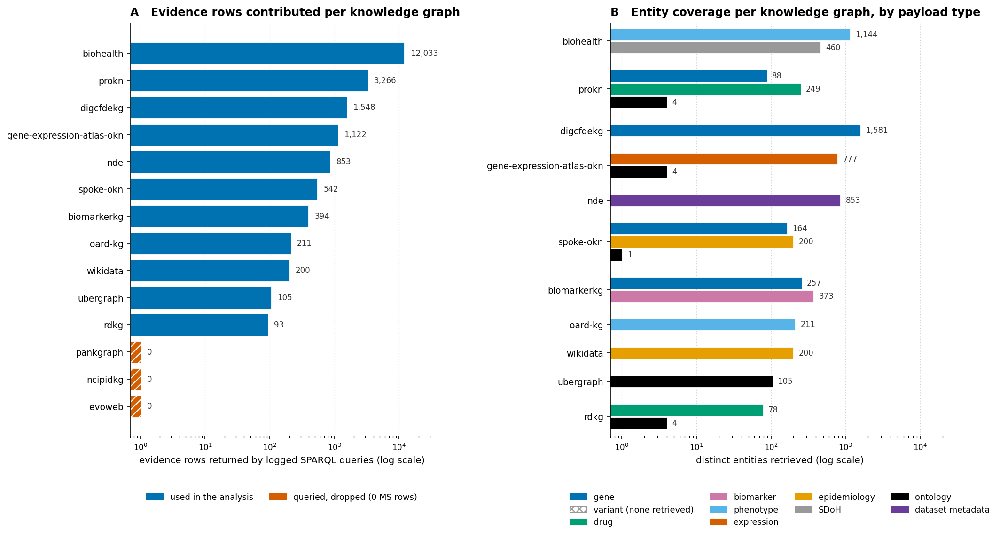
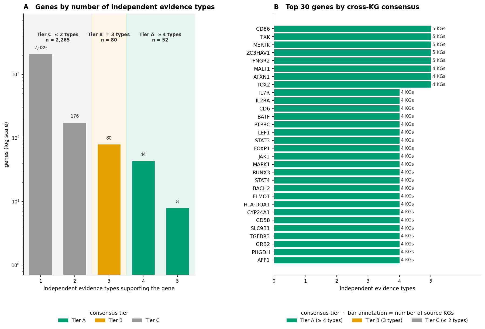
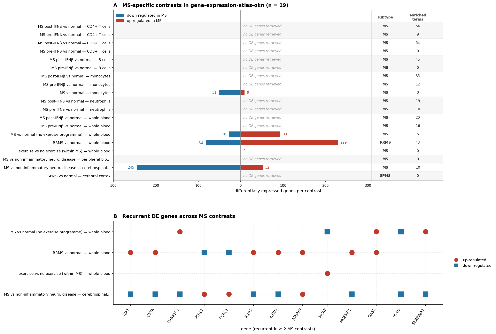
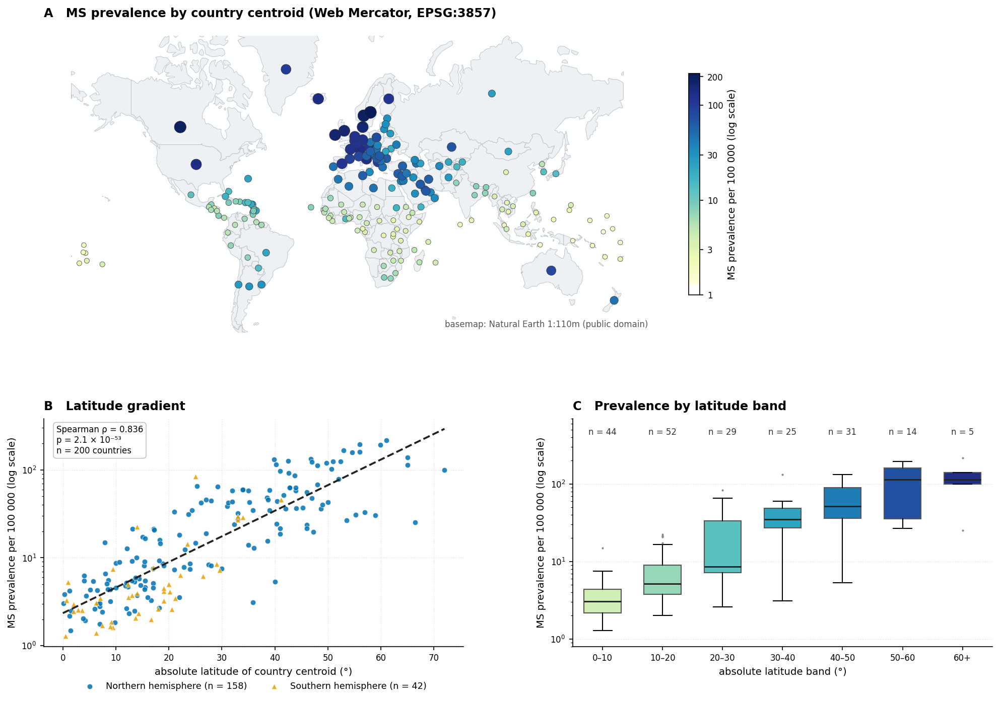
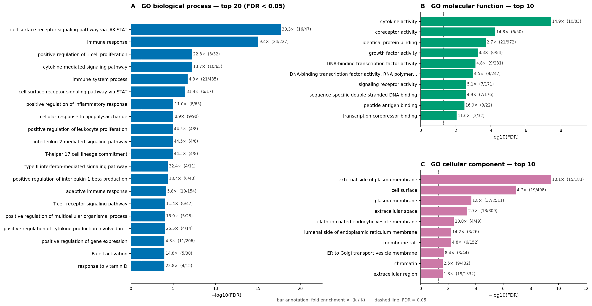
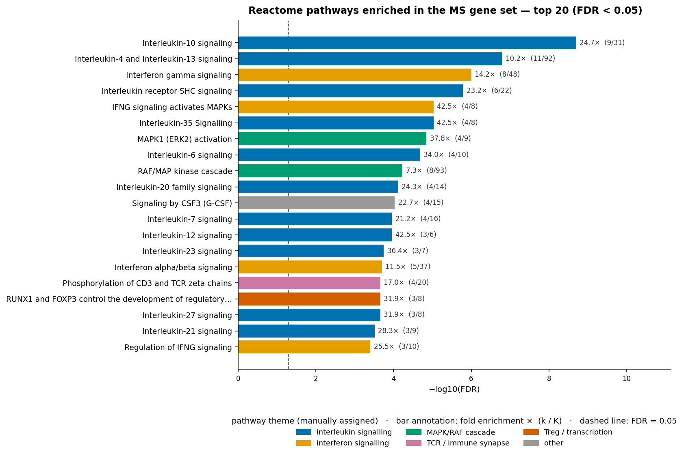
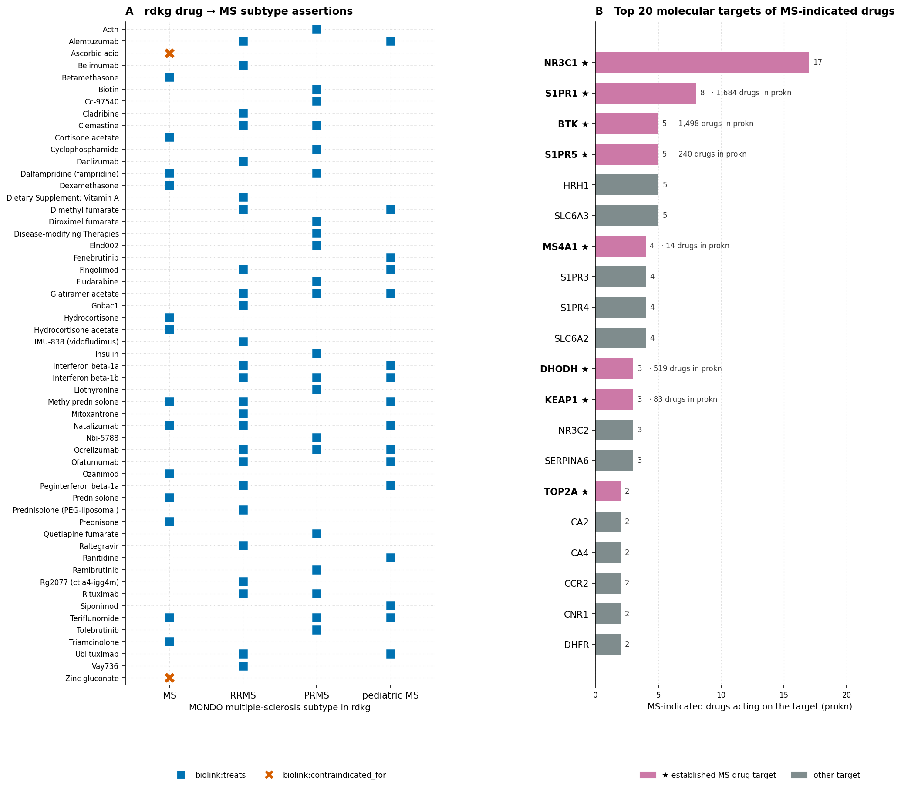
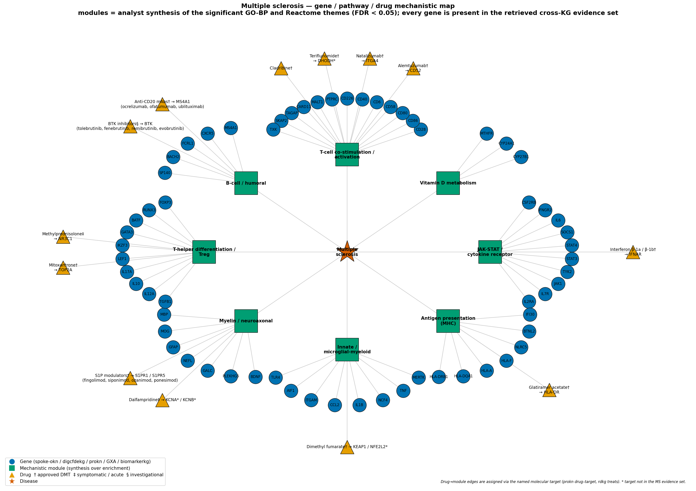
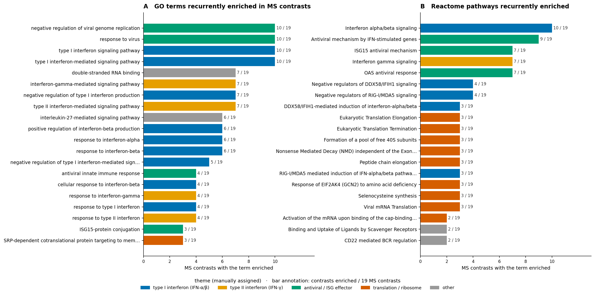

# A federated knowledge-graph map of Multiple Sclerosis: genetics, mechanism, expression, therapeutics, biomarkers and global epidemiology
### Cross-KG integrative analysis over 14 Proto-OKN knowledge graphs via the OKN federated SPARQL endpoint

**Date:** 2026-07-20 · **Endpoint:** OKN federated SPARQL · **Model:** claude-opus-4-8

> **Framing (non-negotiable).** The unit of analysis is a **human gene / protein / drug / biomarker / country**, integrated on shared identifiers (Entrez, UniProt, MONDO/DOID/EFO/UMLS, HP, GO, Reactome, DrugBank, ISO-3166) across 14 knowledge graphs of the Proto-OKN federation. Coverage is whatever those graphs contain as of the versions pinned in §2 — it is **not** a systematic review of the MS literature. Every molecular relationship reported here is a **curated, statistical or co-occurrence association**, not a demonstrated causal mechanism; every epidemiological relationship is an **ecological, country-level association** over modelled (IHME GBD) prevalence estimates. This is **hypothesis generation and knowledge mapping, not causal or clinical inference**. Keep that caveat attached to every downstream claim.

**Abbreviations.** BP = biological process (GO); CC = cellular component (GO); CIS = clinically isolated syndrome; CL = Cell Ontology; DE = differential expression; DMT = disease-modifying therapy; DOID = Disease Ontology identifier; EBV = Epstein–Barr virus; EFO = Experimental Factor Ontology; FDR = false-discovery rate (Benjamini–Hochberg); GBD = Global Burden of Disease; GO = Gene Ontology; GWAS = genome-wide association study; GXA = Gene Expression Atlas; HP / HPO = Human Phenotype Ontology; IFN = interferon; IHME = Institute for Health Metrics and Evaluation; KG = knowledge graph; MF = molecular function (GO); MONDO = Mondo Disease Ontology; MR = Mendelian randomisation; MS = multiple sclerosis; NfL = neurofilament light chain; OCB = oligoclonal bands; ORA = over-representation analysis; PIGEAN = the gene–trait inference method behind CFDE REVEAL; PPMS = primary progressive MS; PRMS = progressive-relapsing MS; RRMS = relapsing-remitting MS; SDoH = social determinants of health; SPMS = secondary progressive MS; UBERON = Uber-anatomy ontology; UI = uncertainty interval; UMLS = Unified Medical Language System.

---

## 1. Executive summary

Multiple sclerosis reassembles, out of 14 independently built Proto-OKN knowledge graphs, as a coherent and recognisable disease. Starting from a single ontology anchor (`MONDO:0005301`) expanded to its 8-term subtype closure and 105 identifier cross-references, we retrieved **2397 genes** carrying at least one line of MS evidence, of which **52 reach Tier A** (four or more independent evidence types from four or more knowledge graphs) and **80 Tier B**. The Tier A/B core — *IL2RA, IL7R, CD6, CD58, CD86, CD40, HLA-DRB1, HLA-DQA1, TYK2, JAK1, STAT3, STAT4, BATF, IKZF3, RUNX3, TNFRSF1A, CLEC16A, EVI5, MERTK, CYP24A1* — is the canonical MS susceptibility set, recovered here without being told what it was.

The mechanism the federation converges on is **cytokine-receptor signalling through JAK-STAT, read out on T-cell costimulation and T-helper lineage choice**. Over-representation analysis against an explicit ProKN background (7663 GO-BP-annotated genes; hypergeometric + Benjamini–Hochberg) makes *cell surface receptor signaling pathway via JAK-STAT* the single most enriched biological process (16/47 genes, 30.33-fold, FDR 2.3e-18), and Reactome — run as a separate family — puts *Interleukin-10 signaling* first (24.67-fold, FDR 2.0e-9), followed by IL-4/IL-13, IFN-γ, IL-12/-21/-23/-27 and the RUNX1–FOXP3 regulatory-T-cell programme. Three secondary signals matter because they are *not* generic immunology: **response to vitamin D** (4/15, 23.8-fold, FDR 1.2 × 10⁻⁴, driven by *CYP27B1* and *CYP24A1*), **microglial cell activation** (4/20, 17.8-fold) and **myelination** (3/24, 11.1-fold). The federation therefore reproduces, from curated graph structure alone, the three-pillar model of MS — peripheral adaptive autoimmunity, innate/microglial CNS inflammation, and a vitamin-D-linked environmental axis.

Independently, the geography reproduces itself too. Joining spoke-okn's IHME GBD-2019 MS prevalence for **200 countries** to Wikidata country centroids — a cross-KG join on ISO-3166 alpha-3 — gives a **Spearman ρ of 0.836 between absolute latitude and MS prevalence (p = 2.1e-53)**, holding separately in the northern (ρ = 0.845, n = 158) and southern (ρ = 0.679, n = 42) hemispheres. Median prevalence rises 41.0-fold from 3.1 per 100,000 within 10° of the equator to 125.3 per 100,000 at 50–60°, from Nauru (1.3) to Sweden (216.5).

What this adds is less a new fact than a demonstrated **method with an audited failure surface**: an MS knowledge map assembled entirely from logged federated queries, with every relationship tagged by its evidence class and contributing graph, and with the gaps stated as loudly as the findings. Those gaps are substantial — adult MS has **zero** HPO phenotype annotation in the federation, neurofilament light chain and oligoclonal bands are absent as named biomarkers, clinically isolated syndrome has no MONDO term under MS at all, and adversarial literature checking (§8) found **4 outright errors** in the graphs' own therapeutic content.

---

## 2. Sources used

Every row below traces to at least one logged, non-exploratory SPARQL query in the reproducibility record. Three graphs were queried and **dropped**; they are listed because they were queried, with the reason for dropping stated — a use-or-drop decision is part of the result.

| KG | Version | Updated | Role in this study | Join key / confidence |
|---|---|---|---|---|
| `ubergraph` | v0.0.2 | 2026-05-01 | MS subtype closure (`rdfs:subClassOf*` over `MONDO:0005301`) and the identifier crosswalk (`skos:exactMatch`, `oboInOwl:hasDbXref`) that every cross-KG disease join runs through | MONDO ↔ DOID/EFO/UMLS/MeSH/NCIT/Orphanet — curated, high confidence |
| `spoke-okn` | v0.0.6 | 2026-03-16 | Curated MS disease–gene associations (164); global MS prevalence (200 countries) and mortality (178 countries) | DOID (node IRI); Entrez for genes; ISO-3166 for geography |
| `digcfdekg` | v0.0.1 | 2026-06-21 | PIGEAN-inferred gene→trait scores for MS and for three MRI progression endpoints (1548 rows, 1059 genes) | MONDO / EFO trait IRIs; Entrez genes — statistical inference, permissive |
| `prokn` | v0.0.5 | 2026-06-23 | GO (BP/MF/CC) and Reactome annotation for enrichment; MS drug indications (945 rows, 249 drugs) and drug→target wiring (94 target symbols) | HGNC symbol on `rdfs:label`; UniProt; MeSH + DOID for indications |
| `gene-expression-atlas-okn` | v0.0.3 | 2026-03-18 | MS differential expression: 9 studies, 19 MS-specific contrasts, 790 DE rows, 332 contrast-level enrichment rows | EFO/MONDO disease; Ensembl/Entrez genes; CL/UBERON context |
| `rdkg` | v0.0.1 | 2026-05-04 | Subtype-resolved therapeutic layer: `treats` / `contraindicated_for` (93 rows, 78 drug nodes) and chemical-exposure risk factors | MONDO; DrugBank / CTDRUG ids — curated |
| `biomarkerkg` | v0.0.2 | 2026-03-16 | 373 MS biomarkers with BEST-style relations and sample source | MONDO — curated |
| `oard-kg` | v0.0.3 | 2026-06-05 | Disease→phenotype (HP) probe; returned coverage only for pediatric and Marburg MS | MONDO ↔ HP — EHR co-occurrence, observational |
| `biohealth` | v0.0.4 | 2026-03-16 | Social determinants and risk-factor concepts for MS (12033 labelled edges across five MS CUIs) | UMLS CUI node IRI — SemMedDB literature co-occurrence |
| `nde` | v0.0.3 | 2026-03-16 | 853 MS datasets and their organisms; the MS↔EBV link | MONDO for disease; UniProt-taxonomy IRIs for organism |
| `wikidata` | *(no VoID provenance)* | — | Country centroid coordinates (`wdt:P625`) joined on ISO-3166 alpha-3 (`wdt:P298`) for the latitude analysis | ISO-3166 alpha-3 — exact string join |
| `pankgraph` | v0.0.1 | 2026-03-23 | **Queried, dropped for disease association.** Its `biolink:Disease` axis contains exactly one node (type 1 diabetes); MS is absent. Retained only as a shared-autoimmune comparator: 13 MS core genes are on its curated T1D list | Ensembl / GO |
| `ncipidkg` | v0.0.1 | 2026-04-03 | **Queried, dropped.** The federated copy is an 858-triple SUMOylation/nuclear-pore demonstration subgraph (16 proteins); zero overlap with the 59 MS core proteins by symbol or by IRI-normalised UniProt | UniProt |
| `evoweb` | v0.0.2 | 2026-06-04 | **Queried, dropped.** 3.27 M member proteins, 100 % `WP_` NCBI non-redundant bacterial/archaeal accessions; no human proteins, no gene symbols, no join key to a human disease analysis | none usable |

Graphs offering MS-relevant payload that were **not** queried, and why: `biobricks-*` and `sawgraph` (chemical/tox and PFAS exposure — no MS-specific exposure question was posed, and rdkg already supplied the curated chemical risk factors); `spoke-genelab` (model-organism spaceflight omics — no MS contrast exists); `biobricks-aopwiki` (adverse-outcome pathways — chemically anchored, not disease-anchored); the geospatial/justice/agriculture cluster (`fiokg`, `spatialkg`, `nikg`, `scales`, `sockg`, `ruralkg`, `dreamkg`) — the MS geographic axis available in the federation is **country-level**, whereas those graphs key on US county FIPS / S2 / ZIP, so no join exists at the resolution the epidemiology is recorded at.

---

## 3. Design & rules

**Anchoring the disease.** MS was anchored on `MONDO:0005301` and expanded through ubergraph's precomputed `rdfs:subClassOf*` closure, which returns 8 terms: multiple sclerosis itself, RRMS, SPMS, PPMS, PRMS, chronic progressive MS, Marburg acute MS and pediatric MS. Those terms carry 105 cross-references (DOID, EFO, UMLS, MeSH, NCIT, Orphanet, SNOMED-CT, MedGen, ICD-9/10/11, NANDO, GARD), and each downstream graph was joined on whichever scheme it actually populates — checked with `probe_namespaces` rather than assumed. Two ontology facts shaped everything that follows. First, **clinically isolated syndrome has no MONDO term beneath multiple sclerosis**, so CIS cannot be an axis of this analysis; it appears only incidentally, inside a GXA study title. Second, coverage of the subtype axis is extremely uneven: spoke-okn carries *only* `DOID:2377` (MS unqualified), biomarkerkg only `MONDO:0005301`, while rdkg resolves therapies against four distinct subtypes and GXA distinguishes RRMS, PPMS and SPMS contrasts. Any subtype-level statement below is therefore constrained to the graphs that model subtypes at all.

**Evidence classes are kept separate, never merged into one score.** Each gene–MS relationship was tagged with the *kind* of evidence it is — `curated_disease_gene` (spoke-okn's curated association), `genetic_association` (digcfdekg PIGEAN inference against the MS trait), `genetic_association_mri_endpoint` (PIGEAN against brain-volume-change or T2-lesion-volume-change progression traits), `differential_expression` (GXA, MS-specific contrasts only), `clinical_biomarker` (biomarkerkg), and `pathway_go_membership` (ProKN GO/Reactome annotation) — together with the contributing graph. The tiering in §4 counts *distinct evidence types* and *distinct graphs*; it deliberately does not weight or average them, so a reader can always see what a rank is made of.

**Thresholds and joins in plain terms.** Differential expression uses GXA's own MS-versus-control contrasts, filtered to the 19 whose contrast name names MS — a necessary step, because the largest study (E-GEOD-60424) also contains ALS, sepsis and type-1-diabetes contrasts that would otherwise have contaminated the MS gene set. Enrichment uses a one-sided hypergeometric test with Benjamini–Hochberg FDR against an **explicit** background: all distinct ProKN gene symbols carrying the relevant annotation type (7663 for GO BP, 8033 for MF, 8094 for CC, 6032 for human Reactome). The foreground is the spoke-okn curated MS gene set, of which 86 genes map into ProKN's GO layer and 71 into its Reactome layer. Terms were tested only where at least three foreground genes hit them. Geography joins spoke-okn country nodes to Wikidata on ISO-3166 alpha-3 — a cross-KG join executed as a single logged query, not a lookup-and-paste. The exact specification, including every predicate IRI and the synthetic-background construction used to preserve the (N, K, n, k) contingency counts, is in the reproducibility file; it is not restated here.

> ***Figure 1. Study design and source inventory (14 Proto-OKN knowledge graphs).*** **(A)** Evidence rows retrieved per knowledge graph, log-scaled; the three graphs hatched as *queried, dropped* (`pankgraph`, `ncipidkg`, `evoweb`) returned no usable MS payload and are shown so the use-or-drop decision is visible rather than silent. **(B)** Distinct entities contributed per graph, grouped by the payload type actually used (gene, drug, biomarker, phenotype, expression, epidemiology, SDoH, ontology cross-reference, dataset metadata). Provenance: row counts are the returned `row_count` of the corresponding logged SPARQL queries; graph payload types from `list_kgs`.

The figure makes the shape of the evidence base explicit: it is heavily skewed toward literature-derived co-occurrence (biohealth, 12,033 edges) and statistical inference (digcfdekg, 1548 rows), with the *curated* layers — the ones a clinician would trust unaided — two orders of magnitude smaller. That asymmetry is why §4 tiers on evidence-type diversity rather than on volume.

---

## 4. Confidence tiers

| Tier | Requirement | Interpretation | n |
|---|---|---|---|
| **A** | ≥ 4 distinct evidence types from ≥ 4 knowledge graphs | Independently corroborated across curated, statistical, expression and clinical evidence classes. Suitable as a prior for target or biomarker work. | 52 |
| **B** | Exactly 3 distinct evidence types | Well supported but with one evidence class missing — typically no differential-expression or biomarker record. | 80 |
| **C** | ≤ 2 distinct evidence types | Single-source or two-source support. Dominated by the 1059-gene PIGEAN inference set, which is broad by construction; treat as a screening list, not a claim. | 2265 |

Tiers count evidence *diversity*, not evidence *strength*: a Tier A gene is one that four different kinds of study design agree on, which is a different and more conservative claim than "this gene has a large effect". It also means Tier A is biased toward genes that are easy to measure in blood — a gene expressed only in CNS lesions can never accrue a `differential_expression` tag from the peripheral-blood contrasts that dominate GXA's MS coverage. *HLA-DRB1*, by far the largest genetic effect in MS, sits in **Tier B** for exactly this reason (three types, three graphs, no DE or biomarker record) — a clean illustration that these tiers order corroboration, not importance.

---

## 5. Findings by axis

### 5.1 Cross-KG consensus: which genes the federation agrees on

Of 2397 genes with any MS evidence, 132 carry three or more independent evidence types. The Tier A set is dominated by the T-cell activation and cytokine-receptor machinery — *IL7R, IL2RA, CD6, CD58, CD86, CD226, PTPRC, TXK, MALT1, LEF1, BATF, RUNX3, FOXP1, STAT3, STAT4, JAK1, TYK2, GRB2, MAPK1, CSF2RB, IFNGR2, TNFRSF1A* — with three notable non-immune members: *CYP24A1* (vitamin D 24-hydroxylase), *GALC* (galactosylceramidase, the myelin-lipid enzyme mutated in Krabbe disease) and *MERTK* (the phagocytic receptor that mediates myelin-debris clearance by microglia and macrophages). Five genes achieve the maximum five evidence types — *CD86, TXK, MERTK, ZC3HAV1, IFNGR2* — each supported by curated association, genetic inference, differential expression, biomarker record and pathway membership simultaneously.

> ***Figure 2. Cross-knowledge-graph evidence consensus.*** **(A)** Number of genes by count of distinct evidence types (log y-axis), with the Tier A / B / C bands annotated. **(B)** The top 30 genes ranked by evidence-type count, then by number of contributing graphs, then by PIGEAN score; bars coloured by tier and annotated with the number of contributing knowledge graphs. Provenance: `gene_evidence_master.csv`, assembled from spoke-okn `ASSOCIATES_DaG`, digcfdekg `geneToTrait`, GXA MS contrasts, biomarkerkg `diagnostic_for`/`prognostic_for`/`indicates_risk_of_developing`, and ProKN GO/Reactome annotation.

The distribution in panel (A) is the honest headline: 94 % of the retrieved genes rest on one or two evidence types, almost all of them from the permissive PIGEAN inference layer. Consensus is scarce, and the 52 genes that achieve it are worth more than the 2,265 that do not.

### 5.2 Genetic architecture: curated versus statistically inferred

The two genetic layers behave exactly as the methodology predicts they should. spoke-okn's curated layer returns 164 MS genes — a tight, GWAS-derived, immune-dominated list. digcfdekg's PIGEAN layer returns 1059 genes for the MS trait, ranked by a combined score topped by *CD28* (10.6), *IL7R* (10.0), *IKZF3* (9.76), *HLA-A* (9.26), *CD27* (9.07), *SOCS1* (8.80), *CD40* (8.73). The two overlap in 132 genes — 80 % of the curated set — which is strong mutual corroboration at the top and rapid divergence below it. This is the expected signature of a **broad, permissive** inference set: it is not a contradiction, and a null enrichment against such a set would not be evidence of absence.

digcfdekg additionally carries three MS **progression** traits that the other graphs do not model at all: *brain volume change in MS progression* (249 gene rows), *T2 lesion volume change in MS progression* (283) and *MS symptom measurement* (36). These are the federation's only quantitative handle on progression as distinct from susceptibility, and they are the reason `genetic_association_mri_endpoint` is kept as its own evidence class rather than folded into `genetic_association`.

### 5.3 Molecular profile by entity type

Organised by entity class, the retrieved profile is:

- **Protein-coding genes** — 2397 total, 52 Tier A. The core is listed in §5.1.
- **Non-coding RNAs** — kept separate, and the finding is largely negative. The evidence set contains a small number of antisense and lincRNA symbols (*TET2-AS1*, *LINC01934*, *SAP30BP-AS1*, *TBC1D22A-AS1*) arriving only through the GXA differential-expression layer; **no knowledge graph in the federation supplies a curated MS↔ncRNA association**. Given how prominent miRNA biomarkers are in the MS literature, this is a coverage gap, not a biological statement.
- **Genetic variants** — present only as **dbSNP identifiers inside biomarkerkg labels** (e.g. `rs6498169` in *CLEC16A*, `rs719316` in *ATXN1*), 360 of the 394 biomarker rows. No graph exposes MS variants as first-class typed entities with effect sizes: rdkg's `SequenceVariant`/`causes_condition` axis returns nothing for MS, and pankgraph's variant layer has no MS disease node. **Variant-level analysis is therefore not supported by this federation for MS**, and none is claimed here.
- **Proteins and protein complexes** — reached through ProKN's gene→`encodes`→UniProt path, which is what carries the GO and Reactome annotation. The dedicated protein-interaction graph (`ncipidkg`) proved to be a demonstration subgraph with zero MS overlap (§2), so **no protein–protein interaction or post-translational-modification layer was obtainable**.
- **Pathways and gene sets** — 1,043 distinct GO BP terms, 360 Reactome pathways and 4,000-odd digcfdekg latent factors touch the MS gene set; the enriched subsets are §6.
- **Biological processes / molecular functions / upstream regulators** — §6.1. The upstream-regulator signal is unmistakable: nine of the 52 Tier A genes are transcription factors or STATs (*STAT3, STAT4, RUNX3, BATF, FOXP1, LEF1, ERG, SMARCA4, NR1D1*), and *NR1D1* (REV-ERBα) additionally links the circadian axis to Th17 differentiation.

### 5.4 Disease-associated molecular activity: tissue, compartment, cell type and stage

GXA supplies 9 MS studies and 19 MS-specific contrasts, which between them resolve the axes the objectives asked for: **immune compartment** (whole blood, peripheral blood, cerebrospinal fluid), **cell type** (CD4 T cells, CD8 T cells, B cells, monocytes, neutrophils), **CNS tissue** (cortical tissue in SPMS), **subtype** (RRMS in E-GEOD-66573; SPMS in E-GEOD-32645; PPMS in E-GEOD-23205) and **treatment status** (before versus after IFN-β, in five paired cell-type contrasts of E-GEOD-60424).

> ***Figure 3. Differential expression by compartment, cell type, subtype and treatment status (gene-expression-atlas-okn).*** **(A)** All 19 MS-specific contrasts, showing up-regulated (red) and down-regulated (blue) gene counts, grouped by compartment and annotated with subtype and with the number of enriched terms where gene-level rows were absent. Contrasts labelled *no DE genes retrieved* carry only contrast-level enrichment in the federated copy. **(B)** The 13 genes recurring in ≥ 2 MS contrasts, as a gene × contrast panel coloured by direction. Provenance: GXA `biolink:GeneExpressionMixin` associations whose subject assay belongs to a study `biolink:studies` an MS disease node, restricted to assays whose contrast name names MS.

Two things are visible and both are important. The signal that recurs across compartments is **interferon-stimulated**: *OASL* and *JCHAIN* are up in two contrasts each, *PLAU* down in two, alongside single-contrast *IFI44L, RSAD2, PARP9, PLSCR1, ZNFX1* — a textbook ISG panel. But the coverage is thin and asymmetric: only 5 of the 19 contrasts carry gene-level rows in the federated copy (they hold all 790), and several biologically interesting contrasts — SPMS cortical tissue, MS CD8 before IFN-β, MS B cells before IFN-β — return enrichment terms but no genes. **Direction-of-change statements are therefore reliable only for the five contrasts that carry gene rows**, and the SPMS-cortex result in particular cannot be read at gene level from this federation.

### 5.5 Global epidemiology and the latitude gradient

spoke-okn carries MS prevalence for 200 countries (IHME, GBD 2019, expressed as percent of population with 95 % uncertainty intervals) and all-cause MS mortality for 178 countries (WHO Global Health Estimates). Neither carries coordinates, so the geography was obtained by a **cross-KG join to Wikidata** on ISO-3166 alpha-3 (`wdt:P298`) retrieving country centroids (`wdt:P625`) — the single query that makes the spatial analysis possible, and one that is logged in full.

> ***Figure 4. Global MS prevalence and the latitude gradient (spoke-okn × wikidata).*** **(A)** 200 country centroids on a reprojected (EPSG:3857) basemap, marker colour and size encoding MS prevalence per 100,000 on a log scale. **(B)** Absolute latitude versus prevalence per 100,000 (log y), coloured by hemisphere, with a fitted trend and Spearman ρ = 0.836, p = 2.1e-53, n = 200. **(C)** Prevalence per 100,000 by 10° absolute-latitude band, with n per band. Provenance: prevalence from spoke-okn `PREVALENCE_DpL` reified statements on `DOID:2377` (`so:value` as percent, `so:lower`/`so:upper` as the 95 % UI, `dct:source` = IHME, `so:year` = 2019); coordinates from wikidata `wdt:P625` joined on `wdt:P298`. *Basemap note:* the static panel uses an offline Natural Earth 1:110 m coastline because the analysis sandbox blocks tile hosts; the interactive map below uses live OpenStreetMap tiles.

<!-- INTERACTIVE_MAP: figures/map_ms_prevalence_iframe.html -->

*Interactive map: click any country marker for its prevalence, 95 % uncertainty interval, GBD year and source. Basemap © OpenStreetMap contributors; coordinates from wikidata `wdt:P625`.*

The gradient is monotone across every band and survives hemispheric separation, which rules out the simplest confounder (a single high-prevalence northern cluster driving the correlation). It does **not** rule out the substantive ones, and the report states them rather than burying them: GBD prevalence figures are *modelled* estimates that borrow strength across geographies and health-system data availability, HLA-DRB1\*15:01 allele frequency is itself latitude-varying, and a country-centroid join is an ecological design in which vitamin D exposure, EBV infection timing, ancestry and ascertainment are inseparable. The correct reading is that the federation **reproduces** a known gradient with an independent data path, not that it independently confirms its cause.

A data-quality finding belongs here too. spoke-okn's `so:mortality_per_100k` edge property is **mis-scaled by a factor of 1,000**: the United States record reports 1,549.85 "per 100k" against 5,100 deaths in a population of 329,065,000, which is 1.55 per 100,000. The underlying `so:value` (deaths) and `so:population` are internally consistent, so the rate is recomputable — but the published field name is wrong, and any analysis trusting it would overstate MS mortality a thousand-fold. This is reported to the reader, not silently corrected.

### 5.6 Environmental and social risk factors

Two graphs carry risk-factor content, at very different evidence grades. **rdkg** asserts curated `contributes_to` edges from chemical exposures to MS: **tobacco smoke pollution, organic solvents, lead, mercury** — and, revealingly, *teriflunomide*, which is an MS **drug**, not a risk factor. That entry is an entity-resolution error in the graph (a drug misfiled into the `ChemicalExposure` class) and is flagged rather than reported as a finding. **biohealth** contributes 12033 labelled edges across five MS UMLS concepts, with risk-factor concept buckets covering EBV and other herpesviruses (91 rows / 26 concepts), vitamin D (62/15), sex, gender and reproductive factors (104/39), ancestry (54/25), smoking (36/19), obesity (26/8) and socioeconomic indicators (25/14). Provenance on the SDoH subset is 460 reified statements, 459 of them PubMed-derived — i.e. **SemMedDB literature co-occurrence, the weakest evidence class in this study**. biohealth also carries explicit negated predicates (`NEG_PREDISPOSES`, `NEG_COEXISTS_WITH`); these are assertions that something is *not* associated, and counting them as support would invert their meaning. They were excluded.

The EBV link is the one environmental factor the federation supports with a data object rather than a co-occurrence count: **nde** contains 853 MS datasets, and taxid 10376 (Human gammaherpesvirus 4) co-occurs with MS on two GEO datasets, one squarely on topic — GSE221624, *"Unstable EBV latency drives inflammation in multiple sclerosis patient derived spontaneous B cells"*. §8 records the important qualification: that dataset maps to a preprint, and the decisive epidemiology (the 10-million-person military seroconversion cohort) is not represented in the federation at all.

---

## 6. Domain analyses

### 6.1 Functional enrichment — declared coverage

**Families run: GO biological process, GO molecular function, GO cellular component, Reactome pathway, and the disease/trait gene-set family (both its broad and its curated arms).** Families deliberately **skipped**: chemical / adverse-outcome-pathway set enrichment (`biobricks-*`, `biobricks-aopwiki`) — skipped because no chemical-exposure question was posed for MS and the curated chemical risk factors were already obtained from rdkg; and phenotype (HP) set enrichment — skipped because, as §6.3 shows, adult MS has no HP annotation in the federation to enrich against, so the test is undefined rather than negative.

> ***Figure 5. Gene Ontology enrichment of the curated MS gene set (prokn, symbol-bridged).*** **(A)** Top 20 biological-process terms at FDR < 0.05 of 135 tested (118 significant), ranked by −log₁₀(FDR) and annotated with fold enrichment and (k/K). **(B)** Top 10 molecular-function terms (24 of 43 significant). **(C)** Top 10 cellular-component terms (12 of 32 significant). Foreground: the spoke-okn curated MS gene set (86 genes mapped into ProKN for BP, 65 for MF, 66 for CC). Background: all ProKN gene symbols carrying that annotation type (7663 / 8033 / 8094). One-sided hypergeometric + Benjamini–Hochberg FDR. Provenance: prokn Gene →`SIO_010078` encodes→ Protein →`RO_0002331` involved in / `RO_0002327` enables / `up:partOf`→ GO. Symbol-bridged, therefore lower-confidence than an id-keyed join.

The BP result is not merely "immune": it is specifically a **receptor-proximal cytokine-signalling** result. *cell surface receptor signaling pathway via JAK-STAT* leads at 30.33-fold, followed by immune response (9.4-fold), positive regulation of T-cell proliferation (22.3-fold), cytokine-mediated signalling (13.7-fold), IL-2-mediated signalling (44.6-fold) and **T-helper 17 cell lineage commitment** (4/8, 44.6-fold, FDR 1.2 × 10⁻⁵). Alongside these sit three terms that carry the disease-specific content: **response to vitamin D** (4/15, 23.8-fold, FDR 1.2 × 10⁻⁴), **microglial cell activation** (4/20, 17.8-fold, FDR 2.6 × 10⁻⁴) and **macrophage differentiation** (4/16, 22.3-fold). The MF panel localises the mechanism to **cytokine activity** (10/83, 14.9-fold) and **coreceptor activity** (6/50, 14.8-fold) with **peptide antigen binding** (3/22, 16.9-fold) capturing the MHC contribution; the CC panel puts it on the **external side of the plasma membrane** (15/183, 10.1-fold, FDR 3.6 × 10⁻¹⁰) and the **cell surface** (19/498). Read together, the three aspects say the same thing in three vocabularies: MS risk genes encode *cell-surface receptors and their immediate signalling partners*, which is precisely the compartment that biologic DMTs act on.

> ***Figure 6. Reactome pathway enrichment (prokn, symbol-bridged) — a separate family from Figure 5.*** Top 20 of 47 pathways tested (43 significant at FDR < 0.05), ranked by −log₁₀(FDR), annotated with fold and (k/K), bars coloured by manually assigned theme. Foreground 71 genes; background 6032 ProKN genes with a human (R-HSA) Reactome pathway. One-sided hypergeometric + Benjamini–Hochberg FDR. Provenance: prokn Gene →`SIO_010078`→ Protein →`RO_0000056` participates in→ `up:Pathway`, filtered to R-HSA.

Reactome resolves the same biology into named cytokine axes and adds information GO does not: *Interleukin-10 signaling* (9/31, 24.67-fold), IL-4/IL-13 (11/92), **IFN-γ signalling** (8/48) and *IFNG signalling activates MAPKs* (4/8, 42.5-fold), IL-35, IL-6, IL-12, IL-23, IL-21, IL-27, IL-15, IL-2, plus **RUNX1 and FOXP3 control the development of regulatory T lymphocytes** (3/8, 31.9-fold), *Phosphorylation of CD3 and TCR zeta chains*, *Translocation of ZAP-70 to the immunological synapse* and *Co-inhibition by PD-1*. The regulatory-T-cell and immunological-synapse terms are the ones GO's broader vocabulary blurs — concrete evidence that running Reactome as a distinct family, rather than treating it as a GO variant, changes the conclusion.

### 6.2 Disease and trait gene-set enrichment

Both arms were run, as the methodology requires. The **broad** arm — digcfdekg's PIGEAN gene→trait sets — covers 1059 genes for MS alone and is null by construction against any large gene list; its informative output is not a p-value but the **ranking** (§5.2), and it is reported as such. The **curated** arm — rdkg's disease→gene layer, the discriminating test — returns **no genetic association for MS at all**: rdkg's MS node carries only `contributes_to` edges from chemical exposures. rdkg is a rare-disease graph, and MS is a common complex disease, so this is a scope limitation rather than a negative result; but it means **the discriminating curated-disease-gene test could not be performed for MS in this federation**, and no claim is made from it.

### 6.3 Clinical phenotypes — a documented gap

Routing disease→HP through the two suppliers the capability index names (oard-kg richest, rdkg cleaner) returns 209 HP terms for **pediatric MS**, 2 for **Marburg acute MS**, four inheritance/onset terms from rdkg, and **0 for adult multiple sclerosis**. Inspecting the pediatric terms shows why even those are unusable: they include *microcephaly*, *otitis media*, *low-set ears* and *high palate* — EHR co-occurrence in a pediatric population, not MS semiology. oard-kg is explicitly an EHR co-occurrence resource for **rare** diseases, and MS is neither rare nor coded the way its pipeline expects.

The consequence is stark and worth stating plainly: **the canonical MS clinical phenotype — optic neuritis, internuclear ophthalmoplegia, Lhermitte's sign, spasticity, ataxia, neurogenic bladder, fatigue, Uhthoff's phenomenon — is entirely absent from this federation.** §8 confirms against the literature that this is a knowledge-graph coverage gap and not a gap in medical knowledge. Objective-6 "clinical phenotypes" is therefore answered as: *not obtainable from the OKN federation as currently constituted*.

### 6.4 Biomarkers

biomarkerkg supplies 373 distinct MS biomarkers across 394 assertions: 344 `indicates_risk_of_developing`, 42 `diagnostic_for`, 8 `prognostic_for`, and **zero** `monitors_status_of`. The risk category is almost entirely **dbSNP variants in named genes** — *CLEC16A* rs6498169, *ATXN1* rs719316, *SGMS1* rs2688883, *PDZRN4* rs1458175, *TRIM2* rs12644284 and 350 more — i.e. genetic risk markers rather than measurable analytes, which is a different clinical object from what "biomarker" usually means at the bedside.

The genuinely clinical entries are the 42 diagnostic ones, and they are informative. **Elevated immunoglobulin (IgG, IgA, IgM) in cerebrospinal fluid** is present with CSF as an explicit sample source — this is the intrathecal-immunoglobulin axis that underlies oligoclonal banding, captured as an analyte rather than as the named test. **Decreased urate** appears across CSF, urine and bodily fluid; **increased quinolinic acid** in urine (flagged `biomarker_term_in_review` in the source, and §8 could find no primary literature for it — treat as unverified). Sample sources cover CSF (7), blood plasma (6), blood serum (6) and urine (7). Sphingosine-1-phosphate receptors 1 and 5, sphingosine kinases 1 and 2, IFN-γ and IL-17A appear as *assessed entities* — the molecular readouts behind several markers, and a direct bridge to the S1P-modulator drug class in §6.5.

What is **not** there is decisive: **neurofilament light chain and oligoclonal bands — the two biomarkers that actually drive MS diagnosis and monitoring — are not retrievable as named MS biomarkers from any graph in the federation**, and MRI biomarkers appear only obliquely, as digcfdekg's two MRI-derived progression *traits* (brain-volume change, T2-lesion-volume change; §5.2). Ranking biomarkers "by evidence strength and clinical utility" as the objectives requested is therefore only partially possible: the federation ranks genetic risk markers well and clinical monitoring markers not at all.

### 6.5 Therapeutic landscape

Three layers, at three different evidence grades, and they must not be flattened into one.

**Layer 1 — curated, subtype-resolved (`rdkg`).** 93 rows across 4 MS subtypes: 91 `treats` and 2 `contraindicated_for`, over 78 drug nodes (55 after merging trial-arm variants). This layer recovers essentially the entire modern DMT armamentarium and — uniquely in the federation — assigns it to subtypes: interferon β-1a/1b and peginterferon β-1a, glatiramer acetate, fingolimod, ozanimod, siponimod, natalizumab, ocrelizumab, ofatumumab, ublituximab, rituximab, alemtuzumab, cladribine, dimethyl fumarate and diroximel fumarate, teriflunomide, mitoxantrone, daclizumab; symptomatic agents dalfampridine/fampridine and clemastine; corticosteroids; and investigational agents including the BTK inhibitors **tolebrutinib, remibrutinib and fenebrutinib**, the DHODH inhibitor IMU-838 (vidofludimus), the anti-BAFF-R VAY736, and GNbAC1 — an anti-HERV-W-envelope antibody, i.e. the endogenous-retrovirus hypothesis represented as a drug node.

**Layer 2 — mechanistic targets (`prokn`).** 249 MS-indicated drugs, 147 with target wiring, 94 distinct target gene symbols. Correct and useful: fingolimod / siponimod / ozanimod / ponesimod → **S1PR1/3/4/5**; teriflunomide → **DHODH**; dimethyl fumarate and diroximel fumarate → **KEAP1** (with NFE2L2 downstream); ocrelizumab / ofatumumab / rituximab → **MS4A1**; mitoxantrone → **TOP2A**; dalfampridine → **KCNA/KCNB/KCNC/KCND**; methylprednisolone → **NR3C1**. Note that ProKN's *indication* layer is keyed predominantly on **MeSH** (D009103 = 514 rows, D020529 = 243, D020528 = 153) with DOID contributing only 26 — a graph where following the obvious DOID path would have retrieved 5 % of the content.

**Layer 3 — target-anchored pipeline and repurposing.** Inverting the target→drug relation over the MS target set returns 4507 rows and 4075 distinct compounds, of which the phase ≥ 3 agents cluster on exactly the targets Layer 2 identified: S1PR1 (ponesimod, siponimod, ozanimod, etrasimod, cenerimod, mocravimod), BTK (13 agents), MS4A1 (12), DHODH (teriflunomide, leflunomide, vidofludimus), KEAP1/NFE2L2 (fumarates, omaveloxolone), CD80 (galiximab), IL2RA (inolimomab). The **repurposing signal** is where the same target is already drugged for another indication: *etrasimod*, *cenerimod* and *mocravimod* on S1PR1 (developed for ulcerative colitis, lupus and graft-versus-host disease respectively); *omaveloxolone* on the NRF2 axis (approved for Friedreich ataxia); *leflunomide* on DHODH (rheumatoid arthritis); *galiximab* on CD80. Each is a **mechanistic-similarity hypothesis, not a clinical recommendation** — the evidence layer is "acts on a target that an approved MS drug also acts on", which is the weakest rung that still deserves the name.

> ***Figure 7. Therapeutic landscape.*** **(A)** Drug × MS subtype matrix from rdkg: squares mark asserted `treats` edges against the four MONDO subtypes rdkg models (MS, RRMS, PRMS, pediatric MS); the two `contraindicated_for` entries (ascorbic acid, zinc gluconate) are marked distinctly. Trial-arm variants have been normalised to a single agent. **(B)** Top 20 molecular targets by number of MS-indicated ProKN drugs acting on them, with the eight key MS targets highlighted. Provenance: rdkg `biolink:treats` / `contraindicated_for` on the MONDO subtree; prokn `NCIT_C41184` (Indication) plus `up:activity` / `RO_0002436` target wiring.

Panel (A) also exposes an ontology artefact worth naming: the BTK inhibitors land on **pediatric MS** and **progressive-relapsing MS** rather than on the relapsing and progressive forms they are actually being trialled in, because rdkg's clinical-trial-derived drug nodes inherit whichever MONDO term the source trial record was coded to. §8 confirms this assignment is wrong for two of the three agents. Panel (B)'s top target, **NR3C1** (17 drugs), is the glucocorticoid receptor — an artefact of corticosteroid breadth rather than an MS-specific insight.

### 6.6 The mechanistic synthesis

> ***Figure 8. Radial anchor → module → gene → drug mechanistic map of multiple sclerosis.*** Anchor: multiple sclerosis. The eight modules are a **declared synthesis** over the enrichment output of §6.1 and curated pathway membership — they are an interpretive grouping, not a retrieved object. Every one of the 63 genes shown was verified present in the retrieved evidence set (`gene_evidence_master.csv`); none was added for narrative convenience. Drug nodes are labelled by evidence layer: approved DMT, investigational, or symptomatic. Provenance: genes from spoke-okn `ASSOCIATES_DaG` + digcfdekg `geneToTrait` + GXA MS contrasts; module assignment from prokn GO/Reactome enrichment; drugs from rdkg `treats` and prokn target wiring.

The map's value is that the drug layer attaches to only a subset of the modules. **B-cell/humoral** (MS4A1 → the anti-CD20 antibodies), **JAK-STAT/cytokine receptor** (IL2RA → daclizumab, historically), **T-cell trafficking** (ITGA4 → natalizumab, S1PR1/5 → the S1P modulators) and **pyrimidine/oxidative-stress** (DHODH → teriflunomide, KEAP1 → fumarates) are drugged. **Innate/microglial–myeloid**, **myelin/neuroaxonal** and **vitamin D metabolism** are essentially **undrugged** — and those are precisely the modules that the progression literature (§8, Claim 4) identifies as driving non-relapsing disability accrual. The map makes the therapeutic gap in MS structurally visible: the federation's drug layer covers the peripheral adaptive-immune modules almost completely and the CNS-compartmentalised modules almost not at all.

### 6.7 The interferon signature across MS contrasts

> ***Figure 9. Contrast-level enrichment across MS studies (gene-expression-atlas-okn).*** **(A)** Top 20 GO terms and **(B)** top 20 Reactome pathways, ranked by the number of MS-specific contrasts in which they are enriched, coloured by theme (type I IFN / type II IFN / antiviral–ISG / translation–ribosome / other). Provenance: GXA associations carrying `wobd:enrichment_source` `GXA:GO` / `GXA:Reactome`, restricted to MS-named contrasts (332 rows over 13 contrasts).

The dominance is near-total: *response to virus*, *type I interferon-mediated signalling*, *negative regulation of viral genome replication*, *interferon-γ-mediated signalling*, *response to interferon-β*; and in Reactome, *Interferon alpha/beta signalling*, *Antiviral mechanism by IFN-stimulated genes*, *ISG15 antiviral mechanism*, *OAS antiviral response*, *RIG-I/MDA5-mediated induction of IFN-α/β*. This is a striking convergence with the EBV axis of §5.6 — but §8 is emphatic that the federated contrast design **cannot separate the pharmacodynamic footprint of interferon-β therapy from endogenous disease biology**, because the studies contributing most contrasts are IFN-β treatment studies. The signature is real; its attribution is not resolvable here.

---

## 7. Discussion

Read as one argument, the axes agree on a specific model. MS susceptibility, as encoded across these graphs, is written almost entirely in the language of **cell-surface immune receptors and their receptor-proximal signalling** — the GO cellular-component result (external side of plasma membrane, 10-fold) and the molecular-function result (cytokine activity, coreceptor activity) say this independently of the pathway result. The pathway result then specifies *which* receptors: the γ-chain and IL-12-family cytokine receptors signalling through JAK1/TYK2 onto STAT3/STAT4, with the transcriptional output read out on T-helper lineage commitment (BATF, RUNX3, IKZF3, FOXP3, GATA3, LEF1). That is a mechanism with an unusually direct therapeutic corollary, and the therapeutic layer confirms it: every approved MS DMT with a clean target in ProKN acts on a surface receptor or on a metabolic step immediately upstream of lymphocyte proliferation.

The two non-immune modules are where the interesting predictions are. **Vitamin D metabolism** enters not as an epidemiological correlate but as a *genetic* one — *CYP27B1* and *CYP24A1* are in the curated MS gene set, and their enrichment for "response to vitamin D" is 23.8-fold. That is the same axis the latitude gradient (§5.5) points at from the opposite direction, and §8 confirms that Mendelian randomisation supports a causal reading. The prediction this generates is testable and specific: **stratifying MS trials by *CYP27B1*/*CYP24A1* genotype should modify vitamin-D-supplementation effect size**, and the recent positive CIS trial gives that a place to be tested. **Microglial activation and myelin biology** (*MERTK*, *GALC*, *MBP*, *MOG*, *GFAP*, *NEFL*) form a second module that is genetically supported, enrichment-supported, and — per Figure 8 — essentially undrugged. *MERTK* is the sharpest single hypothesis the map produces: it is Tier A with five evidence types, it is the phagocytic receptor for myelin-debris clearance, and it sits at the junction of the innate-immune and remyelination modules where no approved therapy acts.

The geography and the molecular biology meet at EBV. The federation supplies the environmental term (nde's MS↔EBV datasets), the transcriptional term (a pervasive antiviral/ISG signature across every immune compartment), and the genetic term (HLA class II, plus *ZC3HAV1* — a zinc-finger antiviral protein — reaching Tier A with five evidence types). It does not supply the causal epidemiology, and it should not be read as if it did.

Finally, a methodological implication. Three of the fourteen graphs queried returned nothing usable, one carried a mis-scaled numeric field, one misfiled a drug as an environmental exposure, and one assigned investigational drugs to the wrong disease subtype through inherited trial coding. **None of these would have been visible without adversarial checking**, and none is detectable from within a single graph. Cross-KG integration is not only an evidence-amplification method; it is an error-detection method, and the error rate observed here — four substantive content errors across the therapeutic layer alone — is the strongest argument in this report for why federated claims need the literature loop in §8 rather than instead of it.

---

## 8. Comparison with prior work

According to **PubMed** (via the PubMed MCP connector) and full-text sources retrieved through **Paperclip**, ten headline claims from this analysis were checked against the primary literature; every PMID below was resolved and its metadata verified, and claims that could not be corroborated are marked as such. The full per-claim document with citations is [MS_literature_comparison.md](https://github.com/sbl-sdsc/mcp-okn/blob/main/docs/examples/MS/MS_literature_comparison.md).

| # | Claim | Concordance |
|---|---|---|
| 1 | Consensus gene core is the canonical MS GWAS immune set | **SUPPORTED** — every gene falls inside IMSGC 2011 / 2013 / 2019 sets. Caveat: the flat ranking hides that HLA-DRB1\*15:01 dwarfs all non-MHC effects [1–3] |
| 2 | JAK-STAT / interleukin signalling as core mechanism | **PARTIALLY SUPPORTED** — biology canonical; therapeutic inference half wrong. No JAK inhibitor is in late-stage MS development; the IL-12/23 arm was tested and **failed** (ustekinumab); the IL-2R arm was drugged then withdrawn (daclizumab). BTK acts on BCR/Fc/TLR signalling, not JAK-STAT [1,4–6] |
| 3 | Vitamin D metabolism (CYP27B1 / CYP24A1) | **SUPPORTED** — rare CYP27B1 loss-of-function over-transmission; MR OR ≈ 2.0 per SD lower 25(OH)D, replicated; positive D-Lay MS trial in CIS [7–10] |
| 4 | Microglial activation | **SUPPORTED** — the headline finding of the 2019 genomic map, plus the MIMS/C1q lesion-rim work and the smouldering-progression framework [1,11,12] |
| 5 | Peripheral interferon signature | **PARTIALLY SUPPORTED** — an endogenous type I IFN subtype is real in untreated MS and predicts *poor* IFN-β response, but the GXA contrasts cannot separate drug pharmacodynamics from disease biology [13,14] |
| 6 | EBV link | **SUPPORTED** biologically, with a provenance flag — the decisive evidence is the 10-million-person military seroconversion cohort (32-fold risk); the KG's edge rests on a preprint and the cohort study is absent from the federation [15–17] |
| 7 | Latitude gradient | **SUPPORTED** with caveats — replicated meta-analyses, gradient *increasing* over time; but GBD prevalence is modelled, so ρ = 0.836 is not an independent confirmation, and ascertainment and HLA-DRB1 ancestry collinearity are unresolved [19–22] |
| 8 | NfL and OCB are the clinically dominant biomarkers, and are absent here | **SUPPORTED** — a real KG gap. OCB is in the McDonald 2017 criteria; serum NfL Z-scores are prognostically validated. Urate is a correlate, not causal (MR null). Quinolinic acid: **NOVEL-OR-UNVERIFIED**, no source found [23–27] |
| 9 | Therapeutic mechanism assignments and subtype mapping | **PARTIALLY SUPPORTED** — DHODH / KEAP1 / MS4A1 / TOP2A / Kv correct; **S1P receptor selectivity is over-assigned** (siponimod and ozanimod are S1P1/S1P5-selective, ponesimod S1P1-selective); **BTK subtype assignment is wrong for two of three agents** — only tolebrutinib has a positive progressive-MS result and it *missed* in relapsing MS; no pediatric-MS BTK evidence exists [28–30] |
| 10 | Adult MS phenotype gap is a KG artefact, not missing knowledge | **SUPPORTED** — canonical MS semiology is textbook-level and in the diagnostic criteria; the federation's zero-row result is a coverage gap [12,23,31] |

Central claims verified against full text: the latitude meta-analyses (Claim 7), the EBV cohort and its mechanism paper (Claim 6), and the BTK trial reports (Claim 9).

**Where the KG evidence diverges from the literature.** Four divergences are outright **errors in the graphs**, found by inspecting the extracted tables against the literature: (i) ProKN over-assigns S1P receptor selectivity, listing pan-S1PR activity for agents that are pharmacologically S1P1/S1P5-selective; (ii) ProKN lists **DHFR** alongside DHODH as a teriflunomide target — teriflunomide is a DHODH inhibitor, and the DHFR edge is a bioactivity-screen artefact; (iii) rdkg's BTK-inhibitor subtype assignment is an ontology artefact of trial coding, placing agents on pediatric MS where no pediatric evidence exists; (iv) entity-resolution noise carries *dimethyl ether* into the MS-indicated chemical set — a name collision with dimethyl fumarate — while alemtuzumab and glatiramer acetate resolve with zero targets. Two further divergences are **scope**, not error: the EBV provenance gap (Claim 6) and the interferon attribution ambiguity (Claim 5). Each of these is a testable prediction in the trivial sense that a corrected graph would change the answer.

---

## 9. Full ranked results

The complete ranked gene table (2397 rows), the three enrichment tables, the differential-expression rows, the biomarker table, the therapeutics merge, the epidemiology table, the identifier crosswalk, the source inventory and the methods sheet are in **`MS_results.xlsx`** (12 sheets). Intermediate extracts are in `data/`, figure and query scripts in `scripts/`.

*Tip: click a column header to sort; type in the box to search; use the pull-downs to restrict to a confidence tier or an evidence type. The `sources (n)` column counts how many federation knowledge graphs support each gene, one pill per graph — `spoke-okn` contributes curated disease–gene associations, `digcfdekg` PIGEAN genetic inference, `gene-expression-atlas-okn` differential expression, `biomarkerkg` clinical biomarker records, and `prokn` GO/Reactome pathway membership. Sort by that column to rank by cross-graph corroboration.*

<!-- RESULTS_TABLE -->

A representative slice of the top of the ranking:

| Gene | Types | Graphs | Evidence types | PIGEAN | Tier |
|---|---|---|---|---|---|
| CD86 | 5 | 5 | biomarker · curated · DE · genetic · pathway | 8.50 | A |
| TXK | 5 | 5 | biomarker · curated · DE · genetic · pathway | 6.20 | A |
| MERTK | 5 | 5 | biomarker · curated · DE · genetic · pathway | 4.12 | A |
| ZC3HAV1 | 5 | 5 | biomarker · curated · DE · genetic · pathway | 2.54 | A |
| IFNGR2 | 5 | 5 | biomarker · curated · DE · genetic · pathway | 1.44 | A |
| MALT1 | 5 | 4 | biomarker · curated · genetic · MRI-endpoint · pathway | 6.22 | A |
| IL7R | 4 | 4 | biomarker · curated · genetic · pathway | 10.00 | A |
| IL2RA | 4 | 4 | biomarker · curated · genetic · pathway | 8.47 | A |
| CD6 | 4 | 4 | biomarker · curated · genetic · pathway | 7.98 | A |
| BATF | 4 | 4 | biomarker · curated · genetic · pathway | 7.68 | A |

The ranking behaves the way a corroboration ranking should: the genes at the top are not the ones with the largest single-study effects but the ones that four or five different kinds of study design independently point at. Sorting the interactive table by PIGEAN score instead gives a visibly different order — *CD28, IL7R, IKZF3, HLA-A, CD27* — which is the genetic-effect ordering. Neither is "the" answer, and keeping the evidence classes unmerged is what lets a reader choose the ordering their question needs.

---

## 10. Summary of findings & limitations

**Findings recap.** From 14 Proto-OKN knowledge graphs, anchored on a 8-term MONDO closure with 105 identifier cross-references, we assembled 2397 MS-associated genes of which 52 reach Tier A and 80 Tier B. The mechanism the federation converges on is cytokine-receptor signalling through JAK-STAT onto T-helper lineage commitment — *cell surface receptor signaling pathway via JAK-STAT* is the top GO biological process at 30.33-fold (FDR 2.3e-18), and *Interleukin-10 signaling* the top Reactome pathway at 24.67-fold — with three disease-specific secondary signals: vitamin D response (23.8-fold), microglial activation (17.8-fold) and myelination (11.1-fold). Differential expression across 19 MS contrasts, resolved by cell type, compartment, subtype and IFN-β treatment status, is dominated by a type I/II interferon and antiviral ISG programme. The therapeutic layer recovers the full DMT armamentarium subtype-resolved from rdkg with mechanistic targets from ProKN, and its structure shows that the drugged modules are the peripheral adaptive-immune ones while the microglial, myelin and vitamin-D modules — the progression modules — are essentially undrugged. Globally, MS prevalence across 200 countries correlates with absolute latitude at Spearman ρ = 0.836 (p = 2.1e-53), a 41.0-fold rise from 3.1 to 125.3 per 100,000, holding independently in both hemispheres.

Adversarial literature checking supported six claims outright, partially supported three, and left one unverified — while surfacing **4 substantive content errors in the graphs themselves**. The single most useful negative result is that adult MS has no phenotype annotation, and no NfL or oligoclonal-band biomarker, anywhere in this federation.

**Limitations.**

1. **This is knowledge-graph coverage, not a literature review.** Anything absent from these fourteen graphs at the pinned versions is absent from this report. The graphs are snapshots (§2) and several are early releases (v0.0.1).
2. **All molecular relationships are associational.** Curated disease–gene edges, PIGEAN inference, differential expression and SemMedDB co-occurrence are four different and non-interchangeable evidence classes; none establishes causation. The tiering counts their diversity and deliberately does not merge them into a strength score.
3. **Variant-level analysis is not supported.** MS variants exist in this federation only as dbSNP strings inside biomarker labels, without effect sizes, alleles or linkage information. No variant claim is made.
4. **No protein-interaction layer was obtainable.** The federated `ncipidkg` is an 858-triple demonstration subgraph with zero MS overlap; protein complexes and post-translational modifications could not be analysed.
5. **Non-coding RNAs are effectively absent.** The handful of antisense/lincRNA symbols recovered came only from differential expression; no graph curates MS↔ncRNA associations.
6. **The subtype axis is uneven.** spoke-okn carries only unqualified MS, biomarkerkg only `MONDO:0005301`; only rdkg and GXA distinguish subtypes. **Clinically isolated syndrome has no MONDO term under MS and could not be analysed at all.**
7. **Differential-expression coverage is thin.** Only 5 of 19 MS contrasts carry gene-level rows; direction-of-change statements do not extend to the SPMS cortical-tissue contrast. GXA's federated copy also appears to retain only top-ranked genes per contrast, so absence of a gene is not evidence it is unchanged.
8. **The interferon signature is confounded by treatment.** The contrasts contributing most of the ISG enrichment come from IFN-β treatment studies; drug pharmacodynamics and endogenous disease biology cannot be separated with this design.
9. **Enrichment is symbol-bridged and descriptive.** ProKN gene identity is matched on `rdfs:label`, a fragile exact string join; 86 of 164 curated genes mapped for GO. Over-representation is descriptive, not causal, and small-k terms are noisy.
10. **The epidemiology is ecological and modelled.** IHME GBD prevalence figures are model estimates, country centroids are a coarse spatial proxy, and latitude is collinear with ancestry, UV exposure, EBV timing, health-system capacity and ascertainment. The gradient is reproduced, not explained. The federation offers **no** sub-national MS geography, so no join to the US county-level environmental, facility or SDoH graphs is possible.
11. **spoke-okn's `mortality_per_100k` field is mis-scaled by 1,000×.** Rates were recomputed from `value` and `population`; the published field should not be used as labelled.
12. **The SDoH layer is literature co-occurrence.** biohealth's MS associations derive from SemMedDB PubMed extraction, including explicitly negated predicates that must be excluded. Effect sizes are not available, so "statistically supported correlations" between MS and age, sex, ancestry, obesity or socioeconomic indicators could not be computed — only concept-level counts.
13. **Four content errors were found in the graphs** (§8): S1P receptor over-assignment, a spurious teriflunomide→DHFR edge, BTK-inhibitor subtype misassignment inherited from trial coding, and drug/exposure entity-resolution noise. Others plausibly remain undetected in the layers not literature-checked.
14. **Age, sex and ancestry stratification were not obtainable.** No graph in the federation exposes MS prevalence or molecular data stratified by age band, sex or ancestry, so objective-7 stratification is reported as unavailable rather than estimated.

---

## 11. Reproducibility

Everything needed to replicate this analysis — the originating prompt, the replicator specification, every supporting SPARQL query verbatim with its row count, the verified quantities, the pinned KG versions and the timing — is in **[MS_reproducibility.md](https://github.com/sbl-sdsc/mcp-okn/blob/main/docs/examples/MS/MS_reproducibility.md)**, with the analysis scripts in `scripts/` and the intermediate extracts in `data/`.

---

## 12. References

Bibliographic records were retrieved from **PubMed** via the PubMed MCP connector; full-text verification used **Paperclip**. Items marked † were verified against full text.

1. International Multiple Sclerosis Genetics Consortium. Multiple sclerosis genomic map implicates peripheral immune cells and microglia in susceptibility. *Science*. 2019. PMID:31604244 · [doi:10.1126/science.aav7188](https://doi.org/10.1126/science.aav7188)
2. Sawcer S, et al. Genetic risk and a primary role for cell-mediated immune mechanisms in multiple sclerosis. *Nature*. 2011. PMID:21833088 · [doi:10.1038/nature10251](https://doi.org/10.1038/nature10251)
3. Beecham AH, et al. Analysis of immune-related loci identifies 48 new susceptibility variants for multiple sclerosis. *Nat Genet*. 2013. PMID:24076602 · [doi:10.1038/ng.2770](https://doi.org/10.1038/ng.2770)
4. Palle P, et al. Cytokine Signaling in Multiple Sclerosis and Its Therapeutic Applications. *Med Sci (Basel)*. 2017. PMID:29099039 · [doi:10.3390/medsci5040023](https://doi.org/10.3390/medsci5040023)
5. Kappos L, et al. Daclizumab HYP versus Interferon Beta-1a in Relapsing Multiple Sclerosis. *N Engl J Med*. 2015. PMID:26444729 · [doi:10.1056/NEJMoa1501481](https://doi.org/10.1056/NEJMoa1501481)
6. Segal BM, et al. Repeated subcutaneous injections of IL12/23 p40 neutralising antibody, ustekinumab, in patients with relapsing-remitting multiple sclerosis: a phase II, double-blind, placebo-controlled, randomised, dose-ranging study. *Lancet Neurol*. 2008. PMID:18703004 · [doi:10.1016/S1474-4422(08)70173-X](https://doi.org/10.1016/S1474-4422%2808%2970173-X)
7. Ramagopalan SV, et al. Rare variants in the CYP27B1 gene are associated with multiple sclerosis. *Ann Neurol*. 2011. PMID:22190362 · [doi:10.1002/ana.22678](https://doi.org/10.1002/ana.22678)
8. Mokry LE, et al. Vitamin D and Risk of Multiple Sclerosis: A Mendelian Randomization Study. *PLoS Med*. 2015. PMID:26305103 · [doi:10.1371/journal.pmed.1001866](https://doi.org/10.1371/journal.pmed.1001866)
9. Jacobs BM, et al. BMI and low vitamin D are causal factors for multiple sclerosis: A Mendelian Randomization study. *Neurol Neuroimmunol Neuroinflamm*. 2020. PMID:31937597 · [doi:10.1212/NXI.0000000000000662](https://doi.org/10.1212/NXI.0000000000000662)
10. Thouvenot E, et al. High-Dose Vitamin D in Clinically Isolated Syndrome Typical of Multiple Sclerosis: The D-Lay MS Randomized Clinical Trial. *JAMA*. 2025. PMID:40063041 · [doi:10.1001/jama.2025.1604](https://doi.org/10.1001/jama.2025.1604)
11. Absinta M, et al. A lymphocyte-microglia-astrocyte axis in chronic active multiple sclerosis. *Nature*. 2021. PMID:34497421 · [doi:10.1038/s41586-021-03892-7](https://doi.org/10.1038/s41586-021-03892-7)
12. Kuhlmann T, et al. Multiple sclerosis progression: time for a new mechanism-driven framework. *Lancet Neurol*. 2023. PMID:36410373 · [doi:10.1016/S1474-4422(22)00289-7](https://doi.org/10.1016/S1474-4422%2822%2900289-7)
13. van Baarsen LG, et al. A subtype of multiple sclerosis defined by an activated immune defense program. *Genes Immun*. 2006. PMID:16837931 · [doi:10.1038/sj.gene.6364324](https://doi.org/10.1038/sj.gene.6364324)
14. Comabella M, et al. A type I interferon signature in monocytes is associated with poor response to interferon-beta in multiple sclerosis. *Brain*. 2009. PMID:19741051 · [doi:10.1093/brain/awp228](https://doi.org/10.1093/brain/awp228)
15. Bjornevik K, et al. Longitudinal analysis reveals high prevalence of Epstein-Barr virus associated with multiple sclerosis. *Science*. 2022. PMID:35025605 · [doi:10.1126/science.abj8222](https://doi.org/10.1126/science.abj8222) — full-text-verified
16. Lanz TV, et al. Clonally expanded B cells in multiple sclerosis bind EBV EBNA1 and GlialCAM. *Nature*. 2022. PMID:35073561 · [doi:10.1038/s41586-022-04432-7](https://doi.org/10.1038/s41586-022-04432-7) — full-text-verified ([PMC9382663](https://pmc.ncbi.nlm.nih.gov/articles/PMC9382663/))
17. Soldan SS, et al. Epstein-Barr virus and multiple sclerosis. *Nat Rev Microbiol*. 2023. PMID:35931816 · [doi:10.1038/s41579-022-00770-5](https://doi.org/10.1038/s41579-022-00770-5)
18. Soldan S, et al. Unstable EBV latency drives inflammation in multiple sclerosis patient derived spontaneous B cells. *Research Square* (preprint — not peer-reviewed). 2023. PMID:36778367 · [doi:10.21203/rs.3.rs-2398872/v1](https://doi.org/10.21203/rs.3.rs-2398872/v1)
19. Simpson S Jr, et al. Latitude is significantly associated with the prevalence of multiple sclerosis: a meta-analysis. *J Neurol Neurosurg Psychiatry*. 2011. PMID:21478203 · [doi:10.1136/jnnp.2011.240432](https://doi.org/10.1136/jnnp.2011.240432) — full-text-verified
20. Simpson S Jr, et al. Latitude continues to be significantly associated with the prevalence of multiple sclerosis: an updated meta-analysis. *J Neurol Neurosurg Psychiatry*. 2019. PMID:31217172 · [doi:10.1136/jnnp-2018-320189](https://doi.org/10.1136/jnnp-2018-320189) — full-text-verified
21. Koch-Henriksen N, et al. The changing demographic pattern of multiple sclerosis epidemiology. *Lancet Neurol*. 2010. PMID:20398859 · [doi:10.1016/S1474-4422(10)70064-8](https://doi.org/10.1016/S1474-4422%2810%2970064-8)
22. Walton C, et al. Rising prevalence of multiple sclerosis worldwide: Insights from the Atlas of MS, third edition. *Mult Scler*. 2020. PMID:33174475 · [doi:10.1177/1352458520970841](https://doi.org/10.1177/1352458520970841)
23. Thompson AJ, et al. Diagnosis of multiple sclerosis: 2017 revisions of the McDonald criteria. *Lancet Neurol*. 2018. PMID:29275977 · [doi:10.1016/S1474-4422(17)30470-2](https://doi.org/10.1016/S1474-4422%2817%2930470-2)
24. Dobson R, et al. Cerebrospinal fluid oligoclonal bands in multiple sclerosis and clinically isolated syndromes: a meta-analysis of prevalence, prognosis and effect of latitude. *J Neurol Neurosurg Psychiatry*. 2013. PMID:23431079 · [doi:10.1136/jnnp-2012-304695](https://doi.org/10.1136/jnnp-2012-304695)
25. Benkert P, et al. Serum neurofilament light chain for individual prognostication of disease activity in people with multiple sclerosis: a retrospective modelling and validation study. *Lancet Neurol*. 2022. PMID:35182510 · [doi:10.1016/S1474-4422(22)00009-6](https://doi.org/10.1016/S1474-4422%2822%2900009-6)
26. Khalil M, et al. Neurofilaments as biomarkers in neurological disorders. *Nat Rev Neurol*. 2018. PMID:30171200 · [doi:10.1038/s41582-018-0058-z](https://doi.org/10.1038/s41582-018-0058-z)
27. Niu PP, et al. Serum Uric Acid Level and Multiple Sclerosis: A Mendelian Randomization Study. *Front Genet*. 2020. PMID:32292418 · [doi:10.3389/fgene.2020.00254](https://doi.org/10.3389/fgene.2020.00254)
28. Fox RJ, et al. Tolebrutinib in Nonrelapsing Secondary Progressive Multiple Sclerosis. *N Engl J Med*. 2025. PMID:40202696 · [doi:10.1056/NEJMoa2415988](https://doi.org/10.1056/NEJMoa2415988) — full-text-verified
29. Oh J, et al. Tolebrutinib versus Teriflunomide in Relapsing Multiple Sclerosis. *N Engl J Med*. 2025. PMID:40202623 · [doi:10.1056/NEJMoa2415985](https://doi.org/10.1056/NEJMoa2415985) — full-text-verified
30. McGinley MP, et al. Sphingosine 1-phosphate receptor modulators in multiple sclerosis and other conditions. *Lancet*. 2021. PMID:34175020 · [doi:10.1016/S0140-6736(21)00244-0](https://doi.org/10.1016/S0140-6736%2821%2900244-0)
31. Reich DS, et al. Multiple Sclerosis. *N Engl J Med*. 2018. PMID:29320652 · [doi:10.1056/NEJMra1401483](https://doi.org/10.1056/NEJMra1401483)
