# Multiple Sclerosis — OKN federated multi-KG knowledge map: reproducibility record

- **Date:** 2026-07-20
- **Model:** claude-opus-4-8
- **SPARQL endpoint:** https://apps.okn.us/federation/sparql
- **Generated by:** mcp-okn v0.1.0
- **Study active window:** 2026-07-20 06:21–07:13 UTC (52m 16s)
- **Contents:** 51 queries

## Prompt

Conduct a reproducible, multi-knowledge-graph integrative study of Multiple Sclerosis (MS) to generate a comprehensive, evidence-backed map of its molecular biology, genetics, immunology, neuropathology, clinical manifestations, epidemiology, and therapeutic landscape.
Follow the `/okn-bioanalysis` workflow and produce the final report using `/okn-report-style`.
Objectives

1. Characterize Multiple Sclerosis and its subtypes
   * Identify the major clinical forms of MS, including:
      * Clinically Isolated Syndrome (CIS)
      * Relapsing-Remitting MS (RRMS)
      * Secondary Progressive MS (SPMS)
      * Primary Progressive MS (PPMS)
      * Progressive-Relapsing MS (where historical classifications are referenced)
   * Account for synonymous disease names, ontology mappings, and identifier crosswalks across all knowledge graphs.
   * Document differences in disease definitions, diagnostic criteria, and staging where applicable.
2. Integrate evidence across knowledge graphs
   * Search broadly across all relevant knowledge graphs available through mcp-okn.
   * Harmonize identifiers for genes, variants, proteins, pathways, diseases, drugs, biomarkers, tissues, cell types, and phenotypes.
   * Use cross-graph joins whenever they provide complementary evidence.
   * Document which knowledge graphs contributed to each finding.
3. Identify molecular mechanisms
   * Construct a comprehensive molecular profile organized by entity type, including:
      * protein-coding genes
      * non-coding RNAs (kept separate)
      * genetic variants
      * proteins and protein complexes
      * pathways and gene sets
      * biological processes
      * molecular functions
      * upstream regulators
   * Focus on mechanisms including:
      * adaptive and innate immune responses
      * T-cell and B-cell activation
      * antigen presentation (HLA/MHC pathways)
      * cytokine and chemokine signaling
      * microglial activation
      * astrocyte activation
      * demyelination and remyelination
      * oligodendrocyte biology
      * axonal degeneration
      * neuroinflammation
      * blood-brain barrier dysfunction
      * mitochondrial dysfunction
      * oxidative stress
      * complement activation
   * Rank genes, variants, and pathways by the strength and consistency of evidence across sources.
4. Characterize disease-associated molecular activity
   * Identify genes with altered expression or activity in MS.
   * Record:
      * tissue or organ
      * brain or spinal cord region
      * immune compartment (blood, CSF, lymphoid tissue)
      * cell type (T cells, B cells, microglia, oligodendrocytes, astrocytes, neurons, macrophages, etc.)
      * disease subtype
      * disease stage or relapse status
      * direction of change (upregulated/downregulated)
      * experimental context
      * supporting datasets
   * Highlight genes consistently dysregulated across multiple studies, tissues, or disease stages.
5. Therapeutic landscape
   * Identify approved disease-modifying therapies, symptomatic treatments, biologics, cell-based therapies, and emerging therapeutic targets.
   * Include therapies such as:
      * interferon-β
      * glatiramer acetate
      * fingolimod and other S1P receptor modulators
      * natalizumab
      * ocrelizumab
      * ofatumumab
      * alemtuzumab
      * cladribine
      * dimethyl fumarate
      * BTK inhibitors and other investigational agents
   * Associate therapies with their molecular targets, pathways, mechanisms of action, and supporting evidence.
   * Identify opportunities for drug repurposing suggested by cross-graph evidence.
6. Clinical features and biomarkers
   * Identify:
      * clinical phenotypes
      * MRI biomarkers
      * cerebrospinal fluid biomarkers
      * blood biomarkers
      * neurofilament light chain (NfL)
      * oligoclonal bands
      * genetic risk markers
      * biomarkers of disease progression and treatment response
   * Rank biomarkers according to evidence strength and clinical utility.
7. Epidemiology and population health
   * Characterize the prevalence and incidence of MS across geographic regions.
   * Integrate epidemiological data with:
      * age
      * sex
      * ancestry
      * latitude
      * vitamin D exposure
      * Epstein-Barr virus (EBV) exposure
      * smoking
      * obesity
      * socioeconomic indicators
      * social determinants of health
   * Identify statistically supported correlations and geographic patterns.
   * Generate prevalence and incidence maps highlighting regional variation and environmental risk factors.
8. Evidence assessment
   * For every reported relationship, record separately:
      * supporting knowledge graph(s)
      * relationship type
      * confidence or effect size (when available)
      * evidence type:
         * curated knowledge
         * genetic association
         * differential molecular activity
         * pathway membership
         * protein interaction
         * clinical association
         * literature-derived evidence
   * Preserve these evidence categories independently rather than merging them into a single confidence score.
9. Consensus analysis
   * Rank findings according to cross-source agreement.
   * Highlight the highest-confidence consensus disease genes, pathways, biomarkers, therapeutic targets, and environmental risk factors.
   * Identify conflicting evidence, knowledge gaps, ontology mismatches, and underrepresented research areas.
   * Distinguish well-established mechanisms from emerging or controversial hypotheses.

## Knowledge graphs used

- `ubergraph` — <https://purl.org/okn/frink/kg/ubergraph>
- `spoke-okn` — <https://purl.org/okn/frink/kg/spoke-okn>
- `rdkg` — <https://purl.org/okn/frink/kg/rdkg>
- `prokn` — <https://purl.org/okn/frink/kg/prokn>
- `digcfdekg` — <https://purl.org/okn/frink/kg/digcfdekg>
- `gene-expression-atlas-okn` — <https://purl.org/okn/frink/kg/gene-expression-atlas-okn>
- `biomarkerkg` — <https://purl.org/okn/frink/kg/biomarkerkg>
- `oard-kg` — <https://purl.org/okn/frink/kg/oard-kg>
- `biohealth` — <https://purl.org/okn/frink/kg/biohealth>
- `nde` — <https://purl.org/okn/frink/kg/nde>
- `wikidata` — <https://purl.org/okn/frink/kg/wikidata>
- `pankgraph` — <https://purl.org/okn/frink/kg/pankgraph>
- `ncipidkg` — <https://purl.org/okn/frink/kg/ncipidkg>
- `evoweb` — <https://purl.org/okn/frink/kg/evoweb>

## Replicator specification

### 1. Disease anchoring and identifier resolution
- Anchor: `MONDO:0005301` (multiple sclerosis). Subtype closure via ubergraph `rdfs:subClassOf*` → 8 terms: MONDO_0005301 (MS), MONDO_0005314 (RRMS), MONDO_0000450 (SPMS), MONDO_0000451 (PPMS), MONDO_0000452 (PRMS), MONDO_0005284 (chronic progressive MS), MONDO_0016429 (Marburg acute MS), MONDO_0018784 (pediatric MS).
- Crosswalk: ubergraph `skos:exactMatch` UNION `oboInOwl:hasDbXref` → 105 cross-references (DOID, EFO, UMLS, MeSH, NCIT, Orphanet, SNOMED-CT/SCTID, MedGen, ICD-9/10/11, NANDO, GARD).
- **Clinically isolated syndrome (CIS) has NO MONDO term under MONDO:0005301** and therefore cannot form a subtype axis. Declared, not worked around.
- Per-KG disease keying (verified with `probe_namespaces`, never assumed): spoke-okn = DOID node IRI (only DOID_2377 present); prokn = DOID_2377/2378/0050783 + a MeSH D009103 node, joined via `skos:exactMatch` to MONDO; rdkg = MONDO (4 subtypes); gene-expression-atlas-okn = MONDO_0005301 + EFO_0003929/0008520/0008522; biomarkerkg = MONDO_0005301 only; oard-kg = MONDO (pediatric + Marburg only); biohealth = UMLS CUI node IRI `https://biohealthkg.proto-okn.net/kg/node/C{cui}`; nde = MONDO on `schema:healthCondition` (DOID and NCIT both return 0 datasets — MONDO is the only viable key).

### 2. Gene identity and cross-KG joins
- spoke-okn `ASSOCIATES_DaG` objects: 100% `http://www.ncbi.nlm.nih.gov/gene/` (Entrez). rdkg `genetic_association`: 100% `http://identifiers.org/ncbigene/` (Entrez).
- prokn genes are HGNC-keyed with the **symbol on `rdfs:label`**; gene→protein via `SIO_010078` (encodes) → UniProt. This is an **exact case-sensitive string join** and is the fragile step in the pipeline: 86/164 curated MS genes mapped into the GO layer, 71/164 into the Reactome layer.
- Geography: spoke-okn AdministrativeArea `so:iso3` joined to wikidata `wdt:P298` (ISO-3166 alpha-3), retrieving `wdt:P625` (coordinate location, WKT POINT). Executed as one federated query; latitude parsed from WKT client-side.

### 3. Evidence classes (kept separate — never merged into one score)
| class | source | predicate |
|---|---|---|
| curated_disease_gene | spoke-okn | `ASSOCIATES_DaG` |
| genetic_association | digcfdekg | reified `geneToTrait` → MONDO_0005301, `dig:weight` (PIGEANCombinedScore), `prov:wasGeneratedBy` = PIGEAN |
| genetic_association_mri_endpoint | digcfdekg | same, against EFO_0803536 + the two custom MRI-progression traits |
| differential_expression | gene-expression-atlas-okn | `biolink:GeneExpressionMixin` subject=assay, object=`biolink:Gene`, `wobd:direction` |
| clinical_biomarker | biomarkerkg | `OBCI_1000002` diagnostic_for / `OBCI_1000006` prognostic_for / `OBCI_1000008` indicates_risk_of_developing (gene parsed from the biomarker label) |
| pathway_go_membership | prokn | `RO_0002331` / `RO_0002327` / `up:partOf` (GO) and `RO_0000056` (Reactome) |

### 4. Differential-expression selection rule
GXA study → `biolink:studies` → an MS disease node → `biolink:has_output` → assay. **Assays are then filtered to those whose `biolink:name` contrast label names MS** (regex `multiple sclerosis|\bMS\b`, case-insensitive): 19 of the study set's 48 assays. This step is mandatory — E-GEOD-60424 also contains ALS, sepsis and type-1-diabetes contrasts which would otherwise contaminate the MS gene set. Result: 790 MS-specific DE rows over 777 distinct symbols; only 5 of the 19 contrasts carry gene-level rows, 13 carry contrast-level enrichment.

### 5. Enrichment specification
- Test: one-sided hypergeometric (`scipy.stats.hypergeom.sf(k-1, N, K, n)`), Benjamini–Hochberg FDR across all tested categories, monotone-enforced. Reported: k, K, n, N, expected = n·K/N, fold = k/expected, p, FDR. Significance FDR < 0.05.
- Foreground: the spoke-okn curated MS gene set (164 symbols), intersected with the prokn annotation layer.
- **Explicit backgrounds** (each = COUNT(DISTINCT ?sym) over prokn for that annotation type, verified live): GO BP N = 7663; GO MF N = 8033; GO CC N = 8094; human Reactome (R-HSA) N = 6032.
- Category size K per term obtained by a `GROUP BY` COUNT(DISTINCT ?sym) query over prokn restricted to the candidate terms.
- Candidate terms restricted to those hit by ≥ 3 foreground genes (kmin = 3, Kmin = 3): GO BP 135 tested / 118 significant; GO MF 43/24; GO CC 32/12; Reactome 47/43.
- **Background construction note.** The enricher takes explicit gene sets. To reproduce the exact (N, K, n, k) contingency counts obtained from the live per-term COUNT queries without materialising the full prokn annotation matrix (which exceeds the endpoint's practical limits), each category set was constructed as `observed_foreground_hits ∪ (K − k) placeholder background identifiers` against a background of size N containing the foreground. This preserves N, K, n and k exactly, and the hypergeometric test depends on nothing else. It is a reconstruction of the counts, not a resampling or an approximation.

### 6. Enrichment families: RUN vs SKIPPED
- **RUN:** GO biological process; GO molecular function; GO cellular component; Reactome pathway; disease/trait gene-set family (both arms — broad = digcfdekg PIGEAN, curated = rdkg disease→gene).
- **SKIPPED — chemical / adverse-outcome-pathway set enrichment** (biobricks-*, biobricks-aopwiki): no chemical-exposure question was posed for MS; the curated chemical risk factors (tobacco smoke, solvents, lead, mercury) were obtained directly from rdkg `contributes_to`.
- **SKIPPED — phenotype (HP) set enrichment:** adult MS has zero HP annotation in the federation (see §8 below), so the test is undefined rather than negative.
- **Curated disease-gene arm outcome:** rdkg carries NO `genetic_association` / `gene_associated_with_condition` edge for any MS MONDO term — only `contributes_to` from ChemicalExposure. The discriminating curated test could not be performed; no claim is derived from it.

### 7. Tiering rule
Tier A = ≥ 4 distinct evidence types (n = 52); Tier B = exactly 3 (n = 80); Tier C = ≤ 2 (n = 2265). Ties broken by number of contributing KGs, then PIGEAN score. Tiers count evidence **diversity**, not effect size — HLA-DRB1 is Tier B by construction.

### 8. Verified quantities
- 14 KGs queried; 3 queried-and-dropped (pankgraph: `biolink:Disease` axis contains exactly one node, MONDO_0005147 type 1 diabetes, MS absent; ncipidkg: 858-triple SUMOylation/nuclear-pore demonstration subgraph, 16 proteins, zero overlap with 59 MS core proteins by symbol or IRI-normalised UniProt; evoweb: 3,269,864 member proteins, 100% `WP_` NCBI non-redundant bacterial/archaeal accessions, no human proteins and no usable join key).
- 2397 genes with ≥1 MS evidence type; 132 with ≥3; 52 Tier A.
- spoke-okn curated MS genes: 164. digcfdekg PIGEAN MS: 1548 rows / 1059 genes; overlap with curated set = 132.
- GXA: 9 MS studies, 19 MS-specific contrasts, 790 DE rows / 777 symbols, 332 contrast-level enrichment rows.
- biomarkerkg: 394 rows / 373 distinct biomarkers (344 indicates_risk_of_developing, 42 diagnostic_for, 8 prognostic_for, 0 monitors_status_of); 360 rows carry a parseable gene, 257 distinct genes.
- prokn therapeutics: 945 indication rows / 249 MS-indicated drugs; 147 with target wiring; 94 distinct target gene symbols; target→drug inversion 4507 rows / 4075 distinct compounds. **prokn's `NCIT_C41184` Indication objects are dominated by MeSH (D009103 = 514, D020529 = 243, D020528 = 153) with DOID contributing only 26** — the DOID-only path retrieves ~5% of the content.
- rdkg therapeutics: 93 rows (91 `treats`, 2 `contraindicated_for`), 78 drug nodes / 55 after trial-arm normalisation, across 4 MONDO subtypes.
- oard-kg phenotypes: 209 HP terms for pediatric MS, 2 for Marburg acute MS, 4 inheritance/onset terms from rdkg, **0 for adult MS**.
- biohealth: 12,033 labelled edges across 5 MS CUIs (C0393666 PRMS has no node); 460 reified SDoH statements, 459 PubMed-derived (SemMedDB).
- nde: 853 MS datasets (GEO 755, Vivli 86, ImmPort 9, VDJServer 3); EBV taxid 10376 co-occurs on 2 datasets.
- Epidemiology: 200 countries with GBD-2019 prevalence (IHME, `so:value` as percent, 95% UI in `so:lower`/`so:upper`); 178 countries with WHO mortality. Spearman ρ(|latitude|, prevalence/100k) = 0.836, p = 2.12e-53, n = 200; northern hemisphere ρ = 0.845 (n = 158), southern ρ = 0.679 (n = 42). Median prevalence/100k by |latitude| band: 0-10° = 3.06, 10-20° = 5.13, 20-30° = 8.57, 30-40° = 34.94, 40-50° = 51.38, 50-60° = 125.34, 60+° = 114.19.

### 9. Data-quality findings recorded against the graphs
1. **spoke-okn `so:mortality_per_100k` is mis-scaled by 1000×** (USA: 1549.85 "per 100k" vs 5100 deaths / 329,065,000 population = 1.55 per 100k). `so:value` and `so:population` are internally consistent; recompute the rate rather than using the field as labelled.
2. **rdkg misfiles teriflunomide (an MS drug) as a ChemicalExposure `contributes_to` MS** alongside genuine exposures (tobacco smoke pollution, solvents, lead, mercury).
3. **prokn over-assigns S1P receptor selectivity** (pan-S1PR activity listed for agents that are pharmacologically S1P1/S1P5-selective) and carries a spurious **teriflunomide→DHFR** edge (bioactivity-screen artefact; teriflunomide is a DHODH inhibitor).
4. **rdkg assigns BTK inhibitors to pediatric MS and progressive-relapsing MS** by inheritance from source trial coding; no pediatric-MS BTK evidence exists.
5. **Entity-resolution noise:** `Dimethyl Ether` appears among prokn MS-indicated chemicals (name collision with dimethyl fumarate); alemtuzumab and glatiramer acetate resolve with zero targets; prokn's antibody→target wiring is systematically incomplete (natalizumab is present at phase 4 with an MS indication but carries no ITGA4 target edge).
6. **biohealth carries explicitly negated predicates** (`NEG_PREDISPOSES`, `NEG_COEXISTS_WITH`, …). These assert non-association and were excluded; counting them as support inverts their meaning.
7. **prokn `rdfs:seeAlso` for up:Disease is dead** (zero triples); use `skos:exactMatch`.

### 10. Limitations carried into every downstream claim
Associational not causal; KG-coverage-bounded not literature-bounded; no variant-level analysis possible (dbSNP ids appear only as strings inside biomarker labels); no protein-interaction layer obtainable; ncRNAs effectively absent; CIS unanalysable (no MONDO term); DE coverage thin (5/19 contrasts with gene rows) and interferon signature confounded by IFN-β treatment; enrichment symbol-bridged and descriptive; epidemiology ecological over modelled GBD estimates with latitude collinear with ancestry, UV, EBV timing and ascertainment; no sub-national MS geography so no join to US county-level SDoH/environmental graphs; SDoH layer is SemMedDB co-occurrence with no effect sizes; age/sex/ancestry stratification unavailable in any graph.

## Literature comparison

Ten headline claims from this analysis were checked against the primary literature (PubMed via the PubMed MCP connector, full text via Paperclip): **7 SUPPORTED, 3 PARTIALLY SUPPORTED** (claims 2, 5 and 9). The per-claim record with citations — including the four graph errors it surfaced (recorded in §9 above) and two further divergences that are scope rather than error — is in [ms_okn_literature_comparison.md](https://github.com/sbl-sdsc/mcp-okn/blob/main/docs/examples/MS/ms_okn_literature_comparison.md).

## SPARQL queries

#### Query 1

_2026-07-20T06:21:28+00:00 · `ubergraph`_

```sparql
PREFIX rdfs: <http://www.w3.org/2000/01/rdf-schema#>
SELECT DISTINCT ?term ?label WHERE {
  GRAPH <https://purl.org/okn/frink/kg/ubergraph> {
    ?term rdfs:subClassOf* <http://purl.obolibrary.org/obo/MONDO_0005301> .
    OPTIONAL { ?term rdfs:label ?label . }
  }
} LIMIT 300
```

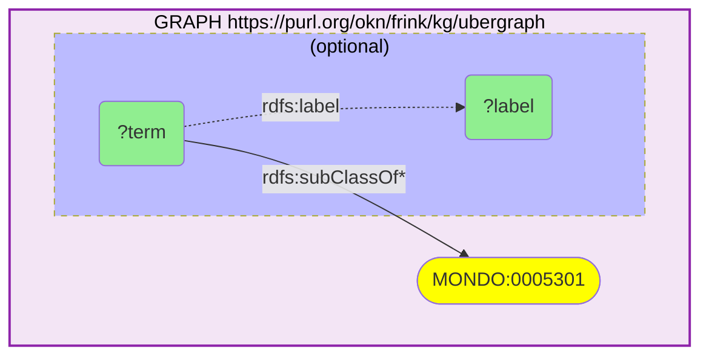

_8 row(s)_

#### Query 2

_2026-07-20T06:22:06+00:00 · `ubergraph`_

```sparql
PREFIX rdfs: <http://www.w3.org/2000/01/rdf-schema#>
PREFIX skos: <http://www.w3.org/2004/02/skos/core#>
PREFIX oboInOwl: <http://www.geneontology.org/formats/oboInOwl#>
SELECT DISTINCT ?mondo ?mondoLabel ?xref WHERE {
  GRAPH <https://purl.org/okn/frink/kg/ubergraph> {
    ?mondo rdfs:subClassOf* <http://purl.obolibrary.org/obo/MONDO_0005301> .
    OPTIONAL { ?mondo rdfs:label ?mondoLabel }
    { ?mondo skos:exactMatch ?xref } UNION { ?mondo oboInOwl:hasDbXref ?xref }
  }
}
```

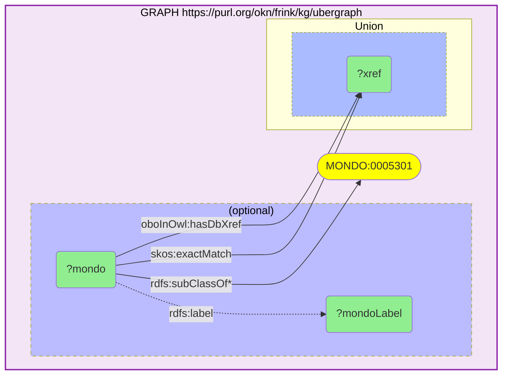

_105 row(s)_

#### Query 3

_2026-07-20T06:22:47+00:00 · `ubergraph`, `rdkg`_

```sparql
PREFIX rdfs: <http://www.w3.org/2000/01/rdf-schema#>
PREFIX biolink: <https://w3id.org/biolink/vocab/>
SELECT DISTINCT ?disease ?diseaseLabel ?gene ?geneLabel ?rel WHERE {
  GRAPH <https://purl.org/okn/frink/kg/ubergraph> {
    ?disease rdfs:subClassOf* <http://purl.obolibrary.org/obo/MONDO_0005301> .
  }
  GRAPH <https://purl.org/okn/frink/kg/rdkg> {
    { ?disease biolink:genetic_association ?gene . BIND("genetic_association" AS ?rel) }
    UNION { ?gene biolink:gene_associated_with_condition ?disease . BIND("gene_associated_with_condition" AS ?rel) }
    UNION { ?gene biolink:contributes_to ?disease . BIND("contributes_to" AS ?rel) }
    OPTIONAL { ?disease rdfs:label ?diseaseLabel }
    OPTIONAL { ?gene rdfs:label ?geneLabel }
  }
}
```

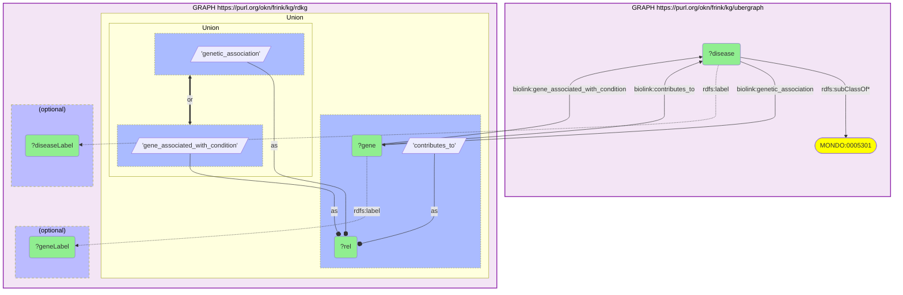

_5 row(s)_

#### Query 4

_2026-07-20T06:23:06+00:00 · `ubergraph`, `spoke-okn`_

```sparql
PREFIX rdfs: <http://www.w3.org/2000/01/rdf-schema#>
PREFIX skos: <http://www.w3.org/2004/02/skos/core#>
PREFIX so: <https://purl.org/okn/frink/kg/spoke-okn/schema/>
SELECT DISTINCT ?mondo ?doid ?doidLabel ?gene ?geneSymbol ?ensembl WHERE {
  GRAPH <https://purl.org/okn/frink/kg/ubergraph> {
    ?mondo rdfs:subClassOf* <http://purl.obolibrary.org/obo/MONDO_0005301> .
    ?mondo skos:exactMatch ?doid .
    FILTER(STRSTARTS(STR(?doid), 'http://purl.obolibrary.org/obo/DOID_'))
  }
  GRAPH <https://purl.org/okn/frink/kg/spoke-okn> {
    ?doid a <https://w3id.org/biolink/vocab/Disease> ; rdfs:label ?doidLabel ;
          so:ASSOCIATES_DaG ?gene .
    OPTIONAL { ?gene rdfs:label ?geneSymbol }
    OPTIONAL { ?gene so:ensembl ?ensembl }
  }
}
```

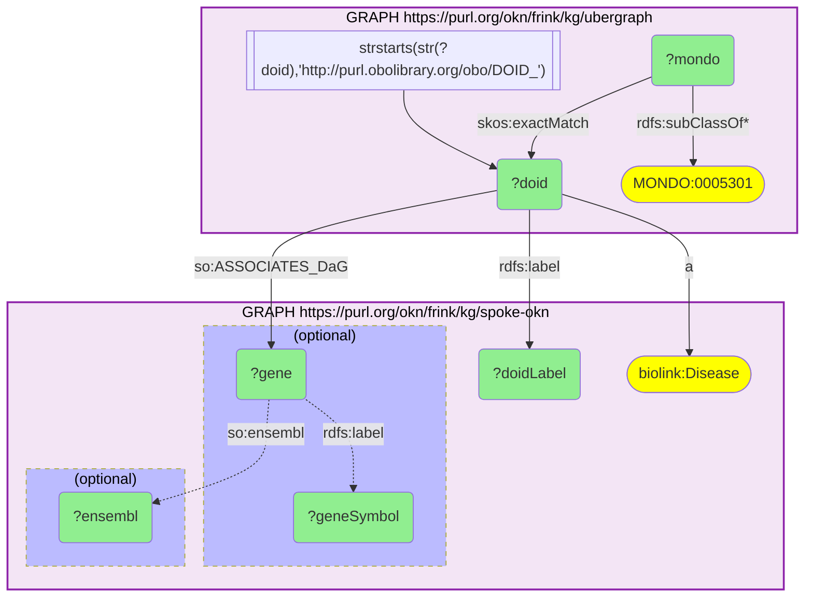

_164 row(s)_

#### Query 5

_2026-07-20T06:23:41+00:00 · `ubergraph`, `prokn`_

```sparql
PREFIX rdfs: <http://www.w3.org/2000/01/rdf-schema#>
PREFIX skos: <http://www.w3.org/2004/02/skos/core#>
PREFIX up: <http://purl.uniprot.org/core/>
SELECT DISTINCT ?mondo ?prDisease ?prLabel ?prot ?protLabel WHERE {
  GRAPH <https://purl.org/okn/frink/kg/ubergraph> {
    ?mondo rdfs:subClassOf* <http://purl.obolibrary.org/obo/MONDO_0005301> .
  }
  GRAPH <https://purl.org/okn/frink/kg/prokn> {
    ?prDisease skos:exactMatch ?mondo .
    OPTIONAL { ?prDisease rdfs:label ?prLabel }
    OPTIONAL { ?prot up:disease ?prDisease . OPTIONAL { ?prot rdfs:label ?protLabel } }
  }
}
```

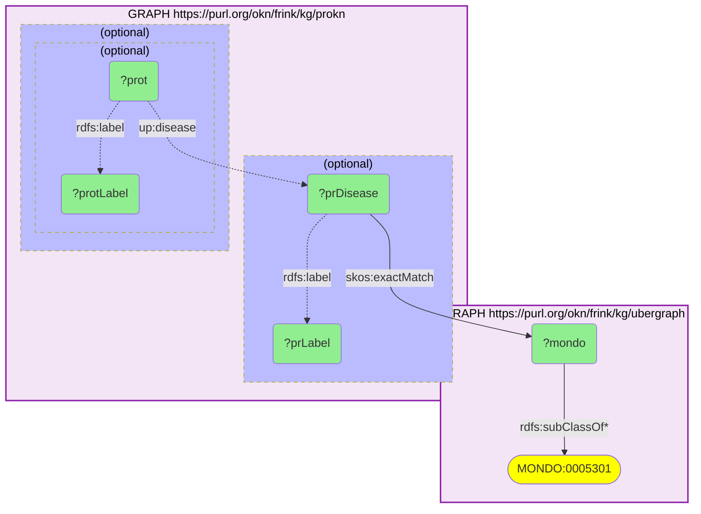

_7 row(s)_

#### Query 6

_2026-07-20T06:24:44+00:00 · `digcfdekg`_

```sparql
PREFIX rdfs: <http://www.w3.org/2000/01/rdf-schema#>
PREFIX rdf: <http://www.w3.org/1999/02/22-rdf-syntax-ns#>
PREFIX dig: <https://purl.org/okn/frink/kg/digcfdekg/schema/>
SELECT DISTINCT ?traitLabel ?geneLabel ?weight ?methodLabel ?scoreLabel WHERE {
  VALUES ?trait {
    <http://purl.obolibrary.org/obo/MONDO_0005301>
    <http://www.ebi.ac.uk/efo/EFO_0803536>
    <https://purl.org/okn/frink/kg/digcfdekg/node/trait/3e0c1919be3624c2ff1d>
    <https://purl.org/okn/frink/kg/digcfdekg/node/trait/dc2aa6ede313dadbfaf0>
  }
  GRAPH <https://purl.org/okn/frink/kg/digcfdekg> {
    ?stmt rdf:subject ?gene ; rdf:predicate dig:geneToTrait ; rdf:object ?trait ; dig:weight ?weight .
    ?gene rdfs:label ?geneLabel .
    ?trait rdfs:label ?traitLabel .
    OPTIONAL { ?stmt <http://www.w3.org/ns/prov#wasGeneratedBy> ?m . ?m rdfs:label ?methodLabel }
    OPTIONAL { ?stmt dig:scoreType ?st . ?st rdfs:label ?scoreLabel }
    FILTER(?weight > 0.05)
  }
}
```

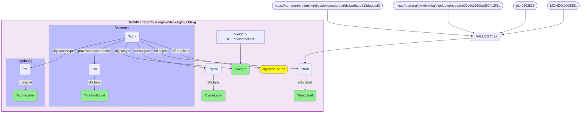

_2116 row(s)_

#### Query 7

_2026-07-20T06:25:19+00:00 · `ubergraph`, `biomarkerkg`_

```sparql
PREFIX rdfs: <http://www.w3.org/2000/01/rdf-schema#>
PREFIX obci: <http://purl.obolibrary.org/obo/>
SELECT DISTINCT ?mondo ?rel ?biomarker ?bmLabel ?assessed ?assessedLabel ?sample ?sampleLabel WHERE {
  GRAPH <https://purl.org/okn/frink/kg/ubergraph> {
    ?mondo rdfs:subClassOf* <http://purl.obolibrary.org/obo/MONDO_0005301> .
  }
  GRAPH <https://purl.org/okn/frink/kg/biomarkerkg> {
    ?biomarker ?rel ?mondo .
    FILTER(?rel IN (obci:OBCI_1000002, obci:OBCI_1000003, obci:OBCI_1000006, obci:OBCI_1000008))
    OPTIONAL { ?biomarker rdfs:label ?bmLabel }
    OPTIONAL { ?biomarker obci:OBCI_1000018 ?sample . OPTIONAL { ?sample rdfs:label ?sampleLabel } }
    OPTIONAL { ?biomarker ?ind ?assessed . FILTER(?ind IN (obci:OBCI_1000009, obci:OBCI_1000015, obci:OBCI_1000016)) OPTIONAL { ?assessed rdfs:label ?assessedLabel } }
  }
}
```

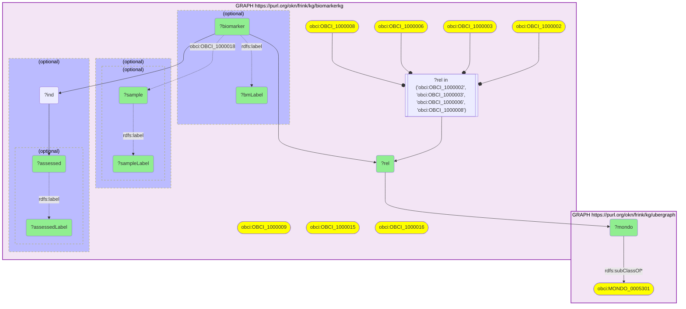

_394 row(s)_

#### Query 8

_2026-07-20T06:25:40+00:00 · `ubergraph`, `gene-expression-atlas-okn`_

```sparql
PREFIX rdfs: <http://www.w3.org/2000/01/rdf-schema#>
PREFIX skos: <http://www.w3.org/2004/02/skos/core#>
PREFIX biolink: <https://w3id.org/biolink/vocab/>
PREFIX wobd: <http://purl.org/okn/wobd/>
SELECT DISTINCT ?mondo ?gxaDisease ?study ?title ?factors ?tech ?pmid WHERE {
  GRAPH <https://purl.org/okn/frink/kg/ubergraph> {
    ?mondo rdfs:subClassOf* <http://purl.obolibrary.org/obo/MONDO_0005301> .
    { ?mondo skos:exactMatch ?gxaDisease } UNION { BIND(?mondo AS ?gxaDisease) }
  }
  GRAPH <https://purl.org/okn/frink/kg/gene-expression-atlas-okn> {
    ?study biolink:studies ?gxaDisease .
    OPTIONAL { ?study wobd:project_title ?title }
    OPTIONAL { ?study wobd:experimental_factors ?factors }
    OPTIONAL { ?study wobd:technology ?tech }
    OPTIONAL { ?study wobd:pubmed_id ?pmid }
  }
}
```

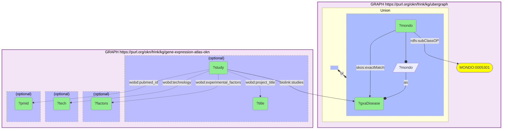

_24160 row(s)_

#### Query 9

_2026-07-20T06:25:46+00:00 · `ubergraph`, `spoke-okn`_

```sparql
PREFIX rdfs: <http://www.w3.org/2000/01/rdf-schema#>
PREFIX skos: <http://www.w3.org/2004/02/skos/core#>
PREFIX rdf: <http://www.w3.org/1999/02/22-rdf-syntax-ns#>
PREFIX so: <https://purl.org/okn/frink/kg/spoke-okn/schema/>
SELECT DISTINCT ?doidLabel ?compound ?compoundLabel ?phase ?actSources ?maxPhase WHERE {
  GRAPH <https://purl.org/okn/frink/kg/ubergraph> {
    ?mondo rdfs:subClassOf* <http://purl.obolibrary.org/obo/MONDO_0005301> .
    ?mondo skos:exactMatch ?doid .
    FILTER(STRSTARTS(STR(?doid), 'http://purl.obolibrary.org/obo/DOID_'))
  }
  GRAPH <https://purl.org/okn/frink/kg/spoke-okn> {
    ?doid a <https://w3id.org/biolink/vocab/Disease> ; rdfs:label ?doidLabel .
    ?stmt rdf:subject ?compound ; rdf:predicate so:TREATS_CtD ; rdf:object ?doid .
    OPTIONAL { ?stmt so:phase ?phase }
    OPTIONAL { ?stmt so:act_sources ?actSources }
    OPTIONAL { ?compound rdfs:label ?compoundLabel }
    OPTIONAL { ?compound so:max_phase ?maxPhase }
  }
}
```

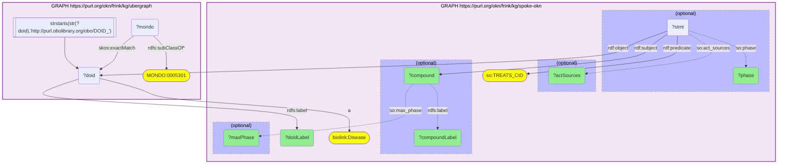

_3 row(s)_

#### Query 10

_2026-07-20T06:26:00+00:00 · `ubergraph`, `rdkg`_

```sparql
PREFIX rdfs: <http://www.w3.org/2000/01/rdf-schema#>
PREFIX biolink: <https://w3id.org/biolink/vocab/>
SELECT DISTINCT ?mondo ?mondoLabel ?drug ?drugLabel ?rel WHERE {
  GRAPH <https://purl.org/okn/frink/kg/ubergraph> {
    ?mondo rdfs:subClassOf* <http://purl.obolibrary.org/obo/MONDO_0005301> .
  }
  GRAPH <https://purl.org/okn/frink/kg/rdkg> {
    { ?drug biolink:treats ?mondo . BIND("treats" AS ?rel) }
    UNION { ?drug biolink:contraindicated_for ?mondo . BIND("contraindicated_for" AS ?rel) }
    UNION { ?mondo biolink:associated_with ?drug . BIND("associated_with_treatment" AS ?rel) }
    UNION { ?mondo biolink:prevented_by ?drug . BIND("prevented_by" AS ?rel) }
    OPTIONAL { ?drug rdfs:label ?drugLabel }
    OPTIONAL { ?mondo rdfs:label ?mondoLabel }
  }
}
```

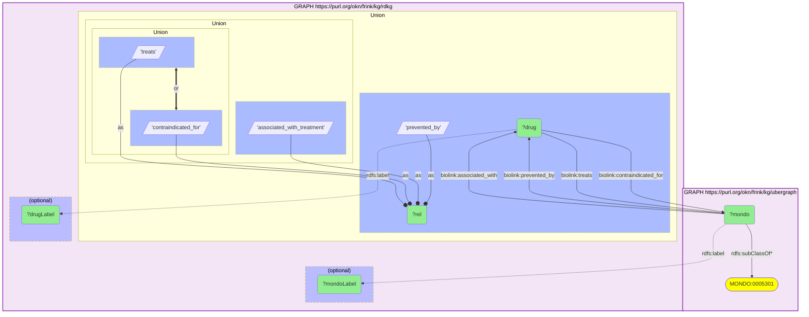

_93 row(s)_

#### Query 11

_2026-07-20T06:26:12+00:00 · `gene-expression-atlas-okn`_

```sparql
PREFIX rdfs: <http://www.w3.org/2000/01/rdf-schema#>
PREFIX biolink: <https://w3id.org/biolink/vocab/>
PREFIX wobd: <http://purl.org/okn/wobd/>
SELECT ?d ?study ?title ?factors ?tech ?pmid (COUNT(DISTINCT ?assay) AS ?nAssays) WHERE {
  VALUES ?d { <http://purl.obolibrary.org/obo/MONDO_0005301> <http://www.ebi.ac.uk/efo/EFO_0003929> <http://www.ebi.ac.uk/efo/EFO_0008520> <http://www.ebi.ac.uk/efo/EFO_0008522> }
  GRAPH <https://purl.org/okn/frink/kg/gene-expression-atlas-okn> {
    ?study biolink:studies ?d ; biolink:has_output ?assay .
    OPTIONAL { ?study wobd:project_title ?title }
    OPTIONAL { ?study wobd:experimental_factors ?factors }
    OPTIONAL { ?study wobd:technology ?tech }
    OPTIONAL { ?study wobd:pubmed_id ?pmid }
  }
} GROUP BY ?d ?study ?title ?factors ?tech ?pmid
```

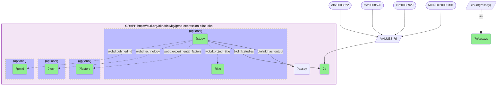

_9 row(s)_

#### Query 12

_2026-07-20T06:26:23+00:00 · `gene-expression-atlas-okn`_

```sparql
PREFIX rdfs: <http://www.w3.org/2000/01/rdf-schema#>
PREFIX biolink: <https://w3id.org/biolink/vocab/>
PREFIX wobd: <http://purl.org/okn/wobd/>
SELECT ?d ?study ?assay ?assayDesc ?contrast ?sym ?gene ?dir ?es ?pv WHERE {
  VALUES ?d { <http://purl.obolibrary.org/obo/MONDO_0005301> <http://www.ebi.ac.uk/efo/EFO_0003929> <http://www.ebi.ac.uk/efo/EFO_0008520> <http://www.ebi.ac.uk/efo/EFO_0008522> }
  GRAPH <https://purl.org/okn/frink/kg/gene-expression-atlas-okn> {
    ?study biolink:studies ?d ; biolink:has_output ?assay .
    ?assoc biolink:subject ?assay ; biolink:object ?gene ; wobd:direction ?dir ; wobd:effect_size ?es ; wobd:p_value ?pv .
    OPTIONAL { ?assoc wobd:contrast_id ?contrast }
    OPTIONAL { ?assay biolink:description ?assayDesc }
    OPTIONAL { ?gene biolink:symbol ?sym }
    FILTER(?pv <= 0.05 && ABS(?es) >= 1)
  }
}
```

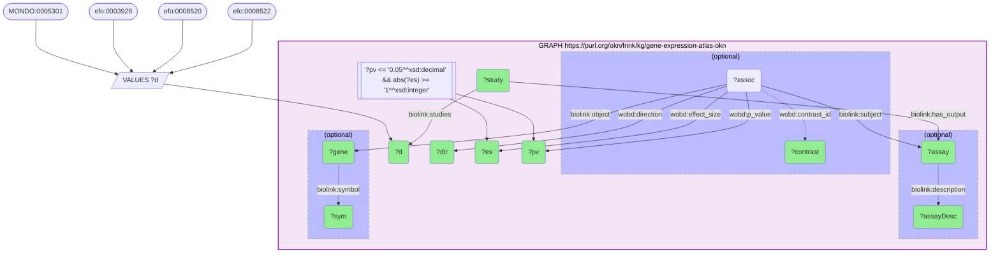

_489 row(s)_

#### Query 13

_2026-07-20T06:27:13+00:00 · `gene-expression-atlas-okn`_

```sparql
PREFIX rdfs: <http://www.w3.org/2000/01/rdf-schema#>
PREFIX biolink: <https://w3id.org/biolink/vocab/>
PREFIX wobd: <http://purl.org/okn/wobd/>
SELECT ?d ?study ?assay ?desc ?sym ?gene ?dir ?es ?pv WHERE {
  VALUES ?d { <http://purl.obolibrary.org/obo/MONDO_0005301> <http://www.ebi.ac.uk/efo/EFO_0003929> <http://www.ebi.ac.uk/efo/EFO_0008520> <http://www.ebi.ac.uk/efo/EFO_0008522> }
  GRAPH <https://purl.org/okn/frink/kg/gene-expression-atlas-okn> {
    ?study biolink:studies ?d ; biolink:has_output ?assay .
    ?assoc biolink:subject ?assay ; biolink:object ?gene .
    ?gene a biolink:Gene .
    OPTIONAL { ?gene biolink:symbol ?sym }
    OPTIONAL { ?assoc wobd:direction ?dir }
    OPTIONAL { ?assoc wobd:effect_size ?es }
    OPTIONAL { ?assoc wobd:p_value ?pv }
    OPTIONAL { ?assay biolink:description ?desc }
  }
}
```

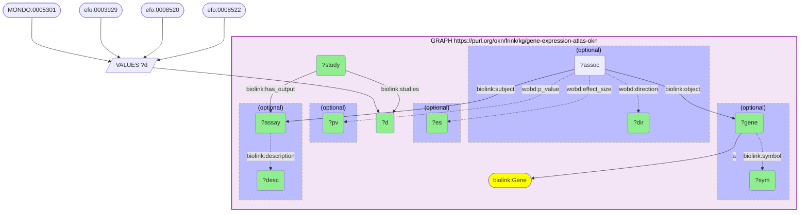

_961 row(s)_

#### Query 14

_2026-07-20T06:27:35+00:00 · `gene-expression-atlas-okn`_

```sparql
PREFIX rdfs: <http://www.w3.org/2000/01/rdf-schema#>
PREFIX biolink: <https://w3id.org/biolink/vocab/>
PREFIX wobd: <http://purl.org/okn/wobd/>
SELECT ?d ?study ?assay ?src ?term ?termName ?dir ?es ?pv WHERE {
  VALUES ?d { <http://purl.obolibrary.org/obo/MONDO_0005301> <http://www.ebi.ac.uk/efo/EFO_0003929> <http://www.ebi.ac.uk/efo/EFO_0008520> <http://www.ebi.ac.uk/efo/EFO_0008522> }
  GRAPH <https://purl.org/okn/frink/kg/gene-expression-atlas-okn> {
    ?study biolink:studies ?d ; biolink:has_output ?assay .
    ?assoc biolink:subject ?assay ; biolink:object ?term ; wobd:enrichment_source ?src .
    OPTIONAL { ?term biolink:name ?termName }
    OPTIONAL { ?assoc wobd:direction ?dir }
    OPTIONAL { ?assoc wobd:effect_size ?es }
    OPTIONAL { ?assoc wobd:p_value ?pv }
  }
}
```

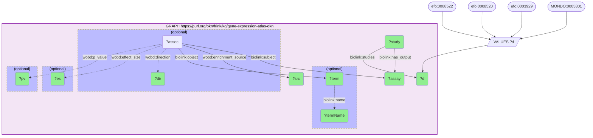

_538 row(s)_

#### Query 15

_2026-07-20T06:27:59+00:00 · `gene-expression-atlas-okn`_

```sparql
PREFIX rdfs: <http://www.w3.org/2000/01/rdf-schema#>
PREFIX biolink: <https://w3id.org/biolink/vocab/>
PREFIX wobd: <http://purl.org/okn/wobd/>
SELECT ?study ?assay ?assayName ?tech ?attr ?attrLabel ?attrType WHERE {
  VALUES ?d { <http://purl.obolibrary.org/obo/MONDO_0005301> <http://www.ebi.ac.uk/efo/EFO_0003929> <http://www.ebi.ac.uk/efo/EFO_0008520> <http://www.ebi.ac.uk/efo/EFO_0008522> }
  GRAPH <https://purl.org/okn/frink/kg/gene-expression-atlas-okn> {
    ?study biolink:studies ?d ; biolink:has_output ?assay .
    OPTIONAL { ?assay biolink:name ?assayName }
    OPTIONAL { ?assay wobd:technology ?tech }
    OPTIONAL { ?assay biolink:has_attribute ?attr .
               OPTIONAL { ?attr rdfs:label ?attrLabel }
               OPTIONAL { ?attr a ?attrType } }
  }
}
```

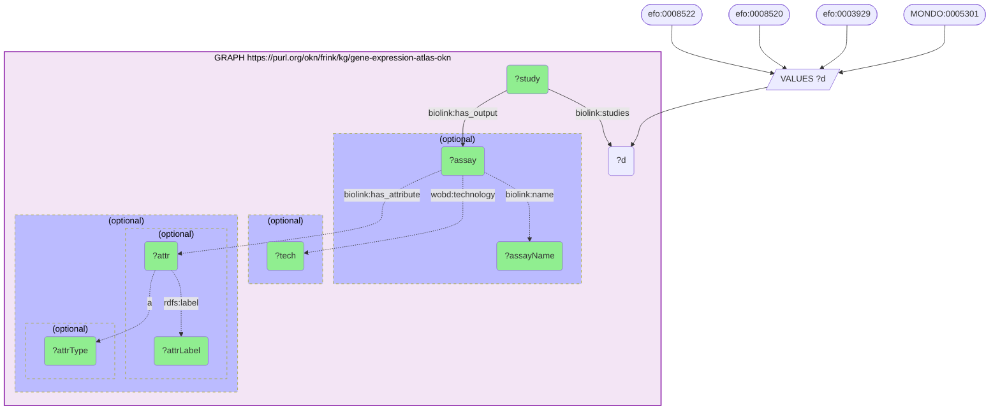

_161 row(s)_

#### Query 16

_2026-07-20T06:29:16+00:00 · `prokn`_

```sparql
PREFIX rdfs: <http://www.w3.org/2000/01/rdf-schema#>
PREFIX sio: <http://semanticscience.org/resource/>
PREFIX obo: <http://purl.obolibrary.org/obo/>
SELECT DISTINCT ?sym ?go ?goLabel WHERE {
  VALUES ?sym { "ADCY3" "AFF1" "AGAP2" "AGBL2" "AHI1" "AIF1" "ALPK2" "ANKRD55" "ATXN1" "ATXN2" "BACH2" "BATF" "BDNF" "BTNL2" "CBLB" "CCL2" "CD226" "CD4" "CD40" "CD58" "CD6" "CD69" "CD86" "CD8A" "CDH3" "CENPO" "CHST12" "CLEC16A" "CSF2" "CSF2RB" "CXCR5" "CYP24A1" "CYP27B1" "DDAH1" "DKKL1" "ELMO1" "EPS15L1" "ERG" "ESPN" "ETS1" "ETV7" "EVI5" "FCRL1" "FOXP1" "FOXP3" "GALC" "GATA3" "GFAP" "GFI1" "GNG2" "GRB2" "HLA-DQA1" "HLA-DRB1" "HLA-F" "HOXA1" "IFI30" "IFITM3" "IFNB1" "IFNG" "IFNGR2" "IKZF3" "IL10" "IL12A" "IL17A" "IL1A" "IL1B" "IL2" "IL2RA" "IL4" "IL6" "IL7R" "INAVA" "IQCB1" "IQGAP1" "ITGAM" "JADE2" "JAK1" "JAZF1" "KIF1B" "LBH" "LEF1" "LIMK2" "LPP" "MALT1" "MAPK1" "MARCHF1" "MBP" "MERTK" "METTL1" "MLANA" "MMEL1" "MOG" "MPV17L2" "MTHFR" "MYBPC3" "NCF4" "NCOA5" "NDFIP1" "NEFL" "NLRC5" "NR1D1" "OS9" "PHACTR2" "PHGDH" "PHLDB1" "PITPNM2" "PLEKHG5" "PLXNC1" "PRR5L" "PTPRC" "PUS10" "PXT1" "RGS1" "RGS14" "RMI2" "RUNX3" "SAE1" "SH2B3" "SKAP2" "SLAMF7" "SLC15A2" "SLC2A4RG" "SLC30A7" "SLC44A2" "SLC9A8" "SLC9B1" "SMARCA4" "SP140" "STAT3" "STAT4" "TAGAP" "TBX6" "TET2" "TGFB1" "TGFBR3" "TIMMDC1" "TLR4" "TNF" "TNFAIP8" "TNFRSF1A" "TNFSF14" "TNIP3" "TOP3A" "TOX2" "TRAF3" "TRIM14" "TSFM" "TSPAN31" "TXK" "TYK2" "VANGL2" "VMP1" "WWOX" "ZBTB38" "ZC3HAV1" "ZFP36L1" "ZMIZ1" "ZNHIT3" }
  GRAPH <https://purl.org/okn/frink/kg/prokn> {
    ?gene rdfs:label ?sym ; sio:SIO_010078 ?prot .
    ?prot obo:RO_0002331 ?go .
    OPTIONAL { ?go rdfs:label ?goLabel }
  }
}
```

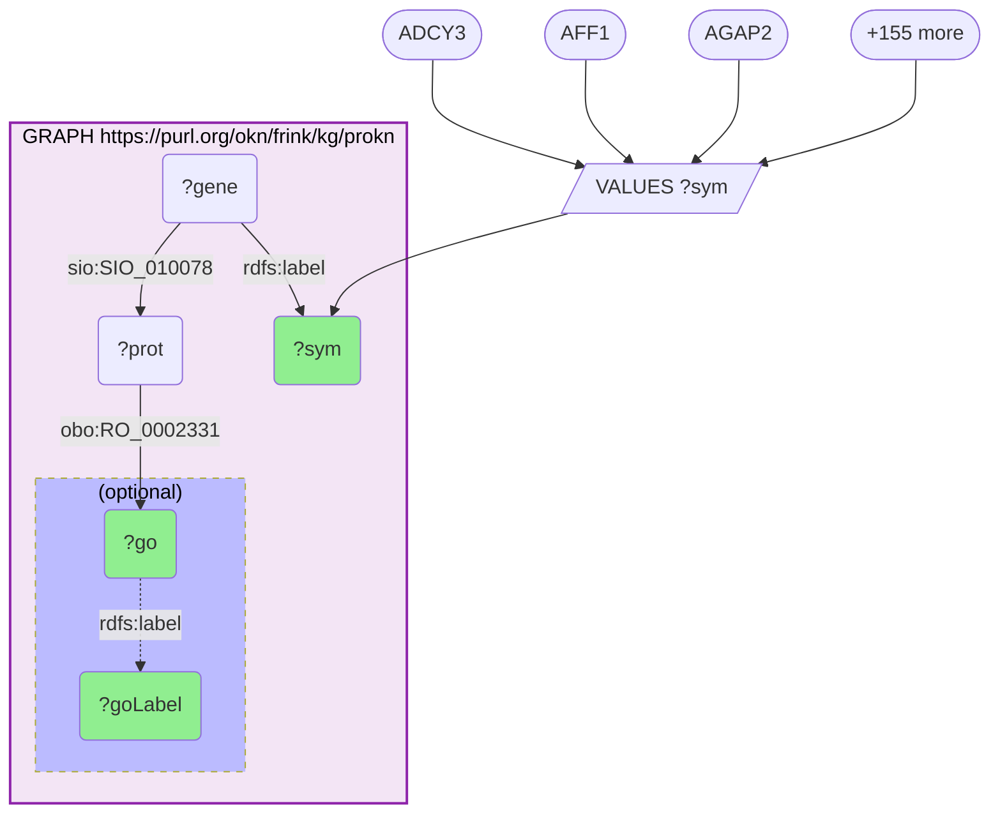

_1752 row(s)_

#### Query 17

_2026-07-20T06:29:34+00:00 · `prokn`_

```sparql
PREFIX rdfs: <http://www.w3.org/2000/01/rdf-schema#>
PREFIX sio: <http://semanticscience.org/resource/>
PREFIX obo: <http://purl.obolibrary.org/obo/>
SELECT (COUNT(DISTINCT ?sym) AS ?N_bp) WHERE {
  GRAPH <https://purl.org/okn/frink/kg/prokn> {
    ?gene rdfs:label ?sym ; sio:SIO_010078 ?prot .
    ?prot obo:RO_0002331 ?go .
  }
}
```

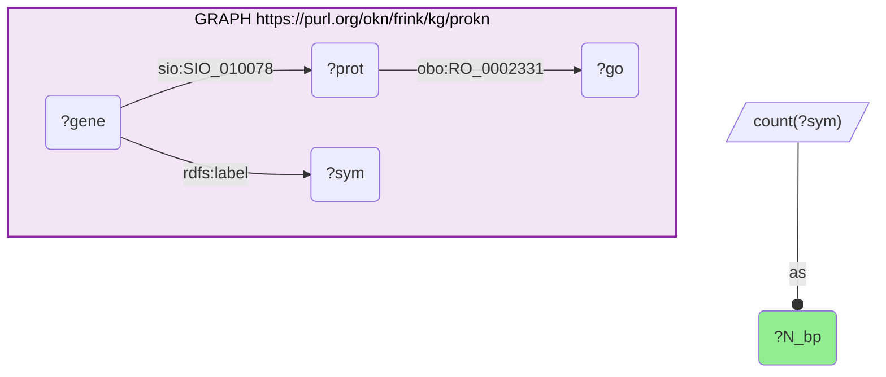

_1 row(s)_

#### Query 18

_2026-07-20T06:29:36+00:00 · `prokn`_

```sparql
PREFIX rdfs: <http://www.w3.org/2000/01/rdf-schema#>
PREFIX sio: <http://semanticscience.org/resource/>
PREFIX obo: <http://purl.obolibrary.org/obo/>
PREFIX up: <http://purl.uniprot.org/core/>
SELECT (COUNT(DISTINCT ?sym) AS ?N_reactome) WHERE {
  GRAPH <https://purl.org/okn/frink/kg/prokn> {
    ?gene rdfs:label ?sym ; sio:SIO_010078 ?prot .
    ?prot obo:RO_0000056 ?pw .
    ?pw a up:Pathway .
    FILTER(CONTAINS(STR(?pw), "R-HSA"))
  }
}
```

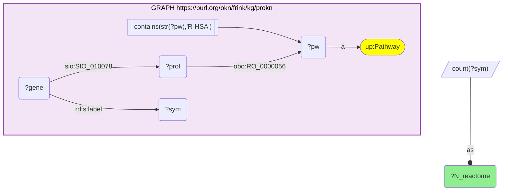

_1 row(s)_

#### Query 19

_2026-07-20T06:30:23+00:00 · `prokn`_

```sparql
PREFIX rdfs: <http://www.w3.org/2000/01/rdf-schema#>
PREFIX sio: <http://semanticscience.org/resource/>
PREFIX obo: <http://purl.obolibrary.org/obo/>
SELECT ?go (COUNT(DISTINCT ?sym) AS ?K) WHERE {
  VALUES ?go { <http://purl.obolibrary.org/obo/GO_0000122> <http://purl.obolibrary.org/obo/GO_0001666> <http://purl.obolibrary.org/obo/GO_0001774> <http://purl.obolibrary.org/obo/GO_0001819> <http://purl.obolibrary.org/obo/GO_0001837> <http://purl.obolibrary.org/obo/GO_0002250> <http://purl.obolibrary.org/obo/GO_0002376> <http://purl.obolibrary.org/obo/GO_0002639> <http://purl.obolibrary.org/obo/GO_0006325> <http://purl.obolibrary.org/obo/GO_0006355> <http://purl.obolibrary.org/obo/GO_0006357> <http://purl.obolibrary.org/obo/GO_0006468> <http://purl.obolibrary.org/obo/GO_0006508> <http://purl.obolibrary.org/obo/GO_0006915> <http://purl.obolibrary.org/obo/GO_0006935> <http://purl.obolibrary.org/obo/GO_0006952> <http://purl.obolibrary.org/obo/GO_0006954> <http://purl.obolibrary.org/obo/GO_0006955> <http://purl.obolibrary.org/obo/GO_0006959> <http://purl.obolibrary.org/obo/GO_0007155> <http://purl.obolibrary.org/obo/GO_0007165> <http://purl.obolibrary.org/obo/GO_0007166> <http://purl.obolibrary.org/obo/GO_0007173> <http://purl.obolibrary.org/obo/GO_0007179> <http://purl.obolibrary.org/obo/GO_0007186> <http://purl.obolibrary.org/obo/GO_0007259> <http://purl.obolibrary.org/obo/GO_0007267> <http://purl.obolibrary.org/obo/GO_0007399> <http://purl.obolibrary.org/obo/GO_0008284> <http://purl.obolibrary.org/obo/GO_0008285> <http://purl.obolibrary.org/obo/GO_0009615> <http://purl.obolibrary.org/obo/GO_0009617> <http://purl.obolibrary.org/obo/GO_0010468> <http://purl.obolibrary.org/obo/GO_0010557> <http://purl.obolibrary.org/obo/GO_0010628> <http://purl.obolibrary.org/obo/GO_0010629> <http://purl.obolibrary.org/obo/GO_0010718> <http://purl.obolibrary.org/obo/GO_0016567> <http://purl.obolibrary.org/obo/GO_0019221> <http://purl.obolibrary.org/obo/GO_0019882> <http://purl.obolibrary.org/obo/GO_0030101> <http://purl.obolibrary.org/obo/GO_0030154> <http://purl.obolibrary.org/obo/GO_0030217> <http://purl.obolibrary.org/obo/GO_0030225> <http://purl.obolibrary.org/obo/GO_0030308> <http://purl.obolibrary.org/obo/GO_0030335> <http://purl.obolibrary.org/obo/GO_0032355> <http://purl.obolibrary.org/obo/GO_0032496> <http://purl.obolibrary.org/obo/GO_0032700> <http://purl.obolibrary.org/obo/GO_0032722> <http://purl.obolibrary.org/obo/GO_0032731> <http://purl.obolibrary.org/obo/GO_0032733> <http://purl.obolibrary.org/obo/GO_0032740> <http://purl.obolibrary.org/obo/GO_0032743> <http://purl.obolibrary.org/obo/GO_0032747> <http://purl.obolibrary.org/obo/GO_0032755> <http://purl.obolibrary.org/obo/GO_0032757> <http://purl.obolibrary.org/obo/GO_0032760> <http://purl.obolibrary.org/obo/GO_0033280> <http://purl.obolibrary.org/obo/GO_0034341> <http://purl.obolibrary.org/obo/GO_0035556> <http://purl.obolibrary.org/obo/GO_0035723> <http://purl.obolibrary.org/obo/GO_0036120> <http://purl.obolibrary.org/obo/GO_0038043> <http://purl.obolibrary.org/obo/GO_0038110> <http://purl.obolibrary.org/obo/GO_0042100> <http://purl.obolibrary.org/obo/GO_0042102> <http://purl.obolibrary.org/obo/GO_0042110> <http://purl.obolibrary.org/obo/GO_0042113> <http://purl.obolibrary.org/obo/GO_0042116> <http://purl.obolibrary.org/obo/GO_0042267> <http://purl.obolibrary.org/obo/GO_0042552> <http://purl.obolibrary.org/obo/GO_0043011> <http://purl.obolibrary.org/obo/GO_0043065> <http://purl.obolibrary.org/obo/GO_0043066> <http://purl.obolibrary.org/obo/GO_0043123> <http://purl.obolibrary.org/obo/GO_0043124> <http://purl.obolibrary.org/obo/GO_0043410> <http://purl.obolibrary.org/obo/GO_0045071> <http://purl.obolibrary.org/obo/GO_0045087> <http://purl.obolibrary.org/obo/GO_0045321> <http://purl.obolibrary.org/obo/GO_0045429> <http://purl.obolibrary.org/obo/GO_0045471> <http://purl.obolibrary.org/obo/GO_0045582> <http://purl.obolibrary.org/obo/GO_0045597> <http://purl.obolibrary.org/obo/GO_0045599> <http://purl.obolibrary.org/obo/GO_0045672> <http://purl.obolibrary.org/obo/GO_0045766> <http://purl.obolibrary.org/obo/GO_0045892> <http://purl.obolibrary.org/obo/GO_0045893> <http://purl.obolibrary.org/obo/GO_0045944> <http://purl.obolibrary.org/obo/GO_0048143> <http://purl.obolibrary.org/obo/GO_0048661> <http://purl.obolibrary.org/obo/GO_0050680> <http://purl.obolibrary.org/obo/GO_0050728> <http://purl.obolibrary.org/obo/GO_0050729> <http://purl.obolibrary.org/obo/GO_0050766> <http://purl.obolibrary.org/obo/GO_0050793> <http://purl.obolibrary.org/obo/GO_0050796> <http://purl.obolibrary.org/obo/GO_0050829> <http://purl.obolibrary.org/obo/GO_0050830> <http://purl.obolibrary.org/obo/GO_0050852> <http://purl.obolibrary.org/obo/GO_0051239> <http://purl.obolibrary.org/obo/GO_0051240> <http://purl.obolibrary.org/obo/GO_0051607> <http://purl.obolibrary.org/obo/GO_0055010> <http://purl.obolibrary.org/obo/GO_0055085> <http://purl.obolibrary.org/obo/GO_0060252> <http://purl.obolibrary.org/obo/GO_0060333> <http://purl.obolibrary.org/obo/GO_0060337> <http://purl.obolibrary.org/obo/GO_0070098> <http://purl.obolibrary.org/obo/GO_0070102> <http://purl.obolibrary.org/obo/GO_0070374> <http://purl.obolibrary.org/obo/GO_0070665> <http://purl.obolibrary.org/obo/GO_0071222> <http://purl.obolibrary.org/obo/GO_0071260> <http://purl.obolibrary.org/obo/GO_0071346> <http://purl.obolibrary.org/obo/GO_0071347> <http://purl.obolibrary.org/obo/GO_0071356> <http://purl.obolibrary.org/obo/GO_0071479> <http://purl.obolibrary.org/obo/GO_0072540> <http://purl.obolibrary.org/obo/GO_0097191> <http://purl.obolibrary.org/obo/GO_0097421> <http://purl.obolibrary.org/obo/GO_0097696> <http://purl.obolibrary.org/obo/GO_0098586> <http://purl.obolibrary.org/obo/GO_0098609> <http://purl.obolibrary.org/obo/GO_0140105> <http://purl.obolibrary.org/obo/GO_0150078> <http://purl.obolibrary.org/obo/GO_1900017> <http://purl.obolibrary.org/obo/GO_1900182> <http://purl.obolibrary.org/obo/GO_1902107> <http://purl.obolibrary.org/obo/GO_1902895> <http://purl.obolibrary.org/obo/GO_1904894> <http://purl.obolibrary.org/obo/GO_2000343> <http://purl.obolibrary.org/obo/GO_2000353> }
  GRAPH <https://purl.org/okn/frink/kg/prokn> {
    ?gene rdfs:label ?sym ; sio:SIO_010078 ?prot .
    ?prot obo:RO_0002331 ?go .
  }
} GROUP BY ?go
```

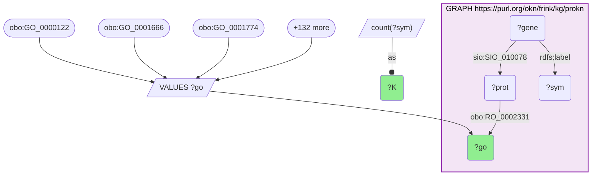

_135 row(s)_

#### Query 20

_2026-07-20T06:31:22+00:00 · `prokn`_

```sparql
PREFIX rdfs: <http://www.w3.org/2000/01/rdf-schema#>
PREFIX sio: <http://semanticscience.org/resource/>
PREFIX obo: <http://purl.obolibrary.org/obo/>
PREFIX up: <http://purl.uniprot.org/core/>
SELECT DISTINCT ?sym ?pw ?pwLabel WHERE {
  VALUES ?sym { "ADCY3" "AFF1" "AGAP2" "AGBL2" "AHI1" "AIF1" "ALPK2" "ANKRD55" "ATXN1" "ATXN2" "BACH2" "BATF" "BDNF" "BTNL2" "CBLB" "CCL2" "CD226" "CD4" "CD40" "CD58" "CD6" "CD69" "CD86" "CD8A" "CDH3" "CENPO" "CHST12" "CLEC16A" "CSF2" "CSF2RB" "CXCR5" "CYP24A1" "CYP27B1" "DDAH1" "DKKL1" "ELMO1" "EPS15L1" "ERG" "ESPN" "ETS1" "ETV7" "EVI5" "FCRL1" "FOXP1" "FOXP3" "GALC" "GATA3" "GFAP" "GFI1" "GNG2" "GRB2" "HLA-DQA1" "HLA-DRB1" "HLA-F" "HOXA1" "IFI30" "IFITM3" "IFNB1" "IFNG" "IFNGR2" "IKZF3" "IL10" "IL12A" "IL17A" "IL1A" "IL1B" "IL2" "IL2RA" "IL4" "IL6" "IL7R" "INAVA" "IQCB1" "IQGAP1" "ITGAM" "JADE2" "JAK1" "JAZF1" "KIF1B" "LBH" "LEF1" "LIMK2" "LPP" "MALT1" "MAPK1" "MARCHF1" "MBP" "MERTK" "METTL1" "MLANA" "MMEL1" "MOG" "MPV17L2" "MTHFR" "MYBPC3" "NCF4" "NCOA5" "NDFIP1" "NEFL" "NLRC5" "NR1D1" "OS9" "PHACTR2" "PHGDH" "PHLDB1" "PITPNM2" "PLEKHG5" "PLXNC1" "PRR5L" "PTPRC" "PUS10" "PXT1" "RGS1" "RGS14" "RMI2" "RUNX3" "SAE1" "SH2B3" "SKAP2" "SLAMF7" "SLC15A2" "SLC2A4RG" "SLC30A7" "SLC44A2" "SLC9A8" "SLC9B1" "SMARCA4" "SP140" "STAT3" "STAT4" "TAGAP" "TBX6" "TET2" "TGFB1" "TGFBR3" "TIMMDC1" "TLR4" "TNF" "TNFAIP8" "TNFRSF1A" "TNFSF14" "TNIP3" "TOP3A" "TOX2" "TRAF3" "TRIM14" "TSFM" "TSPAN31" "TXK" "TYK2" "VANGL2" "VMP1" "WWOX" "ZBTB38" "ZC3HAV1" "ZFP36L1" "ZMIZ1" "ZNHIT3" }
  GRAPH <https://purl.org/okn/frink/kg/prokn> {
    ?gene rdfs:label ?sym ; sio:SIO_010078 ?prot .
    ?prot obo:RO_0000056 ?pw .
    ?pw a up:Pathway .
    FILTER(CONTAINS(STR(?pw), "R-HSA"))
    OPTIONAL { ?pw rdfs:label ?pwLabel }
  }
}
```

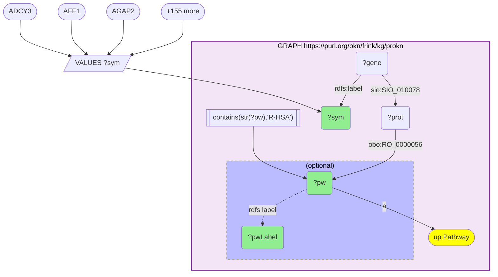

_569 row(s)_

#### Query 21

_2026-07-20T06:31:42+00:00 · `prokn`_

```sparql
PREFIX rdfs: <http://www.w3.org/2000/01/rdf-schema#>
PREFIX sio: <http://semanticscience.org/resource/>
PREFIX obo: <http://purl.obolibrary.org/obo/>
SELECT ?pw (COUNT(DISTINCT ?sym) AS ?K) WHERE {
  VALUES ?pw { <https://identifiers.org/reactome/R-HSA-1059683> <https://identifiers.org/reactome/R-HSA-110056> <https://identifiers.org/reactome/R-HSA-112411> <https://identifiers.org/reactome/R-HSA-1257604> <https://identifiers.org/reactome/R-HSA-1266695> <https://identifiers.org/reactome/R-HSA-198933> <https://identifiers.org/reactome/R-HSA-202424> <https://identifiers.org/reactome/R-HSA-202427> <https://identifiers.org/reactome/R-HSA-202430> <https://identifiers.org/reactome/R-HSA-202433> <https://identifiers.org/reactome/R-HSA-202733> <https://identifiers.org/reactome/R-HSA-2132295> <https://identifiers.org/reactome/R-HSA-2219530> <https://identifiers.org/reactome/R-HSA-2559582> <https://identifiers.org/reactome/R-HSA-389948> <https://identifiers.org/reactome/R-HSA-449836> <https://identifiers.org/reactome/R-HSA-512988> <https://identifiers.org/reactome/R-HSA-5673001> <https://identifiers.org/reactome/R-HSA-6783783> <https://identifiers.org/reactome/R-HSA-6785807> <https://identifiers.org/reactome/R-HSA-6798695> <https://identifiers.org/reactome/R-HSA-6802952> <https://identifiers.org/reactome/R-HSA-6811558> <https://identifiers.org/reactome/R-HSA-877300> <https://identifiers.org/reactome/R-HSA-877312> <https://identifiers.org/reactome/R-HSA-8854691> <https://identifiers.org/reactome/R-HSA-8856825> <https://identifiers.org/reactome/R-HSA-8856828> <https://identifiers.org/reactome/R-HSA-8877330> <https://identifiers.org/reactome/R-HSA-8983432> <https://identifiers.org/reactome/R-HSA-8984722> <https://identifiers.org/reactome/R-HSA-9020558> <https://identifiers.org/reactome/R-HSA-9020591> <https://identifiers.org/reactome/R-HSA-9020933> <https://identifiers.org/reactome/R-HSA-9020956> <https://identifiers.org/reactome/R-HSA-9020958> <https://identifiers.org/reactome/R-HSA-909733> <https://identifiers.org/reactome/R-HSA-912526> <https://identifiers.org/reactome/R-HSA-912694> <https://identifiers.org/reactome/R-HSA-9674555> <https://identifiers.org/reactome/R-HSA-9679191> <https://identifiers.org/reactome/R-HSA-9705462> <https://identifiers.org/reactome/R-HSA-9705671> <https://identifiers.org/reactome/R-HSA-9725370> <https://identifiers.org/reactome/R-HSA-9732724> <https://identifiers.org/reactome/R-HSA-9824585> <https://identifiers.org/reactome/R-HSA-9833109> }
  GRAPH <https://purl.org/okn/frink/kg/prokn> {
    ?gene rdfs:label ?sym ; sio:SIO_010078 ?prot .
    ?prot obo:RO_0000056 ?pw .
  }
} GROUP BY ?pw
```

```mermaid
graph TD
classDef projected fill:lightgreen;
classDef literal fill:orange;
classDef iri fill:yellow;
  q21v1("?K"):::projected 
  q21v5("?gene")
  q21v6("?prot")
  q21v2("?pw"):::projected 
  q21v7("?sym")
  q21bind0[/"VALUES ?pw"/]
  q21bind0-->q21v2
  q21bind00(["https://identifiers.org/reactome/R-HSA-1059683"])
  q21bind00 --> q21bind0
  q21bind01(["https://identifiers.org/reactome/R-HSA-110056"])
  q21bind01 --> q21bind0
  q21bind02(["https://identifiers.org/reactome/R-HSA-112411"])
  q21bind02 --> q21bind0
  q21bind0more([+44 more])
  q21bind0more --> q21bind0
  subgraph q21graph0["GRAPH https://purl.org/okn/frink/kg/prokn"]
    style q21graph0 fill:#f3e5f5,stroke:#8e24aa,stroke-width:2px,color:#000;
    q21v5 --"sio:SIO_010078"--> q21v6
    q21v5 --"rdfs:label"--> q21v7
    q21v6 --"obo:RO_0000056"--> q21v2
  end
  q21bind1[/"count(?sym)"/]
  q21bind1 --as--o q21v1
```

_47 row(s)_

#### Query 22

_2026-07-20T06:32:14+00:00 · `prokn`_

```sparql
PREFIX rdfs: <http://www.w3.org/2000/01/rdf-schema#>
PREFIX sio: <http://semanticscience.org/resource/>
PREFIX obo: <http://purl.obolibrary.org/obo/>
PREFIX up: <http://purl.uniprot.org/core/>
SELECT DISTINCT ?aspect ?sym ?go ?goLabel WHERE {
  VALUES ?sym { "ADCY3" "AHI1" "AIF1" "ATXN1" "ATXN2" "BACH2" "BATF" "BDNF" "CBLB" "CCL2" "CD226" "CD4" "CD40" "CD58" "CD6" "CD69" "CD86" "CD8A" "CLEC16A" "CSF2" "CSF2RB" "CXCR5" "CYP24A1" "CYP27B1" "DDAH1" "ELMO1" "ERG" "ETS1" "EVI5" "FCRL1" "FOXP1" "FOXP3" "GALC" "GATA3" "GFAP" "GFI1" "GNG2" "GRB2" "HLA-DQA1" "HLA-DRB1" "HLA-F" "IFI30" "IFITM3" "IFNB1" "IFNG" "IFNGR2" "IKZF3" "IL10" "IL12A" "IL17A" "IL1A" "IL1B" "IL2" "IL2RA" "IL4" "IL6" "IL7R" "IQGAP1" "ITGAM" "JAK1" "LEF1" "MALT1" "MAPK1" "MBP" "MERTK" "MOG" "MTHFR" "NCF4" "NDFIP1" "NEFL" "NLRC5" "NR1D1" "PHGDH" "PTPRC" "RGS1" "RGS14" "RUNX3" "SH2B3" "SKAP2" "SLAMF7" "SMARCA4" "SP140" "STAT3" "STAT4" "TAGAP" "TET2" "TGFB1" "TGFBR3" "TLR4" "TNF" "TNFRSF1A" "TNFSF14" "TRAF3" "TXK" "TYK2" "ZC3HAV1" "ZFP36L1" "ZMIZ1" }
  GRAPH <https://purl.org/okn/frink/kg/prokn> {
    ?gene rdfs:label ?sym ; sio:SIO_010078 ?prot .
    { ?prot obo:RO_0002327 ?go . BIND("MF" AS ?aspect) }
    UNION
    { ?prot up:partOf ?go . BIND("CC" AS ?aspect) FILTER(STRSTARTS(STR(?go),"http://purl.obolibrary.org/obo/GO_")) }
    OPTIONAL { ?go rdfs:label ?goLabel }
  }
}
```

```mermaid
graph TD
classDef projected fill:lightgreen;
classDef literal fill:orange;
classDef iri fill:yellow;
  q22v4("?aspect"):::projected 
  q22v2("?gene")
  q22v5("?go"):::projected 
  q22v6("?goLabel"):::projected 
  q22v3("?prot")
  q22v1("?sym"):::projected 
  q22bind0[/"VALUES ?sym"/]
  q22bind0-->q22v1
  q22bind00(["ADCY3"])
  q22bind00 --> q22bind0
  q22bind01(["AHI1"])
  q22bind01 --> q22bind0
  q22bind02(["AIF1"])
  q22bind02 --> q22bind0
  q22bind0more([+95 more])
  q22bind0more --> q22bind0
  subgraph q22graph0["GRAPH https://purl.org/okn/frink/kg/prokn"]
    style q22graph0 fill:#f3e5f5,stroke:#8e24aa,stroke-width:2px,color:#000;
    q22v2 --"sio:SIO_010078"--> q22v3
    q22v2 --"rdfs:label"--> q22v1
    subgraph q22uniongraph00[" Union "]
    style q22uniongraph00 color:#000;
    subgraph q22uniongraph00l[" "]
      style q22uniongraph00l fill:#abf,stroke-dasharray: 3 3;
      q22graph0f0[["strstarts(str(?go),'http://purl.obolibrary.org/obo/GO_')"]]
      q22graph0f0 --> q22v5
      q22v3 --"up:partOf"--> q22v5
      q22graph0bind1[/"'CC'"/]
      q22graph0bind1 --as--o q22v4
    end
    subgraph q22uniongraph00r[" "]
      style q22uniongraph00r fill:#abf,stroke-dasharray: 3 3;
      q22v3 --"obo:RO_0002327"--> q22v5
      q22graph0bind2[/"'MF'"/]
      q22graph0bind2 --as--o q22v4
    end
    q22uniongraph00r <== or ==> q22uniongraph00l
    end
    subgraph q22optionalgraph00["(optional)"]
    style q22optionalgraph00 fill:#bbf,stroke-dasharray: 5 5,color:#000;
      q22v5 -."rdfs:label".-> q22v6
    end
  end
```

_937 row(s)_

#### Query 23

_2026-07-20T06:32:41+00:00 · `prokn`_

```sparql
PREFIX rdfs: <http://www.w3.org/2000/01/rdf-schema#>
PREFIX sio: <http://semanticscience.org/resource/>
PREFIX obo: <http://purl.obolibrary.org/obo/>
PREFIX up: <http://purl.uniprot.org/core/>
SELECT ?aspect ?go (COUNT(DISTINCT ?sym) AS ?K) WHERE {
  {
    VALUES ?go { <http://purl.obolibrary.org/obo/GO_0000166> <http://purl.obolibrary.org/obo/GO_0000976> <http://purl.obolibrary.org/obo/GO_0000977> <http://purl.obolibrary.org/obo/GO_0000978> <http://purl.obolibrary.org/obo/GO_0000981> <http://purl.obolibrary.org/obo/GO_0001222> <http://purl.obolibrary.org/obo/GO_0001227> <http://purl.obolibrary.org/obo/GO_0001228> <http://purl.obolibrary.org/obo/GO_0002020> <http://purl.obolibrary.org/obo/GO_0003677> <http://purl.obolibrary.org/obo/GO_0003682> <http://purl.obolibrary.org/obo/GO_0003700> <http://purl.obolibrary.org/obo/GO_0003723> <http://purl.obolibrary.org/obo/GO_0004672> <http://purl.obolibrary.org/obo/GO_0004713> <http://purl.obolibrary.org/obo/GO_0004715> <http://purl.obolibrary.org/obo/GO_0004888> <http://purl.obolibrary.org/obo/GO_0005102> <http://purl.obolibrary.org/obo/GO_0005125> <http://purl.obolibrary.org/obo/GO_0005178> <http://purl.obolibrary.org/obo/GO_0005200> <http://purl.obolibrary.org/obo/GO_0005515> <http://purl.obolibrary.org/obo/GO_0005524> <http://purl.obolibrary.org/obo/GO_0008083> <http://purl.obolibrary.org/obo/GO_0008270> <http://purl.obolibrary.org/obo/GO_0015026> <http://purl.obolibrary.org/obo/GO_0016301> <http://purl.obolibrary.org/obo/GO_0016491> <http://purl.obolibrary.org/obo/GO_0016740> <http://purl.obolibrary.org/obo/GO_0016787> <http://purl.obolibrary.org/obo/GO_0019899> <http://purl.obolibrary.org/obo/GO_0019901> <http://purl.obolibrary.org/obo/GO_0019903> <http://purl.obolibrary.org/obo/GO_0019904> <http://purl.obolibrary.org/obo/GO_0020037> <http://purl.obolibrary.org/obo/GO_0038023> <http://purl.obolibrary.org/obo/GO_0042605> <http://purl.obolibrary.org/obo/GO_0042802> <http://purl.obolibrary.org/obo/GO_0042803> <http://purl.obolibrary.org/obo/GO_0043565> <http://purl.obolibrary.org/obo/GO_0044877> <http://purl.obolibrary.org/obo/GO_0046872> <http://purl.obolibrary.org/obo/GO_1990837> }
    GRAPH <https://purl.org/okn/frink/kg/prokn> { ?gene rdfs:label ?sym ; sio:SIO_010078 ?prot . ?prot obo:RO_0002327 ?go . }
    BIND("MF" AS ?aspect)
  } UNION {
    VALUES ?go { <http://purl.obolibrary.org/obo/GO_0000139> <http://purl.obolibrary.org/obo/GO_0000785> <http://purl.obolibrary.org/obo/GO_0005576> <http://purl.obolibrary.org/obo/GO_0005615> <http://purl.obolibrary.org/obo/GO_0005634> <http://purl.obolibrary.org/obo/GO_0005654> <http://purl.obolibrary.org/obo/GO_0005730> <http://purl.obolibrary.org/obo/GO_0005737> <http://purl.obolibrary.org/obo/GO_0005739> <http://purl.obolibrary.org/obo/GO_0005765> <http://purl.obolibrary.org/obo/GO_0005769> <http://purl.obolibrary.org/obo/GO_0005788> <http://purl.obolibrary.org/obo/GO_0005789> <http://purl.obolibrary.org/obo/GO_0005794> <http://purl.obolibrary.org/obo/GO_0005829> <http://purl.obolibrary.org/obo/GO_0005856> <http://purl.obolibrary.org/obo/GO_0005882> <http://purl.obolibrary.org/obo/GO_0005886> <http://purl.obolibrary.org/obo/GO_0005925> <http://purl.obolibrary.org/obo/GO_0009897> <http://purl.obolibrary.org/obo/GO_0009986> <http://purl.obolibrary.org/obo/GO_0010008> <http://purl.obolibrary.org/obo/GO_0012507> <http://purl.obolibrary.org/obo/GO_0016020> <http://purl.obolibrary.org/obo/GO_0030667> <http://purl.obolibrary.org/obo/GO_0030669> <http://purl.obolibrary.org/obo/GO_0043025> <http://purl.obolibrary.org/obo/GO_0045121> <http://purl.obolibrary.org/obo/GO_0045202> <http://purl.obolibrary.org/obo/GO_0048471> <http://purl.obolibrary.org/obo/GO_0070062> <http://purl.obolibrary.org/obo/GO_0098553> }
    GRAPH <https://purl.org/okn/frink/kg/prokn> { ?gene rdfs:label ?sym ; sio:SIO_010078 ?prot . ?prot up:partOf ?go . }
    BIND("CC" AS ?aspect)
  }
} GROUP BY ?aspect ?go
```

```mermaid
graph TD
classDef projected fill:lightgreen;
classDef literal fill:orange;
classDef iri fill:yellow;
  q23v1("?K"):::projected 
  q23v3("?aspect"):::projected 
  q23v7("?gene")
  q23v2("?go"):::projected 
  q23v8("?prot")
  q23v9("?sym")
  subgraph q23union0[" Union "]
  style q23union0 color:#000;
  subgraph q23union0l[" "]
    style q23union0l fill:#abf,stroke-dasharray: 3 3;
    q23bind0[/"VALUES ?go"/]
    q23bind0-->q23v2
    q23bind00(["obo:GO_0000139"])
    q23bind00 --> q23bind0
    q23bind01(["obo:GO_0000785"])
    q23bind01 --> q23bind0
    q23bind02(["obo:GO_0005576"])
    q23bind02 --> q23bind0
    q23bind0more([+29 more])
    q23bind0more --> q23bind0
    subgraph q23graph0["GRAPH https://purl.org/okn/frink/kg/prokn"]
      style q23graph0 fill:#f3e5f5,stroke:#8e24aa,stroke-width:2px,color:#000;
      q23v7 --"sio:SIO_010078"--> q23v8
      q23v7 --"rdfs:label"--> q23v9
      q23v8 --"up:partOf"--> q23v2
    end
    q23bind1[/"'CC'"/]
    q23bind1 --as--o q23v3
  end
  subgraph q23union0r[" "]
    style q23union0r fill:#abf,stroke-dasharray: 3 3;
    q23bind2[/"VALUES ?go"/]
    q23bind2-->q23v2
    q23bind20(["obo:GO_0000166"])
    q23bind20 --> q23bind2
    q23bind21(["obo:GO_0000976"])
    q23bind21 --> q23bind2
    q23bind22(["obo:GO_0000977"])
    q23bind22 --> q23bind2
    q23bind2more([+40 more])
    q23bind2more --> q23bind2
    subgraph q23graph1["GRAPH https://purl.org/okn/frink/kg/prokn"]
      style q23graph1 fill:#f3e5f5,stroke:#8e24aa,stroke-width:2px,color:#000;
      q23v7 --"sio:SIO_010078"--> q23v8
      q23v7 --"rdfs:label"--> q23v9
      q23v8 --"obo:RO_0002327"--> q23v2
    end
    q23bind3[/"'MF'"/]
    q23bind3 --as--o q23v3
  end
  q23union0r <== or ==> q23union0l
  end
  q23bind4[/"count(?sym)"/]
  q23bind4 --as--o q23v1
```

_75 row(s)_

#### Query 24

_2026-07-20T06:32:51+00:00 · `prokn`_

```sparql
PREFIX rdfs: <http://www.w3.org/2000/01/rdf-schema#>
PREFIX sio: <http://semanticscience.org/resource/>
PREFIX obo: <http://purl.obolibrary.org/obo/>
PREFIX up: <http://purl.uniprot.org/core/>
SELECT ?aspect (COUNT(DISTINCT ?sym) AS ?N) WHERE {
  { GRAPH <https://purl.org/okn/frink/kg/prokn> { ?gene rdfs:label ?sym ; sio:SIO_010078 ?prot . ?prot obo:RO_0002327 ?go . } BIND("MF" AS ?aspect) }
  UNION
  { GRAPH <https://purl.org/okn/frink/kg/prokn> { ?gene rdfs:label ?sym ; sio:SIO_010078 ?prot . ?prot up:partOf ?go . FILTER(STRSTARTS(STR(?go),"http://purl.obolibrary.org/obo/GO_")) } BIND("CC" AS ?aspect) }
} GROUP BY ?aspect
```

```mermaid
graph TD
classDef projected fill:lightgreen;
classDef literal fill:orange;
classDef iri fill:yellow;
  q24v1("?N"):::projected 
  q24v2("?aspect"):::projected 
  q24v5("?gene")
  q24v8("?go")
  q24v6("?prot")
  q24v7("?sym")
  subgraph q24union0[" Union "]
  style q24union0 color:#000;
  subgraph q24union0l[" "]
    style q24union0l fill:#abf,stroke-dasharray: 3 3;
    subgraph q24graph0["GRAPH https://purl.org/okn/frink/kg/prokn"]
      style q24graph0 fill:#f3e5f5,stroke:#8e24aa,stroke-width:2px,color:#000;
      q24graph0f0[["strstarts(str(?go),'http://purl.obolibrary.org/obo/GO_')"]]
      q24graph0f0 --> q24v8
      q24v5 --"sio:SIO_010078"--> q24v6
      q24v5 --"rdfs:label"--> q24v7
      q24v6 --"up:partOf"--> q24v8
    end
    q24bind0[/"'CC'"/]
    q24bind0 --as--o q24v2
  end
  subgraph q24union0r[" "]
    style q24union0r fill:#abf,stroke-dasharray: 3 3;
    subgraph q24graph1["GRAPH https://purl.org/okn/frink/kg/prokn"]
      style q24graph1 fill:#f3e5f5,stroke:#8e24aa,stroke-width:2px,color:#000;
      q24v5 --"sio:SIO_010078"--> q24v6
      q24v5 --"rdfs:label"--> q24v7
      q24v6 --"obo:RO_0002327"--> q24v8
    end
    q24bind1[/"'MF'"/]
    q24bind1 --as--o q24v2
  end
  q24union0r <== or ==> q24union0l
  end
  q24bind2[/"count(?sym)"/]
  q24bind2 --as--o q24v1
```

_2 row(s)_

#### Query 25

_2026-07-20T06:33:05+00:00 · `ubergraph`, `oard-kg`, `rdkg`_

```sparql
PREFIX rdfs: <http://www.w3.org/2000/01/rdf-schema#>
PREFIX obo: <http://purl.obolibrary.org/obo/>
PREFIX skos: <http://www.w3.org/2004/02/skos/core#>
PREFIX biolink: <https://w3id.org/biolink/vocab/>
SELECT DISTINCT ?mondo ?mondoLabel ?hp ?hpLabel ?src WHERE {
  GRAPH <https://purl.org/okn/frink/kg/ubergraph> {
    ?mondo rdfs:subClassOf* <http://purl.obolibrary.org/obo/MONDO_0005301> .
    OPTIONAL { ?mondo rdfs:label ?mondoLabel }
  }
  {
    GRAPH <https://purl.org/okn/frink/kg/oard-kg> {
      { ?stmt biolink:subject ?mondo ; biolink:object ?hp } UNION { ?stmt biolink:subject ?hp ; biolink:object ?mondo }
      FILTER(STRSTARTS(STR(?hp), "http://purl.obolibrary.org/obo/HP_"))
    }
    BIND("oard-kg" AS ?src)
  } UNION {
    GRAPH <https://purl.org/okn/frink/kg/rdkg> {
      { ?mondo biolink:has_phenotype ?hp } UNION { ?mondo biolink:has_onset ?hp } UNION { ?mondo biolink:has_mode_of_inheritance ?hp }
    }
    BIND("rdkg" AS ?src)
  }
  OPTIONAL { GRAPH <https://purl.org/okn/frink/kg/ubergraph> { ?hp rdfs:label ?hpLabel } }
}
```

```mermaid
graph TD
classDef projected fill:lightgreen;
classDef literal fill:orange;
classDef iri fill:yellow;
  q25v4("?hp"):::projected 
  q25v6("?hpLabel"):::projected 
  q25v1("?mondo"):::projected 
  q25v2("?mondoLabel"):::projected 
  q25v3("?src"):::projected 
  q25v5("?stmt")
  subgraph q25graph0["GRAPH https://purl.org/okn/frink/kg/ubergraph"]
    style q25graph0 fill:#f3e5f5,stroke:#8e24aa,stroke-width:2px,color:#000;
    q25graph0c1(["obo:MONDO_0005301"]):::iri 
    q25v1 --"rdfs:subClassOf*"--> q25graph0c1
    subgraph q25optionalgraph00["(optional)"]
    style q25optionalgraph00 fill:#bbf,stroke-dasharray: 5 5,color:#000;
      q25v1 -."rdfs:label".-> q25v2
    end
  end
  subgraph q25union0[" Union "]
  style q25union0 color:#000;
  subgraph q25union0l[" "]
    style q25union0l fill:#abf,stroke-dasharray: 3 3;
    subgraph q25graph1["GRAPH https://purl.org/okn/frink/kg/rdkg"]
      style q25graph1 fill:#f3e5f5,stroke:#8e24aa,stroke-width:2px,color:#000;
      subgraph q25uniongraph11[" Union "]
      style q25uniongraph11 color:#000;
        q25v1 --"biolink:has_mode_of_inheritance"--> q25v4
        subgraph q25uniongraph12[" Union "]
        style q25uniongraph12 color:#000;
          q25v1 --"biolink:has_onset"--> q25v4
        subgraph q25uniongraph12r[" "]
          style q25uniongraph12r fill:#abf,stroke-dasharray: 3 3;
          q25v1 --"biolink:has_phenotype"--> q25v4
        end
        end
      end
    end
    q25bind0[/"'rdkg'"/]
    q25bind0 --as--o q25v3
  end
  subgraph q25union0r[" "]
    style q25union0r fill:#abf,stroke-dasharray: 3 3;
    subgraph q25graph2["GRAPH https://purl.org/okn/frink/kg/oard-kg"]
      style q25graph2 fill:#f3e5f5,stroke:#8e24aa,stroke-width:2px,color:#000;
      q25graph2f0[["strstarts(str(?hp),'http://purl.obolibrary.org/obo/HP_')"]]
      q25graph2f0 --> q25v4
      subgraph q25uniongraph23[" Union "]
      style q25uniongraph23 color:#000;
        q25v5 --"biolink:object"--> q25v1
        q25v5 --"biolink:subject"--> q25v4
      subgraph q25uniongraph23r[" "]
        style q25uniongraph23r fill:#abf,stroke-dasharray: 3 3;
        q25v5 --"biolink:object"--> q25v4
        q25v5 --"biolink:subject"--> q25v1
      end
      end
    end
    q25bind1[/"'oard-kg'"/]
    q25bind1 --as--o q25v3
  end
  q25union0r <== or ==> q25union0l
  end
  subgraph q25optional1["(optional)"]
  style q25optional1 fill:#bbf,stroke-dasharray: 5 5,color:#000;
    subgraph q25graph3["GRAPH https://purl.org/okn/frink/kg/ubergraph"]
      style q25graph3 fill:#f3e5f5,stroke:#8e24aa,stroke-width:2px,color:#000;
      q25v4 --"rdfs:label"--> q25v6
    end
  end
```

_211 row(s)_

#### Query 26

_2026-07-20T06:34:00+00:00 · `spoke-okn`_

```sparql
PREFIX rdf: <http://www.w3.org/1999/02/22-rdf-syntax-ns#>
PREFIX rdfs: <http://www.w3.org/2000/01/rdf-schema#>
PREFIX so: <https://purl.org/okn/frink/kg/spoke-okn/schema/>
SELECT ?loc ?locLabel ?iso3 ?lat ?lon ?mortality ?population ?value ?ghe ?usability WHERE {
  GRAPH <https://purl.org/okn/frink/kg/spoke-okn> {
    ?stmt rdf:subject <http://purl.obolibrary.org/obo/DOID_2377> ; rdf:predicate so:MORTALITY_DmL ; rdf:object ?loc .
    OPTIONAL { ?stmt so:mortality_per_100k ?mortality }
    OPTIONAL { ?stmt so:population ?population }
    OPTIONAL { ?stmt so:value ?value }
    OPTIONAL { ?stmt so:ghe_code ?ghe }
    OPTIONAL { ?stmt so:usability ?usability }
    OPTIONAL { ?loc rdfs:label ?locLabel }
    OPTIONAL { ?loc so:iso3 ?iso3 }
    OPTIONAL { ?loc so:latitude ?lat }
    OPTIONAL { ?loc so:longitude ?lon }
  }
}
```

```mermaid
graph TD
classDef projected fill:lightgreen;
classDef literal fill:orange;
classDef iri fill:yellow;
  q26v6("?ghe"):::projected 
  q26v9("?iso3"):::projected 
  q26v10("?lat"):::projected 
  q26v2("?loc"):::projected 
  q26v8("?locLabel"):::projected 
  q26v11("?lon"):::projected 
  q26v3("?mortality"):::projected 
  q26v4("?population"):::projected 
  q26v1("?stmt")
  q26v7("?usability"):::projected 
  q26v5("?value"):::projected 
  subgraph q26graph0["GRAPH https://purl.org/okn/frink/kg/spoke-okn"]
    style q26graph0 fill:#f3e5f5,stroke:#8e24aa,stroke-width:2px,color:#000;
    q26graph0c4(["DOID:2377"]):::iri 
    q26graph0c2(["so:MORTALITY_DmL"]):::iri 
    q26v1 --"rdf:predicate"--> q26graph0c2
    q26v1 --"rdf:subject"--> q26graph0c4
    q26v1 --"rdf:object"--> q26v2
    subgraph q26optionalgraph00["(optional)"]
    style q26optionalgraph00 fill:#bbf,stroke-dasharray: 5 5,color:#000;
      q26v1 -."so:mortality_per_100k".-> q26v3
    end
    subgraph q26optionalgraph01["(optional)"]
    style q26optionalgraph01 fill:#bbf,stroke-dasharray: 5 5,color:#000;
      q26v1 -."so:population".-> q26v4
    end
    subgraph q26optionalgraph02["(optional)"]
    style q26optionalgraph02 fill:#bbf,stroke-dasharray: 5 5,color:#000;
      q26v1 -."so:value".-> q26v5
    end
    subgraph q26optionalgraph03["(optional)"]
    style q26optionalgraph03 fill:#bbf,stroke-dasharray: 5 5,color:#000;
      q26v1 -."so:ghe_code".-> q26v6
    end
    subgraph q26optionalgraph04["(optional)"]
    style q26optionalgraph04 fill:#bbf,stroke-dasharray: 5 5,color:#000;
      q26v1 -."so:usability".-> q26v7
    end
    subgraph q26optionalgraph05["(optional)"]
    style q26optionalgraph05 fill:#bbf,stroke-dasharray: 5 5,color:#000;
      q26v2 -."rdfs:label".-> q26v8
    end
    subgraph q26optionalgraph06["(optional)"]
    style q26optionalgraph06 fill:#bbf,stroke-dasharray: 5 5,color:#000;
      q26v2 -."so:iso3".-> q26v9
    end
    subgraph q26optionalgraph07["(optional)"]
    style q26optionalgraph07 fill:#bbf,stroke-dasharray: 5 5,color:#000;
      q26v2 -."so:latitude".-> q26v10
    end
    subgraph q26optionalgraph08["(optional)"]
    style q26optionalgraph08 fill:#bbf,stroke-dasharray: 5 5,color:#000;
      q26v2 -."so:longitude".-> q26v11
    end
  end
```

_178 row(s)_

#### Query 27

_2026-07-20T06:34:33+00:00 · `spoke-okn`_

```sparql
PREFIX rdf: <http://www.w3.org/1999/02/22-rdf-syntax-ns#>
PREFIX rdfs: <http://www.w3.org/2000/01/rdf-schema#>
PREFIX so: <https://purl.org/okn/frink/kg/spoke-okn/schema/>
SELECT ?kind ?stmt ?loc ?locLabel ?iso3 ?stateFips ?countyFips ?lat ?lon ?v1 ?v2 ?v3 ?v4 ?v5 WHERE {
  {
    GRAPH <https://purl.org/okn/frink/kg/spoke-okn> {
      ?stmt rdf:subject <http://purl.obolibrary.org/obo/DOID_2377> ; rdf:predicate so:MORTALITY_DmL ; rdf:object ?loc .
      OPTIONAL { ?stmt so:mortality_per_100k ?v1 }
      OPTIONAL { ?stmt so:population ?v2 }
      OPTIONAL { ?stmt so:value ?v3 }
      OPTIONAL { ?stmt so:usability ?v4 }
      OPTIONAL { ?stmt so:ghe_code ?v5 }
    }
    BIND("mortality" AS ?kind)
  } UNION {
    GRAPH <https://purl.org/okn/frink/kg/spoke-okn> {
      ?stmt rdf:subject <http://purl.obolibrary.org/obo/DOID_2377> ; rdf:predicate so:PREVALENCE_DpL ; rdf:object ?loc .
      OPTIONAL { ?stmt so:data_value ?v1 }
      OPTIONAL { ?stmt so:total_population ?v2 }
      OPTIONAL { ?stmt so:data_value_type ?v3 }
      OPTIONAL { ?stmt so:location_name ?v4 }
      OPTIONAL { ?stmt so:year ?v5 }
    }
    BIND("prevalence" AS ?kind)
  }
  GRAPH <https://purl.org/okn/frink/kg/spoke-okn> {
    OPTIONAL { ?loc rdfs:label ?locLabel }
    OPTIONAL { ?loc so:iso3 ?iso3 }
    OPTIONAL { ?loc so:state_fips ?stateFips }
    OPTIONAL { ?loc so:county_fips ?countyFips }
    OPTIONAL { ?loc so:latitude ?lat }
    OPTIONAL { ?loc so:longitude ?lon }
  }
}
```

```mermaid
graph TD
classDef projected fill:lightgreen;
classDef literal fill:orange;
classDef iri fill:yellow;
  q27v12("?countyFips"):::projected 
  q27v10("?iso3"):::projected 
  q27v1("?kind"):::projected 
  q27v13("?lat"):::projected 
  q27v3("?loc"):::projected 
  q27v9("?locLabel"):::projected 
  q27v14("?lon"):::projected 
  q27v11("?stateFips"):::projected 
  q27v2("?stmt"):::projected 
  q27v4("?v1"):::projected 
  q27v5("?v2"):::projected 
  q27v6("?v3"):::projected 
  q27v7("?v4"):::projected 
  q27v8("?v5"):::projected 
  subgraph q27union0[" Union "]
  style q27union0 color:#000;
  subgraph q27union0l[" "]
    style q27union0l fill:#abf,stroke-dasharray: 3 3;
    subgraph q27graph0["GRAPH https://purl.org/okn/frink/kg/spoke-okn"]
      style q27graph0 fill:#f3e5f5,stroke:#8e24aa,stroke-width:2px,color:#000;
      q27graph0c4(["DOID:2377"]):::iri 
      q27graph0c2(["so:PREVALENCE_DpL"]):::iri 
      q27v2 --"rdf:predicate"--> q27graph0c2
      q27v2 --"rdf:subject"--> q27graph0c4
      q27v2 --"rdf:object"--> q27v3
      subgraph q27optionalgraph00["(optional)"]
      style q27optionalgraph00 fill:#bbf,stroke-dasharray: 5 5,color:#000;
        q27v2 -."so:data_value".-> q27v4
      end
      subgraph q27optionalgraph01["(optional)"]
      style q27optionalgraph01 fill:#bbf,stroke-dasharray: 5 5,color:#000;
        q27v2 -."so:total_population".-> q27v5
      end
      subgraph q27optionalgraph02["(optional)"]
      style q27optionalgraph02 fill:#bbf,stroke-dasharray: 5 5,color:#000;
        q27v2 -."so:data_value_type".-> q27v6
      end
      subgraph q27optionalgraph03["(optional)"]
      style q27optionalgraph03 fill:#bbf,stroke-dasharray: 5 5,color:#000;
        q27v2 -."so:location_name".-> q27v7
      end
      subgraph q27optionalgraph04["(optional)"]
      style q27optionalgraph04 fill:#bbf,stroke-dasharray: 5 5,color:#000;
        q27v2 -."so:year".-> q27v8
      end
    end
    q27bind0[/"'prevalence'"/]
    q27bind0 --as--o q27v1
  end
  subgraph q27union0r[" "]
    style q27union0r fill:#abf,stroke-dasharray: 3 3;
    subgraph q27graph1["GRAPH https://purl.org/okn/frink/kg/spoke-okn"]
      style q27graph1 fill:#f3e5f5,stroke:#8e24aa,stroke-width:2px,color:#000;
      q27graph1c4(["DOID:2377"]):::iri 
      q27graph1c2(["so:MORTALITY_DmL"]):::iri 
      q27v2 --"rdf:predicate"--> q27graph1c2
      q27v2 --"rdf:subject"--> q27graph1c4
      q27v2 --"rdf:object"--> q27v3
      subgraph q27optionalgraph15["(optional)"]
      style q27optionalgraph15 fill:#bbf,stroke-dasharray: 5 5,color:#000;
        q27v2 -."so:mortality_per_100k".-> q27v4
      end
      subgraph q27optionalgraph16["(optional)"]
      style q27optionalgraph16 fill:#bbf,stroke-dasharray: 5 5,color:#000;
        q27v2 -."so:population".-> q27v5
      end
      subgraph q27optionalgraph17["(optional)"]
      style q27optionalgraph17 fill:#bbf,stroke-dasharray: 5 5,color:#000;
        q27v2 -."so:value".-> q27v6
      end
      subgraph q27optionalgraph18["(optional)"]
      style q27optionalgraph18 fill:#bbf,stroke-dasharray: 5 5,color:#000;
        q27v2 -."so:usability".-> q27v7
      end
      subgraph q27optionalgraph19["(optional)"]
      style q27optionalgraph19 fill:#bbf,stroke-dasharray: 5 5,color:#000;
        q27v2 -."so:ghe_code".-> q27v8
      end
    end
    q27bind1[/"'mortality'"/]
    q27bind1 --as--o q27v1
  end
  q27union0r <== or ==> q27union0l
  end
  subgraph q27graph2["GRAPH https://purl.org/okn/frink/kg/spoke-okn"]
    style q27graph2 fill:#f3e5f5,stroke:#8e24aa,stroke-width:2px,color:#000;
    subgraph q27optionalgraph210["(optional)"]
    style q27optionalgraph210 fill:#bbf,stroke-dasharray: 5 5,color:#000;
      q27v3 -."rdfs:label".-> q27v9
    end
    subgraph q27optionalgraph211["(optional)"]
    style q27optionalgraph211 fill:#bbf,stroke-dasharray: 5 5,color:#000;
      q27v3 -."so:iso3".-> q27v10
    end
    subgraph q27optionalgraph212["(optional)"]
    style q27optionalgraph212 fill:#bbf,stroke-dasharray: 5 5,color:#000;
      q27v3 -."so:state_fips".-> q27v11
    end
    subgraph q27optionalgraph213["(optional)"]
    style q27optionalgraph213 fill:#bbf,stroke-dasharray: 5 5,color:#000;
      q27v3 -."so:county_fips".-> q27v12
    end
    subgraph q27optionalgraph214["(optional)"]
    style q27optionalgraph214 fill:#bbf,stroke-dasharray: 5 5,color:#000;
      q27v3 -."so:latitude".-> q27v13
    end
    subgraph q27optionalgraph215["(optional)"]
    style q27optionalgraph215 fill:#bbf,stroke-dasharray: 5 5,color:#000;
      q27v3 -."so:longitude".-> q27v14
    end
  end
```

_378 row(s)_

#### Query 28

_2026-07-20T06:35:00+00:00 · `spoke-okn`_

```sparql
PREFIX rdf: <http://www.w3.org/1999/02/22-rdf-syntax-ns#>
PREFIX rdfs: <http://www.w3.org/2000/01/rdf-schema#>
PREFIX dct: <http://purl.org/dc/terms/>
PREFIX so: <https://purl.org/okn/frink/kg/spoke-okn/schema/>
SELECT ?kind ?loc ?locLabel ?iso3 ?value ?lower ?upper ?metric ?year ?source ?population ?perX WHERE {
  {
    GRAPH <https://purl.org/okn/frink/kg/spoke-okn> {
      ?stmt rdf:subject <http://purl.obolibrary.org/obo/DOID_2377> ; rdf:predicate so:PREVALENCE_DpL ; rdf:object ?loc ;
            so:value ?value ; so:metric_name ?metric ; so:year ?year ; dct:source ?source ; so:lower ?lower ; so:upper ?upper .
    }
    BIND("prevalence" AS ?kind)
  } UNION {
    GRAPH <https://purl.org/okn/frink/kg/spoke-okn> {
      ?stmt rdf:subject <http://purl.obolibrary.org/obo/DOID_2377> ; rdf:predicate so:MORTALITY_DmL ; rdf:object ?loc ;
            so:population ?population ; so:mortality_per_100k ?perX .
      OPTIONAL { ?stmt so:value ?value }
      OPTIONAL { ?stmt dct:source ?source }
    }
    BIND("mortality" AS ?kind)
  }
  GRAPH <https://purl.org/okn/frink/kg/spoke-okn> {
    ?loc rdfs:label ?locLabel . OPTIONAL { ?loc so:iso3 ?iso3 }
  }
}
```

```mermaid
graph TD
classDef projected fill:lightgreen;
classDef literal fill:orange;
classDef iri fill:yellow;
  q28v13("?iso3"):::projected 
  q28v1("?kind"):::projected 
  q28v4("?loc"):::projected 
  q28v12("?locLabel"):::projected 
  q28v5("?lower"):::projected 
  q28v6("?metric"):::projected 
  q28v10("?perX"):::projected 
  q28v11("?population"):::projected 
  q28v3("?source"):::projected 
  q28v2("?stmt")
  q28v7("?upper"):::projected 
  q28v8("?value"):::projected 
  q28v9("?year"):::projected 
  subgraph q28union0[" Union "]
  style q28union0 color:#000;
  subgraph q28union0l[" "]
    style q28union0l fill:#abf,stroke-dasharray: 3 3;
    subgraph q28graph0["GRAPH https://purl.org/okn/frink/kg/spoke-okn"]
      style q28graph0 fill:#f3e5f5,stroke:#8e24aa,stroke-width:2px,color:#000;
      q28graph0c4(["DOID:2377"]):::iri 
      q28graph0c2(["so:MORTALITY_DmL"]):::iri 
      q28v2 --"rdf:predicate"--> q28graph0c2
      q28v2 --"rdf:subject"--> q28graph0c4
      q28v2 --"rdf:object"--> q28v4
      q28v2 --"so:mortality_per_100k"--> q28v10
      q28v2 --"so:population"--> q28v11
      subgraph q28optionalgraph00["(optional)"]
      style q28optionalgraph00 fill:#bbf,stroke-dasharray: 5 5,color:#000;
        q28v2 -."so:value".-> q28v8
      end
      subgraph q28optionalgraph01["(optional)"]
      style q28optionalgraph01 fill:#bbf,stroke-dasharray: 5 5,color:#000;
        q28v2 -."dct:source".-> q28v3
      end
    end
    q28bind0[/"'mortality'"/]
    q28bind0 --as--o q28v1
  end
  subgraph q28union0r[" "]
    style q28union0r fill:#abf,stroke-dasharray: 3 3;
    subgraph q28graph1["GRAPH https://purl.org/okn/frink/kg/spoke-okn"]
      style q28graph1 fill:#f3e5f5,stroke:#8e24aa,stroke-width:2px,color:#000;
      q28graph1c4(["DOID:2377"]):::iri 
      q28graph1c2(["so:PREVALENCE_DpL"]):::iri 
      q28v2 --"rdf:predicate"--> q28graph1c2
      q28v2 --"rdf:subject"--> q28graph1c4
      q28v2 --"dct:source"--> q28v3
      q28v2 --"rdf:object"--> q28v4
      q28v2 --"so:lower"--> q28v5
      q28v2 --"so:metric_name"--> q28v6
      q28v2 --"so:upper"--> q28v7
      q28v2 --"so:value"--> q28v8
      q28v2 --"so:year"--> q28v9
    end
    q28bind1[/"'prevalence'"/]
    q28bind1 --as--o q28v1
  end
  q28union0r <== or ==> q28union0l
  end
  subgraph q28graph2["GRAPH https://purl.org/okn/frink/kg/spoke-okn"]
    style q28graph2 fill:#f3e5f5,stroke:#8e24aa,stroke-width:2px,color:#000;
    q28v4 --"rdfs:label"--> q28v12
    subgraph q28optionalgraph22["(optional)"]
    style q28optionalgraph22 fill:#bbf,stroke-dasharray: 5 5,color:#000;
      q28v4 -."so:iso3".-> q28v13
    end
  end
```

_378 row(s)_

#### Query 29

_2026-07-20T06:35:38+00:00 · `spoke-okn`, `wikidata`_

```sparql
PREFIX rdf: <http://www.w3.org/1999/02/22-rdf-syntax-ns#>
PREFIX rdfs: <http://www.w3.org/2000/01/rdf-schema#>
PREFIX so: <https://purl.org/okn/frink/kg/spoke-okn/schema/>
PREFIX wdt: <http://www.wikidata.org/prop/direct/>
SELECT ?iso3 ?locLabel ?value ?wkt WHERE {
  GRAPH <https://purl.org/okn/frink/kg/spoke-okn> {
    ?stmt rdf:subject <http://purl.obolibrary.org/obo/DOID_2377> ; rdf:predicate so:PREVALENCE_DpL ; rdf:object ?loc ; so:value ?value .
    ?loc rdfs:label ?locLabel ; so:iso3 ?iso3 .
  }
  GRAPH <https://purl.org/okn/frink/kg/wikidata> {
    ?country wdt:P298 ?iso3 ; wdt:P625 ?wkt .
  }
}
```

```mermaid
graph TD
classDef projected fill:lightgreen;
classDef literal fill:orange;
classDef iri fill:yellow;
  q29v6("?country")
  q29v5("?iso3"):::projected 
  q29v2("?loc")
  q29v4("?locLabel"):::projected 
  q29v1("?stmt")
  q29v3("?value"):::projected 
  q29v7("?wkt"):::projected 
  subgraph q29graph0["GRAPH https://purl.org/okn/frink/kg/spoke-okn"]
    style q29graph0 fill:#f3e5f5,stroke:#8e24aa,stroke-width:2px,color:#000;
    q29graph0c4(["DOID:2377"]):::iri 
    q29graph0c2(["so:PREVALENCE_DpL"]):::iri 
    q29v1 --"rdf:predicate"--> q29graph0c2
    q29v1 --"rdf:subject"--> q29graph0c4
    q29v1 --"rdf:object"--> q29v2
    q29v1 --"so:value"--> q29v3
    q29v2 --"rdfs:label"--> q29v4
    q29v2 --"so:iso3"--> q29v5
  end
  subgraph q29graph1["GRAPH https://purl.org/okn/frink/kg/wikidata"]
    style q29graph1 fill:#f3e5f5,stroke:#8e24aa,stroke-width:2px,color:#000;
    q29v6 --"wdt:P298"--> q29v5
    q29v6 --"wdt:P625"--> q29v7
  end
```

_200 row(s)_

#### Query 30

_2026-07-20T06:35:53+00:00 · `spoke-okn`, `wikidata`_

```sparql
PREFIX rdf: <http://www.w3.org/1999/02/22-rdf-syntax-ns#>
PREFIX rdfs: <http://www.w3.org/2000/01/rdf-schema#>
PREFIX so: <https://purl.org/okn/frink/kg/spoke-okn/schema/>
PREFIX wdt: <http://www.wikidata.org/prop/direct/>
SELECT ?iso3 ?locLabel ?country ?value ?lower ?upper ?year ?wkt WHERE {
  GRAPH <https://purl.org/okn/frink/kg/spoke-okn> {
    ?stmt rdf:subject <http://purl.obolibrary.org/obo/DOID_2377> ; rdf:predicate so:PREVALENCE_DpL ; rdf:object ?loc ;
          so:value ?value ; so:lower ?lower ; so:upper ?upper ; so:year ?year .
    ?loc rdfs:label ?locLabel ; so:iso3 ?iso3 .
  }
  GRAPH <https://purl.org/okn/frink/kg/wikidata> {
    ?country wdt:P298 ?iso3 ; wdt:P625 ?wkt .
  }
}
```

```mermaid
graph TD
classDef projected fill:lightgreen;
classDef literal fill:orange;
classDef iri fill:yellow;
  q30v9("?country"):::projected 
  q30v8("?iso3"):::projected 
  q30v2("?loc")
  q30v7("?locLabel"):::projected 
  q30v3("?lower"):::projected 
  q30v1("?stmt")
  q30v4("?upper"):::projected 
  q30v5("?value"):::projected 
  q30v10("?wkt"):::projected 
  q30v6("?year"):::projected 
  subgraph q30graph0["GRAPH https://purl.org/okn/frink/kg/spoke-okn"]
    style q30graph0 fill:#f3e5f5,stroke:#8e24aa,stroke-width:2px,color:#000;
    q30graph0c4(["DOID:2377"]):::iri 
    q30graph0c2(["so:PREVALENCE_DpL"]):::iri 
    q30v1 --"rdf:predicate"--> q30graph0c2
    q30v1 --"rdf:subject"--> q30graph0c4
    q30v1 --"rdf:object"--> q30v2
    q30v1 --"so:lower"--> q30v3
    q30v1 --"so:upper"--> q30v4
    q30v1 --"so:value"--> q30v5
    q30v1 --"so:year"--> q30v6
    q30v2 --"rdfs:label"--> q30v7
    q30v2 --"so:iso3"--> q30v8
  end
  subgraph q30graph1["GRAPH https://purl.org/okn/frink/kg/wikidata"]
    style q30graph1 fill:#f3e5f5,stroke:#8e24aa,stroke-width:2px,color:#000;
    q30v9 --"wdt:P298"--> q30v8
    q30v9 --"wdt:P625"--> q30v10
  end
```

_200 row(s)_

#### Query 31

_2026-07-20T06:37:30+00:00 · `prokn`_

```sparql
PREFIX rdfs: <http://www.w3.org/2000/01/rdf-schema#>
SELECT DISTINCT ?drug ?drugLabel ?msTerm WHERE {
  VALUES ?msTerm {
    <http://purl.obolibrary.org/obo/DOID_2377>
    <http://purl.obolibrary.org/obo/DOID_2378>
    <http://purl.obolibrary.org/obo/DOID_0050783>
    <http://purl.obolibrary.org/obo/DOID_0050784>
    <http://purl.obolibrary.org/obo/DOID_0050785>
    <http://purl.obolibrary.org/obo/MONDO_0005301>
    <http://purl.obolibrary.org/obo/MONDO_0000450>
    <http://purl.obolibrary.org/obo/MONDO_0000451>
    <http://purl.obolibrary.org/obo/MONDO_0000452>
    <http://purl.obolibrary.org/obo/MONDO_0005284>
    <http://purl.obolibrary.org/obo/MONDO_0005314>
    <http://purl.obolibrary.org/obo/MONDO_0016429>
    <http://purl.obolibrary.org/obo/MONDO_0018784>
    <http://purl.obolibrary.org/obo/NCIT_C3243>
    <https://www.ncbi.nlm.nih.gov/mesh/?term=D009103>
    <https://www.ncbi.nlm.nih.gov/mesh/?term=D020529>
    <https://www.ncbi.nlm.nih.gov/mesh/?term=D020528>
    <http://www.ebi.ac.uk/efo/EFO_0003929>
    <http://www.ebi.ac.uk/efo/EFO_0008520>
    <http://www.ebi.ac.uk/efo/EFO_0008522>
    <https://icd.who.int/browse10/2019/en#/G35>
    <http://purl.bioontology.org/ontology/SNOMEDCT/24700007>
  }
  GRAPH <https://purl.org/okn/frink/kg/prokn> {
    ?drug <http://purl.obolibrary.org/obo/NCIT_C41184> ?msTerm .
    OPTIONAL { ?drug rdfs:label ?drugLabel }
  }
}
```

```mermaid
graph TD
classDef projected fill:lightgreen;
classDef literal fill:orange;
classDef iri fill:yellow;
  q31v2("?drug"):::projected 
  q31v3("?drugLabel"):::projected 
  q31v1("?msTerm"):::projected 
  q31bind0[/"VALUES ?msTerm"/]
  q31bind0-->q31v1
  q31bind00(["DOID:2377"])
  q31bind00 --> q31bind0
  q31bind01(["DOID:2378"])
  q31bind01 --> q31bind0
  q31bind02(["DOID:0050783"])
  q31bind02 --> q31bind0
  q31bind0more([+19 more])
  q31bind0more --> q31bind0
  subgraph q31graph0["GRAPH https://purl.org/okn/frink/kg/prokn"]
    style q31graph0 fill:#f3e5f5,stroke:#8e24aa,stroke-width:2px,color:#000;
    q31v2 --"NCIT:C41184"--> q31v1
    subgraph q31optionalgraph00["(optional)"]
    style q31optionalgraph00 fill:#bbf,stroke-dasharray: 5 5,color:#000;
      q31v2 -."rdfs:label".-> q31v3
    end
  end
```

_945 row(s)_

#### Query 32

_2026-07-20T06:38:04+00:00 · `prokn`_

```sparql
PREFIX rdfs: <http://www.w3.org/2000/01/rdf-schema#>
SELECT DISTINCT ?drug ?drugLabel ?rel ?target ?geneSym ?phase ?approval WHERE {
  VALUES ?msTerm {
    <http://purl.obolibrary.org/obo/DOID_2377>
    <http://purl.obolibrary.org/obo/DOID_2378>
    <http://purl.obolibrary.org/obo/DOID_0050783>
    <http://purl.obolibrary.org/obo/DOID_0050784>
    <http://purl.obolibrary.org/obo/DOID_0050785>
    <https://www.ncbi.nlm.nih.gov/mesh/?term=D009103>
    <https://www.ncbi.nlm.nih.gov/mesh/?term=D020529>
    <https://www.ncbi.nlm.nih.gov/mesh/?term=D020528>
  }
  GRAPH <https://purl.org/okn/frink/kg/prokn> {
    ?drug <http://purl.obolibrary.org/obo/NCIT_C41184> ?msTerm .
    OPTIONAL { ?drug rdfs:label ?drugLabel }
    { ?drug <http://purl.uniprot.org/core/activity> ?target . BIND("up:activity" AS ?rel) }
    UNION
    { ?drug <http://purl.obolibrary.org/obo/RO_0002436> ?target . BIND("RO_0002436" AS ?rel) }
    OPTIONAL { ?g <http://semanticscience.org/resource/SIO_010078> ?target . ?g rdfs:label ?geneSym }
    OPTIONAL { ?drug <https://w3id.org/reproduceme#Phase> ?phase }
    OPTIONAL { ?drug <http://purl.obolibrary.org/obo/NCIT_C25425> ?approval }
  }
}
```

```mermaid
graph TD
classDef projected fill:lightgreen;
classDef literal fill:orange;
classDef iri fill:yellow;
  q32v9("?approval"):::projected 
  q32v2("?drug"):::projected 
  q32v3("?drugLabel"):::projected 
  q32v6("?g")
  q32v7("?geneSym"):::projected 
  q32v1("?msTerm")
  q32v8("?phase"):::projected 
  q32v4("?rel"):::projected 
  q32v5("?target"):::projected 
  q32bind0[/"VALUES ?msTerm"/]
  q32bind0-->q32v1
  q32bind00(["DOID:2377"])
  q32bind00 --> q32bind0
  q32bind01(["DOID:2378"])
  q32bind01 --> q32bind0
  q32bind02(["DOID:0050783"])
  q32bind02 --> q32bind0
  q32bind0more([+5 more])
  q32bind0more --> q32bind0
  subgraph q32graph0["GRAPH https://purl.org/okn/frink/kg/prokn"]
    style q32graph0 fill:#f3e5f5,stroke:#8e24aa,stroke-width:2px,color:#000;
    q32v2 --"NCIT:C41184"--> q32v1
    subgraph q32optionalgraph00["(optional)"]
    style q32optionalgraph00 fill:#bbf,stroke-dasharray: 5 5,color:#000;
      q32v2 -."rdfs:label".-> q32v3
    end
    subgraph q32uniongraph00[" Union "]
    style q32uniongraph00 color:#000;
    subgraph q32uniongraph00l[" "]
      style q32uniongraph00l fill:#abf,stroke-dasharray: 3 3;
      q32v2 --"RO:0002436"--> q32v5
      q32graph0bind1[/"'RO_0002436'"/]
      q32graph0bind1 --as--o q32v4
    end
    subgraph q32uniongraph00r[" "]
      style q32uniongraph00r fill:#abf,stroke-dasharray: 3 3;
      q32v2 --"up:activity"--> q32v5
      q32graph0bind2[/"'up:activity'"/]
      q32graph0bind2 --as--o q32v4
    end
    q32uniongraph00r <== or ==> q32uniongraph00l
    end
    subgraph q32optionalgraph01["(optional)"]
    style q32optionalgraph01 fill:#bbf,stroke-dasharray: 5 5,color:#000;
      q32v6 -."sio:010078".-> q32v5
      q32v6 --"rdfs:label"--> q32v7
    end
    subgraph q32optionalgraph02["(optional)"]
    style q32optionalgraph02 fill:#bbf,stroke-dasharray: 5 5,color:#000;
      q32v2 -."https://w3id.org/reproduceme#Phase".-> q32v8
    end
    subgraph q32optionalgraph03["(optional)"]
    style q32optionalgraph03 fill:#bbf,stroke-dasharray: 5 5,color:#000;
      q32v2 -."NCIT:C25425".-> q32v9
    end
  end
```

_1002 row(s)_

#### Query 33

_2026-07-20T06:38:11+00:00 · `prokn`_

```sparql
PREFIX rdf: <http://www.w3.org/1999/02/22-rdf-syntax-ns#>
PREFIX rdfs: <http://www.w3.org/2000/01/rdf-schema#>
SELECT ?stmt ?subj ?subjLabel ?pred ?p ?o WHERE {
  GRAPH <https://purl.org/okn/frink/kg/prokn> {
    ?stmt rdf:object <http://purl.obolibrary.org/obo/DOID_2377> ;
          rdf:subject ?subj ;
          rdf:predicate ?pred ;
          ?p ?o .
    OPTIONAL { ?subj rdfs:label ?subjLabel }
  }
}
```

```mermaid
graph TD
classDef projected fill:lightgreen;
classDef literal fill:orange;
classDef iri fill:yellow;
  q33v5("?o"):::projected 
  q33v4("?p"):::projected 
  q33v2("?pred"):::projected 
  q33v1("?stmt"):::projected 
  q33v3("?subj"):::projected 
  q33v6("?subjLabel"):::projected 
  subgraph q33graph0["GRAPH https://purl.org/okn/frink/kg/prokn"]
    style q33graph0 fill:#f3e5f5,stroke:#8e24aa,stroke-width:2px,color:#000;
    q33graph0c2(["DOID:2377"]):::iri 
    q33v1 --"rdf:object"--> q33graph0c2
    q33v1 --"rdf:predicate"--> q33v2
    q33v1 --"rdf:subject"--> q33v3
    q33v1 -->q33v4--> q33v5
    subgraph q33optionalgraph00["(optional)"]
    style q33optionalgraph00 fill:#bbf,stroke-dasharray: 5 5,color:#000;
      q33v3 -."rdfs:label".-> q33v6
    end
  end
```

_156 row(s)_

#### Query 34

_2026-07-20T06:39:07+00:00 · `prokn`_

```sparql
PREFIX rdfs: <http://www.w3.org/2000/01/rdf-schema#>
SELECT DISTINCT ?sym ?prot ?drug ?drugLabel ?rel ?phase ?approval WHERE {
  VALUES ?sym { "S1PR1" "S1PR5" "ITGA4" "MS4A1" "CD52" "DHODH" "NFE2L2" "KEAP1" "BTK" "IL2RA" "TOP2B" "IL7R" "KCNA1" "KCNA2" "CD80" "CD86" }
  GRAPH <https://purl.org/okn/frink/kg/prokn> {
    ?g rdfs:label ?sym .
    ?g <http://semanticscience.org/resource/SIO_010078> ?prot .
    { ?drug <http://purl.uniprot.org/core/activity> ?prot . BIND("up:activity" AS ?rel) }
    UNION
    { ?drug <http://purl.obolibrary.org/obo/RO_0002436> ?prot . BIND("RO_0002436" AS ?rel) }
    OPTIONAL { ?drug rdfs:label ?drugLabel }
    OPTIONAL { ?drug <https://w3id.org/reproduceme#Phase> ?phase }
    OPTIONAL { ?drug <http://purl.obolibrary.org/obo/NCIT_C25425> ?approval }
  }
}
```

```mermaid
graph TD
classDef projected fill:lightgreen;
classDef literal fill:orange;
classDef iri fill:yellow;
  q34v8("?approval"):::projected 
  q34v5("?drug"):::projected 
  q34v6("?drugLabel"):::projected 
  q34v2("?g")
  q34v7("?phase"):::projected 
  q34v3("?prot"):::projected 
  q34v4("?rel"):::projected 
  q34v1("?sym"):::projected 
  q34bind0[/"VALUES ?sym"/]
  q34bind0-->q34v1
  q34bind00(["S1PR1"])
  q34bind00 --> q34bind0
  q34bind01(["S1PR5"])
  q34bind01 --> q34bind0
  q34bind02(["ITGA4"])
  q34bind02 --> q34bind0
  q34bind0more([+13 more])
  q34bind0more --> q34bind0
  subgraph q34graph0["GRAPH https://purl.org/okn/frink/kg/prokn"]
    style q34graph0 fill:#f3e5f5,stroke:#8e24aa,stroke-width:2px,color:#000;
    q34v2 --"sio:010078"--> q34v3
    q34v2 --"rdfs:label"--> q34v1
    subgraph q34uniongraph00[" Union "]
    style q34uniongraph00 color:#000;
    subgraph q34uniongraph00l[" "]
      style q34uniongraph00l fill:#abf,stroke-dasharray: 3 3;
      q34v5 --"RO:0002436"--> q34v3
      q34graph0bind1[/"'RO_0002436'"/]
      q34graph0bind1 --as--o q34v4
    end
    subgraph q34uniongraph00r[" "]
      style q34uniongraph00r fill:#abf,stroke-dasharray: 3 3;
      q34v5 --"up:activity"--> q34v3
      q34graph0bind2[/"'up:activity'"/]
      q34graph0bind2 --as--o q34v4
    end
    q34uniongraph00r <== or ==> q34uniongraph00l
    end
    subgraph q34optionalgraph00["(optional)"]
    style q34optionalgraph00 fill:#bbf,stroke-dasharray: 5 5,color:#000;
      q34v5 -."rdfs:label".-> q34v6
    end
    subgraph q34optionalgraph01["(optional)"]
    style q34optionalgraph01 fill:#bbf,stroke-dasharray: 5 5,color:#000;
      q34v5 -."https://w3id.org/reproduceme#Phase".-> q34v7
    end
    subgraph q34optionalgraph02["(optional)"]
    style q34optionalgraph02 fill:#bbf,stroke-dasharray: 5 5,color:#000;
      q34v5 -."NCIT:C25425".-> q34v8
    end
  end
```

_4507 row(s)_

#### Query 35

_2026-07-20T06:41:02+00:00 · `biohealth`_

```sparql
PREFIX rdfs: <http://www.w3.org/2000/01/rdf-schema#>
PREFIX bl: <https://w3id.org/biolink/vocab/>
SELECT DISTINCT ?ms ?p ?nb ?nbLabel ?nbCat WHERE {
  GRAPH <https://purl.org/okn/frink/kg/biohealth> {
    VALUES ?ms {
      <https://biohealthkg.proto-okn.net/kg/node/C0026769>
      <https://biohealthkg.proto-okn.net/kg/node/C0751967>
      <https://biohealthkg.proto-okn.net/kg/node/C0751965>
      <https://biohealthkg.proto-okn.net/kg/node/C0751964>
      <https://biohealthkg.proto-okn.net/kg/node/C0393666>
      <https://biohealthkg.proto-okn.net/kg/node/C0393665>
    }
    ?ms ?p ?nb .
    ?nb bl:category ?nbCat .
    OPTIONAL { ?nb rdfs:label ?nbLabel }
  }
}
```

```mermaid
graph TD
classDef projected fill:lightgreen;
classDef literal fill:orange;
classDef iri fill:yellow;
  q35v1("?ms"):::projected 
  q35v2("?nb"):::projected 
  q35v3("?nbCat"):::projected 
  q35v5("?nbLabel"):::projected 
  q35v4("?p"):::projected 
  subgraph q35graph0["GRAPH https://purl.org/okn/frink/kg/biohealth"]
    style q35graph0 fill:#f3e5f5,stroke:#8e24aa,stroke-width:2px,color:#000;
    q35graph0bind0[/"VALUES ?ms"/]
    q35graph0bind0-->q35v1
    q35graph0bind00(["https://biohealthkg.proto-okn.net/kg/node/C0026769"])
    q35graph0bind00 --> q35graph0bind0
    q35graph0bind01(["https://biohealthkg.proto-okn.net/kg/node/C0751967"])
    q35graph0bind01 --> q35graph0bind0
    q35graph0bind02(["https://biohealthkg.proto-okn.net/kg/node/C0751965"])
    q35graph0bind02 --> q35graph0bind0
    q35graph0bind0more([+3 more])
    q35graph0bind0more --> q35graph0bind0
    q35v2 --"bl:category"--> q35v3
    q35v1 -->q35v4--> q35v2
    subgraph q35optionalgraph00["(optional)"]
    style q35optionalgraph00 fill:#bbf,stroke-dasharray: 5 5,color:#000;
      q35v2 -."rdfs:label".-> q35v5
    end
  end
```

_2820 row(s)_

#### Query 36

_2026-07-20T06:41:11+00:00 · `biohealth`_

```sparql
PREFIX rdfs: <http://www.w3.org/2000/01/rdf-schema#>
PREFIX bl: <https://w3id.org/biolink/vocab/>
SELECT DISTINCT ?ms ?p ?nb ?nbLabel ?nbCat WHERE {
  GRAPH <https://purl.org/okn/frink/kg/biohealth> {
    VALUES ?ms {
      <https://biohealthkg.proto-okn.net/kg/node/C0026769>
      <https://biohealthkg.proto-okn.net/kg/node/C0751967>
      <https://biohealthkg.proto-okn.net/kg/node/C0751965>
      <https://biohealthkg.proto-okn.net/kg/node/C0751964>
      <https://biohealthkg.proto-okn.net/kg/node/C0393666>
      <https://biohealthkg.proto-okn.net/kg/node/C0393665>
    }
    ?nb ?p ?ms .
    ?nb bl:category ?nbCat .
    OPTIONAL { ?nb rdfs:label ?nbLabel }
  }
}
```

```mermaid
graph TD
classDef projected fill:lightgreen;
classDef literal fill:orange;
classDef iri fill:yellow;
  q36v1("?ms"):::projected 
  q36v2("?nb"):::projected 
  q36v3("?nbCat"):::projected 
  q36v5("?nbLabel"):::projected 
  q36v4("?p"):::projected 
  subgraph q36graph0["GRAPH https://purl.org/okn/frink/kg/biohealth"]
    style q36graph0 fill:#f3e5f5,stroke:#8e24aa,stroke-width:2px,color:#000;
    q36graph0bind0[/"VALUES ?ms"/]
    q36graph0bind0-->q36v1
    q36graph0bind00(["https://biohealthkg.proto-okn.net/kg/node/C0026769"])
    q36graph0bind00 --> q36graph0bind0
    q36graph0bind01(["https://biohealthkg.proto-okn.net/kg/node/C0751967"])
    q36graph0bind01 --> q36graph0bind0
    q36graph0bind02(["https://biohealthkg.proto-okn.net/kg/node/C0751965"])
    q36graph0bind02 --> q36graph0bind0
    q36graph0bind0more([+3 more])
    q36graph0bind0more --> q36graph0bind0
    q36v2 --"bl:category"--> q36v3
    q36v2 -->q36v4--> q36v1
    subgraph q36optionalgraph00["(optional)"]
    style q36optionalgraph00 fill:#bbf,stroke-dasharray: 5 5,color:#000;
      q36v2 -."rdfs:label".-> q36v5
    end
  end
```

_9213 row(s)_

#### Query 37

_2026-07-20T06:41:54+00:00 · `biohealth`_

```sparql
PREFIX rdf: <http://www.w3.org/1999/02/22-rdf-syntax-ns#>
PREFIX rdfs: <http://www.w3.org/2000/01/rdf-schema#>
PREFIX bl: <https://w3id.org/biolink/vocab/>
PREFIX dct: <http://purl.org/dc/terms/>
SELECT DISTINCT ?role ?pred ?other ?otherLabel ?otherCat ?src WHERE {
  GRAPH <https://purl.org/okn/frink/kg/biohealth> {
    {
      ?st rdf:subject <https://biohealthkg.proto-okn.net/kg/node/C0026769> ;
          rdf:predicate ?pred ; rdf:object ?other .
      BIND("MS_is_subject" AS ?role)
    } UNION {
      ?st rdf:object <https://biohealthkg.proto-okn.net/kg/node/C0026769> ;
          rdf:predicate ?pred ; rdf:subject ?other .
      BIND("MS_is_object" AS ?role)
    }
    ?other rdfs:label ?otherLabel .
    FILTER(REGEX(?otherLabel, "smok|tobacco|nicotin|obes|body mass|overweight|vitamin D|cholecalciferol|calcitriol|epstein|herpes|mononucleo|socioeconom|poverty|income|educat|unemploy|ancestry|ethnic|race|racial|caucas|hispanic|african|female|male|gender|pregnan|menopaus|sun exposure|latitude|ultraviolet|alcohol|diet|exercise|physical activity|sleep", "i"))
    OPTIONAL { ?other bl:category ?otherCat }
    OPTIONAL { ?st dct:source ?src }
  }
}
```

```mermaid
graph TD
classDef projected fill:lightgreen;
classDef literal fill:orange;
classDef iri fill:yellow;
  q37v4("?other"):::projected 
  q37v6("?otherCat"):::projected 
  q37v1("?otherLabel"):::projected 
  q37v5("?pred"):::projected 
  q37v2("?role"):::projected 
  q37v7("?src"):::projected 
  q37v3("?st")
  subgraph q37graph0["GRAPH https://purl.org/okn/frink/kg/biohealth"]
    style q37graph0 fill:#f3e5f5,stroke:#8e24aa,stroke-width:2px,color:#000;
    q37graph0c2(["https://biohealthkg.proto-okn.net/kg/node/C0026769"]):::iri 
    q37graph0f0[["regex(?otherLabel,'smok|tobacco|nicotin|obes|body mass|overweight|vitamin D|cholecalciferol|calcitriol|epstein|herpes|mononucleo|socioeconom|poverty|income|educat|unemploy|ancestry|ethnic|race|racial|caucas|hispanic|african|female|male|gender|pregnan|menopaus|sun exposure|latitude|ultraviolet|alcohol|diet|exercise|physical activity|sleep','i')"]]
    q37graph0f0 --> q37v1
    subgraph q37uniongraph00[" Union "]
    style q37uniongraph00 color:#000;
    subgraph q37uniongraph00l[" "]
      style q37uniongraph00l fill:#abf,stroke-dasharray: 3 3;
      q37v3 --"rdf:object"--> q37graph0c2
      q37v3 --"rdf:predicate"--> q37v5
      q37v3 --"rdf:subject"--> q37v4
      q37graph0bind0[/"'MS_is_object'"/]
      q37graph0bind0 --as--o q37v2
    end
    subgraph q37uniongraph00r[" "]
      style q37uniongraph00r fill:#abf,stroke-dasharray: 3 3;
      q37v3 --"rdf:subject"--> q37graph0c2
      q37v3 --"rdf:object"--> q37v4
      q37v3 --"rdf:predicate"--> q37v5
      q37graph0bind1[/"'MS_is_subject'"/]
      q37graph0bind1 --as--o q37v2
    end
    q37uniongraph00r <== or ==> q37uniongraph00l
    end
    q37v4 --"rdfs:label"--> q37v1
    subgraph q37optionalgraph00["(optional)"]
    style q37optionalgraph00 fill:#bbf,stroke-dasharray: 5 5,color:#000;
      q37v4 -."bl:category".-> q37v6
    end
    subgraph q37optionalgraph01["(optional)"]
    style q37optionalgraph01 fill:#bbf,stroke-dasharray: 5 5,color:#000;
      q37v3 -."dct:source".-> q37v7
    end
  end
```

_460 row(s)_

#### Query 38

_2026-07-20T06:43:00+00:00 · `ubergraph`, `nde`_

```sparql
PREFIX rdfs: <http://www.w3.org/2000/01/rdf-schema#>
PREFIX sc: <http://schema.org/>
SELECT DISTINCT ?ds ?name ?hc ?hcName ?sp ?spName ?ia ?iaName WHERE {
  GRAPH <https://purl.org/okn/frink/kg/ubergraph> {
    ?hc rdfs:subClassOf* <http://purl.obolibrary.org/obo/MONDO_0005301> .
  }
  GRAPH <https://purl.org/okn/frink/kg/nde> {
    ?ds sc:healthCondition ?hc .
    OPTIONAL { ?ds sc:name ?name }
    OPTIONAL { ?hc sc:name ?hcName }
    OPTIONAL { ?ds sc:species ?sp . OPTIONAL { ?sp sc:name ?spName } }
    OPTIONAL { ?ds sc:infectiousAgent ?ia . OPTIONAL { ?ia sc:name ?iaName } }
  }
}
```

```mermaid
graph TD
classDef projected fill:lightgreen;
classDef literal fill:orange;
classDef iri fill:yellow;
  q38v2("?ds"):::projected 
  q38v1("?hc"):::projected 
  q38v4("?hcName"):::projected 
  q38v7("?ia"):::projected 
  q38v8("?iaName"):::projected 
  q38v3("?name"):::projected 
  q38v5("?sp"):::projected 
  q38v6("?spName"):::projected 
  subgraph q38graph0["GRAPH https://purl.org/okn/frink/kg/ubergraph"]
    style q38graph0 fill:#f3e5f5,stroke:#8e24aa,stroke-width:2px,color:#000;
    q38graph0c1(["MONDO:0005301"]):::iri 
    q38v1 --"rdfs:subClassOf*"--> q38graph0c1
  end
  subgraph q38graph1["GRAPH https://purl.org/okn/frink/kg/nde"]
    style q38graph1 fill:#f3e5f5,stroke:#8e24aa,stroke-width:2px,color:#000;
    q38v2 --"sc:healthCondition"--> q38v1
    subgraph q38optionalgraph10["(optional)"]
    style q38optionalgraph10 fill:#bbf,stroke-dasharray: 5 5,color:#000;
      q38v2 -."sc:name".-> q38v3
    end
    subgraph q38optionalgraph11["(optional)"]
    style q38optionalgraph11 fill:#bbf,stroke-dasharray: 5 5,color:#000;
      q38v1 -."sc:name".-> q38v4
    end
    subgraph q38optionalgraph12["(optional)"]
    style q38optionalgraph12 fill:#bbf,stroke-dasharray: 5 5,color:#000;
      q38v2 -."sc:species".-> q38v5
      subgraph q38optionalgraph13["(optional)"]
      style q38optionalgraph13 fill:#bbf,stroke-dasharray: 5 5,color:#000;
        q38v5 -."sc:name".-> q38v6
      end
    end
    subgraph q38optionalgraph14["(optional)"]
    style q38optionalgraph14 fill:#bbf,stroke-dasharray: 5 5,color:#000;
      q38v2 -."sc:infectiousAgent".-> q38v7
      subgraph q38optionalgraph15["(optional)"]
      style q38optionalgraph15 fill:#bbf,stroke-dasharray: 5 5,color:#000;
        q38v7 -."sc:name".-> q38v8
      end
    end
  end
```

_1129 row(s)_

#### Query 39

_2026-07-20T06:43:28+00:00 · `ubergraph`, `nde`_

```sparql
PREFIX rdfs: <http://www.w3.org/2000/01/rdf-schema#>
PREFIX sc: <http://schema.org/>
SELECT DISTINCT ?ds ?name ?desc ?url ?cat ?catName ?ia ?iaName WHERE {
  GRAPH <https://purl.org/okn/frink/kg/ubergraph> {
    ?hc rdfs:subClassOf* <http://purl.obolibrary.org/obo/MONDO_0005301> .
  }
  GRAPH <https://purl.org/okn/frink/kg/nde> {
    ?ds sc:healthCondition ?hc ; sc:infectiousAgent ?ia .
    OPTIONAL { ?ds sc:name ?name }
    OPTIONAL { ?ds sc:description ?desc }
    OPTIONAL { ?ds sc:url ?url }
    OPTIONAL { ?ds sc:includedInDataCatalog ?cat . OPTIONAL { ?cat sc:name ?catName } }
    OPTIONAL { ?ia sc:name ?iaName }
  }
}
```

```mermaid
graph TD
classDef projected fill:lightgreen;
classDef literal fill:orange;
classDef iri fill:yellow;
  q39v7("?cat"):::projected 
  q39v8("?catName"):::projected 
  q39v5("?desc"):::projected 
  q39v2("?ds"):::projected 
  q39v1("?hc")
  q39v3("?ia"):::projected 
  q39v9("?iaName"):::projected 
  q39v4("?name"):::projected 
  q39v6("?url"):::projected 
  subgraph q39graph0["GRAPH https://purl.org/okn/frink/kg/ubergraph"]
    style q39graph0 fill:#f3e5f5,stroke:#8e24aa,stroke-width:2px,color:#000;
    q39graph0c1(["MONDO:0005301"]):::iri 
    q39v1 --"rdfs:subClassOf*"--> q39graph0c1
  end
  subgraph q39graph1["GRAPH https://purl.org/okn/frink/kg/nde"]
    style q39graph1 fill:#f3e5f5,stroke:#8e24aa,stroke-width:2px,color:#000;
    q39v2 --"sc:healthCondition"--> q39v1
    q39v2 --"sc:infectiousAgent"--> q39v3
    subgraph q39optionalgraph10["(optional)"]
    style q39optionalgraph10 fill:#bbf,stroke-dasharray: 5 5,color:#000;
      q39v2 -."sc:name".-> q39v4
    end
    subgraph q39optionalgraph11["(optional)"]
    style q39optionalgraph11 fill:#bbf,stroke-dasharray: 5 5,color:#000;
      q39v2 -."sc:description".-> q39v5
    end
    subgraph q39optionalgraph12["(optional)"]
    style q39optionalgraph12 fill:#bbf,stroke-dasharray: 5 5,color:#000;
      q39v2 -."sc:url".-> q39v6
    end
    subgraph q39optionalgraph13["(optional)"]
    style q39optionalgraph13 fill:#bbf,stroke-dasharray: 5 5,color:#000;
      q39v2 -."sc:includedInDataCatalog".-> q39v7
      subgraph q39optionalgraph14["(optional)"]
      style q39optionalgraph14 fill:#bbf,stroke-dasharray: 5 5,color:#000;
        q39v7 -."sc:name".-> q39v8
      end
    end
    subgraph q39optionalgraph15["(optional)"]
    style q39optionalgraph15 fill:#bbf,stroke-dasharray: 5 5,color:#000;
      q39v3 -."sc:name".-> q39v9
    end
  end
```

_52 row(s)_

#### Query 40

_2026-07-20T06:43:44+00:00 · `ubergraph`, `nde`_

```sparql
PREFIX rdfs: <http://www.w3.org/2000/01/rdf-schema#>
PREFIX sc: <http://schema.org/>
SELECT DISTINCT ?ds ?name ?desc ?url ?catName ?date WHERE {
  GRAPH <https://purl.org/okn/frink/kg/ubergraph> {
    ?hc rdfs:subClassOf* <http://purl.obolibrary.org/obo/MONDO_0005301> .
  }
  GRAPH <https://purl.org/okn/frink/kg/nde> {
    ?ds sc:healthCondition ?hc .
    OPTIONAL { ?ds sc:name ?name }
    OPTIONAL { ?ds sc:description ?desc }
    OPTIONAL { ?ds sc:url ?url }
    OPTIONAL { ?ds sc:includedInDataCatalog ?cat . ?cat sc:name ?catName }
    OPTIONAL { ?ds sc:datePublished ?date }
  }
}
```

```mermaid
graph TD
classDef projected fill:lightgreen;
classDef literal fill:orange;
classDef iri fill:yellow;
  q40v6("?cat")
  q40v7("?catName"):::projected 
  q40v8("?date"):::projected 
  q40v4("?desc"):::projected 
  q40v2("?ds"):::projected 
  q40v1("?hc")
  q40v3("?name"):::projected 
  q40v5("?url"):::projected 
  subgraph q40graph0["GRAPH https://purl.org/okn/frink/kg/ubergraph"]
    style q40graph0 fill:#f3e5f5,stroke:#8e24aa,stroke-width:2px,color:#000;
    q40graph0c1(["MONDO:0005301"]):::iri 
    q40v1 --"rdfs:subClassOf*"--> q40graph0c1
  end
  subgraph q40graph1["GRAPH https://purl.org/okn/frink/kg/nde"]
    style q40graph1 fill:#f3e5f5,stroke:#8e24aa,stroke-width:2px,color:#000;
    q40v2 --"sc:healthCondition"--> q40v1
    subgraph q40optionalgraph10["(optional)"]
    style q40optionalgraph10 fill:#bbf,stroke-dasharray: 5 5,color:#000;
      q40v2 -."sc:name".-> q40v3
    end
    subgraph q40optionalgraph11["(optional)"]
    style q40optionalgraph11 fill:#bbf,stroke-dasharray: 5 5,color:#000;
      q40v2 -."sc:description".-> q40v4
    end
    subgraph q40optionalgraph12["(optional)"]
    style q40optionalgraph12 fill:#bbf,stroke-dasharray: 5 5,color:#000;
      q40v2 -."sc:url".-> q40v5
    end
    subgraph q40optionalgraph13["(optional)"]
    style q40optionalgraph13 fill:#bbf,stroke-dasharray: 5 5,color:#000;
      q40v6 -."sc:name".-> q40v7
      q40v2 --"sc:includedInDataCatalog"--> q40v6
    end
    subgraph q40optionalgraph14["(optional)"]
    style q40optionalgraph14 fill:#bbf,stroke-dasharray: 5 5,color:#000;
      q40v2 -."sc:datePublished".-> q40v8
    end
  end
```

_1742 row(s)_

#### Query 41

_2026-07-20T06:46:11+00:00 · `prokn`_

```sparql
PREFIX rdfs: <http://www.w3.org/2000/01/rdf-schema#>
SELECT DISTINCT ?sym ?prot WHERE {
  GRAPH <https://purl.org/okn/frink/kg/prokn> {
    VALUES ?sym { "HLA-DRB1" "HLA-DQA1" "HLA-A" "HLA-F" "IL2RA" "IL7R" "CD58" "CD6" "CD40" "CD86" "CD80" "CD28" "CD27" "CLEC16A" "TNFRSF1A" "TNF" "TYK2" "JAK1" "STAT3" "STAT4" "IRF8" "IRF4" "SOCS1" "IKZF3" "BATF" "ETS1" "RUNX3" "FOXP3" "GATA3" "TAGAP" "EVI5" "CYP27B1" "CYP24A1" "MERTK" "MBP" "MOG" "GFAP" "NEFL" "GALC" "PTPRC" "TLR4" "IL10" "IL12A" "IL17A" "IL6" "IFNG" "TGFB1" "MALT1" "CARD11" "MAPK1" "GRB2" "VCAM1" "ITGA4" "MS4A1" "CD52" "DHODH" "NFE2L2" "BTK" "S1PR1" }
    ?g rdfs:label ?sym .
    ?g <http://semanticscience.org/resource/SIO_010078> ?prot .
  }
}
```

```mermaid
graph TD
classDef projected fill:lightgreen;
classDef literal fill:orange;
classDef iri fill:yellow;
  q41v2("?g")
  q41v3("?prot"):::projected 
  q41v1("?sym"):::projected 
  subgraph q41graph0["GRAPH https://purl.org/okn/frink/kg/prokn"]
    style q41graph0 fill:#f3e5f5,stroke:#8e24aa,stroke-width:2px,color:#000;
    q41graph0bind0[/"VALUES ?sym"/]
    q41graph0bind0-->q41v1
    q41graph0bind00(["HLA-DRB1"])
    q41graph0bind00 --> q41graph0bind0
    q41graph0bind01(["HLA-DQA1"])
    q41graph0bind01 --> q41graph0bind0
    q41graph0bind02(["HLA-A"])
    q41graph0bind02 --> q41graph0bind0
    q41graph0bind0more([+56 more])
    q41graph0bind0more --> q41graph0bind0
    q41v2 --"sio:010078"--> q41v3
    q41v2 --"rdfs:label"--> q41v1
  end
```

_44 row(s)_

#### Query 42

_2026-07-20T06:47:39+00:00 · `ncipidkg`_

```sparql
PREFIX rdf: <http://www.w3.org/1999/02/22-rdf-syntax-ns#>
PREFIX rdfs: <http://www.w3.org/2000/01/rdf-schema#>
PREFIX okn: <http://example.org/okn/>
SELECT ?st ?s ?sLabel ?pred ?o ?oLabel ?evCount ?evUrl ?processType WHERE {
  GRAPH <https://purl.org/okn/frink/kg/ncipidkg> {
    ?st rdf:subject ?s ; rdf:predicate ?pred ; rdf:object ?o .
    OPTIONAL { ?s rdfs:label ?sLabel }
    OPTIONAL { ?o rdfs:label ?oLabel }
    OPTIONAL { ?st okn:evidenceCount ?evCount }
    OPTIONAL { ?st okn:evidenceUrl ?evUrl }
    OPTIONAL { ?st okn:processType ?processType }
  }
}
```

```mermaid
graph TD
classDef projected fill:lightgreen;
classDef literal fill:orange;
classDef iri fill:yellow;
  q42v7("?evCount"):::projected 
  q42v8("?evUrl"):::projected 
  q42v2("?o"):::projected 
  q42v6("?oLabel"):::projected 
  q42v3("?pred"):::projected 
  q42v9("?processType"):::projected 
  q42v4("?s"):::projected 
  q42v5("?sLabel"):::projected 
  q42v1("?st"):::projected 
  subgraph q42graph0["GRAPH https://purl.org/okn/frink/kg/ncipidkg"]
    style q42graph0 fill:#f3e5f5,stroke:#8e24aa,stroke-width:2px,color:#000;
    q42v1 --"rdf:object"--> q42v2
    q42v1 --"rdf:predicate"--> q42v3
    q42v1 --"rdf:subject"--> q42v4
    subgraph q42optionalgraph00["(optional)"]
    style q42optionalgraph00 fill:#bbf,stroke-dasharray: 5 5,color:#000;
      q42v4 -."rdfs:label".-> q42v5
    end
    subgraph q42optionalgraph01["(optional)"]
    style q42optionalgraph01 fill:#bbf,stroke-dasharray: 5 5,color:#000;
      q42v2 -."rdfs:label".-> q42v6
    end
    subgraph q42optionalgraph02["(optional)"]
    style q42optionalgraph02 fill:#bbf,stroke-dasharray: 5 5,color:#000;
      q42v1 -."okn:evidenceCount".-> q42v7
    end
    subgraph q42optionalgraph03["(optional)"]
    style q42optionalgraph03 fill:#bbf,stroke-dasharray: 5 5,color:#000;
      q42v1 -."okn:evidenceUrl".-> q42v8
    end
    subgraph q42optionalgraph04["(optional)"]
    style q42optionalgraph04 fill:#bbf,stroke-dasharray: 5 5,color:#000;
      q42v1 -."okn:processType".-> q42v9
    end
  end
```

_120 row(s)_

#### Query 43

_2026-07-20T06:47:59+00:00 · `ncipidkg`_

```sparql
PREFIX rdf: <http://www.w3.org/1999/02/22-rdf-syntax-ns#>
PREFIX rdfs: <http://www.w3.org/2000/01/rdf-schema#>
PREFIX okn: <http://example.org/okn/>
SELECT ?statement ?subject ?subjectSymbol ?predicate ?object ?objectSymbol ?evidenceCount ?evidenceUrl ?processType WHERE {
  GRAPH <https://purl.org/okn/frink/kg/ncipidkg> {
    ?statement rdf:subject ?subject ; rdf:predicate ?predicate ; rdf:object ?object .
    OPTIONAL { ?subject rdfs:label ?subjectSymbol }
    OPTIONAL { ?object rdfs:label ?objectSymbol }
    OPTIONAL { ?statement okn:evidenceCount ?evidenceCount }
    OPTIONAL { ?statement okn:evidenceUrl ?evidenceUrl }
    OPTIONAL { ?statement okn:processType ?processType }
  }
}
```

```mermaid
graph TD
classDef projected fill:lightgreen;
classDef literal fill:orange;
classDef iri fill:yellow;
  q43v7("?evidenceCount"):::projected 
  q43v8("?evidenceUrl"):::projected 
  q43v2("?object"):::projected 
  q43v6("?objectSymbol"):::projected 
  q43v3("?predicate"):::projected 
  q43v9("?processType"):::projected 
  q43v1("?statement"):::projected 
  q43v4("?subject"):::projected 
  q43v5("?subjectSymbol"):::projected 
  subgraph q43graph0["GRAPH https://purl.org/okn/frink/kg/ncipidkg"]
    style q43graph0 fill:#f3e5f5,stroke:#8e24aa,stroke-width:2px,color:#000;
    q43v1 --"rdf:object"--> q43v2
    q43v1 --"rdf:predicate"--> q43v3
    q43v1 --"rdf:subject"--> q43v4
    subgraph q43optionalgraph00["(optional)"]
    style q43optionalgraph00 fill:#bbf,stroke-dasharray: 5 5,color:#000;
      q43v4 -."rdfs:label".-> q43v5
    end
    subgraph q43optionalgraph01["(optional)"]
    style q43optionalgraph01 fill:#bbf,stroke-dasharray: 5 5,color:#000;
      q43v2 -."rdfs:label".-> q43v6
    end
    subgraph q43optionalgraph02["(optional)"]
    style q43optionalgraph02 fill:#bbf,stroke-dasharray: 5 5,color:#000;
      q43v1 -."okn:evidenceCount".-> q43v7
    end
    subgraph q43optionalgraph03["(optional)"]
    style q43optionalgraph03 fill:#bbf,stroke-dasharray: 5 5,color:#000;
      q43v1 -."okn:evidenceUrl".-> q43v8
    end
    subgraph q43optionalgraph04["(optional)"]
    style q43optionalgraph04 fill:#bbf,stroke-dasharray: 5 5,color:#000;
      q43v1 -."okn:processType".-> q43v9
    end
  end
```

_120 row(s)_

#### Query 44

_2026-07-20T06:49:52+00:00 · `pankgraph`_

```sparql
PREFIX bl: <https://w3id.org/biolink/vocab/>
PREFIX rdfs: <http://www.w3.org/2000/01/rdf-schema#>
SELECT ?disease ?dLabel (COUNT(DISTINCT ?g) AS ?nGenes) WHERE {
  GRAPH <https://purl.org/okn/frink/kg/pankgraph> {
    ?g bl:gene_associated_with_condition ?disease .
    OPTIONAL { ?disease rdfs:label ?dLabel }
  }
} GROUP BY ?disease ?dLabel
```

```mermaid
graph TD
classDef projected fill:lightgreen;
classDef literal fill:orange;
classDef iri fill:yellow;
  q44v2("?dLabel"):::projected 
  q44v3("?disease"):::projected 
  q44v7("?g")
  q44v1("?nGenes"):::projected 
  subgraph q44graph0["GRAPH https://purl.org/okn/frink/kg/pankgraph"]
    style q44graph0 fill:#f3e5f5,stroke:#8e24aa,stroke-width:2px,color:#000;
    q44v7 --"bl:gene_associated_with_condition"--> q44v3
    subgraph q44optionalgraph00["(optional)"]
    style q44optionalgraph00 fill:#bbf,stroke-dasharray: 5 5,color:#000;
      q44v3 -."rdfs:label".-> q44v2
    end
  end
  q44bind0[/"count(?g)"/]
  q44bind0 --as--o q44v1
```

_1 row(s)_

#### Query 45

_2026-07-20T06:50:45+00:00 · `pankgraph`_

```sparql
PREFIX rdfs: <http://www.w3.org/2000/01/rdf-schema#>
SELECT ?d ?lab WHERE {
  GRAPH <https://purl.org/okn/frink/kg/pankgraph> {
    ?d a <https://w3id.org/biolink/vocab/Disease> .
    OPTIONAL { ?d rdfs:label ?lab }
  }
} LIMIT 100
```

```mermaid
graph TD
classDef projected fill:lightgreen;
classDef literal fill:orange;
classDef iri fill:yellow;
  q45v1("?d"):::projected 
  q45v2("?lab"):::projected 
  subgraph q45graph0["GRAPH https://purl.org/okn/frink/kg/pankgraph"]
    style q45graph0 fill:#f3e5f5,stroke:#8e24aa,stroke-width:2px,color:#000;
    q45graph0c2(["biolink:Disease"]):::iri 
    q45v1 --"a"--> q45graph0c2
    subgraph q45optionalgraph00["(optional)"]
    style q45optionalgraph00 fill:#bbf,stroke-dasharray: 5 5,color:#000;
      q45v1 -."rdfs:label".-> q45v2
    end
  end
```

_1 row(s)_

#### Query 46

_2026-07-20T06:50:53+00:00 · `pankgraph`_

```sparql
PREFIX bl: <https://w3id.org/biolink/vocab/>
PREFIX rdfs: <http://www.w3.org/2000/01/rdf-schema#>
PREFIX pk: <https://purl.org/okn/frink/kg/pankgraph/schema/>
SELECT DISTINCT ?g ?sym WHERE {
  GRAPH <https://purl.org/okn/frink/kg/pankgraph> {
    ?g bl:gene_associated_with_condition <http://purl.obolibrary.org/obo/MONDO_0005147> .
    OPTIONAL { ?g pk:gene_name ?sym }
  }
}
```

```mermaid
graph TD
classDef projected fill:lightgreen;
classDef literal fill:orange;
classDef iri fill:yellow;
  q46v1("?g"):::projected 
  q46v2("?sym"):::projected 
  subgraph q46graph0["GRAPH https://purl.org/okn/frink/kg/pankgraph"]
    style q46graph0 fill:#f3e5f5,stroke:#8e24aa,stroke-width:2px,color:#000;
    q46graph0c2(["MONDO:0005147"]):::iri 
    q46v1 --"bl:gene_associated_with_condition"--> q46graph0c2
    subgraph q46optionalgraph00["(optional)"]
    style q46optionalgraph00 fill:#bbf,stroke-dasharray: 5 5,color:#000;
      q46v1 -."pk:gene_name".-> q46v2
    end
  end
```

_176 row(s)_

#### Query 47

_2026-07-20T06:51:13+00:00 · `prokn`_

```sparql
PREFIX rdfs: <http://www.w3.org/2000/01/rdf-schema#>
SELECT DISTINCT ?ensg ?sym WHERE {
  GRAPH <https://purl.org/okn/frink/kg/prokn> {
    VALUES ?sym { "HLA-DRB1" "HLA-DQA1" "HLA-A" "HLA-F" "IL2RA" "IL7R" "CD58" "CD6" "CD40" "CD86" "CD80" "CD28" "CD27" "CLEC16A" "TNFRSF1A" "TNF" "TYK2" "JAK1" "STAT3" "STAT4" "IRF8" "IRF4" "SOCS1" "IKZF3" "BATF" "ETS1" "RUNX3" "FOXP3" "GATA3" "TAGAP" "EVI5" "CYP27B1" "CYP24A1" "MERTK" "MBP" "MOG" "GFAP" "NEFL" "GALC" "PTPRC" "TLR4" "IL10" "IL12A" "IL17A" "IL6" "IFNG" "TGFB1" "MALT1" "CARD11" "MAPK1" "GRB2" "VCAM1" "ITGA4" "MS4A1" "CD52" "DHODH" "NFE2L2" "BTK" "S1PR1" }
    ?g rdfs:label ?sym .
    FILTER(STRSTARTS(STR(?g), "https://www.ensembl.org/id/"))
    BIND(REPLACE(STR(?g), "https://www.ensembl.org/id/", "") AS ?ensg)
  }
}
```

```mermaid
graph TD
classDef projected fill:lightgreen;
classDef literal fill:orange;
classDef iri fill:yellow;
  q47v2("?ensg"):::projected 
  q47v1("?g")
  q47v3("?sym"):::projected 
  subgraph q47graph0["GRAPH https://purl.org/okn/frink/kg/prokn"]
    style q47graph0 fill:#f3e5f5,stroke:#8e24aa,stroke-width:2px,color:#000;
    q47graph0f0[["strstarts(str(?g),'https://www.ensembl.org/id/')"]]
    q47graph0f0 --> q47v1
    q47graph0bind0[/"VALUES ?sym"/]
    q47graph0bind0-->q47v3
    q47graph0bind00(["HLA-DRB1"])
    q47graph0bind00 --> q47graph0bind0
    q47graph0bind01(["HLA-DQA1"])
    q47graph0bind01 --> q47graph0bind0
    q47graph0bind02(["HLA-A"])
    q47graph0bind02 --> q47graph0bind0
    q47graph0bind0more([+56 more])
    q47graph0bind0more --> q47graph0bind0
    q47v1 --"rdfs:label"--> q47v3
    q47graph0bind1[/"replace(str(?g),'https://www.ensembl.org/id/','')"/]
    q47v1 --o q47graph0bind1
    q47graph0bind1 --as--o q47v2
  end
```

_59 row(s)_

#### Query 48

_2026-07-20T06:51:33+00:00 · `pankgraph`_

```sparql
PREFIX bl: <https://w3id.org/biolink/vocab/>
SELECT ?g (COUNT(*) AS ?nTriples) WHERE {
  GRAPH <https://purl.org/okn/frink/kg/pankgraph> {
    VALUES ?g {
      <http://identifiers.org/ensembl/ENSG00000196126> <http://identifiers.org/ensembl/ENSG00000196735>
      <http://identifiers.org/ensembl/ENSG00000206503> <http://identifiers.org/ensembl/ENSG00000204642>
      <http://identifiers.org/ensembl/ENSG00000134460> <http://identifiers.org/ensembl/ENSG00000168685>
      <http://identifiers.org/ensembl/ENSG00000116815> <http://identifiers.org/ensembl/ENSG00000013725>
      <http://identifiers.org/ensembl/ENSG00000101017> <http://identifiers.org/ensembl/ENSG00000114013>
      <http://identifiers.org/ensembl/ENSG00000121594> <http://identifiers.org/ensembl/ENSG00000178562>
      <http://identifiers.org/ensembl/ENSG00000139193> <http://identifiers.org/ensembl/ENSG00000038532>
      <http://identifiers.org/ensembl/ENSG00000067182> <http://identifiers.org/ensembl/ENSG00000232810>
      <http://identifiers.org/ensembl/ENSG00000105397> <http://identifiers.org/ensembl/ENSG00000162434>
      <http://identifiers.org/ensembl/ENSG00000168610> <http://identifiers.org/ensembl/ENSG00000138378>
      <http://identifiers.org/ensembl/ENSG00000140968> <http://identifiers.org/ensembl/ENSG00000137265>
      <http://identifiers.org/ensembl/ENSG00000185338> <http://identifiers.org/ensembl/ENSG00000161405>
      <http://identifiers.org/ensembl/ENSG00000156127> <http://identifiers.org/ensembl/ENSG00000134954>
      <http://identifiers.org/ensembl/ENSG00000020633> <http://identifiers.org/ensembl/ENSG00000049768>
      <http://identifiers.org/ensembl/ENSG00000107485> <http://identifiers.org/ensembl/ENSG00000164691>
      <http://identifiers.org/ensembl/ENSG00000067208> <http://identifiers.org/ensembl/ENSG00000111012>
      <http://identifiers.org/ensembl/ENSG00000019186> <http://identifiers.org/ensembl/ENSG00000153208>
      <http://identifiers.org/ensembl/ENSG00000197971> <http://identifiers.org/ensembl/ENSG00000204655>
      <http://identifiers.org/ensembl/ENSG00000131095> <http://identifiers.org/ensembl/ENSG00000277586>
      <http://identifiers.org/ensembl/ENSG00000054983> <http://identifiers.org/ensembl/ENSG00000081237>
      <http://identifiers.org/ensembl/ENSG00000136869> <http://identifiers.org/ensembl/ENSG00000136634>
      <http://identifiers.org/ensembl/ENSG00000168811> <http://identifiers.org/ensembl/ENSG00000112115>
      <http://identifiers.org/ensembl/ENSG00000136244> <http://identifiers.org/ensembl/ENSG00000111537>
      <http://identifiers.org/ensembl/ENSG00000105329> <http://identifiers.org/ensembl/ENSG00000172175>
      <http://identifiers.org/ensembl/ENSG00000198286> <http://identifiers.org/ensembl/ENSG00000100030>
      <http://identifiers.org/ensembl/ENSG00000177885> <http://identifiers.org/ensembl/ENSG00000162692>
      <http://identifiers.org/ensembl/ENSG00000115232> <http://identifiers.org/ensembl/ENSG00000156738>
      <http://identifiers.org/ensembl/ENSG00000169442> <http://identifiers.org/ensembl/ENSG00000102967>
      <http://identifiers.org/ensembl/ENSG00000116044> <http://identifiers.org/ensembl/ENSG00000010671>
      <http://identifiers.org/ensembl/ENSG00000170989>
    }
    ?g ?p ?o .
  }
} GROUP BY ?g
```

```mermaid
graph TD
classDef projected fill:lightgreen;
classDef literal fill:orange;
classDef iri fill:yellow;
  q48v2("?g"):::projected 
  q48v1("?nTriples"):::projected 
  q48v6("?o")
  q48v5("?p")
  subgraph q48graph0["GRAPH https://purl.org/okn/frink/kg/pankgraph"]
    style q48graph0 fill:#f3e5f5,stroke:#8e24aa,stroke-width:2px,color:#000;
    q48graph0bind0[/"VALUES ?g"/]
    q48graph0bind0-->q48v2
    q48graph0bind00(["http://identifiers.org/ensembl/ENSG00000196126"])
    q48graph0bind00 --> q48graph0bind0
    q48graph0bind01(["http://identifiers.org/ensembl/ENSG00000196735"])
    q48graph0bind01 --> q48graph0bind0
    q48graph0bind02(["http://identifiers.org/ensembl/ENSG00000206503"])
    q48graph0bind02 --> q48graph0bind0
    q48graph0bind0more([+56 more])
    q48graph0bind0more --> q48graph0bind0
    q48v2 -->q48v5--> q48v6
  end
  q48bind1[/"count(*)"/]
  q48bind1 --as--o q48v1
```

_59 row(s)_

#### Query 49

_2026-07-20T06:53:12+00:00 · `evoweb`_

```sparql
PREFIX skos: <http://www.w3.org/2004/02/skos/core#>
PREFIX rdfs: <http://www.w3.org/2000/01/rdf-schema#>
SELECT ?accessionPrefix (COUNT(*) AS ?nMemberProteins) (COUNT(DISTINCT ?c) AS ?nCollections) WHERE {
  GRAPH <https://purl.org/okn/frink/kg/evoweb> {
    ?c a skos:Collection ; skos:member ?m .
    BIND(SUBSTR(REPLACE(STR(?m), "^.*/protein/", ""), 1, 3) AS ?accessionPrefix)
  }
} GROUP BY ?accessionPrefix
```

```mermaid
graph TD
classDef projected fill:lightgreen;
classDef literal fill:orange;
classDef iri fill:yellow;
  q49v3("?accessionPrefix"):::projected 
  q49v8("?c")
  q49v7("?m")
  q49v1("?nCollections"):::projected 
  q49v2("?nMemberProteins"):::projected 
  subgraph q49graph0["GRAPH https://purl.org/okn/frink/kg/evoweb"]
    style q49graph0 fill:#f3e5f5,stroke:#8e24aa,stroke-width:2px,color:#000;
    q49graph0c2(["skos:Collection"]):::iri 
    q49v8 --"a"--> q49graph0c2
    q49v8 --"skos:member"--> q49v7
    q49graph0bind0[/"substr(replace(str(?m),'^.*/protein/',''),'1^^xsd:integer','3^^xsd:integer')"/]
    q49v7 --o q49graph0bind0
    q49graph0bind0 --as--o q49v3
  end
  q49bind1[/"count(*)"/]
  q49bind1 --as--o q49v2
  q49bind2[/"count(?c)"/]
  q49bind2 --as--o q49v1
```

_1 row(s)_

#### Query 50

_2026-07-20T06:55:27+00:00 · `ubergraph`, `rdkg`_

```sparql
PREFIX rdfs: <http://www.w3.org/2000/01/rdf-schema#>
PREFIX skos: <http://www.w3.org/2004/02/skos/core#>
PREFIX biolink: <https://w3id.org/biolink/vocab/>
SELECT DISTINCT ?mondo ?mondoLabel ?rel ?drug ?drugLabel ?drugPref ?drugCat ?drugId WHERE {
  GRAPH <https://purl.org/okn/frink/kg/ubergraph> {
    ?mondo rdfs:subClassOf* <http://purl.obolibrary.org/obo/MONDO_0005301> .
  }
  GRAPH <https://purl.org/okn/frink/kg/rdkg> {
    { ?drug biolink:treats ?mondo . BIND("treats" AS ?rel) }
    UNION { ?drug biolink:contraindicated_for ?mondo . BIND("contraindicated_for" AS ?rel) }
    UNION { ?mondo biolink:associated_with ?drug . BIND("associated_with_treatment" AS ?rel) }
    UNION { ?mondo biolink:prevented_by ?drug . BIND("prevented_by" AS ?rel) }
    OPTIONAL { ?drug rdfs:label ?drugLabel }
    OPTIONAL { ?drug skos:prefLabel ?drugPref }
    OPTIONAL { ?drug biolink:category ?drugCat }
    OPTIONAL { ?drug biolink:id ?drugId }
    OPTIONAL { ?mondo rdfs:label ?mondoLabel }
  }
}
```

```mermaid
graph TD
classDef projected fill:lightgreen;
classDef literal fill:orange;
classDef iri fill:yellow;
  q50v3("?drug"):::projected 
  q50v6("?drugCat"):::projected 
  q50v7("?drugId"):::projected 
  q50v4("?drugLabel"):::projected 
  q50v5("?drugPref"):::projected 
  q50v1("?mondo"):::projected 
  q50v8("?mondoLabel"):::projected 
  q50v2("?rel"):::projected 
  subgraph q50graph0["GRAPH https://purl.org/okn/frink/kg/ubergraph"]
    style q50graph0 fill:#f3e5f5,stroke:#8e24aa,stroke-width:2px,color:#000;
    q50graph0c1(["MONDO:0005301"]):::iri 
    q50v1 --"rdfs:subClassOf*"--> q50graph0c1
  end
  subgraph q50graph1["GRAPH https://purl.org/okn/frink/kg/rdkg"]
    style q50graph1 fill:#f3e5f5,stroke:#8e24aa,stroke-width:2px,color:#000;
    subgraph q50uniongraph10[" Union "]
    style q50uniongraph10 color:#000;
    subgraph q50uniongraph10l[" "]
      style q50uniongraph10l fill:#abf,stroke-dasharray: 3 3;
      q50v1 --"biolink:prevented_by"--> q50v3
      q50graph1bind0[/"'prevented_by'"/]
      q50graph1bind0 --as--o q50v2
    end
      subgraph q50uniongraph11[" Union "]
      style q50uniongraph11 color:#000;
      subgraph q50uniongraph11l[" "]
        style q50uniongraph11l fill:#abf,stroke-dasharray: 3 3;
        q50v1 --"biolink:associated_with"--> q50v3
        q50graph1bind1[/"'associated_with_treatment'"/]
        q50graph1bind1 --as--o q50v2
      end
        subgraph q50uniongraph12[" Union "]
        style q50uniongraph12 color:#000;
        subgraph q50uniongraph12l[" "]
          style q50uniongraph12l fill:#abf,stroke-dasharray: 3 3;
          q50v3 --"biolink:contraindicated_for"--> q50v1
          q50graph1bind2[/"'contraindicated_for'"/]
          q50graph1bind2 --as--o q50v2
        end
        subgraph q50uniongraph12r[" "]
          style q50uniongraph12r fill:#abf,stroke-dasharray: 3 3;
          q50v3 --"biolink:treats"--> q50v1
          q50graph1bind3[/"'treats'"/]
          q50graph1bind3 --as--o q50v2
        end
        q50uniongraph12r <== or ==> q50uniongraph12l
        end
      end
    end
    subgraph q50optionalgraph10["(optional)"]
    style q50optionalgraph10 fill:#bbf,stroke-dasharray: 5 5,color:#000;
      q50v3 -."rdfs:label".-> q50v4
    end
    subgraph q50optionalgraph11["(optional)"]
    style q50optionalgraph11 fill:#bbf,stroke-dasharray: 5 5,color:#000;
      q50v3 -."skos:prefLabel".-> q50v5
    end
    subgraph q50optionalgraph12["(optional)"]
    style q50optionalgraph12 fill:#bbf,stroke-dasharray: 5 5,color:#000;
      q50v3 -."biolink:category".-> q50v6
    end
    subgraph q50optionalgraph13["(optional)"]
    style q50optionalgraph13 fill:#bbf,stroke-dasharray: 5 5,color:#000;
      q50v3 -."biolink:id".-> q50v7
    end
    subgraph q50optionalgraph14["(optional)"]
    style q50optionalgraph14 fill:#bbf,stroke-dasharray: 5 5,color:#000;
      q50v1 -."rdfs:label".-> q50v8
    end
  end
```

_93 row(s)_

#### Query 51

_2026-07-20T07:13:44+00:00 · `ubergraph`, `rdkg`_

```sparql
PREFIX rdfs: <http://www.w3.org/2000/01/rdf-schema#>
PREFIX skos: <http://www.w3.org/2004/02/skos/core#>
PREFIX biolink: <https://w3id.org/biolink/vocab/>
SELECT DISTINCT ?mondo ?mondoLabel ?rel ?drug ?drugLabel ?drugPref ?drugCat ?drugId WHERE {
  GRAPH <https://purl.org/okn/frink/kg/ubergraph> {
    ?mondo rdfs:subClassOf* <http://purl.obolibrary.org/obo/MONDO_0005301> .
  }
  GRAPH <https://purl.org/okn/frink/kg/rdkg> {
    { ?drug biolink:treats ?mondo . BIND("treats" AS ?rel) }
    UNION { ?drug biolink:contraindicated_for ?mondo . BIND("contraindicated_for" AS ?rel) }
    UNION { ?mondo biolink:associated_with ?drug . BIND("associated_with_treatment" AS ?rel) }
    UNION { ?mondo biolink:prevented_by ?drug . BIND("prevented_by" AS ?rel) }
    OPTIONAL { ?drug rdfs:label ?drugLabel }
    OPTIONAL { ?drug skos:prefLabel ?drugPref }
    OPTIONAL { ?drug biolink:category ?drugCat }
    OPTIONAL { ?drug biolink:id ?drugId }
    OPTIONAL { ?mondo rdfs:label ?mondoLabel }
  }
}
```

```mermaid
graph TD
classDef projected fill:lightgreen;
classDef literal fill:orange;
classDef iri fill:yellow;
  q51v3("?drug"):::projected 
  q51v6("?drugCat"):::projected 
  q51v7("?drugId"):::projected 
  q51v4("?drugLabel"):::projected 
  q51v5("?drugPref"):::projected 
  q51v1("?mondo"):::projected 
  q51v8("?mondoLabel"):::projected 
  q51v2("?rel"):::projected 
  subgraph q51graph0["GRAPH https://purl.org/okn/frink/kg/ubergraph"]
    style q51graph0 fill:#f3e5f5,stroke:#8e24aa,stroke-width:2px,color:#000;
    q51graph0c1(["MONDO:0005301"]):::iri 
    q51v1 --"rdfs:subClassOf*"--> q51graph0c1
  end
  subgraph q51graph1["GRAPH https://purl.org/okn/frink/kg/rdkg"]
    style q51graph1 fill:#f3e5f5,stroke:#8e24aa,stroke-width:2px,color:#000;
    subgraph q51uniongraph10[" Union "]
    style q51uniongraph10 color:#000;
    subgraph q51uniongraph10l[" "]
      style q51uniongraph10l fill:#abf,stroke-dasharray: 3 3;
      q51v1 --"biolink:prevented_by"--> q51v3
      q51graph1bind0[/"'prevented_by'"/]
      q51graph1bind0 --as--o q51v2
    end
      subgraph q51uniongraph11[" Union "]
      style q51uniongraph11 color:#000;
      subgraph q51uniongraph11l[" "]
        style q51uniongraph11l fill:#abf,stroke-dasharray: 3 3;
        q51v1 --"biolink:associated_with"--> q51v3
        q51graph1bind1[/"'associated_with_treatment'"/]
        q51graph1bind1 --as--o q51v2
      end
        subgraph q51uniongraph12[" Union "]
        style q51uniongraph12 color:#000;
        subgraph q51uniongraph12l[" "]
          style q51uniongraph12l fill:#abf,stroke-dasharray: 3 3;
          q51v3 --"biolink:contraindicated_for"--> q51v1
          q51graph1bind2[/"'contraindicated_for'"/]
          q51graph1bind2 --as--o q51v2
        end
        subgraph q51uniongraph12r[" "]
          style q51uniongraph12r fill:#abf,stroke-dasharray: 3 3;
          q51v3 --"biolink:treats"--> q51v1
          q51graph1bind3[/"'treats'"/]
          q51graph1bind3 --as--o q51v2
        end
        q51uniongraph12r <== or ==> q51uniongraph12l
        end
      end
    end
    subgraph q51optionalgraph10["(optional)"]
    style q51optionalgraph10 fill:#bbf,stroke-dasharray: 5 5,color:#000;
      q51v3 -."rdfs:label".-> q51v4
    end
    subgraph q51optionalgraph11["(optional)"]
    style q51optionalgraph11 fill:#bbf,stroke-dasharray: 5 5,color:#000;
      q51v3 -."skos:prefLabel".-> q51v5
    end
    subgraph q51optionalgraph12["(optional)"]
    style q51optionalgraph12 fill:#bbf,stroke-dasharray: 5 5,color:#000;
      q51v3 -."biolink:category".-> q51v6
    end
    subgraph q51optionalgraph13["(optional)"]
    style q51optionalgraph13 fill:#bbf,stroke-dasharray: 5 5,color:#000;
      q51v3 -."biolink:id".-> q51v7
    end
    subgraph q51optionalgraph14["(optional)"]
    style q51optionalgraph14 fill:#bbf,stroke-dasharray: 5 5,color:#000;
      q51v1 -."rdfs:label".-> q51v8
    end
  end
```

_93 row(s)_
