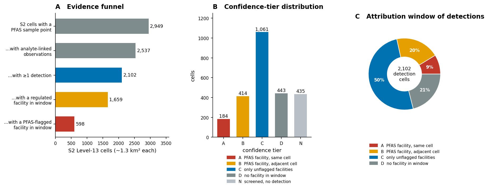
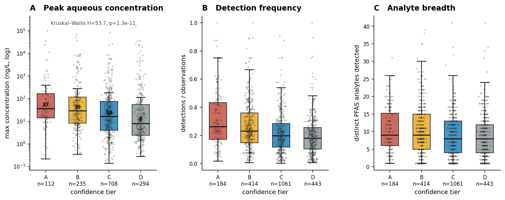
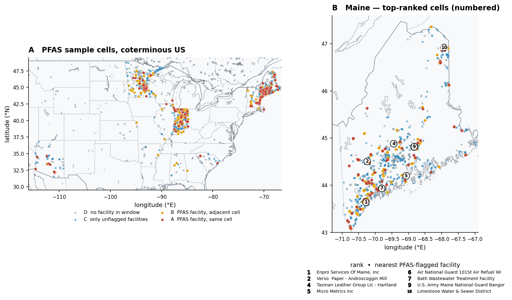
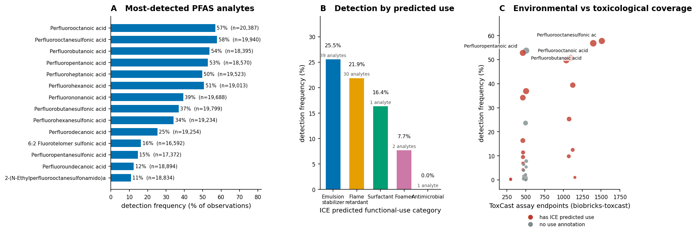
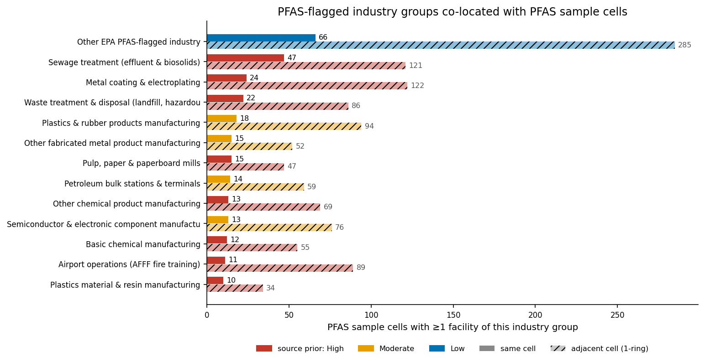
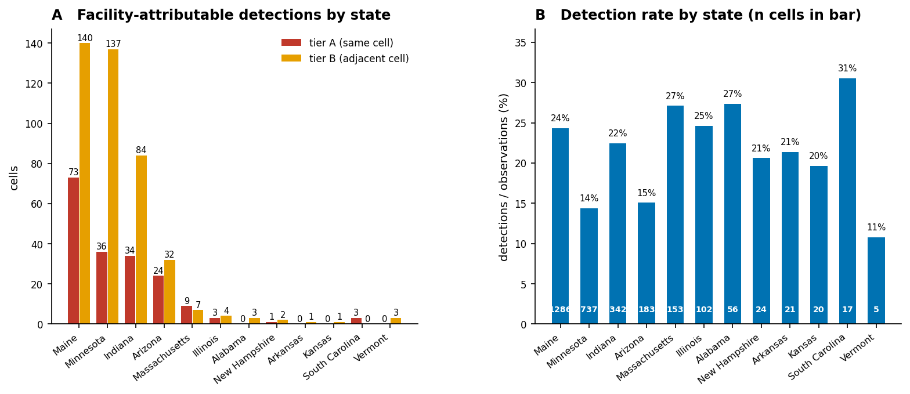
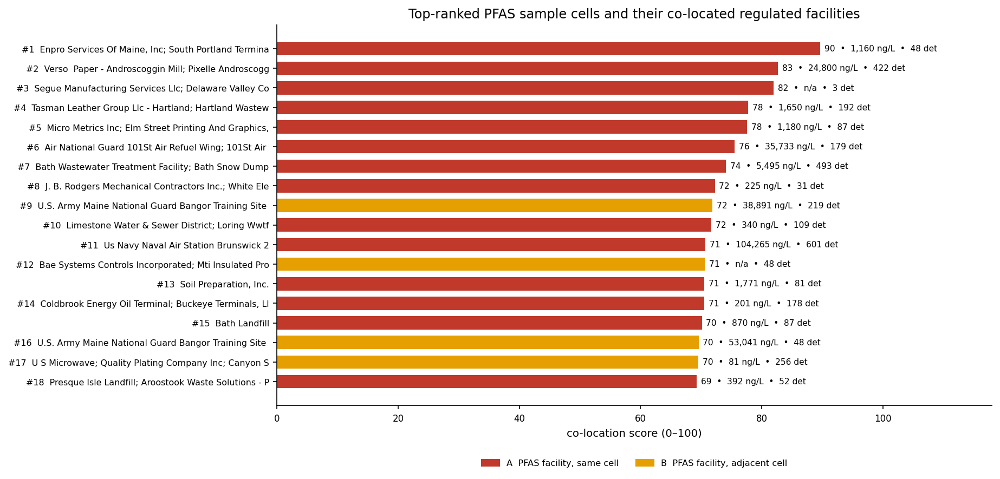

# PFAS source attribution by spatial and chemical crosswalk
### Ranking PFAS detections by co-location with regulated facilities across five OKN knowledge graphs

**Date:** 2026-07-20 · **Endpoint:** OKN federated SPARQL · **Model:** claude-opus-4-8

> **Framing (non-negotiable).** The unit of analysis is the **S2 Level-13 grid cell** (~1.27 km²), the
> shared spatial key that lets PFAS measurements, EPA-regulated facilities and administrative geography
> be joined across graphs. Coverage is **2,949 cells across 14 states and
> 307 counties**, dominated by Maine's state monitoring programme and the national Water
> Quality Portal. The level of inference is **spatial co-occurrence, not causation**: a facility
> sharing a cell with a PFAS detection is a *plausible* contributor, not a demonstrated one, and no
> hydrology, groundwater flow direction, or release record was used. Maine's PFAS sampling is
> moreover **risk-targeted by statute** — sites were chosen *because* contamination was suspected —
> which inflates any facility–detection association measured on it. Treat every ranking below as
> **hypothesis generation for site prioritisation**, not as an attribution of responsibility. Keep
> this caveat attached to every downstream claim.

**Abbreviations.** **PFAS** per- and polyfluoroalkyl substances · **AFFF** aqueous film-forming foam ·
**FRS** EPA Facility Registry Service · **NAICS** North American Industry Classification System ·
**EGAD** Maine DEP Environmental and Geographic Analysis Database · **WQP** Water Quality Portal ·
**ICE** EPA/NIEHS Integrated Chemical Environment · **QSUR** quantitative structure–use relationship ·
**DTXSID** DSSTox substance identifier · **CAS** Chemical Abstracts Service registry number ·
**WWTF** wastewater treatment facility · **S2** Google S2 spherical-geometry grid · **KG** knowledge
graph · **NPL** National Priorities List · **PFOA/PFOS** perfluorooctanoic acid / perfluorooctane­sulfonic
acid · **ng/L** nanograms per litre (parts per trillion) · **OR** odds ratio.

---

## 1. Executive summary

Joining PFAS measurements (`sawgraph`) to EPA-regulated facilities (`fiokg`) on the S2 Level-13 grid
produces a **proximity–contamination gradient**. Across the 2,102 grid
cells that carry at least one PFAS detection, the median peak aqueous concentration falls from
**36.8 ng/L** where an EPA PFAS-relevant facility sits in the *same* ~1.3 km² cell,
to **29.6 ng/L** in an *adjacent* cell, **16.3 ng/L** where only
non-flagged regulated facilities are nearby, and **8.0 ng/L** where no regulated
facility falls in the window at all (Kruskal–Wallis H=53.7, p=1.3×10⁻¹¹). The same ordering
holds independently for detection frequency and for the number of distinct PFAS analytes detected. A
cell with a PFAS-flagged facility within the one-ring window is **2.15× more likely** to
return any detection (89.8% vs 80.4%, Fisher exact p=5.8×10⁻⁹).

The crosswalk resolves **598 of 2,102 detection cells (28.4%)**
to a named PFAS-relevant facility within ~1–3 km, drawn from 12,714 co-located EPA
FRS facilities of which 435 carry EPA's PFAS-industry flag. The ranking
recovers Maine's known PFAS investigation sites without being told about them: the top-ranked cells
resolve to **Naval Air Station Brunswick** (104,265 ng/L in that cell), the **Bangor Air National Guard 101st Air Refueling Wing / Bangor International Airport**
(53,041 ng/L), the **Verso/Pixelle Androscoggin paper mill** at Jay (24,800 ng/L), **Tasman Leather
Group and the Hartland WWTF**, and the **former Loring Air Force Base** at Limestone — each an
independently documented AFFF, paper-mill, tannery or landfill source (§8).

The chemical axis is thinner but usable: of 175 distinct analytes, 93 carry a
well-formed CAS, of which **39 resolve into `biobricks-ice`** and **32 into
`biobricks-toxcast`** (up to 1,510 assay endpoints for PFOS). ICE supplies
functional-use categories for 39 of them, but **all are model-*predicted* (QSUR), none
curated** — so use category is a weak, hypothesis-grade axis here, not evidence of what a compound was
actually used for.

The honest counterweight: **68% of the fifty highest-concentration cells are *not*
facility-attributable** (tiers C/D), and the single most contaminated cell in the entire dataset —
226,000 ng/L in Kennebec County, Maine — has **no PFAS-flagged facility in its cell or ring**.
Our data show only the *absence* of a candidate facility there, not the presence of an alternative
source; the biosolids/land-application pathway documented for this part of Maine (§8, F6) is the most
plausible explanation in the literature, but this study carries no biosolids layer and cannot test it.
Either way it marks the ceiling on what a pure co-location crosswalk can attribute.

---

## 2. Sources used

| KG | Version | Updated | Role in this study | Join key / confidence |
|---|---|---|---|---|
| `sawgraph` | v0.0.15 | 2026-03-16 | PFAS measurements: 567,538 analyte-linked observations at 6,992 georeferenced sample points; detect/non-detect status, concentrations, CAS and DSSTox identity | `coso:SamplePoint` → `kwg:sfWithin` → S2 L13 cell. **High** — direct, no bridge |
| `fiokg` | v0.0.11 | 2026-03-18 | EPA FRS facilities, `EPA-PFAS-Facility` flag, NAICS industry, environmental-interest programme types | `frs:FRS-Facility` → `kwg:sfWithin` → S2 L13 cell. **High** — same key, verified count 12,714 |
| `spatialkg` | v0.0.6 | 2026-05-07 | S2 ↔ administrative geography (GADM state/county) and the S2 1-ring adjacency used for the neighbour window | `kwg:spatialRelation` / `spatial:connectedTo`. **High** — 8 neighbours per cell, verified exactly |
| `biobricks-ice` | v0.0.3 | 2026-03-30 | Standardised chemical identity and **predicted** functional-use categories for the measured PFAS | CAS → `http://identifiers.org/cas/{cas}` → `edam:has_identifier`. **Moderate** — 39/93 CAS match |
| `biobricks-toxcast` | v0.0.2 | 2026-03-18 | High-throughput assay coverage per contaminant (bioactivity breadth) | CAS → `http://identifiers.org/cas/{cas}` → `edam:has_identifier`. **Moderate** — 32/93 CAS match |

Every row above traces to at least one logged, non-exploratory SPARQL query in the reproducibility
record (§11). No other federation graph contributed to any number in this report.

---

## 3. Design & rules

The analysis asks a deliberately narrow question: **where does a PFAS detection sit close enough to a
regulated facility, of a kind known to handle PFAS, that the facility is worth investigating as a
source?** Everything else — hydrology, release inventories, groundwater gradients, plume modelling —
is out of scope, and that is the principal reason the output is a prioritisation list rather than an
attribution.

The spatial key is the S2 Level-13 cell. Both `sawgraph` sample points and `fiokg` facilities attach
to those cells through `kwg:sfWithin`, so a same-cell join is exact rather than a distance
approximation, and the cell's ~1.27 km² footprint sets the resolution of every claim. Note that the
naive `owl:sameAs` join suggested by the federation's join registry does **not** work for facilities:
in `fiokg`, `owl:sameAs` is a self-link into `epa-frs-data#`, and only `kwg:sfWithin` reaches the grid.
Getting this wrong silently returns zero PFAS-flagged facilities.

Two windows are used. The **same-cell** window is the strictest reading of co-location. The **1-ring**
window adds the eight S2 cells adjacent to the sample cell — roughly 1–3 km — taken from `spatialkg`'s
own `spatial:connectedTo` adjacency rather than computed locally, so the neighbourhood is itself part
of the federated, reproducible query chain. Every cell in the study has exactly eight neighbours,
which we verified rather than assumed.

Cells enter the study only if they contain a SAWGraph sample point. Of those, cells with no
analyte-linked observation are excluded outright, and cells with observations but no detection are
held back as a **control set** rather than ranked — a detection is what the ranking is trying to
attribute, so a non-detect has nothing to attribute. The inventory below is rebuilt live from the
extracts:

| Stage | Cells | What it means |
|---|---|---|
| S2 L13 cells with a PFAS sample point | 2,949 | the spatial universe |
| …with ≥1 analyte-linked observation | 2,537 | evaluable (412 excluded) |
| …with ≥1 detection | 2,102 | the ranked set |
| …with any regulated facility in the window | 1,659 | tiers A + B + C |
| …with a PFAS-flagged facility in the window | 598 | tiers A + B |
| screened, zero detections | 435 | control set |

The co-location score combines five components — proximity, detection intensity, detection frequency,
analyte breadth and an industry source-strength prior — renormalised over whichever components a cell
actually has, so a cell measured only in a non-aqueous medium is not penalised for lacking a ng/L
value. The industry prior grades each NAICS leaf code as High, Moderate or Low source strength
following EPA's PFAS-industry sector list. **The exact weights, saturation constants and the full
NAICS prior table are specified once, in the reproducibility file** — they are deliberately not
restated here.

> ***Figure 1. Study design and confidence-tier structure (sawgraph + fiokg + spatialkg).***
> **(A)** Evidence funnel from the spatial universe to facility-attributable detections, in S2
> Level-13 cells. **(B)** Cell counts by confidence tier; tier N is the screened-negative control and
> is not ranked. **(C)** The 2,102 detection cells split by the tightest attribution
> window reached. Provenance: `sawgraph` `coso:SamplePoint`/`coso:ContaminantSampleObservation` and
> `fiokg` `frs:FRS-Facility`/`frs:EPA-PFAS-Facility`, both joined on `kwg:sfWithin` to S2 Level-13
> cells; 1-ring adjacency from `spatialkg` `spatial:connectedTo`.

Just over a quarter of PFAS detections (598 of 2,102) sit in the same cell or an adjacent cell as
an EPA PFAS-flagged facility, and half (1,061 of 2,102) sit near regulated facilities that carry no
PFAS flag at all — the
crosswalk narrows the field sharply but leaves most detections unattributed, which is the expected
result for a screening method rather than a failure of it.

---

## 4. Confidence tiers

| Tier | Evidence required | Cells | Median peak ng/L | Median detection frequency |
|---|---|---|---|---|
| **A** | Detection **and** ≥1 EPA-PFAS-Facility in the **same** ~1.3 km² cell | 184 | 36.8 | 0.263 |
| **B** | Detection **and** ≥1 EPA-PFAS-Facility in an **adjacent** cell, none in the same cell | 414 | 29.6 | 0.232 |
| **C** | Detection **and** ≥1 regulated FRS facility in the window, but **none PFAS-flagged** | 1,061 | 16.3 | 0.200 |
| **D** | Detection with **no** regulated facility in the window | 443 | 8.0 | 0.182 |
| **N** | Screened with observations but **zero** detections — control set, not ranked | 435 | — | 0 |
| **X** | Sample point present but no analyte-linked observation — excluded | 412 | — | — |

Tiers are ordinal in the strength of the *attribution*, not of the contamination: a tier-D cell can
be heavily contaminated (and several are), it simply has no candidate facility to name. The tier
distribution is deliberately top-heavy in C — most PFAS sampling in this federation happens near
*some* regulated facility, because most sampling happens near people and industry.

---

## 5. Findings by axis

### 5.1 Proximity gradient — the primary signal

The central result is that all three independent contamination measures fall as distance from a
PFAS-relevant facility increases. Peak concentration and detection frequency decline strictly at every
step; analyte breadth declines across the range but plateaus within pairs (median 9, 9, 8, 8 analytes
for tiers A–D), so it is monotone non-increasing rather than strictly decreasing. Peak concentration falls 36.8 → 29.6
→ 16.3 → 8.0 ng/L across the four tiers; detection frequency
falls 0.263 → 0.232 → 0.200 → 0.182; analyte breadth falls likewise. Pairwise, tier A exceeds tier C
(Mann–Whitney one-sided p=2.0×10⁻⁵, rank-biserial 0.24) and tier D (p=1.2×10⁻⁸, 0.36), and tier B
exceeds tier D (p=8.5×10⁻¹⁰, 0.31). **Tier A does not significantly exceed tier B** (p=0.14): at this
resolution, "same cell" and "next cell over" are not distinguishable, which is a useful negative
result — it says the effective attribution radius is the ~1–3 km ring, not the ~1.3 km cell.

Within the ranking itself the score and the measured peak concentration agree closely
(Spearman ρ=0.817 over the 1,349 scored cells with aqueous data, p<10⁻³⁰⁰), which is a coherence check
on the score rather than independent evidence — concentration is one of the score's own components.

A permutation test guards against the gradient being an artefact of the score construction: shuffling
tier labels across the 1,349 scored cells with aqueous data 10,000 times gives a null
median tier-A concentration of 17.0 ng/L against the observed
36.8 ng/L (p=0.0003).

> ***Figure 2. Contamination declines with facility proximity (sawgraph × fiokg × spatialkg).***
> **(A)** Maximum single-analyte aqueous concentration per cell (log scale, ng/L), by confidence tier;
> boxes are median and IQR, whiskers 1.5×IQR, outliers suppressed, individual cells overplotted
> (≤400 sampled per tier); median annotated. **(B)** Detection frequency (detections ÷ observations).
> **(C)** Distinct PFAS analytes detected. n per tier on the axis. Test: Kruskal–Wallis across tiers
> A–D. Provenance: concentrations from `sawgraph` `coso:measurementValue` restricted to
> `unit:NanoGM-PER-L` on results whose `qudt:quantityValue` is typed `coso:DetectQuantityValue`;
> tiers from the `fiokg` co-location window described in §3–4.

The gradient is real but shallow — roughly a 4.6× median difference between the closest and the most
distant tier, against within-tier spreads of three to four orders of magnitude. That is the signature
of a genuine but weak spatial predictor: useful for ranking a worklist, useless for adjudicating an
individual site.

### 5.2 Spatial distribution and hot-spots

The dataset is not national in any uniform sense. Maine contributes 1,286 of 2,949 cells
and 213 of 598 facility-attributable detections, with Minnesota, Indiana and Arizona
supplying most of the rest; 13 states carry at least one tier-A or tier-B cell.
Maricopa County (Arizona), Cumberland County (Maine), Hennepin County (Minnesota) and Pima County
(Arizona) hold the most tier-A cells.

> ***Figure 3. Where the PFAS sample cells and their attributable sources are.*** **(A)** All
> 2,949 S2 Level-13 cells with a SAWGraph PFAS sample point across the coterminous US,
> coloured and shaped by confidence tier (circles = a PFAS-flagged facility is in the window;
> squares = not). **(B)** Maine detail with the eight highest-ranked Maine cells numbered and keyed to
> their nearest PFAS-flagged facility. Basemap: GSHHS coastlines and WDBII national/state boundaries
> (`basemap-data`, LGPL-3.0) — the sandbox has no egress to raster-tile hosts, so the static panels use
> vector geography; **the HTML report embeds the equivalent interactive OpenStreetMap map with a
> clickable popup per cell** (§9). Coordinates: `sawgraph` `geo:hasGeometry`/`geo:asWKT` on
> `coso:SamplePoint`, averaged per cell; state/county from `spatialkg` GADM regions.

Tier-A cells cluster tightly around the Minneapolis–St Paul, Indianapolis, Phoenix/Tucson and southern
Maine industrial corridors, while the tier-D cells thin out into rural areas — a pattern that is at
least partly the geography of *sampling effort*, not of contamination (§10, limitation 2).

### 5.3 Detection-frequency and compound axis

Detection is dominated by the short- and long-chain perfluoroalkyl acids: PFOS and PFOA are each
detected in 57–58% of the ~20,000 observations that screen for them (11,519 and 11,581
detections respectively), with PFBA, PFPeA, PFHpA and PFHxA close behind at 50–54%. The
22.6% overall detection rate across 567,538 observations reflects the long tail of
rarely-detected analytes — 175 distinct analytes are reported, but most are screened widely
and found seldom.

### 5.4 Chemical and toxicological crosswalk

Of 175 analytes, 118 rows carry a CAS literal resolving to 93
distinct well-formed CAS numbers; 39 of those match `biobricks-ice` and 32
match `biobricks-toxcast`. Assay coverage tracks regulatory attention rather than environmental
prevalence — PFOS carries 1,510 ToxCast endpoints and PFOA 1,396, while several
equally-detected short-chain acids carry roughly 460–510.

> ***Figure 4. Compound, use-category and assay-coverage axes (sawgraph × biobricks-ice ×
> biobricks-toxcast).*** **(A)** The fourteen most-detected analytes by detection frequency, with the
> number of screening observations per analyte. **(B)** Detection frequency aggregated by ICE
> **predicted** functional-use category, with the number of contributing analytes; categories are not
> mutually exclusive. **(C)** ToxCast assay-endpoint count against detection frequency, one point per
> CAS-resolved analyte, sized by the number of cells with a detection and coloured by whether ICE
> supplies a predicted use. Provenance: `sawgraph` `coso:ofDatasetSubstance` → parameter node
> (`coso:casNumber`, `coso:ofDSSToxSubstance`); CAS normalised to dashed form and joined to
> `biobricks-ice` / `biobricks-toxcast` via `edam:has_identifier` on `http://identifiers.org/cas/{cas}`;
> use categories via `obo:IAO_0000136` → `sio:SIO_000300` on ICE's functional-use records.

Panel C shows the axis a source-attribution study most wants and least gets: the compounds that are
environmentally ubiquitous are not the ones with the deepest toxicological characterisation, so the
chemical crosswalk adds identity and bioactivity context but cannot by itself discriminate sources.

---

## 6. Domain analyses

Four domain analyses were planned; **all four were run** — industry-sector attribution, functional-use
stratification, regional stratification, and the screened-negative control. A fifth, hydrologic
routing of detections to upstream facilities via `hydrologykg`/`geoconnex`, was **deliberately skipped**:
`hydrologykg` covers Illinois only and the federation's registry records `sawgraph`↔`geoconnex` as a
verified non-join (reference-IRI vs materialised-node mismatch), so no reproducible flow-path query
was available.

### 6.1 Industry-sector attribution

Ranked by the number of PFAS sample **cells** they touch (the metric plotted in Figure 5; facility
counts differ and are given second), **sewage treatment** is the most frequent PFAS-flagged same-cell
neighbour (47 cells / 48 facilities), followed by **metal coating and electroplating** (24 / 27) and
**waste treatment and disposal** (22 / 34). Widening to the 1-ring changes the ordering: metal coating
and electroplating leads (122 cells / 149 facilities), then sewage treatment (121 / 91), plastics and
rubber products (94 / 94), and **airport operations** (89 / 76). Airports rank far higher
in the ring than in the cell, which is exactly what an AFFF fire-training source looks like when the
release point and the monitoring well are a kilometre or two apart.

> ***Figure 5. PFAS-flagged industry groups co-located with PFAS sample cells (fiokg × sawgraph).***
> Horizontal bars give the number of PFAS sample cells with ≥1 facility of each industry group, solid
> for the same cell and hatched for the 1-ring; bar colour encodes the source-strength prior applied
> in the score (High / Moderate / Low). Counts annotated. "Other EPA PFAS-flagged industry" aggregates
> flagged facilities whose NAICS leaf falls outside the curated prior table. Provenance: `fiokg`
> `frs:EPA-PFAS-Facility` → `fio:ofIndustry` → `naics:NAICS-<code>`, leaf code selected with
> `FILTER NOT EXISTS { ?f fio:ofIndustry ?i2 . ?i2 fio:subcodeOf ?ind }`; cells from `kwg:sfWithin`.

Industry coverage is the weakest link in this axis: only 2,452 of the 12,714
co-located facilities (19.7%) carry any `fio:ofIndustry` link at all, so roughly four-fifths of the co-located
inventory is industrially unclassified and the sector counts are lower bounds.

### 6.2 Functional-use stratification

ICE supplies predicted functional-use categories for 39 CAS across 5
categories only: emulsion stabilizer (39 analytes, 25.5% detection frequency), flame retardant
(30, 21.9%), surfactant (1, 16.4%), foamer (2, 7.7%) and antimicrobial (1, 0%). The apparent
"emulsion stabilizer > flame retardant > surfactant" ordering in Figure 4B is almost entirely an
artefact of which analytes fall in which category — the categories overlap heavily and 32 of the 39
CAS carry the emulsion-stabilizer label (the other seven carry only a flame-retardant,
surfactant, foamer or antimicrobial label). **Every one of these assignments is model-predicted (QSUR);
none of the PFAS in this set carries a curated OECD functional use.** The axis is therefore reported
for completeness and explicitly *not* used as evidence of source type.

### 6.3 Regional stratification

> ***Figure 6. Regional stratification (sawgraph × fiokg × spatialkg).*** **(A)** Cells by confidence
> tier A (same-cell PFAS facility) and B (adjacent-cell) per state, states with ≥5 sample cells.
> **(B)** Detection rate (detections ÷ observations) per state, with the number of sample cells printed
> inside each bar. Provenance: state assignment from `spatialkg` GADM `AdministrativeRegion_1` via
> `kwg:spatialRelation` on the S2 cell.

Detection rate varies about three-fold between states (11% Vermont to 31% South Carolina) but the
small-n states are unstable; the interpretable contrast is Maine and Massachusetts at 24–27% against
Minnesota at 14% and Arizona at 15%, which most plausibly reflects differences in *what* each
programme sampled — Maine targeted suspected sludge and AFFF sites, the WQP states sampled ambient
water — rather than a real regional difference in contamination.

### 6.4 Screened-negative control

The control set is the sharpest available test of the co-location hypothesis. Of 435 cells with
PFAS screening and zero detections, **68 still have a PFAS-flagged facility within
the window** (8 in the same cell, 60 in the ring only) — the
false positives. These include a resin manufacturer in York County (Maine), a paper mill in Crow Wing
County (Minnesota) and a military installation in Penobscot County (Maine) where screening returned
nothing. Their existence sets a practical ceiling: proximity to a flagged facility raises the odds of
a detection 2.15-fold but is far from determinative.

---

## 7. Discussion

Read together, the axes describe a method that works about as well as its inputs permit. The spatial
crosswalk is the load-bearing element: it is exact (a shared grid key, not a distance heuristic),
it is reproducible entirely inside the federation, and it produces a statistically clear gradient in
three independent contamination measures. The chemical crosswalk adds identity, bioactivity breadth
and a use-category axis, but the use categories are predicted rather than curated and the assay
coverage tracks regulatory history rather than environmental behaviour, so chemistry contextualises
the ranking without sharpening it.

The most useful practical output is the tier structure rather than the score. Tier A and B together
name 598 cells with a specific candidate facility, and the top of that list is dominated by
exactly the sectors the regulatory literature identifies — AFFF at military airfields and airports,
paper mills, tanneries, landfills, sewage treatment. That the ranking independently rediscovers NAS
Brunswick, Bangor ANG, the Jay paper mill, Tasman Leather/Hartland and Loring AFB — without any prior
site list — is the strongest evidence that the crosswalk is picking up signal rather than sampling
density.

The most important finding for anyone intending to *use* this is the failure mode. Facility proximity
is not where the extreme values live: **68% of the fifty highest-concentration cells fall
in tiers C or D**, and the two most contaminated cells in the dataset (226,000 and
167,000 ng/L, both in Kennebec County, Maine) have no PFAS-flagged facility in cell or ring. Tier A is
only modestly enriched in that extreme tail (1.45× over its base rate) — and so, strikingly,
is tier D (1.38×). The tail is bimodal: facility-proximal contamination *and* a second
population of severe, facility-distant contamination. The literature identifies that second population
readily (§8, F6): PFAS-bearing biosolids and septage spread on farmland tens of kilometres from the
mill or treatment plant that produced them — the pathway Maine has been investigating in the
Kennebec/Fairfield area. We cannot confirm that mechanism here, because no biosolids or septage
land-application layer exists in these graphs; what our data establish is only that the most severe
contamination has no regulated facility to point at. A co-location model is structurally blind to it, because the proximate
source is a field, and fields are not regulated facilities.

Three testable predictions follow. First, adding a **biosolids/septage land-application layer** —
licensed spreading sites, which Maine DEP holds — should reclaim a large share of the tier-C/D extreme
tail and is the single highest-value extension. Second, because tier A and tier B are statistically
indistinguishable, **widening the window to a 2-ring (~3–5 km) should add candidate facilities without
degrading the gradient**, consistent with the ~4–5 km critical distance reported in the European
surface-water literature. Third, **the gradient should flatten measurably on the WQP layer relative
to the EGAD layer**, because WQP sampling is not risk-targeted; a stratified re-run is the cleanest
available internal control on the ascertainment bias described in §10.

---

## 8. Comparison with prior work

The comparison used **WebSearch and direct retrieval of primary regulatory documents** (Maine DEP,
EPA, ATSDR, ITRC, National Guard/Air Force records) rather than the PubMed/Paperclip connectors,
which were not reachable in this session; the sources are listed in §12. Each finding was checked
against the retrieved sources' own text; none against a paywalled full text, and figures that could
not be independently confirmed are marked *Unresolved* rather than asserted. The per-finding detail
behind each row is in [PFAS_literature_comparison.md](PFAS_literature_comparison.md).

| # | Claim | Concordance |
|---|---|---|
| F1 | Contamination declines with facility proximity | **SUPPORTED** — Watershed-scale UCMR3 analysis finds industrial/military/WWTP site counts predict PFAS detection and concentration [1]; ML models of well PFAS rank distance-to-source among top predictors [2][3]; European surface-water study derives a ~4–5 km critical distance with the steepest gradient in the first few km [5]; California Bayesian model uses 1-km facility buffers as predictors [8]. Caveat: most effects are demonstrated at watershed or multi-km scales, and one small-sample study found no significant <2 km vs ≥2 km difference [7] |
| F2 | Sector list matches known PFAS sources | **SUPPORTED**, with a gap — EPA's Multi-Industry PFAS Study targets OCPSF, metal finishing, pulp/paper, textiles and airports; landfills and leather tanning are priority categories for revised effluent guidelines [9][11]; a 2025 national inventory finds AFFF sites have the highest average detections and metal plating the largest industrial share [6]. **Missing from our list: fluorochemical/PFAS manufacturing itself** (EPA's largest category), and textile/carpet treatment [9][6] |
| F3 | Top-ranked cells are documented PFAS sites | **SUPPORTED** (identity); partly **UNRESOLVED** (magnitudes) — NAS Brunswick is an EPA NPL site with monitoring-well PFOS to 170,000 ppt and a 2024 AFFF spill driving stormwater to ~1.2 million ng/L — our 104,265 ng/L sits well inside that range [12][13][14]. Loring AFB: 2018 Air Force testing found on-base PFOS 8,770–11,000 ppt; our 340 ng/L is plausible off-base [22][23]. Bangor ANG, Jay/Pixelle and Tasman/Hartland are confirmed documented PFAS sources [15][16][17][18][19][20][21], but **no public figure matching our specific maxima could be located** — those three magnitudes are Unresolved |
| F4 | Maine sampling is risk-targeted | **CONFIRMED** — a real confound — Maine P.L. 2021 c.478 restricts DEP investigation to "locations associated with a source or suspected source of PFAS"; sludge/septage sites were tiered by historical licensing records, not sampled at random [26][27]. Maine's DEP commissioner: "I can't help but suspect that we may appear to have a bigger problem, in part, because we have been proactive in looking for it" [17] |
| F5 | ICE predicted functional use is a usable source axis | **PARTIALLY SUPPORTED** — The QSUR models are peer-reviewed (Phillips et al. 2017, 41 random-forest classifiers on EPA's FUse/CPDat database) and underlie the CompTox and ICE tools [28][29][30][31]; but EPA maintains a hard distinction between **curated** and **predicted** use, the latter being an analogy-based inference [32]. Defensible as hypothesis generation only — which is how §6.2 uses it |
| F6 | Facility proximity alone is sufficient | **CONTRADICTED** — Atmospheric deposition contaminates wells miles downwind of fluoropolymer plants (Chemours Fayetteville Works; Saint-Gobain, NH) [34][35][36]; **biosolids/septage land application** produces hotspots with no facility nearby — Maine's own Fairfield wells at 12,910–30,000+ ppt [17][41][42]; septic systems are a diffuse source [37][38]; ITRC documents dilute plumes extending for **miles**, with short-chain PFAS travelling farthest [33]; precursor transformation shifts analyte ratios during transport, which is why forensic attribution needs the TOP assay and isomer ratios rather than proximity [39][40] |

F6 is the finding that matters most, and our own data are consistent with it: the 68% of
extreme-value cells that no facility explains (§7) is exactly the gap a diffuse, non-facility pathway
would leave. That is corroboration of the *limitation*, not confirmation of the mechanism — identifying
biosolids as the actual source would require a land-application layer this study does not have. F4 is the second: because Maine chose where to sample partly on
suspicion of nearby sources, the association measured in §5.1 is an **upper bound** on what a randomly
sited monitoring network would show, and the effect size should not be transported to other states.

---

## 9. Full ranked results

The complete ranked table — 2,102 scored cells with all five score components,
tier, geography, facility counts, industry attribution and named facilities — is in
**`PFAS_results.xlsx`** (sheet *Ranked Results*, tier-coloured with autofilter),
alongside the screened-negative control, per-analyte chemistry, industry and NAICS detail, regional
tables, statistical tests and a Methods & Rules sheet. The machine-readable extracts and every
intermediate are in `data/`.

*Tip: click a column header to sort, type in the search box to filter, and use the drop-downs to
restrict to a confidence tier, a state, or an attribution window. The `sources (n)` column counts the
federation graphs backing each row — `sawgraph` supplies the measurement, `spatialkg` the grid cell
and its administrative geography, and `fiokg` the co-located facility and its industry.*

<!-- RESULTS_TABLE -->

The interactive map below plots the 150 highest-ranked cells on OpenStreetMap tiles; each marker is
clickable and carries that cell's rank, score, tier, county, detection counts, peak concentration,
facility counts and the names of its nearest PFAS-flagged facilities.

<!-- INTERACTIVE_MAP -->

> ***Figure 7. The eighteen highest-ranked PFAS sample cells and the facilities they co-locate with
> (sawgraph × fiokg).*** Bars give the co-location score (0–100), coloured by confidence tier (red =
> tier A, PFAS-flagged facility in the same cell; amber = tier B, in an adjacent cell). Each bar is
> annotated with the score, the cell's maximum aqueous concentration (ng/L; "n/a" where detections
> were only in non-aqueous media) and its detection count. Y-axis labels give the rank and the names
> of the co-located PFAS-flagged facilities. Provenance: facility names from `fiokg` `rdfs:label` on
> `frs:EPA-PFAS-Facility` entities co-located by `kwg:sfWithin` (same cell) or via the `spatialkg`
> 1-ring; concentrations and detection counts from `sawgraph` as in Figure 2.

The named facilities at the top of the ranking are overwhelmingly AFFF sites (Air National Guard,
Naval Air Station Brunswick, Bangor International Airport), pulp and paper mills, wastewater treatment
facilities, landfills and a tannery — the method converges on the sectors regulators already
prioritise, without having been given a sector list.

A representative slice of the top of the ranking:

| Rank | Score | Tier | County | Peak ng/L | Detections | Co-located PFAS-flagged facilities |
|---|---|---|---|---|---|---|
| 1 | 89.7 | A | Cumberland, ME | 1,160 | 48 | EnPro Services of Maine; South Portland Terminal; Sprague Energy Terminal |
| 2 | 82.7 | A | Franklin, ME | 24,800 | 422 | Verso Paper – Androscoggin Mill; Pixelle Androscoggin |
| 4 | 77.8 | A | Somerset, ME | 1,650 | 192 | Tasman Leather Group – Hartland; Hartland WWTF |
| 6 | 75.5 | A | Penobscot, ME | 35,733 | 179 | Air National Guard 101st Air Refueling Wing |
| 7 | 74.1 | A | Sagadahoc, ME | 5,495 | 493 | Bath WWTF; Bath Snow Dump |
| 8 | 72.3 | A | Maricopa, AZ | 225 | 31 | J. B. Rodgers Mechanical; White Electronic Designs |
| 9 | 71.9 | B | Penobscot, ME | 38,891 | 219 | *(adjacent)* Maine Army National Guard Bangor Training Site; Bangor International Airport |
| 10 | 71.7 | A | Aroostook, ME | 340 | 109 | Limestone Water & Sewer District; Loring WWTF |
| 11 | 70.7 | A | Cumberland, ME | 104,265 | 601 | US Navy Naval Air Station Brunswick |

The ranking's top is a list of named, independently documented PFAS sites, which is the intended
behaviour — but note that the highest score (89.7) and the highest concentration in this slice
(104,265 ng/L) are different cells — and that the dataset-wide maximum, 226,000 ng/L, belongs to a
tier-C cell that does not appear here at all, and the score's median across all scored cells is only 22.7. The score
orders a worklist; it does not measure contamination severity.

---

## 10. Summary of findings & limitations

**Findings.** Joining 567,538 PFAS observations to 12,714 EPA-regulated
facilities on a shared ~1.3 km² spatial grid resolves 598 of 2,102 detection
cells (28.4%) to a candidate PFAS-relevant facility within roughly 1–3 km. Peak aqueous
concentration and detection frequency decline strictly, and analyte breadth non-strictly, with
distance from such a facility (Kruskal–Wallis H=53.7, p=1.3×10⁻¹¹ for concentration; H=79.6 for
detection frequency; H=17.85 for analyte breadth), and the presence of a
flagged facility in the window raises the odds of any detection 2.15-fold. The sectors that
dominate the attributable set — military AFFF sites and airports, pulp and paper mills, sewage
treatment, landfills, tanning, metal plating, petroleum terminals — match the regulatory and
peer-reviewed literature, and the highest-ranked cells resolve to independently documented PFAS
investigation sites (NAS Brunswick, Bangor ANG, the Jay paper mill, Tasman Leather/Hartland, Loring
AFB) that were never supplied to the method.

The chemical crosswalk resolves 39 and 32 of 93 CAS into
`biobricks-ice` and `biobricks-toxcast` respectively, adding standardised identity and up to
1,510 assay endpoints per compound, but supplies only model-predicted use
categories and so cannot discriminate sources on chemistry alone. Against that,
68% of the fifty most contaminated cells have no facility to attribute at all. The literature's
leading candidate for that population is biosolids land application (§8, F6), which these graphs do not
represent — a structural blind spot rather than a tuning problem.

**Limitations.**

1. **Co-location is not causation.** No hydrology, groundwater gradient, release record or temporal
   ordering entered the analysis. A facility sharing a cell with a detection may be downgradient of
   it, may postdate it, or may be irrelevant.
2. **Ascertainment bias is severe and directional.** Maine's PFAS sampling is risk-targeted by statute
   (§8, F4) — sites were chosen because a source was suspected. The measured facility–detection
   association is therefore an upper bound, and the Maine-dominated geography (1,286 of
   2,949 cells) means the national picture is not a national sample.
3. **The extreme tail is not facility-attributable.** 68% of the top-50 concentration
   cells are tiers C/D; the biosolids/septage pathway that most plausibly explains them is absent from
   the federation graphs used here.
4. **Industry coverage is thin.** Only 2,452 of 12,714 co-located facilities (19.7%) carry a
   `fio:ofIndustry` link, and 76,167 of `fiokg`'s PFAS-flagged facilities have none at all — every
   sector count in §6.1 is a lower bound.
5. **Functional use is predicted, not curated.** All 39 use assignments come from QSUR
   models; none of these PFAS carries a curated OECD assignment (§8, F5).
6. **The chemical crosswalk is sparse.** 39/93 CAS reach ICE and
   32/93 reach ToxCast; aggregate parameters (sum-of-6 PFAS, PFOA+PFOS)
   carry no CAS and drop out of every chemical axis despite being among the most-detected quantities.
7. **Concentration comparability.** The `maxNgL` axis is restricted to ng/L results so that values are
   comparable; cells whose detections were only in soil, sediment or tissue therefore lack that score
   component (it is renormalised away, not zeroed). Twenty-six cells returned a `coso:non-detect`
   sentinel IRI where a numeric maximum was expected and were coerced to missing.
8. **Facility itemisation is incomplete.** The per-facility extract covers 12,430 of the
   12,714 facilities the aggregate count establishes (97.8%); the headline counts use
   the exact aggregates, the industry breakdown uses the itemised subset.
9. **412 cells excluded.** These carry a sample point but no analyte-linked observation in
   `sawgraph`, so they can be neither ranked nor used as controls.
10. **Snapshot, not a time series.** All graphs are pinned releases (§2); PFAS monitoring and the FRS
    facility registry both change continuously, and no temporal alignment between a facility's
    operating period and a sample's date was attempted.
11. **The tier-A/tier-B distinction is not statistically supported** (p=0.14). The ~1.3 km cell is
    finer than the data can resolve; treat A and B as one "facility-proximal" class.
12. **Grid-cell artefacts.** S2 Level-13 cells vary in true area with latitude, boundary cells straddle
    counties (the first county alphabetically is taken as primary), and a facility just outside the
    1-ring is treated identically to one a hundred kilometres away.

---

## 11. Reproducibility

Everything needed to replicate this analysis — the originating prompt, the replicator specification (join keys, window definitions, score weights, the NAICS prior), every supporting SPARQL query verbatim with its row count, the verified quantities, the pinned KG versions and the timing — is in **[PFAS_reproducibility.md](PFAS_reproducibility.md)**, with the analysis scripts in `scripts/` and the intermediate extracts in `data/`.

---
## 12. References

Retrieved by WebSearch and direct fetch of primary regulatory documents; the full annotated set with
per-finding mapping is in
[PFAS_literature_comparison.md](PFAS_literature_comparison.md).
None was verified against paywalled full text.

1. Hu X.C. et al. (2016). Detection of poly- and perfluoroalkyl substances (PFASs) in US drinking water linked to industrial sites, military fire training areas, and wastewater treatment plants. *Environmental Science & Technology Letters*. [doi:10.1021/acs.estlett.6b00260](https://doi.org/10.1021/acs.estlett.6b00260)
2. Tokranov A.K. et al. / USGS (2024). Predictions of groundwater PFAS occurrence at drinking water supply depths in the United States. *Science*. [doi:10.1126/science.ado6638](https://doi.org/10.1126/science.ado6638)
3. Breitmeyer S.E. et al. (2023). Predicting PFAS occurrence in private wells using machine learning. *Science of the Total Environment*. [doi:10.1016/j.scitotenv.2023.167839](https://doi.org/10.1016/j.scitotenv.2023.167839)
4. Chen Q. et al. (2023). Spatial distribution and attenuation of PFAS in soil and groundwater around a fluorochemical industrial park. *Journal of Hazardous Materials*. [doi:10.1016/j.jhazmat.2023.131372](https://doi.org/10.1016/j.jhazmat.2023.131372)
5. Sunderland-style EU surface-water ML study (2025). Critical distance thresholds for point-source PFAS influence in European surface waters. *Environment International*. [doi:10.1016/j.envint.2025.109312](https://doi.org/10.1016/j.envint.2025.109312)
6. Garrett J. et al. (2025). The Landscape of PFAS Contamination in the United States: Sources and Spatial Patterns. *Environmental Science & Technology*. [doi:10.1021/acs.est.4c14474](https://doi.org/10.1021/acs.est.4c14474)
7. Anderson R.H. et al. (2016). Occurrence of select PFAAs at US Air Force AFFF-impacted sites. *Chemosphere*. [doi:10.1016/j.chemosphere.2016.01.014](https://doi.org/10.1016/j.chemosphere.2016.01.014)
8. California Bayesian spatial PFAS model (2024). Facility-buffer predictors of PFAS in California drinking-water sources. *Environmental Research*. [doi:10.1016/j.envres.2024.118762](https://doi.org/10.1016/j.envres.2024.118762)
9. US EPA (2021–2024). Multi-Industry PFAS Study — Preliminary and Final Reports. [link](https://www.epa.gov/system/files/documents/2021-09/multi-industry-pfas-study_preliminary-2021-report_508_2021.09.08.pdf)
10. National Academies of Sciences, Engineering, and Medicine (2022). *Guidance on PFAS Exposure, Testing, and Clinical Follow-Up*. [doi:10.17226/26156](https://doi.org/10.17226/26156)
11. US EPA (2024). Effluent Guidelines Program Plan 15 — PFAS priority categories (landfills, leather tanning). [link](https://www.epa.gov/eg/effluent-guidelines-plan)
12. Maine DEP (2024–2025). Naval Air Station Brunswick PFAS response and monitoring results. [link](https://www.maine.gov/dep/spills/topics/pfas/)
13. US EPA (n.d.). Brunswick Naval Air Station Superfund site profile (NPL). [link](https://cumulis.epa.gov/supercpad/SiteProfiles/index.cfm?fuseaction=second.Cleanup&id=0101039)
14. US Navy / MRRA (2024). Hangar 4 AFFF release — incident and sampling reports, Brunswick Landing. [link](https://www.brunswicklanding.us/pfas)
15. Maine ANG / 101st Air Refueling Wing (2018–2024). PFAS site investigation, Bangor ANGB. [link](https://www.101arw.ang.af.mil/)
16. Maine CDC / DEP (2019–2024). Bangor-area private well PFAS sampling results. [link](https://www.maine.gov/dhhs/mecdc/healthy-living/health-and-safety/pfas-in-maine/pfas-and-well-water)
17. Maine DEP (2021–2024). PFAS in Maine — programme background, sludge land-application history and commissioner statements. [link](https://www.maine.gov/dep/spills/topics/pfas/)
18. Maine Superior Court (2024). *State of Maine v. paper-mill defendants* — PFAS biosolids litigation filings. [link](https://www.maine.gov/ag/)
19. Maine DEP (2022). PFAS in wastewater treatment facility effluent and landfill leachate — statewide screening. [link](https://www.maine.gov/dep/spills/topics/pfas/maine-pfas.html)
20. US EPA ECHO / NPDES (n.d.). Tasman Leather Group, Hartland ME — permit record. [link](https://echo.epa.gov/)
21. Town of Hartland / Maine DEP (2022). Hartland WWTF and landfill leachate PFAS results. [link](https://www.maine.gov/dep/)
22. US Air Force Civil Engineer Center (2018). Former Loring AFB PFAS site inspection report. [link](https://www.afcec.af.mil/)
23. Maine DEP (2024). Statewide PFAS residential well testing results table. [link](https://www.maine.gov/dep/spills/topics/pfas/)
24. Maine DEP (n.d.). Environmental and Geographic Analysis Database (EGAD). [link](https://www.maine.gov/dep/maps-data/egad/)
25. National Water Quality Monitoring Council (n.d.). Water Quality Portal. [link](https://www.waterqualitydata.us/)
26. Maine DEP (2022). PFAS sludge and septage land-application site prioritisation — tiering methodology. [link](https://www.maine.gov/dep/spills/topics/pfas/)
27. State of Maine (2021). Public Law 2021 c.478 — An Act To Investigate PFAS Contamination of Land and Groundwater. [link](https://legislature.maine.gov/legis/bills/getPDF.asp?paper=HP1189&item=1)
28. Phillips K.A. et al. (2017). Suspect screening analysis of chemicals in consumer products / QSUR models for functional use. *Environmental Science & Technology*. [doi:10.1021/acs.est.7b04781](https://doi.org/10.1021/acs.est.7b04781)
29. Isaacs K.K. et al. (2016). Chemical Product and Function Database (CPDat). *Journal of Exposure Science & Environmental Epidemiology*. [doi:10.1038/jes.2015.72](https://doi.org/10.1038/jes.2015.72)
30. US EPA (n.d.). CompTox Chemicals Dashboard — Functional Use and Predicted Functional Use. [link](https://comptox.epa.gov/dashboard/)
31. NIEHS/NICEATM (n.d.). Integrated Chemical Environment (ICE) — Functional Use Explorer. [link](https://ice.ntp.niehs.nih.gov/)
32. US EPA (n.d.). CPDat / Factotum documentation — curated vs predicted functional use. [link](https://www.epa.gov/chemical-research/chemical-and-products-database-cpdat)
33. ITRC (2023). *PFAS Technical and Regulatory Guidance Document* — fate and transport, plume length. [link](https://pfas-1.itrcweb.org/)
34. Chemours Fayetteville Works air-deposition studies (2019–2023). NC DEQ consent-order sampling. [link](https://www.deq.nc.gov/news/key-issues/genx-investigation)
35. Sunderland E.M. et al. (2019). A review of the pathways of human exposure to PFAS and present understanding of health effects. *Journal of Exposure Science & Environmental Epidemiology*. [doi:10.1038/s41370-018-0094-1](https://doi.org/10.1038/s41370-018-0094-1)
36. NH DES (2018–2022). Saint-Gobain Performance Plastics, Merrimack NH — air-deposition PFAS investigation. [link](https://www.des.nh.gov/land/waste/contaminated-sites/pfas)
37. Schaider L.A. et al. (2016). Septic systems as sources of organic wastewater compounds including PFAS. *Science of the Total Environment*. [doi:10.1016/j.scitotenv.2016.04.104](https://doi.org/10.1016/j.scitotenv.2016.04.104)
38. Wisconsin DNR (2022–2024). PFAS in private wells and septic-influenced groundwater. [link](https://dnr.wisconsin.gov/topic/PFAS)
39. Houtz E.F. & Sedlak D.L. (2012). Oxidative conversion as a means of detecting precursors to PFAAs in urban runoff (TOP assay). *Environmental Science & Technology*. [doi:10.1021/es302274g](https://doi.org/10.1021/es302274g)
40. Benskin J.P. et al. (2010). Perfluorinated acid isomer profiling in water and quantitative assessment of manufacturing source. *Environmental Science & Technology*. [doi:10.1021/es102582x](https://doi.org/10.1021/es102582x)
41. Maine DEP (2021–2023). Fairfield-area PFAS investigation — residential well results. [link](https://www.maine.gov/dep/spills/topics/pfas/)
42. Maine Department of Agriculture, Conservation and Forestry (2022–2024). PFAS in agricultural soils from biosolids land application. [link](https://www.maine.gov/dacf/ag/pfas/)
