# PFAS source attribution by spatial and chemical crosswalk — Reproducibility Record

- **Date:** 2026-07-20
- **Model:** claude-opus-4-8
- **SPARQL endpoint:** https://apps.okn.us/federation/sparql
- **Generated by:** mcp-okn v0.1.0
- **Study active window:** 2026-07-20T21:47Z → 2026-07-21T00:41Z (2h 53m)
- **Contents:** 137 queries

## Prompt

PFAS source attribution by integrating environmental samples, regulated facilities, and chemical-use annotations. Can spatial and chemical crosswalks identify PFAS detections plausibly associated with nearby regulated facilities and known chemical-use categories? Use sawgraph (PFAS measurements), fiokg (EPA facilities + industry), spatialkg (S2/county/state rollups), and biobricks-ice / biobricks-toxcast (chemical identity, functional-use, assay coverage). Rank PFAS sample locations by co-location with PFAS-relevant facility types, stratify by compound / CAS / functional use / detection frequency / region, and validate against known monitoring programs. Use the /okn-report-style to report the results.

## Knowledge graphs used

- `sawgraph` — <https://purl.org/okn/frink/kg/sawgraph>
- `fiokg` — <https://purl.org/okn/frink/kg/fiokg>
- `spatialkg` — <https://purl.org/okn/frink/kg/spatialkg>
- `biobricks-ice` — <https://purl.org/okn/frink/kg/biobricks-ice>
- `biobricks-toxcast` — <https://purl.org/okn/frink/kg/biobricks-toxcast>

## Replicator specification

Everything a replicator needs to reproduce the analysis exactly. The narrative version for a reader
is in §3–§4 of `pfas_source_attribution_report.md`; this section is the authoritative specification
and the report deliberately does not restate it.

### S1. Knowledge graphs and pinned versions

| KG | Named graph | Version | Last updated |
|---|---|---|---|
| `sawgraph` | `https://purl.org/okn/frink/kg/sawgraph` | v0.0.15 | 2026-03-16 |
| `fiokg` | `https://purl.org/okn/frink/kg/fiokg` | v0.0.11 | 2026-03-18 |
| `spatialkg` | `https://purl.org/okn/frink/kg/spatialkg` | v0.0.6 | 2026-05-07 |
| `biobricks-ice` | `https://purl.org/okn/frink/kg/biobricks-ice` | v0.0.3 | 2026-03-30 |
| `biobricks-toxcast` | `https://purl.org/okn/frink/kg/biobricks-toxcast` | v0.0.2 | 2026-03-18 |

Versions read from the federation's VoID metadata via `get_kg_version` on 2026-07-20.

### S2. Join keys (the load-bearing decisions)

**Spatial key — S2 Level-13 cell** (`http://stko-kwg.geog.ucsb.edu/lod/resource/s2.level13.<digits>`).

- `sawgraph` sample point → cell: `?pt a coso:SamplePoint ; kwg:sfWithin ?cell`
  (`coso:` = `http://w3id.org/coso/v1/contaminoso#`, `kwg:` = `http://stko-kwg.geog.ucsb.edu/lod/ontology/`).
- `fiokg` facility → cell: `?f a frs:FRS-Facility ; kwg:sfWithin ?cell`
  (`frs:` = `http://w3id.org/fio/v1/epa-frs#`); PFAS-flagged subset: `?f a frs:EPA-PFAS-Facility`.
- **CRITICAL — do NOT use `owl:sameAs` for facilities.** The federation's join registry records the
  `fiokg`↔`sawgraph` S2 join on `owl:sameAs`, but in `fiokg` `owl:sameAs` on a facility is a self-link
  into `epa-frs-data#`; only the materialised S2 cell nodes carry a self-`sameAs`. Using `owl:sameAs`
  returns **0** PFAS-flagged facilities and silently looks like a real (null) result.
- **1-ring adjacency**: `spatialkg` `spatial:connectedTo` (`spatial:` =
  `http://purl.org/spatialai/spatial/spatial-full#`; `kwg:spatialRelation` and
  `spatial:spatiallyRelatedTo` return the identical object set) with BOTH ends filtered to the
  `s2.level13.` prefix and `FILTER(?neighbor != ?cell)`. Verified: every one of the 2,949 study cells
  has exactly **8** neighbours (23,592 edges) — the full edge+vertex neighbourhood, not the
  4-neighbourhood.
- **Administrative geography**: `?cell kwg:spatialRelation ?county . ?county a kwg:AdministrativeRegion_2 ;
  kwg:administrativePartOf ?state . ?state a kwg:AdministrativeRegion_1`. Two IRI-prefix filters on
  `administrativeRegion.USA.` are **required**: `spatialkg` mirrors every region as a
  `datacommons.org/browser/geoId/*` node carrying the same `rdf:type` and `rdfs:label`, which
  otherwise quadruplicates every row. `kwg:sfWithin` alone is insufficient (boundary cells point only
  at their level-12 parent); `kwg:sfOverlaps` alone matched only 331 of 3,205 cells.

**Chemical key — CAS.** `sawgraph` observation `coso:ofDatasetSubstance` → parameter node carrying
`coso:casNumber`. CAS literals are **mostly undashed digit strings** (`335671` = 335-67-1) and some
are internal Maine DEP codes (`DEP18029`). Normalisation, then IRI construction:

```
BIND(IF(REGEX(STR(?raw),'^[0-9]{5,10}$'),
        REPLACE(STR(?raw),'^([0-9]+)([0-9]{2})([0-9])$','$1-$2-$3'),
        STR(?raw)) AS ?cas)
FILTER(REGEX(?cas,'^[0-9]{2,7}-[0-9]{2}-[0-9]$'))
BIND(IRI(CONCAT('http://identifiers.org/cas/', ?cas)) AS ?casIri)
```

`biobricks-ice` and `biobricks-toxcast` attach that IRI via `<http://edamontology.org/has_identifier>`.
A dashed-only regex silently drops 78 of `sawgraph`'s 131 CAS values.

**Industry.** `fio:ofIndustry` (`fio:` = `http://w3id.org/fio/v1/fio#`) → `http://w3id.org/fio/v1/naics#NAICS-<code>`.
`frs:ofPrimaryIndustry` is entirely unpopulated (0 triples for the co-located set). `fio:ofIndustry`
materialises the whole NAICS hierarchy per facility, so the leaf must be selected with
`FILTER NOT EXISTS { ?f fio:ofIndustry ?i2 . ?i2 fio:subcodeOf ?ind }`. The code comes from the IRI —
`dcterms:identifier` is absent on sector/aggregate nodes.

**ICE functional use.** Prune on the chemical-entity IRI first, then use the cheap inverse:

```
?chem edam:has_identifier <http://identifiers.org/cas/{CAS}> .
FILTER(CONTAINS(STR(?chem),'Chemical_Functional_Use_Categories'))
?rec obo:IAO_0000136 ?chem ; rdfs:label ?useSource ; sio:SIO_000300 ?useCategory .
```

The forward two-hop (`?chem obo:RO_0000056 ?mg . ?mg obo:OBI_0000299 ?rec`) is semantically identical
but fans out across `cHTS2022_invitrodb34` (2,488,499 edges) and OOMs the endpoint.

**ToxCast endpoints.** `?chem edam:has_identifier <cas IRI> ; obo:RO_0000056 ?endpoint`
(`?endpoint a bao:BAO_0000040`).

### S3. Detection semantics

`?obs coso:hasResult ?res . ?res qudt:quantityValue ?qv . ?qv a coso:DetectQuantityValue`
(non-detect: `coso:NonDetectQuantityValue`). Concentration: `?res coso:measurementValue ?v ;
coso:measurementUnit ?u`. The `maxNgL` axis is **restricted to `unit:NanoGM-PER-L`** so values are
comparable; other media (soil, sediment, tissue) contribute to detection counts but not to `maxNgL`.
26 cells returned the sentinel IRI `coso:non-detect` in the `MAX()` position (SPARQL orders IRIs above
numeric literals) and were coerced to missing.

### S4. Cohort construction

| Stage | Rule | n cells |
|---|---|---|
| Universe | ≥1 `coso:SamplePoint` with a `kwg:sfWithin` S2 L13 cell | 2,949 |
| Evaluable | universe ∧ ≥1 observation with `coso:ofDatasetSubstance` | 2,537 |
| Ranked | evaluable ∧ ≥1 `coso:DetectQuantityValue` | 2,102 |
| Control (tier N) | evaluable ∧ 0 detections | 435 |
| Excluded (tier X) | universe ∧ 0 analyte-linked observations | 412 |

Verified counts: 12,714 distinct co-located `FRS-Facility` (exact `COUNT(DISTINCT)`), 435 distinct
co-located `EPA-PFAS-Facility`, 1,304 distinct PFAS-flagged facilities in the 1-ring, 6,992 sample
points with parseable `geo:asWKT` geometry (28 further points carry `POINT EMPTY` and were dropped),
567,538 analyte-linked observations, 128,343 detections.

**Known reconciliation gap.** The per-facility itemised extract covers 12,430 of the 12,714 facilities
the aggregate `COUNT(DISTINCT)` establishes (97.8%) and 432 of the 435 PFAS-flagged. Headline counts
use the exact aggregates; the industry breakdown uses the itemised subset. 90 cells appearing in the
facility extract fall outside the SamplePoint universe (they were reached through non-SamplePoint
`sawgraph` features) and are excluded everywhere.

### S5. Confidence tiers

```
tier(cell) =
  X  if nObs == 0                              # no analyte-linked observation, excluded
  N  elif nDet == 0                            # screened negative, control set, not ranked
  A  elif nPfasFac      > 0                    # EPA-PFAS-Facility in the SAME cell
  B  elif nRingPfasFac  > 0                    # EPA-PFAS-Facility in the 1-ring only
  C  elif nFac > 0 or nRingFac > 0             # only non-PFAS-flagged FRS facilities in the window
  D  else                                      # no regulated facility in the window
```

### S6. Co-location score

Saturating transform `sat(x, k) = min(1, log1p(x) / log1p(k))`.

```
p_same = sat(nPfasFac,      5)
p_ring = sat(nRingPfasFac, 10)
f_same = sat(nFac,         20)
f_ring = sat(nRingFac,     40)

c_proximity      = max(p_same, 0.60*p_ring, 0.25*f_same, 0.10*f_ring)
c_detIntensity   = min(1, log10(1 + maxNgL) / log10(1001))     # NaN if the cell has no ng/L detection
c_detFreq        = nDet / nObs
c_analyteBreadth = min(1, nDetAnalytes / 20)
c_industryPrior  = max(sameTopWeight, ringTopWeight), 0 if no PFAS-flagged facility in the window

WEIGHTS = {proximity 0.35, detIntensity 0.25, detFreq 0.20, analyteBreadth 0.10, industryPrior 0.10}
score = 100 * Σ(wᵢ·cᵢ over AVAILABLE components) / Σ(wᵢ over AVAILABLE components)
```

Renormalising over available components means a cell measured only in a non-aqueous medium is not
penalised for lacking `c_detIntensity`. `score` is set to NaN (unranked) when `nObs == 0` or
`nDet == 0` — the score ranks *detections* by attribution plausibility, so a cell with no detection
has nothing to rank. Ties broken by `nDet` descending.

### S7. NAICS source-strength prior

Longest-prefix match on the leaf NAICS code; grouping follows EPA's PFAS-industry sector list, split
by the directness of the documented release pathway. Unmatched but PFAS-flagged → Low (0.3); no NAICS
on record → Unclassified (weight NaN, excluded from the max).

**High (1.0)** — `3251` basic chemical mfg · `3252`/`32521` resin & synthetic fibre · `3255` paint &
coating · `3259` other chemical products · `3328` metal coating & electroplating · `3221` pulp, paper
& paperboard mills · `32222` paper coating & laminating · `3131`/`3132`/`3133`/`3141`/`3149` textile
mills & finishing · `3161` leather & hide tanning · `4881` airport operations (AFFF fire training) ·
`92811` national security / military installation · `22132` sewage treatment · `5621` waste collection ·
`5622` waste treatment & disposal (landfill, hazardous waste).

**Moderate (0.6)** — `4247`/`42471` petroleum bulk stations & merchant wholesalers · `324` petroleum &
coal products · `326` plastics & rubber products · `3344` semiconductor & electronic components ·
`3345` instruments · `3359` other electrical equipment · `323` printing · `42469` chemical wholesalers ·
`3329` other fabricated metal · `3399` other misc. manufacturing · `2211` electric power generation ·
`22131` water supply · `5629` remediation & other waste services.

### S8. Statistics

Kruskal–Wallis across tiers A/B/C/D for `maxNgL`, `detFreq` and `nDetAnalytes`; one-sided
Mann–Whitney U with rank-biserial effect size for the pairwise tier contrasts; Fisher exact
(one-sided, greater) on the 2×2 of *PFAS-flagged facility in window* × *any detection* over the 2,537
evaluable cells; a 10,000-iteration permutation test resampling the tier-A-sized subset from the 1,349
scored cells with ng/L data (`numpy.random.default_rng(20260720)`); Spearman ρ between `score` and
`maxNgL`. No multiple-testing correction is applied — the tests are confirmatory of one pre-stated
ordering, not a screen.

### S9. Verified quantities

| Quantity | Value |
|---|---|
| S2 L13 cells with a PFAS sample point | 2,949 |
| …co-located with ≥1 FRS facility | 1,297 (12,714 facilities) |
| …co-located with ≥1 EPA-PFAS-Facility | 255 (435 facilities) |
| …with ≥1 PFAS-flagged facility in the 1-ring | 735 (1,304 facilities) |
| Cells with ≥1 detection | 2,102 |
| Tier A / B / C / D / N / X | 184 / 414 / 1,061 / 443 / 435 / 412 |
| Median max ng/L, tiers A / B / C / D | 36.8 / 29.6 / 16.3 / 8.0 |
| Kruskal–Wallis H (max ng/L, A–D) | 53.7, p = 1.3×10⁻¹¹ |
| Fisher OR (detection \| PFAS facility in window) | 2.15, p = 5.8×10⁻⁹ (89.8% vs 80.4%) |
| Permutation p (tier-A median vs shuffled) | 3.0×10⁻⁴ (null median 17.0 ng/L) |
| Spearman ρ (score vs max ng/L, n=1,349) | 0.817 |
| Median analytes detected, tiers A / B / C / D | 9 / 9 / 8 / 8 (monotone non-increasing, not strict) |
| Distinct analytes / with well-formed CAS | 175 / 93 |
| CAS in biobricks-ice / biobricks-toxcast | 39 / 32 |
| ICE predicted functional-use categories | 5, all "Predicted Functional Use" (0 curated OECD) |
| Max ToxCast endpoints (PFOS) | 1,510 |

### S10. Limitations that bear on replication

1. **Ascertainment bias.** Maine's PFAS sampling is risk-targeted by statute (P.L. 2021 c.478), so the
   facility–detection association is an upper bound. Maine supplies 1,286 of 2,949 cells.
2. **Co-location ≠ causation.** No hydrology, groundwater gradient, release record or temporal
   ordering was used; no check that a facility predates the sample.
3. **Extreme tail is not facility-attributable.** 68% of the 50 highest-concentration cells are tier
   C/D; the biosolids/septage land-application pathway is absent from these graphs.
4. **Industry coverage.** Only 2,452 of the 12,714 in-universe co-located facilities (19.7%) carry `fio:ofIndustry`; 76,167 of
   `fiokg`'s `EPA-PFAS-Facility` entities have none at all. Sector counts are lower bounds.
5. **Functional use is predicted, not curated** — QSUR model output; no PFAS in this set carries a
   curated OECD assignment.
6. **Aggregate parameters** (`SUM_PFOA_PFOS`, `SUM_OF_6_PFAS`) carry no CAS and drop out of every
   chemical axis despite being among the most-detected quantities.
7. **Tier A vs tier B is not statistically separable** (Mann–Whitney p = 0.14); treat as one
   facility-proximal class.
8. **Grid artefacts.** S2 cell area varies with latitude; boundary cells straddle counties (first
   county alphabetically taken as primary); a facility just outside the 1-ring is treated identically
   to one 100 km away.
9. **Two data-quality defects observed in `sawgraph`.** `parameter.PFECHS_A` is labelled
   ACETOHYDROXAMIC ACID with CAS 646-83-3 / DTXSID7022546 (mis-annotated at source); `characteristic.2180`
   is CFC-114 (76-14-2), a chlorofluorocarbon rather than a PFAS, and carries through into the ICE and
   functional-use extracts.
10. **Snapshot.** All graphs are pinned releases; both PFAS monitoring and the FRS registry change
    continuously.

### S11. Pipeline

`scripts/01_consolidate.py` → `02_score.py` → `03_tests.py` → `04_figures.py` →
`05_map_and_workbook.py` → `06_build_html.py`. `basemap_vector.py` supplies an offline vector basemap
(GSHHS/WDBII via `basemap-data`) because the execution sandbox has no egress to raster-tile hosts;
the HTML report's interactive map uses real OpenStreetMap tiles, loaded client-side by folium/Leaflet.
Headline numbers live in `data/stats.json` and are substituted into the report, the HTML and the KPI
cards from that single source. Literature validation is in
[pfas_source_attribution_literature_validation.md](https://github.com/sbl-sdsc/mcp-okn/blob/main/docs/examples/PFAS/pfas_source_attribution_literature_validation.md).

## SPARQL queries

#### Query 1

_2026-07-20T21:47:52+00:00 · `sawgraph`, `fiokg`_

```sparql
PREFIX coso: <http://w3id.org/coso/v1/contaminoso#>
PREFIX kwg: <http://stko-kwg.geog.ucsb.edu/lod/ontology/>
PREFIX owl: <http://www.w3.org/2002/07/owl#>
PREFIX frs: <http://w3id.org/fio/v1/epa-frs#>
SELECT (COUNT(DISTINCT ?cell) AS ?sawgraphCells)
       (COUNT(DISTINCT ?cellWithFac) AS ?cellsWithAnyFacility)
       (COUNT(DISTINCT ?cellWithPfasFac) AS ?cellsWithPfasFacility)
WHERE {
  { SELECT DISTINCT ?cell WHERE {
      GRAPH <https://purl.org/okn/frink/kg/sawgraph> {
        ?pt a coso:SamplePoint ; kwg:sfWithin ?cell .
        FILTER(STRSTARTS(STR(?cell),'http://stko-kwg.geog.ucsb.edu/lod/resource/s2.level13.'))
      } } }
  OPTIONAL {
    GRAPH <https://purl.org/okn/frink/kg/fiokg> { ?f owl:sameAs ?cell . }
    BIND(?cell AS ?cellWithFac)
  }
  OPTIONAL {
    GRAPH <https://purl.org/okn/frink/kg/fiokg> { ?pf a frs:EPA-PFAS-Facility ; owl:sameAs ?cell . }
    BIND(?cell AS ?cellWithPfasFac)
  }
}
```

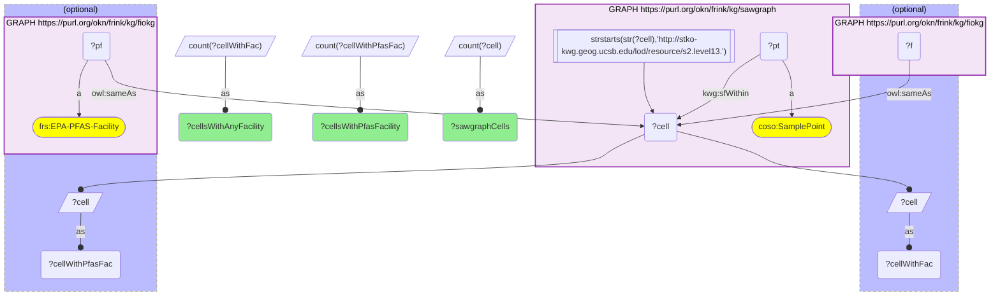

_1 row(s)_

#### Query 2

_2026-07-20T21:48:04+00:00 · `sawgraph`, `fiokg`_

```sparql
PREFIX coso: <http://w3id.org/coso/v1/contaminoso#>
PREFIX kwg: <http://stko-kwg.geog.ucsb.edu/lod/ontology/>
PREFIX owl: <http://www.w3.org/2002/07/owl#>
PREFIX frs: <http://w3id.org/fio/v1/epa-frs#>
SELECT (COUNT(DISTINCT ?cell) AS ?cellsWithPfasFacility) (COUNT(DISTINCT ?pf) AS ?pfasFacilities) WHERE {
  { SELECT DISTINCT ?cell WHERE {
      GRAPH <https://purl.org/okn/frink/kg/sawgraph> {
        ?pt a coso:SamplePoint ; kwg:sfWithin ?cell .
        FILTER(STRSTARTS(STR(?cell),'http://stko-kwg.geog.ucsb.edu/lod/resource/s2.level13.'))
      } } }
  GRAPH <https://purl.org/okn/frink/kg/fiokg> { ?pf a frs:EPA-PFAS-Facility ; owl:sameAs ?cell . }
}
```

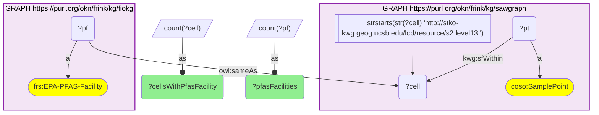

_1 row(s)_

#### Query 3

_2026-07-20T21:48:30+00:00 · `sawgraph`, `fiokg`_

```sparql
PREFIX coso: <http://w3id.org/coso/v1/contaminoso#>
PREFIX kwg: <http://stko-kwg.geog.ucsb.edu/lod/ontology/>
PREFIX frs: <http://w3id.org/fio/v1/epa-frs#>
SELECT (COUNT(DISTINCT ?cell) AS ?cellsWithPfasFacility) (COUNT(DISTINCT ?pf) AS ?pfasFacilities) WHERE {
  { SELECT DISTINCT ?cell WHERE {
      GRAPH <https://purl.org/okn/frink/kg/sawgraph> {
        ?pt a coso:SamplePoint ; kwg:sfWithin ?cell .
        FILTER(STRSTARTS(STR(?cell),'http://stko-kwg.geog.ucsb.edu/lod/resource/s2.level13.'))
      } } }
  GRAPH <https://purl.org/okn/frink/kg/fiokg> { ?pf a frs:EPA-PFAS-Facility ; kwg:sfWithin ?cell . }
}
```

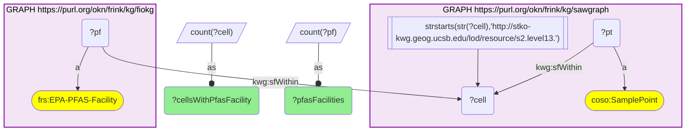

_1 row(s)_

#### Query 4

_2026-07-20T21:48:34+00:00 · `sawgraph`, `fiokg`_

```sparql
PREFIX coso: <http://w3id.org/coso/v1/contaminoso#>
PREFIX kwg: <http://stko-kwg.geog.ucsb.edu/lod/ontology/>
PREFIX fio: <http://w3id.org/fio/v1/fio#>
SELECT (COUNT(DISTINCT ?cell) AS ?cellsWithAnyFacility) (COUNT(DISTINCT ?f) AS ?facilities) WHERE {
  { SELECT DISTINCT ?cell WHERE {
      GRAPH <https://purl.org/okn/frink/kg/sawgraph> {
        ?pt a coso:SamplePoint ; kwg:sfWithin ?cell .
        FILTER(STRSTARTS(STR(?cell),'http://stko-kwg.geog.ucsb.edu/lod/resource/s2.level13.'))
      } } }
  GRAPH <https://purl.org/okn/frink/kg/fiokg> { ?f a <http://w3id.org/fio/v1/epa-frs#FRS-Facility> ; kwg:sfWithin ?cell . }
}
```

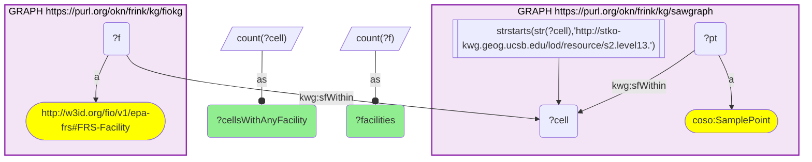

_1 row(s)_

#### Query 5

_2026-07-20T21:49:25+00:00 · `sawgraph`_

```sparql
PREFIX coso: <http://w3id.org/coso/v1/contaminoso#>
PREFIX kwg: <http://stko-kwg.geog.ucsb.edu/lod/ontology/>
SELECT ?cid (COUNT(DISTINCT ?pt) AS ?nPts) (COUNT(DISTINCT ?obs) AS ?nObs) (COUNT(DISTINCT ?sub) AS ?nAnalytes)
WHERE {
  GRAPH <https://purl.org/okn/frink/kg/sawgraph> {
    ?pt a coso:SamplePoint ; kwg:sfWithin ?cell .
    FILTER(STRSTARTS(STR(?cell),'http://stko-kwg.geog.ucsb.edu/lod/resource/s2.level13.'))
    ?obs coso:observedAtSamplePoint ?pt ; coso:ofDatasetSubstance ?sub .
  }
  BIND(STRAFTER(STR(?cell),'s2.level13.') AS ?cid)
}
GROUP BY ?cid
```

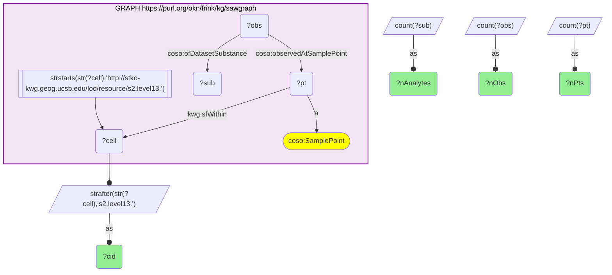

_2537 row(s)_

#### Query 6

_2026-07-20T21:49:42+00:00 · `sawgraph`_

```sparql
PREFIX coso: <http://w3id.org/coso/v1/contaminoso#>
PREFIX kwg: <http://stko-kwg.geog.ucsb.edu/lod/ontology/>
PREFIX qudt: <http://qudt.org/schema/qudt/>
SELECT (COUNT(DISTINCT ?cell) AS ?cellsWithDetect) WHERE {
  GRAPH <https://purl.org/okn/frink/kg/sawgraph> {
    ?pt a coso:SamplePoint ; kwg:sfWithin ?cell .
    FILTER(STRSTARTS(STR(?cell),'http://stko-kwg.geog.ucsb.edu/lod/resource/s2.level13.'))
    ?obs coso:observedAtSamplePoint ?pt ; coso:hasResult ?res .
    ?res qudt:quantityValue ?qv .
    ?qv a coso:DetectQuantityValue .
  }
}
```

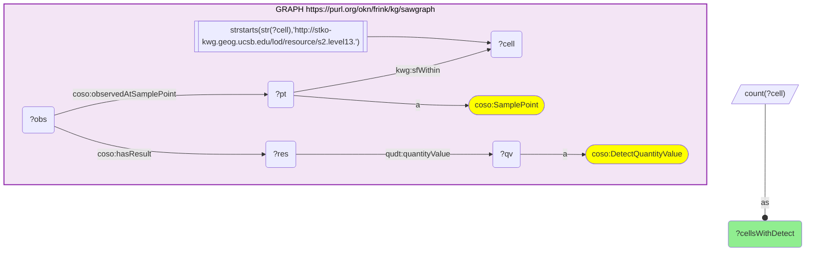

_1 row(s)_

#### Query 7

_2026-07-20T21:49:47+00:00 · `sawgraph`, `fiokg`_

```sparql
PREFIX coso: <http://w3id.org/coso/v1/contaminoso#>
PREFIX kwg: <http://stko-kwg.geog.ucsb.edu/lod/ontology/>
PREFIX qudt: <http://qudt.org/schema/qudt/>
PREFIX frs: <http://w3id.org/fio/v1/epa-frs#>
SELECT (COUNT(DISTINCT ?cell) AS ?cellsDetectAndFacility) WHERE {
  { SELECT DISTINCT ?cell WHERE {
    GRAPH <https://purl.org/okn/frink/kg/sawgraph> {
      ?pt a coso:SamplePoint ; kwg:sfWithin ?cell .
      FILTER(STRSTARTS(STR(?cell),'http://stko-kwg.geog.ucsb.edu/lod/resource/s2.level13.'))
      ?obs coso:observedAtSamplePoint ?pt ; coso:hasResult ?res .
      ?res qudt:quantityValue ?qv .
      ?qv a coso:DetectQuantityValue .
    } } }
  GRAPH <https://purl.org/okn/frink/kg/fiokg> { ?f a frs:FRS-Facility ; kwg:sfWithin ?cell . }
}
```

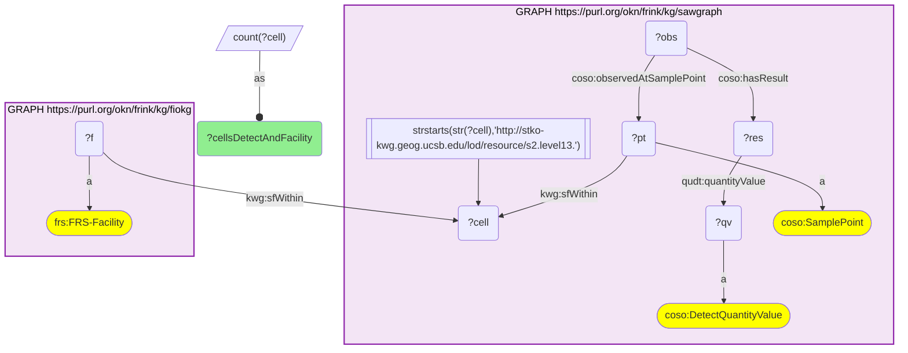

_1 row(s)_

#### Query 8

_2026-07-20T21:51:18+00:00 · `sawgraph`, `fiokg`_

```sparql
PREFIX coso: <http://w3id.org/coso/v1/contaminoso#>
PREFIX kwg: <http://stko-kwg.geog.ucsb.edu/lod/ontology/>
PREFIX frs: <http://w3id.org/fio/v1/epa-frs#>
SELECT ?cid (COUNT(DISTINCT ?f) AS ?nFac) WHERE {
  { SELECT DISTINCT ?cell WHERE {
      GRAPH <https://purl.org/okn/frink/kg/sawgraph> {
        ?pt a coso:SamplePoint ; kwg:sfWithin ?cell .
        FILTER(STRSTARTS(STR(?cell),'http://stko-kwg.geog.ucsb.edu/lod/resource/s2.level13.'))
      } } }
  GRAPH <https://purl.org/okn/frink/kg/fiokg> { ?f a frs:FRS-Facility ; kwg:sfWithin ?cell . }
  BIND(STRAFTER(STR(?cell),'s2.level13.') AS ?cid)
} GROUP BY ?cid ORDER BY ?cid
```


_1297 row(s)_

#### Query 9

_2026-07-20T21:51:54+00:00 · `sawgraph`, `fiokg`_

```sparql
PREFIX coso: <http://w3id.org/coso/v1/contaminoso#>
PREFIX kwg: <http://stko-kwg.geog.ucsb.edu/lod/ontology/>
PREFIX qudt: <http://qudt.org/schema/qudt/>
PREFIX frs: <http://w3id.org/fio/v1/epa-frs#>
SELECT ?cid ?nFac ?nPfasFac WHERE {
  { SELECT ?cell (COUNT(DISTINCT ?f) AS ?nFac) WHERE {
      { SELECT DISTINCT ?cell WHERE {
          GRAPH <https://purl.org/okn/frink/kg/sawgraph> {
            ?pt a coso:SamplePoint ; kwg:sfWithin ?cell .
            FILTER(STRSTARTS(STR(?cell),'http://stko-kwg.geog.ucsb.edu/lod/resource/s2.level13.')) } } }
      GRAPH <https://purl.org/okn/frink/kg/fiokg> { ?f a frs:FRS-Facility ; kwg:sfWithin ?cell . }
    } GROUP BY ?cell }
  OPTIONAL {
    { SELECT ?cell (COUNT(DISTINCT ?pf) AS ?nPfasFac) WHERE {
        { SELECT DISTINCT ?cell WHERE {
            GRAPH <https://purl.org/okn/frink/kg/sawgraph> {
              ?pt a coso:SamplePoint ; kwg:sfWithin ?cell .
              FILTER(STRSTARTS(STR(?cell),'http://stko-kwg.geog.ucsb.edu/lod/resource/s2.level13.')) } } }
        GRAPH <https://purl.org/okn/frink/kg/fiokg> { ?pf a frs:EPA-PFAS-Facility ; kwg:sfWithin ?cell . }
      } GROUP BY ?cell }
  }
  BIND(STRAFTER(STR(?cell),'s2.level13.') AS ?cid)
  FILTER(BOUND(?nPfasFac))
} ORDER BY ?cid
```

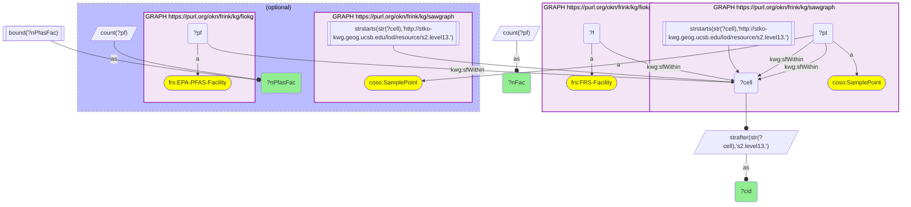

_255 row(s)_

#### Query 10

_2026-07-20T21:52:07+00:00 · `sawgraph`, `fiokg`_

```sparql
PREFIX coso: <http://w3id.org/coso/v1/contaminoso#>
PREFIX kwg: <http://stko-kwg.geog.ucsb.edu/lod/ontology/>
PREFIX qudt: <http://qudt.org/schema/qudt/>
PREFIX frs: <http://w3id.org/fio/v1/epa-frs#>
SELECT ?cid (COUNT(DISTINCT ?pt) AS ?nPts) (COUNT(DISTINCT ?obs) AS ?nObs) (COUNT(DISTINCT ?sub) AS ?nAnalytes) WHERE {
  { SELECT DISTINCT ?cell WHERE {
      { SELECT DISTINCT ?cell WHERE {
          GRAPH <https://purl.org/okn/frink/kg/sawgraph> {
            ?p0 a coso:SamplePoint ; kwg:sfWithin ?cell .
            FILTER(STRSTARTS(STR(?cell),'http://stko-kwg.geog.ucsb.edu/lod/resource/s2.level13.')) } } }
      GRAPH <https://purl.org/okn/frink/kg/fiokg> { ?f a frs:FRS-Facility ; kwg:sfWithin ?cell . }
    } }
  GRAPH <https://purl.org/okn/frink/kg/sawgraph> {
    ?pt a coso:SamplePoint ; kwg:sfWithin ?cell .
    ?obs coso:observedAtSamplePoint ?pt ; coso:ofDatasetSubstance ?sub .
  }
  BIND(STRAFTER(STR(?cell),'s2.level13.') AS ?cid)
} GROUP BY ?cid ORDER BY ?cid
```

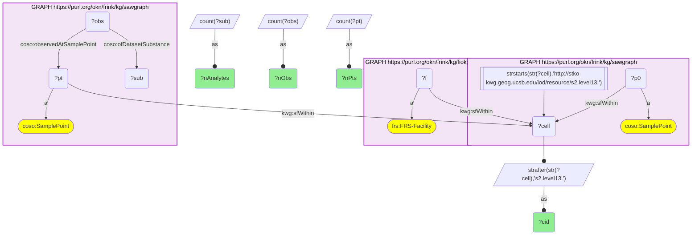

_1080 row(s)_

#### Query 11

_2026-07-20T21:53:11+00:00 · `sawgraph`, `fiokg`_

```sparql
PREFIX coso: <http://w3id.org/coso/v1/contaminoso#>
PREFIX kwg: <http://stko-kwg.geog.ucsb.edu/lod/ontology/>
PREFIX frs: <http://w3id.org/fio/v1/epa-frs#>
SELECT ?cid (COUNT(DISTINCT ?f) AS ?nFac) WHERE {
  { SELECT DISTINCT ?cell WHERE {
      GRAPH <https://purl.org/okn/frink/kg/sawgraph> {
        ?pt a coso:SamplePoint ; kwg:sfWithin ?cell .
        FILTER(STRSTARTS(STR(?cell),'http://stko-kwg.geog.ucsb.edu/lod/resource/s2.level13.'))
      } } }
  GRAPH <https://purl.org/okn/frink/kg/fiokg> { ?f a frs:FRS-Facility ; kwg:sfWithin ?cell . }
  BIND(STRAFTER(STR(?cell),'s2.level13.') AS ?cid)
} GROUP BY ?cid ORDER BY ?cid
```

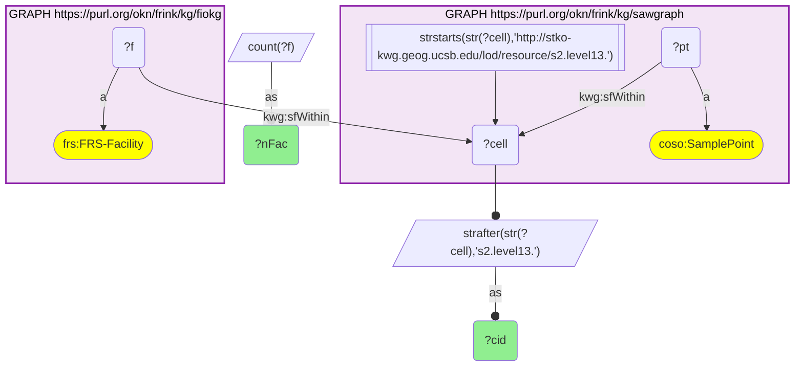

_1297 row(s)_

#### Query 12

_2026-07-20T21:56:43+00:00 · `sawgraph`, `spatialkg`_

```sparql
PREFIX kwg: <http://stko-kwg.geog.ucsb.edu/lod/ontology/>
PREFIX rdfs: <http://www.w3.org/2000/01/rdf-schema#>
# Q1: geography (state / county from spatialkg) for every S2 Level-13 cell
# that contains a SAWGraph sample point.
SELECT ?cid ?stateFips ?stateName ?countyFips ?countyName
WHERE {
  # bounded inner set: S2 L13 cells containing a SAWGraph sample point
  {
    SELECT DISTINCT ?cell WHERE {
      GRAPH <https://purl.org/okn/frink/kg/sawgraph> {
        ?pt kwg:sfWithin ?cell .
        FILTER(STRSTARTS(STR(?cell), "http://stko-kwg.geog.ucsb.edu/lod/resource/s2.level13."))
      }
    }
  }
  # join to spatialkg administrative regions
  GRAPH <https://purl.org/okn/frink/kg/spatialkg> {
    ?cell kwg:spatialRelation ?county .
    FILTER(STRSTARTS(STR(?county), "http://stko-kwg.geog.ucsb.edu/lod/resource/administrativeRegion.USA."))
    ?county a kwg:AdministrativeRegion_2 ;
            rdfs:label ?countyName ;
            kwg:administrativePartOf ?state .
    FILTER(STRSTARTS(STR(?state), "http://stko-kwg.geog.ucsb.edu/lod/resource/administrativeRegion.USA."))
    ?state a kwg:AdministrativeRegion_1 ;
           rdfs:label ?stateName .
  }
  BIND(STRAFTER(STR(?cell), "s2.level13.") AS ?cid)
  BIND(STRAFTER(STR(?state), "administrativeRegion.USA.") AS ?stateFips)
  BIND(STRAFTER(STR(?county), "administrativeRegion.USA.") AS ?countyFips)
}
ORDER BY ?cid
```

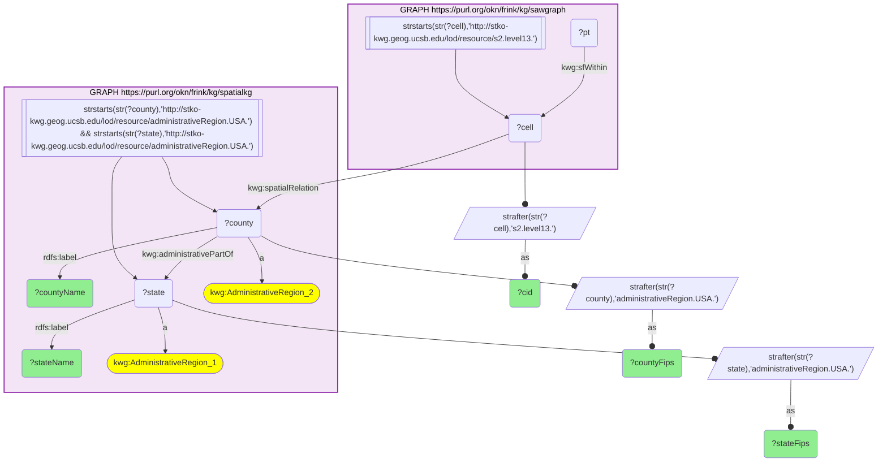

_3511 row(s)_

#### Query 13

_2026-07-20T21:57:51+00:00 · `sawgraph`, `spatialkg`_

```sparql
PREFIX kwg: <http://stko-kwg.geog.ucsb.edu/lod/ontology/>
PREFIX rdfs: <http://www.w3.org/2000/01/rdf-schema#>
# Q1 page 1/7 : cid < "55257"
SELECT ?cid ?stateFips ?stateName ?countyFips ?countyName
WHERE {
  {
    SELECT DISTINCT ?cell WHERE {
      GRAPH <https://purl.org/okn/frink/kg/sawgraph> {
        ?pt kwg:sfWithin ?cell .
        FILTER(STRSTARTS(STR(?cell), "http://stko-kwg.geog.ucsb.edu/lod/resource/s2.level13."))
      }
    }
  }
  BIND(STRAFTER(STR(?cell), "s2.level13.") AS ?cid)
  FILTER(?cid < "55257")
  GRAPH <https://purl.org/okn/frink/kg/spatialkg> {
    ?cell kwg:spatialRelation ?county .
    FILTER(STRSTARTS(STR(?county), "http://stko-kwg.geog.ucsb.edu/lod/resource/administrativeRegion.USA."))
    ?county a kwg:AdministrativeRegion_2 ;
            rdfs:label ?countyName ;
            kwg:administrativePartOf ?state .
    FILTER(STRSTARTS(STR(?state), "http://stko-kwg.geog.ucsb.edu/lod/resource/administrativeRegion.USA."))
    ?state a kwg:AdministrativeRegion_1 ;
           rdfs:label ?stateName .
  }
  BIND(STRAFTER(STR(?state), "administrativeRegion.USA.") AS ?stateFips)
  BIND(STRAFTER(STR(?county), "administrativeRegion.USA.") AS ?countyFips)
}
ORDER BY ?cid
```

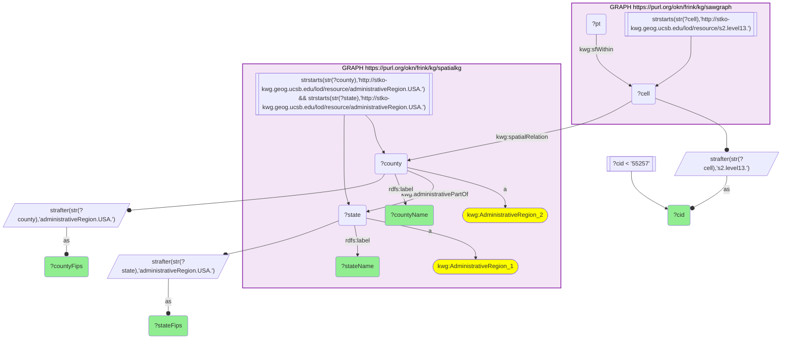

_606 row(s)_

#### Query 14

_2026-07-20T21:58:10+00:00 · `sawgraph`, `fiokg`_

```sparql
PREFIX coso: <http://w3id.org/coso/v1/contaminoso#>
PREFIX kwg: <http://stko-kwg.geog.ucsb.edu/lod/ontology/>
PREFIX frs: <http://w3id.org/fio/v1/epa-frs#>
SELECT ?cid (COUNT(DISTINCT ?f) AS ?nPfasFac) WHERE {
  { SELECT DISTINCT ?cell WHERE {
      GRAPH <https://purl.org/okn/frink/kg/sawgraph> {
        ?pt a coso:SamplePoint ; kwg:sfWithin ?cell .
        FILTER(STRSTARTS(STR(?cell),'http://stko-kwg.geog.ucsb.edu/lod/resource/s2.level13.'))
      } } }
  GRAPH <https://purl.org/okn/frink/kg/fiokg> { ?f a frs:EPA-PFAS-Facility ; kwg:sfWithin ?cell . }
  BIND(STRAFTER(STR(?cell),'s2.level13.') AS ?cid)
} GROUP BY ?cid ORDER BY ?cid
```


_255 row(s)_

#### Query 15

_2026-07-20T21:59:43+00:00 · `sawgraph`_

```sparql
PREFIX coso: <http://w3id.org/coso/v1/contaminoso#>
PREFIX kwg: <http://stko-kwg.geog.ucsb.edu/lod/ontology/>
SELECT ?cid (COUNT(DISTINCT ?pt) AS ?nPts) (COUNT(DISTINCT ?obs) AS ?nObs) (COUNT(DISTINCT ?sub) AS ?nAnalytes) WHERE {
  GRAPH <https://purl.org/okn/frink/kg/sawgraph> {
    ?pt a coso:SamplePoint ; kwg:sfWithin ?cell .
    FILTER(STRSTARTS(STR(?cell),'http://stko-kwg.geog.ucsb.edu/lod/resource/s2.level13.'))
    ?obs coso:observedAtSamplePoint ?pt ; coso:ofDatasetSubstance ?sub .
  }
  BIND(STRAFTER(STR(?cell),'s2.level13.') AS ?cid)
  FILTER(STRSTARTS(STRAFTER(STR(?cell),'s2.level13.'),'55'))
} GROUP BY ?cid ORDER BY ?cid
```


_1220 row(s)_

#### Query 16

_2026-07-20T22:05:48+00:00 · `sawgraph`_

```sparql
PREFIX coso: <http://w3id.org/coso/v1/contaminoso#>
PREFIX kwg: <http://stko-kwg.geog.ucsb.edu/lod/ontology/>
SELECT ?cid (COUNT(DISTINCT ?pt) AS ?nPts) (COUNT(DISTINCT ?obs) AS ?nObs) (COUNT(DISTINCT ?sub) AS ?nAnalytes) WHERE {
  GRAPH <https://purl.org/okn/frink/kg/sawgraph> {
    ?pt a coso:SamplePoint ; kwg:sfWithin ?cell .
    FILTER(STRSTARTS(STR(?cell),'http://stko-kwg.geog.ucsb.edu/lod/resource/s2.level13.'))
    ?obs coso:observedAtSamplePoint ?pt ; coso:ofDatasetSubstance ?sub .
  }
  BIND(STRAFTER(STR(?cell),'s2.level13.') AS ?cid)
  FILTER(STRSTARTS(STRAFTER(STR(?cell),'s2.level13.'),'59'))
} GROUP BY ?cid ORDER BY ?cid
```

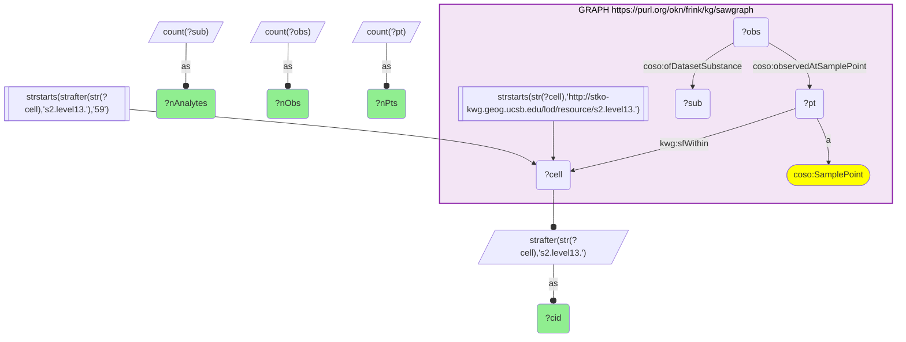

_437 row(s)_

#### Query 17

_2026-07-20T22:05:58+00:00 · `sawgraph`_

```sparql
PREFIX coso: <http://w3id.org/coso/v1/contaminoso#>
PREFIX kwg: <http://stko-kwg.geog.ucsb.edu/lod/ontology/>
SELECT ?cid (COUNT(DISTINCT ?pt) AS ?nPts) (COUNT(DISTINCT ?obs) AS ?nObs) (COUNT(DISTINCT ?sub) AS ?nAnalytes) WHERE {
  GRAPH <https://purl.org/okn/frink/kg/sawgraph> {
    ?pt a coso:SamplePoint ; kwg:sfWithin ?cell .
    FILTER(STRSTARTS(STR(?cell),'http://stko-kwg.geog.ucsb.edu/lod/resource/s2.level13.'))
    ?obs coso:observedAtSamplePoint ?pt ; coso:ofDatasetSubstance ?sub .
  }
  BIND(STRAFTER(STR(?cell),'s2.level13.') AS ?cid)
  FILTER(STRSTARTS(STRAFTER(STR(?cell),'s2.level13.'),'92'))
} GROUP BY ?cid ORDER BY ?cid
```


_36 row(s)_

#### Query 18

_2026-07-20T22:06:07+00:00 · `sawgraph`_

```sparql
PREFIX coso: <http://w3id.org/coso/v1/contaminoso#>
PREFIX kwg: <http://stko-kwg.geog.ucsb.edu/lod/ontology/>
SELECT ?cid (COUNT(DISTINCT ?pt) AS ?nPts) (COUNT(DISTINCT ?obs) AS ?nObs) (COUNT(DISTINCT ?sub) AS ?nAnalytes) WHERE {
  GRAPH <https://purl.org/okn/frink/kg/sawgraph> {
    ?pt a coso:SamplePoint ; kwg:sfWithin ?cell .
    FILTER(STRSTARTS(STR(?cell),'http://stko-kwg.geog.ucsb.edu/lod/resource/s2.level13.'))
    ?obs coso:observedAtSamplePoint ?pt ; coso:ofDatasetSubstance ?sub .
  }
  BIND(STRAFTER(STR(?cell),'s2.level13.') AS ?cid)
  FILTER(STRSTARTS(STRAFTER(STR(?cell),'s2.level13.'),'97'))
} GROUP BY ?cid ORDER BY ?cid
```


_416 row(s)_

#### Query 19

_2026-07-20T22:06:12+00:00 · `sawgraph`_

```sparql
PREFIX coso: <http://w3id.org/coso/v1/contaminoso#>
PREFIX kwg: <http://stko-kwg.geog.ucsb.edu/lod/ontology/>
SELECT ?cid (COUNT(DISTINCT ?pt) AS ?nPts) (COUNT(DISTINCT ?obs) AS ?nObs) (COUNT(DISTINCT ?sub) AS ?nAnalytes) WHERE {
  GRAPH <https://purl.org/okn/frink/kg/sawgraph> {
    ?pt a coso:SamplePoint ; kwg:sfWithin ?cell .
    FILTER(STRSTARTS(STR(?cell),'http://stko-kwg.geog.ucsb.edu/lod/resource/s2.level13.'))
    ?obs coso:observedAtSamplePoint ?pt ; coso:ofDatasetSubstance ?sub .
  }
  BIND(STRAFTER(STR(?cell),'s2.level13.') AS ?cid)
  FILTER(STRSTARTS(STRAFTER(STR(?cell),'s2.level13.'),'98'))
} GROUP BY ?cid ORDER BY ?cid
```


_362 row(s)_

#### Query 20

_2026-07-20T22:06:22+00:00 · `sawgraph`_

```sparql
PREFIX coso: <http://w3id.org/coso/v1/contaminoso#>
PREFIX kwg: <http://stko-kwg.geog.ucsb.edu/lod/ontology/>
SELECT ?cid (COUNT(DISTINCT ?pt) AS ?nPts) (COUNT(DISTINCT ?obs) AS ?nObs) (COUNT(DISTINCT ?sub) AS ?nAnalytes) WHERE {
  GRAPH <https://purl.org/okn/frink/kg/sawgraph> {
    ?pt a coso:SamplePoint ; kwg:sfWithin ?cell .
    FILTER(STRSTARTS(STR(?cell),'http://stko-kwg.geog.ucsb.edu/lod/resource/s2.level13.'))
    ?obs coso:observedAtSamplePoint ?pt ; coso:ofDatasetSubstance ?sub .
  }
  BIND(STRAFTER(STR(?cell),'s2.level13.') AS ?cid)
  FILTER(!STRSTARTS(STRAFTER(STR(?cell),'s2.level13.'),'55') && !STRSTARTS(STRAFTER(STR(?cell),'s2.level13.'),'59') && !STRSTARTS(STRAFTER(STR(?cell),'s2.level13.'),'92') && !STRSTARTS(STRAFTER(STR(?cell),'s2.level13.'),'97') && !STRSTARTS(STRAFTER(STR(?cell),'s2.level13.'),'98'))
} GROUP BY ?cid ORDER BY ?cid
```

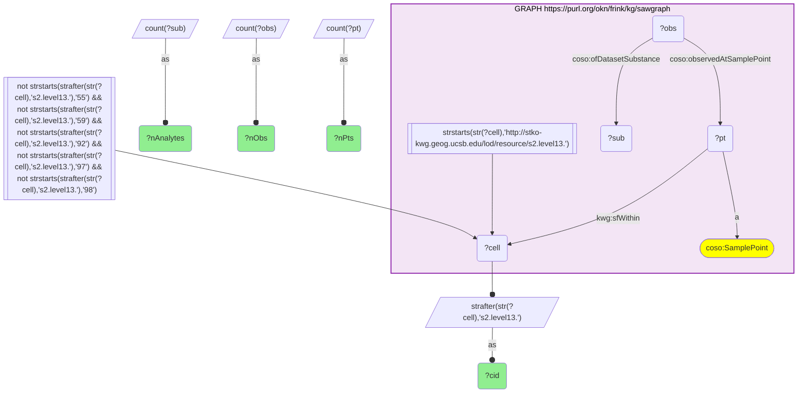

_66 row(s)_

#### Query 21

_2026-07-20T22:06:27+00:00 · `sawgraph`_

```sparql
PREFIX coso: <http://w3id.org/coso/v1/contaminoso#>
PREFIX kwg: <http://stko-kwg.geog.ucsb.edu/lod/ontology/>
PREFIX qudt: <http://qudt.org/schema/qudt/>
SELECT ?cid (COUNT(DISTINCT ?obs) AS ?nDet) (COUNT(DISTINCT ?sub) AS ?nDetAnalytes) (MAX(?v) AS ?maxNgL) WHERE {
  GRAPH <https://purl.org/okn/frink/kg/sawgraph> {
    ?pt a coso:SamplePoint ; kwg:sfWithin ?cell .
    FILTER(STRSTARTS(STR(?cell),'http://stko-kwg.geog.ucsb.edu/lod/resource/s2.level13.'))
    ?obs coso:observedAtSamplePoint ?pt ; coso:ofDatasetSubstance ?sub ; coso:hasResult ?res .
    ?res qudt:quantityValue ?qv ; coso:measurementUnit <http://qudt.org/vocab/unit/NanoGM-PER-L> ; coso:measurementValue ?v .
    ?qv a coso:DetectQuantityValue .
  }
  BIND(STRAFTER(STR(?cell),'s2.level13.') AS ?cid)
} GROUP BY ?cid ORDER BY ?cid
```

```mermaid
graph TD
classDef projected fill:lightgreen;
classDef literal fill:orange;
classDef iri fill:yellow;
  q21v9("?cell")
  q21v4("?cid"):::projected 
  q21v1("?maxNgL"):::projected 
  q21v3("?nDet"):::projected 
  q21v2("?nDetAnalytes"):::projected 
  q21v13("?obs")
  q21v12("?pt")
  q21v11("?qv")
  q21v10("?res")
  q21v15("?sub")
  q21v14("?v")
  subgraph q21graph0["GRAPH https://purl.org/okn/frink/kg/sawgraph"]
    style q21graph0 fill:#f3e5f5,stroke:#8e24aa,stroke-width:2px,color:#000;
    q21graph0c2(["http://qudt.org/vocab/unit/NanoGM-PER-L"]):::iri 
    q21graph0c6(["coso:DetectQuantityValue"]):::iri 
    q21graph0c5(["coso:SamplePoint"]):::iri 
    q21graph0f0[["strstarts(str(?cell),'http://stko-kwg.geog.ucsb.edu/lod/resource/s2.level13.')"]]
    q21graph0f0 --> q21v9
    q21v10 --"coso:measurementUnit"--> q21graph0c2
    q21v10 --"qudt:quantityValue"--> q21v11
    q21v12 --"a"--> q21graph0c5
    q21v11 --"a"--> q21graph0c6
    q21v13 --"coso:hasResult"--> q21v10
    q21v13 --"coso:observedAtSamplePoint"--> q21v12
    q21v10 --"coso:measurementValue"--> q21v14
    q21v12 --"kwg:sfWithin"--> q21v9
    q21v13 --"coso:ofDatasetSubstance"--> q21v15
  end
  q21bind0[/"strafter(str(?cell),'s2.level13.')"/]
  q21v9 --o q21bind0
  q21bind0 --as--o q21v4
  q21bind1[/"count(?obs)"/]
  q21bind1 --as--o q21v3
  q21bind2[/"count(?sub)"/]
  q21bind2 --as--o q21v2
  q21bind3[/"max(?v)"/]
  q21bind3 --as--o q21v1
```

_1375 row(s)_

#### Query 22

_2026-07-20T22:06:39+00:00 · `sawgraph`_

```sparql
PREFIX coso: <http://w3id.org/coso/v1/contaminoso#>
PREFIX kwg: <http://stko-kwg.geog.ucsb.edu/lod/ontology/>
PREFIX qudt: <http://qudt.org/schema/qudt/>
SELECT ?cid (COUNT(DISTINCT ?obs) AS ?nDet) (COUNT(DISTINCT ?sub) AS ?nDetAnalytes) WHERE {
  GRAPH <https://purl.org/okn/frink/kg/sawgraph> {
    ?pt a coso:SamplePoint ; kwg:sfWithin ?cell .
    FILTER(STRSTARTS(STR(?cell),'http://stko-kwg.geog.ucsb.edu/lod/resource/s2.level13.'))
    ?obs coso:observedAtSamplePoint ?pt ; coso:ofDatasetSubstance ?sub ; coso:hasResult ?res .
    ?res qudt:quantityValue ?qv .
    ?qv a coso:DetectQuantityValue .
  }
  BIND(STRAFTER(STR(?cell),'s2.level13.') AS ?cid)
} GROUP BY ?cid ORDER BY ?cid
```

```mermaid
graph TD
classDef projected fill:lightgreen;
classDef literal fill:orange;
classDef iri fill:yellow;
  q22v7("?cell")
  q22v3("?cid"):::projected 
  q22v2("?nDet"):::projected 
  q22v1("?nDetAnalytes"):::projected 
  q22v10("?obs")
  q22v8("?pt")
  q22v9("?qv")
  q22v11("?res")
  q22v12("?sub")
  subgraph q22graph0["GRAPH https://purl.org/okn/frink/kg/sawgraph"]
    style q22graph0 fill:#f3e5f5,stroke:#8e24aa,stroke-width:2px,color:#000;
    q22graph0c3(["coso:DetectQuantityValue"]):::iri 
    q22graph0c2(["coso:SamplePoint"]):::iri 
    q22graph0f0[["strstarts(str(?cell),'http://stko-kwg.geog.ucsb.edu/lod/resource/s2.level13.')"]]
    q22graph0f0 --> q22v7
    q22v8 --"a"--> q22graph0c2
    q22v9 --"a"--> q22graph0c3
    q22v10 --"coso:observedAtSamplePoint"--> q22v8
    q22v10 --"coso:hasResult"--> q22v11
    q22v8 --"kwg:sfWithin"--> q22v7
    q22v11 --"qudt:quantityValue"--> q22v9
    q22v10 --"coso:ofDatasetSubstance"--> q22v12
  end
  q22bind0[/"strafter(str(?cell),'s2.level13.')"/]
  q22v7 --o q22bind0
  q22bind0 --as--o q22v3
  q22bind1[/"count(?obs)"/]
  q22bind1 --as--o q22v2
  q22bind2[/"count(?sub)"/]
  q22bind2 --as--o q22v1
```

_2102 row(s)_

#### Query 23

_2026-07-20T22:06:42+00:00 · `sawgraph`, `spatialkg`_

```sparql
PREFIX kwg: <http://stko-kwg.geog.ucsb.edu/lod/ontology/>
PREFIX rdfs: <http://www.w3.org/2000/01/rdf-schema#>
# Q1: geography (state / county from spatialkg) for every S2 Level-13 cell
# that contains a SAWGraph sample point.
SELECT ?cid ?stateFips ?stateName ?countyFips ?countyName
WHERE {
  # bounded inner set: S2 L13 cells containing a SAWGraph sample point
  {
    SELECT DISTINCT ?cell WHERE {
      GRAPH <https://purl.org/okn/frink/kg/sawgraph> {
        ?pt kwg:sfWithin ?cell .
        FILTER(STRSTARTS(STR(?cell), "http://stko-kwg.geog.ucsb.edu/lod/resource/s2.level13."))
      }
    }
  }
  BIND(STRAFTER(STR(?cell), "s2.level13.") AS ?cid)
  FILTER(?cid >= "55257" && ?cid < "55266")
  GRAPH <https://purl.org/okn/frink/kg/spatialkg> {
    ?cell kwg:spatialRelation ?county .
    FILTER(STRSTARTS(STR(?county), "http://stko-kwg.geog.ucsb.edu/lod/resource/administrativeRegion.USA."))
    ?county a kwg:AdministrativeRegion_2 ;
            rdfs:label ?countyName ;
            kwg:administrativePartOf ?state .
    FILTER(STRSTARTS(STR(?state), "http://stko-kwg.geog.ucsb.edu/lod/resource/administrativeRegion.USA."))
    ?state a kwg:AdministrativeRegion_1 ;
           rdfs:label ?stateName .
  }
  BIND(STRAFTER(STR(?state), "administrativeRegion.USA.") AS ?stateFips)
  BIND(STRAFTER(STR(?county), "administrativeRegion.USA.") AS ?countyFips)
}
ORDER BY ?cid
```

```mermaid
graph TD
classDef projected fill:lightgreen;
classDef literal fill:orange;
classDef iri fill:yellow;
  q23v6("?cell")
  q23v1("?cid"):::projected 
  q23v3("?county")
  q23v2("?countyFips"):::projected 
  q23v8("?countyName"):::projected 
  q23v7("?pt")
  q23v5("?state")
  q23v4("?stateFips"):::projected 
  q23v9("?stateName"):::projected 
  q23f0[["?cid >= '55257' && ?cid < '55266'"]]
  q23f0 --> q23v1
  subgraph q23graph0["GRAPH https://purl.org/okn/frink/kg/sawgraph"]
    style q23graph0 fill:#f3e5f5,stroke:#8e24aa,stroke-width:2px,color:#000;
    q23graph0f1[["strstarts(str(?cell),'http://stko-kwg.geog.ucsb.edu/lod/resource/s2.level13.')"]]
    q23graph0f1 --> q23v6
    q23v7 --"kwg:sfWithin"--> q23v6
  end
  q23bind0[/"strafter(str(?cell),'s2.level13.')"/]
  q23v6 --o q23bind0
  q23bind0 --as--o q23v1
  subgraph q23graph1["GRAPH https://purl.org/okn/frink/kg/spatialkg"]
    style q23graph1 fill:#f3e5f5,stroke:#8e24aa,stroke-width:2px,color:#000;
    q23graph1c4(["kwg:AdministrativeRegion_1"]):::iri 
    q23graph1c2(["kwg:AdministrativeRegion_2"]):::iri 
    q23graph1f2[["strstarts(str(?county),'http://stko-kwg.geog.ucsb.edu/lod/resource/administrativeRegion.USA.') && strstarts(str(?state),'http://stko-kwg.geog.ucsb.edu/lod/resource/administrativeRegion.USA.')"]]
    q23graph1f2 --> q23v3
    q23graph1f2 --> q23v5
    q23v3 --"a"--> q23graph1c2
    q23v3 --"kwg:administrativePartOf"--> q23v5
    q23v5 --"a"--> q23graph1c4
    q23v6 --"kwg:spatialRelation"--> q23v3
    q23v3 --"rdfs:label"--> q23v8
    q23v5 --"rdfs:label"--> q23v9
  end
  q23bind1[/"strafter(str(?state),'administrativeRegion.USA.')"/]
  q23v5 --o q23bind1
  q23bind1 --as--o q23v4
  q23bind2[/"strafter(str(?county),'administrativeRegion.USA.')"/]
  q23v3 --o q23bind2
  q23bind2 --as--o q23v2
```

_596 row(s)_

#### Query 24

_2026-07-20T22:06:51+00:00 · `sawgraph`, `spatialkg`_

```sparql
PREFIX kwg: <http://stko-kwg.geog.ucsb.edu/lod/ontology/>
PREFIX rdfs: <http://www.w3.org/2000/01/rdf-schema#>
# Q1: geography (state / county from spatialkg) for every S2 Level-13 cell
# that contains a SAWGraph sample point.
SELECT ?cid ?stateFips ?stateName ?countyFips ?countyName
WHERE {
  # bounded inner set: S2 L13 cells containing a SAWGraph sample point
  {
    SELECT DISTINCT ?cell WHERE {
      GRAPH <https://purl.org/okn/frink/kg/sawgraph> {
        ?pt kwg:sfWithin ?cell .
        FILTER(STRSTARTS(STR(?cell), "http://stko-kwg.geog.ucsb.edu/lod/resource/s2.level13."))
      }
    }
  }
  BIND(STRAFTER(STR(?cell), "s2.level13.") AS ?cid)
  FILTER(?cid >= "97" && ?cid < "980")
  GRAPH <https://purl.org/okn/frink/kg/spatialkg> {
    ?cell kwg:spatialRelation ?county .
    FILTER(STRSTARTS(STR(?county), "http://stko-kwg.geog.ucsb.edu/lod/resource/administrativeRegion.USA."))
    ?county a kwg:AdministrativeRegion_2 ;
            rdfs:label ?countyName ;
            kwg:administrativePartOf ?state .
    FILTER(STRSTARTS(STR(?state), "http://stko-kwg.geog.ucsb.edu/lod/resource/administrativeRegion.USA."))
    ?state a kwg:AdministrativeRegion_1 ;
           rdfs:label ?stateName .
  }
  BIND(STRAFTER(STR(?state), "administrativeRegion.USA.") AS ?stateFips)
  BIND(STRAFTER(STR(?county), "administrativeRegion.USA.") AS ?countyFips)
}
ORDER BY ?cid
```

```mermaid
graph TD
classDef projected fill:lightgreen;
classDef literal fill:orange;
classDef iri fill:yellow;
  q24v6("?cell")
  q24v1("?cid"):::projected 
  q24v3("?county")
  q24v2("?countyFips"):::projected 
  q24v8("?countyName"):::projected 
  q24v7("?pt")
  q24v5("?state")
  q24v4("?stateFips"):::projected 
  q24v9("?stateName"):::projected 
  q24f0[["?cid >= '97' && ?cid < '980'"]]
  q24f0 --> q24v1
  subgraph q24graph0["GRAPH https://purl.org/okn/frink/kg/sawgraph"]
    style q24graph0 fill:#f3e5f5,stroke:#8e24aa,stroke-width:2px,color:#000;
    q24graph0f1[["strstarts(str(?cell),'http://stko-kwg.geog.ucsb.edu/lod/resource/s2.level13.')"]]
    q24graph0f1 --> q24v6
    q24v7 --"kwg:sfWithin"--> q24v6
  end
  q24bind0[/"strafter(str(?cell),'s2.level13.')"/]
  q24v6 --o q24bind0
  q24bind0 --as--o q24v1
  subgraph q24graph1["GRAPH https://purl.org/okn/frink/kg/spatialkg"]
    style q24graph1 fill:#f3e5f5,stroke:#8e24aa,stroke-width:2px,color:#000;
    q24graph1c4(["kwg:AdministrativeRegion_1"]):::iri 
    q24graph1c2(["kwg:AdministrativeRegion_2"]):::iri 
    q24graph1f2[["strstarts(str(?county),'http://stko-kwg.geog.ucsb.edu/lod/resource/administrativeRegion.USA.') && strstarts(str(?state),'http://stko-kwg.geog.ucsb.edu/lod/resource/administrativeRegion.USA.')"]]
    q24graph1f2 --> q24v3
    q24graph1f2 --> q24v5
    q24v3 --"a"--> q24graph1c2
    q24v3 --"kwg:administrativePartOf"--> q24v5
    q24v5 --"a"--> q24graph1c4
    q24v6 --"kwg:spatialRelation"--> q24v3
    q24v3 --"rdfs:label"--> q24v8
    q24v5 --"rdfs:label"--> q24v9
  end
  q24bind1[/"strafter(str(?state),'administrativeRegion.USA.')"/]
  q24v5 --o q24bind1
  q24bind1 --as--o q24v4
  q24bind2[/"strafter(str(?county),'administrativeRegion.USA.')"/]
  q24v3 --o q24bind2
  q24bind2 --as--o q24v2
```

_546 row(s)_

#### Query 25

_2026-07-20T22:07:06+00:00 · `sawgraph`_

```sparql
PREFIX coso: <http://w3id.org/coso/v1/contaminoso#>
PREFIX kwg: <http://stko-kwg.geog.ucsb.edu/lod/ontology/>
PREFIX qudt: <http://qudt.org/schema/qudt/>
SELECT ?cid (COUNT(DISTINCT ?obs) AS ?nDet) (COUNT(DISTINCT ?sub) AS ?nDetAnalytes) WHERE {
  GRAPH <https://purl.org/okn/frink/kg/sawgraph> {
    ?pt a coso:SamplePoint ; kwg:sfWithin ?cell .
    FILTER(STRSTARTS(STR(?cell),'http://stko-kwg.geog.ucsb.edu/lod/resource/s2.level13.'))
    ?obs coso:observedAtSamplePoint ?pt ; coso:ofDatasetSubstance ?sub ; coso:hasResult ?res .
    ?res qudt:quantityValue ?qv .
    ?qv a coso:DetectQuantityValue .
  }
  BIND(STRAFTER(STR(?cell),'s2.level13.') AS ?cid)
  FILTER(STRSTARTS(STRAFTER(STR(?cell),'s2.level13.'),'55'))
} GROUP BY ?cid ORDER BY ?cid
```

```mermaid
graph TD
classDef projected fill:lightgreen;
classDef literal fill:orange;
classDef iri fill:yellow;
  q25v7("?cell")
  q25v3("?cid"):::projected 
  q25v2("?nDet"):::projected 
  q25v1("?nDetAnalytes"):::projected 
  q25v10("?obs")
  q25v8("?pt")
  q25v9("?qv")
  q25v11("?res")
  q25v12("?sub")
  q25f0[["strstarts(strafter(str(?cell),'s2.level13.'),'55')"]]
  q25f0 --> q25v7
  subgraph q25graph0["GRAPH https://purl.org/okn/frink/kg/sawgraph"]
    style q25graph0 fill:#f3e5f5,stroke:#8e24aa,stroke-width:2px,color:#000;
    q25graph0c3(["coso:DetectQuantityValue"]):::iri 
    q25graph0c2(["coso:SamplePoint"]):::iri 
    q25graph0f1[["strstarts(str(?cell),'http://stko-kwg.geog.ucsb.edu/lod/resource/s2.level13.')"]]
    q25graph0f1 --> q25v7
    q25v8 --"a"--> q25graph0c2
    q25v9 --"a"--> q25graph0c3
    q25v10 --"coso:observedAtSamplePoint"--> q25v8
    q25v10 --"coso:hasResult"--> q25v11
    q25v8 --"kwg:sfWithin"--> q25v7
    q25v11 --"qudt:quantityValue"--> q25v9
    q25v10 --"coso:ofDatasetSubstance"--> q25v12
  end
  q25bind0[/"strafter(str(?cell),'s2.level13.')"/]
  q25v7 --o q25bind0
  q25bind0 --as--o q25v3
  q25bind1[/"count(?obs)"/]
  q25bind1 --as--o q25v2
  q25bind2[/"count(?sub)"/]
  q25bind2 --as--o q25v1
```

_1041 row(s)_

#### Query 26

_2026-07-20T22:10:07+00:00 · `sawgraph`, `spatialkg`_

```sparql
PREFIX kwg: <http://stko-kwg.geog.ucsb.edu/lod/ontology/>
PREFIX rdfs: <http://www.w3.org/2000/01/rdf-schema#>
# Q1: geography (state / county from spatialkg) for every S2 Level-13 cell
# that contains a SAWGraph sample point.
SELECT ?cid ?stateFips ?stateName ?countyFips ?countyName
WHERE {
  # bounded inner set: S2 L13 cells containing a SAWGraph sample point
  {
    SELECT DISTINCT ?cell WHERE {
      GRAPH <https://purl.org/okn/frink/kg/sawgraph> {
        ?pt kwg:sfWithin ?cell .
        FILTER(STRSTARTS(STR(?cell), "http://stko-kwg.geog.ucsb.edu/lod/resource/s2.level13."))
      }
    }
  }
  BIND(STRAFTER(STR(?cell), "s2.level13.") AS ?cid)
  FILTER(?cid >= "55266" && ?cid < "59")
  GRAPH <https://purl.org/okn/frink/kg/spatialkg> {
    ?cell kwg:spatialRelation ?county .
    FILTER(STRSTARTS(STR(?county), "http://stko-kwg.geog.ucsb.edu/lod/resource/administrativeRegion.USA."))
    ?county a kwg:AdministrativeRegion_2 ;
            rdfs:label ?countyName ;
            kwg:administrativePartOf ?state .
    FILTER(STRSTARTS(STR(?state), "http://stko-kwg.geog.ucsb.edu/lod/resource/administrativeRegion.USA."))
    ?state a kwg:AdministrativeRegion_1 ;
           rdfs:label ?stateName .
  }
  BIND(STRAFTER(STR(?state), "administrativeRegion.USA.") AS ?stateFips)
  BIND(STRAFTER(STR(?county), "administrativeRegion.USA.") AS ?countyFips)
}
ORDER BY ?cid
```

```mermaid
graph TD
classDef projected fill:lightgreen;
classDef literal fill:orange;
classDef iri fill:yellow;
  q26v6("?cell")
  q26v1("?cid"):::projected 
  q26v3("?county")
  q26v2("?countyFips"):::projected 
  q26v8("?countyName"):::projected 
  q26v7("?pt")
  q26v5("?state")
  q26v4("?stateFips"):::projected 
  q26v9("?stateName"):::projected 
  q26f0[["?cid >= '55266' && ?cid < '59'"]]
  q26f0 --> q26v1
  subgraph q26graph0["GRAPH https://purl.org/okn/frink/kg/sawgraph"]
    style q26graph0 fill:#f3e5f5,stroke:#8e24aa,stroke-width:2px,color:#000;
    q26graph0f1[["strstarts(str(?cell),'http://stko-kwg.geog.ucsb.edu/lod/resource/s2.level13.')"]]
    q26graph0f1 --> q26v6
    q26v7 --"kwg:sfWithin"--> q26v6
  end
  q26bind0[/"strafter(str(?cell),'s2.level13.')"/]
  q26v6 --o q26bind0
  q26bind0 --as--o q26v1
  subgraph q26graph1["GRAPH https://purl.org/okn/frink/kg/spatialkg"]
    style q26graph1 fill:#f3e5f5,stroke:#8e24aa,stroke-width:2px,color:#000;
    q26graph1c4(["kwg:AdministrativeRegion_1"]):::iri 
    q26graph1c2(["kwg:AdministrativeRegion_2"]):::iri 
    q26graph1f2[["strstarts(str(?county),'http://stko-kwg.geog.ucsb.edu/lod/resource/administrativeRegion.USA.') && strstarts(str(?state),'http://stko-kwg.geog.ucsb.edu/lod/resource/administrativeRegion.USA.')"]]
    q26graph1f2 --> q26v3
    q26graph1f2 --> q26v5
    q26v3 --"a"--> q26graph1c2
    q26v3 --"kwg:administrativePartOf"--> q26v5
    q26v5 --"a"--> q26graph1c4
    q26v6 --"kwg:spatialRelation"--> q26v3
    q26v3 --"rdfs:label"--> q26v8
    q26v5 --"rdfs:label"--> q26v9
  end
  q26bind1[/"strafter(str(?state),'administrativeRegion.USA.')"/]
  q26v5 --o q26bind1
  q26bind1 --as--o q26v4
  q26bind2[/"strafter(str(?county),'administrativeRegion.USA.')"/]
  q26v3 --o q26bind2
  q26bind2 --as--o q26v2
```

_417 row(s)_

#### Query 27

_2026-07-20T22:11:34+00:00 · `sawgraph`_

```sparql
PREFIX coso: <http://w3id.org/coso/v1/contaminoso#>
PREFIX kwg: <http://stko-kwg.geog.ucsb.edu/lod/ontology/>
PREFIX qudt: <http://qudt.org/schema/qudt/>
SELECT ?cid (COUNT(DISTINCT ?obs) AS ?nDet) (COUNT(DISTINCT ?sub) AS ?nDetAnalytes) WHERE {
  GRAPH <https://purl.org/okn/frink/kg/sawgraph> {
    ?pt a coso:SamplePoint ; kwg:sfWithin ?cell .
    FILTER(STRSTARTS(STR(?cell),'http://stko-kwg.geog.ucsb.edu/lod/resource/s2.level13.'))
    ?obs coso:observedAtSamplePoint ?pt ; coso:ofDatasetSubstance ?sub ; coso:hasResult ?res .
    ?res qudt:quantityValue ?qv .
    ?qv a coso:DetectQuantityValue .
  }
  BIND(STRAFTER(STR(?cell),'s2.level13.') AS ?cid)
  FILTER(STRSTARTS(STRAFTER(STR(?cell),'s2.level13.'),'59'))
} GROUP BY ?cid ORDER BY ?cid
```

```mermaid
graph TD
classDef projected fill:lightgreen;
classDef literal fill:orange;
classDef iri fill:yellow;
  q27v7("?cell")
  q27v3("?cid"):::projected 
  q27v2("?nDet"):::projected 
  q27v1("?nDetAnalytes"):::projected 
  q27v10("?obs")
  q27v8("?pt")
  q27v9("?qv")
  q27v11("?res")
  q27v12("?sub")
  q27f0[["strstarts(strafter(str(?cell),'s2.level13.'),'59')"]]
  q27f0 --> q27v7
  subgraph q27graph0["GRAPH https://purl.org/okn/frink/kg/sawgraph"]
    style q27graph0 fill:#f3e5f5,stroke:#8e24aa,stroke-width:2px,color:#000;
    q27graph0c3(["coso:DetectQuantityValue"]):::iri 
    q27graph0c2(["coso:SamplePoint"]):::iri 
    q27graph0f1[["strstarts(str(?cell),'http://stko-kwg.geog.ucsb.edu/lod/resource/s2.level13.')"]]
    q27graph0f1 --> q27v7
    q27v8 --"a"--> q27graph0c2
    q27v9 --"a"--> q27graph0c3
    q27v10 --"coso:observedAtSamplePoint"--> q27v8
    q27v10 --"coso:hasResult"--> q27v11
    q27v8 --"kwg:sfWithin"--> q27v7
    q27v11 --"qudt:quantityValue"--> q27v9
    q27v10 --"coso:ofDatasetSubstance"--> q27v12
  end
  q27bind0[/"strafter(str(?cell),'s2.level13.')"/]
  q27v7 --o q27bind0
  q27bind0 --as--o q27v3
  q27bind1[/"count(?obs)"/]
  q27bind1 --as--o q27v2
  q27bind2[/"count(?sub)"/]
  q27bind2 --as--o q27v1
```

_344 row(s)_

#### Query 28

_2026-07-20T22:11:56+00:00 · `sawgraph`, `spatialkg`_

```sparql
PREFIX kwg: <http://stko-kwg.geog.ucsb.edu/lod/ontology/>
PREFIX rdfs: <http://www.w3.org/2000/01/rdf-schema#>
# Q1: geography (state / county from spatialkg) for every S2 Level-13 cell
# that contains a SAWGraph sample point.
SELECT ?cid ?stateFips ?stateName ?countyFips ?countyName
WHERE {
  # bounded inner set: S2 L13 cells containing a SAWGraph sample point
  {
    SELECT DISTINCT ?cell WHERE {
      GRAPH <https://purl.org/okn/frink/kg/sawgraph> {
        ?pt kwg:sfWithin ?cell .
        FILTER(STRSTARTS(STR(?cell), "http://stko-kwg.geog.ucsb.edu/lod/resource/s2.level13."))
      }
    }
  }
  BIND(STRAFTER(STR(?cell), "s2.level13.") AS ?cid)
  FILTER(?cid >= "980" && ?cid < "984")
  GRAPH <https://purl.org/okn/frink/kg/spatialkg> {
    ?cell kwg:spatialRelation ?county .
    FILTER(STRSTARTS(STR(?county), "http://stko-kwg.geog.ucsb.edu/lod/resource/administrativeRegion.USA."))
    ?county a kwg:AdministrativeRegion_2 ;
            rdfs:label ?countyName ;
            kwg:administrativePartOf ?state .
    FILTER(STRSTARTS(STR(?state), "http://stko-kwg.geog.ucsb.edu/lod/resource/administrativeRegion.USA."))
    ?state a kwg:AdministrativeRegion_1 ;
           rdfs:label ?stateName .
  }
  BIND(STRAFTER(STR(?state), "administrativeRegion.USA.") AS ?stateFips)
  BIND(STRAFTER(STR(?county), "administrativeRegion.USA.") AS ?countyFips)
}
ORDER BY ?cid
```

```mermaid
graph TD
classDef projected fill:lightgreen;
classDef literal fill:orange;
classDef iri fill:yellow;
  q28v6("?cell")
  q28v1("?cid"):::projected 
  q28v3("?county")
  q28v2("?countyFips"):::projected 
  q28v8("?countyName"):::projected 
  q28v7("?pt")
  q28v5("?state")
  q28v4("?stateFips"):::projected 
  q28v9("?stateName"):::projected 
  q28f0[["?cid >= '980' && ?cid < '984'"]]
  q28f0 --> q28v1
  subgraph q28graph0["GRAPH https://purl.org/okn/frink/kg/sawgraph"]
    style q28graph0 fill:#f3e5f5,stroke:#8e24aa,stroke-width:2px,color:#000;
    q28graph0f1[["strstarts(str(?cell),'http://stko-kwg.geog.ucsb.edu/lod/resource/s2.level13.')"]]
    q28graph0f1 --> q28v6
    q28v7 --"kwg:sfWithin"--> q28v6
  end
  q28bind0[/"strafter(str(?cell),'s2.level13.')"/]
  q28v6 --o q28bind0
  q28bind0 --as--o q28v1
  subgraph q28graph1["GRAPH https://purl.org/okn/frink/kg/spatialkg"]
    style q28graph1 fill:#f3e5f5,stroke:#8e24aa,stroke-width:2px,color:#000;
    q28graph1c4(["kwg:AdministrativeRegion_1"]):::iri 
    q28graph1c2(["kwg:AdministrativeRegion_2"]):::iri 
    q28graph1f2[["strstarts(str(?county),'http://stko-kwg.geog.ucsb.edu/lod/resource/administrativeRegion.USA.') && strstarts(str(?state),'http://stko-kwg.geog.ucsb.edu/lod/resource/administrativeRegion.USA.')"]]
    q28graph1f2 --> q28v3
    q28graph1f2 --> q28v5
    q28v3 --"a"--> q28graph1c2
    q28v3 --"kwg:administrativePartOf"--> q28v5
    q28v5 --"a"--> q28graph1c4
    q28v6 --"kwg:spatialRelation"--> q28v3
    q28v3 --"rdfs:label"--> q28v8
    q28v5 --"rdfs:label"--> q28v9
  end
  q28bind1[/"strafter(str(?state),'administrativeRegion.USA.')"/]
  q28v5 --o q28bind1
  q28bind1 --as--o q28v4
  q28bind2[/"strafter(str(?county),'administrativeRegion.USA.')"/]
  q28v3 --o q28bind2
  q28bind2 --as--o q28v2
```

_555 row(s)_

#### Query 29

_2026-07-20T22:12:33+00:00 · `sawgraph`, `spatialkg`_

```sparql
PREFIX kwg: <http://stko-kwg.geog.ucsb.edu/lod/ontology/>
PREFIX rdfs: <http://www.w3.org/2000/01/rdf-schema#>
# Q1: geography (state / county from spatialkg) for every S2 Level-13 cell
# that contains a SAWGraph sample point.
SELECT ?cid ?stateFips ?stateName ?countyFips ?countyName
WHERE {
  # bounded inner set: S2 L13 cells containing a SAWGraph sample point
  {
    SELECT DISTINCT ?cell WHERE {
      GRAPH <https://purl.org/okn/frink/kg/sawgraph> {
        ?pt kwg:sfWithin ?cell .
        FILTER(STRSTARTS(STR(?cell), "http://stko-kwg.geog.ucsb.edu/lod/resource/s2.level13."))
      }
    }
  }
  BIND(STRAFTER(STR(?cell), "s2.level13.") AS ?cid)
  FILTER(?cid >= "59" && ?cid < "97")
  GRAPH <https://purl.org/okn/frink/kg/spatialkg> {
    ?cell kwg:spatialRelation ?county .
    FILTER(STRSTARTS(STR(?county), "http://stko-kwg.geog.ucsb.edu/lod/resource/administrativeRegion.USA."))
    ?county a kwg:AdministrativeRegion_2 ;
            rdfs:label ?countyName ;
            kwg:administrativePartOf ?state .
    FILTER(STRSTARTS(STR(?state), "http://stko-kwg.geog.ucsb.edu/lod/resource/administrativeRegion.USA."))
    ?state a kwg:AdministrativeRegion_1 ;
           rdfs:label ?stateName .
  }
  BIND(STRAFTER(STR(?state), "administrativeRegion.USA.") AS ?stateFips)
  BIND(STRAFTER(STR(?county), "administrativeRegion.USA.") AS ?countyFips)
}
ORDER BY ?cid
```

```mermaid
graph TD
classDef projected fill:lightgreen;
classDef literal fill:orange;
classDef iri fill:yellow;
  q29v6("?cell")
  q29v1("?cid"):::projected 
  q29v3("?county")
  q29v2("?countyFips"):::projected 
  q29v8("?countyName"):::projected 
  q29v7("?pt")
  q29v5("?state")
  q29v4("?stateFips"):::projected 
  q29v9("?stateName"):::projected 
  q29f0[["?cid >= '59' && ?cid < '97'"]]
  q29f0 --> q29v1
  subgraph q29graph0["GRAPH https://purl.org/okn/frink/kg/sawgraph"]
    style q29graph0 fill:#f3e5f5,stroke:#8e24aa,stroke-width:2px,color:#000;
    q29graph0f1[["strstarts(str(?cell),'http://stko-kwg.geog.ucsb.edu/lod/resource/s2.level13.')"]]
    q29graph0f1 --> q29v6
    q29v7 --"kwg:sfWithin"--> q29v6
  end
  q29bind0[/"strafter(str(?cell),'s2.level13.')"/]
  q29v6 --o q29bind0
  q29bind0 --as--o q29v1
  subgraph q29graph1["GRAPH https://purl.org/okn/frink/kg/spatialkg"]
    style q29graph1 fill:#f3e5f5,stroke:#8e24aa,stroke-width:2px,color:#000;
    q29graph1c4(["kwg:AdministrativeRegion_1"]):::iri 
    q29graph1c2(["kwg:AdministrativeRegion_2"]):::iri 
    q29graph1f2[["strstarts(str(?county),'http://stko-kwg.geog.ucsb.edu/lod/resource/administrativeRegion.USA.') && strstarts(str(?state),'http://stko-kwg.geog.ucsb.edu/lod/resource/administrativeRegion.USA.')"]]
    q29graph1f2 --> q29v3
    q29graph1f2 --> q29v5
    q29v3 --"a"--> q29graph1c2
    q29v3 --"kwg:administrativePartOf"--> q29v5
    q29v5 --"a"--> q29graph1c4
    q29v6 --"kwg:spatialRelation"--> q29v3
    q29v3 --"rdfs:label"--> q29v8
    q29v5 --"rdfs:label"--> q29v9
  end
  q29bind1[/"strafter(str(?state),'administrativeRegion.USA.')"/]
  q29v5 --o q29bind1
  q29bind1 --as--o q29v4
  q29bind2[/"strafter(str(?county),'administrativeRegion.USA.')"/]
  q29v3 --o q29bind2
  q29bind2 --as--o q29v2
```

_538 row(s)_

#### Query 30

_2026-07-20T22:13:03+00:00 · `sawgraph`_

```sparql
PREFIX coso: <http://w3id.org/coso/v1/contaminoso#>
PREFIX kwg: <http://stko-kwg.geog.ucsb.edu/lod/ontology/>
PREFIX qudt: <http://qudt.org/schema/qudt/>
SELECT ?cid (COUNT(DISTINCT ?obs) AS ?nDet) (COUNT(DISTINCT ?sub) AS ?nDetAnalytes) WHERE {
  GRAPH <https://purl.org/okn/frink/kg/sawgraph> {
    ?pt a coso:SamplePoint ; kwg:sfWithin ?cell .
    FILTER(STRSTARTS(STR(?cell),'http://stko-kwg.geog.ucsb.edu/lod/resource/s2.level13.'))
    ?obs coso:observedAtSamplePoint ?pt ; coso:ofDatasetSubstance ?sub ; coso:hasResult ?res .
    ?res qudt:quantityValue ?qv .
    ?qv a coso:DetectQuantityValue .
  }
  BIND(STRAFTER(STR(?cell),'s2.level13.') AS ?cid)
  FILTER(STRSTARTS(STRAFTER(STR(?cell),'s2.level13.'),'92'))
} GROUP BY ?cid ORDER BY ?cid
```

```mermaid
graph TD
classDef projected fill:lightgreen;
classDef literal fill:orange;
classDef iri fill:yellow;
  q30v7("?cell")
  q30v3("?cid"):::projected 
  q30v2("?nDet"):::projected 
  q30v1("?nDetAnalytes"):::projected 
  q30v10("?obs")
  q30v8("?pt")
  q30v9("?qv")
  q30v11("?res")
  q30v12("?sub")
  q30f0[["strstarts(strafter(str(?cell),'s2.level13.'),'92')"]]
  q30f0 --> q30v7
  subgraph q30graph0["GRAPH https://purl.org/okn/frink/kg/sawgraph"]
    style q30graph0 fill:#f3e5f5,stroke:#8e24aa,stroke-width:2px,color:#000;
    q30graph0c3(["coso:DetectQuantityValue"]):::iri 
    q30graph0c2(["coso:SamplePoint"]):::iri 
    q30graph0f1[["strstarts(str(?cell),'http://stko-kwg.geog.ucsb.edu/lod/resource/s2.level13.')"]]
    q30graph0f1 --> q30v7
    q30v8 --"a"--> q30graph0c2
    q30v9 --"a"--> q30graph0c3
    q30v10 --"coso:observedAtSamplePoint"--> q30v8
    q30v10 --"coso:hasResult"--> q30v11
    q30v8 --"kwg:sfWithin"--> q30v7
    q30v11 --"qudt:quantityValue"--> q30v9
    q30v10 --"coso:ofDatasetSubstance"--> q30v12
  end
  q30bind0[/"strafter(str(?cell),'s2.level13.')"/]
  q30v7 --o q30bind0
  q30bind0 --as--o q30v3
  q30bind1[/"count(?obs)"/]
  q30bind1 --as--o q30v2
  q30bind2[/"count(?sub)"/]
  q30bind2 --as--o q30v1
```

_14 row(s)_

#### Query 31

_2026-07-20T22:13:19+00:00 · `sawgraph`_

```sparql
PREFIX coso: <http://w3id.org/coso/v1/contaminoso#>
PREFIX kwg: <http://stko-kwg.geog.ucsb.edu/lod/ontology/>
PREFIX qudt: <http://qudt.org/schema/qudt/>
SELECT ?cid (COUNT(DISTINCT ?obs) AS ?nDet) (COUNT(DISTINCT ?sub) AS ?nDetAnalytes) WHERE {
  GRAPH <https://purl.org/okn/frink/kg/sawgraph> {
    ?pt a coso:SamplePoint ; kwg:sfWithin ?cell .
    FILTER(STRSTARTS(STR(?cell),'http://stko-kwg.geog.ucsb.edu/lod/resource/s2.level13.'))
    ?obs coso:observedAtSamplePoint ?pt ; coso:ofDatasetSubstance ?sub ; coso:hasResult ?res .
    ?res qudt:quantityValue ?qv .
    ?qv a coso:DetectQuantityValue .
  }
  BIND(STRAFTER(STR(?cell),'s2.level13.') AS ?cid)
  FILTER(STRSTARTS(STRAFTER(STR(?cell),'s2.level13.'),'97'))
} GROUP BY ?cid ORDER BY ?cid
```

```mermaid
graph TD
classDef projected fill:lightgreen;
classDef literal fill:orange;
classDef iri fill:yellow;
  q31v7("?cell")
  q31v3("?cid"):::projected 
  q31v2("?nDet"):::projected 
  q31v1("?nDetAnalytes"):::projected 
  q31v10("?obs")
  q31v8("?pt")
  q31v9("?qv")
  q31v11("?res")
  q31v12("?sub")
  q31f0[["strstarts(strafter(str(?cell),'s2.level13.'),'97')"]]
  q31f0 --> q31v7
  subgraph q31graph0["GRAPH https://purl.org/okn/frink/kg/sawgraph"]
    style q31graph0 fill:#f3e5f5,stroke:#8e24aa,stroke-width:2px,color:#000;
    q31graph0c3(["coso:DetectQuantityValue"]):::iri 
    q31graph0c2(["coso:SamplePoint"]):::iri 
    q31graph0f1[["strstarts(str(?cell),'http://stko-kwg.geog.ucsb.edu/lod/resource/s2.level13.')"]]
    q31graph0f1 --> q31v7
    q31v8 --"a"--> q31graph0c2
    q31v9 --"a"--> q31graph0c3
    q31v10 --"coso:observedAtSamplePoint"--> q31v8
    q31v10 --"coso:hasResult"--> q31v11
    q31v8 --"kwg:sfWithin"--> q31v7
    q31v11 --"qudt:quantityValue"--> q31v9
    q31v10 --"coso:ofDatasetSubstance"--> q31v12
  end
  q31bind0[/"strafter(str(?cell),'s2.level13.')"/]
  q31v7 --o q31bind0
  q31bind0 --as--o q31v3
  q31bind1[/"count(?obs)"/]
  q31bind1 --as--o q31v2
  q31bind2[/"count(?sub)"/]
  q31bind2 --as--o q31v1
```

_281 row(s)_

#### Query 32

_2026-07-20T22:14:32+00:00 · `sawgraph`_

```sparql
PREFIX coso: <http://w3id.org/coso/v1/contaminoso#>
PREFIX kwg: <http://stko-kwg.geog.ucsb.edu/lod/ontology/>
PREFIX qudt: <http://qudt.org/schema/qudt/>
SELECT ?cid (COUNT(DISTINCT ?obs) AS ?nDet) (COUNT(DISTINCT ?sub) AS ?nDetAnalytes) WHERE {
  GRAPH <https://purl.org/okn/frink/kg/sawgraph> {
    ?pt a coso:SamplePoint ; kwg:sfWithin ?cell .
    FILTER(STRSTARTS(STR(?cell),'http://stko-kwg.geog.ucsb.edu/lod/resource/s2.level13.'))
    ?obs coso:observedAtSamplePoint ?pt ; coso:ofDatasetSubstance ?sub ; coso:hasResult ?res .
    ?res qudt:quantityValue ?qv .
    ?qv a coso:DetectQuantityValue .
  }
  BIND(STRAFTER(STR(?cell),'s2.level13.') AS ?cid)
  FILTER(STRSTARTS(STRAFTER(STR(?cell),'s2.level13.'),'98'))
} GROUP BY ?cid ORDER BY ?cid
```

```mermaid
graph TD
classDef projected fill:lightgreen;
classDef literal fill:orange;
classDef iri fill:yellow;
  q32v7("?cell")
  q32v3("?cid"):::projected 
  q32v2("?nDet"):::projected 
  q32v1("?nDetAnalytes"):::projected 
  q32v10("?obs")
  q32v8("?pt")
  q32v9("?qv")
  q32v11("?res")
  q32v12("?sub")
  q32f0[["strstarts(strafter(str(?cell),'s2.level13.'),'98')"]]
  q32f0 --> q32v7
  subgraph q32graph0["GRAPH https://purl.org/okn/frink/kg/sawgraph"]
    style q32graph0 fill:#f3e5f5,stroke:#8e24aa,stroke-width:2px,color:#000;
    q32graph0c3(["coso:DetectQuantityValue"]):::iri 
    q32graph0c2(["coso:SamplePoint"]):::iri 
    q32graph0f1[["strstarts(str(?cell),'http://stko-kwg.geog.ucsb.edu/lod/resource/s2.level13.')"]]
    q32graph0f1 --> q32v7
    q32v8 --"a"--> q32graph0c2
    q32v9 --"a"--> q32graph0c3
    q32v10 --"coso:observedAtSamplePoint"--> q32v8
    q32v10 --"coso:hasResult"--> q32v11
    q32v8 --"kwg:sfWithin"--> q32v7
    q32v11 --"qudt:quantityValue"--> q32v9
    q32v10 --"coso:ofDatasetSubstance"--> q32v12
  end
  q32bind0[/"strafter(str(?cell),'s2.level13.')"/]
  q32v7 --o q32bind0
  q32bind0 --as--o q32v3
  q32bind1[/"count(?obs)"/]
  q32bind1 --as--o q32v2
  q32bind2[/"count(?sub)"/]
  q32bind2 --as--o q32v1
```

_362 row(s)_

#### Query 33

_2026-07-20T22:16:17+00:00 · `sawgraph`_

```sparql
PREFIX coso: <http://w3id.org/coso/v1/contaminoso#>
PREFIX kwg: <http://stko-kwg.geog.ucsb.edu/lod/ontology/>
PREFIX qudt: <http://qudt.org/schema/qudt/>
SELECT ?cid (COUNT(DISTINCT ?obs) AS ?nDet) (COUNT(DISTINCT ?sub) AS ?nDetAnalytes) WHERE {
  GRAPH <https://purl.org/okn/frink/kg/sawgraph> {
    ?pt a coso:SamplePoint ; kwg:sfWithin ?cell .
    FILTER(STRSTARTS(STR(?cell),'http://stko-kwg.geog.ucsb.edu/lod/resource/s2.level13.'))
    ?obs coso:observedAtSamplePoint ?pt ; coso:ofDatasetSubstance ?sub ; coso:hasResult ?res .
    ?res qudt:quantityValue ?qv .
    ?qv a coso:DetectQuantityValue .
  }
  BIND(STRAFTER(STR(?cell),'s2.level13.') AS ?cid)
  FILTER(!STRSTARTS(STRAFTER(STR(?cell),'s2.level13.'),'55') && !STRSTARTS(STRAFTER(STR(?cell),'s2.level13.'),'59') && !STRSTARTS(STRAFTER(STR(?cell),'s2.level13.'),'92') && !STRSTARTS(STRAFTER(STR(?cell),'s2.level13.'),'97') && !STRSTARTS(STRAFTER(STR(?cell),'s2.level13.'),'98'))
} GROUP BY ?cid ORDER BY ?cid
```

```mermaid
graph TD
classDef projected fill:lightgreen;
classDef literal fill:orange;
classDef iri fill:yellow;
  q33v7("?cell")
  q33v3("?cid"):::projected 
  q33v2("?nDet"):::projected 
  q33v1("?nDetAnalytes"):::projected 
  q33v10("?obs")
  q33v8("?pt")
  q33v9("?qv")
  q33v11("?res")
  q33v12("?sub")
  q33f0[["not strstarts(strafter(str(?cell),'s2.level13.'),'55') && not strstarts(strafter(str(?cell),'s2.level13.'),'59') && not strstarts(strafter(str(?cell),'s2.level13.'),'92') && not strstarts(strafter(str(?cell),'s2.level13.'),'97') && not strstarts(strafter(str(?cell),'s2.level13.'),'98')"]]
  q33f0 --> q33v7
  subgraph q33graph0["GRAPH https://purl.org/okn/frink/kg/sawgraph"]
    style q33graph0 fill:#f3e5f5,stroke:#8e24aa,stroke-width:2px,color:#000;
    q33graph0c3(["coso:DetectQuantityValue"]):::iri 
    q33graph0c2(["coso:SamplePoint"]):::iri 
    q33graph0f1[["strstarts(str(?cell),'http://stko-kwg.geog.ucsb.edu/lod/resource/s2.level13.')"]]
    q33graph0f1 --> q33v7
    q33v8 --"a"--> q33graph0c2
    q33v9 --"a"--> q33graph0c3
    q33v10 --"coso:observedAtSamplePoint"--> q33v8
    q33v10 --"coso:hasResult"--> q33v11
    q33v8 --"kwg:sfWithin"--> q33v7
    q33v11 --"qudt:quantityValue"--> q33v9
    q33v10 --"coso:ofDatasetSubstance"--> q33v12
  end
  q33bind0[/"strafter(str(?cell),'s2.level13.')"/]
  q33v7 --o q33bind0
  q33bind0 --as--o q33v3
  q33bind1[/"count(?obs)"/]
  q33bind1 --as--o q33v2
  q33bind2[/"count(?sub)"/]
  q33bind2 --as--o q33v1
```

_60 row(s)_

#### Query 34

_2026-07-20T22:16:51+00:00 · `sawgraph`, `spatialkg`_

```sparql
PREFIX kwg: <http://stko-kwg.geog.ucsb.edu/lod/ontology/>
PREFIX rdfs: <http://www.w3.org/2000/01/rdf-schema#>
# Q1: geography (state / county from spatialkg) for every S2 Level-13 cell
# that contains a SAWGraph sample point.
SELECT ?cid ?stateFips ?stateName ?countyFips ?countyName
WHERE {
  # bounded inner set: S2 L13 cells containing a SAWGraph sample point
  {
    SELECT DISTINCT ?cell WHERE {
      GRAPH <https://purl.org/okn/frink/kg/sawgraph> {
        ?pt kwg:sfWithin ?cell .
        FILTER(STRSTARTS(STR(?cell), "http://stko-kwg.geog.ucsb.edu/lod/resource/s2.level13."))
      }
    }
  }
  BIND(STRAFTER(STR(?cell), "s2.level13.") AS ?cid)
  FILTER(?cid >= "984")
  GRAPH <https://purl.org/okn/frink/kg/spatialkg> {
    ?cell kwg:spatialRelation ?county .
    FILTER(STRSTARTS(STR(?county), "http://stko-kwg.geog.ucsb.edu/lod/resource/administrativeRegion.USA."))
    ?county a kwg:AdministrativeRegion_2 ;
            rdfs:label ?countyName ;
            kwg:administrativePartOf ?state .
    FILTER(STRSTARTS(STR(?state), "http://stko-kwg.geog.ucsb.edu/lod/resource/administrativeRegion.USA."))
    ?state a kwg:AdministrativeRegion_1 ;
           rdfs:label ?stateName .
  }
  BIND(STRAFTER(STR(?state), "administrativeRegion.USA.") AS ?stateFips)
  BIND(STRAFTER(STR(?county), "administrativeRegion.USA.") AS ?countyFips)
}
ORDER BY ?cid
```

```mermaid
graph TD
classDef projected fill:lightgreen;
classDef literal fill:orange;
classDef iri fill:yellow;
  q34v6("?cell")
  q34v1("?cid"):::projected 
  q34v3("?county")
  q34v2("?countyFips"):::projected 
  q34v8("?countyName"):::projected 
  q34v7("?pt")
  q34v5("?state")
  q34v4("?stateFips"):::projected 
  q34v9("?stateName"):::projected 
  q34f0[["?cid >= '984'"]]
  q34f0 --> q34v1
  subgraph q34graph0["GRAPH https://purl.org/okn/frink/kg/sawgraph"]
    style q34graph0 fill:#f3e5f5,stroke:#8e24aa,stroke-width:2px,color:#000;
    q34graph0f1[["strstarts(str(?cell),'http://stko-kwg.geog.ucsb.edu/lod/resource/s2.level13.')"]]
    q34graph0f1 --> q34v6
    q34v7 --"kwg:sfWithin"--> q34v6
  end
  q34bind0[/"strafter(str(?cell),'s2.level13.')"/]
  q34v6 --o q34bind0
  q34bind0 --as--o q34v1
  subgraph q34graph1["GRAPH https://purl.org/okn/frink/kg/spatialkg"]
    style q34graph1 fill:#f3e5f5,stroke:#8e24aa,stroke-width:2px,color:#000;
    q34graph1c4(["kwg:AdministrativeRegion_1"]):::iri 
    q34graph1c2(["kwg:AdministrativeRegion_2"]):::iri 
    q34graph1f2[["strstarts(str(?county),'http://stko-kwg.geog.ucsb.edu/lod/resource/administrativeRegion.USA.') && strstarts(str(?state),'http://stko-kwg.geog.ucsb.edu/lod/resource/administrativeRegion.USA.')"]]
    q34graph1f2 --> q34v3
    q34graph1f2 --> q34v5
    q34v3 --"a"--> q34graph1c2
    q34v3 --"kwg:administrativePartOf"--> q34v5
    q34v5 --"a"--> q34graph1c4
    q34v6 --"kwg:spatialRelation"--> q34v3
    q34v3 --"rdfs:label"--> q34v8
    q34v5 --"rdfs:label"--> q34v9
  end
  q34bind1[/"strafter(str(?state),'administrativeRegion.USA.')"/]
  q34v5 --o q34bind1
  q34bind1 --as--o q34v4
  q34bind2[/"strafter(str(?county),'administrativeRegion.USA.')"/]
  q34v3 --o q34bind2
  q34bind2 --as--o q34v2
```

_253 row(s)_

#### Query 35

_2026-07-20T22:20:07+00:00 · `sawgraph`, `fiokg`_

```sparql
PREFIX kwg: <http://stko-kwg.geog.ucsb.edu/lod/ontology/>
PREFIX frs: <http://w3id.org/fio/v1/epa-frs#>
PREFIX fio: <http://w3id.org/fio/v1/fio#>
PREFIX rdfs: <http://www.w3.org/2000/01/rdf-schema#>
# Q2: EPA FRS facilities co-located (same S2 Level-13 cell) with a SAWGraph
# sample point, with their most specific (leaf) NAICS industry.
SELECT ?cid ?frsId ?isPfas ?naicsCode ?naicsLabel
WHERE {
  {
    SELECT DISTINCT ?cell WHERE {
      GRAPH <https://purl.org/okn/frink/kg/sawgraph> {
        ?pt kwg:sfWithin ?cell .
        FILTER(STRSTARTS(STR(?cell), "http://stko-kwg.geog.ucsb.edu/lod/resource/s2.level13."))
      }
    }
  }
  BIND(STRAFTER(STR(?cell), "s2.level13.") AS ?cid)
  FILTER(?cid < "5526")
  GRAPH <https://purl.org/okn/frink/kg/fiokg> {
    ?f kwg:sfWithin ?cell ;
       a frs:FRS-Facility ;
       frs:hasFRSId ?frsId .
    OPTIONAL { ?f a frs:EPA-PFAS-Facility . BIND(true AS ?pfasFlag) }
    OPTIONAL {
      ?f fio:ofIndustry ?ind .
      FILTER NOT EXISTS { ?f fio:ofIndustry ?ind2 . ?ind2 fio:subcodeOf ?ind . }
      OPTIONAL { ?ind rdfs:label ?naicsLabel }
    }
  }
  BIND(IF(BOUND(?pfasFlag), 1, 0) AS ?isPfas)
  BIND(STRAFTER(STR(?ind), "naics#NAICS-") AS ?naicsCode)
}
ORDER BY ?cid ?frsId ?naicsCode
```

```mermaid
graph TD
classDef projected fill:lightgreen;
classDef literal fill:orange;
classDef iri fill:yellow;
  q35v6("?cell")
  q35v1("?cid"):::projected 
  q35v8("?f")
  q35v9("?frsId"):::projected 
  q35v3("?ind")
  q35v4("?isPfas"):::projected 
  q35v2("?naicsCode"):::projected 
  q35v10("?naicsLabel"):::projected 
  q35v5("?pfasFlag")
  q35v7("?pt")
  q35f0[["?cid < '5526'"]]
  q35f0 --> q35v1
  subgraph q35graph0["GRAPH https://purl.org/okn/frink/kg/sawgraph"]
    style q35graph0 fill:#f3e5f5,stroke:#8e24aa,stroke-width:2px,color:#000;
    q35graph0f1[["strstarts(str(?cell),'http://stko-kwg.geog.ucsb.edu/lod/resource/s2.level13.')"]]
    q35graph0f1 --> q35v6
    q35v7 --"kwg:sfWithin"--> q35v6
  end
  q35bind0[/"strafter(str(?cell),'s2.level13.')"/]
  q35v6 --o q35bind0
  q35bind0 --as--o q35v1
  subgraph q35graph1["GRAPH https://purl.org/okn/frink/kg/fiokg"]
    style q35graph1 fill:#f3e5f5,stroke:#8e24aa,stroke-width:2px,color:#000;
    q35graph1c5(["frs:EPA-PFAS-Facility"]):::iri 
    q35graph1c2(["frs:FRS-Facility"]):::iri 
    q35v8 --"a"--> q35graph1c2
    q35v8 --"kwg:sfWithin"--> q35v6
    q35v8 --"frs:hasFRSId"--> q35v9
    subgraph q35optionalgraph10["(optional)"]
    style q35optionalgraph10 fill:#bbf,stroke-dasharray: 5 5,color:#000;
      q35v8 -."a".-> q35graph1c5
      q35graph1bind1[/"'true^^xsd:boolean'"/]
      q35graph1bind1 --as--o q35v5
    end
    subgraph q35optionalgraph11["(optional)"]
    style q35optionalgraph11 fill:#bbf,stroke-dasharray: 5 5,color:#000;
      q35v8 -."fio:ofIndustry".-> q35v3
      subgraph q35optionalgraph12["(optional)"]
      style q35optionalgraph12 fill:#bbf,stroke-dasharray: 5 5,color:#000;
        q35v3 -."rdfs:label".-> q35v10
      end
    end
  end
  q35bind2[/"if(bound(?pfasFlag),'1^^xsd:integer','0^^xsd:integer')"/]
  q35v5 --o q35bind2
  q35bind2 --as--o q35v4
  q35bind3[/"strafter(str(?ind),'naics#NAICS-')"/]
  q35v3 --o q35bind3
  q35bind3 --as--o q35v2
```

_815 row(s)_

#### Query 36

_2026-07-20T22:20:23+00:00 · `sawgraph`, `fiokg`_

```sparql
PREFIX kwg: <http://stko-kwg.geog.ucsb.edu/lod/ontology/>
PREFIX frs: <http://w3id.org/fio/v1/epa-frs#>
PREFIX fio: <http://w3id.org/fio/v1/fio#>
PREFIX rdfs: <http://www.w3.org/2000/01/rdf-schema#>
# Q2: EPA FRS facilities co-located (same S2 Level-13 cell) with a SAWGraph
# sample point, with their most specific (leaf) NAICS industry.
SELECT ?cid ?frsId ?isPfas ?naicsCode ?naicsLabel
WHERE {
  {
    SELECT DISTINCT ?cell WHERE {
      GRAPH <https://purl.org/okn/frink/kg/sawgraph> {
        ?pt kwg:sfWithin ?cell .
        FILTER(STRSTARTS(STR(?cell), "http://stko-kwg.geog.ucsb.edu/lod/resource/s2.level13."))
      }
    }
  }
  BIND(STRAFTER(STR(?cell), "s2.level13.") AS ?cid)
  FILTER(?cid >= "5958" && ?cid < "595913")
  GRAPH <https://purl.org/okn/frink/kg/fiokg> {
    ?f kwg:sfWithin ?cell ;
       a frs:FRS-Facility ;
       frs:hasFRSId ?frsId .
    OPTIONAL { ?f a frs:EPA-PFAS-Facility . BIND(true AS ?pfasFlag) }
    OPTIONAL {
      ?f fio:ofIndustry ?ind .
      FILTER NOT EXISTS { ?f fio:ofIndustry ?ind2 . ?ind2 fio:subcodeOf ?ind . }
      OPTIONAL { ?ind rdfs:label ?naicsLabel }
    }
  }
  BIND(IF(BOUND(?pfasFlag), 1, 0) AS ?isPfas)
  BIND(STRAFTER(STR(?ind), "naics#NAICS-") AS ?naicsCode)
}
ORDER BY ?cid ?frsId ?naicsCode
```

```mermaid
graph TD
classDef projected fill:lightgreen;
classDef literal fill:orange;
classDef iri fill:yellow;
  q36v6("?cell")
  q36v1("?cid"):::projected 
  q36v8("?f")
  q36v9("?frsId"):::projected 
  q36v3("?ind")
  q36v4("?isPfas"):::projected 
  q36v2("?naicsCode"):::projected 
  q36v10("?naicsLabel"):::projected 
  q36v5("?pfasFlag")
  q36v7("?pt")
  q36f0[["?cid >= '5958' && ?cid < '595913'"]]
  q36f0 --> q36v1
  subgraph q36graph0["GRAPH https://purl.org/okn/frink/kg/sawgraph"]
    style q36graph0 fill:#f3e5f5,stroke:#8e24aa,stroke-width:2px,color:#000;
    q36graph0f1[["strstarts(str(?cell),'http://stko-kwg.geog.ucsb.edu/lod/resource/s2.level13.')"]]
    q36graph0f1 --> q36v6
    q36v7 --"kwg:sfWithin"--> q36v6
  end
  q36bind0[/"strafter(str(?cell),'s2.level13.')"/]
  q36v6 --o q36bind0
  q36bind0 --as--o q36v1
  subgraph q36graph1["GRAPH https://purl.org/okn/frink/kg/fiokg"]
    style q36graph1 fill:#f3e5f5,stroke:#8e24aa,stroke-width:2px,color:#000;
    q36graph1c5(["frs:EPA-PFAS-Facility"]):::iri 
    q36graph1c2(["frs:FRS-Facility"]):::iri 
    q36v8 --"a"--> q36graph1c2
    q36v8 --"kwg:sfWithin"--> q36v6
    q36v8 --"frs:hasFRSId"--> q36v9
    subgraph q36optionalgraph10["(optional)"]
    style q36optionalgraph10 fill:#bbf,stroke-dasharray: 5 5,color:#000;
      q36v8 -."a".-> q36graph1c5
      q36graph1bind1[/"'true^^xsd:boolean'"/]
      q36graph1bind1 --as--o q36v5
    end
    subgraph q36optionalgraph11["(optional)"]
    style q36optionalgraph11 fill:#bbf,stroke-dasharray: 5 5,color:#000;
      q36v8 -."fio:ofIndustry".-> q36v3
      subgraph q36optionalgraph12["(optional)"]
      style q36optionalgraph12 fill:#bbf,stroke-dasharray: 5 5,color:#000;
        q36v3 -."rdfs:label".-> q36v10
      end
    end
  end
  q36bind2[/"if(bound(?pfasFlag),'1^^xsd:integer','0^^xsd:integer')"/]
  q36v5 --o q36bind2
  q36bind2 --as--o q36v4
  q36bind3[/"strafter(str(?ind),'naics#NAICS-')"/]
  q36v3 --o q36bind3
  q36bind3 --as--o q36v2
```

_498 row(s)_

#### Query 37

_2026-07-20T22:20:35+00:00 · `sawgraph`, `fiokg`_

```sparql
PREFIX kwg: <http://stko-kwg.geog.ucsb.edu/lod/ontology/>
PREFIX frs: <http://w3id.org/fio/v1/epa-frs#>
PREFIX fio: <http://w3id.org/fio/v1/fio#>
PREFIX rdfs: <http://www.w3.org/2000/01/rdf-schema#>
# Q2: EPA FRS facilities co-located (same S2 Level-13 cell) with a SAWGraph
# sample point, with their most specific (leaf) NAICS industry.
SELECT ?cid ?frsId ?isPfas ?naicsCode ?naicsLabel
WHERE {
  {
    SELECT DISTINCT ?cell WHERE {
      GRAPH <https://purl.org/okn/frink/kg/sawgraph> {
        ?pt kwg:sfWithin ?cell .
        FILTER(STRSTARTS(STR(?cell), "http://stko-kwg.geog.ucsb.edu/lod/resource/s2.level13."))
      }
    }
  }
  BIND(STRAFTER(STR(?cell), "s2.level13.") AS ?cid)
  FILTER(?cid >= "9281" && ?cid < "9739")
  GRAPH <https://purl.org/okn/frink/kg/fiokg> {
    ?f kwg:sfWithin ?cell ;
       a frs:FRS-Facility ;
       frs:hasFRSId ?frsId .
    OPTIONAL { ?f a frs:EPA-PFAS-Facility . BIND(true AS ?pfasFlag) }
    OPTIONAL {
      ?f fio:ofIndustry ?ind .
      FILTER NOT EXISTS { ?f fio:ofIndustry ?ind2 . ?ind2 fio:subcodeOf ?ind . }
      OPTIONAL { ?ind rdfs:label ?naicsLabel }
    }
  }
  BIND(IF(BOUND(?pfasFlag), 1, 0) AS ?isPfas)
  BIND(STRAFTER(STR(?ind), "naics#NAICS-") AS ?naicsCode)
}
ORDER BY ?cid ?frsId ?naicsCode
```

```mermaid
graph TD
classDef projected fill:lightgreen;
classDef literal fill:orange;
classDef iri fill:yellow;
  q37v6("?cell")
  q37v1("?cid"):::projected 
  q37v8("?f")
  q37v9("?frsId"):::projected 
  q37v3("?ind")
  q37v4("?isPfas"):::projected 
  q37v2("?naicsCode"):::projected 
  q37v10("?naicsLabel"):::projected 
  q37v5("?pfasFlag")
  q37v7("?pt")
  q37f0[["?cid >= '9281' && ?cid < '9739'"]]
  q37f0 --> q37v1
  subgraph q37graph0["GRAPH https://purl.org/okn/frink/kg/sawgraph"]
    style q37graph0 fill:#f3e5f5,stroke:#8e24aa,stroke-width:2px,color:#000;
    q37graph0f1[["strstarts(str(?cell),'http://stko-kwg.geog.ucsb.edu/lod/resource/s2.level13.')"]]
    q37graph0f1 --> q37v6
    q37v7 --"kwg:sfWithin"--> q37v6
  end
  q37bind0[/"strafter(str(?cell),'s2.level13.')"/]
  q37v6 --o q37bind0
  q37bind0 --as--o q37v1
  subgraph q37graph1["GRAPH https://purl.org/okn/frink/kg/fiokg"]
    style q37graph1 fill:#f3e5f5,stroke:#8e24aa,stroke-width:2px,color:#000;
    q37graph1c5(["frs:EPA-PFAS-Facility"]):::iri 
    q37graph1c2(["frs:FRS-Facility"]):::iri 
    q37v8 --"a"--> q37graph1c2
    q37v8 --"kwg:sfWithin"--> q37v6
    q37v8 --"frs:hasFRSId"--> q37v9
    subgraph q37optionalgraph10["(optional)"]
    style q37optionalgraph10 fill:#bbf,stroke-dasharray: 5 5,color:#000;
      q37v8 -."a".-> q37graph1c5
      q37graph1bind1[/"'true^^xsd:boolean'"/]
      q37graph1bind1 --as--o q37v5
    end
    subgraph q37optionalgraph11["(optional)"]
    style q37optionalgraph11 fill:#bbf,stroke-dasharray: 5 5,color:#000;
      q37v8 -."fio:ofIndustry".-> q37v3
      subgraph q37optionalgraph12["(optional)"]
      style q37optionalgraph12 fill:#bbf,stroke-dasharray: 5 5,color:#000;
        q37v3 -."rdfs:label".-> q37v10
      end
    end
  end
  q37bind2[/"if(bound(?pfasFlag),'1^^xsd:integer','0^^xsd:integer')"/]
  q37v5 --o q37bind2
  q37bind2 --as--o q37v4
  q37bind3[/"strafter(str(?ind),'naics#NAICS-')"/]
  q37v3 --o q37bind3
  q37bind3 --as--o q37v2
```

_956 row(s)_

#### Query 38

_2026-07-20T22:24:47+00:00 · `sawgraph`, `fiokg`_

```sparql
PREFIX kwg: <http://stko-kwg.geog.ucsb.edu/lod/ontology/>
PREFIX frs: <http://w3id.org/fio/v1/epa-frs#>
PREFIX fio: <http://w3id.org/fio/v1/fio#>
PREFIX rdfs: <http://www.w3.org/2000/01/rdf-schema#>
# Q2: EPA FRS facilities co-located (same S2 Level-13 cell) with a SAWGraph
# sample point, with their most specific (leaf) NAICS industry.
SELECT ?cid ?frsId ?isPfas ?naicsCode ?naicsLabel
WHERE {
  {
    SELECT DISTINCT ?cell WHERE {
      GRAPH <https://purl.org/okn/frink/kg/sawgraph> {
        ?pt kwg:sfWithin ?cell .
        FILTER(STRSTARTS(STR(?cell), "http://stko-kwg.geog.ucsb.edu/lod/resource/s2.level13."))
      }
    }
  }
  BIND(STRAFTER(STR(?cell), "s2.level13.") AS ?cid)
  FILTER(?cid >= "595913" && ?cid < "595916")
  GRAPH <https://purl.org/okn/frink/kg/fiokg> {
    ?f kwg:sfWithin ?cell ;
       a frs:FRS-Facility ;
       frs:hasFRSId ?frsId .
    OPTIONAL { ?f a frs:EPA-PFAS-Facility . BIND(true AS ?pfasFlag) }
    OPTIONAL {
      ?f fio:ofIndustry ?ind .
      FILTER NOT EXISTS { ?f fio:ofIndustry ?ind2 . ?ind2 fio:subcodeOf ?ind . }
      OPTIONAL { ?ind rdfs:label ?naicsLabel }
    }
  }
  BIND(IF(BOUND(?pfasFlag), 1, 0) AS ?isPfas)
  BIND(STRAFTER(STR(?ind), "naics#NAICS-") AS ?naicsCode)
}
ORDER BY ?cid ?frsId ?naicsCode
```

```mermaid
graph TD
classDef projected fill:lightgreen;
classDef literal fill:orange;
classDef iri fill:yellow;
  q38v6("?cell")
  q38v1("?cid"):::projected 
  q38v8("?f")
  q38v9("?frsId"):::projected 
  q38v3("?ind")
  q38v4("?isPfas"):::projected 
  q38v2("?naicsCode"):::projected 
  q38v10("?naicsLabel"):::projected 
  q38v5("?pfasFlag")
  q38v7("?pt")
  q38f0[["?cid >= '595913' && ?cid < '595916'"]]
  q38f0 --> q38v1
  subgraph q38graph0["GRAPH https://purl.org/okn/frink/kg/sawgraph"]
    style q38graph0 fill:#f3e5f5,stroke:#8e24aa,stroke-width:2px,color:#000;
    q38graph0f1[["strstarts(str(?cell),'http://stko-kwg.geog.ucsb.edu/lod/resource/s2.level13.')"]]
    q38graph0f1 --> q38v6
    q38v7 --"kwg:sfWithin"--> q38v6
  end
  q38bind0[/"strafter(str(?cell),'s2.level13.')"/]
  q38v6 --o q38bind0
  q38bind0 --as--o q38v1
  subgraph q38graph1["GRAPH https://purl.org/okn/frink/kg/fiokg"]
    style q38graph1 fill:#f3e5f5,stroke:#8e24aa,stroke-width:2px,color:#000;
    q38graph1c5(["frs:EPA-PFAS-Facility"]):::iri 
    q38graph1c2(["frs:FRS-Facility"]):::iri 
    q38v8 --"a"--> q38graph1c2
    q38v8 --"kwg:sfWithin"--> q38v6
    q38v8 --"frs:hasFRSId"--> q38v9
    subgraph q38optionalgraph10["(optional)"]
    style q38optionalgraph10 fill:#bbf,stroke-dasharray: 5 5,color:#000;
      q38v8 -."a".-> q38graph1c5
      q38graph1bind1[/"'true^^xsd:boolean'"/]
      q38graph1bind1 --as--o q38v5
    end
    subgraph q38optionalgraph11["(optional)"]
    style q38optionalgraph11 fill:#bbf,stroke-dasharray: 5 5,color:#000;
      q38v8 -."fio:ofIndustry".-> q38v3
      subgraph q38optionalgraph12["(optional)"]
      style q38optionalgraph12 fill:#bbf,stroke-dasharray: 5 5,color:#000;
        q38v3 -."rdfs:label".-> q38v10
      end
    end
  end
  q38bind2[/"if(bound(?pfasFlag),'1^^xsd:integer','0^^xsd:integer')"/]
  q38v5 --o q38bind2
  q38bind2 --as--o q38v4
  q38bind3[/"strafter(str(?ind),'naics#NAICS-')"/]
  q38v3 --o q38bind3
  q38bind3 --as--o q38v2
```

_669 row(s)_

#### Query 39

_2026-07-20T22:26:37+00:00 · `sawgraph`, `fiokg`_

```sparql
PREFIX kwg: <http://stko-kwg.geog.ucsb.edu/lod/ontology/>
PREFIX frs: <http://w3id.org/fio/v1/epa-frs#>
PREFIX fio: <http://w3id.org/fio/v1/fio#>
PREFIX rdfs: <http://www.w3.org/2000/01/rdf-schema#>
# Q2: EPA FRS facilities co-located (same S2 Level-13 cell) with a SAWGraph
# sample point, with their most specific (leaf) NAICS industry.
SELECT ?cid ?frsId ?isPfas ?naicsCode ?naicsLabel
WHERE {
  {
    SELECT DISTINCT ?cell WHERE {
      GRAPH <https://purl.org/okn/frink/kg/sawgraph> {
        ?pt kwg:sfWithin ?cell .
        FILTER(STRSTARTS(STR(?cell), "http://stko-kwg.geog.ucsb.edu/lod/resource/s2.level13."))
      }
    }
  }
  BIND(STRAFTER(STR(?cell), "s2.level13.") AS ?cid)
  FILTER(?cid >= "5526" && ?cid < "552659")
  GRAPH <https://purl.org/okn/frink/kg/fiokg> {
    ?f kwg:sfWithin ?cell ;
       a frs:FRS-Facility ;
       frs:hasFRSId ?frsId .
    OPTIONAL { ?f a frs:EPA-PFAS-Facility . BIND(true AS ?pfasFlag) }
    OPTIONAL {
      ?f fio:ofIndustry ?ind .
      FILTER NOT EXISTS { ?f fio:ofIndustry ?ind2 . ?ind2 fio:subcodeOf ?ind . }
      OPTIONAL { ?ind rdfs:label ?naicsLabel }
    }
  }
  BIND(IF(BOUND(?pfasFlag), 1, 0) AS ?isPfas)
  BIND(STRAFTER(STR(?ind), "naics#NAICS-") AS ?naicsCode)
}
ORDER BY ?cid ?frsId ?naicsCode
```

```mermaid
graph TD
classDef projected fill:lightgreen;
classDef literal fill:orange;
classDef iri fill:yellow;
  q39v6("?cell")
  q39v1("?cid"):::projected 
  q39v8("?f")
  q39v9("?frsId"):::projected 
  q39v3("?ind")
  q39v4("?isPfas"):::projected 
  q39v2("?naicsCode"):::projected 
  q39v10("?naicsLabel"):::projected 
  q39v5("?pfasFlag")
  q39v7("?pt")
  q39f0[["?cid >= '5526' && ?cid < '552659'"]]
  q39f0 --> q39v1
  subgraph q39graph0["GRAPH https://purl.org/okn/frink/kg/sawgraph"]
    style q39graph0 fill:#f3e5f5,stroke:#8e24aa,stroke-width:2px,color:#000;
    q39graph0f1[["strstarts(str(?cell),'http://stko-kwg.geog.ucsb.edu/lod/resource/s2.level13.')"]]
    q39graph0f1 --> q39v6
    q39v7 --"kwg:sfWithin"--> q39v6
  end
  q39bind0[/"strafter(str(?cell),'s2.level13.')"/]
  q39v6 --o q39bind0
  q39bind0 --as--o q39v1
  subgraph q39graph1["GRAPH https://purl.org/okn/frink/kg/fiokg"]
    style q39graph1 fill:#f3e5f5,stroke:#8e24aa,stroke-width:2px,color:#000;
    q39graph1c5(["frs:EPA-PFAS-Facility"]):::iri 
    q39graph1c2(["frs:FRS-Facility"]):::iri 
    q39v8 --"a"--> q39graph1c2
    q39v8 --"kwg:sfWithin"--> q39v6
    q39v8 --"frs:hasFRSId"--> q39v9
    subgraph q39optionalgraph10["(optional)"]
    style q39optionalgraph10 fill:#bbf,stroke-dasharray: 5 5,color:#000;
      q39v8 -."a".-> q39graph1c5
      q39graph1bind1[/"'true^^xsd:boolean'"/]
      q39graph1bind1 --as--o q39v5
    end
    subgraph q39optionalgraph11["(optional)"]
    style q39optionalgraph11 fill:#bbf,stroke-dasharray: 5 5,color:#000;
      q39v8 -."fio:ofIndustry".-> q39v3
      subgraph q39optionalgraph12["(optional)"]
      style q39optionalgraph12 fill:#bbf,stroke-dasharray: 5 5,color:#000;
        q39v3 -."rdfs:label".-> q39v10
      end
    end
  end
  q39bind2[/"if(bound(?pfasFlag),'1^^xsd:integer','0^^xsd:integer')"/]
  q39v5 --o q39bind2
  q39bind2 --as--o q39v4
  q39bind3[/"strafter(str(?ind),'naics#NAICS-')"/]
  q39v3 --o q39bind3
  q39bind3 --as--o q39v2
```

_483 row(s)_

#### Query 40

_2026-07-20T22:27:04+00:00 · `sawgraph`, `fiokg`_

```sparql
PREFIX kwg: <http://stko-kwg.geog.ucsb.edu/lod/ontology/>
PREFIX frs: <http://w3id.org/fio/v1/epa-frs#>
PREFIX fio: <http://w3id.org/fio/v1/fio#>
PREFIX rdfs: <http://www.w3.org/2000/01/rdf-schema#>
# Q2: EPA FRS facilities co-located (same S2 Level-13 cell) with a SAWGraph
# sample point, with their most specific (leaf) NAICS industry.
SELECT ?cid ?frsId ?isPfas ?naicsCode ?naicsLabel
WHERE {
  {
    SELECT DISTINCT ?cell WHERE {
      GRAPH <https://purl.org/okn/frink/kg/sawgraph> {
        ?pt kwg:sfWithin ?cell .
        FILTER(STRSTARTS(STR(?cell), "http://stko-kwg.geog.ucsb.edu/lod/resource/s2.level13."))
      }
    }
  }
  BIND(STRAFTER(STR(?cell), "s2.level13.") AS ?cid)
  FILTER(?cid >= "9739" && ?cid < "973990")
  GRAPH <https://purl.org/okn/frink/kg/fiokg> {
    ?f kwg:sfWithin ?cell ;
       a frs:FRS-Facility ;
       frs:hasFRSId ?frsId .
    OPTIONAL { ?f a frs:EPA-PFAS-Facility . BIND(true AS ?pfasFlag) }
    OPTIONAL {
      ?f fio:ofIndustry ?ind .
      FILTER NOT EXISTS { ?f fio:ofIndustry ?ind2 . ?ind2 fio:subcodeOf ?ind . }
      OPTIONAL { ?ind rdfs:label ?naicsLabel }
    }
  }
  BIND(IF(BOUND(?pfasFlag), 1, 0) AS ?isPfas)
  BIND(STRAFTER(STR(?ind), "naics#NAICS-") AS ?naicsCode)
}
ORDER BY ?cid ?frsId ?naicsCode
```

```mermaid
graph TD
classDef projected fill:lightgreen;
classDef literal fill:orange;
classDef iri fill:yellow;
  q40v6("?cell")
  q40v1("?cid"):::projected 
  q40v8("?f")
  q40v9("?frsId"):::projected 
  q40v3("?ind")
  q40v4("?isPfas"):::projected 
  q40v2("?naicsCode"):::projected 
  q40v10("?naicsLabel"):::projected 
  q40v5("?pfasFlag")
  q40v7("?pt")
  q40f0[["?cid >= '9739' && ?cid < '973990'"]]
  q40f0 --> q40v1
  subgraph q40graph0["GRAPH https://purl.org/okn/frink/kg/sawgraph"]
    style q40graph0 fill:#f3e5f5,stroke:#8e24aa,stroke-width:2px,color:#000;
    q40graph0f1[["strstarts(str(?cell),'http://stko-kwg.geog.ucsb.edu/lod/resource/s2.level13.')"]]
    q40graph0f1 --> q40v6
    q40v7 --"kwg:sfWithin"--> q40v6
  end
  q40bind0[/"strafter(str(?cell),'s2.level13.')"/]
  q40v6 --o q40bind0
  q40bind0 --as--o q40v1
  subgraph q40graph1["GRAPH https://purl.org/okn/frink/kg/fiokg"]
    style q40graph1 fill:#f3e5f5,stroke:#8e24aa,stroke-width:2px,color:#000;
    q40graph1c5(["frs:EPA-PFAS-Facility"]):::iri 
    q40graph1c2(["frs:FRS-Facility"]):::iri 
    q40v8 --"a"--> q40graph1c2
    q40v8 --"kwg:sfWithin"--> q40v6
    q40v8 --"frs:hasFRSId"--> q40v9
    subgraph q40optionalgraph10["(optional)"]
    style q40optionalgraph10 fill:#bbf,stroke-dasharray: 5 5,color:#000;
      q40v8 -."a".-> q40graph1c5
      q40graph1bind1[/"'true^^xsd:boolean'"/]
      q40graph1bind1 --as--o q40v5
    end
    subgraph q40optionalgraph11["(optional)"]
    style q40optionalgraph11 fill:#bbf,stroke-dasharray: 5 5,color:#000;
      q40v8 -."fio:ofIndustry".-> q40v3
      subgraph q40optionalgraph12["(optional)"]
      style q40optionalgraph12 fill:#bbf,stroke-dasharray: 5 5,color:#000;
        q40v3 -."rdfs:label".-> q40v10
      end
    end
  end
  q40bind2[/"if(bound(?pfasFlag),'1^^xsd:integer','0^^xsd:integer')"/]
  q40v5 --o q40bind2
  q40bind2 --as--o q40v4
  q40bind3[/"strafter(str(?ind),'naics#NAICS-')"/]
  q40v3 --o q40bind3
  q40bind3 --as--o q40v2
```

_739 row(s)_

#### Query 41

_2026-07-20T22:27:49+00:00 · `sawgraph`, `fiokg`_

```sparql
PREFIX kwg: <http://stko-kwg.geog.ucsb.edu/lod/ontology/>
PREFIX frs: <http://w3id.org/fio/v1/epa-frs#>
PREFIX fio: <http://w3id.org/fio/v1/fio#>
PREFIX rdfs: <http://www.w3.org/2000/01/rdf-schema#>
# Q2: EPA FRS facilities co-located (same S2 Level-13 cell) with a SAWGraph
# sample point, with their most specific (leaf) NAICS industry.
SELECT ?cid ?frsId ?isPfas ?naicsCode ?naicsLabel
WHERE {
  {
    SELECT DISTINCT ?cell WHERE {
      GRAPH <https://purl.org/okn/frink/kg/sawgraph> {
        ?pt kwg:sfWithin ?cell .
        FILTER(STRSTARTS(STR(?cell), "http://stko-kwg.geog.ucsb.edu/lod/resource/s2.level13."))
      }
    }
  }
  BIND(STRAFTER(STR(?cell), "s2.level13.") AS ?cid)
  FILTER(?cid >= "595916" && ?cid < "595949")
  GRAPH <https://purl.org/okn/frink/kg/fiokg> {
    ?f kwg:sfWithin ?cell ;
       a frs:FRS-Facility ;
       frs:hasFRSId ?frsId .
    OPTIONAL { ?f a frs:EPA-PFAS-Facility . BIND(true AS ?pfasFlag) }
    OPTIONAL {
      ?f fio:ofIndustry ?ind .
      FILTER NOT EXISTS { ?f fio:ofIndustry ?ind2 . ?ind2 fio:subcodeOf ?ind . }
      OPTIONAL { ?ind rdfs:label ?naicsLabel }
    }
  }
  BIND(IF(BOUND(?pfasFlag), 1, 0) AS ?isPfas)
  BIND(STRAFTER(STR(?ind), "naics#NAICS-") AS ?naicsCode)
}
ORDER BY ?cid ?frsId ?naicsCode
```

```mermaid
graph TD
classDef projected fill:lightgreen;
classDef literal fill:orange;
classDef iri fill:yellow;
  q41v6("?cell")
  q41v1("?cid"):::projected 
  q41v8("?f")
  q41v9("?frsId"):::projected 
  q41v3("?ind")
  q41v4("?isPfas"):::projected 
  q41v2("?naicsCode"):::projected 
  q41v10("?naicsLabel"):::projected 
  q41v5("?pfasFlag")
  q41v7("?pt")
  q41f0[["?cid >= '595916' && ?cid < '595949'"]]
  q41f0 --> q41v1
  subgraph q41graph0["GRAPH https://purl.org/okn/frink/kg/sawgraph"]
    style q41graph0 fill:#f3e5f5,stroke:#8e24aa,stroke-width:2px,color:#000;
    q41graph0f1[["strstarts(str(?cell),'http://stko-kwg.geog.ucsb.edu/lod/resource/s2.level13.')"]]
    q41graph0f1 --> q41v6
    q41v7 --"kwg:sfWithin"--> q41v6
  end
  q41bind0[/"strafter(str(?cell),'s2.level13.')"/]
  q41v6 --o q41bind0
  q41bind0 --as--o q41v1
  subgraph q41graph1["GRAPH https://purl.org/okn/frink/kg/fiokg"]
    style q41graph1 fill:#f3e5f5,stroke:#8e24aa,stroke-width:2px,color:#000;
    q41graph1c5(["frs:EPA-PFAS-Facility"]):::iri 
    q41graph1c2(["frs:FRS-Facility"]):::iri 
    q41v8 --"a"--> q41graph1c2
    q41v8 --"kwg:sfWithin"--> q41v6
    q41v8 --"frs:hasFRSId"--> q41v9
    subgraph q41optionalgraph10["(optional)"]
    style q41optionalgraph10 fill:#bbf,stroke-dasharray: 5 5,color:#000;
      q41v8 -."a".-> q41graph1c5
      q41graph1bind1[/"'true^^xsd:boolean'"/]
      q41graph1bind1 --as--o q41v5
    end
    subgraph q41optionalgraph11["(optional)"]
    style q41optionalgraph11 fill:#bbf,stroke-dasharray: 5 5,color:#000;
      q41v8 -."fio:ofIndustry".-> q41v3
      subgraph q41optionalgraph12["(optional)"]
      style q41optionalgraph12 fill:#bbf,stroke-dasharray: 5 5,color:#000;
        q41v3 -."rdfs:label".-> q41v10
      end
    end
  end
  q41bind2[/"if(bound(?pfasFlag),'1^^xsd:integer','0^^xsd:integer')"/]
  q41v5 --o q41bind2
  q41bind2 --as--o q41v4
  q41bind3[/"strafter(str(?ind),'naics#NAICS-')"/]
  q41v3 --o q41bind3
  q41bind3 --as--o q41v2
```

_643 row(s)_

#### Query 42

_2026-07-20T22:29:35+00:00 · `sawgraph`, `fiokg`_

```sparql
PREFIX kwg: <http://stko-kwg.geog.ucsb.edu/lod/ontology/>
PREFIX frs: <http://w3id.org/fio/v1/epa-frs#>
PREFIX fio: <http://w3id.org/fio/v1/fio#>
PREFIX rdfs: <http://www.w3.org/2000/01/rdf-schema#>
# Q2: EPA FRS facilities co-located (same S2 Level-13 cell) with a SAWGraph
# sample point, with their most specific (leaf) NAICS industry.
SELECT ?cid ?frsId ?isPfas ?naicsCode ?naicsLabel
WHERE {
  {
    SELECT DISTINCT ?cell WHERE {
      GRAPH <https://purl.org/okn/frink/kg/sawgraph> {
        ?pt kwg:sfWithin ?cell .
        FILTER(STRSTARTS(STR(?cell), "http://stko-kwg.geog.ucsb.edu/lod/resource/s2.level13."))
      }
    }
  }
  BIND(STRAFTER(STR(?cell), "s2.level13.") AS ?cid)
  FILTER(?cid >= "552659" && ?cid < "5527")
  GRAPH <https://purl.org/okn/frink/kg/fiokg> {
    ?f kwg:sfWithin ?cell ;
       a frs:FRS-Facility ;
       frs:hasFRSId ?frsId .
    OPTIONAL { ?f a frs:EPA-PFAS-Facility . BIND(true AS ?pfasFlag) }
    OPTIONAL {
      ?f fio:ofIndustry ?ind .
      FILTER NOT EXISTS { ?f fio:ofIndustry ?ind2 . ?ind2 fio:subcodeOf ?ind . }
      OPTIONAL { ?ind rdfs:label ?naicsLabel }
    }
  }
  BIND(IF(BOUND(?pfasFlag), 1, 0) AS ?isPfas)
  BIND(STRAFTER(STR(?ind), "naics#NAICS-") AS ?naicsCode)
}
ORDER BY ?cid ?frsId ?naicsCode
```

```mermaid
graph TD
classDef projected fill:lightgreen;
classDef literal fill:orange;
classDef iri fill:yellow;
  q42v6("?cell")
  q42v1("?cid"):::projected 
  q42v8("?f")
  q42v9("?frsId"):::projected 
  q42v3("?ind")
  q42v4("?isPfas"):::projected 
  q42v2("?naicsCode"):::projected 
  q42v10("?naicsLabel"):::projected 
  q42v5("?pfasFlag")
  q42v7("?pt")
  q42f0[["?cid >= '552659' && ?cid < '5527'"]]
  q42f0 --> q42v1
  subgraph q42graph0["GRAPH https://purl.org/okn/frink/kg/sawgraph"]
    style q42graph0 fill:#f3e5f5,stroke:#8e24aa,stroke-width:2px,color:#000;
    q42graph0f1[["strstarts(str(?cell),'http://stko-kwg.geog.ucsb.edu/lod/resource/s2.level13.')"]]
    q42graph0f1 --> q42v6
    q42v7 --"kwg:sfWithin"--> q42v6
  end
  q42bind0[/"strafter(str(?cell),'s2.level13.')"/]
  q42v6 --o q42bind0
  q42bind0 --as--o q42v1
  subgraph q42graph1["GRAPH https://purl.org/okn/frink/kg/fiokg"]
    style q42graph1 fill:#f3e5f5,stroke:#8e24aa,stroke-width:2px,color:#000;
    q42graph1c5(["frs:EPA-PFAS-Facility"]):::iri 
    q42graph1c2(["frs:FRS-Facility"]):::iri 
    q42v8 --"a"--> q42graph1c2
    q42v8 --"kwg:sfWithin"--> q42v6
    q42v8 --"frs:hasFRSId"--> q42v9
    subgraph q42optionalgraph10["(optional)"]
    style q42optionalgraph10 fill:#bbf,stroke-dasharray: 5 5,color:#000;
      q42v8 -."a".-> q42graph1c5
      q42graph1bind1[/"'true^^xsd:boolean'"/]
      q42graph1bind1 --as--o q42v5
    end
    subgraph q42optionalgraph11["(optional)"]
    style q42optionalgraph11 fill:#bbf,stroke-dasharray: 5 5,color:#000;
      q42v8 -."fio:ofIndustry".-> q42v3
      subgraph q42optionalgraph12["(optional)"]
      style q42optionalgraph12 fill:#bbf,stroke-dasharray: 5 5,color:#000;
        q42v3 -."rdfs:label".-> q42v10
      end
    end
  end
  q42bind2[/"if(bound(?pfasFlag),'1^^xsd:integer','0^^xsd:integer')"/]
  q42v5 --o q42bind2
  q42bind2 --as--o q42v4
  q42bind3[/"strafter(str(?ind),'naics#NAICS-')"/]
  q42v3 --o q42bind3
  q42bind3 --as--o q42v2
```

_719 row(s)_

#### Query 43

_2026-07-20T22:30:13+00:00 · `sawgraph`, `fiokg`_

```sparql
PREFIX kwg: <http://stko-kwg.geog.ucsb.edu/lod/ontology/>
PREFIX frs: <http://w3id.org/fio/v1/epa-frs#>
PREFIX fio: <http://w3id.org/fio/v1/fio#>
PREFIX rdfs: <http://www.w3.org/2000/01/rdf-schema#>
# Q2: EPA FRS facilities co-located (same S2 Level-13 cell) with a SAWGraph
# sample point, with their most specific (leaf) NAICS industry.
SELECT ?cid ?frsId ?isPfas ?naicsCode ?naicsLabel
WHERE {
  {
    SELECT DISTINCT ?cell WHERE {
      GRAPH <https://purl.org/okn/frink/kg/sawgraph> {
        ?pt kwg:sfWithin ?cell .
        FILTER(STRSTARTS(STR(?cell), "http://stko-kwg.geog.ucsb.edu/lod/resource/s2.level13."))
      }
    }
  }
  BIND(STRAFTER(STR(?cell), "s2.level13.") AS ?cid)
  FILTER(?cid >= "973990" && ?cid < "9766")
  GRAPH <https://purl.org/okn/frink/kg/fiokg> {
    ?f kwg:sfWithin ?cell ;
       a frs:FRS-Facility ;
       frs:hasFRSId ?frsId .
    OPTIONAL { ?f a frs:EPA-PFAS-Facility . BIND(true AS ?pfasFlag) }
    OPTIONAL {
      ?f fio:ofIndustry ?ind .
      FILTER NOT EXISTS { ?f fio:ofIndustry ?ind2 . ?ind2 fio:subcodeOf ?ind . }
      OPTIONAL { ?ind rdfs:label ?naicsLabel }
    }
  }
  BIND(IF(BOUND(?pfasFlag), 1, 0) AS ?isPfas)
  BIND(STRAFTER(STR(?ind), "naics#NAICS-") AS ?naicsCode)
}
ORDER BY ?cid ?frsId ?naicsCode
```

```mermaid
graph TD
classDef projected fill:lightgreen;
classDef literal fill:orange;
classDef iri fill:yellow;
  q43v6("?cell")
  q43v1("?cid"):::projected 
  q43v8("?f")
  q43v9("?frsId"):::projected 
  q43v3("?ind")
  q43v4("?isPfas"):::projected 
  q43v2("?naicsCode"):::projected 
  q43v10("?naicsLabel"):::projected 
  q43v5("?pfasFlag")
  q43v7("?pt")
  q43f0[["?cid >= '973990' && ?cid < '9766'"]]
  q43f0 --> q43v1
  subgraph q43graph0["GRAPH https://purl.org/okn/frink/kg/sawgraph"]
    style q43graph0 fill:#f3e5f5,stroke:#8e24aa,stroke-width:2px,color:#000;
    q43graph0f1[["strstarts(str(?cell),'http://stko-kwg.geog.ucsb.edu/lod/resource/s2.level13.')"]]
    q43graph0f1 --> q43v6
    q43v7 --"kwg:sfWithin"--> q43v6
  end
  q43bind0[/"strafter(str(?cell),'s2.level13.')"/]
  q43v6 --o q43bind0
  q43bind0 --as--o q43v1
  subgraph q43graph1["GRAPH https://purl.org/okn/frink/kg/fiokg"]
    style q43graph1 fill:#f3e5f5,stroke:#8e24aa,stroke-width:2px,color:#000;
    q43graph1c5(["frs:EPA-PFAS-Facility"]):::iri 
    q43graph1c2(["frs:FRS-Facility"]):::iri 
    q43v8 --"a"--> q43graph1c2
    q43v8 --"kwg:sfWithin"--> q43v6
    q43v8 --"frs:hasFRSId"--> q43v9
    subgraph q43optionalgraph10["(optional)"]
    style q43optionalgraph10 fill:#bbf,stroke-dasharray: 5 5,color:#000;
      q43v8 -."a".-> q43graph1c5
      q43graph1bind1[/"'true^^xsd:boolean'"/]
      q43graph1bind1 --as--o q43v5
    end
    subgraph q43optionalgraph11["(optional)"]
    style q43optionalgraph11 fill:#bbf,stroke-dasharray: 5 5,color:#000;
      q43v8 -."fio:ofIndustry".-> q43v3
      subgraph q43optionalgraph12["(optional)"]
      style q43optionalgraph12 fill:#bbf,stroke-dasharray: 5 5,color:#000;
        q43v3 -."rdfs:label".-> q43v10
      end
    end
  end
  q43bind2[/"if(bound(?pfasFlag),'1^^xsd:integer','0^^xsd:integer')"/]
  q43v5 --o q43bind2
  q43bind2 --as--o q43v4
  q43bind3[/"strafter(str(?ind),'naics#NAICS-')"/]
  q43v3 --o q43bind3
  q43bind3 --as--o q43v2
```

_819 row(s)_

#### Query 44

_2026-07-20T22:31:00+00:00 · `sawgraph`, `fiokg`_

```sparql
PREFIX kwg: <http://stko-kwg.geog.ucsb.edu/lod/ontology/>
PREFIX frs: <http://w3id.org/fio/v1/epa-frs#>
PREFIX fio: <http://w3id.org/fio/v1/fio#>
PREFIX rdfs: <http://www.w3.org/2000/01/rdf-schema#>
# Q2: EPA FRS facilities co-located (same S2 Level-13 cell) with a SAWGraph
# sample point, with their most specific (leaf) NAICS industry.
SELECT ?cid ?frsId ?isPfas ?naicsCode ?naicsLabel
WHERE {
  {
    SELECT DISTINCT ?cell WHERE {
      GRAPH <https://purl.org/okn/frink/kg/sawgraph> {
        ?pt kwg:sfWithin ?cell .
        FILTER(STRSTARTS(STR(?cell), "http://stko-kwg.geog.ucsb.edu/lod/resource/s2.level13."))
      }
    }
  }
  BIND(STRAFTER(STR(?cell), "s2.level13.") AS ?cid)
  FILTER(?cid >= "595949" && ?cid < "9281")
  GRAPH <https://purl.org/okn/frink/kg/fiokg> {
    ?f kwg:sfWithin ?cell ;
       a frs:FRS-Facility ;
       frs:hasFRSId ?frsId .
    OPTIONAL { ?f a frs:EPA-PFAS-Facility . BIND(true AS ?pfasFlag) }
    OPTIONAL {
      ?f fio:ofIndustry ?ind .
      FILTER NOT EXISTS { ?f fio:ofIndustry ?ind2 . ?ind2 fio:subcodeOf ?ind . }
      OPTIONAL { ?ind rdfs:label ?naicsLabel }
    }
  }
  BIND(IF(BOUND(?pfasFlag), 1, 0) AS ?isPfas)
  BIND(STRAFTER(STR(?ind), "naics#NAICS-") AS ?naicsCode)
}
ORDER BY ?cid ?frsId ?naicsCode
```

```mermaid
graph TD
classDef projected fill:lightgreen;
classDef literal fill:orange;
classDef iri fill:yellow;
  q44v6("?cell")
  q44v1("?cid"):::projected 
  q44v8("?f")
  q44v9("?frsId"):::projected 
  q44v3("?ind")
  q44v4("?isPfas"):::projected 
  q44v2("?naicsCode"):::projected 
  q44v10("?naicsLabel"):::projected 
  q44v5("?pfasFlag")
  q44v7("?pt")
  q44f0[["?cid >= '595949' && ?cid < '9281'"]]
  q44f0 --> q44v1
  subgraph q44graph0["GRAPH https://purl.org/okn/frink/kg/sawgraph"]
    style q44graph0 fill:#f3e5f5,stroke:#8e24aa,stroke-width:2px,color:#000;
    q44graph0f1[["strstarts(str(?cell),'http://stko-kwg.geog.ucsb.edu/lod/resource/s2.level13.')"]]
    q44graph0f1 --> q44v6
    q44v7 --"kwg:sfWithin"--> q44v6
  end
  q44bind0[/"strafter(str(?cell),'s2.level13.')"/]
  q44v6 --o q44bind0
  q44bind0 --as--o q44v1
  subgraph q44graph1["GRAPH https://purl.org/okn/frink/kg/fiokg"]
    style q44graph1 fill:#f3e5f5,stroke:#8e24aa,stroke-width:2px,color:#000;
    q44graph1c5(["frs:EPA-PFAS-Facility"]):::iri 
    q44graph1c2(["frs:FRS-Facility"]):::iri 
    q44v8 --"a"--> q44graph1c2
    q44v8 --"kwg:sfWithin"--> q44v6
    q44v8 --"frs:hasFRSId"--> q44v9
    subgraph q44optionalgraph10["(optional)"]
    style q44optionalgraph10 fill:#bbf,stroke-dasharray: 5 5,color:#000;
      q44v8 -."a".-> q44graph1c5
      q44graph1bind1[/"'true^^xsd:boolean'"/]
      q44graph1bind1 --as--o q44v5
    end
    subgraph q44optionalgraph11["(optional)"]
    style q44optionalgraph11 fill:#bbf,stroke-dasharray: 5 5,color:#000;
      q44v8 -."fio:ofIndustry".-> q44v3
      subgraph q44optionalgraph12["(optional)"]
      style q44optionalgraph12 fill:#bbf,stroke-dasharray: 5 5,color:#000;
        q44v3 -."rdfs:label".-> q44v10
      end
    end
  end
  q44bind2[/"if(bound(?pfasFlag),'1^^xsd:integer','0^^xsd:integer')"/]
  q44v5 --o q44bind2
  q44bind2 --as--o q44v4
  q44bind3[/"strafter(str(?ind),'naics#NAICS-')"/]
  q44v3 --o q44bind3
  q44bind3 --as--o q44v2
```

_900 row(s)_

#### Query 45

_2026-07-20T22:32:58+00:00 · `sawgraph`, `fiokg`_

```sparql
PREFIX kwg: <http://stko-kwg.geog.ucsb.edu/lod/ontology/>
PREFIX frs: <http://w3id.org/fio/v1/epa-frs#>
PREFIX fio: <http://w3id.org/fio/v1/fio#>
PREFIX rdfs: <http://www.w3.org/2000/01/rdf-schema#>
# Q2: EPA FRS facilities co-located (same S2 Level-13 cell) with a SAWGraph
# sample point, with their most specific (leaf) NAICS industry.
SELECT ?cid ?frsId ?isPfas ?naicsCode ?naicsLabel
WHERE {
  {
    SELECT DISTINCT ?cell WHERE {
      GRAPH <https://purl.org/okn/frink/kg/sawgraph> {
        ?pt kwg:sfWithin ?cell .
        FILTER(STRSTARTS(STR(?cell), "http://stko-kwg.geog.ucsb.edu/lod/resource/s2.level13."))
      }
    }
  }
  BIND(STRAFTER(STR(?cell), "s2.level13.") AS ?cid)
  FILTER(?cid >= "5527" && ?cid < "5958")
  GRAPH <https://purl.org/okn/frink/kg/fiokg> {
    ?f kwg:sfWithin ?cell ;
       a frs:FRS-Facility ;
       frs:hasFRSId ?frsId .
    OPTIONAL { ?f a frs:EPA-PFAS-Facility . BIND(true AS ?pfasFlag) }
    OPTIONAL {
      ?f fio:ofIndustry ?ind .
      FILTER NOT EXISTS { ?f fio:ofIndustry ?ind2 . ?ind2 fio:subcodeOf ?ind . }
      OPTIONAL { ?ind rdfs:label ?naicsLabel }
    }
  }
  BIND(IF(BOUND(?pfasFlag), 1, 0) AS ?isPfas)
  BIND(STRAFTER(STR(?ind), "naics#NAICS-") AS ?naicsCode)
}
ORDER BY ?cid ?frsId ?naicsCode
```

```mermaid
graph TD
classDef projected fill:lightgreen;
classDef literal fill:orange;
classDef iri fill:yellow;
  q45v6("?cell")
  q45v1("?cid"):::projected 
  q45v8("?f")
  q45v9("?frsId"):::projected 
  q45v3("?ind")
  q45v4("?isPfas"):::projected 
  q45v2("?naicsCode"):::projected 
  q45v10("?naicsLabel"):::projected 
  q45v5("?pfasFlag")
  q45v7("?pt")
  q45f0[["?cid >= '5527' && ?cid < '5958'"]]
  q45f0 --> q45v1
  subgraph q45graph0["GRAPH https://purl.org/okn/frink/kg/sawgraph"]
    style q45graph0 fill:#f3e5f5,stroke:#8e24aa,stroke-width:2px,color:#000;
    q45graph0f1[["strstarts(str(?cell),'http://stko-kwg.geog.ucsb.edu/lod/resource/s2.level13.')"]]
    q45graph0f1 --> q45v6
    q45v7 --"kwg:sfWithin"--> q45v6
  end
  q45bind0[/"strafter(str(?cell),'s2.level13.')"/]
  q45v6 --o q45bind0
  q45bind0 --as--o q45v1
  subgraph q45graph1["GRAPH https://purl.org/okn/frink/kg/fiokg"]
    style q45graph1 fill:#f3e5f5,stroke:#8e24aa,stroke-width:2px,color:#000;
    q45graph1c5(["frs:EPA-PFAS-Facility"]):::iri 
    q45graph1c2(["frs:FRS-Facility"]):::iri 
    q45v8 --"a"--> q45graph1c2
    q45v8 --"kwg:sfWithin"--> q45v6
    q45v8 --"frs:hasFRSId"--> q45v9
    subgraph q45optionalgraph10["(optional)"]
    style q45optionalgraph10 fill:#bbf,stroke-dasharray: 5 5,color:#000;
      q45v8 -."a".-> q45graph1c5
      q45graph1bind1[/"'true^^xsd:boolean'"/]
      q45graph1bind1 --as--o q45v5
    end
    subgraph q45optionalgraph11["(optional)"]
    style q45optionalgraph11 fill:#bbf,stroke-dasharray: 5 5,color:#000;
      q45v8 -."fio:ofIndustry".-> q45v3
      subgraph q45optionalgraph12["(optional)"]
      style q45optionalgraph12 fill:#bbf,stroke-dasharray: 5 5,color:#000;
        q45v3 -."rdfs:label".-> q45v10
      end
    end
  end
  q45bind2[/"if(bound(?pfasFlag),'1^^xsd:integer','0^^xsd:integer')"/]
  q45v5 --o q45bind2
  q45bind2 --as--o q45v4
  q45bind3[/"strafter(str(?ind),'naics#NAICS-')"/]
  q45v3 --o q45bind3
  q45bind3 --as--o q45v2
```

_536 row(s)_

#### Query 46

_2026-07-20T22:33:53+00:00 · `sawgraph`, `fiokg`_

```sparql
PREFIX kwg: <http://stko-kwg.geog.ucsb.edu/lod/ontology/>
PREFIX frs: <http://w3id.org/fio/v1/epa-frs#>
PREFIX fio: <http://w3id.org/fio/v1/fio#>
PREFIX rdfs: <http://www.w3.org/2000/01/rdf-schema#>
# Q2: EPA FRS facilities co-located (same S2 Level-13 cell) with a SAWGraph
# sample point, with their most specific (leaf) NAICS industry.
SELECT ?cid ?frsId ?isPfas ?naicsCode ?naicsLabel
WHERE {
  {
    SELECT DISTINCT ?cell WHERE {
      GRAPH <https://purl.org/okn/frink/kg/sawgraph> {
        ?pt kwg:sfWithin ?cell .
        FILTER(STRSTARTS(STR(?cell), "http://stko-kwg.geog.ucsb.edu/lod/resource/s2.level13."))
      }
    }
  }
  BIND(STRAFTER(STR(?cell), "s2.level13.") AS ?cid)
  FILTER(?cid >= "9766" && ?cid < "979705")
  GRAPH <https://purl.org/okn/frink/kg/fiokg> {
    ?f kwg:sfWithin ?cell ;
       a frs:FRS-Facility ;
       frs:hasFRSId ?frsId .
    OPTIONAL { ?f a frs:EPA-PFAS-Facility . BIND(true AS ?pfasFlag) }
    OPTIONAL {
      ?f fio:ofIndustry ?ind .
      FILTER NOT EXISTS { ?f fio:ofIndustry ?ind2 . ?ind2 fio:subcodeOf ?ind . }
      OPTIONAL { ?ind rdfs:label ?naicsLabel }
    }
  }
  BIND(IF(BOUND(?pfasFlag), 1, 0) AS ?isPfas)
  BIND(STRAFTER(STR(?ind), "naics#NAICS-") AS ?naicsCode)
}
ORDER BY ?cid ?frsId ?naicsCode
```

```mermaid
graph TD
classDef projected fill:lightgreen;
classDef literal fill:orange;
classDef iri fill:yellow;
  q46v6("?cell")
  q46v1("?cid"):::projected 
  q46v8("?f")
  q46v9("?frsId"):::projected 
  q46v3("?ind")
  q46v4("?isPfas"):::projected 
  q46v2("?naicsCode"):::projected 
  q46v10("?naicsLabel"):::projected 
  q46v5("?pfasFlag")
  q46v7("?pt")
  q46f0[["?cid >= '9766' && ?cid < '979705'"]]
  q46f0 --> q46v1
  subgraph q46graph0["GRAPH https://purl.org/okn/frink/kg/sawgraph"]
    style q46graph0 fill:#f3e5f5,stroke:#8e24aa,stroke-width:2px,color:#000;
    q46graph0f1[["strstarts(str(?cell),'http://stko-kwg.geog.ucsb.edu/lod/resource/s2.level13.')"]]
    q46graph0f1 --> q46v6
    q46v7 --"kwg:sfWithin"--> q46v6
  end
  q46bind0[/"strafter(str(?cell),'s2.level13.')"/]
  q46v6 --o q46bind0
  q46bind0 --as--o q46v1
  subgraph q46graph1["GRAPH https://purl.org/okn/frink/kg/fiokg"]
    style q46graph1 fill:#f3e5f5,stroke:#8e24aa,stroke-width:2px,color:#000;
    q46graph1c5(["frs:EPA-PFAS-Facility"]):::iri 
    q46graph1c2(["frs:FRS-Facility"]):::iri 
    q46v8 --"a"--> q46graph1c2
    q46v8 --"kwg:sfWithin"--> q46v6
    q46v8 --"frs:hasFRSId"--> q46v9
    subgraph q46optionalgraph10["(optional)"]
    style q46optionalgraph10 fill:#bbf,stroke-dasharray: 5 5,color:#000;
      q46v8 -."a".-> q46graph1c5
      q46graph1bind1[/"'true^^xsd:boolean'"/]
      q46graph1bind1 --as--o q46v5
    end
    subgraph q46optionalgraph11["(optional)"]
    style q46optionalgraph11 fill:#bbf,stroke-dasharray: 5 5,color:#000;
      q46v8 -."fio:ofIndustry".-> q46v3
      subgraph q46optionalgraph12["(optional)"]
      style q46optionalgraph12 fill:#bbf,stroke-dasharray: 5 5,color:#000;
        q46v3 -."rdfs:label".-> q46v10
      end
    end
  end
  q46bind2[/"if(bound(?pfasFlag),'1^^xsd:integer','0^^xsd:integer')"/]
  q46v5 --o q46bind2
  q46bind2 --as--o q46v4
  q46bind3[/"strafter(str(?ind),'naics#NAICS-')"/]
  q46v3 --o q46bind3
  q46bind3 --as--o q46v2
```

_301 row(s)_

#### Query 47

_2026-07-20T22:38:46+00:00 · `sawgraph`, `fiokg`_

```sparql
PREFIX kwg: <http://stko-kwg.geog.ucsb.edu/lod/ontology/>
PREFIX frs: <http://w3id.org/fio/v1/epa-frs#>
PREFIX fio: <http://w3id.org/fio/v1/fio#>
PREFIX rdfs: <http://www.w3.org/2000/01/rdf-schema#>
# Q2: EPA FRS facilities co-located (same S2 Level-13 cell) with a SAWGraph
# sample point, with their most specific (leaf) NAICS industry.
SELECT ?cid ?frsId ?isPfas ?naicsCode ?naicsLabel
WHERE {
  {
    SELECT DISTINCT ?cell WHERE {
      GRAPH <https://purl.org/okn/frink/kg/sawgraph> {
        ?pt kwg:sfWithin ?cell .
        FILTER(STRSTARTS(STR(?cell), "http://stko-kwg.geog.ucsb.edu/lod/resource/s2.level13."))
      }
    }
  }
  BIND(STRAFTER(STR(?cell), "s2.level13.") AS ?cid)
  FILTER(?cid >= "979705" && ?cid < "979709")
  GRAPH <https://purl.org/okn/frink/kg/fiokg> {
    ?f kwg:sfWithin ?cell ;
       a frs:FRS-Facility ;
       frs:hasFRSId ?frsId .
    OPTIONAL { ?f a frs:EPA-PFAS-Facility . BIND(true AS ?pfasFlag) }
    OPTIONAL {
      ?f fio:ofIndustry ?ind .
      FILTER NOT EXISTS { ?f fio:ofIndustry ?ind2 . ?ind2 fio:subcodeOf ?ind . }
      OPTIONAL { ?ind rdfs:label ?naicsLabel }
    }
  }
  BIND(IF(BOUND(?pfasFlag), 1, 0) AS ?isPfas)
  BIND(STRAFTER(STR(?ind), "naics#NAICS-") AS ?naicsCode)
}
ORDER BY ?cid ?frsId ?naicsCode
```

```mermaid
graph TD
classDef projected fill:lightgreen;
classDef literal fill:orange;
classDef iri fill:yellow;
  q47v6("?cell")
  q47v1("?cid"):::projected 
  q47v8("?f")
  q47v9("?frsId"):::projected 
  q47v3("?ind")
  q47v4("?isPfas"):::projected 
  q47v2("?naicsCode"):::projected 
  q47v10("?naicsLabel"):::projected 
  q47v5("?pfasFlag")
  q47v7("?pt")
  q47f0[["?cid >= '979705' && ?cid < '979709'"]]
  q47f0 --> q47v1
  subgraph q47graph0["GRAPH https://purl.org/okn/frink/kg/sawgraph"]
    style q47graph0 fill:#f3e5f5,stroke:#8e24aa,stroke-width:2px,color:#000;
    q47graph0f1[["strstarts(str(?cell),'http://stko-kwg.geog.ucsb.edu/lod/resource/s2.level13.')"]]
    q47graph0f1 --> q47v6
    q47v7 --"kwg:sfWithin"--> q47v6
  end
  q47bind0[/"strafter(str(?cell),'s2.level13.')"/]
  q47v6 --o q47bind0
  q47bind0 --as--o q47v1
  subgraph q47graph1["GRAPH https://purl.org/okn/frink/kg/fiokg"]
    style q47graph1 fill:#f3e5f5,stroke:#8e24aa,stroke-width:2px,color:#000;
    q47graph1c5(["frs:EPA-PFAS-Facility"]):::iri 
    q47graph1c2(["frs:FRS-Facility"]):::iri 
    q47v8 --"a"--> q47graph1c2
    q47v8 --"kwg:sfWithin"--> q47v6
    q47v8 --"frs:hasFRSId"--> q47v9
    subgraph q47optionalgraph10["(optional)"]
    style q47optionalgraph10 fill:#bbf,stroke-dasharray: 5 5,color:#000;
      q47v8 -."a".-> q47graph1c5
      q47graph1bind1[/"'true^^xsd:boolean'"/]
      q47graph1bind1 --as--o q47v5
    end
    subgraph q47optionalgraph11["(optional)"]
    style q47optionalgraph11 fill:#bbf,stroke-dasharray: 5 5,color:#000;
      q47v8 -."fio:ofIndustry".-> q47v3
      subgraph q47optionalgraph12["(optional)"]
      style q47optionalgraph12 fill:#bbf,stroke-dasharray: 5 5,color:#000;
        q47v3 -."rdfs:label".-> q47v10
      end
    end
  end
  q47bind2[/"if(bound(?pfasFlag),'1^^xsd:integer','0^^xsd:integer')"/]
  q47v5 --o q47bind2
  q47bind2 --as--o q47v4
  q47bind3[/"strafter(str(?ind),'naics#NAICS-')"/]
  q47v3 --o q47bind3
  q47bind3 --as--o q47v2
```

_689 row(s)_

#### Query 48

_2026-07-20T22:38:47+00:00 · `sawgraph`, `fiokg`_

```sparql
PREFIX kwg: <http://stko-kwg.geog.ucsb.edu/lod/ontology/>
PREFIX frs: <http://w3id.org/fio/v1/epa-frs#>
PREFIX fio: <http://w3id.org/fio/v1/fio#>
PREFIX rdfs: <http://www.w3.org/2000/01/rdf-schema#>
# Q2: EPA FRS facilities co-located (same S2 Level-13 cell) with a SAWGraph
# sample point, with their most specific (leaf) NAICS industry.
SELECT ?cid ?frsId ?isPfas ?naicsCode ?naicsLabel
WHERE {
  {
    SELECT DISTINCT ?cell WHERE {
      GRAPH <https://purl.org/okn/frink/kg/sawgraph> {
        ?pt kwg:sfWithin ?cell .
        FILTER(STRSTARTS(STR(?cell), "http://stko-kwg.geog.ucsb.edu/lod/resource/s2.level13."))
      }
    }
  }
  BIND(STRAFTER(STR(?cell), "s2.level13.") AS ?cid)
  FILTER(?cid >= "9804" && ?cid < "9805")
  GRAPH <https://purl.org/okn/frink/kg/fiokg> {
    ?f kwg:sfWithin ?cell ;
       a frs:FRS-Facility ;
       frs:hasFRSId ?frsId .
    OPTIONAL { ?f a frs:EPA-PFAS-Facility . BIND(true AS ?pfasFlag) }
    OPTIONAL {
      ?f fio:ofIndustry ?ind .
      FILTER NOT EXISTS { ?f fio:ofIndustry ?ind2 . ?ind2 fio:subcodeOf ?ind . }
      OPTIONAL { ?ind rdfs:label ?naicsLabel }
    }
  }
  BIND(IF(BOUND(?pfasFlag), 1, 0) AS ?isPfas)
  BIND(STRAFTER(STR(?ind), "naics#NAICS-") AS ?naicsCode)
}
ORDER BY ?cid ?frsId ?naicsCode
```

```mermaid
graph TD
classDef projected fill:lightgreen;
classDef literal fill:orange;
classDef iri fill:yellow;
  q48v6("?cell")
  q48v1("?cid"):::projected 
  q48v8("?f")
  q48v9("?frsId"):::projected 
  q48v3("?ind")
  q48v4("?isPfas"):::projected 
  q48v2("?naicsCode"):::projected 
  q48v10("?naicsLabel"):::projected 
  q48v5("?pfasFlag")
  q48v7("?pt")
  q48f0[["?cid >= '9804' && ?cid < '9805'"]]
  q48f0 --> q48v1
  subgraph q48graph0["GRAPH https://purl.org/okn/frink/kg/sawgraph"]
    style q48graph0 fill:#f3e5f5,stroke:#8e24aa,stroke-width:2px,color:#000;
    q48graph0f1[["strstarts(str(?cell),'http://stko-kwg.geog.ucsb.edu/lod/resource/s2.level13.')"]]
    q48graph0f1 --> q48v6
    q48v7 --"kwg:sfWithin"--> q48v6
  end
  q48bind0[/"strafter(str(?cell),'s2.level13.')"/]
  q48v6 --o q48bind0
  q48bind0 --as--o q48v1
  subgraph q48graph1["GRAPH https://purl.org/okn/frink/kg/fiokg"]
    style q48graph1 fill:#f3e5f5,stroke:#8e24aa,stroke-width:2px,color:#000;
    q48graph1c5(["frs:EPA-PFAS-Facility"]):::iri 
    q48graph1c2(["frs:FRS-Facility"]):::iri 
    q48v8 --"a"--> q48graph1c2
    q48v8 --"kwg:sfWithin"--> q48v6
    q48v8 --"frs:hasFRSId"--> q48v9
    subgraph q48optionalgraph10["(optional)"]
    style q48optionalgraph10 fill:#bbf,stroke-dasharray: 5 5,color:#000;
      q48v8 -."a".-> q48graph1c5
      q48graph1bind1[/"'true^^xsd:boolean'"/]
      q48graph1bind1 --as--o q48v5
    end
    subgraph q48optionalgraph11["(optional)"]
    style q48optionalgraph11 fill:#bbf,stroke-dasharray: 5 5,color:#000;
      q48v8 -."fio:ofIndustry".-> q48v3
      subgraph q48optionalgraph12["(optional)"]
      style q48optionalgraph12 fill:#bbf,stroke-dasharray: 5 5,color:#000;
        q48v3 -."rdfs:label".-> q48v10
      end
    end
  end
  q48bind2[/"if(bound(?pfasFlag),'1^^xsd:integer','0^^xsd:integer')"/]
  q48v5 --o q48bind2
  q48bind2 --as--o q48v4
  q48bind3[/"strafter(str(?ind),'naics#NAICS-')"/]
  q48v3 --o q48bind3
  q48bind3 --as--o q48v2
```

_628 row(s)_

#### Query 49

_2026-07-20T22:39:05+00:00 · `sawgraph`, `fiokg`_

```sparql
PREFIX kwg: <http://stko-kwg.geog.ucsb.edu/lod/ontology/>
PREFIX frs: <http://w3id.org/fio/v1/epa-frs#>
PREFIX fio: <http://w3id.org/fio/v1/fio#>
PREFIX rdfs: <http://www.w3.org/2000/01/rdf-schema#>
# Q2: EPA FRS facilities co-located (same S2 Level-13 cell) with a SAWGraph
# sample point, with their most specific (leaf) NAICS industry.
SELECT ?cid ?frsId ?isPfas ?naicsCode ?naicsLabel
WHERE {
  {
    SELECT DISTINCT ?cell WHERE {
      GRAPH <https://purl.org/okn/frink/kg/sawgraph> {
        ?pt kwg:sfWithin ?cell .
        FILTER(STRSTARTS(STR(?cell), "http://stko-kwg.geog.ucsb.edu/lod/resource/s2.level13."))
      }
    }
  }
  BIND(STRAFTER(STR(?cell), "s2.level13.") AS ?cid)
  FILTER(?cid >= "9935" && ?cid < "993604")
  GRAPH <https://purl.org/okn/frink/kg/fiokg> {
    ?f kwg:sfWithin ?cell ;
       a frs:FRS-Facility ;
       frs:hasFRSId ?frsId .
    OPTIONAL { ?f a frs:EPA-PFAS-Facility . BIND(true AS ?pfasFlag) }
    OPTIONAL {
      ?f fio:ofIndustry ?ind .
      FILTER NOT EXISTS { ?f fio:ofIndustry ?ind2 . ?ind2 fio:subcodeOf ?ind . }
      OPTIONAL { ?ind rdfs:label ?naicsLabel }
    }
  }
  BIND(IF(BOUND(?pfasFlag), 1, 0) AS ?isPfas)
  BIND(STRAFTER(STR(?ind), "naics#NAICS-") AS ?naicsCode)
}
ORDER BY ?cid ?frsId ?naicsCode
```

```mermaid
graph TD
classDef projected fill:lightgreen;
classDef literal fill:orange;
classDef iri fill:yellow;
  q49v6("?cell")
  q49v1("?cid"):::projected 
  q49v8("?f")
  q49v9("?frsId"):::projected 
  q49v3("?ind")
  q49v4("?isPfas"):::projected 
  q49v2("?naicsCode"):::projected 
  q49v10("?naicsLabel"):::projected 
  q49v5("?pfasFlag")
  q49v7("?pt")
  q49f0[["?cid >= '9935' && ?cid < '993604'"]]
  q49f0 --> q49v1
  subgraph q49graph0["GRAPH https://purl.org/okn/frink/kg/sawgraph"]
    style q49graph0 fill:#f3e5f5,stroke:#8e24aa,stroke-width:2px,color:#000;
    q49graph0f1[["strstarts(str(?cell),'http://stko-kwg.geog.ucsb.edu/lod/resource/s2.level13.')"]]
    q49graph0f1 --> q49v6
    q49v7 --"kwg:sfWithin"--> q49v6
  end
  q49bind0[/"strafter(str(?cell),'s2.level13.')"/]
  q49v6 --o q49bind0
  q49bind0 --as--o q49v1
  subgraph q49graph1["GRAPH https://purl.org/okn/frink/kg/fiokg"]
    style q49graph1 fill:#f3e5f5,stroke:#8e24aa,stroke-width:2px,color:#000;
    q49graph1c5(["frs:EPA-PFAS-Facility"]):::iri 
    q49graph1c2(["frs:FRS-Facility"]):::iri 
    q49v8 --"a"--> q49graph1c2
    q49v8 --"kwg:sfWithin"--> q49v6
    q49v8 --"frs:hasFRSId"--> q49v9
    subgraph q49optionalgraph10["(optional)"]
    style q49optionalgraph10 fill:#bbf,stroke-dasharray: 5 5,color:#000;
      q49v8 -."a".-> q49graph1c5
      q49graph1bind1[/"'true^^xsd:boolean'"/]
      q49graph1bind1 --as--o q49v5
    end
    subgraph q49optionalgraph11["(optional)"]
    style q49optionalgraph11 fill:#bbf,stroke-dasharray: 5 5,color:#000;
      q49v8 -."fio:ofIndustry".-> q49v3
      subgraph q49optionalgraph12["(optional)"]
      style q49optionalgraph12 fill:#bbf,stroke-dasharray: 5 5,color:#000;
        q49v3 -."rdfs:label".-> q49v10
      end
    end
  end
  q49bind2[/"if(bound(?pfasFlag),'1^^xsd:integer','0^^xsd:integer')"/]
  q49v5 --o q49bind2
  q49bind2 --as--o q49v4
  q49bind3[/"strafter(str(?ind),'naics#NAICS-')"/]
  q49v3 --o q49bind3
  q49bind3 --as--o q49v2
```

_720 row(s)_

#### Query 50

_2026-07-20T22:42:37+00:00 · `sawgraph`, `fiokg`_

```sparql
PREFIX kwg: <http://stko-kwg.geog.ucsb.edu/lod/ontology/>
PREFIX frs: <http://w3id.org/fio/v1/epa-frs#>
PREFIX fio: <http://w3id.org/fio/v1/fio#>
PREFIX rdfs: <http://www.w3.org/2000/01/rdf-schema#>
# Q2: EPA FRS facilities co-located (same S2 Level-13 cell) with a SAWGraph
# sample point, with their most specific (leaf) NAICS industry.
SELECT ?cid ?frsId ?isPfas ?naicsCode ?naicsLabel
WHERE {
  {
    SELECT DISTINCT ?cell WHERE {
      GRAPH <https://purl.org/okn/frink/kg/sawgraph> {
        ?pt kwg:sfWithin ?cell .
        FILTER(STRSTARTS(STR(?cell), "http://stko-kwg.geog.ucsb.edu/lod/resource/s2.level13."))
      }
    }
  }
  BIND(STRAFTER(STR(?cell), "s2.level13.") AS ?cid)
  FILTER(?cid >= "9805" && ?cid < "9830")
  GRAPH <https://purl.org/okn/frink/kg/fiokg> {
    ?f kwg:sfWithin ?cell ;
       a frs:FRS-Facility ;
       frs:hasFRSId ?frsId .
    OPTIONAL { ?f a frs:EPA-PFAS-Facility . BIND(true AS ?pfasFlag) }
    OPTIONAL {
      ?f fio:ofIndustry ?ind .
      FILTER NOT EXISTS { ?f fio:ofIndustry ?ind2 . ?ind2 fio:subcodeOf ?ind . }
      OPTIONAL { ?ind rdfs:label ?naicsLabel }
    }
  }
  BIND(IF(BOUND(?pfasFlag), 1, 0) AS ?isPfas)
  BIND(STRAFTER(STR(?ind), "naics#NAICS-") AS ?naicsCode)
}
ORDER BY ?cid ?frsId ?naicsCode
```

```mermaid
graph TD
classDef projected fill:lightgreen;
classDef literal fill:orange;
classDef iri fill:yellow;
  q50v6("?cell")
  q50v1("?cid"):::projected 
  q50v8("?f")
  q50v9("?frsId"):::projected 
  q50v3("?ind")
  q50v4("?isPfas"):::projected 
  q50v2("?naicsCode"):::projected 
  q50v10("?naicsLabel"):::projected 
  q50v5("?pfasFlag")
  q50v7("?pt")
  q50f0[["?cid >= '9805' && ?cid < '9830'"]]
  q50f0 --> q50v1
  subgraph q50graph0["GRAPH https://purl.org/okn/frink/kg/sawgraph"]
    style q50graph0 fill:#f3e5f5,stroke:#8e24aa,stroke-width:2px,color:#000;
    q50graph0f1[["strstarts(str(?cell),'http://stko-kwg.geog.ucsb.edu/lod/resource/s2.level13.')"]]
    q50graph0f1 --> q50v6
    q50v7 --"kwg:sfWithin"--> q50v6
  end
  q50bind0[/"strafter(str(?cell),'s2.level13.')"/]
  q50v6 --o q50bind0
  q50bind0 --as--o q50v1
  subgraph q50graph1["GRAPH https://purl.org/okn/frink/kg/fiokg"]
    style q50graph1 fill:#f3e5f5,stroke:#8e24aa,stroke-width:2px,color:#000;
    q50graph1c5(["frs:EPA-PFAS-Facility"]):::iri 
    q50graph1c2(["frs:FRS-Facility"]):::iri 
    q50v8 --"a"--> q50graph1c2
    q50v8 --"kwg:sfWithin"--> q50v6
    q50v8 --"frs:hasFRSId"--> q50v9
    subgraph q50optionalgraph10["(optional)"]
    style q50optionalgraph10 fill:#bbf,stroke-dasharray: 5 5,color:#000;
      q50v8 -."a".-> q50graph1c5
      q50graph1bind1[/"'true^^xsd:boolean'"/]
      q50graph1bind1 --as--o q50v5
    end
    subgraph q50optionalgraph11["(optional)"]
    style q50optionalgraph11 fill:#bbf,stroke-dasharray: 5 5,color:#000;
      q50v8 -."fio:ofIndustry".-> q50v3
      subgraph q50optionalgraph12["(optional)"]
      style q50optionalgraph12 fill:#bbf,stroke-dasharray: 5 5,color:#000;
        q50v3 -."rdfs:label".-> q50v10
      end
    end
  end
  q50bind2[/"if(bound(?pfasFlag),'1^^xsd:integer','0^^xsd:integer')"/]
  q50v5 --o q50bind2
  q50bind2 --as--o q50v4
  q50bind3[/"strafter(str(?ind),'naics#NAICS-')"/]
  q50v3 --o q50bind3
  q50bind3 --as--o q50v2
```

_642 row(s)_

#### Query 51

_2026-07-20T22:42:54+00:00 · `sawgraph`, `fiokg`_

```sparql
PREFIX kwg: <http://stko-kwg.geog.ucsb.edu/lod/ontology/>
PREFIX frs: <http://w3id.org/fio/v1/epa-frs#>
PREFIX fio: <http://w3id.org/fio/v1/fio#>
PREFIX rdfs: <http://www.w3.org/2000/01/rdf-schema#>
# Q2: EPA FRS facilities co-located (same S2 Level-13 cell) with a SAWGraph
# sample point, with their most specific (leaf) NAICS industry.
SELECT ?cid ?frsId ?isPfas ?naicsCode ?naicsLabel
WHERE {
  {
    SELECT DISTINCT ?cell WHERE {
      GRAPH <https://purl.org/okn/frink/kg/sawgraph> {
        ?pt kwg:sfWithin ?cell .
        FILTER(STRSTARTS(STR(?cell), "http://stko-kwg.geog.ucsb.edu/lod/resource/s2.level13."))
      }
    }
  }
  BIND(STRAFTER(STR(?cell), "s2.level13.") AS ?cid)
  FILTER(?cid >= "979709" && ?cid < "979753")
  GRAPH <https://purl.org/okn/frink/kg/fiokg> {
    ?f kwg:sfWithin ?cell ;
       a frs:FRS-Facility ;
       frs:hasFRSId ?frsId .
    OPTIONAL { ?f a frs:EPA-PFAS-Facility . BIND(true AS ?pfasFlag) }
    OPTIONAL {
      ?f fio:ofIndustry ?ind .
      FILTER NOT EXISTS { ?f fio:ofIndustry ?ind2 . ?ind2 fio:subcodeOf ?ind . }
      OPTIONAL { ?ind rdfs:label ?naicsLabel }
    }
  }
  BIND(IF(BOUND(?pfasFlag), 1, 0) AS ?isPfas)
  BIND(STRAFTER(STR(?ind), "naics#NAICS-") AS ?naicsCode)
}
ORDER BY ?cid ?frsId ?naicsCode
```

```mermaid
graph TD
classDef projected fill:lightgreen;
classDef literal fill:orange;
classDef iri fill:yellow;
  q51v6("?cell")
  q51v1("?cid"):::projected 
  q51v8("?f")
  q51v9("?frsId"):::projected 
  q51v3("?ind")
  q51v4("?isPfas"):::projected 
  q51v2("?naicsCode"):::projected 
  q51v10("?naicsLabel"):::projected 
  q51v5("?pfasFlag")
  q51v7("?pt")
  q51f0[["?cid >= '979709' && ?cid < '979753'"]]
  q51f0 --> q51v1
  subgraph q51graph0["GRAPH https://purl.org/okn/frink/kg/sawgraph"]
    style q51graph0 fill:#f3e5f5,stroke:#8e24aa,stroke-width:2px,color:#000;
    q51graph0f1[["strstarts(str(?cell),'http://stko-kwg.geog.ucsb.edu/lod/resource/s2.level13.')"]]
    q51graph0f1 --> q51v6
    q51v7 --"kwg:sfWithin"--> q51v6
  end
  q51bind0[/"strafter(str(?cell),'s2.level13.')"/]
  q51v6 --o q51bind0
  q51bind0 --as--o q51v1
  subgraph q51graph1["GRAPH https://purl.org/okn/frink/kg/fiokg"]
    style q51graph1 fill:#f3e5f5,stroke:#8e24aa,stroke-width:2px,color:#000;
    q51graph1c5(["frs:EPA-PFAS-Facility"]):::iri 
    q51graph1c2(["frs:FRS-Facility"]):::iri 
    q51v8 --"a"--> q51graph1c2
    q51v8 --"kwg:sfWithin"--> q51v6
    q51v8 --"frs:hasFRSId"--> q51v9
    subgraph q51optionalgraph10["(optional)"]
    style q51optionalgraph10 fill:#bbf,stroke-dasharray: 5 5,color:#000;
      q51v8 -."a".-> q51graph1c5
      q51graph1bind1[/"'true^^xsd:boolean'"/]
      q51graph1bind1 --as--o q51v5
    end
    subgraph q51optionalgraph11["(optional)"]
    style q51optionalgraph11 fill:#bbf,stroke-dasharray: 5 5,color:#000;
      q51v8 -."fio:ofIndustry".-> q51v3
      subgraph q51optionalgraph12["(optional)"]
      style q51optionalgraph12 fill:#bbf,stroke-dasharray: 5 5,color:#000;
        q51v3 -."rdfs:label".-> q51v10
      end
    end
  end
  q51bind2[/"if(bound(?pfasFlag),'1^^xsd:integer','0^^xsd:integer')"/]
  q51v5 --o q51bind2
  q51bind2 --as--o q51v4
  q51bind3[/"strafter(str(?ind),'naics#NAICS-')"/]
  q51v3 --o q51bind3
  q51bind3 --as--o q51v2
```

_359 row(s)_

#### Query 52

_2026-07-20T22:43:02+00:00 · `sawgraph`, `fiokg`_

```sparql
PREFIX kwg: <http://stko-kwg.geog.ucsb.edu/lod/ontology/>
PREFIX frs: <http://w3id.org/fio/v1/epa-frs#>
PREFIX fio: <http://w3id.org/fio/v1/fio#>
PREFIX rdfs: <http://www.w3.org/2000/01/rdf-schema#>
# Q2: EPA FRS facilities co-located (same S2 Level-13 cell) with a SAWGraph
# sample point, with their most specific (leaf) NAICS industry.
SELECT ?cid ?frsId ?isPfas ?naicsCode ?naicsLabel
WHERE {
  {
    SELECT DISTINCT ?cell WHERE {
      GRAPH <https://purl.org/okn/frink/kg/sawgraph> {
        ?pt kwg:sfWithin ?cell .
        FILTER(STRSTARTS(STR(?cell), "http://stko-kwg.geog.ucsb.edu/lod/resource/s2.level13."))
      }
    }
  }
  BIND(STRAFTER(STR(?cell), "s2.level13.") AS ?cid)
  FILTER(?cid >= "993604" && ?cid < "993621")
  GRAPH <https://purl.org/okn/frink/kg/fiokg> {
    ?f kwg:sfWithin ?cell ;
       a frs:FRS-Facility ;
       frs:hasFRSId ?frsId .
    OPTIONAL { ?f a frs:EPA-PFAS-Facility . BIND(true AS ?pfasFlag) }
    OPTIONAL {
      ?f fio:ofIndustry ?ind .
      FILTER NOT EXISTS { ?f fio:ofIndustry ?ind2 . ?ind2 fio:subcodeOf ?ind . }
      OPTIONAL { ?ind rdfs:label ?naicsLabel }
    }
  }
  BIND(IF(BOUND(?pfasFlag), 1, 0) AS ?isPfas)
  BIND(STRAFTER(STR(?ind), "naics#NAICS-") AS ?naicsCode)
}
ORDER BY ?cid ?frsId ?naicsCode
```

```mermaid
graph TD
classDef projected fill:lightgreen;
classDef literal fill:orange;
classDef iri fill:yellow;
  q52v6("?cell")
  q52v1("?cid"):::projected 
  q52v8("?f")
  q52v9("?frsId"):::projected 
  q52v3("?ind")
  q52v4("?isPfas"):::projected 
  q52v2("?naicsCode"):::projected 
  q52v10("?naicsLabel"):::projected 
  q52v5("?pfasFlag")
  q52v7("?pt")
  q52f0[["?cid >= '993604' && ?cid < '993621'"]]
  q52f0 --> q52v1
  subgraph q52graph0["GRAPH https://purl.org/okn/frink/kg/sawgraph"]
    style q52graph0 fill:#f3e5f5,stroke:#8e24aa,stroke-width:2px,color:#000;
    q52graph0f1[["strstarts(str(?cell),'http://stko-kwg.geog.ucsb.edu/lod/resource/s2.level13.')"]]
    q52graph0f1 --> q52v6
    q52v7 --"kwg:sfWithin"--> q52v6
  end
  q52bind0[/"strafter(str(?cell),'s2.level13.')"/]
  q52v6 --o q52bind0
  q52bind0 --as--o q52v1
  subgraph q52graph1["GRAPH https://purl.org/okn/frink/kg/fiokg"]
    style q52graph1 fill:#f3e5f5,stroke:#8e24aa,stroke-width:2px,color:#000;
    q52graph1c5(["frs:EPA-PFAS-Facility"]):::iri 
    q52graph1c2(["frs:FRS-Facility"]):::iri 
    q52v8 --"a"--> q52graph1c2
    q52v8 --"kwg:sfWithin"--> q52v6
    q52v8 --"frs:hasFRSId"--> q52v9
    subgraph q52optionalgraph10["(optional)"]
    style q52optionalgraph10 fill:#bbf,stroke-dasharray: 5 5,color:#000;
      q52v8 -."a".-> q52graph1c5
      q52graph1bind1[/"'true^^xsd:boolean'"/]
      q52graph1bind1 --as--o q52v5
    end
    subgraph q52optionalgraph11["(optional)"]
    style q52optionalgraph11 fill:#bbf,stroke-dasharray: 5 5,color:#000;
      q52v8 -."fio:ofIndustry".-> q52v3
      subgraph q52optionalgraph12["(optional)"]
      style q52optionalgraph12 fill:#bbf,stroke-dasharray: 5 5,color:#000;
        q52v3 -."rdfs:label".-> q52v10
      end
    end
  end
  q52bind2[/"if(bound(?pfasFlag),'1^^xsd:integer','0^^xsd:integer')"/]
  q52v5 --o q52bind2
  q52bind2 --as--o q52v4
  q52bind3[/"strafter(str(?ind),'naics#NAICS-')"/]
  q52v3 --o q52bind3
  q52bind3 --as--o q52v2
```

_298 row(s)_

#### Query 53

_2026-07-20T22:44:26+00:00 · `sawgraph`, `fiokg`_

```sparql
PREFIX kwg: <http://stko-kwg.geog.ucsb.edu/lod/ontology/>
PREFIX frs: <http://w3id.org/fio/v1/epa-frs#>
PREFIX fio: <http://w3id.org/fio/v1/fio#>
PREFIX rdfs: <http://www.w3.org/2000/01/rdf-schema#>
# Q2: EPA FRS facilities co-located (same S2 Level-13 cell) with a SAWGraph
# sample point, with their most specific (leaf) NAICS industry.
SELECT ?cid ?frsId ?isPfas ?naicsCode ?naicsLabel
WHERE {
  {
    SELECT DISTINCT ?cell WHERE {
      GRAPH <https://purl.org/okn/frink/kg/sawgraph> {
        ?pt kwg:sfWithin ?cell .
        FILTER(STRSTARTS(STR(?cell), "http://stko-kwg.geog.ucsb.edu/lod/resource/s2.level13."))
      }
    }
  }
  BIND(STRAFTER(STR(?cell), "s2.level13.") AS ?cid)
  FILTER(?cid >= "993621")
  GRAPH <https://purl.org/okn/frink/kg/fiokg> {
    ?f kwg:sfWithin ?cell ;
       a frs:FRS-Facility ;
       frs:hasFRSId ?frsId .
    OPTIONAL { ?f a frs:EPA-PFAS-Facility . BIND(true AS ?pfasFlag) }
    OPTIONAL {
      ?f fio:ofIndustry ?ind .
      FILTER NOT EXISTS { ?f fio:ofIndustry ?ind2 . ?ind2 fio:subcodeOf ?ind . }
      OPTIONAL { ?ind rdfs:label ?naicsLabel }
    }
  }
  BIND(IF(BOUND(?pfasFlag), 1, 0) AS ?isPfas)
  BIND(STRAFTER(STR(?ind), "naics#NAICS-") AS ?naicsCode)
}
ORDER BY ?cid ?frsId ?naicsCode
```

```mermaid
graph TD
classDef projected fill:lightgreen;
classDef literal fill:orange;
classDef iri fill:yellow;
  q53v6("?cell")
  q53v1("?cid"):::projected 
  q53v8("?f")
  q53v9("?frsId"):::projected 
  q53v3("?ind")
  q53v4("?isPfas"):::projected 
  q53v2("?naicsCode"):::projected 
  q53v10("?naicsLabel"):::projected 
  q53v5("?pfasFlag")
  q53v7("?pt")
  q53f0[["?cid >= '993621'"]]
  q53f0 --> q53v1
  subgraph q53graph0["GRAPH https://purl.org/okn/frink/kg/sawgraph"]
    style q53graph0 fill:#f3e5f5,stroke:#8e24aa,stroke-width:2px,color:#000;
    q53graph0f1[["strstarts(str(?cell),'http://stko-kwg.geog.ucsb.edu/lod/resource/s2.level13.')"]]
    q53graph0f1 --> q53v6
    q53v7 --"kwg:sfWithin"--> q53v6
  end
  q53bind0[/"strafter(str(?cell),'s2.level13.')"/]
  q53v6 --o q53bind0
  q53bind0 --as--o q53v1
  subgraph q53graph1["GRAPH https://purl.org/okn/frink/kg/fiokg"]
    style q53graph1 fill:#f3e5f5,stroke:#8e24aa,stroke-width:2px,color:#000;
    q53graph1c5(["frs:EPA-PFAS-Facility"]):::iri 
    q53graph1c2(["frs:FRS-Facility"]):::iri 
    q53v8 --"a"--> q53graph1c2
    q53v8 --"kwg:sfWithin"--> q53v6
    q53v8 --"frs:hasFRSId"--> q53v9
    subgraph q53optionalgraph10["(optional)"]
    style q53optionalgraph10 fill:#bbf,stroke-dasharray: 5 5,color:#000;
      q53v8 -."a".-> q53graph1c5
      q53graph1bind1[/"'true^^xsd:boolean'"/]
      q53graph1bind1 --as--o q53v5
    end
    subgraph q53optionalgraph11["(optional)"]
    style q53optionalgraph11 fill:#bbf,stroke-dasharray: 5 5,color:#000;
      q53v8 -."fio:ofIndustry".-> q53v3
      subgraph q53optionalgraph12["(optional)"]
      style q53optionalgraph12 fill:#bbf,stroke-dasharray: 5 5,color:#000;
        q53v3 -."rdfs:label".-> q53v10
      end
    end
  end
  q53bind2[/"if(bound(?pfasFlag),'1^^xsd:integer','0^^xsd:integer')"/]
  q53v5 --o q53bind2
  q53bind2 --as--o q53v4
  q53bind3[/"strafter(str(?ind),'naics#NAICS-')"/]
  q53v3 --o q53bind3
  q53bind3 --as--o q53v2
```

_545 row(s)_

#### Query 54

_2026-07-20T22:44:32+00:00 · `sawgraph`, `fiokg`_

```sparql
PREFIX kwg: <http://stko-kwg.geog.ucsb.edu/lod/ontology/>
PREFIX frs: <http://w3id.org/fio/v1/epa-frs#>
PREFIX fio: <http://w3id.org/fio/v1/fio#>
PREFIX rdfs: <http://www.w3.org/2000/01/rdf-schema#>
# Q2: EPA FRS facilities co-located (same S2 Level-13 cell) with a SAWGraph
# sample point, with their most specific (leaf) NAICS industry.
SELECT ?cid ?frsId ?isPfas ?naicsCode ?naicsLabel
WHERE {
  {
    SELECT DISTINCT ?cell WHERE {
      GRAPH <https://purl.org/okn/frink/kg/sawgraph> {
        ?pt kwg:sfWithin ?cell .
        FILTER(STRSTARTS(STR(?cell), "http://stko-kwg.geog.ucsb.edu/lod/resource/s2.level13."))
      }
    }
  }
  BIND(STRAFTER(STR(?cell), "s2.level13.") AS ?cid)
  FILTER(?cid >= "979753" && ?cid < "9801")
  GRAPH <https://purl.org/okn/frink/kg/fiokg> {
    ?f kwg:sfWithin ?cell ;
       a frs:FRS-Facility ;
       frs:hasFRSId ?frsId .
    OPTIONAL { ?f a frs:EPA-PFAS-Facility . BIND(true AS ?pfasFlag) }
    OPTIONAL {
      ?f fio:ofIndustry ?ind .
      FILTER NOT EXISTS { ?f fio:ofIndustry ?ind2 . ?ind2 fio:subcodeOf ?ind . }
      OPTIONAL { ?ind rdfs:label ?naicsLabel }
    }
  }
  BIND(IF(BOUND(?pfasFlag), 1, 0) AS ?isPfas)
  BIND(STRAFTER(STR(?ind), "naics#NAICS-") AS ?naicsCode)
}
ORDER BY ?cid ?frsId ?naicsCode
```

```mermaid
graph TD
classDef projected fill:lightgreen;
classDef literal fill:orange;
classDef iri fill:yellow;
  q54v6("?cell")
  q54v1("?cid"):::projected 
  q54v8("?f")
  q54v9("?frsId"):::projected 
  q54v3("?ind")
  q54v4("?isPfas"):::projected 
  q54v2("?naicsCode"):::projected 
  q54v10("?naicsLabel"):::projected 
  q54v5("?pfasFlag")
  q54v7("?pt")
  q54f0[["?cid >= '979753' && ?cid < '9801'"]]
  q54f0 --> q54v1
  subgraph q54graph0["GRAPH https://purl.org/okn/frink/kg/sawgraph"]
    style q54graph0 fill:#f3e5f5,stroke:#8e24aa,stroke-width:2px,color:#000;
    q54graph0f1[["strstarts(str(?cell),'http://stko-kwg.geog.ucsb.edu/lod/resource/s2.level13.')"]]
    q54graph0f1 --> q54v6
    q54v7 --"kwg:sfWithin"--> q54v6
  end
  q54bind0[/"strafter(str(?cell),'s2.level13.')"/]
  q54v6 --o q54bind0
  q54bind0 --as--o q54v1
  subgraph q54graph1["GRAPH https://purl.org/okn/frink/kg/fiokg"]
    style q54graph1 fill:#f3e5f5,stroke:#8e24aa,stroke-width:2px,color:#000;
    q54graph1c5(["frs:EPA-PFAS-Facility"]):::iri 
    q54graph1c2(["frs:FRS-Facility"]):::iri 
    q54v8 --"a"--> q54graph1c2
    q54v8 --"kwg:sfWithin"--> q54v6
    q54v8 --"frs:hasFRSId"--> q54v9
    subgraph q54optionalgraph10["(optional)"]
    style q54optionalgraph10 fill:#bbf,stroke-dasharray: 5 5,color:#000;
      q54v8 -."a".-> q54graph1c5
      q54graph1bind1[/"'true^^xsd:boolean'"/]
      q54graph1bind1 --as--o q54v5
    end
    subgraph q54optionalgraph11["(optional)"]
    style q54optionalgraph11 fill:#bbf,stroke-dasharray: 5 5,color:#000;
      q54v8 -."fio:ofIndustry".-> q54v3
      subgraph q54optionalgraph12["(optional)"]
      style q54optionalgraph12 fill:#bbf,stroke-dasharray: 5 5,color:#000;
        q54v3 -."rdfs:label".-> q54v10
      end
    end
  end
  q54bind2[/"if(bound(?pfasFlag),'1^^xsd:integer','0^^xsd:integer')"/]
  q54v5 --o q54bind2
  q54bind2 --as--o q54v4
  q54bind3[/"strafter(str(?ind),'naics#NAICS-')"/]
  q54v3 --o q54bind3
  q54bind3 --as--o q54v2
```

_525 row(s)_

#### Query 55

_2026-07-20T22:45:07+00:00 · `sawgraph`, `fiokg`_

```sparql
PREFIX kwg: <http://stko-kwg.geog.ucsb.edu/lod/ontology/>
PREFIX frs: <http://w3id.org/fio/v1/epa-frs#>
PREFIX fio: <http://w3id.org/fio/v1/fio#>
PREFIX rdfs: <http://www.w3.org/2000/01/rdf-schema#>
# Q2: EPA FRS facilities co-located (same S2 Level-13 cell) with a SAWGraph
# sample point, with their most specific (leaf) NAICS industry.
SELECT ?cid ?frsId ?isPfas ?naicsCode ?naicsLabel
WHERE {
  {
    SELECT DISTINCT ?cell WHERE {
      GRAPH <https://purl.org/okn/frink/kg/sawgraph> {
        ?pt kwg:sfWithin ?cell .
        FILTER(STRSTARTS(STR(?cell), "http://stko-kwg.geog.ucsb.edu/lod/resource/s2.level13."))
      }
    }
  }
  BIND(STRAFTER(STR(?cell), "s2.level13.") AS ?cid)
  FILTER(?cid >= "9830" && ?cid < "9935")
  GRAPH <https://purl.org/okn/frink/kg/fiokg> {
    ?f kwg:sfWithin ?cell ;
       a frs:FRS-Facility ;
       frs:hasFRSId ?frsId .
    OPTIONAL { ?f a frs:EPA-PFAS-Facility . BIND(true AS ?pfasFlag) }
    OPTIONAL {
      ?f fio:ofIndustry ?ind .
      FILTER NOT EXISTS { ?f fio:ofIndustry ?ind2 . ?ind2 fio:subcodeOf ?ind . }
      OPTIONAL { ?ind rdfs:label ?naicsLabel }
    }
  }
  BIND(IF(BOUND(?pfasFlag), 1, 0) AS ?isPfas)
  BIND(STRAFTER(STR(?ind), "naics#NAICS-") AS ?naicsCode)
}
ORDER BY ?cid ?frsId ?naicsCode
```

```mermaid
graph TD
classDef projected fill:lightgreen;
classDef literal fill:orange;
classDef iri fill:yellow;
  q55v6("?cell")
  q55v1("?cid"):::projected 
  q55v8("?f")
  q55v9("?frsId"):::projected 
  q55v3("?ind")
  q55v4("?isPfas"):::projected 
  q55v2("?naicsCode"):::projected 
  q55v10("?naicsLabel"):::projected 
  q55v5("?pfasFlag")
  q55v7("?pt")
  q55f0[["?cid >= '9830' && ?cid < '9935'"]]
  q55f0 --> q55v1
  subgraph q55graph0["GRAPH https://purl.org/okn/frink/kg/sawgraph"]
    style q55graph0 fill:#f3e5f5,stroke:#8e24aa,stroke-width:2px,color:#000;
    q55graph0f1[["strstarts(str(?cell),'http://stko-kwg.geog.ucsb.edu/lod/resource/s2.level13.')"]]
    q55graph0f1 --> q55v6
    q55v7 --"kwg:sfWithin"--> q55v6
  end
  q55bind0[/"strafter(str(?cell),'s2.level13.')"/]
  q55v6 --o q55bind0
  q55bind0 --as--o q55v1
  subgraph q55graph1["GRAPH https://purl.org/okn/frink/kg/fiokg"]
    style q55graph1 fill:#f3e5f5,stroke:#8e24aa,stroke-width:2px,color:#000;
    q55graph1c5(["frs:EPA-PFAS-Facility"]):::iri 
    q55graph1c2(["frs:FRS-Facility"]):::iri 
    q55v8 --"a"--> q55graph1c2
    q55v8 --"kwg:sfWithin"--> q55v6
    q55v8 --"frs:hasFRSId"--> q55v9
    subgraph q55optionalgraph10["(optional)"]
    style q55optionalgraph10 fill:#bbf,stroke-dasharray: 5 5,color:#000;
      q55v8 -."a".-> q55graph1c5
      q55graph1bind1[/"'true^^xsd:boolean'"/]
      q55graph1bind1 --as--o q55v5
    end
    subgraph q55optionalgraph11["(optional)"]
    style q55optionalgraph11 fill:#bbf,stroke-dasharray: 5 5,color:#000;
      q55v8 -."fio:ofIndustry".-> q55v3
      subgraph q55optionalgraph12["(optional)"]
      style q55optionalgraph12 fill:#bbf,stroke-dasharray: 5 5,color:#000;
        q55v3 -."rdfs:label".-> q55v10
      end
    end
  end
  q55bind2[/"if(bound(?pfasFlag),'1^^xsd:integer','0^^xsd:integer')"/]
  q55v5 --o q55bind2
  q55bind2 --as--o q55v4
  q55bind3[/"strafter(str(?ind),'naics#NAICS-')"/]
  q55v3 --o q55bind3
  q55bind3 --as--o q55v2
```

_663 row(s)_

#### Query 56

_2026-07-20T22:46:28+00:00 · `sawgraph`, `fiokg`_

```sparql
PREFIX kwg: <http://stko-kwg.geog.ucsb.edu/lod/ontology/>
PREFIX frs: <http://w3id.org/fio/v1/epa-frs#>
PREFIX fio: <http://w3id.org/fio/v1/fio#>
PREFIX rdfs: <http://www.w3.org/2000/01/rdf-schema#>
# Q2: EPA FRS facilities co-located (same S2 Level-13 cell) with a SAWGraph
# sample point, with their most specific (leaf) NAICS industry.
SELECT ?cid ?frsId ?isPfas ?naicsCode ?naicsLabel
WHERE {
  {
    SELECT DISTINCT ?cell WHERE {
      GRAPH <https://purl.org/okn/frink/kg/sawgraph> {
        ?pt kwg:sfWithin ?cell .
        FILTER(STRSTARTS(STR(?cell), "http://stko-kwg.geog.ucsb.edu/lod/resource/s2.level13."))
      }
    }
  }
  BIND(STRAFTER(STR(?cell), "s2.level13.") AS ?cid)
  FILTER(?cid >= "9801" && ?cid < "9804")
  GRAPH <https://purl.org/okn/frink/kg/fiokg> {
    ?f kwg:sfWithin ?cell ;
       a frs:FRS-Facility ;
       frs:hasFRSId ?frsId .
    OPTIONAL { ?f a frs:EPA-PFAS-Facility . BIND(true AS ?pfasFlag) }
    OPTIONAL {
      ?f fio:ofIndustry ?ind .
      FILTER NOT EXISTS { ?f fio:ofIndustry ?ind2 . ?ind2 fio:subcodeOf ?ind . }
      OPTIONAL { ?ind rdfs:label ?naicsLabel }
    }
  }
  BIND(IF(BOUND(?pfasFlag), 1, 0) AS ?isPfas)
  BIND(STRAFTER(STR(?ind), "naics#NAICS-") AS ?naicsCode)
}
ORDER BY ?cid ?frsId ?naicsCode
```

```mermaid
graph TD
classDef projected fill:lightgreen;
classDef literal fill:orange;
classDef iri fill:yellow;
  q56v6("?cell")
  q56v1("?cid"):::projected 
  q56v8("?f")
  q56v9("?frsId"):::projected 
  q56v3("?ind")
  q56v4("?isPfas"):::projected 
  q56v2("?naicsCode"):::projected 
  q56v10("?naicsLabel"):::projected 
  q56v5("?pfasFlag")
  q56v7("?pt")
  q56f0[["?cid >= '9801' && ?cid < '9804'"]]
  q56f0 --> q56v1
  subgraph q56graph0["GRAPH https://purl.org/okn/frink/kg/sawgraph"]
    style q56graph0 fill:#f3e5f5,stroke:#8e24aa,stroke-width:2px,color:#000;
    q56graph0f1[["strstarts(str(?cell),'http://stko-kwg.geog.ucsb.edu/lod/resource/s2.level13.')"]]
    q56graph0f1 --> q56v6
    q56v7 --"kwg:sfWithin"--> q56v6
  end
  q56bind0[/"strafter(str(?cell),'s2.level13.')"/]
  q56v6 --o q56bind0
  q56bind0 --as--o q56v1
  subgraph q56graph1["GRAPH https://purl.org/okn/frink/kg/fiokg"]
    style q56graph1 fill:#f3e5f5,stroke:#8e24aa,stroke-width:2px,color:#000;
    q56graph1c5(["frs:EPA-PFAS-Facility"]):::iri 
    q56graph1c2(["frs:FRS-Facility"]):::iri 
    q56v8 --"a"--> q56graph1c2
    q56v8 --"kwg:sfWithin"--> q56v6
    q56v8 --"frs:hasFRSId"--> q56v9
    subgraph q56optionalgraph10["(optional)"]
    style q56optionalgraph10 fill:#bbf,stroke-dasharray: 5 5,color:#000;
      q56v8 -."a".-> q56graph1c5
      q56graph1bind1[/"'true^^xsd:boolean'"/]
      q56graph1bind1 --as--o q56v5
    end
    subgraph q56optionalgraph11["(optional)"]
    style q56optionalgraph11 fill:#bbf,stroke-dasharray: 5 5,color:#000;
      q56v8 -."fio:ofIndustry".-> q56v3
      subgraph q56optionalgraph12["(optional)"]
      style q56optionalgraph12 fill:#bbf,stroke-dasharray: 5 5,color:#000;
        q56v3 -."rdfs:label".-> q56v10
      end
    end
  end
  q56bind2[/"if(bound(?pfasFlag),'1^^xsd:integer','0^^xsd:integer')"/]
  q56v5 --o q56bind2
  q56bind2 --as--o q56v4
  q56bind3[/"strafter(str(?ind),'naics#NAICS-')"/]
  q56v3 --o q56bind3
  q56bind3 --as--o q56v2
```

_499 row(s)_

#### Query 57

_2026-07-20T22:49:46+00:00 · `sawgraph`, `fiokg`_

```sparql
PREFIX kwg: <http://stko-kwg.geog.ucsb.edu/lod/ontology/>
PREFIX frs: <http://w3id.org/fio/v1/epa-frs#>
PREFIX fio: <http://w3id.org/fio/v1/fio#>
PREFIX rdfs: <http://www.w3.org/2000/01/rdf-schema#>
# Q3: NAICS industry profile of EPA FRS facilities co-located with SAWGraph
# PFAS sample cells (S2 Level-13). Leaf (most specific) NAICS code per facility.
SELECT ?naicsCode ?naicsLabel
       (COUNT(DISTINCT ?f) AS ?nFacilities)
       (COUNT(DISTINCT ?cell) AS ?nCells)
       (COUNT(DISTINCT ?fPfas) AS ?nPfasFacilities)
       (COUNT(DISTINCT ?cellPfas) AS ?nPfasCells)
WHERE {
  {
    SELECT DISTINCT ?cell WHERE {
      GRAPH <https://purl.org/okn/frink/kg/sawgraph> {
        ?pt kwg:sfWithin ?cell .
        FILTER(STRSTARTS(STR(?cell), "http://stko-kwg.geog.ucsb.edu/lod/resource/s2.level13."))
      }
    }
  }
  GRAPH <https://purl.org/okn/frink/kg/fiokg> {
    ?f kwg:sfWithin ?cell ;
       a frs:FRS-Facility ;
       fio:ofIndustry ?ind .
    FILTER NOT EXISTS { ?f fio:ofIndustry ?ind2 . ?ind2 fio:subcodeOf ?ind . }
    OPTIONAL { ?ind rdfs:label ?naicsLabel }
    OPTIONAL { ?f a frs:EPA-PFAS-Facility . BIND(?f AS ?fPfas) BIND(?cell AS ?cellPfas) }
  }
  BIND(STRAFTER(STR(?ind), "naics#NAICS-") AS ?naicsCode)
}
GROUP BY ?naicsCode ?naicsLabel
ORDER BY DESC(?nFacilities)
```

```mermaid
graph TD
classDef projected fill:lightgreen;
classDef literal fill:orange;
classDef iri fill:yellow;
  q57v14("?cell")
  q57v17("?cellPfas")
  q57v16("?f")
  q57v18("?fPfas")
  q57v13("?ind")
  q57v3("?nCells"):::projected 
  q57v4("?nFacilities"):::projected 
  q57v1("?nPfasCells"):::projected 
  q57v2("?nPfasFacilities"):::projected 
  q57v6("?naicsCode"):::projected 
  q57v5("?naicsLabel"):::projected 
  q57v15("?pt")
  subgraph q57graph0["GRAPH https://purl.org/okn/frink/kg/sawgraph"]
    style q57graph0 fill:#f3e5f5,stroke:#8e24aa,stroke-width:2px,color:#000;
    q57graph0f0[["strstarts(str(?cell),'http://stko-kwg.geog.ucsb.edu/lod/resource/s2.level13.')"]]
    q57graph0f0 --> q57v14
    q57v15 --"kwg:sfWithin"--> q57v14
  end
  subgraph q57graph1["GRAPH https://purl.org/okn/frink/kg/fiokg"]
    style q57graph1 fill:#f3e5f5,stroke:#8e24aa,stroke-width:2px,color:#000;
    q57graph1c6(["frs:EPA-PFAS-Facility"]):::iri 
    q57graph1c2(["frs:FRS-Facility"]):::iri 
    q57graph1f1[[" "]]
    subgraph q57graph1f1graph1e0["Exists Clause"]
      style q57graph1f1graph1e0 color:#000;
      q57graph1e0v1 --"fio:ofIndustry"--> q57graph1e0v2
      q57graph1e0v2 --"fio:subcodeOf"--> q57graph1e0v3
      q57graph1e0v1("?f")
      q57graph1e0v3("?ind")
      q57graph1e0v2("?ind2")
    end
    q57graph1f1--EXISTS--> q57graph1f1graph1e0
    q57v16 --"a"--> q57graph1c2
    q57v16 --"kwg:sfWithin"--> q57v14
    q57v16 --"fio:ofIndustry"--> q57v13
    subgraph q57optionalgraph10["(optional)"]
    style q57optionalgraph10 fill:#bbf,stroke-dasharray: 5 5,color:#000;
      q57v13 -."rdfs:label".-> q57v5
    end
    subgraph q57optionalgraph11["(optional)"]
    style q57optionalgraph11 fill:#bbf,stroke-dasharray: 5 5,color:#000;
      q57v16 -."a".-> q57graph1c6
      q57graph1bind0[/"?f"/]
      q57v16 --o q57graph1bind0
      q57graph1bind0 --as--o q57v18
      q57graph1bind1[/"?cell"/]
      q57v14 --o q57graph1bind1
      q57graph1bind1 --as--o q57v17
    end
  end
  q57bind2[/"strafter(str(?ind),'naics#NAICS-')"/]
  q57v13 --o q57bind2
  q57bind2 --as--o q57v6
  q57bind3[/"count(?f)"/]
  q57bind3 --as--o q57v4
  q57bind4[/"count(?cell)"/]
  q57bind4 --as--o q57v3
  q57bind5[/"count(?fPfas)"/]
  q57bind5 --as--o q57v2
  q57bind6[/"count(?cellPfas)"/]
  q57bind6 --as--o q57v1
```

_832 row(s)_

#### Query 58

_2026-07-20T22:50:47+00:00 · `sawgraph`, `fiokg`_

```sparql
PREFIX kwg: <http://stko-kwg.geog.ucsb.edu/lod/ontology/>
PREFIX frs: <http://w3id.org/fio/v1/epa-frs#>
PREFIX fio: <http://w3id.org/fio/v1/fio#>
PREFIX rdfs: <http://www.w3.org/2000/01/rdf-schema#>
# Q3: NAICS industry profile of EPA FRS facilities co-located with SAWGraph
# PFAS sample cells (S2 Level-13). One row per leaf (most specific) NAICS code.
# nPfasFacilities / nPfasCells restrict the same counts to frs:EPA-PFAS-Facility.
SELECT ?naicsCode ?naicsLabel
       (COUNT(DISTINCT ?f) AS ?nFacilities)
       (COUNT(DISTINCT ?cell) AS ?nCells)
       (COUNT(DISTINCT ?fPfas) AS ?nPfasFacilities)
       (COUNT(DISTINCT ?cellPfas) AS ?nPfasCells)
WHERE {
  {
    SELECT DISTINCT ?cell WHERE {
      GRAPH <https://purl.org/okn/frink/kg/sawgraph> {
        ?pt kwg:sfWithin ?cell .
        FILTER(STRSTARTS(STR(?cell), "http://stko-kwg.geog.ucsb.edu/lod/resource/s2.level13."))
      }
    }
  }
  GRAPH <https://purl.org/okn/frink/kg/fiokg> {
    ?f kwg:sfWithin ?cell ;
       a frs:FRS-Facility ;
       fio:ofIndustry ?ind .
    FILTER NOT EXISTS { ?f fio:ofIndustry ?ind2 . ?ind2 fio:subcodeOf ?ind . }
    OPTIONAL { ?ind rdfs:label ?naicsLabel }
  }
  OPTIONAL {
    GRAPH <https://purl.org/okn/frink/kg/fiokg> { ?f a frs:EPA-PFAS-Facility . }
    BIND(?f AS ?fPfas)
    BIND(?cell AS ?cellPfas)
  }
  BIND(STRAFTER(STR(?ind), "naics#NAICS-") AS ?naicsCode)
}
GROUP BY ?naicsCode ?naicsLabel
ORDER BY DESC(?nFacilities)
```

```mermaid
graph TD
classDef projected fill:lightgreen;
classDef literal fill:orange;
classDef iri fill:yellow;
  q58v14("?cell")
  q58v17("?cellPfas")
  q58v16("?f")
  q58v18("?fPfas")
  q58v13("?ind")
  q58v3("?nCells"):::projected 
  q58v4("?nFacilities"):::projected 
  q58v1("?nPfasCells"):::projected 
  q58v2("?nPfasFacilities"):::projected 
  q58v6("?naicsCode"):::projected 
  q58v5("?naicsLabel"):::projected 
  q58v15("?pt")
  subgraph q58graph0["GRAPH https://purl.org/okn/frink/kg/sawgraph"]
    style q58graph0 fill:#f3e5f5,stroke:#8e24aa,stroke-width:2px,color:#000;
    q58graph0f0[["strstarts(str(?cell),'http://stko-kwg.geog.ucsb.edu/lod/resource/s2.level13.')"]]
    q58graph0f0 --> q58v14
    q58v15 --"kwg:sfWithin"--> q58v14
  end
  subgraph q58graph1["GRAPH https://purl.org/okn/frink/kg/fiokg"]
    style q58graph1 fill:#f3e5f5,stroke:#8e24aa,stroke-width:2px,color:#000;
    q58graph1c2(["frs:FRS-Facility"]):::iri 
    q58graph1f1[[" "]]
    subgraph q58graph1f1graph1e0["Exists Clause"]
      style q58graph1f1graph1e0 color:#000;
      q58graph1e0v1 --"fio:ofIndustry"--> q58graph1e0v2
      q58graph1e0v2 --"fio:subcodeOf"--> q58graph1e0v3
      q58graph1e0v1("?f")
      q58graph1e0v3("?ind")
      q58graph1e0v2("?ind2")
    end
    q58graph1f1--EXISTS--> q58graph1f1graph1e0
    q58v16 --"a"--> q58graph1c2
    q58v16 --"kwg:sfWithin"--> q58v14
    q58v16 --"fio:ofIndustry"--> q58v13
    subgraph q58optionalgraph10["(optional)"]
    style q58optionalgraph10 fill:#bbf,stroke-dasharray: 5 5,color:#000;
      q58v13 -."rdfs:label".-> q58v5
    end
  end
  subgraph q58optional1["(optional)"]
  style q58optional1 fill:#bbf,stroke-dasharray: 5 5,color:#000;
    subgraph q58graph2["GRAPH https://purl.org/okn/frink/kg/fiokg"]
      style q58graph2 fill:#f3e5f5,stroke:#8e24aa,stroke-width:2px,color:#000;
      q58graph2c2(["frs:EPA-PFAS-Facility"]):::iri 
      q58v16 --"a"--> q58graph2c2
    end
    q58bind0[/"?f"/]
    q58v16 --o q58bind0
    q58bind0 --as--o q58v18
    q58bind1[/"?cell"/]
    q58v14 --o q58bind1
    q58bind1 --as--o q58v17
  end
  q58bind2[/"strafter(str(?ind),'naics#NAICS-')"/]
  q58v13 --o q58bind2
  q58bind2 --as--o q58v6
  q58bind3[/"count(?f)"/]
  q58bind3 --as--o q58v4
  q58bind4[/"count(?cell)"/]
  q58bind4 --as--o q58v3
  q58bind5[/"count(?fPfas)"/]
  q58bind5 --as--o q58v2
  q58bind6[/"count(?cellPfas)"/]
  q58bind6 --as--o q58v1
```

_832 row(s)_

#### Query 59

_2026-07-20T22:52:35+00:00 · `sawgraph`, `fiokg`_

```sparql
PREFIX kwg: <http://stko-kwg.geog.ucsb.edu/lod/ontology/>
PREFIX frs: <http://w3id.org/fio/v1/epa-frs#>
PREFIX fio: <http://w3id.org/fio/v1/fio#>
PREFIX rdfs: <http://www.w3.org/2000/01/rdf-schema#>
# Q3: NAICS industry profile of ALL EPA FRS facilities co-located with a
# SAWGraph PFAS sample cell (S2 Level-13). One row per leaf (most specific)
# NAICS code reached via fio:ofIndustry.
SELECT ?naicsCode ?naicsLabel
       (COUNT(DISTINCT ?f) AS ?nFacilities)
       (COUNT(DISTINCT ?cell) AS ?nCells)
WHERE {
  {
    SELECT DISTINCT ?cell WHERE {
      GRAPH <https://purl.org/okn/frink/kg/sawgraph> {
        ?pt kwg:sfWithin ?cell .
        FILTER(STRSTARTS(STR(?cell), "http://stko-kwg.geog.ucsb.edu/lod/resource/s2.level13."))
      }
    }
  }
  GRAPH <https://purl.org/okn/frink/kg/fiokg> {
    ?f kwg:sfWithin ?cell ;
       a frs:FRS-Facility ;
       fio:ofIndustry ?ind .
    FILTER NOT EXISTS { ?f fio:ofIndustry ?ind2 . ?ind2 fio:subcodeOf ?ind . }
    OPTIONAL { ?ind rdfs:label ?naicsLabel }
  }
  BIND(STRAFTER(STR(?ind), "naics#NAICS-") AS ?naicsCode)
}
GROUP BY ?naicsCode ?naicsLabel
ORDER BY DESC(?nFacilities)
```

```mermaid
graph TD
classDef projected fill:lightgreen;
classDef literal fill:orange;
classDef iri fill:yellow;
  q59v10("?cell")
  q59v12("?f")
  q59v9("?ind")
  q59v1("?nCells"):::projected 
  q59v2("?nFacilities"):::projected 
  q59v4("?naicsCode"):::projected 
  q59v3("?naicsLabel"):::projected 
  q59v11("?pt")
  subgraph q59graph0["GRAPH https://purl.org/okn/frink/kg/sawgraph"]
    style q59graph0 fill:#f3e5f5,stroke:#8e24aa,stroke-width:2px,color:#000;
    q59graph0f0[["strstarts(str(?cell),'http://stko-kwg.geog.ucsb.edu/lod/resource/s2.level13.')"]]
    q59graph0f0 --> q59v10
    q59v11 --"kwg:sfWithin"--> q59v10
  end
  subgraph q59graph1["GRAPH https://purl.org/okn/frink/kg/fiokg"]
    style q59graph1 fill:#f3e5f5,stroke:#8e24aa,stroke-width:2px,color:#000;
    q59graph1c2(["frs:FRS-Facility"]):::iri 
    q59graph1f1[[" "]]
    subgraph q59graph1f1graph1e0["Exists Clause"]
      style q59graph1f1graph1e0 color:#000;
      q59graph1e0v1 --"fio:ofIndustry"--> q59graph1e0v2
      q59graph1e0v2 --"fio:subcodeOf"--> q59graph1e0v3
      q59graph1e0v1("?f")
      q59graph1e0v3("?ind")
      q59graph1e0v2("?ind2")
    end
    q59graph1f1--EXISTS--> q59graph1f1graph1e0
    q59v12 --"a"--> q59graph1c2
    q59v12 --"kwg:sfWithin"--> q59v10
    q59v12 --"fio:ofIndustry"--> q59v9
    subgraph q59optionalgraph10["(optional)"]
    style q59optionalgraph10 fill:#bbf,stroke-dasharray: 5 5,color:#000;
      q59v9 -."rdfs:label".-> q59v3
    end
  end
  q59bind0[/"strafter(str(?ind),'naics#NAICS-')"/]
  q59v9 --o q59bind0
  q59bind0 --as--o q59v4
  q59bind1[/"count(?f)"/]
  q59bind1 --as--o q59v2
  q59bind2[/"count(?cell)"/]
  q59bind2 --as--o q59v1
```

_832 row(s)_

#### Query 60

_2026-07-20T22:52:46+00:00 · `sawgraph`, `fiokg`_

```sparql
PREFIX kwg: <http://stko-kwg.geog.ucsb.edu/lod/ontology/>
PREFIX frs: <http://w3id.org/fio/v1/epa-frs#>
PREFIX fio: <http://w3id.org/fio/v1/fio#>
PREFIX rdfs: <http://www.w3.org/2000/01/rdf-schema#>
# Q3b: same aggregation as Q3, restricted to facilities typed
# frs:EPA-PFAS-Facility (EPA PFAS Analytic Tools industry-based flag).
SELECT ?naicsCode ?naicsLabel
       (COUNT(DISTINCT ?f) AS ?nPfasFacilities)
       (COUNT(DISTINCT ?cell) AS ?nPfasCells)
WHERE {
  {
    SELECT DISTINCT ?cell WHERE {
      GRAPH <https://purl.org/okn/frink/kg/sawgraph> {
        ?pt kwg:sfWithin ?cell .
        FILTER(STRSTARTS(STR(?cell), "http://stko-kwg.geog.ucsb.edu/lod/resource/s2.level13."))
      }
    }
  }
  GRAPH <https://purl.org/okn/frink/kg/fiokg> {
    ?f kwg:sfWithin ?cell ;
       a frs:EPA-PFAS-Facility ;
       fio:ofIndustry ?ind .
    FILTER NOT EXISTS { ?f fio:ofIndustry ?ind2 . ?ind2 fio:subcodeOf ?ind . }
    OPTIONAL { ?ind rdfs:label ?naicsLabel }
  }
  BIND(STRAFTER(STR(?ind), "naics#NAICS-") AS ?naicsCode)
}
GROUP BY ?naicsCode ?naicsLabel
ORDER BY DESC(?nPfasFacilities)
```

```mermaid
graph TD
classDef projected fill:lightgreen;
classDef literal fill:orange;
classDef iri fill:yellow;
  q60v10("?cell")
  q60v12("?f")
  q60v9("?ind")
  q60v1("?nPfasCells"):::projected 
  q60v2("?nPfasFacilities"):::projected 
  q60v4("?naicsCode"):::projected 
  q60v3("?naicsLabel"):::projected 
  q60v11("?pt")
  subgraph q60graph0["GRAPH https://purl.org/okn/frink/kg/sawgraph"]
    style q60graph0 fill:#f3e5f5,stroke:#8e24aa,stroke-width:2px,color:#000;
    q60graph0f0[["strstarts(str(?cell),'http://stko-kwg.geog.ucsb.edu/lod/resource/s2.level13.')"]]
    q60graph0f0 --> q60v10
    q60v11 --"kwg:sfWithin"--> q60v10
  end
  subgraph q60graph1["GRAPH https://purl.org/okn/frink/kg/fiokg"]
    style q60graph1 fill:#f3e5f5,stroke:#8e24aa,stroke-width:2px,color:#000;
    q60graph1c2(["frs:EPA-PFAS-Facility"]):::iri 
    q60graph1f1[[" "]]
    subgraph q60graph1f1graph1e0["Exists Clause"]
      style q60graph1f1graph1e0 color:#000;
      q60graph1e0v1 --"fio:ofIndustry"--> q60graph1e0v2
      q60graph1e0v2 --"fio:subcodeOf"--> q60graph1e0v3
      q60graph1e0v1("?f")
      q60graph1e0v3("?ind")
      q60graph1e0v2("?ind2")
    end
    q60graph1f1--EXISTS--> q60graph1f1graph1e0
    q60v12 --"a"--> q60graph1c2
    q60v12 --"kwg:sfWithin"--> q60v10
    q60v12 --"fio:ofIndustry"--> q60v9
    subgraph q60optionalgraph10["(optional)"]
    style q60optionalgraph10 fill:#bbf,stroke-dasharray: 5 5,color:#000;
      q60v9 -."rdfs:label".-> q60v3
    end
  end
  q60bind0[/"strafter(str(?ind),'naics#NAICS-')"/]
  q60v9 --o q60bind0
  q60bind0 --as--o q60v4
  q60bind1[/"count(?f)"/]
  q60bind1 --as--o q60v2
  q60bind2[/"count(?cell)"/]
  q60bind2 --as--o q60v1
```

_196 row(s)_

#### Query 61

_2026-07-20T22:52:49+00:00 · `sawgraph`, `fiokg`_

```sparql
PREFIX kwg: <http://stko-kwg.geog.ucsb.edu/lod/ontology/>
PREFIX frs: <http://w3id.org/fio/v1/epa-frs#>
PREFIX fio: <http://w3id.org/fio/v1/fio#>
PREFIX rdfs: <http://www.w3.org/2000/01/rdf-schema#>
# Q2b: named EPA PFAS facilities (frs:EPA-PFAS-Facility) co-located in the same
# S2 Level-13 cell as a SAWGraph sample point, with leaf NAICS industry.
SELECT ?cid ?frsId ?facName ?naicsCode ?naicsLabel
WHERE {
  {
    SELECT DISTINCT ?cell WHERE {
      GRAPH <https://purl.org/okn/frink/kg/sawgraph> {
        ?pt kwg:sfWithin ?cell .
        FILTER(STRSTARTS(STR(?cell), "http://stko-kwg.geog.ucsb.edu/lod/resource/s2.level13."))
      }
    }
  }
  GRAPH <https://purl.org/okn/frink/kg/fiokg> {
    ?f kwg:sfWithin ?cell ;
       a frs:EPA-PFAS-Facility ;
       frs:hasFRSId ?frsId ;
       rdfs:label ?facName .
    OPTIONAL {
      ?f fio:ofIndustry ?ind .
      FILTER NOT EXISTS { ?f fio:ofIndustry ?ind2 . ?ind2 fio:subcodeOf ?ind . }
      OPTIONAL { ?ind rdfs:label ?naicsLabel }
    }
  }
  BIND(STRAFTER(STR(?cell), "s2.level13.") AS ?cid)
  BIND(STRAFTER(STR(?ind), "naics#NAICS-") AS ?naicsCode)
}
ORDER BY ?cid ?frsId ?naicsCode
```

```mermaid
graph TD
classDef projected fill:lightgreen;
classDef literal fill:orange;
classDef iri fill:yellow;
  q61v4("?cell")
  q61v3("?cid"):::projected 
  q61v6("?f")
  q61v8("?facName"):::projected 
  q61v7("?frsId"):::projected 
  q61v2("?ind")
  q61v1("?naicsCode"):::projected 
  q61v9("?naicsLabel"):::projected 
  q61v5("?pt")
  subgraph q61graph0["GRAPH https://purl.org/okn/frink/kg/sawgraph"]
    style q61graph0 fill:#f3e5f5,stroke:#8e24aa,stroke-width:2px,color:#000;
    q61graph0f0[["strstarts(str(?cell),'http://stko-kwg.geog.ucsb.edu/lod/resource/s2.level13.')"]]
    q61graph0f0 --> q61v4
    q61v5 --"kwg:sfWithin"--> q61v4
  end
  subgraph q61graph1["GRAPH https://purl.org/okn/frink/kg/fiokg"]
    style q61graph1 fill:#f3e5f5,stroke:#8e24aa,stroke-width:2px,color:#000;
    q61graph1c2(["frs:EPA-PFAS-Facility"]):::iri 
    q61v6 --"a"--> q61graph1c2
    q61v6 --"kwg:sfWithin"--> q61v4
    q61v6 --"frs:hasFRSId"--> q61v7
    q61v6 --"rdfs:label"--> q61v8
    subgraph q61optionalgraph10["(optional)"]
    style q61optionalgraph10 fill:#bbf,stroke-dasharray: 5 5,color:#000;
      q61v6 -."fio:ofIndustry".-> q61v2
      subgraph q61optionalgraph11["(optional)"]
      style q61optionalgraph11 fill:#bbf,stroke-dasharray: 5 5,color:#000;
        q61v2 -."rdfs:label".-> q61v9
      end
    end
  end
  q61bind0[/"strafter(str(?cell),'s2.level13.')"/]
  q61v4 --o q61bind0
  q61bind0 --as--o q61v3
  q61bind1[/"strafter(str(?ind),'naics#NAICS-')"/]
  q61v2 --o q61bind1
  q61bind1 --as--o q61v1
```

_678 row(s)_

#### Query 62

_2026-07-20T22:54:43+00:00 · `sawgraph`, `fiokg`_

```sparql
PREFIX kwg: <http://stko-kwg.geog.ucsb.edu/lod/ontology/>
PREFIX frs: <http://w3id.org/fio/v1/epa-frs#>
PREFIX fio: <http://w3id.org/fio/v1/fio#>
PREFIX rdfs: <http://www.w3.org/2000/01/rdf-schema#>
# Q2b (part 1 of 4: ?cid < "59"): named EPA PFAS facilities (frs:EPA-PFAS-Facility)
# co-located in the same S2 Level-13 cell as a SAWGraph sample point, with leaf NAICS industry.
SELECT ?cid ?frsId ?facName ?naicsCode ?naicsLabel
WHERE {
  {
    SELECT DISTINCT ?cell WHERE {
      GRAPH <https://purl.org/okn/frink/kg/sawgraph> {
        ?pt kwg:sfWithin ?cell .
        FILTER(STRSTARTS(STR(?cell), "http://stko-kwg.geog.ucsb.edu/lod/resource/s2.level13."))
      }
    }
  }
  GRAPH <https://purl.org/okn/frink/kg/fiokg> {
    ?f kwg:sfWithin ?cell ;
       a frs:EPA-PFAS-Facility ;
       frs:hasFRSId ?frsId ;
       rdfs:label ?facName .
    OPTIONAL {
      ?f fio:ofIndustry ?ind .
      FILTER NOT EXISTS { ?f fio:ofIndustry ?ind2 . ?ind2 fio:subcodeOf ?ind . }
      OPTIONAL { ?ind rdfs:label ?naicsLabel }
    }
  }
  BIND(STRAFTER(STR(?cell), "s2.level13.") AS ?cid)
  FILTER(?cid < "59")
  BIND(STRAFTER(STR(?ind), "naics#NAICS-") AS ?naicsCode)
}
ORDER BY ?cid ?frsId ?naicsCode
```

```mermaid
graph TD
classDef projected fill:lightgreen;
classDef literal fill:orange;
classDef iri fill:yellow;
  q62v4("?cell")
  q62v1("?cid"):::projected 
  q62v6("?f")
  q62v8("?facName"):::projected 
  q62v7("?frsId"):::projected 
  q62v3("?ind")
  q62v2("?naicsCode"):::projected 
  q62v9("?naicsLabel"):::projected 
  q62v5("?pt")
  q62f0[["?cid < '59'"]]
  q62f0 --> q62v1
  subgraph q62graph0["GRAPH https://purl.org/okn/frink/kg/sawgraph"]
    style q62graph0 fill:#f3e5f5,stroke:#8e24aa,stroke-width:2px,color:#000;
    q62graph0f1[["strstarts(str(?cell),'http://stko-kwg.geog.ucsb.edu/lod/resource/s2.level13.')"]]
    q62graph0f1 --> q62v4
    q62v5 --"kwg:sfWithin"--> q62v4
  end
  subgraph q62graph1["GRAPH https://purl.org/okn/frink/kg/fiokg"]
    style q62graph1 fill:#f3e5f5,stroke:#8e24aa,stroke-width:2px,color:#000;
    q62graph1c2(["frs:EPA-PFAS-Facility"]):::iri 
    q62v6 --"a"--> q62graph1c2
    q62v6 --"kwg:sfWithin"--> q62v4
    q62v6 --"frs:hasFRSId"--> q62v7
    q62v6 --"rdfs:label"--> q62v8
    subgraph q62optionalgraph10["(optional)"]
    style q62optionalgraph10 fill:#bbf,stroke-dasharray: 5 5,color:#000;
      q62v6 -."fio:ofIndustry".-> q62v3
      subgraph q62optionalgraph11["(optional)"]
      style q62optionalgraph11 fill:#bbf,stroke-dasharray: 5 5,color:#000;
        q62v3 -."rdfs:label".-> q62v9
      end
    end
  end
  q62bind0[/"strafter(str(?cell),'s2.level13.')"/]
  q62v4 --o q62bind0
  q62bind0 --as--o q62v1
  q62bind1[/"strafter(str(?ind),'naics#NAICS-')"/]
  q62v3 --o q62bind1
  q62bind1 --as--o q62v2
```

_209 row(s)_

#### Query 63

_2026-07-20T22:55:03+00:00 · `sawgraph`, `fiokg`_

```sparql
PREFIX kwg: <http://stko-kwg.geog.ucsb.edu/lod/ontology/>
PREFIX frs: <http://w3id.org/fio/v1/epa-frs#>
PREFIX fio: <http://w3id.org/fio/v1/fio#>
PREFIX rdfs: <http://www.w3.org/2000/01/rdf-schema#>
# Q2b (part 2 of 4: "59" <= ?cid < "98"): named EPA PFAS facilities (frs:EPA-PFAS-Facility)
# co-located in the same S2 Level-13 cell as a SAWGraph sample point, with leaf NAICS industry.
SELECT ?cid ?frsId ?facName ?naicsCode ?naicsLabel
WHERE {
  {
    SELECT DISTINCT ?cell WHERE {
      GRAPH <https://purl.org/okn/frink/kg/sawgraph> {
        ?pt kwg:sfWithin ?cell .
        FILTER(STRSTARTS(STR(?cell), "http://stko-kwg.geog.ucsb.edu/lod/resource/s2.level13."))
      }
    }
  }
  GRAPH <https://purl.org/okn/frink/kg/fiokg> {
    ?f kwg:sfWithin ?cell ;
       a frs:EPA-PFAS-Facility ;
       frs:hasFRSId ?frsId ;
       rdfs:label ?facName .
    OPTIONAL {
      ?f fio:ofIndustry ?ind .
      FILTER NOT EXISTS { ?f fio:ofIndustry ?ind2 . ?ind2 fio:subcodeOf ?ind . }
      OPTIONAL { ?ind rdfs:label ?naicsLabel }
    }
  }
  BIND(STRAFTER(STR(?cell), "s2.level13.") AS ?cid)
  FILTER(?cid >= "59" && ?cid < "98")
  BIND(STRAFTER(STR(?ind), "naics#NAICS-") AS ?naicsCode)
}
ORDER BY ?cid ?frsId ?naicsCode
```

```mermaid
graph TD
classDef projected fill:lightgreen;
classDef literal fill:orange;
classDef iri fill:yellow;
  q63v4("?cell")
  q63v1("?cid"):::projected 
  q63v6("?f")
  q63v8("?facName"):::projected 
  q63v7("?frsId"):::projected 
  q63v3("?ind")
  q63v2("?naicsCode"):::projected 
  q63v9("?naicsLabel"):::projected 
  q63v5("?pt")
  q63f0[["?cid >= '59' && ?cid < '98'"]]
  q63f0 --> q63v1
  subgraph q63graph0["GRAPH https://purl.org/okn/frink/kg/sawgraph"]
    style q63graph0 fill:#f3e5f5,stroke:#8e24aa,stroke-width:2px,color:#000;
    q63graph0f1[["strstarts(str(?cell),'http://stko-kwg.geog.ucsb.edu/lod/resource/s2.level13.')"]]
    q63graph0f1 --> q63v4
    q63v5 --"kwg:sfWithin"--> q63v4
  end
  subgraph q63graph1["GRAPH https://purl.org/okn/frink/kg/fiokg"]
    style q63graph1 fill:#f3e5f5,stroke:#8e24aa,stroke-width:2px,color:#000;
    q63graph1c2(["frs:EPA-PFAS-Facility"]):::iri 
    q63v6 --"a"--> q63graph1c2
    q63v6 --"kwg:sfWithin"--> q63v4
    q63v6 --"frs:hasFRSId"--> q63v7
    q63v6 --"rdfs:label"--> q63v8
    subgraph q63optionalgraph10["(optional)"]
    style q63optionalgraph10 fill:#bbf,stroke-dasharray: 5 5,color:#000;
      q63v6 -."fio:ofIndustry".-> q63v3
      subgraph q63optionalgraph11["(optional)"]
      style q63optionalgraph11 fill:#bbf,stroke-dasharray: 5 5,color:#000;
        q63v3 -."rdfs:label".-> q63v9
      end
    end
  end
  q63bind0[/"strafter(str(?cell),'s2.level13.')"/]
  q63v4 --o q63bind0
  q63bind0 --as--o q63v1
  q63bind1[/"strafter(str(?ind),'naics#NAICS-')"/]
  q63v3 --o q63bind1
  q63bind1 --as--o q63v2
```

_156 row(s)_

#### Query 64

_2026-07-20T22:55:14+00:00 · `sawgraph`, `fiokg`_

```sparql
PREFIX kwg: <http://stko-kwg.geog.ucsb.edu/lod/ontology/>
PREFIX frs: <http://w3id.org/fio/v1/epa-frs#>
PREFIX fio: <http://w3id.org/fio/v1/fio#>
PREFIX rdfs: <http://www.w3.org/2000/01/rdf-schema#>
# Q2b (part 3 of 4: "98" <= ?cid < "99"): named EPA PFAS facilities (frs:EPA-PFAS-Facility)
# co-located in the same S2 Level-13 cell as a SAWGraph sample point, with leaf NAICS industry.
SELECT ?cid ?frsId ?facName ?naicsCode ?naicsLabel
WHERE {
  {
    SELECT DISTINCT ?cell WHERE {
      GRAPH <https://purl.org/okn/frink/kg/sawgraph> {
        ?pt kwg:sfWithin ?cell .
        FILTER(STRSTARTS(STR(?cell), "http://stko-kwg.geog.ucsb.edu/lod/resource/s2.level13."))
      }
    }
  }
  GRAPH <https://purl.org/okn/frink/kg/fiokg> {
    ?f kwg:sfWithin ?cell ;
       a frs:EPA-PFAS-Facility ;
       frs:hasFRSId ?frsId ;
       rdfs:label ?facName .
    OPTIONAL {
      ?f fio:ofIndustry ?ind .
      FILTER NOT EXISTS { ?f fio:ofIndustry ?ind2 . ?ind2 fio:subcodeOf ?ind . }
      OPTIONAL { ?ind rdfs:label ?naicsLabel }
    }
  }
  BIND(STRAFTER(STR(?cell), "s2.level13.") AS ?cid)
  FILTER(?cid >= "98" && ?cid < "99")
  BIND(STRAFTER(STR(?ind), "naics#NAICS-") AS ?naicsCode)
}
ORDER BY ?cid ?frsId ?naicsCode
```

```mermaid
graph TD
classDef projected fill:lightgreen;
classDef literal fill:orange;
classDef iri fill:yellow;
  q64v4("?cell")
  q64v1("?cid"):::projected 
  q64v6("?f")
  q64v8("?facName"):::projected 
  q64v7("?frsId"):::projected 
  q64v3("?ind")
  q64v2("?naicsCode"):::projected 
  q64v9("?naicsLabel"):::projected 
  q64v5("?pt")
  q64f0[["?cid >= '98' && ?cid < '99'"]]
  q64f0 --> q64v1
  subgraph q64graph0["GRAPH https://purl.org/okn/frink/kg/sawgraph"]
    style q64graph0 fill:#f3e5f5,stroke:#8e24aa,stroke-width:2px,color:#000;
    q64graph0f1[["strstarts(str(?cell),'http://stko-kwg.geog.ucsb.edu/lod/resource/s2.level13.')"]]
    q64graph0f1 --> q64v4
    q64v5 --"kwg:sfWithin"--> q64v4
  end
  subgraph q64graph1["GRAPH https://purl.org/okn/frink/kg/fiokg"]
    style q64graph1 fill:#f3e5f5,stroke:#8e24aa,stroke-width:2px,color:#000;
    q64graph1c2(["frs:EPA-PFAS-Facility"]):::iri 
    q64v6 --"a"--> q64graph1c2
    q64v6 --"kwg:sfWithin"--> q64v4
    q64v6 --"frs:hasFRSId"--> q64v7
    q64v6 --"rdfs:label"--> q64v8
    subgraph q64optionalgraph10["(optional)"]
    style q64optionalgraph10 fill:#bbf,stroke-dasharray: 5 5,color:#000;
      q64v6 -."fio:ofIndustry".-> q64v3
      subgraph q64optionalgraph11["(optional)"]
      style q64optionalgraph11 fill:#bbf,stroke-dasharray: 5 5,color:#000;
        q64v3 -."rdfs:label".-> q64v9
      end
    end
  end
  q64bind0[/"strafter(str(?cell),'s2.level13.')"/]
  q64v4 --o q64bind0
  q64bind0 --as--o q64v1
  q64bind1[/"strafter(str(?ind),'naics#NAICS-')"/]
  q64v3 --o q64bind1
  q64bind1 --as--o q64v2
```

_132 row(s)_

#### Query 65

_2026-07-20T22:55:23+00:00 · `sawgraph`, `fiokg`_

```sparql
PREFIX kwg: <http://stko-kwg.geog.ucsb.edu/lod/ontology/>
PREFIX frs: <http://w3id.org/fio/v1/epa-frs#>
PREFIX fio: <http://w3id.org/fio/v1/fio#>
PREFIX rdfs: <http://www.w3.org/2000/01/rdf-schema#>
# Q2b (part 4 of 4: ?cid >= "99"): named EPA PFAS facilities (frs:EPA-PFAS-Facility)
# co-located in the same S2 Level-13 cell as a SAWGraph sample point, with leaf NAICS industry.
SELECT ?cid ?frsId ?facName ?naicsCode ?naicsLabel
WHERE {
  {
    SELECT DISTINCT ?cell WHERE {
      GRAPH <https://purl.org/okn/frink/kg/sawgraph> {
        ?pt kwg:sfWithin ?cell .
        FILTER(STRSTARTS(STR(?cell), "http://stko-kwg.geog.ucsb.edu/lod/resource/s2.level13."))
      }
    }
  }
  GRAPH <https://purl.org/okn/frink/kg/fiokg> {
    ?f kwg:sfWithin ?cell ;
       a frs:EPA-PFAS-Facility ;
       frs:hasFRSId ?frsId ;
       rdfs:label ?facName .
    OPTIONAL {
      ?f fio:ofIndustry ?ind .
      FILTER NOT EXISTS { ?f fio:ofIndustry ?ind2 . ?ind2 fio:subcodeOf ?ind . }
      OPTIONAL { ?ind rdfs:label ?naicsLabel }
    }
  }
  BIND(STRAFTER(STR(?cell), "s2.level13.") AS ?cid)
  FILTER(?cid >= "99")
  BIND(STRAFTER(STR(?ind), "naics#NAICS-") AS ?naicsCode)
}
ORDER BY ?cid ?frsId ?naicsCode
```

```mermaid
graph TD
classDef projected fill:lightgreen;
classDef literal fill:orange;
classDef iri fill:yellow;
  q65v4("?cell")
  q65v1("?cid"):::projected 
  q65v6("?f")
  q65v8("?facName"):::projected 
  q65v7("?frsId"):::projected 
  q65v3("?ind")
  q65v2("?naicsCode"):::projected 
  q65v9("?naicsLabel"):::projected 
  q65v5("?pt")
  q65f0[["?cid >= '99'"]]
  q65f0 --> q65v1
  subgraph q65graph0["GRAPH https://purl.org/okn/frink/kg/sawgraph"]
    style q65graph0 fill:#f3e5f5,stroke:#8e24aa,stroke-width:2px,color:#000;
    q65graph0f1[["strstarts(str(?cell),'http://stko-kwg.geog.ucsb.edu/lod/resource/s2.level13.')"]]
    q65graph0f1 --> q65v4
    q65v5 --"kwg:sfWithin"--> q65v4
  end
  subgraph q65graph1["GRAPH https://purl.org/okn/frink/kg/fiokg"]
    style q65graph1 fill:#f3e5f5,stroke:#8e24aa,stroke-width:2px,color:#000;
    q65graph1c2(["frs:EPA-PFAS-Facility"]):::iri 
    q65v6 --"a"--> q65graph1c2
    q65v6 --"kwg:sfWithin"--> q65v4
    q65v6 --"frs:hasFRSId"--> q65v7
    q65v6 --"rdfs:label"--> q65v8
    subgraph q65optionalgraph10["(optional)"]
    style q65optionalgraph10 fill:#bbf,stroke-dasharray: 5 5,color:#000;
      q65v6 -."fio:ofIndustry".-> q65v3
      subgraph q65optionalgraph11["(optional)"]
      style q65optionalgraph11 fill:#bbf,stroke-dasharray: 5 5,color:#000;
        q65v3 -."rdfs:label".-> q65v9
      end
    end
  end
  q65bind0[/"strafter(str(?cell),'s2.level13.')"/]
  q65v4 --o q65bind0
  q65bind0 --as--o q65v1
  q65bind1[/"strafter(str(?ind),'naics#NAICS-')"/]
  q65v3 --o q65bind1
  q65bind1 --as--o q65v2
```

_181 row(s)_

#### Query 66

_2026-07-20T23:02:33+00:00 · `sawgraph`, `fiokg`_

```sparql
PREFIX kwg: <http://stko-kwg.geog.ucsb.edu/lod/ontology/>
PREFIX frs: <http://w3id.org/fio/v1/epa-frs#>
PREFIX rdfs: <http://www.w3.org/2000/01/rdf-schema#>
# Q4: EPA environmental-interest / program types of the EPA FRS facilities
# co-located with a SAWGraph PFAS sample cell (S2 Level-13).
# ?interestClass is the specific epa-frs program / record-type class of the
# interest (generic superclasses EnvironmentalInterestType,
# EnvironmentalInterestByProgram, EnvironmentalInterestByRecordType excluded).
SELECT ?interest ?interestLabel ?interestClass (COUNT(DISTINCT ?f) AS ?nFacilities)
WHERE {
  {
    SELECT DISTINCT ?cell WHERE {
      GRAPH <https://purl.org/okn/frink/kg/sawgraph> {
        ?pt kwg:sfWithin ?cell .
        FILTER(STRSTARTS(STR(?cell), "http://stko-kwg.geog.ucsb.edu/lod/resource/s2.level13."))
      }
    }
  }
  GRAPH <https://purl.org/okn/frink/kg/fiokg> {
    ?f kwg:sfWithin ?cell ;
       a frs:FRS-Facility ;
       frs:hasEnvironmentalInterest ?i .
    OPTIONAL { ?i rdfs:label ?interestLabel }
    OPTIONAL {
      ?i a ?cls .
      FILTER(STRSTARTS(STR(?cls), "http://w3id.org/fio/v1/epa-frs#"))
      FILTER(?cls NOT IN (frs:EnvironmentalInterestType, frs:EnvironmentalInterestByProgram, frs:EnvironmentalInterestByRecordType))
    }
  }
  BIND(STRAFTER(STR(?i), "d.EnvironmentalInterestType.") AS ?interest)
  BIND(STRAFTER(STR(?cls), "epa-frs#") AS ?interestClass)
}
GROUP BY ?interest ?interestLabel ?interestClass
ORDER BY DESC(?nFacilities)
```

```mermaid
graph TD
classDef projected fill:lightgreen;
classDef literal fill:orange;
classDef iri fill:yellow;
  q66v11("?cell")
  q66v9("?cls")
  q66v13("?f")
  q66v10("?i")
  q66v4("?interest"):::projected 
  q66v2("?interestClass"):::projected 
  q66v3("?interestLabel"):::projected 
  q66v1("?nFacilities"):::projected 
  q66v12("?pt")
  subgraph q66graph0["GRAPH https://purl.org/okn/frink/kg/sawgraph"]
    style q66graph0 fill:#f3e5f5,stroke:#8e24aa,stroke-width:2px,color:#000;
    q66graph0f0[["strstarts(str(?cell),'http://stko-kwg.geog.ucsb.edu/lod/resource/s2.level13.')"]]
    q66graph0f0 --> q66v11
    q66v12 --"kwg:sfWithin"--> q66v11
  end
  subgraph q66graph1["GRAPH https://purl.org/okn/frink/kg/fiokg"]
    style q66graph1 fill:#f3e5f5,stroke:#8e24aa,stroke-width:2px,color:#000;
    q66graph1c7(["frs:EnvironmentalInterestByProgram"]):::iri 
    q66graph1c8(["frs:EnvironmentalInterestByRecordType"]):::iri 
    q66graph1c6(["frs:EnvironmentalInterestType"]):::iri 
    q66graph1c2(["frs:FRS-Facility"]):::iri 
    q66v13 --"a"--> q66graph1c2
    q66v13 --"kwg:sfWithin"--> q66v11
    q66v13 --"frs:hasEnvironmentalInterest"--> q66v10
    subgraph q66optionalgraph10["(optional)"]
    style q66optionalgraph10 fill:#bbf,stroke-dasharray: 5 5,color:#000;
      q66v10 -."rdfs:label".-> q66v3
    end
    subgraph q66optionalgraph11["(optional)"]
    style q66optionalgraph11 fill:#bbf,stroke-dasharray: 5 5,color:#000;
      q66v10 -."a".-> q66v9
    end
  end
  q66bind0[/"strafter(str(?i),'d.EnvironmentalInterestType.')"/]
  q66v10 --o q66bind0
  q66bind0 --as--o q66v4
  q66bind1[/"strafter(str(?cls),'epa-frs#')"/]
  q66v9 --o q66bind1
  q66bind1 --as--o q66v2
  q66bind2[/"count(?f)"/]
  q66bind2 --as--o q66v1
```

_137 row(s)_

#### Query 67

_2026-07-20T23:06:35+00:00 · `sawgraph`_

```sparql
PREFIX coso: <http://w3id.org/coso/v1/contaminoso#>
PREFIX rdfs: <http://www.w3.org/2000/01/rdf-schema#>
SELECT
  (REPLACE(STR(?paramIri),'^.*#','') AS ?param)
  (SAMPLE(?lab) AS ?paramLabel)
  ?casRaw
  ?cas
  (SAMPLE(?dtxid) AS ?dtxsid)
  (SAMPLE(?dssLab) AS ?dssLabel)
  (COUNT(DISTINCT ?obs) AS ?nObs)
WHERE {
  GRAPH <https://purl.org/okn/frink/kg/sawgraph> {
    ?obs coso:ofDatasetSubstance ?paramIri .
    OPTIONAL { ?paramIri rdfs:label ?lab }
    OPTIONAL { ?paramIri coso:casNumber ?rawCas }
    OPTIONAL {
      ?obs coso:ofDSSToxSubstance ?dss .
      BIND(REPLACE(STR(?dss),'^.*/','') AS ?dtxid)
      OPTIONAL { ?dss rdfs:label ?dssLab }
    }
  }
  BIND(STR(?rawCas) AS ?casRaw)
  BIND(IF(REGEX(?casRaw,'^[0-9]{5,10}$'), REPLACE(?casRaw,'^([0-9]+)([0-9]{2})([0-9])$','$1-$2-$3'), ?casRaw) AS ?casN)
  BIND(IF(REGEX(?casN,'^[0-9]{2,7}-[0-9]{2}-[0-9]$'), ?casN, '') AS ?cas)
}
GROUP BY ?paramIri ?casRaw ?cas
ORDER BY DESC(?nObs)
```

```mermaid
graph TD
classDef projected fill:lightgreen;
classDef literal fill:orange;
classDef iri fill:yellow;
  q67v6("?cas"):::projected 
  q67v15("?casN")
  q67v7("?casRaw"):::projected 
  q67v21("?dss")
  q67v22("?dssLab")
  q67v2("?dssLabel"):::projected 
  q67v20("?dtxid")
  q67v3("?dtxsid"):::projected 
  q67v19("?lab")
  q67v1("?nObs"):::projected 
  q67v17("?obs")
  q67v5("?param"):::projected 
  q67v18("?paramIri")
  q67v4("?paramLabel"):::projected 
  q67v16("?rawCas")
  subgraph q67graph0["GRAPH https://purl.org/okn/frink/kg/sawgraph"]
    style q67graph0 fill:#f3e5f5,stroke:#8e24aa,stroke-width:2px,color:#000;
    q67v17 --"coso:ofDatasetSubstance"--> q67v18
    subgraph q67optionalgraph00["(optional)"]
    style q67optionalgraph00 fill:#bbf,stroke-dasharray: 5 5,color:#000;
      q67v18 -."rdfs:label".-> q67v19
    end
    subgraph q67optionalgraph01["(optional)"]
    style q67optionalgraph01 fill:#bbf,stroke-dasharray: 5 5,color:#000;
      q67v18 -."coso:casNumber".-> q67v16
    end
    subgraph q67optionalgraph02["(optional)"]
    style q67optionalgraph02 fill:#bbf,stroke-dasharray: 5 5,color:#000;
      q67v17 -."coso:ofDSSToxSubstance".-> q67v21
      q67graph0bind0[/"replace(str(?dss),'^.*/','')"/]
      q67v21 --o q67graph0bind0
      q67graph0bind0 --as--o q67v20
      subgraph q67optionalgraph03["(optional)"]
      style q67optionalgraph03 fill:#bbf,stroke-dasharray: 5 5,color:#000;
        q67v21 -."rdfs:label".-> q67v22
      end
    end
  end
  q67bind1[/"str(?rawCas)"/]
  q67v16 --o q67bind1
  q67bind1 --as--o q67v7
  q67bind2[/"if(regex(?casRaw,'^#91;0-9#93;{5,10}$'),replace(?casRaw,'^(#91;0-9#93;+)(#91;0-9#93;{2})(#91;0-9#93;)$','$1-$2-$3'),?casRaw)"/]
  q67v7 --o q67bind2
  q67bind2 --as--o q67v15
  q67bind3[/"if(regex(?casN,'^#91;0-9#93;{2,7}-#91;0-9#93;{2}-#91;0-9#93;$'),?casN,'')"/]
  q67v15 --o q67bind3
  q67bind3 --as--o q67v6
  q67bind4[/"replace(str(?__agg_1__),'^.*#','')"/]
  q67bind4 --as--o q67v5
  q67bind5[/"count(?obs)"/]
  q67bind5 --as--o q67v1
```

_178 row(s)_

#### Query 68

_2026-07-20T23:08:43+00:00 · `sawgraph`_

```sparql
PREFIX coso: <http://w3id.org/coso/v1/contaminoso#>
PREFIX qudt: <http://qudt.org/schema/qudt/>
SELECT ?param ?nObs ?nDet WHERE {
  {
    SELECT (REPLACE(STR(?p1),'^.*#','') AS ?param) (COUNT(DISTINCT ?obs) AS ?nObs) WHERE {
      GRAPH <https://purl.org/okn/frink/kg/sawgraph> {
        ?obs coso:ofDatasetSubstance ?p1 .
      }
    } GROUP BY ?p1
  }
  OPTIONAL {
    SELECT (REPLACE(STR(?p2),'^.*#','') AS ?param) (COUNT(DISTINCT ?detObs) AS ?nDet) WHERE {
      GRAPH <https://purl.org/okn/frink/kg/sawgraph> {
        ?detObs coso:ofDatasetSubstance ?p2 ;
                coso:hasResult ?res .
        ?res qudt:quantityValue ?qv .
        ?qv a coso:DetectQuantityValue .
      }
    } GROUP BY ?p2
  }
}
ORDER BY DESC(?nObs)
```

```mermaid
graph TD
classDef projected fill:lightgreen;
classDef literal fill:orange;
classDef iri fill:yellow;
  q68v10("?detObs")
  q68v7("?nDet"):::projected 
  q68v1("?nObs"):::projected 
  q68v5("?obs")
  q68v6("?p1")
  q68v11("?p2")
  q68v2("?param"):::projected 
  q68v8("?qv")
  q68v9("?res")
  subgraph q68graph0["GRAPH https://purl.org/okn/frink/kg/sawgraph"]
    style q68graph0 fill:#f3e5f5,stroke:#8e24aa,stroke-width:2px,color:#000;
    q68v5 --"coso:ofDatasetSubstance"--> q68v6
  end
  q68bind0[/"replace(str(?__agg_1__),'^.*#','')"/]
  q68bind0 --as--o q68v2
  q68bind1[/"count(?detObs)"/]
  q68bind1 --as--o q68v1
  subgraph q68optional0["(optional)"]
  style q68optional0 fill:#bbf,stroke-dasharray: 5 5,color:#000;
    subgraph q68graph1["GRAPH https://purl.org/okn/frink/kg/sawgraph"]
      style q68graph1 fill:#f3e5f5,stroke:#8e24aa,stroke-width:2px,color:#000;
      q68graph1c2(["coso:DetectQuantityValue"]):::iri 
      q68v8 --"a"--> q68graph1c2
      q68v9 --"qudt:quantityValue"--> q68v8
      q68v10 --"coso:hasResult"--> q68v9
      q68v10 --"coso:ofDatasetSubstance"--> q68v11
    end
    q68bind2[/"replace(str(?__agg_1__),'^.*#','')"/]
    q68bind2 --as--o q68v2
    q68bind3[/"count(?detObs)"/]
    q68bind3 --as--o q68v7
  end
```

_175 row(s)_

#### Query 69

_2026-07-20T23:09:00+00:00 · `sawgraph`_

```sparql
PREFIX coso: <http://w3id.org/coso/v1/contaminoso#>
PREFIX qudt: <http://qudt.org/schema/qudt/>
PREFIX kwg: <http://stko-kwg.geog.ucsb.edu/lod/ontology/>
SELECT ?param ?nObs ?nDet ?nCells WHERE {
  {
    SELECT (REPLACE(STR(?p1),'^.*#','') AS ?param) (COUNT(DISTINCT ?obs) AS ?nObs) WHERE {
      GRAPH <https://purl.org/okn/frink/kg/sawgraph> {
        ?obs coso:ofDatasetSubstance ?p1 .
      }
    } GROUP BY ?p1
  }
  OPTIONAL {
    SELECT (REPLACE(STR(?p2),'^.*#','') AS ?param) (COUNT(DISTINCT ?detObs) AS ?nDet) WHERE {
      GRAPH <https://purl.org/okn/frink/kg/sawgraph> {
        ?detObs coso:ofDatasetSubstance ?p2 ;
                coso:hasResult ?res .
        ?res qudt:quantityValue ?qv .
        ?qv a coso:DetectQuantityValue .
      }
    } GROUP BY ?p2
  }
  OPTIONAL {
    SELECT (REPLACE(STR(?p3),'^.*#','') AS ?param) (COUNT(DISTINCT ?cell) AS ?nCells) WHERE {
      GRAPH <https://purl.org/okn/frink/kg/sawgraph> {
        ?dObs coso:ofDatasetSubstance ?p3 ;
              coso:hasResult ?r3 ;
              coso:observedAtSamplePoint ?sp .
        ?r3 qudt:quantityValue ?qv3 .
        ?qv3 a coso:DetectQuantityValue .
        ?sp kwg:sfWithin ?cell .
        FILTER(CONTAINS(STR(?cell),'s2.level13'))
      }
    } GROUP BY ?p3
  }
}
ORDER BY DESC(?nObs)
```

```mermaid
graph TD
classDef projected fill:lightgreen;
classDef literal fill:orange;
classDef iri fill:yellow;
  q69v13("?cell")
  q69v16("?dObs")
  q69v10("?detObs")
  q69v12("?nCells"):::projected 
  q69v7("?nDet"):::projected 
  q69v1("?nObs"):::projected 
  q69v5("?obs")
  q69v6("?p1")
  q69v11("?p2")
  q69v18("?p3")
  q69v2("?param"):::projected 
  q69v8("?qv")
  q69v14("?qv3")
  q69v15("?r3")
  q69v9("?res")
  q69v17("?sp")
  subgraph q69graph0["GRAPH https://purl.org/okn/frink/kg/sawgraph"]
    style q69graph0 fill:#f3e5f5,stroke:#8e24aa,stroke-width:2px,color:#000;
    q69v5 --"coso:ofDatasetSubstance"--> q69v6
  end
  q69bind0[/"replace(str(?__agg_1__),'^.*#','')"/]
  q69bind0 --as--o q69v2
  q69bind1[/"count(?cell)"/]
  q69bind1 --as--o q69v1
  subgraph q69optional0["(optional)"]
  style q69optional0 fill:#bbf,stroke-dasharray: 5 5,color:#000;
    subgraph q69graph1["GRAPH https://purl.org/okn/frink/kg/sawgraph"]
      style q69graph1 fill:#f3e5f5,stroke:#8e24aa,stroke-width:2px,color:#000;
      q69graph1c2(["coso:DetectQuantityValue"]):::iri 
      q69v8 --"a"--> q69graph1c2
      q69v9 --"qudt:quantityValue"--> q69v8
      q69v10 --"coso:hasResult"--> q69v9
      q69v10 --"coso:ofDatasetSubstance"--> q69v11
    end
    q69bind2[/"replace(str(?__agg_1__),'^.*#','')"/]
    q69bind2 --as--o q69v2
    q69bind3[/"count(?cell)"/]
    q69bind3 --as--o q69v7
  end
  subgraph q69optional1["(optional)"]
  style q69optional1 fill:#bbf,stroke-dasharray: 5 5,color:#000;
    subgraph q69graph2["GRAPH https://purl.org/okn/frink/kg/sawgraph"]
      style q69graph2 fill:#f3e5f5,stroke:#8e24aa,stroke-width:2px,color:#000;
      q69graph2c2(["coso:DetectQuantityValue"]):::iri 
      q69graph2f0[["contains(str(?cell),'s2.level13')"]]
      q69graph2f0 --> q69v13
      q69v14 --"a"--> q69graph2c2
      q69v15 --"qudt:quantityValue"--> q69v14
      q69v16 --"coso:hasResult"--> q69v15
      q69v16 --"coso:observedAtSamplePoint"--> q69v17
      q69v16 --"coso:ofDatasetSubstance"--> q69v18
      q69v17 --"kwg:sfWithin"--> q69v13
    end
    q69bind4[/"replace(str(?__agg_1__),'^.*#','')"/]
    q69bind4 --as--o q69v2
    q69bind5[/"count(?cell)"/]
    q69bind5 --as--o q69v12
  end
```

_175 row(s)_

#### Query 70

_2026-07-20T23:10:28+00:00 · `sawgraph`, `biobricks-ice`_

```sparql
PREFIX coso: <http://w3id.org/coso/v1/contaminoso#>
PREFIX edam: <http://edamontology.org/>
PREFIX rdfs: <http://www.w3.org/2000/01/rdf-schema#>
SELECT ?cas (SAMPLE(?lab) AS ?iceLabel) (COUNT(DISTINCT ?iceEntity) AS ?nIceEntities) WHERE {
  {
    SELECT DISTINCT ?cas ?casIri WHERE {
      GRAPH <https://purl.org/okn/frink/kg/sawgraph> {
        ?obs coso:ofDatasetSubstance ?param .
        ?param coso:casNumber ?raw .
      }
      BIND(IF(REGEX(STR(?raw),'^[0-9]{5,10}$'), REPLACE(STR(?raw),'^([0-9]+)([0-9]{2})([0-9])$','$1-$2-$3'), STR(?raw)) AS ?cas)
      FILTER(REGEX(?cas,'^[0-9]{2,7}-[0-9]{2}-[0-9]$'))
      BIND(IRI(CONCAT('http://identifiers.org/cas/', ?cas)) AS ?casIri)
    }
  }
  GRAPH <https://purl.org/okn/frink/kg/biobricks-ice> {
    ?iceEntity edam:has_identifier ?casIri .
    OPTIONAL { ?iceEntity rdfs:label ?lab }
  }
}
GROUP BY ?cas
ORDER BY DESC(?nIceEntities) ?cas
```

```mermaid
graph TD
classDef projected fill:lightgreen;
classDef literal fill:orange;
classDef iri fill:yellow;
  q70v3("?cas"):::projected 
  q70v7("?casIri")
  q70v11("?iceEntity")
  q70v2("?iceLabel"):::projected 
  q70v12("?lab")
  q70v1("?nIceEntities"):::projected 
  q70v9("?obs")
  q70v10("?param")
  q70v8("?raw")
  q70f0[["regex(?cas,'^#91;0-9#93;{2,7}-#91;0-9#93;{2}-#91;0-9#93;$')"]]
  q70f0 --> q70v3
  subgraph q70graph0["GRAPH https://purl.org/okn/frink/kg/sawgraph"]
    style q70graph0 fill:#f3e5f5,stroke:#8e24aa,stroke-width:2px,color:#000;
    q70v9 --"coso:ofDatasetSubstance"--> q70v10
    q70v10 --"coso:casNumber"--> q70v8
  end
  q70bind0[/"if(regex(str(?raw),'^#91;0-9#93;{5,10}$'),replace(str(?raw),'^(#91;0-9#93;+)(#91;0-9#93;{2})(#91;0-9#93;)$','$1-$2-$3'),str(?raw))"/]
  q70v8 --o q70bind0
  q70bind0 --as--o q70v3
  q70bind1[/"iri(concat('http://identifiers.org/cas/',?cas))"/]
  q70v3 --o q70bind1
  q70bind1 --as--o q70v7
  subgraph q70graph1["GRAPH https://purl.org/okn/frink/kg/biobricks-ice"]
    style q70graph1 fill:#f3e5f5,stroke:#8e24aa,stroke-width:2px,color:#000;
    q70v11 --"edam:has_identifier"--> q70v7
    subgraph q70optionalgraph10["(optional)"]
    style q70optionalgraph10 fill:#bbf,stroke-dasharray: 5 5,color:#000;
      q70v11 -."rdfs:label".-> q70v12
    end
  end
  q70bind2[/"count(?iceEntity)"/]
  q70bind2 --as--o q70v1
```

_39 row(s)_

#### Query 71

_2026-07-20T23:11:07+00:00 · `sawgraph`, `biobricks-toxcast`_

```sparql
PREFIX coso: <http://w3id.org/coso/v1/contaminoso#>
PREFIX edam: <http://edamontology.org/>
PREFIX obo: <http://purl.obolibrary.org/obo/>
SELECT ?cas (COUNT(DISTINCT ?endpoint) AS ?nAssayEndpoints) WHERE {
  {
    SELECT DISTINCT ?cas ?casIri WHERE {
      GRAPH <https://purl.org/okn/frink/kg/sawgraph> {
        ?obs coso:ofDatasetSubstance ?param .
        ?param coso:casNumber ?raw .
      }
      BIND(IF(REGEX(STR(?raw),'^[0-9]{5,10}$'), REPLACE(STR(?raw),'^([0-9]+)([0-9]{2})([0-9])$','$1-$2-$3'), STR(?raw)) AS ?cas)
      FILTER(REGEX(?cas,'^[0-9]{2,7}-[0-9]{2}-[0-9]$'))
      BIND(IRI(CONCAT('http://identifiers.org/cas/', ?cas)) AS ?casIri)
    }
  }
  GRAPH <https://purl.org/okn/frink/kg/biobricks-toxcast> {
    ?chem edam:has_identifier ?casIri ;
          obo:RO_0000056 ?endpoint .
  }
}
GROUP BY ?cas
ORDER BY DESC(?nAssayEndpoints) ?cas
```

```mermaid
graph TD
classDef projected fill:lightgreen;
classDef literal fill:orange;
classDef iri fill:yellow;
  q71v2("?cas"):::projected 
  q71v5("?casIri")
  q71v9("?chem")
  q71v10("?endpoint")
  q71v1("?nAssayEndpoints"):::projected 
  q71v7("?obs")
  q71v8("?param")
  q71v6("?raw")
  q71f0[["regex(?cas,'^#91;0-9#93;{2,7}-#91;0-9#93;{2}-#91;0-9#93;$')"]]
  q71f0 --> q71v2
  subgraph q71graph0["GRAPH https://purl.org/okn/frink/kg/sawgraph"]
    style q71graph0 fill:#f3e5f5,stroke:#8e24aa,stroke-width:2px,color:#000;
    q71v7 --"coso:ofDatasetSubstance"--> q71v8
    q71v8 --"coso:casNumber"--> q71v6
  end
  q71bind0[/"if(regex(str(?raw),'^#91;0-9#93;{5,10}$'),replace(str(?raw),'^(#91;0-9#93;+)(#91;0-9#93;{2})(#91;0-9#93;)$','$1-$2-$3'),str(?raw))"/]
  q71v6 --o q71bind0
  q71bind0 --as--o q71v2
  q71bind1[/"iri(concat('http://identifiers.org/cas/',?cas))"/]
  q71v2 --o q71bind1
  q71bind1 --as--o q71v5
  subgraph q71graph1["GRAPH https://purl.org/okn/frink/kg/biobricks-toxcast"]
    style q71graph1 fill:#f3e5f5,stroke:#8e24aa,stroke-width:2px,color:#000;
    q71v9 --"edam:has_identifier"--> q71v5
    q71v9 --"obo:RO_0000056"--> q71v10
  end
  q71bind2[/"count(?endpoint)"/]
  q71bind2 --as--o q71v1
```

_32 row(s)_

#### Query 72

_2026-07-20T23:12:05+00:00 · `sawgraph`, `biobricks-ice`_

```sparql
PREFIX coso: <http://w3id.org/coso/v1/contaminoso#>
PREFIX edam: <http://edamontology.org/>
PREFIX obo: <http://purl.obolibrary.org/obo/>
PREFIX sio: <http://semanticscience.org/resource/>
PREFIX rdfs: <http://www.w3.org/2000/01/rdf-schema#>
SELECT ?cas ?useCategory ?useSource (COUNT(DISTINCT ?rec) AS ?nRecords) WHERE {
  {
    SELECT DISTINCT ?cas ?casIri WHERE {
      GRAPH <https://purl.org/okn/frink/kg/sawgraph> {
        ?obs coso:ofDatasetSubstance ?param .
        ?param coso:casNumber ?raw .
      }
      BIND(IF(REGEX(STR(?raw),'^[0-9]{5,10}$'), REPLACE(STR(?raw),'^([0-9]+)([0-9]{2})([0-9])$','$1-$2-$3'), STR(?raw)) AS ?cas)
      FILTER(REGEX(?cas,'^[0-9]{2,7}-[0-9]{2}-[0-9]$'))
      BIND(IRI(CONCAT('http://identifiers.org/cas/', ?cas)) AS ?casIri)
    }
  }
  GRAPH <https://purl.org/okn/frink/kg/biobricks-ice> {
    ?chem edam:has_identifier ?casIri .
    FILTER(CONTAINS(STR(?chem),'Chemical_Functional_Use_Categories'))
    ?rec obo:IAO_0000136 ?chem ;
         rdfs:label ?useSource ;
         sio:SIO_000300 ?useCategory .
  }
}
GROUP BY ?cas ?useCategory ?useSource
ORDER BY ?cas ?useSource ?useCategory
```

```mermaid
graph TD
classDef projected fill:lightgreen;
classDef literal fill:orange;
classDef iri fill:yellow;
  q72v4("?cas"):::projected 
  q72v9("?casIri")
  q72v13("?chem")
  q72v1("?nRecords"):::projected 
  q72v11("?obs")
  q72v12("?param")
  q72v10("?raw")
  q72v14("?rec")
  q72v3("?useCategory"):::projected 
  q72v2("?useSource"):::projected 
  q72f0[["regex(?cas,'^#91;0-9#93;{2,7}-#91;0-9#93;{2}-#91;0-9#93;$')"]]
  q72f0 --> q72v4
  subgraph q72graph0["GRAPH https://purl.org/okn/frink/kg/sawgraph"]
    style q72graph0 fill:#f3e5f5,stroke:#8e24aa,stroke-width:2px,color:#000;
    q72v11 --"coso:ofDatasetSubstance"--> q72v12
    q72v12 --"coso:casNumber"--> q72v10
  end
  q72bind0[/"if(regex(str(?raw),'^#91;0-9#93;{5,10}$'),replace(str(?raw),'^(#91;0-9#93;+)(#91;0-9#93;{2})(#91;0-9#93;)$','$1-$2-$3'),str(?raw))"/]
  q72v10 --o q72bind0
  q72bind0 --as--o q72v4
  q72bind1[/"iri(concat('http://identifiers.org/cas/',?cas))"/]
  q72v4 --o q72bind1
  q72bind1 --as--o q72v9
  subgraph q72graph1["GRAPH https://purl.org/okn/frink/kg/biobricks-ice"]
    style q72graph1 fill:#f3e5f5,stroke:#8e24aa,stroke-width:2px,color:#000;
    q72graph1f1[["contains(str(?chem),'Chemical_Functional_Use_Categories')"]]
    q72graph1f1 --> q72v13
    q72v14 --"obo:IAO_0000136"--> q72v13
    q72v14 --"sio:SIO_000300"--> q72v3
    q72v14 --"rdfs:label"--> q72v2
    q72v13 --"edam:has_identifier"--> q72v9
  end
  q72bind2[/"count(?rec)"/]
  q72bind2 --as--o q72v1
```

_57 row(s)_

#### Query 73

_2026-07-20T23:16:15+00:00 · `sawgraph`_

```sparql
PREFIX coso: <http://w3id.org/coso/v1/contaminoso#>
PREFIX geo: <http://www.opengis.net/ont/geosparql#>
PREFIX kwg: <http://stko-kwg.geog.ucsb.edu/lod/ontology/>
SELECT ?pt ?cid ?lat ?lon ?layer WHERE {
  GRAPH <https://purl.org/okn/frink/kg/sawgraph> {
    ?ptIRI a coso:SamplePoint ;
           geo:hasGeometry ?g ;
           kwg:sfWithin ?cell .
    ?g geo:asWKT ?wkt .
    FILTER(CONTAINS(STR(?wkt), "("))
    FILTER(STRSTARTS(STR(?cell), "http://stko-kwg.geog.ucsb.edu/lod/resource/s2.level13."))
    BIND(STRAFTER(STR(?cell), "s2.level13.") AS ?cid)
    FILTER(?cid < "5526")
    BIND(STRBEFORE(STRAFTER(STR(?wkt), "("), ")") AS ?inner)
    BIND(STRBEFORE(?inner, " ") AS ?lon)
    BIND(STRAFTER(?inner, " ") AS ?lat)
    BIND(REPLACE(STR(?ptIRI), "^.*[#/]", "") AS ?pt)
    BIND(IF(CONTAINS(STR(?ptIRI), "me-egad"), "EGAD", "WQP") AS ?layer)
  }
} ORDER BY ?cid ?pt
```

```mermaid
graph TD
classDef projected fill:lightgreen;
classDef literal fill:orange;
classDef iri fill:yellow;
  q73v2("?cell")
  q73v3("?cid"):::projected 
  q73v10("?g")
  q73v8("?inner")
  q73v7("?lat"):::projected 
  q73v4("?layer"):::projected 
  q73v9("?lon"):::projected 
  q73v6("?pt"):::projected 
  q73v5("?ptIRI")
  q73v1("?wkt")
  subgraph q73graph0["GRAPH https://purl.org/okn/frink/kg/sawgraph"]
    style q73graph0 fill:#f3e5f5,stroke:#8e24aa,stroke-width:2px,color:#000;
    q73graph0c2(["coso:SamplePoint"]):::iri 
    q73graph0f0[["contains(str(?wkt),'(') && strstarts(str(?cell),'http://stko-kwg.geog.ucsb.edu/lod/resource/s2.level13.') && ?cid < '5526'"]]
    q73graph0f0 --> q73v1
    q73graph0f0 --> q73v2
    q73graph0f0 --> q73v3
    q73v5 --"a"--> q73graph0c2
    q73v5 --"geo:hasGeometry"--> q73v10
    q73v5 --"kwg:sfWithin"--> q73v2
    q73v10 --"geo:asWKT"--> q73v1
    q73graph0bind0[/"strafter(str(?cell),'s2.level13.')"/]
    q73v2 --o q73graph0bind0
    q73graph0bind0 --as--o q73v3
    q73graph0bind1[/"strbefore(strafter(str(?wkt),'('),')')"/]
    q73v1 --o q73graph0bind1
    q73graph0bind1 --as--o q73v8
    q73graph0bind2[/"strbefore(?inner,' ')"/]
    q73v8 --o q73graph0bind2
    q73graph0bind2 --as--o q73v9
    q73graph0bind3[/"strafter(?inner,' ')"/]
    q73v8 --o q73graph0bind3
    q73graph0bind3 --as--o q73v7
    q73graph0bind4[/"replace(str(?ptIRI),'^.*#91;#/#93;','')"/]
    q73v5 --o q73graph0bind4
    q73graph0bind4 --as--o q73v6
    q73graph0bind5[/"if(contains(str(?ptIRI),'me-egad'),'EGAD','WQP')"/]
    q73v5 --o q73graph0bind5
    q73graph0bind5 --as--o q73v4
  end
```

_1885 row(s)_

#### Query 74

_2026-07-20T23:16:15+00:00 · `sawgraph`_

```sparql
PREFIX coso: <http://w3id.org/coso/v1/contaminoso#>
PREFIX geo: <http://www.opengis.net/ont/geosparql#>
PREFIX kwg: <http://stko-kwg.geog.ucsb.edu/lod/ontology/>
SELECT ?pt ?cid ?lat ?lon ?layer WHERE {
  GRAPH <https://purl.org/okn/frink/kg/sawgraph> {
    ?ptIRI a coso:SamplePoint ;
           geo:hasGeometry ?g ;
           kwg:sfWithin ?cell .
    ?g geo:asWKT ?wkt .
    FILTER(CONTAINS(STR(?wkt), "("))
    FILTER(STRSTARTS(STR(?cell), "http://stko-kwg.geog.ucsb.edu/lod/resource/s2.level13."))
    BIND(STRAFTER(STR(?cell), "s2.level13.") AS ?cid)
    FILTER(?cid >= "5526" && ?cid < "5527")
    BIND(STRBEFORE(STRAFTER(STR(?wkt), "("), ")") AS ?inner)
    BIND(STRBEFORE(?inner, " ") AS ?lon)
    BIND(STRAFTER(?inner, " ") AS ?lat)
    BIND(REPLACE(STR(?ptIRI), "^.*[#/]", "") AS ?pt)
    BIND(IF(CONTAINS(STR(?ptIRI), "me-egad"), "EGAD", "WQP") AS ?layer)
  }
} ORDER BY ?cid ?pt
```

```mermaid
graph TD
classDef projected fill:lightgreen;
classDef literal fill:orange;
classDef iri fill:yellow;
  q74v2("?cell")
  q74v3("?cid"):::projected 
  q74v10("?g")
  q74v8("?inner")
  q74v7("?lat"):::projected 
  q74v4("?layer"):::projected 
  q74v9("?lon"):::projected 
  q74v6("?pt"):::projected 
  q74v5("?ptIRI")
  q74v1("?wkt")
  subgraph q74graph0["GRAPH https://purl.org/okn/frink/kg/sawgraph"]
    style q74graph0 fill:#f3e5f5,stroke:#8e24aa,stroke-width:2px,color:#000;
    q74graph0c2(["coso:SamplePoint"]):::iri 
    q74graph0f0[["contains(str(?wkt),'(') && strstarts(str(?cell),'http://stko-kwg.geog.ucsb.edu/lod/resource/s2.level13.') && ?cid >= '5526' && ?cid < '5527'"]]
    q74graph0f0 --> q74v1
    q74graph0f0 --> q74v2
    q74graph0f0 --> q74v3
    q74v5 --"a"--> q74graph0c2
    q74v5 --"geo:hasGeometry"--> q74v10
    q74v5 --"kwg:sfWithin"--> q74v2
    q74v10 --"geo:asWKT"--> q74v1
    q74graph0bind0[/"strafter(str(?cell),'s2.level13.')"/]
    q74v2 --o q74graph0bind0
    q74graph0bind0 --as--o q74v3
    q74graph0bind1[/"strbefore(strafter(str(?wkt),'('),')')"/]
    q74v1 --o q74graph0bind1
    q74graph0bind1 --as--o q74v8
    q74graph0bind2[/"strbefore(?inner,' ')"/]
    q74v8 --o q74graph0bind2
    q74graph0bind2 --as--o q74v9
    q74graph0bind3[/"strafter(?inner,' ')"/]
    q74v8 --o q74graph0bind3
    q74graph0bind3 --as--o q74v7
    q74graph0bind4[/"replace(str(?ptIRI),'^.*#91;#/#93;','')"/]
    q74v5 --o q74graph0bind4
    q74graph0bind4 --as--o q74v6
    q74graph0bind5[/"if(contains(str(?ptIRI),'me-egad'),'EGAD','WQP')"/]
    q74v5 --o q74graph0bind5
    q74graph0bind5 --as--o q74v4
  end
```

_2120 row(s)_

#### Query 75

_2026-07-20T23:16:20+00:00 · `sawgraph`_

```sparql
PREFIX coso: <http://w3id.org/coso/v1/contaminoso#>
PREFIX geo: <http://www.opengis.net/ont/geosparql#>
PREFIX kwg: <http://stko-kwg.geog.ucsb.edu/lod/ontology/>
SELECT ?pt ?cid ?lat ?lon ?layer WHERE {
  GRAPH <https://purl.org/okn/frink/kg/sawgraph> {
    ?ptIRI a coso:SamplePoint ;
           geo:hasGeometry ?g ;
           kwg:sfWithin ?cell .
    ?g geo:asWKT ?wkt .
    FILTER(CONTAINS(STR(?wkt), "("))
    FILTER(STRSTARTS(STR(?cell), "http://stko-kwg.geog.ucsb.edu/lod/resource/s2.level13."))
    BIND(STRAFTER(STR(?cell), "s2.level13.") AS ?cid)
    FILTER(?cid >= "5527" && ?cid < "97")
    BIND(STRBEFORE(STRAFTER(STR(?wkt), "("), ")") AS ?inner)
    BIND(STRBEFORE(?inner, " ") AS ?lon)
    BIND(STRAFTER(?inner, " ") AS ?lat)
    BIND(REPLACE(STR(?ptIRI), "^.*[#/]", "") AS ?pt)
    BIND(IF(CONTAINS(STR(?ptIRI), "me-egad"), "EGAD", "WQP") AS ?layer)
  }
} ORDER BY ?cid ?pt
```

```mermaid
graph TD
classDef projected fill:lightgreen;
classDef literal fill:orange;
classDef iri fill:yellow;
  q75v2("?cell")
  q75v3("?cid"):::projected 
  q75v10("?g")
  q75v8("?inner")
  q75v7("?lat"):::projected 
  q75v4("?layer"):::projected 
  q75v9("?lon"):::projected 
  q75v6("?pt"):::projected 
  q75v5("?ptIRI")
  q75v1("?wkt")
  subgraph q75graph0["GRAPH https://purl.org/okn/frink/kg/sawgraph"]
    style q75graph0 fill:#f3e5f5,stroke:#8e24aa,stroke-width:2px,color:#000;
    q75graph0c2(["coso:SamplePoint"]):::iri 
    q75graph0f0[["contains(str(?wkt),'(') && strstarts(str(?cell),'http://stko-kwg.geog.ucsb.edu/lod/resource/s2.level13.') && ?cid >= '5527' && ?cid < '97'"]]
    q75graph0f0 --> q75v1
    q75graph0f0 --> q75v2
    q75graph0f0 --> q75v3
    q75v5 --"a"--> q75graph0c2
    q75v5 --"geo:hasGeometry"--> q75v10
    q75v5 --"kwg:sfWithin"--> q75v2
    q75v10 --"geo:asWKT"--> q75v1
    q75graph0bind0[/"strafter(str(?cell),'s2.level13.')"/]
    q75v2 --o q75graph0bind0
    q75graph0bind0 --as--o q75v3
    q75graph0bind1[/"strbefore(strafter(str(?wkt),'('),')')"/]
    q75v1 --o q75graph0bind1
    q75graph0bind1 --as--o q75v8
    q75graph0bind2[/"strbefore(?inner,' ')"/]
    q75v8 --o q75graph0bind2
    q75graph0bind2 --as--o q75v9
    q75graph0bind3[/"strafter(?inner,' ')"/]
    q75v8 --o q75graph0bind3
    q75graph0bind3 --as--o q75v7
    q75graph0bind4[/"replace(str(?ptIRI),'^.*#91;#/#93;','')"/]
    q75v5 --o q75graph0bind4
    q75graph0bind4 --as--o q75v6
    q75graph0bind5[/"if(contains(str(?ptIRI),'me-egad'),'EGAD','WQP')"/]
    q75v5 --o q75graph0bind5
    q75graph0bind5 --as--o q75v4
  end
```

_1061 row(s)_

#### Query 76

_2026-07-20T23:16:31+00:00 · `sawgraph`_

```sparql
PREFIX coso: <http://w3id.org/coso/v1/contaminoso#>
PREFIX geo: <http://www.opengis.net/ont/geosparql#>
PREFIX kwg: <http://stko-kwg.geog.ucsb.edu/lod/ontology/>
SELECT ?pt ?cid ?lat ?lon ?layer WHERE {
  GRAPH <https://purl.org/okn/frink/kg/sawgraph> {
    ?ptIRI a coso:SamplePoint ;
           geo:hasGeometry ?g ;
           kwg:sfWithin ?cell .
    ?g geo:asWKT ?wkt .
    FILTER(CONTAINS(STR(?wkt), "("))
    FILTER(STRSTARTS(STR(?cell), "http://stko-kwg.geog.ucsb.edu/lod/resource/s2.level13."))
    BIND(STRAFTER(STR(?cell), "s2.level13.") AS ?cid)
    FILTER(?cid >= "97" && ?cid < "98")
    BIND(STRBEFORE(STRAFTER(STR(?wkt), "("), ")") AS ?inner)
    BIND(STRBEFORE(?inner, " ") AS ?lon)
    BIND(STRAFTER(?inner, " ") AS ?lat)
    BIND(REPLACE(STR(?ptIRI), "^.*[#/]", "") AS ?pt)
    BIND(IF(CONTAINS(STR(?ptIRI), "me-egad"), "EGAD", "WQP") AS ?layer)
  }
} ORDER BY ?cid ?pt
```

```mermaid
graph TD
classDef projected fill:lightgreen;
classDef literal fill:orange;
classDef iri fill:yellow;
  q76v2("?cell")
  q76v3("?cid"):::projected 
  q76v10("?g")
  q76v8("?inner")
  q76v7("?lat"):::projected 
  q76v4("?layer"):::projected 
  q76v9("?lon"):::projected 
  q76v6("?pt"):::projected 
  q76v5("?ptIRI")
  q76v1("?wkt")
  subgraph q76graph0["GRAPH https://purl.org/okn/frink/kg/sawgraph"]
    style q76graph0 fill:#f3e5f5,stroke:#8e24aa,stroke-width:2px,color:#000;
    q76graph0c2(["coso:SamplePoint"]):::iri 
    q76graph0f0[["contains(str(?wkt),'(') && strstarts(str(?cell),'http://stko-kwg.geog.ucsb.edu/lod/resource/s2.level13.') && ?cid >= '97' && ?cid < '98'"]]
    q76graph0f0 --> q76v1
    q76graph0f0 --> q76v2
    q76graph0f0 --> q76v3
    q76v5 --"a"--> q76graph0c2
    q76v5 --"geo:hasGeometry"--> q76v10
    q76v5 --"kwg:sfWithin"--> q76v2
    q76v10 --"geo:asWKT"--> q76v1
    q76graph0bind0[/"strafter(str(?cell),'s2.level13.')"/]
    q76v2 --o q76graph0bind0
    q76graph0bind0 --as--o q76v3
    q76graph0bind1[/"strbefore(strafter(str(?wkt),'('),')')"/]
    q76v1 --o q76graph0bind1
    q76graph0bind1 --as--o q76v8
    q76graph0bind2[/"strbefore(?inner,' ')"/]
    q76v8 --o q76graph0bind2
    q76graph0bind2 --as--o q76v9
    q76graph0bind3[/"strafter(?inner,' ')"/]
    q76v8 --o q76graph0bind3
    q76graph0bind3 --as--o q76v7
    q76graph0bind4[/"replace(str(?ptIRI),'^.*#91;#/#93;','')"/]
    q76v5 --o q76graph0bind4
    q76graph0bind4 --as--o q76v6
    q76graph0bind5[/"if(contains(str(?ptIRI),'me-egad'),'EGAD','WQP')"/]
    q76v5 --o q76graph0bind5
    q76graph0bind5 --as--o q76v4
  end
```

_996 row(s)_

#### Query 77

_2026-07-20T23:16:40+00:00 · `sawgraph`_

```sparql
PREFIX coso: <http://w3id.org/coso/v1/contaminoso#>
PREFIX geo: <http://www.opengis.net/ont/geosparql#>
PREFIX kwg: <http://stko-kwg.geog.ucsb.edu/lod/ontology/>
SELECT ?pt ?cid ?lat ?lon ?layer WHERE {
  GRAPH <https://purl.org/okn/frink/kg/sawgraph> {
    ?ptIRI a coso:SamplePoint ;
           geo:hasGeometry ?g ;
           kwg:sfWithin ?cell .
    ?g geo:asWKT ?wkt .
    FILTER(CONTAINS(STR(?wkt), "("))
    FILTER(STRSTARTS(STR(?cell), "http://stko-kwg.geog.ucsb.edu/lod/resource/s2.level13."))
    BIND(STRAFTER(STR(?cell), "s2.level13.") AS ?cid)
    FILTER(?cid >= "98")
    BIND(STRBEFORE(STRAFTER(STR(?wkt), "("), ")") AS ?inner)
    BIND(STRBEFORE(?inner, " ") AS ?lon)
    BIND(STRAFTER(?inner, " ") AS ?lat)
    BIND(REPLACE(STR(?ptIRI), "^.*[#/]", "") AS ?pt)
    BIND(IF(CONTAINS(STR(?ptIRI), "me-egad"), "EGAD", "WQP") AS ?layer)
  }
} ORDER BY ?cid ?pt
```

```mermaid
graph TD
classDef projected fill:lightgreen;
classDef literal fill:orange;
classDef iri fill:yellow;
  q77v2("?cell")
  q77v3("?cid"):::projected 
  q77v10("?g")
  q77v8("?inner")
  q77v7("?lat"):::projected 
  q77v4("?layer"):::projected 
  q77v9("?lon"):::projected 
  q77v6("?pt"):::projected 
  q77v5("?ptIRI")
  q77v1("?wkt")
  subgraph q77graph0["GRAPH https://purl.org/okn/frink/kg/sawgraph"]
    style q77graph0 fill:#f3e5f5,stroke:#8e24aa,stroke-width:2px,color:#000;
    q77graph0c2(["coso:SamplePoint"]):::iri 
    q77graph0f0[["contains(str(?wkt),'(') && strstarts(str(?cell),'http://stko-kwg.geog.ucsb.edu/lod/resource/s2.level13.') && ?cid >= '98'"]]
    q77graph0f0 --> q77v1
    q77graph0f0 --> q77v2
    q77graph0f0 --> q77v3
    q77v5 --"a"--> q77graph0c2
    q77v5 --"geo:hasGeometry"--> q77v10
    q77v5 --"kwg:sfWithin"--> q77v2
    q77v10 --"geo:asWKT"--> q77v1
    q77graph0bind0[/"strafter(str(?cell),'s2.level13.')"/]
    q77v2 --o q77graph0bind0
    q77graph0bind0 --as--o q77v3
    q77graph0bind1[/"strbefore(strafter(str(?wkt),'('),')')"/]
    q77v1 --o q77graph0bind1
    q77graph0bind1 --as--o q77v8
    q77graph0bind2[/"strbefore(?inner,' ')"/]
    q77v8 --o q77graph0bind2
    q77graph0bind2 --as--o q77v9
    q77graph0bind3[/"strafter(?inner,' ')"/]
    q77v8 --o q77graph0bind3
    q77graph0bind3 --as--o q77v7
    q77graph0bind4[/"replace(str(?ptIRI),'^.*#91;#/#93;','')"/]
    q77v5 --o q77graph0bind4
    q77graph0bind4 --as--o q77v6
    q77graph0bind5[/"if(contains(str(?ptIRI),'me-egad'),'EGAD','WQP')"/]
    q77v5 --o q77graph0bind5
    q77graph0bind5 --as--o q77v4
  end
```

_930 row(s)_

#### Query 78

_2026-07-20T23:17:07+00:00 · `sawgraph`_

```sparql
PREFIX coso: <http://w3id.org/coso/v1/contaminoso#>
PREFIX geo: <http://www.opengis.net/ont/geosparql#>
PREFIX kwg: <http://stko-kwg.geog.ucsb.edu/lod/ontology/>
SELECT ?pt ?cid ?lat ?lon ?layer WHERE {
  GRAPH <https://purl.org/okn/frink/kg/sawgraph> {
    ?ptIRI a coso:SamplePoint ;
           geo:hasGeometry ?g ;
           kwg:sfWithin ?cell .
    ?g geo:asWKT ?wkt .
    FILTER(CONTAINS(STR(?wkt), "("))
    FILTER(STRSTARTS(STR(?cell), "http://stko-kwg.geog.ucsb.edu/lod/resource/s2.level13."))
    BIND(STRAFTER(STR(?cell), "s2.level13.") AS ?cid)
    FILTER(?cid < "5525")
    BIND(STRBEFORE(STRAFTER(STR(?wkt), "("), ")") AS ?inner)
    BIND(STRBEFORE(?inner, " ") AS ?lon)
    BIND(STRAFTER(?inner, " ") AS ?lat)
    BIND(REPLACE(STR(?ptIRI), "^.*[#/]", "") AS ?pt)
    BIND(IF(CONTAINS(STR(?ptIRI), "me-egad"), "EGAD", "WQP") AS ?layer)
  }
} ORDER BY ?cid ?pt
```

```mermaid
graph TD
classDef projected fill:lightgreen;
classDef literal fill:orange;
classDef iri fill:yellow;
  q78v2("?cell")
  q78v3("?cid"):::projected 
  q78v10("?g")
  q78v8("?inner")
  q78v7("?lat"):::projected 
  q78v4("?layer"):::projected 
  q78v9("?lon"):::projected 
  q78v6("?pt"):::projected 
  q78v5("?ptIRI")
  q78v1("?wkt")
  subgraph q78graph0["GRAPH https://purl.org/okn/frink/kg/sawgraph"]
    style q78graph0 fill:#f3e5f5,stroke:#8e24aa,stroke-width:2px,color:#000;
    q78graph0c2(["coso:SamplePoint"]):::iri 
    q78graph0f0[["contains(str(?wkt),'(') && strstarts(str(?cell),'http://stko-kwg.geog.ucsb.edu/lod/resource/s2.level13.') && ?cid < '5525'"]]
    q78graph0f0 --> q78v1
    q78graph0f0 --> q78v2
    q78graph0f0 --> q78v3
    q78v5 --"a"--> q78graph0c2
    q78v5 --"geo:hasGeometry"--> q78v10
    q78v5 --"kwg:sfWithin"--> q78v2
    q78v10 --"geo:asWKT"--> q78v1
    q78graph0bind0[/"strafter(str(?cell),'s2.level13.')"/]
    q78v2 --o q78graph0bind0
    q78graph0bind0 --as--o q78v3
    q78graph0bind1[/"strbefore(strafter(str(?wkt),'('),')')"/]
    q78v1 --o q78graph0bind1
    q78graph0bind1 --as--o q78v8
    q78graph0bind2[/"strbefore(?inner,' ')"/]
    q78v8 --o q78graph0bind2
    q78graph0bind2 --as--o q78v9
    q78graph0bind3[/"strafter(?inner,' ')"/]
    q78v8 --o q78graph0bind3
    q78graph0bind3 --as--o q78v7
    q78graph0bind4[/"replace(str(?ptIRI),'^.*#91;#/#93;','')"/]
    q78v5 --o q78graph0bind4
    q78graph0bind4 --as--o q78v6
    q78graph0bind5[/"if(contains(str(?ptIRI),'me-egad'),'EGAD','WQP')"/]
    q78v5 --o q78graph0bind5
    q78graph0bind5 --as--o q78v4
  end
```

_283 row(s)_

#### Query 79

_2026-07-20T23:17:19+00:00 · `sawgraph`_

```sparql
PREFIX coso: <http://w3id.org/coso/v1/contaminoso#>
PREFIX geo: <http://www.opengis.net/ont/geosparql#>
PREFIX kwg: <http://stko-kwg.geog.ucsb.edu/lod/ontology/>
SELECT ?pt ?cid ?lat ?lon ?layer WHERE {
  GRAPH <https://purl.org/okn/frink/kg/sawgraph> {
    ?ptIRI a coso:SamplePoint ;
           geo:hasGeometry ?g ;
           kwg:sfWithin ?cell .
    ?g geo:asWKT ?wkt .
    FILTER(CONTAINS(STR(?wkt), "("))
    FILTER(STRSTARTS(STR(?cell), "http://stko-kwg.geog.ucsb.edu/lod/resource/s2.level13."))
    BIND(STRAFTER(STR(?cell), "s2.level13.") AS ?cid)
    FILTER(?cid >= "5526" && ?cid < "552649")
    BIND(STRBEFORE(STRAFTER(STR(?wkt), "("), ")") AS ?inner)
    BIND(STRBEFORE(?inner, " ") AS ?lon)
    BIND(STRAFTER(?inner, " ") AS ?lat)
    BIND(REPLACE(STR(?ptIRI), "^.*[#/]", "") AS ?pt)
    BIND(IF(CONTAINS(STR(?ptIRI), "me-egad"), "EGAD", "WQP") AS ?layer)
  }
} ORDER BY ?cid ?pt
```

```mermaid
graph TD
classDef projected fill:lightgreen;
classDef literal fill:orange;
classDef iri fill:yellow;
  q79v2("?cell")
  q79v3("?cid"):::projected 
  q79v10("?g")
  q79v8("?inner")
  q79v7("?lat"):::projected 
  q79v4("?layer"):::projected 
  q79v9("?lon"):::projected 
  q79v6("?pt"):::projected 
  q79v5("?ptIRI")
  q79v1("?wkt")
  subgraph q79graph0["GRAPH https://purl.org/okn/frink/kg/sawgraph"]
    style q79graph0 fill:#f3e5f5,stroke:#8e24aa,stroke-width:2px,color:#000;
    q79graph0c2(["coso:SamplePoint"]):::iri 
    q79graph0f0[["contains(str(?wkt),'(') && strstarts(str(?cell),'http://stko-kwg.geog.ucsb.edu/lod/resource/s2.level13.') && ?cid >= '5526' && ?cid < '552649'"]]
    q79graph0f0 --> q79v1
    q79graph0f0 --> q79v2
    q79graph0f0 --> q79v3
    q79v5 --"a"--> q79graph0c2
    q79v5 --"geo:hasGeometry"--> q79v10
    q79v5 --"kwg:sfWithin"--> q79v2
    q79v10 --"geo:asWKT"--> q79v1
    q79graph0bind0[/"strafter(str(?cell),'s2.level13.')"/]
    q79v2 --o q79graph0bind0
    q79graph0bind0 --as--o q79v3
    q79graph0bind1[/"strbefore(strafter(str(?wkt),'('),')')"/]
    q79v1 --o q79graph0bind1
    q79graph0bind1 --as--o q79v8
    q79graph0bind2[/"strbefore(?inner,' ')"/]
    q79v8 --o q79graph0bind2
    q79graph0bind2 --as--o q79v9
    q79graph0bind3[/"strafter(?inner,' ')"/]
    q79v8 --o q79graph0bind3
    q79graph0bind3 --as--o q79v7
    q79graph0bind4[/"replace(str(?ptIRI),'^.*#91;#/#93;','')"/]
    q79v5 --o q79graph0bind4
    q79graph0bind4 --as--o q79v6
    q79graph0bind5[/"if(contains(str(?ptIRI),'me-egad'),'EGAD','WQP')"/]
    q79v5 --o q79graph0bind5
    q79graph0bind5 --as--o q79v4
  end
```

_1085 row(s)_

#### Query 80

_2026-07-20T23:17:34+00:00 · `sawgraph`_

```sparql
PREFIX coso: <http://w3id.org/coso/v1/contaminoso#>
PREFIX geo: <http://www.opengis.net/ont/geosparql#>
PREFIX kwg: <http://stko-kwg.geog.ucsb.edu/lod/ontology/>
SELECT ?pt ?cid ?lat ?lon ?layer WHERE {
  GRAPH <https://purl.org/okn/frink/kg/sawgraph> {
    ?ptIRI a coso:SamplePoint ;
           geo:hasGeometry ?g ;
           kwg:sfWithin ?cell .
    ?g geo:asWKT ?wkt .
    FILTER(CONTAINS(STR(?wkt), "("))
    FILTER(STRSTARTS(STR(?cell), "http://stko-kwg.geog.ucsb.edu/lod/resource/s2.level13."))
    BIND(STRAFTER(STR(?cell), "s2.level13.") AS ?cid)
    FILTER(?cid >= "5525" && ?cid < "5526")
    BIND(STRBEFORE(STRAFTER(STR(?wkt), "("), ")") AS ?inner)
    BIND(STRBEFORE(?inner, " ") AS ?lon)
    BIND(STRAFTER(?inner, " ") AS ?lat)
    BIND(REPLACE(STR(?ptIRI), "^.*[#/]", "") AS ?pt)
    BIND(IF(CONTAINS(STR(?ptIRI), "me-egad"), "EGAD", "WQP") AS ?layer)
  }
} ORDER BY ?cid ?pt
```

```mermaid
graph TD
classDef projected fill:lightgreen;
classDef literal fill:orange;
classDef iri fill:yellow;
  q80v2("?cell")
  q80v3("?cid"):::projected 
  q80v10("?g")
  q80v8("?inner")
  q80v7("?lat"):::projected 
  q80v4("?layer"):::projected 
  q80v9("?lon"):::projected 
  q80v6("?pt"):::projected 
  q80v5("?ptIRI")
  q80v1("?wkt")
  subgraph q80graph0["GRAPH https://purl.org/okn/frink/kg/sawgraph"]
    style q80graph0 fill:#f3e5f5,stroke:#8e24aa,stroke-width:2px,color:#000;
    q80graph0c2(["coso:SamplePoint"]):::iri 
    q80graph0f0[["contains(str(?wkt),'(') && strstarts(str(?cell),'http://stko-kwg.geog.ucsb.edu/lod/resource/s2.level13.') && ?cid >= '5525' && ?cid < '5526'"]]
    q80graph0f0 --> q80v1
    q80graph0f0 --> q80v2
    q80graph0f0 --> q80v3
    q80v5 --"a"--> q80graph0c2
    q80v5 --"geo:hasGeometry"--> q80v10
    q80v5 --"kwg:sfWithin"--> q80v2
    q80v10 --"geo:asWKT"--> q80v1
    q80graph0bind0[/"strafter(str(?cell),'s2.level13.')"/]
    q80v2 --o q80graph0bind0
    q80graph0bind0 --as--o q80v3
    q80graph0bind1[/"strbefore(strafter(str(?wkt),'('),')')"/]
    q80v1 --o q80graph0bind1
    q80graph0bind1 --as--o q80v8
    q80graph0bind2[/"strbefore(?inner,' ')"/]
    q80v8 --o q80graph0bind2
    q80graph0bind2 --as--o q80v9
    q80graph0bind3[/"strafter(?inner,' ')"/]
    q80v8 --o q80graph0bind3
    q80graph0bind3 --as--o q80v7
    q80graph0bind4[/"replace(str(?ptIRI),'^.*#91;#/#93;','')"/]
    q80v5 --o q80graph0bind4
    q80graph0bind4 --as--o q80v6
    q80graph0bind5[/"if(contains(str(?ptIRI),'me-egad'),'EGAD','WQP')"/]
    q80v5 --o q80graph0bind5
    q80graph0bind5 --as--o q80v4
  end
```

_1602 row(s)_

#### Query 81

_2026-07-20T23:17:55+00:00 · `sawgraph`_

```sparql
PREFIX coso: <http://w3id.org/coso/v1/contaminoso#>
PREFIX geo: <http://www.opengis.net/ont/geosparql#>
PREFIX kwg: <http://stko-kwg.geog.ucsb.edu/lod/ontology/>
SELECT ?pt ?cid ?lat ?lon ?layer WHERE {
  GRAPH <https://purl.org/okn/frink/kg/sawgraph> {
    ?ptIRI a coso:SamplePoint ;
           geo:hasGeometry ?g ;
           kwg:sfWithin ?cell .
    ?g geo:asWKT ?wkt .
    FILTER(CONTAINS(STR(?wkt), "("))
    FILTER(STRSTARTS(STR(?cell), "http://stko-kwg.geog.ucsb.edu/lod/resource/s2.level13."))
    BIND(STRAFTER(STR(?cell), "s2.level13.") AS ?cid)
    FILTER(?cid >= "5525" && ?cid < "55255")
    BIND(STRBEFORE(STRAFTER(STR(?wkt), "("), ")") AS ?inner)
    BIND(STRBEFORE(?inner, " ") AS ?lon)
    BIND(STRAFTER(?inner, " ") AS ?lat)
    BIND(REPLACE(STR(?ptIRI), "^.*[#/]", "") AS ?pt)
    BIND(IF(CONTAINS(STR(?ptIRI), "me-egad"), "EGAD", "WQP") AS ?layer)
  }
} ORDER BY ?cid ?pt
```

```mermaid
graph TD
classDef projected fill:lightgreen;
classDef literal fill:orange;
classDef iri fill:yellow;
  q81v2("?cell")
  q81v3("?cid"):::projected 
  q81v10("?g")
  q81v8("?inner")
  q81v7("?lat"):::projected 
  q81v4("?layer"):::projected 
  q81v9("?lon"):::projected 
  q81v6("?pt"):::projected 
  q81v5("?ptIRI")
  q81v1("?wkt")
  subgraph q81graph0["GRAPH https://purl.org/okn/frink/kg/sawgraph"]
    style q81graph0 fill:#f3e5f5,stroke:#8e24aa,stroke-width:2px,color:#000;
    q81graph0c2(["coso:SamplePoint"]):::iri 
    q81graph0f0[["contains(str(?wkt),'(') && strstarts(str(?cell),'http://stko-kwg.geog.ucsb.edu/lod/resource/s2.level13.') && ?cid >= '5525' && ?cid < '55255'"]]
    q81graph0f0 --> q81v1
    q81graph0f0 --> q81v2
    q81graph0f0 --> q81v3
    q81v5 --"a"--> q81graph0c2
    q81v5 --"geo:hasGeometry"--> q81v10
    q81v5 --"kwg:sfWithin"--> q81v2
    q81v10 --"geo:asWKT"--> q81v1
    q81graph0bind0[/"strafter(str(?cell),'s2.level13.')"/]
    q81v2 --o q81graph0bind0
    q81graph0bind0 --as--o q81v3
    q81graph0bind1[/"strbefore(strafter(str(?wkt),'('),')')"/]
    q81v1 --o q81graph0bind1
    q81graph0bind1 --as--o q81v8
    q81graph0bind2[/"strbefore(?inner,' ')"/]
    q81v8 --o q81graph0bind2
    q81graph0bind2 --as--o q81v9
    q81graph0bind3[/"strafter(?inner,' ')"/]
    q81v8 --o q81graph0bind3
    q81graph0bind3 --as--o q81v7
    q81graph0bind4[/"replace(str(?ptIRI),'^.*#91;#/#93;','')"/]
    q81v5 --o q81graph0bind4
    q81graph0bind4 --as--o q81v6
    q81graph0bind5[/"if(contains(str(?ptIRI),'me-egad'),'EGAD','WQP')"/]
    q81v5 --o q81graph0bind5
    q81graph0bind5 --as--o q81v4
  end
```

_1326 row(s)_

#### Query 82

_2026-07-20T23:17:58+00:00 · `sawgraph`_

```sparql
PREFIX coso: <http://w3id.org/coso/v1/contaminoso#>
PREFIX geo: <http://www.opengis.net/ont/geosparql#>
PREFIX kwg: <http://stko-kwg.geog.ucsb.edu/lod/ontology/>
SELECT ?pt ?cid ?lat ?lon ?layer WHERE {
  GRAPH <https://purl.org/okn/frink/kg/sawgraph> {
    ?ptIRI a coso:SamplePoint ;
           geo:hasGeometry ?g ;
           kwg:sfWithin ?cell .
    ?g geo:asWKT ?wkt .
    FILTER(CONTAINS(STR(?wkt), "("))
    FILTER(STRSTARTS(STR(?cell), "http://stko-kwg.geog.ucsb.edu/lod/resource/s2.level13."))
    BIND(STRAFTER(STR(?cell), "s2.level13.") AS ?cid)
    FILTER(?cid >= "98" && ?cid < "99")
    BIND(STRBEFORE(STRAFTER(STR(?wkt), "("), ")") AS ?inner)
    BIND(STRBEFORE(?inner, " ") AS ?lon)
    BIND(STRAFTER(?inner, " ") AS ?lat)
    BIND(REPLACE(STR(?ptIRI), "^.*[#/]", "") AS ?pt)
    BIND(IF(CONTAINS(STR(?ptIRI), "me-egad"), "EGAD", "WQP") AS ?layer)
  }
} ORDER BY ?cid ?pt
```

```mermaid
graph TD
classDef projected fill:lightgreen;
classDef literal fill:orange;
classDef iri fill:yellow;
  q82v2("?cell")
  q82v3("?cid"):::projected 
  q82v10("?g")
  q82v8("?inner")
  q82v7("?lat"):::projected 
  q82v4("?layer"):::projected 
  q82v9("?lon"):::projected 
  q82v6("?pt"):::projected 
  q82v5("?ptIRI")
  q82v1("?wkt")
  subgraph q82graph0["GRAPH https://purl.org/okn/frink/kg/sawgraph"]
    style q82graph0 fill:#f3e5f5,stroke:#8e24aa,stroke-width:2px,color:#000;
    q82graph0c2(["coso:SamplePoint"]):::iri 
    q82graph0f0[["contains(str(?wkt),'(') && strstarts(str(?cell),'http://stko-kwg.geog.ucsb.edu/lod/resource/s2.level13.') && ?cid >= '98' && ?cid < '99'"]]
    q82graph0f0 --> q82v1
    q82graph0f0 --> q82v2
    q82graph0f0 --> q82v3
    q82v5 --"a"--> q82graph0c2
    q82v5 --"geo:hasGeometry"--> q82v10
    q82v5 --"kwg:sfWithin"--> q82v2
    q82v10 --"geo:asWKT"--> q82v1
    q82graph0bind0[/"strafter(str(?cell),'s2.level13.')"/]
    q82v2 --o q82graph0bind0
    q82graph0bind0 --as--o q82v3
    q82graph0bind1[/"strbefore(strafter(str(?wkt),'('),')')"/]
    q82v1 --o q82graph0bind1
    q82graph0bind1 --as--o q82v8
    q82graph0bind2[/"strbefore(?inner,' ')"/]
    q82v8 --o q82graph0bind2
    q82graph0bind2 --as--o q82v9
    q82graph0bind3[/"strafter(?inner,' ')"/]
    q82v8 --o q82graph0bind3
    q82graph0bind3 --as--o q82v7
    q82graph0bind4[/"replace(str(?ptIRI),'^.*#91;#/#93;','')"/]
    q82v5 --o q82graph0bind4
    q82graph0bind4 --as--o q82v6
    q82graph0bind5[/"if(contains(str(?ptIRI),'me-egad'),'EGAD','WQP')"/]
    q82v5 --o q82graph0bind5
    q82graph0bind5 --as--o q82v4
  end
```

_526 row(s)_

#### Query 83

_2026-07-20T23:18:05+00:00 · `sawgraph`_

```sparql
PREFIX coso: <http://w3id.org/coso/v1/contaminoso#>
PREFIX geo: <http://www.opengis.net/ont/geosparql#>
PREFIX kwg: <http://stko-kwg.geog.ucsb.edu/lod/ontology/>
SELECT ?pt ?cid ?lat ?lon ?layer WHERE {
  GRAPH <https://purl.org/okn/frink/kg/sawgraph> {
    ?ptIRI a coso:SamplePoint ;
           geo:hasGeometry ?g ;
           kwg:sfWithin ?cell .
    ?g geo:asWKT ?wkt .
    FILTER(CONTAINS(STR(?wkt), "("))
    FILTER(STRSTARTS(STR(?cell), "http://stko-kwg.geog.ucsb.edu/lod/resource/s2.level13."))
    BIND(STRAFTER(STR(?cell), "s2.level13.") AS ?cid)
    FILTER(?cid >= "5525" && ?cid < "55252")
    BIND(STRBEFORE(STRAFTER(STR(?wkt), "("), ")") AS ?inner)
    BIND(STRBEFORE(?inner, " ") AS ?lon)
    BIND(STRAFTER(?inner, " ") AS ?lat)
    BIND(REPLACE(STR(?ptIRI), "^.*[#/]", "") AS ?pt)
    BIND(IF(CONTAINS(STR(?ptIRI), "me-egad"), "EGAD", "WQP") AS ?layer)
  }
} ORDER BY ?cid ?pt
```

```mermaid
graph TD
classDef projected fill:lightgreen;
classDef literal fill:orange;
classDef iri fill:yellow;
  q83v2("?cell")
  q83v3("?cid"):::projected 
  q83v10("?g")
  q83v8("?inner")
  q83v7("?lat"):::projected 
  q83v4("?layer"):::projected 
  q83v9("?lon"):::projected 
  q83v6("?pt"):::projected 
  q83v5("?ptIRI")
  q83v1("?wkt")
  subgraph q83graph0["GRAPH https://purl.org/okn/frink/kg/sawgraph"]
    style q83graph0 fill:#f3e5f5,stroke:#8e24aa,stroke-width:2px,color:#000;
    q83graph0c2(["coso:SamplePoint"]):::iri 
    q83graph0f0[["contains(str(?wkt),'(') && strstarts(str(?cell),'http://stko-kwg.geog.ucsb.edu/lod/resource/s2.level13.') && ?cid >= '5525' && ?cid < '55252'"]]
    q83graph0f0 --> q83v1
    q83graph0f0 --> q83v2
    q83graph0f0 --> q83v3
    q83v5 --"a"--> q83graph0c2
    q83v5 --"geo:hasGeometry"--> q83v10
    q83v5 --"kwg:sfWithin"--> q83v2
    q83v10 --"geo:asWKT"--> q83v1
    q83graph0bind0[/"strafter(str(?cell),'s2.level13.')"/]
    q83v2 --o q83graph0bind0
    q83graph0bind0 --as--o q83v3
    q83graph0bind1[/"strbefore(strafter(str(?wkt),'('),')')"/]
    q83v1 --o q83graph0bind1
    q83graph0bind1 --as--o q83v8
    q83graph0bind2[/"strbefore(?inner,' ')"/]
    q83v8 --o q83graph0bind2
    q83graph0bind2 --as--o q83v9
    q83graph0bind3[/"strafter(?inner,' ')"/]
    q83v8 --o q83graph0bind3
    q83graph0bind3 --as--o q83v7
    q83graph0bind4[/"replace(str(?ptIRI),'^.*#91;#/#93;','')"/]
    q83v5 --o q83graph0bind4
    q83graph0bind4 --as--o q83v6
    q83graph0bind5[/"if(contains(str(?ptIRI),'me-egad'),'EGAD','WQP')"/]
    q83v5 --o q83graph0bind5
    q83graph0bind5 --as--o q83v4
  end
```

_1 row(s)_

#### Query 84

_2026-07-20T23:18:11+00:00 · `sawgraph`_

```sparql
PREFIX coso: <http://w3id.org/coso/v1/contaminoso#>
PREFIX geo: <http://www.opengis.net/ont/geosparql#>
PREFIX kwg: <http://stko-kwg.geog.ucsb.edu/lod/ontology/>
SELECT ?pt ?cid ?lat ?lon ?layer WHERE {
  GRAPH <https://purl.org/okn/frink/kg/sawgraph> {
    ?ptIRI a coso:SamplePoint ;
           geo:hasGeometry ?g ;
           kwg:sfWithin ?cell .
    ?g geo:asWKT ?wkt .
    FILTER(CONTAINS(STR(?wkt), "("))
    FILTER(STRSTARTS(STR(?cell), "http://stko-kwg.geog.ucsb.edu/lod/resource/s2.level13."))
    BIND(STRAFTER(STR(?cell), "s2.level13.") AS ?cid)
    FILTER(?cid >= "55252" && ?cid < "55255")
    BIND(STRBEFORE(STRAFTER(STR(?wkt), "("), ")") AS ?inner)
    BIND(STRBEFORE(?inner, " ") AS ?lon)
    BIND(STRAFTER(?inner, " ") AS ?lat)
    BIND(REPLACE(STR(?ptIRI), "^.*[#/]", "") AS ?pt)
    BIND(IF(CONTAINS(STR(?ptIRI), "me-egad"), "EGAD", "WQP") AS ?layer)
  }
} ORDER BY ?cid ?pt
```

```mermaid
graph TD
classDef projected fill:lightgreen;
classDef literal fill:orange;
classDef iri fill:yellow;
  q84v2("?cell")
  q84v3("?cid"):::projected 
  q84v10("?g")
  q84v8("?inner")
  q84v7("?lat"):::projected 
  q84v4("?layer"):::projected 
  q84v9("?lon"):::projected 
  q84v6("?pt"):::projected 
  q84v5("?ptIRI")
  q84v1("?wkt")
  subgraph q84graph0["GRAPH https://purl.org/okn/frink/kg/sawgraph"]
    style q84graph0 fill:#f3e5f5,stroke:#8e24aa,stroke-width:2px,color:#000;
    q84graph0c2(["coso:SamplePoint"]):::iri 
    q84graph0f0[["contains(str(?wkt),'(') && strstarts(str(?cell),'http://stko-kwg.geog.ucsb.edu/lod/resource/s2.level13.') && ?cid >= '55252' && ?cid < '55255'"]]
    q84graph0f0 --> q84v1
    q84graph0f0 --> q84v2
    q84graph0f0 --> q84v3
    q84v5 --"a"--> q84graph0c2
    q84v5 --"geo:hasGeometry"--> q84v10
    q84v5 --"kwg:sfWithin"--> q84v2
    q84v10 --"geo:asWKT"--> q84v1
    q84graph0bind0[/"strafter(str(?cell),'s2.level13.')"/]
    q84v2 --o q84graph0bind0
    q84graph0bind0 --as--o q84v3
    q84graph0bind1[/"strbefore(strafter(str(?wkt),'('),')')"/]
    q84v1 --o q84graph0bind1
    q84graph0bind1 --as--o q84v8
    q84graph0bind2[/"strbefore(?inner,' ')"/]
    q84v8 --o q84graph0bind2
    q84graph0bind2 --as--o q84v9
    q84graph0bind3[/"strafter(?inner,' ')"/]
    q84v8 --o q84graph0bind3
    q84graph0bind3 --as--o q84v7
    q84graph0bind4[/"replace(str(?ptIRI),'^.*#91;#/#93;','')"/]
    q84v5 --o q84graph0bind4
    q84graph0bind4 --as--o q84v6
    q84graph0bind5[/"if(contains(str(?ptIRI),'me-egad'),'EGAD','WQP')"/]
    q84v5 --o q84graph0bind5
    q84graph0bind5 --as--o q84v4
  end
```

_1325 row(s)_

#### Query 85

_2026-07-20T23:20:58+00:00 · `sawgraph`_

```sparql
PREFIX coso: <http://w3id.org/coso/v1/contaminoso#>
PREFIX geo: <http://www.opengis.net/ont/geosparql#>
PREFIX kwg: <http://stko-kwg.geog.ucsb.edu/lod/ontology/>
SELECT ?pt ?cid ?lat ?lon ?layer WHERE {
  GRAPH <https://purl.org/okn/frink/kg/sawgraph> {
    ?ptIRI a coso:SamplePoint ;
           geo:hasGeometry ?g ;
           kwg:sfWithin ?cell .
    ?g geo:asWKT ?wkt .
    FILTER(CONTAINS(STR(?wkt), "("))
    FILTER(STRSTARTS(STR(?cell), "http://stko-kwg.geog.ucsb.edu/lod/resource/s2.level13."))
    BIND(STRAFTER(STR(?cell), "s2.level13.") AS ?cid)
    FILTER(?cid >= "552520" && ?cid < "552531")
    BIND(STRBEFORE(STRAFTER(STR(?wkt), "("), ")") AS ?inner)
    BIND(STRBEFORE(?inner, " ") AS ?lon)
    BIND(STRAFTER(?inner, " ") AS ?lat)
    BIND(REPLACE(STR(?ptIRI), "^.*[#/]", "") AS ?pt)
    BIND(IF(CONTAINS(STR(?ptIRI), "me-egad"), "EGAD", "WQP") AS ?layer)
  }
} ORDER BY ?cid ?pt
```

```mermaid
graph TD
classDef projected fill:lightgreen;
classDef literal fill:orange;
classDef iri fill:yellow;
  q85v2("?cell")
  q85v3("?cid"):::projected 
  q85v10("?g")
  q85v8("?inner")
  q85v7("?lat"):::projected 
  q85v4("?layer"):::projected 
  q85v9("?lon"):::projected 
  q85v6("?pt"):::projected 
  q85v5("?ptIRI")
  q85v1("?wkt")
  subgraph q85graph0["GRAPH https://purl.org/okn/frink/kg/sawgraph"]
    style q85graph0 fill:#f3e5f5,stroke:#8e24aa,stroke-width:2px,color:#000;
    q85graph0c2(["coso:SamplePoint"]):::iri 
    q85graph0f0[["contains(str(?wkt),'(') && strstarts(str(?cell),'http://stko-kwg.geog.ucsb.edu/lod/resource/s2.level13.') && ?cid >= '552520' && ?cid < '552531'"]]
    q85graph0f0 --> q85v1
    q85graph0f0 --> q85v2
    q85graph0f0 --> q85v3
    q85v5 --"a"--> q85graph0c2
    q85v5 --"geo:hasGeometry"--> q85v10
    q85v5 --"kwg:sfWithin"--> q85v2
    q85v10 --"geo:asWKT"--> q85v1
    q85graph0bind0[/"strafter(str(?cell),'s2.level13.')"/]
    q85v2 --o q85graph0bind0
    q85graph0bind0 --as--o q85v3
    q85graph0bind1[/"strbefore(strafter(str(?wkt),'('),')')"/]
    q85v1 --o q85graph0bind1
    q85graph0bind1 --as--o q85v8
    q85graph0bind2[/"strbefore(?inner,' ')"/]
    q85v8 --o q85graph0bind2
    q85graph0bind2 --as--o q85v9
    q85graph0bind3[/"strafter(?inner,' ')"/]
    q85v8 --o q85graph0bind3
    q85graph0bind3 --as--o q85v7
    q85graph0bind4[/"replace(str(?ptIRI),'^.*#91;#/#93;','')"/]
    q85v5 --o q85graph0bind4
    q85graph0bind4 --as--o q85v6
    q85graph0bind5[/"if(contains(str(?ptIRI),'me-egad'),'EGAD','WQP')"/]
    q85v5 --o q85graph0bind5
    q85graph0bind5 --as--o q85v4
  end
```

_360 row(s)_

#### Query 86

_2026-07-20T23:21:02+00:00 · `sawgraph`_

```sparql
PREFIX coso: <http://w3id.org/coso/v1/contaminoso#>
PREFIX geo: <http://www.opengis.net/ont/geosparql#>
PREFIX kwg: <http://stko-kwg.geog.ucsb.edu/lod/ontology/>
SELECT ?pt ?cid ?lat ?lon ?layer WHERE {
  GRAPH <https://purl.org/okn/frink/kg/sawgraph> {
    ?ptIRI a coso:SamplePoint ;
           geo:hasGeometry ?g ;
           kwg:sfWithin ?cell .
    ?g geo:asWKT ?wkt .
    FILTER(CONTAINS(STR(?wkt), "("))
    FILTER(STRSTARTS(STR(?cell), "http://stko-kwg.geog.ucsb.edu/lod/resource/s2.level13."))
    BIND(STRAFTER(STR(?cell), "s2.level13.") AS ?cid)
    FILTER(?cid >= "552531" && ?cid < "552537")
    BIND(STRBEFORE(STRAFTER(STR(?wkt), "("), ")") AS ?inner)
    BIND(STRBEFORE(?inner, " ") AS ?lon)
    BIND(STRAFTER(?inner, " ") AS ?lat)
    BIND(REPLACE(STR(?ptIRI), "^.*[#/]", "") AS ?pt)
    BIND(IF(CONTAINS(STR(?ptIRI), "me-egad"), "EGAD", "WQP") AS ?layer)
  }
} ORDER BY ?cid ?pt
```

```mermaid
graph TD
classDef projected fill:lightgreen;
classDef literal fill:orange;
classDef iri fill:yellow;
  q86v2("?cell")
  q86v3("?cid"):::projected 
  q86v10("?g")
  q86v8("?inner")
  q86v7("?lat"):::projected 
  q86v4("?layer"):::projected 
  q86v9("?lon"):::projected 
  q86v6("?pt"):::projected 
  q86v5("?ptIRI")
  q86v1("?wkt")
  subgraph q86graph0["GRAPH https://purl.org/okn/frink/kg/sawgraph"]
    style q86graph0 fill:#f3e5f5,stroke:#8e24aa,stroke-width:2px,color:#000;
    q86graph0c2(["coso:SamplePoint"]):::iri 
    q86graph0f0[["contains(str(?wkt),'(') && strstarts(str(?cell),'http://stko-kwg.geog.ucsb.edu/lod/resource/s2.level13.') && ?cid >= '552531' && ?cid < '552537'"]]
    q86graph0f0 --> q86v1
    q86graph0f0 --> q86v2
    q86graph0f0 --> q86v3
    q86v5 --"a"--> q86graph0c2
    q86v5 --"geo:hasGeometry"--> q86v10
    q86v5 --"kwg:sfWithin"--> q86v2
    q86v10 --"geo:asWKT"--> q86v1
    q86graph0bind0[/"strafter(str(?cell),'s2.level13.')"/]
    q86v2 --o q86graph0bind0
    q86graph0bind0 --as--o q86v3
    q86graph0bind1[/"strbefore(strafter(str(?wkt),'('),')')"/]
    q86v1 --o q86graph0bind1
    q86graph0bind1 --as--o q86v8
    q86graph0bind2[/"strbefore(?inner,' ')"/]
    q86v8 --o q86graph0bind2
    q86graph0bind2 --as--o q86v9
    q86graph0bind3[/"strafter(?inner,' ')"/]
    q86v8 --o q86graph0bind3
    q86graph0bind3 --as--o q86v7
    q86graph0bind4[/"replace(str(?ptIRI),'^.*#91;#/#93;','')"/]
    q86v5 --o q86graph0bind4
    q86graph0bind4 --as--o q86v6
    q86graph0bind5[/"if(contains(str(?ptIRI),'me-egad'),'EGAD','WQP')"/]
    q86v5 --o q86graph0bind5
    q86graph0bind5 --as--o q86v4
  end
```

_209 row(s)_

#### Query 87

_2026-07-20T23:21:06+00:00 · `sawgraph`_

```sparql
PREFIX coso: <http://w3id.org/coso/v1/contaminoso#>
PREFIX geo: <http://www.opengis.net/ont/geosparql#>
PREFIX kwg: <http://stko-kwg.geog.ucsb.edu/lod/ontology/>
SELECT ?pt ?cid ?lat ?lon ?layer WHERE {
  GRAPH <https://purl.org/okn/frink/kg/sawgraph> {
    ?ptIRI a coso:SamplePoint ;
           geo:hasGeometry ?g ;
           kwg:sfWithin ?cell .
    ?g geo:asWKT ?wkt .
    FILTER(CONTAINS(STR(?wkt), "("))
    FILTER(STRSTARTS(STR(?cell), "http://stko-kwg.geog.ucsb.edu/lod/resource/s2.level13."))
    BIND(STRAFTER(STR(?cell), "s2.level13.") AS ?cid)
    FILTER(?cid >= "552537" && ?cid < "552539")
    BIND(STRBEFORE(STRAFTER(STR(?wkt), "("), ")") AS ?inner)
    BIND(STRBEFORE(?inner, " ") AS ?lon)
    BIND(STRAFTER(?inner, " ") AS ?lat)
    BIND(REPLACE(STR(?ptIRI), "^.*[#/]", "") AS ?pt)
    BIND(IF(CONTAINS(STR(?ptIRI), "me-egad"), "EGAD", "WQP") AS ?layer)
  }
} ORDER BY ?cid ?pt
```

```mermaid
graph TD
classDef projected fill:lightgreen;
classDef literal fill:orange;
classDef iri fill:yellow;
  q87v2("?cell")
  q87v3("?cid"):::projected 
  q87v10("?g")
  q87v8("?inner")
  q87v7("?lat"):::projected 
  q87v4("?layer"):::projected 
  q87v9("?lon"):::projected 
  q87v6("?pt"):::projected 
  q87v5("?ptIRI")
  q87v1("?wkt")
  subgraph q87graph0["GRAPH https://purl.org/okn/frink/kg/sawgraph"]
    style q87graph0 fill:#f3e5f5,stroke:#8e24aa,stroke-width:2px,color:#000;
    q87graph0c2(["coso:SamplePoint"]):::iri 
    q87graph0f0[["contains(str(?wkt),'(') && strstarts(str(?cell),'http://stko-kwg.geog.ucsb.edu/lod/resource/s2.level13.') && ?cid >= '552537' && ?cid < '552539'"]]
    q87graph0f0 --> q87v1
    q87graph0f0 --> q87v2
    q87graph0f0 --> q87v3
    q87v5 --"a"--> q87graph0c2
    q87v5 --"geo:hasGeometry"--> q87v10
    q87v5 --"kwg:sfWithin"--> q87v2
    q87v10 --"geo:asWKT"--> q87v1
    q87graph0bind0[/"strafter(str(?cell),'s2.level13.')"/]
    q87v2 --o q87graph0bind0
    q87graph0bind0 --as--o q87v3
    q87graph0bind1[/"strbefore(strafter(str(?wkt),'('),')')"/]
    q87v1 --o q87graph0bind1
    q87graph0bind1 --as--o q87v8
    q87graph0bind2[/"strbefore(?inner,' ')"/]
    q87v8 --o q87graph0bind2
    q87graph0bind2 --as--o q87v9
    q87graph0bind3[/"strafter(?inner,' ')"/]
    q87v8 --o q87graph0bind3
    q87graph0bind3 --as--o q87v7
    q87graph0bind4[/"replace(str(?ptIRI),'^.*#91;#/#93;','')"/]
    q87v5 --o q87graph0bind4
    q87graph0bind4 --as--o q87v6
    q87graph0bind5[/"if(contains(str(?ptIRI),'me-egad'),'EGAD','WQP')"/]
    q87v5 --o q87graph0bind5
    q87graph0bind5 --as--o q87v4
  end
```

_402 row(s)_

#### Query 88

_2026-07-20T23:21:09+00:00 · `sawgraph`_

```sparql
PREFIX coso: <http://w3id.org/coso/v1/contaminoso#>
PREFIX geo: <http://www.opengis.net/ont/geosparql#>
PREFIX kwg: <http://stko-kwg.geog.ucsb.edu/lod/ontology/>
SELECT ?pt ?cid ?lat ?lon ?layer WHERE {
  GRAPH <https://purl.org/okn/frink/kg/sawgraph> {
    ?ptIRI a coso:SamplePoint ;
           geo:hasGeometry ?g ;
           kwg:sfWithin ?cell .
    ?g geo:asWKT ?wkt .
    FILTER(CONTAINS(STR(?wkt), "("))
    FILTER(STRSTARTS(STR(?cell), "http://stko-kwg.geog.ucsb.edu/lod/resource/s2.level13."))
    BIND(STRAFTER(STR(?cell), "s2.level13.") AS ?cid)
    FILTER(?cid >= "552539" && ?cid < "552545")
    BIND(STRBEFORE(STRAFTER(STR(?wkt), "("), ")") AS ?inner)
    BIND(STRBEFORE(?inner, " ") AS ?lon)
    BIND(STRAFTER(?inner, " ") AS ?lat)
    BIND(REPLACE(STR(?ptIRI), "^.*[#/]", "") AS ?pt)
    BIND(IF(CONTAINS(STR(?ptIRI), "me-egad"), "EGAD", "WQP") AS ?layer)
  }
} ORDER BY ?cid ?pt
```

```mermaid
graph TD
classDef projected fill:lightgreen;
classDef literal fill:orange;
classDef iri fill:yellow;
  q88v2("?cell")
  q88v3("?cid"):::projected 
  q88v10("?g")
  q88v8("?inner")
  q88v7("?lat"):::projected 
  q88v4("?layer"):::projected 
  q88v9("?lon"):::projected 
  q88v6("?pt"):::projected 
  q88v5("?ptIRI")
  q88v1("?wkt")
  subgraph q88graph0["GRAPH https://purl.org/okn/frink/kg/sawgraph"]
    style q88graph0 fill:#f3e5f5,stroke:#8e24aa,stroke-width:2px,color:#000;
    q88graph0c2(["coso:SamplePoint"]):::iri 
    q88graph0f0[["contains(str(?wkt),'(') && strstarts(str(?cell),'http://stko-kwg.geog.ucsb.edu/lod/resource/s2.level13.') && ?cid >= '552539' && ?cid < '552545'"]]
    q88graph0f0 --> q88v1
    q88graph0f0 --> q88v2
    q88graph0f0 --> q88v3
    q88v5 --"a"--> q88graph0c2
    q88v5 --"geo:hasGeometry"--> q88v10
    q88v5 --"kwg:sfWithin"--> q88v2
    q88v10 --"geo:asWKT"--> q88v1
    q88graph0bind0[/"strafter(str(?cell),'s2.level13.')"/]
    q88v2 --o q88graph0bind0
    q88graph0bind0 --as--o q88v3
    q88graph0bind1[/"strbefore(strafter(str(?wkt),'('),')')"/]
    q88v1 --o q88graph0bind1
    q88graph0bind1 --as--o q88v8
    q88graph0bind2[/"strbefore(?inner,' ')"/]
    q88v8 --o q88graph0bind2
    q88graph0bind2 --as--o q88v9
    q88graph0bind3[/"strafter(?inner,' ')"/]
    q88v8 --o q88graph0bind3
    q88graph0bind3 --as--o q88v7
    q88graph0bind4[/"replace(str(?ptIRI),'^.*#91;#/#93;','')"/]
    q88v5 --o q88graph0bind4
    q88graph0bind4 --as--o q88v6
    q88graph0bind5[/"if(contains(str(?ptIRI),'me-egad'),'EGAD','WQP')"/]
    q88v5 --o q88graph0bind5
    q88graph0bind5 --as--o q88v4
  end
```

_259 row(s)_

#### Query 89

_2026-07-20T23:21:13+00:00 · `sawgraph`_

```sparql
PREFIX coso: <http://w3id.org/coso/v1/contaminoso#>
PREFIX geo: <http://www.opengis.net/ont/geosparql#>
PREFIX kwg: <http://stko-kwg.geog.ucsb.edu/lod/ontology/>
SELECT ?pt ?cid ?lat ?lon ?layer WHERE {
  GRAPH <https://purl.org/okn/frink/kg/sawgraph> {
    ?ptIRI a coso:SamplePoint ;
           geo:hasGeometry ?g ;
           kwg:sfWithin ?cell .
    ?g geo:asWKT ?wkt .
    FILTER(CONTAINS(STR(?wkt), "("))
    FILTER(STRSTARTS(STR(?cell), "http://stko-kwg.geog.ucsb.edu/lod/resource/s2.level13."))
    BIND(STRAFTER(STR(?cell), "s2.level13.") AS ?cid)
    FILTER(?cid >= "552545" && ?cid < "552556")
    BIND(STRBEFORE(STRAFTER(STR(?wkt), "("), ")") AS ?inner)
    BIND(STRBEFORE(?inner, " ") AS ?lon)
    BIND(STRAFTER(?inner, " ") AS ?lat)
    BIND(REPLACE(STR(?ptIRI), "^.*[#/]", "") AS ?pt)
    BIND(IF(CONTAINS(STR(?ptIRI), "me-egad"), "EGAD", "WQP") AS ?layer)
  }
} ORDER BY ?cid ?pt
```

```mermaid
graph TD
classDef projected fill:lightgreen;
classDef literal fill:orange;
classDef iri fill:yellow;
  q89v2("?cell")
  q89v3("?cid"):::projected 
  q89v10("?g")
  q89v8("?inner")
  q89v7("?lat"):::projected 
  q89v4("?layer"):::projected 
  q89v9("?lon"):::projected 
  q89v6("?pt"):::projected 
  q89v5("?ptIRI")
  q89v1("?wkt")
  subgraph q89graph0["GRAPH https://purl.org/okn/frink/kg/sawgraph"]
    style q89graph0 fill:#f3e5f5,stroke:#8e24aa,stroke-width:2px,color:#000;
    q89graph0c2(["coso:SamplePoint"]):::iri 
    q89graph0f0[["contains(str(?wkt),'(') && strstarts(str(?cell),'http://stko-kwg.geog.ucsb.edu/lod/resource/s2.level13.') && ?cid >= '552545' && ?cid < '552556'"]]
    q89graph0f0 --> q89v1
    q89graph0f0 --> q89v2
    q89graph0f0 --> q89v3
    q89v5 --"a"--> q89graph0c2
    q89v5 --"geo:hasGeometry"--> q89v10
    q89v5 --"kwg:sfWithin"--> q89v2
    q89v10 --"geo:asWKT"--> q89v1
    q89graph0bind0[/"strafter(str(?cell),'s2.level13.')"/]
    q89v2 --o q89graph0bind0
    q89graph0bind0 --as--o q89v3
    q89graph0bind1[/"strbefore(strafter(str(?wkt),'('),')')"/]
    q89v1 --o q89graph0bind1
    q89graph0bind1 --as--o q89v8
    q89graph0bind2[/"strbefore(?inner,' ')"/]
    q89v8 --o q89graph0bind2
    q89graph0bind2 --as--o q89v9
    q89graph0bind3[/"strafter(?inner,' ')"/]
    q89v8 --o q89graph0bind3
    q89graph0bind3 --as--o q89v7
    q89graph0bind4[/"replace(str(?ptIRI),'^.*#91;#/#93;','')"/]
    q89v5 --o q89graph0bind4
    q89graph0bind4 --as--o q89v6
    q89graph0bind5[/"if(contains(str(?ptIRI),'me-egad'),'EGAD','WQP')"/]
    q89v5 --o q89graph0bind5
    q89graph0bind5 --as--o q89v4
  end
```

_114 row(s)_

#### Query 90

_2026-07-20T23:21:17+00:00 · `sawgraph`_

```sparql
PREFIX coso: <http://w3id.org/coso/v1/contaminoso#>
PREFIX geo: <http://www.opengis.net/ont/geosparql#>
PREFIX kwg: <http://stko-kwg.geog.ucsb.edu/lod/ontology/>
SELECT ?pt ?cid ?lat ?lon ?layer WHERE {
  GRAPH <https://purl.org/okn/frink/kg/sawgraph> {
    ?ptIRI a coso:SamplePoint ;
           geo:hasGeometry ?g ;
           kwg:sfWithin ?cell .
    ?g geo:asWKT ?wkt .
    FILTER(CONTAINS(STR(?wkt), "("))
    FILTER(STRSTARTS(STR(?cell), "http://stko-kwg.geog.ucsb.edu/lod/resource/s2.level13."))
    BIND(STRAFTER(STR(?cell), "s2.level13.") AS ?cid)
    FILTER(?cid >= "552556" && ?cid < "5526")
    BIND(STRBEFORE(STRAFTER(STR(?wkt), "("), ")") AS ?inner)
    BIND(STRBEFORE(?inner, " ") AS ?lon)
    BIND(STRAFTER(?inner, " ") AS ?lat)
    BIND(REPLACE(STR(?ptIRI), "^.*[#/]", "") AS ?pt)
    BIND(IF(CONTAINS(STR(?ptIRI), "me-egad"), "EGAD", "WQP") AS ?layer)
  }
} ORDER BY ?cid ?pt
```

```mermaid
graph TD
classDef projected fill:lightgreen;
classDef literal fill:orange;
classDef iri fill:yellow;
  q90v2("?cell")
  q90v3("?cid"):::projected 
  q90v10("?g")
  q90v8("?inner")
  q90v7("?lat"):::projected 
  q90v4("?layer"):::projected 
  q90v9("?lon"):::projected 
  q90v6("?pt"):::projected 
  q90v5("?ptIRI")
  q90v1("?wkt")
  subgraph q90graph0["GRAPH https://purl.org/okn/frink/kg/sawgraph"]
    style q90graph0 fill:#f3e5f5,stroke:#8e24aa,stroke-width:2px,color:#000;
    q90graph0c2(["coso:SamplePoint"]):::iri 
    q90graph0f0[["contains(str(?wkt),'(') && strstarts(str(?cell),'http://stko-kwg.geog.ucsb.edu/lod/resource/s2.level13.') && ?cid >= '552556' && ?cid < '5526'"]]
    q90graph0f0 --> q90v1
    q90graph0f0 --> q90v2
    q90graph0f0 --> q90v3
    q90v5 --"a"--> q90graph0c2
    q90v5 --"geo:hasGeometry"--> q90v10
    q90v5 --"kwg:sfWithin"--> q90v2
    q90v10 --"geo:asWKT"--> q90v1
    q90graph0bind0[/"strafter(str(?cell),'s2.level13.')"/]
    q90v2 --o q90graph0bind0
    q90graph0bind0 --as--o q90v3
    q90graph0bind1[/"strbefore(strafter(str(?wkt),'('),')')"/]
    q90v1 --o q90graph0bind1
    q90graph0bind1 --as--o q90v8
    q90graph0bind2[/"strbefore(?inner,' ')"/]
    q90v8 --o q90graph0bind2
    q90graph0bind2 --as--o q90v9
    q90graph0bind3[/"strafter(?inner,' ')"/]
    q90v8 --o q90graph0bind3
    q90graph0bind3 --as--o q90v7
    q90graph0bind4[/"replace(str(?ptIRI),'^.*#91;#/#93;','')"/]
    q90v5 --o q90graph0bind4
    q90graph0bind4 --as--o q90v6
    q90graph0bind5[/"if(contains(str(?ptIRI),'me-egad'),'EGAD','WQP')"/]
    q90v5 --o q90graph0bind5
    q90graph0bind5 --as--o q90v4
  end
```

_257 row(s)_

#### Query 91

_2026-07-20T23:22:04+00:00 · `sawgraph`_

```sparql
PREFIX coso: <http://w3id.org/coso/v1/contaminoso#>
PREFIX geo: <http://www.opengis.net/ont/geosparql#>
PREFIX kwg: <http://stko-kwg.geog.ucsb.edu/lod/ontology/>
SELECT ?pt ?cid ?lat ?lon ?layer WHERE {
  GRAPH <https://purl.org/okn/frink/kg/sawgraph> {
    ?ptIRI a coso:SamplePoint ;
           geo:hasGeometry ?g ;
           kwg:sfWithin ?cell .
    ?g geo:asWKT ?wkt .
    FILTER(CONTAINS(STR(?wkt), "("))
    FILTER(STRSTARTS(STR(?cell), "http://stko-kwg.geog.ucsb.edu/lod/resource/s2.level13."))
    BIND(STRAFTER(STR(?cell), "s2.level13.") AS ?cid)
    FILTER(?cid >= "99")
    BIND(STRBEFORE(STRAFTER(STR(?wkt), "("), ")") AS ?inner)
    BIND(STRBEFORE(?inner, " ") AS ?lon)
    BIND(STRAFTER(?inner, " ") AS ?lat)
    BIND(REPLACE(STR(?ptIRI), "^.*[#/]", "") AS ?pt)
    BIND(IF(CONTAINS(STR(?ptIRI), "me-egad"), "EGAD", "WQP") AS ?layer)
  }
} ORDER BY ?cid ?pt
```

```mermaid
graph TD
classDef projected fill:lightgreen;
classDef literal fill:orange;
classDef iri fill:yellow;
  q91v2("?cell")
  q91v3("?cid"):::projected 
  q91v10("?g")
  q91v8("?inner")
  q91v7("?lat"):::projected 
  q91v4("?layer"):::projected 
  q91v9("?lon"):::projected 
  q91v6("?pt"):::projected 
  q91v5("?ptIRI")
  q91v1("?wkt")
  subgraph q91graph0["GRAPH https://purl.org/okn/frink/kg/sawgraph"]
    style q91graph0 fill:#f3e5f5,stroke:#8e24aa,stroke-width:2px,color:#000;
    q91graph0c2(["coso:SamplePoint"]):::iri 
    q91graph0f0[["contains(str(?wkt),'(') && strstarts(str(?cell),'http://stko-kwg.geog.ucsb.edu/lod/resource/s2.level13.') && ?cid >= '99'"]]
    q91graph0f0 --> q91v1
    q91graph0f0 --> q91v2
    q91graph0f0 --> q91v3
    q91v5 --"a"--> q91graph0c2
    q91v5 --"geo:hasGeometry"--> q91v10
    q91v5 --"kwg:sfWithin"--> q91v2
    q91v10 --"geo:asWKT"--> q91v1
    q91graph0bind0[/"strafter(str(?cell),'s2.level13.')"/]
    q91v2 --o q91graph0bind0
    q91graph0bind0 --as--o q91v3
    q91graph0bind1[/"strbefore(strafter(str(?wkt),'('),')')"/]
    q91v1 --o q91graph0bind1
    q91graph0bind1 --as--o q91v8
    q91graph0bind2[/"strbefore(?inner,' ')"/]
    q91v8 --o q91graph0bind2
    q91graph0bind2 --as--o q91v9
    q91graph0bind3[/"strafter(?inner,' ')"/]
    q91v8 --o q91graph0bind3
    q91graph0bind3 --as--o q91v7
    q91graph0bind4[/"replace(str(?ptIRI),'^.*#91;#/#93;','')"/]
    q91v5 --o q91graph0bind4
    q91graph0bind4 --as--o q91v6
    q91graph0bind5[/"if(contains(str(?ptIRI),'me-egad'),'EGAD','WQP')"/]
    q91v5 --o q91graph0bind5
    q91graph0bind5 --as--o q91v4
  end
```

_404 row(s)_

#### Query 92

_2026-07-20T23:37:24+00:00 · `sawgraph`_

```sparql
PREFIX coso: <http://w3id.org/coso/v1/contaminoso#>
PREFIX geo: <http://www.opengis.net/ont/geosparql#>
PREFIX kwg: <http://stko-kwg.geog.ucsb.edu/lod/ontology/>
SELECT ?pt ?cid ?lat ?lon ?layer WHERE {
  GRAPH <https://purl.org/okn/frink/kg/sawgraph> {
    ?ptIRI a coso:SamplePoint ; geo:hasGeometry ?g .
    ?g geo:asWKT ?wkt .
    FILTER(CONTAINS(STR(?wkt), "("))
    OPTIONAL {
      ?ptIRI kwg:sfWithin ?cell .
      FILTER(STRSTARTS(STR(?cell), "http://stko-kwg.geog.ucsb.edu/lod/resource/s2.level13."))
    }
    FILTER(!BOUND(?cell))
    BIND("" AS ?cid)
    BIND(STRBEFORE(STRAFTER(STR(?wkt), "("), ")") AS ?inner)
    BIND(STRBEFORE(?inner, " ") AS ?lon)
    BIND(STRAFTER(?inner, " ") AS ?lat)
    BIND(REPLACE(STR(?ptIRI), "^.*[#/]", "") AS ?pt)
    BIND(IF(CONTAINS(STR(?ptIRI), "me-egad"), "EGAD", "WQP") AS ?layer)
  }
} ORDER BY ?pt
```

```mermaid
graph TD
classDef projected fill:lightgreen;
classDef literal fill:orange;
classDef iri fill:yellow;
  q92v2("?cell")
  q92v9("?cid"):::projected 
  q92v10("?g")
  q92v7("?inner")
  q92v6("?lat"):::projected 
  q92v3("?layer"):::projected 
  q92v8("?lon"):::projected 
  q92v5("?pt"):::projected 
  q92v4("?ptIRI")
  q92v1("?wkt")
  subgraph q92graph0["GRAPH https://purl.org/okn/frink/kg/sawgraph"]
    style q92graph0 fill:#f3e5f5,stroke:#8e24aa,stroke-width:2px,color:#000;
    q92graph0c2(["coso:SamplePoint"]):::iri 
    q92graph0f0[["contains(str(?wkt),'(') && not bound(?cell)"]]
    q92graph0f0 --> q92v1
    q92graph0f0 --> q92v2
    q92v4 --"a"--> q92graph0c2
    q92v4 --"geo:hasGeometry"--> q92v10
    q92v10 --"geo:asWKT"--> q92v1
    subgraph q92optionalgraph00["(optional)"]
    style q92optionalgraph00 fill:#bbf,stroke-dasharray: 5 5,color:#000;
      q92v4 -."kwg:sfWithin".-> q92v2
    end
    q92graph0bind0[/"''"/]
    q92graph0bind0 --as--o q92v9
    q92graph0bind1[/"strbefore(strafter(str(?wkt),'('),')')"/]
    q92v1 --o q92graph0bind1
    q92graph0bind1 --as--o q92v7
    q92graph0bind2[/"strbefore(?inner,' ')"/]
    q92v7 --o q92graph0bind2
    q92graph0bind2 --as--o q92v8
    q92graph0bind3[/"strafter(?inner,' ')"/]
    q92v7 --o q92graph0bind3
    q92graph0bind3 --as--o q92v6
    q92graph0bind4[/"replace(str(?ptIRI),'^.*#91;#/#93;','')"/]
    q92v4 --o q92graph0bind4
    q92graph0bind4 --as--o q92v5
    q92graph0bind5[/"if(contains(str(?ptIRI),'me-egad'),'EGAD','WQP')"/]
    q92v4 --o q92graph0bind5
    q92graph0bind5 --as--o q92v3
  end
```

_10 row(s)_

#### Query 93

_2026-07-20T23:37:45+00:00 · `sawgraph`, `spatialkg`_

```sparql
PREFIX coso: <http://w3id.org/coso/v1/contaminoso#>
PREFIX kwg: <http://stko-kwg.geog.ucsb.edu/lod/ontology/>
PREFIX spatial: <http://purl.org/spatialai/spatial/spatial-full#>
SELECT ?cid ?neighborCid WHERE {
  { SELECT DISTINCT ?cell WHERE {
      GRAPH <https://purl.org/okn/frink/kg/sawgraph> {
        ?pt a coso:SamplePoint ; kwg:sfWithin ?cell .
        FILTER(STRSTARTS(STR(?cell), "http://stko-kwg.geog.ucsb.edu/lod/resource/s2.level13."))
        FILTER(STRAFTER(STR(?cell), "s2.level13.") >= "5526" && STRAFTER(STR(?cell), "s2.level13.") < "5527")
      } } }
  GRAPH <https://purl.org/okn/frink/kg/spatialkg> { ?cell spatial:connectedTo ?neighbor . }
  FILTER(STRSTARTS(STR(?neighbor), "http://stko-kwg.geog.ucsb.edu/lod/resource/s2.level13."))
  FILTER(?neighbor != ?cell)
  BIND(STRAFTER(STR(?cell), "s2.level13.") AS ?cid)
  BIND(STRAFTER(STR(?neighbor), "s2.level13.") AS ?neighborCid)
} ORDER BY ?cid ?neighborCid
```

```mermaid
graph TD
classDef projected fill:lightgreen;
classDef literal fill:orange;
classDef iri fill:yellow;
  q93v2("?cell")
  q93v4("?cid"):::projected 
  q93v1("?neighbor")
  q93v3("?neighborCid"):::projected 
  q93v5("?pt")
  q93f0[["strstarts(str(?neighbor),'http://stko-kwg.geog.ucsb.edu/lod/resource/s2.level13.') && ?neighbor != ?cell"]]
  q93f0 --> q93v1
  q93f0 --> q93v2
  subgraph q93graph0["GRAPH https://purl.org/okn/frink/kg/sawgraph"]
    style q93graph0 fill:#f3e5f5,stroke:#8e24aa,stroke-width:2px,color:#000;
    q93graph0c2(["coso:SamplePoint"]):::iri 
    q93graph0f1[["strstarts(str(?cell),'http://stko-kwg.geog.ucsb.edu/lod/resource/s2.level13.') && strafter(str(?cell),'s2.level13.') >= '5526' && strafter(str(?cell),'s2.level13.') < '5527'"]]
    q93graph0f1 --> q93v2
    q93v5 --"a"--> q93graph0c2
    q93v5 --"kwg:sfWithin"--> q93v2
  end
  subgraph q93graph1["GRAPH https://purl.org/okn/frink/kg/spatialkg"]
    style q93graph1 fill:#f3e5f5,stroke:#8e24aa,stroke-width:2px,color:#000;
    q93v2 --"spatial:connectedTo"--> q93v1
  end
  q93bind0[/"strafter(str(?cell),'s2.level13.')"/]
  q93v2 --o q93bind0
  q93bind0 --as--o q93v4
  q93bind1[/"strafter(str(?neighbor),'s2.level13.')"/]
  q93v1 --o q93bind1
  q93bind1 --as--o q93v3
```

_4600 row(s)_

#### Query 94

_2026-07-20T23:39:37+00:00 · `sawgraph`, `spatialkg`_

```sparql
PREFIX coso: <http://w3id.org/coso/v1/contaminoso#>
PREFIX kwg: <http://stko-kwg.geog.ucsb.edu/lod/ontology/>
PREFIX spatial: <http://purl.org/spatialai/spatial/spatial-full#>
SELECT ?cid ?neighborCid WHERE {
  { SELECT DISTINCT ?cell WHERE {
      GRAPH <https://purl.org/okn/frink/kg/sawgraph> {
        ?pt a coso:SamplePoint ; kwg:sfWithin ?cell .
        FILTER(STRSTARTS(STR(?cell), "http://stko-kwg.geog.ucsb.edu/lod/resource/s2.level13."))
        FILTER(STRAFTER(STR(?cell), "s2.level13.") < "552539")
      } } }
  GRAPH <https://purl.org/okn/frink/kg/spatialkg> { ?cell spatial:connectedTo ?neighbor . }
  FILTER(STRSTARTS(STR(?neighbor), "http://stko-kwg.geog.ucsb.edu/lod/resource/s2.level13."))
  FILTER(?neighbor != ?cell)
  BIND(STRAFTER(STR(?cell), "s2.level13.") AS ?cid)
  BIND(STRAFTER(STR(?neighbor), "s2.level13.") AS ?neighborCid)
} ORDER BY ?cid ?neighborCid LIMIT 1200 OFFSET 0
```

```mermaid
graph TD
classDef projected fill:lightgreen;
classDef literal fill:orange;
classDef iri fill:yellow;
  q94v2("?cell")
  q94v4("?cid"):::projected 
  q94v1("?neighbor")
  q94v3("?neighborCid"):::projected 
  q94v5("?pt")
  q94f0[["strstarts(str(?neighbor),'http://stko-kwg.geog.ucsb.edu/lod/resource/s2.level13.') && ?neighbor != ?cell"]]
  q94f0 --> q94v1
  q94f0 --> q94v2
  subgraph q94graph0["GRAPH https://purl.org/okn/frink/kg/sawgraph"]
    style q94graph0 fill:#f3e5f5,stroke:#8e24aa,stroke-width:2px,color:#000;
    q94graph0c2(["coso:SamplePoint"]):::iri 
    q94graph0f1[["strstarts(str(?cell),'http://stko-kwg.geog.ucsb.edu/lod/resource/s2.level13.') && strafter(str(?cell),'s2.level13.') < '552539'"]]
    q94graph0f1 --> q94v2
    q94v5 --"a"--> q94graph0c2
    q94v5 --"kwg:sfWithin"--> q94v2
  end
  subgraph q94graph1["GRAPH https://purl.org/okn/frink/kg/spatialkg"]
    style q94graph1 fill:#f3e5f5,stroke:#8e24aa,stroke-width:2px,color:#000;
    q94v2 --"spatial:connectedTo"--> q94v1
  end
  q94bind0[/"strafter(str(?cell),'s2.level13.')"/]
  q94v2 --o q94bind0
  q94bind0 --as--o q94v4
  q94bind1[/"strafter(str(?neighbor),'s2.level13.')"/]
  q94v1 --o q94bind1
  q94bind1 --as--o q94v3
```

_1200 row(s)_

#### Query 95

_2026-07-20T23:39:45+00:00 · `sawgraph`, `spatialkg`_

```sparql
PREFIX coso: <http://w3id.org/coso/v1/contaminoso#>
PREFIX kwg: <http://stko-kwg.geog.ucsb.edu/lod/ontology/>
PREFIX spatial: <http://purl.org/spatialai/spatial/spatial-full#>
SELECT ?cid ?neighborCid WHERE {
  { SELECT DISTINCT ?cell WHERE {
      GRAPH <https://purl.org/okn/frink/kg/sawgraph> {
        ?pt a coso:SamplePoint ; kwg:sfWithin ?cell .
        FILTER(STRSTARTS(STR(?cell), "http://stko-kwg.geog.ucsb.edu/lod/resource/s2.level13."))
        FILTER(STRAFTER(STR(?cell), "s2.level13.") < "552539")
      } } }
  GRAPH <https://purl.org/okn/frink/kg/spatialkg> { ?cell spatial:connectedTo ?neighbor . }
  FILTER(STRSTARTS(STR(?neighbor), "http://stko-kwg.geog.ucsb.edu/lod/resource/s2.level13."))
  FILTER(?neighbor != ?cell)
  BIND(STRAFTER(STR(?cell), "s2.level13.") AS ?cid)
  BIND(STRAFTER(STR(?neighbor), "s2.level13.") AS ?neighborCid)
} ORDER BY ?cid ?neighborCid LIMIT 1200 OFFSET 1200
```

```mermaid
graph TD
classDef projected fill:lightgreen;
classDef literal fill:orange;
classDef iri fill:yellow;
  q95v2("?cell")
  q95v4("?cid"):::projected 
  q95v1("?neighbor")
  q95v3("?neighborCid"):::projected 
  q95v5("?pt")
  q95f0[["strstarts(str(?neighbor),'http://stko-kwg.geog.ucsb.edu/lod/resource/s2.level13.') && ?neighbor != ?cell"]]
  q95f0 --> q95v1
  q95f0 --> q95v2
  subgraph q95graph0["GRAPH https://purl.org/okn/frink/kg/sawgraph"]
    style q95graph0 fill:#f3e5f5,stroke:#8e24aa,stroke-width:2px,color:#000;
    q95graph0c2(["coso:SamplePoint"]):::iri 
    q95graph0f1[["strstarts(str(?cell),'http://stko-kwg.geog.ucsb.edu/lod/resource/s2.level13.') && strafter(str(?cell),'s2.level13.') < '552539'"]]
    q95graph0f1 --> q95v2
    q95v5 --"a"--> q95graph0c2
    q95v5 --"kwg:sfWithin"--> q95v2
  end
  subgraph q95graph1["GRAPH https://purl.org/okn/frink/kg/spatialkg"]
    style q95graph1 fill:#f3e5f5,stroke:#8e24aa,stroke-width:2px,color:#000;
    q95v2 --"spatial:connectedTo"--> q95v1
  end
  q95bind0[/"strafter(str(?cell),'s2.level13.')"/]
  q95v2 --o q95bind0
  q95bind0 --as--o q95v4
  q95bind1[/"strafter(str(?neighbor),'s2.level13.')"/]
  q95v1 --o q95bind1
  q95bind1 --as--o q95v3
```

_1200 row(s)_

#### Query 96

_2026-07-20T23:39:49+00:00 · `sawgraph`, `spatialkg`_

```sparql
PREFIX coso: <http://w3id.org/coso/v1/contaminoso#>
PREFIX kwg: <http://stko-kwg.geog.ucsb.edu/lod/ontology/>
PREFIX spatial: <http://purl.org/spatialai/spatial/spatial-full#>
SELECT ?cid ?neighborCid WHERE {
  { SELECT DISTINCT ?cell WHERE {
      GRAPH <https://purl.org/okn/frink/kg/sawgraph> {
        ?pt a coso:SamplePoint ; kwg:sfWithin ?cell .
        FILTER(STRSTARTS(STR(?cell), "http://stko-kwg.geog.ucsb.edu/lod/resource/s2.level13."))
        FILTER(STRAFTER(STR(?cell), "s2.level13.") >= "552539" && STRAFTER(STR(?cell), "s2.level13.") < "5526")
      } } }
  GRAPH <https://purl.org/okn/frink/kg/spatialkg> { ?cell spatial:connectedTo ?neighbor . }
  FILTER(STRSTARTS(STR(?neighbor), "http://stko-kwg.geog.ucsb.edu/lod/resource/s2.level13."))
  FILTER(?neighbor != ?cell)
  BIND(STRAFTER(STR(?cell), "s2.level13.") AS ?cid)
  BIND(STRAFTER(STR(?neighbor), "s2.level13.") AS ?neighborCid)
} ORDER BY ?cid ?neighborCid LIMIT 1200 OFFSET 0
```

```mermaid
graph TD
classDef projected fill:lightgreen;
classDef literal fill:orange;
classDef iri fill:yellow;
  q96v2("?cell")
  q96v4("?cid"):::projected 
  q96v1("?neighbor")
  q96v3("?neighborCid"):::projected 
  q96v5("?pt")
  q96f0[["strstarts(str(?neighbor),'http://stko-kwg.geog.ucsb.edu/lod/resource/s2.level13.') && ?neighbor != ?cell"]]
  q96f0 --> q96v1
  q96f0 --> q96v2
  subgraph q96graph0["GRAPH https://purl.org/okn/frink/kg/sawgraph"]
    style q96graph0 fill:#f3e5f5,stroke:#8e24aa,stroke-width:2px,color:#000;
    q96graph0c2(["coso:SamplePoint"]):::iri 
    q96graph0f1[["strstarts(str(?cell),'http://stko-kwg.geog.ucsb.edu/lod/resource/s2.level13.') && strafter(str(?cell),'s2.level13.') >= '552539' && strafter(str(?cell),'s2.level13.') < '5526'"]]
    q96graph0f1 --> q96v2
    q96v5 --"a"--> q96graph0c2
    q96v5 --"kwg:sfWithin"--> q96v2
  end
  subgraph q96graph1["GRAPH https://purl.org/okn/frink/kg/spatialkg"]
    style q96graph1 fill:#f3e5f5,stroke:#8e24aa,stroke-width:2px,color:#000;
    q96v2 --"spatial:connectedTo"--> q96v1
  end
  q96bind0[/"strafter(str(?cell),'s2.level13.')"/]
  q96v2 --o q96bind0
  q96bind0 --as--o q96v4
  q96bind1[/"strafter(str(?neighbor),'s2.level13.')"/]
  q96v1 --o q96bind1
  q96bind1 --as--o q96v3
```

_1200 row(s)_

#### Query 97

_2026-07-20T23:39:52+00:00 · `sawgraph`, `spatialkg`_

```sparql
PREFIX coso: <http://w3id.org/coso/v1/contaminoso#>
PREFIX kwg: <http://stko-kwg.geog.ucsb.edu/lod/ontology/>
PREFIX spatial: <http://purl.org/spatialai/spatial/spatial-full#>
SELECT ?cid ?neighborCid WHERE {
  { SELECT DISTINCT ?cell WHERE {
      GRAPH <https://purl.org/okn/frink/kg/sawgraph> {
        ?pt a coso:SamplePoint ; kwg:sfWithin ?cell .
        FILTER(STRSTARTS(STR(?cell), "http://stko-kwg.geog.ucsb.edu/lod/resource/s2.level13."))
        FILTER(STRAFTER(STR(?cell), "s2.level13.") < "552539")
      } } }
  GRAPH <https://purl.org/okn/frink/kg/spatialkg> { ?cell spatial:connectedTo ?neighbor . }
  FILTER(STRSTARTS(STR(?neighbor), "http://stko-kwg.geog.ucsb.edu/lod/resource/s2.level13."))
  FILTER(?neighbor != ?cell)
  BIND(STRAFTER(STR(?cell), "s2.level13.") AS ?cid)
  BIND(STRAFTER(STR(?neighbor), "s2.level13.") AS ?neighborCid)
} ORDER BY ?cid ?neighborCid LIMIT 1200 OFFSET 2400
```

```mermaid
graph TD
classDef projected fill:lightgreen;
classDef literal fill:orange;
classDef iri fill:yellow;
  q97v2("?cell")
  q97v4("?cid"):::projected 
  q97v1("?neighbor")
  q97v3("?neighborCid"):::projected 
  q97v5("?pt")
  q97f0[["strstarts(str(?neighbor),'http://stko-kwg.geog.ucsb.edu/lod/resource/s2.level13.') && ?neighbor != ?cell"]]
  q97f0 --> q97v1
  q97f0 --> q97v2
  subgraph q97graph0["GRAPH https://purl.org/okn/frink/kg/sawgraph"]
    style q97graph0 fill:#f3e5f5,stroke:#8e24aa,stroke-width:2px,color:#000;
    q97graph0c2(["coso:SamplePoint"]):::iri 
    q97graph0f1[["strstarts(str(?cell),'http://stko-kwg.geog.ucsb.edu/lod/resource/s2.level13.') && strafter(str(?cell),'s2.level13.') < '552539'"]]
    q97graph0f1 --> q97v2
    q97v5 --"a"--> q97graph0c2
    q97v5 --"kwg:sfWithin"--> q97v2
  end
  subgraph q97graph1["GRAPH https://purl.org/okn/frink/kg/spatialkg"]
    style q97graph1 fill:#f3e5f5,stroke:#8e24aa,stroke-width:2px,color:#000;
    q97v2 --"spatial:connectedTo"--> q97v1
  end
  q97bind0[/"strafter(str(?cell),'s2.level13.')"/]
  q97v2 --o q97bind0
  q97bind0 --as--o q97v4
  q97bind1[/"strafter(str(?neighbor),'s2.level13.')"/]
  q97v1 --o q97bind1
  q97bind1 --as--o q97v3
```

_440 row(s)_

#### Query 98

_2026-07-20T23:39:59+00:00 · `sawgraph`, `spatialkg`_

```sparql
PREFIX coso: <http://w3id.org/coso/v1/contaminoso#>
PREFIX kwg: <http://stko-kwg.geog.ucsb.edu/lod/ontology/>
PREFIX spatial: <http://purl.org/spatialai/spatial/spatial-full#>
SELECT ?cid ?neighborCid WHERE {
  { SELECT DISTINCT ?cell WHERE {
      GRAPH <https://purl.org/okn/frink/kg/sawgraph> {
        ?pt a coso:SamplePoint ; kwg:sfWithin ?cell .
        FILTER(STRSTARTS(STR(?cell), "http://stko-kwg.geog.ucsb.edu/lod/resource/s2.level13."))
        FILTER(STRAFTER(STR(?cell), "s2.level13.") >= "552539" && STRAFTER(STR(?cell), "s2.level13.") < "5526")
      } } }
  GRAPH <https://purl.org/okn/frink/kg/spatialkg> { ?cell spatial:connectedTo ?neighbor . }
  FILTER(STRSTARTS(STR(?neighbor), "http://stko-kwg.geog.ucsb.edu/lod/resource/s2.level13."))
  FILTER(?neighbor != ?cell)
  BIND(STRAFTER(STR(?cell), "s2.level13.") AS ?cid)
  BIND(STRAFTER(STR(?neighbor), "s2.level13.") AS ?neighborCid)
} ORDER BY ?cid ?neighborCid LIMIT 1200 OFFSET 1200
```

```mermaid
graph TD
classDef projected fill:lightgreen;
classDef literal fill:orange;
classDef iri fill:yellow;
  q98v2("?cell")
  q98v4("?cid"):::projected 
  q98v1("?neighbor")
  q98v3("?neighborCid"):::projected 
  q98v5("?pt")
  q98f0[["strstarts(str(?neighbor),'http://stko-kwg.geog.ucsb.edu/lod/resource/s2.level13.') && ?neighbor != ?cell"]]
  q98f0 --> q98v1
  q98f0 --> q98v2
  subgraph q98graph0["GRAPH https://purl.org/okn/frink/kg/sawgraph"]
    style q98graph0 fill:#f3e5f5,stroke:#8e24aa,stroke-width:2px,color:#000;
    q98graph0c2(["coso:SamplePoint"]):::iri 
    q98graph0f1[["strstarts(str(?cell),'http://stko-kwg.geog.ucsb.edu/lod/resource/s2.level13.') && strafter(str(?cell),'s2.level13.') >= '552539' && strafter(str(?cell),'s2.level13.') < '5526'"]]
    q98graph0f1 --> q98v2
    q98v5 --"a"--> q98graph0c2
    q98v5 --"kwg:sfWithin"--> q98v2
  end
  subgraph q98graph1["GRAPH https://purl.org/okn/frink/kg/spatialkg"]
    style q98graph1 fill:#f3e5f5,stroke:#8e24aa,stroke-width:2px,color:#000;
    q98v2 --"spatial:connectedTo"--> q98v1
  end
  q98bind0[/"strafter(str(?cell),'s2.level13.')"/]
  q98v2 --o q98bind0
  q98bind0 --as--o q98v4
  q98bind1[/"strafter(str(?neighbor),'s2.level13.')"/]
  q98v1 --o q98bind1
  q98bind1 --as--o q98v3
```

_496 row(s)_

#### Query 99

_2026-07-20T23:40:09+00:00 · `sawgraph`, `spatialkg`_

```sparql
PREFIX coso: <http://w3id.org/coso/v1/contaminoso#>
PREFIX kwg: <http://stko-kwg.geog.ucsb.edu/lod/ontology/>
PREFIX spatial: <http://purl.org/spatialai/spatial/spatial-full#>
SELECT ?cid ?neighborCid WHERE {
  { SELECT DISTINCT ?cell WHERE {
      GRAPH <https://purl.org/okn/frink/kg/sawgraph> {
        ?pt a coso:SamplePoint ; kwg:sfWithin ?cell .
        FILTER(STRSTARTS(STR(?cell), "http://stko-kwg.geog.ucsb.edu/lod/resource/s2.level13."))
        FILTER(STRAFTER(STR(?cell), "s2.level13.") >= "5526" && STRAFTER(STR(?cell), "s2.level13.") < "552649")
      } } }
  GRAPH <https://purl.org/okn/frink/kg/spatialkg> { ?cell spatial:connectedTo ?neighbor . }
  FILTER(STRSTARTS(STR(?neighbor), "http://stko-kwg.geog.ucsb.edu/lod/resource/s2.level13."))
  FILTER(?neighbor != ?cell)
  BIND(STRAFTER(STR(?cell), "s2.level13.") AS ?cid)
  BIND(STRAFTER(STR(?neighbor), "s2.level13.") AS ?neighborCid)
} ORDER BY ?cid ?neighborCid
LIMIT 1200 OFFSET 0
```

```mermaid
graph TD
classDef projected fill:lightgreen;
classDef literal fill:orange;
classDef iri fill:yellow;
  q99v2("?cell")
  q99v4("?cid"):::projected 
  q99v1("?neighbor")
  q99v3("?neighborCid"):::projected 
  q99v5("?pt")
  q99f0[["strstarts(str(?neighbor),'http://stko-kwg.geog.ucsb.edu/lod/resource/s2.level13.') && ?neighbor != ?cell"]]
  q99f0 --> q99v1
  q99f0 --> q99v2
  subgraph q99graph0["GRAPH https://purl.org/okn/frink/kg/sawgraph"]
    style q99graph0 fill:#f3e5f5,stroke:#8e24aa,stroke-width:2px,color:#000;
    q99graph0c2(["coso:SamplePoint"]):::iri 
    q99graph0f1[["strstarts(str(?cell),'http://stko-kwg.geog.ucsb.edu/lod/resource/s2.level13.') && strafter(str(?cell),'s2.level13.') >= '5526' && strafter(str(?cell),'s2.level13.') < '552649'"]]
    q99graph0f1 --> q99v2
    q99v5 --"a"--> q99graph0c2
    q99v5 --"kwg:sfWithin"--> q99v2
  end
  subgraph q99graph1["GRAPH https://purl.org/okn/frink/kg/spatialkg"]
    style q99graph1 fill:#f3e5f5,stroke:#8e24aa,stroke-width:2px,color:#000;
    q99v2 --"spatial:connectedTo"--> q99v1
  end
  q99bind0[/"strafter(str(?cell),'s2.level13.')"/]
  q99v2 --o q99bind0
  q99bind0 --as--o q99v4
  q99bind1[/"strafter(str(?neighbor),'s2.level13.')"/]
  q99v1 --o q99bind1
  q99bind1 --as--o q99v3
```

_1200 row(s)_

#### Query 100

_2026-07-20T23:40:20+00:00 · `sawgraph`, `spatialkg`_

```sparql
PREFIX coso: <http://w3id.org/coso/v1/contaminoso#>
PREFIX kwg: <http://stko-kwg.geog.ucsb.edu/lod/ontology/>
PREFIX spatial: <http://purl.org/spatialai/spatial/spatial-full#>
SELECT ?cid ?neighborCid WHERE {
  { SELECT DISTINCT ?cell WHERE {
      GRAPH <https://purl.org/okn/frink/kg/sawgraph> {
        ?pt a coso:SamplePoint ; kwg:sfWithin ?cell .
        FILTER(STRSTARTS(STR(?cell), "http://stko-kwg.geog.ucsb.edu/lod/resource/s2.level13."))
        FILTER(STRAFTER(STR(?cell), "s2.level13.") >= "552649" && STRAFTER(STR(?cell), "s2.level13.") < "59")
      } } }
  GRAPH <https://purl.org/okn/frink/kg/spatialkg> { ?cell spatial:connectedTo ?neighbor . }
  FILTER(STRSTARTS(STR(?neighbor), "http://stko-kwg.geog.ucsb.edu/lod/resource/s2.level13."))
  FILTER(?neighbor != ?cell)
  BIND(STRAFTER(STR(?cell), "s2.level13.") AS ?cid)
  BIND(STRAFTER(STR(?neighbor), "s2.level13.") AS ?neighborCid)
} ORDER BY ?cid ?neighborCid
LIMIT 1200 OFFSET 0
```

```mermaid
graph TD
classDef projected fill:lightgreen;
classDef literal fill:orange;
classDef iri fill:yellow;
  q100v2("?cell")
  q100v4("?cid"):::projected 
  q100v1("?neighbor")
  q100v3("?neighborCid"):::projected 
  q100v5("?pt")
  q100f0[["strstarts(str(?neighbor),'http://stko-kwg.geog.ucsb.edu/lod/resource/s2.level13.') && ?neighbor != ?cell"]]
  q100f0 --> q100v1
  q100f0 --> q100v2
  subgraph q100graph0["GRAPH https://purl.org/okn/frink/kg/sawgraph"]
    style q100graph0 fill:#f3e5f5,stroke:#8e24aa,stroke-width:2px,color:#000;
    q100graph0c2(["coso:SamplePoint"]):::iri 
    q100graph0f1[["strstarts(str(?cell),'http://stko-kwg.geog.ucsb.edu/lod/resource/s2.level13.') && strafter(str(?cell),'s2.level13.') >= '552649' && strafter(str(?cell),'s2.level13.') < '59'"]]
    q100graph0f1 --> q100v2
    q100v5 --"a"--> q100graph0c2
    q100v5 --"kwg:sfWithin"--> q100v2
  end
  subgraph q100graph1["GRAPH https://purl.org/okn/frink/kg/spatialkg"]
    style q100graph1 fill:#f3e5f5,stroke:#8e24aa,stroke-width:2px,color:#000;
    q100v2 --"spatial:connectedTo"--> q100v1
  end
  q100bind0[/"strafter(str(?cell),'s2.level13.')"/]
  q100v2 --o q100bind0
  q100bind0 --as--o q100v4
  q100bind1[/"strafter(str(?neighbor),'s2.level13.')"/]
  q100v1 --o q100bind1
  q100bind1 --as--o q100v3
```

_1200 row(s)_

#### Query 101

_2026-07-20T23:43:32+00:00 · `sawgraph`, `spatialkg`_

```sparql
PREFIX coso: <http://w3id.org/coso/v1/contaminoso#>
PREFIX kwg: <http://stko-kwg.geog.ucsb.edu/lod/ontology/>
PREFIX spatial: <http://purl.org/spatialai/spatial/spatial-full#>
SELECT ?cid ?neighborCid WHERE {
  { SELECT DISTINCT ?cell WHERE {
      GRAPH <https://purl.org/okn/frink/kg/sawgraph> {
        ?pt a coso:SamplePoint ; kwg:sfWithin ?cell .
        FILTER(STRSTARTS(STR(?cell), "http://stko-kwg.geog.ucsb.edu/lod/resource/s2.level13."))
        FILTER(STRAFTER(STR(?cell), "s2.level13.") >= "5526" && STRAFTER(STR(?cell), "s2.level13.") < "552649")
      } } }
  GRAPH <https://purl.org/okn/frink/kg/spatialkg> { ?cell spatial:connectedTo ?neighbor . }
  FILTER(STRSTARTS(STR(?neighbor), "http://stko-kwg.geog.ucsb.edu/lod/resource/s2.level13."))
  FILTER(?neighbor != ?cell)
  BIND(STRAFTER(STR(?cell), "s2.level13.") AS ?cid)
  BIND(STRAFTER(STR(?neighbor), "s2.level13.") AS ?neighborCid)
} ORDER BY ?cid ?neighborCid
LIMIT 1200 OFFSET 1200
```

```mermaid
graph TD
classDef projected fill:lightgreen;
classDef literal fill:orange;
classDef iri fill:yellow;
  q101v2("?cell")
  q101v4("?cid"):::projected 
  q101v1("?neighbor")
  q101v3("?neighborCid"):::projected 
  q101v5("?pt")
  q101f0[["strstarts(str(?neighbor),'http://stko-kwg.geog.ucsb.edu/lod/resource/s2.level13.') && ?neighbor != ?cell"]]
  q101f0 --> q101v1
  q101f0 --> q101v2
  subgraph q101graph0["GRAPH https://purl.org/okn/frink/kg/sawgraph"]
    style q101graph0 fill:#f3e5f5,stroke:#8e24aa,stroke-width:2px,color:#000;
    q101graph0c2(["coso:SamplePoint"]):::iri 
    q101graph0f1[["strstarts(str(?cell),'http://stko-kwg.geog.ucsb.edu/lod/resource/s2.level13.') && strafter(str(?cell),'s2.level13.') >= '5526' && strafter(str(?cell),'s2.level13.') < '552649'"]]
    q101graph0f1 --> q101v2
    q101v5 --"a"--> q101graph0c2
    q101v5 --"kwg:sfWithin"--> q101v2
  end
  subgraph q101graph1["GRAPH https://purl.org/okn/frink/kg/spatialkg"]
    style q101graph1 fill:#f3e5f5,stroke:#8e24aa,stroke-width:2px,color:#000;
    q101v2 --"spatial:connectedTo"--> q101v1
  end
  q101bind0[/"strafter(str(?cell),'s2.level13.')"/]
  q101v2 --o q101bind0
  q101bind0 --as--o q101v4
  q101bind1[/"strafter(str(?neighbor),'s2.level13.')"/]
  q101v1 --o q101bind1
  q101bind1 --as--o q101v3
```

_904 row(s)_

#### Query 102

_2026-07-20T23:43:34+00:00 · `sawgraph`, `spatialkg`_

```sparql
PREFIX coso: <http://w3id.org/coso/v1/contaminoso#>
PREFIX kwg: <http://stko-kwg.geog.ucsb.edu/lod/ontology/>
PREFIX spatial: <http://purl.org/spatialai/spatial/spatial-full#>
SELECT ?cid ?neighborCid WHERE {
  { SELECT DISTINCT ?cell WHERE {
      GRAPH <https://purl.org/okn/frink/kg/sawgraph> {
        ?pt a coso:SamplePoint ; kwg:sfWithin ?cell .
        FILTER(STRSTARTS(STR(?cell), "http://stko-kwg.geog.ucsb.edu/lod/resource/s2.level13."))
        FILTER(STRAFTER(STR(?cell), "s2.level13.") >= "552649" && STRAFTER(STR(?cell), "s2.level13.") < "59")
      } } }
  GRAPH <https://purl.org/okn/frink/kg/spatialkg> { ?cell spatial:connectedTo ?neighbor . }
  FILTER(STRSTARTS(STR(?neighbor), "http://stko-kwg.geog.ucsb.edu/lod/resource/s2.level13."))
  FILTER(?neighbor != ?cell)
  BIND(STRAFTER(STR(?cell), "s2.level13.") AS ?cid)
  BIND(STRAFTER(STR(?neighbor), "s2.level13.") AS ?neighborCid)
} ORDER BY ?cid ?neighborCid
LIMIT 1200 OFFSET 1200
```

```mermaid
graph TD
classDef projected fill:lightgreen;
classDef literal fill:orange;
classDef iri fill:yellow;
  q102v2("?cell")
  q102v4("?cid"):::projected 
  q102v1("?neighbor")
  q102v3("?neighborCid"):::projected 
  q102v5("?pt")
  q102f0[["strstarts(str(?neighbor),'http://stko-kwg.geog.ucsb.edu/lod/resource/s2.level13.') && ?neighbor != ?cell"]]
  q102f0 --> q102v1
  q102f0 --> q102v2
  subgraph q102graph0["GRAPH https://purl.org/okn/frink/kg/sawgraph"]
    style q102graph0 fill:#f3e5f5,stroke:#8e24aa,stroke-width:2px,color:#000;
    q102graph0c2(["coso:SamplePoint"]):::iri 
    q102graph0f1[["strstarts(str(?cell),'http://stko-kwg.geog.ucsb.edu/lod/resource/s2.level13.') && strafter(str(?cell),'s2.level13.') >= '552649' && strafter(str(?cell),'s2.level13.') < '59'"]]
    q102graph0f1 --> q102v2
    q102v5 --"a"--> q102graph0c2
    q102v5 --"kwg:sfWithin"--> q102v2
  end
  subgraph q102graph1["GRAPH https://purl.org/okn/frink/kg/spatialkg"]
    style q102graph1 fill:#f3e5f5,stroke:#8e24aa,stroke-width:2px,color:#000;
    q102v2 --"spatial:connectedTo"--> q102v1
  end
  q102bind0[/"strafter(str(?cell),'s2.level13.')"/]
  q102v2 --o q102bind0
  q102bind0 --as--o q102v4
  q102bind1[/"strafter(str(?neighbor),'s2.level13.')"/]
  q102v1 --o q102bind1
  q102bind1 --as--o q102v3
```

_1200 row(s)_

#### Query 103

_2026-07-20T23:46:41+00:00 · `sawgraph`, `spatialkg`_

```sparql
PREFIX coso: <http://w3id.org/coso/v1/contaminoso#>
PREFIX kwg: <http://stko-kwg.geog.ucsb.edu/lod/ontology/>
PREFIX spatial: <http://purl.org/spatialai/spatial/spatial-full#>
SELECT ?cid ?neighborCid WHERE {
  { SELECT DISTINCT ?cell WHERE {
      GRAPH <https://purl.org/okn/frink/kg/sawgraph> {
        ?pt a coso:SamplePoint ; kwg:sfWithin ?cell .
        FILTER(STRSTARTS(STR(?cell), "http://stko-kwg.geog.ucsb.edu/lod/resource/s2.level13."))
        FILTER(STRAFTER(STR(?cell), "s2.level13.") >= "552649" && STRAFTER(STR(?cell), "s2.level13.") < "59")
      } } }
  GRAPH <https://purl.org/okn/frink/kg/spatialkg> { ?cell spatial:connectedTo ?neighbor . }
  FILTER(STRSTARTS(STR(?neighbor), "http://stko-kwg.geog.ucsb.edu/lod/resource/s2.level13."))
  FILTER(?neighbor != ?cell)
  BIND(STRAFTER(STR(?cell), "s2.level13.") AS ?cid)
  BIND(STRAFTER(STR(?neighbor), "s2.level13.") AS ?neighborCid)
} ORDER BY ?cid ?neighborCid
LIMIT 1200 OFFSET 2400
```

```mermaid
graph TD
classDef projected fill:lightgreen;
classDef literal fill:orange;
classDef iri fill:yellow;
  q103v2("?cell")
  q103v4("?cid"):::projected 
  q103v1("?neighbor")
  q103v3("?neighborCid"):::projected 
  q103v5("?pt")
  q103f0[["strstarts(str(?neighbor),'http://stko-kwg.geog.ucsb.edu/lod/resource/s2.level13.') && ?neighbor != ?cell"]]
  q103f0 --> q103v1
  q103f0 --> q103v2
  subgraph q103graph0["GRAPH https://purl.org/okn/frink/kg/sawgraph"]
    style q103graph0 fill:#f3e5f5,stroke:#8e24aa,stroke-width:2px,color:#000;
    q103graph0c2(["coso:SamplePoint"]):::iri 
    q103graph0f1[["strstarts(str(?cell),'http://stko-kwg.geog.ucsb.edu/lod/resource/s2.level13.') && strafter(str(?cell),'s2.level13.') >= '552649' && strafter(str(?cell),'s2.level13.') < '59'"]]
    q103graph0f1 --> q103v2
    q103v5 --"a"--> q103graph0c2
    q103v5 --"kwg:sfWithin"--> q103v2
  end
  subgraph q103graph1["GRAPH https://purl.org/okn/frink/kg/spatialkg"]
    style q103graph1 fill:#f3e5f5,stroke:#8e24aa,stroke-width:2px,color:#000;
    q103v2 --"spatial:connectedTo"--> q103v1
  end
  q103bind0[/"strafter(str(?cell),'s2.level13.')"/]
  q103v2 --o q103bind0
  q103bind0 --as--o q103v4
  q103bind1[/"strafter(str(?neighbor),'s2.level13.')"/]
  q103v1 --o q103bind1
  q103bind1 --as--o q103v3
```

_1200 row(s)_

#### Query 104

_2026-07-20T23:49:54+00:00 · `sawgraph`, `spatialkg`_

```sparql
PREFIX coso: <http://w3id.org/coso/v1/contaminoso#>
PREFIX kwg: <http://stko-kwg.geog.ucsb.edu/lod/ontology/>
PREFIX spatial: <http://purl.org/spatialai/spatial/spatial-full#>
SELECT ?cid ?neighborCid WHERE {
  { SELECT DISTINCT ?cell WHERE {
      GRAPH <https://purl.org/okn/frink/kg/sawgraph> {
        ?pt a coso:SamplePoint ; kwg:sfWithin ?cell .
        FILTER(STRSTARTS(STR(?cell), "http://stko-kwg.geog.ucsb.edu/lod/resource/s2.level13."))
        FILTER(STRAFTER(STR(?cell), "s2.level13.") >= "552649" && STRAFTER(STR(?cell), "s2.level13.") < "59")
      } } }
  GRAPH <https://purl.org/okn/frink/kg/spatialkg> { ?cell spatial:connectedTo ?neighbor . }
  FILTER(STRSTARTS(STR(?neighbor), "http://stko-kwg.geog.ucsb.edu/lod/resource/s2.level13."))
  FILTER(?neighbor != ?cell)
  BIND(STRAFTER(STR(?cell), "s2.level13.") AS ?cid)
  BIND(STRAFTER(STR(?neighbor), "s2.level13.") AS ?neighborCid)
} ORDER BY ?cid ?neighborCid
LIMIT 1200 OFFSET 3600
```

```mermaid
graph TD
classDef projected fill:lightgreen;
classDef literal fill:orange;
classDef iri fill:yellow;
  q104v2("?cell")
  q104v4("?cid"):::projected 
  q104v1("?neighbor")
  q104v3("?neighborCid"):::projected 
  q104v5("?pt")
  q104f0[["strstarts(str(?neighbor),'http://stko-kwg.geog.ucsb.edu/lod/resource/s2.level13.') && ?neighbor != ?cell"]]
  q104f0 --> q104v1
  q104f0 --> q104v2
  subgraph q104graph0["GRAPH https://purl.org/okn/frink/kg/sawgraph"]
    style q104graph0 fill:#f3e5f5,stroke:#8e24aa,stroke-width:2px,color:#000;
    q104graph0c2(["coso:SamplePoint"]):::iri 
    q104graph0f1[["strstarts(str(?cell),'http://stko-kwg.geog.ucsb.edu/lod/resource/s2.level13.') && strafter(str(?cell),'s2.level13.') >= '552649' && strafter(str(?cell),'s2.level13.') < '59'"]]
    q104graph0f1 --> q104v2
    q104v5 --"a"--> q104graph0c2
    q104v5 --"kwg:sfWithin"--> q104v2
  end
  subgraph q104graph1["GRAPH https://purl.org/okn/frink/kg/spatialkg"]
    style q104graph1 fill:#f3e5f5,stroke:#8e24aa,stroke-width:2px,color:#000;
    q104v2 --"spatial:connectedTo"--> q104v1
  end
  q104bind0[/"strafter(str(?cell),'s2.level13.')"/]
  q104v2 --o q104bind0
  q104bind0 --as--o q104v4
  q104bind1[/"strafter(str(?neighbor),'s2.level13.')"/]
  q104v1 --o q104bind1
  q104bind1 --as--o q104v3
```

_32 row(s)_

#### Query 105

_2026-07-20T23:51:26+00:00 · `sawgraph`, `spatialkg`_

```sparql
PREFIX coso: <http://w3id.org/coso/v1/contaminoso#>
PREFIX kwg: <http://stko-kwg.geog.ucsb.edu/lod/ontology/>
PREFIX spatial: <http://purl.org/spatialai/spatial/spatial-full#>
SELECT ?cid ?neighborCid WHERE {
  { SELECT DISTINCT ?cell WHERE {
      GRAPH <https://purl.org/okn/frink/kg/sawgraph> {
        ?pt a coso:SamplePoint ; kwg:sfWithin ?cell .
        FILTER(STRSTARTS(STR(?cell), "http://stko-kwg.geog.ucsb.edu/lod/resource/s2.level13."))
        FILTER(STRAFTER(STR(?cell), "s2.level13.") >= "59" && STRAFTER(STR(?cell), "s2.level13.") < "596")
      } } }
  GRAPH <https://purl.org/okn/frink/kg/spatialkg> { ?cell spatial:connectedTo ?neighbor . }
  FILTER(STRSTARTS(STR(?neighbor), "http://stko-kwg.geog.ucsb.edu/lod/resource/s2.level13."))
  FILTER(?neighbor != ?cell)
  BIND(STRAFTER(STR(?cell), "s2.level13.") AS ?cid)
  BIND(STRAFTER(STR(?neighbor), "s2.level13.") AS ?neighborCid)
} ORDER BY ?cid ?neighborCid
LIMIT 1200 OFFSET 0
```

```mermaid
graph TD
classDef projected fill:lightgreen;
classDef literal fill:orange;
classDef iri fill:yellow;
  q105v2("?cell")
  q105v4("?cid"):::projected 
  q105v1("?neighbor")
  q105v3("?neighborCid"):::projected 
  q105v5("?pt")
  q105f0[["strstarts(str(?neighbor),'http://stko-kwg.geog.ucsb.edu/lod/resource/s2.level13.') && ?neighbor != ?cell"]]
  q105f0 --> q105v1
  q105f0 --> q105v2
  subgraph q105graph0["GRAPH https://purl.org/okn/frink/kg/sawgraph"]
    style q105graph0 fill:#f3e5f5,stroke:#8e24aa,stroke-width:2px,color:#000;
    q105graph0c2(["coso:SamplePoint"]):::iri 
    q105graph0f1[["strstarts(str(?cell),'http://stko-kwg.geog.ucsb.edu/lod/resource/s2.level13.') && strafter(str(?cell),'s2.level13.') >= '59' && strafter(str(?cell),'s2.level13.') < '596'"]]
    q105graph0f1 --> q105v2
    q105v5 --"a"--> q105graph0c2
    q105v5 --"kwg:sfWithin"--> q105v2
  end
  subgraph q105graph1["GRAPH https://purl.org/okn/frink/kg/spatialkg"]
    style q105graph1 fill:#f3e5f5,stroke:#8e24aa,stroke-width:2px,color:#000;
    q105v2 --"spatial:connectedTo"--> q105v1
  end
  q105bind0[/"strafter(str(?cell),'s2.level13.')"/]
  q105v2 --o q105bind0
  q105bind0 --as--o q105v4
  q105bind1[/"strafter(str(?neighbor),'s2.level13.')"/]
  q105v1 --o q105bind1
  q105bind1 --as--o q105v3
```

_1200 row(s)_

#### Query 106

_2026-07-20T23:51:39+00:00 · `sawgraph`, `spatialkg`_

```sparql
PREFIX coso: <http://w3id.org/coso/v1/contaminoso#>
PREFIX kwg: <http://stko-kwg.geog.ucsb.edu/lod/ontology/>
PREFIX spatial: <http://purl.org/spatialai/spatial/spatial-full#>
SELECT ?cid ?neighborCid WHERE {
  { SELECT DISTINCT ?cell WHERE {
      GRAPH <https://purl.org/okn/frink/kg/sawgraph> {
        ?pt a coso:SamplePoint ; kwg:sfWithin ?cell .
        FILTER(STRSTARTS(STR(?cell), "http://stko-kwg.geog.ucsb.edu/lod/resource/s2.level13."))
        FILTER(STRAFTER(STR(?cell), "s2.level13.") >= "596" && STRAFTER(STR(?cell), "s2.level13.") < "9797")
      } } }
  GRAPH <https://purl.org/okn/frink/kg/spatialkg> { ?cell spatial:connectedTo ?neighbor . }
  FILTER(STRSTARTS(STR(?neighbor), "http://stko-kwg.geog.ucsb.edu/lod/resource/s2.level13."))
  FILTER(?neighbor != ?cell)
  BIND(STRAFTER(STR(?cell), "s2.level13.") AS ?cid)
  BIND(STRAFTER(STR(?neighbor), "s2.level13.") AS ?neighborCid)
} ORDER BY ?cid ?neighborCid
LIMIT 1200 OFFSET 0
```

```mermaid
graph TD
classDef projected fill:lightgreen;
classDef literal fill:orange;
classDef iri fill:yellow;
  q106v2("?cell")
  q106v4("?cid"):::projected 
  q106v1("?neighbor")
  q106v3("?neighborCid"):::projected 
  q106v5("?pt")
  q106f0[["strstarts(str(?neighbor),'http://stko-kwg.geog.ucsb.edu/lod/resource/s2.level13.') && ?neighbor != ?cell"]]
  q106f0 --> q106v1
  q106f0 --> q106v2
  subgraph q106graph0["GRAPH https://purl.org/okn/frink/kg/sawgraph"]
    style q106graph0 fill:#f3e5f5,stroke:#8e24aa,stroke-width:2px,color:#000;
    q106graph0c2(["coso:SamplePoint"]):::iri 
    q106graph0f1[["strstarts(str(?cell),'http://stko-kwg.geog.ucsb.edu/lod/resource/s2.level13.') && strafter(str(?cell),'s2.level13.') >= '596' && strafter(str(?cell),'s2.level13.') < '9797'"]]
    q106graph0f1 --> q106v2
    q106v5 --"a"--> q106graph0c2
    q106v5 --"kwg:sfWithin"--> q106v2
  end
  subgraph q106graph1["GRAPH https://purl.org/okn/frink/kg/spatialkg"]
    style q106graph1 fill:#f3e5f5,stroke:#8e24aa,stroke-width:2px,color:#000;
    q106v2 --"spatial:connectedTo"--> q106v1
  end
  q106bind0[/"strafter(str(?cell),'s2.level13.')"/]
  q106v2 --o q106bind0
  q106bind0 --as--o q106v4
  q106bind1[/"strafter(str(?neighbor),'s2.level13.')"/]
  q106v1 --o q106bind1
  q106bind1 --as--o q106v3
```

_1200 row(s)_

#### Query 107

_2026-07-20T23:52:03+00:00 · `sawgraph`, `spatialkg`_

```sparql
PREFIX coso: <http://w3id.org/coso/v1/contaminoso#>
PREFIX kwg: <http://stko-kwg.geog.ucsb.edu/lod/ontology/>
PREFIX spatial: <http://purl.org/spatialai/spatial/spatial-full#>
SELECT ?cid ?neighborCid WHERE {
  { SELECT DISTINCT ?cell WHERE {
      GRAPH <https://purl.org/okn/frink/kg/sawgraph> {
        ?pt a coso:SamplePoint ; kwg:sfWithin ?cell .
        FILTER(STRSTARTS(STR(?cell), "http://stko-kwg.geog.ucsb.edu/lod/resource/s2.level13."))
        FILTER(STRAFTER(STR(?cell), "s2.level13.") >= "9797" && STRAFTER(STR(?cell), "s2.level13.") < "9827")
      } } }
  GRAPH <https://purl.org/okn/frink/kg/spatialkg> { ?cell spatial:connectedTo ?neighbor . }
  FILTER(STRSTARTS(STR(?neighbor), "http://stko-kwg.geog.ucsb.edu/lod/resource/s2.level13."))
  FILTER(?neighbor != ?cell)
  BIND(STRAFTER(STR(?cell), "s2.level13.") AS ?cid)
  BIND(STRAFTER(STR(?neighbor), "s2.level13.") AS ?neighborCid)
} ORDER BY ?cid ?neighborCid LIMIT 1200 OFFSET 0
```

```mermaid
graph TD
classDef projected fill:lightgreen;
classDef literal fill:orange;
classDef iri fill:yellow;
  q107v2("?cell")
  q107v4("?cid"):::projected 
  q107v1("?neighbor")
  q107v3("?neighborCid"):::projected 
  q107v5("?pt")
  q107f0[["strstarts(str(?neighbor),'http://stko-kwg.geog.ucsb.edu/lod/resource/s2.level13.') && ?neighbor != ?cell"]]
  q107f0 --> q107v1
  q107f0 --> q107v2
  subgraph q107graph0["GRAPH https://purl.org/okn/frink/kg/sawgraph"]
    style q107graph0 fill:#f3e5f5,stroke:#8e24aa,stroke-width:2px,color:#000;
    q107graph0c2(["coso:SamplePoint"]):::iri 
    q107graph0f1[["strstarts(str(?cell),'http://stko-kwg.geog.ucsb.edu/lod/resource/s2.level13.') && strafter(str(?cell),'s2.level13.') >= '9797' && strafter(str(?cell),'s2.level13.') < '9827'"]]
    q107graph0f1 --> q107v2
    q107v5 --"a"--> q107graph0c2
    q107v5 --"kwg:sfWithin"--> q107v2
  end
  subgraph q107graph1["GRAPH https://purl.org/okn/frink/kg/spatialkg"]
    style q107graph1 fill:#f3e5f5,stroke:#8e24aa,stroke-width:2px,color:#000;
    q107v2 --"spatial:connectedTo"--> q107v1
  end
  q107bind0[/"strafter(str(?cell),'s2.level13.')"/]
  q107v2 --o q107bind0
  q107bind0 --as--o q107v4
  q107bind1[/"strafter(str(?neighbor),'s2.level13.')"/]
  q107v1 --o q107bind1
  q107bind1 --as--o q107v3
```

_1200 row(s)_

#### Query 108

_2026-07-20T23:52:04+00:00 · `sawgraph`, `spatialkg`_

```sparql
PREFIX coso: <http://w3id.org/coso/v1/contaminoso#>
PREFIX kwg: <http://stko-kwg.geog.ucsb.edu/lod/ontology/>
PREFIX spatial: <http://purl.org/spatialai/spatial/spatial-full#>
SELECT ?cid ?neighborCid WHERE {
  { SELECT DISTINCT ?cell WHERE {
      GRAPH <https://purl.org/okn/frink/kg/sawgraph> {
        ?pt a coso:SamplePoint ; kwg:sfWithin ?cell .
        FILTER(STRSTARTS(STR(?cell), "http://stko-kwg.geog.ucsb.edu/lod/resource/s2.level13."))
        FILTER(STRAFTER(STR(?cell), "s2.level13.") >= "9827")
      } } }
  GRAPH <https://purl.org/okn/frink/kg/spatialkg> { ?cell spatial:connectedTo ?neighbor . }
  FILTER(STRSTARTS(STR(?neighbor), "http://stko-kwg.geog.ucsb.edu/lod/resource/s2.level13."))
  FILTER(?neighbor != ?cell)
  BIND(STRAFTER(STR(?cell), "s2.level13.") AS ?cid)
  BIND(STRAFTER(STR(?neighbor), "s2.level13.") AS ?neighborCid)
} ORDER BY ?cid ?neighborCid LIMIT 1200 OFFSET 0
```

```mermaid
graph TD
classDef projected fill:lightgreen;
classDef literal fill:orange;
classDef iri fill:yellow;
  q108v2("?cell")
  q108v4("?cid"):::projected 
  q108v1("?neighbor")
  q108v3("?neighborCid"):::projected 
  q108v5("?pt")
  q108f0[["strstarts(str(?neighbor),'http://stko-kwg.geog.ucsb.edu/lod/resource/s2.level13.') && ?neighbor != ?cell"]]
  q108f0 --> q108v1
  q108f0 --> q108v2
  subgraph q108graph0["GRAPH https://purl.org/okn/frink/kg/sawgraph"]
    style q108graph0 fill:#f3e5f5,stroke:#8e24aa,stroke-width:2px,color:#000;
    q108graph0c2(["coso:SamplePoint"]):::iri 
    q108graph0f1[["strstarts(str(?cell),'http://stko-kwg.geog.ucsb.edu/lod/resource/s2.level13.') && strafter(str(?cell),'s2.level13.') >= '9827'"]]
    q108graph0f1 --> q108v2
    q108v5 --"a"--> q108graph0c2
    q108v5 --"kwg:sfWithin"--> q108v2
  end
  subgraph q108graph1["GRAPH https://purl.org/okn/frink/kg/spatialkg"]
    style q108graph1 fill:#f3e5f5,stroke:#8e24aa,stroke-width:2px,color:#000;
    q108v2 --"spatial:connectedTo"--> q108v1
  end
  q108bind0[/"strafter(str(?cell),'s2.level13.')"/]
  q108v2 --o q108bind0
  q108bind0 --as--o q108v4
  q108bind1[/"strafter(str(?neighbor),'s2.level13.')"/]
  q108v1 --o q108bind1
  q108bind1 --as--o q108v3
```

_1200 row(s)_

#### Query 109

_2026-07-20T23:52:07+00:00 · `sawgraph`, `spatialkg`_

```sparql
PREFIX coso: <http://w3id.org/coso/v1/contaminoso#>
PREFIX kwg: <http://stko-kwg.geog.ucsb.edu/lod/ontology/>
PREFIX spatial: <http://purl.org/spatialai/spatial/spatial-full#>
SELECT ?cid ?neighborCid WHERE {
  { SELECT DISTINCT ?cell WHERE {
      GRAPH <https://purl.org/okn/frink/kg/sawgraph> {
        ?pt a coso:SamplePoint ; kwg:sfWithin ?cell .
        FILTER(STRSTARTS(STR(?cell), "http://stko-kwg.geog.ucsb.edu/lod/resource/s2.level13."))
        FILTER(STRAFTER(STR(?cell), "s2.level13.") >= "9797" && STRAFTER(STR(?cell), "s2.level13.") < "9827")
      } } }
  GRAPH <https://purl.org/okn/frink/kg/spatialkg> { ?cell spatial:connectedTo ?neighbor . }
  FILTER(STRSTARTS(STR(?neighbor), "http://stko-kwg.geog.ucsb.edu/lod/resource/s2.level13."))
  FILTER(?neighbor != ?cell)
  BIND(STRAFTER(STR(?cell), "s2.level13.") AS ?cid)
  BIND(STRAFTER(STR(?neighbor), "s2.level13.") AS ?neighborCid)
} ORDER BY ?cid ?neighborCid LIMIT 1200 OFFSET 1200
```

```mermaid
graph TD
classDef projected fill:lightgreen;
classDef literal fill:orange;
classDef iri fill:yellow;
  q109v2("?cell")
  q109v4("?cid"):::projected 
  q109v1("?neighbor")
  q109v3("?neighborCid"):::projected 
  q109v5("?pt")
  q109f0[["strstarts(str(?neighbor),'http://stko-kwg.geog.ucsb.edu/lod/resource/s2.level13.') && ?neighbor != ?cell"]]
  q109f0 --> q109v1
  q109f0 --> q109v2
  subgraph q109graph0["GRAPH https://purl.org/okn/frink/kg/sawgraph"]
    style q109graph0 fill:#f3e5f5,stroke:#8e24aa,stroke-width:2px,color:#000;
    q109graph0c2(["coso:SamplePoint"]):::iri 
    q109graph0f1[["strstarts(str(?cell),'http://stko-kwg.geog.ucsb.edu/lod/resource/s2.level13.') && strafter(str(?cell),'s2.level13.') >= '9797' && strafter(str(?cell),'s2.level13.') < '9827'"]]
    q109graph0f1 --> q109v2
    q109v5 --"a"--> q109graph0c2
    q109v5 --"kwg:sfWithin"--> q109v2
  end
  subgraph q109graph1["GRAPH https://purl.org/okn/frink/kg/spatialkg"]
    style q109graph1 fill:#f3e5f5,stroke:#8e24aa,stroke-width:2px,color:#000;
    q109v2 --"spatial:connectedTo"--> q109v1
  end
  q109bind0[/"strafter(str(?cell),'s2.level13.')"/]
  q109v2 --o q109bind0
  q109bind0 --as--o q109v4
  q109bind1[/"strafter(str(?neighbor),'s2.level13.')"/]
  q109v1 --o q109bind1
  q109bind1 --as--o q109v3
```

_1200 row(s)_

#### Query 110

_2026-07-20T23:52:10+00:00 · `sawgraph`, `spatialkg`_

```sparql
PREFIX coso: <http://w3id.org/coso/v1/contaminoso#>
PREFIX kwg: <http://stko-kwg.geog.ucsb.edu/lod/ontology/>
PREFIX spatial: <http://purl.org/spatialai/spatial/spatial-full#>
SELECT ?cid ?neighborCid WHERE {
  { SELECT DISTINCT ?cell WHERE {
      GRAPH <https://purl.org/okn/frink/kg/sawgraph> {
        ?pt a coso:SamplePoint ; kwg:sfWithin ?cell .
        FILTER(STRSTARTS(STR(?cell), "http://stko-kwg.geog.ucsb.edu/lod/resource/s2.level13."))
        FILTER(STRAFTER(STR(?cell), "s2.level13.") >= "9797" && STRAFTER(STR(?cell), "s2.level13.") < "9827")
      } } }
  GRAPH <https://purl.org/okn/frink/kg/spatialkg> { ?cell spatial:connectedTo ?neighbor . }
  FILTER(STRSTARTS(STR(?neighbor), "http://stko-kwg.geog.ucsb.edu/lod/resource/s2.level13."))
  FILTER(?neighbor != ?cell)
  BIND(STRAFTER(STR(?cell), "s2.level13.") AS ?cid)
  BIND(STRAFTER(STR(?neighbor), "s2.level13.") AS ?neighborCid)
} ORDER BY ?cid ?neighborCid LIMIT 1200 OFFSET 2400
```

```mermaid
graph TD
classDef projected fill:lightgreen;
classDef literal fill:orange;
classDef iri fill:yellow;
  q110v2("?cell")
  q110v4("?cid"):::projected 
  q110v1("?neighbor")
  q110v3("?neighborCid"):::projected 
  q110v5("?pt")
  q110f0[["strstarts(str(?neighbor),'http://stko-kwg.geog.ucsb.edu/lod/resource/s2.level13.') && ?neighbor != ?cell"]]
  q110f0 --> q110v1
  q110f0 --> q110v2
  subgraph q110graph0["GRAPH https://purl.org/okn/frink/kg/sawgraph"]
    style q110graph0 fill:#f3e5f5,stroke:#8e24aa,stroke-width:2px,color:#000;
    q110graph0c2(["coso:SamplePoint"]):::iri 
    q110graph0f1[["strstarts(str(?cell),'http://stko-kwg.geog.ucsb.edu/lod/resource/s2.level13.') && strafter(str(?cell),'s2.level13.') >= '9797' && strafter(str(?cell),'s2.level13.') < '9827'"]]
    q110graph0f1 --> q110v2
    q110v5 --"a"--> q110graph0c2
    q110v5 --"kwg:sfWithin"--> q110v2
  end
  subgraph q110graph1["GRAPH https://purl.org/okn/frink/kg/spatialkg"]
    style q110graph1 fill:#f3e5f5,stroke:#8e24aa,stroke-width:2px,color:#000;
    q110v2 --"spatial:connectedTo"--> q110v1
  end
  q110bind0[/"strafter(str(?cell),'s2.level13.')"/]
  q110v2 --o q110bind0
  q110bind0 --as--o q110v4
  q110bind1[/"strafter(str(?neighbor),'s2.level13.')"/]
  q110v1 --o q110bind1
  q110bind1 --as--o q110v3
```

_1200 row(s)_

#### Query 111

_2026-07-20T23:52:14+00:00 · `sawgraph`, `spatialkg`_

```sparql
PREFIX coso: <http://w3id.org/coso/v1/contaminoso#>
PREFIX kwg: <http://stko-kwg.geog.ucsb.edu/lod/ontology/>
PREFIX spatial: <http://purl.org/spatialai/spatial/spatial-full#>
SELECT ?cid ?neighborCid WHERE {
  { SELECT DISTINCT ?cell WHERE {
      GRAPH <https://purl.org/okn/frink/kg/sawgraph> {
        ?pt a coso:SamplePoint ; kwg:sfWithin ?cell .
        FILTER(STRSTARTS(STR(?cell), "http://stko-kwg.geog.ucsb.edu/lod/resource/s2.level13."))
        FILTER(STRAFTER(STR(?cell), "s2.level13.") >= "9797" && STRAFTER(STR(?cell), "s2.level13.") < "9827")
      } } }
  GRAPH <https://purl.org/okn/frink/kg/spatialkg> { ?cell spatial:connectedTo ?neighbor . }
  FILTER(STRSTARTS(STR(?neighbor), "http://stko-kwg.geog.ucsb.edu/lod/resource/s2.level13."))
  FILTER(?neighbor != ?cell)
  BIND(STRAFTER(STR(?cell), "s2.level13.") AS ?cid)
  BIND(STRAFTER(STR(?neighbor), "s2.level13.") AS ?neighborCid)
} ORDER BY ?cid ?neighborCid LIMIT 1200 OFFSET 3600
```

```mermaid
graph TD
classDef projected fill:lightgreen;
classDef literal fill:orange;
classDef iri fill:yellow;
  q111v2("?cell")
  q111v4("?cid"):::projected 
  q111v1("?neighbor")
  q111v3("?neighborCid"):::projected 
  q111v5("?pt")
  q111f0[["strstarts(str(?neighbor),'http://stko-kwg.geog.ucsb.edu/lod/resource/s2.level13.') && ?neighbor != ?cell"]]
  q111f0 --> q111v1
  q111f0 --> q111v2
  subgraph q111graph0["GRAPH https://purl.org/okn/frink/kg/sawgraph"]
    style q111graph0 fill:#f3e5f5,stroke:#8e24aa,stroke-width:2px,color:#000;
    q111graph0c2(["coso:SamplePoint"]):::iri 
    q111graph0f1[["strstarts(str(?cell),'http://stko-kwg.geog.ucsb.edu/lod/resource/s2.level13.') && strafter(str(?cell),'s2.level13.') >= '9797' && strafter(str(?cell),'s2.level13.') < '9827'"]]
    q111graph0f1 --> q111v2
    q111v5 --"a"--> q111graph0c2
    q111v5 --"kwg:sfWithin"--> q111v2
  end
  subgraph q111graph1["GRAPH https://purl.org/okn/frink/kg/spatialkg"]
    style q111graph1 fill:#f3e5f5,stroke:#8e24aa,stroke-width:2px,color:#000;
    q111v2 --"spatial:connectedTo"--> q111v1
  end
  q111bind0[/"strafter(str(?cell),'s2.level13.')"/]
  q111v2 --o q111bind0
  q111bind0 --as--o q111v4
  q111bind1[/"strafter(str(?neighbor),'s2.level13.')"/]
  q111v1 --o q111bind1
  q111bind1 --as--o q111v3
```

_680 row(s)_

#### Query 112

_2026-07-20T23:55:11+00:00 · `sawgraph`, `spatialkg`_

```sparql
PREFIX coso: <http://w3id.org/coso/v1/contaminoso#>
PREFIX kwg: <http://stko-kwg.geog.ucsb.edu/lod/ontology/>
PREFIX spatial: <http://purl.org/spatialai/spatial/spatial-full#>
SELECT ?cid ?neighborCid WHERE {
  { SELECT DISTINCT ?cell WHERE {
      GRAPH <https://purl.org/okn/frink/kg/sawgraph> {
        ?pt a coso:SamplePoint ; kwg:sfWithin ?cell .
        FILTER(STRSTARTS(STR(?cell), "http://stko-kwg.geog.ucsb.edu/lod/resource/s2.level13."))
        FILTER(STRAFTER(STR(?cell), "s2.level13.") >= "59" && STRAFTER(STR(?cell), "s2.level13.") < "596")
      } } }
  GRAPH <https://purl.org/okn/frink/kg/spatialkg> { ?cell spatial:connectedTo ?neighbor . }
  FILTER(STRSTARTS(STR(?neighbor), "http://stko-kwg.geog.ucsb.edu/lod/resource/s2.level13."))
  FILTER(?neighbor != ?cell)
  BIND(STRAFTER(STR(?cell), "s2.level13.") AS ?cid)
  BIND(STRAFTER(STR(?neighbor), "s2.level13.") AS ?neighborCid)
} ORDER BY ?cid ?neighborCid
LIMIT 1200 OFFSET 1200
```

```mermaid
graph TD
classDef projected fill:lightgreen;
classDef literal fill:orange;
classDef iri fill:yellow;
  q112v2("?cell")
  q112v4("?cid"):::projected 
  q112v1("?neighbor")
  q112v3("?neighborCid"):::projected 
  q112v5("?pt")
  q112f0[["strstarts(str(?neighbor),'http://stko-kwg.geog.ucsb.edu/lod/resource/s2.level13.') && ?neighbor != ?cell"]]
  q112f0 --> q112v1
  q112f0 --> q112v2
  subgraph q112graph0["GRAPH https://purl.org/okn/frink/kg/sawgraph"]
    style q112graph0 fill:#f3e5f5,stroke:#8e24aa,stroke-width:2px,color:#000;
    q112graph0c2(["coso:SamplePoint"]):::iri 
    q112graph0f1[["strstarts(str(?cell),'http://stko-kwg.geog.ucsb.edu/lod/resource/s2.level13.') && strafter(str(?cell),'s2.level13.') >= '59' && strafter(str(?cell),'s2.level13.') < '596'"]]
    q112graph0f1 --> q112v2
    q112v5 --"a"--> q112graph0c2
    q112v5 --"kwg:sfWithin"--> q112v2
  end
  subgraph q112graph1["GRAPH https://purl.org/okn/frink/kg/spatialkg"]
    style q112graph1 fill:#f3e5f5,stroke:#8e24aa,stroke-width:2px,color:#000;
    q112v2 --"spatial:connectedTo"--> q112v1
  end
  q112bind0[/"strafter(str(?cell),'s2.level13.')"/]
  q112v2 --o q112bind0
  q112bind0 --as--o q112v4
  q112bind1[/"strafter(str(?neighbor),'s2.level13.')"/]
  q112v1 --o q112bind1
  q112bind1 --as--o q112v3
```

_1200 row(s)_

#### Query 113

_2026-07-20T23:55:14+00:00 · `sawgraph`, `spatialkg`_

```sparql
PREFIX coso: <http://w3id.org/coso/v1/contaminoso#>
PREFIX kwg: <http://stko-kwg.geog.ucsb.edu/lod/ontology/>
PREFIX spatial: <http://purl.org/spatialai/spatial/spatial-full#>
SELECT ?cid ?neighborCid WHERE {
  { SELECT DISTINCT ?cell WHERE {
      GRAPH <https://purl.org/okn/frink/kg/sawgraph> {
        ?pt a coso:SamplePoint ; kwg:sfWithin ?cell .
        FILTER(STRSTARTS(STR(?cell), "http://stko-kwg.geog.ucsb.edu/lod/resource/s2.level13."))
        FILTER(STRAFTER(STR(?cell), "s2.level13.") >= "59" && STRAFTER(STR(?cell), "s2.level13.") < "596")
      } } }
  GRAPH <https://purl.org/okn/frink/kg/spatialkg> { ?cell spatial:connectedTo ?neighbor . }
  FILTER(STRSTARTS(STR(?neighbor), "http://stko-kwg.geog.ucsb.edu/lod/resource/s2.level13."))
  FILTER(?neighbor != ?cell)
  BIND(STRAFTER(STR(?cell), "s2.level13.") AS ?cid)
  BIND(STRAFTER(STR(?neighbor), "s2.level13.") AS ?neighborCid)
} ORDER BY ?cid ?neighborCid
LIMIT 1200 OFFSET 2400
```

```mermaid
graph TD
classDef projected fill:lightgreen;
classDef literal fill:orange;
classDef iri fill:yellow;
  q113v2("?cell")
  q113v4("?cid"):::projected 
  q113v1("?neighbor")
  q113v3("?neighborCid"):::projected 
  q113v5("?pt")
  q113f0[["strstarts(str(?neighbor),'http://stko-kwg.geog.ucsb.edu/lod/resource/s2.level13.') && ?neighbor != ?cell"]]
  q113f0 --> q113v1
  q113f0 --> q113v2
  subgraph q113graph0["GRAPH https://purl.org/okn/frink/kg/sawgraph"]
    style q113graph0 fill:#f3e5f5,stroke:#8e24aa,stroke-width:2px,color:#000;
    q113graph0c2(["coso:SamplePoint"]):::iri 
    q113graph0f1[["strstarts(str(?cell),'http://stko-kwg.geog.ucsb.edu/lod/resource/s2.level13.') && strafter(str(?cell),'s2.level13.') >= '59' && strafter(str(?cell),'s2.level13.') < '596'"]]
    q113graph0f1 --> q113v2
    q113v5 --"a"--> q113graph0c2
    q113v5 --"kwg:sfWithin"--> q113v2
  end
  subgraph q113graph1["GRAPH https://purl.org/okn/frink/kg/spatialkg"]
    style q113graph1 fill:#f3e5f5,stroke:#8e24aa,stroke-width:2px,color:#000;
    q113v2 --"spatial:connectedTo"--> q113v1
  end
  q113bind0[/"strafter(str(?cell),'s2.level13.')"/]
  q113v2 --o q113bind0
  q113bind0 --as--o q113v4
  q113bind1[/"strafter(str(?neighbor),'s2.level13.')"/]
  q113v1 --o q113bind1
  q113bind1 --as--o q113v3
```

_192 row(s)_

#### Query 114

_2026-07-20T23:55:16+00:00 · `sawgraph`, `spatialkg`_

```sparql
PREFIX coso: <http://w3id.org/coso/v1/contaminoso#>
PREFIX kwg: <http://stko-kwg.geog.ucsb.edu/lod/ontology/>
PREFIX spatial: <http://purl.org/spatialai/spatial/spatial-full#>
SELECT ?cid ?neighborCid WHERE {
  { SELECT DISTINCT ?cell WHERE {
      GRAPH <https://purl.org/okn/frink/kg/sawgraph> {
        ?pt a coso:SamplePoint ; kwg:sfWithin ?cell .
        FILTER(STRSTARTS(STR(?cell), "http://stko-kwg.geog.ucsb.edu/lod/resource/s2.level13."))
        FILTER(STRAFTER(STR(?cell), "s2.level13.") >= "596" && STRAFTER(STR(?cell), "s2.level13.") < "9797")
      } } }
  GRAPH <https://purl.org/okn/frink/kg/spatialkg> { ?cell spatial:connectedTo ?neighbor . }
  FILTER(STRSTARTS(STR(?neighbor), "http://stko-kwg.geog.ucsb.edu/lod/resource/s2.level13."))
  FILTER(?neighbor != ?cell)
  BIND(STRAFTER(STR(?cell), "s2.level13.") AS ?cid)
  BIND(STRAFTER(STR(?neighbor), "s2.level13.") AS ?neighborCid)
} ORDER BY ?cid ?neighborCid
LIMIT 1200 OFFSET 1200
```

```mermaid
graph TD
classDef projected fill:lightgreen;
classDef literal fill:orange;
classDef iri fill:yellow;
  q114v2("?cell")
  q114v4("?cid"):::projected 
  q114v1("?neighbor")
  q114v3("?neighborCid"):::projected 
  q114v5("?pt")
  q114f0[["strstarts(str(?neighbor),'http://stko-kwg.geog.ucsb.edu/lod/resource/s2.level13.') && ?neighbor != ?cell"]]
  q114f0 --> q114v1
  q114f0 --> q114v2
  subgraph q114graph0["GRAPH https://purl.org/okn/frink/kg/sawgraph"]
    style q114graph0 fill:#f3e5f5,stroke:#8e24aa,stroke-width:2px,color:#000;
    q114graph0c2(["coso:SamplePoint"]):::iri 
    q114graph0f1[["strstarts(str(?cell),'http://stko-kwg.geog.ucsb.edu/lod/resource/s2.level13.') && strafter(str(?cell),'s2.level13.') >= '596' && strafter(str(?cell),'s2.level13.') < '9797'"]]
    q114graph0f1 --> q114v2
    q114v5 --"a"--> q114graph0c2
    q114v5 --"kwg:sfWithin"--> q114v2
  end
  subgraph q114graph1["GRAPH https://purl.org/okn/frink/kg/spatialkg"]
    style q114graph1 fill:#f3e5f5,stroke:#8e24aa,stroke-width:2px,color:#000;
    q114v2 --"spatial:connectedTo"--> q114v1
  end
  q114bind0[/"strafter(str(?cell),'s2.level13.')"/]
  q114v2 --o q114bind0
  q114bind0 --as--o q114v4
  q114bind1[/"strafter(str(?neighbor),'s2.level13.')"/]
  q114v1 --o q114bind1
  q114bind1 --as--o q114v3
```

_1200 row(s)_

#### Query 115

_2026-07-20T23:55:49+00:00 · `sawgraph`, `spatialkg`_

```sparql
PREFIX coso: <http://w3id.org/coso/v1/contaminoso#>
PREFIX kwg: <http://stko-kwg.geog.ucsb.edu/lod/ontology/>
PREFIX spatial: <http://purl.org/spatialai/spatial/spatial-full#>
SELECT ?cid ?neighborCid WHERE {
  { SELECT DISTINCT ?cell WHERE {
      GRAPH <https://purl.org/okn/frink/kg/sawgraph> {
        ?pt a coso:SamplePoint ; kwg:sfWithin ?cell .
        FILTER(STRSTARTS(STR(?cell), "http://stko-kwg.geog.ucsb.edu/lod/resource/s2.level13."))
        FILTER(STRAFTER(STR(?cell), "s2.level13.") >= "9827")
      } } }
  GRAPH <https://purl.org/okn/frink/kg/spatialkg> { ?cell spatial:connectedTo ?neighbor . }
  FILTER(STRSTARTS(STR(?neighbor), "http://stko-kwg.geog.ucsb.edu/lod/resource/s2.level13."))
  FILTER(?neighbor != ?cell)
  BIND(STRAFTER(STR(?cell), "s2.level13.") AS ?cid)
  BIND(STRAFTER(STR(?neighbor), "s2.level13.") AS ?neighborCid)
} ORDER BY ?cid ?neighborCid LIMIT 1200 OFFSET 1200
```

```mermaid
graph TD
classDef projected fill:lightgreen;
classDef literal fill:orange;
classDef iri fill:yellow;
  q115v2("?cell")
  q115v4("?cid"):::projected 
  q115v1("?neighbor")
  q115v3("?neighborCid"):::projected 
  q115v5("?pt")
  q115f0[["strstarts(str(?neighbor),'http://stko-kwg.geog.ucsb.edu/lod/resource/s2.level13.') && ?neighbor != ?cell"]]
  q115f0 --> q115v1
  q115f0 --> q115v2
  subgraph q115graph0["GRAPH https://purl.org/okn/frink/kg/sawgraph"]
    style q115graph0 fill:#f3e5f5,stroke:#8e24aa,stroke-width:2px,color:#000;
    q115graph0c2(["coso:SamplePoint"]):::iri 
    q115graph0f1[["strstarts(str(?cell),'http://stko-kwg.geog.ucsb.edu/lod/resource/s2.level13.') && strafter(str(?cell),'s2.level13.') >= '9827'"]]
    q115graph0f1 --> q115v2
    q115v5 --"a"--> q115graph0c2
    q115v5 --"kwg:sfWithin"--> q115v2
  end
  subgraph q115graph1["GRAPH https://purl.org/okn/frink/kg/spatialkg"]
    style q115graph1 fill:#f3e5f5,stroke:#8e24aa,stroke-width:2px,color:#000;
    q115v2 --"spatial:connectedTo"--> q115v1
  end
  q115bind0[/"strafter(str(?cell),'s2.level13.')"/]
  q115v2 --o q115bind0
  q115bind0 --as--o q115v4
  q115bind1[/"strafter(str(?neighbor),'s2.level13.')"/]
  q115v1 --o q115bind1
  q115bind1 --as--o q115v3
```

_1200 row(s)_

#### Query 116

_2026-07-20T23:58:32+00:00 · `sawgraph`, `spatialkg`_

```sparql
PREFIX coso: <http://w3id.org/coso/v1/contaminoso#>
PREFIX kwg: <http://stko-kwg.geog.ucsb.edu/lod/ontology/>
PREFIX spatial: <http://purl.org/spatialai/spatial/spatial-full#>
SELECT ?cid ?neighborCid WHERE {
  { SELECT DISTINCT ?cell WHERE {
      GRAPH <https://purl.org/okn/frink/kg/sawgraph> {
        ?pt a coso:SamplePoint ; kwg:sfWithin ?cell .
        FILTER(STRSTARTS(STR(?cell), "http://stko-kwg.geog.ucsb.edu/lod/resource/s2.level13."))
        FILTER(STRAFTER(STR(?cell), "s2.level13.") >= "596" && STRAFTER(STR(?cell), "s2.level13.") < "9797")
      } } }
  GRAPH <https://purl.org/okn/frink/kg/spatialkg> { ?cell spatial:connectedTo ?neighbor . }
  FILTER(STRSTARTS(STR(?neighbor), "http://stko-kwg.geog.ucsb.edu/lod/resource/s2.level13."))
  FILTER(?neighbor != ?cell)
  BIND(STRAFTER(STR(?cell), "s2.level13.") AS ?cid)
  BIND(STRAFTER(STR(?neighbor), "s2.level13.") AS ?neighborCid)
} ORDER BY ?cid ?neighborCid
LIMIT 1200 OFFSET 2400
```

```mermaid
graph TD
classDef projected fill:lightgreen;
classDef literal fill:orange;
classDef iri fill:yellow;
  q116v2("?cell")
  q116v4("?cid"):::projected 
  q116v1("?neighbor")
  q116v3("?neighborCid"):::projected 
  q116v5("?pt")
  q116f0[["strstarts(str(?neighbor),'http://stko-kwg.geog.ucsb.edu/lod/resource/s2.level13.') && ?neighbor != ?cell"]]
  q116f0 --> q116v1
  q116f0 --> q116v2
  subgraph q116graph0["GRAPH https://purl.org/okn/frink/kg/sawgraph"]
    style q116graph0 fill:#f3e5f5,stroke:#8e24aa,stroke-width:2px,color:#000;
    q116graph0c2(["coso:SamplePoint"]):::iri 
    q116graph0f1[["strstarts(str(?cell),'http://stko-kwg.geog.ucsb.edu/lod/resource/s2.level13.') && strafter(str(?cell),'s2.level13.') >= '596' && strafter(str(?cell),'s2.level13.') < '9797'"]]
    q116graph0f1 --> q116v2
    q116v5 --"a"--> q116graph0c2
    q116v5 --"kwg:sfWithin"--> q116v2
  end
  subgraph q116graph1["GRAPH https://purl.org/okn/frink/kg/spatialkg"]
    style q116graph1 fill:#f3e5f5,stroke:#8e24aa,stroke-width:2px,color:#000;
    q116v2 --"spatial:connectedTo"--> q116v1
  end
  q116bind0[/"strafter(str(?cell),'s2.level13.')"/]
  q116v2 --o q116bind0
  q116bind0 --as--o q116v4
  q116bind1[/"strafter(str(?neighbor),'s2.level13.')"/]
  q116v1 --o q116bind1
  q116bind1 --as--o q116v3
```

_664 row(s)_

#### Query 117

_2026-07-20T23:59:28+00:00 · `sawgraph`, `spatialkg`_

```sparql
PREFIX coso: <http://w3id.org/coso/v1/contaminoso#>
PREFIX kwg: <http://stko-kwg.geog.ucsb.edu/lod/ontology/>
PREFIX spatial: <http://purl.org/spatialai/spatial/spatial-full#>
SELECT ?cid ?neighborCid WHERE {
  { SELECT DISTINCT ?cell WHERE {
      GRAPH <https://purl.org/okn/frink/kg/sawgraph> {
        ?pt a coso:SamplePoint ; kwg:sfWithin ?cell .
        FILTER(STRSTARTS(STR(?cell), "http://stko-kwg.geog.ucsb.edu/lod/resource/s2.level13."))
        FILTER(STRAFTER(STR(?cell), "s2.level13.") >= "9827")
      } } }
  GRAPH <https://purl.org/okn/frink/kg/spatialkg> { ?cell spatial:connectedTo ?neighbor . }
  FILTER(STRSTARTS(STR(?neighbor), "http://stko-kwg.geog.ucsb.edu/lod/resource/s2.level13."))
  FILTER(?neighbor != ?cell)
  BIND(STRAFTER(STR(?cell), "s2.level13.") AS ?cid)
  BIND(STRAFTER(STR(?neighbor), "s2.level13.") AS ?neighborCid)
} ORDER BY ?cid ?neighborCid LIMIT 1200 OFFSET 2400
```

```mermaid
graph TD
classDef projected fill:lightgreen;
classDef literal fill:orange;
classDef iri fill:yellow;
  q117v2("?cell")
  q117v4("?cid"):::projected 
  q117v1("?neighbor")
  q117v3("?neighborCid"):::projected 
  q117v5("?pt")
  q117f0[["strstarts(str(?neighbor),'http://stko-kwg.geog.ucsb.edu/lod/resource/s2.level13.') && ?neighbor != ?cell"]]
  q117f0 --> q117v1
  q117f0 --> q117v2
  subgraph q117graph0["GRAPH https://purl.org/okn/frink/kg/sawgraph"]
    style q117graph0 fill:#f3e5f5,stroke:#8e24aa,stroke-width:2px,color:#000;
    q117graph0c2(["coso:SamplePoint"]):::iri 
    q117graph0f1[["strstarts(str(?cell),'http://stko-kwg.geog.ucsb.edu/lod/resource/s2.level13.') && strafter(str(?cell),'s2.level13.') >= '9827'"]]
    q117graph0f1 --> q117v2
    q117v5 --"a"--> q117graph0c2
    q117v5 --"kwg:sfWithin"--> q117v2
  end
  subgraph q117graph1["GRAPH https://purl.org/okn/frink/kg/spatialkg"]
    style q117graph1 fill:#f3e5f5,stroke:#8e24aa,stroke-width:2px,color:#000;
    q117v2 --"spatial:connectedTo"--> q117v1
  end
  q117bind0[/"strafter(str(?cell),'s2.level13.')"/]
  q117v2 --o q117bind0
  q117bind0 --as--o q117v4
  q117bind1[/"strafter(str(?neighbor),'s2.level13.')"/]
  q117v1 --o q117bind1
  q117bind1 --as--o q117v3
```

_984 row(s)_

#### Query 118

_2026-07-21T00:04:58+00:00 · `sawgraph`, `spatialkg`, `fiokg`_

```sparql
PREFIX coso: <http://w3id.org/coso/v1/contaminoso#>
PREFIX kwg: <http://stko-kwg.geog.ucsb.edu/lod/ontology/>
PREFIX spatial: <http://purl.org/spatialai/spatial/spatial-full#>
PREFIX frs: <http://w3id.org/fio/v1/epa-frs#>
SELECT ?cid (COUNT(DISTINCT ?f) AS ?nRingFac) WHERE {
  { SELECT DISTINCT ?cell WHERE {
      GRAPH <https://purl.org/okn/frink/kg/sawgraph> {
        ?pt a coso:SamplePoint ; kwg:sfWithin ?cell .
        FILTER(STRSTARTS(STR(?cell), "http://stko-kwg.geog.ucsb.edu/lod/resource/s2.level13."))
        FILTER(STRAFTER(STR(?cell), "s2.level13.") < "552539")
      } } }
  GRAPH <https://purl.org/okn/frink/kg/spatialkg> { ?cell spatial:connectedTo ?neighbor . }
  FILTER(STRSTARTS(STR(?neighbor), "http://stko-kwg.geog.ucsb.edu/lod/resource/s2.level13."))
  FILTER(?neighbor != ?cell)
  GRAPH <https://purl.org/okn/frink/kg/fiokg> { ?f a frs:FRS-Facility ; kwg:sfWithin ?neighbor . }
  BIND(STRAFTER(STR(?cell), "s2.level13.") AS ?cid)
} GROUP BY ?cid ORDER BY ?cid
```

```mermaid
graph TD
classDef projected fill:lightgreen;
classDef literal fill:orange;
classDef iri fill:yellow;
  q118v6("?cell")
  q118v2("?cid"):::projected 
  q118v8("?f")
  q118v1("?nRingFac"):::projected 
  q118v5("?neighbor")
  q118v7("?pt")
  q118f0[["strstarts(str(?neighbor),'http://stko-kwg.geog.ucsb.edu/lod/resource/s2.level13.') && ?neighbor != ?cell"]]
  q118f0 --> q118v5
  q118f0 --> q118v6
  subgraph q118graph0["GRAPH https://purl.org/okn/frink/kg/sawgraph"]
    style q118graph0 fill:#f3e5f5,stroke:#8e24aa,stroke-width:2px,color:#000;
    q118graph0c2(["coso:SamplePoint"]):::iri 
    q118graph0f1[["strstarts(str(?cell),'http://stko-kwg.geog.ucsb.edu/lod/resource/s2.level13.') && strafter(str(?cell),'s2.level13.') < '552539'"]]
    q118graph0f1 --> q118v6
    q118v7 --"a"--> q118graph0c2
    q118v7 --"kwg:sfWithin"--> q118v6
  end
  subgraph q118graph1["GRAPH https://purl.org/okn/frink/kg/spatialkg"]
    style q118graph1 fill:#f3e5f5,stroke:#8e24aa,stroke-width:2px,color:#000;
    q118v6 --"spatial:connectedTo"--> q118v5
  end
  subgraph q118graph2["GRAPH https://purl.org/okn/frink/kg/fiokg"]
    style q118graph2 fill:#f3e5f5,stroke:#8e24aa,stroke-width:2px,color:#000;
    q118graph2c2(["frs:FRS-Facility"]):::iri 
    q118v8 --"a"--> q118graph2c2
    q118v8 --"kwg:sfWithin"--> q118v5
  end
  q118bind0[/"strafter(str(?cell),'s2.level13.')"/]
  q118v6 --o q118bind0
  q118bind0 --as--o q118v2
  q118bind1[/"count(?f)"/]
  q118bind1 --as--o q118v1
```

_207 row(s)_

#### Query 119

_2026-07-21T00:05:08+00:00 · `sawgraph`, `spatialkg`, `fiokg`_

```sparql
PREFIX coso: <http://w3id.org/coso/v1/contaminoso#>
PREFIX kwg: <http://stko-kwg.geog.ucsb.edu/lod/ontology/>
PREFIX spatial: <http://purl.org/spatialai/spatial/spatial-full#>
PREFIX frs: <http://w3id.org/fio/v1/epa-frs#>
SELECT ?cid (COUNT(DISTINCT ?f) AS ?nRingPfasFac) WHERE {
  { SELECT DISTINCT ?cell WHERE {
      GRAPH <https://purl.org/okn/frink/kg/sawgraph> {
        ?pt a coso:SamplePoint ; kwg:sfWithin ?cell .
        FILTER(STRSTARTS(STR(?cell), "http://stko-kwg.geog.ucsb.edu/lod/resource/s2.level13."))
      } } }
  GRAPH <https://purl.org/okn/frink/kg/spatialkg> { ?cell spatial:connectedTo ?neighbor . }
  FILTER(STRSTARTS(STR(?neighbor), "http://stko-kwg.geog.ucsb.edu/lod/resource/s2.level13."))
  FILTER(?neighbor != ?cell)
  GRAPH <https://purl.org/okn/frink/kg/fiokg> { ?f a frs:EPA-PFAS-Facility ; kwg:sfWithin ?neighbor . }
  BIND(STRAFTER(STR(?cell), "s2.level13.") AS ?cid)
} GROUP BY ?cid ORDER BY ?cid
```

```mermaid
graph TD
classDef projected fill:lightgreen;
classDef literal fill:orange;
classDef iri fill:yellow;
  q119v6("?cell")
  q119v2("?cid"):::projected 
  q119v8("?f")
  q119v1("?nRingPfasFac"):::projected 
  q119v5("?neighbor")
  q119v7("?pt")
  q119f0[["strstarts(str(?neighbor),'http://stko-kwg.geog.ucsb.edu/lod/resource/s2.level13.') && ?neighbor != ?cell"]]
  q119f0 --> q119v5
  q119f0 --> q119v6
  subgraph q119graph0["GRAPH https://purl.org/okn/frink/kg/sawgraph"]
    style q119graph0 fill:#f3e5f5,stroke:#8e24aa,stroke-width:2px,color:#000;
    q119graph0c2(["coso:SamplePoint"]):::iri 
    q119graph0f1[["strstarts(str(?cell),'http://stko-kwg.geog.ucsb.edu/lod/resource/s2.level13.')"]]
    q119graph0f1 --> q119v6
    q119v7 --"a"--> q119graph0c2
    q119v7 --"kwg:sfWithin"--> q119v6
  end
  subgraph q119graph1["GRAPH https://purl.org/okn/frink/kg/spatialkg"]
    style q119graph1 fill:#f3e5f5,stroke:#8e24aa,stroke-width:2px,color:#000;
    q119v6 --"spatial:connectedTo"--> q119v5
  end
  subgraph q119graph2["GRAPH https://purl.org/okn/frink/kg/fiokg"]
    style q119graph2 fill:#f3e5f5,stroke:#8e24aa,stroke-width:2px,color:#000;
    q119graph2c2(["frs:EPA-PFAS-Facility"]):::iri 
    q119v8 --"a"--> q119graph2c2
    q119v8 --"kwg:sfWithin"--> q119v5
  end
  q119bind0[/"strafter(str(?cell),'s2.level13.')"/]
  q119v6 --o q119bind0
  q119bind0 --as--o q119v2
  q119bind1[/"count(?f)"/]
  q119bind1 --as--o q119v1
```

_735 row(s)_

#### Query 120

_2026-07-21T00:05:39+00:00 · `sawgraph`, `spatialkg`, `fiokg`_

```sparql
PREFIX coso: <http://w3id.org/coso/v1/contaminoso#>
PREFIX kwg: <http://stko-kwg.geog.ucsb.edu/lod/ontology/>
PREFIX spatial: <http://purl.org/spatialai/spatial/spatial-full#>
PREFIX frs: <http://w3id.org/fio/v1/epa-frs#>
PREFIX fio: <http://w3id.org/fio/v1/fio#>
PREFIX rdfs: <http://www.w3.org/2000/01/rdf-schema#>
SELECT ?cid ?neighborCid ?frsId ?facName ?naics WHERE {
  { SELECT DISTINCT ?cell WHERE {
      GRAPH <https://purl.org/okn/frink/kg/sawgraph> {
        ?pt a coso:SamplePoint ; kwg:sfWithin ?cell .
        FILTER(STRSTARTS(STR(?cell), "http://stko-kwg.geog.ucsb.edu/lod/resource/s2.level13."))
        FILTER(STRAFTER(STR(?cell), "s2.level13.") < "97")
      } } }
  GRAPH <https://purl.org/okn/frink/kg/spatialkg> { ?cell spatial:connectedTo ?neighbor . }
  FILTER(STRSTARTS(STR(?neighbor), "http://stko-kwg.geog.ucsb.edu/lod/resource/s2.level13."))
  FILTER(?neighbor != ?cell)
  GRAPH <https://purl.org/okn/frink/kg/fiokg> {
    ?f a frs:EPA-PFAS-Facility ;
       kwg:sfWithin ?neighbor ;
       frs:hasFRSId ?frsId ;
       rdfs:label ?facName ;
       fio:ofIndustry ?ind .
    FILTER NOT EXISTS { ?f fio:ofIndustry ?i2 . ?i2 fio:subcodeOf ?ind . }
  }
  BIND(STRAFTER(STR(?cell), "s2.level13.") AS ?cid)
  BIND(STRAFTER(STR(?neighbor), "s2.level13.") AS ?neighborCid)
  BIND(STRAFTER(STR(?ind), "naics#NAICS-") AS ?naics)
} ORDER BY ?cid ?neighborCid ?frsId ?naics LIMIT 400 OFFSET 0
```

```mermaid
graph TD
classDef projected fill:lightgreen;
classDef literal fill:orange;
classDef iri fill:yellow;
  q120v2("?cell")
  q120v6("?cid"):::projected 
  q120v8("?f")
  q120v10("?facName"):::projected 
  q120v9("?frsId"):::projected 
  q120v4("?ind")
  q120v3("?naics"):::projected 
  q120v1("?neighbor")
  q120v5("?neighborCid"):::projected 
  q120v7("?pt")
  q120f0[["strstarts(str(?neighbor),'http://stko-kwg.geog.ucsb.edu/lod/resource/s2.level13.') && ?neighbor != ?cell"]]
  q120f0 --> q120v1
  q120f0 --> q120v2
  subgraph q120graph0["GRAPH https://purl.org/okn/frink/kg/sawgraph"]
    style q120graph0 fill:#f3e5f5,stroke:#8e24aa,stroke-width:2px,color:#000;
    q120graph0c2(["coso:SamplePoint"]):::iri 
    q120graph0f1[["strstarts(str(?cell),'http://stko-kwg.geog.ucsb.edu/lod/resource/s2.level13.') && strafter(str(?cell),'s2.level13.') < '97'"]]
    q120graph0f1 --> q120v2
    q120v7 --"a"--> q120graph0c2
    q120v7 --"kwg:sfWithin"--> q120v2
  end
  subgraph q120graph1["GRAPH https://purl.org/okn/frink/kg/spatialkg"]
    style q120graph1 fill:#f3e5f5,stroke:#8e24aa,stroke-width:2px,color:#000;
    q120v2 --"spatial:connectedTo"--> q120v1
  end
  subgraph q120graph2["GRAPH https://purl.org/okn/frink/kg/fiokg"]
    style q120graph2 fill:#f3e5f5,stroke:#8e24aa,stroke-width:2px,color:#000;
    q120graph2c2(["frs:EPA-PFAS-Facility"]):::iri 
    q120graph2f2[[" "]]
    subgraph q120graph2f2graph2e0["Exists Clause"]
      style q120graph2f2graph2e0 color:#000;
      q120graph2e0v1 --"fio:ofIndustry"--> q120graph2e0v2
      q120graph2e0v2 --"fio:subcodeOf"--> q120graph2e0v3
      q120graph2e0v1("?f")
      q120graph2e0v2("?i2")
      q120graph2e0v3("?ind")
    end
    q120graph2f2--EXISTS--> q120graph2f2graph2e0
    q120v8 --"a"--> q120graph2c2
    q120v8 --"kwg:sfWithin"--> q120v1
    q120v8 --"frs:hasFRSId"--> q120v9
    q120v8 --"fio:ofIndustry"--> q120v4
    q120v8 --"rdfs:label"--> q120v10
  end
  q120bind0[/"strafter(str(?cell),'s2.level13.')"/]
  q120v2 --o q120bind0
  q120bind0 --as--o q120v6
  q120bind1[/"strafter(str(?neighbor),'s2.level13.')"/]
  q120v1 --o q120bind1
  q120bind1 --as--o q120v5
  q120bind2[/"strafter(str(?ind),'naics#NAICS-')"/]
  q120v4 --o q120bind2
  q120bind2 --as--o q120v3
```

_400 row(s)_

#### Query 121

_2026-07-21T00:05:40+00:00 · `sawgraph`, `spatialkg`, `fiokg`_

```sparql
PREFIX coso: <http://w3id.org/coso/v1/contaminoso#>
PREFIX kwg: <http://stko-kwg.geog.ucsb.edu/lod/ontology/>
PREFIX spatial: <http://purl.org/spatialai/spatial/spatial-full#>
PREFIX frs: <http://w3id.org/fio/v1/epa-frs#>
SELECT ?cid (COUNT(DISTINCT ?f) AS ?nRingFac) WHERE {
  { SELECT DISTINCT ?cell WHERE {
      GRAPH <https://purl.org/okn/frink/kg/sawgraph> {
        ?pt a coso:SamplePoint ; kwg:sfWithin ?cell .
        FILTER(STRSTARTS(STR(?cell), "http://stko-kwg.geog.ucsb.edu/lod/resource/s2.level13."))
        FILTER(STRAFTER(STR(?cell), "s2.level13.") >= "552539" && STRAFTER(STR(?cell), "s2.level13.") < "5526")
      } } }
  GRAPH <https://purl.org/okn/frink/kg/spatialkg> { ?cell spatial:connectedTo ?neighbor . }
  FILTER(STRSTARTS(STR(?neighbor), "http://stko-kwg.geog.ucsb.edu/lod/resource/s2.level13."))
  FILTER(?neighbor != ?cell)
  GRAPH <https://purl.org/okn/frink/kg/fiokg> { ?f a frs:FRS-Facility ; kwg:sfWithin ?neighbor . }
  BIND(STRAFTER(STR(?cell), "s2.level13.") AS ?cid)
} GROUP BY ?cid ORDER BY ?cid
```

```mermaid
graph TD
classDef projected fill:lightgreen;
classDef literal fill:orange;
classDef iri fill:yellow;
  q121v6("?cell")
  q121v2("?cid"):::projected 
  q121v8("?f")
  q121v1("?nRingFac"):::projected 
  q121v5("?neighbor")
  q121v7("?pt")
  q121f0[["strstarts(str(?neighbor),'http://stko-kwg.geog.ucsb.edu/lod/resource/s2.level13.') && ?neighbor != ?cell"]]
  q121f0 --> q121v5
  q121f0 --> q121v6
  subgraph q121graph0["GRAPH https://purl.org/okn/frink/kg/sawgraph"]
    style q121graph0 fill:#f3e5f5,stroke:#8e24aa,stroke-width:2px,color:#000;
    q121graph0c2(["coso:SamplePoint"]):::iri 
    q121graph0f1[["strstarts(str(?cell),'http://stko-kwg.geog.ucsb.edu/lod/resource/s2.level13.') && strafter(str(?cell),'s2.level13.') >= '552539' && strafter(str(?cell),'s2.level13.') < '5526'"]]
    q121graph0f1 --> q121v6
    q121v7 --"a"--> q121graph0c2
    q121v7 --"kwg:sfWithin"--> q121v6
  end
  subgraph q121graph1["GRAPH https://purl.org/okn/frink/kg/spatialkg"]
    style q121graph1 fill:#f3e5f5,stroke:#8e24aa,stroke-width:2px,color:#000;
    q121v6 --"spatial:connectedTo"--> q121v5
  end
  subgraph q121graph2["GRAPH https://purl.org/okn/frink/kg/fiokg"]
    style q121graph2 fill:#f3e5f5,stroke:#8e24aa,stroke-width:2px,color:#000;
    q121graph2c2(["frs:FRS-Facility"]):::iri 
    q121v8 --"a"--> q121graph2c2
    q121v8 --"kwg:sfWithin"--> q121v5
  end
  q121bind0[/"strafter(str(?cell),'s2.level13.')"/]
  q121v6 --o q121bind0
  q121bind0 --as--o q121v2
  q121bind1[/"count(?f)"/]
  q121bind1 --as--o q121v1
```

_133 row(s)_

#### Query 122

_2026-07-21T00:05:43+00:00 · `sawgraph`, `spatialkg`, `fiokg`_

```sparql
PREFIX coso: <http://w3id.org/coso/v1/contaminoso#>
PREFIX kwg: <http://stko-kwg.geog.ucsb.edu/lod/ontology/>
PREFIX spatial: <http://purl.org/spatialai/spatial/spatial-full#>
PREFIX frs: <http://w3id.org/fio/v1/epa-frs#>
PREFIX fio: <http://w3id.org/fio/v1/fio#>
PREFIX rdfs: <http://www.w3.org/2000/01/rdf-schema#>
SELECT ?cid ?neighborCid ?frsId ?facName ?naics WHERE {
  { SELECT DISTINCT ?cell WHERE {
      GRAPH <https://purl.org/okn/frink/kg/sawgraph> {
        ?pt a coso:SamplePoint ; kwg:sfWithin ?cell .
        FILTER(STRSTARTS(STR(?cell), "http://stko-kwg.geog.ucsb.edu/lod/resource/s2.level13."))
        FILTER(STRAFTER(STR(?cell), "s2.level13.") < "97")
      } } }
  GRAPH <https://purl.org/okn/frink/kg/spatialkg> { ?cell spatial:connectedTo ?neighbor . }
  FILTER(STRSTARTS(STR(?neighbor), "http://stko-kwg.geog.ucsb.edu/lod/resource/s2.level13."))
  FILTER(?neighbor != ?cell)
  GRAPH <https://purl.org/okn/frink/kg/fiokg> {
    ?f a frs:EPA-PFAS-Facility ;
       kwg:sfWithin ?neighbor ;
       frs:hasFRSId ?frsId ;
       rdfs:label ?facName ;
       fio:ofIndustry ?ind .
    FILTER NOT EXISTS { ?f fio:ofIndustry ?i2 . ?i2 fio:subcodeOf ?ind . }
  }
  BIND(STRAFTER(STR(?cell), "s2.level13.") AS ?cid)
  BIND(STRAFTER(STR(?neighbor), "s2.level13.") AS ?neighborCid)
  BIND(STRAFTER(STR(?ind), "naics#NAICS-") AS ?naics)
} ORDER BY ?cid ?neighborCid ?frsId ?naics LIMIT 400 OFFSET 400
```

```mermaid
graph TD
classDef projected fill:lightgreen;
classDef literal fill:orange;
classDef iri fill:yellow;
  q122v2("?cell")
  q122v6("?cid"):::projected 
  q122v8("?f")
  q122v10("?facName"):::projected 
  q122v9("?frsId"):::projected 
  q122v4("?ind")
  q122v3("?naics"):::projected 
  q122v1("?neighbor")
  q122v5("?neighborCid"):::projected 
  q122v7("?pt")
  q122f0[["strstarts(str(?neighbor),'http://stko-kwg.geog.ucsb.edu/lod/resource/s2.level13.') && ?neighbor != ?cell"]]
  q122f0 --> q122v1
  q122f0 --> q122v2
  subgraph q122graph0["GRAPH https://purl.org/okn/frink/kg/sawgraph"]
    style q122graph0 fill:#f3e5f5,stroke:#8e24aa,stroke-width:2px,color:#000;
    q122graph0c2(["coso:SamplePoint"]):::iri 
    q122graph0f1[["strstarts(str(?cell),'http://stko-kwg.geog.ucsb.edu/lod/resource/s2.level13.') && strafter(str(?cell),'s2.level13.') < '97'"]]
    q122graph0f1 --> q122v2
    q122v7 --"a"--> q122graph0c2
    q122v7 --"kwg:sfWithin"--> q122v2
  end
  subgraph q122graph1["GRAPH https://purl.org/okn/frink/kg/spatialkg"]
    style q122graph1 fill:#f3e5f5,stroke:#8e24aa,stroke-width:2px,color:#000;
    q122v2 --"spatial:connectedTo"--> q122v1
  end
  subgraph q122graph2["GRAPH https://purl.org/okn/frink/kg/fiokg"]
    style q122graph2 fill:#f3e5f5,stroke:#8e24aa,stroke-width:2px,color:#000;
    q122graph2c2(["frs:EPA-PFAS-Facility"]):::iri 
    q122graph2f2[[" "]]
    subgraph q122graph2f2graph2e0["Exists Clause"]
      style q122graph2f2graph2e0 color:#000;
      q122graph2e0v1 --"fio:ofIndustry"--> q122graph2e0v2
      q122graph2e0v2 --"fio:subcodeOf"--> q122graph2e0v3
      q122graph2e0v1("?f")
      q122graph2e0v2("?i2")
      q122graph2e0v3("?ind")
    end
    q122graph2f2--EXISTS--> q122graph2f2graph2e0
    q122v8 --"a"--> q122graph2c2
    q122v8 --"kwg:sfWithin"--> q122v1
    q122v8 --"frs:hasFRSId"--> q122v9
    q122v8 --"fio:ofIndustry"--> q122v4
    q122v8 --"rdfs:label"--> q122v10
  end
  q122bind0[/"strafter(str(?cell),'s2.level13.')"/]
  q122v2 --o q122bind0
  q122bind0 --as--o q122v6
  q122bind1[/"strafter(str(?neighbor),'s2.level13.')"/]
  q122v1 --o q122bind1
  q122bind1 --as--o q122v5
  q122bind2[/"strafter(str(?ind),'naics#NAICS-')"/]
  q122v4 --o q122bind2
  q122bind2 --as--o q122v3
```

_343 row(s)_

#### Query 123

_2026-07-21T00:05:51+00:00 · `sawgraph`, `spatialkg`, `fiokg`_

```sparql
PREFIX coso: <http://w3id.org/coso/v1/contaminoso#>
PREFIX kwg: <http://stko-kwg.geog.ucsb.edu/lod/ontology/>
PREFIX spatial: <http://purl.org/spatialai/spatial/spatial-full#>
PREFIX frs: <http://w3id.org/fio/v1/epa-frs#>
PREFIX fio: <http://w3id.org/fio/v1/fio#>
PREFIX rdfs: <http://www.w3.org/2000/01/rdf-schema#>
SELECT ?cid ?neighborCid ?frsId ?facName ?naics WHERE {
  { SELECT DISTINCT ?cell WHERE {
      GRAPH <https://purl.org/okn/frink/kg/sawgraph> {
        ?pt a coso:SamplePoint ; kwg:sfWithin ?cell .
        FILTER(STRSTARTS(STR(?cell), "http://stko-kwg.geog.ucsb.edu/lod/resource/s2.level13."))
        FILTER(STRAFTER(STR(?cell), "s2.level13.") >= "97" && STRAFTER(STR(?cell), "s2.level13.") < "98")
      } } }
  GRAPH <https://purl.org/okn/frink/kg/spatialkg> { ?cell spatial:connectedTo ?neighbor . }
  FILTER(STRSTARTS(STR(?neighbor), "http://stko-kwg.geog.ucsb.edu/lod/resource/s2.level13."))
  FILTER(?neighbor != ?cell)
  GRAPH <https://purl.org/okn/frink/kg/fiokg> {
    ?f a frs:EPA-PFAS-Facility ;
       kwg:sfWithin ?neighbor ;
       frs:hasFRSId ?frsId ;
       rdfs:label ?facName ;
       fio:ofIndustry ?ind .
    FILTER NOT EXISTS { ?f fio:ofIndustry ?i2 . ?i2 fio:subcodeOf ?ind . }
  }
  BIND(STRAFTER(STR(?cell), "s2.level13.") AS ?cid)
  BIND(STRAFTER(STR(?neighbor), "s2.level13.") AS ?neighborCid)
  BIND(STRAFTER(STR(?ind), "naics#NAICS-") AS ?naics)
} ORDER BY ?cid ?neighborCid ?frsId ?naics LIMIT 400 OFFSET 0
```

```mermaid
graph TD
classDef projected fill:lightgreen;
classDef literal fill:orange;
classDef iri fill:yellow;
  q123v2("?cell")
  q123v6("?cid"):::projected 
  q123v8("?f")
  q123v10("?facName"):::projected 
  q123v9("?frsId"):::projected 
  q123v4("?ind")
  q123v3("?naics"):::projected 
  q123v1("?neighbor")
  q123v5("?neighborCid"):::projected 
  q123v7("?pt")
  q123f0[["strstarts(str(?neighbor),'http://stko-kwg.geog.ucsb.edu/lod/resource/s2.level13.') && ?neighbor != ?cell"]]
  q123f0 --> q123v1
  q123f0 --> q123v2
  subgraph q123graph0["GRAPH https://purl.org/okn/frink/kg/sawgraph"]
    style q123graph0 fill:#f3e5f5,stroke:#8e24aa,stroke-width:2px,color:#000;
    q123graph0c2(["coso:SamplePoint"]):::iri 
    q123graph0f1[["strstarts(str(?cell),'http://stko-kwg.geog.ucsb.edu/lod/resource/s2.level13.') && strafter(str(?cell),'s2.level13.') >= '97' && strafter(str(?cell),'s2.level13.') < '98'"]]
    q123graph0f1 --> q123v2
    q123v7 --"a"--> q123graph0c2
    q123v7 --"kwg:sfWithin"--> q123v2
  end
  subgraph q123graph1["GRAPH https://purl.org/okn/frink/kg/spatialkg"]
    style q123graph1 fill:#f3e5f5,stroke:#8e24aa,stroke-width:2px,color:#000;
    q123v2 --"spatial:connectedTo"--> q123v1
  end
  subgraph q123graph2["GRAPH https://purl.org/okn/frink/kg/fiokg"]
    style q123graph2 fill:#f3e5f5,stroke:#8e24aa,stroke-width:2px,color:#000;
    q123graph2c2(["frs:EPA-PFAS-Facility"]):::iri 
    q123graph2f2[[" "]]
    subgraph q123graph2f2graph2e0["Exists Clause"]
      style q123graph2f2graph2e0 color:#000;
      q123graph2e0v1 --"fio:ofIndustry"--> q123graph2e0v2
      q123graph2e0v2 --"fio:subcodeOf"--> q123graph2e0v3
      q123graph2e0v1("?f")
      q123graph2e0v2("?i2")
      q123graph2e0v3("?ind")
    end
    q123graph2f2--EXISTS--> q123graph2f2graph2e0
    q123v8 --"a"--> q123graph2c2
    q123v8 --"kwg:sfWithin"--> q123v1
    q123v8 --"frs:hasFRSId"--> q123v9
    q123v8 --"fio:ofIndustry"--> q123v4
    q123v8 --"rdfs:label"--> q123v10
  end
  q123bind0[/"strafter(str(?cell),'s2.level13.')"/]
  q123v2 --o q123bind0
  q123bind0 --as--o q123v6
  q123bind1[/"strafter(str(?neighbor),'s2.level13.')"/]
  q123v1 --o q123bind1
  q123bind1 --as--o q123v5
  q123bind2[/"strafter(str(?ind),'naics#NAICS-')"/]
  q123v4 --o q123bind2
  q123bind2 --as--o q123v3
```

_400 row(s)_

#### Query 124

_2026-07-21T00:06:04+00:00 · `sawgraph`, `spatialkg`, `fiokg`_

```sparql
PREFIX coso: <http://w3id.org/coso/v1/contaminoso#>
PREFIX kwg: <http://stko-kwg.geog.ucsb.edu/lod/ontology/>
PREFIX spatial: <http://purl.org/spatialai/spatial/spatial-full#>
PREFIX frs: <http://w3id.org/fio/v1/epa-frs#>
SELECT ?cid (COUNT(DISTINCT ?f) AS ?nRingFac) WHERE {
  { SELECT DISTINCT ?cell WHERE {
      GRAPH <https://purl.org/okn/frink/kg/sawgraph> {
        ?pt a coso:SamplePoint ; kwg:sfWithin ?cell .
        FILTER(STRSTARTS(STR(?cell), "http://stko-kwg.geog.ucsb.edu/lod/resource/s2.level13."))
        FILTER(STRAFTER(STR(?cell), "s2.level13.") >= "5526" && STRAFTER(STR(?cell), "s2.level13.") < "552649")
      } } }
  GRAPH <https://purl.org/okn/frink/kg/spatialkg> { ?cell spatial:connectedTo ?neighbor . }
  FILTER(STRSTARTS(STR(?neighbor), "http://stko-kwg.geog.ucsb.edu/lod/resource/s2.level13."))
  FILTER(?neighbor != ?cell)
  GRAPH <https://purl.org/okn/frink/kg/fiokg> { ?f a frs:FRS-Facility ; kwg:sfWithin ?neighbor . }
  BIND(STRAFTER(STR(?cell), "s2.level13.") AS ?cid)
} GROUP BY ?cid ORDER BY ?cid
```

```mermaid
graph TD
classDef projected fill:lightgreen;
classDef literal fill:orange;
classDef iri fill:yellow;
  q124v6("?cell")
  q124v2("?cid"):::projected 
  q124v8("?f")
  q124v1("?nRingFac"):::projected 
  q124v5("?neighbor")
  q124v7("?pt")
  q124f0[["strstarts(str(?neighbor),'http://stko-kwg.geog.ucsb.edu/lod/resource/s2.level13.') && ?neighbor != ?cell"]]
  q124f0 --> q124v5
  q124f0 --> q124v6
  subgraph q124graph0["GRAPH https://purl.org/okn/frink/kg/sawgraph"]
    style q124graph0 fill:#f3e5f5,stroke:#8e24aa,stroke-width:2px,color:#000;
    q124graph0c2(["coso:SamplePoint"]):::iri 
    q124graph0f1[["strstarts(str(?cell),'http://stko-kwg.geog.ucsb.edu/lod/resource/s2.level13.') && strafter(str(?cell),'s2.level13.') >= '5526' && strafter(str(?cell),'s2.level13.') < '552649'"]]
    q124graph0f1 --> q124v6
    q124v7 --"a"--> q124graph0c2
    q124v7 --"kwg:sfWithin"--> q124v6
  end
  subgraph q124graph1["GRAPH https://purl.org/okn/frink/kg/spatialkg"]
    style q124graph1 fill:#f3e5f5,stroke:#8e24aa,stroke-width:2px,color:#000;
    q124v6 --"spatial:connectedTo"--> q124v5
  end
  subgraph q124graph2["GRAPH https://purl.org/okn/frink/kg/fiokg"]
    style q124graph2 fill:#f3e5f5,stroke:#8e24aa,stroke-width:2px,color:#000;
    q124graph2c2(["frs:FRS-Facility"]):::iri 
    q124v8 --"a"--> q124graph2c2
    q124v8 --"kwg:sfWithin"--> q124v5
  end
  q124bind0[/"strafter(str(?cell),'s2.level13.')"/]
  q124v6 --o q124bind0
  q124bind0 --as--o q124v2
  q124bind1[/"count(?f)"/]
  q124bind1 --as--o q124v1
```

_189 row(s)_

#### Query 125

_2026-07-21T00:06:09+00:00 · `sawgraph`, `spatialkg`, `fiokg`_

```sparql
PREFIX coso: <http://w3id.org/coso/v1/contaminoso#>
PREFIX kwg: <http://stko-kwg.geog.ucsb.edu/lod/ontology/>
PREFIX spatial: <http://purl.org/spatialai/spatial/spatial-full#>
PREFIX frs: <http://w3id.org/fio/v1/epa-frs#>
PREFIX fio: <http://w3id.org/fio/v1/fio#>
PREFIX rdfs: <http://www.w3.org/2000/01/rdf-schema#>
SELECT ?cid ?neighborCid ?frsId ?facName ?naics WHERE {
  { SELECT DISTINCT ?cell WHERE {
      GRAPH <https://purl.org/okn/frink/kg/sawgraph> {
        ?pt a coso:SamplePoint ; kwg:sfWithin ?cell .
        FILTER(STRSTARTS(STR(?cell), "http://stko-kwg.geog.ucsb.edu/lod/resource/s2.level13."))
        FILTER(STRAFTER(STR(?cell), "s2.level13.") >= "98" && STRAFTER(STR(?cell), "s2.level13.") < "99")
      } } }
  GRAPH <https://purl.org/okn/frink/kg/spatialkg> { ?cell spatial:connectedTo ?neighbor . }
  FILTER(STRSTARTS(STR(?neighbor), "http://stko-kwg.geog.ucsb.edu/lod/resource/s2.level13."))
  FILTER(?neighbor != ?cell)
  GRAPH <https://purl.org/okn/frink/kg/fiokg> {
    ?f a frs:EPA-PFAS-Facility ;
       kwg:sfWithin ?neighbor ;
       frs:hasFRSId ?frsId ;
       rdfs:label ?facName ;
       fio:ofIndustry ?ind .
    FILTER NOT EXISTS { ?f fio:ofIndustry ?i2 . ?i2 fio:subcodeOf ?ind . }
  }
  BIND(STRAFTER(STR(?cell), "s2.level13.") AS ?cid)
  BIND(STRAFTER(STR(?neighbor), "s2.level13.") AS ?neighborCid)
  BIND(STRAFTER(STR(?ind), "naics#NAICS-") AS ?naics)
} ORDER BY ?cid ?neighborCid ?frsId ?naics LIMIT 400 OFFSET 0
```

```mermaid
graph TD
classDef projected fill:lightgreen;
classDef literal fill:orange;
classDef iri fill:yellow;
  q125v2("?cell")
  q125v6("?cid"):::projected 
  q125v8("?f")
  q125v10("?facName"):::projected 
  q125v9("?frsId"):::projected 
  q125v4("?ind")
  q125v3("?naics"):::projected 
  q125v1("?neighbor")
  q125v5("?neighborCid"):::projected 
  q125v7("?pt")
  q125f0[["strstarts(str(?neighbor),'http://stko-kwg.geog.ucsb.edu/lod/resource/s2.level13.') && ?neighbor != ?cell"]]
  q125f0 --> q125v1
  q125f0 --> q125v2
  subgraph q125graph0["GRAPH https://purl.org/okn/frink/kg/sawgraph"]
    style q125graph0 fill:#f3e5f5,stroke:#8e24aa,stroke-width:2px,color:#000;
    q125graph0c2(["coso:SamplePoint"]):::iri 
    q125graph0f1[["strstarts(str(?cell),'http://stko-kwg.geog.ucsb.edu/lod/resource/s2.level13.') && strafter(str(?cell),'s2.level13.') >= '98' && strafter(str(?cell),'s2.level13.') < '99'"]]
    q125graph0f1 --> q125v2
    q125v7 --"a"--> q125graph0c2
    q125v7 --"kwg:sfWithin"--> q125v2
  end
  subgraph q125graph1["GRAPH https://purl.org/okn/frink/kg/spatialkg"]
    style q125graph1 fill:#f3e5f5,stroke:#8e24aa,stroke-width:2px,color:#000;
    q125v2 --"spatial:connectedTo"--> q125v1
  end
  subgraph q125graph2["GRAPH https://purl.org/okn/frink/kg/fiokg"]
    style q125graph2 fill:#f3e5f5,stroke:#8e24aa,stroke-width:2px,color:#000;
    q125graph2c2(["frs:EPA-PFAS-Facility"]):::iri 
    q125graph2f2[[" "]]
    subgraph q125graph2f2graph2e0["Exists Clause"]
      style q125graph2f2graph2e0 color:#000;
      q125graph2e0v1 --"fio:ofIndustry"--> q125graph2e0v2
      q125graph2e0v2 --"fio:subcodeOf"--> q125graph2e0v3
      q125graph2e0v1("?f")
      q125graph2e0v2("?i2")
      q125graph2e0v3("?ind")
    end
    q125graph2f2--EXISTS--> q125graph2f2graph2e0
    q125v8 --"a"--> q125graph2c2
    q125v8 --"kwg:sfWithin"--> q125v1
    q125v8 --"frs:hasFRSId"--> q125v9
    q125v8 --"fio:ofIndustry"--> q125v4
    q125v8 --"rdfs:label"--> q125v10
  end
  q125bind0[/"strafter(str(?cell),'s2.level13.')"/]
  q125v2 --o q125bind0
  q125bind0 --as--o q125v6
  q125bind1[/"strafter(str(?neighbor),'s2.level13.')"/]
  q125v1 --o q125bind1
  q125bind1 --as--o q125v5
  q125bind2[/"strafter(str(?ind),'naics#NAICS-')"/]
  q125v4 --o q125bind2
  q125bind2 --as--o q125v3
```

_400 row(s)_

#### Query 126

_2026-07-21T00:06:12+00:00 · `sawgraph`, `spatialkg`, `fiokg`_

```sparql
PREFIX coso: <http://w3id.org/coso/v1/contaminoso#>
PREFIX kwg: <http://stko-kwg.geog.ucsb.edu/lod/ontology/>
PREFIX spatial: <http://purl.org/spatialai/spatial/spatial-full#>
PREFIX frs: <http://w3id.org/fio/v1/epa-frs#>
PREFIX fio: <http://w3id.org/fio/v1/fio#>
PREFIX rdfs: <http://www.w3.org/2000/01/rdf-schema#>
SELECT ?cid ?neighborCid ?frsId ?facName ?naics WHERE {
  { SELECT DISTINCT ?cell WHERE {
      GRAPH <https://purl.org/okn/frink/kg/sawgraph> {
        ?pt a coso:SamplePoint ; kwg:sfWithin ?cell .
        FILTER(STRSTARTS(STR(?cell), "http://stko-kwg.geog.ucsb.edu/lod/resource/s2.level13."))
        FILTER(STRAFTER(STR(?cell), "s2.level13.") >= "99")
      } } }
  GRAPH <https://purl.org/okn/frink/kg/spatialkg> { ?cell spatial:connectedTo ?neighbor . }
  FILTER(STRSTARTS(STR(?neighbor), "http://stko-kwg.geog.ucsb.edu/lod/resource/s2.level13."))
  FILTER(?neighbor != ?cell)
  GRAPH <https://purl.org/okn/frink/kg/fiokg> {
    ?f a frs:EPA-PFAS-Facility ;
       kwg:sfWithin ?neighbor ;
       frs:hasFRSId ?frsId ;
       rdfs:label ?facName ;
       fio:ofIndustry ?ind .
    FILTER NOT EXISTS { ?f fio:ofIndustry ?i2 . ?i2 fio:subcodeOf ?ind . }
  }
  BIND(STRAFTER(STR(?cell), "s2.level13.") AS ?cid)
  BIND(STRAFTER(STR(?neighbor), "s2.level13.") AS ?neighborCid)
  BIND(STRAFTER(STR(?ind), "naics#NAICS-") AS ?naics)
} ORDER BY ?cid ?neighborCid ?frsId ?naics
LIMIT 400 OFFSET 0
```

```mermaid
graph TD
classDef projected fill:lightgreen;
classDef literal fill:orange;
classDef iri fill:yellow;
  q126v2("?cell")
  q126v6("?cid"):::projected 
  q126v8("?f")
  q126v10("?facName"):::projected 
  q126v9("?frsId"):::projected 
  q126v4("?ind")
  q126v3("?naics"):::projected 
  q126v1("?neighbor")
  q126v5("?neighborCid"):::projected 
  q126v7("?pt")
  q126f0[["strstarts(str(?neighbor),'http://stko-kwg.geog.ucsb.edu/lod/resource/s2.level13.') && ?neighbor != ?cell"]]
  q126f0 --> q126v1
  q126f0 --> q126v2
  subgraph q126graph0["GRAPH https://purl.org/okn/frink/kg/sawgraph"]
    style q126graph0 fill:#f3e5f5,stroke:#8e24aa,stroke-width:2px,color:#000;
    q126graph0c2(["coso:SamplePoint"]):::iri 
    q126graph0f1[["strstarts(str(?cell),'http://stko-kwg.geog.ucsb.edu/lod/resource/s2.level13.') && strafter(str(?cell),'s2.level13.') >= '99'"]]
    q126graph0f1 --> q126v2
    q126v7 --"a"--> q126graph0c2
    q126v7 --"kwg:sfWithin"--> q126v2
  end
  subgraph q126graph1["GRAPH https://purl.org/okn/frink/kg/spatialkg"]
    style q126graph1 fill:#f3e5f5,stroke:#8e24aa,stroke-width:2px,color:#000;
    q126v2 --"spatial:connectedTo"--> q126v1
  end
  subgraph q126graph2["GRAPH https://purl.org/okn/frink/kg/fiokg"]
    style q126graph2 fill:#f3e5f5,stroke:#8e24aa,stroke-width:2px,color:#000;
    q126graph2c2(["frs:EPA-PFAS-Facility"]):::iri 
    q126graph2f2[[" "]]
    subgraph q126graph2f2graph2e0["Exists Clause"]
      style q126graph2f2graph2e0 color:#000;
      q126graph2e0v1 --"fio:ofIndustry"--> q126graph2e0v2
      q126graph2e0v2 --"fio:subcodeOf"--> q126graph2e0v3
      q126graph2e0v1("?f")
      q126graph2e0v2("?i2")
      q126graph2e0v3("?ind")
    end
    q126graph2f2--EXISTS--> q126graph2f2graph2e0
    q126v8 --"a"--> q126graph2c2
    q126v8 --"kwg:sfWithin"--> q126v1
    q126v8 --"frs:hasFRSId"--> q126v9
    q126v8 --"fio:ofIndustry"--> q126v4
    q126v8 --"rdfs:label"--> q126v10
  end
  q126bind0[/"strafter(str(?cell),'s2.level13.')"/]
  q126v2 --o q126bind0
  q126bind0 --as--o q126v6
  q126bind1[/"strafter(str(?neighbor),'s2.level13.')"/]
  q126v1 --o q126bind1
  q126bind1 --as--o q126v5
  q126bind2[/"strafter(str(?ind),'naics#NAICS-')"/]
  q126v4 --o q126bind2
  q126bind2 --as--o q126v3
```

_400 row(s)_

#### Query 127

_2026-07-21T00:06:14+00:00 · `sawgraph`, `spatialkg`, `fiokg`_

```sparql
PREFIX coso: <http://w3id.org/coso/v1/contaminoso#>
PREFIX kwg: <http://stko-kwg.geog.ucsb.edu/lod/ontology/>
PREFIX spatial: <http://purl.org/spatialai/spatial/spatial-full#>
PREFIX frs: <http://w3id.org/fio/v1/epa-frs#>
PREFIX fio: <http://w3id.org/fio/v1/fio#>
PREFIX rdfs: <http://www.w3.org/2000/01/rdf-schema#>
SELECT ?cid ?neighborCid ?frsId ?facName ?naics WHERE {
  { SELECT DISTINCT ?cell WHERE {
      GRAPH <https://purl.org/okn/frink/kg/sawgraph> {
        ?pt a coso:SamplePoint ; kwg:sfWithin ?cell .
        FILTER(STRSTARTS(STR(?cell), "http://stko-kwg.geog.ucsb.edu/lod/resource/s2.level13."))
        FILTER(STRAFTER(STR(?cell), "s2.level13.") >= "98" && STRAFTER(STR(?cell), "s2.level13.") < "99")
      } } }
  GRAPH <https://purl.org/okn/frink/kg/spatialkg> { ?cell spatial:connectedTo ?neighbor . }
  FILTER(STRSTARTS(STR(?neighbor), "http://stko-kwg.geog.ucsb.edu/lod/resource/s2.level13."))
  FILTER(?neighbor != ?cell)
  GRAPH <https://purl.org/okn/frink/kg/fiokg> {
    ?f a frs:EPA-PFAS-Facility ;
       kwg:sfWithin ?neighbor ;
       frs:hasFRSId ?frsId ;
       rdfs:label ?facName ;
       fio:ofIndustry ?ind .
    FILTER NOT EXISTS { ?f fio:ofIndustry ?i2 . ?i2 fio:subcodeOf ?ind . }
  }
  BIND(STRAFTER(STR(?cell), "s2.level13.") AS ?cid)
  BIND(STRAFTER(STR(?neighbor), "s2.level13.") AS ?neighborCid)
  BIND(STRAFTER(STR(?ind), "naics#NAICS-") AS ?naics)
} ORDER BY ?cid ?neighborCid ?frsId ?naics LIMIT 400 OFFSET 400
```

```mermaid
graph TD
classDef projected fill:lightgreen;
classDef literal fill:orange;
classDef iri fill:yellow;
  q127v2("?cell")
  q127v6("?cid"):::projected 
  q127v8("?f")
  q127v10("?facName"):::projected 
  q127v9("?frsId"):::projected 
  q127v4("?ind")
  q127v3("?naics"):::projected 
  q127v1("?neighbor")
  q127v5("?neighborCid"):::projected 
  q127v7("?pt")
  q127f0[["strstarts(str(?neighbor),'http://stko-kwg.geog.ucsb.edu/lod/resource/s2.level13.') && ?neighbor != ?cell"]]
  q127f0 --> q127v1
  q127f0 --> q127v2
  subgraph q127graph0["GRAPH https://purl.org/okn/frink/kg/sawgraph"]
    style q127graph0 fill:#f3e5f5,stroke:#8e24aa,stroke-width:2px,color:#000;
    q127graph0c2(["coso:SamplePoint"]):::iri 
    q127graph0f1[["strstarts(str(?cell),'http://stko-kwg.geog.ucsb.edu/lod/resource/s2.level13.') && strafter(str(?cell),'s2.level13.') >= '98' && strafter(str(?cell),'s2.level13.') < '99'"]]
    q127graph0f1 --> q127v2
    q127v7 --"a"--> q127graph0c2
    q127v7 --"kwg:sfWithin"--> q127v2
  end
  subgraph q127graph1["GRAPH https://purl.org/okn/frink/kg/spatialkg"]
    style q127graph1 fill:#f3e5f5,stroke:#8e24aa,stroke-width:2px,color:#000;
    q127v2 --"spatial:connectedTo"--> q127v1
  end
  subgraph q127graph2["GRAPH https://purl.org/okn/frink/kg/fiokg"]
    style q127graph2 fill:#f3e5f5,stroke:#8e24aa,stroke-width:2px,color:#000;
    q127graph2c2(["frs:EPA-PFAS-Facility"]):::iri 
    q127graph2f2[[" "]]
    subgraph q127graph2f2graph2e0["Exists Clause"]
      style q127graph2f2graph2e0 color:#000;
      q127graph2e0v1 --"fio:ofIndustry"--> q127graph2e0v2
      q127graph2e0v2 --"fio:subcodeOf"--> q127graph2e0v3
      q127graph2e0v1("?f")
      q127graph2e0v2("?i2")
      q127graph2e0v3("?ind")
    end
    q127graph2f2--EXISTS--> q127graph2f2graph2e0
    q127v8 --"a"--> q127graph2c2
    q127v8 --"kwg:sfWithin"--> q127v1
    q127v8 --"frs:hasFRSId"--> q127v9
    q127v8 --"fio:ofIndustry"--> q127v4
    q127v8 --"rdfs:label"--> q127v10
  end
  q127bind0[/"strafter(str(?cell),'s2.level13.')"/]
  q127v2 --o q127bind0
  q127bind0 --as--o q127v6
  q127bind1[/"strafter(str(?neighbor),'s2.level13.')"/]
  q127v1 --o q127bind1
  q127bind1 --as--o q127v5
  q127bind2[/"strafter(str(?ind),'naics#NAICS-')"/]
  q127v4 --o q127bind2
  q127bind2 --as--o q127v3
```

_374 row(s)_

#### Query 128

_2026-07-21T00:06:44+00:00 · `sawgraph`, `spatialkg`, `fiokg`_

```sparql
PREFIX coso: <http://w3id.org/coso/v1/contaminoso#>
PREFIX kwg: <http://stko-kwg.geog.ucsb.edu/lod/ontology/>
PREFIX spatial: <http://purl.org/spatialai/spatial/spatial-full#>
PREFIX frs: <http://w3id.org/fio/v1/epa-frs#>
SELECT ?cid (COUNT(DISTINCT ?f) AS ?nRingFac) WHERE {
  { SELECT DISTINCT ?cell WHERE {
      GRAPH <https://purl.org/okn/frink/kg/sawgraph> {
        ?pt a coso:SamplePoint ; kwg:sfWithin ?cell .
        FILTER(STRSTARTS(STR(?cell), "http://stko-kwg.geog.ucsb.edu/lod/resource/s2.level13."))
        FILTER(STRAFTER(STR(?cell), "s2.level13.") >= "552649" && STRAFTER(STR(?cell), "s2.level13.") < "59")
      } } }
  GRAPH <https://purl.org/okn/frink/kg/spatialkg> { ?cell spatial:connectedTo ?neighbor . }
  FILTER(STRSTARTS(STR(?neighbor), "http://stko-kwg.geog.ucsb.edu/lod/resource/s2.level13."))
  FILTER(?neighbor != ?cell)
  GRAPH <https://purl.org/okn/frink/kg/fiokg> { ?f a frs:FRS-Facility ; kwg:sfWithin ?neighbor . }
  BIND(STRAFTER(STR(?cell), "s2.level13.") AS ?cid)
} GROUP BY ?cid ORDER BY ?cid
```

```mermaid
graph TD
classDef projected fill:lightgreen;
classDef literal fill:orange;
classDef iri fill:yellow;
  q128v6("?cell")
  q128v2("?cid"):::projected 
  q128v8("?f")
  q128v1("?nRingFac"):::projected 
  q128v5("?neighbor")
  q128v7("?pt")
  q128f0[["strstarts(str(?neighbor),'http://stko-kwg.geog.ucsb.edu/lod/resource/s2.level13.') && ?neighbor != ?cell"]]
  q128f0 --> q128v5
  q128f0 --> q128v6
  subgraph q128graph0["GRAPH https://purl.org/okn/frink/kg/sawgraph"]
    style q128graph0 fill:#f3e5f5,stroke:#8e24aa,stroke-width:2px,color:#000;
    q128graph0c2(["coso:SamplePoint"]):::iri 
    q128graph0f1[["strstarts(str(?cell),'http://stko-kwg.geog.ucsb.edu/lod/resource/s2.level13.') && strafter(str(?cell),'s2.level13.') >= '552649' && strafter(str(?cell),'s2.level13.') < '59'"]]
    q128graph0f1 --> q128v6
    q128v7 --"a"--> q128graph0c2
    q128v7 --"kwg:sfWithin"--> q128v6
  end
  subgraph q128graph1["GRAPH https://purl.org/okn/frink/kg/spatialkg"]
    style q128graph1 fill:#f3e5f5,stroke:#8e24aa,stroke-width:2px,color:#000;
    q128v6 --"spatial:connectedTo"--> q128v5
  end
  subgraph q128graph2["GRAPH https://purl.org/okn/frink/kg/fiokg"]
    style q128graph2 fill:#f3e5f5,stroke:#8e24aa,stroke-width:2px,color:#000;
    q128graph2c2(["frs:FRS-Facility"]):::iri 
    q128v8 --"a"--> q128graph2c2
    q128v8 --"kwg:sfWithin"--> q128v5
  end
  q128bind0[/"strafter(str(?cell),'s2.level13.')"/]
  q128v6 --o q128bind0
  q128bind0 --as--o q128v2
  q128bind1[/"count(?f)"/]
  q128bind1 --as--o q128v1
```

_322 row(s)_

#### Query 129

_2026-07-21T00:07:49+00:00 · `sawgraph`, `spatialkg`, `fiokg`_

```sparql
PREFIX coso: <http://w3id.org/coso/v1/contaminoso#>
PREFIX kwg: <http://stko-kwg.geog.ucsb.edu/lod/ontology/>
PREFIX spatial: <http://purl.org/spatialai/spatial/spatial-full#>
PREFIX frs: <http://w3id.org/fio/v1/epa-frs#>
SELECT ?cid (COUNT(DISTINCT ?f) AS ?nRingFac) WHERE {
  { SELECT DISTINCT ?cell WHERE {
      GRAPH <https://purl.org/okn/frink/kg/sawgraph> {
        ?pt a coso:SamplePoint ; kwg:sfWithin ?cell .
        FILTER(STRSTARTS(STR(?cell), "http://stko-kwg.geog.ucsb.edu/lod/resource/s2.level13."))
        FILTER(STRAFTER(STR(?cell), "s2.level13.") >= "59" && STRAFTER(STR(?cell), "s2.level13.") < "596")
      } } }
  GRAPH <https://purl.org/okn/frink/kg/spatialkg> { ?cell spatial:connectedTo ?neighbor . }
  FILTER(STRSTARTS(STR(?neighbor), "http://stko-kwg.geog.ucsb.edu/lod/resource/s2.level13."))
  FILTER(?neighbor != ?cell)
  GRAPH <https://purl.org/okn/frink/kg/fiokg> { ?f a frs:FRS-Facility ; kwg:sfWithin ?neighbor . }
  BIND(STRAFTER(STR(?cell), "s2.level13.") AS ?cid)
} GROUP BY ?cid ORDER BY ?cid
```

```mermaid
graph TD
classDef projected fill:lightgreen;
classDef literal fill:orange;
classDef iri fill:yellow;
  q129v6("?cell")
  q129v2("?cid"):::projected 
  q129v8("?f")
  q129v1("?nRingFac"):::projected 
  q129v5("?neighbor")
  q129v7("?pt")
  q129f0[["strstarts(str(?neighbor),'http://stko-kwg.geog.ucsb.edu/lod/resource/s2.level13.') && ?neighbor != ?cell"]]
  q129f0 --> q129v5
  q129f0 --> q129v6
  subgraph q129graph0["GRAPH https://purl.org/okn/frink/kg/sawgraph"]
    style q129graph0 fill:#f3e5f5,stroke:#8e24aa,stroke-width:2px,color:#000;
    q129graph0c2(["coso:SamplePoint"]):::iri 
    q129graph0f1[["strstarts(str(?cell),'http://stko-kwg.geog.ucsb.edu/lod/resource/s2.level13.') && strafter(str(?cell),'s2.level13.') >= '59' && strafter(str(?cell),'s2.level13.') < '596'"]]
    q129graph0f1 --> q129v6
    q129v7 --"a"--> q129graph0c2
    q129v7 --"kwg:sfWithin"--> q129v6
  end
  subgraph q129graph1["GRAPH https://purl.org/okn/frink/kg/spatialkg"]
    style q129graph1 fill:#f3e5f5,stroke:#8e24aa,stroke-width:2px,color:#000;
    q129v6 --"spatial:connectedTo"--> q129v5
  end
  subgraph q129graph2["GRAPH https://purl.org/okn/frink/kg/fiokg"]
    style q129graph2 fill:#f3e5f5,stroke:#8e24aa,stroke-width:2px,color:#000;
    q129graph2c2(["frs:FRS-Facility"]):::iri 
    q129v8 --"a"--> q129graph2c2
    q129v8 --"kwg:sfWithin"--> q129v5
  end
  q129bind0[/"strafter(str(?cell),'s2.level13.')"/]
  q129v6 --o q129bind0
  q129bind0 --as--o q129v2
  q129bind1[/"count(?f)"/]
  q129bind1 --as--o q129v1
```

_281 row(s)_

#### Query 130

_2026-07-21T00:08:12+00:00 · `sawgraph`, `spatialkg`, `fiokg`_

```sparql
PREFIX coso: <http://w3id.org/coso/v1/contaminoso#>
PREFIX kwg: <http://stko-kwg.geog.ucsb.edu/lod/ontology/>
PREFIX spatial: <http://purl.org/spatialai/spatial/spatial-full#>
PREFIX frs: <http://w3id.org/fio/v1/epa-frs#>
PREFIX fio: <http://w3id.org/fio/v1/fio#>
PREFIX rdfs: <http://www.w3.org/2000/01/rdf-schema#>
SELECT ?cid ?neighborCid ?frsId ?facName ?naics WHERE {
  { SELECT DISTINCT ?cell WHERE {
      GRAPH <https://purl.org/okn/frink/kg/sawgraph> {
        ?pt a coso:SamplePoint ; kwg:sfWithin ?cell .
        FILTER(STRSTARTS(STR(?cell), "http://stko-kwg.geog.ucsb.edu/lod/resource/s2.level13."))
        FILTER(STRAFTER(STR(?cell), "s2.level13.") >= "97" && STRAFTER(STR(?cell), "s2.level13.") < "98")
      } } }
  GRAPH <https://purl.org/okn/frink/kg/spatialkg> { ?cell spatial:connectedTo ?neighbor . }
  FILTER(STRSTARTS(STR(?neighbor), "http://stko-kwg.geog.ucsb.edu/lod/resource/s2.level13."))
  FILTER(?neighbor != ?cell)
  GRAPH <https://purl.org/okn/frink/kg/fiokg> {
    ?f a frs:EPA-PFAS-Facility ;
       kwg:sfWithin ?neighbor ;
       frs:hasFRSId ?frsId ;
       rdfs:label ?facName ;
       fio:ofIndustry ?ind .
    FILTER NOT EXISTS { ?f fio:ofIndustry ?i2 . ?i2 fio:subcodeOf ?ind . }
  }
  BIND(STRAFTER(STR(?cell), "s2.level13.") AS ?cid)
  BIND(STRAFTER(STR(?neighbor), "s2.level13.") AS ?neighborCid)
  BIND(STRAFTER(STR(?ind), "naics#NAICS-") AS ?naics)
} ORDER BY ?cid ?neighborCid ?frsId ?naics LIMIT 400 OFFSET 400
```

```mermaid
graph TD
classDef projected fill:lightgreen;
classDef literal fill:orange;
classDef iri fill:yellow;
  q130v2("?cell")
  q130v6("?cid"):::projected 
  q130v8("?f")
  q130v10("?facName"):::projected 
  q130v9("?frsId"):::projected 
  q130v4("?ind")
  q130v3("?naics"):::projected 
  q130v1("?neighbor")
  q130v5("?neighborCid"):::projected 
  q130v7("?pt")
  q130f0[["strstarts(str(?neighbor),'http://stko-kwg.geog.ucsb.edu/lod/resource/s2.level13.') && ?neighbor != ?cell"]]
  q130f0 --> q130v1
  q130f0 --> q130v2
  subgraph q130graph0["GRAPH https://purl.org/okn/frink/kg/sawgraph"]
    style q130graph0 fill:#f3e5f5,stroke:#8e24aa,stroke-width:2px,color:#000;
    q130graph0c2(["coso:SamplePoint"]):::iri 
    q130graph0f1[["strstarts(str(?cell),'http://stko-kwg.geog.ucsb.edu/lod/resource/s2.level13.') && strafter(str(?cell),'s2.level13.') >= '97' && strafter(str(?cell),'s2.level13.') < '98'"]]
    q130graph0f1 --> q130v2
    q130v7 --"a"--> q130graph0c2
    q130v7 --"kwg:sfWithin"--> q130v2
  end
  subgraph q130graph1["GRAPH https://purl.org/okn/frink/kg/spatialkg"]
    style q130graph1 fill:#f3e5f5,stroke:#8e24aa,stroke-width:2px,color:#000;
    q130v2 --"spatial:connectedTo"--> q130v1
  end
  subgraph q130graph2["GRAPH https://purl.org/okn/frink/kg/fiokg"]
    style q130graph2 fill:#f3e5f5,stroke:#8e24aa,stroke-width:2px,color:#000;
    q130graph2c2(["frs:EPA-PFAS-Facility"]):::iri 
    q130graph2f2[[" "]]
    subgraph q130graph2f2graph2e0["Exists Clause"]
      style q130graph2f2graph2e0 color:#000;
      q130graph2e0v1 --"fio:ofIndustry"--> q130graph2e0v2
      q130graph2e0v2 --"fio:subcodeOf"--> q130graph2e0v3
      q130graph2e0v1("?f")
      q130graph2e0v2("?i2")
      q130graph2e0v3("?ind")
    end
    q130graph2f2--EXISTS--> q130graph2f2graph2e0
    q130v8 --"a"--> q130graph2c2
    q130v8 --"kwg:sfWithin"--> q130v1
    q130v8 --"frs:hasFRSId"--> q130v9
    q130v8 --"fio:ofIndustry"--> q130v4
    q130v8 --"rdfs:label"--> q130v10
  end
  q130bind0[/"strafter(str(?cell),'s2.level13.')"/]
  q130v2 --o q130bind0
  q130bind0 --as--o q130v6
  q130bind1[/"strafter(str(?neighbor),'s2.level13.')"/]
  q130v1 --o q130bind1
  q130bind1 --as--o q130v5
  q130bind2[/"strafter(str(?ind),'naics#NAICS-')"/]
  q130v4 --o q130bind2
  q130bind2 --as--o q130v3
```

_247 row(s)_

#### Query 131

_2026-07-21T00:08:53+00:00 · `sawgraph`, `spatialkg`, `fiokg`_

```sparql
PREFIX coso: <http://w3id.org/coso/v1/contaminoso#>
PREFIX kwg: <http://stko-kwg.geog.ucsb.edu/lod/ontology/>
PREFIX spatial: <http://purl.org/spatialai/spatial/spatial-full#>
PREFIX frs: <http://w3id.org/fio/v1/epa-frs#>
PREFIX fio: <http://w3id.org/fio/v1/fio#>
PREFIX rdfs: <http://www.w3.org/2000/01/rdf-schema#>
SELECT ?cid ?neighborCid ?frsId ?facName ?naics WHERE {
  { SELECT DISTINCT ?cell WHERE {
      GRAPH <https://purl.org/okn/frink/kg/sawgraph> {
        ?pt a coso:SamplePoint ; kwg:sfWithin ?cell .
        FILTER(STRSTARTS(STR(?cell), "http://stko-kwg.geog.ucsb.edu/lod/resource/s2.level13."))
        FILTER(STRAFTER(STR(?cell), "s2.level13.") >= "99")
      } } }
  GRAPH <https://purl.org/okn/frink/kg/spatialkg> { ?cell spatial:connectedTo ?neighbor . }
  FILTER(STRSTARTS(STR(?neighbor), "http://stko-kwg.geog.ucsb.edu/lod/resource/s2.level13."))
  FILTER(?neighbor != ?cell)
  GRAPH <https://purl.org/okn/frink/kg/fiokg> {
    ?f a frs:EPA-PFAS-Facility ;
       kwg:sfWithin ?neighbor ;
       frs:hasFRSId ?frsId ;
       rdfs:label ?facName ;
       fio:ofIndustry ?ind .
    FILTER NOT EXISTS { ?f fio:ofIndustry ?i2 . ?i2 fio:subcodeOf ?ind . }
  }
  BIND(STRAFTER(STR(?cell), "s2.level13.") AS ?cid)
  BIND(STRAFTER(STR(?neighbor), "s2.level13.") AS ?neighborCid)
  BIND(STRAFTER(STR(?ind), "naics#NAICS-") AS ?naics)
} ORDER BY ?cid ?neighborCid ?frsId ?naics
LIMIT 400 OFFSET 400
```

```mermaid
graph TD
classDef projected fill:lightgreen;
classDef literal fill:orange;
classDef iri fill:yellow;
  q131v2("?cell")
  q131v6("?cid"):::projected 
  q131v8("?f")
  q131v10("?facName"):::projected 
  q131v9("?frsId"):::projected 
  q131v4("?ind")
  q131v3("?naics"):::projected 
  q131v1("?neighbor")
  q131v5("?neighborCid"):::projected 
  q131v7("?pt")
  q131f0[["strstarts(str(?neighbor),'http://stko-kwg.geog.ucsb.edu/lod/resource/s2.level13.') && ?neighbor != ?cell"]]
  q131f0 --> q131v1
  q131f0 --> q131v2
  subgraph q131graph0["GRAPH https://purl.org/okn/frink/kg/sawgraph"]
    style q131graph0 fill:#f3e5f5,stroke:#8e24aa,stroke-width:2px,color:#000;
    q131graph0c2(["coso:SamplePoint"]):::iri 
    q131graph0f1[["strstarts(str(?cell),'http://stko-kwg.geog.ucsb.edu/lod/resource/s2.level13.') && strafter(str(?cell),'s2.level13.') >= '99'"]]
    q131graph0f1 --> q131v2
    q131v7 --"a"--> q131graph0c2
    q131v7 --"kwg:sfWithin"--> q131v2
  end
  subgraph q131graph1["GRAPH https://purl.org/okn/frink/kg/spatialkg"]
    style q131graph1 fill:#f3e5f5,stroke:#8e24aa,stroke-width:2px,color:#000;
    q131v2 --"spatial:connectedTo"--> q131v1
  end
  subgraph q131graph2["GRAPH https://purl.org/okn/frink/kg/fiokg"]
    style q131graph2 fill:#f3e5f5,stroke:#8e24aa,stroke-width:2px,color:#000;
    q131graph2c2(["frs:EPA-PFAS-Facility"]):::iri 
    q131graph2f2[[" "]]
    subgraph q131graph2f2graph2e0["Exists Clause"]
      style q131graph2f2graph2e0 color:#000;
      q131graph2e0v1 --"fio:ofIndustry"--> q131graph2e0v2
      q131graph2e0v2 --"fio:subcodeOf"--> q131graph2e0v3
      q131graph2e0v1("?f")
      q131graph2e0v2("?i2")
      q131graph2e0v3("?ind")
    end
    q131graph2f2--EXISTS--> q131graph2f2graph2e0
    q131v8 --"a"--> q131graph2c2
    q131v8 --"kwg:sfWithin"--> q131v1
    q131v8 --"frs:hasFRSId"--> q131v9
    q131v8 --"fio:ofIndustry"--> q131v4
    q131v8 --"rdfs:label"--> q131v10
  end
  q131bind0[/"strafter(str(?cell),'s2.level13.')"/]
  q131v2 --o q131bind0
  q131bind0 --as--o q131v6
  q131bind1[/"strafter(str(?neighbor),'s2.level13.')"/]
  q131v1 --o q131bind1
  q131bind1 --as--o q131v5
  q131bind2[/"strafter(str(?ind),'naics#NAICS-')"/]
  q131v4 --o q131bind2
  q131bind2 --as--o q131v3
```

_215 row(s)_

#### Query 132

_2026-07-21T00:08:59+00:00 · `sawgraph`, `spatialkg`, `fiokg`_

```sparql
PREFIX coso: <http://w3id.org/coso/v1/contaminoso#>
PREFIX kwg: <http://stko-kwg.geog.ucsb.edu/lod/ontology/>
PREFIX spatial: <http://purl.org/spatialai/spatial/spatial-full#>
PREFIX frs: <http://w3id.org/fio/v1/epa-frs#>
SELECT ?cid (COUNT(DISTINCT ?f) AS ?nRingFac) WHERE {
  { SELECT DISTINCT ?cell WHERE {
      GRAPH <https://purl.org/okn/frink/kg/sawgraph> {
        ?pt a coso:SamplePoint ; kwg:sfWithin ?cell .
        FILTER(STRSTARTS(STR(?cell), "http://stko-kwg.geog.ucsb.edu/lod/resource/s2.level13."))
        FILTER(STRAFTER(STR(?cell), "s2.level13.") >= "596" && STRAFTER(STR(?cell), "s2.level13.") < "9797")
      } } }
  GRAPH <https://purl.org/okn/frink/kg/spatialkg> { ?cell spatial:connectedTo ?neighbor . }
  FILTER(STRSTARTS(STR(?neighbor), "http://stko-kwg.geog.ucsb.edu/lod/resource/s2.level13."))
  FILTER(?neighbor != ?cell)
  GRAPH <https://purl.org/okn/frink/kg/fiokg> { ?f a frs:FRS-Facility ; kwg:sfWithin ?neighbor . }
  BIND(STRAFTER(STR(?cell), "s2.level13.") AS ?cid)
} GROUP BY ?cid ORDER BY ?cid
```

```mermaid
graph TD
classDef projected fill:lightgreen;
classDef literal fill:orange;
classDef iri fill:yellow;
  q132v6("?cell")
  q132v2("?cid"):::projected 
  q132v8("?f")
  q132v1("?nRingFac"):::projected 
  q132v5("?neighbor")
  q132v7("?pt")
  q132f0[["strstarts(str(?neighbor),'http://stko-kwg.geog.ucsb.edu/lod/resource/s2.level13.') && ?neighbor != ?cell"]]
  q132f0 --> q132v5
  q132f0 --> q132v6
  subgraph q132graph0["GRAPH https://purl.org/okn/frink/kg/sawgraph"]
    style q132graph0 fill:#f3e5f5,stroke:#8e24aa,stroke-width:2px,color:#000;
    q132graph0c2(["coso:SamplePoint"]):::iri 
    q132graph0f1[["strstarts(str(?cell),'http://stko-kwg.geog.ucsb.edu/lod/resource/s2.level13.') && strafter(str(?cell),'s2.level13.') >= '596' && strafter(str(?cell),'s2.level13.') < '9797'"]]
    q132graph0f1 --> q132v6
    q132v7 --"a"--> q132graph0c2
    q132v7 --"kwg:sfWithin"--> q132v6
  end
  subgraph q132graph1["GRAPH https://purl.org/okn/frink/kg/spatialkg"]
    style q132graph1 fill:#f3e5f5,stroke:#8e24aa,stroke-width:2px,color:#000;
    q132v6 --"spatial:connectedTo"--> q132v5
  end
  subgraph q132graph2["GRAPH https://purl.org/okn/frink/kg/fiokg"]
    style q132graph2 fill:#f3e5f5,stroke:#8e24aa,stroke-width:2px,color:#000;
    q132graph2c2(["frs:FRS-Facility"]):::iri 
    q132v8 --"a"--> q132graph2c2
    q132v8 --"kwg:sfWithin"--> q132v5
  end
  q132bind0[/"strafter(str(?cell),'s2.level13.')"/]
  q132v6 --o q132bind0
  q132bind0 --as--o q132v2
  q132bind1[/"count(?f)"/]
  q132bind1 --as--o q132v1
```

_263 row(s)_

#### Query 133

_2026-07-21T00:09:59+00:00 · `sawgraph`, `spatialkg`, `fiokg`_

```sparql
PREFIX coso: <http://w3id.org/coso/v1/contaminoso#>
PREFIX kwg: <http://stko-kwg.geog.ucsb.edu/lod/ontology/>
PREFIX spatial: <http://purl.org/spatialai/spatial/spatial-full#>
PREFIX frs: <http://w3id.org/fio/v1/epa-frs#>
SELECT ?cid (COUNT(DISTINCT ?f) AS ?nRingFac) WHERE {
  { SELECT DISTINCT ?cell WHERE {
      GRAPH <https://purl.org/okn/frink/kg/sawgraph> {
        ?pt a coso:SamplePoint ; kwg:sfWithin ?cell .
        FILTER(STRSTARTS(STR(?cell), "http://stko-kwg.geog.ucsb.edu/lod/resource/s2.level13."))
        FILTER(STRAFTER(STR(?cell), "s2.level13.") >= "9797" && STRAFTER(STR(?cell), "s2.level13.") < "9827")
      } } }
  GRAPH <https://purl.org/okn/frink/kg/spatialkg> { ?cell spatial:connectedTo ?neighbor . }
  FILTER(STRSTARTS(STR(?neighbor), "http://stko-kwg.geog.ucsb.edu/lod/resource/s2.level13."))
  FILTER(?neighbor != ?cell)
  GRAPH <https://purl.org/okn/frink/kg/fiokg> { ?f a frs:FRS-Facility ; kwg:sfWithin ?neighbor . }
  BIND(STRAFTER(STR(?cell), "s2.level13.") AS ?cid)
} GROUP BY ?cid ORDER BY ?cid
```

```mermaid
graph TD
classDef projected fill:lightgreen;
classDef literal fill:orange;
classDef iri fill:yellow;
  q133v6("?cell")
  q133v2("?cid"):::projected 
  q133v8("?f")
  q133v1("?nRingFac"):::projected 
  q133v5("?neighbor")
  q133v7("?pt")
  q133f0[["strstarts(str(?neighbor),'http://stko-kwg.geog.ucsb.edu/lod/resource/s2.level13.') && ?neighbor != ?cell"]]
  q133f0 --> q133v5
  q133f0 --> q133v6
  subgraph q133graph0["GRAPH https://purl.org/okn/frink/kg/sawgraph"]
    style q133graph0 fill:#f3e5f5,stroke:#8e24aa,stroke-width:2px,color:#000;
    q133graph0c2(["coso:SamplePoint"]):::iri 
    q133graph0f1[["strstarts(str(?cell),'http://stko-kwg.geog.ucsb.edu/lod/resource/s2.level13.') && strafter(str(?cell),'s2.level13.') >= '9797' && strafter(str(?cell),'s2.level13.') < '9827'"]]
    q133graph0f1 --> q133v6
    q133v7 --"a"--> q133graph0c2
    q133v7 --"kwg:sfWithin"--> q133v6
  end
  subgraph q133graph1["GRAPH https://purl.org/okn/frink/kg/spatialkg"]
    style q133graph1 fill:#f3e5f5,stroke:#8e24aa,stroke-width:2px,color:#000;
    q133v6 --"spatial:connectedTo"--> q133v5
  end
  subgraph q133graph2["GRAPH https://purl.org/okn/frink/kg/fiokg"]
    style q133graph2 fill:#f3e5f5,stroke:#8e24aa,stroke-width:2px,color:#000;
    q133graph2c2(["frs:FRS-Facility"]):::iri 
    q133v8 --"a"--> q133graph2c2
    q133v8 --"kwg:sfWithin"--> q133v5
  end
  q133bind0[/"strafter(str(?cell),'s2.level13.')"/]
  q133v6 --o q133bind0
  q133bind0 --as--o q133v2
  q133bind1[/"count(?f)"/]
  q133bind1 --as--o q133v1
```

_486 row(s)_

#### Query 134

_2026-07-21T00:11:33+00:00 · `sawgraph`, `spatialkg`, `fiokg`_

```sparql
PREFIX coso: <http://w3id.org/coso/v1/contaminoso#>
PREFIX kwg: <http://stko-kwg.geog.ucsb.edu/lod/ontology/>
PREFIX spatial: <http://purl.org/spatialai/spatial/spatial-full#>
PREFIX frs: <http://w3id.org/fio/v1/epa-frs#>
SELECT ?cid (COUNT(DISTINCT ?f) AS ?nRingFac) WHERE {
  { SELECT DISTINCT ?cell WHERE {
      GRAPH <https://purl.org/okn/frink/kg/sawgraph> {
        ?pt a coso:SamplePoint ; kwg:sfWithin ?cell .
        FILTER(STRSTARTS(STR(?cell), "http://stko-kwg.geog.ucsb.edu/lod/resource/s2.level13."))
        FILTER(STRAFTER(STR(?cell), "s2.level13.") >= "9827")
      } } }
  GRAPH <https://purl.org/okn/frink/kg/spatialkg> { ?cell spatial:connectedTo ?neighbor . }
  FILTER(STRSTARTS(STR(?neighbor), "http://stko-kwg.geog.ucsb.edu/lod/resource/s2.level13."))
  FILTER(?neighbor != ?cell)
  GRAPH <https://purl.org/okn/frink/kg/fiokg> { ?f a frs:FRS-Facility ; kwg:sfWithin ?neighbor . }
  BIND(STRAFTER(STR(?cell), "s2.level13.") AS ?cid)
} GROUP BY ?cid ORDER BY ?cid
```

```mermaid
graph TD
classDef projected fill:lightgreen;
classDef literal fill:orange;
classDef iri fill:yellow;
  q134v6("?cell")
  q134v2("?cid"):::projected 
  q134v8("?f")
  q134v1("?nRingFac"):::projected 
  q134v5("?neighbor")
  q134v7("?pt")
  q134f0[["strstarts(str(?neighbor),'http://stko-kwg.geog.ucsb.edu/lod/resource/s2.level13.') && ?neighbor != ?cell"]]
  q134f0 --> q134v5
  q134f0 --> q134v6
  subgraph q134graph0["GRAPH https://purl.org/okn/frink/kg/sawgraph"]
    style q134graph0 fill:#f3e5f5,stroke:#8e24aa,stroke-width:2px,color:#000;
    q134graph0c2(["coso:SamplePoint"]):::iri 
    q134graph0f1[["strstarts(str(?cell),'http://stko-kwg.geog.ucsb.edu/lod/resource/s2.level13.') && strafter(str(?cell),'s2.level13.') >= '9827'"]]
    q134graph0f1 --> q134v6
    q134v7 --"a"--> q134graph0c2
    q134v7 --"kwg:sfWithin"--> q134v6
  end
  subgraph q134graph1["GRAPH https://purl.org/okn/frink/kg/spatialkg"]
    style q134graph1 fill:#f3e5f5,stroke:#8e24aa,stroke-width:2px,color:#000;
    q134v6 --"spatial:connectedTo"--> q134v5
  end
  subgraph q134graph2["GRAPH https://purl.org/okn/frink/kg/fiokg"]
    style q134graph2 fill:#f3e5f5,stroke:#8e24aa,stroke-width:2px,color:#000;
    q134graph2c2(["frs:FRS-Facility"]):::iri 
    q134v8 --"a"--> q134graph2c2
    q134v8 --"kwg:sfWithin"--> q134v5
  end
  q134bind0[/"strafter(str(?cell),'s2.level13.')"/]
  q134v6 --o q134bind0
  q134bind0 --as--o q134v2
  q134bind1[/"count(?f)"/]
  q134bind1 --as--o q134v1
```

_353 row(s)_

#### Query 135

_2026-07-21T00:22:08+00:00 · `sawgraph`_

```sparql
PREFIX coso: <http://w3id.org/coso/v1/contaminoso#>
PREFIX geo: <http://www.opengis.net/ont/geosparql#>
PREFIX kwg: <http://stko-kwg.geog.ucsb.edu/lod/ontology/>
SELECT ?pt ?cid ?lat ?lon ?layer WHERE {
  GRAPH <https://purl.org/okn/frink/kg/sawgraph> {
    ?ptIRI a coso:SamplePoint ;
           geo:hasGeometry ?g ;
           kwg:sfWithin ?cell .
    ?g geo:asWKT ?wkt .
    FILTER(CONTAINS(STR(?wkt), "("))
    FILTER(STRSTARTS(STR(?cell), "http://stko-kwg.geog.ucsb.edu/lod/resource/s2.level13."))
    BIND(STRAFTER(STR(?cell), "s2.level13.") AS ?cid)
    FILTER(?cid >= "5526" && ?cid < "5527")
    BIND(STRBEFORE(STRAFTER(STR(?wkt), "("), ")") AS ?inner)
    BIND(STRBEFORE(?inner, " ") AS ?lon)
    BIND(STRAFTER(?inner, " ") AS ?lat)
    BIND(REPLACE(STR(?ptIRI), "^.*[#/]", "") AS ?pt)
    BIND(IF(CONTAINS(STR(?ptIRI), "me-egad"), "EGAD", "WQP") AS ?layer)
  }
} ORDER BY ?cid ?pt
LIMIT 1200 OFFSET 0
```

```mermaid
graph TD
classDef projected fill:lightgreen;
classDef literal fill:orange;
classDef iri fill:yellow;
  q135v2("?cell")
  q135v3("?cid"):::projected 
  q135v10("?g")
  q135v8("?inner")
  q135v7("?lat"):::projected 
  q135v4("?layer"):::projected 
  q135v9("?lon"):::projected 
  q135v6("?pt"):::projected 
  q135v5("?ptIRI")
  q135v1("?wkt")
  subgraph q135graph0["GRAPH https://purl.org/okn/frink/kg/sawgraph"]
    style q135graph0 fill:#f3e5f5,stroke:#8e24aa,stroke-width:2px,color:#000;
    q135graph0c2(["coso:SamplePoint"]):::iri 
    q135graph0f0[["contains(str(?wkt),'(') && strstarts(str(?cell),'http://stko-kwg.geog.ucsb.edu/lod/resource/s2.level13.') && ?cid >= '5526' && ?cid < '5527'"]]
    q135graph0f0 --> q135v1
    q135graph0f0 --> q135v2
    q135graph0f0 --> q135v3
    q135v5 --"a"--> q135graph0c2
    q135v5 --"geo:hasGeometry"--> q135v10
    q135v5 --"kwg:sfWithin"--> q135v2
    q135v10 --"geo:asWKT"--> q135v1
    q135graph0bind0[/"strafter(str(?cell),'s2.level13.')"/]
    q135v2 --o q135graph0bind0
    q135graph0bind0 --as--o q135v3
    q135graph0bind1[/"strbefore(strafter(str(?wkt),'('),')')"/]
    q135v1 --o q135graph0bind1
    q135graph0bind1 --as--o q135v8
    q135graph0bind2[/"strbefore(?inner,' ')"/]
    q135v8 --o q135graph0bind2
    q135graph0bind2 --as--o q135v9
    q135graph0bind3[/"strafter(?inner,' ')"/]
    q135v8 --o q135graph0bind3
    q135graph0bind3 --as--o q135v7
    q135graph0bind4[/"replace(str(?ptIRI),'^.*#91;#/#93;','')"/]
    q135v5 --o q135graph0bind4
    q135graph0bind4 --as--o q135v6
    q135graph0bind5[/"if(contains(str(?ptIRI),'me-egad'),'EGAD','WQP')"/]
    q135v5 --o q135graph0bind5
    q135graph0bind5 --as--o q135v4
  end
```

_1200 row(s)_

#### Query 136

_2026-07-21T00:22:11+00:00 · `sawgraph`_

```sparql
PREFIX coso: <http://w3id.org/coso/v1/contaminoso#>
PREFIX geo: <http://www.opengis.net/ont/geosparql#>
PREFIX kwg: <http://stko-kwg.geog.ucsb.edu/lod/ontology/>
SELECT ?pt ?cid ?lat ?lon ?layer WHERE {
  GRAPH <https://purl.org/okn/frink/kg/sawgraph> {
    ?ptIRI a coso:SamplePoint ;
           geo:hasGeometry ?g ;
           kwg:sfWithin ?cell .
    ?g geo:asWKT ?wkt .
    FILTER(CONTAINS(STR(?wkt), "("))
    FILTER(STRSTARTS(STR(?cell), "http://stko-kwg.geog.ucsb.edu/lod/resource/s2.level13."))
    BIND(STRAFTER(STR(?cell), "s2.level13.") AS ?cid)
    FILTER(?cid >= "5526" && ?cid < "5527")
    BIND(STRBEFORE(STRAFTER(STR(?wkt), "("), ")") AS ?inner)
    BIND(STRBEFORE(?inner, " ") AS ?lon)
    BIND(STRAFTER(?inner, " ") AS ?lat)
    BIND(REPLACE(STR(?ptIRI), "^.*[#/]", "") AS ?pt)
    BIND(IF(CONTAINS(STR(?ptIRI), "me-egad"), "EGAD", "WQP") AS ?layer)
  }
} ORDER BY ?cid ?pt
LIMIT 1200 OFFSET 1200
```

```mermaid
graph TD
classDef projected fill:lightgreen;
classDef literal fill:orange;
classDef iri fill:yellow;
  q136v2("?cell")
  q136v3("?cid"):::projected 
  q136v10("?g")
  q136v8("?inner")
  q136v7("?lat"):::projected 
  q136v4("?layer"):::projected 
  q136v9("?lon"):::projected 
  q136v6("?pt"):::projected 
  q136v5("?ptIRI")
  q136v1("?wkt")
  subgraph q136graph0["GRAPH https://purl.org/okn/frink/kg/sawgraph"]
    style q136graph0 fill:#f3e5f5,stroke:#8e24aa,stroke-width:2px,color:#000;
    q136graph0c2(["coso:SamplePoint"]):::iri 
    q136graph0f0[["contains(str(?wkt),'(') && strstarts(str(?cell),'http://stko-kwg.geog.ucsb.edu/lod/resource/s2.level13.') && ?cid >= '5526' && ?cid < '5527'"]]
    q136graph0f0 --> q136v1
    q136graph0f0 --> q136v2
    q136graph0f0 --> q136v3
    q136v5 --"a"--> q136graph0c2
    q136v5 --"geo:hasGeometry"--> q136v10
    q136v5 --"kwg:sfWithin"--> q136v2
    q136v10 --"geo:asWKT"--> q136v1
    q136graph0bind0[/"strafter(str(?cell),'s2.level13.')"/]
    q136v2 --o q136graph0bind0
    q136graph0bind0 --as--o q136v3
    q136graph0bind1[/"strbefore(strafter(str(?wkt),'('),')')"/]
    q136v1 --o q136graph0bind1
    q136graph0bind1 --as--o q136v8
    q136graph0bind2[/"strbefore(?inner,' ')"/]
    q136v8 --o q136graph0bind2
    q136graph0bind2 --as--o q136v9
    q136graph0bind3[/"strafter(?inner,' ')"/]
    q136v8 --o q136graph0bind3
    q136graph0bind3 --as--o q136v7
    q136graph0bind4[/"replace(str(?ptIRI),'^.*#91;#/#93;','')"/]
    q136v5 --o q136graph0bind4
    q136graph0bind4 --as--o q136v6
    q136graph0bind5[/"if(contains(str(?ptIRI),'me-egad'),'EGAD','WQP')"/]
    q136v5 --o q136graph0bind5
    q136graph0bind5 --as--o q136v4
  end
```

_920 row(s)_

#### Query 137

_2026-07-21T00:41:33+00:00 · `sawgraph`_

```sparql
PREFIX coso: <http://w3id.org/coso/v1/contaminoso#>
PREFIX geo: <http://www.opengis.net/ont/geosparql#>
PREFIX kwg: <http://stko-kwg.geog.ucsb.edu/lod/ontology/>
SELECT ?pt ?cid ?lat ?lon ?layer WHERE {
  GRAPH <https://purl.org/okn/frink/kg/sawgraph> {
    ?ptIRI a coso:SamplePoint ;
           geo:hasGeometry ?g ;
           kwg:sfWithin ?cell .
    ?g geo:asWKT ?wkt .
    FILTER(CONTAINS(STR(?wkt), "("))
    FILTER(STRSTARTS(STR(?cell), "http://stko-kwg.geog.ucsb.edu/lod/resource/s2.level13."))
    BIND(STRAFTER(STR(?cell), "s2.level13.") AS ?cid)
    FILTER(?cid >= "5527" && ?cid < "97")
    BIND(STRBEFORE(STRAFTER(STR(?wkt), "("), ")") AS ?inner)
    BIND(STRBEFORE(?inner, " ") AS ?lon)
    BIND(STRAFTER(?inner, " ") AS ?lat)
    BIND(REPLACE(STR(?ptIRI), "^.*[#/]", "") AS ?pt)
    BIND(IF(CONTAINS(STR(?ptIRI), "me-egad"), "EGAD", "WQP") AS ?layer)
  }
} ORDER BY ?cid ?pt
LIMIT 300 OFFSET 400
```

```mermaid
graph TD
classDef projected fill:lightgreen;
classDef literal fill:orange;
classDef iri fill:yellow;
  q137v2("?cell")
  q137v3("?cid"):::projected 
  q137v10("?g")
  q137v8("?inner")
  q137v7("?lat"):::projected 
  q137v4("?layer"):::projected 
  q137v9("?lon"):::projected 
  q137v6("?pt"):::projected 
  q137v5("?ptIRI")
  q137v1("?wkt")
  subgraph q137graph0["GRAPH https://purl.org/okn/frink/kg/sawgraph"]
    style q137graph0 fill:#f3e5f5,stroke:#8e24aa,stroke-width:2px,color:#000;
    q137graph0c2(["coso:SamplePoint"]):::iri 
    q137graph0f0[["contains(str(?wkt),'(') && strstarts(str(?cell),'http://stko-kwg.geog.ucsb.edu/lod/resource/s2.level13.') && ?cid >= '5527' && ?cid < '97'"]]
    q137graph0f0 --> q137v1
    q137graph0f0 --> q137v2
    q137graph0f0 --> q137v3
    q137v5 --"a"--> q137graph0c2
    q137v5 --"geo:hasGeometry"--> q137v10
    q137v5 --"kwg:sfWithin"--> q137v2
    q137v10 --"geo:asWKT"--> q137v1
    q137graph0bind0[/"strafter(str(?cell),'s2.level13.')"/]
    q137v2 --o q137graph0bind0
    q137graph0bind0 --as--o q137v3
    q137graph0bind1[/"strbefore(strafter(str(?wkt),'('),')')"/]
    q137v1 --o q137graph0bind1
    q137graph0bind1 --as--o q137v8
    q137graph0bind2[/"strbefore(?inner,' ')"/]
    q137v8 --o q137graph0bind2
    q137graph0bind2 --as--o q137v9
    q137graph0bind3[/"strafter(?inner,' ')"/]
    q137v8 --o q137graph0bind3
    q137graph0bind3 --as--o q137v7
    q137graph0bind4[/"replace(str(?ptIRI),'^.*#91;#/#93;','')"/]
    q137v5 --o q137graph0bind4
    q137graph0bind4 --as--o q137v6
    q137graph0bind5[/"if(contains(str(?ptIRI),'me-egad'),'EGAD','WQP')"/]
    q137v5 --o q137graph0bind5
    q137graph0bind5 --as--o q137v4
  end
```

_300 row(s)_
