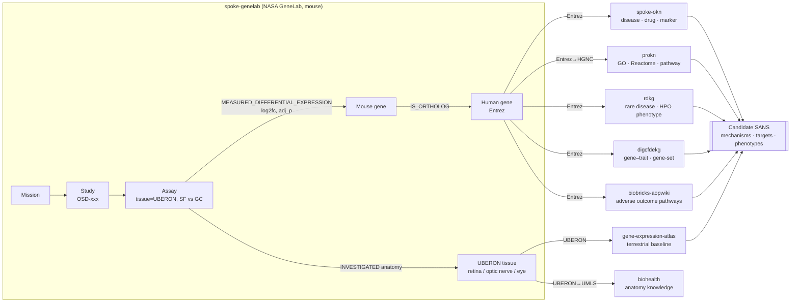

# Case-Study Design: Spaceflight-Associated Neuro-ocular Syndrome (SANS)
### A knowledge-graph–driven integrative omics study using SPOKE-GeneLab and the Proto-OKN federation

**Status:** Study *design* only — no analysis executed. All data-availability claims below were verified against the live FRINK federated SPARQL endpoint (counts current as of the KG versions in §9).
**Author aid:** Drafted from Proto-OKN knowledge graphs via the `mcp-okn` tooling.
**Date:** 2026-07-04

---

## 1. Purpose and scope

Design a reproducible, in-silico case study that uses NASA GeneLab spaceflight omics (via the **spoke-genelab** knowledge graph) integrated with the wider Proto-OKN biomedical federation to generate and prioritize molecular hypotheses for **SANS** — the neuro-ocular syndrome affecting the retina, optic nerve, and optic disc in astronauts.

This document (a) inventories exactly what eye-relevant data the knowledge graphs contain, (b) states the constraints those data impose, and (c) specifies objectives, hypotheses, cohorts, an analysis plan, and validation strategy. It deliberately stops short of running the analysis.

---

## 2. Clinical background and the translational framing

SANS is a constellation of findings in long-duration spaceflight — **optic disc edema, choroidal folds, globe flattening, hyperopic refractive shifts, retinal nerve-fiber-layer changes, and cotton-wool spots** — reported in a large fraction of astronauts on long-duration missions. It is regarded as **multifactorial**, with the most widely accepted *initiating* mechanism being the **cephalad (headward) fluid shift** under microgravity, followed by altered cerebrospinal-fluid dynamics, venous/lymphatic congestion, changes in the translaminar pressure gradient, choroidal expansion, impaired glymphatic outflow, and individual susceptibility (genetic, anatomical, one-carbon-metabolism). See §10 for sources.

**Translational framing (critical).** SANS is a *human clinical* syndrome, but the omics data available in these knowledge graphs are from **model organisms — specifically mouse** — flown on the ISS or exposed to ground analogs. The study is therefore explicitly a **cross-species, hypothesis-generating** design: mouse spaceflight differential expression → human orthologs → human disease/pathway/phenotype knowledge → candidate SANS mechanisms and targets. Any output is a prioritized hypothesis set for downstream experimental or clinical validation, not a diagnosis or a claim about astronauts.

---

## 3. Data inventory — what the KGs actually hold about the eye

### 3.1 SPOKE-GeneLab eye/ocular studies (the analytic core)

`spoke-genelab` models spaceflight omics as **Mission → Study → Assay**, where each **Assay** records the tissue (UBERON), cell type (Cell Ontology), assay technology, the experimental contrast (`factor_space_1` vs `factor_space_2`), and pre-computed **differential expression** (edge properties `log2fc`, `adj_p_value`, group means/SDs). Model-organism genes are mapped to **human orthologs** (`IS_ORTHOLOG_MGiG`), and the release also carries differential **methylation** and microbial differential **abundance** for other tissues.

Filtering all assays to eye-relevant UBERON tissues and applying the KG's **direction rule** (keep only `factor_space_1 = "Space Flight"` AND `factor_space_2 = "Ground Control"`) yields the spaceflight eye cohort below. **All eye studies are mouse (*Mus musculus*), RNA-Seq transcription profiling.**

| OSD study | Project | Tissue | UBERON | Valid SF-vs-GC assays | Model DE genes | Human orthologs |
|---|---|---|---|---:|---:|---:|
| OSD-759 | (ISS, untitled) | **optic nerve** | UBERON:0004904 | 4 | 4,333 | 4,021 |
| OSD-758 | (ISS, untitled) | **retina** | UBERON:0000966 | 4 | 1,461 | 1,366 |
| OSD-255 | Rodent Research-9 | **retina** | UBERON:0000966 | 1 | 478 | 489 |
| OSD-397 | Rodent Research 1 | **retina** | UBERON:0000966 | 1 | 208 | 214 |
| OSD-194 | Rodent Research 3 | **retina** | UBERON:0000966 | 1 | 3 | 1 |
| OSD-100 | Rodent Research 1 | **left eye** | UBERON:0004548 | 1 | 360 | 373 |
| OSD-162 | Rodent Research 3 | **eye** | UBERON:0000970 | 1 | 14 | 12 |

*(Human-ortholog counts can exceed model-gene counts because one mouse gene may map to several human genes. **The four OSD-759/OSD-758 assays are distinct gravity conditions — `uG`, `0.33G`, `0.66G`, `1G-by-centrifugation` vs `1G-on-Earth` — not replicates; they must be resolved by the comparability rule (§7), with the `uG` assay as the primary microgravity contrast, `1G-by-centrifugation` as the on-orbit 1G control, and `0.33G`/`0.66G` as a partial-gravity dose-response.** OSD-194 is near-threshold/sparse and is retained only as a minor replicate. Across the whole KG, eye tissues span ~190 assays before the direction filter — retina 162, optic nerve 20, eye 6, left eye 2 — most of which are non-SF-vs-GC contrasts, e.g. Space-Flight-vs-Space-Flight or Basal/Vivarium controls, and are excluded by the rule.)*

**Ground analog (distinct cohort):**

| OSD study | Project | Tissue | UBERON | Assays | Design |
|---|---|---|---|---:|---|
| OSD-203 | Low-dose (0.04 Gy) irradiation + hindlimb unloading in mice | **retina** | UBERON:0000966 | 132 | transcription profiling; **Hindlimb Unloaded vs Normally Loaded Control**, crossed with **Co-57 γ-irradiated vs non-irradiated** and time points **7 day / 1 month / 4 month** |

**Hindlimb unloading (HLU) is the mouse analog of the cephalad fluid shift** — the leading SANS initiating mechanism — making OSD-203 uniquely valuable for isolating the fluid-shift-attributable component of the ocular response from the radiation and true-microgravity components. It carries no `Space Flight` factor (it is ground-based), so it is analyzed on `factors_1`/`factors_2` (loading, irradiation, time), *not* the SF-vs-GC rule.

### 3.2 What is measured (and what is not)

- **Present for eye tissue:** RNA-Seq differential expression (log2 fold change, FDR-adjusted p, group means/SDs) with mouse→human ortholog mapping; tissue (UBERON) and, where annotated, cell type (CL).
- **Absent for eye tissue in the current release:** differential **methylation** (all eye assays are transcription profiling), proteomics, and any human/astronaut ocular measurement.

### 3.3 Eye-relevant context reachable across the federation

`spoke-genelab` connects to the rest of the Proto-OKN federation on three biological keys — **Entrez gene** (its human orthologs), **UBERON anatomy**, and **CL cell type**. The study leverages these to annotate the mouse eye signature with human biology. Verified join sizes (federation crosswalk table, verified 2026-06-30):

| Context to attach | KG | Join key | Verified size | What it adds to an eye gene/tissue |
|---|---|---|---:|---|
| Disease, drug, marker | **spoke-okn** | Entrez (direct) | 16,326 genes | gene→disease association, gene as favorable/unfavorable disease marker, compound **treats**/contraindicates disease, compound up/down-regulates gene |
| Pathways, GO, Reactome, phenotype | **prokn** | Entrez→HGNC (via wikidata) | ~20,783 genes | GO terms, Reactome/pathway membership, phenotype, drug, variant, cell-type marker |
| Rare disease + **HPO phenotype** + anatomy | **rdkg** | Entrez (direct) | 9,034 genes | gene→rare-disease, disease→**HPO phenotype** (e.g. ocular features), disease anatomical location, variants, treatments |
| Gene–trait / gene-set / disease | **digcfdekg** | Entrez (direct) | 19,747 genes | statistically inferred gene→trait and gene-set/disease associations (CFDE REVEAL) |
| Adverse Outcome Pathways | **biobricks-aopwiki** | Entrez (skos:exactMatch) | 1,472 genes | molecular initiating events / key events linking a gene to an adverse outcome |
| **Terrestrial baseline expression** | **gene-expression-atlas-okn** | UBERON tissue (direct) | retina = 50 records, eye = 7 records (27/42 spoke-genelab tissues shared) | ground/terrestrial expression & differential-expression for the *same* tissue |
| Anatomy knowledge | **biohealth** | UBERON→UMLS (via ubergraph) | 35/42 tissues | curated knowledge about the anatomical entity |
| Cell-type context | **gene-expression-atlas-okn / prokn** | CL cell type (direct) | 4 / 1 cell types | terrestrial single-cell expression; marker genes |

Note the asymmetry: **optic nerve (UBERON:0004904) is absent from the GXA terrestrial baseline**, whereas retina and eye are present — so tissue-matched terrestrial comparison is possible for retina/eye but not optic nerve.

### 3.4 Integration architecture



---

## 4. Constraints and gaps (design-critical)

1. **Model organism only.** All eye omics are mouse. Human relevance is *inferred* via orthologs; there is no human ocular omics and no astronaut clinical/phenotype data in the federation. Frame every result as cross-species hypothesis.
2. **The study/mission axis is a NASA-internal island.** OSD/GLDS accessions are not referenced by any other Proto-OKN KG. Only the *biological entities* (Entrez gene, UBERON anatomy, NCBITaxon) bridge out — so integration must be gene/tissue-centric, never study-centric.
3. **No eye methylation / multi-omics.** The epigenomic layer exists in spoke-genelab but not for eye tissue in this release; the design is transcriptomic.
4. **Sparse, heterogeneous flight cohort.** Seven SF-vs-GC eye studies, several with a single assay; mission duration, mouse strain, sex, age, diet, and habitat differ across studies and are incomplete confounders.
5. **Microgravity vs radiation confound.** Flight exposes animals to microgravity *and* space radiation simultaneously; the OSD-203 HLU±radiation analog is the primary lever for deconfounding.
6. **Ortholog ambiguity.** 1:many and many:1 mouse↔human mappings require an explicit collapsing rule (§6, §7).
7. **Baseline coverage asymmetry.** Terrestrial GXA baseline exists for retina/eye but not optic nerve.

---

## 5. Objectives and hypotheses

**Primary objective.** Derive a mouse ocular spaceflight transcriptional signature (retina, optic nerve, eye), translate it to human orthologs, and integrate federation knowledge to produce a **ranked list of candidate genes, pathways, and phenotypes plausibly mechanistic for SANS**.

**Secondary objectives.**
- **O2 — Tissue specificity:** identify eye-selective responses by contrasting the eye signature against non-eye spaceflight tissues (e.g. blood, liver, kidney, muscle, brain) already in spoke-genelab.
- **O3 — Fluid-shift attribution:** estimate the share of the retinal spaceflight response reproduced by HLU (fluid-shift analog, OSD-203) versus radiation/true-flight components.
- **O4 — Druggable targets & countermeasures:** surface compounds that modulate signature genes or treat the linked diseases (spoke-okn, prokn) as countermeasure candidates.
- **O5 — Phenotype anchoring:** map signature-linked HPO/clinical phenotypes (rdkg, prokn) to known SANS features (optic disc edema, choroidal/retinal changes).

**Hypotheses.**
- **H1.** A reproducible subset of ocular genes is differentially expressed across independent spaceflight eye studies, enriched for fluid-homeostasis, vascular/BRB-integrity, oxidative-stress, inflammatory, and neuronal/axonal pathways.
- **H2.** A measurable fraction of this signature is recapitulated by hindlimb unloading (fluid-shift analog), supporting a fluid-shift-driven component of the ocular molecular response.
- **H3.** Human orthologs of the signature are over-represented among genes annotated to ocular/neuro-ophthalmic disease and to phenotypes overlapping SANS (papilledema/optic disc edema, optic atrophy, retinal degeneration/vascular phenotypes).
- **H4 (exploratory).** A subset of signature genes is modulated by existing compounds, nominating repurposing candidates for countermeasure research.

> **Illustrative feasibility anchor (not a result).** Probing the **microgravity (`uG`) optic-nerve** contrast of OSD-759 — after resolving its four assays into separate gravity conditions (§3.1, §7) — returns significant ortholog-mapped hits including **Angptl7→ANGPTL7** (angiopoietin-like 7, an intraocular-pressure / glaucoma-associated gene), **Txnip→TXNIP** (oxidative stress), and **Cdkn1a→CDKN1A/p21** (cell-stress/senescence). Notably, *pooling* OSD-759's four assays **without** separating gravity levels instead surfaces large-magnitude hits such as **Ren1→REN** (renin, fluid regulation) — which illustrates precisely why the comparability step is not optional: the condition you resolve changes the signature. Shown only to demonstrate the data flow end-to-end, not as findings.

---

## 6. Design type, cohorts, and variables

**Design.** Retrospective, cross-study, integrative **in-silico meta-analysis and knowledge-graph reasoning**. No new data collection; unit of analysis is the gene (and its human ortholog), aggregated across assays/studies within a tissue.

**Cohorts / datasets.**
- **C1 — Spaceflight eye (primary):** OSD-759 (optic nerve), OSD-758/255/397/194 (retina), OSD-100 (left eye), OSD-162 (eye); SF-vs-GC assays only.
- **C2 — Fluid-shift ground analog:** OSD-203 retina (HLU vs normally-loaded, ± radiation, 3 time points).
- **C3 — Non-eye reference (specificity control):** SF-vs-GC assays in non-ocular spoke-genelab tissues, for eye-selectivity contrast.
- **C4 — Terrestrial baseline:** GXA retina/eye expression for tissue-context normalization.

**Variables.**
- *Exposure:* spaceflight (SF) vs ground control (GC); for C2, hindlimb-unloaded vs loaded and irradiated vs not.
- *Outcome:* per-gene differential expression (`log2fc`, `adj_p_value`).
- *Covariates / strata:* tissue, study, mission duration, radiation, sex, strain, age, time point (as available).
- *Annotation layers (from federation):* GO/Reactome/pathway, disease association, HPO phenotype, AOP, drug modulation, terrestrial baseline.

---

## 7. Analysis plan (step-by-step, not executed)

1. **Assemble assays.** For each C1 study, select assays with `factor_space_1="Space Flight"` and `factor_space_2="Ground Control"`; enforce the **comparability rule** (equal `material_id_1/2` and equal non-condition factors after stripping condition labels/group codes) before pooling. Record provenance (study, mission, technology).
2. **Per-tissue differential-expression signatures.** Extract `log2fc`/`adj_p_value` per gene; define significance (e.g. `adj_p ≤ 0.05`, |log2fc| ≥ chosen threshold). Produce retina, optic-nerve, and eye signatures.
3. **Ortholog projection.** Map mouse genes to human via `IS_ORTHOLOG_MGiG`; apply an explicit rule for 1:many/many:1 (e.g. keep max |log2fc|, flag ambiguity). Carry a confidence flag.
4. **Cross-study consensus.** Within a tissue, rank genes by reproducibility (recurrence across independent studies + directional consistency). This yields the H1 core signature.
5. **Tissue specificity (O2/H1).** Contrast eye signatures against C3 non-eye tissues to isolate eye-selective vs systemic spaceflight responses.
6. **Fluid-shift attribution (O3/H2).** Derive the OSD-203 HLU retina signature (loading effect, controlling irradiation/time) and quantify concordance (overlap, directional agreement, rank correlation) with the flight retina signature to estimate the fluid-shift-attributable fraction; use the radiation arm as a discriminating axis.
7. **Functional annotation.** Enrich the human signature for GO/Reactome/pathways (**prokn**) and Adverse Outcome Pathways (**biobricks-aopwiki**); prioritize fluid-homeostasis, vascular/blood-retinal-barrier, oxidative-stress, inflammatory, and axonal/neuronal processes.
8. **Disease & phenotype linkage (O5/H3).** Join the human signature to **spoke-okn** disease associations and markers, and to **rdkg** rare-disease→**HPO phenotype**→anatomy; test whether signature genes are over-represented among ocular/neuro-ophthalmic diseases and SANS-overlapping phenotypes (optic disc edema/papilledema, optic atrophy, retinal degeneration/vascular phenotypes) against a suitable background.
9. **Countermeasure/target nomination (O4/H4).** Use **spoke-okn** `TREATS_CtD` and compound→gene up/down-regulation (and prokn drug links) to nominate compounds modulating signature genes or treating linked diseases.
10. **Prioritized hypothesis set.** Integrate reproducibility, eye-selectivity, fluid-shift concordance, functional/disease/phenotype relevance, and druggability into a ranked candidate table — the study deliverable.

---

## 8. Validation, rigor, and reproducibility

- **Statistical control:** pre-registered significance thresholds; FDR already applied in-KG (`adj_p_value`); enrichment tested against explicit backgrounds (all expressed genes / all ortholog-mapped genes) with multiple-testing correction.
- **Negative/positive controls:** non-eye tissues (C3) as specificity negative control; known spaceflight-responsive stress pathways as positive control.
- **Deconfounding:** OSD-203 radiation arm and time course to separate fluid-shift, radiation, and duration effects.
- **Ortholog robustness:** sensitivity analysis under alternative 1:many collapsing rules.
- **Join integrity:** apply verified IRI-normalization for each crosswalk; report join yield vs the verified counts in §3.3; treat bridged joins (Entrez→HGNC via wikidata) as lower-confidence than direct joins.
- **Cross-species caveat propagation:** every human-level claim carried with an explicit "mouse-derived, ortholog-inferred" flag.
- **Independent literature validation:** check top candidates against the SANS/spaceflight-ophthalmology literature (§10) and, where possible, against OSDR primary data outside the KG.
- **Full reproducibility:** log every SPARQL query (the `mcp-okn` session log / `create_chat_transcript`), pin KG versions (§9), and publish queries + endpoint so the pipeline is re-runnable.

---

## 9. Methods appendix — endpoints, graphs, versions

- **Federation:** FRINK federated SPARQL endpoint; scope every pattern with `GRAPH <named_graph> { … }`.
- **KG versions used (pinned; `pav:version` / last-updated):**
  spoke-genelab **v0.0.2** (2026-03-13) · spoke-okn **v0.0.6** (2026-03-16) · rdkg **v0.0.1** (2026-05-04) · prokn **v0.0.5** (2026-06-23) · gene-expression-atlas-okn **v0.0.3** (2026-03-18) · digcfdekg **v0.0.1** (2026-06-21) · biobricks-aopwiki **v0.0.4** (2026-03-18) · biohealth **v0.0.4** (2026-03-16) · ubergraph **v0.0.2** (2026-05-01).
- **Key spoke-genelab predicates:** `CONDUCTED_MIcS` (Mission→Study), `PERFORMED_SpAS` (Study→Assay), `INVESTIGATED_ASiA` (Assay→UBERON), `INVESTIGATED_ASiCT` (Assay→CL), `MEASURED_DIFFERENTIAL_EXPRESSION_ASmMG` (reified; carries `log2fc`, `adj_p_value`, group means/SDs), `IS_ORTHOLOG_MGiG` (mouse→human gene).
- **Eye UBERON terms:** retina `UBERON:0000966`, optic nerve `UBERON:0004904`, eye `UBERON:0000970`, left eye `UBERON:0004548`.
- **Direction rule (sign convention):** with `factor_space_1="Space Flight"`, `factor_space_2="Ground Control"`, group 1 = spaceflight, so `log2fc > 0` = up in spaceflight.
- **Example SPARQL (optic-nerve SF-vs-GC signature with human ortholog):**
```sparql
PREFIX rdf: <http://www.w3.org/1999/02/22-rdf-syntax-ns#>
PREFIX schema: <https://purl.org/okn/frink/kg/spoke-genelab/schema/>
PREFIX gl: <https://purl.org/okn/frink/kg/spoke-genelab/schema/>
SELECT ?symbol ?humanSymbol ?log2fc ?adj_p_value WHERE {
  GRAPH <https://purl.org/okn/frink/kg/spoke-genelab> {
    <https://purl.org/okn/frink/kg/spoke-genelab/node/OSD-759> gl:PERFORMED_SpAS ?assay .
    ?assay schema:factor_space_1 "Space Flight" ;
           schema:factor_space_2 "Ground Control" .
    ?stmt rdf:subject ?assay ;
          rdf:predicate gl:MEASURED_DIFFERENTIAL_EXPRESSION_ASmMG ;
          rdf:object ?gene ;
          schema:log2fc ?log2fc ; schema:adj_p_value ?adj_p_value .
    ?gene schema:symbol ?symbol .
    FILTER(?adj_p_value <= 0.05)
    OPTIONAL { ?gene gl:IS_ORTHOLOG_MGiG ?h . ?h schema:symbol ?humanSymbol }
  }
} ORDER BY DESC(ABS(?log2fc))
```

---

## 10. Sources

SANS clinical/mechanistic background:
- [Navigating the Unknown: A Comprehensive Review of Spaceflight-Associated Neuro-Ocular Syndrome (PMC10907968)](https://pmc.ncbi.nlm.nih.gov/articles/PMC10907968/)
- [SANS: connections with terrestrial eye and brain disorders — Frontiers in Ophthalmology, 2024](https://www.frontiersin.org/journals/ophthalmology/articles/10.3389/fopht.2024.1487992/full) ([PMC11525009](https://pmc.ncbi.nlm.nih.gov/articles/PMC11525009/))
- [SANS: potential etiologies and connections to the glymphatic system — J Neurophysiol, 2024](https://journals.physiology.org/doi/full/10.1152/jn.00056.2024)
- [SANS and the neuro-ophthalmologic effects of microgravity: review and update — npj Microgravity, 2020](https://www.nature.com/articles/s41526-020-0097-9)
- [SANS: proposed pathogenesis, terrestrial analogues, and emerging countermeasures (PMC10359702)](https://pmc.ncbi.nlm.nih.gov/articles/PMC10359702/)
- [Spaceflight-Associated Neuro-Ocular Syndrome — EyeWiki](https://eyewiki.org/Spaceflight-Associated_Neuro-Ocular_Syndrome_(SANS))

Data: NASA Open Science Data Repository / GeneLab (OSDR), surfaced through the `spoke-genelab` KG and the Proto-OKN FRINK federation.
