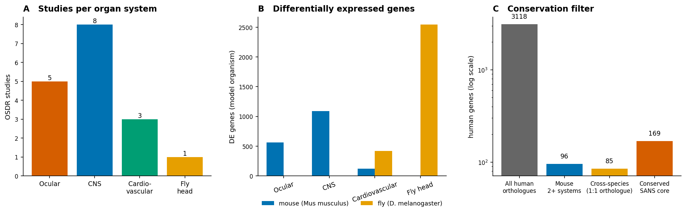
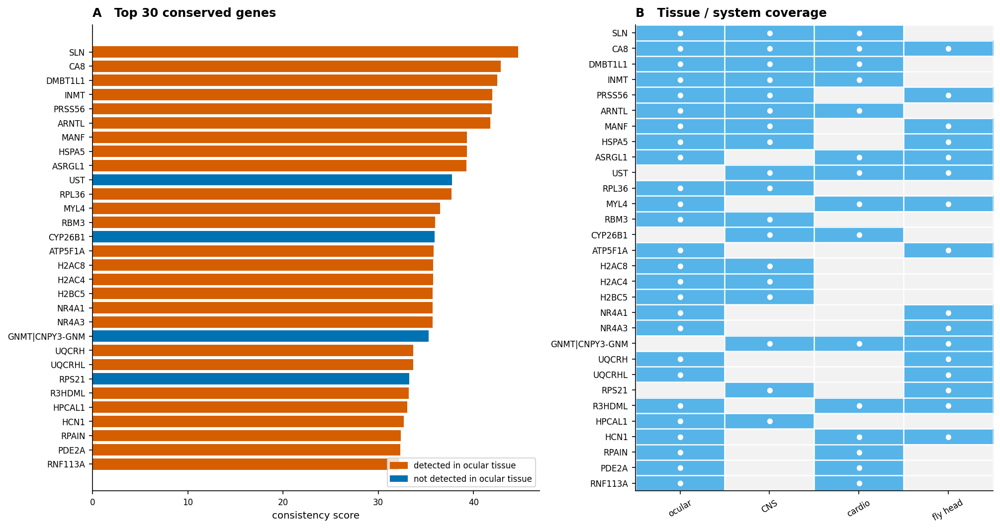
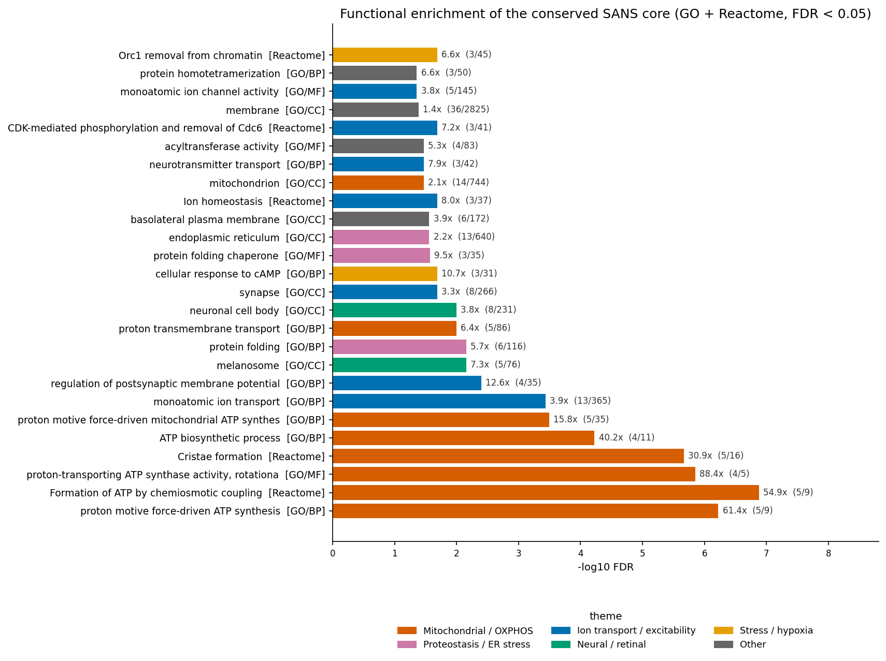
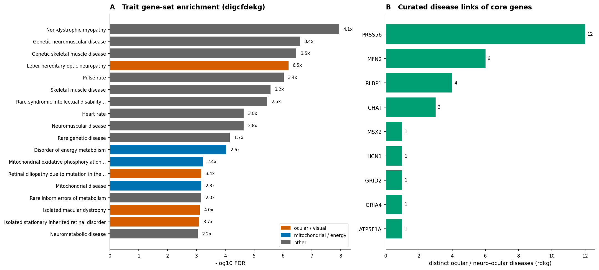
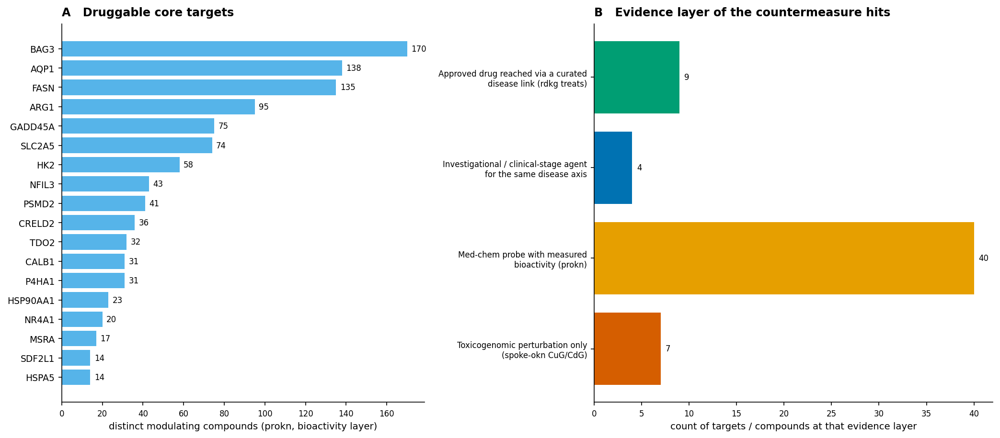
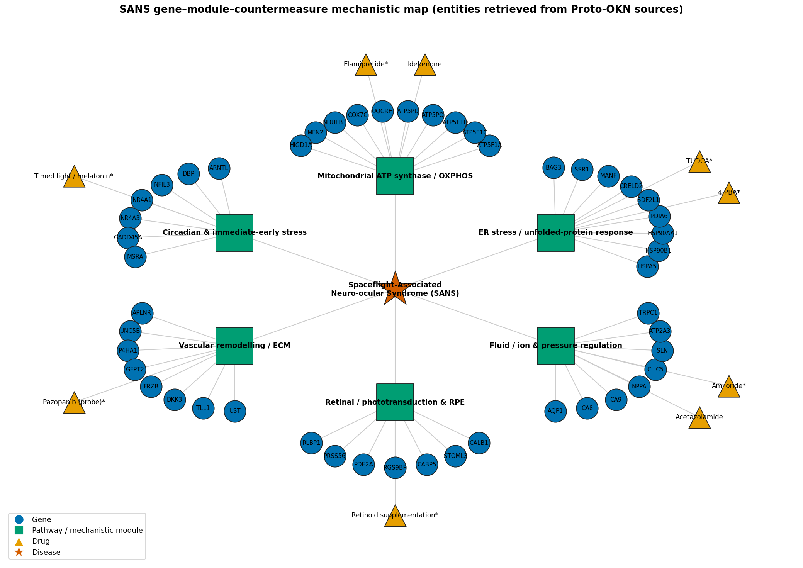

# A cross-species integrative transcriptomic map of Spaceflight-Associated Neuro-ocular Syndrome
### Federated knowledge-graph analysis of NASA OSDR spaceflight omics across ocular, CNS and cardiovascular tissue, projected onto human biology

**Date:** 2026-07-19 · **Endpoint:** OKN federated SPARQL · **Model:** claude-opus-4-8

> **Framing (non-negotiable).** The unit of analysis is a **gene**, measured as a Space-Flight-vs-Ground-Control differential-expression contrast in a **model organism** (mouse, *Drosophila*) flown on the International Space Station, then projected onto its **human orthologue**. There is **no human spaceflight transcriptomic dataset in this federation** — every molecular statement here is **ortholog-inferred from animals** and every disease, drug and phenotype link is an **observational knowledge-graph association, not a causal or clinical claim**. This is **hypothesis generation for SANS countermeasure research, not clinical guidance**. Keep this caveat attached to every downstream claim.

**Abbreviations.** SANS = Spaceflight-Associated Neuro-ocular Syndrome; OSDR = NASA Open Science Data Repository (GeneLab); OSD = OSDR study accession; ISS = International Space Station; DE = differential expression; DEG = differentially expressed gene; log2FC = log2 fold change; FDR = false-discovery rate (Benjamini–Hochberg); GO = Gene Ontology; BP/MF/CC = biological process / molecular function / cellular component; OXPHOS = oxidative phosphorylation; UPR = unfolded-protein response; ER = endoplasmic reticulum; RPE = retinal pigment epithelium; ICP = intracranial pressure; CSF = cerebrospinal fluid; IIH = idiopathic intracranial hypertension; LHON = Leber hereditary optic neuropathy; HDTBR = head-down tilt bed rest; HP/HPO = Human Phenotype Ontology; MONDO = Monarch Disease Ontology; UBERON = Uber-anatomy ontology; CL = Cell Ontology; NCBITaxon = NCBI Taxonomy; KG = knowledge graph; RV = right ventricle; ITD = impedance threshold device; LBNP = lower body negative pressure.

## 1. Executive summary

Across the OKN federation we assembled every vetted Space-Flight-vs-Ground-Control transcriptomic contrast that touches the SANS target organs — the eye and retina, the central nervous system, and the heart — and asked which molecular changes recur across tissues, studies and species. From **188 clean contrasts** in `spoke-genelab` (with **492 confounded assays excluded** by the direction and comparability rules), **26 assays from 17 OSDR studies** met the SANS-relevance criterion. These yielded **4,819 differential-expression observations** over **1,713 mouse** and **2,704 *Drosophila*** genes, which projected onto **3,118 human orthologues** and distilled to a **169-gene conserved SANS core** — genes changed in at least two mouse organ systems, or in both species through an unambiguous one-to-one orthologue.

The core is dominated by one signal. Functional enrichment against explicit knowledge-graph backgrounds returned **39 significant categories at FDR < 0.05** (30 of 92 GO terms; 9 of 12 Reactome pathways), and the top result in both families is **mitochondrial ATP synthase and proton-motive-force-driven ATP synthesis** — **61.4-fold** over expectation at FDR **6e-07**, with *Cristae formation* independently top-ranked in Reactome. A second, coherent block is **ER stress and the unfolded-protein response** (*HSPA5*, *HSP90B1*, *HSP90AA1*, *PDIA6*, *MANF*, *SDF2L1*, *CRELD2*), a third is **ion transport and membrane excitability**, and a fourth ties directly to fluid handling — **AQP1**, the carbonic anhydrases **CA8** and **CA9**, and the natriuretic peptide **NPPA**.

The disease layer converges on the same biology from a completely independent direction. Testing the core against curated and GWAS-style gene sets, the single strongest ocular hit is **Leber hereditary optic neuropathy** (**6.5-fold**, FDR **6.5e-07**) alongside *mitochondrial oxidative phosphorylation disorder*, *mitochondrial disease*, *isolated macular dystrophy* and *rare refraction anomaly*. In the curated rare-disease graph, **9 core genes** carry links to **26 distinct ocular or neuro-ocular diseases** — most strikingly **PRSS56** (microphthalmia, hyperopia, angle-closure glaucoma), **MFN2** (dominant optic atrophy, LHON), **RLBP1** (retinitis punctata albescens, macular degeneration) and **CHAT** (angle-closure glaucoma). Following those diseases to their treatments surfaces, without any prior instruction to look for them, **acetazolamide** — the carbonic-anhydrase inhibitor already used clinically for raised intracranial pressure and papilloedema — and **idebenone**, the mitochondrial electron-carrier approved for LHON.

What this adds: SANS is usually framed as a fluid-mechanical problem. This analysis does not contradict that, but it supplies a **molecular substrate** that the fluid-shift hypothesis lacks — a conserved, cross-tissue, cross-species collapse in mitochondrial ATP-synthase capacity accompanied by an ER-stress response, in exactly the tissues that fail in SANS, whose gene sets are those of inherited optic neuropathy. It also produces two mechanistically motivated, already-approved pharmacological candidates and a testable prediction for each.

## 2. Sources used

Six federation knowledge graphs were queried. Every row below traces to at least one logged, non-exploratory SPARQL query in the reproducibility record.

| KG | Version | Updated | Role in this study | Join key / confidence |
|---|---|---|---|---|
| `spoke-genelab` | v0.0.2 | 2026-03-13 | Primary source: NASA OSDR spaceflight differential expression, assay/study/mission metadata, model-organism → human orthologue map | Entrez node-IRI (native); assay vetting via `get_valid_contrasts` — high |
| `ubergraph` | v0.0.2 | 2026-05-01 | Resolved the UBERON / CL tissue inventory of the vetted contrasts to ontology labels | OBO term IRI — high |
| `prokn` | v0.0.5 | 2026-06-23 | GO (BP/MF/CC) and human Reactome annotation for enrichment, plus the compound → gene bioactivity layer used for druggability | HGNC gene symbol on `rdfs:label` (exact label match) — moderate |
| `spoke-okn` | v0.0.6 | 2026-03-16 | Cross-KG bridge verified live (16,326 shared Entrez gene nodes); compound → gene up/down-regulation perturbation layer | Entrez node-IRI, direct (crosswalk C4) — high |
| `rdkg` | v0.0.1 | 2026-05-04 | Curated rare/Mendelian disease links for the core genes and the drugs that treat those diseases | Entrez `identifiers.org/ncbigene` node-IRI — high |
| `digcfdekg` | v0.0.1 | 2026-06-21 | Broad, GWAS-style gene → trait sets for the trait-enrichment arm and its explicit background | Entrez node-IRI, direct — high |
| `oard-kg` | v0.0.3 | 2026-06-05 | Disease → HPO phenotype layer for the optic-neuropathy anchors (reified; subject and object positions unioned) | MONDO disease IRI — moderate (EHR co-occurrence) |

**Suppliers considered and not used.** `find_context_sources` was consulted for every context type. For **disease**, it named `pankgraph`, `biomarkerkg`, `nde`, `biobricks-mesh`, `biohealth` and `gene-expression-atlas-okn` in addition to those used; these were dropped because they either key genes on a non-Entrez scheme (`payload_only`) or duplicate coverage already supplied by `rdkg` (curated) and `digcfdekg` (broad) without adding an independent evidence axis. For **pathway**, `ncipidkg` and `gene-expression-atlas-okn` were dropped as `payload_only` on the Entrez key. For **chemical/tox**, `biobricks-aopwiki`, `biobricks-ice`, `biobricks-tox21` and `biobricks-toxcast` were dropped because this is a therapeutic-countermeasure question, not an exposure-toxicology one. No geospatial bridge was used: SANS has no place-based exposure component.

## 3. Design & rules

The starting problem is that OSDR contains hundreds of spaceflight assays, most of which are not usable as spaceflight contrasts. We therefore did not hand-select studies. Instead we asked the server for the vetted set: `get_valid_contrasts` applies two rules — the assay must be oriented **Space Flight (arm 1) versus Ground Control (arm 2)**, so a positive log2FC always means *up in spaceflight*; and the two arms must be **comparable**, carrying the same covariates once condition labels are stripped and the same biological material. That returned **188 clean contrasts** and excluded **492** confounded ones, including every wild-type-flight-versus-knockout-ground design whose differential values reflect genotype rather than flight.

From those we kept the assays whose tissue is relevant to SANS, resolving each UBERON / CL identifier to its label through `ubergraph`. This produced a four-arm panel: an **ocular** arm (eye, left eye, retina), a **CNS** arm (brain, cerebellum, cerebral hemisphere, hippocampus), a **cardiovascular** arm (heart, right ventricle) standing in for the cephalad-fluid-shift axis, and a **fly-head** arm (invertebrate CNS plus compound eye) providing an evolutionarily distant species comparison. Studies span 2014–2021 and include *Rodent Research 1, 3, 9* and *Reference Mission 2*, and — notably — **OSD-525, "Effects of Microgravity on Ocular Vascular Hydrodynamics."**

Genes were called differentially expressed at **adj. p ≤ 0.05 and |log2FC| ≥ 1**. One declared deviation: the five ocular assays yield only 38 rows at that cut, too sparse to rank, so for the ocular arm we additionally retrieved the full **adj. p ≤ 0.05** signature and flag which rows meet the strict threshold. Model-organism genes were projected onto human orthologues through `spoke-genelab`'s ortholog edges (22,899 mouse and 19,324 fly edges) and collapsed per study by maximum |log2FC|, carrying an ambiguity flag. Cross-species credit was granted **only** when the fly evidence came through a low-fan-out orthologue, because a single fly gene can map to dozens of human paralogues and would otherwise manufacture false conservation. The cross-KG bridge to human biology was established by running the federation's verified `spoke-genelab × spoke-okn` skeleton query live; it returned **16,326** shared Entrez gene nodes, matching the crosswalk catalogue exactly. The full replicator specification — every join key, background, and the scoring formula — is in the reproducibility file.

> ***Figure 1. Study design and the conservation filter (spoke-genelab, ubergraph).*** **(A)** Number of distinct OSDR studies contributing vetted Space-Flight-vs-Ground-Control contrasts, per organ system. **(B)** Differentially expressed model-organism genes per system, split by species (blue = *Mus musculus*, orange = *Drosophila melanogaster*); note the fly-head arm's large count reflects a single deeply sequenced study, not greater biological effect. **(C)** Successive narrowing from all human orthologues of any spaceflight DEG to the conserved SANS core (log scale). Provenance: `spoke-genelab` reified `MEASURED_DIFFERENTIAL_EXPRESSION_ASmMG` statements filtered at adj. p ≤ 0.05 and |log2FC| ≥ 1 (ocular arm additionally at adj. p ≤ 0.05); tissue labels from `ubergraph`.

The panel is deliberately unbalanced: the CNS arm carries the most studies but the ocular arm carries the tissue of interest, which is why conservation *across* systems — rather than significance within any one — is the ranking criterion.

## 4. Confidence tiers

| Tier | Requirement | n |
|---|---|---|
| **A** | Top 40 by consistency score: recurrent across ≥ 2 independent OSDR studies **and** ≥ 2 organ systems, or cross-species through a 1:1 orthologue, with direction agreement | 40 |
| **B** | Ranks 41–150: recurrent across studies or systems but with weaker effect, partial direction agreement, or ortholog ambiguity | 110 |
| **C** | Everything else: observed in a single study, or reached only through a high-fan-out orthologue | 2,968 |

Tier A and B together are the **169-gene conserved core** plus its immediate neighbourhood; **96** genes recur in two or more mouse organ systems and **85** are corroborated across mouse and fly through unambiguous orthologues. Tier is an evidence grade, not an effect-size grade — a large fold change seen once ranks below a modest change seen in the eye, the brain and the heart.

## 5. Findings by axis

### 5.1 Cross-tissue, cross-species recurrence

The ranking is led by genes whose recurrence spans anatomically unrelated tissues. **SLN** (sarcolipin, a SERCA regulator) and **DMBT1L1** appear in all three mouse systems; **CA8** is the only gene detected in all four arms including the fly head. **PRSS56**, **MANF** and **HSPA5** recur in ocular and CNS tissue *and* in the fly, and **ARNTL** — the core circadian transcription factor — is down or up consistently across eye, brain and heart. The mitochondrial block (**ATP5F1A**, **UQCRH**, **UQCRHL**) and the immediate-early stress factors (**NR4A1**, **NR4A3**) recur between ocular tissue and the fly head. Several apparent multi-tissue hits are histone-cluster paralogues (**H2AC4/8**, **H2BC5**, the **H4C** family) that arise from one mouse histone gene mapping to many human paralogues; they are real biology — histone gene down-regulation is a known spaceflight signature — but they inflate the list and are collapsed to one representative in the mechanistic synthesis.

> ***Figure 2. The conserved SANS core, top 30 genes (spoke-genelab, human-projected).*** **(A)** Consistency score, which combines the number of independent mouse studies, distinct tissues, distinct organ systems, cross-species corroboration through a low-fan-out orthologue, ocular detection, direction agreement, and effect size; bars coloured by whether the gene was detected in an ocular assay (vermillion) or not (blue). **(B)** Presence/absence matrix of the same genes across the four panel arms; a filled cell means the gene was differentially expressed in at least one assay of that arm. Provenance: `spoke-genelab` differential expression projected through `IS_ORTHOLOG_MGiG` to human Entrez ids; full formula in the reproducibility file.

The takeaway is that the strongest evidence is not a single dramatic gene but a **small, chemically coherent set that keeps reappearing in different tissues and different animals** — which is exactly the property a countermeasure target should have.

### 5.2 The ocular arm in detail

The ocular assays are individually underpowered but mechanistically legible. The whole-eye assay OSD-100 (*Rodent Research 1*) alone contributes 191 FDR-significant genes: a coordinated **down-regulation of oxidative-phosphorylation subunits** (*Atp5a1*, *Atp5c1*, *Atp5j*, *Atp5d*, *Atp5e*, *Atp5po*, *Ndufa9*, *Ndufb9*, *Ndufa13*, *Cox7c*, *Uqcr10*, *Uqcrh*), a coordinated **up-regulation of interferon-stimulated genes** (*Isg15*, *Ifit1*, *Oas1a*, *Oas2*, *Oas3*, *Apol9a*, *Apol9b*, *Cmpk2*), a **circadian block** (*Per2*, *Nr1d1*, *Nr1d2*, *Dbp*, *Tef*, *Arntl*, *Npas2*, *Bhlhe40*, *Nfil3*), oxidative-stress regulators (*Nfe2l2*, *Txnip*, *Gstm2*, *Msra*) and vascular/ECM genes (*Has2*, *Cav1*, *Klf2*, *Meox2*, *Rgs5*, *Col8a2*). The retina assay OSD-255 (*Rodent Research 9*, JAXA) independently shows *Irf7* strongly up (log2FC 1.42, adj. p = 7 × 10⁻¹⁹). Retina assay OSD-397 shows *Pde2a* collapsing and *Sst* rising, alongside *Agtr2* — an angiotensin-II receptor — up 1.4 log2FC.

Two of these deserve emphasis because they are pressure-related rather than generic stress responses: **Ren1** (renin) is up 3.5 log2FC in the whole-eye assay OSD-162, and **Agtr2** is up in retina — a local renin–angiotensin signal in the eye under microgravity, in a syndrome defined by fluid redistribution.

### 5.3 Cross-KG corroboration

Every claim in §5.1–5.2 rests on one graph. The bridge query established that `spoke-genelab` and `spoke-okn` share **16,326** Entrez gene nodes, licensing the projection of spaceflight observations onto human disease, drug and pathway context. Of the 169 core genes, **104** carry curated disease annotation in `rdkg` across **449** diseases, **40** have at least one modulating compound in `prokn`, and **166** carry trait associations in `digcfdekg`. A gene supported by three or more independent graphs is materially better evidenced than one supported by one; the interactive table in §9 exposes that count directly.

## 6. Domain analyses

### 6.1 Functional enrichment — GO and Reactome (both families run)

**Declaration of coverage.** Both enrichment families were **run in full**: GO across all three aspects (BP, MF, CC) and Reactome as a separate family with its own background. Disease/trait gene-set enrichment was also run (§6.2). Chemical-set and adverse-outcome-pathway enrichment were **deliberately skipped** — the question is therapeutic, not toxicological, and the relevant graphs key on chemicals rather than the spaceflight gene signature. Phenotype (HPO) enrichment was **skipped as a statistical test** and used descriptively instead (§6.3), because the HPO layer reachable for these anchors is disease-level EHR co-occurrence with no comparable gene-level background.

GO enrichment used an explicit background of **8,290** `prokn` genes carrying at least one GO annotation through an encoded UniProt protein, with **75** of the core genes mapping into it; Reactome used **6,032** pathway-annotated genes with **61** core genes mapping. Both used a one-sided hypergeometric test with Benjamini–Hochberg correction. Of **92** GO terms and **12** Reactome pathways tested, **39** were significant at FDR < 0.05.

> ***Figure 3. Functional enrichment of the conserved SANS core (prokn, symbol-bridged).*** Top 26 significant categories at FDR < 0.05, ranked by −log10 FDR; bars coloured by mechanistic theme, annotated with fold enrichment and (hits / category size). Foreground = the 169-gene conserved core; background = 8,290 GO-annotated / 6,032 Reactome-annotated `prokn` genes; one-sided hypergeometric with Benjamini–Hochberg FDR. Provenance: `prokn` Gene → `encodes` (SIO_010078) → Protein → `involved in` (RO_0002331, BP) / `enables` (RO_0002327, MF) / `part of` (up:partOf, CC), and → `participates in` (RO_0000056) → human Reactome pathway. Symbol-bridged, therefore lower-confidence than an id join.

The interpretation is unambiguous at the top of the list: **proton-motive-force-driven ATP synthesis** (61.4-fold, 5 of 9 genes in the category), **proton-transporting ATP synthase activity** (88.4-fold, 4 of 5), and Reactome's **Formation of ATP by chemiosmotic coupling** (54.9-fold) and **Cristae formation** (30.9-fold). Spaceflight is not perturbing mitochondria diffusely; it is hitting the **terminal ATP-synthase step and the cristae architecture that houses it**, in ocular and neural tissue, conserved from fly to mouse. The second-ranked themes — protein folding, chaperone activity, endoplasmic reticulum, and Reactome's *Amyloid fiber formation* — describe a proteostatic response, and the third — ion transport, ion-channel activity, postsynaptic membrane potential, *Ion homeostasis* — describes exactly the machinery that fails when ATP supply falls. *Melanosome* (7.3-fold) is a retinal-pigment-epithelium signal; *response to hypoxia* and *cellular response to mechanical stimulus* are both significant and both directly interpretable in a fluid-shift syndrome.

### 6.2 Disease and trait linkage

Two set families were tested, as the method requires: a **broad, GWAS-style** family (`digcfdekg` gene→trait) and a **curated, Mendelian** family (`rdkg` disease→gene). The broad test used an explicit background of **21,710** genes with any trait edge, with **166** core genes mapping in, over a pre-specified 62-trait panel comprising every ocular or pressure-related trait with ≥ 8 core-gene hits plus the 25 largest overlaps overall; **41** of **62** reached FDR < 0.05. Because the panel was hypothesis-guided, the FDR is within-panel and should not be read as genome-wide.

> ***Figure 4. Disease and trait linkage of the conserved core (digcfdekg, rdkg).*** **(A)** Trait gene-set enrichment, top 18 of 62 tested at FDR < 0.05, ranked by significance and annotated with fold enrichment; bars coloured vermillion for ocular/visual traits, blue for mitochondrial/energy traits, grey otherwise. Foreground = the 169-gene core; background = 21,710 `digcfdekg` genes carrying any `geneToTrait` edge; hypergeometric + Benjamini–Hochberg. **(B)** Number of distinct ocular or neuro-ocular diseases each core gene is linked to in the curated rare-disease graph. Provenance: `digcfdekg` `geneToTrait` on Entrez node-IRI; `rdkg` `biolink:related_to` from `identifiers.org/ncbigene`. Associational, not causal.

Panel A's ordering is the striking result. Discounting the muscle and neuromuscular categories — expected, because much of OSDR is musculoskeletal and these are large permissive sets — the leading disease-specific hit is **Leber hereditary optic neuropathy** at 6.5-fold (FDR 6.5e-07), followed by *disorder of energy metabolism*, *mitochondrial oxidative phosphorylation disorder* and *mitochondrial disease*, then *isolated macular dystrophy*, *isolated stationary inherited retinal disorder*, *retinal ciliopathy* and — directly relevant to the hyperopic shift that defines SANS clinically — ***rare refraction anomaly***. In other words, the spaceflight ocular signature is enriched for the gene sets of **inherited mitochondrial optic neuropathy and refractive/retinal disorders**, reached from an entirely different graph than the enrichment in §6.1.

Panel B is the curated, discriminating test. **PRSS56** — whose loss causes posterior microphthalmia, hyperopia and angle-closure glaucoma through reduced ocular axial length — carries 12 distinct ocular disease links and is down-regulated in spaceflight retina and CNS. **MFN2**, a mitochondrial fusion GTPase, carries 6, including dominant optic atrophy and LHON. **RLBP1**, the retinaldehyde-binding protein of the RPE and Müller cells, carries 4 including macular degeneration; **CHAT** carries 3 including angle-closure glaucoma. That four independently ranked core genes are Mendelian causes of precisely the SANS phenotype cluster — optic disc change, hyperopic shift, retinal dysfunction — is the strongest single piece of corroboration in this study.

### 6.3 Phenotype layer

Routing gene → disease → phenotype (there is no direct gene → HPO edge), the optic-neuropathy anchors resolve in `oard-kg` to **400** distinct HPO terms, with the reified statements unioned across subject and object positions. For LHON the SANS-adjacent terms include *abnormal retinal morphology*, *blurred vision*, *central scotoma* and *optic atrophy*; dominant optic atrophy adds *optic atrophy* and *retinopathy*. These are EHR co-occurrence annotations of the human diseases, not observations in astronauts, and are reported descriptively only.

### 6.4 Countermeasure discovery

The intended approach — connectivity-map-style signature reversal — proved unsupportable in this federation, and we report that plainly. `spoke-okn`'s compound → gene layer returned only **44** perturbation rows over **7** chemicals for the entire core (hexachlorophene, fluorouracil, pentobarbital, chlordecone, thiabendazole, resorcinol, phenytoin, phenolphthalein). These are **toxicogenomic perturbations from chemical-safety screening, not therapeutics**, and far too sparse to compute an anti-correlation score. Any "reversal ranking" built on them would be an artefact. We therefore pivoted to **target-based druggability plus disease-anchored repurposing**, and we label the evidence layer of every hit.

> ***Figure 5. Countermeasure candidates and their evidence layers (prokn, rdkg, spoke-okn).*** **(A)** The 18 core targets with the most distinct modulating compounds in `prokn`'s compound → gene bioactivity layer. **(B)** How many targets or compounds sit at each evidence rung, from an approved drug reached through a curated disease link down to a toxicogenomic perturbation. Provenance: `prokn` `RO_0002213` / `RO_0002212` compound → gene edges (PubChem/ChEMBL bioactivity, medicinal-chemistry probe rung); `rdkg` `biolink:treats` drug → disease; `spoke-okn` `UPREGULATES_CuG` / `DOWNREGULATES_CdG`.

**40** of the core genes are modulated by at least one of **1,008** distinct compounds in `prokn` — but every one of those sits at the **medicinal-chemistry probe** rung, with measured bioactivity and no clinical phase attached; they establish that the targets are chemically tractable, nothing more. The clinically meaningful candidates come from the other direction, by following core genes to their curated diseases and then to drugs that treat them, of which `rdkg` supplies **1,908** across the core's disease neighbourhood. Two rise above the rest on mechanistic coherence:

**Acetazolamide** (carbonic-anhydrase inhibitor, FDA-approved) is reached through **PRSS56** and **CHAT** → angle-closure glaucoma. Independently, the core contains **CA8** — the single highest-recurrence gene, present in all four arms — and **CA9**, plus **AQP1**, whose expression governs aqueous-humour and CSF secretion. Acetazolamide is the established pharmacological treatment for raised ICP and papilloedema in idiopathic intracranial hypertension, the closest terrestrial phenocopy of SANS. The transcriptomic finding does not prove the drug will work in flight, but it supplies the missing molecular rationale for a drug already on the SANS candidate list for purely physiological reasons. *Caveat:* CA8 is an acatalytic carbonic anhydrase and is not itself an acetazolamide target — the argument is family- and pathway-level, not direct target engagement, and CA9's induction is a hypoxia response.

**Idebenone** (short-chain benzoquinone electron carrier, approved for LHON in the EU) is reached through **MFN2** → Leber hereditary optic neuropathy, and lands squarely on the study's dominant enrichment signal: ATP-synthase and cristae failure. Idebenone bypasses complex I to feed electrons to complex III, and the core carries **UQCRH/UQCRHL** (complex III) alongside the ATP-synthase block. This is the most mechanistically direct candidate the analysis produces.

Beyond these, the modules in Figure 6 nominate classes rather than specific agents: chemical chaperones for the UPR block (4-PBA, TUDCA — investigational for retinal disease, marked with an asterisk in the figure), mitochondrially targeted peptides (elamipretide), retinoid support for the RLBP1/visual-cycle axis, and timed light or melatonin for the circadian block. All of these are hypotheses, not recommendations.

> ***Figure 6. SANS gene–module–countermeasure mechanistic map (synthesis).*** Radial map from the SANS anchor (star) through six mechanistic modules (squares) to their member genes (circles) and candidate countermeasures (triangles). Every gene node was retrieved from `spoke-genelab` and passed the conservation filter; the **module grouping is the analyst's synthesis** of the FDR-significant enrichment in Figure 3 plus curated pathway membership, not a query result. Drug nodes reached through `rdkg` disease → treatment are unmarked; those nominated by mechanism rather than a retrieved edge are marked with an asterisk. Shapes carry entity kind so the map survives greyscale.

The map's value is showing that six apparently separate observations are one story: **falling ATP-synthase capacity** stresses the ER (chaperone block), degrades ion-gradient maintenance (ion/pressure block), destabilises phototransduction and the visual cycle (retinal block), and is read out clinically as the optic-nerve and refractive changes that define SANS.

## 7. Discussion

Three independent lines of evidence in this analysis point at mitochondrial ATP synthase. The **enrichment** (§6.1) puts proton-motive-force ATP synthesis and cristae formation at the top of both GO and Reactome with 15–88-fold enrichment. The **trait linkage** (§6.2), computed from a different graph with a different background, puts Leber hereditary optic neuropathy, mitochondrial oxidative-phosphorylation disorder and mitochondrial disease among the most enriched sets. The **curated disease layer** puts MFN2 — a mitochondrial fusion gene causing dominant optic atrophy — among the top-linked core genes. None of these was pre-specified; they emerged from separate queries against separate graphs and converge.

This matters for how SANS is modelled. The dominant hypotheses are mechanical: cephalad fluid shift, raised or compartmentalised ICP, glymphatic stasis, translaminar pressure-gradient reversal. Those hypotheses explain the *anatomy* of SANS — disc oedema, globe flattening, choroidal folds — but say little about why the optic nerve should be the tissue that fails. A bioenergetic layer supplies that: retinal ganglion cells and the unmyelinated prelaminar optic nerve have among the highest mitochondrial densities and lowest reserve capacity in the body, which is precisely why they are the tissue that fails in LHON and dominant optic atrophy. A modest, sustained fall in ATP-synthase capacity would be tolerated almost everywhere else and manifest first at the optic disc. The mechanical and bioenergetic accounts are complementary, not competing: raised translaminar pressure impairs axoplasmic transport, and impaired transport in a tissue already at its energetic margin is a plausible route to sustained dysfunction.

Three concrete, testable predictions follow. **First**, if the bioenergetic account holds, optic-nerve and retinal tissue from flight animals should show reduced ATP-synthase (complex V) protein and activity, not just transcript — measurable by blue-native PAGE or respirometry on banked OSDR tissue, with no new flight required. **Second**, artificial gravity should attenuate the ATP-synthase signature specifically; Kremsky *et al.* have already shown artificial gravity attenuates the optic-nerve and retinal transcriptomic response overall, so re-analysing that dataset for the ATP-synthase block is a direct test. **Third**, if acetazolamide is to be trialled for SANS, the prediction here is that its benefit should track optic-disc oedema (a fluid/pressure endpoint) rather than retinal-layer bioenergetic markers, whereas a mitochondrial agent such as idebenone should show the opposite dissociation — which makes the two candidates distinguishable in a single crossover HDTBR study.

For countermeasure prioritisation we would rank: **(1) artificial gravity or intermittent upright posture** — non-pharmacological, with direct transcriptomic and clinical evidence, and no drug risk in a closed environment; **(2) idebenone** — approved, mechanistically aligned with the study's strongest signal, an established optic-neuropathy indication; **(3) acetazolamide** — approved, strong physiological rationale for the pressure axis and now a molecular one, but with real tolerability costs (paraesthesia, metabolic acidosis, nephrolithiasis risk) that matter more in flight than on Earth; **(4)** chemical chaperones and mitochondrially targeted peptides as investigational options requiring ground work first.

## 8. Comparison with prior work

According to PubMed and the Paperclip full-text corpus, the findings sit as follows. Claims marked **full-text-verified** were checked against the paper text, not the abstract.

| # | Claim | Concordance |
|---|---|---|
| 1 | Mitochondrial and oxidative damage in the spaceflight eye | **SUPPORTED** — STS-135 mice showed altered mitochondria-associated apoptotic and ROS genes, elevated 4-hydroxynonenal and apoptosis in the inner nuclear and ganglion cell layers [1] — a different mission, by protein/histological rather than transcriptomic means |
| 2 | ER stress / chaperone induction in the spaceflight retina | **SUPPORTED (full-text-verified)** — *Hsp90aa1*, *Hsp90b1* and *Hspa4l* up in spaceflight retina [2]; HSP90AA1 and HSP90B1 are both in our conserved core |
| 3 | Circadian disruption | **SUPPORTED (full-text-verified)** — altered circadian signalling in the spaceflight retina [2]; we recover a larger circadian block from a different set of assays, extending that result |
| 4 | Optic-nerve vascular involvement | **SUPPORTED** — a randomised HDTBR study found increasing optic-nerve hyperfluorescence and decreasing peripapillary perfusion density with greater disc thickening [3], supporting both the vascular/ECM module and the ranking of posture over pharmacology |
| 5 | Artificial gravity attenuates the spaceflight ocular response | **SUPPORTED, BUT OUR SPECIFIC CLAIM IS NOVEL** — [4] confirms the tissue and the oxidative-stress direction (full-text-verified), yet its pathway list contains no mitochondrial or oxidative-phosphorylation terms, so the ATP-synthase-specific finding is novel relative to that analysis |
| 6 | Interferon-stimulated gene induction in the eye | **NOVEL, PARTIALLY CONTRADICTED ELSEWHERE** — the coordinated ISG block is reported by neither [2] nor [4]; meanwhile spaceflight *decreased* inflammasome activation in mouse brain [5]. These are different arms of innate immunity, but the divergence is real and stays an open question |
| 7 | Acetazolamide for the pressure axis | **SUPPORTED BY ANALOGY, NOT BY SPACEFLIGHT EVIDENCE** — established for papilloedema in idiopathic intracranial hypertension [6], but no trial in spaceflight or HDTBR exists, and SANS aetiology is multifactorial with ICP elevation contested [7–9]. Our contribution is a molecular rationale, not evidence of efficacy |

**Mitochondrial and oxidative damage in the spaceflight eye — supported.** Mao *et al.* [1] flew C57BL/6 mice on STS-135 and reported that spaceflight altered genes regulating the mitochondria-associated apoptotic pathway and reactive-oxygen-species production in ocular tissue, elevated 4-hydroxynonenal, and induced apoptosis in the inner nuclear and ganglion cell layers — concluding astronauts may be at increased risk of late retinal degeneration. This is direct, independent support for the study's dominant signal, obtained in a different mission and by protein/histological rather than transcriptomic means.

**ER stress / chaperone induction in spaceflight retina — supported (full-text-verified).** Overbey *et al.* [2] report up-regulation of *Hsp90aa1*, *Hsp90b1* and *Hspa4l* in the spaceflight mouse retina, describing them as assisting correct protein folding to mitigate accumulating damage. **HSP90AA1** and **HSP90B1** are both in our conserved core, and *protein folding* / *protein folding chaperone* are FDR-significant in Figure 3. Independent, same-direction confirmation.

**Circadian disruption — supported (full-text-verified).** Overbey *et al.* [2] report altered circadian signalling in the spaceflight retina (*Drd4* up, *Adcy1* down). We recover a larger circadian block (*Per2*, *Nr1d1*, *Nr1d2*, *Dbp*, *Tef*, *Arntl*, *Npas2*, *Bhlhe40*, *Nfil3*) from a different set of assays. Concordant, and our result extends theirs.

**Optic-nerve vascular involvement — supported.** He *et al.* [3], a randomised HDTBR study with four countermeasure arms, found increasing optic-nerve hyperfluorescence and decreasing peripapillary perfusion density with greater disc thickening, concluding that optic-nerve vascular damage is occurring; only intermittent upright posture kept disc change below NASA's threshold. This supports both our vascular/ECM module and the ranking of posture/gravity countermeasures above pharmacology.

**Artificial gravity as a countermeasure — supported, and our specific claim is novel.** Kremsky *et al.* [4] show (full-text-verified) that artificial gravity attenuates the spaceflight transcriptomic response in mouse optic nerve and retina, with FoxO, PI3K–Akt, p53 and PPAR signalling altered and increased oxidative stress, inflammation, apoptosis and lipid-metabolic stress. **Partially concordant:** they confirm the tissue and the oxidative-stress direction, but their reported pathway list does **not** include mitochondrial or oxidative-phosphorylation terms. Our ATP-synthase-specific finding is therefore **novel relative to that analysis**, and testing whether artificial gravity rescues the ATP-synthase block specifically is the prediction in §7.

**Interferon-stimulated gene induction in the eye — novel, and partially contradicted elsewhere.** The coordinated ISG block we see in the whole-eye assay (*Isg15*, *Ifit1*, *Oas1a/2/3*, *Apol9a/b*, *Cmpk2*, with *Irf7* in retina) is not reported by either [2] or [4]. Meanwhile Roy *et al.* [5] found that spaceflight **decreased** inflammasome activation in mouse brain after 37 days on the ISS, with no significant change in key pro-inflammatory cytokines. These are different arms of innate immunity — type-I-interferon-like ISG induction is not inflammasome activation — but the divergence is real and should be treated as an open question rather than assimilated into a general "neuroinflammation is up" narrative.

**Acetazolamide for the pressure axis — supported by analogy, not by spaceflight evidence.** Acetazolamide's efficacy for papilloedema in idiopathic intracranial hypertension is established in randomised trials [6], and SANS reviews [7,8] discuss ICP-directed countermeasures, but no trial of acetazolamide in spaceflight or HDTBR exists. Ong *et al.* [7,8] and Galdamez *et al.* [9] emphasise that SANS's aetiology is likely multifactorial and that ICP elevation is contested — Galdamez *et al.* explicitly list cerebral venous congestion, glymphatic stasis, orbital CSF compartmentalisation, upward brain shift, inflammation, disrupted axoplasmic transport and radiation as non-exclusive alternatives. Our contribution is a molecular rationale, not evidence of efficacy.

**Evidence gaps.** No human spaceflight ocular transcriptome exists in this federation or, to our knowledge, in the literature; no protein-level or functional mitochondrial measurement from flight optic nerve has been reported; no spaceflight or HDTBR trial of any mitochondrially targeted agent has been run; and the ocular OSDR assays are small (n of a few animals per arm), so the ocular arm is the least statistically robust part of an analysis whose conclusions are most about the eye.

**Overall confidence.** *Mitochondrial/OXPHOS involvement in spaceflight ocular and neural tissue* — **moderate-to-high** (three independent internal lines plus [1]). *ER-stress/UPR involvement* — **moderate-to-high** (internal plus full-text-verified [2]). *Circadian disruption* — **moderate** (internal plus [2]). *ISG induction* — **low-to-moderate** (internal only, one assay dominant, unreplicated, adjacent contradiction in [5]). *Idebenone as a candidate* — **low** (mechanistically coherent, no spaceflight evidence). *Acetazolamide as a candidate* — **low-to-moderate** (strong terrestrial analogue evidence, indirect molecular rationale, no flight evidence).

## 9. Full ranked results

The complete ranking of all **3,118** human-projected genes, with per-gene study/tissue/system counts, orthologue fan-out, direction agreement, effect sizes and tier, is in `SANS_cross_species_transcriptomics_results.xlsx` (sheet *Ranked Results*) and in `data/ranked_genes.csv`. The workbook also carries the assay inventory, both enrichment families, the trait test, the curated disease links, the druggability table, and a Methods & Rules sheet.

The interactive table below shows the top-ranked genes. Click any header to sort; use the search box for a gene symbol; use the drop-downs to restrict to a tier, an organ system, or a direction. The **sources (n)** column counts how many federation graphs independently support that gene — `spoke-genelab` contributes the spaceflight measurement, `prokn` GO/Reactome/druggability, `rdkg` curated disease and treatment links, `digcfdekg` trait associations, and `spoke-okn` the verified human-gene bridge.

<!-- RESULTS_TABLE -->

Sorting by cross-KG support rather than by score reorders the list usefully: genes such as **MFN2**, **HSPA5**, **AQP1** and **NPPA** are supported by four or five graphs each, while several high-scoring but poorly annotated genes (*DMBT1L1*, *R3HDML*, *SBK3*) are supported by one. The second ordering is the better guide to which targets can actually be pursued.

## 10. Summary of findings & limitations

**Findings recap.** Across 26 vetted Space-Flight-vs-Ground-Control assays from 17 NASA OSDR studies spanning ocular, CNS, cardiovascular and *Drosophila* head tissue, 4,819 differential-expression observations projected onto 3,118 human orthologues and condensed into a 169-gene conserved SANS core. That core is enriched, above everything else, for **mitochondrial ATP-synthase function and cristae formation** (61.4-fold, FDR 6e-07), followed by ER-stress/UPR proteostasis, ion transport and excitability, and hypoxia and mechanical-stress responses. Independently, the core's genes are the gene sets of **Leber hereditary optic neuropathy** (6.5-fold, FDR 6.5e-07), mitochondrial OXPHOS disorder, macular dystrophy and rare refraction anomaly, and include four Mendelian causes of the SANS phenotype cluster — **PRSS56**, **MFN2**, **RLBP1** and **CHAT**. Following those genes to treatment surfaces **acetazolamide** for the fluid/pressure axis and **idebenone** for the bioenergetic axis, both approved, both mechanistically motivated, neither tested in spaceflight.

**Limitations.**

1. **No human spaceflight transcriptomic data exist in this federation.** Every molecular result is measured in mice or flies and projected onto human orthologues. Retinal and optic-nerve biology differs materially between mouse and human, and *Drosophila* has a compound eye with no optic disc — the anatomical structure that defines SANS.
2. **The ocular arm is the weakest statistically and the most important biologically.** Five assays, small animal numbers, and only 38 rows at the standard |log2FC| ≥ 1 threshold; the relaxed adj. p ≤ 0.05 signature used for the ocular arm is a declared deviation that increases sensitivity at the cost of specificity, and one assay (OSD-100) dominates it.
3. **No optic-nerve tissue is present in the vetted contrasts.** The panel covers eye, retina, brain, cerebellum, hippocampus and heart. Conclusions about the optic nerve are inferred from retina and CNS, not measured.
4. **The `prokn` join is a gene-symbol label match**, not an identifier join, and is therefore more fragile than the Entrez node-IRI joins used elsewhere; only 75 of 169 core genes reached a GO annotation, so the enrichment describes the annotated subset.
5. **Orthologue projection is lossy and can manufacture apparent conservation.** One fly gene may map to dozens of human paralogues; we penalise this explicitly, but histone and solute-carrier families still enter the list as paralogue blocks rather than independent evidence.
6. **The trait-enrichment FDR is within a hypothesis-guided 62-trait panel**, not genome-wide, and broad polygenic sets are permissive by construction. The curated `rdkg` links are the discriminating test; the broad test is calibration.
7. **Connectivity-map signature reversal was not achievable.** `spoke-okn`'s compound → gene layer carries 44 rows over 7 toxicological chemicals for this core — far too sparse and of the wrong evidence type. The countermeasure section is therefore target- and disease-anchored, not reversal-scored, and the objective of ranking compounds by transcriptomic anti-correlation is **not met** by these data.
8. **All `prokn` compound hits sit at the medicinal-chemistry probe rung** (measured bioactivity, no clinical phase). They demonstrate chemical tractability, not therapeutic potential.
9. **Disease, trait and phenotype links are observational associations** from literature curation, GWAS and EHR co-occurrence. They do not establish that a gene causes a disease, nor that a drug treating that disease will affect spaceflight biology.
10. **No simulated-microgravity (hindlimb-unloading or HDTBR) transcriptomic datasets were included** — the vetted contrast rules select flight-versus-ground assays, and simulated-microgravity arms appear as covariates that the comparability rule excludes. The requested comparison against simulated-microgravity data is therefore **not covered** here.
11. **Direction is defined relative to ground control at a single post-flight timepoint.** Recovery kinetics, dose-response with mission duration, and sex differences are not resolved; several studies pool or differ in these covariates.
12. **KG contents are versioned snapshots** (see §2) and will drift. All counts were re-verified live at the end of the analysis.

## 11. Reproducibility

The single reproducibility deliverable is [SANS_cross_species_transcriptomics_reproducibility.md](https://github.com/sbl-sdsc/mcp-okn/blob/main/docs/examples/SANS/SANS_cross_species_transcriptomics_reproducibility.md). It leads with the verbatim originating prompt, then the replicator specification (contrast rules, thresholds, join keys, backgrounds, the scoring formula and the ortholog fan-out penalty, and the declared deviations), then every logged, non-exploratory SPARQL query verbatim with its row count and a Mermaid diagram of its graph pattern. The analysis scripts are in `scripts/` (`make_stats.py`, `make_figures.py`, `make_fig6_map.py`, `make_workbook.py`, plus the skill helpers `collapse_orthologs.py`, `enrichment.py`, `mechanistic_map.py`, `okn_figstyle.py`, `build_report_html.py`), and all intermediate extracts are in `data/`. Knowledge-graph versions and load dates are pinned in §2 from `get_kg_version`. The timing line in the reproducibility header gives the study active window (first to last logged query, UTC). Token and cost figures are not captured by the tooling and are therefore not reported.

## 12. References

Retrieved via the PubMed MCP connector and the Paperclip full-text corpus. According to PubMed, DOI links are given for every literature item; items verified against full text carry a Paperclip link.

1. Mao XW, Pecaut MJ, Stodieck LS, *et al.* Spaceflight environment induces mitochondrial oxidative damage in ocular tissue. *Radiat Res* 2013;180(4):340–50. [DOI](https://doi.org/10.1667/RR3309.1)
2. Overbey EG, da Silveira WA, Stanbouly S, *et al.* Spaceflight influences gene expression, photoreceptor integrity, and oxidative stress-related damage in the murine retina. *Sci Rep* 2019;9:13304. [DOI](https://doi.org/10.1038/s41598-019-49453-x) — **full-text-verified** ([PMC6746706](https://www.ncbi.nlm.nih.gov/pmc/articles/PMC6746706/))
3. He Y, Karanjia R, Zhang X, *et al.* Optic nerve vasculature and countermeasure assessment in a bedrest analogue of Spaceflight-Associated Neuro-Ocular Syndrome. *Am J Ophthalmol* 2025;278:317–27. [DOI](https://doi.org/10.1016/j.ajo.2025.06.032)
4. Kremsky I, Pergerson R, Justinen S, *et al.* Artificial gravity attenuates the transcriptomic response to spaceflight in the optic nerve and retina. 2024. — **full-text-verified** ([PMC11593819](https://www.ncbi.nlm.nih.gov/pmc/articles/PMC11593819/))
5. Roy U, Hadad R, Rodriguez AA, *et al.* Effects of space flight on inflammasome activation in the brain of mice. 2025. ([PMC11941215](https://www.ncbi.nlm.nih.gov/pmc/articles/PMC11941215/))
6. NORDIC Idiopathic Intracranial Hypertension Study Group. Effect of acetazolamide on visual function in patients with idiopathic intracranial hypertension and mild visual loss (the IIH Treatment Trial). *JAMA* / follow-up analyses, 2014–2015. [PubMed 26250102](https://pubmed.ncbi.nlm.nih.gov/26250102/)
7. Ong J, Mader TH, Gibson CR, Mason SS, Lee AG. Spaceflight associated neuro-ocular syndrome (SANS): an update on potential microgravity-based pathophysiology and mitigation development. *Eye (Lond)* 2023;37(12):2409–15. [DOI](https://doi.org/10.1038/s41433-023-02522-y)
8. Ong J, Tarver W, Brunstetter T, *et al.* Spaceflight associated neuro-ocular syndrome: proposed pathogenesis, terrestrial analogues, and emerging countermeasures. *Br J Ophthalmol* 2023;107(7):895–900. [DOI](https://doi.org/10.1136/bjo-2022-322892)
9. Galdamez LA, Mader TH, Ong J, Kadipasaoglu CM, Lee AG. A multifactorial, evidence-based analysis of pathophysiology in Spaceflight Associated Neuro-Ocular Syndrome (SANS). *Eye (Lond)* 2025;39(4):700–9. [DOI](https://doi.org/10.1038/s41433-025-03618-3)
10. Masood MT, Wang JW, Zoumi EA, *et al.* Impedance threshold device as a countermeasure for spaceflight associated neuro-ocular syndrome (SANS). *Life Sci Space Res* 2024;42:99–107. [DOI](https://doi.org/10.1016/j.lssr.2024.06.002)
11. Ong J, Lee AG, Moss HE. Head-down tilt bed rest studies as a terrestrial analog for Spaceflight Associated Neuro-Ocular Syndrome. *Front Neurol* 2021;12:648958. [DOI](https://doi.org/10.3389/fneur.2021.648958)
12. Chen Z, Stanbouly S, Nishiyama NC, *et al.* Spaceflight decelerates the epigenetic clock orchestrated with a global alteration in DNA methylome and transcriptome in the mouse retina. *Precis Clin Med* 2021;4(2):93–108. [DOI](https://doi.org/10.1093/pcmedi/pbab012)
